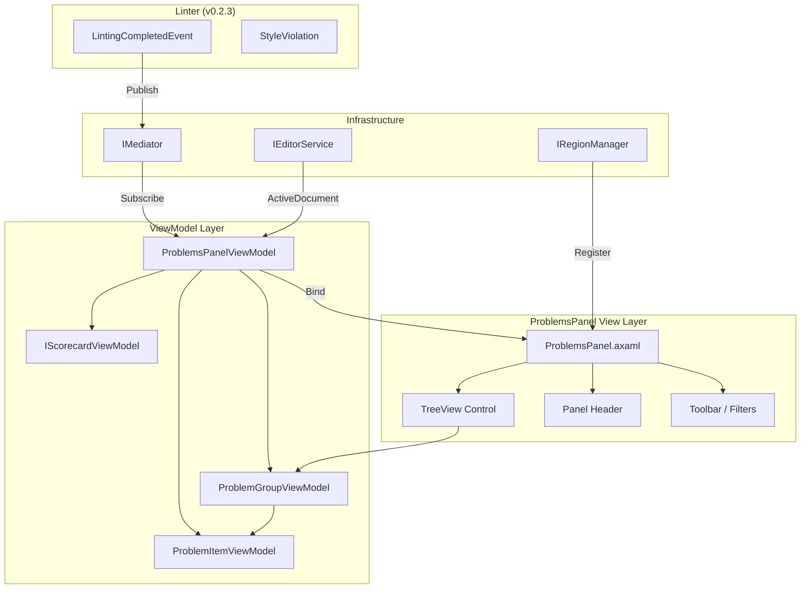
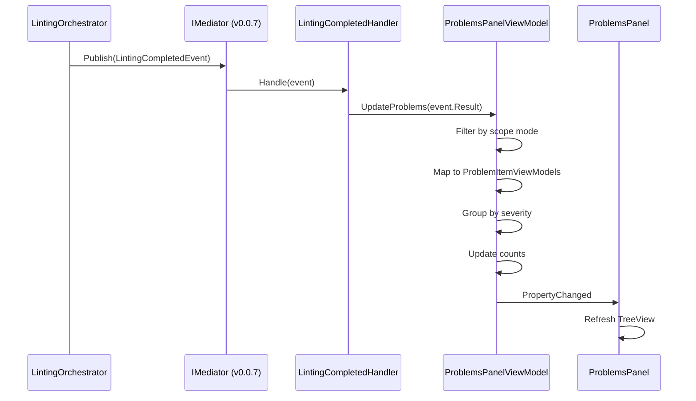

# LCS-INF-026a: Sub-Part Specification — Problems Panel

## 1. Metadata & Categorization

| Field                | Value                                               | Description                                |
| :------------------- | :-------------------------------------------------- | :----------------------------------------- |
| **Sub-Part ID**      | `INF-026a`                                          | Problems Panel sidebar view                |
| **Parent Feature**   | `INF-026` (Sidebar Real-Time Feedback)              | Main feature specification                 |
| **Target Version**   | `v0.2.6a`                                           | First sub-part of v0.2.6                   |
| **Module Scope**     | `Lexichord.Modules.Style`                           | Style governance module                    |
| **License Tier**     | `Core`                                              | Foundation (Available in Free tier)        |
| **Author**           | System Architect                                    |                                            |
| **Status**           | **Draft**                                           | Pending implementation                     |
| **Last Updated**     | 2026-01-26                                          |                                            |

---

## 2. Executive Summary

### 2.1 The Requirement

Writers need a centralized, VS Code-style Problems Panel that displays all style violations in one place. The current inline squiggly underlines (v0.2.4) help identify individual issues, but writers have no way to:

- See all violations at a glance
- Understand the total count by severity
- Prioritize which issues to address first
- Review violations without scrolling through the entire document

### 2.2 The Proposed Solution

We **SHALL** implement a Problems Panel that:

1. Displays as a dockable sidebar in the Bottom region
2. Shows a grouped list of all style violations
3. Updates in real-time when `LintingCompletedEvent` fires
4. Provides severity-based grouping with counts
5. Supports sorting by severity, file, or position

---

## 3. Architecture

### 3.1 Component Diagram



### 3.2 Event Subscription Flow



### 3.3 Dependencies

| Component | Source | Usage |
|:----------|:-------|:------|
| `LintingCompletedEvent` | v0.2.3d | Primary data source |
| `StyleViolation` | v0.2.3a | Violation data model |
| `ViolationSeverity` | v0.2.3a | Severity enum |
| `IMediator` | v0.0.7a | Event subscription |
| `IRegionManager` | v0.1.1b | Panel registration |
| `IEditorService` | v0.1.3 | Active document access |

---

## 4. Decision Tree

```text
START: "LintingCompletedEvent received"
|
+-- Is Problems Panel initialized?
|   +-- NO -> Log warning, exit
|   +-- YES -> Continue
|
+-- Check current scope mode
|   +-- CurrentFile mode
|   |   +-- Is event.DocumentId == ActiveDocumentId?
|   |       +-- NO -> Ignore event (not for current file)
|   |       +-- YES -> Replace all violations
|   +-- OpenFiles mode
|   |   +-- Is event.DocumentId in open documents?
|   |       +-- NO -> Ignore event
|   |       +-- YES -> Merge/update violations for document
|   +-- Project mode
|       +-- Always accept -> Update cached violations
|
+-- Transform violations
|   +-- For each StyleViolation:
|       +-- Create ProblemItemViewModel
|       +-- Set DocumentName from path
|       +-- Set severity icon/color
|
+-- Group violations
|   +-- Create groups by severity (Error, Warning, Info)
|   +-- Sort groups: Errors first, then Warnings, then Info
|   +-- Sort items within groups by line number
|
+-- Update counts
|   +-- TotalCount = all items
|   +-- ErrorCount = severity == Error
|   +-- WarningCount = severity == Warning
|   +-- InfoCount = severity == Info
|
+-- Notify Scorecard
|   +-- Scorecard.Update(ErrorCount, WarningCount, InfoCount)
|
+-- Notify UI
|   +-- OnPropertyChanged(nameof(ProblemGroups))
|   +-- OnPropertyChanged(nameof(AllProblems))
|   +-- OnPropertyChanged(nameof(TotalCount))
|
END
```

---

## 5. Data Contracts

### 5.1 ProblemsPanelViewModel Implementation

```csharp
namespace Lexichord.Modules.Style.ViewModels;

using System;
using System.Collections.Generic;
using System.Collections.ObjectModel;
using System.Linq;
using System.Threading;
using System.Threading.Tasks;
using System.Windows.Input;
using CommunityToolkit.Mvvm.ComponentModel;
using CommunityToolkit.Mvvm.Input;
using Lexichord.Abstractions.Contracts;
using Lexichord.Abstractions.Events;
using MediatR;
using Microsoft.Extensions.Logging;

/// <summary>
/// ViewModel for the Problems Panel sidebar.
/// </summary>
/// <remarks>
/// LOGIC: ProblemsPanelViewModel manages the collection of problems
/// displayed in the sidebar. It subscribes to LintingCompletedEvent
/// via MediatR and transforms violations into displayable view models.
///
/// Responsibilities:
/// 1. Subscribe to LintingCompletedEvent via INotificationHandler
/// 2. Filter violations based on current scope mode
/// 3. Group violations by severity (CurrentFile) or file+severity (OpenFiles/Project)
/// 4. Calculate and maintain violation counts
/// 5. Coordinate with ScorecardViewModel for score updates
/// 6. Execute navigation commands when user double-clicks
///
/// Thread Safety:
/// - Handle() may be called on background thread
/// - All UI updates marshal to dispatcher via ObservableProperty
/// - Collection updates use ReplaceRange for atomic updates
/// </remarks>
public partial class ProblemsPanelViewModel : ObservableObject,
    IProblemsPanelViewModel,
    INotificationHandler<LintingCompletedEvent>
{
    private readonly IEditorService _editorService;
    private readonly IEditorNavigationService _navigationService;
    private readonly IProjectLintingService _projectLintingService;
    private readonly ILogger<ProblemsPanelViewModel> _logger;
    private readonly Dictionary<string, IReadOnlyList<StyleViolation>> _violationsByDocument = new();
    private CancellationTokenSource? _scopeChangeCts;

    /// <summary>
    /// Gets the hierarchical collection of problems for TreeView binding.
    /// </summary>
    public ObservableCollection<ProblemGroupViewModel> ProblemGroups { get; } = new();

    /// <summary>
    /// Gets the flat list of all problems.
    /// </summary>
    IReadOnlyList<ProblemGroupViewModel> IProblemsPanelViewModel.ProblemGroups => ProblemGroups;

    /// <summary>
    /// Gets all problems as a flat list.
    /// </summary>
    public IReadOnlyList<ProblemItemViewModel> AllProblems =>
        ProblemGroups.SelectMany(g => g.Items).ToList();

    /// <summary>
    /// Gets the total count of all problems.
    /// </summary>
    [ObservableProperty]
    [NotifyPropertyChangedFor(nameof(HasProblems))]
    private int _totalCount;

    /// <summary>
    /// Gets the error count.
    /// </summary>
    [ObservableProperty]
    private int _errorCount;

    /// <summary>
    /// Gets the warning count.
    /// </summary>
    [ObservableProperty]
    private int _warningCount;

    /// <summary>
    /// Gets the info count.
    /// </summary>
    [ObservableProperty]
    private int _infoCount;

    /// <summary>
    /// Gets whether there are any problems.
    /// </summary>
    public bool HasProblems => TotalCount > 0;

    /// <summary>
    /// Gets or sets the current scope mode.
    /// </summary>
    [ObservableProperty]
    private ProblemScopeMode _scopeMode = ProblemScopeMode.CurrentFile;

    /// <summary>
    /// Gets or sets the selected problem item.
    /// </summary>
    [ObservableProperty]
    private ProblemItemViewModel? _selectedProblem;

    /// <summary>
    /// Gets the Scorecard ViewModel.
    /// </summary>
    public IScorecardViewModel Scorecard { get; }

    /// <summary>
    /// Gets whether the panel is loading.
    /// </summary>
    [ObservableProperty]
    private bool _isLoading;

    /// <summary>
    /// Gets the progress percentage (0-100).
    /// </summary>
    [ObservableProperty]
    private double _progress;

    /// <summary>
    /// Command to navigate to the selected violation.
    /// </summary>
    public ICommand NavigateToViolationCommand { get; }

    /// <summary>
    /// Command to refresh all problems.
    /// </summary>
    public ICommand RefreshCommand { get; }

    /// <summary>
    /// Command to clear all problems.
    /// </summary>
    public ICommand ClearCommand { get; }

    /// <summary>
    /// Initializes a new instance of ProblemsPanelViewModel.
    /// </summary>
    public ProblemsPanelViewModel(
        IEditorService editorService,
        IEditorNavigationService navigationService,
        IProjectLintingService projectLintingService,
        IScorecardViewModel scorecard,
        ILogger<ProblemsPanelViewModel> logger)
    {
        _editorService = editorService ?? throw new ArgumentNullException(nameof(editorService));
        _navigationService = navigationService ?? throw new ArgumentNullException(nameof(navigationService));
        _projectLintingService = projectLintingService ?? throw new ArgumentNullException(nameof(projectLintingService));
        Scorecard = scorecard ?? throw new ArgumentNullException(nameof(scorecard));
        _logger = logger ?? throw new ArgumentNullException(nameof(logger));

        NavigateToViolationCommand = new AsyncRelayCommand(
            NavigateToSelectedViolationAsync,
            () => SelectedProblem is not null);

        RefreshCommand = new AsyncRelayCommand(RefreshAsync);
        ClearCommand = new RelayCommand(Clear);

        _logger.LogInformation("Problems Panel initialized with scope {Scope}", ScopeMode);
    }

    /// <summary>
    /// Handles the LintingCompletedEvent.
    /// </summary>
    /// <remarks>
    /// LOGIC: Called by MediatR when linting completes.
    /// Filters based on scope mode before updating UI.
    /// </remarks>
    public Task Handle(LintingCompletedEvent notification, CancellationToken cancellationToken)
    {
        var result = notification.Result;
        _logger.LogInformation(
            "Received LintingCompletedEvent for {DocumentId}: {ViolationCount} violations",
            result.DocumentId,
            result.Violations.Count);

        // LOGIC: Filter based on scope mode
        switch (ScopeMode)
        {
            case ProblemScopeMode.CurrentFile:
                if (result.DocumentId != _editorService.ActiveDocumentId)
                {
                    _logger.LogDebug("Ignoring event for non-active document in CurrentFile mode");
                    return Task.CompletedTask;
                }
                break;

            case ProblemScopeMode.OpenFiles:
                if (!_editorService.OpenDocuments.Any(d => d.Id == result.DocumentId))
                {
                    _logger.LogDebug("Ignoring event for closed document in OpenFiles mode");
                    return Task.CompletedTask;
                }
                break;

            case ProblemScopeMode.Project:
                // Accept all events in project mode
                break;
        }

        // Store violations for this document
        _violationsByDocument[result.DocumentId] = result.Violations;

        // Update UI
        UpdateProblemsFromCache();

        return Task.CompletedTask;
    }

    /// <summary>
    /// Updates problems based on the current cache.
    /// </summary>
    public void UpdateProblems(
        IReadOnlyList<StyleViolation> violations,
        string documentId,
        string documentName)
    {
        _violationsByDocument[documentId] = violations;
        UpdateProblemsFromCache();
    }

    private void UpdateProblemsFromCache()
    {
        // LOGIC: Get all violations based on scope
        var allViolations = ScopeMode switch
        {
            ProblemScopeMode.CurrentFile => GetCurrentFileViolations(),
            ProblemScopeMode.OpenFiles => GetOpenFilesViolations(),
            ProblemScopeMode.Project => GetProjectViolations(),
            _ => Array.Empty<StyleViolation>()
        };

        // Clear and rebuild groups
        ProblemGroups.Clear();

        // LOGIC: Group by severity
        var groupedBySeverity = allViolations
            .GroupBy(v => v.Severity)
            .OrderBy(g => g.Key); // Error (0), Warning (1), Info (2)

        foreach (var severityGroup in groupedBySeverity)
        {
            var group = new ProblemGroupViewModel(
                key: severityGroup.Key.ToString(),
                displayName: $"{severityGroup.Key}s",
                icon: GetSeverityIcon(severityGroup.Key));

            foreach (var violation in severityGroup.OrderBy(v => v.Line))
            {
                var documentName = GetDocumentName(violation.DocumentId);
                group.Items.Add(new ProblemItemViewModel(violation, documentName));
            }

            ProblemGroups.Add(group);
        }

        // Update counts
        TotalCount = allViolations.Count;
        ErrorCount = allViolations.Count(v => v.Severity == ViolationSeverity.Error);
        WarningCount = allViolations.Count(v => v.Severity == ViolationSeverity.Warning);
        InfoCount = allViolations.Count(v => v.Severity == ViolationSeverity.Info);

        // Update scorecard
        Scorecard.Update(ErrorCount, WarningCount, InfoCount);

        _logger.LogDebug(
            "Updating problems list: {Count} items in {Groups} groups",
            TotalCount,
            ProblemGroups.Count);
    }

    private IReadOnlyList<StyleViolation> GetCurrentFileViolations()
    {
        var activeId = _editorService.ActiveDocumentId;
        return _violationsByDocument.TryGetValue(activeId ?? "", out var violations)
            ? violations
            : Array.Empty<StyleViolation>();
    }

    private IReadOnlyList<StyleViolation> GetOpenFilesViolations()
    {
        return _violationsByDocument
            .Where(kvp => _editorService.OpenDocuments.Any(d => d.Id == kvp.Key))
            .SelectMany(kvp => kvp.Value)
            .ToList();
    }

    private IReadOnlyList<StyleViolation> GetProjectViolations()
    {
        return _projectLintingService.GetCachedViolations();
    }

    private string GetDocumentName(string documentId)
    {
        var doc = _editorService.GetDocument(documentId);
        return doc?.Title ?? System.IO.Path.GetFileName(documentId);
    }

    private static string GetSeverityIcon(ViolationSeverity severity) => severity switch
    {
        ViolationSeverity.Error => "M12,2C17.53,2 22,6.47 22,12C22,17.53 17.53,22 12,22C6.47,22 2,17.53 2,12C2,6.47 6.47,2 12,2M15.59,7L12,10.59L8.41,7L7,8.41L10.59,12L7,15.59L8.41,17L12,13.41L15.59,17L17,15.59L13.41,12L17,8.41L15.59,7Z",
        ViolationSeverity.Warning => "M13,14H11V10H13M13,18H11V16H13M1,21H23L12,2L1,21Z",
        ViolationSeverity.Info => "M13,9H11V7H13M13,17H11V11H13M12,2A10,10 0 0,0 2,12A10,10 0 0,0 12,22A10,10 0 0,0 22,12A10,10 0 0,0 12,2Z",
        _ => "M12,2A10,10 0 0,0 2,12A10,10 0 0,0 12,22A10,10 0 0,0 22,12A10,10 0 0,0 12,2Z"
    };

    partial void OnScopeModeChanged(ProblemScopeMode oldValue, ProblemScopeMode newValue)
    {
        _logger.LogDebug("Scope changed from {OldScope} to {NewScope}", oldValue, newValue);

        // Cancel any in-progress scope change
        _scopeChangeCts?.Cancel();
        _scopeChangeCts = new CancellationTokenSource();

        _ = OnScopeModeChangedAsync(newValue, _scopeChangeCts.Token);
    }

    private async Task OnScopeModeChangedAsync(ProblemScopeMode newScope, CancellationToken cancellationToken)
    {
        try
        {
            IsLoading = true;

            switch (newScope)
            {
                case ProblemScopeMode.CurrentFile:
                    UpdateProblemsFromCache();
                    break;

                case ProblemScopeMode.OpenFiles:
                    var multiResult = await _projectLintingService.LintOpenDocumentsAsync(cancellationToken);
                    foreach (var kvp in multiResult.ViolationsByDocument)
                    {
                        _violationsByDocument[kvp.Key] = kvp.Value;
                    }
                    UpdateProblemsFromCache();
                    break;

                case ProblemScopeMode.Project:
                    // Project linting initiated by user via separate action
                    UpdateProblemsFromCache();
                    break;
            }
        }
        catch (OperationCanceledException)
        {
            _logger.LogDebug("Scope change cancelled");
        }
        finally
        {
            IsLoading = false;
        }
    }

    private async Task NavigateToSelectedViolationAsync()
    {
        if (SelectedProblem is null) return;

        await _navigationService.NavigateToViolationAsync(
            SelectedProblem.Violation,
            TimeSpan.FromSeconds(2));
    }

    /// <inheritdoc />
    public async Task RefreshAsync(CancellationToken cancellationToken = default)
    {
        _logger.LogInformation("Manual refresh requested");
        await OnScopeModeChangedAsync(ScopeMode, cancellationToken);
    }

    private void Clear()
    {
        _logger.LogInformation("Clearing all problems");
        _violationsByDocument.Clear();
        ProblemGroups.Clear();
        TotalCount = 0;
        ErrorCount = 0;
        WarningCount = 0;
        InfoCount = 0;
        Scorecard.Reset();
    }
}
```

### 5.2 LintingCompletedHandler

```csharp
namespace Lexichord.Modules.Style.Handlers;

using Lexichord.Abstractions.Events;
using MediatR;
using Microsoft.Extensions.Logging;

/// <summary>
/// MediatR handler that forwards LintingCompletedEvent to ProblemsPanelViewModel.
/// </summary>
/// <remarks>
/// LOGIC: This handler is registered with DI and automatically receives
/// all LintingCompletedEvent notifications. It forwards them to the
/// Problems Panel for processing.
///
/// Note: The ProblemsPanelViewModel also implements INotificationHandler,
/// but this handler allows for additional processing if needed (e.g., metrics).
/// </remarks>
public class LintingCompletedHandler : INotificationHandler<LintingCompletedEvent>
{
    private readonly IProblemsPanelViewModel _problemsPanel;
    private readonly ILogger<LintingCompletedHandler> _logger;

    public LintingCompletedHandler(
        IProblemsPanelViewModel problemsPanel,
        ILogger<LintingCompletedHandler> logger)
    {
        _problemsPanel = problemsPanel;
        _logger = logger;
    }

    public async Task Handle(
        LintingCompletedEvent notification,
        CancellationToken cancellationToken)
    {
        _logger.LogDebug(
            "Forwarding LintingCompletedEvent for {DocumentId} to Problems Panel",
            notification.Result.DocumentId);

        // Forward to the panel (if it implements INotificationHandler directly)
        if (_problemsPanel is INotificationHandler<LintingCompletedEvent> handler)
        {
            await handler.Handle(notification, cancellationToken);
        }
    }
}
```

---

## 6. Implementation Logic

### 6.1 ProblemsPanel.axaml View

```xml
<UserControl xmlns="https://github.com/avaloniaui"
             xmlns:x="http://schemas.microsoft.com/winfx/2006/xaml"
             xmlns:vm="using:Lexichord.Modules.Style.ViewModels"
             x:Class="Lexichord.Modules.Style.Views.ProblemsPanel"
             x:DataType="vm:ProblemsPanelViewModel">

    <Design.DataContext>
        <vm:ProblemsPanelViewModel />
    </Design.DataContext>

    <DockPanel>
        <!-- Header with counts and scope toggle -->
        <Border DockPanel.Dock="Top"
                Background="{DynamicResource PanelHeaderBackground}"
                Padding="8,4">
            <Grid ColumnDefinitions="Auto,*,Auto">
                <!-- Title and counts -->
                <StackPanel Grid.Column="0" Orientation="Horizontal" Spacing="12">
                    <TextBlock Text="Problems" FontWeight="SemiBold" />
                    <StackPanel Orientation="Horizontal" Spacing="8">
                        <StackPanel Orientation="Horizontal" Spacing="2">
                            <Path Data="{StaticResource ErrorIcon}"
                                  Fill="#EF4444" Width="12" Height="12" />
                            <TextBlock Text="{Binding ErrorCount}" Foreground="#EF4444" />
                        </StackPanel>
                        <StackPanel Orientation="Horizontal" Spacing="2">
                            <Path Data="{StaticResource WarningIcon}"
                                  Fill="#F97316" Width="12" Height="12" />
                            <TextBlock Text="{Binding WarningCount}" Foreground="#F97316" />
                        </StackPanel>
                        <StackPanel Orientation="Horizontal" Spacing="2">
                            <Path Data="{StaticResource InfoIcon}"
                                  Fill="#3B82F6" Width="12" Height="12" />
                            <TextBlock Text="{Binding InfoCount}" Foreground="#3B82F6" />
                        </StackPanel>
                    </StackPanel>
                </StackPanel>

                <!-- Scope toggle -->
                <StackPanel Grid.Column="2" Orientation="Horizontal" Spacing="4">
                    <ToggleButton Content="File"
                                  IsChecked="{Binding ScopeMode,
                                      Converter={StaticResource EnumBoolConverter},
                                      ConverterParameter={x:Static vm:ProblemScopeMode.CurrentFile}}" />
                    <ToggleButton Content="Open"
                                  IsChecked="{Binding ScopeMode,
                                      Converter={StaticResource EnumBoolConverter},
                                      ConverterParameter={x:Static vm:ProblemScopeMode.OpenFiles}}" />
                    <ToggleButton Content="Project"
                                  IsChecked="{Binding ScopeMode,
                                      Converter={StaticResource EnumBoolConverter},
                                      ConverterParameter={x:Static vm:ProblemScopeMode.Project}}" />
                </StackPanel>
            </Grid>
        </Border>

        <!-- Scorecard widget -->
        <ContentControl DockPanel.Dock="Top"
                        Content="{Binding Scorecard}"
                        Margin="0,0,0,4" />

        <!-- Loading indicator -->
        <ProgressBar DockPanel.Dock="Top"
                     IsIndeterminate="{Binding IsLoading}"
                     IsVisible="{Binding IsLoading}"
                     Height="2" />

        <!-- Problems TreeView -->
        <TreeView ItemsSource="{Binding ProblemGroups}"
                  SelectedItem="{Binding SelectedProblem}"
                  DoubleTapped="OnTreeViewDoubleTapped">
            <TreeView.ItemTemplate>
                <TreeDataTemplate ItemsSource="{Binding Items}">
                    <StackPanel Orientation="Horizontal" Spacing="8">
                        <Path Data="{Binding Icon}"
                              Width="16" Height="16"
                              Stretch="Uniform" />
                        <TextBlock Text="{Binding DisplayName}" FontWeight="SemiBold" />
                        <TextBlock Text="{Binding CountDisplay}" Opacity="0.6" />
                    </StackPanel>
                </TreeDataTemplate>
            </TreeView.ItemTemplate>

            <TreeView.Styles>
                <Style Selector="TreeViewItem">
                    <Setter Property="IsExpanded" Value="{Binding IsExpanded, Mode=TwoWay}" />
                </Style>
            </TreeView.Styles>
        </TreeView>

        <!-- Empty state -->
        <TextBlock IsVisible="{Binding !HasProblems}"
                   Text="No problems detected"
                   HorizontalAlignment="Center"
                   VerticalAlignment="Center"
                   Opacity="0.5" />
    </DockPanel>
</UserControl>
```

### 6.2 ProblemsPanel.axaml.cs Code-Behind

```csharp
namespace Lexichord.Modules.Style.Views;

using Avalonia.Controls;
using Avalonia.Input;
using Avalonia.Interactivity;
using Lexichord.Modules.Style.ViewModels;

public partial class ProblemsPanel : UserControl
{
    public ProblemsPanel()
    {
        InitializeComponent();
    }

    private void OnTreeViewDoubleTapped(object? sender, TappedEventArgs e)
    {
        // LOGIC: Execute navigation command on double-click
        if (DataContext is ProblemsPanelViewModel vm && vm.SelectedProblem is not null)
        {
            if (vm.NavigateToViolationCommand.CanExecute(null))
            {
                vm.NavigateToViolationCommand.Execute(null);
            }
        }
    }

    protected override void OnKeyDown(KeyEventArgs e)
    {
        base.OnKeyDown(e);

        // LOGIC: Enter key also navigates
        if (e.Key == Key.Enter && DataContext is ProblemsPanelViewModel vm)
        {
            if (vm.NavigateToViolationCommand.CanExecute(null))
            {
                vm.NavigateToViolationCommand.Execute(null);
                e.Handled = true;
            }
        }
    }
}
```

---

## 7. Use Cases

### UC-01: Initial Panel Load

**Preconditions:**
- Lexichord application starts
- Style module initializes

**Flow:**
1. StyleModule.InitializeAsync() executes
2. Resolves IRegionManager
3. Calls RegisterView<ProblemsPanel>(ShellRegion.Bottom)
4. Panel appears in Bottom dock region
5. Panel shows "No problems detected" initially

**Postconditions:**
- Problems Panel visible in Bottom region
- Ready to receive linting events

### UC-02: Receive Linting Results

**Preconditions:**
- User has document open
- User types text, triggering debounced lint

**Flow:**
1. LintingOrchestrator completes scan
2. Publishes LintingCompletedEvent via IMediator
3. ProblemsPanelViewModel.Handle() receives event
4. Checks ScopeMode == CurrentFile
5. Verifies event.DocumentId matches active document
6. Maps violations to ProblemItemViewModels
7. Groups by severity
8. Updates TotalCount, ErrorCount, WarningCount, InfoCount
9. Updates Scorecard
10. UI refreshes via PropertyChanged

**Postconditions:**
- Panel shows grouped violations
- Counts updated in header
- Scorecard reflects new score

---

## 8. Observability & Logging

| Level | Message Template |
|:------|:-----------------|
| Information | `Problems Panel initialized with scope {Scope}` |
| Information | `Received LintingCompletedEvent for {DocumentId}: {ViolationCount} violations` |
| Debug | `Ignoring event for non-active document in CurrentFile mode` |
| Debug | `Updating problems list: {Count} items in {Groups} groups` |
| Debug | `Scope changed from {OldScope} to {NewScope}` |
| Information | `Manual refresh requested` |
| Information | `Clearing all problems` |

---

## 9. Unit Tests

```csharp
[TestFixture]
[Category("Unit")]
public class ProblemsPanelViewModelTests
{
    private Mock<IEditorService> _mockEditorService = null!;
    private Mock<IEditorNavigationService> _mockNavService = null!;
    private Mock<IProjectLintingService> _mockProjectLintService = null!;
    private Mock<IScorecardViewModel> _mockScorecard = null!;
    private Mock<ILogger<ProblemsPanelViewModel>> _mockLogger = null!;
    private ProblemsPanelViewModel _sut = null!;

    [SetUp]
    public void SetUp()
    {
        _mockEditorService = new Mock<IEditorService>();
        _mockNavService = new Mock<IEditorNavigationService>();
        _mockProjectLintService = new Mock<IProjectLintingService>();
        _mockScorecard = new Mock<IScorecardViewModel>();
        _mockLogger = new Mock<ILogger<ProblemsPanelViewModel>>();

        _sut = new ProblemsPanelViewModel(
            _mockEditorService.Object,
            _mockNavService.Object,
            _mockProjectLintService.Object,
            _mockScorecard.Object,
            _mockLogger.Object);
    }

    [Test]
    public void InitialState_HasZeroCounts()
    {
        Assert.Multiple(() =>
        {
            Assert.That(_sut.TotalCount, Is.EqualTo(0));
            Assert.That(_sut.ErrorCount, Is.EqualTo(0));
            Assert.That(_sut.WarningCount, Is.EqualTo(0));
            Assert.That(_sut.InfoCount, Is.EqualTo(0));
            Assert.That(_sut.HasProblems, Is.False);
            Assert.That(_sut.ProblemGroups, Is.Empty);
        });
    }

    [Test]
    public async Task Handle_UpdatesProblems_WhenCurrentFileScope_AndMatchingDocument()
    {
        // Arrange
        var activeDocId = "doc-1";
        _mockEditorService.Setup(e => e.ActiveDocumentId).Returns(activeDocId);

        var violations = new[]
        {
            CreateViolation("v1", activeDocId, ViolationSeverity.Error),
            CreateViolation("v2", activeDocId, ViolationSeverity.Warning)
        };

        var evt = CreateEvent(activeDocId, violations);

        // Act
        await _sut.Handle(evt, CancellationToken.None);

        // Assert
        Assert.Multiple(() =>
        {
            Assert.That(_sut.TotalCount, Is.EqualTo(2));
            Assert.That(_sut.ErrorCount, Is.EqualTo(1));
            Assert.That(_sut.WarningCount, Is.EqualTo(1));
            Assert.That(_sut.HasProblems, Is.True);
        });
    }

    [Test]
    public async Task Handle_IgnoresEvent_WhenDifferentDocument_InCurrentFileMode()
    {
        // Arrange
        _mockEditorService.Setup(e => e.ActiveDocumentId).Returns("doc-1");
        var evt = CreateEvent("doc-2", new[] { CreateViolation("v1", "doc-2", ViolationSeverity.Error) });

        // Act
        await _sut.Handle(evt, CancellationToken.None);

        // Assert
        Assert.That(_sut.TotalCount, Is.EqualTo(0));
    }

    [Test]
    public async Task Handle_GroupsViolationsBySeverity()
    {
        // Arrange
        var activeDocId = "doc-1";
        _mockEditorService.Setup(e => e.ActiveDocumentId).Returns(activeDocId);

        var violations = new[]
        {
            CreateViolation("v1", activeDocId, ViolationSeverity.Error),
            CreateViolation("v2", activeDocId, ViolationSeverity.Error),
            CreateViolation("v3", activeDocId, ViolationSeverity.Warning),
            CreateViolation("v4", activeDocId, ViolationSeverity.Info)
        };

        var evt = CreateEvent(activeDocId, violations);

        // Act
        await _sut.Handle(evt, CancellationToken.None);

        // Assert
        Assert.That(_sut.ProblemGroups, Has.Count.EqualTo(3)); // Error, Warning, Info
        Assert.That(_sut.ProblemGroups[0].Key, Is.EqualTo("Error"));
        Assert.That(_sut.ProblemGroups[0].Count, Is.EqualTo(2));
    }

    [Test]
    public async Task Handle_UpdatesScorecard()
    {
        // Arrange
        var activeDocId = "doc-1";
        _mockEditorService.Setup(e => e.ActiveDocumentId).Returns(activeDocId);

        var violations = new[]
        {
            CreateViolation("v1", activeDocId, ViolationSeverity.Error),
            CreateViolation("v2", activeDocId, ViolationSeverity.Warning)
        };

        var evt = CreateEvent(activeDocId, violations);

        // Act
        await _sut.Handle(evt, CancellationToken.None);

        // Assert
        _mockScorecard.Verify(s => s.Update(1, 1, 0), Times.Once);
    }

    private static StyleViolation CreateViolation(string id, string docId, ViolationSeverity severity) =>
        new(id, docId, "RULE001", 0, 5, 1, 1, "test", "Test", severity, null, RuleCategory.Terminology);

    private static LintingCompletedEvent CreateEvent(string docId, IReadOnlyList<StyleViolation> violations) =>
        new(new LintingResult(docId, violations, TimeSpan.Zero, 0, 100, false, DateTimeOffset.UtcNow));
}
```

---

## 10. Security & Safety

- **Read-Only:** Panel only displays data, never modifies documents
- **Local Processing:** All grouping and counting done locally
- **Memory Safety:** Old violations replaced, not accumulated indefinitely

---

## 11. Risks & Mitigations

| Risk | Impact | Mitigation |
|:-----|:-------|:-----------|
| UI lag with many violations | High | Use virtualized TreeView |
| Memory leak from accumulating violations | Medium | Replace violations per document |
| Event handler exceptions crash app | Medium | Try-catch in Handle() method |

---

## 12. Acceptance Criteria

| # | Criterion |
|:--|:----------|
| 1 | Problems Panel appears in Bottom dock region |
| 2 | Panel updates when LintingCompletedEvent fires |
| 3 | Violations grouped by severity |
| 4 | Counts show in panel header |
| 5 | Empty state shows "No problems detected" |
| 6 | Panel responds within 100ms of event |

---

## 13. Verification Commands

```bash
# Build
dotnet build src/Lexichord.Modules.Style

# Run unit tests
dotnet test --filter "FullyQualifiedName~ProblemsPanelViewModel"

# Run application
dotnet run --project src/Lexichord.Host
# Verify panel in Bottom region
# Type text to trigger linting
# Verify violations appear
```

---

## 14. Deliverable Checklist

| Step | Description | Status |
|:-----|:------------|:-------|
| 1 | Create ProblemItemViewModel | [ ] |
| 2 | Create ProblemGroupViewModel | [ ] |
| 3 | Implement ProblemsPanelViewModel | [ ] |
| 4 | Create LintingCompletedHandler | [ ] |
| 5 | Create ProblemsPanel.axaml | [ ] |
| 6 | Create ProblemsPanel.axaml.cs | [ ] |
| 7 | Register panel in StyleModule | [ ] |
| 8 | Unit tests for ViewModel | [ ] |
| 9 | Integration test for event flow | [ ] |
