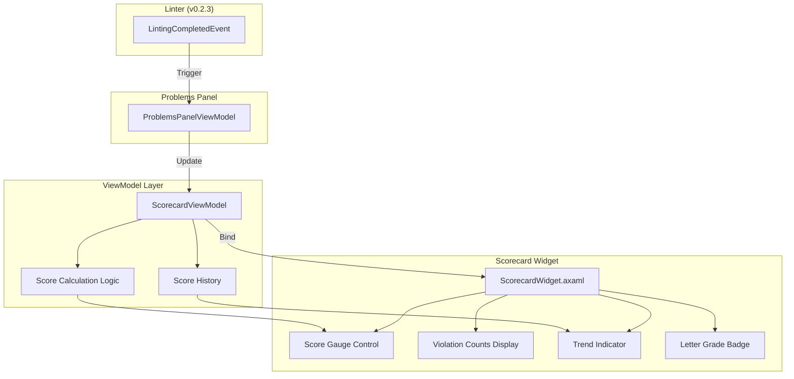
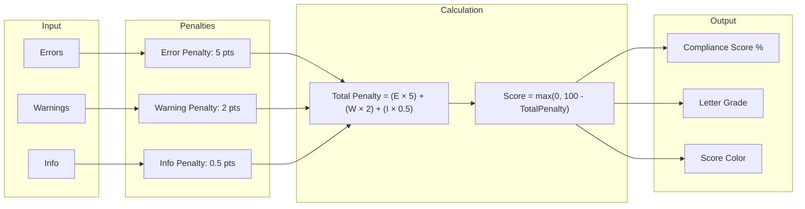

# LCS-INF-026c: Sub-Part Specification — Scorecard Widget

## 1. Metadata & Categorization

| Field                | Value                                               | Description                                |
| :------------------- | :-------------------------------------------------- | :----------------------------------------- |
| **Sub-Part ID**      | `INF-026c`                                          | Scorecard Widget (Compliance Gamification) |
| **Parent Feature**   | `INF-026` (Sidebar Real-Time Feedback)              | Main feature specification                 |
| **Target Version**   | `v0.2.6c`                                           | Third sub-part of v0.2.6                   |
| **Module Scope**     | `Lexichord.Modules.Style`                           | Style governance module                    |
| **License Tier**     | `Core`                                              | Foundation (Available in Free tier)        |
| **Author**           | System Architect                                    |                                            |
| **Status**           | **Draft**                                           | Pending implementation                     |
| **Last Updated**     | 2026-01-26                                          |                                            |

---

## 2. Executive Summary

### 2.1 The Requirement

Writers need motivation to address style violations and improve their writing. Raw violation counts (Errors: 5, Warnings: 10) don't convey:

- Overall document health at a glance
- Whether they're improving or declining
- A clear goal to work toward
- Satisfaction from progress

### 2.2 The Proposed Solution

We **SHALL** implement a Scorecard Widget that:

1. Displays "Total Errors: X" at a glance
2. Calculates a "Compliance Score" (100% - penalties)
3. Shows score trend (improving/stable/declining)
4. Color-codes the score for immediate recognition
5. Provides letter grade (A-F) for gamification
6. Motivates writers through visible progress

---

## 3. Architecture

### 3.1 Component Diagram



### 3.2 Score Calculation Formula



### 3.3 Grade Scale

| Score Range | Grade | Color | Hex Code |
|:------------|:------|:------|:---------|
| 90-100 | A | Green | #22C55E |
| 80-89 | B | Light Green | #84CC16 |
| 70-79 | C | Yellow | #EAB308 |
| 50-69 | D | Orange | #F97316 |
| 0-49 | F | Red | #EF4444 |

---

## 4. Decision Tree

```text
START: "Update(errors, warnings, info) called"
|
+-- Store previous score
|   +-- PreviousScore = ComplianceScore
|
+-- Update violation counts
|   +-- TotalErrors = errors
|   +-- TotalWarnings = warnings
|   +-- TotalInfo = info
|   +-- TotalCount = errors + warnings + info
|
+-- Calculate penalty
|   +-- penalty = (errors × 5) + (warnings × 2) + (info × 0.5)
|
+-- Calculate compliance score
|   +-- rawScore = 100 - penalty
|   +-- ComplianceScore = max(0, min(100, rawScore))
|
+-- Determine letter grade
|   +-- Score >= 90 -> "A"
|   +-- Score >= 80 -> "B"
|   +-- Score >= 70 -> "C"
|   +-- Score >= 50 -> "D"
|   +-- Score < 50  -> "F"
|
+-- Determine score color
|   +-- Score >= 90 -> Green (#22C55E)
|   +-- Score >= 80 -> Light Green (#84CC16)
|   +-- Score >= 70 -> Yellow (#EAB308)
|   +-- Score >= 50 -> Orange (#F97316)
|   +-- Score < 50  -> Red (#EF4444)
|
+-- Calculate trend
|   +-- scoreDelta = ComplianceScore - PreviousScore
|   +-- if scoreDelta > 1 -> Trend = Improving
|   +-- if scoreDelta < -1 -> Trend = Declining
|   +-- else -> Trend = Stable
|
+-- Notify property changes
|   +-- OnPropertyChanged for all calculated properties
|
END

---

START: "Reset() called"
|
+-- Reset all counts to zero
|   +-- TotalErrors = 0
|   +-- TotalWarnings = 0
|   +-- TotalInfo = 0
|   +-- TotalCount = 0
|
+-- Reset score to 100%
|   +-- ComplianceScore = 100.0
|   +-- PreviousScore = 100.0
|
+-- Reset trend
|   +-- Trend = Stable
|
+-- Notify property changes
|
END
```

---

## 5. Data Contracts

### 5.1 IScorecardViewModel Interface

```csharp
namespace Lexichord.Abstractions.Contracts;

/// <summary>
/// ViewModel for the Scorecard widget displaying compliance metrics.
/// </summary>
/// <remarks>
/// LOGIC: IScorecardViewModel calculates and displays a "Compliance Score"
/// based on violation counts. The score uses weighted penalties:
///
/// Score Formula:
///   Score = 100 - (errors × ErrorPenalty) - (warnings × WarningPenalty) - (info × InfoPenalty)
///
/// Default Penalty Weights:
/// - Error:   5 points per violation (severe impact on readability)
/// - Warning: 2 points per violation (moderate impact)
/// - Info:    0.5 points per violation (minor suggestions)
///
/// The score is clamped to [0, 100] range.
///
/// Example Calculations:
/// - 0 errors, 0 warnings, 0 info = 100% (perfect)
/// - 2 errors, 5 warnings, 10 info = 100 - 10 - 10 - 5 = 75%
/// - 20 errors = 100 - 100 = 0% (clamped)
///
/// Letter Grades:
/// - A: 90-100% (Excellent)
/// - B: 80-89%  (Good)
/// - C: 70-79%  (Fair)
/// - D: 50-69%  (Needs Work)
/// - F: 0-49%   (Poor)
///
/// Trend Calculation:
/// - Improving: Current score > Previous score + 1%
/// - Declining: Current score < Previous score - 1%
/// - Stable: Within 1% tolerance
/// </remarks>
public interface IScorecardViewModel : INotifyPropertyChanged
{
    /// <summary>
    /// Gets the total error count.
    /// </summary>
    int TotalErrors { get; }

    /// <summary>
    /// Gets the total warning count.
    /// </summary>
    int TotalWarnings { get; }

    /// <summary>
    /// Gets the total info count.
    /// </summary>
    int TotalInfo { get; }

    /// <summary>
    /// Gets the total problem count (errors + warnings + info).
    /// </summary>
    int TotalCount { get; }

    /// <summary>
    /// Gets the calculated compliance score (0-100).
    /// </summary>
    /// <remarks>
    /// LOGIC: Higher score = better compliance. 100 = no violations.
    /// Clamped to [0, 100] range.
    /// </remarks>
    double ComplianceScore { get; }

    /// <summary>
    /// Gets the compliance score display string (e.g., "85%").
    /// </summary>
    string ComplianceScoreDisplay { get; }

    /// <summary>
    /// Gets the previous compliance score (before last update).
    /// </summary>
    /// <remarks>
    /// LOGIC: Used for trend calculation. Preserved across updates.
    /// </remarks>
    double PreviousScore { get; }

    /// <summary>
    /// Gets the score trend since previous calculation.
    /// </summary>
    ScoreTrend Trend { get; }

    /// <summary>
    /// Gets the trend display icon (up arrow, down arrow, or dash).
    /// </summary>
    /// <remarks>
    /// LOGIC: Material Design icon paths:
    /// - Improving: Up arrow (M7,15L12,10L17,15H7Z)
    /// - Declining: Down arrow (M7,10L12,15L17,10H7Z)
    /// - Stable: Minus/dash (M19,13H5V11H19V13Z)
    /// </remarks>
    string TrendIcon { get; }

    /// <summary>
    /// Gets the trend color based on direction.
    /// </summary>
    /// <remarks>
    /// LOGIC:
    /// - Improving: Green (#22C55E)
    /// - Declining: Red (#EF4444)
    /// - Stable: Gray (#6B7280)
    /// </remarks>
    string TrendColor { get; }

    /// <summary>
    /// Gets the letter grade based on score (A-F).
    /// </summary>
    string ScoreGrade { get; }

    /// <summary>
    /// Gets the color for the score display.
    /// </summary>
    string ScoreColor { get; }

    /// <summary>
    /// Updates the scorecard with new violation counts.
    /// </summary>
    /// <param name="errors">Error count.</param>
    /// <param name="warnings">Warning count.</param>
    /// <param name="info">Info count.</param>
    /// <remarks>
    /// LOGIC: Triggers full recalculation of score, grade, trend.
    /// Stores previous score before updating for trend calculation.
    /// </remarks>
    void Update(int errors, int warnings, int info);

    /// <summary>
    /// Resets the scorecard to initial state (100% score).
    /// </summary>
    /// <remarks>
    /// LOGIC: Used when document is closed or cleared.
    /// Resets all counts to 0, score to 100%, trend to Stable.
    /// </remarks>
    void Reset();
}

/// <summary>
/// Score trend direction.
/// </summary>
public enum ScoreTrend
{
    /// <summary>Score improved (fewer violations than before).</summary>
    Improving,

    /// <summary>Score unchanged (within 1% tolerance).</summary>
    Stable,

    /// <summary>Score declined (more violations than before).</summary>
    Declining
}
```

### 5.2 ScorecardViewModel Implementation

```csharp
namespace Lexichord.Modules.Style.ViewModels;

using System;
using CommunityToolkit.Mvvm.ComponentModel;
using Lexichord.Abstractions.Contracts;
using Microsoft.Extensions.Logging;

/// <summary>
/// ViewModel for the Scorecard widget.
/// </summary>
/// <remarks>
/// LOGIC: ScorecardViewModel implements the compliance score calculation
/// and gamification features. It provides:
///
/// 1. Weighted penalty calculation
/// 2. Score clamping to [0, 100]
/// 3. Letter grade assignment
/// 4. Color coding for visual feedback
/// 5. Trend tracking (improving/stable/declining)
///
/// Thread Safety:
/// - All properties are observable and update on UI thread
/// - Update() can be called from any thread (auto-marshals)
///
/// Configuration:
/// - Penalty weights could be made configurable in future versions
/// - Grade thresholds could be user-customizable
/// </remarks>
public partial class ScorecardViewModel : ObservableObject, IScorecardViewModel
{
    private readonly ILogger<ScorecardViewModel>? _logger;

    // Penalty weights (could be made configurable)
    private const double ErrorPenalty = 5.0;
    private const double WarningPenalty = 2.0;
    private const double InfoPenalty = 0.5;

    // Trend tolerance (score changes within this range are considered stable)
    private const double TrendTolerance = 1.0;

    /// <summary>
    /// Gets the total error count.
    /// </summary>
    [ObservableProperty]
    private int _totalErrors;

    /// <summary>
    /// Gets the total warning count.
    /// </summary>
    [ObservableProperty]
    private int _totalWarnings;

    /// <summary>
    /// Gets the total info count.
    /// </summary>
    [ObservableProperty]
    private int _totalInfo;

    /// <summary>
    /// Gets the total problem count.
    /// </summary>
    public int TotalCount => TotalErrors + TotalWarnings + TotalInfo;

    /// <summary>
    /// Gets the calculated compliance score (0-100).
    /// </summary>
    [ObservableProperty]
    [NotifyPropertyChangedFor(nameof(ComplianceScoreDisplay))]
    [NotifyPropertyChangedFor(nameof(ScoreGrade))]
    [NotifyPropertyChangedFor(nameof(ScoreColor))]
    private double _complianceScore = 100.0;

    /// <summary>
    /// Gets the compliance score display string.
    /// </summary>
    public string ComplianceScoreDisplay => $"{Math.Round(ComplianceScore)}%";

    /// <summary>
    /// Gets the previous compliance score.
    /// </summary>
    [ObservableProperty]
    private double _previousScore = 100.0;

    /// <summary>
    /// Gets the score trend.
    /// </summary>
    [ObservableProperty]
    [NotifyPropertyChangedFor(nameof(TrendIcon))]
    [NotifyPropertyChangedFor(nameof(TrendColor))]
    private ScoreTrend _trend = ScoreTrend.Stable;

    /// <summary>
    /// Gets the trend display icon.
    /// </summary>
    /// <remarks>
    /// LOGIC: Returns Material Design icon geometry paths.
    /// </remarks>
    public string TrendIcon => Trend switch
    {
        ScoreTrend.Improving => "M7,15L12,10L17,15H7Z",  // Up arrow
        ScoreTrend.Declining => "M7,10L12,15L17,10H7Z", // Down arrow
        ScoreTrend.Stable => "M19,13H5V11H19V13Z",      // Horizontal line
        _ => "M19,13H5V11H19V13Z"
    };

    /// <summary>
    /// Gets the trend color.
    /// </summary>
    public string TrendColor => Trend switch
    {
        ScoreTrend.Improving => "#22C55E", // Green
        ScoreTrend.Declining => "#EF4444", // Red
        ScoreTrend.Stable => "#6B7280",    // Gray
        _ => "#6B7280"
    };

    /// <summary>
    /// Gets the letter grade based on score.
    /// </summary>
    /// <remarks>
    /// LOGIC: Grade scale:
    /// - A: 90-100 (Excellent compliance)
    /// - B: 80-89  (Good compliance)
    /// - C: 70-79  (Fair compliance)
    /// - D: 50-69  (Needs improvement)
    /// - F: 0-49   (Poor compliance)
    /// </remarks>
    public string ScoreGrade => ComplianceScore switch
    {
        >= 90 => "A",
        >= 80 => "B",
        >= 70 => "C",
        >= 50 => "D",
        _ => "F"
    };

    /// <summary>
    /// Gets the color for the score display.
    /// </summary>
    /// <remarks>
    /// LOGIC: Colors correspond to grade levels for visual consistency.
    /// </remarks>
    public string ScoreColor => ComplianceScore switch
    {
        >= 90 => "#22C55E", // Green (A)
        >= 80 => "#84CC16", // Light Green (B)
        >= 70 => "#EAB308", // Yellow (C)
        >= 50 => "#F97316", // Orange (D)
        _ => "#EF4444"      // Red (F)
    };

    /// <summary>
    /// Initializes a new instance of ScorecardViewModel.
    /// </summary>
    public ScorecardViewModel()
    {
    }

    /// <summary>
    /// Initializes a new instance of ScorecardViewModel with logging.
    /// </summary>
    public ScorecardViewModel(ILogger<ScorecardViewModel> logger)
    {
        _logger = logger;
    }

    /// <inheritdoc />
    public void Update(int errors, int warnings, int info)
    {
        // LOGIC: Step 1 - Store previous score for trend calculation
        PreviousScore = ComplianceScore;

        // LOGIC: Step 2 - Update violation counts
        TotalErrors = Math.Max(0, errors);
        TotalWarnings = Math.Max(0, warnings);
        TotalInfo = Math.Max(0, info);
        OnPropertyChanged(nameof(TotalCount));

        // LOGIC: Step 3 - Calculate penalty
        var penalty = (TotalErrors * ErrorPenalty) +
                      (TotalWarnings * WarningPenalty) +
                      (TotalInfo * InfoPenalty);

        // LOGIC: Step 4 - Calculate and clamp score
        var rawScore = 100 - penalty;
        ComplianceScore = Math.Max(0, Math.Min(100, rawScore));

        // LOGIC: Step 5 - Calculate trend
        var scoreDelta = ComplianceScore - PreviousScore;
        Trend = scoreDelta switch
        {
            > TrendTolerance => ScoreTrend.Improving,
            < -TrendTolerance => ScoreTrend.Declining,
            _ => ScoreTrend.Stable
        };

        _logger?.LogInformation(
            "Compliance score updated: {Score}% (was {Previous}%), trend: {Trend}",
            Math.Round(ComplianceScore),
            Math.Round(PreviousScore),
            Trend);

        _logger?.LogDebug(
            "Score calculation: E={Errors}*5 + W={Warnings}*2 + I={Info}*0.5 = {Penalty} penalty",
            TotalErrors, TotalWarnings, TotalInfo, penalty);
    }

    /// <inheritdoc />
    public void Reset()
    {
        TotalErrors = 0;
        TotalWarnings = 0;
        TotalInfo = 0;
        OnPropertyChanged(nameof(TotalCount));

        ComplianceScore = 100.0;
        PreviousScore = 100.0;
        Trend = ScoreTrend.Stable;

        _logger?.LogInformation("Scorecard reset to initial state");
    }
}
```

---

## 6. Implementation Logic

### 6.1 ScorecardWidget.axaml View

```xml
<UserControl xmlns="https://github.com/avaloniaui"
             xmlns:x="http://schemas.microsoft.com/winfx/2006/xaml"
             xmlns:vm="using:Lexichord.Modules.Style.ViewModels"
             x:Class="Lexichord.Modules.Style.Views.ScorecardWidget"
             x:DataType="vm:ScorecardViewModel">

    <Design.DataContext>
        <vm:ScorecardViewModel />
    </Design.DataContext>

    <Border Background="{DynamicResource CardBackground}"
            CornerRadius="4"
            Padding="12,8"
            Margin="8,4">

        <Grid ColumnDefinitions="Auto,*,Auto">

            <!-- Score Gauge / Percentage -->
            <StackPanel Grid.Column="0" Orientation="Horizontal" Spacing="8">
                <!-- Score Circle -->
                <Border Width="48" Height="48"
                        CornerRadius="24"
                        BorderThickness="3"
                        BorderBrush="{Binding ScoreColor}">
                    <TextBlock Text="{Binding ComplianceScoreDisplay}"
                               FontSize="14"
                               FontWeight="Bold"
                               Foreground="{Binding ScoreColor}"
                               HorizontalAlignment="Center"
                               VerticalAlignment="Center" />
                </Border>

                <!-- Letter Grade Badge -->
                <Border Width="28" Height="28"
                        CornerRadius="4"
                        Background="{Binding ScoreColor}"
                        VerticalAlignment="Center">
                    <TextBlock Text="{Binding ScoreGrade}"
                               FontSize="16"
                               FontWeight="Bold"
                               Foreground="White"
                               HorizontalAlignment="Center"
                               VerticalAlignment="Center" />
                </Border>
            </StackPanel>

            <!-- Violation Counts (Center) -->
            <StackPanel Grid.Column="1"
                        Orientation="Horizontal"
                        Spacing="16"
                        HorizontalAlignment="Center"
                        VerticalAlignment="Center">

                <!-- Errors -->
                <StackPanel Orientation="Horizontal" Spacing="4">
                    <Path Data="M12,2C17.53,2 22,6.47 22,12C22,17.53 17.53,22 12,22C6.47,22 2,17.53 2,12C2,6.47 6.47,2 12,2M15.59,7L12,10.59L8.41,7L7,8.41L10.59,12L7,15.59L8.41,17L12,13.41L15.59,17L17,15.59L13.41,12L17,8.41L15.59,7Z"
                          Fill="#EF4444"
                          Width="14" Height="14"
                          Stretch="Uniform" />
                    <TextBlock Text="{Binding TotalErrors}"
                               Foreground="#EF4444"
                               FontWeight="SemiBold" />
                </StackPanel>

                <!-- Warnings -->
                <StackPanel Orientation="Horizontal" Spacing="4">
                    <Path Data="M13,14H11V10H13M13,18H11V16H13M1,21H23L12,2L1,21Z"
                          Fill="#F97316"
                          Width="14" Height="14"
                          Stretch="Uniform" />
                    <TextBlock Text="{Binding TotalWarnings}"
                               Foreground="#F97316"
                               FontWeight="SemiBold" />
                </StackPanel>

                <!-- Info -->
                <StackPanel Orientation="Horizontal" Spacing="4">
                    <Path Data="M13,9H11V7H13M13,17H11V11H13M12,2A10,10 0 0,0 2,12A10,10 0 0,0 12,22A10,10 0 0,0 22,12A10,10 0 0,0 12,2Z"
                          Fill="#3B82F6"
                          Width="14" Height="14"
                          Stretch="Uniform" />
                    <TextBlock Text="{Binding TotalInfo}"
                               Foreground="#3B82F6"
                               FontWeight="SemiBold" />
                </StackPanel>
            </StackPanel>

            <!-- Trend Indicator (Right) -->
            <StackPanel Grid.Column="2"
                        Orientation="Horizontal"
                        Spacing="4"
                        VerticalAlignment="Center">
                <Path Data="{Binding TrendIcon}"
                      Fill="{Binding TrendColor}"
                      Width="16" Height="16"
                      Stretch="Uniform" />
                <TextBlock Text="{Binding Trend}"
                           Foreground="{Binding TrendColor}"
                           FontSize="11"
                           VerticalAlignment="Center" />
            </StackPanel>

        </Grid>
    </Border>
</UserControl>
```

### 6.2 Animated Score Gauge (Optional Enhancement)

```csharp
namespace Lexichord.Modules.Style.Controls;

using Avalonia;
using Avalonia.Controls;
using Avalonia.Media;
using System;

/// <summary>
/// Circular progress gauge for displaying compliance score.
/// </summary>
/// <remarks>
/// LOGIC: Draws a circular arc representing the score percentage.
/// - Full circle = 100%
/// - Arc length proportional to score
/// - Color changes based on score range
/// </remarks>
public class ScoreGauge : Control
{
    public static readonly StyledProperty<double> ScoreProperty =
        AvaloniaProperty.Register<ScoreGauge, double>(nameof(Score), 100.0);

    public static readonly StyledProperty<IBrush> ScoreBrushProperty =
        AvaloniaProperty.Register<ScoreGauge, IBrush>(nameof(ScoreBrush), Brushes.Green);

    public double Score
    {
        get => GetValue(ScoreProperty);
        set => SetValue(ScoreProperty, value);
    }

    public IBrush ScoreBrush
    {
        get => GetValue(ScoreBrushProperty);
        set => SetValue(ScoreBrushProperty, value);
    }

    public override void Render(DrawingContext context)
    {
        base.Render(context);

        var size = Math.Min(Bounds.Width, Bounds.Height);
        var center = new Point(Bounds.Width / 2, Bounds.Height / 2);
        var radius = (size / 2) - 4;
        var strokeWidth = 4.0;

        // LOGIC: Draw background circle (gray track)
        var trackPen = new Pen(Brushes.LightGray, strokeWidth);
        context.DrawEllipse(null, trackPen, center, radius, radius);

        // LOGIC: Draw score arc
        if (Score > 0)
        {
            var sweepAngle = (Score / 100.0) * 360;
            var startAngle = -90; // Start at top

            var arc = new StreamGeometry();
            using (var ctx = arc.Open())
            {
                var startRad = startAngle * Math.PI / 180;
                var endRad = (startAngle + sweepAngle) * Math.PI / 180;

                var startPoint = new Point(
                    center.X + radius * Math.Cos(startRad),
                    center.Y + radius * Math.Sin(startRad));

                var endPoint = new Point(
                    center.X + radius * Math.Cos(endRad),
                    center.Y + radius * Math.Sin(endRad));

                ctx.BeginFigure(startPoint, false);
                ctx.ArcTo(
                    endPoint,
                    new Size(radius, radius),
                    0,
                    sweepAngle > 180,
                    SweepDirection.Clockwise);
            }

            var scorePen = new Pen(ScoreBrush, strokeWidth, lineCap: PenLineCap.Round);
            context.DrawGeometry(null, scorePen, arc);
        }
    }

    static ScoreGauge()
    {
        AffectsRender<ScoreGauge>(ScoreProperty, ScoreBrushProperty);
    }
}
```

---

## 7. Use Cases

### UC-01: Initial Score Display

**Preconditions:**
- Problems Panel opens
- No violations detected yet

**Flow:**
1. ScorecardWidget initializes with ScorecardViewModel
2. Initial state: TotalErrors=0, TotalWarnings=0, TotalInfo=0
3. ComplianceScore = 100%
4. ScoreGrade = "A", ScoreColor = Green
5. Trend = Stable

**Postconditions:**
- Widget shows "100%" in green circle
- Grade badge shows "A" in green
- All counts show 0
- Trend shows horizontal line (stable)

### UC-02: Score Updates After Linting

**Preconditions:**
- Document has some style violations
- Linting completes

**Flow:**
1. ProblemsPanelViewModel receives LintingCompletedEvent
2. ViewModel counts: 2 errors, 5 warnings, 10 info
3. Calls Scorecard.Update(2, 5, 10)
4. Scorecard calculates:
   - Penalty = (2×5) + (5×2) + (10×0.5) = 10 + 10 + 5 = 25
   - Score = 100 - 25 = 75%
5. Grade = "C", Color = Yellow
6. Trend = Declining (from 100% to 75%)

**Postconditions:**
- Widget shows "75%" in yellow circle
- Grade badge shows "C" in yellow
- Counts: Errors=2, Warnings=5, Info=10
- Trend shows down arrow in red

### UC-03: Score Improves

**Preconditions:**
- Previous score was 75%
- User fixes some violations

**Flow:**
1. User fixes 1 error and 2 warnings
2. New linting completes: 1 error, 3 warnings, 10 info
3. Calls Scorecard.Update(1, 3, 10)
4. Scorecard calculates:
   - Penalty = (1×5) + (3×2) + (10×0.5) = 5 + 6 + 5 = 16
   - Score = 100 - 16 = 84%
5. Trend = Improving (75% → 84%)

**Postconditions:**
- Widget shows "84%" in light green (B grade)
- Trend shows up arrow in green
- Motivates user to continue fixing

---

## 8. Observability & Logging

| Level | Message Template |
|:------|:-----------------|
| Information | `Compliance score updated: {Score}% (was {Previous}%), trend: {Trend}` |
| Debug | `Score calculation: E={Errors}*5 + W={Warnings}*2 + I={Info}*0.5 = {Penalty} penalty` |
| Information | `Scorecard reset to initial state` |

---

## 9. Unit Tests

```csharp
[TestFixture]
[Category("Unit")]
public class ScorecardViewModelTests
{
    private ScorecardViewModel _sut = null!;

    [SetUp]
    public void SetUp()
    {
        _sut = new ScorecardViewModel();
    }

    [Test]
    public void InitialState_Score100Percent()
    {
        Assert.Multiple(() =>
        {
            Assert.That(_sut.ComplianceScore, Is.EqualTo(100.0));
            Assert.That(_sut.ScoreGrade, Is.EqualTo("A"));
            Assert.That(_sut.ScoreColor, Is.EqualTo("#22C55E"));
            Assert.That(_sut.TotalCount, Is.EqualTo(0));
            Assert.That(_sut.Trend, Is.EqualTo(ScoreTrend.Stable));
        });
    }

    [Test]
    [TestCase(0, 0, 0, 100.0, "A")]
    [TestCase(1, 0, 0, 95.0, "A")]
    [TestCase(2, 0, 0, 90.0, "A")]
    [TestCase(0, 5, 0, 90.0, "A")]
    [TestCase(0, 0, 20, 90.0, "A")]
    [TestCase(2, 5, 10, 75.0, "C")]
    [TestCase(4, 10, 20, 50.0, "D")]
    [TestCase(10, 20, 20, 0.0, "F")]
    [TestCase(100, 0, 0, 0.0, "F")] // Clamped to 0
    public void Update_CalculatesCorrectScore(
        int errors, int warnings, int info,
        double expectedScore, string expectedGrade)
    {
        _sut.Update(errors, warnings, info);

        Assert.Multiple(() =>
        {
            Assert.That(_sut.ComplianceScore, Is.EqualTo(expectedScore).Within(0.1));
            Assert.That(_sut.ScoreGrade, Is.EqualTo(expectedGrade));
        });
    }

    [Test]
    public void Update_TracksTrendImproving()
    {
        // First update: 75%
        _sut.Update(5, 0, 0); // 100 - 25 = 75%
        var firstScore = _sut.ComplianceScore;

        // Second update: 90% (improvement)
        _sut.Update(2, 0, 0); // 100 - 10 = 90%

        Assert.Multiple(() =>
        {
            Assert.That(_sut.PreviousScore, Is.EqualTo(firstScore));
            Assert.That(_sut.Trend, Is.EqualTo(ScoreTrend.Improving));
            Assert.That(_sut.TrendColor, Is.EqualTo("#22C55E")); // Green
        });
    }

    [Test]
    public void Update_TracksTrendDeclining()
    {
        // First update: 90%
        _sut.Update(2, 0, 0);

        // Second update: 70% (decline)
        _sut.Update(6, 0, 0);

        Assert.That(_sut.Trend, Is.EqualTo(ScoreTrend.Declining));
        Assert.That(_sut.TrendColor, Is.EqualTo("#EF4444")); // Red
    }

    [Test]
    public void Update_TracksTrendStable_WhenWithinTolerance()
    {
        _sut.Update(2, 5, 10); // 75%
        _sut.Update(2, 5, 10); // Same

        Assert.That(_sut.Trend, Is.EqualTo(ScoreTrend.Stable));
    }

    [Test]
    public void Reset_RestoresInitialState()
    {
        _sut.Update(5, 5, 5);
        _sut.Reset();

        Assert.Multiple(() =>
        {
            Assert.That(_sut.TotalErrors, Is.EqualTo(0));
            Assert.That(_sut.TotalWarnings, Is.EqualTo(0));
            Assert.That(_sut.TotalInfo, Is.EqualTo(0));
            Assert.That(_sut.ComplianceScore, Is.EqualTo(100.0));
            Assert.That(_sut.Trend, Is.EqualTo(ScoreTrend.Stable));
        });
    }

    [Test]
    public void ComplianceScoreDisplay_FormatsCorrectly()
    {
        _sut.Update(2, 5, 10); // 75%

        Assert.That(_sut.ComplianceScoreDisplay, Is.EqualTo("75%"));
    }

    [Test]
    [TestCase(100, "#22C55E")] // A - Green
    [TestCase(90, "#22C55E")]
    [TestCase(85, "#84CC16")]  // B - Light Green
    [TestCase(75, "#EAB308")]  // C - Yellow
    [TestCase(60, "#F97316")]  // D - Orange
    [TestCase(40, "#EF4444")]  // F - Red
    public void ScoreColor_MatchesGradeLevel(double score, string expectedColor)
    {
        // Calculate violations needed to reach score
        // Score = 100 - (e*5), so e = (100-score)/5
        var errors = (int)((100 - score) / 5);
        _sut.Update(errors, 0, 0);

        Assert.That(_sut.ScoreColor, Is.EqualTo(expectedColor));
    }
}
```

---

## 10. Security & Safety

- **Read-Only Display:** Widget only displays calculated values
- **No External Communication:** All calculations local
- **Input Validation:** Negative counts clamped to 0
- **Memory Safety:** No accumulation of history (only previous score)

---

## 11. Risks & Mitigations

| Risk | Impact | Mitigation |
|:-----|:-------|:-----------|
| Formula too harsh for many info issues | Medium | Low weight (0.5) for info |
| UI flicker on rapid updates | Low | Batch updates via PropertyChanged |
| Score not meaningful for short docs | Low | Consider word-count normalization in future |

---

## 12. Acceptance Criteria

| # | Criterion |
|:--|:----------|
| 1 | Widget displays compliance score as percentage |
| 2 | Letter grade (A-F) displayed correctly |
| 3 | Score color matches grade level |
| 4 | Violation counts show with icons |
| 5 | Trend indicator shows improving/stable/declining |
| 6 | Score calculation matches formula |
| 7 | Score clamped to [0, 100] range |
| 8 | Widget updates in real-time with linting |

---

## 13. Verification Commands

```bash
# Build
dotnet build src/Lexichord.Modules.Style

# Run unit tests
dotnet test --filter "FullyQualifiedName~ScorecardViewModel"

# Run application
dotnet run --project src/Lexichord.Host

# Manual testing:
# 1. Open document with violations
# 2. Verify score displays correctly
# 3. Fix some violations
# 4. Verify score improves and trend shows up arrow
# 5. Add violations
# 6. Verify score declines and trend shows down arrow
```

---

## 14. Deliverable Checklist

| Step | Description | Status |
|:-----|:------------|:-------|
| 1 | Define IScorecardViewModel interface | [ ] |
| 2 | Implement ScorecardViewModel | [ ] |
| 3 | Create ScorecardWidget.axaml | [ ] |
| 4 | Implement score calculation logic | [ ] |
| 5 | Implement grade assignment | [ ] |
| 6 | Implement color coding | [ ] |
| 7 | Implement trend tracking | [ ] |
| 8 | Create ScoreGauge control (optional) | [ ] |
| 9 | Unit tests for score calculation | [ ] |
| 10 | Unit tests for trend detection | [ ] |
