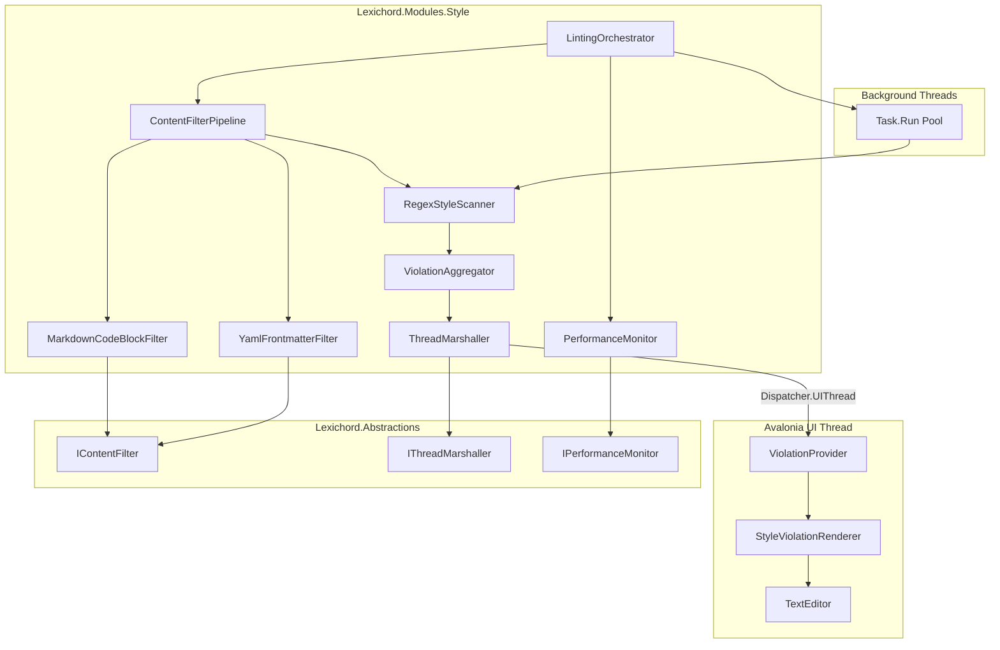
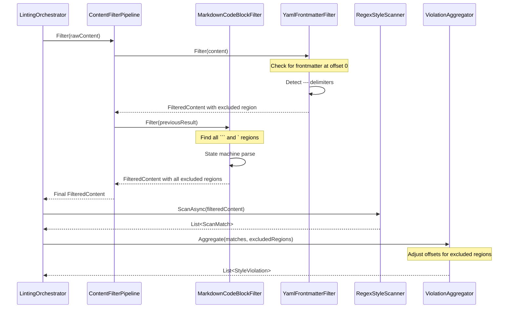
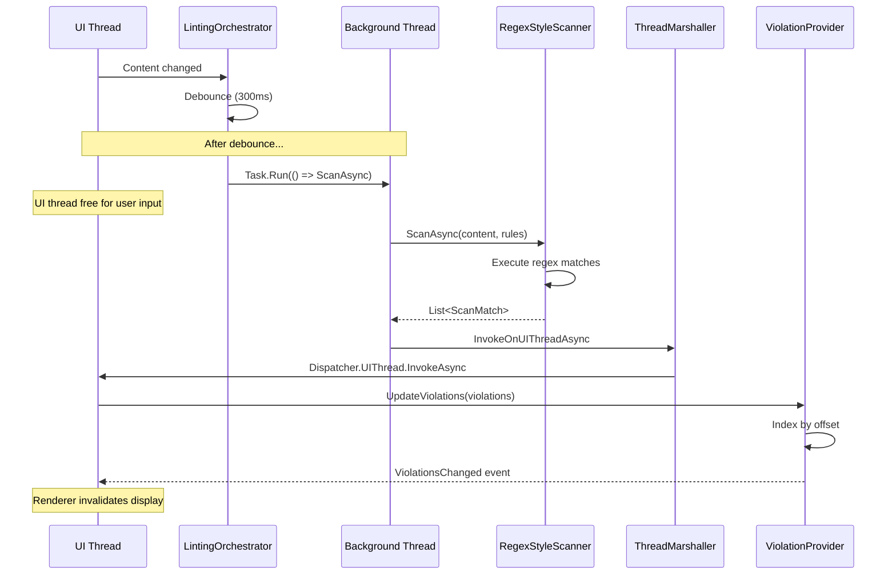

# LCS-INF-027: Feature Design Specification — Polish (Performance & Edge Cases)

## 1. Metadata & Categorization

| Field                | Value                                    | Description                                           |
| :------------------- | :--------------------------------------- | :---------------------------------------------------- |
| **Feature ID**       | `INF-027`                                | Infrastructure - Performance Polish                   |
| **Feature Name**     | Polish (Performance & Edge Cases)        | Performance hardening and edge case handling          |
| **Target Version**   | `v0.2.7`                                 | Final polish before AI features                       |
| **Module Scope**     | `Lexichord.Modules.Style`                | Style governance module                               |
| **Swimlane**         | `Product`                                | Core User-Facing Feature                              |
| **License Tier**     | `Core`                                   | Foundation (Available in Free tier)                   |
| **Feature Gate Key** | N/A                                      | No runtime gating for core infrastructure             |
| **Author**           | System Architect                         |                                                       |
| **Status**           | **Draft**                                | Pending implementation                                |
| **Last Updated**     | 2026-01-26                               |                                                       |

---

## 2. Executive Summary

### 2.1 The Requirement

Lexichord's linting system (v0.2.3-v0.2.4) is functionally complete but needs **performance hardening** before AI features arrive in v0.3.x:

- **Thread Safety:** Regex scanning must never block the UI thread — all CPU-intensive work on background threads, results marshalled back safely.
- **False Positives:** Code blocks (`\`\`\``) and frontmatter (`---`) in Markdown must not trigger style violations for variable names or metadata fields.
- **Scalability:** 5MB+ Markdown files (like the CommonMark spec) must remain editable at 60fps with active linting.
- **Robustness:** Edge cases that could crash or freeze the linter must be handled gracefully.

This is defensive engineering — ensuring the linter enhances rather than degrades the writing experience.

### 2.2 The Proposed Solution

We **SHALL** implement a comprehensive polish pass with:

1. **v0.2.7a: Async Offloading** — True background execution with UI thread marshalling.
2. **v0.2.7b: Code Block Ignoring** — Filter out Markdown code regions before scanning.
3. **v0.2.7c: Frontmatter Ignoring** — Filter out YAML/TOML/JSON frontmatter.
4. **v0.2.7d: Large File Stress Test** — Validate and tune for 5MB+ documents.

---

## 3. Architecture & Modular Strategy

### 3.1 High-Level Architecture



### 3.2 Content Filtering Pipeline



### 3.3 Async Execution Flow



### 3.4 Dependencies

**From v0.2.3 (Linter Engine):**

| Component | Type | Usage |
|:----------|:-----|:------|
| `LintingOrchestrator` | Class | Pipeline coordinator to enhance |
| `ILintingConfiguration` | Interface | Debounce settings to tune |
| `RegexStyleScanner` | Class | Scanner to run off-thread |
| `ViolationAggregator` | Class | Offset adjustment for filtered content |
| `ScanOptions` | Record | Add filter options |

**From v0.2.4 (Editor Integration):**

| Component | Type | Usage |
|:----------|:-----|:------|
| `IViolationProvider` | Interface | Must update on UI thread |
| `StyleViolationRenderer` | Class | Requires UI thread for rendering |

**From v0.1.3 (Editor Module):**

| Component | Type | Usage |
|:----------|:-----|:------|
| `ManuscriptViewModel` | Class | Document content source |
| `TextEditor` | Control | Viewport information for large files |

**NuGet Packages:**

| Package | Version | Purpose |
|:--------|:--------|:--------|
| `System.Reactive` | 6.x | Observable debounce patterns |
| `BenchmarkDotNet` | 0.13.x | Performance benchmarking |

### 3.5 Licensing Behavior

- **Core License:** All performance and filtering features available in Free tier.
- **WriterPro License:** Advanced AI analysis builds on this infrastructure (v0.3.x).
- **Enterprise License:** Custom filtering rules for specialized content types.

---

## 4. Decision Tree: Content Filtering

```text
START: "Prepare content for scanning"
|
+-- Get raw document content
|
+-- Determine document type
|   +-- Is Markdown file (.md, .markdown)?
|   |   +-- YES -> Apply Markdown filters
|   |   +-- NO -> Skip Markdown-specific filters
|
+-- Apply filter pipeline
|   +-- For each IContentFilter (sorted by Priority):
|       +-- Filter.CanFilter(extension)?
|       |   +-- NO -> Skip filter
|       |   +-- YES -> Apply filter
|       +-- Collect excluded regions
|
+-- Frontmatter detection (Priority: 100)
|   +-- Content starts at offset 0?
|   |   +-- NO -> Skip frontmatter check
|   |   +-- YES -> Check first chars
|   +-- Starts with "---" ?
|   |   +-- YES -> Find closing "---", exclude region
|   |   +-- NO -> Check for "+++" (TOML)
|   +-- Starts with "+++"?
|   |   +-- YES -> Find closing "+++", exclude region
|   |   +-- NO -> Check for "{" (JSON)
|   +-- Starts with "{"?
|       +-- YES -> Find matching "}", exclude region
|       +-- NO -> No frontmatter
|
+-- Code block detection (Priority: 200)
|   +-- State machine scan for delimiters
|   +-- Track nesting level
|   +-- For fenced blocks (```):
|   |   +-- Find opening ```
|   |   +-- Record language identifier (if present)
|   |   +-- Find matching closing ```
|   |   +-- Add to excluded regions
|   +-- For inline code (`):
|       +-- Find opening `
|       +-- Find closing ` (handle escaped)
|       +-- Add to excluded regions
|
+-- Build FilteredContent
|   +-- Sort excluded regions by offset
|   +-- Merge overlapping regions
|   +-- Create processed content (optional masking)
|
END: Return FilteredContent
```

---

## 5. Data Contracts

### 5.1 IContentFilter Interface

```csharp
namespace Lexichord.Abstractions.Contracts;

/// <summary>
/// Filters document content before scanning to exclude non-prose regions.
/// </summary>
/// <remarks>
/// LOGIC: Content filters form a pipeline that preprocesses document
/// content before regex scanning. Each filter identifies regions that
/// should be excluded from style analysis (code blocks, frontmatter, etc.).
///
/// Filters are applied in Priority order (lower = earlier).
/// Each filter receives the output of the previous filter.
///
/// Thread Safety:
/// - Filter implementations must be stateless and thread-safe
/// - FilteredContent is immutable
/// </remarks>
public interface IContentFilter
{
    /// <summary>
    /// Filters content to exclude non-prose regions.
    /// </summary>
    /// <param name="content">The content to filter (may be pre-filtered).</param>
    /// <param name="options">Filtering options.</param>
    /// <returns>Filtered content with excluded regions marked.</returns>
    /// <remarks>
    /// LOGIC: The filter scans content for regions to exclude and
    /// returns a FilteredContent with those regions recorded.
    /// The actual content string may or may not be modified.
    /// </remarks>
    FilteredContent Filter(string content, FilterOptions options);

    /// <summary>
    /// Checks if this filter applies to the given file type.
    /// </summary>
    /// <param name="fileExtension">File extension including dot (e.g., ".md").</param>
    /// <returns>True if filter should be applied.</returns>
    bool CanFilter(string fileExtension);

    /// <summary>
    /// Gets the filter priority (lower = runs earlier).
    /// </summary>
    /// <remarks>
    /// LOGIC: Priority order ensures filters run in correct sequence:
    /// - 100: Frontmatter (must run first, only at document start)
    /// - 200: Code blocks (after frontmatter is removed)
    /// - 300: Other prose exclusions
    /// </remarks>
    int Priority { get; }

    /// <summary>
    /// Gets the filter name for logging.
    /// </summary>
    string Name { get; }
}

/// <summary>
/// Options for content filtering.
/// </summary>
/// <param name="FileExtension">File extension for context.</param>
/// <param name="ExistingExclusions">Previously excluded regions.</param>
/// <param name="EnableCodeBlockFilter">Whether to filter code blocks.</param>
/// <param name="EnableFrontmatterFilter">Whether to filter frontmatter.</param>
public record FilterOptions(
    string FileExtension,
    IReadOnlyList<ExcludedRegion>? ExistingExclusions = null,
    bool EnableCodeBlockFilter = true,
    bool EnableFrontmatterFilter = true
)
{
    public static FilterOptions Default { get; } = new(".md");

    public static FilterOptions ForExtension(string extension) =>
        new(extension);
}
```

### 5.2 FilteredContent Record

```csharp
namespace Lexichord.Abstractions.Contracts;

/// <summary>
/// Result of content filtering containing processed content and exclusions.
/// </summary>
/// <remarks>
/// LOGIC: FilteredContent tracks which regions of the original document
/// should be excluded from linting. The scanner uses this to skip
/// excluded regions, and the aggregator uses it to adjust violation
/// offsets back to original document coordinates.
/// </remarks>
/// <param name="ProcessedContent">Content after filtering (may equal original).</param>
/// <param name="ExcludedRegions">Regions to exclude from scanning.</param>
/// <param name="OriginalContent">The original unmodified content.</param>
public record FilteredContent(
    string ProcessedContent,
    IReadOnlyList<ExcludedRegion> ExcludedRegions,
    string OriginalContent
)
{
    /// <summary>
    /// Creates FilteredContent with no exclusions.
    /// </summary>
    public static FilteredContent None(string content) =>
        new(content, Array.Empty<ExcludedRegion>(), content);

    /// <summary>
    /// Gets the total bytes excluded.
    /// </summary>
    public int TotalExcludedLength =>
        ExcludedRegions.Sum(r => r.Length);

    /// <summary>
    /// Gets whether any content was excluded.
    /// </summary>
    public bool HasExclusions => ExcludedRegions.Count > 0;

    /// <summary>
    /// Checks if an offset falls within an excluded region.
    /// </summary>
    /// <param name="offset">Document offset to check.</param>
    /// <returns>True if offset is in an excluded region.</returns>
    public bool IsExcluded(int offset) =>
        ExcludedRegions.Any(r => offset >= r.StartOffset && offset < r.EndOffset);

    /// <summary>
    /// Gets the excluded region at an offset, if any.
    /// </summary>
    /// <param name="offset">Document offset to check.</param>
    /// <returns>The excluded region, or null.</returns>
    public ExcludedRegion? GetExclusionAt(int offset) =>
        ExcludedRegions.FirstOrDefault(r =>
            offset >= r.StartOffset && offset < r.EndOffset);
}

/// <summary>
/// Represents a region of content excluded from scanning.
/// </summary>
/// <param name="StartOffset">Start offset in original document (0-based).</param>
/// <param name="EndOffset">End offset in original document (exclusive).</param>
/// <param name="Reason">Why this region was excluded.</param>
/// <param name="Metadata">Optional additional information about the exclusion.</param>
public record ExcludedRegion(
    int StartOffset,
    int EndOffset,
    ExclusionReason Reason,
    string? Metadata = null
)
{
    /// <summary>
    /// Gets the length of the excluded region.
    /// </summary>
    public int Length => EndOffset - StartOffset;

    /// <summary>
    /// Checks if this region overlaps with another.
    /// </summary>
    public bool Overlaps(ExcludedRegion other) =>
        StartOffset < other.EndOffset && EndOffset > other.StartOffset;

    /// <summary>
    /// Checks if this region contains an offset.
    /// </summary>
    public bool Contains(int offset) =>
        offset >= StartOffset && offset < EndOffset;
}

/// <summary>
/// Reasons for excluding content regions.
/// </summary>
public enum ExclusionReason
{
    /// <summary>Fenced code block (```).</summary>
    FencedCodeBlock,

    /// <summary>Inline code (`backticks`).</summary>
    InlineCode,

    /// <summary>YAML frontmatter (---).</summary>
    YamlFrontmatter,

    /// <summary>TOML frontmatter (+++).</summary>
    TomlFrontmatter,

    /// <summary>JSON frontmatter.</summary>
    JsonFrontmatter,

    /// <summary>HTML comment.</summary>
    HtmlComment,

    /// <summary>User-defined exclusion.</summary>
    UserDefined
}
```

### 5.3 IThreadMarshaller Interface

```csharp
namespace Lexichord.Abstractions.Contracts;

/// <summary>
/// Marshalls operations between background and UI threads.
/// </summary>
/// <remarks>
/// LOGIC: IThreadMarshaller provides a testable abstraction over
/// Avalonia's Dispatcher.UIThread. Production code uses the real
/// dispatcher; tests can use a synchronous mock.
///
/// Thread Safety:
/// - All methods are thread-safe
/// - InvokeOnUIThreadAsync is safe to call from any thread
/// </remarks>
public interface IThreadMarshaller
{
    /// <summary>
    /// Invokes an action on the UI thread asynchronously.
    /// </summary>
    /// <param name="action">The action to invoke.</param>
    /// <returns>Task completing when action finishes.</returns>
    /// <remarks>
    /// LOGIC: If already on UI thread, executes synchronously.
    /// Otherwise, dispatches to UI thread and awaits completion.
    /// </remarks>
    Task InvokeOnUIThreadAsync(Action action);

    /// <summary>
    /// Invokes a function on the UI thread asynchronously.
    /// </summary>
    /// <typeparam name="T">Return type.</typeparam>
    /// <param name="func">The function to invoke.</param>
    /// <returns>Task with function result.</returns>
    Task<T> InvokeOnUIThreadAsync<T>(Func<T> func);

    /// <summary>
    /// Posts an action to the UI thread without waiting.
    /// </summary>
    /// <param name="action">The action to post.</param>
    /// <remarks>
    /// LOGIC: Fire-and-forget dispatch. Use when caller doesn't
    /// need to wait for completion.
    /// </remarks>
    void PostToUIThread(Action action);

    /// <summary>
    /// Gets whether the current thread is the UI thread.
    /// </summary>
    bool IsOnUIThread { get; }

    /// <summary>
    /// Asserts that the current code is running on the UI thread.
    /// </summary>
    /// <param name="operation">Operation name for error message.</param>
    /// <exception cref="InvalidOperationException">
    /// Thrown in debug builds if not on UI thread.
    /// </exception>
    /// <remarks>
    /// LOGIC: Debug-only assertion. No-op in release builds.
    /// </remarks>
    [Conditional("DEBUG")]
    void AssertUIThread(string operation);

    /// <summary>
    /// Asserts that the current code is NOT on the UI thread.
    /// </summary>
    /// <param name="operation">Operation name for error message.</param>
    /// <exception cref="InvalidOperationException">
    /// Thrown in debug builds if on UI thread.
    /// </exception>
    [Conditional("DEBUG")]
    void AssertBackgroundThread(string operation);
}
```

### 5.4 IPerformanceMonitor Interface

```csharp
namespace Lexichord.Abstractions.Contracts;

/// <summary>
/// Monitors linting performance metrics.
/// </summary>
/// <remarks>
/// LOGIC: IPerformanceMonitor tracks scan durations, frame drops,
/// and memory usage to detect performance degradation. Used for
/// adaptive debouncing and performance alerts.
///
/// Thread Safety:
/// - All methods are thread-safe
/// - Metrics are atomic snapshots
/// </remarks>
public interface IPerformanceMonitor
{
    /// <summary>
    /// Starts timing an operation.
    /// </summary>
    /// <param name="operationName">Name of the operation.</param>
    /// <returns>Handle to stop timing.</returns>
    IDisposable StartOperation(string operationName);

    /// <summary>
    /// Records a completed operation duration.
    /// </summary>
    /// <param name="operationName">Name of the operation.</param>
    /// <param name="duration">How long it took.</param>
    void RecordOperation(string operationName, TimeSpan duration);

    /// <summary>
    /// Reports frame drops during linting.
    /// </summary>
    /// <param name="droppedFrames">Number of frames dropped.</param>
    void ReportFrameDrop(int droppedFrames);

    /// <summary>
    /// Gets current performance metrics.
    /// </summary>
    /// <returns>Snapshot of performance data.</returns>
    PerformanceMetrics GetMetrics();

    /// <summary>
    /// Resets all metrics.
    /// </summary>
    void Reset();

    /// <summary>
    /// Gets whether performance is currently degraded.
    /// </summary>
    /// <remarks>
    /// LOGIC: Returns true if recent scans exceed thresholds
    /// or frame drops have been reported.
    /// </remarks>
    bool IsPerformanceDegraded { get; }

    /// <summary>
    /// Gets recommended debounce interval based on performance.
    /// </summary>
    /// <remarks>
    /// LOGIC: Returns longer debounce for slow systems.
    /// </remarks>
    TimeSpan RecommendedDebounceInterval { get; }
}

/// <summary>
/// Performance metrics snapshot.
/// </summary>
/// <param name="AverageScanDurationMs">Average scan time in milliseconds.</param>
/// <param name="MaxScanDurationMs">Maximum scan time observed.</param>
/// <param name="P95ScanDurationMs">95th percentile scan duration.</param>
/// <param name="FrameDropCount">Total frame drops observed.</param>
/// <param name="MemoryUsageMb">Current memory usage in MB.</param>
/// <param name="ScansCompleted">Total scans completed.</param>
/// <param name="ScansCancelled">Scans cancelled mid-operation.</param>
public record PerformanceMetrics(
    double AverageScanDurationMs,
    double MaxScanDurationMs,
    double P95ScanDurationMs,
    int FrameDropCount,
    double MemoryUsageMb,
    int ScansCompleted,
    int ScansCancelled
)
{
    /// <summary>
    /// Gets the scan success rate.
    /// </summary>
    public double SuccessRate =>
        ScansCompleted + ScansCancelled == 0
            ? 1.0
            : (double)ScansCompleted / (ScansCompleted + ScansCancelled);

    /// <summary>
    /// Gets whether metrics indicate healthy performance.
    /// </summary>
    public bool IsHealthy =>
        AverageScanDurationMs < 200 &&
        FrameDropCount < 10 &&
        SuccessRate > 0.95;
}
```

### 5.5 ContentFilterPipeline Implementation

```csharp
using Lexichord.Abstractions.Contracts;
using Microsoft.Extensions.Logging;

namespace Lexichord.Modules.Style.Services;

/// <summary>
/// Coordinates multiple content filters in a pipeline.
/// </summary>
/// <remarks>
/// LOGIC: ContentFilterPipeline runs filters in priority order,
/// accumulating excluded regions from each filter. Each filter
/// receives the results of previous filters.
///
/// Thread Safety:
/// - Pipeline is stateless and thread-safe
/// - Filters must be thread-safe
/// </remarks>
public sealed class ContentFilterPipeline
{
    private readonly IReadOnlyList<IContentFilter> _filters;
    private readonly ILogger<ContentFilterPipeline> _logger;

    public ContentFilterPipeline(
        IEnumerable<IContentFilter> filters,
        ILogger<ContentFilterPipeline> logger)
    {
        // LOGIC: Sort filters by priority (lower = earlier)
        _filters = filters
            .OrderBy(f => f.Priority)
            .ToList();
        _logger = logger;

        _logger.LogDebug(
            "ContentFilterPipeline initialized with {Count} filters: {Names}",
            _filters.Count,
            string.Join(", ", _filters.Select(f => f.Name)));
    }

    /// <summary>
    /// Filters content through all applicable filters.
    /// </summary>
    /// <param name="content">Raw document content.</param>
    /// <param name="fileExtension">File extension for filter selection.</param>
    /// <returns>Filtered content with all excluded regions.</returns>
    public FilteredContent Filter(string content, string fileExtension)
    {
        if (string.IsNullOrEmpty(content))
        {
            return FilteredContent.None(content);
        }

        var options = FilterOptions.ForExtension(fileExtension);
        var allExclusions = new List<ExcludedRegion>();
        var currentContent = content;

        foreach (var filter in _filters)
        {
            if (!filter.CanFilter(fileExtension))
            {
                _logger.LogDebug(
                    "Filter {Name} skipped for extension {Extension}",
                    filter.Name, fileExtension);
                continue;
            }

            var filterOptions = options with
            {
                ExistingExclusions = allExclusions
            };

            _logger.LogDebug(
                "Applying filter {Name} (priority {Priority})",
                filter.Name, filter.Priority);

            var result = filter.Filter(currentContent, filterOptions);

            // LOGIC: Accumulate exclusions from this filter
            allExclusions.AddRange(result.ExcludedRegions);

            _logger.LogDebug(
                "Filter {Name} found {Count} exclusions",
                filter.Name, result.ExcludedRegions.Count);
        }

        // LOGIC: Merge overlapping exclusions
        var mergedExclusions = MergeOverlappingRegions(allExclusions);

        _logger.LogDebug(
            "Pipeline complete: {Total} exclusions ({Merged} after merge)",
            allExclusions.Count, mergedExclusions.Count);

        return new FilteredContent(
            ProcessedContent: content, // Keep original for now
            ExcludedRegions: mergedExclusions,
            OriginalContent: content
        );
    }

    /// <summary>
    /// Merges overlapping excluded regions.
    /// </summary>
    private static IReadOnlyList<ExcludedRegion> MergeOverlappingRegions(
        List<ExcludedRegion> regions)
    {
        if (regions.Count <= 1)
            return regions;

        // LOGIC: Sort by start offset
        var sorted = regions.OrderBy(r => r.StartOffset).ToList();
        var merged = new List<ExcludedRegion>();

        var current = sorted[0];
        for (int i = 1; i < sorted.Count; i++)
        {
            var next = sorted[i];

            if (current.EndOffset >= next.StartOffset)
            {
                // LOGIC: Regions overlap, merge them
                current = current with
                {
                    EndOffset = Math.Max(current.EndOffset, next.EndOffset)
                };
            }
            else
            {
                // LOGIC: No overlap, finalize current
                merged.Add(current);
                current = next;
            }
        }

        merged.Add(current);
        return merged;
    }
}
```

---

## 6. Implementation Logic

### 6.1 StyleModule Extension (v0.2.7)

```csharp
using Lexichord.Abstractions.Contracts;
using Microsoft.Extensions.DependencyInjection;
using Microsoft.Extensions.Logging;

namespace Lexichord.Modules.Style;

/// <summary>
/// Module registration for the Style module (extended for v0.2.7).
/// </summary>
/// <remarks>
/// LOGIC: v0.2.7 adds performance infrastructure and content filters
/// to the existing Style module.
/// </remarks>
public partial class StyleModule : IModule
{
    public string Name => "Style";
    public string Description => "Style governance and terminology enforcement";
    public Version Version => new(0, 2, 7);
    public LicenseTier RequiredTier => LicenseTier.Core;

    public void ConfigureServices(IServiceCollection services)
    {
        // Previous version services (v0.2.1 - v0.2.4)
        services.AddSingleton<IStyleSheetLoader, YamlStyleSheetLoader>();
        services.AddSingleton<IStyleRuleCache, StyleRuleCache>();
        services.AddSingleton<ITerminologyRepository, DapperTerminologyRepository>();
        services.AddSingleton<ITerminologyService, TerminologyService>();
        services.AddSingleton<ILintingConfiguration, LintingConfiguration>();
        services.AddSingleton<IStyleScanner, RegexStyleScanner>();
        services.AddSingleton<IViolationAggregator, ViolationAggregator>();
        services.AddSingleton<ILintingOrchestrator, LintingOrchestrator>();

        // v0.2.7a: Async offloading
        services.AddSingleton<IThreadMarshaller, AvaloniaThreadMarshaller>();

        // v0.2.7b: Code block filtering
        services.AddSingleton<IContentFilter, MarkdownCodeBlockFilter>();

        // v0.2.7c: Frontmatter filtering
        services.AddSingleton<IContentFilter, YamlFrontmatterFilter>();

        // v0.2.7: Content filter pipeline
        services.AddSingleton<ContentFilterPipeline>();

        // v0.2.7d: Performance monitoring
        services.AddSingleton<IPerformanceMonitor, PerformanceMonitor>();
    }

    public async Task InitializeAsync(IServiceProvider services)
    {
        var logger = services.GetRequiredService<ILogger<StyleModule>>();
        logger.LogInformation("Initializing Style module v{Version}", Version);

        // Initialize terminology repository
        var termRepo = services.GetRequiredService<ITerminologyRepository>();
        await termRepo.InitializeAsync();

        // Pre-compile regex patterns
        var scanner = services.GetRequiredService<IStyleScanner>();
        if (scanner is RegexStyleScanner regexScanner)
        {
            await regexScanner.WarmupCacheAsync();
        }

        // Log filter pipeline configuration
        var pipeline = services.GetRequiredService<ContentFilterPipeline>();
        logger.LogInformation("Style module initialized with content filter pipeline");
    }

    public Task ShutdownAsync()
    {
        return Task.CompletedTask;
    }
}
```

### 6.2 Enhanced LintingOrchestrator (v0.2.7a)

```csharp
// Extensions to LintingOrchestrator for v0.2.7a async offloading

private readonly IThreadMarshaller _threadMarshaller;
private readonly ContentFilterPipeline _filterPipeline;
private readonly IPerformanceMonitor _performanceMonitor;

/// <summary>
/// Executes the linting operation with proper threading.
/// </summary>
private async Task<LintingResult> ExecuteLintAsync(
    string documentId,
    string content,
    string fileExtension,
    CancellationToken cancellationToken)
{
    // LOGIC: Assert we're NOT on the UI thread for the heavy work
    _threadMarshaller.AssertBackgroundThread("ExecuteLintAsync");

    using var _ = _performanceMonitor.StartOperation($"Lint:{documentId}");

    _logger.LogDebug(
        "Executing lint for document {DocumentId} ({Length} chars)",
        documentId, content.Length);

    var stopwatch = System.Diagnostics.Stopwatch.StartNew();

    try
    {
        // LOGIC: Notify lint started (can be on any thread)
        await _mediator.Publish(
            new LintingStartedEvent(documentId),
            cancellationToken);

        // LOGIC: Filter content to exclude code blocks and frontmatter
        var filteredContent = _filterPipeline.Filter(content, fileExtension);

        _logger.LogDebug(
            "Content filtered: {Excluded} bytes excluded in {Count} regions",
            filteredContent.TotalExcludedLength,
            filteredContent.ExcludedRegions.Count);

        // LOGIC: Get active rules from cache
        var rules = await _ruleCache.GetActiveRulesAsync(cancellationToken);

        // LOGIC: Execute scan (already on background thread)
        var scanOptions = ScanOptions.Default with
        {
            RegexTimeout = _config.RegexTimeout,
            ExcludedRegions = filteredContent.ExcludedRegions
        };

        var matches = await _scanner.ScanAsync(
            filteredContent.ProcessedContent,
            rules,
            scanOptions,
            cancellationToken);

        // LOGIC: Aggregate into violations
        var violations = _aggregator.Aggregate(
            matches,
            documentId,
            content,
            filteredContent.ExcludedRegions);

        stopwatch.Stop();

        var result = new LintingResult(
            DocumentId: documentId,
            Violations: violations,
            ScanDuration: stopwatch.Elapsed,
            RulesChecked: rules.Count,
            ContentLength: content.Length,
            WasPartialScan: false,
            Timestamp: DateTimeOffset.UtcNow);

        // LOGIC: Marshall violation update to UI thread
        await _threadMarshaller.InvokeOnUIThreadAsync(() =>
        {
            _violationProvider.UpdateViolations(documentId, violations);
        });

        // LOGIC: Publish completion event
        await _mediator.Publish(
            new LintingCompletedEvent(result),
            cancellationToken);

        // LOGIC: Emit to observable stream
        _resultsSubject.OnNext(result);

        _logger.LogDebug(
            "Lint completed for {DocumentId}: {ViolationCount} violations in {Duration}ms",
            documentId, result.ViolationCount, stopwatch.ElapsedMilliseconds);

        return result;
    }
    catch (OperationCanceledException)
    {
        _logger.LogDebug("Lint cancelled for document {DocumentId}", documentId);
        _performanceMonitor.RecordOperation(
            $"LintCancelled:{documentId}",
            stopwatch.Elapsed);
        throw;
    }
    catch (Exception ex)
    {
        _logger.LogError(ex, "Lint failed for document {DocumentId}", documentId);
        throw;
    }
}

/// <summary>
/// Called when content has stabilized after debounce.
/// </summary>
private void OnContentStabilized(
    string documentId,
    string content,
    string fileExtension,
    DocumentLintState state)
{
    if (_isPaused || state.IsPaused || !_config.IsEnabled)
    {
        _logger.LogDebug(
            "Skipping lint for {DocumentId} - paused or disabled",
            documentId);
        return;
    }

    // LOGIC: Fire and forget on background thread
    // Task.Run ensures we're off the UI thread
    _ = Task.Run(async () =>
    {
        try
        {
            await ExecuteLintAsync(
                documentId,
                content,
                fileExtension,
                state.CancellationTokenSource.Token);
        }
        catch (OperationCanceledException)
        {
            // Expected during document close
        }
        catch (Exception ex)
        {
            _logger.LogError(ex, "Unhandled error in lint task for {DocumentId}", documentId);
        }
    }, state.CancellationTokenSource.Token);
}
```

### 6.3 Module Folder Structure

```text
src/Lexichord.Modules.Style/
├── StyleModule.cs
├── Lexichord.Modules.Style.csproj
├── Configuration/
│   ├── LintingConfiguration.cs
│   └── StyleSettings.cs
├── Filters/
│   ├── IContentFilter.cs (moved to Abstractions)
│   ├── ContentFilterPipeline.cs
│   ├── MarkdownCodeBlockFilter.cs
│   ├── YamlFrontmatterFilter.cs
│   └── FilteredContent.cs (moved to Abstractions)
├── Services/
│   ├── LintingOrchestrator.cs
│   ├── RegexStyleScanner.cs
│   ├── ViolationAggregator.cs
│   ├── StyleRuleCache.cs
│   ├── TerminologyService.cs
│   └── PerformanceMonitor.cs
├── Threading/
│   ├── IThreadMarshaller.cs (moved to Abstractions)
│   └── AvaloniaThreadMarshaller.cs
├── Repositories/
│   └── DapperTerminologyRepository.cs
└── Resources/
    └── lexichord.yaml
```

---

## 7. Use Cases & User Stories

### 7.1 User Stories

| ID | Role | Story | Acceptance Criteria |
|:---|:-----|:------|:--------------------|
| US-01 | Writer | As a writer, I want linting to never freeze my editor. | Typing remains smooth during lint operations. |
| US-02 | Writer | As a writer, I want code samples in my docs to be ignored. | `whitelist_enabled` in code blocks not flagged. |
| US-03 | Writer | As a writer, I want my Jekyll frontmatter to be ignored. | YAML between `---` not flagged. |
| US-04 | Writer | As a writer, I want to edit large spec documents. | 5MB file remains editable at 60fps. |
| US-05 | Developer | As a developer, I want thread-safe violation updates. | No crashes from cross-thread access. |
| US-06 | Developer | As a developer, I want performance metrics. | Scan durations logged for analysis. |

### 7.2 Use Cases

#### UC-01: Lint Document with Code Samples

**Preconditions:**
- Document contains Markdown with fenced code blocks.
- Style rules include terminology that appears in code.

**Flow:**
1. User types in document containing:
   ```markdown
   Use allowlist instead of whitelist.

   ```python
   whitelist_enabled = True
   ```
   ```
2. Debounce triggers lint operation.
3. ContentFilterPipeline runs MarkdownCodeBlockFilter.
4. Filter detects ``` region and marks as excluded.
5. Scanner skips excluded region.
6. Violation created for prose "whitelist" but not code "whitelist_enabled".
7. Only one violation shown to user.

**Postconditions:**
- Code sample not flagged as style violation.
- Prose violation correctly identified.

---

#### UC-02: Edit Large Document

**Preconditions:**
- 5MB Markdown file open (e.g., CommonMark spec).
- Active style rules loaded.

**Flow:**
1. User types at line 50,000.
2. Debounce triggers (adaptive, may be longer than 300ms).
3. Task.Run dispatches scan to background thread.
4. UI thread remains responsive for typing.
5. Viewport-priority scanning processes visible content first.
6. Chunked scanning processes rest of document incrementally.
7. Results marshalled to UI thread via Dispatcher.
8. Violations displayed without UI jank.

**Postconditions:**
- User types at 60fps throughout.
- Violations eventually appear for full document.
- Memory usage remains bounded.

---

## 8. Observability & Logging

### 8.1 Log Events

| Level | Context | Message Template |
|:------|:--------|:-----------------|
| Information | StyleModule | `Initializing Style module v{Version}` |
| Information | StyleModule | `Style module initialized with content filter pipeline` |
| Debug | ContentFilterPipeline | `ContentFilterPipeline initialized with {Count} filters: {Names}` |
| Debug | ContentFilterPipeline | `Filter {Name} skipped for extension {Extension}` |
| Debug | ContentFilterPipeline | `Applying filter {Name} (priority {Priority})` |
| Debug | ContentFilterPipeline | `Filter {Name} found {Count} exclusions` |
| Debug | ContentFilterPipeline | `Pipeline complete: {Total} exclusions ({Merged} after merge)` |
| Debug | MarkdownCodeBlockFilter | `Found fenced code block at offset {Start}-{End}` |
| Debug | MarkdownCodeBlockFilter | `Found inline code at offset {Start}-{End}` |
| Debug | YamlFrontmatterFilter | `Found YAML frontmatter at offset 0-{End}` |
| Debug | LintingOrchestrator | `Content filtered: {Excluded} bytes excluded in {Count} regions` |
| Debug | LintingOrchestrator | `Executing lint for document {DocumentId} ({Length} chars)` |
| Debug | LintingOrchestrator | `Lint completed for {DocumentId}: {ViolationCount} violations in {Duration}ms` |
| Debug | AvaloniaThreadMarshaller | `Marshalling to UI thread from {ThreadId}` |
| Warning | AvaloniaThreadMarshaller | `AssertUIThread failed for {Operation}` |
| Warning | AvaloniaThreadMarshaller | `AssertBackgroundThread failed for {Operation}` |
| Debug | PerformanceMonitor | `Operation {Name} completed in {Duration}ms` |
| Warning | PerformanceMonitor | `Performance degradation detected: {Metric}={Value}` |

### 8.2 Metrics

| Metric | Type | Description |
|:-------|:-----|:------------|
| `filter.exclusions.count` | Gauge | Number of excluded regions per scan |
| `filter.exclusions.bytes` | Gauge | Total bytes excluded per scan |
| `filter.code_blocks` | Counter | Code blocks detected |
| `filter.frontmatter` | Counter | Frontmatter blocks detected |
| `async.ui_thread.invokes` | Counter | Dispatcher invocations |
| `async.background.tasks` | Gauge | Active background lint tasks |
| `perf.scan.duration_ms` | Histogram | Scan operation durations |
| `perf.frame.drops` | Counter | UI frame drops during linting |
| `perf.memory.usage_mb` | Gauge | Memory usage during linting |

---

## 9. Unit Testing Requirements

### 9.1 ContentFilterPipeline Tests

```csharp
[TestFixture]
[Category("Unit")]
public class ContentFilterPipelineTests
{
    private ContentFilterPipeline _sut = null!;
    private Mock<ILogger<ContentFilterPipeline>> _mockLogger = null!;

    [SetUp]
    public void SetUp()
    {
        _mockLogger = new Mock<ILogger<ContentFilterPipeline>>();

        var filters = new IContentFilter[]
        {
            new YamlFrontmatterFilter(),
            new MarkdownCodeBlockFilter()
        };

        _sut = new ContentFilterPipeline(filters, _mockLogger.Object);
    }

    [Test]
    public void Filter_EmptyContent_ReturnsNoExclusions()
    {
        // Act
        var result = _sut.Filter("", ".md");

        // Assert
        Assert.That(result.HasExclusions, Is.False);
    }

    [Test]
    public void Filter_NoCodeOrFrontmatter_ReturnsNoExclusions()
    {
        // Arrange
        var content = "This is plain prose with no code.";

        // Act
        var result = _sut.Filter(content, ".md");

        // Assert
        Assert.That(result.HasExclusions, Is.False);
        Assert.That(result.ProcessedContent, Is.EqualTo(content));
    }

    [Test]
    public void Filter_WithFrontmatter_ExcludesFrontmatter()
    {
        // Arrange
        var content = """
            ---
            title: Test
            ---
            Body content
            """;

        // Act
        var result = _sut.Filter(content, ".md");

        // Assert
        Assert.That(result.HasExclusions, Is.True);
        Assert.That(result.ExcludedRegions, Has.Count.EqualTo(1));
        Assert.That(result.ExcludedRegions[0].Reason,
            Is.EqualTo(ExclusionReason.YamlFrontmatter));
    }

    [Test]
    public void Filter_WithCodeBlock_ExcludesCodeBlock()
    {
        // Arrange
        var content = """
            Some text

            ```python
            code_here = True
            ```

            More text
            """;

        // Act
        var result = _sut.Filter(content, ".md");

        // Assert
        Assert.That(result.HasExclusions, Is.True);
        Assert.That(result.ExcludedRegions.Any(
            r => r.Reason == ExclusionReason.FencedCodeBlock), Is.True);
    }

    [Test]
    public void Filter_WithBothFrontmatterAndCode_ExcludesBoth()
    {
        // Arrange
        var content = """
            ---
            title: Test
            ---

            ```python
            code = True
            ```
            """;

        // Act
        var result = _sut.Filter(content, ".md");

        // Assert
        Assert.That(result.ExcludedRegions, Has.Count.EqualTo(2));
    }

    [Test]
    public void Filter_NonMarkdownFile_SkipsMarkdownFilters()
    {
        // Arrange
        var content = "---\nYAML content\n---";

        // Act
        var result = _sut.Filter(content, ".txt");

        // Assert - .txt files skip Markdown-specific filters
        Assert.That(result.HasExclusions, Is.False);
    }

    [Test]
    public void Filter_OverlappingRegions_MergesThem()
    {
        // This test verifies region merging logic
        // In practice, overlapping regions shouldn't occur from our filters
        // but the pipeline should handle it gracefully

        // Arrange - custom mock filter that returns overlapping regions
        var mockFilter = new Mock<IContentFilter>();
        mockFilter.Setup(f => f.CanFilter(It.IsAny<string>())).Returns(true);
        mockFilter.Setup(f => f.Priority).Returns(100);
        mockFilter.Setup(f => f.Name).Returns("MockFilter");
        mockFilter.Setup(f => f.Filter(It.IsAny<string>(), It.IsAny<FilterOptions>()))
            .Returns((string c, FilterOptions o) => new FilteredContent(
                c,
                new[]
                {
                    new ExcludedRegion(0, 10, ExclusionReason.UserDefined),
                    new ExcludedRegion(5, 15, ExclusionReason.UserDefined)
                },
                c
            ));

        var pipeline = new ContentFilterPipeline(
            new[] { mockFilter.Object },
            _mockLogger.Object);

        // Act
        var result = pipeline.Filter("0123456789012345", ".md");

        // Assert - overlapping regions (0-10) and (5-15) merged to (0-15)
        Assert.That(result.ExcludedRegions, Has.Count.EqualTo(1));
        Assert.That(result.ExcludedRegions[0].StartOffset, Is.EqualTo(0));
        Assert.That(result.ExcludedRegions[0].EndOffset, Is.EqualTo(15));
    }
}
```

### 9.2 ThreadMarshaller Tests

```csharp
[TestFixture]
[Category("Unit")]
public class ThreadMarshallerTests
{
    // Note: These tests use a mock implementation for unit testing
    // Integration tests would use the real Avalonia dispatcher

    [Test]
    public async Task InvokeOnUIThreadAsync_ExecutesAction()
    {
        // Arrange
        var marshaller = new TestThreadMarshaller();
        var executed = false;

        // Act
        await marshaller.InvokeOnUIThreadAsync(() => executed = true);

        // Assert
        Assert.That(executed, Is.True);
    }

    [Test]
    public async Task InvokeOnUIThreadAsync_ReturnsValue()
    {
        // Arrange
        var marshaller = new TestThreadMarshaller();

        // Act
        var result = await marshaller.InvokeOnUIThreadAsync(() => 42);

        // Assert
        Assert.That(result, Is.EqualTo(42));
    }

    [Test]
    public void AssertUIThread_OnUIThread_NoException()
    {
        // Arrange
        var marshaller = new TestThreadMarshaller { SimulateUIThread = true };

        // Act & Assert
        Assert.DoesNotThrow(() => marshaller.AssertUIThread("test operation"));
    }

    [Test]
    public void AssertBackgroundThread_NotOnUIThread_NoException()
    {
        // Arrange
        var marshaller = new TestThreadMarshaller { SimulateUIThread = false };

        // Act & Assert
        Assert.DoesNotThrow(() => marshaller.AssertBackgroundThread("test operation"));
    }

    /// <summary>
    /// Test implementation of IThreadMarshaller for unit tests.
    /// </summary>
    private class TestThreadMarshaller : IThreadMarshaller
    {
        public bool SimulateUIThread { get; set; } = true;

        public bool IsOnUIThread => SimulateUIThread;

        public Task InvokeOnUIThreadAsync(Action action)
        {
            action();
            return Task.CompletedTask;
        }

        public Task<T> InvokeOnUIThreadAsync<T>(Func<T> func)
        {
            return Task.FromResult(func());
        }

        public void PostToUIThread(Action action)
        {
            action();
        }

        public void AssertUIThread(string operation)
        {
            if (!SimulateUIThread)
                throw new InvalidOperationException(
                    $"{operation} must run on UI thread");
        }

        public void AssertBackgroundThread(string operation)
        {
            if (SimulateUIThread)
                throw new InvalidOperationException(
                    $"{operation} must run on background thread");
        }
    }
}
```

---

## 10. Security & Safety

### 10.1 Thread Safety

> [!WARNING]
> Cross-thread access to UI controls causes crashes or data corruption.

- **UI Thread Assertion:** Debug builds assert correct thread context.
- **Dispatcher Marshall:** All UI updates go through IThreadMarshaller.
- **Immutable Data:** FilteredContent and violations are immutable.
- **Concurrent Collections:** Shared state uses thread-safe collections.

### 10.2 Memory Safety

> [!WARNING]
> Large files can cause out-of-memory conditions.

- **Chunked Scanning:** Large documents processed in chunks.
- **Memory Monitoring:** PerformanceMonitor tracks memory usage.
- **Violation Limits:** Maximum violations per document prevents OOM.
- **Streaming Results:** Results streamed rather than collected.

### 10.3 Input Validation

- **Content Length Limits:** Warn on extremely large documents (>50MB).
- **Filter Robustness:** Filters handle malformed content gracefully.
- **Timeout Protection:** Individual operations have timeouts.

---

## 11. Risks & Mitigations

| Risk | Impact | Mitigation |
|:-----|:-------|:-----------|
| UI thread blocking | Critical | Task.Run + Dispatcher pattern; assertions |
| Code block regex failure | High | Robust state machine; fallback to no filtering |
| Memory exhaustion on large files | High | Chunked scanning; memory monitoring |
| Frame drops during linting | Medium | Background threads; viewport priority |
| Filter removes wanted content | Medium | Clear exclusion reasons; user can disable |
| Thread assertion false positives | Low | Conditional compilation; comprehensive tests |

---

## 12. Acceptance Criteria (QA)

| # | Category | Criterion |
|:--|:---------|:----------|
| 1 | **[Threading]** | Scan operations never block UI thread |
| 2 | **[Threading]** | Violation updates correctly marshalled to UI |
| 3 | **[Threading]** | Debug assertions fire on wrong thread |
| 4 | **[Filters]** | Fenced code blocks (```) detected and excluded |
| 5 | **[Filters]** | Inline code (`backticks`) detected and excluded |
| 6 | **[Filters]** | YAML frontmatter (---) detected and excluded |
| 7 | **[Filters]** | TOML frontmatter (+++) detected and excluded |
| 8 | **[Filters]** | JSON frontmatter detected and excluded |
| 9 | **[Filters]** | Variable names in code not flagged |
| 10 | **[Performance]** | 5MB file opens without freeze |
| 11 | **[Performance]** | Typing maintains 60fps with active linting |
| 12 | **[Performance]** | Full scan completes in <2 seconds |
| 13 | **[Performance]** | Viewport scan completes in <100ms |
| 14 | **[Performance]** | Memory usage <50MB for 5MB file |
| 15 | **[Metrics]** | Performance metrics accurately tracked |
| 16 | **[Metrics]** | Degradation detection triggers |

---

## 13. Verification Commands

```bash
# 1. Build the Style module
dotnet build src/Lexichord.Modules.Style

# 2. Run filter unit tests
dotnet test --filter "FullyQualifiedName~ContentFilter"
dotnet test --filter "FullyQualifiedName~MarkdownCodeBlock"
dotnet test --filter "FullyQualifiedName~YamlFrontmatter"

# 3. Run threading tests
dotnet test --filter "FullyQualifiedName~ThreadMarshaller"

# 4. Run performance benchmarks
dotnet run --project tests/Lexichord.Benchmarks -- --filter "*Linting*"

# 5. Manual testing with code samples:
# - Create document with code block containing "whitelist"
# - Verify code block not flagged
# - Add prose "whitelist" outside code
# - Verify prose flagged

# 6. Manual testing with frontmatter:
# - Create document with YAML frontmatter
# - Verify frontmatter fields not flagged
# - Add prose after frontmatter
# - Verify prose flagged

# 7. Large file stress test:
# - Download CommonMark spec (5MB+)
# - Open in Lexichord
# - Type rapidly
# - Verify 60fps maintained
# - Check memory usage

# 8. Thread safety verification:
# - Enable debug build
# - Perform rapid edits
# - Verify no assertion failures
# - Verify no cross-thread exceptions
```

---

## 14. Deliverable Checklist

| Step | Description | Status |
|:-----|:------------|:-------|
| 1 | Define IContentFilter interface in Abstractions | [ ] |
| 2 | Define FilteredContent record in Abstractions | [ ] |
| 3 | Define ExcludedRegion record in Abstractions | [ ] |
| 4 | Define IThreadMarshaller interface in Abstractions | [ ] |
| 5 | Define IPerformanceMonitor interface in Abstractions | [ ] |
| 6 | Implement ContentFilterPipeline | [ ] |
| 7 | Implement MarkdownCodeBlockFilter | [ ] |
| 8 | Implement YamlFrontmatterFilter | [ ] |
| 9 | Implement AvaloniaThreadMarshaller | [ ] |
| 10 | Implement PerformanceMonitor | [ ] |
| 11 | Update LintingOrchestrator for async offloading | [ ] |
| 12 | Update ViolationAggregator for excluded regions | [ ] |
| 13 | Update ScanOptions for excluded regions | [ ] |
| 14 | Add filter configuration options | [ ] |
| 15 | Implement chunked scanning for large files | [ ] |
| 16 | Implement viewport-priority scanning | [ ] |
| 17 | Implement adaptive debounce | [ ] |
| 18 | Register v0.2.7 services in StyleModule | [ ] |
| 19 | Unit tests for ContentFilterPipeline | [ ] |
| 20 | Unit tests for MarkdownCodeBlockFilter | [ ] |
| 21 | Unit tests for YamlFrontmatterFilter | [ ] |
| 22 | Unit tests for ThreadMarshaller | [ ] |
| 23 | Unit tests for PerformanceMonitor | [ ] |
| 24 | Integration tests for filtered scanning | [ ] |
| 25 | Performance benchmarks | [ ] |
| 26 | Stress test with 5MB file | [ ] |
| 27 | Update CHANGELOG.md | [ ] |
