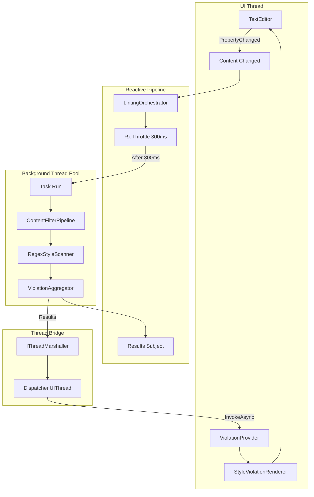
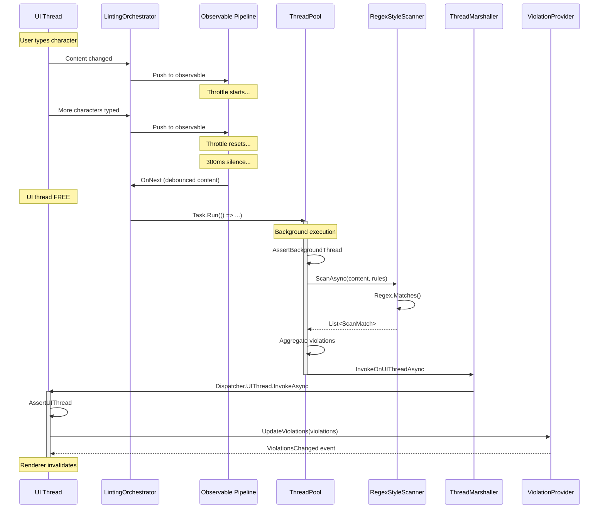
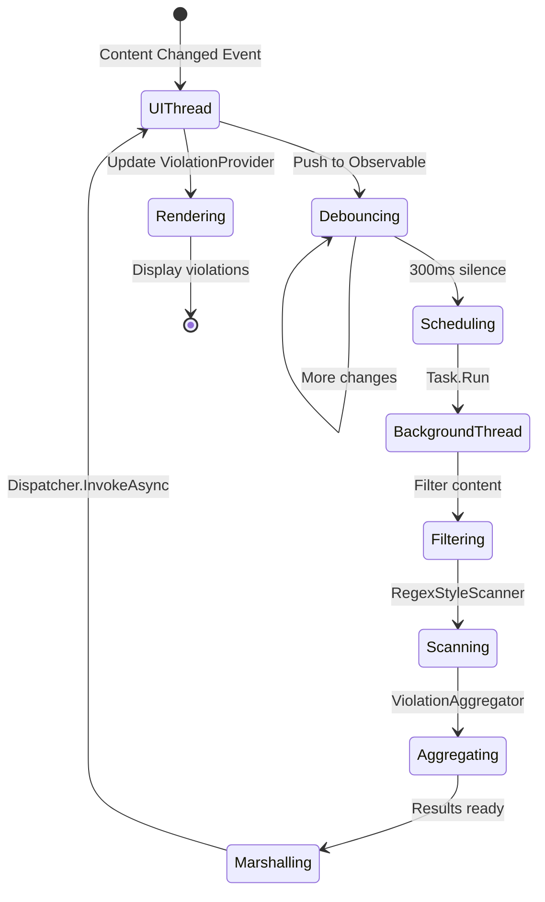

# LCS-INF-027a: Async Offloading

## 1. Metadata & Categorization

| Field                | Value                                | Description                                      |
| :------------------- | :----------------------------------- | :----------------------------------------------- |
| **Feature ID**       | `INF-027a`                           | Sub-part A of Performance Polish                 |
| **Feature Name**     | Async Offloading                     | Background thread execution with UI marshalling  |
| **Target Version**   | `v0.2.7a`                            | First sub-part of v0.2.7                         |
| **Module Scope**     | `Lexichord.Modules.Style`            | Style governance module                          |
| **Swimlane**         | `Product`                            | Core User-Facing Feature                         |
| **License Tier**     | `Core`                               | Foundation (Available in Free tier)              |
| **Author**           | System Architect                     |                                                  |
| **Status**           | **Draft**                            | Pending implementation                           |
| **Last Updated**     | 2026-01-26                           |                                                  |

---

## 2. Executive Summary

### 2.1 The Requirement

Lexichord's linting system must **never block the UI thread**:

- Regex scanning is CPU-intensive and can take hundreds of milliseconds for large documents.
- Blocking the UI thread causes input lag, making typing feel sluggish.
- Users expect modern applications to remain responsive at all times.
- Results from background operations must be safely marshalled to the UI thread for rendering.

Without proper async patterns, even a 50ms scan creates perceptible jank during rapid typing.

### 2.2 The Proposed Solution

We **SHALL** implement comprehensive async offloading with:

1. **Task.Run Execution** — All regex scanning operations wrapped in `Task.Run` for true background execution.
2. **Dispatcher Marshalling** — Results delivered to UI thread via `Dispatcher.UIThread.InvokeAsync`.
3. **Thread Assertions** — Debug-only assertions verify correct thread context.
4. **Cancellation Propagation** — Cancellation tokens flow across thread boundaries.

---

## 3. Architecture

### 3.1 Component Structure



### 3.2 Execution Flow Sequence



### 3.3 Thread State Diagram



---

## 4. Decision Tree: Thread Context Selection

```text
START: "Where should this operation run?"
|
+-- Is it UI rendering or update?
|   +-- YES -> UI Thread (required)
|   |   +-- Example: ViolationProvider.UpdateViolations
|   |   +-- Example: StyleViolationRenderer.ColorizeLine
|   |   +-- Example: TextEditor property access
|   +-- NO -> Continue
|
+-- Is it CPU-intensive computation?
|   +-- YES -> Background Thread
|   |   +-- Example: Regex.Matches execution
|   |   +-- Example: Violation aggregation
|   |   +-- Example: Content filtering
|   +-- NO -> Continue
|
+-- Is it file I/O or network?
|   +-- YES -> Background Thread (async/await)
|   |   +-- Example: Rule file loading
|   |   +-- Example: Database queries
|   +-- NO -> Continue
|
+-- Is it event subscription/coordination?
|   +-- YES -> Either (but be consistent)
|   |   +-- Example: Observable subscriptions
|   |   +-- Example: MediatR publishing
|   +-- NO -> Default to calling thread
|
END
```

---

## 5. Data Contracts

### 5.1 IThreadMarshaller Interface

```csharp
namespace Lexichord.Abstractions.Contracts;

using System;
using System.Diagnostics;
using System.Threading.Tasks;

/// <summary>
/// Marshalls operations between background and UI threads safely.
/// </summary>
/// <remarks>
/// LOGIC: IThreadMarshaller provides a testable abstraction over
/// platform-specific thread dispatching. The production implementation
/// uses Avalonia's Dispatcher.UIThread; tests use a synchronous mock.
///
/// Key Responsibilities:
/// - Invoke actions on UI thread from any thread
/// - Assert correct thread context in debug builds
/// - Provide fire-and-forget posting for non-critical updates
///
/// Thread Safety:
/// - All methods are thread-safe and can be called from any thread
/// - Multiple concurrent calls are serialized on the UI thread
/// </remarks>
public interface IThreadMarshaller
{
    /// <summary>
    /// Invokes an action on the UI thread and awaits completion.
    /// </summary>
    /// <param name="action">The action to invoke on the UI thread.</param>
    /// <returns>Task that completes when action finishes on UI thread.</returns>
    /// <remarks>
    /// LOGIC: If already on UI thread, executes synchronously and returns
    /// completed task. Otherwise, dispatches to UI thread and awaits.
    ///
    /// Use this when:
    /// - You need to wait for the UI update to complete
    /// - You need to coordinate UI updates with subsequent operations
    ///
    /// Example:
    /// <code>
    /// await _marshaller.InvokeOnUIThreadAsync(() =>
    /// {
    ///     _provider.UpdateViolations(violations);
    /// });
    /// // At this point, violations are definitely updated
    /// </code>
    /// </remarks>
    Task InvokeOnUIThreadAsync(Action action);

    /// <summary>
    /// Invokes a function on the UI thread and returns the result.
    /// </summary>
    /// <typeparam name="T">The return type of the function.</typeparam>
    /// <param name="func">The function to invoke on the UI thread.</param>
    /// <returns>Task with the function's return value.</returns>
    /// <remarks>
    /// LOGIC: Same as InvokeOnUIThreadAsync(Action) but captures return value.
    ///
    /// Example:
    /// <code>
    /// var bounds = await _marshaller.InvokeOnUIThreadAsync(() =>
    ///     _editor.TextArea.TextView.GetVisualLine(42)?.VisualBounds);
    /// </code>
    /// </remarks>
    Task<T> InvokeOnUIThreadAsync<T>(Func<T> func);

    /// <summary>
    /// Posts an action to the UI thread without waiting for completion.
    /// </summary>
    /// <param name="action">The action to post.</param>
    /// <remarks>
    /// LOGIC: Fire-and-forget dispatch. Use when:
    /// - Caller doesn't need to wait for completion
    /// - UI update is not time-critical
    /// - You want to avoid blocking the background thread
    ///
    /// Warning: Exceptions in the action are not propagated to caller.
    /// Ensure actions have proper error handling.
    ///
    /// Example:
    /// <code>
    /// // Update UI but don't wait
    /// _marshaller.PostToUIThread(() =>
    /// {
    ///     _statusBar.Text = "Scan complete";
    /// });
    /// // Continues immediately, UI updates when it can
    /// </code>
    /// </remarks>
    void PostToUIThread(Action action);

    /// <summary>
    /// Gets whether the current thread is the UI thread.
    /// </summary>
    /// <remarks>
    /// LOGIC: Returns true if called from the Avalonia UI thread.
    /// Useful for conditional logic based on thread context.
    ///
    /// Note: Prefer using AssertUIThread/AssertBackgroundThread for
    /// debugging rather than branching on this property.
    /// </remarks>
    bool IsOnUIThread { get; }

    /// <summary>
    /// Asserts that the current code is running on the UI thread.
    /// </summary>
    /// <param name="operation">Operation name for the error message.</param>
    /// <remarks>
    /// LOGIC: Debug-only assertion that throws InvalidOperationException
    /// if not on UI thread. Compiled out in release builds.
    ///
    /// Place at the start of methods that MUST run on UI thread:
    /// <code>
    /// public void UpdateUI()
    /// {
    ///     _marshaller.AssertUIThread(nameof(UpdateUI));
    ///     // Safe to access UI controls here
    /// }
    /// </code>
    /// </remarks>
    /// <exception cref="InvalidOperationException">
    /// Thrown in DEBUG builds if not on UI thread.
    /// </exception>
    [Conditional("DEBUG")]
    void AssertUIThread(string operation);

    /// <summary>
    /// Asserts that the current code is NOT on the UI thread.
    /// </summary>
    /// <param name="operation">Operation name for the error message.</param>
    /// <remarks>
    /// LOGIC: Debug-only assertion that throws InvalidOperationException
    /// if ON UI thread. Compiled out in release builds.
    ///
    /// Place at the start of CPU-intensive methods:
    /// <code>
    /// public async Task ScanAsync()
    /// {
    ///     _marshaller.AssertBackgroundThread(nameof(ScanAsync));
    ///     // Safe to do heavy computation here
    /// }
    /// </code>
    /// </remarks>
    /// <exception cref="InvalidOperationException">
    /// Thrown in DEBUG builds if on UI thread.
    /// </exception>
    [Conditional("DEBUG")]
    void AssertBackgroundThread(string operation);
}
```

### 5.2 AvaloniaThreadMarshaller Implementation

```csharp
namespace Lexichord.Modules.Style.Threading;

using System;
using System.Diagnostics;
using System.Threading.Tasks;
using Avalonia.Threading;
using Lexichord.Abstractions.Contracts;
using Microsoft.Extensions.Logging;

/// <summary>
/// Avalonia implementation of IThreadMarshaller using Dispatcher.UIThread.
/// </summary>
/// <remarks>
/// LOGIC: This implementation bridges the abstraction layer to Avalonia's
/// actual threading infrastructure. The Dispatcher.UIThread provides
/// access to the main Avalonia event loop.
///
/// Thread Safety:
/// - All methods can be safely called from any thread
/// - Dispatcher.UIThread.InvokeAsync is inherently thread-safe
/// - CheckAccess() is thread-safe
/// </remarks>
public sealed class AvaloniaThreadMarshaller : IThreadMarshaller
{
    private readonly ILogger<AvaloniaThreadMarshaller> _logger;

    public AvaloniaThreadMarshaller(ILogger<AvaloniaThreadMarshaller> logger)
    {
        _logger = logger ?? throw new ArgumentNullException(nameof(logger));
    }

    /// <inheritdoc/>
    public bool IsOnUIThread => Dispatcher.UIThread.CheckAccess();

    /// <inheritdoc/>
    public async Task InvokeOnUIThreadAsync(Action action)
    {
        ArgumentNullException.ThrowIfNull(action);

        if (IsOnUIThread)
        {
            // LOGIC: Already on UI thread, execute directly
            action();
            return;
        }

        _logger.LogDebug(
            "Marshalling action to UI thread from thread {ThreadId}",
            Environment.CurrentManagedThreadId);

        // LOGIC: Dispatch to UI thread and await completion
        await Dispatcher.UIThread.InvokeAsync(action);
    }

    /// <inheritdoc/>
    public async Task<T> InvokeOnUIThreadAsync<T>(Func<T> func)
    {
        ArgumentNullException.ThrowIfNull(func);

        if (IsOnUIThread)
        {
            // LOGIC: Already on UI thread, execute directly
            return func();
        }

        _logger.LogDebug(
            "Marshalling function to UI thread from thread {ThreadId}",
            Environment.CurrentManagedThreadId);

        // LOGIC: Dispatch to UI thread and await result
        return await Dispatcher.UIThread.InvokeAsync(func);
    }

    /// <inheritdoc/>
    public void PostToUIThread(Action action)
    {
        ArgumentNullException.ThrowIfNull(action);

        if (IsOnUIThread)
        {
            // LOGIC: Already on UI thread, execute directly
            action();
            return;
        }

        // LOGIC: Fire-and-forget dispatch
        // Wrap in try-catch to log exceptions since they won't propagate
        Dispatcher.UIThread.Post(() =>
        {
            try
            {
                action();
            }
            catch (Exception ex)
            {
                _logger.LogError(ex, "Exception in posted UI action");
            }
        });
    }

    /// <inheritdoc/>
    [Conditional("DEBUG")]
    public void AssertUIThread(string operation)
    {
        if (!IsOnUIThread)
        {
            var message = $"{operation} must run on UI thread but was called on thread {Environment.CurrentManagedThreadId}";
            _logger.LogWarning(message);
            throw new InvalidOperationException(message);
        }
    }

    /// <inheritdoc/>
    [Conditional("DEBUG")]
    public void AssertBackgroundThread(string operation)
    {
        if (IsOnUIThread)
        {
            var message = $"{operation} must run on background thread but was called on UI thread";
            _logger.LogWarning(message);
            throw new InvalidOperationException(message);
        }
    }
}
```

### 5.3 Enhanced LintingOrchestrator

```csharp
namespace Lexichord.Modules.Style.Services;

using System;
using System.Collections.Concurrent;
using System.Reactive.Linq;
using System.Reactive.Subjects;
using System.Threading;
using System.Threading.Tasks;
using Lexichord.Abstractions.Contracts;
using Lexichord.Abstractions.Events;
using MediatR;
using Microsoft.Extensions.Logging;

/// <summary>
/// Orchestrates the linting pipeline with proper async offloading.
/// </summary>
/// <remarks>
/// LOGIC: v0.2.7a enhances the orchestrator with explicit thread management:
/// - Content changes received on UI thread (PropertyChanged)
/// - Debounce operates on Rx scheduler (typically ThreadPool)
/// - Scan operations explicitly dispatched to Task.Run
/// - Results marshalled back to UI thread for rendering
///
/// Thread Flow:
/// 1. UI Thread: Content change detected
/// 2. Rx Thread: Debounce processing
/// 3. ThreadPool: Task.Run for scanning
/// 4. ThreadPool: Aggregation completes
/// 5. UI Thread: Results delivered via Dispatcher
/// </remarks>
public sealed partial class LintingOrchestrator : ILintingOrchestrator
{
    private readonly IStyleScanner _scanner;
    private readonly IViolationAggregator _aggregator;
    private readonly ILintingConfiguration _config;
    private readonly IStyleRuleCache _ruleCache;
    private readonly IMediator _mediator;
    private readonly IThreadMarshaller _threadMarshaller;
    private readonly ContentFilterPipeline _filterPipeline;
    private readonly IViolationProvider _violationProvider;
    private readonly IPerformanceMonitor _performanceMonitor;
    private readonly ILogger<LintingOrchestrator> _logger;

    private readonly ConcurrentDictionary<string, DocumentLintState> _documentStates = new();
    private readonly Subject<LintingResult> _resultsSubject = new();
    private bool _disposed;
    private bool _isPaused;

    public LintingOrchestrator(
        IStyleScanner scanner,
        IViolationAggregator aggregator,
        ILintingConfiguration config,
        IStyleRuleCache ruleCache,
        IMediator mediator,
        IThreadMarshaller threadMarshaller,
        ContentFilterPipeline filterPipeline,
        IViolationProvider violationProvider,
        IPerformanceMonitor performanceMonitor,
        ILogger<LintingOrchestrator> logger)
    {
        _scanner = scanner ?? throw new ArgumentNullException(nameof(scanner));
        _aggregator = aggregator ?? throw new ArgumentNullException(nameof(aggregator));
        _config = config ?? throw new ArgumentNullException(nameof(config));
        _ruleCache = ruleCache ?? throw new ArgumentNullException(nameof(ruleCache));
        _mediator = mediator ?? throw new ArgumentNullException(nameof(mediator));
        _threadMarshaller = threadMarshaller ?? throw new ArgumentNullException(nameof(threadMarshaller));
        _filterPipeline = filterPipeline ?? throw new ArgumentNullException(nameof(filterPipeline));
        _violationProvider = violationProvider ?? throw new ArgumentNullException(nameof(violationProvider));
        _performanceMonitor = performanceMonitor ?? throw new ArgumentNullException(nameof(performanceMonitor));
        _logger = logger ?? throw new ArgumentNullException(nameof(logger));
    }

    /// <summary>
    /// Called when content has stabilized after debounce.
    /// </summary>
    /// <remarks>
    /// LOGIC: This is called from the Rx scheduler (typically ThreadPool).
    /// We dispatch to Task.Run to ensure we're definitely on a background
    /// thread for the CPU-intensive scanning work.
    /// </remarks>
    private void OnContentStabilized(
        string documentId,
        string content,
        string fileExtension,
        DocumentLintState state)
    {
        if (_isPaused || state.IsPaused || !_config.IsEnabled)
        {
            _logger.LogDebug(
                "Skipping lint for {DocumentId} - paused or disabled",
                documentId);
            return;
        }

        // LOGIC: Cancel any previous in-flight scan for this document
        state.CancelCurrentScan();

        var scanCts = state.CreateScanCancellationToken();

        // LOGIC: Dispatch to ThreadPool explicitly via Task.Run
        // This ensures we're off the UI thread even if Rx called us there
        _ = Task.Run(async () =>
        {
            try
            {
                // LOGIC: Assert we're on a background thread
                _threadMarshaller.AssertBackgroundThread("OnContentStabilized.Task.Run");

                await ExecuteLintAsync(
                    documentId,
                    content,
                    fileExtension,
                    scanCts);
            }
            catch (OperationCanceledException)
            {
                _logger.LogDebug(
                    "Lint cancelled for document {DocumentId}",
                    documentId);
            }
            catch (Exception ex)
            {
                _logger.LogError(
                    ex,
                    "Unhandled error in lint task for {DocumentId}",
                    documentId);
            }
        }, scanCts);
    }

    /// <summary>
    /// Executes the actual linting operation on a background thread.
    /// </summary>
    /// <remarks>
    /// LOGIC: This method MUST run on a background thread. It performs:
    /// 1. Content filtering (CPU-bound)
    /// 2. Regex scanning (CPU-bound)
    /// 3. Violation aggregation (CPU-bound)
    /// 4. UI update marshalling (thread hop)
    ///
    /// Thread context is asserted at entry in debug builds.
    /// </remarks>
    private async Task<LintingResult> ExecuteLintAsync(
        string documentId,
        string content,
        string fileExtension,
        CancellationToken cancellationToken)
    {
        // LOGIC: Verify we're not on UI thread
        _threadMarshaller.AssertBackgroundThread(nameof(ExecuteLintAsync));

        using var operation = _performanceMonitor.StartOperation($"Lint:{documentId}");

        _logger.LogDebug(
            "Executing lint for document {DocumentId} ({Length} chars) on thread {ThreadId}",
            documentId, content.Length, Environment.CurrentManagedThreadId);

        var stopwatch = System.Diagnostics.Stopwatch.StartNew();

        try
        {
            // LOGIC: Notify lint started (can fire from any thread)
            await _mediator.Publish(
                new LintingStartedEvent(documentId),
                cancellationToken);

            cancellationToken.ThrowIfCancellationRequested();

            // LOGIC: Filter content (CPU-bound, runs here on background)
            var filteredContent = _filterPipeline.Filter(content, fileExtension);

            _logger.LogDebug(
                "Content filtered: {Excluded} bytes excluded in {Count} regions",
                filteredContent.TotalExcludedLength,
                filteredContent.ExcludedRegions.Count);

            cancellationToken.ThrowIfCancellationRequested();

            // LOGIC: Get active rules from cache
            var rules = await _ruleCache.GetActiveRulesAsync(cancellationToken);

            cancellationToken.ThrowIfCancellationRequested();

            // LOGIC: Execute scan (CPU-bound, runs here on background)
            var scanOptions = ScanOptions.Default with
            {
                RegexTimeout = _config.RegexTimeout,
                ExcludedRegions = filteredContent.ExcludedRegions
            };

            var matches = await _scanner.ScanAsync(
                filteredContent.ProcessedContent,
                rules,
                scanOptions,
                cancellationToken);

            cancellationToken.ThrowIfCancellationRequested();

            // LOGIC: Aggregate violations (CPU-bound)
            var violations = _aggregator.Aggregate(
                matches,
                documentId,
                content,
                filteredContent.ExcludedRegions);

            stopwatch.Stop();

            var result = new LintingResult(
                DocumentId: documentId,
                Violations: violations,
                ScanDuration: stopwatch.Elapsed,
                RulesChecked: rules.Count,
                ContentLength: content.Length,
                WasPartialScan: false,
                Timestamp: DateTimeOffset.UtcNow);

            // LOGIC: Marshall violation update to UI thread
            // This is the critical thread hop - must await completion
            await _threadMarshaller.InvokeOnUIThreadAsync(() =>
            {
                _threadMarshaller.AssertUIThread("ViolationProvider.UpdateViolations");
                _violationProvider.UpdateViolations(documentId, violations);
            });

            // LOGIC: Publish completion event (thread-safe)
            await _mediator.Publish(
                new LintingCompletedEvent(result),
                cancellationToken);

            // LOGIC: Emit to observable stream (thread-safe)
            _resultsSubject.OnNext(result);

            _logger.LogDebug(
                "Lint completed for {DocumentId}: {ViolationCount} violations in {Duration}ms",
                documentId, result.ViolationCount, stopwatch.ElapsedMilliseconds);

            return result;
        }
        catch (OperationCanceledException)
        {
            _logger.LogDebug("Lint cancelled for document {DocumentId}", documentId);

            await _mediator.Publish(
                new LintingCancelledEvent(documentId, "Operation cancelled"),
                CancellationToken.None);

            throw;
        }
        catch (Exception ex)
        {
            _logger.LogError(ex, "Lint failed for document {DocumentId}", documentId);
            throw;
        }
    }
}

/// <summary>
/// Internal state tracking for a document being linted.
/// </summary>
internal sealed class DocumentLintState : IDisposable
{
    private CancellationTokenSource? _scanCts;
    private readonly object _lock = new();

    public IManuscriptViewModel Document { get; }
    public CancellationTokenSource CancellationTokenSource { get; } = new();
    public IDisposable? Subscription { get; set; }
    public DateTimeOffset? LastLintTime { get; set; }
    public int LintCount { get; set; }
    public bool IsPaused { get; set; }

    public DocumentLintState(IManuscriptViewModel document)
    {
        Document = document ?? throw new ArgumentNullException(nameof(document));
    }

    /// <summary>
    /// Cancels the current in-flight scan, if any.
    /// </summary>
    /// <remarks>
    /// LOGIC: Called before starting a new scan to cancel any
    /// previous scan that may still be running. This prevents
    /// outdated results from overwriting newer ones.
    /// </remarks>
    public void CancelCurrentScan()
    {
        lock (_lock)
        {
            _scanCts?.Cancel();
            _scanCts?.Dispose();
            _scanCts = null;
        }
    }

    /// <summary>
    /// Creates a new cancellation token for the current scan.
    /// </summary>
    /// <returns>Linked cancellation token.</returns>
    /// <remarks>
    /// LOGIC: Creates a token linked to the document's main token.
    /// This allows cancelling individual scans OR all scans for
    /// the document when it closes.
    /// </remarks>
    public CancellationToken CreateScanCancellationToken()
    {
        lock (_lock)
        {
            _scanCts = CancellationTokenSource.CreateLinkedTokenSource(
                CancellationTokenSource.Token);
            return _scanCts.Token;
        }
    }

    public void Dispose()
    {
        CancelCurrentScan();
        CancellationTokenSource.Cancel();
        Subscription?.Dispose();
        CancellationTokenSource.Dispose();
    }
}
```

---

## 6. Implementation Logic

### 6.1 Cancellation Token Flow

```csharp
/// <summary>
/// Demonstrates proper cancellation token flow across threads.
/// </summary>
/// <remarks>
/// LOGIC: Cancellation must work across the thread boundary:
/// 1. Document closes -> Document CTS cancelled
/// 2. New typing -> Scan CTS cancelled (but document CTS alive)
/// 3. Either cancellation -> OperationCanceledException in scan
/// 4. Scan catches exception -> Logs and exits cleanly
///
/// The linked token pattern ensures proper propagation.
/// </remarks>
public static class CancellationTokenFlow
{
    /*
     * Token Hierarchy:
     *
     * DocumentLintState.CancellationTokenSource (parent)
     *    |
     *    +-- DocumentLintState._scanCts (child, linked)
     *           |
     *           +-- ExecuteLintAsync receives this token
     *           +-- ScanAsync receives this token
     *           +-- All async operations check this token
     *
     * Cancellation Scenarios:
     *
     * Scenario 1: Document closes
     *   -> Parent CTS cancelled
     *   -> Child CTS automatically cancelled (linked)
     *   -> All operations cancel
     *
     * Scenario 2: User types more (new scan supersedes old)
     *   -> Child CTS cancelled (CancelCurrentScan)
     *   -> Parent CTS still alive
     *   -> New child CTS created for new scan
     *   -> Old scan cancels, new scan starts
     */
}
```

### 6.2 Thread-Safe ViolationProvider Update

```csharp
/// <summary>
/// Extension to ViolationProvider for thread-safe updates.
/// </summary>
/// <remarks>
/// LOGIC: ViolationProvider stores violations and notifies the
/// renderer when they change. Since the renderer accesses this
/// data during UI rendering, updates MUST happen on UI thread.
/// </remarks>
public interface IViolationProvider
{
    /// <summary>
    /// Updates violations for a document.
    /// </summary>
    /// <param name="documentId">Document to update.</param>
    /// <param name="violations">New violations.</param>
    /// <remarks>
    /// LOGIC: This method MUST be called on the UI thread.
    /// It updates the internal collection and fires
    /// ViolationsChanged to trigger re-rendering.
    ///
    /// Thread safety is the caller's responsibility.
    /// </remarks>
    void UpdateViolations(
        string documentId,
        IReadOnlyList<StyleViolation> violations);

    // ... other members
}
```

---

## 7. Use Cases

### UC-01: Scan Completes Without Blocking UI

**Preconditions:**
- User is actively typing in a document.
- Debounce triggers after 300ms pause.

**Flow:**
1. Debounce triggers `OnContentStabilized`.
2. Method dispatches work to `Task.Run`.
3. UI thread immediately returns to event loop.
4. User continues typing smoothly.
5. Background thread executes scan.
6. Results marshalled to UI via Dispatcher.
7. Violations appear without interrupting typing.

**Postconditions:**
- Zero UI thread blocking during scan.
- User experiences no input lag.

---

### UC-02: Rapid Typing Cancels Previous Scan

**Preconditions:**
- User types quickly, triggering multiple debounce cycles.

**Flow:**
1. First debounce completes, scan starts.
2. User types more, resetting debounce.
3. Second debounce completes.
4. `CancelCurrentScan` cancels first scan.
5. New scan token created.
6. Second scan dispatched.
7. First scan's `OperationCanceledException` caught.
8. Second scan completes normally.

**Postconditions:**
- Only latest scan results displayed.
- No stale violations from cancelled scan.
- Clean resource cleanup.

---

## 8. Observability & Logging

| Level | Context | Message Template |
|:------|:--------|:-----------------|
| Debug | LintingOrchestrator | `Executing lint for document {DocumentId} ({Length} chars) on thread {ThreadId}` |
| Debug | LintingOrchestrator | `Lint completed for {DocumentId}: {ViolationCount} violations in {Duration}ms` |
| Debug | LintingOrchestrator | `Lint cancelled for document {DocumentId}` |
| Debug | LintingOrchestrator | `Skipping lint for {DocumentId} - paused or disabled` |
| Debug | AvaloniaThreadMarshaller | `Marshalling action to UI thread from thread {ThreadId}` |
| Warning | AvaloniaThreadMarshaller | `AssertUIThread failed: {Message}` |
| Warning | AvaloniaThreadMarshaller | `AssertBackgroundThread failed: {Message}` |
| Error | AvaloniaThreadMarshaller | `Exception in posted UI action` |
| Error | LintingOrchestrator | `Unhandled error in lint task for {DocumentId}` |

---

## 9. Unit Testing Requirements

### 9.1 ThreadMarshaller Tests

```csharp
[TestFixture]
[Category("Unit")]
public class ThreadMarshallerTests
{
    [Test]
    public async Task InvokeOnUIThreadAsync_ExecutesAction()
    {
        // Arrange
        var marshaller = new TestThreadMarshaller();
        var executed = false;

        // Act
        await marshaller.InvokeOnUIThreadAsync(() => executed = true);

        // Assert
        Assert.That(executed, Is.True);
    }

    [Test]
    public async Task InvokeOnUIThreadAsync_Func_ReturnsValue()
    {
        // Arrange
        var marshaller = new TestThreadMarshaller();

        // Act
        var result = await marshaller.InvokeOnUIThreadAsync(() => 42);

        // Assert
        Assert.That(result, Is.EqualTo(42));
    }

    [Test]
    public void PostToUIThread_ExecutesAction()
    {
        // Arrange
        var marshaller = new TestThreadMarshaller();
        var executed = false;

        // Act
        marshaller.PostToUIThread(() => executed = true);

        // Assert
        Assert.That(executed, Is.True);
    }

    [Test]
    public void AssertUIThread_OnUIThread_NoException()
    {
        // Arrange
        var marshaller = new TestThreadMarshaller { SimulateUIThread = true };

        // Act & Assert
        Assert.DoesNotThrow(() => marshaller.AssertUIThread("test"));
    }

#if DEBUG
    [Test]
    public void AssertUIThread_NotOnUIThread_Throws()
    {
        // Arrange
        var marshaller = new TestThreadMarshaller { SimulateUIThread = false };

        // Act & Assert
        Assert.Throws<InvalidOperationException>(() =>
            marshaller.AssertUIThread("test"));
    }
#endif

    [Test]
    public void AssertBackgroundThread_NotOnUIThread_NoException()
    {
        // Arrange
        var marshaller = new TestThreadMarshaller { SimulateUIThread = false };

        // Act & Assert
        Assert.DoesNotThrow(() => marshaller.AssertBackgroundThread("test"));
    }

#if DEBUG
    [Test]
    public void AssertBackgroundThread_OnUIThread_Throws()
    {
        // Arrange
        var marshaller = new TestThreadMarshaller { SimulateUIThread = true };

        // Act & Assert
        Assert.Throws<InvalidOperationException>(() =>
            marshaller.AssertBackgroundThread("test"));
    }
#endif

    [Test]
    public void IsOnUIThread_ReturnsSimulatedValue()
    {
        // Arrange
        var marshaller = new TestThreadMarshaller { SimulateUIThread = true };

        // Assert
        Assert.That(marshaller.IsOnUIThread, Is.True);

        // Change
        marshaller.SimulateUIThread = false;

        // Assert
        Assert.That(marshaller.IsOnUIThread, Is.False);
    }
}

/// <summary>
/// Test implementation for unit tests.
/// </summary>
internal class TestThreadMarshaller : IThreadMarshaller
{
    public bool SimulateUIThread { get; set; } = true;
    public bool IsOnUIThread => SimulateUIThread;

    public Task InvokeOnUIThreadAsync(Action action)
    {
        action();
        return Task.CompletedTask;
    }

    public Task<T> InvokeOnUIThreadAsync<T>(Func<T> func)
    {
        return Task.FromResult(func());
    }

    public void PostToUIThread(Action action)
    {
        action();
    }

    public void AssertUIThread(string operation)
    {
        if (!SimulateUIThread)
            throw new InvalidOperationException(
                $"{operation} must run on UI thread");
    }

    public void AssertBackgroundThread(string operation)
    {
        if (SimulateUIThread)
            throw new InvalidOperationException(
                $"{operation} must run on background thread");
    }
}
```

### 9.2 DocumentLintState Cancellation Tests

```csharp
[TestFixture]
[Category("Unit")]
public class DocumentLintStateTests
{
    [Test]
    public void CancelCurrentScan_CancelsToken()
    {
        // Arrange
        var document = Mock.Of<IManuscriptViewModel>(d => d.Id == "test");
        var state = new DocumentLintState(document);
        var token = state.CreateScanCancellationToken();

        // Act
        state.CancelCurrentScan();

        // Assert
        Assert.That(token.IsCancellationRequested, Is.True);
    }

    [Test]
    public void CreateScanCancellationToken_LinkedToParent()
    {
        // Arrange
        var document = Mock.Of<IManuscriptViewModel>(d => d.Id == "test");
        var state = new DocumentLintState(document);
        var token = state.CreateScanCancellationToken();

        // Act - cancel parent
        state.CancellationTokenSource.Cancel();

        // Assert - child also cancelled
        Assert.That(token.IsCancellationRequested, Is.True);
    }

    [Test]
    public void CreateScanCancellationToken_ReplacesOldToken()
    {
        // Arrange
        var document = Mock.Of<IManuscriptViewModel>(d => d.Id == "test");
        var state = new DocumentLintState(document);
        var oldToken = state.CreateScanCancellationToken();

        // Act
        var newToken = state.CreateScanCancellationToken();

        // Assert
        Assert.Multiple(() =>
        {
            Assert.That(oldToken.IsCancellationRequested, Is.True);
            Assert.That(newToken.IsCancellationRequested, Is.False);
        });
    }

    [Test]
    public void Dispose_CancelsAllTokens()
    {
        // Arrange
        var document = Mock.Of<IManuscriptViewModel>(d => d.Id == "test");
        var state = new DocumentLintState(document);
        var token = state.CreateScanCancellationToken();

        // Act
        state.Dispose();

        // Assert
        Assert.Multiple(() =>
        {
            Assert.That(state.CancellationTokenSource.IsCancellationRequested, Is.True);
            Assert.That(token.IsCancellationRequested, Is.True);
        });
    }
}
```

---

## 10. Security & Safety

### 10.1 Cross-Thread Exception Handling

> [!WARNING]
> Exceptions on background threads don't propagate to UI thread.

- **Task.Run Exceptions:** Wrapped in try-catch with logging.
- **Posted Actions:** Try-catch in PostToUIThread wrapper.
- **Unobserved Tasks:** TaskScheduler.UnobservedTaskException handled globally.

### 10.2 Deadlock Prevention

- **No Blocking Waits:** Never use `.Result` or `.Wait()` on UI thread.
- **InvokeAsync over Invoke:** Always use async dispatch.
- **Timeout Protection:** Operations have timeouts to prevent infinite waits.

---

## 11. Risks & Mitigations

| Risk | Impact | Mitigation |
|:-----|:-------|:-----------|
| Dispatcher deadlock | Critical | Use InvokeAsync, never blocking wait |
| Exception on background thread lost | High | Comprehensive try-catch with logging |
| Race condition in cancellation | Medium | Linked tokens, lock on state changes |
| Thread assertion false positive | Low | Conditional compilation, thorough testing |

---

## 12. Acceptance Criteria (QA)

| # | Category | Criterion |
|:--|:---------|:----------|
| 1 | **[Threading]** | Scan operations execute on ThreadPool thread |
| 2 | **[Threading]** | UI thread never blocked during scan |
| 3 | **[Threading]** | Violation updates delivered on UI thread |
| 4 | **[Assertions]** | Debug builds assert correct thread context |
| 5 | **[Cancellation]** | Document close cancels active scan |
| 6 | **[Cancellation]** | New typing cancels previous scan |
| 7 | **[Exceptions]** | Background exceptions logged, not lost |
| 8 | **[Performance]** | Thread hop latency <5ms |

---

## 13. Verification Commands

```bash
# 1. Build with debug assertions
dotnet build src/Lexichord.Modules.Style -c Debug

# 2. Run threading tests
dotnet test --filter "FullyQualifiedName~ThreadMarshaller"
dotnet test --filter "FullyQualifiedName~DocumentLintState"

# 3. Verify async execution:
# - Add breakpoint in ExecuteLintAsync
# - Check Environment.CurrentManagedThreadId != 1 (not UI)

# 4. Verify UI marshalling:
# - Add breakpoint in UpdateViolations
# - Check Dispatcher.UIThread.CheckAccess() == true

# 5. Test cancellation:
# - Start typing in large document
# - Verify first scan cancelled when more typing occurs

# 6. Profile thread usage:
# - Use Visual Studio Parallel Stacks
# - Verify no blocking waits on UI thread
```

---

## 14. Deliverable Checklist

| Step | Description | Status |
|:-----|:------------|:-------|
| 1 | Define IThreadMarshaller interface | [ ] |
| 2 | Implement AvaloniaThreadMarshaller | [ ] |
| 3 | Add AssertUIThread/AssertBackgroundThread | [ ] |
| 4 | Update LintingOrchestrator with Task.Run | [ ] |
| 5 | Implement DocumentLintState.CancelCurrentScan | [ ] |
| 6 | Implement linked cancellation tokens | [ ] |
| 7 | Marshall violation updates via Dispatcher | [ ] |
| 8 | Add thread hop latency logging | [ ] |
| 9 | Register AvaloniaThreadMarshaller in DI | [ ] |
| 10 | Unit tests for ThreadMarshaller | [ ] |
| 11 | Unit tests for DocumentLintState | [ ] |
| 12 | Integration tests for async flow | [ ] |
| 13 | Verify no UI blocking under load | [ ] |
