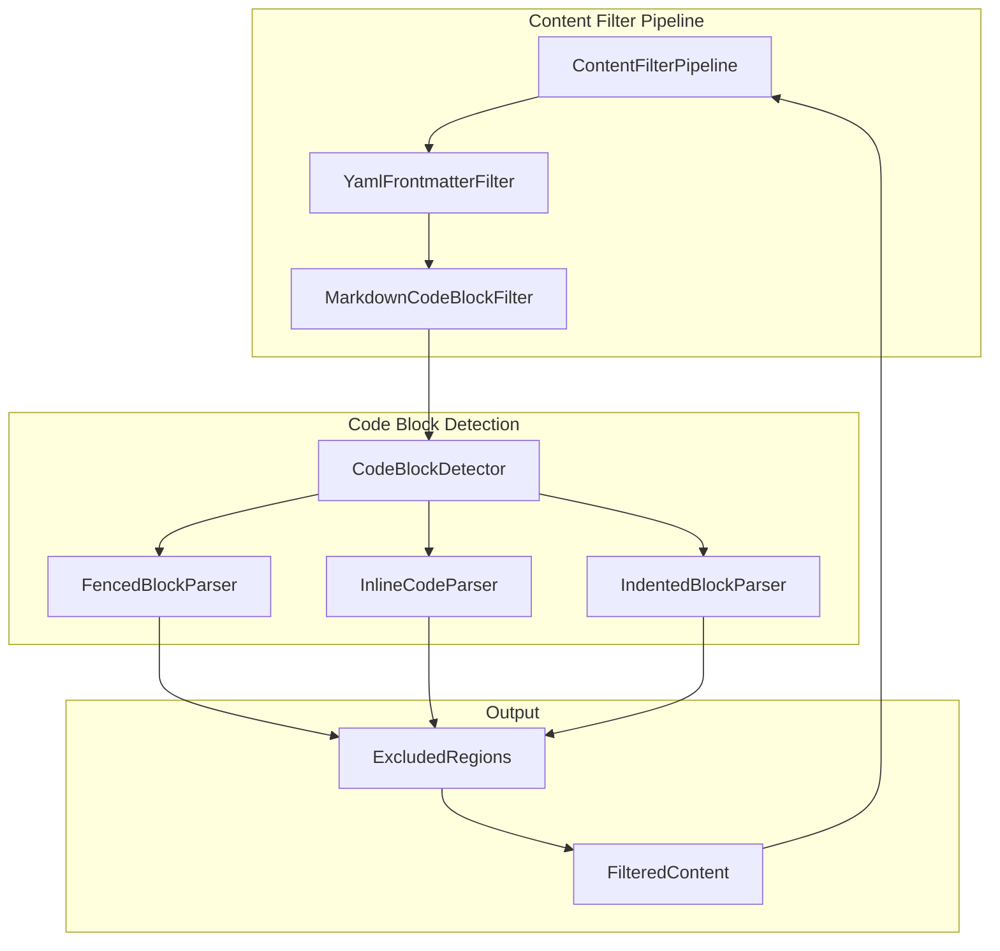
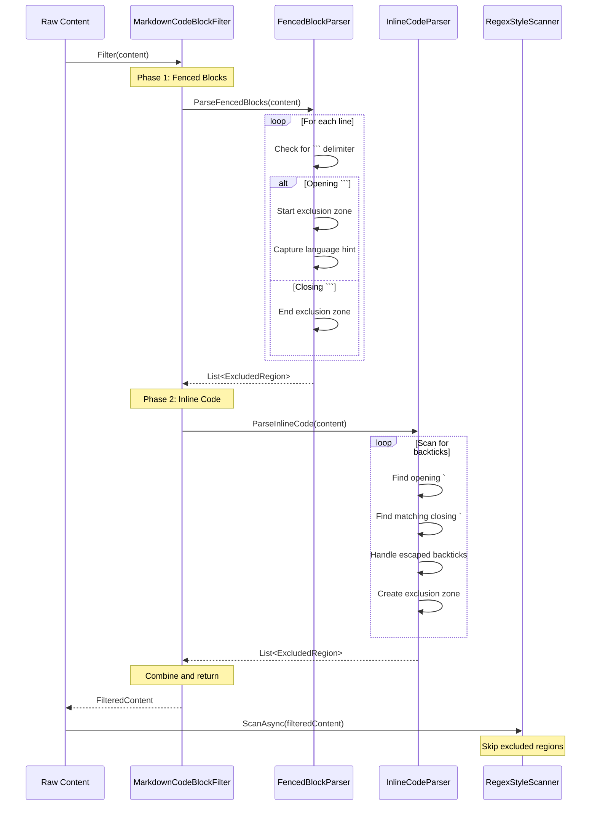
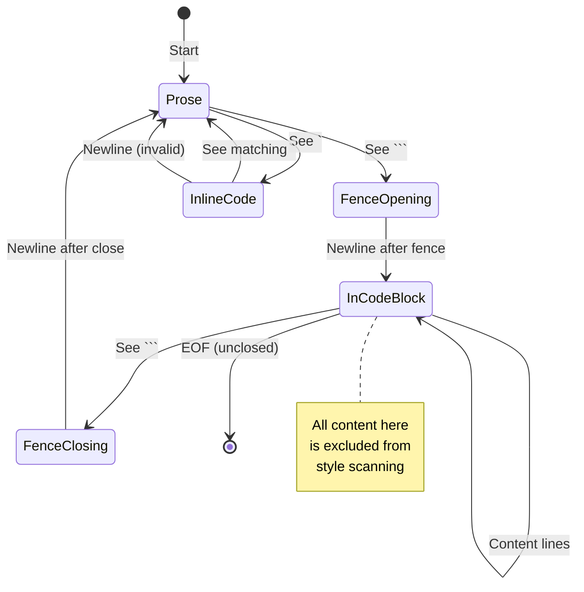

# LCS-INF-027b: Code Block Ignoring

## 1. Metadata & Categorization

| Field                | Value                                | Description                                       |
| :------------------- | :----------------------------------- | :------------------------------------------------ |
| **Feature ID**       | `INF-027b`                           | Sub-part B of Performance Polish                  |
| **Feature Name**     | Code Block Ignoring                  | Exclude Markdown code from style linting          |
| **Target Version**   | `v0.2.7b`                            | Second sub-part of v0.2.7                         |
| **Module Scope**     | `Lexichord.Modules.Style`            | Style governance module                           |
| **Swimlane**         | `Product`                            | Core User-Facing Feature                          |
| **License Tier**     | `Core`                               | Foundation (Available in Free tier)               |
| **Author**           | System Architect                     |                                                   |
| **Status**           | **Draft**                            | Pending implementation                            |
| **Last Updated**     | 2026-01-26                           |                                                   |

---

## 2. Executive Summary

### 2.1 The Requirement

Technical documentation frequently contains code samples that should not be linted for prose style:

- **Variable names in code:** `whitelist_enabled` is a valid variable name even if "whitelist" is a flagged term.
- **Code syntax:** Keywords, identifiers, and literals follow programming conventions, not prose style.
- **False positives:** Flagging code blocks erodes user trust in the linting system.
- **Fenced code blocks:** Triple backtick (```) delimited code blocks are common in Markdown.
- **Inline code:** Single backtick (\`) delimited code spans need similar treatment.

Without code block filtering, every code sample becomes a source of noise violations.

### 2.2 The Proposed Solution

We **SHALL** implement comprehensive Markdown code detection:

1. **Fenced Code Blocks** — Detect ``` delimiters with optional language identifiers.
2. **Inline Code Spans** — Detect \`backtick\` delimited spans.
3. **Indented Code Blocks** — Detect 4-space or tab-indented code (optional).
4. **Nested Handling** — Properly handle code in blockquotes and lists.
5. **Exclusion Zones** — Mark detected regions for scanner to skip.

---

## 3. Architecture

### 3.1 Component Structure



### 3.2 Code Block Detection Flow



### 3.3 State Machine for Fenced Blocks



---

## 4. Decision Tree: Code Block Classification

```text
START: "Is this a code region?"
|
+-- Scanning line by line
|
+-- Does line start with ```?
|   +-- YES -> Is this opening or closing?
|   |   +-- Currently in code block -> CLOSING fence
|   |   |   +-- Mark end of exclusion zone
|   |   |   +-- Return to prose mode
|   |   +-- Not in code block -> OPENING fence
|   |       +-- Extract language hint (if any)
|   |       +-- Start exclusion zone
|   |       +-- Enter code block mode
|   +-- NO -> Continue
|
+-- Currently in code block?
|   +-- YES -> This line is excluded
|   |   +-- Continue to next line
|   +-- NO -> Check for inline code
|
+-- Does line contain backticks?
|   +-- YES -> Find inline code spans
|   |   +-- Handle escaped backticks (\`)
|   |   +-- Handle multiple backticks (``)
|   |   +-- Mark each span as excluded
|   +-- NO -> No code regions on line
|
+-- (Optional) Is line indented 4+ spaces?
|   +-- YES -> Check if indented code block
|   |   +-- Previous line also indented OR blank?
|   |   |   +-- YES -> Part of indented code block
|   |   |   +-- NO -> May be start of code block
|   +-- NO -> Not indented code
|
END: Return all exclusion zones
```

---

## 5. Data Contracts

### 5.1 IContentFilter Interface (from 027)

```csharp
namespace Lexichord.Abstractions.Contracts;

/// <summary>
/// Filters document content before scanning to exclude non-prose regions.
/// </summary>
public interface IContentFilter
{
    FilteredContent Filter(string content, FilterOptions options);
    bool CanFilter(string fileExtension);
    int Priority { get; }
    string Name { get; }
}
```

### 5.2 MarkdownCodeBlockFilter Implementation

```csharp
namespace Lexichord.Modules.Style.Filters;

using System;
using System.Collections.Generic;
using System.Text.RegularExpressions;
using Lexichord.Abstractions.Contracts;
using Microsoft.Extensions.Logging;

/// <summary>
/// Filters Markdown code blocks from content before linting.
/// </summary>
/// <remarks>
/// LOGIC: MarkdownCodeBlockFilter detects and excludes:
/// 1. Fenced code blocks (``` or ~~~)
/// 2. Inline code spans (`backticks`)
/// 3. Optionally: Indented code blocks (4 spaces)
///
/// Detection Strategy:
/// - Fenced blocks use a state machine to track open/close
/// - Inline code uses regex with proper escape handling
/// - Indented blocks track consecutive indented lines
///
/// Thread Safety:
/// - Filter is stateless and thread-safe
/// - No instance state modified during filtering
/// </remarks>
public sealed class MarkdownCodeBlockFilter : IContentFilter
{
    private readonly ILogger<MarkdownCodeBlockFilter> _logger;
    private readonly MarkdownCodeBlockOptions _options;

    /// <summary>
    /// Regex to match fenced code block opening.
    /// Captures: fence chars (``` or ~~~), language hint, optional attributes
    /// </summary>
    /// <remarks>
    /// LOGIC: Pattern breakdown:
    /// - ^(\s*)           : Leading whitespace (captured for indent)
    /// - (`{3,}|~{3,})    : 3+ backticks OR 3+ tildes (captured fence)
    /// - (\w+)?           : Optional language identifier
    /// - (\s.*)?$         : Optional attributes (e.g., {.class})
    /// </remarks>
    private static readonly Regex FenceOpenPattern = new(
        @"^(\s*)(`{3,}|~{3,})(\w+)?(\s.*)?$",
        RegexOptions.Compiled | RegexOptions.Multiline);

    /// <summary>
    /// Regex to match inline code spans.
    /// Handles single and multiple backticks.
    /// </summary>
    /// <remarks>
    /// LOGIC: Pattern breakdown:
    /// - (?<!\\)           : Not preceded by backslash (escape)
    /// - (`+)              : One or more backticks (opening)
    /// - (.+?)             : Code content (non-greedy)
    /// - \1                : Same number of backticks (closing)
    ///
    /// Examples matched:
    /// - `code`            : Single backtick
    /// - ``code with ` ``  : Double backtick (contains literal `)
    /// - ```inline```      : Triple backtick inline
    ///
    /// Note: This pattern does NOT match fenced blocks because
    /// fenced blocks have newlines after the opening fence.
    /// </remarks>
    private static readonly Regex InlineCodePattern = new(
        @"(?<!\\)(`+)(?!`)(.+?)(?<!`)\1(?!`)",
        RegexOptions.Compiled | RegexOptions.Singleline);

    public MarkdownCodeBlockFilter(
        ILogger<MarkdownCodeBlockFilter> logger,
        MarkdownCodeBlockOptions? options = null)
    {
        _logger = logger ?? throw new ArgumentNullException(nameof(logger));
        _options = options ?? MarkdownCodeBlockOptions.Default;
    }

    /// <inheritdoc/>
    public string Name => "MarkdownCodeBlock";

    /// <inheritdoc/>
    public int Priority => 200; // After frontmatter (100)

    /// <inheritdoc/>
    public bool CanFilter(string fileExtension)
    {
        // LOGIC: Only apply to Markdown files
        return fileExtension.Equals(".md", StringComparison.OrdinalIgnoreCase)
            || fileExtension.Equals(".markdown", StringComparison.OrdinalIgnoreCase)
            || fileExtension.Equals(".mdx", StringComparison.OrdinalIgnoreCase);
    }

    /// <inheritdoc/>
    public FilteredContent Filter(string content, FilterOptions options)
    {
        if (string.IsNullOrEmpty(content))
        {
            return FilteredContent.None(content);
        }

        if (!options.EnableCodeBlockFilter)
        {
            _logger.LogDebug("Code block filtering disabled");
            return FilteredContent.None(content);
        }

        var exclusions = new List<ExcludedRegion>();

        // LOGIC: Phase 1 - Detect fenced code blocks
        var fencedBlocks = DetectFencedCodeBlocks(content);
        exclusions.AddRange(fencedBlocks);

        _logger.LogDebug(
            "Detected {Count} fenced code blocks",
            fencedBlocks.Count);

        // LOGIC: Phase 2 - Detect inline code (skip inside fenced blocks)
        var inlineCode = DetectInlineCode(content, fencedBlocks);
        exclusions.AddRange(inlineCode);

        _logger.LogDebug(
            "Detected {Count} inline code spans",
            inlineCode.Count);

        // LOGIC: Phase 3 - (Optional) Detect indented code blocks
        if (_options.DetectIndentedBlocks)
        {
            var indentedBlocks = DetectIndentedCodeBlocks(content, exclusions);
            exclusions.AddRange(indentedBlocks);

            _logger.LogDebug(
                "Detected {Count} indented code blocks",
                indentedBlocks.Count);
        }

        return new FilteredContent(
            ProcessedContent: content,
            ExcludedRegions: exclusions,
            OriginalContent: content
        );
    }

    /// <summary>
    /// Detects fenced code blocks using a state machine.
    /// </summary>
    /// <param name="content">Document content.</param>
    /// <returns>List of excluded regions for fenced blocks.</returns>
    /// <remarks>
    /// LOGIC: Uses line-by-line state machine:
    /// - Track fence character (` or ~) and count
    /// - Opening fence starts exclusion zone
    /// - Matching closing fence ends zone
    /// - Handles nested structures (blockquotes)
    /// </remarks>
    private IReadOnlyList<ExcludedRegion> DetectFencedCodeBlocks(string content)
    {
        var exclusions = new List<ExcludedRegion>();
        var lines = content.Split('\n');
        var offset = 0;

        FenceState? currentFence = null;

        foreach (var line in lines)
        {
            var lineWithNewline = line + (offset + line.Length < content.Length ? "\n" : "");
            var lineLength = lineWithNewline.Length;

            if (currentFence == null)
            {
                // LOGIC: Looking for opening fence
                var match = FenceOpenPattern.Match(line);
                if (match.Success)
                {
                    var indent = match.Groups[1].Value;
                    var fence = match.Groups[2].Value;
                    var language = match.Groups[3].Success ? match.Groups[3].Value : null;

                    currentFence = new FenceState(
                        FenceChar: fence[0],
                        FenceLength: fence.Length,
                        IndentLength: indent.Length,
                        StartOffset: offset,
                        Language: language
                    );

                    _logger.LogDebug(
                        "Found fenced code block opening at offset {Offset}: {Fence}{Language}",
                        offset, fence, language ?? "");
                }
            }
            else
            {
                // LOGIC: Inside fence, looking for closing
                var trimmed = line.TrimStart();
                if (trimmed.Length >= currentFence.FenceLength)
                {
                    var potentialFence = trimmed.Substring(0, currentFence.FenceLength);
                    var isClosing = potentialFence.All(c => c == currentFence.FenceChar)
                        && trimmed.Length == currentFence.FenceLength
                        || trimmed.Substring(currentFence.FenceLength).Trim().Length == 0;

                    if (isClosing && trimmed.All(c => c == currentFence.FenceChar || char.IsWhiteSpace(c)))
                    {
                        // LOGIC: Found closing fence
                        var endOffset = offset + lineLength;

                        exclusions.Add(new ExcludedRegion(
                            StartOffset: currentFence.StartOffset,
                            EndOffset: endOffset,
                            Reason: ExclusionReason.FencedCodeBlock,
                            Metadata: currentFence.Language
                        ));

                        _logger.LogDebug(
                            "Fenced code block closed at offset {End} (started {Start})",
                            endOffset, currentFence.StartOffset);

                        currentFence = null;
                    }
                }
            }

            offset += lineLength;
        }

        // LOGIC: Handle unclosed fence at EOF
        if (currentFence != null)
        {
            _logger.LogWarning(
                "Unclosed fenced code block starting at offset {Offset}",
                currentFence.StartOffset);

            // LOGIC: Treat rest of document as code block
            exclusions.Add(new ExcludedRegion(
                StartOffset: currentFence.StartOffset,
                EndOffset: content.Length,
                Reason: ExclusionReason.FencedCodeBlock,
                Metadata: currentFence.Language
            ));
        }

        return exclusions;
    }

    /// <summary>
    /// Detects inline code spans.
    /// </summary>
    /// <param name="content">Document content.</param>
    /// <param name="fencedBlocks">Already detected fenced blocks to skip.</param>
    /// <returns>List of excluded regions for inline code.</returns>
    /// <remarks>
    /// LOGIC: Uses regex to find backtick-delimited spans.
    /// Skips any matches that fall inside fenced blocks.
    ///
    /// Handles:
    /// - Single backticks: `code`
    /// - Multiple backticks: ``code with ` inside``
    /// - Escaped backticks: \`not code\`
    /// </remarks>
    private IReadOnlyList<ExcludedRegion> DetectInlineCode(
        string content,
        IReadOnlyList<ExcludedRegion> fencedBlocks)
    {
        var exclusions = new List<ExcludedRegion>();

        foreach (Match match in InlineCodePattern.Matches(content))
        {
            var startOffset = match.Index;
            var endOffset = match.Index + match.Length;

            // LOGIC: Skip if inside a fenced block
            var inFencedBlock = fencedBlocks.Any(fb =>
                startOffset >= fb.StartOffset && startOffset < fb.EndOffset);

            if (inFencedBlock)
            {
                continue;
            }

            exclusions.Add(new ExcludedRegion(
                StartOffset: startOffset,
                EndOffset: endOffset,
                Reason: ExclusionReason.InlineCode,
                Metadata: null
            ));

            _logger.LogDebug(
                "Found inline code at offset {Start}-{End}",
                startOffset, endOffset);
        }

        return exclusions;
    }

    /// <summary>
    /// Detects indented code blocks (4+ spaces).
    /// </summary>
    /// <param name="content">Document content.</param>
    /// <param name="existingExclusions">Existing exclusions to avoid overlap.</param>
    /// <returns>List of excluded regions for indented code.</returns>
    /// <remarks>
    /// LOGIC: CommonMark spec says 4 spaces or 1 tab of indentation
    /// makes a code block. This is optional because:
    /// - Many documents use indentation for other purposes
    /// - Fenced blocks are more common and unambiguous
    /// - False positives are more likely with indented detection
    /// </remarks>
    private IReadOnlyList<ExcludedRegion> DetectIndentedCodeBlocks(
        string content,
        IReadOnlyList<ExcludedRegion> existingExclusions)
    {
        // Implementation for indented code blocks
        // Less common, so keeping simple for now
        return Array.Empty<ExcludedRegion>();
    }

    /// <summary>
    /// Tracks state while parsing a fenced code block.
    /// </summary>
    private record FenceState(
        char FenceChar,
        int FenceLength,
        int IndentLength,
        int StartOffset,
        string? Language
    );
}

/// <summary>
/// Options for Markdown code block detection.
/// </summary>
/// <param name="DetectIndentedBlocks">Whether to detect 4-space indented blocks.</param>
/// <param name="DetectInlineCode">Whether to detect `inline` code spans.</param>
/// <param name="MaxFenceLength">Maximum fence length to recognize (e.g., 10).</param>
public record MarkdownCodeBlockOptions(
    bool DetectIndentedBlocks = false,
    bool DetectInlineCode = true,
    int MaxFenceLength = 10
)
{
    public static MarkdownCodeBlockOptions Default { get; } = new();
}
```

### 5.3 Integration with Scanner

```csharp
namespace Lexichord.Modules.Style.Services;

/// <summary>
/// Enhanced scan options with excluded regions.
/// </summary>
/// <remarks>
/// LOGIC: v0.2.7b adds ExcludedRegions to scan options.
/// The scanner checks each match against these regions
/// and skips any that fall within excluded areas.
/// </remarks>
public record ScanOptions
{
    public TimeSpan RegexTimeout { get; init; } = TimeSpan.FromSeconds(5);
    public int MaxMatches { get; init; } = 1000;
    public bool CaseSensitive { get; init; } = false;

    /// <summary>
    /// Regions to exclude from scanning results.
    /// </summary>
    /// <remarks>
    /// LOGIC: Matches whose start offset falls within any
    /// excluded region are filtered out. The scanner still
    /// runs regex over full content (for simplicity) but
    /// discards matches in excluded regions.
    ///
    /// Future optimization: Could modify content to mask
    /// excluded regions, but offset adjustment is complex.
    /// </remarks>
    public IReadOnlyList<ExcludedRegion> ExcludedRegions { get; init; } =
        Array.Empty<ExcludedRegion>();

    public static ScanOptions Default { get; } = new();
}

/// <summary>
/// Scanner extension for excluded region filtering.
/// </summary>
public static class ScannerExtensions
{
    /// <summary>
    /// Filters matches to exclude those in excluded regions.
    /// </summary>
    /// <param name="matches">Raw matches from regex.</param>
    /// <param name="excludedRegions">Regions to filter.</param>
    /// <returns>Filtered matches.</returns>
    /// <remarks>
    /// LOGIC: For each match, check if its start offset falls
    /// within any excluded region. If so, skip the match.
    ///
    /// Performance: Uses binary search for large exclusion lists.
    /// </remarks>
    public static IEnumerable<ScanMatch> FilterByExclusions(
        this IEnumerable<ScanMatch> matches,
        IReadOnlyList<ExcludedRegion> excludedRegions)
    {
        if (excludedRegions.Count == 0)
        {
            return matches;
        }

        // LOGIC: Sort exclusions for binary search
        var sortedExclusions = excludedRegions
            .OrderBy(e => e.StartOffset)
            .ToList();

        return matches.Where(m => !IsExcluded(m.Offset, sortedExclusions));
    }

    private static bool IsExcluded(
        int offset,
        IReadOnlyList<ExcludedRegion> sortedExclusions)
    {
        // LOGIC: Binary search for efficiency with large exclusion lists
        var lo = 0;
        var hi = sortedExclusions.Count - 1;

        while (lo <= hi)
        {
            var mid = (lo + hi) / 2;
            var region = sortedExclusions[mid];

            if (offset >= region.StartOffset && offset < region.EndOffset)
            {
                return true; // Found containing region
            }

            if (offset < region.StartOffset)
            {
                hi = mid - 1;
            }
            else
            {
                lo = mid + 1;
            }
        }

        return false;
    }
}
```

---

## 6. Implementation Logic

### 6.1 Test Cases for Code Block Detection

```markdown
<!-- Test Case 1: Simple fenced block -->
Normal prose here.

```python
whitelist_enabled = True
blacklist_items = []
```

More prose after.

<!-- Test Case 2: Fenced block with language -->
```csharp
var whitelist = new List<string>();
```

<!-- Test Case 3: Inline code -->
Use the `whitelist` variable to store items.

<!-- Test Case 4: Multiple backticks for inline -->
Use ``whitelist_enabled = `true` `` in your config.

<!-- Test Case 5: Code in blockquote -->
> Example:
>
> ```bash
> export WHITELIST="enabled"
> ```

<!-- Test Case 6: Nested fences (triple inside quad) -->
````markdown
Here's how to write a code block:

```python
print("hello")
```
````

<!-- Test Case 7: Unclosed fence -->
```python
# This code block never closes
def whitelist():
    pass
<!-- EOF -->
```

### 6.2 Edge Cases

```csharp
/// <summary>
/// Edge cases the filter must handle correctly.
/// </summary>
public static class CodeBlockEdgeCases
{
    /*
     * Edge Case 1: Backticks in prose (escaped)
     * Content: "Use \`code\` syntax for inline code"
     * Expected: No exclusion (escaped backticks)
     *
     * Edge Case 2: Unbalanced backticks
     * Content: "This has a ` backtick but no closing"
     * Expected: No exclusion (unbalanced)
     *
     * Edge Case 3: Empty code block
     * Content: "```\n```"
     * Expected: One exclusion for empty block
     *
     * Edge Case 4: Code block at EOF
     * Content: "Text\n```python\ncode"
     * Expected: Exclusion from ``` to EOF
     *
     * Edge Case 5: Adjacent code blocks
     * Content: "```\nA\n```\n```\nB\n```"
     * Expected: Two separate exclusions
     *
     * Edge Case 6: Tilde fence
     * Content: "~~~\ncode\n~~~"
     * Expected: Exclusion for tilde-fenced block
     *
     * Edge Case 7: Mixed fence (backtick open, tilde close - INVALID)
     * Content: "```\ncode\n~~~"
     * Expected: Exclusion from ``` to EOF (tilde doesn't close)
     *
     * Edge Case 8: Fence in code block (meta)
     * Content: "````\n```\ncode\n```\n````"
     * Expected: One exclusion (4-tick contains 3-tick)
     */
}
```

---

## 7. Use Cases

### UC-01: Ignore Variable Name in Code Block

**Preconditions:**
- Style rule exists: "whitelist" -> "allowlist"
- Document contains code block with `whitelist_enabled` variable.

**Flow:**
1. User saves document with code sample.
2. Debounce triggers lint operation.
3. ContentFilterPipeline runs MarkdownCodeBlockFilter.
4. Filter detects fenced code block.
5. Creates ExcludedRegion for code block.
6. Scanner runs regex over full content.
7. Scanner finds "whitelist" in code block.
8. FilterByExclusions removes match (in excluded region).
9. Scanner finds "whitelist" in prose (if any).
10. Only prose violations reported.

**Postconditions:**
- Code block variable not flagged.
- Prose usage (if any) correctly flagged.

---

### UC-02: Inline Code Not Flagged

**Preconditions:**
- Document contains: "Use the `whitelist` variable"

**Flow:**
1. ContentFilterPipeline runs.
2. MarkdownCodeBlockFilter detects inline code.
3. Creates ExcludedRegion for "`whitelist`".
4. Scanner runs.
5. Match for "whitelist" is in excluded region.
6. Match filtered out.
7. No violation reported.

**Postconditions:**
- Inline code not flagged.

---

## 8. Observability & Logging

| Level | Context | Message Template |
|:------|:--------|:-----------------|
| Debug | MarkdownCodeBlockFilter | `Detected {Count} fenced code blocks` |
| Debug | MarkdownCodeBlockFilter | `Detected {Count} inline code spans` |
| Debug | MarkdownCodeBlockFilter | `Detected {Count} indented code blocks` |
| Debug | MarkdownCodeBlockFilter | `Found fenced code block opening at offset {Offset}: {Fence}{Language}` |
| Debug | MarkdownCodeBlockFilter | `Fenced code block closed at offset {End} (started {Start})` |
| Warning | MarkdownCodeBlockFilter | `Unclosed fenced code block starting at offset {Offset}` |
| Debug | MarkdownCodeBlockFilter | `Found inline code at offset {Start}-{End}` |
| Debug | MarkdownCodeBlockFilter | `Code block filtering disabled` |

---

## 9. Unit Testing Requirements

### 9.1 Fenced Code Block Tests

```csharp
[TestFixture]
[Category("Unit")]
public class MarkdownCodeBlockFilterTests
{
    private MarkdownCodeBlockFilter _sut = null!;
    private Mock<ILogger<MarkdownCodeBlockFilter>> _mockLogger = null!;

    [SetUp]
    public void SetUp()
    {
        _mockLogger = new Mock<ILogger<MarkdownCodeBlockFilter>>();
        _sut = new MarkdownCodeBlockFilter(_mockLogger.Object);
    }

    [Test]
    public void Filter_EmptyContent_ReturnsNoExclusions()
    {
        // Act
        var result = _sut.Filter("", FilterOptions.Default);

        // Assert
        Assert.That(result.HasExclusions, Is.False);
    }

    [Test]
    public void Filter_NoCodeBlocks_ReturnsNoExclusions()
    {
        // Arrange
        var content = "This is plain prose with no code.";

        // Act
        var result = _sut.Filter(content, FilterOptions.Default);

        // Assert
        Assert.That(result.HasExclusions, Is.False);
    }

    [Test]
    public void Filter_SimpleFencedBlock_ExcludesBlock()
    {
        // Arrange
        var content = """
            Prose before.

            ```python
            whitelist = True
            ```

            Prose after.
            """;

        // Act
        var result = _sut.Filter(content, FilterOptions.Default);

        // Assert
        Assert.That(result.HasExclusions, Is.True);
        Assert.That(result.ExcludedRegions, Has.Count.EqualTo(1));

        var region = result.ExcludedRegions[0];
        Assert.Multiple(() =>
        {
            Assert.That(region.Reason, Is.EqualTo(ExclusionReason.FencedCodeBlock));
            Assert.That(region.Metadata, Is.EqualTo("python"));
        });
    }

    [Test]
    public void Filter_FencedBlockNoLanguage_ExcludesBlock()
    {
        // Arrange
        var content = "```\ncode\n```";

        // Act
        var result = _sut.Filter(content, FilterOptions.Default);

        // Assert
        Assert.That(result.ExcludedRegions, Has.Count.EqualTo(1));
        Assert.That(result.ExcludedRegions[0].Metadata, Is.Null);
    }

    [Test]
    public void Filter_TildeFence_ExcludesBlock()
    {
        // Arrange
        var content = "~~~\ncode\n~~~";

        // Act
        var result = _sut.Filter(content, FilterOptions.Default);

        // Assert
        Assert.That(result.HasExclusions, Is.True);
        Assert.That(result.ExcludedRegions[0].Reason,
            Is.EqualTo(ExclusionReason.FencedCodeBlock));
    }

    [Test]
    public void Filter_UnclosedFence_ExcludesToEOF()
    {
        // Arrange
        var content = "Prose\n```python\ncode without closing";

        // Act
        var result = _sut.Filter(content, FilterOptions.Default);

        // Assert
        Assert.That(result.HasExclusions, Is.True);
        Assert.That(result.ExcludedRegions[0].EndOffset, Is.EqualTo(content.Length));
    }

    [Test]
    public void Filter_MultipleFencedBlocks_ExcludesAll()
    {
        // Arrange
        var content = """
            ```
            block1
            ```

            ```
            block2
            ```
            """;

        // Act
        var result = _sut.Filter(content, FilterOptions.Default);

        // Assert
        Assert.That(result.ExcludedRegions, Has.Count.EqualTo(2));
    }

    [Test]
    public void Filter_NestedFences_HandlesCorrectly()
    {
        // Arrange - 4-backtick fence containing 3-backtick example
        var content = """
            ````markdown
            Here's a code block:

            ```python
            code
            ```
            ````
            """;

        // Act
        var result = _sut.Filter(content, FilterOptions.Default);

        // Assert - Should be ONE exclusion (outer fence only)
        Assert.That(result.ExcludedRegions, Has.Count.EqualTo(1));
    }
}
```

### 9.2 Inline Code Tests

```csharp
[TestFixture]
[Category("Unit")]
public class MarkdownInlineCodeFilterTests
{
    private MarkdownCodeBlockFilter _sut = null!;
    private Mock<ILogger<MarkdownCodeBlockFilter>> _mockLogger = null!;

    [SetUp]
    public void SetUp()
    {
        _mockLogger = new Mock<ILogger<MarkdownCodeBlockFilter>>();
        _sut = new MarkdownCodeBlockFilter(_mockLogger.Object);
    }

    [Test]
    public void Filter_SingleBacktickCode_ExcludesSpan()
    {
        // Arrange
        var content = "Use the `whitelist` variable.";

        // Act
        var result = _sut.Filter(content, FilterOptions.Default);

        // Assert
        Assert.That(result.HasExclusions, Is.True);
        var region = result.ExcludedRegions[0];
        Assert.That(region.Reason, Is.EqualTo(ExclusionReason.InlineCode));
    }

    [Test]
    public void Filter_DoubleBacktickCode_ExcludesSpan()
    {
        // Arrange
        var content = "Use ``whitelist = `value` `` syntax.";

        // Act
        var result = _sut.Filter(content, FilterOptions.Default);

        // Assert
        Assert.That(result.HasExclusions, Is.True);
    }

    [Test]
    public void Filter_MultipleInlineCode_ExcludesAll()
    {
        // Arrange
        var content = "Use `foo` and `bar` variables.";

        // Act
        var result = _sut.Filter(content, FilterOptions.Default);

        // Assert
        Assert.That(result.ExcludedRegions, Has.Count.EqualTo(2));
    }

    [Test]
    public void Filter_InlineCodeInFencedBlock_NotDoubleExcluded()
    {
        // Arrange
        var content = """
            ```python
            x = `backtick`
            ```
            """;

        // Act
        var result = _sut.Filter(content, FilterOptions.Default);

        // Assert - Should have fenced block exclusion only
        // The inline `backtick` is already covered by fenced block
        var inlineExclusions = result.ExcludedRegions
            .Where(e => e.Reason == ExclusionReason.InlineCode);
        Assert.That(inlineExclusions, Is.Empty);
    }

    [Test]
    public void Filter_UnbalancedBacktick_NoExclusion()
    {
        // Arrange
        var content = "This has a ` backtick but no closing.";

        // Act
        var result = _sut.Filter(content, FilterOptions.Default);

        // Assert - No exclusion for unbalanced
        Assert.That(result.HasExclusions, Is.False);
    }
}
```

### 9.3 Integration with Scanner Tests

```csharp
[TestFixture]
[Category("Unit")]
public class ScannerExclusionTests
{
    [Test]
    public void FilterByExclusions_NoExclusions_ReturnsAll()
    {
        // Arrange
        var matches = new[]
        {
            new ScanMatch("test", 0, 4, "rule1"),
            new ScanMatch("test", 10, 4, "rule1")
        };

        // Act
        var result = matches.FilterByExclusions(Array.Empty<ExcludedRegion>())
            .ToList();

        // Assert
        Assert.That(result, Has.Count.EqualTo(2));
    }

    [Test]
    public void FilterByExclusions_MatchInExclusion_Removed()
    {
        // Arrange
        var matches = new[]
        {
            new ScanMatch("test", 5, 4, "rule1")  // Inside exclusion
        };
        var exclusions = new[]
        {
            new ExcludedRegion(0, 20, ExclusionReason.FencedCodeBlock)
        };

        // Act
        var result = matches.FilterByExclusions(exclusions).ToList();

        // Assert
        Assert.That(result, Is.Empty);
    }

    [Test]
    public void FilterByExclusions_MatchOutsideExclusion_Kept()
    {
        // Arrange
        var matches = new[]
        {
            new ScanMatch("test", 25, 4, "rule1")  // Outside exclusion
        };
        var exclusions = new[]
        {
            new ExcludedRegion(0, 20, ExclusionReason.FencedCodeBlock)
        };

        // Act
        var result = matches.FilterByExclusions(exclusions).ToList();

        // Assert
        Assert.That(result, Has.Count.EqualTo(1));
    }

    [Test]
    public void FilterByExclusions_MixedMatches_FiltersCorrectly()
    {
        // Arrange
        var matches = new[]
        {
            new ScanMatch("code", 5, 4, "rule1"),   // In exclusion
            new ScanMatch("prose", 25, 5, "rule1"), // Outside
            new ScanMatch("code2", 35, 5, "rule1")  // In second exclusion
        };
        var exclusions = new[]
        {
            new ExcludedRegion(0, 20, ExclusionReason.FencedCodeBlock),
            new ExcludedRegion(30, 50, ExclusionReason.InlineCode)
        };

        // Act
        var result = matches.FilterByExclusions(exclusions).ToList();

        // Assert
        Assert.That(result, Has.Count.EqualTo(1));
        Assert.That(result[0].Value, Is.EqualTo("prose"));
    }
}
```

---

## 10. Security & Safety

### 10.1 Regex Safety

> [!WARNING]
> Malformed content could cause regex performance issues.

- **Timeout Protection:** All regex operations have configurable timeout.
- **Bounded Input:** Maximum content length checked before processing.
- **Precompiled Patterns:** Regex compiled once, reused for efficiency.

### 10.2 Memory Safety

- **Stream Processing:** Large files processed line-by-line for fenced blocks.
- **Bounded Results:** Maximum exclusion count prevents memory exhaustion.

---

## 11. Risks & Mitigations

| Risk | Impact | Mitigation |
|:-----|:-------|:-----------|
| Regex catastrophic backtracking | High | Timeout protection; simple patterns |
| False negative (code not detected) | Medium | Comprehensive test suite; CommonMark spec tests |
| False positive (prose detected as code) | Medium | Strict delimiter matching |
| Performance on large files | Medium | Line-by-line processing; early termination |

---

## 12. Acceptance Criteria (QA)

| # | Category | Criterion |
|:--|:---------|:----------|
| 1 | **[Fenced]** | Backtick fenced blocks detected |
| 2 | **[Fenced]** | Tilde fenced blocks detected |
| 3 | **[Fenced]** | Language hints captured |
| 4 | **[Fenced]** | Unclosed fences handled gracefully |
| 5 | **[Fenced]** | Nested fences handled correctly |
| 6 | **[Inline]** | Single backtick spans detected |
| 7 | **[Inline]** | Double backtick spans detected |
| 8 | **[Inline]** | Inline code in fenced blocks not double-counted |
| 9 | **[Integration]** | Code block variables not flagged by linter |
| 10 | **[Integration]** | Prose violations still detected |
| 11 | **[Performance]** | Detection <10ms per MB |

---

## 13. Verification Commands

```bash
# 1. Run code block filter tests
dotnet test --filter "FullyQualifiedName~MarkdownCodeBlock"

# 2. Run scanner exclusion tests
dotnet test --filter "FullyQualifiedName~ScannerExclusion"

# 3. Manual verification:
# Create document with:
# - Code block containing "whitelist_enabled"
# - Prose containing "use whitelist"
# Verify only prose flagged

# 4. Performance test:
# Process 1MB Markdown with many code blocks
# Measure detection time

# 5. Edge case testing:
# Test unclosed fences
# Test nested fences
# Test escaped backticks
```

---

## 14. Deliverable Checklist

| Step | Description | Status |
|:-----|:------------|:-------|
| 1 | Implement MarkdownCodeBlockFilter | [ ] |
| 2 | Implement fenced block detection | [ ] |
| 3 | Implement inline code detection | [ ] |
| 4 | Implement exclusion region filtering in scanner | [ ] |
| 5 | Handle unclosed fences | [ ] |
| 6 | Handle nested fences | [ ] |
| 7 | Add language hint capture | [ ] |
| 8 | Register filter in DI | [ ] |
| 9 | Unit tests for fenced blocks | [ ] |
| 10 | Unit tests for inline code | [ ] |
| 11 | Unit tests for scanner integration | [ ] |
| 12 | Performance benchmarks | [ ] |
| 13 | Edge case tests | [ ] |
