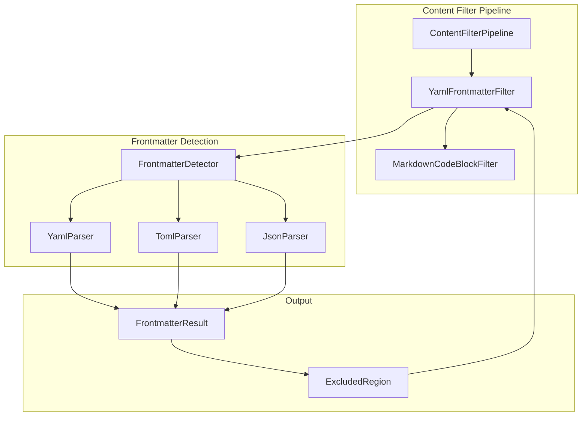
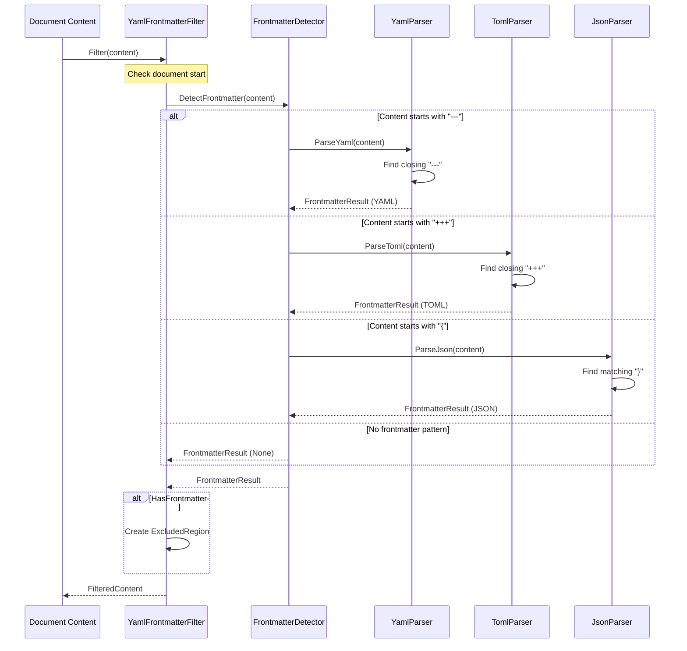
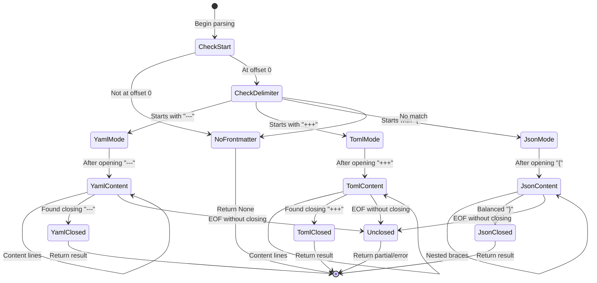

# LCS-INF-027c: Frontmatter Ignoring

## 1. Metadata & Categorization

| Field                | Value                                | Description                                       |
| :------------------- | :----------------------------------- | :------------------------------------------------ |
| **Feature ID**       | `INF-027c`                           | Sub-part C of Performance Polish                  |
| **Feature Name**     | Frontmatter Ignoring                 | Exclude YAML/TOML frontmatter from style linting  |
| **Target Version**   | `v0.2.7c`                            | Third sub-part of v0.2.7                          |
| **Module Scope**     | `Lexichord.Modules.Style`            | Style governance module                           |
| **Swimlane**         | `Product`                            | Core User-Facing Feature                          |
| **License Tier**     | `Core`                               | Foundation (Available in Free tier)               |
| **Author**           | System Architect                     |                                                   |
| **Status**           | **Draft**                            | Pending implementation                            |
| **Last Updated**     | 2026-01-26                           |                                                   |

---

## 2. Executive Summary

### 2.1 The Requirement

Modern Markdown-based documentation systems use frontmatter for metadata:

- **Jekyll/GitHub Pages:** YAML frontmatter (`---` delimiters) for page metadata.
- **Hugo:** TOML (`+++`), YAML (`---`), or JSON (`{}`) frontmatter.
- **Gatsby/Next.js:** YAML frontmatter for page configuration.
- **Obsidian:** YAML frontmatter for note metadata.

Frontmatter contains configuration data that should not be linted:

```yaml
---
title: API Whitelist Configuration
whitelist_enabled: true
tags: [blacklist, whitelist, legacy]
---
```

Fields like `whitelist_enabled` and tag names follow technical conventions, not prose style.

### 2.2 The Proposed Solution

We **SHALL** implement comprehensive frontmatter detection:

1. **YAML Frontmatter** — Detect `---` delimited blocks at document start.
2. **TOML Frontmatter** — Detect `+++` delimited blocks (Hugo compatibility).
3. **JSON Frontmatter** — Detect `{...}` blocks at document start.
4. **Strict Position** — Only detect frontmatter at absolute document start.
5. **Exclusion Zones** — Mark detected regions for scanner to skip.

---

## 3. Architecture

### 3.1 Component Structure



### 3.2 Frontmatter Detection Flow



### 3.3 Frontmatter State Diagram



---

## 4. Decision Tree: Frontmatter Detection

```text
START: "Does this document have frontmatter?"
|
+-- Is there any content?
|   +-- NO -> No frontmatter
|   +-- YES -> Continue
|
+-- Does content start at offset 0?
|   +-- NO -> No frontmatter (must be at document start)
|   +-- YES -> Continue
|
+-- What are the first characters?
|   |
|   +-- "---" (at line start)?
|   |   +-- YES -> YAML frontmatter candidate
|   |   |   +-- Find closing "---" on its own line
|   |   |   |   +-- Found -> Valid YAML frontmatter
|   |   |   |   |   +-- Exclude from offset 0 to after closing
|   |   |   |   +-- Not found (EOF) -> Unclosed frontmatter
|   |   |   |       +-- Treat entire document as frontmatter? NO
|   |   |   |       +-- No frontmatter (malformed)
|   |   +-- NO -> Continue
|   |
|   +-- "+++" (at line start)?
|   |   +-- YES -> TOML frontmatter candidate
|   |   |   +-- Find closing "+++" on its own line
|   |   |   |   +-- Found -> Valid TOML frontmatter
|   |   |   |   +-- Not found -> No frontmatter (malformed)
|   |   +-- NO -> Continue
|   |
|   +-- "{" (at line start)?
|   |   +-- YES -> JSON frontmatter candidate
|   |   |   +-- Parse until balanced "}"
|   |   |   |   +-- Balanced -> Valid JSON frontmatter
|   |   |   |   +-- Unbalanced -> No frontmatter (malformed)
|   |   +-- NO -> No frontmatter
|
END: Return detection result
```

---

## 5. Data Contracts

### 5.1 IFrontmatterDetector Interface

```csharp
namespace Lexichord.Abstractions.Contracts;

/// <summary>
/// Detects frontmatter at the beginning of documents.
/// </summary>
/// <remarks>
/// LOGIC: IFrontmatterDetector identifies metadata blocks at the
/// start of Markdown documents. Supports YAML, TOML, and JSON formats.
///
/// Key Constraints:
/// - Frontmatter MUST start at offset 0 (document start)
/// - Opening delimiter must be on the first line
/// - Closing delimiter must be on its own line
///
/// Thread Safety:
/// - Detector is stateless and thread-safe
/// </remarks>
public interface IFrontmatterDetector
{
    /// <summary>
    /// Detects frontmatter at the start of content.
    /// </summary>
    /// <param name="content">Document content to check.</param>
    /// <returns>Detection result with type and bounds.</returns>
    FrontmatterResult DetectFrontmatter(string content);

    /// <summary>
    /// Gets supported frontmatter types.
    /// </summary>
    IReadOnlyList<FrontmatterType> SupportedTypes { get; }
}

/// <summary>
/// Result of frontmatter detection.
/// </summary>
/// <param name="HasFrontmatter">Whether frontmatter was detected.</param>
/// <param name="Type">Type of frontmatter found.</param>
/// <param name="StartOffset">Start of frontmatter (always 0 if present).</param>
/// <param name="EndOffset">End of frontmatter (after closing delimiter).</param>
/// <param name="RawContent">The frontmatter content between delimiters.</param>
/// <param name="ContentStartOffset">Where actual document content begins.</param>
public record FrontmatterResult(
    bool HasFrontmatter,
    FrontmatterType Type,
    int StartOffset,
    int EndOffset,
    string? RawContent,
    int ContentStartOffset
)
{
    /// <summary>
    /// Creates a result indicating no frontmatter.
    /// </summary>
    public static FrontmatterResult None { get; } = new(
        HasFrontmatter: false,
        Type: FrontmatterType.None,
        StartOffset: 0,
        EndOffset: 0,
        RawContent: null,
        ContentStartOffset: 0
    );

    /// <summary>
    /// Gets the length of the frontmatter block.
    /// </summary>
    public int Length => EndOffset - StartOffset;
}

/// <summary>
/// Types of frontmatter supported.
/// </summary>
public enum FrontmatterType
{
    /// <summary>No frontmatter detected.</summary>
    None,

    /// <summary>YAML frontmatter (--- delimited).</summary>
    Yaml,

    /// <summary>TOML frontmatter (+++ delimited).</summary>
    Toml,

    /// <summary>JSON frontmatter ({ } at document start).</summary>
    Json
}
```

### 5.2 YamlFrontmatterFilter Implementation

```csharp
namespace Lexichord.Modules.Style.Filters;

using System;
using System.Collections.Generic;
using System.Text.RegularExpressions;
using Lexichord.Abstractions.Contracts;
using Microsoft.Extensions.Logging;

/// <summary>
/// Filters frontmatter from Markdown documents before linting.
/// </summary>
/// <remarks>
/// LOGIC: YamlFrontmatterFilter detects and excludes frontmatter blocks
/// that appear at the very start of Markdown documents.
///
/// Supported Formats:
/// - YAML: Content between "---" delimiters
/// - TOML: Content between "+++" delimiters (Hugo)
/// - JSON: Content between "{ }" at document start
///
/// Key Rules:
/// - Frontmatter must start at byte 0 of the document
/// - Opening delimiter must be alone on line 1
/// - Closing delimiter must be alone on its own line
/// - No frontmatter after the first block of prose
///
/// Thread Safety:
/// - Filter is stateless and thread-safe
/// </remarks>
public sealed class YamlFrontmatterFilter : IContentFilter
{
    private readonly ILogger<YamlFrontmatterFilter> _logger;
    private readonly FrontmatterOptions _options;

    /// <summary>
    /// Pattern for YAML frontmatter opening.
    /// </summary>
    /// <remarks>
    /// LOGIC: Must match "---" at the absolute start of the document,
    /// optionally followed by whitespace, then newline.
    /// </remarks>
    private static readonly Regex YamlOpenPattern = new(
        @"^---[ \t]*(\r?\n|\r)",
        RegexOptions.Compiled);

    /// <summary>
    /// Pattern for YAML frontmatter closing.
    /// </summary>
    /// <remarks>
    /// LOGIC: Must match "---" or "..." at the start of a line,
    /// optionally followed by whitespace, then newline or EOF.
    /// </remarks>
    private static readonly Regex YamlClosePattern = new(
        @"^(---|\.\.\.)\s*(\r?\n|\r|$)",
        RegexOptions.Compiled | RegexOptions.Multiline);

    /// <summary>
    /// Pattern for TOML frontmatter opening.
    /// </summary>
    private static readonly Regex TomlOpenPattern = new(
        @"^\+\+\+[ \t]*(\r?\n|\r)",
        RegexOptions.Compiled);

    /// <summary>
    /// Pattern for TOML frontmatter closing.
    /// </summary>
    private static readonly Regex TomlClosePattern = new(
        @"^\+\+\+\s*(\r?\n|\r|$)",
        RegexOptions.Compiled | RegexOptions.Multiline);

    public YamlFrontmatterFilter(
        ILogger<YamlFrontmatterFilter> logger,
        FrontmatterOptions? options = null)
    {
        _logger = logger ?? throw new ArgumentNullException(nameof(logger));
        _options = options ?? FrontmatterOptions.Default;
    }

    /// <inheritdoc/>
    public string Name => "YamlFrontmatter";

    /// <inheritdoc/>
    public int Priority => 100; // First filter (before code blocks)

    /// <inheritdoc/>
    public bool CanFilter(string fileExtension)
    {
        // LOGIC: Apply to Markdown and HTML files (Jekyll uses .html with frontmatter)
        return fileExtension.Equals(".md", StringComparison.OrdinalIgnoreCase)
            || fileExtension.Equals(".markdown", StringComparison.OrdinalIgnoreCase)
            || fileExtension.Equals(".mdx", StringComparison.OrdinalIgnoreCase)
            || (_options.AllowInHtml &&
                fileExtension.Equals(".html", StringComparison.OrdinalIgnoreCase));
    }

    /// <inheritdoc/>
    public FilteredContent Filter(string content, FilterOptions options)
    {
        if (string.IsNullOrEmpty(content))
        {
            return FilteredContent.None(content);
        }

        if (!options.EnableFrontmatterFilter)
        {
            _logger.LogDebug("Frontmatter filtering disabled");
            return FilteredContent.None(content);
        }

        // LOGIC: Detect frontmatter at document start
        var result = DetectFrontmatter(content);

        if (!result.HasFrontmatter)
        {
            _logger.LogDebug("No frontmatter detected");
            return FilteredContent.None(content);
        }

        _logger.LogDebug(
            "Found {Type} frontmatter at offset 0-{End}",
            result.Type, result.EndOffset);

        // LOGIC: Create exclusion for the frontmatter block
        var exclusion = new ExcludedRegion(
            StartOffset: result.StartOffset,
            EndOffset: result.EndOffset,
            Reason: result.Type switch
            {
                FrontmatterType.Yaml => ExclusionReason.YamlFrontmatter,
                FrontmatterType.Toml => ExclusionReason.TomlFrontmatter,
                FrontmatterType.Json => ExclusionReason.JsonFrontmatter,
                _ => ExclusionReason.UserDefined
            },
            Metadata: result.Type.ToString()
        );

        return new FilteredContent(
            ProcessedContent: content,
            ExcludedRegions: new[] { exclusion },
            OriginalContent: content
        );
    }

    /// <summary>
    /// Detects frontmatter at the document start.
    /// </summary>
    private FrontmatterResult DetectFrontmatter(string content)
    {
        // LOGIC: Try each frontmatter type in order

        // Try YAML (most common)
        var yamlResult = TryDetectYaml(content);
        if (yamlResult.HasFrontmatter)
        {
            return yamlResult;
        }

        // Try TOML (Hugo)
        if (_options.EnableToml)
        {
            var tomlResult = TryDetectToml(content);
            if (tomlResult.HasFrontmatter)
            {
                return tomlResult;
            }
        }

        // Try JSON (less common)
        if (_options.EnableJson)
        {
            var jsonResult = TryDetectJson(content);
            if (jsonResult.HasFrontmatter)
            {
                return jsonResult;
            }
        }

        return FrontmatterResult.None;
    }

    /// <summary>
    /// Attempts to detect YAML frontmatter.
    /// </summary>
    private FrontmatterResult TryDetectYaml(string content)
    {
        // LOGIC: Check for opening "---" at offset 0
        var openMatch = YamlOpenPattern.Match(content);
        if (!openMatch.Success || openMatch.Index != 0)
        {
            return FrontmatterResult.None;
        }

        // LOGIC: Find closing "---" or "..."
        var searchStart = openMatch.Length;
        var closeMatch = YamlClosePattern.Match(content, searchStart);

        if (!closeMatch.Success)
        {
            _logger.LogWarning("Unclosed YAML frontmatter detected");
            return FrontmatterResult.None;
        }

        // LOGIC: Extract raw content between delimiters
        var rawContent = content.Substring(
            searchStart,
            closeMatch.Index - searchStart);

        var endOffset = closeMatch.Index + closeMatch.Length;

        return new FrontmatterResult(
            HasFrontmatter: true,
            Type: FrontmatterType.Yaml,
            StartOffset: 0,
            EndOffset: endOffset,
            RawContent: rawContent,
            ContentStartOffset: endOffset
        );
    }

    /// <summary>
    /// Attempts to detect TOML frontmatter.
    /// </summary>
    private FrontmatterResult TryDetectToml(string content)
    {
        // LOGIC: Check for opening "+++" at offset 0
        var openMatch = TomlOpenPattern.Match(content);
        if (!openMatch.Success || openMatch.Index != 0)
        {
            return FrontmatterResult.None;
        }

        // LOGIC: Find closing "+++"
        var searchStart = openMatch.Length;
        var closeMatch = TomlClosePattern.Match(content, searchStart);

        if (!closeMatch.Success)
        {
            _logger.LogWarning("Unclosed TOML frontmatter detected");
            return FrontmatterResult.None;
        }

        var rawContent = content.Substring(
            searchStart,
            closeMatch.Index - searchStart);

        var endOffset = closeMatch.Index + closeMatch.Length;

        return new FrontmatterResult(
            HasFrontmatter: true,
            Type: FrontmatterType.Toml,
            StartOffset: 0,
            EndOffset: endOffset,
            RawContent: rawContent,
            ContentStartOffset: endOffset
        );
    }

    /// <summary>
    /// Attempts to detect JSON frontmatter.
    /// </summary>
    private FrontmatterResult TryDetectJson(string content)
    {
        // LOGIC: JSON frontmatter must start with "{" at offset 0
        if (content.Length == 0 || content[0] != '{')
        {
            return FrontmatterResult.None;
        }

        // LOGIC: Find matching closing brace
        var braceCount = 0;
        var inString = false;
        var escape = false;

        for (int i = 0; i < content.Length; i++)
        {
            var c = content[i];

            if (escape)
            {
                escape = false;
                continue;
            }

            if (c == '\\')
            {
                escape = true;
                continue;
            }

            if (c == '"')
            {
                inString = !inString;
                continue;
            }

            if (inString)
            {
                continue;
            }

            if (c == '{')
            {
                braceCount++;
            }
            else if (c == '}')
            {
                braceCount--;
                if (braceCount == 0)
                {
                    // LOGIC: Found matching brace
                    var endOffset = i + 1;

                    // Skip any trailing newline
                    if (endOffset < content.Length &&
                        (content[endOffset] == '\n' || content[endOffset] == '\r'))
                    {
                        endOffset++;
                        if (endOffset < content.Length &&
                            content[endOffset - 1] == '\r' &&
                            content[endOffset] == '\n')
                        {
                            endOffset++;
                        }
                    }

                    var rawContent = content.Substring(1, i - 1);

                    return new FrontmatterResult(
                        HasFrontmatter: true,
                        Type: FrontmatterType.Json,
                        StartOffset: 0,
                        EndOffset: endOffset,
                        RawContent: rawContent,
                        ContentStartOffset: endOffset
                    );
                }
            }
        }

        // LOGIC: Unbalanced braces
        _logger.LogWarning("Unclosed JSON frontmatter detected");
        return FrontmatterResult.None;
    }
}

/// <summary>
/// Options for frontmatter detection.
/// </summary>
/// <param name="EnableToml">Whether to detect TOML frontmatter (+++).</param>
/// <param name="EnableJson">Whether to detect JSON frontmatter ({}).</param>
/// <param name="AllowInHtml">Whether to check HTML files for frontmatter.</param>
public record FrontmatterOptions(
    bool EnableToml = true,
    bool EnableJson = true,
    bool AllowInHtml = false
)
{
    public static FrontmatterOptions Default { get; } = new();
}
```

### 5.3 Sample Frontmatter Formats

```csharp
/// <summary>
/// Examples of valid frontmatter for testing.
/// </summary>
public static class FrontmatterExamples
{
    /// <summary>
    /// Standard YAML frontmatter (Jekyll, Hugo, etc.)
    /// </summary>
    public const string YamlExample = """
        ---
        title: API Configuration Guide
        whitelist_enabled: true
        tags:
          - configuration
          - whitelist
          - api
        date: 2026-01-26
        author: Documentation Team
        ---

        # Introduction

        This guide explains API configuration...
        """;

    /// <summary>
    /// TOML frontmatter (Hugo)
    /// </summary>
    public const string TomlExample = """
        +++
        title = "Hugo Post"
        date = 2026-01-26T10:00:00-08:00
        draft = false
        whitelist = ["admin", "editor"]

        [params]
        show_sidebar = true
        +++

        # Content here
        """;

    /// <summary>
    /// JSON frontmatter (less common)
    /// </summary>
    public const string JsonExample = """
        {
            "title": "JSON Frontmatter Example",
            "whitelist": ["item1", "item2"],
            "published": true
        }

        # Markdown content starts here
        """;

    /// <summary>
    /// YAML with "..." closer (valid alternative)
    /// </summary>
    public const string YamlWithDotsCloser = """
        ---
        title: Alternative Closer
        ...

        Content here.
        """;

    /// <summary>
    /// Empty frontmatter (valid)
    /// </summary>
    public const string EmptyYaml = """
        ---
        ---

        Content with empty frontmatter.
        """;

    /// <summary>
    /// Frontmatter NOT at start (should NOT be detected)
    /// </summary>
    public const string NotAtStart = """
        Some content first.

        ---
        title: This is NOT frontmatter
        ---
        """;

    /// <summary>
    /// Multiple "---" blocks (only first is frontmatter)
    /// </summary>
    public const string MultipleBlocks = """
        ---
        title: Real Frontmatter
        ---

        Content here.

        ---

        This is just a horizontal rule, not frontmatter.

        ---
        """;
}
```

---

## 6. Implementation Logic

### 6.1 Edge Cases

```csharp
/// <summary>
/// Edge cases the filter must handle correctly.
/// </summary>
public static class FrontmatterEdgeCases
{
    /*
     * Edge Case 1: BOM at document start
     * Content: "\uFEFF---\ntitle: test\n---"
     * Expected: Skip BOM, detect frontmatter
     * Current: Will NOT detect (BOM before "---")
     * Decision: Strip BOM before detection
     *
     * Edge Case 2: Windows line endings
     * Content: "---\r\ntitle: test\r\n---\r\n"
     * Expected: Detect correctly
     * Implementation: Regex handles \r\n, \r, \n
     *
     * Edge Case 3: No trailing newline after closer
     * Content: "---\ntitle: test\n---"
     * Expected: Detect correctly (---EOF is valid)
     *
     * Edge Case 4: Spaces after delimiter
     * Content: "---   \ntitle: test\n---  "
     * Expected: Detect correctly (trailing spaces OK)
     *
     * Edge Case 5: Content on delimiter line
     * Content: "--- title: test ---"
     * Expected: NOT frontmatter (not multi-line)
     *
     * Edge Case 6: Just delimiters, no content
     * Content: "---\n---"
     * Expected: Valid empty frontmatter
     *
     * Edge Case 7: "---" inside YAML value
     * Content: "---\nvalue: '---'\n---"
     * Expected: Detect correctly (string value, not closer)
     * Implementation: Basic implementation may fail this
     *
     * Edge Case 8: Horizontal rule after frontmatter
     * Content: "---\ntitle: x\n---\n\n---"
     * Expected: First block = frontmatter, second = HR
     *
     * Edge Case 9: Unclosed frontmatter
     * Content: "---\ntitle: test\nNo closing"
     * Expected: No frontmatter (unclosed)
     *
     * Edge Case 10: Wrong closer type
     * Content: "---\ntitle: test\n+++"
     * Expected: No frontmatter (mismatched)
     */
}
```

### 6.2 BOM Handling

```csharp
/// <summary>
/// Extension methods for BOM handling.
/// </summary>
public static class BomExtensions
{
    /// <summary>
    /// Strips BOM from content start if present.
    /// </summary>
    /// <param name="content">Document content.</param>
    /// <returns>Content with BOM stripped, and original BOM length.</returns>
    /// <remarks>
    /// LOGIC: UTF-8 BOM is 3 bytes (EF BB BF) which becomes
    /// the single character \uFEFF in a C# string. We strip it
    /// for frontmatter detection but track the offset.
    /// </remarks>
    public static (string Content, int BomLength) StripBom(this string content)
    {
        if (string.IsNullOrEmpty(content))
        {
            return (content, 0);
        }

        // LOGIC: Check for UTF-8 BOM (appears as single char in C#)
        if (content[0] == '\uFEFF')
        {
            return (content.Substring(1), 1);
        }

        return (content, 0);
    }
}
```

---

## 7. Use Cases

### UC-01: Jekyll Blog Post Frontmatter Ignored

**Preconditions:**
- Style rule exists: "whitelist" -> "allowlist"
- Jekyll blog post has frontmatter with `whitelist_enabled: true`.

**Flow:**
1. User opens Markdown file.
2. Debounce triggers lint operation.
3. ContentFilterPipeline runs YamlFrontmatterFilter.
4. Filter detects YAML frontmatter starting at offset 0.
5. Creates ExcludedRegion for frontmatter.
6. Code block filter runs (no code blocks).
7. Scanner runs regex over content.
8. Match for "whitelist" in frontmatter is excluded.
9. Match for "whitelist" in prose (if any) is kept.
10. Only prose violations reported.

**Postconditions:**
- Frontmatter metadata not flagged.
- Prose violations correctly identified.

---

### UC-02: Hugo TOML Frontmatter Ignored

**Preconditions:**
- Hugo site uses TOML frontmatter with `+++` delimiters.
- Frontmatter contains `whitelist = ["item1", "item2"]`.

**Flow:**
1. ContentFilterPipeline runs.
2. YAML detection fails (no "---").
3. TOML detection succeeds ("+++" found).
4. Exclusion created for TOML block.
5. Scanner skips excluded region.
6. No violations for frontmatter content.

**Postconditions:**
- TOML frontmatter not flagged.

---

### UC-03: Horizontal Rule Not Misidentified

**Preconditions:**
- Document has valid frontmatter followed by horizontal rule.

```markdown
---
title: Test
---

Content here.

---

More content.
```

**Flow:**
1. Filter detects frontmatter (first `---` block).
2. Frontmatter exclusion ends after first closing `---`.
3. Second `---` is NOT treated as frontmatter (not at offset 0).
4. Scanner processes content including second `---` area normally.

**Postconditions:**
- Only true frontmatter excluded.
- Horizontal rule area still linted.

---

## 8. Observability & Logging

| Level | Context | Message Template |
|:------|:--------|:-----------------|
| Debug | YamlFrontmatterFilter | `Frontmatter filtering disabled` |
| Debug | YamlFrontmatterFilter | `No frontmatter detected` |
| Debug | YamlFrontmatterFilter | `Found {Type} frontmatter at offset 0-{End}` |
| Warning | YamlFrontmatterFilter | `Unclosed YAML frontmatter detected` |
| Warning | YamlFrontmatterFilter | `Unclosed TOML frontmatter detected` |
| Warning | YamlFrontmatterFilter | `Unclosed JSON frontmatter detected` |

---

## 9. Unit Testing Requirements

### 9.1 YAML Frontmatter Tests

```csharp
[TestFixture]
[Category("Unit")]
public class YamlFrontmatterFilterTests
{
    private YamlFrontmatterFilter _sut = null!;
    private Mock<ILogger<YamlFrontmatterFilter>> _mockLogger = null!;

    [SetUp]
    public void SetUp()
    {
        _mockLogger = new Mock<ILogger<YamlFrontmatterFilter>>();
        _sut = new YamlFrontmatterFilter(_mockLogger.Object);
    }

    [Test]
    public void Filter_EmptyContent_ReturnsNoExclusions()
    {
        // Act
        var result = _sut.Filter("", FilterOptions.Default);

        // Assert
        Assert.That(result.HasExclusions, Is.False);
    }

    [Test]
    public void Filter_NoFrontmatter_ReturnsNoExclusions()
    {
        // Arrange
        var content = "# Just a heading\n\nSome content.";

        // Act
        var result = _sut.Filter(content, FilterOptions.Default);

        // Assert
        Assert.That(result.HasExclusions, Is.False);
    }

    [Test]
    public void Filter_ValidYamlFrontmatter_ExcludesBlock()
    {
        // Arrange
        var content = """
            ---
            title: Test
            whitelist: true
            ---

            Content here.
            """;

        // Act
        var result = _sut.Filter(content, FilterOptions.Default);

        // Assert
        Assert.That(result.HasExclusions, Is.True);
        Assert.That(result.ExcludedRegions, Has.Count.EqualTo(1));

        var region = result.ExcludedRegions[0];
        Assert.Multiple(() =>
        {
            Assert.That(region.StartOffset, Is.EqualTo(0));
            Assert.That(region.Reason, Is.EqualTo(ExclusionReason.YamlFrontmatter));
        });
    }

    [Test]
    public void Filter_YamlWithDotsCloser_DetectsCorrectly()
    {
        // Arrange
        var content = "---\ntitle: Test\n...\n\nContent.";

        // Act
        var result = _sut.Filter(content, FilterOptions.Default);

        // Assert
        Assert.That(result.HasExclusions, Is.True);
    }

    [Test]
    public void Filter_EmptyYamlFrontmatter_DetectsCorrectly()
    {
        // Arrange
        var content = "---\n---\n\nContent.";

        // Act
        var result = _sut.Filter(content, FilterOptions.Default);

        // Assert
        Assert.That(result.HasExclusions, Is.True);
    }

    [Test]
    public void Filter_FrontmatterNotAtStart_ReturnsNoExclusions()
    {
        // Arrange
        var content = "Content first.\n\n---\ntitle: Not frontmatter\n---";

        // Act
        var result = _sut.Filter(content, FilterOptions.Default);

        // Assert
        Assert.That(result.HasExclusions, Is.False);
    }

    [Test]
    public void Filter_UnclosedFrontmatter_ReturnsNoExclusions()
    {
        // Arrange
        var content = "---\ntitle: Unclosed\nNo closing delimiter";

        // Act
        var result = _sut.Filter(content, FilterOptions.Default);

        // Assert
        Assert.That(result.HasExclusions, Is.False);
    }

    [Test]
    public void Filter_WindowsLineEndings_DetectsCorrectly()
    {
        // Arrange
        var content = "---\r\ntitle: Windows\r\n---\r\n\r\nContent.";

        // Act
        var result = _sut.Filter(content, FilterOptions.Default);

        // Assert
        Assert.That(result.HasExclusions, Is.True);
    }

    [Test]
    public void Filter_SpacesAfterDelimiter_DetectsCorrectly()
    {
        // Arrange
        var content = "---   \ntitle: Test\n---  \n\nContent.";

        // Act
        var result = _sut.Filter(content, FilterOptions.Default);

        // Assert
        Assert.That(result.HasExclusions, Is.True);
    }

    [Test]
    public void Filter_MultipleHorizontalRules_OnlyFirstIsFrontmatter()
    {
        // Arrange
        var content = "---\ntitle: Real\n---\n\n---\n\nHR above.";

        // Act
        var result = _sut.Filter(content, FilterOptions.Default);

        // Assert
        Assert.That(result.ExcludedRegions, Has.Count.EqualTo(1));

        // The exclusion should end before the HR
        var exclusionEnd = result.ExcludedRegions[0].EndOffset;
        var hrPosition = content.IndexOf("\n\n---");
        Assert.That(exclusionEnd, Is.LessThan(hrPosition + 2));
    }
}
```

### 9.2 TOML Frontmatter Tests

```csharp
[TestFixture]
[Category("Unit")]
public class TomlFrontmatterFilterTests
{
    private YamlFrontmatterFilter _sut = null!;
    private Mock<ILogger<YamlFrontmatterFilter>> _mockLogger = null!;

    [SetUp]
    public void SetUp()
    {
        _mockLogger = new Mock<ILogger<YamlFrontmatterFilter>>();
        _sut = new YamlFrontmatterFilter(
            _mockLogger.Object,
            new FrontmatterOptions(EnableToml: true));
    }

    [Test]
    public void Filter_ValidTomlFrontmatter_ExcludesBlock()
    {
        // Arrange
        var content = """
            +++
            title = "Hugo Post"
            date = 2026-01-26
            whitelist = ["item1", "item2"]
            +++

            Content here.
            """;

        // Act
        var result = _sut.Filter(content, FilterOptions.Default);

        // Assert
        Assert.That(result.HasExclusions, Is.True);
        Assert.That(result.ExcludedRegions[0].Reason,
            Is.EqualTo(ExclusionReason.TomlFrontmatter));
    }

    [Test]
    public void Filter_TomlDisabled_IgnoresToml()
    {
        // Arrange
        var filter = new YamlFrontmatterFilter(
            _mockLogger.Object,
            new FrontmatterOptions(EnableToml: false));

        var content = "+++\ntitle = \"Test\"\n+++\n\nContent.";

        // Act
        var result = filter.Filter(content, FilterOptions.Default);

        // Assert
        Assert.That(result.HasExclusions, Is.False);
    }
}
```

### 9.3 JSON Frontmatter Tests

```csharp
[TestFixture]
[Category("Unit")]
public class JsonFrontmatterFilterTests
{
    private YamlFrontmatterFilter _sut = null!;
    private Mock<ILogger<YamlFrontmatterFilter>> _mockLogger = null!;

    [SetUp]
    public void SetUp()
    {
        _mockLogger = new Mock<ILogger<YamlFrontmatterFilter>>();
        _sut = new YamlFrontmatterFilter(
            _mockLogger.Object,
            new FrontmatterOptions(EnableJson: true));
    }

    [Test]
    public void Filter_ValidJsonFrontmatter_ExcludesBlock()
    {
        // Arrange
        var content = """
            {
                "title": "JSON Example",
                "whitelist": ["a", "b"]
            }

            Content here.
            """;

        // Act
        var result = _sut.Filter(content, FilterOptions.Default);

        // Assert
        Assert.That(result.HasExclusions, Is.True);
        Assert.That(result.ExcludedRegions[0].Reason,
            Is.EqualTo(ExclusionReason.JsonFrontmatter));
    }

    [Test]
    public void Filter_NestedJsonBraces_HandlesCorrectly()
    {
        // Arrange
        var content = """
            {
                "nested": {
                    "deep": {
                        "value": "test"
                    }
                }
            }

            Content.
            """;

        // Act
        var result = _sut.Filter(content, FilterOptions.Default);

        // Assert
        Assert.That(result.HasExclusions, Is.True);
    }

    [Test]
    public void Filter_JsonWithBracesInStrings_HandlesCorrectly()
    {
        // Arrange
        var content = """
            {
                "example": "This has { and } in string"
            }

            Content.
            """;

        // Act
        var result = _sut.Filter(content, FilterOptions.Default);

        // Assert
        Assert.That(result.HasExclusions, Is.True);
        // Should not be confused by braces in string
    }

    [Test]
    public void Filter_UnbalancedJson_ReturnsNoExclusions()
    {
        // Arrange
        var content = "{\n\"title\": \"Unclosed\"\n\nContent.";

        // Act
        var result = _sut.Filter(content, FilterOptions.Default);

        // Assert
        Assert.That(result.HasExclusions, Is.False);
    }
}
```

---

## 10. Security & Safety

### 10.1 Regex Safety

> [!WARNING]
> Malformed frontmatter could cause regex issues.

- **Simple Patterns:** Use simple patterns with bounded matching.
- **Early Termination:** If no match at start, return immediately.
- **Timeout Protection:** Operations have overall timeouts.

### 10.2 Memory Safety

- **Bounded Scanning:** Only scan document start, not entire content.
- **No Unbounded Loops:** JSON brace matching has content length limit.

---

## 11. Risks & Mitigations

| Risk | Impact | Mitigation |
|:-----|:-------|:-----------|
| False positive (prose as frontmatter) | Medium | Strict offset 0 requirement |
| False negative (frontmatter missed) | Medium | Comprehensive delimiter patterns |
| BOM causing detection failure | Low | BOM stripping before detection |
| Nested quotes in YAML values | Low | Basic detection sufficient for exclusion |

---

## 12. Acceptance Criteria (QA)

| # | Category | Criterion |
|:--|:---------|:----------|
| 1 | **[YAML]** | YAML frontmatter (`---`) detected |
| 2 | **[YAML]** | "..." closer also accepted |
| 3 | **[YAML]** | Empty frontmatter detected |
| 4 | **[TOML]** | TOML frontmatter (`+++`) detected |
| 5 | **[JSON]** | JSON frontmatter (`{}`) detected |
| 6 | **[Position]** | Only frontmatter at offset 0 detected |
| 7 | **[Position]** | Horizontal rules not misidentified |
| 8 | **[Edge]** | Unclosed frontmatter handled gracefully |
| 9 | **[Edge]** | Windows line endings supported |
| 10 | **[Integration]** | Frontmatter fields not flagged by linter |

---

## 13. Verification Commands

```bash
# 1. Run frontmatter filter tests
dotnet test --filter "FullyQualifiedName~Frontmatter"

# 2. Manual verification:
# Create document with YAML frontmatter containing "whitelist: true"
# Verify no violation for frontmatter

# 3. Test different formats:
# - YAML with --- delimiter
# - YAML with ... closer
# - TOML with +++ delimiter
# - JSON with {} braces

# 4. Test edge cases:
# - Empty frontmatter
# - Unclosed frontmatter
# - Frontmatter after prose (should not detect)
```

---

## 14. Deliverable Checklist

| Step | Description | Status |
|:-----|:------------|:-------|
| 1 | Define IFrontmatterDetector interface | [ ] |
| 2 | Define FrontmatterResult record | [ ] |
| 3 | Implement YamlFrontmatterFilter | [ ] |
| 4 | Implement YAML detection | [ ] |
| 5 | Implement TOML detection | [ ] |
| 6 | Implement JSON detection | [ ] |
| 7 | Handle edge cases (BOM, line endings) | [ ] |
| 8 | Register filter in DI | [ ] |
| 9 | Unit tests for YAML | [ ] |
| 10 | Unit tests for TOML | [ ] |
| 11 | Unit tests for JSON | [ ] |
| 12 | Unit tests for edge cases | [ ] |
| 13 | Integration tests with linter | [ ] |
