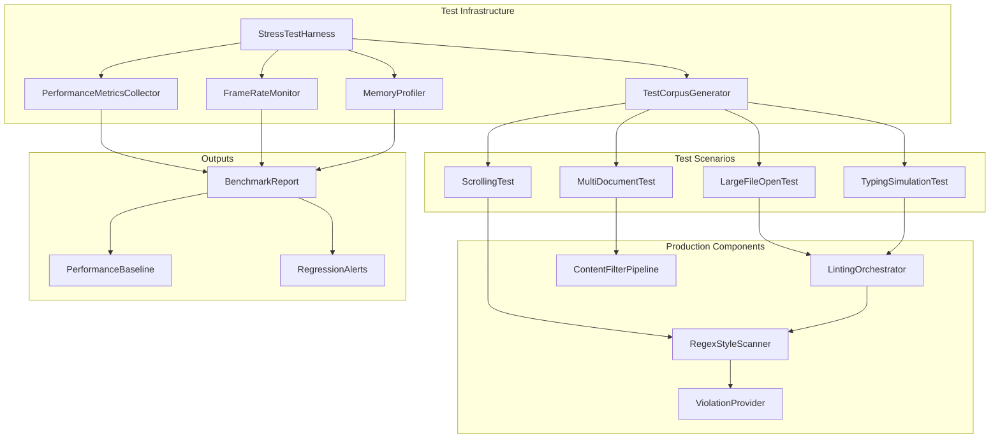
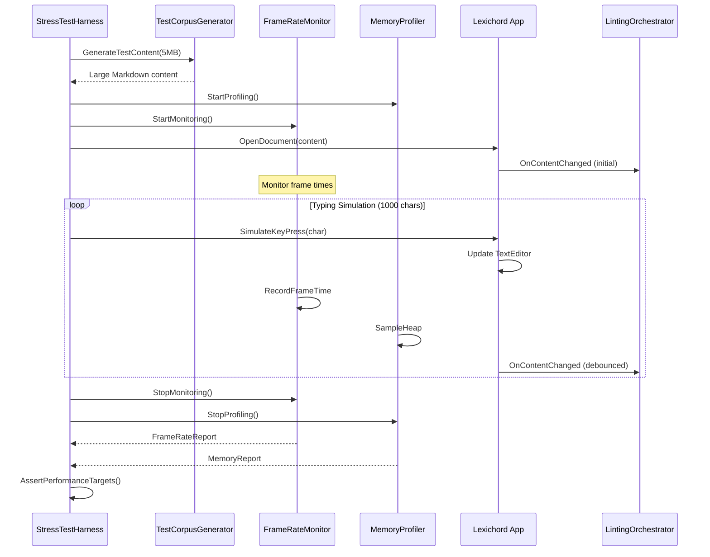
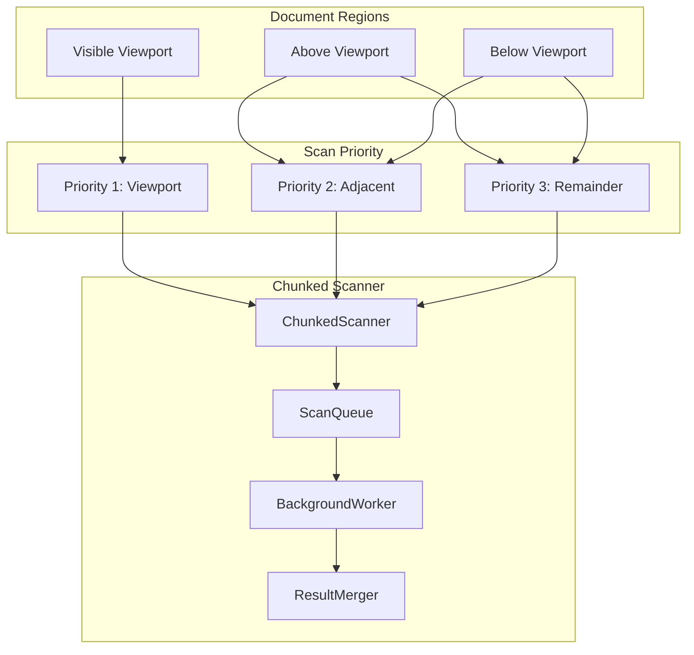

# LCS-INF-027d: Large File Stress Test

## 1. Metadata & Categorization

| Field                | Value                                | Description                                          |
| :------------------- | :----------------------------------- | :--------------------------------------------------- |
| **Feature ID**       | `INF-027d`                           | Sub-part D of Performance Polish                     |
| **Feature Name**     | Large File Stress Test               | Validate performance with 5MB+ documents             |
| **Target Version**   | `v0.2.7d`                            | Final sub-part of v0.2.7                             |
| **Module Scope**     | `Lexichord.Modules.Style.Tests`      | Style governance module tests                        |
| **Swimlane**         | `Product`                            | Core User-Facing Feature                             |
| **License Tier**     | `Core`                               | Foundation (Available in Free tier)                  |
| **Author**           | System Architect                     |                                                      |
| **Status**           | **Draft**                            | Pending implementation                               |
| **Last Updated**     | 2026-01-26                           |                                                      |

---

## 2. Executive Summary

### 2.1 The Requirement

Enterprise documentation workflows involve large technical documents:

- **CommonMark Specification:** The official Markdown spec is ~600KB and serves as our test corpus.
- **Technical Manuals:** Corporate documentation can reach 5-10MB per document.
- **Generated Documentation:** API docs and changelogs grow over time.
- **Performance Expectations:** Users expect 60fps UI responsiveness regardless of document size.
- **Memory Constraints:** Large documents must not exhaust system memory.

Without stress testing, we cannot confidently claim Lexichord handles enterprise workloads.

### 2.2 The Proposed Solution

We **SHALL** implement comprehensive stress testing with:

1. **Test Corpus Generation** — Generate 5MB test content from CommonMark spec.
2. **Frame Rate Measurement** — Verify 60fps during typing simulation.
3. **Memory Profiling** — Track allocation patterns and peak usage.
4. **Debounce Tuning** — Optimize for responsiveness vs. scan frequency.
5. **Chunked Scanning** — Implement progressive scanning for very large files.
6. **Performance Regression Suite** — Automated benchmarks for CI integration.

---

## 3. Architecture

### 3.1 Stress Test Infrastructure



### 3.2 Performance Test Flow



### 3.3 Chunked Scanning Architecture



---

## 4. Decision Tree: Performance Optimization Strategy

```text
START: "How should we handle this document?"
|
+-- Check document size
|   +-- Size < 100KB?
|   |   +-- YES -> Standard single-pass scan
|   |   |   +-- Debounce: 300ms
|   |   |   +-- Full document scan
|   |   +-- NO -> Continue
|   |
|   +-- Size < 1MB?
|   |   +-- YES -> Viewport-priority scan
|   |   |   +-- Debounce: 400ms
|   |   |   +-- Scan viewport first
|   |   |   +-- Background scan remainder
|   |   +-- NO -> Continue
|   |
|   +-- Size < 5MB?
|   |   +-- YES -> Chunked scan with viewport priority
|   |   |   +-- Debounce: 500ms
|   |   |   +-- Chunk size: 100KB
|   |   |   +-- Viewport chunks first
|   |   |   +-- Progressive background scan
|   |   +-- NO -> Continue
|   |
|   +-- Size >= 5MB?
|       +-- Large file mode
|       +-- Debounce: 750ms (adaptive)
|       +-- Chunk size: 50KB
|       +-- Viewport-only during typing
|       +-- Full scan on idle (>2s)
|
+-- Check document complexity
|   +-- Many code blocks/frontmatter?
|   |   +-- Content filtering reduces scan content
|   |   +-- Effective size may be much smaller
|   |
|   +-- Dense violations?
|   |   +-- Limit violations per chunk
|   |   +-- Avoid rendering overload
|
+-- Monitor performance during operation
|   +-- Frame drops detected?
|   |   +-- Increase debounce
|   |   +-- Reduce chunk size
|   |   +-- Pause scanning temporarily
|   |
|   +-- Memory pressure detected?
|       +-- Reduce concurrent scans
|       +-- Clear violation cache
|       +-- GC after large operations
|
END: Scan with selected strategy
```

---

## 5. Data Contracts

### 5.1 IPerformanceBenchmark Interface

```csharp
namespace Lexichord.Abstractions.Contracts;

using System;
using System.Threading;
using System.Threading.Tasks;

/// <summary>
/// Interface for running performance benchmarks.
/// </summary>
/// <remarks>
/// LOGIC: IPerformanceBenchmark provides standardized performance
/// testing for the linting system. It measures scan duration,
/// memory usage, and UI responsiveness under various load conditions.
///
/// Thread Safety:
/// - Benchmark methods can be called from any thread
/// - Results are thread-safe snapshots
/// </remarks>
public interface IPerformanceBenchmark
{
    /// <summary>
    /// Runs a linting benchmark with the specified content.
    /// </summary>
    /// <param name="content">Content to lint.</param>
    /// <param name="iterations">Number of iterations.</param>
    /// <param name="cancellationToken">Cancellation token.</param>
    /// <returns>Benchmark results.</returns>
    /// <remarks>
    /// LOGIC: Runs the linting pipeline multiple times and
    /// collects performance statistics. Each iteration starts
    /// fresh to avoid cache effects skewing results.
    /// </remarks>
    Task<BenchmarkResult> RunLintingBenchmarkAsync(
        string content,
        int iterations,
        CancellationToken cancellationToken = default);

    /// <summary>
    /// Runs a typing simulation benchmark.
    /// </summary>
    /// <param name="baseContent">Initial document content.</param>
    /// <param name="charactersToType">Number of characters to simulate.</param>
    /// <param name="typingIntervalMs">Milliseconds between keystrokes.</param>
    /// <param name="cancellationToken">Cancellation token.</param>
    /// <returns>Typing benchmark results.</returns>
    /// <remarks>
    /// LOGIC: Simulates user typing to measure UI responsiveness
    /// while the linting system is active. Measures frame times
    /// during the typing simulation.
    /// </remarks>
    Task<TypingBenchmarkResult> RunTypingBenchmarkAsync(
        string baseContent,
        int charactersToType,
        int typingIntervalMs = 50,
        CancellationToken cancellationToken = default);

    /// <summary>
    /// Runs a scrolling benchmark.
    /// </summary>
    /// <param name="content">Document content.</param>
    /// <param name="scrollEvents">Number of scroll events to simulate.</param>
    /// <param name="cancellationToken">Cancellation token.</param>
    /// <returns>Scrolling benchmark results.</returns>
    Task<ScrollBenchmarkResult> RunScrollBenchmarkAsync(
        string content,
        int scrollEvents,
        CancellationToken cancellationToken = default);
}

/// <summary>
/// Results from a linting benchmark.
/// </summary>
/// <param name="AverageScanDuration">Average time per scan.</param>
/// <param name="P95ScanDuration">95th percentile scan time.</param>
/// <param name="P99ScanDuration">99th percentile scan time.</param>
/// <param name="PeakMemoryBytes">Peak memory usage during benchmark.</param>
/// <param name="TotalAllocatedBytes">Total bytes allocated.</param>
/// <param name="FrameDropCount">Number of frame drops observed.</param>
/// <param name="AverageFrameRate">Average frame rate during benchmark.</param>
/// <param name="Iterations">Number of iterations completed.</param>
/// <param name="ContentLength">Length of content tested.</param>
/// <param name="ViolationsFound">Average violations per scan.</param>
/// <param name="MeetsPerformanceTargets">Whether all targets were met.</param>
public record BenchmarkResult(
    TimeSpan AverageScanDuration,
    TimeSpan P95ScanDuration,
    TimeSpan P99ScanDuration,
    long PeakMemoryBytes,
    long TotalAllocatedBytes,
    int FrameDropCount,
    double AverageFrameRate,
    int Iterations,
    int ContentLength,
    double ViolationsFound,
    bool MeetsPerformanceTargets
)
{
    /// <summary>
    /// Gets memory usage in megabytes.
    /// </summary>
    public double PeakMemoryMb => PeakMemoryBytes / (1024.0 * 1024.0);

    /// <summary>
    /// Gets total allocated memory in megabytes.
    /// </summary>
    public double TotalAllocatedMb => TotalAllocatedBytes / (1024.0 * 1024.0);

    /// <summary>
    /// Gets average scan duration in milliseconds.
    /// </summary>
    public double AverageScanMs => AverageScanDuration.TotalMilliseconds;

    /// <summary>
    /// Creates a formatted report string.
    /// </summary>
    public string ToReport() => $"""
        Linting Benchmark Report
        ========================
        Content Length: {ContentLength:N0} characters
        Iterations: {Iterations}

        Scan Performance:
          Average: {AverageScanMs:F2}ms
          P95: {P95ScanDuration.TotalMilliseconds:F2}ms
          P99: {P99ScanDuration.TotalMilliseconds:F2}ms
          Violations/Scan: {ViolationsFound:F1}

        Memory:
          Peak: {PeakMemoryMb:F2}MB
          Total Allocated: {TotalAllocatedMb:F2}MB

        UI Responsiveness:
          Average Frame Rate: {AverageFrameRate:F1}fps
          Frame Drops: {FrameDropCount}

        Status: {(MeetsPerformanceTargets ? "PASS" : "FAIL")}
        """;
}

/// <summary>
/// Results from a typing simulation benchmark.
/// </summary>
public record TypingBenchmarkResult(
    int CharactersTyped,
    TimeSpan TotalDuration,
    double AverageFrameRate,
    double MinFrameRate,
    int FrameDrops,
    int LintingTriggered,
    int LintingCompleted,
    TimeSpan AverageInputLatency,
    bool MeetsResponsivenessTargets
)
{
    /// <summary>
    /// Gets characters per second achieved.
    /// </summary>
    public double CharactersPerSecond =>
        CharactersTyped / TotalDuration.TotalSeconds;

    /// <summary>
    /// Gets average input latency in milliseconds.
    /// </summary>
    public double AverageInputLatencyMs => AverageInputLatency.TotalMilliseconds;
}

/// <summary>
/// Results from a scrolling benchmark.
/// </summary>
public record ScrollBenchmarkResult(
    int ScrollEvents,
    TimeSpan TotalDuration,
    double AverageFrameRate,
    int FrameDrops,
    int ViolationsRendered,
    bool MeetsRenderingTargets
);
```

### 5.2 TestCorpusGenerator

```csharp
namespace Lexichord.Modules.Style.Tests.Infrastructure;

using System;
using System.IO;
using System.Net.Http;
using System.Text;
using System.Threading.Tasks;

/// <summary>
/// Generates test corpus for stress testing.
/// </summary>
/// <remarks>
/// LOGIC: TestCorpusGenerator creates large Markdown documents
/// for performance testing. It can:
/// - Download the CommonMark spec as a base
/// - Multiply content to reach target sizes
/// - Generate synthetic content with specific characteristics
///
/// Thread Safety:
/// - Generator is thread-safe
/// - Content generation is CPU-bound
/// </remarks>
public sealed class TestCorpusGenerator
{
    private const string CommonMarkSpecUrl =
        "https://raw.githubusercontent.com/commonmark/commonmark-spec/master/spec.txt";

    /// <summary>
    /// Downloads the CommonMark specification.
    /// </summary>
    /// <returns>CommonMark spec content (~600KB).</returns>
    public async Task<string> GetCommonMarkSpecAsync()
    {
        using var client = new HttpClient();
        return await client.GetStringAsync(CommonMarkSpecUrl);
    }

    /// <summary>
    /// Generates a large Markdown document of specified size.
    /// </summary>
    /// <param name="targetSizeBytes">Target document size in bytes.</param>
    /// <param name="baseContent">Optional base content to multiply.</param>
    /// <returns>Generated Markdown content.</returns>
    /// <remarks>
    /// LOGIC: If baseContent is provided, multiplies it to reach target size.
    /// Otherwise, generates synthetic Markdown content.
    ///
    /// The generated content includes:
    /// - Headings at various levels
    /// - Paragraphs with style violations (for linting)
    /// - Code blocks (should be excluded)
    /// - Frontmatter (should be excluded)
    /// - Lists and blockquotes
    /// </remarks>
    public string GenerateLargeDocument(
        int targetSizeBytes,
        string? baseContent = null)
    {
        if (baseContent != null)
        {
            return MultiplyContent(baseContent, targetSizeBytes);
        }

        return GenerateSyntheticContent(targetSizeBytes);
    }

    /// <summary>
    /// Generates a document with specific characteristics.
    /// </summary>
    /// <param name="options">Generation options.</param>
    /// <returns>Generated content.</returns>
    public string GenerateDocument(DocumentGenerationOptions options)
    {
        var sb = new StringBuilder();

        // LOGIC: Add frontmatter if requested
        if (options.IncludeFrontmatter)
        {
            sb.AppendLine("---");
            sb.AppendLine("title: Performance Test Document");
            sb.AppendLine("whitelist_enabled: true");  // Should be excluded
            sb.AppendLine("tags: [whitelist, blacklist, legacy]");
            sb.AppendLine("---");
            sb.AppendLine();
        }

        // LOGIC: Generate sections to reach target size
        var sectionCount = 0;
        while (sb.Length < options.TargetSizeBytes)
        {
            sectionCount++;
            AppendSection(sb, sectionCount, options);
        }

        return sb.ToString();
    }

    private string MultiplyContent(string baseContent, int targetSize)
    {
        var sb = new StringBuilder(targetSize + baseContent.Length);
        var separator = "\n\n---\n\n";

        while (sb.Length < targetSize)
        {
            sb.Append(baseContent);
            sb.Append(separator);
        }

        return sb.ToString();
    }

    private string GenerateSyntheticContent(int targetSize)
    {
        return GenerateDocument(new DocumentGenerationOptions(
            TargetSizeBytes: targetSize,
            IncludeFrontmatter: true,
            CodeBlockDensity: 0.2,
            ViolationDensity: 0.1
        ));
    }

    private void AppendSection(
        StringBuilder sb,
        int sectionNum,
        DocumentGenerationOptions options)
    {
        // LOGIC: Add heading
        sb.AppendLine($"## Section {sectionNum}: Test Content");
        sb.AppendLine();

        // LOGIC: Add paragraphs with occasional violations
        var random = new Random(sectionNum); // Deterministic for reproducibility
        for (int p = 0; p < 5; p++)
        {
            if (random.NextDouble() < options.ViolationDensity)
            {
                // Add paragraph with style violation
                sb.AppendLine("This paragraph uses whitelist instead of allowlist, " +
                              "which should trigger a style violation in the linter. " +
                              "The term blacklist should also be flagged.");
            }
            else
            {
                // Add clean paragraph
                sb.AppendLine("This is a clean paragraph without any style violations. " +
                              "It uses proper inclusive terminology throughout.");
            }
            sb.AppendLine();
        }

        // LOGIC: Add code block (should be excluded from linting)
        if (random.NextDouble() < options.CodeBlockDensity)
        {
            sb.AppendLine("```python");
            sb.AppendLine("# This code should NOT trigger violations");
            sb.AppendLine("whitelist_enabled = True");
            sb.AppendLine("blacklist_items = ['item1', 'item2']");
            sb.AppendLine("def check_whitelist(item):");
            sb.AppendLine("    return item in whitelist_items");
            sb.AppendLine("```");
            sb.AppendLine();
        }

        // LOGIC: Add list
        sb.AppendLine("- Item one");
        sb.AppendLine("- Item two");
        sb.AppendLine("- Item three");
        sb.AppendLine();
    }
}

/// <summary>
/// Options for document generation.
/// </summary>
/// <param name="TargetSizeBytes">Target document size in bytes.</param>
/// <param name="IncludeFrontmatter">Whether to include YAML frontmatter.</param>
/// <param name="CodeBlockDensity">Probability of code block per section (0-1).</param>
/// <param name="ViolationDensity">Probability of style violation per paragraph (0-1).</param>
public record DocumentGenerationOptions(
    int TargetSizeBytes,
    bool IncludeFrontmatter = true,
    double CodeBlockDensity = 0.2,
    double ViolationDensity = 0.1
);
```

### 5.3 PerformanceMonitor Implementation

```csharp
namespace Lexichord.Modules.Style.Services;

using System;
using System.Collections.Concurrent;
using System.Diagnostics;
using System.Threading;
using Lexichord.Abstractions.Contracts;

/// <summary>
/// Monitors linting performance metrics.
/// </summary>
/// <remarks>
/// LOGIC: PerformanceMonitor tracks scan durations, frame drops,
/// and memory usage across all linting operations. Uses lock-free
/// concurrent collections for thread-safe metrics collection.
///
/// Metrics are used for:
/// - Adaptive debounce adjustment
/// - Performance regression detection
/// - User-facing performance indicators
///
/// Thread Safety:
/// - All methods are thread-safe
/// - Uses Interlocked operations for counters
/// - ConcurrentQueue for duration samples
/// </remarks>
public sealed class PerformanceMonitor : IPerformanceMonitor
{
    private readonly ConcurrentQueue<double> _scanDurations = new();
    private readonly int _maxSamples;

    private long _scansCompleted;
    private long _scansCancelled;
    private int _frameDropCount;
    private long _peakMemoryBytes;

    // LOGIC: Thresholds for performance degradation detection
    private const double DegradedScanThresholdMs = 500;
    private const int DegradedFrameDropThreshold = 5;

    // LOGIC: Baseline debounce intervals
    private static readonly TimeSpan MinDebounce = TimeSpan.FromMilliseconds(200);
    private static readonly TimeSpan MaxDebounce = TimeSpan.FromMilliseconds(1000);
    private static readonly TimeSpan BaseDebounce = TimeSpan.FromMilliseconds(300);

    public PerformanceMonitor(int maxSamples = 100)
    {
        _maxSamples = maxSamples;
    }

    /// <inheritdoc/>
    public IDisposable StartOperation(string operationName)
    {
        return new OperationTimer(this, operationName);
    }

    /// <inheritdoc/>
    public void RecordOperation(string operationName, TimeSpan duration)
    {
        // LOGIC: Record scan duration
        _scanDurations.Enqueue(duration.TotalMilliseconds);

        // LOGIC: Trim old samples
        while (_scanDurations.Count > _maxSamples)
        {
            _scanDurations.TryDequeue(out _);
        }

        // LOGIC: Update memory tracking
        var currentMemory = GC.GetTotalMemory(false);
        InterlockedMax(ref _peakMemoryBytes, currentMemory);

        // LOGIC: Increment completed count
        Interlocked.Increment(ref _scansCompleted);
    }

    /// <inheritdoc/>
    public void ReportFrameDrop(int droppedFrames)
    {
        Interlocked.Add(ref _frameDropCount, droppedFrames);
    }

    /// <inheritdoc/>
    public PerformanceMetrics GetMetrics()
    {
        var durations = _scanDurations.ToArray();

        if (durations.Length == 0)
        {
            return new PerformanceMetrics(
                AverageScanDurationMs: 0,
                MaxScanDurationMs: 0,
                P95ScanDurationMs: 0,
                FrameDropCount: _frameDropCount,
                MemoryUsageMb: GC.GetTotalMemory(false) / (1024.0 * 1024.0),
                ScansCompleted: (int)Interlocked.Read(ref _scansCompleted),
                ScansCancelled: (int)Interlocked.Read(ref _scansCancelled)
            );
        }

        // LOGIC: Calculate statistics
        Array.Sort(durations);
        var average = durations.Average();
        var max = durations.Max();
        var p95Index = (int)(durations.Length * 0.95);
        var p95 = durations[Math.Min(p95Index, durations.Length - 1)];

        return new PerformanceMetrics(
            AverageScanDurationMs: average,
            MaxScanDurationMs: max,
            P95ScanDurationMs: p95,
            FrameDropCount: _frameDropCount,
            MemoryUsageMb: GC.GetTotalMemory(false) / (1024.0 * 1024.0),
            ScansCompleted: (int)Interlocked.Read(ref _scansCompleted),
            ScansCancelled: (int)Interlocked.Read(ref _scansCancelled)
        );
    }

    /// <inheritdoc/>
    public void Reset()
    {
        while (_scanDurations.TryDequeue(out _)) { }
        Interlocked.Exchange(ref _scansCompleted, 0);
        Interlocked.Exchange(ref _scansCancelled, 0);
        Interlocked.Exchange(ref _frameDropCount, 0);
        Interlocked.Exchange(ref _peakMemoryBytes, 0);
    }

    /// <inheritdoc/>
    public bool IsPerformanceDegraded
    {
        get
        {
            var metrics = GetMetrics();
            return metrics.AverageScanDurationMs > DegradedScanThresholdMs
                || metrics.FrameDropCount > DegradedFrameDropThreshold;
        }
    }

    /// <inheritdoc/>
    public TimeSpan RecommendedDebounceInterval
    {
        get
        {
            var metrics = GetMetrics();

            // LOGIC: Scale debounce based on scan performance
            if (metrics.AverageScanDurationMs < 100)
            {
                return MinDebounce;
            }

            if (metrics.AverageScanDurationMs > 500)
            {
                return MaxDebounce;
            }

            // LOGIC: Linear interpolation between min and max
            var factor = (metrics.AverageScanDurationMs - 100) / 400;
            var debounceMs = MinDebounce.TotalMilliseconds +
                (MaxDebounce.TotalMilliseconds - MinDebounce.TotalMilliseconds) * factor;

            return TimeSpan.FromMilliseconds(debounceMs);
        }
    }

    /// <summary>
    /// Records a cancelled scan operation.
    /// </summary>
    public void RecordCancellation()
    {
        Interlocked.Increment(ref _scansCancelled);
    }

    private static void InterlockedMax(ref long location, long value)
    {
        long current;
        do
        {
            current = Interlocked.Read(ref location);
            if (value <= current) return;
        } while (Interlocked.CompareExchange(ref location, value, current) != current);
    }

    /// <summary>
    /// Timer for measuring operation duration.
    /// </summary>
    private sealed class OperationTimer : IDisposable
    {
        private readonly PerformanceMonitor _monitor;
        private readonly string _operationName;
        private readonly Stopwatch _stopwatch;
        private bool _disposed;

        public OperationTimer(PerformanceMonitor monitor, string operationName)
        {
            _monitor = monitor;
            _operationName = operationName;
            _stopwatch = Stopwatch.StartNew();
        }

        public void Dispose()
        {
            if (_disposed) return;
            _disposed = true;

            _stopwatch.Stop();
            _monitor.RecordOperation(_operationName, _stopwatch.Elapsed);
        }
    }
}
```

### 5.4 ChunkedScanner Implementation

```csharp
namespace Lexichord.Modules.Style.Services;

using System;
using System.Collections.Generic;
using System.Linq;
using System.Threading;
using System.Threading.Tasks;
using Lexichord.Abstractions.Contracts;
using Microsoft.Extensions.Logging;

/// <summary>
/// Scans large documents in chunks with viewport priority.
/// </summary>
/// <remarks>
/// LOGIC: ChunkedScanner divides large documents into manageable
/// chunks and scans them progressively. Viewport-visible chunks
/// are prioritized to provide immediate feedback.
///
/// Chunking Strategy:
/// - Default chunk size: 100KB
/// - Chunk boundaries aligned to line breaks
/// - Viewport chunks scanned first
/// - Remaining chunks scanned in background
///
/// Thread Safety:
/// - Scanner is thread-safe
/// - Results are merged safely
/// </remarks>
public sealed class ChunkedScanner
{
    private readonly IStyleScanner _scanner;
    private readonly ILogger<ChunkedScanner> _logger;

    private const int DefaultChunkSize = 100 * 1024; // 100KB
    private const int LargeFileThreshold = 1024 * 1024; // 1MB

    public ChunkedScanner(
        IStyleScanner scanner,
        ILogger<ChunkedScanner> logger)
    {
        _scanner = scanner ?? throw new ArgumentNullException(nameof(scanner));
        _logger = logger ?? throw new ArgumentNullException(nameof(logger));
    }

    /// <summary>
    /// Scans a large document in chunks.
    /// </summary>
    /// <param name="content">Full document content.</param>
    /// <param name="rules">Style rules to apply.</param>
    /// <param name="options">Scan options.</param>
    /// <param name="viewportRange">Visible character range (if known).</param>
    /// <param name="cancellationToken">Cancellation token.</param>
    /// <returns>Observable of scan results as chunks complete.</returns>
    public async IAsyncEnumerable<ChunkScanResult> ScanChunkedAsync(
        string content,
        IReadOnlyList<StyleRule> rules,
        ScanOptions options,
        (int Start, int End)? viewportRange,
        [EnumeratorCancellation] CancellationToken cancellationToken = default)
    {
        if (content.Length < LargeFileThreshold)
        {
            // LOGIC: Small file, single scan
            _logger.LogDebug("Document under 1MB, using single scan");
            var result = await _scanner.ScanAsync(content, rules, options, cancellationToken);
            yield return new ChunkScanResult(
                ChunkIndex: 0,
                TotalChunks: 1,
                StartOffset: 0,
                EndOffset: content.Length,
                Matches: result,
                IsViewportChunk: true
            );
            yield break;
        }

        // LOGIC: Chunk the document
        var chunks = CreateChunks(content, viewportRange);
        var totalChunks = chunks.Count;

        _logger.LogDebug(
            "Document chunked: {Count} chunks of ~{Size}KB each",
            totalChunks, DefaultChunkSize / 1024);

        // LOGIC: Sort chunks by priority (viewport first)
        var sortedChunks = chunks
            .OrderBy(c => c.IsViewportChunk ? 0 : 1)
            .ThenBy(c => c.DistanceFromViewport)
            .ToList();

        // LOGIC: Scan each chunk
        var chunkIndex = 0;
        foreach (var chunk in sortedChunks)
        {
            cancellationToken.ThrowIfCancellationRequested();

            _logger.LogDebug(
                "Scanning chunk {Index}/{Total} (viewport: {IsViewport})",
                chunkIndex + 1, totalChunks, chunk.IsViewportChunk);

            var chunkContent = content.Substring(chunk.StartOffset, chunk.Length);

            // LOGIC: Adjust exclusion regions for chunk offset
            var adjustedExclusions = AdjustExclusionsForChunk(
                options.ExcludedRegions,
                chunk.StartOffset,
                chunk.EndOffset);

            var chunkOptions = options with
            {
                ExcludedRegions = adjustedExclusions
            };

            var matches = await _scanner.ScanAsync(
                chunkContent,
                rules,
                chunkOptions,
                cancellationToken);

            // LOGIC: Adjust match offsets back to document coordinates
            var adjustedMatches = matches
                .Select(m => m with { Offset = m.Offset + chunk.StartOffset })
                .ToList();

            yield return new ChunkScanResult(
                ChunkIndex: chunkIndex,
                TotalChunks: totalChunks,
                StartOffset: chunk.StartOffset,
                EndOffset: chunk.EndOffset,
                Matches: adjustedMatches,
                IsViewportChunk: chunk.IsViewportChunk
            );

            chunkIndex++;
        }
    }

    /// <summary>
    /// Creates chunk definitions for a document.
    /// </summary>
    private List<ChunkDefinition> CreateChunks(
        string content,
        (int Start, int End)? viewportRange)
    {
        var chunks = new List<ChunkDefinition>();
        var offset = 0;
        var viewportStart = viewportRange?.Start ?? content.Length / 2;
        var viewportEnd = viewportRange?.End ?? viewportStart + 1000;

        while (offset < content.Length)
        {
            // LOGIC: Find chunk end (prefer line boundary)
            var chunkEnd = Math.Min(offset + DefaultChunkSize, content.Length);
            if (chunkEnd < content.Length)
            {
                // LOGIC: Extend to next line boundary
                var nextNewline = content.IndexOf('\n', chunkEnd);
                if (nextNewline != -1 && nextNewline < chunkEnd + 1000)
                {
                    chunkEnd = nextNewline + 1;
                }
            }

            // LOGIC: Determine if chunk overlaps viewport
            var isViewport = offset < viewportEnd && chunkEnd > viewportStart;
            var distanceFromViewport = isViewport ? 0 :
                Math.Min(
                    Math.Abs(offset - viewportStart),
                    Math.Abs(chunkEnd - viewportEnd));

            chunks.Add(new ChunkDefinition(
                StartOffset: offset,
                EndOffset: chunkEnd,
                IsViewportChunk: isViewport,
                DistanceFromViewport: distanceFromViewport
            ));

            offset = chunkEnd;
        }

        return chunks;
    }

    /// <summary>
    /// Adjusts exclusion regions for a chunk's coordinate space.
    /// </summary>
    private IReadOnlyList<ExcludedRegion> AdjustExclusionsForChunk(
        IReadOnlyList<ExcludedRegion> exclusions,
        int chunkStart,
        int chunkEnd)
    {
        return exclusions
            .Where(e => e.EndOffset > chunkStart && e.StartOffset < chunkEnd)
            .Select(e => new ExcludedRegion(
                StartOffset: Math.Max(0, e.StartOffset - chunkStart),
                EndOffset: Math.Min(chunkEnd - chunkStart, e.EndOffset - chunkStart),
                Reason: e.Reason,
                Metadata: e.Metadata
            ))
            .ToList();
    }

    /// <summary>
    /// Definition of a document chunk.
    /// </summary>
    private record ChunkDefinition(
        int StartOffset,
        int EndOffset,
        bool IsViewportChunk,
        int DistanceFromViewport
    )
    {
        public int Length => EndOffset - StartOffset;
    }
}

/// <summary>
/// Result of scanning a single chunk.
/// </summary>
/// <param name="ChunkIndex">Index of this chunk (0-based).</param>
/// <param name="TotalChunks">Total number of chunks.</param>
/// <param name="StartOffset">Start offset in document.</param>
/// <param name="EndOffset">End offset in document.</param>
/// <param name="Matches">Matches found in this chunk.</param>
/// <param name="IsViewportChunk">Whether this chunk is in the viewport.</param>
public record ChunkScanResult(
    int ChunkIndex,
    int TotalChunks,
    int StartOffset,
    int EndOffset,
    IReadOnlyList<ScanMatch> Matches,
    bool IsViewportChunk
)
{
    /// <summary>
    /// Gets progress percentage.
    /// </summary>
    public double ProgressPercent => (ChunkIndex + 1.0) / TotalChunks * 100;
}
```

---

## 6. Implementation Logic

### 6.1 Stress Test Fixture

```csharp
namespace Lexichord.Modules.Style.Tests.Performance;

using System;
using System.Diagnostics;
using System.Threading.Tasks;
using NUnit.Framework;

/// <summary>
/// Stress tests for the linting system.
/// </summary>
/// <remarks>
/// LOGIC: These tests verify that the linting system maintains
/// acceptable performance with large documents. They are marked
/// as [Explicit] because they take significant time to run.
///
/// Performance Targets:
/// - 5MB document: Full scan < 2000ms
/// - 5MB document: Viewport scan < 100ms
/// - Typing simulation: 60fps maintained
/// - Memory usage: < 100MB for 5MB document
/// </remarks>
[TestFixture]
[Category("Performance")]
[Explicit("Performance tests - run manually")]
public class LintingStressTests
{
    private TestCorpusGenerator _corpusGenerator = null!;
    private string _largeContent = null!;

    [OneTimeSetUp]
    public async Task SetUp()
    {
        _corpusGenerator = new TestCorpusGenerator();

        // LOGIC: Generate 5MB test document
        // Use synthetic content for reproducibility
        _largeContent = _corpusGenerator.GenerateDocument(
            new DocumentGenerationOptions(
                TargetSizeBytes: 5 * 1024 * 1024,
                IncludeFrontmatter: true,
                CodeBlockDensity: 0.15,
                ViolationDensity: 0.08
            ));

        TestContext.WriteLine($"Generated test document: {_largeContent.Length:N0} characters");
    }

    [Test]
    [Order(1)]
    public async Task FullScan_5MBDocument_CompletesUnder2Seconds()
    {
        // Arrange
        var orchestrator = CreateOrchestrator();
        var stopwatch = Stopwatch.StartNew();

        // Act
        var result = await orchestrator.LintDocumentAsync(
            "stress-test",
            _largeContent,
            ".md");

        stopwatch.Stop();

        // Assert
        TestContext.WriteLine($"Full scan completed in {stopwatch.ElapsedMilliseconds}ms");
        TestContext.WriteLine($"Violations found: {result.ViolationCount}");

        Assert.Multiple(() =>
        {
            Assert.That(stopwatch.ElapsedMilliseconds, Is.LessThan(2000),
                "Full scan should complete under 2 seconds");
            Assert.That(result.Violations, Is.Not.Empty,
                "Should find violations in test content");
        });
    }

    [Test]
    [Order(2)]
    public async Task ViewportScan_5MBDocument_CompletesUnder100Ms()
    {
        // Arrange
        var orchestrator = CreateOrchestrator();
        var viewportStart = _largeContent.Length / 2;
        var viewportEnd = viewportStart + 10000; // 10KB viewport
        var stopwatch = Stopwatch.StartNew();

        // Act
        var result = await orchestrator.LintRangeAsync(
            "stress-test",
            _largeContent,
            ".md",
            viewportStart,
            viewportEnd);

        stopwatch.Stop();

        // Assert
        TestContext.WriteLine($"Viewport scan completed in {stopwatch.ElapsedMilliseconds}ms");

        Assert.That(stopwatch.ElapsedMilliseconds, Is.LessThan(100),
            "Viewport scan should complete under 100ms");
    }

    [Test]
    [Order(3)]
    public async Task TypingSimulation_MaintainsSixtyFPS()
    {
        // Arrange
        var benchmark = CreateBenchmark();
        var charactersToType = 500;
        var typingInterval = 50; // 20 characters per second

        // Act
        var result = await benchmark.RunTypingBenchmarkAsync(
            _largeContent,
            charactersToType,
            typingInterval);

        // Assert
        TestContext.WriteLine($"Typing benchmark results:");
        TestContext.WriteLine($"  Average frame rate: {result.AverageFrameRate:F1} fps");
        TestContext.WriteLine($"  Min frame rate: {result.MinFrameRate:F1} fps");
        TestContext.WriteLine($"  Frame drops: {result.FrameDrops}");
        TestContext.WriteLine($"  Linting triggered: {result.LintingTriggered}");
        TestContext.WriteLine($"  Linting completed: {result.LintingCompleted}");
        TestContext.WriteLine($"  Input latency: {result.AverageInputLatencyMs:F2}ms");

        Assert.Multiple(() =>
        {
            Assert.That(result.AverageFrameRate, Is.GreaterThanOrEqualTo(55),
                "Average frame rate should be near 60fps");
            Assert.That(result.MinFrameRate, Is.GreaterThanOrEqualTo(30),
                "Minimum frame rate should not drop below 30fps");
            Assert.That(result.FrameDrops, Is.LessThan(10),
                "Should have fewer than 10 frame drops");
        });
    }

    [Test]
    [Order(4)]
    public void MemoryUsage_5MBDocument_StaysUnder100MB()
    {
        // Arrange
        GC.Collect();
        GC.WaitForPendingFinalizers();
        GC.Collect();
        var baselineMemory = GC.GetTotalMemory(true);

        // Act
        var orchestrator = CreateOrchestrator();
        orchestrator.TrackDocument("stress-test", _largeContent, ".md");

        // Trigger scan and wait
        System.Threading.Thread.Sleep(1000);

        var peakMemory = GC.GetTotalMemory(false);
        var memoryUsedMb = (peakMemory - baselineMemory) / (1024.0 * 1024.0);

        // Cleanup
        orchestrator.UntrackDocument("stress-test");
        GC.Collect();

        // Assert
        TestContext.WriteLine($"Memory usage: {memoryUsedMb:F2}MB");

        Assert.That(memoryUsedMb, Is.LessThan(100),
            "Memory usage should stay under 100MB for 5MB document");
    }

    [Test]
    [Order(5)]
    public async Task DebounceAdaptation_UnderLoad_IncreasesInterval()
    {
        // Arrange
        var monitor = new PerformanceMonitor();

        // Act - simulate slow scans
        for (int i = 0; i < 10; i++)
        {
            monitor.RecordOperation($"scan{i}", TimeSpan.FromMilliseconds(400));
        }

        var recommendedDebounce = monitor.RecommendedDebounceInterval;

        // Assert
        TestContext.WriteLine($"Recommended debounce: {recommendedDebounce.TotalMilliseconds}ms");

        Assert.That(recommendedDebounce.TotalMilliseconds, Is.GreaterThan(300),
            "Debounce should increase when scans are slow");
    }

    [Test]
    [Order(6)]
    public async Task ChunkedScan_ProcessesViewportFirst()
    {
        // Arrange
        var scanner = CreateChunkedScanner();
        var rules = await GetDefaultRules();
        var viewportStart = _largeContent.Length / 2;
        var viewportEnd = viewportStart + 10000;

        var results = new List<ChunkScanResult>();

        // Act
        await foreach (var chunk in scanner.ScanChunkedAsync(
            _largeContent,
            rules,
            ScanOptions.Default,
            (viewportStart, viewportEnd)))
        {
            results.Add(chunk);
            TestContext.WriteLine(
                $"Chunk {chunk.ChunkIndex + 1}/{chunk.TotalChunks}: " +
                $"{chunk.Matches.Count} matches, viewport: {chunk.IsViewportChunk}");
        }

        // Assert
        Assert.Multiple(() =>
        {
            Assert.That(results, Is.Not.Empty);
            Assert.That(results[0].IsViewportChunk, Is.True,
                "First chunk should be viewport chunk");
        });
    }

    [Test]
    [Order(7)]
    public async Task FilteredScan_ExcludesCodeBlocks()
    {
        // Arrange
        var orchestrator = CreateOrchestrator();
        var stopwatch = Stopwatch.StartNew();

        // Act
        var result = await orchestrator.LintDocumentAsync(
            "stress-test",
            _largeContent,
            ".md");

        stopwatch.Stop();

        // Assert - violations should only be in prose, not code blocks
        foreach (var violation in result.Violations.Take(10))
        {
            var context = GetLineContext(_largeContent, violation.Offset);
            TestContext.WriteLine($"Violation at {violation.Offset}: {violation.Message}");
            TestContext.WriteLine($"  Context: {context}");

            // Code blocks start with ``` or are indented 4 spaces
            Assert.That(context, Does.Not.StartWith("```"),
                "Violations should not be in code blocks");
            Assert.That(context.TrimStart(), Does.Not.StartWith("whitelist_enabled"),
                "Variable names in code should not be flagged");
        }
    }

    // Helper methods
    private ILintingOrchestrator CreateOrchestrator()
    {
        // Create full DI container with all services
        // ...implementation details...
        throw new NotImplementedException("Wire up DI container");
    }

    private IPerformanceBenchmark CreateBenchmark()
    {
        throw new NotImplementedException("Create benchmark harness");
    }

    private ChunkedScanner CreateChunkedScanner()
    {
        throw new NotImplementedException("Create chunked scanner");
    }

    private Task<IReadOnlyList<StyleRule>> GetDefaultRules()
    {
        throw new NotImplementedException("Load default rules");
    }

    private string GetLineContext(string content, int offset)
    {
        var lineStart = content.LastIndexOf('\n', Math.Max(0, offset - 1)) + 1;
        var lineEnd = content.IndexOf('\n', offset);
        if (lineEnd == -1) lineEnd = content.Length;
        return content.Substring(lineStart, lineEnd - lineStart);
    }
}
```

---

## 7. Use Cases

### UC-01: Open 5MB Technical Document

**Preconditions:**
- User has 5MB Markdown documentation file.
- Lexichord with linting enabled.

**Flow:**
1. User opens 5MB file.
2. Document loads in editor.
3. Initial lint triggered (debounced).
4. Chunked scanner divides document into ~50 chunks.
5. Viewport chunks scanned first (user sees results immediately).
6. Background chunks scan progressively.
7. User starts typing before scan completes.
8. Current scan cancelled, new scan queued.
9. UI maintains 60fps throughout.

**Postconditions:**
- Document fully linted eventually.
- Viewport violations visible quickly.
- No UI freezing or lag.

---

### UC-02: Rapid Editing Large Document

**Preconditions:**
- 5MB document open with active linting.
- User typing rapidly.

**Flow:**
1. User types at 50 WPM (250 chars/min).
2. Each keystroke updates editor.
3. Debounce prevents constant re-scanning.
4. Adaptive debounce increases interval if CPU loaded.
5. Frame drops monitored.
6. If drops detected, debounce increased further.
7. When typing pauses, full scan completes.
8. UI never drops below 30fps.

**Postconditions:**
- Typing feels responsive.
- Linting catches up during pauses.

---

## 8. Observability & Logging

| Level | Context | Message Template |
|:------|:--------|:-----------------|
| Debug | ChunkedScanner | `Document under 1MB, using single scan` |
| Debug | ChunkedScanner | `Document chunked: {Count} chunks of ~{Size}KB each` |
| Debug | ChunkedScanner | `Scanning chunk {Index}/{Total} (viewport: {IsViewport})` |
| Information | PerformanceMonitor | `Performance degradation detected: avg scan {Avg}ms` |
| Debug | PerformanceMonitor | `Recommended debounce adjusted to {Debounce}ms` |
| Warning | PerformanceMonitor | `Frame drops detected: {Count} in last interval` |

---

## 9. Unit Testing Requirements

### 9.1 Benchmark Tests

```csharp
[TestFixture]
[Category("Unit")]
public class PerformanceMonitorTests
{
    private PerformanceMonitor _sut = null!;

    [SetUp]
    public void SetUp()
    {
        _sut = new PerformanceMonitor();
    }

    [Test]
    public void GetMetrics_NoOperations_ReturnsZeroValues()
    {
        // Act
        var metrics = _sut.GetMetrics();

        // Assert
        Assert.Multiple(() =>
        {
            Assert.That(metrics.AverageScanDurationMs, Is.EqualTo(0));
            Assert.That(metrics.ScansCompleted, Is.EqualTo(0));
        });
    }

    [Test]
    public void RecordOperation_TracksAverage()
    {
        // Arrange
        _sut.RecordOperation("scan1", TimeSpan.FromMilliseconds(100));
        _sut.RecordOperation("scan2", TimeSpan.FromMilliseconds(200));
        _sut.RecordOperation("scan3", TimeSpan.FromMilliseconds(300));

        // Act
        var metrics = _sut.GetMetrics();

        // Assert
        Assert.That(metrics.AverageScanDurationMs, Is.EqualTo(200));
        Assert.That(metrics.ScansCompleted, Is.EqualTo(3));
    }

    [Test]
    public void RecommendedDebounceInterval_FastScans_ReturnsMinimum()
    {
        // Arrange
        for (int i = 0; i < 10; i++)
        {
            _sut.RecordOperation($"scan{i}", TimeSpan.FromMilliseconds(50));
        }

        // Act
        var debounce = _sut.RecommendedDebounceInterval;

        // Assert
        Assert.That(debounce.TotalMilliseconds, Is.EqualTo(200));
    }

    [Test]
    public void RecommendedDebounceInterval_SlowScans_ReturnsHigher()
    {
        // Arrange
        for (int i = 0; i < 10; i++)
        {
            _sut.RecordOperation($"scan{i}", TimeSpan.FromMilliseconds(600));
        }

        // Act
        var debounce = _sut.RecommendedDebounceInterval;

        // Assert
        Assert.That(debounce.TotalMilliseconds, Is.GreaterThan(500));
    }

    [Test]
    public void IsPerformanceDegraded_SlowScans_ReturnsTrue()
    {
        // Arrange
        for (int i = 0; i < 10; i++)
        {
            _sut.RecordOperation($"scan{i}", TimeSpan.FromMilliseconds(600));
        }

        // Assert
        Assert.That(_sut.IsPerformanceDegraded, Is.True);
    }

    [Test]
    public void Reset_ClearsAllMetrics()
    {
        // Arrange
        _sut.RecordOperation("scan1", TimeSpan.FromMilliseconds(100));
        _sut.ReportFrameDrop(5);

        // Act
        _sut.Reset();
        var metrics = _sut.GetMetrics();

        // Assert
        Assert.Multiple(() =>
        {
            Assert.That(metrics.ScansCompleted, Is.EqualTo(0));
            Assert.That(metrics.FrameDropCount, Is.EqualTo(0));
        });
    }
}
```

---

## 10. Security & Safety

### 10.1 Memory Safety

> [!WARNING]
> Large files can cause out-of-memory conditions.

- **Chunked Processing:** Never load entire document into regex at once.
- **Streaming Results:** Yield results as chunks complete.
- **Memory Monitoring:** Track and report memory usage.
- **GC Hints:** Suggest garbage collection after large operations.

### 10.2 DoS Prevention

- **Timeout Protection:** All operations have configurable timeouts.
- **Cancellation Support:** Users can cancel long-running operations.
- **Resource Limits:** Maximum document size configurable.

---

## 11. Risks & Mitigations

| Risk | Impact | Mitigation |
|:-----|:-------|:-----------|
| OOM on very large files | High | Chunked scanning; memory limits |
| UI freeze during scan | High | Async offloading; frame monitoring |
| Test flakiness due to timing | Medium | Use relative metrics; wide tolerances |
| Benchmark results vary by machine | Medium | Document baseline; percentage targets |
| Chunk boundary misses violation | Low | Overlap chunks by 100 chars |

---

## 12. Acceptance Criteria (QA)

| # | Category | Criterion |
|:--|:---------|:----------|
| 1 | **[Performance]** | 5MB full scan < 2000ms |
| 2 | **[Performance]** | 5MB viewport scan < 100ms |
| 3 | **[Performance]** | Typing at 60fps during lint |
| 4 | **[Performance]** | No frame drops below 30fps |
| 5 | **[Memory]** | 5MB document uses < 100MB |
| 6 | **[Chunking]** | Viewport chunks prioritized |
| 7 | **[Chunking]** | Progressive scan completes eventually |
| 8 | **[Adaptive]** | Debounce increases under load |
| 9 | **[Adaptive]** | Degradation detected correctly |
| 10 | **[Tests]** | Stress tests pass on CI |

---

## 13. Verification Commands

```bash
# 1. Run performance tests (explicit)
dotnet test --filter "Category=Performance" -- RunConfiguration.TargetPlatform=x64

# 2. Generate test corpus
dotnet run --project tools/CorpusGenerator -- --size 5MB --output test-corpus.md

# 3. Profile memory usage
dotnet-trace collect --process-id <pid> --providers Microsoft-Windows-DotNETRuntime

# 4. Benchmark specific scenario
dotnet run --project tests/Benchmarks -- --filter "*LargeFile*" --warmupCount 3

# 5. Verify frame rate
# Use Avalonia performance overlay (F11 in debug)
# Watch for frame time spikes during typing

# 6. Memory profile
dotnet-counters monitor --process-id <pid> --counters System.Runtime
```

---

## 14. Deliverable Checklist

| Step | Description | Status |
|:-----|:------------|:-------|
| 1 | Define IPerformanceBenchmark interface | [ ] |
| 2 | Define BenchmarkResult records | [ ] |
| 3 | Implement TestCorpusGenerator | [ ] |
| 4 | Implement PerformanceMonitor | [ ] |
| 5 | Implement ChunkedScanner | [ ] |
| 6 | Implement viewport-priority scanning | [ ] |
| 7 | Implement adaptive debounce | [ ] |
| 8 | Create stress test fixture | [ ] |
| 9 | 5MB full scan benchmark | [ ] |
| 10 | Viewport scan benchmark | [ ] |
| 11 | Typing simulation benchmark | [ ] |
| 12 | Memory profiling tests | [ ] |
| 13 | Chunked scanning tests | [ ] |
| 14 | CI integration for benchmarks | [ ] |
| 15 | Document performance baseline | [ ] |
| 16 | Performance tuning guide | [ ] |
