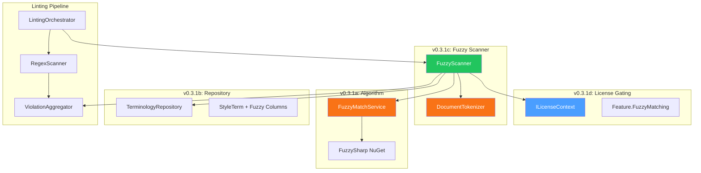
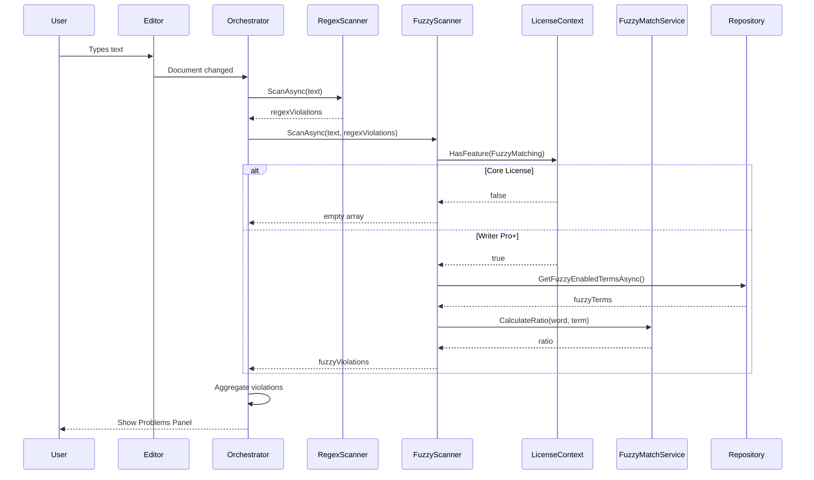

# LCS-DES-031: Design Specification Index — The Fuzzy Engine

## Document Control

| Field | Value |
| :--- | :--- |
| **Document ID** | LCS-DES-031-INDEX |
| **Feature ID** | STY-031 |
| **Feature Name** | The Fuzzy Engine (Advanced Matching) |
| **Target Version** | v0.3.1 |
| **Module Scope** | Lexichord.Modules.Style |
| **Swimlane** | Governance |
| **License Tier** | Writer Pro |
| **Feature Gate Key** | `Feature.FuzzyMatching` |
| **Status** | Draft |
| **Last Updated** | 2026-01-27 |

---

## 1. Executive Summary

**v0.3.1** delivers the **Fuzzy Engine** — advanced string matching capabilities using Levenshtein distance algorithms. This release extends Lexichord's style governance beyond exact regex patterns to detect typos, variations, and near-matches of forbidden terms.

### 1.1 The Problem

Writers frequently misspell or use variations of forbidden terms that the regex linter cannot catch. Examples:

| User Types | Forbidden Term | Current Regex Result | Expected Behavior |
| :--- | :--- | :--- | :--- |
| `white-list` | `whitelist` | Not detected | Should be flagged |
| `Black-List` | `blacklist` | Not detected | Should be flagged |
| `master-branch` | `master` | Not detected | Should be flagged |

### 1.2 The Solution

Implement a secondary `FuzzyScanner` that runs **after** the Regex scanner:

1. **Tokenize** the document into unique words
2. **Compare** each word against fuzzy-enabled terms using Levenshtein distance
3. **Flag** words that match above the configured threshold (default 80%)
4. **Gate** the feature behind the `Writer Pro` license tier

### 1.3 Business Value

| Value | Description |
| :--- | :--- |
| **Typo Detection** | Catches variations and misspellings of forbidden terms |
| **Configurable Sensitivity** | Per-term threshold allows fine-tuning match strictness |
| **No Double-Counting** | Skips words already flagged by regex scanner |
| **Performance** | < 100ms for 1,000 unique words against 50 fuzzy terms |
| **Foundation** | Enables Voice Profiler (v0.3.4) and Resonance Dashboard (v0.3.5) |

---

## 2. Related Documents

### 2.1 Scope Breakdown Document

The detailed scope breakdown for v0.3.1, including all sub-parts, implementation checklists, user stories, and acceptance criteria:

| Document | Description |
| :--- | :--- |
| **[LCS-SBD-031](./LCS-SBD-031.md)** | Scope Breakdown — The Fuzzy Engine |

### 2.2 Sub-Part Design Specifications

Each sub-part has its own detailed design specification:

| Sub-Part | Document | Title | Description |
| :--- | :--- | :--- | :--- |
| v0.3.1a | **[LCS-DES-031a](./LCS-DES-031a.md)** | Algorithm Integration | FuzzySharp integration & IFuzzyMatchService |
| v0.3.1b | **[LCS-DES-031b](./LCS-DES-031b.md)** | Repository Update | Database schema for fuzzy columns |
| v0.3.1c | **[LCS-DES-031c](./LCS-DES-031c.md)** | The Fuzzy Scanner | IDocumentTokenizer & IFuzzyScanner |
| v0.3.1d | **[LCS-DES-031d](./LCS-DES-031d.md)** | License Gating | Feature gate implementation |

---

## 3. Architecture Overview

### 3.1 Component Diagram



### 3.2 Data Flow



---

## 4. Dependencies

### 4.1 Upstream Dependencies (Required)

| Interface | Source Version | Purpose |
| :--- | :--- | :--- |
| `StyleTerm` | v0.2.2a | Entity model for terminology |
| `ITerminologyRepository` | v0.2.2b | Database access for terms |
| `ILintingOrchestrator` | v0.2.3a | Reactive linting coordinator |
| `IStyleScanner` | v0.2.3c | Existing regex scanner interface |
| `StyleViolation` | v0.2.1b | Violation result record |
| `ILicenseContext` | v0.0.4c | Read-only license tier access |
| `LicenseTier` | v0.0.4c | Core/WriterPro/Teams/Enterprise enum |

### 4.2 NuGet Packages

| Package | Version | Purpose |
| :--- | :--- | :--- |
| `FuzzySharp` | 2.x | Levenshtein distance + fuzzy ratio API |

### 4.3 Downstream Consumers (Future)

| Version | Feature | Consumes |
| :--- | :--- | :--- |
| v0.3.2 | Dictionary Manager | `StyleTerm.FuzzyEnabled`, `StyleTerm.FuzzyThreshold` |
| v0.3.4 | Voice Profiler | `IFuzzyMatchService` for pattern detection |
| v0.3.5 | Resonance Dashboard | Fuzzy violation metrics |

---

## 5. License Gating Strategy

The Fuzzy Engine is a **Writer Pro** feature using a **Soft Gate** strategy.

### 5.1 Behavior by License Tier

| Tier | Fuzzy Scanner | Fuzzy UI Controls | Violations Visible |
| :--- | :--- | :--- | :--- |
| Core | Returns empty | Disabled + tooltip | No |
| Writer Pro | Runs fully | Enabled | Yes |
| Teams | Runs fully | Enabled | Yes |
| Enterprise | Runs fully | Enabled | Yes |

### 5.2 Implementation Pattern

```csharp
if (!_licenseContext.HasFeature(Feature.FuzzyMatching))
{
    _logger.LogDebug("Skipping fuzzy scan: license feature not available");
    return Array.Empty<StyleViolation>();
}
```

---

## 6. Fuzzy Matching Algorithm

### 6.1 Levenshtein Distance

The fuzzy matching uses Levenshtein distance normalized to a percentage ratio:

```
Ratio = 100 - (distance / max_length * 100)
```

**Examples:**
- "whitelist" vs "whitelist" = 100% (identical)
- "whitelist" vs "white-list" = ~90% (hyphen variation)
- "whitelist" vs "blacklist" = ~60% (different word)
- "whitelist" vs "waitlist" = ~75% (similar but different)

### 6.2 Threshold Configuration

| Threshold | Strictness | Use Case |
| :--- | :--- | :--- |
| 0.90+ | Very Strict | Only near-exact matches |
| 0.80 | Default | Typical typo detection |
| 0.70 | Loose | Catch more variations (may have false positives) |
| 0.50 | Very Loose | Not recommended |

---

## 7. Key Interfaces Summary

| Interface | Defined In | Purpose |
| :--- | :--- | :--- |
| `IFuzzyMatchService` | v0.3.1a | Calculate Levenshtein ratio between strings |
| `IDocumentTokenizer` | v0.3.1c | Tokenize text into unique words |
| `IFuzzyScanner` | v0.3.1c | Scan documents for fuzzy violations |

| Entity Update | Defined In | Purpose |
| :--- | :--- | :--- |
| `StyleTerm.FuzzyEnabled` | v0.3.1b | Enable/disable fuzzy matching per term |
| `StyleTerm.FuzzyThreshold` | v0.3.1b | Per-term match threshold (0.5-1.0) |

---

## 8. Implementation Checklist Summary

| Sub-Part | Tasks | Est. Hours |
| :--- | :--- | :--- |
| v0.3.1a | Algorithm Integration | 4 |
| v0.3.1b | Repository Update | 3 |
| v0.3.1c | Fuzzy Scanner | 6 |
| v0.3.1d | License Gating | 3 |
| Integration | DI, Events, Tests | 4 |
| **Total** | | **20 hours** |

See [LCS-SBD-031](./LCS-SBD-031.md) Section 3 for the detailed task breakdown.

---

## 9. Success Criteria Summary

| Category | Criterion | Target |
| :--- | :--- | :--- |
| **Matching** | "white-list" detected for "whitelist" at 80% | Pass |
| **Threshold** | "waitlist" NOT matched for "whitelist" at 80% | Pass |
| **No Duplicates** | Same word not flagged by regex AND fuzzy | Pass |
| **Performance** | 1,000 unique words / 50 terms | < 100ms |
| **License Gate** | Core users see no fuzzy violations | Pass |

See [LCS-SBD-031](./LCS-SBD-031.md) Section 11 for full acceptance criteria.

---

## 10. Test Coverage Summary

| Sub-Part | Unit Tests | Integration Tests |
| :--- | :--- | :--- |
| v0.3.1a | CalculateRatio, IsMatch, edge cases | - |
| v0.3.1b | Repository query, migration | Database integration |
| v0.3.1c | Tokenization, fuzzy scanning, double-count prevention | Pipeline integration |
| v0.3.1d | License check, UI state | License context integration |

See individual design specs for detailed test scenarios.

---

## 11. What This Enables

| Version | Feature | Uses From v0.3.1 |
| :--- | :--- | :--- |
| v0.3.2 | Dictionary Manager | `FuzzyEnabled`/`FuzzyThreshold` in Term Editor UI |
| v0.3.3 | Readability Engine | Word tokenization via `IDocumentTokenizer` |
| v0.3.4 | Voice Profiler | `IFuzzyMatchService` for pattern similarity |
| v0.3.5 | Resonance Dashboard | Fuzzy violation analytics |

---

## Document History

| Version | Date | Author | Changes |
| :--- | :--- | :--- | :--- |
| 1.0 | 2026-01-26 | Lead Architect | Initial index creation |
