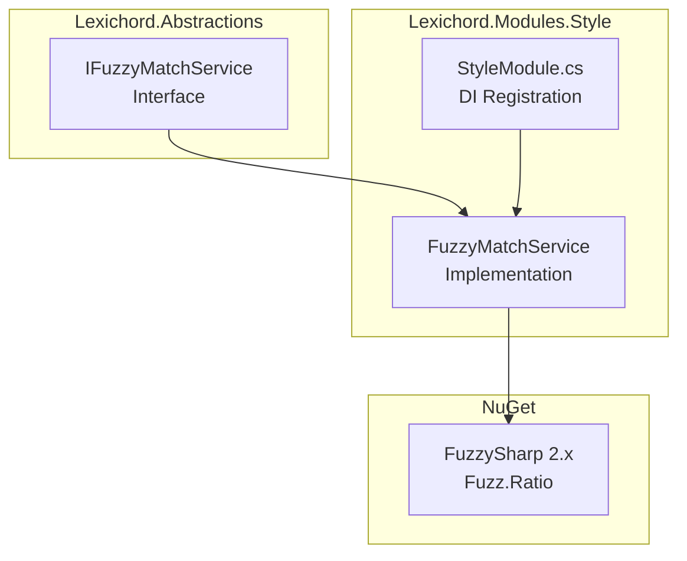

# LCS-DES-031a: Design Specification — Algorithm Integration

## 1. Metadata & Categorization

| Field | Value | Description |
| :--- | :--- | :--- |
| **Feature ID** | `STY-031a` | Sub-part of STY-031 |
| **Feature Name** | `Fuzzy Match Service` | Levenshtein distance wrapper for string comparison |
| **Target Version** | `v0.3.1a` | First sub-part of v0.3.1 |
| **Module Scope** | `Lexichord.Abstractions`, `Lexichord.Modules.Style` | Interface and implementation |
| **Swimlane** | `Governance` | Style & Terminology Enforcement |
| **License Tier** | `Writer Pro` | Part of fuzzy matching premium feature |
| **Feature Gate Key** | N/A | No gate at service level (gate is in FuzzyScanner) |
| **Author** | Lead Architect | |
| **Status** | `Draft` | |
| **Last Updated** | `2026-01-26` | |
| **Parent Document** | [LCS-DES-031-INDEX](./LCS-DES-031-INDEX.md) | |
| **Scope Breakdown** | [LCS-SBD-031 §2.1](./LCS-SBD-031.md#v031a-algorithm-integration) | |

---

## 2. Executive Summary

### 2.1 The Requirement

To implement fuzzy string matching for terminology detection, we need a service that:

1. **Calculates similarity ratio** between two strings (0-100%).
2. **Determines if strings match** above a configurable threshold.
3. **Normalizes input** (lowercase, trim) for consistent comparison.
4. **Provides a clean API** abstracted from the underlying library.

### 2.2 The Proposed Solution

We **SHALL** integrate the **FuzzySharp** NuGet package and wrap it in an `IFuzzyMatchService`:

| Approach | Package        | API                                   | Performance | Decision       |
| :------- | :------------- | :------------------------------------ | :---------- | :------------- |
| Option A | `Fastenshtein` | Pure Levenshtein only                 | Very fast   | ❌ Limited API |
| Option B | `FuzzySharp`   | Ratio, Partial, Token Sort, Token Set | Fast        | ✅ Rich API    |

**Decision:** Use `FuzzySharp 2.x` for its comprehensive API supporting multiple comparison algorithms.

---

## 3. Architecture & Modular Strategy

### 3.1 Component Diagram



### 3.2 File Structure After v0.3.1a

```text
src/Lexichord.Abstractions/
├── Contracts/
│   └── IFuzzyMatchService.cs          # NEW: Interface definition

src/Lexichord.Modules.Style/
├── Lexichord.Modules.Style.csproj     # MODIFIED: Add FuzzySharp package
├── Services/
│   └── FuzzyMatchService.cs           # NEW: Implementation
├── StyleModule.cs                     # MODIFIED: DI registration
```

### 3.3 Dependencies

- **NuGet Package:**

| Package      | Version | Purpose                                    |
| :----------- | :------ | :----------------------------------------- |
| `FuzzySharp` | 2.0.2   | Levenshtein distance + fuzzy ratio methods |

- **No upstream interface dependencies** — this is a leaf service with no dependencies on other Lexichord interfaces.

---

## 4. Decision Tree: Algorithm Selection

```text
START: "Which FuzzySharp method should IFuzzyMatchService use?"
│
├── Need simple overall similarity?
│   └── Use Fuzz.Ratio() — Standard Levenshtein ratio
│
├── Need to ignore word order?
│   └── Use Fuzz.TokenSortRatio() — Sorts words before comparing
│       Example: "white list" == "list white"
│
├── Need to match substrings within longer strings?
│   └── Use Fuzz.PartialRatio() — Best match of shorter in longer
│       Example: "list" in "whitelist"
│
└── Need best of all methods?
    └── Use Process.ExtractOne() — Returns best match from candidates

DECISION for v0.3.1a: Start with Fuzz.Ratio() for simplicity.
Future versions may add additional methods as needed.
```

---

## 5. Data Contracts

### 5.1 IFuzzyMatchService Interface

```csharp
namespace Lexichord.Abstractions.Contracts;

/// <summary>
/// Provides fuzzy string matching capabilities using Levenshtein distance.
/// </summary>
/// <remarks>
/// LOGIC: This service abstracts the FuzzySharp library to provide a
/// clean, testable API for fuzzy string comparison. All inputs are
/// normalized (lowercase, trimmed) before comparison.
///
/// The ratio returned is a percentage (0-100):
/// - 100 = identical strings
/// - 0 = completely different
/// - ~80+ = typically considered a match for typo detection
///
/// Thread-safe: This service is stateless and safe for concurrent use.
/// </remarks>
public interface IFuzzyMatchService
{
    /// <summary>
    /// Calculates the similarity ratio between two strings.
    /// </summary>
    /// <param name="source">The source string to compare.</param>
    /// <param name="target">The target string to compare against.</param>
    /// <returns>
    /// A ratio from 0 to 100 representing the percentage similarity.
    /// 100 means identical, 0 means no similarity.
    /// </returns>
    /// <exception cref="ArgumentNullException">
    /// Thrown if either <paramref name="source"/> or <paramref name="target"/> is null.
    /// </exception>
    /// <remarks>
    /// LOGIC: Uses Levenshtein distance normalized to a percentage.
    /// Formula: 100 - (distance / max_length * 100)
    ///
    /// Examples:
    /// - "whitelist" vs "whitelist" = 100
    /// - "whitelist" vs "white-list" = ~90
    /// - "whitelist" vs "blacklist" = ~60
    /// - "whitelist" vs "xyz" = ~0
    /// </remarks>
    int CalculateRatio(string source, string target);

    /// <summary>
    /// Calculates the partial ratio (best substring match).
    /// </summary>
    /// <param name="source">The source string (typically shorter).</param>
    /// <param name="target">The target string (typically longer).</param>
    /// <returns>Ratio from 0-100 of best partial match.</returns>
    /// <remarks>
    /// LOGIC: Useful when one string is a substring of another.
    /// Example: "list" partial matches "whitelist" at ~100%.
    /// </remarks>
    int CalculatePartialRatio(string source, string target);

    /// <summary>
    /// Determines if two strings match above a given threshold.
    /// </summary>
    /// <param name="source">The source string.</param>
    /// <param name="target">The target string.</param>
    /// <param name="threshold">
    /// Minimum match ratio as a decimal (0.0 to 1.0).
    /// Example: 0.80 means 80% similarity required.
    /// </param>
    /// <returns>True if the calculated ratio >= threshold * 100.</returns>
    /// <exception cref="ArgumentOutOfRangeException">
    /// Thrown if threshold is not between 0.0 and 1.0.
    /// </exception>
    bool IsMatch(string source, string target, double threshold);
}
```

### 5.2 FuzzyMatchService Implementation

```csharp
using FuzzySharp;
using Lexichord.Abstractions.Contracts;

namespace Lexichord.Modules.Style.Services;

/// <summary>
/// Provides fuzzy string matching using the FuzzySharp library.
/// </summary>
/// <remarks>
/// LOGIC: This is a stateless, thread-safe service that wraps FuzzySharp.
///
/// String normalization ensures consistent matching:
/// - ToLowerInvariant() for case-insensitive comparison
/// - Trim() to remove leading/trailing whitespace
///
/// Registered as Singleton in DI because it's stateless and cheap to create.
/// </remarks>
public sealed class FuzzyMatchService : IFuzzyMatchService
{
    /// <inheritdoc/>
    public int CalculateRatio(string source, string target)
    {
        ArgumentNullException.ThrowIfNull(source, nameof(source));
        ArgumentNullException.ThrowIfNull(target, nameof(target));

        // LOGIC: Normalize inputs for consistent comparison
        var normalizedSource = Normalize(source);
        var normalizedTarget = Normalize(target);

        // LOGIC: Handle empty strings
        if (string.IsNullOrEmpty(normalizedSource) &&
            string.IsNullOrEmpty(normalizedTarget))
        {
            return 100; // Both empty = identical
        }

        if (string.IsNullOrEmpty(normalizedSource) ||
            string.IsNullOrEmpty(normalizedTarget))
        {
            return 0; // One empty, one not = no match
        }

        // LOGIC: FuzzySharp.Fuzz.Ratio returns 0-100
        return Fuzz.Ratio(normalizedSource, normalizedTarget);
    }

    /// <inheritdoc/>
    public int CalculatePartialRatio(string source, string target)
    {
        ArgumentNullException.ThrowIfNull(source, nameof(source));
        ArgumentNullException.ThrowIfNull(target, nameof(target));

        var normalizedSource = Normalize(source);
        var normalizedTarget = Normalize(target);

        if (string.IsNullOrEmpty(normalizedSource) ||
            string.IsNullOrEmpty(normalizedTarget))
        {
            return 0;
        }

        // LOGIC: Partial ratio finds best substring match
        return Fuzz.PartialRatio(normalizedSource, normalizedTarget);
    }

    /// <inheritdoc/>
    public bool IsMatch(string source, string target, double threshold)
    {
        if (threshold < 0.0 || threshold > 1.0)
        {
            throw new ArgumentOutOfRangeException(
                nameof(threshold),
                threshold,
                "Threshold must be between 0.0 and 1.0");
        }

        // LOGIC: Convert decimal threshold to integer percentage
        var requiredRatio = (int)(threshold * 100);
        var actualRatio = CalculateRatio(source, target);

        return actualRatio >= requiredRatio;
    }

    /// <summary>
    /// Normalizes a string for consistent fuzzy comparison.
    /// </summary>
    /// <param name="input">The string to normalize.</param>
    /// <returns>Lowercase, trimmed string.</returns>
    private static string Normalize(string input)
    {
        // LOGIC: ToLowerInvariant for culture-independent lowercase
        return input.Trim().ToLowerInvariant();
    }
}
```

### 5.3 DI Registration in StyleModule.cs

```csharp
using Lexichord.Abstractions.Contracts;
using Lexichord.Modules.Style.Services;
using Microsoft.Extensions.DependencyInjection;

namespace Lexichord.Modules.Style;

public sealed class StyleModule : IModule
{
    public ModuleInfo Info => new(
        Id: "lexichord.modules.style",
        Name: "Style Governance",
        Version: new Version(0, 3, 1)
    );

    public void ConfigureServices(IServiceCollection services)
    {
        // LOGIC: Singleton because FuzzyMatchService is stateless
        // and thread-safe. No need to create new instances per request.
        services.AddSingleton<IFuzzyMatchService, FuzzyMatchService>();

        // ... other service registrations
    }
}
```

---

## 6. CLI Execution Plan

```bash
# ═══════════════════════════════════════════════════════════════════════════
# v0.3.1a: Algorithm Integration - CLI Setup
# ═══════════════════════════════════════════════════════════════════════════

# 1. Add FuzzySharp package to Modules.Style project
cd /Volumes/GitHub/lexichord
dotnet add src/Lexichord.Modules.Style/Lexichord.Modules.Style.csproj \
    package FuzzySharp --version 2.0.2

# 2. Verify package was added
dotnet list src/Lexichord.Modules.Style package | grep FuzzySharp

# 3. Build to verify no conflicts
dotnet build src/Lexichord.Modules.Style
```

---

## 7. Use Cases & User Stories

### 7.1 User Stories

| ID    | Role      | Story                                                        | Acceptance Criteria                            |
| :---- | :-------- | :----------------------------------------------------------- | :--------------------------------------------- |
| US-01 | Developer | As a developer, I want a clean interface for fuzzy matching. | `IFuzzyMatchService` is mockable and testable. |
| US-02 | Developer | As a developer, I want normalized input handling.            | Case and whitespace don't affect results.      |
| US-03 | Developer | As a developer, I want threshold-based matching.             | `IsMatch(s, t, 0.8)` returns true/false.       |

### 7.2 Use Cases

#### UC-01: Calculate Similarity Ratio

**Preconditions:**

- `IFuzzyMatchService` is injected via DI.

**Flow:**

1. Consumer calls `CalculateRatio("whitelist", "white-list")`.
2. Service normalizes both strings to lowercase.
3. Service calls `Fuzz.Ratio()` internally.
4. Service returns integer ratio (e.g., 90).

**Postconditions:**

- Caller receives integer 0-100 representing similarity.

---

#### UC-02: Threshold Match Check

**Preconditions:**

- `IFuzzyMatchService` is injected via DI.
- Threshold is 0.80 (80%).

**Flow:**

1. Consumer calls `IsMatch("whitelist", "white-list", 0.80)`.
2. Service calls `CalculateRatio()` internally → returns 90.
3. Service compares: 90 >= 80.
4. Service returns `true`.

**Postconditions:**

- Caller receives boolean indicating match status.

---

## 8. Unit Testing Requirements

### 8.1 FuzzyMatchServiceTests

```csharp
using FluentAssertions;
using Lexichord.Modules.Style.Services;
using Xunit;

namespace Lexichord.Modules.Style.Tests.Services;

[Trait("Category", "Unit")]
[Trait("Feature", "FuzzyMatching")]
public class FuzzyMatchServiceTests
{
    private readonly FuzzyMatchService _sut = new();

    #region CalculateRatio Tests

    [Fact]
    public void CalculateRatio_IdenticalStrings_Returns100()
    {
        // Arrange & Act
        var result = _sut.CalculateRatio("whitelist", "whitelist");

        // Assert
        result.Should().Be(100);
    }

    [Fact]
    public void CalculateRatio_IdenticalStrings_CaseInsensitive_Returns100()
    {
        // Arrange & Act
        var result = _sut.CalculateRatio("WhiteList", "whitelist");

        // Assert
        result.Should().Be(100);
    }

    [Theory]
    [InlineData("whitelist", "white-list", 85)]   // Hyphenated variation
    [InlineData("whitelist", "white list", 85)]   // Space variation
    [InlineData("blacklist", "block-list", 70)]   // Different word
    public void CalculateRatio_Variations_ReturnsExpectedMinimum(
        string source, string target, int expectedMinRatio)
    {
        // Act
        var result = _sut.CalculateRatio(source, target);

        // Assert
        result.Should().BeGreaterThanOrEqualTo(expectedMinRatio);
    }

    [Theory]
    [InlineData("whitelist", "completely different", 30)]
    [InlineData("whitelist", "xyz", 15)]
    public void CalculateRatio_DifferentStrings_ReturnsLowRatio(
        string source, string target, int expectedMaxRatio)
    {
        // Act
        var result = _sut.CalculateRatio(source, target);

        // Assert
        result.Should().BeLessThanOrEqualTo(expectedMaxRatio);
    }

    [Fact]
    public void CalculateRatio_EmptyStrings_Returns100()
    {
        // Both empty = identical
        var result = _sut.CalculateRatio("", "");
        result.Should().Be(100);
    }

    [Theory]
    [InlineData("", "nonempty")]
    [InlineData("nonempty", "")]
    public void CalculateRatio_OneEmpty_Returns0(string source, string target)
    {
        var result = _sut.CalculateRatio(source, target);
        result.Should().Be(0);
    }

    [Fact]
    public void CalculateRatio_NullSource_ThrowsArgumentNullException()
    {
        var act = () => _sut.CalculateRatio(null!, "target");
        act.Should().Throw<ArgumentNullException>()
            .WithParameterName("source");
    }

    [Fact]
    public void CalculateRatio_NullTarget_ThrowsArgumentNullException()
    {
        var act = () => _sut.CalculateRatio("source", null!);
        act.Should().Throw<ArgumentNullException>()
            .WithParameterName("target");
    }

    [Fact]
    public void CalculateRatio_WhitespaceIsTrimmed()
    {
        // Arrange
        var result = _sut.CalculateRatio("  whitelist  ", "whitelist");

        // Assert
        result.Should().Be(100);
    }

    #endregion

    #region CalculatePartialRatio Tests

    [Fact]
    public void CalculatePartialRatio_SubstringMatch_ReturnsHighRatio()
    {
        // "list" is fully contained in "whitelist"
        var result = _sut.CalculatePartialRatio("list", "whitelist");
        result.Should().BeGreaterThanOrEqualTo(80);
    }

    #endregion

    #region IsMatch Tests

    [Fact]
    public void IsMatch_AboveThreshold_ReturnsTrue()
    {
        // "white-list" is ~90% similar to "whitelist"
        var result = _sut.IsMatch("whitelist", "white-list", 0.80);
        result.Should().BeTrue();
    }

    [Fact]
    public void IsMatch_BelowThreshold_ReturnsFalse()
    {
        // "waitlist" is ~75% similar to "whitelist"
        var result = _sut.IsMatch("whitelist", "waitlist", 0.80);
        result.Should().BeFalse();
    }

    [Fact]
    public void IsMatch_ExactThreshold_ReturnsTrue()
    {
        // Identical = 100%, threshold 1.0 = 100%
        var result = _sut.IsMatch("exact", "exact", 1.0);
        result.Should().BeTrue();
    }

    [Theory]
    [InlineData(-0.1)]
    [InlineData(1.1)]
    [InlineData(-1.0)]
    [InlineData(2.0)]
    public void IsMatch_InvalidThreshold_ThrowsArgumentOutOfRangeException(
        double invalidThreshold)
    {
        var act = () => _sut.IsMatch("a", "b", invalidThreshold);
        act.Should().Throw<ArgumentOutOfRangeException>()
            .WithParameterName("threshold");
    }

    #endregion
}
```

### 8.2 Test Execution Command

```bash
# Run FuzzyMatchService unit tests
dotnet test --filter "Category=Unit&Feature=FuzzyMatching" \
    --logger "console;verbosity=detailed"

# Run with coverage
dotnet test --filter "Feature=FuzzyMatching" \
    --collect:"XPlat Code Coverage"
```

---

## 9. Observability & Logging

### 9.1 Log Events

| Level | Source            | Message Template                              |
| :---- | :---------------- | :-------------------------------------------- |
| Trace | FuzzyMatchService | `Calculating ratio: '{Source}' vs '{Target}'` |
| Trace | FuzzyMatchService | `Ratio result: {Ratio}%`                      |
| Debug | StyleModule       | `Registered IFuzzyMatchService as singleton`  |

> **Note:** Minimal logging at service level. The `FuzzyScanner` (v0.3.1c) will log more detailed operation metrics.

---

## 10. Security & Safety

### 10.1 Risk Assessment

| Risk                  | Level | Mitigation                                            |
| :-------------------- | :---- | :---------------------------------------------------- |
| **Input Injection**   | None  | Service only compares strings, no execution.          |
| **Memory Exhaustion** | Low   | FuzzySharp handles large strings gracefully.          |
| **Thread Safety**     | None  | Service is stateless, all methods are pure functions. |

### 10.2 Input Validation

- **Null checks:** Both parameters validated with `ArgumentNullException.ThrowIfNull()`.
- **Threshold range:** `IsMatch()` validates threshold is 0.0 to 1.0.
- **Normalization:** All inputs trimmed and lowercased before comparison.

---

## 11. Risks & Mitigations

| Risk                                       | Impact | Mitigation                                             |
| :----------------------------------------- | :----- | :----------------------------------------------------- |
| FuzzySharp has bugs or security issues     | Low    | Package is mature (1M+ downloads), actively maintained |
| Future FuzzySharp version breaks API       | Medium | Pin to specific version (2.0.2) in .csproj             |
| Performance degrades for very long strings | Low    | Typical terminology terms are < 100 chars              |

---

## 12. Acceptance Criteria (QA)

| #   | Category            | Criterion                                                          |
| :-- | :------------------ | :----------------------------------------------------------------- |
| 1   | **[Package]**       | `FuzzySharp 2.0.2` is listed in `Modules.Style.csproj`.            |
| 2   | **[Interface]**     | `IFuzzyMatchService` exists in `Lexichord.Abstractions.Contracts`. |
| 3   | **[Methods]**       | `CalculateRatio()` returns 0-100 integer.                          |
| 4   | **[Methods]**       | `CalculatePartialRatio()` returns 0-100 integer.                   |
| 5   | **[Methods]**       | `IsMatch()` returns boolean based on threshold.                    |
| 6   | **[Normalization]** | Case differences don't affect ratio (FOO == foo).                  |
| 7   | **[Normalization]** | Whitespace is trimmed before comparison.                           |
| 8   | **[Validation]**    | Null inputs throw `ArgumentNullException`.                         |
| 9   | **[Validation]**    | Invalid threshold throws `ArgumentOutOfRangeException`.            |
| 10  | **[DI]**            | `FuzzyMatchService` registered as singleton in `StyleModule`.      |
| 11  | **[Build]**         | Solution builds with no warnings.                                  |

---

## 13. Verification Commands

```bash
# ═══════════════════════════════════════════════════════════════════════════
# v0.3.1a Verification
# ═══════════════════════════════════════════════════════════════════════════

# 1. Verify package is installed
dotnet list src/Lexichord.Modules.Style package | grep FuzzySharp
# Expected: FuzzySharp   2.0.2

# 2. Verify interface exists
test -f src/Lexichord.Abstractions/Contracts/IFuzzyMatchService.cs && echo "✓ Interface exists"

# 3. Verify implementation exists
test -f src/Lexichord.Modules.Style/Services/FuzzyMatchService.cs && echo "✓ Implementation exists"

# 4. Build solution
dotnet build --configuration Release
# Expected: No errors or warnings

# 5. Run unit tests
dotnet test --filter "Feature=FuzzyMatching" --verbosity normal
# Expected: All tests pass

# 6. Verify DI registration (search for registration line)
grep -n "IFuzzyMatchService" src/Lexichord.Modules.Style/StyleModule.cs
# Expected: services.AddSingleton<IFuzzyMatchService, FuzzyMatchService>()
```

---

## 14. Deliverable Checklist

| Step | Description                                                 | Status |
| :--- | :---------------------------------------------------------- | :----- |
| 1    | `FuzzySharp 2.0.2` added to `Modules.Style.csproj`.         | [ ]    |
| 2    | `IFuzzyMatchService.cs` created in Abstractions.            | [ ]    |
| 3    | `CalculateRatio()` method defined with XML docs.            | [ ]    |
| 4    | `CalculatePartialRatio()` method defined with XML docs.     | [ ]    |
| 5    | `IsMatch()` method defined with XML docs.                   | [ ]    |
| 6    | `FuzzyMatchService.cs` created in Modules.Style/Services.   | [ ]    |
| 7    | Input normalization (lowercase, trim) implemented.          | [ ]    |
| 8    | Null validation with `ArgumentNullException.ThrowIfNull()`. | [ ]    |
| 9    | Threshold validation (0.0-1.0 range) implemented.           | [ ]    |
| 10   | `StyleModule.cs` updated with singleton registration.       | [ ]    |
| 11   | Unit tests for `CalculateRatio()` (10+ test cases).         | [ ]    |
| 12   | Unit tests for `IsMatch()` (5+ test cases).                 | [ ]    |
| 13   | Solution builds with no warnings.                           | [ ]    |
| 14   | All unit tests pass.                                        | [ ]    |
