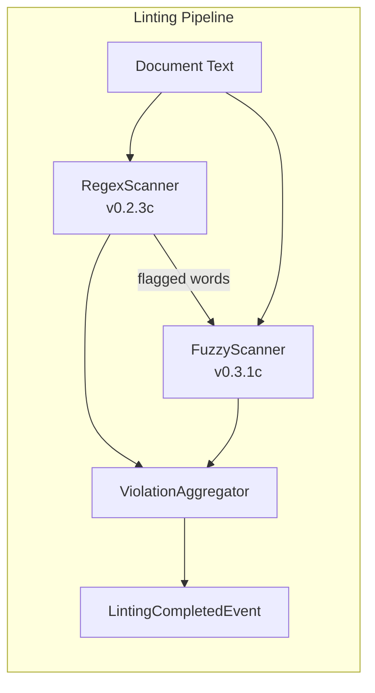
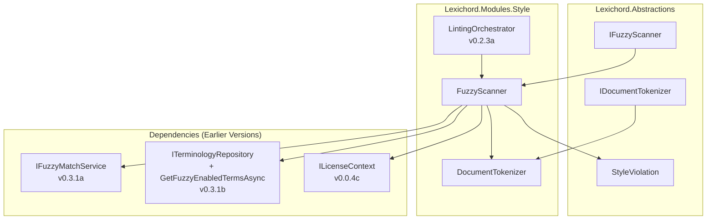

# LCS-DES-031c: Design Specification — The Fuzzy Scanner

## 1. Metadata & Categorization

| Field                | Value                                                        | Description                                         |
| :------------------- | :----------------------------------------------------------- | :-------------------------------------------------- |
| **Feature ID**       | `STY-031c`                                                   | Sub-part of STY-031                                 |
| **Feature Name**     | `Fuzzy Scanner`                                              | Secondary scan loop for approximate string matching |
| **Target Version**   | `v0.3.1c`                                                    | Third sub-part of v0.3.1                            |
| **Module Scope**     | `Lexichord.Abstractions`, `Lexichord.Modules.Style`          | Interface and implementation                        |
| **Swimlane**         | `Governance`                                                 | Style & Terminology Enforcement                     |
| **License Tier**     | `Writer Pro`                                                 | Premium feature (Core users see regex only)         |
| **Feature Gate Key** | `Feature.FuzzyMatching`                                      | Key used in `ILicenseContext.HasFeature()`          |
| **Author**           | Lead Architect                                               |                                                     |
| **Status**           | `Draft`                                                      |                                                     |
| **Last Updated**     | `2026-01-26`                                                 |                                                     |
| **Parent Document**  | [LCS-DES-031-INDEX](./LCS-DES-031-INDEX.md)                  |                                                     |
| **Scope Breakdown**  | [LCS-SBD-031 §2.3](./LCS-SBD-031.md#v031c-the-fuzzy-scanner) |                                                     |

---

## 2. Executive Summary

### 2.1 The Requirement

The Regex scanner (v0.2.3c) detects **exact pattern matches** only. Writers frequently misspell or use variations of forbidden terms:

| User Types      | Forbidden Term | Regex Result    | Desired Behavior             |
| :-------------- | :------------- | :-------------- | :--------------------------- |
| `white-list`    | `whitelist`    | ❌ Not detected | ✅ Fuzzy match (90%)         |
| `Black-List`    | `blacklist`    | ❌ Not detected | ✅ Fuzzy match (90%)         |
| `master-branch` | `master`       | ❌ Not detected | ✅ Fuzzy match (85%)         |
| `whitelist`     | `whitelist`    | ✅ Regex match  | Skip fuzzy (avoid duplicate) |

**Critical Requirements:**

1. **Performance Gate:** Only run fuzzy matching on words NOT already flagged by regex.
2. **Optimization:** Tokenize document into `HashSet<string>` of unique words first.
3. **License Gate:** Wrapped in Writer Pro license check.
4. **Double-Count Prevention:** Skip words already caught by regex scanner.

### 2.2 The Proposed Solution

Implement an `IFuzzyScanner` that runs **after** the regex scanner:



The scanner:

1. Checks license gate (return empty if Core tier).
2. Tokenizes document into unique words with positions.
3. Loads fuzzy-enabled terms from repository (v0.3.1b).
4. Compares each non-flagged word against terms using `IFuzzyMatchService` (v0.3.1a).
5. Creates `StyleViolation` records for matches above threshold.

---

## 3. Architecture & Modular Strategy

### 3.1 Component Diagram



### 3.2 File Structure After v0.3.1c

```text
src/Lexichord.Abstractions/
├── Contracts/
│   ├── IDocumentTokenizer.cs          # NEW: Tokenization interface
│   └── IFuzzyScanner.cs               # NEW: Scanner interface

src/Lexichord.Modules.Style/
├── Services/
│   ├── DocumentTokenizer.cs           # NEW: Tokenization implementation
│   └── FuzzyScanner.cs                # NEW: Scanner implementation
├── StyleModule.cs                     # MODIFIED: DI registration
```

### 3.3 Dependencies

**Upstream Interfaces:**

| Interface                | Source Version | Purpose                                      |
| :----------------------- | :------------- | :------------------------------------------- |
| `IFuzzyMatchService`     | v0.3.1a        | String distance calculation                  |
| `ITerminologyRepository` | v0.3.1b        | `GetFuzzyEnabledTermsAsync()` method         |
| `StyleTerm`              | v0.3.1b        | Entity with `FuzzyEnabled`, `FuzzyThreshold` |
| `StyleViolation`         | v0.2.1b        | Violation result record                      |
| `ILintingOrchestrator`   | v0.2.3a        | Reactive linting coordinator                 |
| `ILicenseContext`        | v0.0.4c        | Read-only license tier access                |
| `LicenseTier`            | v0.0.4c        | Core/WriterPro/Teams/Enterprise enum         |

### 3.4 Licensing Behavior

- **Load Behavior:**
    - [ ] **Hard Gate:** Module DLL not loaded.
    - [x] **Soft Gate:** Module loads, but `FuzzyScanner.ScanAsync()` returns empty results for Core users.
    - [ ] **UI Gate:** UI elements hidden/disabled.

- **Fallback Experience:**
    > Core users see only regex violations. Fuzzy matching is silently skipped with a Debug log message.

---

## 4. Decision Trees

### 4.1 Should Fuzzy Scan Run?

```text
START: "Should fuzzy scanning run on this document?"
│
├── Is user license >= WriterPro?
│   ├── NO → Log Debug, return empty results (feature gated)
│   └── YES → Continue
│
├── Is global "Enable Fuzzy Matching" toggle ON? (v0.3.1d)
│   ├── NO → Return empty results
│   └── YES → Continue
│
├── Are there any fuzzy-enabled terms in the lexicon?
│   ├── NO → Log Debug, return empty results (nothing to match)
│   └── YES → Proceed with scan
│
└── Run fuzzy scanner...
```

### 4.2 Per-Word Matching Decision

```text
START: "Should this word be fuzzy-matched?"
│
├── Is word already flagged by regex scanner?
│   └── YES → SKIP (avoid double-count)
│
├── For each fuzzy-enabled term:
│   └── Calculate Fuzz.Ratio(word, term.Pattern)
│       ├── Ratio >= term.FuzzyThreshold * 100?
│       │   ├── YES → Create StyleViolation, break (one match per word)
│       │   └── NO → Continue to next term
│
└── No matches → Word is clean
```

### 4.3 Tokenization Strategy

```text
START: "How should document be tokenized?"
│
├── Need individual word positions for squiggly underlines?
│   └── YES → Return Dictionary<word, List<position>>
│
├── Need hyphenated words preserved?
│   └── YES → Regex pattern: \b[\w-]+\b
│
├── Need case-insensitive comparison?
│   └── YES → Normalize to lowercase in tokenizer
│
└── Need unique words only for performance?
    └── YES → Use HashSet internally, expose as IReadOnlySet
```

---

## 5. Data Contracts

### 5.1 IDocumentTokenizer Interface

```csharp
namespace Lexichord.Abstractions.Contracts;

/// <summary>
/// Tokenizes document text into individual words for analysis.
/// </summary>
/// <remarks>
/// LOGIC: The tokenizer is optimized for fuzzy scanning:
/// - Returns unique words only (HashSet) to avoid re-processing duplicates.
/// - Normalizes to lowercase for case-insensitive matching.
/// - Uses word boundaries to extract tokens.
/// - Preserves hyphenated words (e.g., "white-list" captured as-is).
///
/// Thread-safe: This service is stateless and safe for concurrent use.
/// </remarks>
public interface IDocumentTokenizer
{
    /// <summary>
    /// Extracts unique words from document text.
    /// </summary>
    /// <param name="text">The document text to tokenize.</param>
    /// <returns>A set of unique, lowercase words.</returns>
    /// <exception cref="ArgumentNullException">
    /// Thrown if <paramref name="text"/> is null.
    /// </exception>
    /// <remarks>
    /// LOGIC: Uses regex \b[\w-]+\b to match word boundaries including hyphens.
    /// This captures "white-list" as a single token, enabling fuzzy matching
    /// against "whitelist".
    ///
    /// Examples:
    /// - "The white-list contains items." → {"the", "white-list", "contains", "items"}
    /// - "UPPERCASE lowercase" → {"uppercase", "lowercase"}
    /// </remarks>
    IReadOnlySet<string> Tokenize(string text);

    /// <summary>
    /// Extracts unique words with their character positions in the document.
    /// </summary>
    /// <param name="text">The document text to tokenize.</param>
    /// <returns>Dictionary mapping words to their character positions.</returns>
    /// <exception cref="ArgumentNullException">
    /// Thrown if <paramref name="text"/> is null.
    /// </exception>
    /// <remarks>
    /// LOGIC: Each word maps to a list of starting character positions where
    /// it appears in the document. This enables the violation renderer to
    /// place squiggly underlines at the correct locations.
    ///
    /// The positions are 0-indexed character offsets from the start of text.
    ///
    /// Example: "The cat and the dog"
    /// - "the" → [0, 12] (appears twice)
    /// - "cat" → [4]
    /// - "and" → [8]
    /// - "dog" → [16]
    /// </remarks>
    IReadOnlyDictionary<string, IReadOnlyList<int>> TokenizeWithPositions(string text);
}
```

### 5.2 IFuzzyScanner Interface

```csharp
namespace Lexichord.Abstractions.Contracts;

/// <summary>
/// Scans documents for fuzzy matches against the terminology lexicon.
/// </summary>
/// <remarks>
/// LOGIC: The fuzzy scanner runs AFTER the regex scanner and detects
/// variations/typos of forbidden terms. It respects license gating
/// and avoids double-counting words already flagged by regex.
///
/// The scanner is invoked by <see cref="ILintingOrchestrator"/> as part
/// of the linting pipeline. Results are aggregated with regex violations
/// before publishing <see cref="LintingCompletedEvent"/>.
///
/// Performance target: < 100ms for 1,000 unique words against 50 terms.
/// </remarks>
public interface IFuzzyScanner
{
    /// <summary>
    /// Scans document text for fuzzy terminology violations.
    /// </summary>
    /// <param name="documentText">The full document text to scan.</param>
    /// <param name="regexFlaggedWords">
    /// Words already flagged by the regex scanner (to skip).
    /// Normalized to lowercase for comparison.
    /// </param>
    /// <param name="cancellationToken">Cancellation token.</param>
    /// <returns>List of fuzzy-detected violations.</returns>
    /// <exception cref="ArgumentNullException">
    /// Thrown if documentText or regexFlaggedWords is null.
    /// </exception>
    /// <remarks>
    /// LOGIC: Returns empty list if:
    /// - User license < WriterPro (feature gated)
    /// - Global fuzzy matching is disabled in settings
    /// - No fuzzy-enabled terms exist in lexicon
    ///
    /// Each violation includes:
    /// - TermId: The matched term's identifier
    /// - MatchedText: The word that matched (e.g., "white-list")
    /// - Position: Character offset in document
    /// - IsFuzzyMatch: true (distinguishes from regex matches)
    /// - FuzzyRatio: The match percentage (e.g., 90)
    /// </remarks>
    Task<IReadOnlyList<StyleViolation>> ScanAsync(
        string documentText,
        IReadOnlySet<string> regexFlaggedWords,
        CancellationToken cancellationToken = default);
}
```

### 5.3 StyleViolation Extension (v0.3.1c Additions)

```csharp
/// <summary>
/// v0.3.1c additions to StyleViolation for fuzzy match tracking.
/// </summary>
/// <remarks>
/// LOGIC: These properties allow the UI to distinguish fuzzy matches
/// from regex matches and display the match quality percentage.
/// </remarks>
public record StyleViolation
{
    // ... existing properties from v0.2.1b ...

    /// <summary>
    /// Whether this violation was detected by fuzzy matching.
    /// </summary>
    /// <remarks>
    /// LOGIC: True for violations from FuzzyScanner, false for RegexScanner.
    /// The Problems Panel can use this to show a different icon or label.
    /// </remarks>
    public bool IsFuzzyMatch { get; init; } = false;

    /// <summary>
    /// The fuzzy match ratio (0-100) if this is a fuzzy match.
    /// </summary>
    /// <remarks>
    /// LOGIC: Only populated when IsFuzzyMatch is true.
    /// Displayed in Problems Panel as "(90% match)" to show confidence.
    /// </remarks>
    public int? FuzzyRatio { get; init; }
}
```

---

## 6. Implementation Logic

### 6.1 DocumentTokenizer Implementation

```csharp
using System.Text.RegularExpressions;
using Lexichord.Abstractions.Contracts;

namespace Lexichord.Modules.Style.Services;

/// <summary>
/// Tokenizes document text into unique words for fuzzy scanning.
/// </summary>
/// <remarks>
/// LOGIC: Uses compiled regex for performance. The pattern \b[\w-]+\b
/// captures word characters and hyphens to preserve hyphenated words
/// like "white-list" as single tokens.
///
/// Registered as Singleton in DI because it's stateless.
/// </remarks>
public sealed partial class DocumentTokenizer : IDocumentTokenizer
{
    // LOGIC: Matches word characters including hyphens within words
    // This preserves "white-list" as a single token for fuzzy matching
    [GeneratedRegex(@"\b[\w-]+\b", RegexOptions.Compiled)]
    private static partial Regex WordPattern();

    /// <inheritdoc/>
    public IReadOnlySet<string> Tokenize(string text)
    {
        ArgumentNullException.ThrowIfNull(text, nameof(text));

        // LOGIC: Use HashSet for O(1) lookup and automatic deduplication
        var words = new HashSet<string>(StringComparer.OrdinalIgnoreCase);
        var matches = WordPattern().Matches(text);

        foreach (Match match in matches)
        {
            // LOGIC: Normalize to lowercase for consistent comparison
            words.Add(match.Value.ToLowerInvariant());
        }

        return words;
    }

    /// <inheritdoc/>
    public IReadOnlyDictionary<string, IReadOnlyList<int>> TokenizeWithPositions(string text)
    {
        ArgumentNullException.ThrowIfNull(text, nameof(text));

        // LOGIC: Dictionary with case-insensitive keys for word lookup
        var positions = new Dictionary<string, List<int>>(StringComparer.OrdinalIgnoreCase);
        var matches = WordPattern().Matches(text);

        foreach (Match match in matches)
        {
            var word = match.Value.ToLowerInvariant();

            if (!positions.TryGetValue(word, out var list))
            {
                list = new List<int>();
                positions[word] = list;
            }

            // LOGIC: Store 0-indexed character position for each occurrence
            list.Add(match.Index);
        }

        // LOGIC: Convert to read-only for immutability
        return positions.ToDictionary(
            kvp => kvp.Key,
            kvp => (IReadOnlyList<int>)kvp.Value.AsReadOnly(),
            StringComparer.OrdinalIgnoreCase);
    }
}
```

### 6.2 FuzzyScanner Implementation

```csharp
using System.Diagnostics;
using Lexichord.Abstractions.Contracts;
using Lexichord.Abstractions.Entities;
using Microsoft.Extensions.Logging;

namespace Lexichord.Modules.Style.Services;

/// <summary>
/// Scans documents for fuzzy matches against terminology rules.
/// </summary>
/// <remarks>
/// LOGIC: The scanner performs these steps:
/// 1. Check license (return empty if Core tier)
/// 2. Load fuzzy-enabled terms from repository (cached)
/// 3. Tokenize document into unique words with positions
/// 4. For each word NOT in regexFlaggedWords:
///    - Compare against each fuzzy term
///    - Create violation if ratio >= threshold
/// 5. Log performance metrics
///
/// Performance optimization: Uses HashSet for O(1) lookup of flagged words.
/// </remarks>
public sealed class FuzzyScanner(
    ILicenseContext licenseContext,
    ITerminologyRepository repository,
    IDocumentTokenizer tokenizer,
    IFuzzyMatchService fuzzyMatcher,
    ILogger<FuzzyScanner> logger) : IFuzzyScanner
{
    private const int PerformanceThresholdMs = 100;
    private const string FeatureKey = "Feature.FuzzyMatching";

    /// <inheritdoc/>
    public async Task<IReadOnlyList<StyleViolation>> ScanAsync(
        string documentText,
        IReadOnlySet<string> regexFlaggedWords,
        CancellationToken cancellationToken = default)
    {
        ArgumentNullException.ThrowIfNull(documentText, nameof(documentText));
        ArgumentNullException.ThrowIfNull(regexFlaggedWords, nameof(regexFlaggedWords));

        // ═══════════════════════════════════════════════════════════════════
        // License Gate Check
        // ═══════════════════════════════════════════════════════════════════
        if (!licenseContext.HasFeature(FeatureKey))
        {
            logger.LogDebug("Skipping fuzzy scan: license feature not available");
            return Array.Empty<StyleViolation>();
        }

        var stopwatch = Stopwatch.StartNew();

        // ═══════════════════════════════════════════════════════════════════
        // Load Fuzzy-Enabled Terms
        // ═══════════════════════════════════════════════════════════════════
        var fuzzyTerms = await repository.GetFuzzyEnabledTermsAsync(cancellationToken);

        if (fuzzyTerms.Count == 0)
        {
            logger.LogDebug("Skipping fuzzy scan: no fuzzy-enabled terms in lexicon");
            return Array.Empty<StyleViolation>();
        }

        logger.LogDebug("Loaded {TermCount} fuzzy-enabled terms", fuzzyTerms.Count);

        // ═══════════════════════════════════════════════════════════════════
        // Tokenize Document
        // ═══════════════════════════════════════════════════════════════════
        var wordPositions = tokenizer.TokenizeWithPositions(documentText);

        logger.LogDebug(
            "Fuzzy scan starting: {UniqueWordCount} unique words",
            wordPositions.Count);

        // ═══════════════════════════════════════════════════════════════════
        // Scan Each Unique Word
        // ═══════════════════════════════════════════════════════════════════
        var violations = new List<StyleViolation>();

        foreach (var (word, positions) in wordPositions)
        {
            // LOGIC: Skip words already caught by regex scanner (double-count prevention)
            if (regexFlaggedWords.Contains(word))
            {
                logger.LogTrace("Skipping word '{Word}': already flagged by regex", word);
                continue;
            }

            cancellationToken.ThrowIfCancellationRequested();

            foreach (var term in fuzzyTerms)
            {
                // LOGIC: Regex terms are handled by RegexScanner, not fuzzy
                if (term.IsRegex)
                    continue;

                var ratio = fuzzyMatcher.CalculateRatio(word, term.Pattern);

                logger.LogTrace(
                    "Checking word '{Word}' against term '{Term}': ratio={Ratio}",
                    word, term.Pattern, ratio);

                // LOGIC: Check against per-term threshold (stored as 0.0-1.0)
                var requiredRatio = (int)(term.FuzzyThreshold * 100);

                if (ratio >= requiredRatio)
                {
                    // LOGIC: Create violation for EACH position of this word
                    foreach (var position in positions)
                    {
                        violations.Add(new StyleViolation
                        {
                            Id = Guid.NewGuid(),
                            TermId = term.Id,
                            MatchedText = word,
                            Position = position,
                            Length = word.Length,
                            Message = $"Consider using '{term.Recommendation}' instead of '{word}'",
                            Severity = term.Severity,
                            Category = term.Category,
                            IsFuzzyMatch = true,
                            FuzzyRatio = ratio
                        });
                    }

                    // LOGIC: One match per word is enough; break to next word
                    break;
                }
            }
        }

        // ═══════════════════════════════════════════════════════════════════
        // Performance Metrics
        // ═══════════════════════════════════════════════════════════════════
        stopwatch.Stop();
        var elapsed = stopwatch.ElapsedMilliseconds;

        if (elapsed > PerformanceThresholdMs)
        {
            logger.LogWarning(
                "Fuzzy scan exceeded performance threshold: {ElapsedMs}ms (threshold: {ThresholdMs}ms)",
                elapsed, PerformanceThresholdMs);
        }

        logger.LogInformation(
            "Fuzzy scan completed: {ViolationCount} violations in {ElapsedMs}ms",
            violations.Count, elapsed);

        return violations;
    }
}
```

### 6.3 Orchestrator Integration

```csharp
// In LintingOrchestrator.cs, modify the linting pipeline:

/// <summary>
/// Performs document linting (regex + fuzzy scanning).
/// </summary>
/// <remarks>
/// LOGIC: v0.3.1c adds fuzzy scanning after regex scanning.
/// The regex results are passed to the fuzzy scanner to avoid double-counting.
/// </remarks>
private async Task<IReadOnlyList<StyleViolation>> PerformLintingAsync(
    string documentText,
    CancellationToken cancellationToken)
{
    // ═══════════════════════════════════════════════════════════════════
    // Step 1: Run Regex Scanner (v0.2.3c)
    // ═══════════════════════════════════════════════════════════════════
    var regexViolations = await _regexScanner.ScanAsync(documentText, cancellationToken);

    // ═══════════════════════════════════════════════════════════════════
    // Step 2: Collect Words Flagged by Regex (for double-count prevention)
    // ═══════════════════════════════════════════════════════════════════
    // LOGIC: Normalize to lowercase for case-insensitive comparison
    var regexFlaggedWords = regexViolations
        .Select(v => v.MatchedText.ToLowerInvariant())
        .ToHashSet(StringComparer.OrdinalIgnoreCase);

    // ═══════════════════════════════════════════════════════════════════
    // Step 3: Run Fuzzy Scanner (v0.3.1c) - NEW
    // ═══════════════════════════════════════════════════════════════════
    // LOGIC: Pass regex results so fuzzy scanner can skip already-flagged words
    var fuzzyViolations = await _fuzzyScanner.ScanAsync(
        documentText,
        regexFlaggedWords,
        cancellationToken);

    // ═══════════════════════════════════════════════════════════════════
    // Step 4: Aggregate and Sort Results
    // ═══════════════════════════════════════════════════════════════════
    // LOGIC: Combine violations and sort by position for ordered display
    var allViolations = regexViolations
        .Concat(fuzzyViolations)
        .OrderBy(v => v.Position)
        .ToList();

    return allViolations;
}
```

### 6.4 DI Registration

```csharp
// In StyleModule.cs:

public void ConfigureServices(IServiceCollection services)
{
    // ... existing registrations ...

    // v0.3.1c: Fuzzy Scanner components
    services.AddSingleton<IDocumentTokenizer, DocumentTokenizer>();
    services.AddScoped<IFuzzyScanner, FuzzyScanner>();
}
```

---

## 7. Use Cases & User Stories

### 7.1 User Stories

| ID    | Role            | Story                                                                             | Acceptance Criteria                                    |
| :---- | :-------------- | :-------------------------------------------------------------------------------- | :----------------------------------------------------- |
| US-01 | Writer Pro User | As a paid user, I want typos of forbidden terms detected even if I misspell them. | "white-list" flagged when "whitelist" is a fuzzy term. |
| US-02 | Writer Pro User | As a paid user, I want to see the match confidence for fuzzy violations.          | Problems Panel shows "(90% match)" for fuzzy hits.     |
| US-03 | Core User       | As a free user, I expect fuzzy matching to be silently skipped.                   | No errors; only regex violations shown.                |
| US-04 | All Users       | As a user, I don't want the same word flagged twice by both scanners.             | No duplicate violations in Problems Panel.             |
| US-05 | Developer       | As a developer, I want fuzzy scanning to not slow down typing.                    | Scan completes in < 100ms for typical documents.       |
| US-06 | Developer       | As a developer, I want to easily distinguish fuzzy from regex violations.         | `IsFuzzyMatch` property on `StyleViolation`.           |

### 7.2 Use Cases

#### UC-01: Fuzzy Violation Detection

**Preconditions:**

- User has Writer Pro license.
- "whitelist" is configured as a fuzzy term with threshold 0.80.
- User's document contains "white-list".

**Flow:**

1. User opens/edits document containing "white-list".
2. Document change triggers `ILintingOrchestrator`.
3. Orchestrator runs `IStyleScanner` (regex) → no match for "white-list".
4. Orchestrator collects regex matches: `regexFlaggedWords = {}`.
5. Orchestrator runs `IFuzzyScanner.ScanAsync(text, regexFlaggedWords)`.
6. FuzzyScanner checks license → Writer Pro → proceed.
7. FuzzyScanner loads fuzzy terms → includes "whitelist" (threshold 0.80).
8. FuzzyScanner tokenizes document → finds "white-list".
9. FuzzyScanner compares: `Fuzz.Ratio("white-list", "whitelist")` = 90%.
10. 90% >= 80% threshold → creates `StyleViolation`:
    - `MatchedText = "white-list"`
    - `IsFuzzyMatch = true`
    - `FuzzyRatio = 90`
    - `Message = "Consider using 'allowlist' instead of 'white-list'"`
11. Orchestrator aggregates violations and publishes `LintingCompletedEvent`.

**Postconditions:**

- Violation appears in Problems Panel with fuzzy indicator.
- Squiggly underline appears under "white-list" in editor.

---

#### UC-02: Double-Count Prevention

**Preconditions:**

- User has Writer Pro license.
- "whitelist" exists as both:
    - Regex term: pattern `\bwhitelist\b`
    - Fuzzy term: pattern "whitelist" with threshold 0.80
- Document contains exact word "whitelist".

**Flow:**

1. User types exact "whitelist" in document.
2. Orchestrator runs regex scanner → matches `\bwhitelist\b` → violation created.
3. Orchestrator collects: `regexFlaggedWords = {"whitelist"}`.
4. Orchestrator runs fuzzy scanner with `regexFlaggedWords`.
5. Fuzzy scanner tokenizes document → finds "whitelist".
6. Fuzzy scanner checks: "whitelist" in `regexFlaggedWords`? → YES.
7. Fuzzy scanner skips "whitelist" (already flagged).

**Postconditions:**

- Only ONE violation for "whitelist" appears in Problems Panel.
- No duplicate entries.

---

#### UC-03: License Gate Enforcement

**Preconditions:**

- User has Core (free) license.
- Fuzzy terms exist in the lexicon.
- Document contains "white-list" (potential fuzzy match).

**Flow:**

1. User edits document with "white-list".
2. Orchestrator runs regex scanner → no match.
3. Orchestrator runs fuzzy scanner.
4. Fuzzy scanner checks: `licenseContext.HasFeature("Feature.FuzzyMatching")` → FALSE.
5. Fuzzy scanner logs: "Skipping fuzzy scan: license feature not available".
6. Fuzzy scanner returns empty array.
7. Final results contain only regex violations.

**Postconditions:**

- No fuzzy violations shown to Core user.
- No error or warning messages.
- Debug log contains skip message.

---

#### UC-04: Performance Under Load

**Preconditions:**

- Writer Pro license.
- 50 fuzzy-enabled terms in lexicon.
- Document contains 1,000 unique words.

**Flow:**

1. User pastes large document.
2. Fuzzy scanner tokenizes → 1,000 unique words.
3. Fuzzy scanner loads terms → 50 fuzzy terms.
4. Fuzzy scanner iterates: 1,000 × 50 = 50,000 comparisons.
5. FuzzySharp.Fuzz.Ratio() executes for each comparison.
6. Total time measured via Stopwatch.

**Postconditions:**

- Scan completes in < 100ms.
- If > 100ms, Warning log: "Fuzzy scan exceeded performance threshold".

---

## 8. Unit Testing Requirements

### 8.1 DocumentTokenizer Tests

```csharp
using FluentAssertions;
using Lexichord.Modules.Style.Services;
using Xunit;

namespace Lexichord.Tests.Unit.Services;

[Trait("Category", "Unit")]
[Trait("Feature", "FuzzyMatching")]
public class DocumentTokenizerTests
{
    private readonly DocumentTokenizer _sut = new();

    #region Tokenize Tests

    [Fact]
    public void Tokenize_SimpleText_ReturnsUniqueWords()
    {
        // Arrange
        const string text = "The cat sat on the mat";

        // Act
        var result = _sut.Tokenize(text);

        // Assert
        result.Should().BeEquivalentTo(["the", "cat", "sat", "on", "mat"]);
    }

    [Fact]
    public void Tokenize_ReturnsLowercaseWords()
    {
        // Arrange
        const string text = "UPPERCASE lowercase MixedCase";

        // Act
        var result = _sut.Tokenize(text);

        // Assert
        result.Should().BeEquivalentTo(["uppercase", "lowercase", "mixedcase"]);
    }

    [Fact]
    public void Tokenize_PreservesHyphenatedWords()
    {
        // Arrange
        const string text = "The white-list contains black-list entries";

        // Act
        var result = _sut.Tokenize(text);

        // Assert
        result.Should().Contain("white-list");
        result.Should().Contain("black-list");
    }

    [Fact]
    public void Tokenize_RemovesDuplicates()
    {
        // Arrange
        const string text = "the the the same same word";

        // Act
        var result = _sut.Tokenize(text);

        // Assert
        result.Should().HaveCount(3);
        result.Should().BeEquivalentTo(["the", "same", "word"]);
    }

    [Fact]
    public void Tokenize_EmptyText_ReturnsEmptySet()
    {
        var result = _sut.Tokenize("");
        result.Should().BeEmpty();
    }

    [Fact]
    public void Tokenize_NullText_ThrowsArgumentNullException()
    {
        var act = () => _sut.Tokenize(null!);
        act.Should().Throw<ArgumentNullException>()
            .WithParameterName("text");
    }

    #endregion

    #region TokenizeWithPositions Tests

    [Fact]
    public void TokenizeWithPositions_ReturnsCorrectPositions()
    {
        // Arrange
        const string text = "The cat and the dog";

        // Act
        var result = _sut.TokenizeWithPositions(text);

        // Assert
        result["the"].Should().BeEquivalentTo([0, 12]);
        result["cat"].Should().BeEquivalentTo([4]);
        result["and"].Should().BeEquivalentTo([8]);
        result["dog"].Should().BeEquivalentTo([16]);
    }

    [Fact]
    public void TokenizeWithPositions_HyphenatedWord_CorrectPosition()
    {
        // Arrange
        const string text = "Use white-list instead";

        // Act
        var result = _sut.TokenizeWithPositions(text);

        // Assert
        result["white-list"].Should().BeEquivalentTo([4]);
    }

    [Fact]
    public void TokenizeWithPositions_MultipleOccurrences()
    {
        // Arrange
        const string text = "foo bar foo baz foo";

        // Act
        var result = _sut.TokenizeWithPositions(text);

        // Assert
        result["foo"].Should().HaveCount(3);
        result["foo"].Should().BeEquivalentTo([0, 8, 16]);
    }

    #endregion
}
```

### 8.2 FuzzyScanner Tests

```csharp
using FluentAssertions;
using Lexichord.Abstractions.Contracts;
using Lexichord.Abstractions.Entities;
using Lexichord.Modules.Style.Services;
using Microsoft.Extensions.Logging.Abstractions;
using Moq;
using Xunit;

namespace Lexichord.Tests.Unit.Services;

[Trait("Category", "Unit")]
[Trait("Feature", "FuzzyMatching")]
public class FuzzyScannerTests
{
    private readonly Mock<ILicenseContext> _mockLicense = new();
    private readonly Mock<ITerminologyRepository> _mockRepository = new();
    private readonly Mock<IFuzzyMatchService> _mockMatcher = new();
    private readonly IDocumentTokenizer _tokenizer = new DocumentTokenizer();

    private FuzzyScanner CreateScanner() => new(
        _mockLicense.Object,
        _mockRepository.Object,
        _tokenizer,
        _mockMatcher.Object,
        NullLogger<FuzzyScanner>.Instance);

    [Fact]
    public async Task ScanAsync_WithCoreLicense_ReturnsEmpty()
    {
        // Arrange
        _mockLicense.Setup(l => l.HasFeature("Feature.FuzzyMatching")).Returns(false);
        var sut = CreateScanner();

        // Act
        var result = await sut.ScanAsync("Any text", new HashSet<string>());

        // Assert
        result.Should().BeEmpty();
        _mockRepository.Verify(
            r => r.GetFuzzyEnabledTermsAsync(It.IsAny<CancellationToken>()),
            Times.Never);
    }

    [Fact]
    public async Task ScanAsync_NoFuzzyTerms_ReturnsEmpty()
    {
        // Arrange
        _mockLicense.Setup(l => l.HasFeature("Feature.FuzzyMatching")).Returns(true);
        _mockRepository.Setup(r => r.GetFuzzyEnabledTermsAsync(It.IsAny<CancellationToken>()))
            .ReturnsAsync(new List<StyleTerm>());
        var sut = CreateScanner();

        // Act
        var result = await sut.ScanAsync("Any text", new HashSet<string>());

        // Assert
        result.Should().BeEmpty();
    }

    [Fact]
    public async Task ScanAsync_DetectsFuzzyMatch()
    {
        // Arrange
        _mockLicense.Setup(l => l.HasFeature("Feature.FuzzyMatching")).Returns(true);
        _mockRepository.Setup(r => r.GetFuzzyEnabledTermsAsync(It.IsAny<CancellationToken>()))
            .ReturnsAsync(new List<StyleTerm>
            {
                new() { Id = Guid.NewGuid(), Pattern = "whitelist", FuzzyThreshold = 0.80,
                        Recommendation = "allowlist", IsRegex = false, FuzzyEnabled = true }
            });
        _mockMatcher.Setup(m => m.CalculateRatio("white-list", "whitelist")).Returns(90);
        var sut = CreateScanner();

        // Act
        var result = await sut.ScanAsync("The white-list is deprecated.", new HashSet<string>());

        // Assert
        result.Should().HaveCount(1);
        result[0].MatchedText.Should().Be("white-list");
        result[0].IsFuzzyMatch.Should().BeTrue();
        result[0].FuzzyRatio.Should().Be(90);
    }

    [Fact]
    public async Task ScanAsync_SkipsRegexFlaggedWords()
    {
        // Arrange
        _mockLicense.Setup(l => l.HasFeature("Feature.FuzzyMatching")).Returns(true);
        _mockRepository.Setup(r => r.GetFuzzyEnabledTermsAsync(It.IsAny<CancellationToken>()))
            .ReturnsAsync(new List<StyleTerm>
            {
                new() { Id = Guid.NewGuid(), Pattern = "whitelist", FuzzyThreshold = 0.80,
                        IsRegex = false, FuzzyEnabled = true }
            });
        var regexFlagged = new HashSet<string>(StringComparer.OrdinalIgnoreCase) { "whitelist" };
        var sut = CreateScanner();

        // Act
        var result = await sut.ScanAsync("The whitelist is deprecated.", regexFlagged);

        // Assert
        result.Should().BeEmpty();
        _mockMatcher.Verify(
            m => m.CalculateRatio(It.IsAny<string>(), It.IsAny<string>()),
            Times.Never);
    }

    [Fact]
    public async Task ScanAsync_BelowThreshold_NoViolation()
    {
        // Arrange
        _mockLicense.Setup(l => l.HasFeature("Feature.FuzzyMatching")).Returns(true);
        _mockRepository.Setup(r => r.GetFuzzyEnabledTermsAsync(It.IsAny<CancellationToken>()))
            .ReturnsAsync(new List<StyleTerm>
            {
                new() { Id = Guid.NewGuid(), Pattern = "whitelist", FuzzyThreshold = 0.80,
                        IsRegex = false, FuzzyEnabled = true }
            });
        _mockMatcher.Setup(m => m.CalculateRatio("waitlist", "whitelist")).Returns(75);
        var sut = CreateScanner();

        // Act
        var result = await sut.ScanAsync("Check the waitlist.", new HashSet<string>());

        // Assert
        result.Should().BeEmpty();
    }

    [Fact]
    public async Task ScanAsync_MultiplePositions_CreatesMultipleViolations()
    {
        // Arrange
        _mockLicense.Setup(l => l.HasFeature("Feature.FuzzyMatching")).Returns(true);
        _mockRepository.Setup(r => r.GetFuzzyEnabledTermsAsync(It.IsAny<CancellationToken>()))
            .ReturnsAsync(new List<StyleTerm>
            {
                new() { Id = Guid.NewGuid(), Pattern = "whitelist", FuzzyThreshold = 0.80,
                        Recommendation = "allowlist", IsRegex = false, FuzzyEnabled = true }
            });
        _mockMatcher.Setup(m => m.CalculateRatio("white-list", "whitelist")).Returns(90);
        var sut = CreateScanner();

        // Act (word appears twice in document)
        var result = await sut.ScanAsync("white-list first, then white-list again", new HashSet<string>());

        // Assert
        result.Should().HaveCount(2);
        result[0].Position.Should().Be(0);
        result[1].Position.Should().Be(24);
    }
}
```

### 8.3 Performance Tests

```csharp
using System.Diagnostics;
using FluentAssertions;
using Lexichord.Abstractions.Contracts;
using Lexichord.Abstractions.Entities;
using Lexichord.Modules.Style.Services;
using Microsoft.Extensions.Logging.Abstractions;
using Moq;
using Xunit;

namespace Lexichord.Tests.Performance;

[Trait("Category", "Performance")]
[Trait("Feature", "FuzzyMatching")]
public class FuzzyScannerPerformanceTests
{
    [Fact]
    public async Task ScanAsync_1000Words_50Terms_CompletesIn100ms()
    {
        // Arrange
        var mockLicense = new Mock<ILicenseContext>();
        mockLicense.Setup(l => l.HasFeature("Feature.FuzzyMatching")).Returns(true);

        var terms = Enumerable.Range(1, 50)
            .Select(i => new StyleTerm
            {
                Id = Guid.NewGuid(),
                Pattern = $"term{i}",
                FuzzyThreshold = 0.80,
                IsRegex = false,
                FuzzyEnabled = true
            })
            .ToList();

        var mockRepository = new Mock<ITerminologyRepository>();
        mockRepository.Setup(r => r.GetFuzzyEnabledTermsAsync(It.IsAny<CancellationToken>()))
            .ReturnsAsync(terms);

        // Generate 1000 unique words
        var words = Enumerable.Range(1, 1000).Select(i => $"word{i}").ToList();
        var document = string.Join(" ", words);

        var sut = new FuzzyScanner(
            mockLicense.Object,
            mockRepository.Object,
            new DocumentTokenizer(),
            new FuzzyMatchService(),
            NullLogger<FuzzyScanner>.Instance);

        // Act
        var stopwatch = Stopwatch.StartNew();
        await sut.ScanAsync(document, new HashSet<string>());
        stopwatch.Stop();

        // Assert
        stopwatch.ElapsedMilliseconds.Should().BeLessThan(100);
    }
}
```

---

## 9. Observability & Logging

### 9.1 Log Events

| Level   | Source            | Message Template                                                                        |
| :------ | :---------------- | :-------------------------------------------------------------------------------------- |
| Debug   | FuzzyScanner      | `Skipping fuzzy scan: license feature not available`                                    |
| Debug   | FuzzyScanner      | `Skipping fuzzy scan: no fuzzy-enabled terms in lexicon`                                |
| Debug   | FuzzyScanner      | `Loaded {TermCount} fuzzy-enabled terms`                                                |
| Debug   | FuzzyScanner      | `Fuzzy scan starting: {UniqueWordCount} unique words`                                   |
| Trace   | FuzzyScanner      | `Skipping word '{Word}': already flagged by regex`                                      |
| Trace   | FuzzyScanner      | `Checking word '{Word}' against term '{Term}': ratio={Ratio}`                           |
| Info    | FuzzyScanner      | `Fuzzy scan completed: {ViolationCount} violations in {ElapsedMs}ms`                    |
| Warning | FuzzyScanner      | `Fuzzy scan exceeded performance threshold: {ElapsedMs}ms (threshold: {ThresholdMs}ms)` |
| Debug   | DocumentTokenizer | `Tokenized document: {WordCount} unique words`                                          |

### 9.2 Metrics

- `style.fuzzy.scan_duration_ms` — Histogram: Scan duration in milliseconds.
- `style.fuzzy.violations_detected` — Counter: Number of fuzzy violations detected.
- `style.fuzzy.words_scanned` — Counter: Number of unique words scanned.
- `style.fuzzy.words_skipped` — Counter: Words skipped due to regex flag.
- `style.fuzzy.terms_loaded` — Gauge: Fuzzy-enabled terms in lexicon.

---

## 10. Security & Safety

### 10.1 Risk Assessment

| Risk                  | Level  | Mitigation                                                         |
| :-------------------- | :----- | :----------------------------------------------------------------- |
| **PII Exposure**      | Low    | Only word tokens logged at Trace level (disabled in production).   |
| **Injection**         | None   | No user input reaches database queries.                            |
| **DoS via large doc** | Medium | Performance threshold logs warning; consider future rate limiting. |
| **License bypass**    | Medium | License check inside ScanAsync, not just at DI level.              |
| **Memory exhaustion** | Low    | HashSet limits unique words; documents capped at Editor level.     |

### 10.2 Input Validation

- **documentText:** `ArgumentNullException.ThrowIfNull()`.
- **regexFlaggedWords:** `ArgumentNullException.ThrowIfNull()`.
- **CancellationToken:** Checked before each word iteration.
- **Threshold values:** Validated at database level (0.50-1.00 range).

---

## 11. Risks & Mitigations

| Risk                                         | Impact | Mitigation                                                      |
| :------------------------------------------- | :----- | :-------------------------------------------------------------- |
| FuzzySharp degrades with large dictionaries  | Medium | Pre-filter terms by first character; parallelize if needed      |
| False positives from fuzzy matching          | Medium | Default threshold 80% is strict; user can adjust per-term       |
| Double-counting violations                   | Low    | Pass regex results to fuzzy scanner; skip already-flagged words |
| Performance issues with very large documents | Medium | Log warning > 100ms; tokenization uses HashSet for dedup        |
| License bypass via direct instantiation      | Low    | Check inside ScanAsync, not external gate                       |

---

## 12. Acceptance Criteria (QA)

| #   | Category            | Criterion                                                                |
| :-- | :------------------ | :----------------------------------------------------------------------- |
| 1   | **[Interface]**     | `IDocumentTokenizer` exists in `Lexichord.Abstractions.Contracts`.       |
| 2   | **[Interface]**     | `IFuzzyScanner` exists in `Lexichord.Abstractions.Contracts`.            |
| 3   | **[Tokenization]**  | `Tokenize()` returns unique, lowercase words.                            |
| 4   | **[Tokenization]**  | `Tokenize()` preserves hyphenated words (e.g., "white-list").            |
| 5   | **[Tokenization]**  | `TokenizeWithPositions()` returns correct character offsets.             |
| 6   | **[Matching]**      | "white-list" detected when "whitelist" is fuzzy term (threshold 80%).    |
| 7   | **[Threshold]**     | Words below threshold NOT flagged (e.g., "waitlist" not matched at 80%). |
| 8   | **[No Duplicates]** | Same word not flagged by both regex and fuzzy scanner.                   |
| 9   | **[License Gate]**  | Core users never see fuzzy violations.                                   |
| 10  | **[License Gate]**  | Writer Pro users see fuzzy violations when enabled.                      |
| 11  | **[Performance]**   | Scan of 1,000 unique words / 50 terms completes in < 100ms.              |
| 12  | **[Violation]**     | `StyleViolation.IsFuzzyMatch` is true for fuzzy results.                 |
| 13  | **[Violation]**     | `StyleViolation.FuzzyRatio` contains match percentage.                   |
| 14  | **[Integration]**   | `LintingOrchestrator` calls `IFuzzyScanner` after regex scan.            |
| 15  | **[Build]**         | Solution builds with no errors or warnings.                              |

---

## 13. Verification Commands

```bash
# ═══════════════════════════════════════════════════════════════════════════
# v0.3.1c Verification
# ═══════════════════════════════════════════════════════════════════════════

# 1. Build solution
dotnet build --configuration Release
# Expected: No errors or warnings

# 2. Verify interfaces exist
test -f src/Lexichord.Abstractions/Contracts/IDocumentTokenizer.cs && echo "✓ IDocumentTokenizer exists"
test -f src/Lexichord.Abstractions/Contracts/IFuzzyScanner.cs && echo "✓ IFuzzyScanner exists"

# 3. Verify implementations exist
test -f src/Lexichord.Modules.Style/Services/DocumentTokenizer.cs && echo "✓ DocumentTokenizer exists"
test -f src/Lexichord.Modules.Style/Services/FuzzyScanner.cs && echo "✓ FuzzyScanner exists"

# 4. Run unit tests
dotnet test tests/Lexichord.Tests.Unit \
  --filter "Feature=FuzzyMatching" \
  --verbosity normal
# Expected: All tests pass

# 5. Run performance tests
dotnet test tests/Lexichord.Tests.Performance \
  --filter "Feature=FuzzyMatching" \
  --verbosity normal
# Expected: 1000 words / 50 terms < 100ms

# 6. Verify DI registration
grep -n "IDocumentTokenizer" src/Lexichord.Modules.Style/StyleModule.cs
grep -n "IFuzzyScanner" src/Lexichord.Modules.Style/StyleModule.cs
# Expected: Both services registered

# 7. Manual verification (Core user):
# a) Open app with Core license
# b) Add document with "white-list"
# c) Verify NO fuzzy violation (only regex applies)

# 8. Manual verification (Writer Pro user):
# a) Open app with Writer Pro license
# b) Enable fuzzy on "whitelist" term (via v0.2.5b UI or seed data)
# c) Add document with "white-list"
# d) Verify fuzzy violation appears with "(90% match)"

# 9. Verify no duplicate violations:
# a) Add term "whitelist" as both regex and fuzzy
# b) Type exact "whitelist" in document
# c) Verify only ONE violation appears
```

---

## 14. Deliverable Checklist

| Step | Description                                                               | Status |
| :--- | :------------------------------------------------------------------------ | :----- |
| 1    | `IDocumentTokenizer` interface in `Lexichord.Abstractions.Contracts`.     | [ ]    |
| 2    | `Tokenize()` method with XML documentation.                               | [ ]    |
| 3    | `TokenizeWithPositions()` method with XML documentation.                  | [ ]    |
| 4    | `DocumentTokenizer` implementation in `Lexichord.Modules.Style.Services`. | [ ]    |
| 5    | Regex pattern `\b[\w-]+\b` captures hyphenated words.                     | [ ]    |
| 6    | `IFuzzyScanner` interface in `Lexichord.Abstractions.Contracts`.          | [ ]    |
| 7    | `ScanAsync()` method with XML documentation.                              | [ ]    |
| 8    | `FuzzyScanner` implementation in `Lexichord.Modules.Style.Services`.      | [ ]    |
| 9    | License gate check at start of `ScanAsync()`.                             | [ ]    |
| 10   | Double-count prevention via `regexFlaggedWords` parameter.                | [ ]    |
| 11   | Performance logging (warning if > 100ms).                                 | [ ]    |
| 12   | `StyleViolation.IsFuzzyMatch` property added.                             | [ ]    |
| 13   | `StyleViolation.FuzzyRatio` property added.                               | [ ]    |
| 14   | `LintingOrchestrator` integration (calls fuzzy after regex).              | [ ]    |
| 15   | DI registration in `StyleModule.cs`.                                      | [ ]    |
| 16   | Unit tests for `DocumentTokenizer` (10+ test cases).                      | [ ]    |
| 17   | Unit tests for `FuzzyScanner` (10+ test cases).                           | [ ]    |
| 18   | Performance test (1,000 words / 50 terms < 100ms).                        | [ ]    |
| 19   | Solution builds without warnings.                                         | [ ]    |
| 20   | All tests pass.                                                           | [ ]    |

---

## 15. Changelog Entry

```markdown
## [v0.3.1c] - 2026-01-XX

### Added

- `IDocumentTokenizer` interface for text tokenization
- `DocumentTokenizer` implementation with hyphenated word support
- `IFuzzyScanner` interface for fuzzy terminology matching
- `FuzzyScanner` implementation with license gating
- `StyleViolation.IsFuzzyMatch` property to distinguish fuzzy matches
- `StyleViolation.FuzzyRatio` property for match confidence display
- Performance logging for scans exceeding 100ms threshold
- Unit tests for tokenizer and scanner components
- Performance benchmark test for 1,000 word documents

### Changed

- `LintingOrchestrator` now calls `IFuzzyScanner` after regex scan
- Violations are aggregated from both scanners before publishing event

### Technical Notes

- Uses regex pattern `\b[\w-]+\b` to preserve hyphenated words
- Double-count prevention via `regexFlaggedWords` parameter
- License check inside `ScanAsync()` for security
- HashSet used for O(1) lookup of flagged words
```
