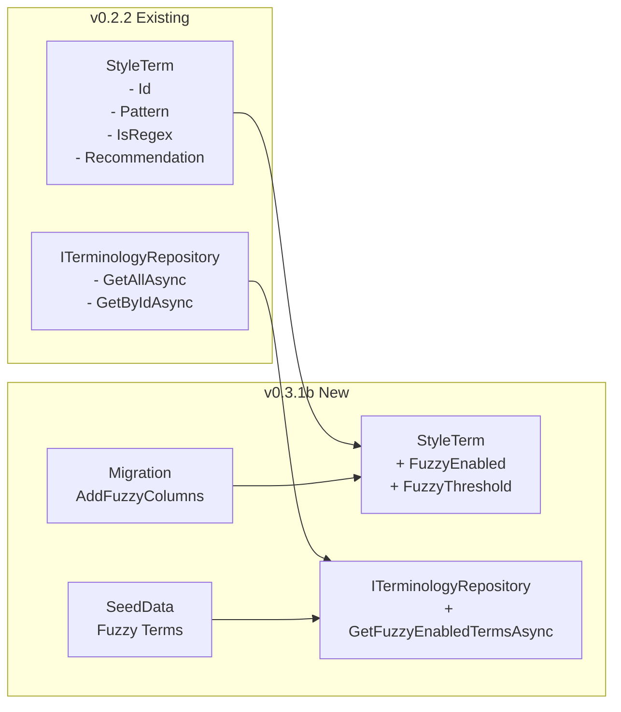
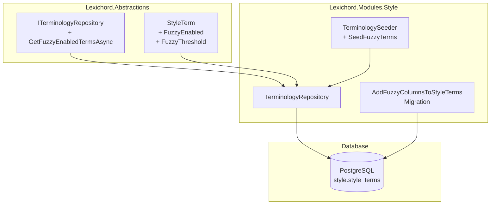

# LCS-DES-031b: Design Specification — Repository Update

## 1. Metadata & Categorization

| Field                | Value                                                        | Description                                                  |
| :------------------- | :----------------------------------------------------------- | :----------------------------------------------------------- |
| **Feature ID**       | `STY-031b`                                                   | Sub-part of STY-031                                          |
| **Feature Name**     | `Fuzzy Terminology Schema`                                   | Database schema and repository extensions for fuzzy matching |
| **Target Version**   | `v0.3.1b`                                                    | Second sub-part of v0.3.1                                    |
| **Module Scope**     | `Lexichord.Abstractions`, `Lexichord.Modules.Style`          | Entity, migration, and repository                            |
| **Swimlane**         | `Governance`                                                 | Style & Terminology Enforcement                              |
| **License Tier**     | `Core`                                                       | Schema exists for all tiers; feature gated in scanner        |
| **Feature Gate Key** | N/A                                                          | No gate at repository level (gate is in FuzzyScanner)        |
| **Author**           | Lead Architect                                               |                                                              |
| **Status**           | `Draft`                                                      |                                                              |
| **Last Updated**     | `2026-01-26`                                                 |                                                              |
| **Parent Document**  | [LCS-DES-031-INDEX](./LCS-DES-031-INDEX.md)                  |                                                              |
| **Scope Breakdown**  | [LCS-SBD-031 §2.2](./LCS-SBD-031.md#v031b-repository-update) |                                                              |

---

## 2. Executive Summary

### 2.1 The Requirement

The `FuzzyScanner` (v0.3.1c) requires database support to configure fuzzy matching on a per-term basis:

1. **Per-term fuzzy toggle** — Users need to enable/disable fuzzy matching for each term.
2. **Configurable threshold** — Different terms require different similarity thresholds (e.g., "master" needs higher threshold to avoid false positives).
3. **Repository query** — The scanner needs an efficient way to load only fuzzy-enabled terms.
4. **Seed data** — Common substitution terms (allowlist/blocklist) should be pre-configured.

### 2.2 The Proposed Solution

We **SHALL** extend the existing terminology infrastructure with:

1. **FluentMigrator migration** to add `fuzzy_enabled` and `fuzzy_threshold` columns.
2. **Entity update** to `StyleTerm` with strongly-typed properties.
3. **Repository extension** with `GetFuzzyEnabledTermsAsync()` method.
4. **Seed data update** to include default fuzzy-enabled terms.



---

## 3. Architecture & Modular Strategy

### 3.1 Component Diagram



### 3.2 File Structure After v0.3.1b

```text
src/Lexichord.Abstractions/
├── Entities/
│   └── StyleTerm.cs                    # MODIFIED: Add FuzzyEnabled, FuzzyThreshold
├── Contracts/
│   └── ITerminologyRepository.cs       # MODIFIED: Add GetFuzzyEnabledTermsAsync

src/Lexichord.Modules.Style/
├── Migrations/
│   └── 20260126_1500_AddFuzzyColumnsToStyleTerms.cs  # NEW: FluentMigrator migration
├── Repositories/
│   └── TerminologyRepository.cs        # MODIFIED: Implement GetFuzzyEnabledTermsAsync
├── Services/
│   └── TerminologySeeder.cs            # MODIFIED: Add fuzzy-enabled seed terms
```

### 3.3 Dependencies

**Upstream Interfaces:**

| Interface                | Source Version | Purpose                      |
| :----------------------- | :------------- | :--------------------------- |
| `StyleTerm`              | v0.2.2a        | Entity model for terminology |
| `ITerminologyRepository` | v0.2.2b        | Database access for terms    |
| `ITerminologySeeder`     | v0.2.2c        | Bootstrap seed data          |
| `IDbConnectionFactory`   | v0.0.5b        | Database connection creation |

**NuGet Packages (Existing):**

| Package          | Version | Purpose           |
| :--------------- | :------ | :---------------- |
| `FluentMigrator` | 6.2.x   | Schema migrations |
| `Dapper`         | 2.1.x   | Micro-ORM         |
| `Npgsql`         | 9.0.x   | PostgreSQL driver |

### 3.4 Licensing Behavior

- **Load Behavior:**
    - [x] **No Gate:** Schema changes are applied regardless of license tier.
    - [ ] **Hard Gate:** Not applicable.
    - [ ] **Soft Gate:** Not applicable.

- **Rationale:**
    > The database schema supports all users. License gating is enforced at the `FuzzyScanner` level (v0.3.1d), not at the repository level. This allows:
    >
    > - Core users to see fuzzy toggle (disabled) in Term Editor.
    > - Writer Pro users to enable fuzzy matching.
    > - Future upgrade path without schema changes.

---

## 4. Decision Trees

### 4.1 Migration Strategy Decision

```text
START: "How should we add fuzzy columns to existing table?"
│
├── Create new table for fuzzy config?
│   └── NO → Keep all term config in single table for simplicity
│
├── Use nullable columns?
│   └── NO → Use NOT NULL with sensible defaults for consistency
│
├── Default fuzzy_enabled value?
│   ├── TRUE → Might cause unexpected violations for existing users
│   └── FALSE → ✅ Safe default, users opt-in per term
│
└── Default fuzzy_threshold value?
    ├── 0.70 → Too loose, many false positives
    ├── 0.80 → ✅ Good balance for typo detection
    └── 0.90 → Too strict, misses variations

DECISION: NOT NULL columns with FALSE and 0.80 defaults.
```

### 4.2 Repository Query Optimization

```text
START: "How should GetFuzzyEnabledTermsAsync query be optimized?"
│
├── Load all terms and filter in memory?
│   └── NO → N terms loaded when only M are fuzzy-enabled (M << N)
│
├── Cache all terms and filter from cache?
│   └── PARTIAL → Cache result of fuzzy query separately
│
├── Add database index on fuzzy_enabled?
│   ├── Table is small (<1000 terms typically)
│   └── ✅ Add index for future scalability
│
└── Include in existing GetAllAsync?
    └── NO → Keep separate query for single responsibility

DECISION: Separate cached query with optional index.
```

---

## 5. Data Contracts

### 5.1 Updated StyleTerm Entity

```csharp
namespace Lexichord.Abstractions.Entities;

/// <summary>
/// Represents a terminology rule in the style lexicon.
/// </summary>
/// <remarks>
/// LOGIC: v0.3.1b adds fuzzy matching properties to enable approximate
/// string matching for typo detection.
///
/// Existing terms default to FuzzyEnabled = false for backward compatibility.
/// When FuzzyEnabled is true, the FuzzyThreshold determines the minimum
/// similarity ratio (0.0 to 1.0) required to trigger a match.
///
/// The FuzzyScanner (v0.3.1c) uses these properties to determine which
/// terms participate in fuzzy matching and with what sensitivity.
/// </remarks>
public record StyleTerm
{
    /// <summary>
    /// Unique identifier for this term.
    /// </summary>
    public Guid Id { get; init; }

    /// <summary>
    /// The pattern to match (literal text or regex).
    /// </summary>
    /// <remarks>
    /// LOGIC: If IsRegex is false, this is treated as literal text.
    /// If IsRegex is true, this is compiled as a .NET regex pattern.
    /// For fuzzy matching, only non-regex patterns are eligible.
    /// </remarks>
    public string Pattern { get; init; } = string.Empty;

    /// <summary>
    /// Whether the pattern should be interpreted as a regex.
    /// </summary>
    /// <remarks>
    /// LOGIC: Regex and fuzzy matching are mutually exclusive.
    /// If IsRegex is true, FuzzyEnabled is ignored by the scanner.
    /// </remarks>
    public bool IsRegex { get; init; }

    /// <summary>
    /// The recommended replacement or fix for this term.
    /// </summary>
    public string Recommendation { get; init; } = string.Empty;

    /// <summary>
    /// The category this rule belongs to.
    /// </summary>
    public RuleCategory Category { get; init; }

    /// <summary>
    /// The severity level of violations for this term.
    /// </summary>
    public ViolationSeverity Severity { get; init; }

    /// <summary>
    /// Optional tags for filtering and organization.
    /// </summary>
    public string[] Tags { get; init; } = Array.Empty<string>();

    // ═══════════════════════════════════════════════════════════════════════
    // v0.3.1b Additions
    // ═══════════════════════════════════════════════════════════════════════

    /// <summary>
    /// Whether fuzzy matching is enabled for this term.
    /// </summary>
    /// <remarks>
    /// LOGIC: When true, the FuzzyScanner will compare document words
    /// against this term using Levenshtein distance. This enables detection
    /// of typos and variations (e.g., "white-list" matching "whitelist").
    ///
    /// Default is false for backward compatibility.
    /// Only literal patterns (IsRegex = false) can use fuzzy matching.
    /// </remarks>
    public bool FuzzyEnabled { get; init; } = false;

    /// <summary>
    /// The minimum similarity ratio for fuzzy matching (0.0 to 1.0).
    /// </summary>
    /// <remarks>
    /// LOGIC: A threshold of 0.80 means the word must be at least 80%
    /// similar to the pattern to be flagged. Higher values are stricter.
    ///
    /// Recommended thresholds:
    /// - 0.70: Loose (catches more variations, more false positives)
    /// - 0.80: Default (good balance for typo detection)
    /// - 0.90: Strict (fewer matches, fewer false positives)
    ///
    /// The FuzzyMatchService.IsMatch() method uses this threshold.
    /// </remarks>
    public double FuzzyThreshold { get; init; } = 0.80;
}
```

### 5.2 ITerminologyRepository Extension

```csharp
namespace Lexichord.Abstractions.Contracts;

/// <summary>
/// Repository interface for terminology rules (style terms).
/// </summary>
public interface ITerminologyRepository
{
    // ═══════════════════════════════════════════════════════════════════════
    // Existing Methods (v0.2.2b)
    // ═══════════════════════════════════════════════════════════════════════

    /// <summary>
    /// Gets all terms from the lexicon.
    /// </summary>
    Task<IReadOnlyList<StyleTerm>> GetAllAsync(
        CancellationToken cancellationToken = default);

    /// <summary>
    /// Gets a term by its unique identifier.
    /// </summary>
    Task<StyleTerm?> GetByIdAsync(
        Guid id,
        CancellationToken cancellationToken = default);

    /// <summary>
    /// Adds a new term to the lexicon.
    /// </summary>
    Task<Guid> AddAsync(
        StyleTerm term,
        CancellationToken cancellationToken = default);

    /// <summary>
    /// Updates an existing term.
    /// </summary>
    Task UpdateAsync(
        StyleTerm term,
        CancellationToken cancellationToken = default);

    /// <summary>
    /// Deletes a term by its identifier.
    /// </summary>
    Task DeleteAsync(
        Guid id,
        CancellationToken cancellationToken = default);

    // ═══════════════════════════════════════════════════════════════════════
    // v0.3.1b Additions
    // ═══════════════════════════════════════════════════════════════════════

    /// <summary>
    /// Gets all terms that have fuzzy matching enabled.
    /// </summary>
    /// <param name="cancellationToken">Cancellation token.</param>
    /// <returns>List of fuzzy-enabled terms.</returns>
    /// <remarks>
    /// LOGIC: Query: SELECT * FROM style.style_terms WHERE fuzzy_enabled = true
    ///
    /// Results are cached using IMemoryCache with 5-minute sliding expiration.
    /// Cache is invalidated when terms are added, updated, or deleted via
    /// the ITerminologyService.
    ///
    /// This method only returns non-regex terms (IsRegex = false) since
    /// regex patterns cannot use fuzzy matching.
    /// </remarks>
    Task<IReadOnlyList<StyleTerm>> GetFuzzyEnabledTermsAsync(
        CancellationToken cancellationToken = default);
}
```

---

## 6. Implementation Logic

### 6.1 FluentMigrator Migration

```csharp
using FluentMigrator;

namespace Lexichord.Modules.Style.Migrations;

/// <summary>
/// Adds fuzzy matching columns to the style_terms table.
/// </summary>
/// <remarks>
/// LOGIC: This migration adds two columns to support per-term fuzzy configuration:
///
/// 1. fuzzy_enabled (BOOLEAN): Whether fuzzy matching is active for this term.
///    - Default FALSE for backward compatibility (existing terms unchanged).
///
/// 2. fuzzy_threshold (DECIMAL 3,2): Minimum similarity ratio for matching.
///    - Range: 0.00 to 1.00
///    - Default 0.80 (80% similarity required for match).
///
/// These columns are NOT NULL to enforce data integrity. The FuzzyScanner
/// (v0.3.1c) uses these values to determine matching behavior.
/// </remarks>
[Migration(20260126_1500)]
public class AddFuzzyColumnsToStyleTerms : Migration
{
    private const string SchemaName = "style";
    private const string TableName = "style_terms";

    public override void Up()
    {
        // LOGIC: Add fuzzy_enabled column with safe default (disabled)
        Alter.Table(TableName).InSchema(SchemaName)
            .AddColumn("fuzzy_enabled")
                .AsBoolean()
                .NotNullable()
                .WithDefaultValue(false);

        // LOGIC: Add fuzzy_threshold with default 0.80 (80% match required)
        // DECIMAL(3,2) allows values from 0.00 to 9.99, but we constrain to 0.00-1.00
        // via application-level validation (FluentValidation in v0.2.5c)
        Alter.Table(TableName).InSchema(SchemaName)
            .AddColumn("fuzzy_threshold")
                .AsDecimal(3, 2)
                .NotNullable()
                .WithDefaultValue(0.80m);

        // LOGIC: Create index for efficient fuzzy term queries
        // The FuzzyScanner frequently queries WHERE fuzzy_enabled = true
        Create.Index("IX_style_terms_fuzzy_enabled")
            .OnTable(TableName).InSchema(SchemaName)
            .OnColumn("fuzzy_enabled")
            .Ascending()
            .WithOptions()
            .Filter("fuzzy_enabled = true");  // Partial index for TRUE values only
    }

    public override void Down()
    {
        Delete.Index("IX_style_terms_fuzzy_enabled")
            .OnTable(TableName).InSchema(SchemaName);

        Delete.Column("fuzzy_threshold")
            .FromTable(TableName).InSchema(SchemaName);

        Delete.Column("fuzzy_enabled")
            .FromTable(TableName).InSchema(SchemaName);
    }
}
```

### 6.2 Repository Implementation

```csharp
using Dapper;
using Lexichord.Abstractions.Contracts;
using Lexichord.Abstractions.Entities;
using Microsoft.Extensions.Caching.Memory;
using Microsoft.Extensions.Logging;

namespace Lexichord.Modules.Style.Repositories;

/// <summary>
/// PostgreSQL implementation of ITerminologyRepository.
/// </summary>
/// <remarks>
/// LOGIC: Uses Dapper for efficient database access and IMemoryCache
/// for caching frequently-accessed term lists.
/// </remarks>
public sealed class TerminologyRepository(
    IDbConnectionFactory connectionFactory,
    IMemoryCache cache,
    ILogger<TerminologyRepository> logger) : ITerminologyRepository
{
    private const string FuzzyTermsCacheKey = "style:fuzzy_terms";
    private static readonly TimeSpan CacheExpiration = TimeSpan.FromMinutes(5);

    // ... existing methods from v0.2.2b ...

    /// <inheritdoc/>
    public async Task<IReadOnlyList<StyleTerm>> GetFuzzyEnabledTermsAsync(
        CancellationToken cancellationToken = default)
    {
        // LOGIC: Check cache first to avoid database round-trip
        if (cache.TryGetValue(FuzzyTermsCacheKey, out IReadOnlyList<StyleTerm>? cachedTerms)
            && cachedTerms is not null)
        {
            logger.LogDebug(
                "Fuzzy terms cache hit: {TermCount} terms",
                cachedTerms.Count);
            return cachedTerms;
        }

        logger.LogDebug("Fuzzy terms cache miss, querying database");

        await using var connection = await connectionFactory.CreateConnectionAsync(cancellationToken);

        // LOGIC: Query only fuzzy-enabled AND non-regex terms
        // Regex patterns cannot use fuzzy matching, so we exclude them
        const string sql = """
            SELECT id, pattern, is_regex, recommendation, category, severity, tags,
                   fuzzy_enabled, fuzzy_threshold
            FROM style.style_terms
            WHERE fuzzy_enabled = true
              AND is_regex = false
            ORDER BY pattern
            """;

        var terms = (await connection.QueryAsync<StyleTerm>(sql))
            .ToList()
            .AsReadOnly();

        // LOGIC: Cache with sliding expiration
        var cacheOptions = new MemoryCacheEntryOptions()
            .SetSlidingExpiration(CacheExpiration)
            .SetPriority(CacheItemPriority.Normal);

        cache.Set(FuzzyTermsCacheKey, terms, cacheOptions);

        logger.LogInformation(
            "Loaded {TermCount} fuzzy-enabled terms from database",
            terms.Count);

        return terms;
    }

    /// <summary>
    /// Invalidates the fuzzy terms cache.
    /// </summary>
    /// <remarks>
    /// LOGIC: Called by TerminologyService after any term modification
    /// to ensure the FuzzyScanner sees updated terms.
    /// </remarks>
    public void InvalidateFuzzyTermsCache()
    {
        cache.Remove(FuzzyTermsCacheKey);
        logger.LogDebug("Fuzzy terms cache invalidated");
    }
}
```

### 6.3 Seed Data Update

```csharp
using Lexichord.Abstractions.Contracts;
using Lexichord.Abstractions.Entities;
using Microsoft.Extensions.Logging;

namespace Lexichord.Modules.Style.Services;

/// <summary>
/// Seeds the terminology database with default terms.
/// </summary>
public sealed class TerminologySeeder(
    ITerminologyRepository repository,
    ILogger<TerminologySeeder> logger) : ITerminologySeeder
{
    /// <inheritdoc/>
    public async Task SeedAsync(CancellationToken cancellationToken = default)
    {
        await SeedFuzzyTermsAsync(cancellationToken);
        // ... other seed methods ...
    }

    /// <summary>
    /// Seeds fuzzy-enabled substitution terms.
    /// </summary>
    /// <remarks>
    /// LOGIC: These terms represent common non-inclusive language that
    /// should be replaced with more inclusive alternatives. Fuzzy matching
    /// is enabled to catch variations like "white-list", "WhiteList", etc.
    ///
    /// Thresholds are tuned per-term:
    /// - 0.80 for unique terms (whitelist, blacklist)
    /// - 0.85 for common words that might false-positive (master)
    /// </remarks>
    private async Task SeedFuzzyTermsAsync(CancellationToken cancellationToken)
    {
        var fuzzyTerms = new[]
        {
            new StyleTerm
            {
                Id = Guid.NewGuid(),
                Pattern = "whitelist",
                Recommendation = "allowlist",
                Category = RuleCategory.Terminology,
                Severity = ViolationSeverity.Warning,
                IsRegex = false,
                FuzzyEnabled = true,
                FuzzyThreshold = 0.80,
                Tags = ["inclusive", "security"]
            },
            new StyleTerm
            {
                Id = Guid.NewGuid(),
                Pattern = "blacklist",
                Recommendation = "blocklist",
                Category = RuleCategory.Terminology,
                Severity = ViolationSeverity.Warning,
                IsRegex = false,
                FuzzyEnabled = true,
                FuzzyThreshold = 0.80,
                Tags = ["inclusive", "security"]
            },
            new StyleTerm
            {
                Id = Guid.NewGuid(),
                Pattern = "master",
                Recommendation = "main, primary, or leader",
                Category = RuleCategory.Terminology,
                Severity = ViolationSeverity.Info,
                IsRegex = false,
                FuzzyEnabled = true,
                FuzzyThreshold = 0.85,  // Higher threshold to avoid false positives
                Tags = ["inclusive", "git"]
            },
            new StyleTerm
            {
                Id = Guid.NewGuid(),
                Pattern = "slave",
                Recommendation = "replica, secondary, or follower",
                Category = RuleCategory.Terminology,
                Severity = ViolationSeverity.Warning,
                IsRegex = false,
                FuzzyEnabled = true,
                FuzzyThreshold = 0.80,
                Tags = ["inclusive", "database"]
            },
            new StyleTerm
            {
                Id = Guid.NewGuid(),
                Pattern = "sanity check",
                Recommendation = "confidence check or validation",
                Category = RuleCategory.Terminology,
                Severity = ViolationSeverity.Info,
                IsRegex = false,
                FuzzyEnabled = true,
                FuzzyThreshold = 0.85,
                Tags = ["inclusive"]
            }
        };

        foreach (var term in fuzzyTerms)
        {
            // LOGIC: Check if term already exists by pattern
            var existing = await repository.GetByPatternAsync(
                term.Pattern,
                cancellationToken);

            if (existing is null)
            {
                await repository.AddAsync(term, cancellationToken);
                logger.LogInformation(
                    "Seeded fuzzy term: {Pattern} → {Recommendation}",
                    term.Pattern,
                    term.Recommendation);
            }
            else
            {
                logger.LogDebug(
                    "Fuzzy term already exists: {Pattern}",
                    term.Pattern);
            }
        }
    }
}
```

---

## 7. Use Cases & User Stories

### 7.1 User Stories

| ID    | Role            | Story                                                            | Acceptance Criteria                                 |
| :---- | :-------------- | :--------------------------------------------------------------- | :-------------------------------------------------- |
| US-01 | Database Admin  | As a DBA, I want migrations to run safely on existing databases. | Migration adds columns without data loss.           |
| US-02 | Developer       | As a developer, I want entity properties for fuzzy config.       | `StyleTerm.FuzzyEnabled` and `FuzzyThreshold` work. |
| US-03 | Developer       | As a developer, I want efficient fuzzy term queries.             | `GetFuzzyEnabledTermsAsync()` returns cached data.  |
| US-04 | Writer Pro User | As a paid user, I want default fuzzy terms pre-configured.       | Seed data includes allowlist/blocklist terms.       |
| US-05 | All Users       | As a user, I don't want existing terms affected by migration.    | Existing terms have FuzzyEnabled = false.           |

### 7.2 Use Cases

#### UC-01: Migration Execution

**Preconditions:**

- PostgreSQL database exists with `style.style_terms` table.
- FluentMigrator is configured in Host.

**Flow:**

1. Administrator runs migrations: `dotnet run -- --migrate`.
2. FluentMigrator detects `20260126_1500_AddFuzzyColumnsToStyleTerms`.
3. Migration executes:
    - Adds `fuzzy_enabled` column (BOOLEAN, default FALSE).
    - Adds `fuzzy_threshold` column (DECIMAL(3,2), default 0.80).
    - Creates partial index on `fuzzy_enabled`.
4. Migration commits and records version in `VersionInfo` table.

**Postconditions:**

- Schema includes new columns.
- Existing rows have `fuzzy_enabled = false`, `fuzzy_threshold = 0.80`.
- Index `IX_style_terms_fuzzy_enabled` exists.

---

#### UC-02: Fuzzy Term Query with Caching

**Preconditions:**

- Database contains fuzzy-enabled terms.
- `IMemoryCache` is empty.

**Flow:**

1. `FuzzyScanner` calls `repository.GetFuzzyEnabledTermsAsync()`.
2. Repository checks cache → miss.
3. Repository executes SQL query:
    ```sql
    SELECT * FROM style.style_terms
    WHERE fuzzy_enabled = true AND is_regex = false
    ```
4. Repository caches result with 5-minute sliding expiration.
5. Returns list of fuzzy-enabled terms.

**Postconditions:**

- Subsequent calls within 5 minutes return cached data.
- Cache invalidated on any term modification.

---

#### UC-03: Seed Data Application

**Preconditions:**

- Fresh database with empty `style_terms` table.

**Flow:**

1. Host startup calls `ITerminologySeeder.SeedAsync()`.
2. Seeder calls `SeedFuzzyTermsAsync()`.
3. For each default fuzzy term:
    - Check if exists by pattern → not found.
    - Insert new term with fuzzy configuration.
4. Log completion.

**Postconditions:**

- 5 default fuzzy terms exist in database.
- All have `FuzzyEnabled = true`.
- Thresholds range from 0.80 to 0.85 based on term.

---

## 8. Unit Testing Requirements

### 8.1 Migration Tests

```csharp
using FluentMigrator.Runner;
using FluentMigrator.Runner.Initialization;
using Xunit;

namespace Lexichord.Tests.Integration.Migrations;

[Trait("Category", "Integration")]
[Trait("Feature", "FuzzyMatching")]
public class AddFuzzyColumnsToStyleTermsMigrationTests : IAsyncLifetime
{
    private readonly TestDatabase _db = new();

    public async Task InitializeAsync()
    {
        await _db.CreateAsync();
    }

    public async Task DisposeAsync()
    {
        await _db.DropAsync();
    }

    [Fact]
    public async Task Up_AddsFuzzyEnabledColumn()
    {
        // Arrange
        await _db.RunMigrationAsync(20260126_1500);

        // Act
        var columnExists = await _db.ColumnExistsAsync(
            "style", "style_terms", "fuzzy_enabled");

        // Assert
        Assert.True(columnExists);
    }

    [Fact]
    public async Task Up_AddsFuzzyThresholdColumn()
    {
        // Arrange
        await _db.RunMigrationAsync(20260126_1500);

        // Act
        var columnExists = await _db.ColumnExistsAsync(
            "style", "style_terms", "fuzzy_threshold");

        // Assert
        Assert.True(columnExists);
    }

    [Fact]
    public async Task Up_ExistingRows_HaveDefaultValues()
    {
        // Arrange: Insert a row before migration
        await _db.ExecuteAsync("""
            INSERT INTO style.style_terms (id, pattern, is_regex, recommendation)
            VALUES (gen_random_uuid(), 'test', false, 'test replacement')
            """);

        // Act
        await _db.RunMigrationAsync(20260126_1500);
        var (fuzzyEnabled, threshold) = await _db.QuerySingleAsync<(bool, decimal)>("""
            SELECT fuzzy_enabled, fuzzy_threshold FROM style.style_terms LIMIT 1
            """);

        // Assert
        Assert.False(fuzzyEnabled);
        Assert.Equal(0.80m, threshold);
    }

    [Fact]
    public async Task Down_RemovesAddedColumns()
    {
        // Arrange
        await _db.RunMigrationAsync(20260126_1500);

        // Act
        await _db.RollbackMigrationAsync(20260126_1500);
        var fuzzyEnabledExists = await _db.ColumnExistsAsync(
            "style", "style_terms", "fuzzy_enabled");
        var thresholdExists = await _db.ColumnExistsAsync(
            "style", "style_terms", "fuzzy_threshold");

        // Assert
        Assert.False(fuzzyEnabledExists);
        Assert.False(thresholdExists);
    }
}
```

### 8.2 Repository Tests

```csharp
using FluentAssertions;
using Lexichord.Abstractions.Entities;
using Lexichord.Modules.Style.Repositories;
using Microsoft.Extensions.Caching.Memory;
using Microsoft.Extensions.Logging.Abstractions;
using Moq;
using Xunit;

namespace Lexichord.Tests.Unit.Repositories;

[Trait("Category", "Unit")]
[Trait("Feature", "FuzzyMatching")]
public class TerminologyRepositoryFuzzyTests
{
    private readonly Mock<IDbConnectionFactory> _mockConnectionFactory = new();
    private readonly MemoryCache _cache = new(new MemoryCacheOptions());
    private readonly TerminologyRepository _sut;

    public TerminologyRepositoryFuzzyTests()
    {
        _sut = new TerminologyRepository(
            _mockConnectionFactory.Object,
            _cache,
            NullLogger<TerminologyRepository>.Instance);
    }

    [Fact]
    public async Task GetFuzzyEnabledTermsAsync_ReturnsOnlyFuzzyEnabled()
    {
        // Arrange
        var terms = new List<StyleTerm>
        {
            new() { Pattern = "whitelist", FuzzyEnabled = true, IsRegex = false },
            new() { Pattern = "exact", FuzzyEnabled = false, IsRegex = false },
        };
        SetupQuery(terms.Where(t => t.FuzzyEnabled && !t.IsRegex).ToList());

        // Act
        var result = await _sut.GetFuzzyEnabledTermsAsync();

        // Assert
        result.Should().HaveCount(1);
        result[0].Pattern.Should().Be("whitelist");
    }

    [Fact]
    public async Task GetFuzzyEnabledTermsAsync_ExcludesRegexTerms()
    {
        // Arrange
        var terms = new List<StyleTerm>
        {
            new() { Pattern = "literal", FuzzyEnabled = true, IsRegex = false },
            new() { Pattern = @"\bregex\b", FuzzyEnabled = true, IsRegex = true },
        };
        SetupQuery(terms.Where(t => t.FuzzyEnabled && !t.IsRegex).ToList());

        // Act
        var result = await _sut.GetFuzzyEnabledTermsAsync();

        // Assert
        result.Should().HaveCount(1);
        result[0].Pattern.Should().Be("literal");
    }

    [Fact]
    public async Task GetFuzzyEnabledTermsAsync_CachesResult()
    {
        // Arrange
        var terms = new List<StyleTerm>
        {
            new() { Pattern = "test", FuzzyEnabled = true, IsRegex = false }
        };
        SetupQuery(terms);

        // Act
        await _sut.GetFuzzyEnabledTermsAsync();
        await _sut.GetFuzzyEnabledTermsAsync();

        // Assert: Query should only be called once due to caching
        _mockConnectionFactory.Verify(
            f => f.CreateConnectionAsync(It.IsAny<CancellationToken>()),
            Times.Once);
    }

    [Fact]
    public void InvalidateFuzzyTermsCache_RemovesCachedEntry()
    {
        // Arrange
        _cache.Set("style:fuzzy_terms", new List<StyleTerm>());

        // Act
        _sut.InvalidateFuzzyTermsCache();

        // Assert
        _cache.TryGetValue("style:fuzzy_terms", out _).Should().BeFalse();
    }

    [Fact]
    public async Task GetFuzzyEnabledTermsAsync_EmptyTable_ReturnsEmptyList()
    {
        // Arrange
        SetupQuery(new List<StyleTerm>());

        // Act
        var result = await _sut.GetFuzzyEnabledTermsAsync();

        // Assert
        result.Should().BeEmpty();
    }
}
```

### 8.3 Entity Tests

```csharp
using FluentAssertions;
using Lexichord.Abstractions.Entities;
using Xunit;

namespace Lexichord.Tests.Unit.Entities;

[Trait("Category", "Unit")]
[Trait("Feature", "FuzzyMatching")]
public class StyleTermFuzzyPropertiesTests
{
    [Fact]
    public void FuzzyEnabled_DefaultValue_IsFalse()
    {
        var term = new StyleTerm();
        term.FuzzyEnabled.Should().BeFalse();
    }

    [Fact]
    public void FuzzyThreshold_DefaultValue_IsPoint80()
    {
        var term = new StyleTerm();
        term.FuzzyThreshold.Should().Be(0.80);
    }

    [Theory]
    [InlineData(0.70)]
    [InlineData(0.80)]
    [InlineData(0.90)]
    [InlineData(1.00)]
    public void FuzzyThreshold_CanBeSetToValidValues(double threshold)
    {
        var term = new StyleTerm { FuzzyThreshold = threshold };
        term.FuzzyThreshold.Should().Be(threshold);
    }
}
```

### 8.4 Seeder Tests

```csharp
using FluentAssertions;
using Lexichord.Abstractions.Contracts;
using Lexichord.Abstractions.Entities;
using Lexichord.Modules.Style.Services;
using Microsoft.Extensions.Logging.Abstractions;
using Moq;
using Xunit;

namespace Lexichord.Tests.Unit.Services;

[Trait("Category", "Unit")]
[Trait("Feature", "FuzzyMatching")]
public class TerminologySeederFuzzyTests
{
    private readonly Mock<ITerminologyRepository> _mockRepository = new();
    private readonly TerminologySeeder _sut;

    public TerminologySeederFuzzyTests()
    {
        _sut = new TerminologySeeder(
            _mockRepository.Object,
            NullLogger<TerminologySeeder>.Instance);
    }

    [Fact]
    public async Task SeedAsync_CreatesExpectedFuzzyTerms()
    {
        // Arrange
        _mockRepository
            .Setup(r => r.GetByPatternAsync(It.IsAny<string>(), It.IsAny<CancellationToken>()))
            .ReturnsAsync((StyleTerm?)null);

        var addedTerms = new List<StyleTerm>();
        _mockRepository
            .Setup(r => r.AddAsync(It.IsAny<StyleTerm>(), It.IsAny<CancellationToken>()))
            .Callback<StyleTerm, CancellationToken>((t, _) => addedTerms.Add(t))
            .ReturnsAsync(Guid.NewGuid());

        // Act
        await _sut.SeedAsync();

        // Assert
        addedTerms.Should().HaveCount(5);
        addedTerms.Should().Contain(t => t.Pattern == "whitelist" && t.FuzzyEnabled);
        addedTerms.Should().Contain(t => t.Pattern == "blacklist" && t.FuzzyEnabled);
        addedTerms.Should().Contain(t => t.Pattern == "master" && t.FuzzyThreshold == 0.85);
        addedTerms.Should().Contain(t => t.Pattern == "slave" && t.FuzzyEnabled);
        addedTerms.Should().Contain(t => t.Pattern == "sanity check" && t.FuzzyEnabled);
    }

    [Fact]
    public async Task SeedAsync_ExistingTerm_DoesNotDuplicate()
    {
        // Arrange
        _mockRepository
            .Setup(r => r.GetByPatternAsync("whitelist", It.IsAny<CancellationToken>()))
            .ReturnsAsync(new StyleTerm { Pattern = "whitelist" });

        // Act
        await _sut.SeedAsync();

        // Assert
        _mockRepository.Verify(
            r => r.AddAsync(
                It.Is<StyleTerm>(t => t.Pattern == "whitelist"),
                It.IsAny<CancellationToken>()),
            Times.Never);
    }
}
```

---

## 9. Observability & Logging

### 9.1 Log Events

| Level | Source                | Message Template                                               |
| :---- | :-------------------- | :------------------------------------------------------------- |
| Debug | TerminologyRepository | `Fuzzy terms cache hit: {TermCount} terms`                     |
| Debug | TerminologyRepository | `Fuzzy terms cache miss, querying database`                    |
| Info  | TerminologyRepository | `Loaded {TermCount} fuzzy-enabled terms from database`         |
| Debug | TerminologyRepository | `Fuzzy terms cache invalidated`                                |
| Info  | TerminologySeeder     | `Seeded fuzzy term: {Pattern} → {Recommendation}`              |
| Debug | TerminologySeeder     | `Fuzzy term already exists: {Pattern}`                         |
| Info  | Migration             | `Applied migration 20260126_1500: AddFuzzyColumnsToStyleTerms` |

### 9.2 Metrics

- `style.terminology.fuzzy_terms_count` — Gauge: Number of fuzzy-enabled terms.
- `style.terminology.fuzzy_cache_hits` — Counter: Cache hits for fuzzy queries.
- `style.terminology.fuzzy_cache_misses` — Counter: Cache misses requiring DB query.

---

## 10. Security & Safety

### 10.1 Risk Assessment

| Risk                | Level | Mitigation                                            |
| :------------------ | :---- | :---------------------------------------------------- |
| **SQL Injection**   | None  | Uses parameterized queries via Dapper.                |
| **Migration Fail**  | Low   | Down() method provides rollback capability.           |
| **Data Loss**       | None  | Migration adds columns; doesn't modify existing data. |
| **Cache Poisoning** | Low   | Cache is internal; no external input to cache keys.   |

### 10.2 Input Validation

- **FuzzyThreshold range:** Validated by FluentValidation in v0.2.5c (0.50 to 1.00).
- **FuzzyEnabled type:** Boolean type enforces valid values at database level.
- **Pattern validation:** Existing validation ensures non-empty patterns.

---

## 11. Risks & Mitigations

| Risk                                         | Impact | Mitigation                                             |
| :------------------------------------------- | :----- | :----------------------------------------------------- |
| Migration fails on large tables              | Medium | Test on copy of production; columns have defaults      |
| Cache invalidation missed                    | Low    | All CRUD goes through TerminologyService → invalidates |
| Threshold precision loss (DECIMAL vs double) | Low    | DECIMAL(3,2) sufficient for 0.00-1.00 range            |
| Seed data conflicts with user data           | Low    | Check by pattern before insert; log existing           |

---

## 12. Acceptance Criteria (QA)

| #   | Category         | Criterion                                                        |
| :-- | :--------------- | :--------------------------------------------------------------- |
| 1   | **[Migration]**  | Migration adds `fuzzy_enabled` column to `style_terms`.          |
| 2   | **[Migration]**  | Migration adds `fuzzy_threshold` column to `style_terms`.        |
| 3   | **[Migration]**  | Migration creates partial index on `fuzzy_enabled`.              |
| 4   | **[Migration]**  | Existing rows have default values (false, 0.80).                 |
| 5   | **[Migration]**  | Down() migration removes added columns and index.                |
| 6   | **[Entity]**     | `StyleTerm.FuzzyEnabled` property exists and defaults to false.  |
| 7   | **[Entity]**     | `StyleTerm.FuzzyThreshold` property exists and defaults to 0.80. |
| 8   | **[Repository]** | `GetFuzzyEnabledTermsAsync()` returns only fuzzy-enabled terms.  |
| 9   | **[Repository]** | `GetFuzzyEnabledTermsAsync()` excludes regex terms.              |
| 10  | **[Repository]** | Results are cached with 5-minute expiration.                     |
| 11  | **[Cache]**      | Cache is invalidated on term add/update/delete.                  |
| 12  | **[Seed Data]**  | 5 default fuzzy terms are seeded on fresh database.              |
| 13  | **[Seed Data]**  | Existing terms are not duplicated on re-seed.                    |
| 14  | **[Build]**      | Solution builds with no errors or warnings.                      |

---

## 13. Verification Commands

```bash
# ═══════════════════════════════════════════════════════════════════════════
# v0.3.1b Verification
# ═══════════════════════════════════════════════════════════════════════════

# 1. Build solution
dotnet build --configuration Release
# Expected: No errors or warnings

# 2. Run migrations
dotnet run --project src/Lexichord.Host -- --migrate
# Expected: Migration 20260126_1500 applied successfully

# 3. Verify new columns exist (psql)
psql -d lexichord -c "
  SELECT column_name, data_type, column_default
  FROM information_schema.columns
  WHERE table_schema = 'style'
    AND table_name = 'style_terms'
    AND column_name IN ('fuzzy_enabled', 'fuzzy_threshold')
"
# Expected: Two rows showing fuzzy_enabled (boolean) and fuzzy_threshold (numeric)

# 4. Verify partial index exists (psql)
psql -d lexichord -c "
  SELECT indexname, indexdef
  FROM pg_indexes
  WHERE tablename = 'style_terms'
    AND indexname = 'IX_style_terms_fuzzy_enabled'
"
# Expected: Partial index with WHERE fuzzy_enabled = true

# 5. Verify existing data has defaults (psql)
psql -d lexichord -c "
  SELECT COUNT(*) as total,
         COUNT(*) FILTER (WHERE fuzzy_enabled = false) as disabled,
         COUNT(*) FILTER (WHERE fuzzy_threshold = 0.80) as default_threshold
  FROM style.style_terms
"
# Expected: total = disabled = default_threshold (all rows have defaults)

# 6. Run unit tests
dotnet test tests/Lexichord.Tests.Unit \
  --filter "Feature=FuzzyMatching" \
  --verbosity normal
# Expected: All tests pass

# 7. Run integration tests (migration tests)
dotnet test tests/Lexichord.Tests.Integration \
  --filter "Feature=FuzzyMatching" \
  --verbosity normal
# Expected: All tests pass

# 8. Verify seed data (psql)
psql -d lexichord -c "
  SELECT pattern, fuzzy_enabled, fuzzy_threshold
  FROM style.style_terms
  WHERE fuzzy_enabled = true
  ORDER BY pattern
"
# Expected: whitelist, blacklist, master, slave, sanity check

# 9. Test rollback migration
dotnet run --project src/Lexichord.Host -- --migrate-down 20260126_1500
# Expected: Migration rolled back, columns removed

# 10. Re-apply migration
dotnet run --project src/Lexichord.Host -- --migrate
# Expected: Migration re-applied successfully
```

---

## 14. Deliverable Checklist

| Step | Description                                                        | Status |
| :--- | :----------------------------------------------------------------- | :----- |
| 1    | FluentMigrator migration `20260126_1500` created.                  | [ ]    |
| 2    | `fuzzy_enabled` column added (BOOLEAN, NOT NULL, default FALSE).   | [ ]    |
| 3    | `fuzzy_threshold` column added (DECIMAL(3,2), NOT NULL, def 0.80). | [ ]    |
| 4    | Partial index `IX_style_terms_fuzzy_enabled` created.              | [ ]    |
| 5    | Down() migration removes columns and index.                        | [ ]    |
| 6    | `StyleTerm.FuzzyEnabled` property added with default.              | [ ]    |
| 7    | `StyleTerm.FuzzyThreshold` property added with default.            | [ ]    |
| 8    | XML documentation on new properties.                               | [ ]    |
| 9    | `GetFuzzyEnabledTermsAsync()` added to `ITerminologyRepository`.   | [ ]    |
| 10   | Repository implementation with caching.                            | [ ]    |
| 11   | `InvalidateFuzzyTermsCache()` method added.                        | [ ]    |
| 12   | TerminologySeeder updated with 5 fuzzy terms.                      | [ ]    |
| 13   | Unit tests for StyleTerm fuzzy properties.                         | [ ]    |
| 14   | Unit tests for repository fuzzy query.                             | [ ]    |
| 15   | Unit tests for seeder fuzzy terms.                                 | [ ]    |
| 16   | Integration tests for migration.                                   | [ ]    |
| 17   | Solution builds without warnings.                                  | [ ]    |
| 18   | All tests pass.                                                    | [ ]    |
