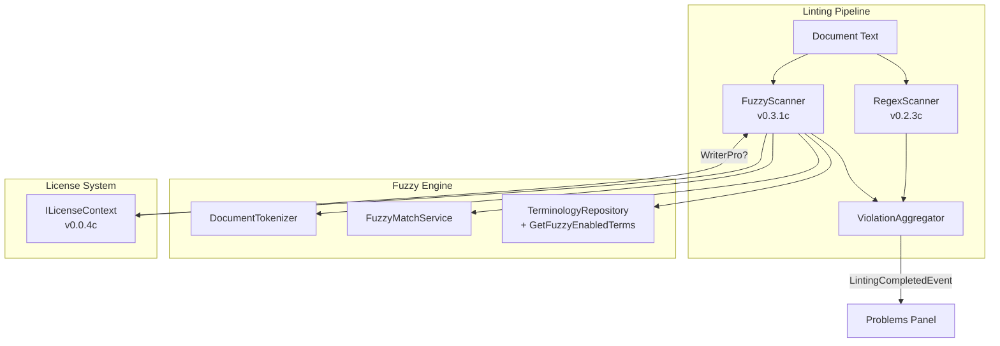

# LDS-01: Feature Design Specification

## 1. Metadata & Categorization

| Field                | Value                     | Description                                   |
| :------------------- | :------------------------ | :-------------------------------------------- |
| **Feature ID**       | `STY-031`                 | Style Module - Fuzzy Engine                   |
| **Feature Name**     | Fuzzy String Matching     | Advanced variation detection for terminology. |
| **Target Version**   | `v0.3.1`                  | Algorithmic Analysis Phase.                   |
| **Module Scope**     | `Lexichord.Modules.Style` | Style governance module.                      |
| **Swimlane**         | `Governance`              | Style & Terminology Enforcement.              |
| **License Tier**     | `Writer Pro`              | Premium feature (Core users see regex only).  |
| **Feature Gate Key** | `Feature.FuzzyMatching`   | Key used in `ILicenseContext.HasFeature()`.   |
| **Author**           | System Architect          |                                               |
| **Reviewer**         | Lead Architect            |                                               |
| **Status**           | **Draft**                 | Pending approval.                             |
| **Last Updated**     | 2026-01-26                |                                               |

---

## 2. Executive Summary

### 2.1 The Requirement

Writers frequently misspell or use variations of forbidden terms that the regex linter cannot catch. Examples:

| User Types      | Forbidden Term | Current Regex Result | Expected Behavior    |
| :-------------- | :------------- | :------------------- | :------------------- |
| `white-list`    | `whitelist`    | ❌ Not detected      | ✅ Should be flagged |
| `Black-List`    | `blacklist`    | ❌ Not detected      | ✅ Should be flagged |
| `master-branch` | `master`       | ❌ Not detected      | ✅ Should be flagged |

The Regex linter (v0.2.x) only catches **exact patterns**. We need **fuzzy matching** to detect typos and variations.

### 2.2 The Proposed Solution

Implement a secondary `FuzzyScanner` that runs **after** the Regex scanner:

1. **Tokenize** the document into unique words.
2. **Compare** each word against fuzzy-enabled terms using **Levenshtein distance**.
3. **Flag** words that match above the configured threshold (default 80%).
4. **Gate** the feature behind the `Writer Pro` license tier.

This approach:

- Uses the battle-tested `FuzzySharp` NuGet package.
- Avoids double-counting (skip words already flagged by regex).
- Maintains performance (< 100ms for 1,000 unique words).

---

## 3. Architecture & Modular Strategy

### 3.1 System Architecture



### 3.2 Dependencies

- **Upstream Modules:**
    - `Lexichord.Abstractions` (Interfaces, `StyleViolation`, `ILicenseContext`)
    - `Lexichord.Modules.Style` (Existing linting infrastructure, `ITerminologyRepository`)
    - `Lexichord.Host` (DI container, event bus)

- **Upstream Interfaces:**

| Interface                | Source Version | Purpose                              |
| :----------------------- | :------------- | :----------------------------------- |
| `StyleTerm`              | v0.2.2a        | Entity model for terminology         |
| `ITerminologyRepository` | v0.2.2b        | Database access for terms            |
| `ILintingOrchestrator`   | v0.2.3a        | Reactive linting coordinator         |
| `IStyleScanner`          | v0.2.3c        | Existing regex scanner interface     |
| `StyleViolation`         | v0.2.1b        | Violation result record              |
| `ILicenseContext`        | v0.0.4c        | Read-only license tier access        |
| `LicenseTier`            | v0.0.4c        | Core/WriterPro/Teams/Enterprise enum |

- **NuGet Packages:**

| Package      | Version | Purpose                                |
| :----------- | :------ | :------------------------------------- |
| `FuzzySharp` | 2.x     | Levenshtein distance + fuzzy ratio API |

### 3.3 Licensing Behavior

- **Load Behavior:**
    - [ ] **Hard Gate:** The Module DLL is not loaded at all.
    - [x] **Soft Gate:** The Module loads, but the FuzzyScanner returns empty results.
    - [ ] **UI Gate:** The UI elements are hidden/disabled.

- **Fallback Experience:**
    > Core users see only Regex violations. The "Fuzzy Match" toggle in the Term Editor is disabled with tooltip: "Upgrade to Writer Pro to enable fuzzy matching."

---

## 4. Data Contract (The API)

### 4.1 IFuzzyMatchService Interface

```csharp
namespace Lexichord.Abstractions.Contracts;

/// <summary>
/// Provides fuzzy string matching capabilities using Levenshtein distance.
/// </summary>
/// <remarks>
/// LOGIC: This service wraps FuzzySharp to provide a consistent API for
/// fuzzy string comparison. All inputs are normalized (lowercase, trimmed)
/// before comparison to ensure consistent results.
/// </remarks>
public interface IFuzzyMatchService
{
    /// <summary>
    /// Calculates the similarity ratio between two strings.
    /// </summary>
    /// <param name="source">The source string to compare.</param>
    /// <param name="target">The target string to compare against.</param>
    /// <returns>A ratio from 0 to 100 (percentage match).</returns>
    /// <remarks>
    /// LOGIC: Uses FuzzySharp.Fuzz.Ratio() internally. A ratio of 100
    /// means the strings are identical. A ratio of 0 means no similarity.
    /// </remarks>
    int CalculateRatio(string source, string target);

    /// <summary>
    /// Determines if two strings match above a given threshold.
    /// </summary>
    /// <param name="source">The source string.</param>
    /// <param name="target">The target string.</param>
    /// <param name="threshold">Minimum match ratio (0.0 to 1.0).</param>
    /// <returns>True if the ratio >= threshold * 100.</returns>
    bool IsMatch(string source, string target, double threshold);
}
```

### 4.2 IDocumentTokenizer Interface

```csharp
namespace Lexichord.Abstractions.Contracts;

/// <summary>
/// Tokenizes document text into individual words for analysis.
/// </summary>
/// <remarks>
/// LOGIC: The tokenizer is optimized for fuzzy scanning:
/// - Returns unique words only (HashSet) to avoid re-processing duplicates.
/// - Normalizes to lowercase for case-insensitive matching.
/// - Uses word boundaries to extract tokens.
/// </remarks>
public interface IDocumentTokenizer
{
    /// <summary>
    /// Extracts unique words from document text.
    /// </summary>
    /// <param name="text">The document text to tokenize.</param>
    /// <returns>A set of unique, lowercase words.</returns>
    /// <remarks>
    /// LOGIC: Uses regex \b\w+\b to match word boundaries. This captures
    /// hyphenated words as separate tokens (e.g., "white-list" becomes
    /// "white" and "list" as well as "white-list" based on implementation).
    /// </remarks>
    IReadOnlySet<string> Tokenize(string text);

    /// <summary>
    /// Extracts unique words with their positions in the document.
    /// </summary>
    /// <param name="text">The document text to tokenize.</param>
    /// <returns>A dictionary of words to their character positions.</returns>
    IReadOnlyDictionary<string, IReadOnlyList<int>> TokenizeWithPositions(string text);
}
```

### 4.3 IFuzzyScanner Interface

```csharp
namespace Lexichord.Abstractions.Contracts;

/// <summary>
/// Scans documents for fuzzy matches against the terminology lexicon.
/// </summary>
/// <remarks>
/// LOGIC: The fuzzy scanner runs AFTER the regex scanner and detects
/// variations/typos of forbidden terms. It respects license gating
/// and avoids double-counting words already flagged by regex.
/// </remarks>
public interface IFuzzyScanner
{
    /// <summary>
    /// Scans document text for fuzzy terminology violations.
    /// </summary>
    /// <param name="documentText">The full document text.</param>
    /// <param name="regexViolations">Words already flagged by regex (to skip).</param>
    /// <param name="cancellationToken">Cancellation token.</param>
    /// <returns>List of fuzzy-detected violations.</returns>
    /// <remarks>
    /// LOGIC: Returns empty list if:
    /// - User license < WriterPro (feature gated)
    /// - Global fuzzy matching is disabled in settings
    /// - No fuzzy-enabled terms exist in lexicon
    /// </remarks>
    Task<IReadOnlyList<StyleViolation>> ScanAsync(
        string documentText,
        IReadOnlySet<string> regexViolations,
        CancellationToken cancellationToken = default);
}
```

### 4.4 Updated StyleTerm Entity

```csharp
namespace Lexichord.Abstractions.Entities;

/// <summary>
/// Represents a terminology rule in the style lexicon.
/// </summary>
/// <remarks>
/// LOGIC: v0.3.1 adds fuzzy matching properties. Existing terms default to
/// FuzzyEnabled = false for backward compatibility. When FuzzyEnabled is true,
/// the FuzzyThreshold determines how similar a word must be to trigger a match.
/// </remarks>
public record StyleTerm
{
    public Guid Id { get; init; }
    public string Pattern { get; init; } = string.Empty;
    public bool IsRegex { get; init; }
    public string Recommendation { get; init; } = string.Empty;
    public RuleCategory Category { get; init; }
    public ViolationSeverity Severity { get; init; }
    public string[] Tags { get; init; } = Array.Empty<string>();

    // v0.3.1 additions
    public bool FuzzyEnabled { get; init; } = false;
    public double FuzzyThreshold { get; init; } = 0.80;
}
```

### 4.5 ITerminologyRepository Extension

```csharp
/// <summary>
/// Gets all terms that have fuzzy matching enabled.
/// </summary>
/// <param name="cancellationToken">Cancellation token.</param>
/// <returns>List of fuzzy-enabled terms.</returns>
/// <remarks>
/// LOGIC: Query: SELECT * FROM style_terms WHERE fuzzy_enabled = true
/// Results are cached using IMemoryCache with 5-minute expiry.
/// </remarks>
Task<IReadOnlyList<StyleTerm>> GetFuzzyEnabledTermsAsync(
    CancellationToken cancellationToken = default);
```

---

## 5. Implementation Logic

### 5.1 FuzzyMatchService Implementation

```csharp
using FuzzySharp;
using Lexichord.Abstractions.Contracts;

namespace Lexichord.Modules.Style.Services;

/// <summary>
/// Provides fuzzy string matching using the FuzzySharp library.
/// </summary>
/// <remarks>
/// LOGIC: This is a stateless service that wraps FuzzySharp.
/// All string normalization (lowercase, trim) happens here to ensure
/// consistent matching regardless of input case or whitespace.
/// </remarks>
public sealed class FuzzyMatchService : IFuzzyMatchService
{
    /// <inheritdoc/>
    public int CalculateRatio(string source, string target)
    {
        ArgumentNullException.ThrowIfNull(source);
        ArgumentNullException.ThrowIfNull(target);

        // LOGIC: Normalize both strings for consistent comparison
        var normalizedSource = source.Trim().ToLowerInvariant();
        var normalizedTarget = target.Trim().ToLowerInvariant();

        // LOGIC: Fuzz.Ratio returns 0-100 based on Levenshtein distance
        return Fuzz.Ratio(normalizedSource, normalizedTarget);
    }

    /// <inheritdoc/>
    public bool IsMatch(string source, string target, double threshold)
    {
        // LOGIC: Convert 0.0-1.0 threshold to 0-100 for comparison
        var ratio = CalculateRatio(source, target);
        return ratio >= (int)(threshold * 100);
    }
}
```

### 5.2 DocumentTokenizer Implementation

```csharp
using System.Text.RegularExpressions;
using Lexichord.Abstractions.Contracts;

namespace Lexichord.Modules.Style.Services;

/// <summary>
/// Tokenizes document text into unique words for fuzzy scanning.
/// </summary>
public sealed partial class DocumentTokenizer : IDocumentTokenizer
{
    // LOGIC: Matches word characters including hyphens within words
    [GeneratedRegex(@"\b[\w-]+\b", RegexOptions.Compiled)]
    private static partial Regex WordPattern();

    /// <inheritdoc/>
    public IReadOnlySet<string> Tokenize(string text)
    {
        ArgumentNullException.ThrowIfNull(text);

        var words = new HashSet<string>(StringComparer.OrdinalIgnoreCase);
        var matches = WordPattern().Matches(text);

        foreach (Match match in matches)
        {
            // LOGIC: Store lowercase for consistent comparison
            words.Add(match.Value.ToLowerInvariant());
        }

        return words;
    }

    /// <inheritdoc/>
    public IReadOnlyDictionary<string, IReadOnlyList<int>> TokenizeWithPositions(string text)
    {
        ArgumentNullException.ThrowIfNull(text);

        var positions = new Dictionary<string, List<int>>(StringComparer.OrdinalIgnoreCase);
        var matches = WordPattern().Matches(text);

        foreach (Match match in matches)
        {
            var word = match.Value.ToLowerInvariant();

            if (!positions.TryGetValue(word, out var list))
            {
                list = new List<int>();
                positions[word] = list;
            }

            list.Add(match.Index);
        }

        return positions.ToDictionary(
            kvp => kvp.Key,
            kvp => (IReadOnlyList<int>)kvp.Value.AsReadOnly());
    }
}
```

### 5.3 FuzzyScanner Implementation

```csharp
using System.Diagnostics;
using Lexichord.Abstractions.Contracts;
using Lexichord.Abstractions.Entities;
using Microsoft.Extensions.Logging;

namespace Lexichord.Modules.Style.Services;

/// <summary>
/// Scans documents for fuzzy matches against terminology rules.
/// </summary>
/// <remarks>
/// LOGIC: The scanner performs these steps:
/// 1. Check license (return empty if Core tier)
/// 2. Check global toggle (return empty if disabled)
/// 3. Load fuzzy-enabled terms from repository
/// 4. Tokenize document into unique words
/// 5. For each word NOT already in regexViolations:
///    - Compare against each fuzzy term
///    - Create violation if ratio >= threshold
/// </remarks>
public sealed class FuzzyScanner : IFuzzyScanner
{
    private readonly ILicenseContext _licenseContext;
    private readonly ITerminologyRepository _repository;
    private readonly IDocumentTokenizer _tokenizer;
    private readonly IFuzzyMatchService _fuzzyMatcher;
    private readonly ILogger<FuzzyScanner> _logger;

    private const int PerformanceThresholdMs = 100;

    public FuzzyScanner(
        ILicenseContext licenseContext,
        ITerminologyRepository repository,
        IDocumentTokenizer tokenizer,
        IFuzzyMatchService fuzzyMatcher,
        ILogger<FuzzyScanner> logger)
    {
        _licenseContext = licenseContext;
        _repository = repository;
        _tokenizer = tokenizer;
        _fuzzyMatcher = fuzzyMatcher;
        _logger = logger;
    }

    /// <inheritdoc/>
    public async Task<IReadOnlyList<StyleViolation>> ScanAsync(
        string documentText,
        IReadOnlySet<string> regexViolations,
        CancellationToken cancellationToken = default)
    {
        // LOGIC: License gate - Core users don't get fuzzy matching
        if (!_licenseContext.HasFeature(Feature.FuzzyMatching))
        {
            _logger.LogDebug("Skipping fuzzy scan: license feature not available");
            return Array.Empty<StyleViolation>();
        }

        var stopwatch = Stopwatch.StartNew();

        // LOGIC: Load fuzzy-enabled terms from lexicon
        var fuzzyTerms = await _repository.GetFuzzyEnabledTermsAsync(cancellationToken);

        if (fuzzyTerms.Count == 0)
        {
            _logger.LogDebug("Skipping fuzzy scan: no fuzzy-enabled terms");
            return Array.Empty<StyleViolation>();
        }

        _logger.LogDebug("Loaded {TermCount} fuzzy-enabled terms", fuzzyTerms.Count);

        // LOGIC: Tokenize document into unique words with positions
        var wordPositions = _tokenizer.TokenizeWithPositions(documentText);
        _logger.LogDebug("Fuzzy scan starting: {UniqueWordCount} unique words", wordPositions.Count);

        var violations = new List<StyleViolation>();

        foreach (var (word, positions) in wordPositions)
        {
            // LOGIC: Skip words already caught by regex scanner
            if (regexViolations.Contains(word))
                continue;

            cancellationToken.ThrowIfCancellationRequested();

            foreach (var term in fuzzyTerms)
            {
                // LOGIC: Skip if this is a regex term (handled by regex scanner)
                if (term.IsRegex)
                    continue;

                var ratio = _fuzzyMatcher.CalculateRatio(word, term.Pattern);

                _logger.LogTrace(
                    "Checking word '{Word}' against term '{Term}': ratio={Ratio}",
                    word, term.Pattern, ratio);

                // LOGIC: Check against per-term threshold
                if (ratio >= (int)(term.FuzzyThreshold * 100))
                {
                    // LOGIC: Create violation for each position of this word
                    foreach (var position in positions)
                    {
                        violations.Add(new StyleViolation
                        {
                            TermId = term.Id,
                            MatchedText = word,
                            Position = position,
                            Length = word.Length,
                            Message = $"Consider using '{term.Recommendation}' instead of '{word}'",
                            Severity = term.Severity,
                            Category = term.Category,
                            IsFuzzyMatch = true,
                            FuzzyRatio = ratio
                        });
                    }

                    break; // LOGIC: One match per word is enough
                }
            }
        }

        stopwatch.Stop();
        var elapsed = stopwatch.ElapsedMilliseconds;

        if (elapsed > PerformanceThresholdMs)
        {
            _logger.LogWarning(
                "Fuzzy scan exceeded performance threshold: {ElapsedMs}ms", elapsed);
        }

        _logger.LogInformation(
            "Fuzzy scan completed: {ViolationCount} violations in {ElapsedMs}ms",
            violations.Count, elapsed);

        return violations;
    }
}
```

### 5.4 Orchestrator Integration

```csharp
// In LintingOrchestrator.cs, after regex scan completes:

// LOGIC: Collect words already flagged by regex to avoid double-counting
var regexFlaggedWords = regexViolations
    .Select(v => v.MatchedText.ToLowerInvariant())
    .ToHashSet();

// LOGIC: Run fuzzy scan with regex results to skip
var fuzzyViolations = await _fuzzyScanner.ScanAsync(
    documentText,
    regexFlaggedWords,
    cancellationToken);

// LOGIC: Aggregate all violations
var allViolations = regexViolations
    .Concat(fuzzyViolations)
    .OrderBy(v => v.Position)
    .ToList();

// LOGIC: Publish completion event with aggregated results
await _mediator.Publish(new LintingCompletedEvent(documentId, allViolations));
```

---

## 6. Data Persistence (Database)

### 6.1 Migration

- **Migration ID:** `20260126_1500_AddFuzzyColumnsToStyleTerms`
- **Module Schema:** `style`

```csharp
using FluentMigrator;

namespace Lexichord.Modules.Style.Migrations;

/// <summary>
/// Adds fuzzy matching columns to the style_terms table.
/// </summary>
[Migration(2026012615_00)]
public class AddFuzzyColumnsToStyleTerms : Migration
{
    public override void Up()
    {
        // LOGIC: Add columns with sensible defaults for backward compatibility
        Alter.Table("style_terms").InSchema("style")
            .AddColumn("fuzzy_enabled").AsBoolean().NotNullable().WithDefaultValue(false)
            .AddColumn("fuzzy_threshold").AsDecimal(3, 2).NotNullable().WithDefaultValue(0.80);
    }

    public override void Down()
    {
        Delete.Column("fuzzy_enabled").FromTable("style_terms").InSchema("style");
        Delete.Column("fuzzy_threshold").FromTable("style_terms").InSchema("style");
    }
}
```

### 6.2 Seed Data Update

```csharp
// Add fuzzy-enabled terms for common substitutions
await SeedTermAsync(new StyleTerm
{
    Pattern = "whitelist",
    Recommendation = "allowlist",
    FuzzyEnabled = true,
    FuzzyThreshold = 0.80,
    Severity = ViolationSeverity.Warning,
    Category = RuleCategory.Terminology
});

await SeedTermAsync(new StyleTerm
{
    Pattern = "blacklist",
    Recommendation = "blocklist",
    FuzzyEnabled = true,
    FuzzyThreshold = 0.80,
    Severity = ViolationSeverity.Warning,
    Category = RuleCategory.Terminology
});

await SeedTermAsync(new StyleTerm
{
    Pattern = "master",
    Recommendation = "main",
    FuzzyEnabled = true,
    FuzzyThreshold = 0.85,  // Higher threshold to avoid false positives
    Severity = ViolationSeverity.Info,
    Category = RuleCategory.Terminology
});
```

---

## 7. UI/UX Specifications

### 7.1 Term Editor Fuzzy Toggle

- **Location:** Terminology Editor Dialog (v0.3.2b)
- **Controls:**
    - `ToggleSwitch` labeled "Enable Fuzzy Matching"
    - `Slider` labeled "Match Threshold" (0.50 to 1.00)
    - Both controls disabled for Core users

### 7.2 Problems Panel Enhancement

- **Fuzzy Violation Display:**
    - Show fuzzy match ratio: `"white-list" (90% match for "whitelist")`
    - Use different squiggly color/style to distinguish from regex matches

### 7.3 Settings Page

- **Location:** Settings → Style → Advanced
- **Controls:**
    - Global toggle: "Enable Fuzzy Matching" (Writer Pro only)
    - Default threshold slider for new terms

### 7.4 License Gate UI

```xml
<!-- In TermEditorView.axaml -->
<StackPanel>
    <ToggleSwitch x:Name="FuzzyToggle"
                  Content="Enable Fuzzy Matching"
                  IsEnabled="{Binding HasFuzzyFeature}"
                  ToolTip.Tip="{Binding FuzzyTooltip}" />

    <!-- Tooltip shows upgrade prompt for Core users -->
    <TextBlock IsVisible="{Binding !HasFuzzyFeature}"
               Text="🔒 Upgrade to Writer Pro"
               Foreground="{DynamicResource TextSecondaryBrush}"
               FontSize="{StaticResource FontSizeSM}" />
</StackPanel>
```

---

## 8. Observability & Logging

### 8.1 Log Events

| Level   | Source       | Message Template                                                     |
| :------ | :----------- | :------------------------------------------------------------------- |
| Debug   | FuzzyScanner | `Fuzzy scan starting: {UniqueWordCount} unique words`                |
| Debug   | FuzzyScanner | `Loaded {TermCount} fuzzy-enabled terms`                             |
| Trace   | FuzzyScanner | `Checking word '{Word}' against term '{Term}': ratio={Ratio}`        |
| Info    | FuzzyScanner | `Fuzzy scan completed: {ViolationCount} violations in {ElapsedMs}ms` |
| Debug   | FuzzyScanner | `Skipping fuzzy scan: license feature not available`                 |
| Warning | FuzzyScanner | `Fuzzy scan exceeded performance threshold: {ElapsedMs}ms`           |

### 8.2 Metrics

- `style.fuzzy.scan_duration_ms` — Histogram of scan durations.
- `style.fuzzy.violations_detected` — Counter of fuzzy violations.
- `style.fuzzy.terms_loaded` — Gauge of fuzzy-enabled terms.

---

## 9. Security & Safety

### 9.1 Risk Assessment

| Risk                  | Level  | Mitigation                                           |
| :-------------------- | :----- | :--------------------------------------------------- |
| **PII Exposure**      | Low    | Only word tokens, not full sentences, are logged.    |
| **Injection**         | None   | No user input reaches database queries directly.     |
| **DoS via large doc** | Medium | Performance gate logs warning if scan exceeds 100ms. |
| **License bypass**    | Medium | License check inside service, not just at DI level.  |

### 9.2 Input Validation

- Document text is never modified, only tokenized.
- Term patterns are validated by FluentValidation before storage.
- FuzzyThreshold is constrained to 0.50–1.00 range.

---

## 10. Acceptance Criteria (QA)

| #   | Category            | Criterion                                                                    |
| :-- | :------------------ | :--------------------------------------------------------------------------- |
| 1   | **[Algorithm]**     | FuzzySharp package installed and `IFuzzyMatchService` functional.            |
| 2   | **[Matching]**      | "white-list" detected when "whitelist" is fuzzy term (threshold 80%).        |
| 3   | **[Threshold]**     | Words below threshold are NOT flagged (e.g., "waitlist" not matched at 80%). |
| 4   | **[No Duplicates]** | Same word is not flagged by both regex and fuzzy scanner.                    |
| 5   | **[Performance]**   | Scan of 1,000 unique words completes in < 100ms.                             |
| 6   | **[License Gate]**  | Core users never see fuzzy violations.                                       |
| 7   | **[License Gate]**  | Writer Pro users see fuzzy violations when enabled.                          |
| 8   | **[Database]**      | Migration adds columns without data loss.                                    |
| 9   | **[Settings]**      | Global fuzzy toggle visible only to licensed users.                          |
| 10  | **[UI]**            | Fuzzy toggle in Term Editor disabled for Core users with upgrade tooltip.    |

---

## 11. Deliverable Checklist

| Step | Description                                                      | Status |
| :--- | :--------------------------------------------------------------- | :----- |
| 1    | `FuzzySharp` NuGet package added to `Modules.Style`.             | [ ]    |
| 2    | `IFuzzyMatchService` interface in Abstractions.                  | [ ]    |
| 3    | `FuzzyMatchService` implementation in Modules.Style.             | [ ]    |
| 4    | FluentMigrator migration for `fuzzy_enabled`, `fuzzy_threshold`. | [ ]    |
| 5    | `StyleTerm` entity updated with new properties.                  | [ ]    |
| 6    | `GetFuzzyEnabledTermsAsync()` in `ITerminologyRepository`.       | [ ]    |
| 7    | `IDocumentTokenizer` interface and implementation.               | [ ]    |
| 8    | `IFuzzyScanner` interface in Abstractions.                       | [ ]    |
| 9    | `FuzzyScanner` implementation with license gate.                 | [ ]    |
| 10   | `LintingOrchestrator` integration with double-count prevention.  | [ ]    |
| 11   | Seed data includes fuzzy-enabled terms.                          | [ ]    |
| 12   | Unit tests for `FuzzyMatchService`.                              | [ ]    |
| 13   | Unit tests for `FuzzyScanner`.                                   | [ ]    |
| 14   | Performance test (1,000 words < 100ms).                          | [ ]    |
| 15   | UI toggle disabled for Core users.                               | [ ]    |

---

## 12. Verification Commands

```bash
# ═══════════════════════════════════════════════════════════════════════════
# v0.3.1 Verification
# ═══════════════════════════════════════════════════════════════════════════

# 1. Verify FuzzySharp package installed
dotnet list src/Lexichord.Modules.Style package | grep FuzzySharp

# 2. Run migrations
dotnet run --project src/Lexichord.Host -- --migrate

# 3. Verify new columns in database
psql -c "SELECT column_name FROM information_schema.columns WHERE table_name='style_terms';"

# 4. Run unit tests
dotnet test --filter "Category=Unit&FullyQualifiedName~Fuzzy"

# 5. Run performance tests
dotnet test --filter "Category=Performance&FullyQualifiedName~FuzzyScanner"

# 6. Manual verification (Core user):
# a) Open app with Core license
# b) Navigate to Terminology Editor
# c) Verify "Fuzzy Match" toggle is disabled
# d) Add document with "white-list" → Verify NO fuzzy violation

# 7. Manual verification (Writer Pro user):
# a) Open app with Writer Pro license
# b) Enable fuzzy on "whitelist" term
# c) Add document with "white-list"
# d) Verify fuzzy violation appears in Problems panel
```
