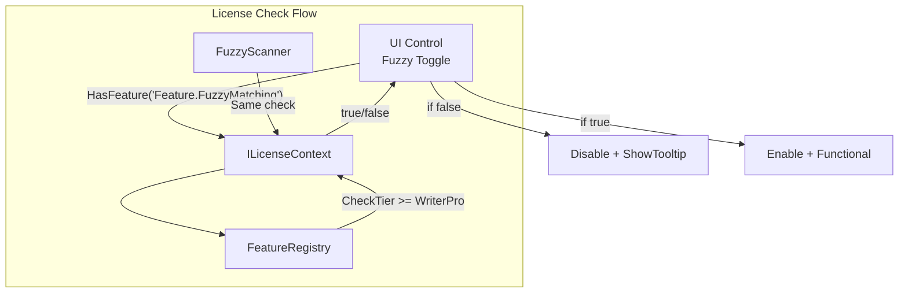
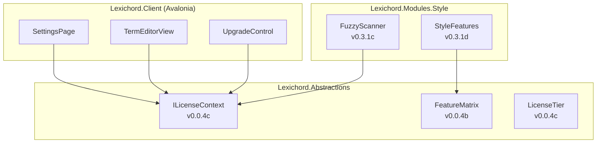

# LCS-01: Feature Design Composition

## 1. Metadata & Categorization

| Field                | Value                                         | Description                                 |
| :------------------- | :-------------------------------------------- | :------------------------------------------ |
| **Feature ID**       | `STY-031d`                                    | Style Module - Fuzzy License Gate           |
| **Feature Name**     | Fuzzy License Gating                          | UI/UX and feature gate implementation.      |
| **Target Version**   | `v0.3.1d`                                     | Algorithmic Analysis Phase (Sub-Part D).    |
| **Module Scope**     | `Lexichord.Modules.Style`, `Lexichord.Client` | Backend gate + UI indication.               |
| **Swimlane**         | `Governance`                                  | Style & Terminology Enforcement.            |
| **License Tier**     | `Writer Pro`                                  | Premium feature (Core users see UI hints).  |
| **Feature Gate Key** | `Feature.FuzzyMatching`                       | Key used in `ILicenseContext.HasFeature()`. |
| **Author**           | System Architect                              |                                             |
| **Reviewer**         | Lead Architect                                |                                             |
| **Status**           | **Draft**                                     | Pending approval.                           |
| **Last Updated**     | 2026-01-26                                    |                                             |

---

## 2. Executive Summary

### 2.1 The Requirement

The Fuzzy Engine (v0.3.1) is the **first feature with soft licensing**. Core users should:

1. See the fuzzy toggle in UI, but **disabled** with upgrade prompt.
2. Not receive fuzzy violations (scanner returns empty).
3. Not encounter any errors or degraded experience.

Writer Pro users should:

1. See the fuzzy toggle in UI, **enabled** and functional.
2. Receive fuzzy violations when terms are configured.
3. Be able to configure per-term fuzzy settings.

| User Tier  | Fuzzy Toggle State | Fuzzy Violations | Term Editor Fuzzy Fields |
| :--------- | :----------------- | :--------------- | :----------------------- |
| Core       | Disabled + Tooltip | ❌ None          | Disabled + Tooltip       |
| Writer Pro | Enabled            | ✅ Yes           | Enabled                  |
| Teams      | Enabled            | ✅ Yes           | Enabled                  |
| Enterprise | Enabled            | ✅ Yes           | Enabled                  |

### 2.2 The Proposed Solution

Implement a **soft gate** pattern:

1. **Backend:** `FuzzyScanner.ScanAsync()` returns empty if license < WriterPro (already done in v0.3.1c).
2. **Feature Registry:** Map `Feature.FuzzyMatching` → `LicenseTier.WriterPro` in the feature matrix.
3. **UI:** Disable fuzzy controls for Core users with upgrade tooltips.



---

## 3. Architecture & Modular Strategy

### 3.1 Component Diagram



### 3.2 File Structure After v0.3.1d

```text
src/Lexichord.Abstractions/
├── Licensing/
│   └── FeatureKeys.cs             # MODIFIED: Add FuzzyMatching key

src/Lexichord.Modules.Style/
├── Licensing/
│   └── StyleFeatureRegistry.cs    # NEW: Module-specific features

src/Lexichord.Client/
├── Controls/
│   └── UpgradePromptControl.axaml # NEW: Reusable upgrade prompt
├── Views/
│   ├── SettingsPage.axaml         # MODIFIED: Fuzzy toggle disabled
│   └── TermEditorView.axaml       # MODIFIED: Fuzzy fields disabled
├── Converters/
│   └── LicenseToEnabledConverter.cs # NEW: License-based enable
```

### 3.3 Dependencies

| Interface         | Source Version | Purpose                          |
| :---------------- | :------------- | :------------------------------- |
| `ILicenseContext` | v0.0.4c        | Read-only license tier access    |
| `LicenseTier`     | v0.0.4c        | Core/WriterPro/Teams/Enterprise  |
| `FeatureMatrix`   | v0.0.4b        | Feature → Tier mapping           |
| `FuzzyScanner`    | v0.3.1c        | Already implements license check |

---

## 4. Decision Trees

### 4.1 Feature Gate Decision

```text
START: "Should fuzzy matching feature be available?"
│
├── Get user's license tier from ILicenseContext
│
├── Lookup "Feature.FuzzyMatching" in FeatureMatrix
│   └── Required tier = WriterPro
│
├── Is user tier >= required tier?
│   ├── Core (0) >= WriterPro (1)?
│   │   └── NO → Feature DISABLED
│   ├── WriterPro (1) >= WriterPro (1)?
│   │   └── YES → Feature ENABLED
│   ├── Teams (2) >= WriterPro (1)?
│   │   └── YES → Feature ENABLED
│   └── Enterprise (3) >= WriterPro (1)?
│       └── YES → Feature ENABLED
│
└── Return enabled/disabled state
```

### 4.2 UI Control Behavior Decision

```text
START: "How should UI control behave for Core user?"
│
├── Is this a toggle/checkbox?
│   └── Disable + show lock icon + tooltip
│
├── Is this a numeric input (threshold)?
│   └── Disable + greyed out + tooltip
│
├── Is this a section header?
│   └── Add "PRO" badge + clickable upgrade link
│
└── Tooltip text: "Upgrade to Writer Pro to enable fuzzy matching"
```

---

## 5. Data Contracts

### 5.1 FeatureKeys Constants

```csharp
namespace Lexichord.Abstractions.Licensing;

/// <summary>
/// Constants for feature gate keys used across the application.
/// </summary>
/// <remarks>
/// LOGIC: Feature keys follow the pattern "{Category}.{Feature}".
/// These keys are used with ILicenseContext.HasFeature() to check
/// whether a feature is available for the current license tier.
/// </remarks>
public static class FeatureKeys
{
    // ═══════════════════════════════════════════════════════════════════
    // Style Module Features
    // ═══════════════════════════════════════════════════════════════════

    /// <summary>
    /// Fuzzy string matching for terminology detection.
    /// Requires: Writer Pro or higher.
    /// </summary>
    public const string FuzzyMatching = "Feature.FuzzyMatching";

    // Future features (v0.3.2+):
    // public const string CustomDictionary = "Feature.CustomDictionary";
    // public const string ReadabilityMetrics = "Feature.ReadabilityMetrics";
    // public const string VoiceProfile = "Feature.VoiceProfile";
}
```

### 5.2 StyleFeatureRegistry

```csharp
namespace Lexichord.Modules.Style.Licensing;

/// <summary>
/// Registers Style module features with their required license tiers.
/// </summary>
/// <remarks>
/// LOGIC: Called during module initialization to register features
/// in the global FeatureMatrix. This follows the modular pattern
/// where each module declares its own feature requirements.
/// </remarks>
public static class StyleFeatureRegistry
{
    /// <summary>
    /// Registers all Style module features.
    /// </summary>
    /// <param name="matrix">The feature matrix to register with.</param>
    public static void RegisterFeatures(IFeatureMatrix matrix)
    {
        ArgumentNullException.ThrowIfNull(matrix, nameof(matrix));

        // v0.3.1: Fuzzy Matching
        matrix.Register(
            featureKey: FeatureKeys.FuzzyMatching,
            requiredTier: LicenseTier.WriterPro,
            displayName: "Fuzzy Matching",
            description: "Detect typos and variations of forbidden terms.");

        // Future registrations...
    }
}
```

### 5.3 LicenseToEnabledConverter

```csharp
using System;
using System.Globalization;
using Avalonia.Data.Converters;
using Lexichord.Abstractions.Licensing;

namespace Lexichord.Client.Converters;

/// <summary>
/// Converts license tier check to enabled state for UI controls.
/// </summary>
/// <remarks>
/// LOGIC: Used in XAML bindings to enable/disable controls based on
/// whether the current license has a specific feature. The feature
/// key is passed as the ConverterParameter.
///
/// Example usage:
/// IsEnabled="{Binding LicenseContext,
///     Converter={StaticResource LicenseToEnabledConverter},
///     ConverterParameter='Feature.FuzzyMatching'}"
/// </remarks>
public class LicenseToEnabledConverter : IValueConverter
{
    /// <inheritdoc/>
    public object? Convert(object? value, Type targetType, object? parameter, CultureInfo culture)
    {
        // LOGIC: If no license context, default to disabled
        if (value is not ILicenseContext licenseContext)
            return false;

        // LOGIC: Parameter must be the feature key string
        if (parameter is not string featureKey)
            return false;

        return licenseContext.HasFeature(featureKey);
    }

    /// <inheritdoc/>
    public object? ConvertBack(object? value, Type targetType, object? parameter, CultureInfo culture)
    {
        throw new NotSupportedException("LicenseToEnabledConverter is one-way only.");
    }
}
```

---

## 6. Implementation Logic

### 6.1 UpgradePromptControl

```xml
<!-- src/Lexichord.Client/Controls/UpgradePromptControl.axaml -->
<UserControl xmlns="https://github.com/avaloniaui"
             xmlns:x="http://schemas.microsoft.com/winfx/2006/xaml"
             xmlns:local="clr-namespace:Lexichord.Client.Controls"
             x:Class="Lexichord.Client.Controls.UpgradePromptControl">

    <!-- LOGIC: Reusable upgrade prompt for gated features -->
    <Border Classes="upgrade-prompt"
            Background="{DynamicResource SystemAccentColorLight3}"
            BorderBrush="{DynamicResource SystemAccentColor}"
            BorderThickness="1"
            CornerRadius="4"
            Padding="12">

        <StackPanel Orientation="Horizontal" Spacing="8">
            <!-- Lock icon -->
            <PathIcon Data="{StaticResource LockIcon}"
                      Width="16" Height="16"
                      Foreground="{DynamicResource SystemAccentColor}" />

            <!-- Message -->
            <TextBlock Text="{Binding FeatureName, RelativeSource={RelativeSource AncestorType=local:UpgradePromptControl}}"
                       VerticalAlignment="Center" />

            <TextBlock Text="requires"
                       VerticalAlignment="Center"
                       Opacity="0.7" />

            <!-- Upgrade button -->
            <Button Classes="accent"
                    Content="{Binding RequiredTierName, RelativeSource={RelativeSource AncestorType=local:UpgradePromptControl}}"
                    Command="{Binding UpgradeCommand, RelativeSource={RelativeSource AncestorType=local:UpgradePromptControl}}"
                    Padding="8,4" />
        </StackPanel>
    </Border>
</UserControl>
```

```csharp
// src/Lexichord.Client/Controls/UpgradePromptControl.axaml.cs
using Avalonia;
using Avalonia.Controls;
using ReactiveUI;
using System.Reactive;
using System.Windows.Input;

namespace Lexichord.Client.Controls;

/// <summary>
/// Displays an upgrade prompt for gated features.
/// </summary>
/// <remarks>
/// LOGIC: This control is shown in place of disabled feature UI
/// to guide users toward upgrading their license tier.
/// </remarks>
public partial class UpgradePromptControl : UserControl
{
    public static readonly StyledProperty<string> FeatureNameProperty =
        AvaloniaProperty.Register<UpgradePromptControl, string>(
            nameof(FeatureName), "This feature");

    public static readonly StyledProperty<string> RequiredTierNameProperty =
        AvaloniaProperty.Register<UpgradePromptControl, string>(
            nameof(RequiredTierName), "Writer Pro");

    public static readonly StyledProperty<ICommand?> UpgradeCommandProperty =
        AvaloniaProperty.Register<UpgradePromptControl, ICommand?>(
            nameof(UpgradeCommand));

    public string FeatureName
    {
        get => GetValue(FeatureNameProperty);
        set => SetValue(FeatureNameProperty, value);
    }

    public string RequiredTierName
    {
        get => GetValue(RequiredTierNameProperty);
        set => SetValue(RequiredTierNameProperty, value);
    }

    public ICommand? UpgradeCommand
    {
        get => GetValue(UpgradeCommandProperty);
        set => SetValue(UpgradeCommandProperty, value);
    }

    public UpgradePromptControl()
    {
        InitializeComponent();
    }
}
```

### 6.2 SettingsPage Fuzzy Toggle (Modified)

```xml
<!-- In SettingsPage.axaml, modify the Fuzzy Matching section -->

<!-- LOGIC: Show upgrade prompt for Core users, toggle for Pro+ -->
<StackPanel Spacing="8">

    <TextBlock Classes="section-header" Text="Fuzzy Matching">
        <!-- PRO badge for Core users -->
        <TextBlock.Styles>
            <Style Selector="TextBlock.section-header">
                <Setter Property="FontWeight" Value="SemiBold" />
            </Style>
        </TextBlock.Styles>
    </TextBlock>

    <!-- Upgrade prompt (visible only for Core) -->
    <local:UpgradePromptControl
        FeatureName="Fuzzy Matching"
        RequiredTierName="Writer Pro"
        UpgradeCommand="{Binding OpenUpgradePageCommand}"
        IsVisible="{Binding !HasFuzzyMatchingFeature}" />

    <!-- Actual toggle (only enabled for Pro+) -->
    <StackPanel IsVisible="{Binding HasFuzzyMatchingFeature}" Spacing="4">
        <ToggleSwitch Content="Enable Fuzzy Matching"
                      IsChecked="{Binding EnableFuzzyMatching}"
                      ToolTip.Tip="Detect typos and variations of forbidden terms" />

        <TextBlock Classes="hint"
                   Text="Detects variations like 'white-list' when 'whitelist' is a forbidden term."
                   Opacity="0.7" />
    </StackPanel>

</StackPanel>
```

### 6.3 SettingsViewModel Updates

```csharp
// In SettingsViewModel.cs, add:

/// <summary>
/// Whether the current license includes fuzzy matching.
/// </summary>
/// <remarks>
/// LOGIC: Used by UI to show/hide upgrade prompts and enable controls.
/// </remarks>
[Reactive]
public bool HasFuzzyMatchingFeature { get; private set; }

/// <summary>
/// Global toggle for fuzzy matching (only effective if licensed).
/// </summary>
[Reactive]
public bool EnableFuzzyMatching { get; set; }

/// <summary>
/// Navigates to the upgrade page.
/// </summary>
public ReactiveCommand<Unit, Unit> OpenUpgradePageCommand { get; }

public SettingsViewModel(
    ILicenseContext licenseContext,
    INavigationService navigation,
    ILogger<SettingsViewModel> logger)
{
    _licenseContext = licenseContext;
    _navigation = navigation;
    _logger = logger;

    // LOGIC: Check license on construction
    HasFuzzyMatchingFeature = licenseContext.HasFeature(FeatureKeys.FuzzyMatching);

    // LOGIC: Subscribe to license changes
    licenseContext.LicenseChanged
        .Subscribe(_ => UpdateFeatureFlags())
        .DisposeWith(_disposables);

    OpenUpgradePageCommand = ReactiveCommand.Create(
        () => _navigation.NavigateTo("upgrade"),
        outputScheduler: RxApp.MainThreadScheduler);

    _logger.LogDebug(
        "Settings initialized: FuzzyMatchingAvailable={Available}",
        HasFuzzyMatchingFeature);
}

private void UpdateFeatureFlags()
{
    HasFuzzyMatchingFeature = _licenseContext.HasFeature(FeatureKeys.FuzzyMatching);

    _logger.LogInformation(
        "License changed: FuzzyMatchingAvailable={Available}",
        HasFuzzyMatchingFeature);
}
```

### 6.4 TermEditorView Fuzzy Fields (Modified)

```xml
<!-- In TermEditorView.axaml, modify the fuzzy configuration section -->

<!-- LOGIC: Fuzzy settings group, disabled for Core users -->
<GroupBox Header="Fuzzy Matching Settings"
          IsEnabled="{Binding HasFuzzyMatchingFeature}">

    <StackPanel Spacing="12">

        <!-- Enable fuzzy for this term -->
        <CheckBox Content="Enable fuzzy matching for this term"
                  IsChecked="{Binding FuzzyEnabled}"
                  ToolTip.Tip="{Binding FuzzyEnabledTooltip}" />

        <!-- Threshold slider (only when fuzzy enabled) -->
        <StackPanel IsVisible="{Binding FuzzyEnabled}" Spacing="4">

            <TextBlock Text="Match Threshold" />

            <Grid ColumnDefinitions="*,Auto">
                <Slider Minimum="50" Maximum="100"
                        Value="{Binding FuzzyThresholdPercent}"
                        TickFrequency="5"
                        IsSnapToTickEnabled="True" />

                <TextBlock Grid.Column="1"
                           Text="{Binding FuzzyThresholdPercent, StringFormat={}{0}%}"
                           Width="40"
                           TextAlignment="Right" />
            </Grid>

            <TextBlock Classes="hint"
                       Opacity="0.7">
                <TextBlock.Text>
                    <MultiBinding StringFormat="Words matching at least {0}% will be flagged.">
                        <Binding Path="FuzzyThresholdPercent" />
                    </MultiBinding>
                </TextBlock.Text>
            </TextBlock>
        </StackPanel>

        <!-- Upgrade prompt for Core users -->
        <local:UpgradePromptControl
            FeatureName="Fuzzy Matching"
            RequiredTierName="Writer Pro"
            UpgradeCommand="{Binding OpenUpgradePageCommand}"
            IsVisible="{Binding !HasFuzzyMatchingFeature}" />

    </StackPanel>
</GroupBox>
```

### 6.5 TermEditorViewModel Updates

```csharp
// In TermEditorViewModel.cs, add:

/// <summary>
/// Whether fuzzy matching is available for configuration.
/// </summary>
[Reactive]
public bool HasFuzzyMatchingFeature { get; private set; }

/// <summary>
/// Whether fuzzy matching is enabled for this term.
/// </summary>
[Reactive]
public bool FuzzyEnabled { get; set; }

/// <summary>
/// Fuzzy threshold as percentage (50-100).
/// </summary>
[Reactive]
public int FuzzyThresholdPercent { get; set; } = 80;

/// <summary>
/// Tooltip for fuzzy enabled checkbox.
/// </summary>
public string FuzzyEnabledTooltip => HasFuzzyMatchingFeature
    ? "Enable approximate matching for typos and variations."
    : "Upgrade to Writer Pro to enable fuzzy matching.";

public TermEditorViewModel(
    ILicenseContext licenseContext,
    ITerminologyRepository repository,
    ILogger<TermEditorViewModel> logger)
{
    _licenseContext = licenseContext;
    _repository = repository;
    _logger = logger;

    HasFuzzyMatchingFeature = licenseContext.HasFeature(FeatureKeys.FuzzyMatching);

    // LOGIC: Ensure FuzzyEnabled stays false if not licensed
    this.WhenAnyValue(x => x.FuzzyEnabled)
        .Where(_ => !HasFuzzyMatchingFeature && FuzzyEnabled)
        .Subscribe(_ =>
        {
            FuzzyEnabled = false;
            _logger.LogDebug("Prevented fuzzy enable without license");
        })
        .DisposeWith(_disposables);
}

/// <summary>
/// Loads term data into view model.
/// </summary>
public void LoadTerm(StyleTerm term)
{
    // ... existing property mappings ...

    FuzzyEnabled = term.FuzzyEnabled;
    FuzzyThresholdPercent = (int)(term.FuzzyThreshold * 100);

    _logger.LogDebug(
        "Loaded term {TermId}: FuzzyEnabled={Enabled}, Threshold={Threshold}%",
        term.Id, FuzzyEnabled, FuzzyThresholdPercent);
}

/// <summary>
/// Saves view model data to term entity.
/// </summary>
public StyleTerm ToEntity()
{
    return _baseTerm with
    {
        // ... existing property mappings ...

        // LOGIC: Only save fuzzy settings if licensed
        FuzzyEnabled = HasFuzzyMatchingFeature && FuzzyEnabled,
        FuzzyThreshold = FuzzyThresholdPercent / 100.0
    };
}
```

### 6.6 StyleModule Registration Updates

```csharp
// In StyleModule.cs, update ConfigureServices:

public void ConfigureServices(IServiceCollection services)
{
    // ... existing registrations ...

    // v0.3.1d: Register feature in matrix
    services.AddSingleton<IModuleFeatureRegistrar, StyleFeatureRegistrar>();
}

/// <summary>
/// Registers Style module features during app startup.
/// </summary>
internal sealed class StyleFeatureRegistrar(IFeatureMatrix matrix, ILogger<StyleFeatureRegistrar> logger)
    : IModuleFeatureRegistrar
{
    public void Register()
    {
        StyleFeatureRegistry.RegisterFeatures(matrix);

        logger.LogInformation(
            "Registered Style module feature: {Feature} → {Tier}",
            FeatureKeys.FuzzyMatching,
            LicenseTier.WriterPro);
    }
}
```

---

## 7. Use Cases & User Stories

### 7.1 User Stories

| ID    | Role            | Story                                                                     | Acceptance Criteria                          |
| :---- | :-------------- | :------------------------------------------------------------------------ | :------------------------------------------- |
| US-01 | Core User       | As a free user, I see that fuzzy matching exists but requires an upgrade. | Toggle disabled with upgrade prompt.         |
| US-02 | Core User       | As a free user, I can click to learn about upgrading.                     | Upgrade button opens upgrade page.           |
| US-03 | Writer Pro User | As a paid user, I can enable/disable fuzzy matching globally.             | Toggle works in Settings.                    |
| US-04 | Writer Pro User | As a paid user, I can configure fuzzy settings per term.                  | Term Editor shows fuzzy fields enabled.      |
| US-05 | Developer       | As a developer, I want feature checks to be centralized.                  | All checks use `ILicenseContext.HasFeature`. |
| US-06 | Developer       | As a developer, I want easy-to-add feature gates for future features.     | `StyleFeatureRegistry` pattern established.  |

### 7.2 Use Cases

#### UC-01: Core User Views Fuzzy Settings

**Preconditions:**

- User has Core (free) license.
- User opens Settings page.

**Flow:**

1. User navigates to Settings → Style → Fuzzy Matching section.
2. UI checks `licenseContext.HasFeature("Feature.FuzzyMatching")`.
3. Returns false (Core tier).
4. Toggle is hidden; Upgrade prompt is shown.
5. Prompt displays: "Fuzzy Matching requires Writer Pro".
6. User clicks "Writer Pro" button.
7. Navigation opens upgrade page.

**Postconditions:**

- User sees clear upgrade path.
- No error messages.
- Feature remains unavailable.

---

#### UC-02: Writer Pro User Configures Fuzzy Term

**Preconditions:**

- User has Writer Pro license.
- User opens Term Editor for "whitelist" term.

**Flow:**

1. User opens Term Editor.
2. UI checks `licenseContext.HasFeature("Feature.FuzzyMatching")`.
3. Returns true (Writer Pro tier).
4. "Fuzzy Matching Settings" group is enabled.
5. User checks "Enable fuzzy matching for this term".
6. User adjusts threshold slider to 85%.
7. User clicks Save.
8. `TermEditorViewModel.ToEntity()` creates term with:
    - `FuzzyEnabled = true`
    - `FuzzyThreshold = 0.85`
9. Repository saves updated term.

**Postconditions:**

- Term saved with fuzzy settings.
- Fuzzy scanner will use this term.

---

#### UC-03: User Upgrades Mid-Session

**Preconditions:**

- User starts session with Core license.
- Settings page is open.
- User upgrades to Writer Pro in another tab.

**Flow:**

1. User is on Settings page with upgrade prompt visible.
2. User completes purchase in browser.
3. License service receives webhook notification.
4. License service emits `LicenseChanged` event.
5. `SettingsViewModel` handles event.
6. Calls `UpdateFeatureFlags()`.
7. `HasFuzzyMatchingFeature` becomes true.
8. UI reactively updates:
    - Upgrade prompt hides.
    - Fuzzy toggle appears and is enabled.

**Postconditions:**

- No page refresh needed.
- Feature immediately available.

---

## 8. Unit Testing Requirements

### 8.1 LicenseToEnabledConverter Tests

```csharp
using FluentAssertions;
using Lexichord.Abstractions.Licensing;
using Lexichord.Client.Converters;
using Moq;
using Xunit;

namespace Lexichord.Tests.Unit.Converters;

[Trait("Category", "Unit")]
[Trait("Feature", "Licensing")]
public class LicenseToEnabledConverterTests
{
    private readonly LicenseToEnabledConverter _sut = new();

    [Fact]
    public void Convert_WithFeature_ReturnsTrue()
    {
        // Arrange
        var mockContext = new Mock<ILicenseContext>();
        mockContext.Setup(c => c.HasFeature("Feature.FuzzyMatching")).Returns(true);

        // Act
        var result = _sut.Convert(mockContext.Object, typeof(bool), "Feature.FuzzyMatching", null!);

        // Assert
        result.Should().Be(true);
    }

    [Fact]
    public void Convert_WithoutFeature_ReturnsFalse()
    {
        // Arrange
        var mockContext = new Mock<ILicenseContext>();
        mockContext.Setup(c => c.HasFeature("Feature.FuzzyMatching")).Returns(false);

        // Act
        var result = _sut.Convert(mockContext.Object, typeof(bool), "Feature.FuzzyMatching", null!);

        // Assert
        result.Should().Be(false);
    }

    [Fact]
    public void Convert_NullContext_ReturnsFalse()
    {
        var result = _sut.Convert(null, typeof(bool), "Feature.FuzzyMatching", null!);
        result.Should().Be(false);
    }

    [Fact]
    public void Convert_NullParameter_ReturnsFalse()
    {
        var mockContext = new Mock<ILicenseContext>();
        var result = _sut.Convert(mockContext.Object, typeof(bool), null, null!);
        result.Should().Be(false);
    }
}
```

### 8.2 StyleFeatureRegistry Tests

```csharp
using FluentAssertions;
using Lexichord.Abstractions.Licensing;
using Lexichord.Modules.Style.Licensing;
using Moq;
using Xunit;

namespace Lexichord.Tests.Unit.Licensing;

[Trait("Category", "Unit")]
[Trait("Feature", "Licensing")]
public class StyleFeatureRegistryTests
{
    [Fact]
    public void RegisterFeatures_RegistersFuzzyMatching()
    {
        // Arrange
        var mockMatrix = new Mock<IFeatureMatrix>();

        // Act
        StyleFeatureRegistry.RegisterFeatures(mockMatrix.Object);

        // Assert
        mockMatrix.Verify(m => m.Register(
            FeatureKeys.FuzzyMatching,
            LicenseTier.WriterPro,
            It.IsAny<string>(),
            It.IsAny<string>()),
            Times.Once);
    }

    [Fact]
    public void RegisterFeatures_NullMatrix_Throws()
    {
        var act = () => StyleFeatureRegistry.RegisterFeatures(null!);
        act.Should().Throw<ArgumentNullException>();
    }
}
```

### 8.3 SettingsViewModel License Tests

```csharp
using FluentAssertions;
using Lexichord.Abstractions.Licensing;
using Lexichord.Client.ViewModels;
using Microsoft.Extensions.Logging.Abstractions;
using Moq;
using System.Reactive.Subjects;
using Xunit;

namespace Lexichord.Tests.Unit.ViewModels;

[Trait("Category", "Unit")]
[Trait("Feature", "Licensing")]
public class SettingsViewModelLicenseTests
{
    [Fact]
    public void Constructor_CoreLicense_FuzzyMatchingDisabled()
    {
        // Arrange
        var mockLicense = new Mock<ILicenseContext>();
        mockLicense.Setup(l => l.HasFeature(FeatureKeys.FuzzyMatching)).Returns(false);
        mockLicense.Setup(l => l.LicenseChanged).Returns(new Subject<Unit>());

        // Act
        var sut = new SettingsViewModel(
            mockLicense.Object,
            Mock.Of<INavigationService>(),
            NullLogger<SettingsViewModel>.Instance);

        // Assert
        sut.HasFuzzyMatchingFeature.Should().BeFalse();
    }

    [Fact]
    public void Constructor_ProLicense_FuzzyMatchingEnabled()
    {
        // Arrange
        var mockLicense = new Mock<ILicenseContext>();
        mockLicense.Setup(l => l.HasFeature(FeatureKeys.FuzzyMatching)).Returns(true);
        mockLicense.Setup(l => l.LicenseChanged).Returns(new Subject<Unit>());

        // Act
        var sut = new SettingsViewModel(
            mockLicense.Object,
            Mock.Of<INavigationService>(),
            NullLogger<SettingsViewModel>.Instance);

        // Assert
        sut.HasFuzzyMatchingFeature.Should().BeTrue();
    }

    [Fact]
    public void LicenseChanged_UpdatesFeatureFlags()
    {
        // Arrange
        var licenseChangedSubject = new Subject<Unit>();
        var mockLicense = new Mock<ILicenseContext>();
        mockLicense.Setup(l => l.HasFeature(FeatureKeys.FuzzyMatching)).Returns(false);
        mockLicense.Setup(l => l.LicenseChanged).Returns(licenseChangedSubject);

        var sut = new SettingsViewModel(
            mockLicense.Object,
            Mock.Of<INavigationService>(),
            NullLogger<SettingsViewModel>.Instance);

        // Initial state
        sut.HasFuzzyMatchingFeature.Should().BeFalse();

        // Simulate license upgrade
        mockLicense.Setup(l => l.HasFeature(FeatureKeys.FuzzyMatching)).Returns(true);

        // Act
        licenseChangedSubject.OnNext(Unit.Default);

        // Assert
        sut.HasFuzzyMatchingFeature.Should().BeTrue();
    }
}
```

### 8.4 TermEditorViewModel License Tests

```csharp
using FluentAssertions;
using Lexichord.Abstractions.Entities;
using Lexichord.Abstractions.Licensing;
using Lexichord.Client.ViewModels;
using Microsoft.Extensions.Logging.Abstractions;
using Moq;
using Xunit;

namespace Lexichord.Tests.Unit.ViewModels;

[Trait("Category", "Unit")]
[Trait("Feature", "Licensing")]
public class TermEditorViewModelLicenseTests
{
    [Fact]
    public void ToEntity_CoreUser_FuzzyAlwaysFalse()
    {
        // Arrange
        var mockLicense = new Mock<ILicenseContext>();
        mockLicense.Setup(l => l.HasFeature(FeatureKeys.FuzzyMatching)).Returns(false);

        var sut = new TermEditorViewModel(
            mockLicense.Object,
            Mock.Of<ITerminologyRepository>(),
            NullLogger<TermEditorViewModel>.Instance);

        sut.LoadTerm(new StyleTerm { Id = Guid.NewGuid(), Pattern = "test" });

        // Try to enable fuzzy (shouldn't persist)
        sut.FuzzyEnabled = true;

        // Act
        var entity = sut.ToEntity();

        // Assert
        entity.FuzzyEnabled.Should().BeFalse();
    }

    [Fact]
    public void ToEntity_ProUser_FuzzyRespected()
    {
        // Arrange
        var mockLicense = new Mock<ILicenseContext>();
        mockLicense.Setup(l => l.HasFeature(FeatureKeys.FuzzyMatching)).Returns(true);

        var sut = new TermEditorViewModel(
            mockLicense.Object,
            Mock.Of<ITerminologyRepository>(),
            NullLogger<TermEditorViewModel>.Instance);

        sut.LoadTerm(new StyleTerm { Id = Guid.NewGuid(), Pattern = "test" });
        sut.FuzzyEnabled = true;
        sut.FuzzyThresholdPercent = 85;

        // Act
        var entity = sut.ToEntity();

        // Assert
        entity.FuzzyEnabled.Should().BeTrue();
        entity.FuzzyThreshold.Should().Be(0.85);
    }
}
```

---

## 9. Observability & Logging

### 9.1 Log Events

| Level | Source                | Message Template                                                       |
| :---- | :-------------------- | :--------------------------------------------------------------------- |
| Debug | SettingsViewModel     | `Settings initialized: FuzzyMatchingAvailable={Available}`             |
| Info  | SettingsViewModel     | `License changed: FuzzyMatchingAvailable={Available}`                  |
| Debug | TermEditorViewModel   | `Loaded term {TermId}: FuzzyEnabled={Enabled}, Threshold={Threshold}%` |
| Debug | TermEditorViewModel   | `Prevented fuzzy enable without license`                               |
| Info  | StyleFeatureRegistrar | `Registered Style module feature: {Feature} → {Tier}`                  |
| Debug | UpgradePromptControl  | `Upgrade prompt clicked for feature: {Feature}`                        |

### 9.2 Analytics Events

- `feature.upgrade_prompt.shown` — When upgrade prompt displayed.
- `feature.upgrade_prompt.clicked` — When user clicks upgrade button.
- `feature.fuzzy_matching.enabled` — When Pro user enables fuzzy.
- `feature.fuzzy_matching.configured` — When Pro user saves fuzzy term.

---

## 10. Security & Safety

### 10.1 Risk Assessment

| Risk                      | Level | Mitigation                                       |
| :------------------------ | :---- | :----------------------------------------------- |
| License bypass in UI      | Low   | Double-check in `ToEntity()` before save.        |
| License bypass in backend | Low   | `FuzzyScanner.ScanAsync()` checks independently. |
| Stale license state       | Low   | Subscribe to `LicenseChanged` observable.        |
| UI reveals Pro features   | None  | Features visible but clearly marked as gated.    |

### 10.2 Defense in Depth

1. **UI Layer:** Controls disabled via `HasFuzzyMatchingFeature` binding.
2. **ViewModel Layer:** `ToEntity()` forces `FuzzyEnabled = false` for Core.
3. **Service Layer:** `FuzzyScanner.ScanAsync()` returns empty for Core.
4. **Database Layer:** Terms may have `FuzzyEnabled = true` but won't be queried without license.

---

## 11. Risks & Mitigations

| Risk                             | Impact | Mitigation                                              |
| :------------------------------- | :----- | :------------------------------------------------------ |
| License check adds latency       | Low    | Cache tier in `ILicenseContext`; check is O(1).         |
| Upgrade prompt is annoying       | Medium | Show once per section, not per control; subtle styling. |
| Users game license by editing DB | Low    | Triple-check at UI, ViewModel, and Service layers.      |
| Feature matrix grows unwieldy    | Low    | Per-module registration pattern keeps it organized.     |

---

## 12. Acceptance Criteria (QA)

| #   | Category          | Criterion                                                   |
| :-- | :---------------- | :---------------------------------------------------------- |
| 1   | **[Registry]**    | `FeatureKeys.FuzzyMatching` constant exists.                |
| 2   | **[Registry]**    | `StyleFeatureRegistry` registers fuzzy feature → WriterPro. |
| 3   | **[Converter]**   | `LicenseToEnabledConverter` returns false for Core.         |
| 4   | **[Converter]**   | `LicenseToEnabledConverter` returns true for WriterPro+.    |
| 5   | **[Settings UI]** | Core user sees upgrade prompt, not toggle.                  |
| 6   | **[Settings UI]** | Pro user sees functional toggle.                            |
| 7   | **[Term Editor]** | Core user sees disabled fuzzy fields + upgrade prompt.      |
| 8   | **[Term Editor]** | Pro user sees enabled fuzzy fields.                         |
| 9   | **[Save Logic]**  | Core user cannot save `FuzzyEnabled = true` on terms.       |
| 10  | **[Save Logic]**  | Pro user can save `FuzzyEnabled = true` on terms.           |
| 11  | **[Live Update]** | License upgrade mid-session updates UI without refresh.     |
| 12  | **[Upgrade]**     | Clicking upgrade button navigates to upgrade page.          |
| 13  | **[Build]**       | Solution builds with no errors or warnings.                 |
| 14  | **[Tests]**       | All unit tests pass.                                        |

---

## 13. Verification Commands

```bash
# ═══════════════════════════════════════════════════════════════════════════
# v0.3.1d Verification
# ═══════════════════════════════════════════════════════════════════════════

# 1. Build solution
dotnet build --configuration Release
# Expected: No errors or warnings

# 2. Verify new files exist
test -f src/Lexichord.Abstractions/Licensing/FeatureKeys.cs && echo "✓ FeatureKeys exists"
test -f src/Lexichord.Modules.Style/Licensing/StyleFeatureRegistry.cs && echo "✓ StyleFeatureRegistry exists"
test -f src/Lexichord.Client/Converters/LicenseToEnabledConverter.cs && echo "✓ Converter exists"
test -f src/Lexichord.Client/Controls/UpgradePromptControl.axaml && echo "✓ UpgradePromptControl exists"

# 3. Run unit tests
dotnet test tests/Lexichord.Tests.Unit \
  --filter "Feature=Licensing" \
  --verbosity normal
# Expected: All tests pass

# 4. Manual verification (Core user):
# a) Start app with Core license
# b) Open Settings → Style
# c) Verify: Fuzzy Matching section shows upgrade prompt
# d) Click "Writer Pro" button
# e) Verify: Navigates to upgrade page

# 5. Manual verification (Writer Pro user):
# a) Start app with Writer Pro license
# b) Open Settings → Style
# c) Verify: Fuzzy Matching toggle is visible and enabled
# d) Toggle ON
# e) Verify: Setting persists

# 6. Manual verification (Term Editor - Core):
# a) Start app with Core license
# b) Edit any term
# c) Verify: "Fuzzy Matching Settings" group is disabled
# d) Verify: Upgrade prompt visible in group

# 7. Manual verification (Term Editor - Pro):
# a) Start app with Writer Pro license
# b) Edit any term
# c) Verify: "Fuzzy Matching Settings" group is enabled
# d) Check "Enable fuzzy matching"
# e) Adjust threshold slider
# f) Save
# g) Re-open term, verify settings persisted

# 8. Manual verification (Live license update):
# a) Start app with Core license
# b) Open Settings page
# c) Upgrade license via API/admin tool
# d) Verify: UI updates without refresh (toggle appears)
```

---

## 14. Deliverable Checklist

| Step | Description                                                       | Status |
| :--- | :---------------------------------------------------------------- | :----- |
| 1    | `FeatureKeys.FuzzyMatching` constant in `Lexichord.Abstractions`. | [ ]    |
| 2    | `StyleFeatureRegistry.RegisterFeatures()` implementation.         | [ ]    |
| 3    | `StyleFeatureRegistrar` registered in `StyleModule.cs`.           | [ ]    |
| 4    | `LicenseToEnabledConverter` in `Lexichord.Client.Converters`.     | [ ]    |
| 5    | `UpgradePromptControl` AXAML and code-behind.                     | [ ]    |
| 6    | `SettingsPage.axaml` updated with fuzzy gating.                   | [ ]    |
| 7    | `SettingsViewModel` with `HasFuzzyMatchingFeature` property.      | [ ]    |
| 8    | `SettingsViewModel` subscribes to `LicenseChanged`.               | [ ]    |
| 9    | `TermEditorView.axaml` updated with fuzzy gating.                 | [ ]    |
| 10   | `TermEditorViewModel` with fuzzy properties.                      | [ ]    |
| 11   | `TermEditorViewModel.ToEntity()` enforces license check.          | [ ]    |
| 12   | Unit tests for `LicenseToEnabledConverter`.                       | [ ]    |
| 13   | Unit tests for `StyleFeatureRegistry`.                            | [ ]    |
| 14   | Unit tests for `SettingsViewModel` license behavior.              | [ ]    |
| 15   | Unit tests for `TermEditorViewModel` license behavior.            | [ ]    |
| 16   | Solution builds without warnings.                                 | [ ]    |
| 17   | All tests pass.                                                   | [ ]    |

---

## 15. Changelog Entry

```markdown
## [v0.3.1d] - 2026-01-XX

### Added

- `FeatureKeys.FuzzyMatching` constant for centralized feature key
- `StyleFeatureRegistry` for module-specific feature registration
- `StyleFeatureRegistrar` DI registration pattern
- `LicenseToEnabledConverter` for XAML license-based bindings
- `UpgradePromptControl` reusable upgrade prompt component
- License-reactive `HasFuzzyMatchingFeature` in ViewModels
- License change subscription for live UI updates

### Changed

- `SettingsPage` shows upgrade prompt for Core users, toggle for Pro+
- `TermEditorView` disables fuzzy fields for Core users
- `TermEditorViewModel.ToEntity()` enforces license on save
- `StyleModule` registers feature via `IModuleFeatureRegistrar`

### Technical Notes

- Defense-in-depth: License checked at UI, ViewModel, and Service layers
- Live license updates via `ILicenseContext.LicenseChanged` observable
- Upgrade prompt pattern reusable for future gated features (v0.3.2+)
```
