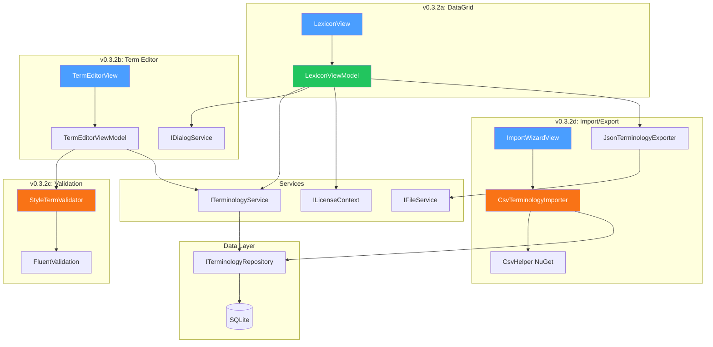
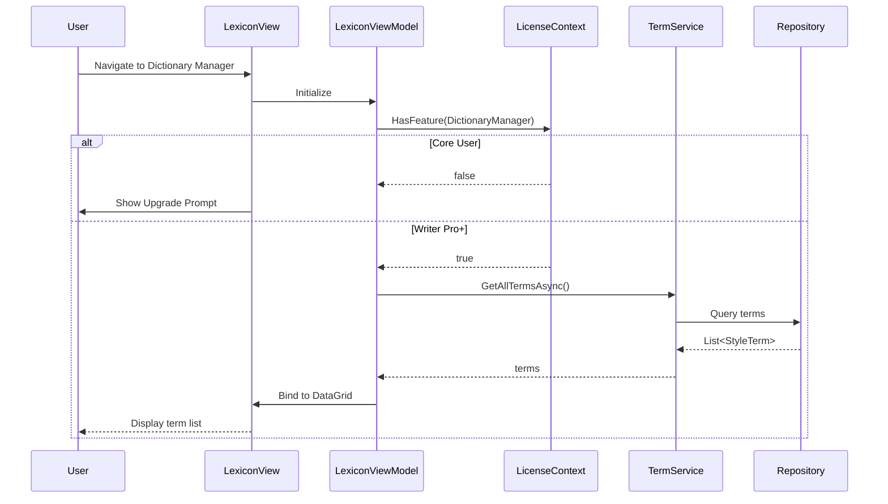

# LCS-DES-032: Design Specification Index — The Dictionary Manager

## Document Control

| Field | Value |
| :--- | :--- |
| **Document ID** | LCS-DES-032-INDEX |
| **Feature ID** | STY-032 |
| **Feature Name** | The Dictionary Manager (CRUD UI) |
| **Target Version** | v0.3.2 |
| **Module Scope** | Lexichord.Modules.Style |
| **Swimlane** | Governance |
| **License Tier** | Writer Pro |
| **Feature Gate Key** | `Feature.DictionaryManager` |
| **Status** | Draft |
| **Last Updated** | 2026-01-26 |

---

## 1. Executive Summary

**v0.3.2** delivers the **Dictionary Manager** — a complete CRUD interface for managing the terminology lexicon. This release transforms Lexichord from a developer-configured tool into a user-manageable platform where writers can create, edit, import, and export their style terms.

### 1.1 The Problem

Users need a visual interface to manage the terminology lexicon. Currently, terms can only be modified through:

- Direct database access (developer-only)
- Seed data modifications (requires rebuild)

| User Need | Current Status | Expected Behavior |
| :--- | :--- | :--- |
| View all terms | Not possible | DataGrid with search/filter |
| Add new term | Database SQL | Modal dialog |
| Edit existing term | Database SQL | Modal dialog |
| Delete term | Database SQL | Confirmation dialog |
| Bulk import from CSV | Not possible | Import wizard |
| Export terms | Not possible | JSON/CSV export |

### 1.2 The Solution

Implement a Dictionary Manager UI with four sub-parts:

1. **v0.3.2a: DataGrid Infrastructure** — `LexiconView` with sorting, filtering, and virtualization
2. **v0.3.2b: Term Editor Dialog** — Modal CRUD dialog with all term fields
3. **v0.3.2c: Validation Logic** — FluentValidation rules for term integrity
4. **v0.3.2d: Bulk Import/Export** — CSV import wizard and JSON export

### 1.3 Business Value

| Value | Description |
| :--- | :--- |
| **Self-Service** | Users manage terminology without developer intervention |
| **Data Integrity** | Validation prevents invalid patterns from being saved |
| **Bulk Operations** | Import from CSV for large terminology migrations |
| **Portability** | Export to JSON for backup and sharing |
| **Foundation** | Enables Voice Profiler (v0.3.4) and Resonance Dashboard (v0.3.5) configuration |

---

## 2. Related Documents

### 2.1 Scope Breakdown Document

The detailed scope breakdown for v0.3.2, including all sub-parts, implementation checklists, user stories, and acceptance criteria:

| Document | Description |
| :--- | :--- |
| **[LCS-SBD-032](./LCS-SBD-032.md)** | Scope Breakdown — The Dictionary Manager |

### 2.2 Sub-Part Design Specifications

Each sub-part has its own detailed design specification following the LDS-01 template:

| Sub-Part | Document | Title | Description |
| :--- | :--- | :--- | :--- |
| v0.3.2a | **[LCS-DES-032a](./LCS-DES-032a.md)** | DataGrid Infrastructure | LexiconView with sorting, filtering |
| v0.3.2b | **[LCS-DES-032b](./LCS-DES-032b.md)** | Term Editor Dialog | Modal CRUD dialog |
| v0.3.2c | **[LCS-DES-032c](./LCS-DES-032c.md)** | Validation Logic | FluentValidation rules |
| v0.3.2d | **[LCS-DES-032d](./LCS-DES-032d.md)** | Bulk Import/Export | CSV import and JSON export |

### 2.3 Overall Design Specification

| Document | Description |
| :--- | :--- |
| **[LCS-INF-032](./LCS-INF-032.md)** | Combined Design Specification (legacy format) |

---

## 3. Architecture Overview

### 3.1 Component Diagram



### 3.2 Data Flow



---

## 4. Dependencies

### 4.1 Upstream Dependencies (Required)

| Interface | Source Version | Purpose |
| :--- | :--- | :--- |
| `StyleTerm` | v0.2.2a | Entity model for terminology |
| `ITerminologyRepository` | v0.2.2b | Database access for terms |
| `ITerminologyService` | v0.2.2d | CRUD operations with events |
| `ILicenseContext` | v0.0.4c | Read-only license tier access |
| `LicenseTier` | v0.0.4c | Core/WriterPro/Teams/Enterprise enum |
| `RuleCategory` | v0.2.1b | Terminology/Formatting/Syntax enum |
| `ViolationSeverity` | v0.2.1b | Error/Warning/Info/Hint enum |
| `IFileService` | v0.1.4b | File picker dialogs |
| `LexiconChangedEvent` | v0.2.2d | MediatR notification for term changes |
| `ViewModelBase` | v0.1.1 | Base ViewModel class |
| `Feature.FuzzyMatching` | v0.3.1d | Fuzzy feature gate key |

### 4.2 NuGet Packages

| Package | Version | Purpose |
| :--- | :--- | :--- |
| `CsvHelper` | 31.x | CSV parsing and column mapping |
| `FluentValidation` | 11.9.x | Input validation (existing) |
| `Avalonia.Controls.DataGrid` | 11.x | DataGrid control (existing) |
| `CommunityToolkit.Mvvm` | 8.x | MVVM source generators (existing) |
| `System.Reactive` | 6.x | Debounced filter stream (existing) |

### 4.3 Downstream Consumers (Future)

| Version | Feature | Consumes |
| :--- | :--- | :--- |
| v0.3.4 | Voice Profiler | Term management via Dictionary Manager |
| v0.3.5 | Resonance Dashboard | Term configuration interface |
| v0.3.6 | Global Dictionary | Extended import/export formats |

---

## 5. License Gating Strategy

The Dictionary Manager is a **Writer Pro** feature using a **Soft Gate** strategy.

### 5.1 Behavior by License Tier

| Tier | LexiconView | Term Editor | Import/Export | Fuzzy Controls |
| :--- | :--- | :--- | :--- | :--- |
| Core | Upgrade prompt | N/A | N/A | Disabled |
| Writer Pro | Full access | Full access | Full access | Enabled |
| Teams | Full access | Full access | Full access | Enabled |
| Enterprise | Full access | Full access | Full access | Enabled |

### 5.2 Implementation Pattern

```csharp
public bool HasWriterPro => _licenseContext.HasFeature(Feature.DictionaryManager);

// In LexiconView.axaml - show upgrade prompt for Core users
<Panel IsVisible="{Binding !HasWriterPro}">
    <!-- Upgrade prompt panel -->
</Panel>
<DataGrid IsVisible="{Binding HasWriterPro}" ... />
```

---

## 6. UI/UX Overview

### 6.1 LexiconView Layout

```
┌───────────────────────────────────────────────────────────────────┐
│  Lexicon Manager                            [Import] [Export ▼]    │ ← Toolbar
├───────────────────────────────────────────────────────────────────┤
│  ┌─────────────────────────────────────────────────────────────┐  │
│  │ 🔍 Filter terms...                                          │  │ ← Filter
│  └─────────────────────────────────────────────────────────────┘  │
├───────────────────────────────────────────────────────────────────┤
│  Term ▲         │ Category    │ Severity │ Tags      │ Fuzzy     │ ← Headers
├───────────────────────────────────────────────────────────────────┤
│  whitelist      │ Terminology │ Error    │ inclusive │ ✓ 80%     │
│  blacklist      │ Terminology │ Error    │ inclusive │ ✓ 80%     │
│  master/slave   │ Terminology │ Warning  │ inclusive │           │
├───────────────────────────────────────────────────────────────────┤
│  Showing 45 of 128 terms                          [+ Add Term]    │ ← Footer
└───────────────────────────────────────────────────────────────────┘
```

### 6.2 Term Editor Dialog

```
┌─────────────────────────────────────────────┐
│  Edit Term                              [X] │
├─────────────────────────────────────────────┤
│  Pattern*        [whitelist____________]    │
│  □ Use Regular Expression                   │
│                                             │
│  Recommendation* [allowlist____________]    │
│                                             │
│  Category        [Terminology ▼]            │
│  Severity        [Warning ▼]                │
│  Tags            [inclusive, language__]    │
│                                             │
│  ─── Fuzzy Matching (Writer Pro) ─────────  │
│  □ Enable Fuzzy Matching                    │
│  Threshold       [====○====] 80%            │
│                                             │
├─────────────────────────────────────────────┤
│            [Cancel]        [Save]           │
└─────────────────────────────────────────────┘
```

---

## 7. Key Interfaces Summary

| Interface | Defined In | Purpose |
| :--- | :--- | :--- |
| `IDialogService` | v0.3.2b | Modal dialog management |
| `ITerminologyImporter` | v0.3.2d | CSV import contract |
| `ITerminologyExporter` | v0.3.2d | JSON export contract |

| Record/DTO | Defined In | Purpose |
| :--- | :--- | :--- |
| `StyleTermDto` | v0.3.2a | View-layer term binding |
| `DialogResult<T>` | v0.3.2b | Dialog return value wrapper |
| `ImportMapping` | v0.3.2d | CSV column to DB field mapping |
| `ImportResult` | v0.3.2d | Import operation outcome |
| `ImportOptions` | v0.3.2d | Skip/overwrite configuration |
| `ImportError` | v0.3.2d | Row-level import failure details |

---

## 8. Implementation Checklist Summary

| Sub-Part | Tasks | Est. Hours |
| :--- | :--- | :--- |
| v0.3.2a | DataGrid Infrastructure | 8 |
| v0.3.2b | Term Editor Dialog | 6 |
| v0.3.2c | Validation Logic | 4 |
| v0.3.2d | Bulk Import/Export | 10 |
| Integration | DI, Events, Tests | 4 |
| **Total** | | **32 hours** |

See [LCS-SBD-032](./LCS-SBD-032.md) Section 3 for the detailed task breakdown.

---

## 9. Success Criteria Summary

| Category | Criterion | Target |
| :--- | :--- | :--- |
| **DataGrid** | Display 1000+ terms with virtualization | No lag |
| **Filter** | Real-time filtering with 300ms debounce | < 100ms |
| **CRUD** | Add/Edit/Delete operations persist | Pass |
| **Validation** | Invalid regex patterns blocked | Pass |
| **Import** | CSV import with column mapping | Pass |
| **Export** | JSON export creates valid file | Pass |
| **License Gate** | Core users see upgrade prompt | Pass |

See [LCS-SBD-032](./LCS-SBD-032.md) Section 12 for full acceptance criteria.

---

## 10. Test Coverage Summary

| Sub-Part | Unit Tests | Integration Tests |
| :--- | :--- | :--- |
| v0.3.2a | Filter logic, CRUD commands, license check | - |
| v0.3.2b | Dialog state, save/cancel, field binding | Dialog service |
| v0.3.2c | All validation rules, regex validation | - |
| v0.3.2d | CSV parsing, column mapping, JSON serialization | File I/O |

See individual design specs for detailed test scenarios.

---

## 11. What This Enables

| Version | Feature | Uses From v0.3.2 |
| :--- | :--- | :--- |
| v0.3.3 | Readability Engine | Pattern management for readability terms |
| v0.3.4 | Voice Profiler | Voice pattern configuration via Dictionary Manager |
| v0.3.5 | Resonance Dashboard | Dashboard configuration interface |
| v0.3.6 | Global Dictionary | Extended import/export formats |

---

## 12. Decision Trees

### 12.1 Should Term Editor Allow Save?

```text
START: "Can the user save this term?"
│
├── Is Pattern field empty?
│   ├── YES → BLOCK: Show "Pattern is required" error
│   └── NO → Continue
│
├── Is "Is Regex" checked?
│   ├── YES → Is pattern valid regex?
│   │   ├── NO → BLOCK: Show "Invalid regex pattern" error
│   │   └── YES → Continue
│   └── NO → Continue
│
├── Is Recommendation field empty?
│   ├── YES → BLOCK: Show "Recommendation is required" error
│   └── NO → Continue
│
├── Is Fuzzy Match enabled?
│   ├── YES → Is threshold in range 0.5-1.0?
│   │   ├── NO → BLOCK: Show range error
│   │   └── YES → Continue
│   └── NO → Continue
│
└── ALLOW: Enable Save button
```

### 12.2 Import Row Processing

```text
START: "How to process this CSV row?"
│
├── Does row have required Pattern column?
│   ├── NO → SKIP: Log error "Missing pattern on row {n}"
│   └── YES → Continue
│
├── Does term with same Pattern already exist?
│   ├── YES → Check ImportOptions.OverwriteExisting
│   │   ├── TRUE → UPDATE existing term
│   │   └── FALSE → SKIP: Log "Duplicate skipped on row {n}"
│   └── NO → INSERT new term
│
├── Is "IsRegex" column true?
│   ├── YES → Validate regex
│   │   ├── INVALID → SKIP: Log "Invalid regex on row {n}"
│   │   └── VALID → Continue
│   └── NO → Continue
│
└── COMMIT: Add to import batch
```

---

## Document History

| Version | Date | Author | Changes |
| :--- | :--- | :--- | :--- |
| 1.0 | 2026-01-26 | Lead Architect | Initial index creation |
