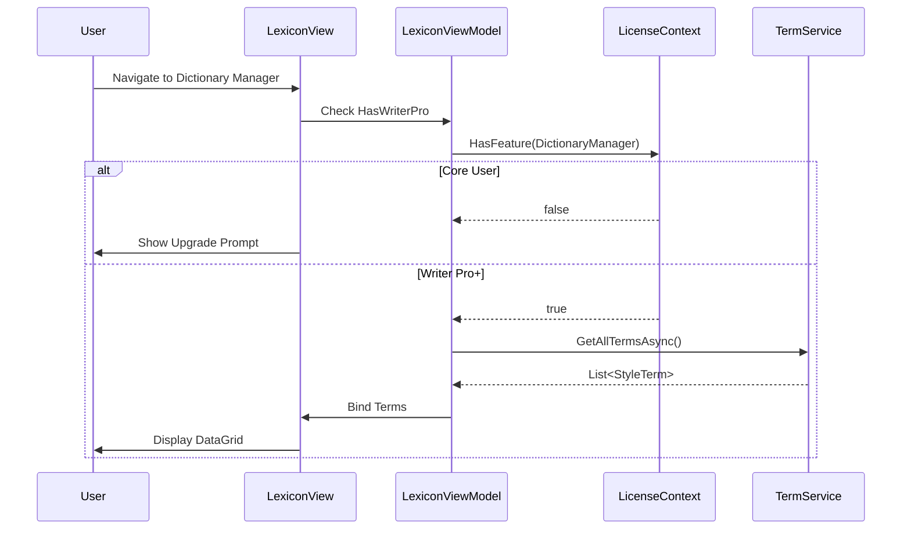
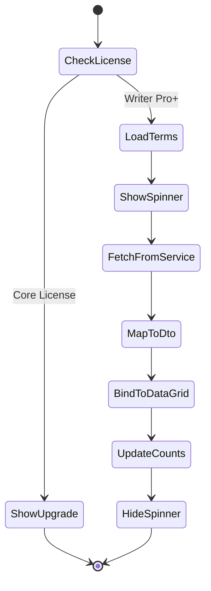
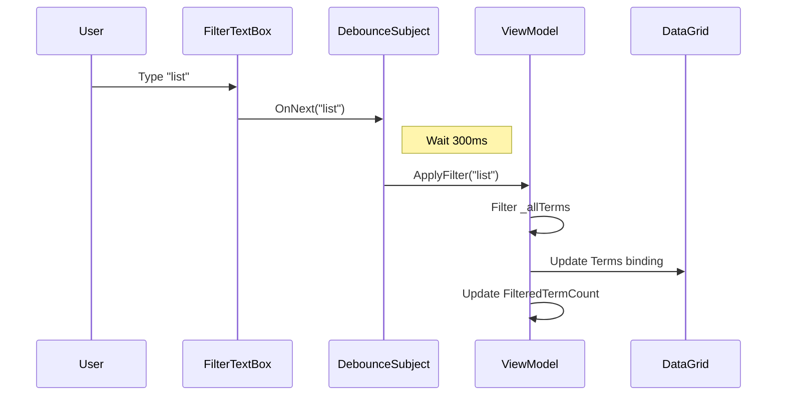

# LDS-01: Feature Design Specification — v0.3.2a DataGrid Infrastructure

## 1. Metadata & Categorization

| Field                | Value                       | Description                                       |
| :------------------- | :-------------------------- | :------------------------------------------------ |
| **Feature ID**       | `STY-032a`                  | Style Module - Dictionary Manager DataGrid        |
| **Feature Name**     | DataGrid Infrastructure     | LexiconView with sorting, filtering, and context. |
| **Target Version**   | `v0.3.2a`                   | Sub-part of v0.3.2 Dictionary Manager.            |
| **Module Scope**     | `Lexichord.Modules.Style`   | Style governance module.                          |
| **Swimlane**         | `Governance`                | Style & Terminology Enforcement.                  |
| **License Tier**     | `Writer Pro`                | Premium feature (Core users see upgrade prompt).  |
| **Feature Gate Key** | `Feature.DictionaryManager` | Key used in `ILicenseContext.HasFeature()`.       |
| **Author**           | System Architect            |                                                   |
| **Reviewer**         | Lead Architect              |                                                   |
| **Status**           | **Draft**                   | Pending approval.                                 |
| **Last Updated**     | 2026-01-26                  |                                                   |

---

## 2. Executive Summary

### 2.1 The Requirement

Users need a visual interface to view, filter, and manage their terminology lexicon. Currently, the `ITerminologyRepository` (v0.2.2b) and `ITerminologyService` (v0.2.2d) provide backend CRUD operations, but there is no GUI for:

| User Need            | Current Status  | Expected Behavior            |
| :------------------- | :-------------- | :--------------------------- |
| View all terms       | ❌ Not possible | ✅ DataGrid with all terms   |
| Filter terms         | ❌ Not possible | ✅ Real-time text filter     |
| Sort by column       | ❌ Not possible | ✅ Clickable column headers  |
| Select term for edit | ❌ Not possible | ✅ Row selection + context   |
| Bulk selection       | ❌ Not possible | ✅ Multi-select for deletion |

### 2.2 The Proposed Solution

Implement the `LexiconView` UserControl using `Avalonia.Controls.DataGrid`:

1. **LexiconView.axaml** — DataGrid with bound columns (Term, Category, Severity, Tags, Fuzzy).
2. **LexiconViewModel** — MVVM ViewModel with filtering, sorting, and CRUD commands.
3. **Filter TextBox** — Debounced reactive filter with 300ms delay.
4. **Context Menu** — Edit, Duplicate, Delete actions on right-click.
5. **Keyboard Shortcuts** — `Delete` for removal, `Enter` for edit.
6. **License Gate** — Soft gate with upgrade prompt for Core users.

This approach:

- Uses native `Avalonia.Controls.DataGrid` for virtualization and performance.
- Follows MVVM pattern with `CommunityToolkit.Mvvm`.
- Integrates with existing `ITerminologyService` (v0.2.2d).
- Gates UI behind `Writer Pro` license tier.

---

## 3. Architecture & Modular Strategy

### 3.1 System Architecture

```
┌─────────────────────────────────────────────────────────────────┐
│                          UI LAYER                               │
│  ┌──────────────────────────────────────────────────────────┐   │
│  │  LexiconView.axaml                                       │   │
│  │  ├── Filter TextBox (debounced 300ms)                    │   │
│  │  ├── DataGrid (virtualized)                              │   │
│  │  │   ├── Column: Term (2* width)                         │   │
│  │  │   ├── Column: Category (1* width)                     │   │
│  │  │   ├── Column: Severity (0.5* width)                   │   │
│  │  │   ├── Column: Tags (1* width)                         │   │
│  │  │   └── Column: Fuzzy (0.5* width)                      │   │
│  │  ├── Context Menu (Edit/Duplicate/Delete)                │   │
│  │  └── Footer (term count + Add Term button)               │   │
│  └──────────────────────────────────────────────────────────┘   │
└─────────────────────────────────────────────────────────────────┘
                              │
                              ▼
┌─────────────────────────────────────────────────────────────────┐
│                       VIEWMODEL LAYER                           │
│  ┌──────────────────────────────────────────────────────────┐   │
│  │  LexiconViewModel : ViewModelBase                        │   │
│  │  ├── ObservableCollection<StyleTermDto> Terms           │   │
│  │  ├── CollectionView FilteredTerms (with filter logic)   │   │
│  │  ├── string FilterText                                   │   │
│  │  ├── StyleTermDto? SelectedTerm                          │   │
│  │  ├── bool HasWriterPro (license check)                   │   │
│  │  ├── ICommand AddTermCommand                             │   │
│  │  ├── ICommand EditTermCommand                            │   │
│  │  ├── ICommand DuplicateTermCommand                       │   │
│  │  ├── ICommand DeleteTermCommand                          │   │
│  │  └── ICommand RefreshCommand                             │   │
│  └──────────────────────────────────────────────────────────┘   │
└─────────────────────────────────────────────────────────────────┘
                              │
                              ▼
┌─────────────────────────────────────────────────────────────────┐
│                       SERVICE LAYER                             │
│  ┌──────────────────────────────────────────────────────────┐   │
│  │  ITerminologyService (v0.2.2d)                           │   │
│  │  ├── GetAllTermsAsync()                                  │   │
│  │  ├── CreateTermAsync(StyleTerm)                          │   │
│  │  ├── UpdateTermAsync(StyleTerm)                          │   │
│  │  └── DeleteTermAsync(Guid)                               │   │
│  └──────────────────────────────────────────────────────────┘   │
│  ┌──────────────────────────────────────────────────────────┐   │
│  │  ILicenseContext (v0.0.4c)                               │   │
│  │  └── HasFeature(Feature.DictionaryManager)               │   │
│  └──────────────────────────────────────────────────────────┘   │
│  ┌──────────────────────────────────────────────────────────┐   │
│  │  IDialogService (v0.3.2b) [Stub for now]                 │   │
│  │  └── ShowDialogAsync<T>(viewModel)                       │   │
│  └──────────────────────────────────────────────────────────┘   │
└─────────────────────────────────────────────────────────────────┘
```

### 3.2 Dependencies

**Upstream Interfaces (Required):**

| Interface             | Source Version | Purpose                              |
| :-------------------- | :------------- | :----------------------------------- |
| `StyleTerm`           | v0.2.2a        | Entity model for terminology         |
| `ITerminologyService` | v0.2.2d        | CRUD operations with events          |
| `ILicenseContext`     | v0.0.4c        | Read-only license tier access        |
| `LicenseTier`         | v0.0.4c        | Core/WriterPro/Teams/Enterprise enum |
| `RuleCategory`        | v0.2.1b        | Terminology/Formatting/Syntax enum   |
| `ViolationSeverity`   | v0.2.1b        | Error/Warning/Info/Hint enum         |
| `LexiconChangedEvent` | v0.2.2d        | MediatR notification for changes     |
| `ViewModelBase`       | v0.1.1         | Base ViewModel with INotifyChanged   |

**New Types (Defined in v0.3.2a):**

| Type               | Module        | Purpose                         |
| :----------------- | :------------ | :------------------------------ |
| `LexiconView`      | Modules.Style | DataGrid-based lexicon viewer   |
| `LexiconViewModel` | Modules.Style | MVVM ViewModel for LexiconView  |
| `StyleTermDto`     | Abstractions  | DTO for view-layer term binding |

**NuGet Packages (Existing):**

| Package                      | Version | Purpose                 |
| :--------------------------- | :------ | :---------------------- |
| `Avalonia.Controls.DataGrid` | 11.x    | DataGrid control        |
| `CommunityToolkit.Mvvm`      | 8.x     | MVVM source generators  |
| `System.Reactive`            | 6.x     | Debounced filter stream |

### 3.3 Licensing Behavior

- **Load Behavior:**
    - [ ] **Hard Gate:** The Module DLL is not loaded at all.
    - [x] **Soft Gate:** The Module loads, but UI shows upgrade prompt.
    - [ ] **UI Gate:** The UI elements are hidden/disabled.

- **Fallback Experience:**
    > Core users who navigate to the Dictionary Manager see a centered placeholder panel with:
    >
    > - Lock icon (Material.Icons `Lock`)
    > - Text: "Dictionary Manager requires Writer Pro"
    > - "Upgrade" button linking to subscription page
    > - The DataGrid and controls are not rendered.

---

## 4. Data Contract (The API)

### 4.1 StyleTermDto Record

```csharp
namespace Lexichord.Abstractions.Models;

/// <summary>
/// Data transfer object for style term view operations.
/// </summary>
/// <remarks>
/// LOGIC: This DTO is used for two-way binding in the Lexicon DataGrid.
/// It mirrors StyleTerm but provides mutable properties for editing scenarios.
/// </remarks>
public sealed record StyleTermDto
{
    /// <summary>
    /// Gets the unique identifier of the term.
    /// </summary>
    public Guid Id { get; init; }

    /// <summary>
    /// Gets or sets the pattern to match (literal string or regex).
    /// </summary>
    public required string Pattern { get; init; }

    /// <summary>
    /// Gets or sets whether the pattern is a regular expression.
    /// </summary>
    public bool IsRegex { get; init; }

    /// <summary>
    /// Gets or sets the category of the rule.
    /// </summary>
    public RuleCategory Category { get; init; } = RuleCategory.Terminology;

    /// <summary>
    /// Gets or sets the severity level of violations.
    /// </summary>
    public ViolationSeverity Severity { get; init; } = ViolationSeverity.Warning;

    /// <summary>
    /// Gets or sets the recommended replacement text.
    /// </summary>
    public required string Recommendation { get; init; }

    /// <summary>
    /// Gets or sets the comma-separated tags for categorization.
    /// </summary>
    public string? Tags { get; init; }

    /// <summary>
    /// Gets or sets whether fuzzy matching is enabled.
    /// </summary>
    public bool FuzzyEnabled { get; init; }

    /// <summary>
    /// Gets or sets the fuzzy match threshold (0.5-1.0).
    /// </summary>
    public double FuzzyThreshold { get; init; } = 0.80;
}
```

### 4.2 StyleTermDto Extensions

```csharp
namespace Lexichord.Abstractions.Extensions;

/// <summary>
/// Extension methods for StyleTerm and StyleTermDto conversions.
/// </summary>
public static class StyleTermExtensions
{
    /// <summary>
    /// Converts a StyleTerm entity to a StyleTermDto for view binding.
    /// </summary>
    /// <param name="entity">The domain entity.</param>
    /// <returns>A DTO representation.</returns>
    public static StyleTermDto ToDto(this StyleTerm entity) => new()
    {
        Id = entity.Id,
        Pattern = entity.Pattern,
        IsRegex = entity.IsRegex,
        Category = entity.Category,
        Severity = entity.Severity,
        Recommendation = entity.Recommendation,
        Tags = entity.Tags,
        FuzzyEnabled = entity.FuzzyEnabled,
        FuzzyThreshold = entity.FuzzyThreshold
    };

    /// <summary>
    /// Converts a StyleTermDto back to a StyleTerm entity for persistence.
    /// </summary>
    /// <param name="dto">The DTO.</param>
    /// <returns>A domain entity.</returns>
    public static StyleTerm ToEntity(this StyleTermDto dto) => new()
    {
        Id = dto.Id,
        Pattern = dto.Pattern,
        IsRegex = dto.IsRegex,
        Category = dto.Category,
        Severity = dto.Severity,
        Recommendation = dto.Recommendation,
        Tags = dto.Tags,
        FuzzyEnabled = dto.FuzzyEnabled,
        FuzzyThreshold = dto.FuzzyThreshold
    };
}
```

---

## 5. Implementation Logic

### 5.1 LexiconViewModel

```csharp
namespace Lexichord.Modules.Style.ViewModels;

/// <summary>
/// ViewModel for the Lexicon Manager DataGrid view.
/// </summary>
/// <remarks>
/// LOGIC: Provides MVVM binding for term CRUD operations.
/// Filter is debounced 300ms to avoid excessive re-renders during typing.
/// </remarks>
public sealed partial class LexiconViewModel : ViewModelBase
{
    private readonly ITerminologyService _terminologyService;
    private readonly ILicenseContext _licenseContext;
    private readonly IDialogService _dialogService;
    private readonly ILogger<LexiconViewModel> _logger;

    private readonly Subject<string> _filterSubject = new();
    private IDisposable? _filterSubscription;

    [ObservableProperty]
    private ObservableCollection<StyleTermDto> _terms = [];

    [ObservableProperty]
    private string _filterText = string.Empty;

    [ObservableProperty]
    private StyleTermDto? _selectedTerm;

    [ObservableProperty]
    private bool _isLoading;

    [ObservableProperty]
    private int _totalTermCount;

    [ObservableProperty]
    private int _filteredTermCount;

    /// <summary>
    /// Gets whether the current user has Writer Pro or higher license.
    /// </summary>
    public bool HasWriterPro => _licenseContext.HasFeature(Feature.DictionaryManager);

    /// <summary>
    /// Initializes a new instance of the LexiconViewModel.
    /// </summary>
    public LexiconViewModel(
        ITerminologyService terminologyService,
        ILicenseContext licenseContext,
        IDialogService dialogService,
        ILogger<LexiconViewModel> logger)
    {
        _terminologyService = terminologyService;
        _licenseContext = licenseContext;
        _dialogService = dialogService;
        _logger = logger;

        // LOGIC: Debounce filter input by 300ms to prevent UI thrashing
        _filterSubscription = _filterSubject
            .Throttle(TimeSpan.FromMilliseconds(300))
            .ObserveOn(RxApp.MainThreadScheduler)
            .Subscribe(ApplyFilter);
    }

    partial void OnFilterTextChanged(string value)
    {
        _filterSubject.OnNext(value);
    }

    private void ApplyFilter(string filterText)
    {
        _logger.LogDebug(
            "Filter applied: '{FilterText}' on {TotalCount} terms",
            filterText,
            TotalTermCount);

        // LOGIC: Filter by pattern OR category name (case-insensitive)
        var filtered = string.IsNullOrWhiteSpace(filterText)
            ? _allTerms
            : _allTerms.Where(t =>
                t.Pattern.Contains(filterText, StringComparison.OrdinalIgnoreCase) ||
                t.Category.ToString().Contains(filterText, StringComparison.OrdinalIgnoreCase) ||
                (t.Tags?.Contains(filterText, StringComparison.OrdinalIgnoreCase) ?? false));

        Terms = new ObservableCollection<StyleTermDto>(filtered);
        FilteredTermCount = Terms.Count;

        _logger.LogDebug(
            "Filter reduced {TotalCount} to {FilteredCount} terms",
            TotalTermCount,
            FilteredTermCount);
    }

    private List<StyleTermDto> _allTerms = [];

    /// <summary>
    /// Loads all terms from the repository.
    /// </summary>
    [RelayCommand]
    private async Task LoadTermsAsync(CancellationToken cancellationToken)
    {
        _logger.LogDebug("Loading terms from repository");
        IsLoading = true;

        try
        {
            var terms = await _terminologyService.GetAllTermsAsync(cancellationToken);
            _allTerms = terms.Select(t => t.ToDto()).ToList();
            Terms = new ObservableCollection<StyleTermDto>(_allTerms);
            TotalTermCount = _allTerms.Count;
            FilteredTermCount = Terms.Count;

            _logger.LogInformation("Loaded {TermCount} terms", TotalTermCount);
        }
        finally
        {
            IsLoading = false;
        }
    }

    /// <summary>
    /// Opens the Term Editor dialog in create mode.
    /// </summary>
    [RelayCommand]
    private async Task AddTermAsync(CancellationToken cancellationToken)
    {
        _logger.LogDebug("Opening Term Editor in create mode");

        var result = await _dialogService.ShowDialogAsync<StyleTermDto>(
            new TermEditorViewModel(null, _licenseContext),
            cancellationToken);

        if (result.IsConfirmed && result.Value is not null)
        {
            await _terminologyService.CreateTermAsync(
                result.Value.ToEntity(),
                cancellationToken);

            _logger.LogInformation(
                "Term created: {TermId} - {Pattern}",
                result.Value.Id,
                result.Value.Pattern);

            await LoadTermsAsync(cancellationToken);
        }
    }

    /// <summary>
    /// Opens the Term Editor dialog in edit mode.
    /// </summary>
    [RelayCommand]
    private async Task EditTermAsync(StyleTermDto? term, CancellationToken cancellationToken)
    {
        term ??= SelectedTerm;
        if (term is null) return;

        _logger.LogDebug("Opening Term Editor for {TermId}", term.Id);

        var result = await _dialogService.ShowDialogAsync<StyleTermDto>(
            new TermEditorViewModel(term, _licenseContext),
            cancellationToken);

        if (result.IsConfirmed && result.Value is not null)
        {
            await _terminologyService.UpdateTermAsync(
                result.Value.ToEntity(),
                cancellationToken);

            _logger.LogInformation(
                "Term updated: {TermId} - {Pattern}",
                result.Value.Id,
                result.Value.Pattern);

            await LoadTermsAsync(cancellationToken);
        }
    }

    /// <summary>
    /// Duplicates the selected term.
    /// </summary>
    [RelayCommand]
    private async Task DuplicateTermAsync(StyleTermDto? term, CancellationToken cancellationToken)
    {
        term ??= SelectedTerm;
        if (term is null) return;

        _logger.LogDebug("Duplicating term {TermId}", term.Id);

        var duplicate = term with
        {
            Id = Guid.NewGuid(),
            Pattern = $"{term.Pattern} (copy)"
        };

        var result = await _dialogService.ShowDialogAsync<StyleTermDto>(
            new TermEditorViewModel(duplicate, _licenseContext),
            cancellationToken);

        if (result.IsConfirmed && result.Value is not null)
        {
            await _terminologyService.CreateTermAsync(
                result.Value.ToEntity(),
                cancellationToken);

            _logger.LogInformation(
                "Term duplicated: {OriginalId} -> {NewId}",
                term.Id,
                result.Value.Id);

            await LoadTermsAsync(cancellationToken);
        }
    }

    /// <summary>
    /// Deletes the selected term after confirmation.
    /// </summary>
    [RelayCommand]
    private async Task DeleteTermAsync(StyleTermDto? term, CancellationToken cancellationToken)
    {
        term ??= SelectedTerm;
        if (term is null) return;

        var confirmed = await _dialogService.ShowConfirmationAsync(
            "Delete Term",
            $"Are you sure you want to delete '{term.Pattern}'?",
            cancellationToken);

        if (confirmed)
        {
            _logger.LogInformation("Deleting term {TermId}", term.Id);

            await _terminologyService.DeleteTermAsync(term.Id, cancellationToken);
            await LoadTermsAsync(cancellationToken);
        }
    }

    /// <summary>
    /// Cleans up subscriptions.
    /// </summary>
    public void Dispose()
    {
        _filterSubscription?.Dispose();
        _filterSubject.Dispose();
    }
}
```

### 5.2 Flow Diagram



---

## 6. UI/UX Specifications

### 6.1 LexiconView Layout

```
┌───────────────────────────────────────────────────────────────────────────┐
│  Lexicon Manager                                          [+ Add Term]    │ ← Toolbar (40px)
├───────────────────────────────────────────────────────────────────────────┤
│  ┌─────────────────────────────────────────────────────────────────────┐  │
│  │ 🔍 Filter terms...                                                   │  │ ← Filter (40px)
│  └─────────────────────────────────────────────────────────────────────┘  │
├───────────────────────────────────────────────────────────────────────────┤
│  Term ▲             │ Category    │ Severity │ Tags        │ Fuzzy      │ ← Headers (32px)
├───────────────────────────────────────────────────────────────────────────┤
│  whitelist          │ Terminology │ Error    │ inclusive   │ ✓ 80%      │
│  blacklist          │ Terminology │ Error    │ inclusive   │ ✓ 80%      │
│  master/slave       │ Terminology │ Warning  │ inclusive   │            │
│  ...                │             │          │             │            │
├───────────────────────────────────────────────────────────────────────────┤
│  Showing 45 of 128 terms                                                  │ ← Footer (32px)
└───────────────────────────────────────────────────────────────────────────┘
```

### 6.2 Column Specifications

| Column   | Header   | Width  | Sortable | Format                |
| :------- | :------- | :----- | :------- | :-------------------- |
| Pattern  | Term     | `2*`   | ✅       | Plain text            |
| Category | Category | `1*`   | ✅       | Enum display name     |
| Severity | Severity | `0.5*` | ✅       | Colored badge         |
| Tags     | Tags     | `1*`   | ✅       | Comma-separated pills |
| Fuzzy    | Fuzzy    | `0.5*` | ✅       | "✓ 80%" or empty      |

### 6.3 Context Menu

```
┌─────────────────────┐
│ ✏️  Edit            │  (Enter)
│ 📋  Duplicate       │  (Ctrl+D)
│ ─────────────────── │
│ 🗑️  Delete          │  (Delete)
└─────────────────────┘
```

### 6.4 Theme Integration

| Element            | Resource                 | Notes                  |
| :----------------- | :----------------------- | :--------------------- |
| View Background    | `Brush.Surface.Elevated` | Panel background       |
| DataGrid Header    | `Brush.Surface.Overlay`  | Header row             |
| DataGrid Row       | `Brush.Surface.Elevated` | Default row            |
| DataGrid Row Alt   | `Brush.Surface.Base`     | Alternating row        |
| DataGrid Selection | `Brush.Accent.Muted`     | Selected row highlight |
| Filter TextBox     | `LexTextBox` theme       | With search icon       |
| Add Button         | `LexButtonPrimary` theme | Orange primary button  |
| Severity Error     | `Brush.Status.Error`     | Red badge              |
| Severity Warning   | `Brush.Status.Warning`   | Yellow badge           |
| Severity Info      | `Brush.Status.Info`      | Blue badge             |

### 6.5 Accessibility

- **All controls MUST have `AutomationProperties.Name`:**
    - Filter TextBox: "Filter terms"
    - Add Term Button: "Add new term"
    - DataGrid: "Terminology list"
- **Tab order MUST follow visual layout:** Filter → DataGrid → Footer
- **Keyboard navigation:**
    - `Tab`: Move between controls
    - `Enter`: Edit selected term
    - `Delete`: Delete selected term (with confirmation)
    - `Ctrl+D`: Duplicate selected term
    - `Arrow Up/Down`: Navigate rows

---

## 7. Decision Trees

### 7.1 Should the DataGrid Be Rendered?

```text
START: "Should the DataGrid be rendered?"
│
├── Is user license >= WriterPro?
│   ├── NO → BLOCK: Render UpgradePrompt instead
│   │   └── Components: Lock icon, message, Upgrade button
│   └── YES → Continue
│
├── Are terms loaded?
│   ├── NO → Show Loading Spinner
│   │   └── Spinner: Accent.Primary color, centered
│   └── YES → Continue
│
├── Are there any terms?
│   ├── NO → Show Empty State
│   │   └── Components: Empty icon, "No terms yet", Add button
│   └── YES → RENDER DataGrid
│
└── END
```

### 7.2 Filter Application Logic

```text
START: "How to filter the term list?"
│
├── Is filterText null or whitespace?
│   ├── YES → Show all terms (no filter)
│   └── NO → Continue
│
├── For each term, does it match?
│   ├── Pattern contains filterText (case-insensitive)?
│   │   └── YES → Include in results
│   ├── Category.ToString() contains filterText (case-insensitive)?
│   │   └── YES → Include in results
│   ├── Tags contains filterText (case-insensitive)?
│   │   └── YES → Include in results
│   └── NO to all → Exclude from results
│
└── Update FilteredTermCount and bind filtered collection
```

---

## 8. User Stories

| ID    | Role            | Story                                                            | Acceptance Criteria                                 |
| :---- | :-------------- | :--------------------------------------------------------------- | :-------------------------------------------------- |
| US-01 | Writer Pro User | As a paid user, I want to view all my terms in a sortable grid.  | DataGrid shows all terms with sortable columns.     |
| US-02 | Writer Pro User | As a paid user, I want to filter terms by name or category.      | Filter reduces grid to matching entries in < 100ms. |
| US-03 | Writer Pro User | As a paid user, I want to select a term to edit it.              | Clicking row selects term; Enter opens editor.      |
| US-04 | Writer Pro User | As a paid user, I want to delete terms from the context menu.    | Right-click shows Delete; confirmation required.    |
| US-05 | Writer Pro User | As a paid user, I want to duplicate a term as a starting point.  | Duplicate creates copy with "(copy)" suffix.        |
| US-06 | Core User       | As a free user, I see an upgrade prompt instead of the DataGrid. | Lock icon, message, and Upgrade button visible.     |
| US-07 | Developer       | As a developer, I want loading states when data is fetching.     | Spinner shows during LoadTermsAsync().              |
| US-08 | Developer       | As a developer, I want keyboard shortcuts for productivity.      | Delete, Enter, Ctrl+D work as specified.            |

---

## 9. Use Cases

### UC-01: View Terminology Lexicon

**Preconditions:**

- User has Writer Pro license.
- Terminology database contains at least one term.

**Flow:**

1. User navigates to Style module → Dictionary Manager.
2. `LexiconView` initializes and binds to `LexiconViewModel`.
3. ViewModel checks `HasWriterPro` → true.
4. ViewModel calls `LoadTermsAsync()`.
5. Spinner shows during loading.
6. Terms are fetched and bound to DataGrid.
7. DataGrid displays with columns: Term, Category, Severity, Tags, Fuzzy.
8. Footer shows "Showing 45 of 45 terms".

**Postconditions:**

- DataGrid displays all terms.
- User can sort by clicking column headers.

---

### UC-02: Filter Terms

**Preconditions:**

- DataGrid is displayed with terms.

**Flow:**

1. User clicks in Filter TextBox.
2. User types "list".
3. After 300ms debounce:
    1. ViewModel applies filter.
    2. Only terms containing "list" are shown.
4. Footer updates to "Showing 3 of 45 terms".
5. User clears filter.
6. All terms are shown again.

**Postconditions:**

- Filter is case-insensitive.
- Matches pattern OR category OR tags.

---

### UC-03: License Gate Enforcement

**Preconditions:**

- User has Core (free) license.

**Flow:**

1. User navigates to Style module → Dictionary Manager.
2. `LexiconView` initializes.
3. ViewModel checks `HasWriterPro` → false.
4. LexiconView shows placeholder panel instead of DataGrid.
5. Placeholder displays:
    - Lock icon (centered)
    - Text: "Dictionary Manager requires Writer Pro"
    - "Upgrade" button
6. User cannot access filter, DataGrid, or CRUD.

**Postconditions:**

- No terminology data exposed.
- Clear upgrade path provided.

---

## 10. Unit Testing Requirements

### 10.1 LexiconViewModelTests

```csharp
[Trait("Category", "Unit")]
[Trait("Version", "v0.3.2a")]
public class LexiconViewModelTests
{
    private readonly Mock<ITerminologyService> _mockService;
    private readonly Mock<ILicenseContext> _mockLicense;
    private readonly Mock<IDialogService> _mockDialog;
    private readonly Mock<ILogger<LexiconViewModel>> _mockLogger;
    private readonly LexiconViewModel _sut;

    public LexiconViewModelTests()
    {
        _mockService = new Mock<ITerminologyService>();
        _mockLicense = new Mock<ILicenseContext>();
        _mockDialog = new Mock<IDialogService>();
        _mockLogger = new Mock<ILogger<LexiconViewModel>>();

        _mockLicense.Setup(l => l.HasFeature(Feature.DictionaryManager))
            .Returns(true);

        _sut = new LexiconViewModel(
            _mockService.Object,
            _mockLicense.Object,
            _mockDialog.Object,
            _mockLogger.Object);
    }

    [Fact]
    public async Task LoadTermsAsync_PopulatesTermsCollection()
    {
        // Arrange
        var terms = new[]
        {
            CreateTerm("whitelist"),
            CreateTerm("blacklist"),
            CreateTerm("primary")
        };
        _mockService.Setup(s => s.GetAllTermsAsync(It.IsAny<CancellationToken>()))
            .ReturnsAsync(terms);

        // Act
        await _sut.LoadTermsCommand.ExecuteAsync(null);

        // Assert
        _sut.Terms.Should().HaveCount(3);
        _sut.TotalTermCount.Should().Be(3);
    }

    [Fact]
    public void Filter_WithMatchingTerm_ShowsOnlyMatchingTerms()
    {
        // Arrange
        var terms = new[]
        {
            CreateTerm("whitelist"),
            CreateTerm("blacklist"),
            CreateTerm("primary")
        };
        SetupLoadedTerms(terms);

        // Act
        _sut.FilterText = "list";

        // Allow debounce (in real test, use test scheduler)
        Thread.Sleep(350);

        // Assert
        _sut.Terms.Should().HaveCount(2);
        _sut.Terms.Select(t => t.Pattern).Should()
            .Contain("whitelist")
            .And.Contain("blacklist");
    }

    [Fact]
    public void Filter_WithCategoryMatch_ShowsMatchingTerms()
    {
        // Arrange
        var terms = new[]
        {
            CreateTerm("whitelist", RuleCategory.Terminology),
            CreateTerm("TODO", RuleCategory.Formatting),
            CreateTerm("primary", RuleCategory.Terminology)
        };
        SetupLoadedTerms(terms);

        // Act
        _sut.FilterText = "format";
        Thread.Sleep(350);

        // Assert
        _sut.Terms.Should().HaveCount(1);
        _sut.Terms[0].Pattern.Should().Be("TODO");
    }

    [Fact]
    public void Filter_WithEmptyText_ShowsAllTerms()
    {
        // Arrange
        var terms = new[] { CreateTerm("a"), CreateTerm("b"), CreateTerm("c") };
        SetupLoadedTerms(terms);
        _sut.FilterText = "a";
        Thread.Sleep(350);

        // Act
        _sut.FilterText = "";
        Thread.Sleep(350);

        // Assert
        _sut.Terms.Should().HaveCount(3);
    }

    [Fact]
    public void Filter_IsCaseInsensitive()
    {
        // Arrange
        var terms = new[] { CreateTerm("WhiteList"), CreateTerm("BLACKLIST") };
        SetupLoadedTerms(terms);

        // Act
        _sut.FilterText = "list";
        Thread.Sleep(350);

        // Assert
        _sut.Terms.Should().HaveCount(2);
    }

    [Fact]
    public void HasWriterPro_WhenLicenseValid_ReturnsTrue()
    {
        // Assert
        _sut.HasWriterPro.Should().BeTrue();
    }

    [Fact]
    public void HasWriterPro_WhenCoreLicense_ReturnsFalse()
    {
        // Arrange
        _mockLicense.Setup(l => l.HasFeature(Feature.DictionaryManager))
            .Returns(false);

        var sut = new LexiconViewModel(
            _mockService.Object,
            _mockLicense.Object,
            _mockDialog.Object,
            _mockLogger.Object);

        // Assert
        sut.HasWriterPro.Should().BeFalse();
    }

    [Fact]
    public async Task DeleteTermAsync_WithConfirmation_DeletesAndReloads()
    {
        // Arrange
        var term = CreateTermDto("whitelist");
        _sut.SelectedTerm = term;
        _mockDialog.Setup(d => d.ShowConfirmationAsync(
            It.IsAny<string>(),
            It.IsAny<string>(),
            It.IsAny<CancellationToken>()))
            .ReturnsAsync(true);

        // Act
        await _sut.DeleteTermCommand.ExecuteAsync(null);

        // Assert
        _mockService.Verify(s => s.DeleteTermAsync(
            term.Id,
            It.IsAny<CancellationToken>()),
            Times.Once);
    }

    [Fact]
    public async Task DeleteTermAsync_WithoutConfirmation_DoesNotDelete()
    {
        // Arrange
        var term = CreateTermDto("whitelist");
        _sut.SelectedTerm = term;
        _mockDialog.Setup(d => d.ShowConfirmationAsync(
            It.IsAny<string>(),
            It.IsAny<string>(),
            It.IsAny<CancellationToken>()))
            .ReturnsAsync(false);

        // Act
        await _sut.DeleteTermCommand.ExecuteAsync(null);

        // Assert
        _mockService.Verify(s => s.DeleteTermAsync(
            It.IsAny<Guid>(),
            It.IsAny<CancellationToken>()),
            Times.Never);
    }

    private static StyleTerm CreateTerm(
        string pattern,
        RuleCategory category = RuleCategory.Terminology)
    {
        return new StyleTerm
        {
            Id = Guid.NewGuid(),
            Pattern = pattern,
            Category = category,
            Severity = ViolationSeverity.Warning,
            Recommendation = $"Use alternative to {pattern}"
        };
    }

    private static StyleTermDto CreateTermDto(string pattern)
    {
        return new StyleTermDto
        {
            Id = Guid.NewGuid(),
            Pattern = pattern,
            Category = RuleCategory.Terminology,
            Severity = ViolationSeverity.Warning,
            Recommendation = $"Use alternative to {pattern}"
        };
    }

    private void SetupLoadedTerms(StyleTerm[] terms)
    {
        _mockService.Setup(s => s.GetAllTermsAsync(It.IsAny<CancellationToken>()))
            .ReturnsAsync(terms);
        _sut.LoadTermsCommand.Execute(null);
    }
}
```

---

## 11. Observability & Logging

| Level | Source           | Message Template                                       |
| :---- | :--------------- | :----------------------------------------------------- |
| Debug | LexiconViewModel | `Loading terms from repository`                        |
| Info  | LexiconViewModel | `Loaded {TermCount} terms`                             |
| Debug | LexiconViewModel | `Filter applied: '{FilterText}' on {TotalCount} terms` |
| Debug | LexiconViewModel | `Filter reduced {TotalCount} to {FilteredCount} terms` |
| Debug | LexiconViewModel | `Opening Term Editor in create mode`                   |
| Debug | LexiconViewModel | `Opening Term Editor for {TermId}`                     |
| Info  | LexiconViewModel | `Term created: {TermId} - {Pattern}`                   |
| Info  | LexiconViewModel | `Term updated: {TermId} - {Pattern}`                   |
| Debug | LexiconViewModel | `Duplicating term {TermId}`                            |
| Info  | LexiconViewModel | `Term duplicated: {OriginalId} -> {NewId}`             |
| Info  | LexiconViewModel | `Deleting term {TermId}`                               |
| Debug | LexiconView      | `License check for DictionaryManager: {IsAuthorized}`  |

---

## 12. Workflows

### 12.1 Load Terms Workflow



### 12.2 Filter Terms Workflow



---

## 13. Code Examples

### 13.1 LexiconView.axaml

```xml
<UserControl xmlns="https://github.com/avaloniaui"
             xmlns:x="http://schemas.microsoft.com/winfx/2006/xaml"
             xmlns:vm="using:Lexichord.Modules.Style.ViewModels"
             x:Class="Lexichord.Modules.Style.Views.LexiconView"
             x:DataType="vm:LexiconViewModel">

  <Grid RowDefinitions="Auto,Auto,*,Auto">
    <!-- Toolbar -->
    <Border Grid.Row="0"
            Background="{StaticResource Brush.Surface.Overlay}"
            Padding="16,8">
      <DockPanel>
        <TextBlock DockPanel.Dock="Left"
                   Text="Lexicon Manager"
                   FontSize="18"
                   FontWeight="SemiBold"
                   Foreground="{StaticResource Brush.Text.Primary}"
                   VerticalAlignment="Center" />

        <Button DockPanel.Dock="Right"
                Theme="{StaticResource LexButtonPrimary}"
                Command="{Binding AddTermCommand}"
                AutomationProperties.Name="Add new term">
          <StackPanel Orientation="Horizontal" Spacing="8">
            <PathIcon Data="{StaticResource IconPlus}" Width="16" Height="16" />
            <TextBlock Text="Add Term" />
          </StackPanel>
        </Button>
      </DockPanel>
    </Border>

    <!-- Filter -->
    <Border Grid.Row="1"
            Padding="16,8"
            Background="{StaticResource Brush.Surface.Elevated}">
      <TextBox Theme="{StaticResource LexTextBox}"
               Watermark="Filter terms..."
               Text="{Binding FilterText}"
               AutomationProperties.Name="Filter terms">
        <TextBox.InnerLeftContent>
          <PathIcon Data="{StaticResource IconSearch}"
                    Width="16" Height="16"
                    Foreground="{StaticResource Brush.Text.Tertiary}"
                    Margin="8,0,0,0" />
        </TextBox.InnerLeftContent>
      </TextBox>
    </Border>

    <!-- DataGrid -->
    <DataGrid Grid.Row="2"
              ItemsSource="{Binding Terms}"
              SelectedItem="{Binding SelectedTerm}"
              AutoGenerateColumns="False"
              CanUserSortColumns="True"
              CanUserResizeColumns="True"
              IsReadOnly="True"
              SelectionMode="Single"
              AutomationProperties.Name="Terminology list"
              Background="{StaticResource Brush.Surface.Elevated}">

      <DataGrid.Columns>
        <DataGridTextColumn Header="Term"
                            Binding="{Binding Pattern}"
                            Width="2*" />
        <DataGridTextColumn Header="Category"
                            Binding="{Binding Category}"
                            Width="1*" />
        <DataGridTemplateColumn Header="Severity" Width="0.5*">
          <DataGridTemplateColumn.CellTemplate>
            <DataTemplate>
              <Border CornerRadius="4"
                      Padding="8,2"
                      Background="{Binding Severity, Converter={StaticResource SeverityToBrushConverter}}"
                      HorizontalAlignment="Left">
                <TextBlock Text="{Binding Severity}"
                           FontSize="11"
                           Foreground="White" />
              </Border>
            </DataTemplate>
          </DataGridTemplateColumn.CellTemplate>
        </DataGridTemplateColumn>
        <DataGridTextColumn Header="Tags"
                            Binding="{Binding Tags}"
                            Width="1*" />
        <DataGridTemplateColumn Header="Fuzzy" Width="0.5*">
          <DataGridTemplateColumn.CellTemplate>
            <DataTemplate>
              <TextBlock Text="{Binding ., Converter={StaticResource FuzzyDisplayConverter}}"
                         Foreground="{StaticResource Brush.Text.Secondary}" />
            </DataTemplate>
          </DataGridTemplateColumn.CellTemplate>
        </DataGridTemplateColumn>
      </DataGrid.Columns>

      <DataGrid.ContextMenu>
        <ContextMenu>
          <MenuItem Header="Edit"
                    Command="{Binding EditTermCommand}"
                    InputGesture="Enter">
            <MenuItem.Icon>
              <PathIcon Data="{StaticResource IconEdit}" />
            </MenuItem.Icon>
          </MenuItem>
          <MenuItem Header="Duplicate"
                    Command="{Binding DuplicateTermCommand}"
                    InputGesture="Ctrl+D">
            <MenuItem.Icon>
              <PathIcon Data="{StaticResource IconCopy}" />
            </MenuItem.Icon>
          </MenuItem>
          <Separator />
          <MenuItem Header="Delete"
                    Command="{Binding DeleteTermCommand}"
                    InputGesture="Delete">
            <MenuItem.Icon>
              <PathIcon Data="{StaticResource IconTrash}" />
            </MenuItem.Icon>
          </MenuItem>
        </ContextMenu>
      </DataGrid.ContextMenu>
    </DataGrid>

    <!-- Footer -->
    <Border Grid.Row="3"
            Background="{StaticResource Brush.Surface.Overlay}"
            Padding="16,8">
      <TextBlock Foreground="{StaticResource Brush.Text.Secondary}">
        <Run Text="Showing " />
        <Run Text="{Binding FilteredTermCount}" />
        <Run Text=" of " />
        <Run Text="{Binding TotalTermCount}" />
        <Run Text=" terms" />
      </TextBlock>
    </Border>
  </Grid>

</UserControl>
```

### 13.2 Converters

```csharp
namespace Lexichord.Modules.Style.Converters;

/// <summary>
/// Converts ViolationSeverity to appropriate brush color.
/// </summary>
public class SeverityToBrushConverter : IValueConverter
{
    public object? Convert(object? value, Type targetType, object? parameter, CultureInfo culture)
    {
        if (value is not ViolationSeverity severity)
            return Brushes.Gray;

        return severity switch
        {
            ViolationSeverity.Error => Application.Current!.FindResource("Brush.Status.Error"),
            ViolationSeverity.Warning => Application.Current!.FindResource("Brush.Status.Warning"),
            ViolationSeverity.Info => Application.Current!.FindResource("Brush.Status.Info"),
            ViolationSeverity.Hint => Application.Current!.FindResource("Brush.Text.Tertiary"),
            _ => Brushes.Gray
        };
    }

    public object? ConvertBack(object? value, Type targetType, object? parameter, CultureInfo culture)
    {
        throw new NotImplementedException();
    }
}

/// <summary>
/// Converts StyleTermDto to fuzzy display string ("✓ 80%" or empty).
/// </summary>
public class FuzzyDisplayConverter : IValueConverter
{
    public object? Convert(object? value, Type targetType, object? parameter, CultureInfo culture)
    {
        if (value is not StyleTermDto term)
            return string.Empty;

        if (!term.FuzzyEnabled)
            return string.Empty;

        return $"✓ {term.FuzzyThreshold:P0}";
    }

    public object? ConvertBack(object? value, Type targetType, object? parameter, CultureInfo culture)
    {
        throw new NotImplementedException();
    }
}
```

---

## 14. Acceptance Criteria (QA)

| #   | Category            | Criterion                                                      |
| :-- | :------------------ | :------------------------------------------------------------- |
| 1   | **[DataGrid]**      | DataGrid displays all terms from database.                     |
| 2   | **[DataGrid]**      | Columns are sortable by clicking headers.                      |
| 3   | **[DataGrid]**      | DataGrid uses virtualization (no lag with 1000+ rows).         |
| 4   | **[Filter]**        | Filter TextBox reduces grid in real-time with 300ms debounce.  |
| 5   | **[Filter]**        | Filter matches Pattern OR Category OR Tags (case-insensitive). |
| 6   | **[Filter]**        | Clearing filter shows all terms.                               |
| 7   | **[Selection]**     | Clicking row selects term and updates SelectedTerm.            |
| 8   | **[Context Menu]**  | Right-click shows Edit/Duplicate/Delete options.               |
| 9   | **[Keyboard]**      | Enter key opens Term Editor for selected term.                 |
| 10  | **[Keyboard]**      | Delete key triggers delete confirmation.                       |
| 11  | **[Keyboard]**      | Ctrl+D duplicates selected term.                               |
| 12  | **[License Gate]**  | Core users see upgrade prompt instead of DataGrid.             |
| 13  | **[Loading]**       | Spinner shows during LoadTermsAsync().                         |
| 14  | **[Footer]**        | Footer shows "Showing X of Y terms".                           |
| 15  | **[Accessibility]** | All controls have `AutomationProperties.Name`.                 |
| 16  | **[Accessibility]** | Tab order follows visual layout.                               |
| 17  | **[Theme]**         | All colors use theme resources (dark mode compatible).         |

---

## 15. Deliverable Checklist

| Step | Description                                             | Status |
| :--- | :------------------------------------------------------ | :----- |
| 1    | `StyleTermDto` record in Abstractions.                  | [ ]    |
| 2    | `StyleTermExtensions` (ToDto/ToEntity) in Abstractions. | [ ]    |
| 3    | `LexiconView.axaml` with DataGrid and toolbar.          | [ ]    |
| 4    | `LexiconView.axaml.cs` code-behind.                     | [ ]    |
| 5    | `LexiconViewModel` with CRUD commands.                  | [ ]    |
| 6    | Filter logic with 300ms debounce.                       | [ ]    |
| 7    | Context menu with Edit/Duplicate/Delete.                | [ ]    |
| 8    | Keyboard shortcuts (Enter, Delete, Ctrl+D).             | [ ]    |
| 9    | `SeverityToBrushConverter` implementation.              | [ ]    |
| 10   | `FuzzyDisplayConverter` implementation.                 | [ ]    |
| 11   | License gate check in ViewModel.                        | [ ]    |
| 12   | Upgrade prompt panel for Core users.                    | [ ]    |
| 13   | DI registration in `StyleModule.cs`.                    | [ ]    |
| 14   | Unit tests for `LexiconViewModel`.                      | [ ]    |
| 15   | Unit tests for converters.                              | [ ]    |

---

## 16. Verification Commands

```bash
# ═══════════════════════════════════════════════════════════════════════════
# v0.3.2a Verification
# ═══════════════════════════════════════════════════════════════════════════

# 1. Build solution
dotnet build

# 2. Run unit tests for v0.3.2a components
dotnet test --filter "Category=Unit&FullyQualifiedName~LexiconViewModel"
dotnet test --filter "Category=Unit&FullyQualifiedName~StyleTermDto"

# 3. Run all v0.3.2a tests
dotnet test --filter "Version=v0.3.2a"

# 4. Manual verification (Core user):
# a) Open app with Core license
# b) Navigate to Style > Dictionary Manager
# c) Verify upgrade prompt appears (lock icon, message, button)
# d) Verify DataGrid is NOT visible

# 5. Manual verification (Writer Pro user):
# a) Open app with Writer Pro license
# b) Navigate to Style > Dictionary Manager
# c) Verify DataGrid displays with terms
# d) Type in filter → verify real-time filtering (300ms delay)
# e) Click column header → verify sorting works
# f) Right-click row → verify context menu appears
# g) Press Enter on selected row → verify opens Term Editor
# h) Press Delete → verify confirmation dialog
# i) Press Ctrl+D → verify duplicate dialog opens
```

---

## 17. Changelog Entry

```markdown
### v0.3.2a — DataGrid Infrastructure

**Added:**

- `LexiconView` DataGrid-based view for viewing terminology (STY-032a)
- `LexiconViewModel` with reactive filtering and CRUD commands (STY-032a)
- `StyleTermDto` DTO for view-layer term binding (STY-032a)
- `StyleTermExtensions` for entity/DTO conversion (STY-032a)
- `SeverityToBrushConverter` for severity badge colors (STY-032a)
- `FuzzyDisplayConverter` for fuzzy threshold display (STY-032a)
- Context menu with Edit/Duplicate/Delete actions (STY-032a)
- Keyboard shortcuts: Enter (edit), Delete (delete), Ctrl+D (duplicate) (STY-032a)
- License gate with upgrade prompt for Core users (STY-032a)

**Technical:**

- 300ms debounced filter using System.Reactive
- Case-insensitive filter matching Pattern/Category/Tags
- DataGrid virtualization for 1000+ term performance
```

---

## 18. Deferred Features (Out of Scope)

The following features are explicitly **OUT OF SCOPE** for v0.3.2a and deferred:

| Feature                    | Deferred To | Reason                              |
| :------------------------- | :---------- | :---------------------------------- |
| Term Editor Dialog         | v0.3.2b     | Separate sub-part                   |
| Validation Logic           | v0.3.2c     | Separate sub-part                   |
| Bulk Import/Export         | v0.3.2d     | Separate sub-part                   |
| Multi-select for bulk ops  | v0.3.6      | Adds complexity beyond MVP          |
| Column visibility toggle   | v0.3.6      | Nice-to-have, not critical          |
| Export from DataGrid       | v0.3.2d     | Part of bulk export sub-part        |
| Inline editing in DataGrid | v0.4.x      | Requires additional validation work |
