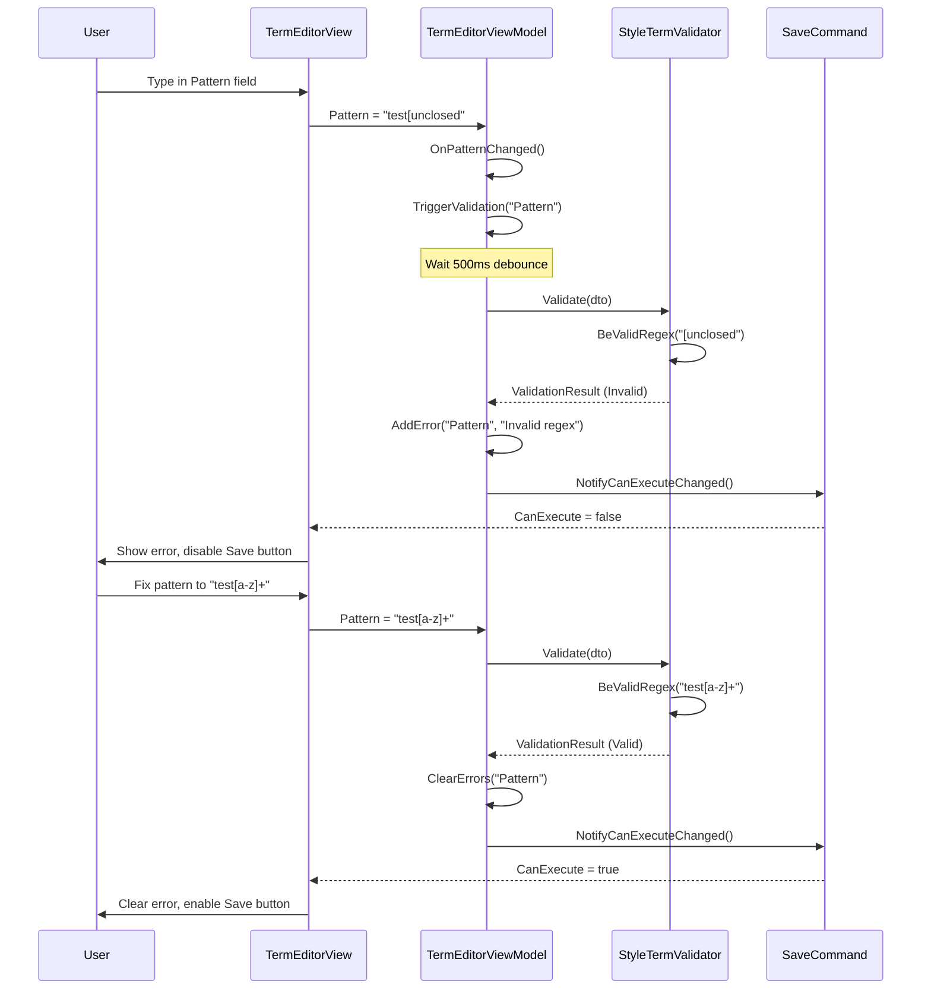

# LDS-01: Feature Design Specification — v0.3.2c Validation Logic

## 1. Metadata & Categorization

| Field                | Value                       | Description                                            |
| :------------------- | :-------------------------- | :----------------------------------------------------- |
| **Feature ID**       | `STY-032c`                  | Style Module - Validation Logic                        |
| **Feature Name**     | Validation Logic            | FluentValidation rules for term data integrity.        |
| **Target Version**   | `v0.3.2c`                   | Sub-part of v0.3.2 Dictionary Manager.                 |
| **Module Scope**     | `Lexichord.Modules.Style`   | Style governance module.                               |
| **Swimlane**         | `Governance`                | Style & Terminology Enforcement.                       |
| **License Tier**     | `Writer Pro`                | Premium feature (validation enforced for all tiers).   |
| **Feature Gate Key** | `Feature.DictionaryManager` | Key used in `ILicenseContext.HasFeature()`.            |
| **Depends On**       | `v0.3.2b` (Term Editor)     | Requires TermEditorViewModel for validation injection. |
| **Author**           | System Architect            |                                                        |
| **Status**           | **Draft**                   | Pending approval.                                      |
| **Last Updated**     | 2026-01-26                  |                                                        |

---

## 2. Executive Summary

### 2.1 The Requirement

The Term Editor Dialog (v0.3.2b) provides a form interface for creating and editing terminology entries. However, users can currently submit invalid data that corrupts the lexicon:

| User Need                     | Current Status  | Expected Behavior                 |
| :---------------------------- | :-------------- | :-------------------------------- |
| Valid pattern required        | ❌ Not enforced | ✅ Block empty pattern submission |
| Regex pattern validation      | ❌ Not enforced | ✅ Reject invalid regex syntax    |
| Pattern length limit          | ❌ Not enforced | ✅ Limit to 500 characters        |
| Valid recommendation required | ❌ Not enforced | ✅ Block empty recommendation     |
| Recommendation length limit   | ❌ Not enforced | ✅ Limit to 1000 characters       |
| Fuzzy threshold range         | ❌ Not enforced | ✅ Range must be 0.5-1.0          |
| Real-time validation feedback | ❌ Not possible | ✅ Inline errors as user types    |
| Regex timeout protection      | ❌ Not possible | ✅ Reject pathological patterns   |

### 2.2 The Proposed Solution

Implement comprehensive validation using FluentValidation:

1. **StyleTermValidator** — `AbstractValidator<StyleTermDto>` with all validation rules.
2. **BeValidRegex Helper** — Timeout-protected regex validation method.
3. **ViewModel Integration** — Inject validator into `TermEditorViewModel`.
4. **Real-Time Validation** — Debounced field validation with inline error display.
5. **Save Gate** — Disable Save button when validation fails.

This approach:

- Uses existing `FluentValidation` NuGet package (v0.0.7d dependency).
- Follows MVVM pattern with `[NotifyDataErrorInfo]` attribute.
- Protects against regex denial-of-service (ReDoS) attacks.
- Provides immediate, user-friendly validation feedback.

---

## 3. Architecture

### 3.1 System Architecture

```
┌─────────────────────────────────────────────────────────────────┐
│                      VALIDATION FLOW                             │
│                                                                  │
│  ┌──────────────────────────────────────────────────────────┐   │
│  │  TermEditorView (UI)                                     │   │
│  │  ├── TextBox.Pattern  ──┐                                │   │
│  │  ├── TextBox.Recommendation  ─┼─► PropertyChanged event  │   │
│  │  ├── Slider.FuzzyThreshold  ──┘                          │   │
│  │  └── Error display bindings (DataValidationErrors)       │   │
│  └──────────────────────────────────────────────────────────┘   │
│                               │                                  │
│                               ▼                                  │
│  ┌──────────────────────────────────────────────────────────┐   │
│  │  TermEditorViewModel                                     │   │
│  │  ├── OnPropertyChanged() → TriggerValidation()           │   │
│  │  ├── ValidateCommand → Full validation cycle             │   │
│  │  ├── SaveCommand.CanExecute → !HasErrors                 │   │
│  │  └── Debounced validation (500ms) for Pattern field      │   │
│  └──────────────────────────────────────────────────────────┘   │
│                               │                                  │
│                               ▼                                  │
│  ┌──────────────────────────────────────────────────────────┐   │
│  │  StyleTermValidator : AbstractValidator<StyleTermDto>    │   │
│  │  ├── Pattern: NotEmpty, MaxLength(500)                   │   │
│  │  ├── Pattern: BeValidRegex (when IsRegex=true)           │   │
│  │  ├── Recommendation: NotEmpty, MaxLength(1000)           │   │
│  │  └── FuzzyThreshold: InclusiveBetween(0.5, 1.0)          │   │
│  └──────────────────────────────────────────────────────────┘   │
│                               │                                  │
│                               ▼                                  │
│  ┌──────────────────────────────────────────────────────────┐   │
│  │  BeValidRegex Helper                                     │   │
│  │  ├── Timeout protection (100ms)                          │   │
│  │  ├── Regex compilation test                              │   │
│  │  └── Returns false for invalid/timeout                   │   │
│  └──────────────────────────────────────────────────────────┘   │
└─────────────────────────────────────────────────────────────────┘
```

### 3.2 Dependencies

**Upstream Interfaces (Required):**

| Interface             | Source Version | Purpose                     |
| :-------------------- | :------------- | :-------------------------- |
| `StyleTermDto`        | v0.3.2a        | DTO for term data binding   |
| `TermEditorViewModel` | v0.3.2b        | Dialog ViewModel to enhance |
| `ViewModelBase`       | v0.1.1         | Base ViewModel class        |

**NuGet Packages (Existing):**

| Package            | Version | Source  | Purpose              |
| :----------------- | :------ | :------ | :------------------- |
| `FluentValidation` | 11.9.x  | v0.0.7d | Validation framework |

**New Types (Defined in v0.3.2c):**

| Type                  | Module        | Purpose                          |
| :-------------------- | :------------ | :------------------------------- |
| `StyleTermValidator`  | Modules.Style | FluentValidation validator class |
| `ValidationConstants` | Modules.Style | Centralized validation constants |

---

## 4. Data Contract

### 4.1 ValidationConstants Class

```csharp
namespace Lexichord.Modules.Style.Validation;

/// <summary>
/// Centralized constants for StyleTerm validation rules.
/// </summary>
/// <remarks>
/// LOGIC: Constants are centralized to ensure consistency between
/// validation messages, UI constraints, and unit tests.
/// </remarks>
public static class ValidationConstants
{
    /// <summary>
    /// Maximum length for pattern field.
    /// </summary>
    public const int PatternMaxLength = 500;

    /// <summary>
    /// Maximum length for recommendation field.
    /// </summary>
    public const int RecommendationMaxLength = 1000;

    /// <summary>
    /// Minimum fuzzy threshold value.
    /// </summary>
    public const double FuzzyThresholdMin = 0.50;

    /// <summary>
    /// Maximum fuzzy threshold value.
    /// </summary>
    public const double FuzzyThresholdMax = 1.00;

    /// <summary>
    /// Timeout for regex validation in milliseconds.
    /// </summary>
    public const int RegexValidationTimeoutMs = 100;

    /// <summary>
    /// Debounce delay for real-time validation in milliseconds.
    /// </summary>
    public const int ValidationDebounceMs = 500;
}
```

### 4.2 StyleTermValidator Class

```csharp
namespace Lexichord.Modules.Style.Validation;

using FluentValidation;
using Microsoft.Extensions.Logging;
using System.Text.RegularExpressions;

/// <summary>
/// FluentValidation validator for StyleTermDto.
/// </summary>
/// <remarks>
/// LOGIC: This validator ensures data integrity for terminology entries.
/// Regex patterns are validated with a timeout to prevent ReDoS attacks.
/// All validation rules are enforced before persistence.
/// </remarks>
public sealed class StyleTermValidator : AbstractValidator<StyleTermDto>
{
    private readonly ILogger<StyleTermValidator>? _logger;

    /// <summary>
    /// Initializes a new instance of the StyleTermValidator.
    /// </summary>
    /// <param name="logger">Optional logger for validation events.</param>
    public StyleTermValidator(ILogger<StyleTermValidator>? logger = null)
    {
        _logger = logger;

        ConfigurePatternRules();
        ConfigureRecommendationRules();
        ConfigureFuzzyRules();
    }

    private void ConfigurePatternRules()
    {
        // RULE: Pattern is required
        RuleFor(x => x.Pattern)
            .NotEmpty()
            .WithMessage("Pattern is required.");

        // RULE: Pattern has maximum length
        RuleFor(x => x.Pattern)
            .MaximumLength(ValidationConstants.PatternMaxLength)
            .WithMessage($"Pattern cannot exceed {ValidationConstants.PatternMaxLength} characters.");

        // RULE: Pattern must be valid regex when IsRegex is true
        RuleFor(x => x.Pattern)
            .Must(BeValidRegex)
            .When(x => x.IsRegex)
            .WithMessage("Invalid regex pattern. Check syntax and complexity.");
    }

    private void ConfigureRecommendationRules()
    {
        // RULE: Recommendation is required
        RuleFor(x => x.Recommendation)
            .NotEmpty()
            .WithMessage("Recommendation is required.");

        // RULE: Recommendation has maximum length
        RuleFor(x => x.Recommendation)
            .MaximumLength(ValidationConstants.RecommendationMaxLength)
            .WithMessage($"Recommendation cannot exceed {ValidationConstants.RecommendationMaxLength} characters.");
    }

    private void ConfigureFuzzyRules()
    {
        // RULE: FuzzyThreshold must be in valid range when fuzzy is enabled
        RuleFor(x => x.FuzzyThreshold)
            .InclusiveBetween(
                ValidationConstants.FuzzyThresholdMin,
                ValidationConstants.FuzzyThresholdMax)
            .When(x => x.FuzzyEnabled)
            .WithMessage($"Threshold must be between {ValidationConstants.FuzzyThresholdMin * 100:F0}% and {ValidationConstants.FuzzyThresholdMax * 100:F0}%.");
    }

    /// <summary>
    /// Validates that a pattern string is a valid regular expression.
    /// </summary>
    /// <param name="pattern">The pattern string to validate.</param>
    /// <returns>True if pattern is a valid regex, false otherwise.</returns>
    /// <remarks>
    /// LOGIC: This method uses a timeout to protect against pathological
    /// regex patterns that could cause catastrophic backtracking (ReDoS).
    /// The timeout is set to 100ms which is generous for pattern compilation.
    /// </remarks>
    private bool BeValidRegex(string pattern)
    {
        if (string.IsNullOrWhiteSpace(pattern))
        {
            return true; // Empty pattern is handled by NotEmpty rule
        }

        try
        {
            // LOGIC: Use RegexOptions.None with explicit timeout
            // This catches pathological patterns during compilation
            _ = new Regex(
                pattern,
                RegexOptions.None,
                TimeSpan.FromMilliseconds(ValidationConstants.RegexValidationTimeoutMs));

            _logger?.LogDebug(
                "Regex pattern validation succeeded: {PatternLength} chars",
                pattern.Length);

            return true;
        }
        catch (ArgumentException ex)
        {
            _logger?.LogDebug(
                "Regex pattern validation failed: {ErrorMessage}",
                ex.Message);
            return false;
        }
        catch (RegexMatchTimeoutException)
        {
            _logger?.LogWarning(
                "Regex pattern validation timeout: pattern too complex ({PatternLength} chars)",
                pattern.Length);
            return false;
        }
    }
}
```

### 4.3 TermEditorViewModel Enhancement

```csharp
namespace Lexichord.Modules.Style.ViewModels;

/// <summary>
/// Enhanced TermEditorViewModel with integrated validation.
/// </summary>
/// <remarks>
/// LOGIC: Validation is triggered on property change (debounced)
/// and on save attempt. The Save button is disabled when errors exist.
/// </remarks>
public sealed partial class TermEditorViewModel : ViewModelBase, INotifyDataErrorInfo
{
    private readonly IValidator<StyleTermDto> _validator;
    private readonly ILogger<TermEditorViewModel> _logger;
    private readonly Dictionary<string, List<string>> _validationErrors = [];
    private readonly Subject<string> _validationSubject = new();
    private IDisposable? _validationSubscription;

    // ... existing properties from v0.3.2b ...

    public TermEditorViewModel(
        StyleTermDto? existingTerm,
        ILicenseContext licenseContext,
        IValidator<StyleTermDto> validator,
        ILogger<TermEditorViewModel> logger)
    {
        _validator = validator;
        _logger = logger;

        // ... existing initialization from v0.3.2b ...

        // LOGIC: Debounce validation by 500ms to avoid UI thrashing
        _validationSubscription = _validationSubject
            .Throttle(TimeSpan.FromMilliseconds(ValidationConstants.ValidationDebounceMs))
            .ObserveOn(RxApp.MainThreadScheduler)
            .Subscribe(ValidateProperty);
    }

    #region INotifyDataErrorInfo Implementation

    /// <inheritdoc />
    public bool HasErrors => _validationErrors.Values.Any(e => e.Count > 0);

    /// <inheritdoc />
    public event EventHandler<DataErrorsChangedEventArgs>? ErrorsChanged;

    /// <inheritdoc />
    public IEnumerable GetErrors(string? propertyName)
    {
        if (string.IsNullOrEmpty(propertyName))
        {
            return _validationErrors.Values.SelectMany(e => e);
        }

        return _validationErrors.TryGetValue(propertyName, out var errors)
            ? errors
            : Enumerable.Empty<string>();
    }

    #endregion

    #region Validation Methods

    /// <summary>
    /// Triggers validation for a specific property (debounced).
    /// </summary>
    /// <param name="propertyName">The property name to validate.</param>
    private void TriggerValidation(string propertyName)
    {
        _validationSubject.OnNext(propertyName);
    }

    /// <summary>
    /// Validates a specific property and updates error state.
    /// </summary>
    /// <param name="propertyName">The property name to validate.</param>
    private void ValidateProperty(string propertyName)
    {
        _logger.LogDebug(
            "Validating property {PropertyName} for term {TermId}",
            propertyName,
            Id);

        var dto = ToDto();
        var result = _validator.Validate(dto);

        // Clear existing errors for this property
        ClearErrors(propertyName);

        // Add new errors for this property
        var propertyErrors = result.Errors
            .Where(e => e.PropertyName == propertyName)
            .Select(e => e.ErrorMessage)
            .ToList();

        if (propertyErrors.Count > 0)
        {
            _validationErrors[propertyName] = propertyErrors;
            RaiseErrorsChanged(propertyName);

            _logger.LogDebug(
                "Property {PropertyName} has {ErrorCount} validation errors",
                propertyName,
                propertyErrors.Count);
        }

        OnPropertyChanged(nameof(HasErrors));
        SaveCommand.NotifyCanExecuteChanged();
    }

    /// <summary>
    /// Performs full validation of all properties.
    /// </summary>
    /// <returns>True if validation passes, false otherwise.</returns>
    [RelayCommand]
    private bool ValidateAll()
    {
        _logger.LogDebug("Performing full validation for term {TermId}", Id);

        var dto = ToDto();
        var result = _validator.Validate(dto);

        // Clear all existing errors
        ClearAllErrors();

        // Group errors by property and add
        foreach (var group in result.Errors.GroupBy(e => e.PropertyName))
        {
            _validationErrors[group.Key] = group.Select(e => e.ErrorMessage).ToList();
            RaiseErrorsChanged(group.Key);
        }

        OnPropertyChanged(nameof(HasErrors));
        SaveCommand.NotifyCanExecuteChanged();

        _logger.LogDebug(
            "Full validation result: IsValid={IsValid}, Errors={ErrorCount}",
            result.IsValid,
            result.Errors.Count);

        return result.IsValid;
    }

    /// <summary>
    /// Clears errors for a specific property.
    /// </summary>
    /// <param name="propertyName">The property name to clear.</param>
    private void ClearErrors(string propertyName)
    {
        if (_validationErrors.Remove(propertyName))
        {
            RaiseErrorsChanged(propertyName);
        }
    }

    /// <summary>
    /// Clears all validation errors.
    /// </summary>
    private void ClearAllErrors()
    {
        var properties = _validationErrors.Keys.ToList();
        _validationErrors.Clear();

        foreach (var property in properties)
        {
            RaiseErrorsChanged(property);
        }
    }

    /// <summary>
    /// Raises the ErrorsChanged event.
    /// </summary>
    /// <param name="propertyName">The property name that changed.</param>
    private void RaiseErrorsChanged(string propertyName)
    {
        ErrorsChanged?.Invoke(this, new DataErrorsChangedEventArgs(propertyName));
    }

    #endregion

    #region Property Change Handlers

    partial void OnPatternChanged(string value)
    {
        // LOGIC: Pattern changes trigger debounced validation
        // Also need to re-validate when IsRegex changes
        TriggerValidation(nameof(Pattern));
    }

    partial void OnIsRegexChanged(bool value)
    {
        // LOGIC: Changing regex mode may invalidate the pattern
        TriggerValidation(nameof(Pattern));
    }

    partial void OnRecommendationChanged(string value)
    {
        TriggerValidation(nameof(Recommendation));
    }

    partial void OnFuzzyEnabledChanged(bool value)
    {
        // LOGIC: Enabling fuzzy may require threshold validation
        if (value)
        {
            TriggerValidation(nameof(FuzzyThreshold));
        }
    }

    partial void OnFuzzyThresholdChanged(double value)
    {
        TriggerValidation(nameof(FuzzyThreshold));
    }

    #endregion

    #region Commands

    /// <summary>
    /// Saves the term if validation passes.
    /// </summary>
    [RelayCommand(CanExecute = nameof(CanSave))]
    private StyleTermDto? Save()
    {
        if (!ValidateAll())
        {
            _logger.LogWarning(
                "Save blocked for term {TermId}: validation failed with {ErrorCount} errors",
                Id,
                _validationErrors.Values.Sum(e => e.Count));
            return null;
        }

        var dto = ToDto();
        _logger.LogInformation(
            "Term {TermId} validated and ready to save: {Pattern}",
            dto.Id,
            dto.Pattern);

        return dto;
    }

    /// <summary>
    /// Determines if the Save command can execute.
    /// </summary>
    private bool CanSave() => !HasErrors;

    #endregion

    /// <summary>
    /// Disposes of subscriptions.
    /// </summary>
    public void Dispose()
    {
        _validationSubscription?.Dispose();
        _validationSubject.Dispose();
    }
}
```

---

## 5. Implementation Logic

### 5.1 Flow Diagram



---

## 6. Decision Trees

### 6.1 Should Pattern Be Valid?

```text
START: "Is the Pattern field valid?"
│
├── Is Pattern empty or whitespace?
│   └── YES → INVALID: "Pattern is required."
│
├── Is Pattern length > 500 characters?
│   └── YES → INVALID: "Pattern cannot exceed 500 characters."
│
├── Is "Is Regex" checkbox checked?
│   └── YES → Is pattern valid regex?
│       ├── Parse fails (ArgumentException)
│       │   └── INVALID: "Invalid regex pattern. Check syntax."
│       ├── Parse times out (> 100ms)
│       │   └── INVALID: "Invalid regex pattern. Too complex."
│       └── Parse succeeds
│           └── VALID
│
└── Is "Is Regex" unchecked?
    └── VALID (literal string, no regex validation needed)
```

### 6.2 Should Fuzzy Threshold Be Valid?

```text
START: "Is the Fuzzy Threshold valid?"
│
├── Is "Enable Fuzzy Match" unchecked?
│   └── YES → VALID (threshold ignored when fuzzy disabled)
│
├── Is threshold < 0.50 (50%)?
│   └── YES → INVALID: "Threshold must be between 50% and 100%."
│
├── Is threshold > 1.00 (100%)?
│   └── YES → INVALID: "Threshold must be between 50% and 100%."
│
└── Is threshold in range [0.50, 1.00]?
    └── YES → VALID
```

### 6.3 Should Save Button Be Enabled?

```text
START: "Can the user click Save?"
│
├── Does ViewModel.HasErrors return true?
│   └── YES → DISABLED: Keep Save button grayed out
│
├── Does ViewModel.HasErrors return false?
│   └── YES → Check individual fields:
│       ├── Pattern validation passed?
│       ├── Recommendation validation passed?
│       └── FuzzyThreshold validation passed (if enabled)?
│       └── All passed → ENABLED
│
└── END
```

---

## 7. User Stories

| ID    | Role            | Story                                                               | AC                                                 |
| :---- | :-------------- | :------------------------------------------------------------------ | :------------------------------------------------- |
| US-01 | Writer Pro User | As a paid user, I want validation to prevent empty patterns.        | Empty pattern shows error, Save disabled.          |
| US-02 | Writer Pro User | As a paid user, I want validation to prevent invalid regex.         | Invalid regex shows error with clear message.      |
| US-03 | Writer Pro User | As a paid user, I want validation to prevent empty recommendations. | Empty recommendation shows error, Save disabled.   |
| US-04 | Writer Pro User | As a paid user, I want fuzzy threshold to be in valid range.        | Out-of-range threshold shows error.                |
| US-05 | Writer Pro User | As a paid user, I want real-time validation as I type.              | Errors appear within 500ms of stopping typing.     |
| US-06 | Writer Pro User | As a paid user, I want the Save button disabled on errors.          | Save button is grayed out when validation fails.   |
| US-07 | Developer       | As a developer, I want protection against ReDoS attacks.            | Pathological regex patterns rejected with timeout. |
| US-08 | Developer       | As a developer, I want centralized validation constants.            | All limits defined in ValidationConstants class.   |

---

## 8. Use Cases

### UC-01: Real-Time Pattern Validation

**Preconditions:**

- Term Editor dialog is open.
- User has "Is Regex" checkbox checked.

**Flow:**

1. User types `[unclosed` in Pattern field.
2. After 500ms debounce delay:
    1. ViewModel triggers validation.
    2. Validator attempts to compile regex.
    3. Regex compilation fails with `ArgumentException`.
    4. Validation result contains Pattern error.
3. ViewModel updates error state.
4. ErrorsChanged event fires.
5. UI displays error message below Pattern field.
6. Save button becomes disabled.
7. User fixes pattern to `[a-z]+`.
8. After 500ms debounce delay:
    1. Validator compiles regex successfully.
    2. Validation result is valid.
9. Error message clears.
10. Save button becomes enabled.

**Postconditions:**

- User sees immediate feedback on pattern validity.
- Invalid data cannot be submitted.

---

### UC-02: Pathological Regex Protection

**Preconditions:**

- Term Editor dialog is open.
- User has "Is Regex" checkbox checked.

**Flow:**

1. User pastes complex regex: `(a+)+$` (known ReDoS pattern).
2. After 500ms debounce delay:
    1. ViewModel triggers validation.
    2. Validator attempts to compile regex with 100ms timeout.
    3. Compilation takes too long (pathological backtracking).
    4. `RegexMatchTimeoutException` caught.
    5. Validation returns failure.
3. Error message displayed: "Invalid regex pattern. Check syntax and complexity."
4. Log warning recorded: "Regex pattern validation timeout."
5. Save button disabled.

**Postconditions:**

- Application protected from ReDoS attack.
- User informed of pattern complexity issue.

---

### UC-03: Save Attempt with Validation Errors

**Preconditions:**

- Term Editor dialog is open.
- Pattern field is empty.

**Flow:**

1. User clicks Save button (should be disabled, but testing edge case).
2. `SaveCommand.Execute()` is called.
3. `ValidateAll()` runs full validation.
4. Validation fails with "Pattern is required." error.
5. `Save()` method returns null.
6. Log warning recorded: "Save blocked: validation failed."
7. Dialog remains open.
8. Error message shown to user.

**Postconditions:**

- Invalid data not persisted.
- User has clear path to fix issues.

---

## 9. Unit Testing Requirements

### 9.1 StyleTermValidatorTests

```csharp
[Trait("Category", "Unit")]
[Trait("Version", "v0.3.2c")]
public class StyleTermValidatorTests
{
    private readonly StyleTermValidator _sut = new();

    #region Pattern Tests

    [Fact]
    public void Validate_WithEmptyPattern_ReturnsPatternRequiredError()
    {
        // Arrange
        var term = CreateDto(pattern: "", recommendation: "Use something else");

        // Act
        var result = _sut.Validate(term);

        // Assert
        result.IsValid.Should().BeFalse();
        result.Errors.Should().Contain(e =>
            e.PropertyName == "Pattern" &&
            e.ErrorMessage == "Pattern is required.");
    }

    [Fact]
    public void Validate_WithWhitespacePattern_ReturnsPatternRequiredError()
    {
        // Arrange
        var term = CreateDto(pattern: "   ", recommendation: "Use something else");

        // Act
        var result = _sut.Validate(term);

        // Assert
        result.IsValid.Should().BeFalse();
        result.Errors.Should().Contain(e => e.PropertyName == "Pattern");
    }

    [Fact]
    public void Validate_WithPatternExceedingMaxLength_ReturnsLengthError()
    {
        // Arrange
        var longPattern = new string('x', ValidationConstants.PatternMaxLength + 1);
        var term = CreateDto(pattern: longPattern, recommendation: "Use something else");

        // Act
        var result = _sut.Validate(term);

        // Assert
        result.IsValid.Should().BeFalse();
        result.Errors.Should().Contain(e =>
            e.PropertyName == "Pattern" &&
            e.ErrorMessage.Contains("500 characters"));
    }

    [Theory]
    [InlineData("[unclosed")]
    [InlineData("(unmatched")]
    [InlineData("*invalid")]
    [InlineData("(?<invalid")]
    [InlineData("(?P<invalid")]
    public void Validate_WithInvalidRegex_ReturnsRegexError(string pattern)
    {
        // Arrange
        var term = CreateDto(pattern: pattern, isRegex: true, recommendation: "test");

        // Act
        var result = _sut.Validate(term);

        // Assert
        result.IsValid.Should().BeFalse();
        result.Errors.Should().Contain(e =>
            e.PropertyName == "Pattern" &&
            e.ErrorMessage.Contains("Invalid regex"));
    }

    [Theory]
    [InlineData(@"\bwhitelist\b")]
    [InlineData(@"white[-\s]?list")]
    [InlineData(@"^\s*#.*$")]
    [InlineData(@"[a-zA-Z0-9]+")]
    [InlineData(@"(?i)test")]
    public void Validate_WithValidRegex_NoPatternError(string pattern)
    {
        // Arrange
        var term = CreateDto(pattern: pattern, isRegex: true, recommendation: "test");

        // Act
        var result = _sut.Validate(term);

        // Assert
        result.Errors.Should().NotContain(e =>
            e.PropertyName == "Pattern" &&
            e.ErrorMessage.Contains("Invalid regex"));
    }

    [Fact]
    public void Validate_WithRegexPatternButIsRegexFalse_DoesNotValidateRegex()
    {
        // Arrange
        var term = CreateDto(
            pattern: "[unclosed",
            isRegex: false, // Not marked as regex
            recommendation: "test");

        // Act
        var result = _sut.Validate(term);

        // Assert
        result.Errors.Should().NotContain(e =>
            e.ErrorMessage.Contains("Invalid regex"));
    }

    #endregion

    #region Recommendation Tests

    [Fact]
    public void Validate_WithEmptyRecommendation_ReturnsRecommendationRequiredError()
    {
        // Arrange
        var term = CreateDto(pattern: "test", recommendation: "");

        // Act
        var result = _sut.Validate(term);

        // Assert
        result.IsValid.Should().BeFalse();
        result.Errors.Should().Contain(e =>
            e.PropertyName == "Recommendation" &&
            e.ErrorMessage == "Recommendation is required.");
    }

    [Fact]
    public void Validate_WithRecommendationExceedingMaxLength_ReturnsLengthError()
    {
        // Arrange
        var longRec = new string('x', ValidationConstants.RecommendationMaxLength + 1);
        var term = CreateDto(pattern: "test", recommendation: longRec);

        // Act
        var result = _sut.Validate(term);

        // Assert
        result.IsValid.Should().BeFalse();
        result.Errors.Should().Contain(e =>
            e.PropertyName == "Recommendation" &&
            e.ErrorMessage.Contains("1000 characters"));
    }

    #endregion

    #region FuzzyThreshold Tests

    [Theory]
    [InlineData(0.49)]
    [InlineData(0.0)]
    [InlineData(-0.1)]
    public void Validate_WithThresholdBelowMinimum_ReturnsRangeError(double threshold)
    {
        // Arrange
        var term = CreateDto(
            pattern: "test",
            recommendation: "test",
            fuzzyEnabled: true,
            fuzzyThreshold: threshold);

        // Act
        var result = _sut.Validate(term);

        // Assert
        result.IsValid.Should().BeFalse();
        result.Errors.Should().Contain(e =>
            e.PropertyName == "FuzzyThreshold" &&
            e.ErrorMessage.Contains("50%"));
    }

    [Theory]
    [InlineData(1.01)]
    [InlineData(1.5)]
    [InlineData(2.0)]
    public void Validate_WithThresholdAboveMaximum_ReturnsRangeError(double threshold)
    {
        // Arrange
        var term = CreateDto(
            pattern: "test",
            recommendation: "test",
            fuzzyEnabled: true,
            fuzzyThreshold: threshold);

        // Act
        var result = _sut.Validate(term);

        // Assert
        result.IsValid.Should().BeFalse();
        result.Errors.Should().Contain(e =>
            e.PropertyName == "FuzzyThreshold" &&
            e.ErrorMessage.Contains("100%"));
    }

    [Theory]
    [InlineData(0.50)]
    [InlineData(0.75)]
    [InlineData(0.80)]
    [InlineData(1.00)]
    public void Validate_WithThresholdInRange_NoThresholdError(double threshold)
    {
        // Arrange
        var term = CreateDto(
            pattern: "test",
            recommendation: "test",
            fuzzyEnabled: true,
            fuzzyThreshold: threshold);

        // Act
        var result = _sut.Validate(term);

        // Assert
        result.Errors.Should().NotContain(e => e.PropertyName == "FuzzyThreshold");
    }

    [Fact]
    public void Validate_WithFuzzyDisabled_ThresholdNotValidated()
    {
        // Arrange
        var term = CreateDto(
            pattern: "test",
            recommendation: "test",
            fuzzyEnabled: false,
            fuzzyThreshold: 0.0); // Invalid threshold but fuzzy disabled

        // Act
        var result = _sut.Validate(term);

        // Assert
        result.Errors.Should().NotContain(e => e.PropertyName == "FuzzyThreshold");
    }

    #endregion

    #region Complete Validation Tests

    [Fact]
    public void Validate_WithAllValidFields_ReturnsValid()
    {
        // Arrange
        var term = CreateDto(
            pattern: "whitelist",
            recommendation: "Use 'allowlist' instead",
            isRegex: false,
            fuzzyEnabled: true,
            fuzzyThreshold: 0.80);

        // Act
        var result = _sut.Validate(term);

        // Assert
        result.IsValid.Should().BeTrue();
        result.Errors.Should().BeEmpty();
    }

    [Fact]
    public void Validate_WithMultipleErrors_ReturnsAllErrors()
    {
        // Arrange
        var term = CreateDto(
            pattern: "",
            recommendation: "",
            fuzzyEnabled: true,
            fuzzyThreshold: 0.0);

        // Act
        var result = _sut.Validate(term);

        // Assert
        result.IsValid.Should().BeFalse();
        result.Errors.Should().HaveCountGreaterOrEqualTo(3);
        result.Errors.Should().Contain(e => e.PropertyName == "Pattern");
        result.Errors.Should().Contain(e => e.PropertyName == "Recommendation");
        result.Errors.Should().Contain(e => e.PropertyName == "FuzzyThreshold");
    }

    #endregion

    #region Helper Methods

    private static StyleTermDto CreateDto(
        string pattern = "test",
        string recommendation = "test recommendation",
        bool isRegex = false,
        bool fuzzyEnabled = false,
        double fuzzyThreshold = 0.80) => new()
    {
        Id = Guid.NewGuid(),
        Pattern = pattern,
        IsRegex = isRegex,
        Recommendation = recommendation,
        Category = RuleCategory.Terminology,
        Severity = ViolationSeverity.Warning,
        FuzzyEnabled = fuzzyEnabled,
        FuzzyThreshold = fuzzyThreshold
    };

    #endregion
}
```

### 9.2 TermEditorViewModel Validation Tests

```csharp
[Trait("Category", "Unit")]
[Trait("Version", "v0.3.2c")]
public class TermEditorViewModelValidationTests
{
    private readonly Mock<ILicenseContext> _mockLicense;
    private readonly Mock<ILogger<TermEditorViewModel>> _mockLogger;
    private readonly StyleTermValidator _validator;

    public TermEditorViewModelValidationTests()
    {
        _mockLicense = new Mock<ILicenseContext>();
        _mockLogger = new Mock<ILogger<TermEditorViewModel>>();
        _validator = new StyleTermValidator();

        _mockLicense.Setup(l => l.HasFeature(Feature.FuzzyMatching))
            .Returns(true);
    }

    [Fact]
    public void HasErrors_WithEmptyPattern_ReturnsTrue()
    {
        // Arrange
        var sut = CreateViewModel(null);
        sut.Pattern = "";
        sut.Recommendation = "test";

        // Act
        sut.ValidateAllCommand.Execute(null);

        // Assert
        sut.HasErrors.Should().BeTrue();
    }

    [Fact]
    public void HasErrors_WithValidData_ReturnsFalse()
    {
        // Arrange
        var sut = CreateViewModel(null);
        sut.Pattern = "test";
        sut.Recommendation = "test recommendation";

        // Act
        sut.ValidateAllCommand.Execute(null);

        // Assert
        sut.HasErrors.Should().BeFalse();
    }

    [Fact]
    public void GetErrors_WithInvalidPattern_ReturnsPatternErrors()
    {
        // Arrange
        var sut = CreateViewModel(null);
        sut.Pattern = "";
        sut.Recommendation = "test";

        // Act
        sut.ValidateAllCommand.Execute(null);
        var errors = sut.GetErrors("Pattern").Cast<string>().ToList();

        // Assert
        errors.Should().Contain("Pattern is required.");
    }

    [Fact]
    public void CanSave_WithErrors_ReturnsFalse()
    {
        // Arrange
        var sut = CreateViewModel(null);
        sut.Pattern = "";

        // Act
        sut.ValidateAllCommand.Execute(null);

        // Assert
        sut.SaveCommand.CanExecute(null).Should().BeFalse();
    }

    [Fact]
    public void CanSave_WithNoErrors_ReturnsTrue()
    {
        // Arrange
        var sut = CreateViewModel(null);
        sut.Pattern = "test";
        sut.Recommendation = "test recommendation";

        // Act
        sut.ValidateAllCommand.Execute(null);

        // Assert
        sut.SaveCommand.CanExecute(null).Should().BeTrue();
    }

    [Fact]
    public void Save_WithValidationErrors_ReturnsNull()
    {
        // Arrange
        var sut = CreateViewModel(null);
        sut.Pattern = "";

        // Act
        var result = sut.SaveCommand.Execute(null);

        // Assert
        result.Should().BeNull();
    }

    [Fact]
    public void ErrorsChanged_WhenPatternChanges_FiresEvent()
    {
        // Arrange
        var sut = CreateViewModel(null);
        sut.Pattern = "valid";
        sut.Recommendation = "test";
        sut.ValidateAllCommand.Execute(null);

        bool eventFired = false;
        sut.ErrorsChanged += (s, e) =>
        {
            if (e.PropertyName == "Pattern") eventFired = true;
        };

        // Act
        sut.Pattern = "";
        sut.ValidateAllCommand.Execute(null);

        // Assert
        eventFired.Should().BeTrue();
    }

    private TermEditorViewModel CreateViewModel(StyleTermDto? term) =>
        new(term, _mockLicense.Object, _validator, _mockLogger.Object);
}
```

---

## 10. Observability & Logging

| Level   | Source              | Message Template                                                                |
| :------ | :------------------ | :------------------------------------------------------------------------------ |
| Debug   | StyleTermValidator  | `Regex pattern validation succeeded: {PatternLength} chars`                     |
| Debug   | StyleTermValidator  | `Regex pattern validation failed: {ErrorMessage}`                               |
| Warning | StyleTermValidator  | `Regex pattern validation timeout: pattern too complex ({PatternLength} chars)` |
| Debug   | TermEditorViewModel | `Validating property {PropertyName} for term {TermId}`                          |
| Debug   | TermEditorViewModel | `Property {PropertyName} has {ErrorCount} validation errors`                    |
| Debug   | TermEditorViewModel | `Performing full validation for term {TermId}`                                  |
| Debug   | TermEditorViewModel | `Full validation result: IsValid={IsValid}, Errors={ErrorCount}`                |
| Warning | TermEditorViewModel | `Save blocked for term {TermId}: validation failed with {ErrorCount} errors`    |
| Info    | TermEditorViewModel | `Term {TermId} validated and ready to save: {Pattern}`                          |

---

## 11. UI/UX Specifications

### 11.1 Error Display

```
┌─────────────────────────────────────────────────────────┐
│  Pattern *                                              │
│  ┌──────────────────────────────────────────────────┐   │
│  │ [unclosed                                        │   │ ← Red border
│  └──────────────────────────────────────────────────┘   │
│  ⚠️ Invalid regex pattern. Check syntax and complexity. │ ← Error message
│                                                         │
│  Recommendation *                                       │
│  ┌──────────────────────────────────────────────────┐   │
│  │                                                  │   │ ← Red border
│  └──────────────────────────────────────────────────┘   │
│  ⚠️ Recommendation is required.                         │ ← Error message
│                                                         │
│  ─── Fuzzy Matching ───────────────────────────────────│
│  [✓] Enable Fuzzy Match                                 │
│  Threshold:  [●========] 45%                            │ ← Out of range
│  ⚠️ Threshold must be between 50% and 100%.             │ ← Error message
│                                                         │
├─────────────────────────────────────────────────────────┤
│              [Cancel]        [Save Term]                │ ← Disabled
└─────────────────────────────────────────────────────────┘
```

### 11.2 Theme Integration

| Element         | Resource                    | Notes                  |
| :-------------- | :-------------------------- | :--------------------- |
| Error Border    | `Brush.Status.Error`        | Red border on error    |
| Error Text      | `Brush.Status.Error`        | Error message color    |
| Error Icon      | Material.Icons `Warning`    | Warning triangle       |
| Disabled Button | `LexButtonPrimary:disabled` | Grayed out Save button |
| Success Border  | Default                     | Normal border on valid |

### 11.3 AXAML Error Display

```xml
<TextBox Theme="{StaticResource LexTextBox}"
         Text="{Binding Pattern}"
         Classes.error="{Binding (DataValidationErrors.HasErrors)}">
  <DataValidationErrors.Error>
    <TextBlock Text="{Binding (DataValidationErrors.Errors)[0]}"
               Foreground="{StaticResource Brush.Status.Error}"
               FontSize="12"
               Margin="0,4,0,0" />
  </DataValidationErrors.Error>
</TextBox>
```

---

## 12. Acceptance Criteria

| #   | Category          | Criterion                                                       |
| :-- | :---------------- | :-------------------------------------------------------------- |
| 1   | **[Validation]**  | Empty pattern shows "Pattern is required." error.               |
| 2   | **[Validation]**  | Pattern > 500 chars shows length error.                         |
| 3   | **[Validation]**  | Invalid regex pattern shows "Invalid regex pattern." error.     |
| 4   | **[Validation]**  | Pathological regex times out within 100ms.                      |
| 5   | **[Validation]**  | Empty recommendation shows "Recommendation is required." error. |
| 6   | **[Validation]**  | Recommendation > 1000 chars shows length error.                 |
| 7   | **[Validation]**  | Threshold < 0.5 shows range error when fuzzy enabled.           |
| 8   | **[Validation]**  | Threshold > 1.0 shows range error when fuzzy enabled.           |
| 9   | **[Validation]**  | Threshold ignored when fuzzy disabled.                          |
| 10  | **[Real-Time]**   | Errors appear within 500ms of typing.                           |
| 11  | **[Real-Time]**   | Errors clear immediately when field becomes valid.              |
| 12  | **[UI]**          | Error fields have red border.                                   |
| 13  | **[UI]**          | Error messages appear below fields.                             |
| 14  | **[UI]**          | Save button disabled when HasErrors is true.                    |
| 15  | **[UI]**          | Save button enabled when HasErrors is false.                    |
| 16  | **[Integration]** | TermEditorViewModel injects StyleTermValidator via DI.          |
| 17  | **[Logging]**     | Validation failures logged at Debug level.                      |
| 18  | **[Logging]**     | Regex timeouts logged at Warning level.                         |

---

## 13. Deliverable Checklist

| Step | Description                                             | Status |
| :--- | :------------------------------------------------------ | :----- |
| 1    | `ValidationConstants` class with centralized values.    | [ ]    |
| 2    | `StyleTermValidator` class with all validation rules.   | [ ]    |
| 3    | `BeValidRegex` helper with timeout protection.          | [ ]    |
| 4    | Update `TermEditorViewModel` with INotifyDataErrorInfo. | [ ]    |
| 5    | Debounced validation on property changes.               | [ ]    |
| 6    | SaveCommand.CanExecute bound to !HasErrors.             | [ ]    |
| 7    | DI registration for `StyleTermValidator`.               | [ ]    |
| 8    | Unit tests for `StyleTermValidator`.                    | [ ]    |
| 9    | Unit tests for ViewModel validation integration.        | [ ]    |
| 10   | Update `TermEditorView.axaml` with error display.       | [ ]    |

---

## 14. DI Registration

```csharp
// In StyleModule.cs
public static IServiceCollection AddStyleModule(this IServiceCollection services)
{
    // ... existing registrations ...

    // v0.3.2c: Validation
    services.AddTransient<IValidator<StyleTermDto>, StyleTermValidator>();
    services.AddTransient<StyleTermValidator>();

    return services;
}
```

---

## 15. Verification Commands

```bash
# ═══════════════════════════════════════════════════════════════════════════
# v0.3.2c Verification
# ═══════════════════════════════════════════════════════════════════════════

# 1. Build solution
dotnet build src/Lexichord.sln

# 2. Run validation unit tests
dotnet test --filter "Version=v0.3.2c"

# 3. Run specific validator tests
dotnet test --filter "FullyQualifiedName~StyleTermValidatorTests"

# 4. Manual verification:
# a) Open Term Editor dialog
# b) Leave Pattern empty → error should appear, Save disabled
# c) Enter "[unclosed" with "Is Regex" checked → regex error
# d) Enter "(a+)+$" → timeout/complexity error
# e) Leave Recommendation empty → error should appear
# f) Enable Fuzzy, set threshold to 40% → range error
# g) Fix all fields → all errors clear, Save enabled
# h) Click Save → dialog closes, term created
```

---

## 16. Changelog Entry

```markdown
### v0.3.2c — Validation Logic

**Added:**

- `StyleTermValidator` class with FluentValidation rules (STY-032c)
- `ValidationConstants` for centralized validation limits (STY-032c)
- `BeValidRegex` helper with 100ms timeout protection (STY-032c)
- `INotifyDataErrorInfo` implementation in `TermEditorViewModel` (STY-032c)
- Debounced real-time validation (500ms) on field changes (STY-032c)
- Inline error display in Term Editor dialog (STY-032c)
- Save button disabled when validation fails (STY-032c)

**Technical:**

- Protection against ReDoS attacks via regex compilation timeout
- All validation constants centralized for consistency
- Complete unit test coverage for all validation rules
```
