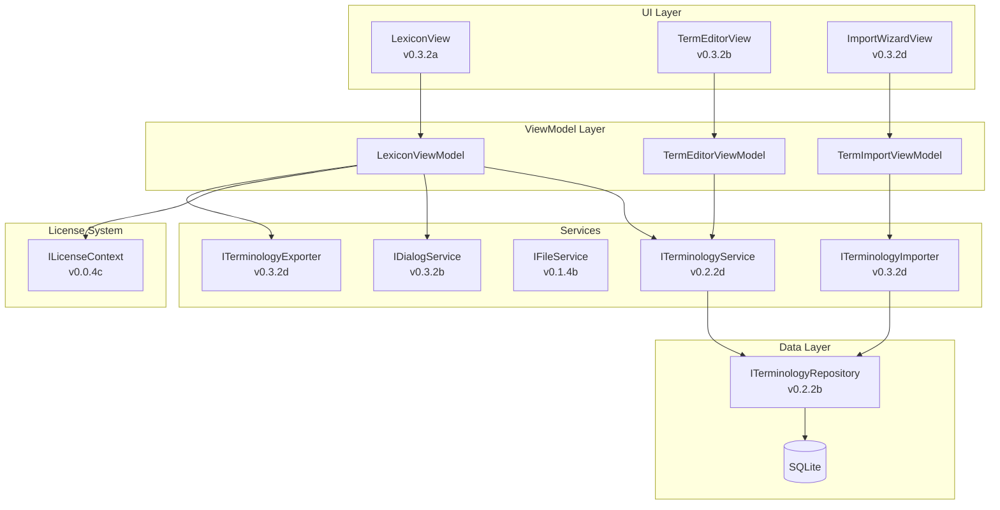

# LDS-01: Feature Design Specification

## 1. Metadata & Categorization

| Field                | Value                       | Description                                    |
| :------------------- | :-------------------------- | :--------------------------------------------- |
| **Feature ID**       | `STY-032`                   | Style Module - Dictionary Manager              |
| **Feature Name**     | Dictionary Manager          | CRUD UI for terminology management.            |
| **Target Version**   | `v0.3.2`                    | Algorithmic Analysis Phase.                    |
| **Module Scope**     | `Lexichord.Modules.Style`   | Style governance module.                       |
| **Swimlane**         | `Governance`                | Style & Terminology Enforcement.               |
| **License Tier**     | `Writer Pro`                | Premium feature (Core users cannot access UI). |
| **Feature Gate Key** | `Feature.DictionaryManager` | Key used in `ILicenseContext.HasFeature()`.    |
| **Author**           | System Architect            |                                                |
| **Reviewer**         | Lead Architect              |                                                |
| **Status**           | **Draft**                   | Pending approval.                              |
| **Last Updated**     | 2026-01-26                  |                                                |

---

## 2. Executive Summary

### 2.1 The Requirement

Users need a visual interface to manage the terminology lexicon. Currently, terms can only be modified through:

- Direct database access (developer-only)
- Seed data modifications (requires rebuild)

This creates friction for:
| User Need | Current Status | Expected Behavior |
| :--------------------------- | :------------- | :----------------------------- |
| View all terms | ❌ Not possible | ✅ DataGrid with search/filter |
| Add new term | ❌ Database SQL | ✅ Modal dialog |
| Edit existing term | ❌ Database SQL | ✅ Modal dialog |
| Delete term | ❌ Database SQL | ✅ Confirmation dialog |
| Bulk import from CSV | ❌ Not possible | ✅ Import wizard |
| Export terms | ❌ Not possible | ✅ JSON/CSV export |

### 2.2 The Proposed Solution

Implement a Dictionary Manager UI with four sub-parts:

1. **v0.3.2a: DataGrid Infrastructure** — `LexiconView` with sorting, filtering, and virtualization.
2. **v0.3.2b: Term Editor Dialog** — Modal CRUD dialog with all term fields.
3. **v0.3.2c: Validation Logic** — FluentValidation rules for term integrity.
4. **v0.3.2d: Bulk Import/Export** — CSV import wizard and JSON export.

This approach:

- Uses native `Avalonia.Controls.DataGrid` for performance.
- Follows MVVM pattern with `CommunityToolkit.Mvvm`.
- Integrates with existing `ITerminologyRepository` (v0.2.2b).
- Gates UI behind `Writer Pro` license tier.

---

## 3. Architecture & Modular Strategy

### 3.1 System Architecture



### 3.2 Dependencies

**Upstream Interfaces:**

| Interface                | Source Version | Purpose                               |
| :----------------------- | :------------- | :------------------------------------ |
| `StyleTerm`              | v0.2.2a        | Entity model for terminology          |
| `ITerminologyRepository` | v0.2.2b        | Database access for terms             |
| `ITerminologyService`    | v0.2.2d        | Business logic for term management    |
| `ILicenseContext`        | v0.0.4c        | Read-only license tier access         |
| `IFileService`           | v0.1.4b        | File picker dialogs                   |
| `LexiconChangedEvent`    | v0.2.2d        | MediatR notification for term changes |

**New Interfaces (This Version):**

| Interface              | Module        | Purpose                        |
| :--------------------- | :------------ | :----------------------------- |
| `IDialogService`       | Abstractions  | Modal dialog management        |
| `ITerminologyImporter` | Modules.Style | CSV import with column mapping |
| `ITerminologyExporter` | Modules.Style | JSON/CSV export                |

**NuGet Packages:**

| Package     | Version | Purpose                        |
| :---------- | :------ | :----------------------------- |
| `CsvHelper` | 31.x    | CSV parsing and column mapping |

### 3.3 Licensing Behavior

- **Load Behavior:**
    - [ ] **Hard Gate:** The Module DLL is not loaded at all.
    - [x] **Soft Gate:** The Module loads, but UI shows upgrade prompt.
    - [ ] **UI Gate:** The UI elements are hidden/disabled.

- **Fallback Experience:**
    > Core users who navigate to the Dictionary Manager see an upgrade prompt explaining the feature requires Writer Pro. The navigation rail icon is visible but clicking shows a modal with upgrade CTA.

---

## 4. Data Contract (The API)

### 4.1 IDialogService Interface

```csharp
namespace Lexichord.Abstractions.Contracts;

/// <summary>
/// Provides modal dialog management for the application.
/// </summary>
public interface IDialogService
{
    /// <summary>
    /// Shows a confirmation dialog with Yes/No options.
    /// </summary>
    Task<bool> ShowConfirmationAsync(
        string title,
        string message,
        CancellationToken cancellationToken = default);

    /// <summary>
    /// Shows a modal dialog and returns the result.
    /// </summary>
    Task<DialogResult<T>> ShowDialogAsync<T>(
        object viewModel,
        CancellationToken cancellationToken = default);
}
```

### 4.2 DialogResult Record

```csharp
namespace Lexichord.Abstractions.Models;

/// <summary>
/// Represents the result of a modal dialog.
/// </summary>
public sealed record DialogResult<T>(bool IsConfirmed, T? Value);
```

### 4.3 StyleTermDto Record

```csharp
namespace Lexichord.Abstractions.Models;

/// <summary>
/// Data transfer object for term editor binding.
/// </summary>
/// <remarks>
/// LOGIC: This DTO is used for two-way binding in the Term Editor.
/// It mirrors StyleTerm but allows mutation during editing.
/// </remarks>
public sealed record StyleTermDto
{
    public Guid Id { get; init; }
    public string Pattern { get; set; } = string.Empty;
    public bool IsRegex { get; set; }
    public string Recommendation { get; set; } = string.Empty;
    public RuleCategory Category { get; set; }
    public ViolationSeverity Severity { get; set; }
    public string Tags { get; set; } = string.Empty;
    public bool FuzzyEnabled { get; set; }
    public double FuzzyThreshold { get; set; } = 0.80;
}
```

### 4.4 ITerminologyImporter Interface

```csharp
namespace Lexichord.Abstractions.Contracts;

/// <summary>
/// Imports terminology from external files.
/// </summary>
public interface ITerminologyImporter
{
    /// <summary>
    /// Detects column mappings from a CSV file.
    /// </summary>
    Task<IReadOnlyList<string>> DetectColumnsAsync(
        string filePath,
        CancellationToken cancellationToken = default);

    /// <summary>
    /// Imports terms from a CSV file with specified mappings.
    /// </summary>
    Task<ImportResult> ImportAsync(
        string filePath,
        ImportOptions options,
        CancellationToken cancellationToken = default);
}
```

### 4.5 ITerminologyExporter Interface

```csharp
namespace Lexichord.Abstractions.Contracts;

/// <summary>
/// Exports terminology to external files.
/// </summary>
public interface ITerminologyExporter
{
    /// <summary>
    /// Exports all terms to a JSON file.
    /// </summary>
    Task ExportToJsonAsync(
        string filePath,
        CancellationToken cancellationToken = default);

    /// <summary>
    /// Exports all terms to a CSV file.
    /// </summary>
    Task ExportToCsvAsync(
        string filePath,
        CancellationToken cancellationToken = default);
}
```

### 4.6 Import Supporting Types

```csharp
namespace Lexichord.Abstractions.Models;

public sealed record ImportOptions(
    IReadOnlyDictionary<string, string> ColumnMappings,
    bool SkipDuplicates = true,
    bool ValidateRegex = true);

public sealed record ImportResult(
    int SuccessCount,
    int SkippedCount,
    IReadOnlyList<ImportError> Errors);

public sealed record ImportError(
    int RowNumber,
    string Column,
    string Message);
```

---

## 5. Implementation Logic

### 5.1 LexiconViewModel

```csharp
namespace Lexichord.UI.ViewModels;

public sealed partial class LexiconViewModel : ViewModelBase
{
    private readonly ITerminologyService _terminologyService;
    private readonly IDialogService _dialogService;
    private readonly ITerminologyExporter _exporter;
    private readonly ILicenseContext _licenseContext;
    private readonly ILogger<LexiconViewModel> _logger;

    [ObservableProperty]
    private ObservableCollection<StyleTermDto> _terms = [];

    [ObservableProperty]
    private string _searchFilter = string.Empty;

    [ObservableProperty]
    private RuleCategory? _categoryFilter;

    public bool HasWriterPro => _licenseContext.HasFeature(Feature.DictionaryManager);

    [RelayCommand]
    private async Task LoadTermsAsync(CancellationToken cancellationToken)
    {
        _logger.LogDebug("Loading terminology lexicon");
        var terms = await _terminologyService.GetAllTermsAsync(cancellationToken);
        Terms = new ObservableCollection<StyleTermDto>(
            terms.Select(t => t.ToDto()));
        _logger.LogInformation("Loaded {TermCount} terms", Terms.Count);
    }

    [RelayCommand]
    private async Task AddTermAsync(CancellationToken cancellationToken)
    {
        var viewModel = new TermEditorViewModel(new StyleTermDto());
        var result = await _dialogService.ShowDialogAsync<StyleTermDto>(
            viewModel, cancellationToken);

        if (result.IsConfirmed && result.Value is not null)
        {
            await _terminologyService.CreateTermAsync(
                result.Value.ToEntity(), cancellationToken);
            await LoadTermsAsync(cancellationToken);
        }
    }

    [RelayCommand]
    private async Task EditTermAsync(
        StyleTermDto term,
        CancellationToken cancellationToken)
    {
        var viewModel = new TermEditorViewModel(term with { });
        var result = await _dialogService.ShowDialogAsync<StyleTermDto>(
            viewModel, cancellationToken);

        if (result.IsConfirmed && result.Value is not null)
        {
            await _terminologyService.UpdateTermAsync(
                result.Value.ToEntity(), cancellationToken);
            await LoadTermsAsync(cancellationToken);
        }
    }

    [RelayCommand]
    private async Task DeleteTermAsync(
        StyleTermDto term,
        CancellationToken cancellationToken)
    {
        var confirmed = await _dialogService.ShowConfirmationAsync(
            "Delete Term",
            $"Are you sure you want to delete '{term.Pattern}'?",
            cancellationToken);

        if (confirmed)
        {
            _logger.LogInformation("Deleting term {TermId}", term.Id);
            await _terminologyService.DeleteTermAsync(term.Id, cancellationToken);
            await LoadTermsAsync(cancellationToken);
        }
    }

    [RelayCommand]
    private async Task ExportAsync(CancellationToken cancellationToken)
    {
        // Export implementation uses IFileService for save dialog
    }
}
```

### 5.2 StyleTermValidator

```csharp
namespace Lexichord.Modules.Style.Validation;

public sealed class StyleTermValidator : AbstractValidator<StyleTermDto>
{
    public StyleTermValidator()
    {
        RuleFor(x => x.Pattern)
            .NotEmpty().WithMessage("Pattern is required")
            .MaximumLength(500).WithMessage("Pattern cannot exceed 500 characters");

        RuleFor(x => x.Pattern)
            .Must(BeValidRegex)
            .When(x => x.IsRegex)
            .WithMessage("Invalid regex pattern");

        RuleFor(x => x.Recommendation)
            .NotEmpty().WithMessage("Recommendation is required")
            .MaximumLength(1000);

        RuleFor(x => x.FuzzyThreshold)
            .InclusiveBetween(0.50, 1.00)
            .When(x => x.FuzzyEnabled)
            .WithMessage("Threshold must be between 50% and 100%");
    }

    private static bool BeValidRegex(string pattern)
    {
        try
        {
            using var cts = new CancellationTokenSource(TimeSpan.FromMilliseconds(100));
            _ = new Regex(pattern, RegexOptions.None, TimeSpan.FromMilliseconds(50));
            return true;
        }
        catch
        {
            return false;
        }
    }
}
```

---

## 6. UI/UX Specifications

### 6.1 LexiconView Layout

```
┌─────────────────────────────────────────────────────────────┐
│  Toolbar: [+ Add Term] [Import CSV] [Export ▼]              │
├─────────────────────────────────────────────────────────────┤
│  Filter Bar: [🔍 Search...] [Category ▼] [Severity ▼]       │
├───────┬──────────┬──────────┬──────────┬───────────┬────────┤
│Pattern│ Category │ Severity │ Fuzzy    │ Tags      │Actions │
├───────┼──────────┼──────────┼──────────┼───────────┼────────┤
│wl...  │ Termin.. │ Warning  │ ✓ 80%    │ inclusive │ ✏️ 🗑️   │
│bl...  │ Termin.. │ Warning  │ ✓ 80%    │ inclusive │ ✏️ 🗑️   │
│...    │ ...      │ ...      │ ...      │ ...       │ ...    │
├───────┴──────────┴──────────┴──────────┴───────────┴────────┤
│  Footer: Showing 45 of 128 terms              [+ Add Term]  │
└─────────────────────────────────────────────────────────────┘
```

### 6.2 TermEditorView Dialog

```
┌─────────────────────────────────────────────┐
│  Edit Term                              [X] │
├─────────────────────────────────────────────┤
│  Pattern*        [whitelist____________]    │
│  □ Use Regular Expression                   │
│                                             │
│  Recommendation* [allowlist____________]    │
│                                             │
│  Category        [Terminology ▼]            │
│  Severity        [Warning ▼]                │
│  Tags            [inclusive, language__]    │
│                                             │
│  ─── Fuzzy Matching (Writer Pro) ─────────  │
│  □ Enable Fuzzy Matching                    │
│  Threshold       [====○====] 80%            │
│                                             │
├─────────────────────────────────────────────┤
│            [Cancel]        [Save]           │
└─────────────────────────────────────────────┘
```

### 6.3 Theme Integration

| Element         | Resource            | Value     |
| :-------------- | :------------------ | :-------- |
| Dialog BG       | `Surface.Elevated`  | `#1E1E1E` |
| Primary Button  | `Accent.Primary`    | `#FF6B35` |
| DataGrid Header | `Surface.Secondary` | `#2D2D2D` |
| Text Primary    | `Text.Primary`      | `#E0E0E0` |
| Error Text      | `Status.Error`      | `#FF6B6B` |

---

## 7. Observability & Logging

| Level   | Source              | Message Template                                                    |
| :------ | :------------------ | :------------------------------------------------------------------ |
| Debug   | LexiconViewModel    | `Loading terminology lexicon`                                       |
| Info    | LexiconViewModel    | `Loaded {TermCount} terms`                                          |
| Info    | LexiconViewModel    | `Deleting term {TermId}`                                            |
| Info    | TerminologyImporter | `Import completed: {SuccessCount} imported, {SkippedCount} skipped` |
| Warning | StyleTermValidator  | `Regex validation timeout for pattern length {Length}`              |
| Error   | TerminologyImporter | `Import failed at row {RowNumber}: {ErrorMessage}`                  |

---

## 8. Acceptance Criteria (QA)

| #   | Category          | Criterion                                                   |
| :-- | :---------------- | :---------------------------------------------------------- |
| 1   | **[DataGrid]**    | Terms display in virtualized DataGrid with 1000+ items.     |
| 2   | **[Filter]**      | Search filter updates grid in real-time.                    |
| 3   | **[CRUD]**        | Add, Edit, Delete operations persist to database.           |
| 4   | **[Validation]**  | Invalid regex patterns show error before save.              |
| 5   | **[Import]**      | CSV import with column mapping wizard succeeds.             |
| 6   | **[Export]**      | JSON export creates valid, re-importable file.              |
| 7   | **[License]**     | Core users see upgrade prompt, cannot access CRUD.          |
| 8   | **[Fuzzy Gate]**  | Fuzzy toggle disabled for Core users in Term Editor.        |
| 9   | **[UX]**          | Dialog follows UX Design System (dark mode, orange accent). |
| 10  | **[Performance]** | DataGrid renders 1000 rows without lag.                     |

---

## 9. Deliverable Checklist

| Step | Description                                              | Status |
| :--- | :------------------------------------------------------- | :----- |
| 1    | `IDialogService` interface in Abstractions.              | [ ]    |
| 2    | `DialogResult<T>` record in Abstractions.                | [ ]    |
| 3    | `StyleTermDto` record in Abstractions.                   | [ ]    |
| 4    | `LexiconView.axaml` with DataGrid and toolbar.           | [ ]    |
| 5    | `LexiconViewModel` with CRUD commands.                   | [ ]    |
| 6    | `TermEditorView.axaml` modal dialog.                     | [ ]    |
| 7    | `TermEditorViewModel` with validation.                   | [ ]    |
| 8    | `StyleTermValidator` FluentValidation rules.             | [ ]    |
| 9    | `ITerminologyImporter` interface.                        | [ ]    |
| 10   | `CsvTerminologyImporter` implementation using CsvHelper. | [ ]    |
| 11   | `ITerminologyExporter` interface.                        | [ ]    |
| 12   | `JsonTerminologyExporter` implementation.                | [ ]    |
| 13   | `ImportWizardView.axaml` for column mapping.             | [ ]    |
| 14   | License gate checks in ViewModel.                        | [ ]    |
| 15   | Unit tests for `LexiconViewModel`.                       | [ ]    |
| 16   | Unit tests for `StyleTermValidator`.                     | [ ]    |
| 17   | Unit tests for `CsvTerminologyImporter`.                 | [ ]    |

---

## 10. Verification Commands

```bash
# ═══════════════════════════════════════════════════════════════════════════
# v0.3.2 Verification
# ═══════════════════════════════════════════════════════════════════════════

# 1. Verify CsvHelper package installed
dotnet list src/Lexichord.Modules.Style package | grep CsvHelper

# 2. Build solution
dotnet build src/Lexichord.sln

# 3. Run unit tests
dotnet test --filter "Category=Unit&FullyQualifiedName~Dictionary"

# 4. Manual verification (Core user):
# a) Open app with Core license
# b) Click Dictionary Manager in navigation
# c) Verify upgrade prompt appears

# 5. Manual verification (Writer Pro user):
# a) Open app with Writer Pro license
# b) Navigate to Dictionary Manager
# c) Add a new term with pattern "test"
# d) Verify term appears in grid
# e) Edit the term, change recommendation
# f) Delete the term, confirm deletion
# g) Import CSV file with test data
# h) Export terms to JSON
```

---

## 11. Changelog Entry

```markdown
### v0.3.2 — The Dictionary Manager (CRUD UI)

**Added:**

- `LexiconView` DataGrid for viewing/filtering terminology - (STY-032a)
- `TermEditorView` modal dialog for CRUD operations - (STY-032b)
- `StyleTermValidator` FluentValidation rules - (STY-032c)
- CSV import with column mapping wizard - (STY-032d)
- JSON export functionality - (STY-032d)
- `IDialogService` for modal dialog management - (STY-032b)
- `ITerminologyImporter` and `ITerminologyExporter` interfaces - (STY-032d)

**Changed:**

- Dictionary Manager gated behind Writer Pro license - (STY-032)

**Dependencies:**

- Added `CsvHelper` 31.x NuGet package - (STY-032d)
```
