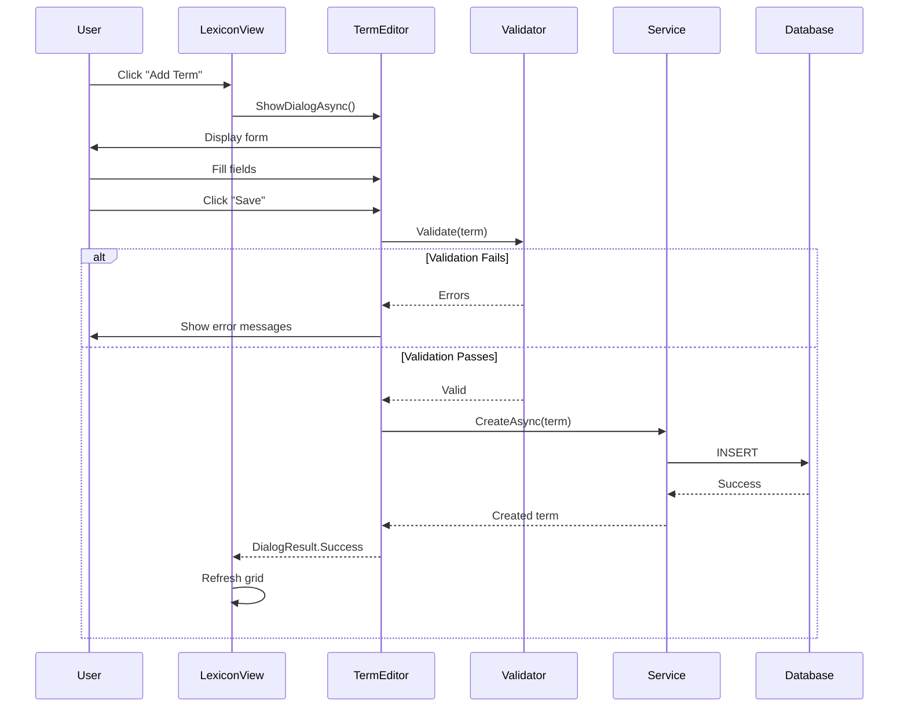
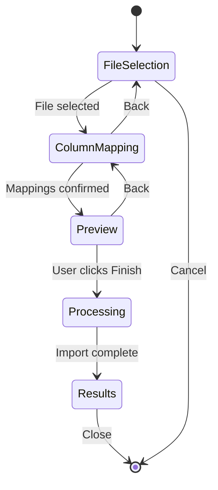

# LCS-SBD: Scope Breakdown - v0.3.2

**Target Version:** `v0.3.2`
**Codename:** The Dictionary Manager (CRUD UI)
**Timeline:** Sprint 3.2 (Terminology Management)
**Owner:** Lead Architect
**Prerequisites:** v0.3.1 complete (The Fuzzy Engine).

## 1. Executive Summary

**v0.3.2** delivers a **user-facing management interface** for the Lexicon (terminology database). While v0.2.x established the backend `ITerminologyRepository` and v0.3.1 added fuzzy matching capabilities, users still lack a proper GUI to view, create, edit, and bulk-manage their style terms.

This version introduces:

1. A **DataGrid-based Lexicon View** with sorting/filtering
2. A **Term Editor Dialog** for creating and modifying terms
3. **FluentValidation rules** setting for input integrity
4. **Bulk Import/Export** capabilities (CSV/JSON)

**Success Metrics:**

1. Users can perform full CRUD operations on terminology via GUI.
2. Validation prevents invalid regex patterns from being saved.
3. Import wizard successfully maps CSV columns to database fields.
4. Export produces valid JSON for backup/sharing.
5. All UI respects license gating (Writer Pro+ for Dictionary Manager GUI).

If this foundation is flawed, the Voice Profiler (v0.3.4) and Resonance Dashboard (v0.3.5) will lack the configuration interface.

---

## 2. Sub-Part Specifications

### v0.3.2a: DataGrid Infrastructure

**Goal:** Create the primary view for managing terminology with column sorting and filtering.

- **Task 1.1: LexiconView UserControl**
    - Create `LexiconView.axaml` in `Modules.Style/Views`.
    - Use `Avalonia.Controls.DataGrid` as the primary component.
    - Apply theme resources from `UX_DESIGN_SYSTEM.md` (Surface.Elevated background, Border.Subtle).
- **Task 1.2: DataGrid Column Binding**
    - Bind columns: _Term_, _Category_, _Severity_, _Tags_, _Fuzzy Enabled_.
    - Column widths: Term (2*), Category (1*), Severity (0.5*), Tags (1*), Fuzzy (0.5\*).
    - Enable `CanUserSortColumns="True"` for all columns.
- **Task 1.3: Column Filtering**
    - Add `TextBox` filter above DataGrid with `Watermark="Filter terms..."`.
    - Implement reactive filtering via `IObservable<string>` with 300ms debounce.
    - Filter logic: Match term pattern OR category name (case-insensitive).
- **Task 1.4: ViewModel (LexiconViewModel)**
    - Create `LexiconViewModel` extending `ViewModelBase`.
    - Properties: `ObservableCollection<StyleTermDto> Terms`, `string FilterText`, `StyleTermDto? SelectedTerm`.
    - Commands: `AddTermCommand`, `EditTermCommand`, `DeleteTermCommand`, `RefreshCommand`.
    - Inject `ITerminologyService` for data operations.
- **Task 1.5: Context Menu**
    - Right-click context menu: _Edit_, _Duplicate_, _Delete_.
    - Keyboard shortcuts: `Delete` key for deletion, `Enter` for edit.
- **Task 1.6: DI Registration**
    - Register `LexiconView` and `LexiconViewModel` in `StyleModule.cs`.

**Definition of Done:**

- `LexiconView` displays all terms from database in DataGrid.
- Columns are sortable by clicking headers.
- Filter reduces visible rows in real-time.
- Context menu enables edit/delete operations.
- Unit tests verify ViewModel filter logic.

---

### v0.3.2b: Term Editor Dialog

**Goal:** Create a specialized dialog for creating and editing terminology entries.

- **Task 1.1: TermEditorView UserControl**
    - Create `TermEditorView.axaml` as a modal dialog.
    - Layout: Vertical stack with labeled form fields.
    - Apply `LexTextBox` and `LexButton` styles from component library.
- **Task 1.2: Form Fields**
    - **Pattern Input** (`TextBox`): The term or regex pattern to match.
    - **Is Regex Checkbox** (`CheckBox`): Toggles regex mode.
    - **Category Dropdown** (`ComboBox`): Bound to `RuleCategory` enum.
    - **Severity Dropdown** (`ComboBox`): Bound to `ViolationSeverity` enum.
    - **Recommendation Input** (`TextBox`): Suggested replacement text.
    - **Tags Input** (`TextBox`): Comma-separated tag list.
    - **Fuzzy Match Toggle** (`ToggleSwitch`): Enable fuzzy matching.
    - **Fuzzy Threshold Slider** (`Slider`): Range 0.5-1.0, default 0.8.
- **Task 1.3: License Gating for Fuzzy Controls**
    - Wrap Fuzzy controls in `Panel` with `IsEnabled="{Binding IsFuzzyAvailable}"`.
    - Show tooltip: "Upgrade to Writer Pro to enable fuzzy matching."
    - `IsFuzzyAvailable` bound to `ILicenseContext.HasFeature(Feature.FuzzyMatching)`.
- **Task 1.4: TermEditorViewModel**
    - Create `TermEditorViewModel` with observable properties for each field.
    - Constructor accepts optional `StyleTermDto` for edit mode (null = create mode).
    - Commands: `SaveCommand`, `CancelCommand`, `TestPatternCommand`.
    - `TestPatternCommand` validates regex and shows match preview.
- **Task 1.5: Dialog Service Integration**
    - Use `IDialogService.ShowDialogAsync<TermEditorView>()` pattern.
    - Return `DialogResult<StyleTermDto>` with saved entity or null if cancelled.
- **Task 1.6: Accessibility**
    - Set `AutomationProperties.Name` on all form controls.
    - Tab order follows visual layout (top-to-bottom).
    - Focus first field when dialog opens.

**Definition of Done:**

- Term Editor opens in modal overlay.
- All fields bind correctly to ViewModel.
- Fuzzy controls are disabled for Core users with upgrade tooltip.
- Save returns the modified/created term entity.
- Cancel closes dialog without changes.

---

### v0.3.2c: Validation Logic

**Goal:** Implement FluentValidation rules to ensure data integrity.

- **Task 1.1: StyleTermValidator Class**
    - Create `StyleTermValidator : AbstractValidator<StyleTermDto>` in `Modules.Style/Validators`.
    - Reference `FluentValidation` NuGet package (already in dependency matrix v0.0.7d).
- **Task 1.2: Validation Rules**
    - **Pattern Required:** `RuleFor(x => x.Pattern).NotEmpty().WithMessage("Pattern is required.")`.
    - **Pattern Length:** `RuleFor(x => x.Pattern).MaximumLength(500)`.
    - **Regex Validity:** Custom rule when `IsRegex == true`:
        ```csharp
        RuleFor(x => x.Pattern)
            .Must(BeValidRegex)
            .When(x => x.IsRegex)
            .WithMessage("Invalid regex pattern.");
        ```
    - **Recommendation Required:** `RuleFor(x => x.Recommendation).NotEmpty()`.
    - **Threshold Range:** `RuleFor(x => x.FuzzyThreshold).InclusiveBetween(0.5, 1.0)`.
- **Task 1.3: BeValidRegex Helper**
    - Implement: `bool BeValidRegex(string pattern)`:
        ```csharp
        try { _ = new Regex(pattern); return true; }
        catch { return false; }
        ```
- **Task 1.4: ViewModel Validation Integration**
    - Inject `IValidator<StyleTermDto>` into `TermEditorViewModel`.
    - Validate on `SaveCommand` execution.
    - Bind validation errors to `TextBox.Classes="error"` style.
    - Display error messages below respective fields.
- **Task 1.5: Real-Time Validation**
    - Validate Pattern field on text change (debounced 500ms).
    - Show inline error immediately for invalid regex.
    - Disable Save button when validation fails.
- **Task 1.6: DI Registration**
    - Register `StyleTermValidator` as transient in container.

**Definition of Done:**

- Empty pattern shows validation error.
- Invalid regex (e.g., `[unclosed`) shows "Invalid regex pattern."
- Threshold outside 0.5-1.0 shows range error.
- Save button is disabled when validation fails.
- Unit tests cover all validation rules.

---

### v0.3.2d: Bulk Import/Export

**Goal:** Enable batch operations for terminology via CSV import and JSON export.

- **Task 1.1: CsvHelper Integration**
    - Add `CsvHelper` NuGet package to `Modules.Style`.
    - Create `ITerminologyImporter` interface in Abstractions.
    - Create `CsvTerminologyImporter` implementation.
- **Task 1.2: Import Wizard**
    - Create `ImportWizardView.axaml` with 3-step wizard:
        1. **File Selection:** File picker filtered to `*.csv`.
        2. **Column Mapping:** Map CSV headers to StyleTerm fields.
        3. **Preview & Confirm:** Show first 10 rows, confirm import.
    - Wizard navigation: Back/Next/Finish buttons.
- **Task 1.3: Column Mapping Logic**
    - Create `ImportMapping` record: `(string CsvColumn, string DbField)`.
    - Required mappings: Pattern, Recommendation.
    - Optional mappings: Category, Severity, Tags, IsRegex, FuzzyEnabled, FuzzyThreshold.
    - Auto-detect common column names (case-insensitive): "term", "pattern", "suggestion", "replacement".
- **Task 1.4: Import Service**
    - Create `ITerminologyImportService` interface:
        ```csharp
        Task<ImportResult> ImportAsync(
            Stream csvStream,
            IReadOnlyList<ImportMapping> mappings,
            ImportOptions options,
            CancellationToken ct);
        ```
    - `ImportResult`: `record ImportResult(int Imported, int Skipped, IReadOnlyList<ImportError> Errors)`.
    - `ImportOptions`: `record ImportOptions(bool SkipDuplicates, bool OverwriteExisting)`.
- **Task 1.5: Export Service**
    - Create `ITerminologyExporter` interface in Abstractions.
    - Create `JsonTerminologyExporter` implementation.
    - Export format:
        ```json
        {
          "version": "1.0",
          "exportedAt": "2026-01-26T12:00:00Z",
          "terms": [
            { "pattern": "whitelist", "recommendation": "allowlist", ... }
          ]
        }
        ```
    - Export to file via `IFileService.SaveFileAsync()`.
- **Task 1.6: Export UI**
    - Add "Export" button to `LexiconView` toolbar.
    - Show file save dialog filtered to `*.json`.
    - Progress indicator during export.
- **Task 1.7: DI Registration**
    - Register `CsvTerminologyImporter`, `JsonTerminologyExporter`, `ITerminologyImportService`.

**Definition of Done:**

- CSV file with proper columns imports successfully.
- Import wizard correctly maps columns to fields.
- Duplicate handling (skip/overwrite) works per options.
- Export produces valid JSON with all term data.
- Unit tests verify import parsing and export serialization.

---

## 3. Implementation Checklist (for Developer)

| Step       | Description                                                    | Status |
| :--------- | :------------------------------------------------------------- | :----- |
| **0.3.2a** | `LexiconView.axaml` created with DataGrid component.           | [ ]    |
| **0.3.2a** | DataGrid columns bound: Term, Category, Severity, Tags, Fuzzy. | [ ]    |
| **0.3.2a** | Filter TextBox with debounced reactive filtering.              | [ ]    |
| **0.3.2a** | `LexiconViewModel` with CRUD commands implemented.             | [ ]    |
| **0.3.2a** | Context menu with Edit/Duplicate/Delete actions.               | [ ]    |
| **0.3.2a** | Unit tests for ViewModel filter logic.                         | [ ]    |
| **0.3.2b** | `TermEditorView.axaml` created with form layout.               | [ ]    |
| **0.3.2b** | All form fields bound to ViewModel properties.                 | [ ]    |
| **0.3.2b** | Fuzzy controls license-gated with tooltip.                     | [ ]    |
| **0.3.2b** | `TermEditorViewModel` with Save/Cancel/TestPattern commands.   | [ ]    |
| **0.3.2b** | Dialog service integration complete.                           | [ ]    |
| **0.3.2b** | Accessibility properties set on all controls.                  | [ ]    |
| **0.3.2c** | `StyleTermValidator` with all rules implemented.               | [ ]    |
| **0.3.2c** | `BeValidRegex` helper validates regex patterns.                | [ ]    |
| **0.3.2c** | Validation errors display inline in form.                      | [ ]    |
| **0.3.2c** | Save button disabled when validation fails.                    | [ ]    |
| **0.3.2c** | Unit tests for all validation rules.                           | [ ]    |
| **0.3.2d** | `CsvHelper` NuGet package added.                               | [ ]    |
| **0.3.2d** | `ImportWizardView.axaml` with 3-step wizard.                   | [ ]    |
| **0.3.2d** | Column mapping auto-detection implemented.                     | [ ]    |
| **0.3.2d** | `ITerminologyImportService` implementation complete.           | [ ]    |
| **0.3.2d** | `JsonTerminologyExporter` implementation complete.             | [ ]    |
| **0.3.2d** | Export button and file dialog in LexiconView.                  | [ ]    |
| **0.3.2d** | Unit tests for import/export services.                         | [ ]    |

---

## 4. Dependency Matrix

### 4.1 Required Interfaces (from earlier versions)

| Interface                | Source Version | Purpose                              |
| :----------------------- | :------------- | :----------------------------------- |
| `StyleTerm`              | v0.2.2a        | Entity model for terminology         |
| `ITerminologyRepository` | v0.2.2b        | Database access for terms            |
| `ITerminologyService`    | v0.2.2d        | CRUD with events                     |
| `ILicenseContext`        | v0.0.4c        | Read-only license tier access        |
| `LicenseTier`            | v0.0.4c        | Core/WriterPro/Teams/Enterprise enum |
| `RuleCategory`           | v0.2.1b        | Terminology/Formatting/Syntax enum   |
| `ViolationSeverity`      | v0.2.1b        | Error/Warning/Info/Hint enum         |
| `IFileService`           | v0.1.4b        | Atomic file I/O                      |
| `Feature.FuzzyMatching`  | v0.3.1d        | Fuzzy feature gate key               |
| `ViewModelBase`          | v0.1.1         | Base ViewModel class                 |

### 4.2 New Interfaces (defined in v0.3.2)

| Interface                   | Defined In | Module        | Purpose                 |
| :-------------------------- | :--------- | :------------ | :---------------------- |
| `ITerminologyImporter`      | v0.3.2d    | Abstractions  | CSV import contract     |
| `ITerminologyExporter`      | v0.3.2d    | Abstractions  | JSON export contract    |
| `ITerminologyImportService` | v0.3.2d    | Modules.Style | Import orchestration    |
| `IDialogService`            | v0.3.2b    | Abstractions  | Modal dialog management |

### 4.3 New Records/DTOs (defined in v0.3.2)

| Record            | Defined In | Purpose                                |
| :---------------- | :--------- | :------------------------------------- |
| `StyleTermDto`    | v0.3.2a    | View-layer representation of StyleTerm |
| `ImportMapping`   | v0.3.2d    | CSV column to DB field mapping         |
| `ImportResult`    | v0.3.2d    | Import operation outcome               |
| `ImportOptions`   | v0.3.2d    | Skip/overwrite configuration           |
| `ImportError`     | v0.3.2d    | Row-level import failure details       |
| `DialogResult<T>` | v0.3.2b    | Dialog return value wrapper            |

### 4.4 NuGet Packages (New)

| Package     | Version | Purpose                    |
| :---------- | :------ | :------------------------- |
| `CsvHelper` | 31.x    | CSV parsing and generation |

### 4.5 NuGet Packages (Existing)

| Package            | Version | Purpose                    |
| :----------------- | :------ | :------------------------- |
| `FluentValidation` | 11.9.x  | Input validation (v0.0.7d) |

---

## 5. Risks & Mitigations

- **Risk:** DataGrid performance degrades with large term dictionaries (10,000+ terms).
    - _Mitigation:_ Use `VirtualizingStackPanel`; implement paged loading if > 5000 terms.
- **Risk:** CSV import fails on malformed files (unquoted commas, encoding issues).
    - _Mitigation:_ Use CsvHelper's robust parsing; show clear error messages per row.
- **Risk:** Regex validation timeout on pathological patterns.
    - _Mitigation:_ Wrap `new Regex()` in timeout; reject patterns that take > 100ms.
- **Risk:** Import wizard confuses users with column mapping.
    - _Mitigation:_ Auto-detect common column names; preview mapped data before commit.
- **Risk:** License check bypass via direct service calls.
    - _Mitigation:_ Gate at ViewModel level (UI) AND service level (defense in depth).

---

## 6. Decision Trees

### 6.1 Should Term Editor Allow Save?

```text
START: "Can the user save this term?"
│
├── Is Pattern field empty?
│   ├── YES → BLOCK: Show "Pattern is required" error
│   └── NO → Continue
│
├── Is "Is Regex" checked?
│   ├── YES → Is pattern valid regex?
│   │   ├── NO → BLOCK: Show "Invalid regex pattern" error
│   │   └── YES → Continue
│   └── NO → Continue
│
├── Is Recommendation field empty?
│   ├── YES → BLOCK: Show "Recommendation is required" error
│   └── NO → Continue
│
├── Is Fuzzy Match enabled?
│   ├── YES → Is user license >= WriterPro?
│   │   ├── NO → BLOCK: Fuzzy toggle should be disabled
│   │   └── YES → Is threshold in range 0.5-1.0?
│   │       ├── NO → BLOCK: Show range error
│   │       └── YES → Continue
│   └── NO → Continue
│
└── ALLOW: Enable Save button
```

### 6.2 Import Row Processing

```text
START: "How to process this CSV row?"
│
├── Does row have required Pattern column?
│   ├── NO → SKIP: Log error "Missing pattern on row {n}"
│   └── YES → Continue
│
├── Does term with same Pattern already exist?
│   ├── YES → Check ImportOptions.OverwriteExisting
│   │   ├── TRUE → UPDATE existing term
│   │   └── FALSE → SKIP: Log "Duplicate skipped on row {n}"
│   └── NO → INSERT new term
│
├── Is "IsRegex" column true?
│   ├── YES → Validate regex
│   │   ├── INVALID → SKIP: Log "Invalid regex on row {n}"
│   │   └── VALID → Continue
│   └── NO → Continue
│
└── COMMIT: Add to import batch
```

---

## 7. User Stories

| ID    | Role            | Story                                                                        | Acceptance Criteria                                   |
| :---- | :-------------- | :--------------------------------------------------------------------------- | :---------------------------------------------------- |
| US-01 | Writer Pro User | As a paid user, I want to view all my terms in a sortable grid.              | DataGrid shows all terms with sortable columns.       |
| US-02 | Writer Pro User | As a paid user, I want to filter terms by name or category.                  | Filter reduces grid to matching entries in real-time. |
| US-03 | Writer Pro User | As a paid user, I want to add new terms with pattern/recommendation.         | Term Editor creates new term saved to database.       |
| US-04 | Writer Pro User | As a paid user, I want to edit existing terms.                               | Term Editor loads existing data and saves changes.    |
| US-05 | Writer Pro User | As a paid user, I want validation to prevent invalid regex from being saved. | Invalid regex shows error, Save button disabled.      |
| US-06 | Writer Pro User | As a paid user, I want to import terms from a CSV file.                      | Import wizard maps columns and creates terms.         |
| US-07 | Writer Pro User | As a paid user, I want to export my lexicon to JSON for backup.              | Export button generates valid JSON file.              |
| US-08 | Core User       | As a free user, I understand Dictionary Manager is a premium feature.        | LexiconView is hidden or shows upgrade prompt.        |
| US-09 | Developer       | As a developer, I want clear validation errors for data integrity.           | All fields validate with descriptive messages.        |

---

## 8. Use Cases

### UC-01: Create New Term

**Preconditions:**

- User has Writer Pro license.
- LexiconView is open.

**Flow:**

1. User clicks "Add Term" button in toolbar.
2. TermEditorView opens in modal overlay.
3. User enters pattern: "whitelist".
4. User leaves "Is Regex?" unchecked.
5. User selects Category: "Terminology".
6. User selects Severity: "Error".
7. User enters Recommendation: "Use 'allowlist' instead."
8. User optionally enables Fuzzy Match with threshold 0.85.
9. User clicks "Save".
10. Validation passes.
11. Term is saved to database via `ITerminologyService.CreateAsync()`.
12. `LexiconChangedEvent` is published.
13. LexiconView refreshes to show new term.
14. Dialog closes.

**Postconditions:**

- New term appears in DataGrid.
- Term is persisted in database.

---

### UC-02: Import Terms from CSV

**Preconditions:**

- User has Writer Pro license.
- User has CSV file with headers: Term, Replacement, Category.

**Flow:**

1. User clicks "Import" button in LexiconView toolbar.
2. ImportWizardView opens (Step 1: File Selection).
3. User clicks "Browse" and selects "my-terms.csv".
4. File is parsed; headers are detected.
5. User clicks "Next" (Step 2: Column Mapping).
6. Wizard shows mapping UI:
    - CSV "Term" → DB "Pattern" (auto-detected)
    - CSV "Replacement" → DB "Recommendation" (auto-detected)
    - CSV "Category" → DB "Category"
7. User confirms mappings and clicks "Next" (Step 3: Preview).
8. Wizard shows first 10 rows as preview.
9. User selects "Skip duplicates" option.
10. User clicks "Finish".
11. Import service processes all rows.
12. Result dialog: "Imported 45 terms. Skipped 5 duplicates."
13. LexiconView refreshes.

**Postconditions:**

- New terms appear in DataGrid.
- Duplicates were not overwritten.

---

### UC-03: License Gate Enforcement

**Preconditions:**

- User has Core (free) license.

**Flow:**

1. User navigates to Style module.
2. LexiconView checks license: `HasFeature(Feature.DictionaryManager)` → FALSE.
3. LexiconView shows placeholder panel instead of DataGrid.
4. Placeholder displays:
    - Lock icon.
    - Text: "Dictionary Manager requires Writer Pro".
    - "Upgrade" button linking to subscription page.
5. User cannot access CRUD functionality.

**Postconditions:**

- No terminology data is exposed to unauthorized user.
- Clear upgrade path is provided.

---

## 9. Unit Testing Requirements

### 9.1 LexiconViewModel Tests

```csharp
[Trait("Category", "Unit")]
public class LexiconViewModelTests
{
    [Fact]
    public void Filter_WithMatchingTerm_ShowsOnlyMatchingTerms()
    {
        // Arrange
        var terms = new[] { CreateTerm("whitelist"), CreateTerm("blacklist"), CreateTerm("primary") };
        var sut = CreateViewModel(terms);

        // Act
        sut.FilterText = "list";

        // Assert
        sut.FilteredTerms.Should().HaveCount(2);
        sut.FilteredTerms.Select(t => t.Pattern).Should().Contain("whitelist", "blacklist");
    }

    [Fact]
    public void Filter_WithNoMatch_ShowsEmptyList()
    {
        var terms = new[] { CreateTerm("whitelist"), CreateTerm("blacklist") };
        var sut = CreateViewModel(terms);

        sut.FilterText = "xyz";

        sut.FilteredTerms.Should().BeEmpty();
    }

    [Fact]
    public void Filter_WithEmptyText_ShowsAllTerms()
    {
        var terms = new[] { CreateTerm("a"), CreateTerm("b"), CreateTerm("c") };
        var sut = CreateViewModel(terms);
        sut.FilterText = "a"; // First filter

        sut.FilterText = ""; // Clear filter

        sut.FilteredTerms.Should().HaveCount(3);
    }

    [Fact]
    public async Task DeleteCommand_RemovesTerm_AndRefreshes()
    {
        var mockService = new Mock<ITerminologyService>();
        var terms = new[] { CreateTerm("whitelist") };
        var sut = CreateViewModel(terms, mockService.Object);
        sut.SelectedTerm = sut.Terms[0];

        await sut.DeleteTermCommand.ExecuteAsync(null);

        mockService.Verify(s => s.DeleteAsync(It.IsAny<Guid>(), It.IsAny<CancellationToken>()), Times.Once);
    }
}
```

### 9.2 StyleTermValidator Tests

```csharp
[Trait("Category", "Unit")]
public class StyleTermValidatorTests
{
    private readonly StyleTermValidator _sut = new();

    [Fact]
    public void Validate_WithEmptyPattern_ReturnsError()
    {
        var term = new StyleTermDto { Pattern = "", Recommendation = "test" };

        var result = _sut.Validate(term);

        result.IsValid.Should().BeFalse();
        result.Errors.Should().Contain(e => e.PropertyName == "Pattern");
    }

    [Theory]
    [InlineData("[unclosed")]
    [InlineData("(unmatched")]
    [InlineData("*invalid")]
    [InlineData("(?<!negative lookbehind not supported)")]
    public void Validate_WithInvalidRegex_ReturnsError(string pattern)
    {
        var term = new StyleTermDto { Pattern = pattern, IsRegex = true, Recommendation = "test" };

        var result = _sut.Validate(term);

        result.IsValid.Should().BeFalse();
        result.Errors.Should().Contain(e => e.ErrorMessage.Contains("Invalid regex"));
    }

    [Theory]
    [InlineData(@"\bwhitelist\b")]
    [InlineData(@"white[-\s]?list")]
    [InlineData(@"^\s*#.*$")]
    public void Validate_WithValidRegex_NoError(string pattern)
    {
        var term = new StyleTermDto { Pattern = pattern, IsRegex = true, Recommendation = "test" };

        var result = _sut.Validate(term);

        result.Errors.Should().NotContain(e => e.PropertyName == "Pattern");
    }

    [Theory]
    [InlineData(0.4)]
    [InlineData(1.1)]
    [InlineData(-0.1)]
    public void Validate_WithThresholdOutOfRange_ReturnsError(double threshold)
    {
        var term = new StyleTermDto
        {
            Pattern = "test",
            Recommendation = "test",
            FuzzyEnabled = true,
            FuzzyThreshold = threshold
        };

        var result = _sut.Validate(term);

        result.IsValid.Should().BeFalse();
        result.Errors.Should().Contain(e => e.PropertyName == "FuzzyThreshold");
    }

    [Fact]
    public void Validate_WithEmptyRecommendation_ReturnsError()
    {
        var term = new StyleTermDto { Pattern = "test", Recommendation = "" };

        var result = _sut.Validate(term);

        result.IsValid.Should().BeFalse();
        result.Errors.Should().Contain(e => e.PropertyName == "Recommendation");
    }
}
```

### 9.3 Import Service Tests

```csharp
[Trait("Category", "Unit")]
public class CsvTerminologyImporterTests
{
    [Fact]
    public async Task Import_WithValidCsv_CreatesTerms()
    {
        // Arrange
        var csv = """
            Term,Replacement,Category
            whitelist,allowlist,Terminology
            blacklist,blocklist,Terminology
            """;
        var stream = new MemoryStream(Encoding.UTF8.GetBytes(csv));
        var mappings = new[]
        {
            new ImportMapping("Term", "Pattern"),
            new ImportMapping("Replacement", "Recommendation"),
            new ImportMapping("Category", "Category")
        };
        var sut = CreateImporter();

        // Act
        var result = await sut.ImportAsync(stream, mappings, ImportOptions.Default, CancellationToken.None);

        // Assert
        result.Imported.Should().Be(2);
        result.Skipped.Should().Be(0);
        result.Errors.Should().BeEmpty();
    }

    [Fact]
    public async Task Import_WithDuplicates_SkipsWhenConfigured()
    {
        var csv = """
            Term,Replacement
            whitelist,allowlist
            """;
        var stream = new MemoryStream(Encoding.UTF8.GetBytes(csv));
        var mockRepo = new Mock<ITerminologyRepository>();
        mockRepo.Setup(r => r.ExistsByPatternAsync("whitelist", It.IsAny<CancellationToken>()))
            .ReturnsAsync(true);
        var sut = CreateImporter(mockRepo.Object);
        var options = new ImportOptions(SkipDuplicates: true, OverwriteExisting: false);

        var result = await sut.ImportAsync(stream, DefaultMappings, options, CancellationToken.None);

        result.Imported.Should().Be(0);
        result.Skipped.Should().Be(1);
    }

    [Fact]
    public async Task Import_WithMissingRequiredColumn_ReturnsError()
    {
        var csv = """
            Replacement
            allowlist
            """;
        var stream = new MemoryStream(Encoding.UTF8.GetBytes(csv));
        var sut = CreateImporter();

        var result = await sut.ImportAsync(stream, DefaultMappings, ImportOptions.Default, CancellationToken.None);

        result.Errors.Should().Contain(e => e.Message.Contains("Pattern"));
    }
}
```

### 9.4 Export Service Tests

```csharp
[Trait("Category", "Unit")]
public class JsonTerminologyExporterTests
{
    [Fact]
    public async Task Export_WithTerms_ProducesValidJson()
    {
        // Arrange
        var terms = new[]
        {
            new StyleTerm { Pattern = "whitelist", Recommendation = "allowlist" },
            new StyleTerm { Pattern = "blacklist", Recommendation = "blocklist" }
        };
        var sut = new JsonTerminologyExporter();
        using var stream = new MemoryStream();

        // Act
        await sut.ExportAsync(terms, stream, CancellationToken.None);

        // Assert
        stream.Position = 0;
        var json = await JsonSerializer.DeserializeAsync<ExportDocument>(stream);
        json.Should().NotBeNull();
        json!.Version.Should().Be("1.0");
        json.Terms.Should().HaveCount(2);
    }

    [Fact]
    public async Task Export_WithEmptyTerms_ProducesEmptyArray()
    {
        var terms = Array.Empty<StyleTerm>();
        var sut = new JsonTerminologyExporter();
        using var stream = new MemoryStream();

        await sut.ExportAsync(terms, stream, CancellationToken.None);

        stream.Position = 0;
        var json = await JsonSerializer.DeserializeAsync<ExportDocument>(stream);
        json!.Terms.Should().BeEmpty();
    }
}
```

---

## 10. Observability & Logging

| Level   | Source           | Message Template                                                        |
| :------ | :--------------- | :---------------------------------------------------------------------- |
| Debug   | LexiconViewModel | `Loading terms from repository`                                         |
| Debug   | LexiconViewModel | `Loaded {TermCount} terms in {ElapsedMs}ms`                             |
| Debug   | LexiconViewModel | `Filter applied: '{FilterText}' reduced {TotalCount} to {VisibleCount}` |
| Info    | LexiconViewModel | `Term created: {TermId} - {Pattern}`                                    |
| Info    | LexiconViewModel | `Term updated: {TermId} - {Pattern}`                                    |
| Info    | LexiconViewModel | `Term deleted: {TermId}`                                                |
| Debug   | TermEditorVM     | `Validating term: IsRegex={IsRegex}, Pattern='{Pattern}'`               |
| Warning | TermEditorVM     | `Validation failed: {ErrorCount} errors`                                |
| Debug   | Importer         | `Starting CSV import: {FileName}`                                       |
| Debug   | Importer         | `Detected columns: {Columns}`                                           |
| Info    | Importer         | `Import complete: {Imported} imported, {Skipped} skipped`               |
| Warning | Importer         | `Import row {RowNumber} failed: {ErrorMessage}`                         |
| Info    | Exporter         | `Export complete: {TermCount} terms to {FileName}`                      |
| Debug   | LexiconView      | `License check for DictionaryManager: {IsAuthorized}`                   |

---

## 11. UI/UX Specifications

### 11.1 LexiconView Layout

```text
┌──────────────────────────────────────────────────────────────────────────┐
│  Lexicon Manager                                     [Import] [Export]   │ ← Toolbar (40px)
├──────────────────────────────────────────────────────────────────────────┤
│  ┌──────────────────────────────────────────────────────────────────┐    │
│  │ 🔍 Filter terms...                                               │    │ ← Filter (40px)
│  └──────────────────────────────────────────────────────────────────┘    │
├──────────────────────────────────────────────────────────────────────────┤
│  Term               │ Category    │ Severity │ Tags        │ Fuzzy │    │ ← Headers
├──────────────────────────────────────────────────────────────────────────┤
│  whitelist          │ Terminology │ Error    │ inclusive   │ ✓     │    │
│  blacklist          │ Terminology │ Error    │ inclusive   │ ✓     │    │
│  master/slave       │ Terminology │ Warning  │ inclusive   │       │    │
│  ...                │             │          │             │       │    │
└──────────────────────────────────────────────────────────────────────────┘
│  Showing 45 terms                                        [+ Add Term]    │ ← Footer (32px)
└──────────────────────────────────────────────────────────────────────────┘
```

### 11.2 Term Editor Dialog

```text
┌───────────────────────────────────────────────────────────────┐
│  Edit Term                                              [✕]   │ ← Title Bar
├───────────────────────────────────────────────────────────────┤
│                                                               │
│  Pattern *                                                    │
│  ┌─────────────────────────────────────────────────────────┐  │
│  │ whitelist                                               │  │
│  └─────────────────────────────────────────────────────────┘  │
│  [✓] Use Regex                                                │
│                                                               │
│  Recommendation *                                             │
│  ┌─────────────────────────────────────────────────────────┐  │
│  │ Use 'allowlist' instead                                 │  │
│  └─────────────────────────────────────────────────────────┘  │
│                                                               │
│  Category                        Severity                     │
│  ┌──────────────────────┐       ┌──────────────────────┐     │
│  │ Terminology       ▼  │       │ Error             ▼  │     │
│  └──────────────────────┘       └──────────────────────┘     │
│                                                               │
│  Tags                                                         │
│  ┌─────────────────────────────────────────────────────────┐  │
│  │ inclusive, naming                                       │  │
│  └─────────────────────────────────────────────────────────┘  │
│                                                               │
│  ─── Fuzzy Matching (Writer Pro) ───────────────────────────  │
│  [○] Enable Fuzzy Match                                       │
│  Threshold: [========○==] 0.80                               │
│                                                               │
├───────────────────────────────────────────────────────────────┤
│                              [Cancel]  [Test Pattern]  [Save] │
└───────────────────────────────────────────────────────────────┘
```

### 11.3 Component Styling Requirements

| Component           | Theme Resource             | Notes                            |
| :------------------ | :------------------------- | :------------------------------- |
| DataGrid            | `Brush.Surface.Elevated`   | Row alternate: `Surface.Overlay` |
| Filter TextBox      | `LexTextBox` theme         | With search icon                 |
| Buttons (Primary)   | `LexButtonPrimary` theme   | Save, Add Term                   |
| Buttons (Secondary) | `LexButtonSecondary` theme | Cancel, Import                   |
| Dialogs             | `Brush.Surface.Overlay`    | Modal with backdrop blur         |
| Error Text          | `Brush.Status.Error`       | Validation messages              |

---

## 12. Acceptance Criteria (QA)

| #   | Category            | Criterion                                                         |
| :-- | :------------------ | :---------------------------------------------------------------- |
| 1   | **[View]**          | LexiconView displays all terms in sortable DataGrid.              |
| 2   | **[Filter]**        | Filter TextBox reduces grid to matching entries in < 100ms.       |
| 3   | **[CRUD]**          | Add Term creates new entry persisted to database.                 |
| 4   | **[CRUD]**          | Edit Term modifies existing entry.                                |
| 5   | **[CRUD]**          | Delete Term removes entry with confirmation dialog.               |
| 6   | **[Validation]**    | Empty pattern shows "Pattern is required" error.                  |
| 7   | **[Validation]**    | Invalid regex (e.g., `[unclosed`) blocks save with error message. |
| 8   | **[Validation]**    | Threshold outside 0.5-1.0 shows range error.                      |
| 9   | **[Import]**        | CSV with valid columns imports successfully.                      |
| 10  | **[Import]**        | Import wizard auto-detects common column names.                   |
| 11  | **[Import]**        | Duplicate handling works per selected option.                     |
| 12  | **[Export]**        | Export produces valid JSON with version and timestamp.            |
| 13  | **[License Gate]**  | Core users see upgrade prompt instead of LexiconView.             |
| 14  | **[License Gate]**  | Fuzzy controls disabled for Core users with tooltip.              |
| 15  | **[Performance]**   | Grid renders < 500ms with 1,000 terms.                            |
| 16  | **[Accessibility]** | All controls have `AutomationProperties.Name`.                    |
| 17  | **[Accessibility]** | Tab navigation follows visual order.                              |

---

## 13. Verification Commands

```bash
# ═══════════════════════════════════════════════════════════════════════════
# v0.3.2 Verification
# ═══════════════════════════════════════════════════════════════════════════

# 1. Verify CsvHelper package installed
dotnet list src/Lexichord.Modules.Style package | grep CsvHelper

# 2. Build solution
dotnet build

# 3. Run unit tests for v0.3.2 components
dotnet test --filter "Category=Unit&FullyQualifiedName~Lexicon"
dotnet test --filter "Category=Unit&FullyQualifiedName~TermEditor"
dotnet test --filter "Category=Unit&FullyQualifiedName~StyleTermValidator"
dotnet test --filter "Category=Unit&FullyQualifiedName~Import"
dotnet test --filter "Category=Unit&FullyQualifiedName~Export"

# 4. Run all v0.3.2 tests
dotnet test --filter "Category=Unit&FullyQualifiedName~v0.3.2"

# 5. Manual verification:
# a) Open app as Core user → Verify Lexicon shows upgrade prompt
# b) Open app as Writer Pro → Verify LexiconView with DataGrid
# c) Add new term → Verify appears in grid
# d) Edit term → Verify changes persist
# e) Delete term → Verify removal with confirmation
# f) Test invalid regex → Verify error blocks save
# g) Import CSV → Verify wizard and imported terms
# h) Export JSON → Verify valid file created
```

---

## 14. Workflows

### 14.1 Adding a New Term



### 14.2 CSV Import Flow



---

## 15. Code Examples

### 15.1 StyleTermDto Record

```csharp
namespace Lexichord.Modules.Style.Models;

/// <summary>
/// Data transfer object for style term view operations.
/// </summary>
public record StyleTermDto
{
    public Guid Id { get; init; }
    public required string Pattern { get; init; }
    public bool IsRegex { get; init; }
    public RuleCategory Category { get; init; } = RuleCategory.Terminology;
    public ViolationSeverity Severity { get; init; } = ViolationSeverity.Warning;
    public required string Recommendation { get; init; }
    public string? Tags { get; init; }
    public bool FuzzyEnabled { get; init; }
    public double FuzzyThreshold { get; init; } = 0.80;
}
```

### 15.2 StyleTermValidator

```csharp
namespace Lexichord.Modules.Style.Validators;

/// <summary>
/// FluentValidation rules for StyleTermDto.
/// </summary>
public class StyleTermValidator : AbstractValidator<StyleTermDto>
{
    public StyleTermValidator()
    {
        RuleFor(x => x.Pattern)
            .NotEmpty()
            .WithMessage("Pattern is required.")
            .MaximumLength(500)
            .WithMessage("Pattern must not exceed 500 characters.");

        RuleFor(x => x.Pattern)
            .Must(BeValidRegex)
            .When(x => x.IsRegex)
            .WithMessage("Invalid regex pattern. Check syntax.");

        RuleFor(x => x.Recommendation)
            .NotEmpty()
            .WithMessage("Recommendation is required.");

        RuleFor(x => x.FuzzyThreshold)
            .InclusiveBetween(0.5, 1.0)
            .When(x => x.FuzzyEnabled)
            .WithMessage("Fuzzy threshold must be between 0.5 and 1.0.");
    }

    private static bool BeValidRegex(string pattern)
    {
        if (string.IsNullOrEmpty(pattern))
            return true; // Let NotEmpty handle this

        try
        {
            // LOGIC: Use timeout to prevent ReDoS attacks
            _ = new Regex(pattern, RegexOptions.None, TimeSpan.FromMilliseconds(100));
            return true;
        }
        catch
        {
            return false;
        }
    }
}
```

### 15.3 ITerminologyImporter Interface

```csharp
namespace Lexichord.Abstractions.Contracts;

/// <summary>
/// Contract for importing terminology from external sources.
/// </summary>
public interface ITerminologyImporter
{
    /// <summary>
    /// Detects column headers from the input stream.
    /// </summary>
    /// <param name="stream">The input stream (CSV/Excel).</param>
    /// <param name="cancellationToken">Cancellation token.</param>
    /// <returns>List of detected column names.</returns>
    Task<IReadOnlyList<string>> DetectColumnsAsync(
        Stream stream,
        CancellationToken cancellationToken = default);

    /// <summary>
    /// Imports terminology from the input stream using the provided mappings.
    /// </summary>
    /// <param name="stream">The input stream.</param>
    /// <param name="mappings">Column to field mappings.</param>
    /// <param name="options">Import behavior options.</param>
    /// <param name="cancellationToken">Cancellation token.</param>
    /// <returns>Import result with counts and errors.</returns>
    Task<ImportResult> ImportAsync(
        Stream stream,
        IReadOnlyList<ImportMapping> mappings,
        ImportOptions options,
        CancellationToken cancellationToken = default);
}

public record ImportMapping(string SourceColumn, string TargetField);

public record ImportOptions(bool SkipDuplicates = true, bool OverwriteExisting = false);

public record ImportResult(
    int Imported,
    int Skipped,
    IReadOnlyList<ImportError> Errors);

public record ImportError(int Row, string Column, string Message);
```

---

## 16. Deferred Features

The following features are explicitly **OUT OF SCOPE** for v0.3.2 and deferred to later versions:

| Feature                      | Deferred To | Reason                                         |
| :--------------------------- | :---------- | :--------------------------------------------- |
| Excel import (.xlsx)         | v0.3.6      | Requires additional library (EPPlus/ClosedXML) |
| Bulk edit (multi-select)     | v0.3.6      | Adds complexity; single edit sufficient MVP    |
| Term versioning/history      | v0.4.x      | Requires schema changes                        |
| Shared team dictionaries     | v0.4.x      | Requires Teams license infrastructure          |
| AI-suggested recommendations | v0.4.x      | Depends on Agent module                        |

---

## 17. Changelog Entry

Upon completion of v0.3.2, the following entry will be added to `CHANGELOG.md`:

```markdown
## [0.3.2] - YYYY-MM-DD

### Added

- **LexiconView**: New DataGrid-based view for managing terminology
- **TermEditorView**: Modal dialog for creating and editing style terms
- **FluentValidation**: Regex pattern validation prevents invalid entries
- **CSV Import**: Import terminology from CSV files with column mapping wizard
- **JSON Export**: Backup lexicon to JSON format for portability
- **License Gating**: Dictionary Manager UI is Writer Pro+ feature

### Changed

- Terminology management now has dedicated UI instead of config-only approach

### Dependencies

- Added: CsvHelper 31.x for CSV parsing

### Technical

- `StyleTermValidator` class for input validation
- `CsvTerminologyImporter` for batch import
- `JsonTerminologyExporter` for backup/sharing
- `IDialogService` abstraction for modal dialogs
```
