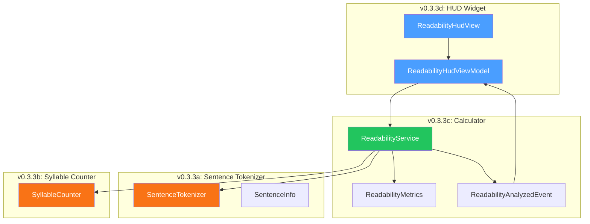
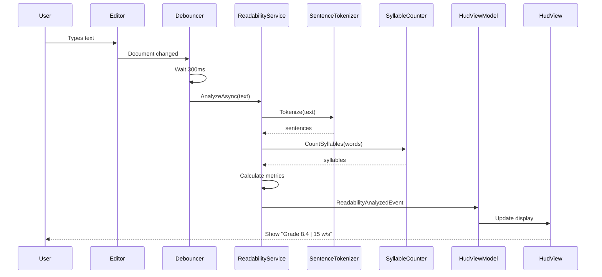

# LCS-DES-033: Design Specification Index — The Readability Engine

## Document Control

| Field | Value |
| :--- | :--- |
| **Document ID** | LCS-DES-033-INDEX |
| **Feature ID** | STY-033 |
| **Feature Name** | The Readability Engine (Metrics) |
| **Target Version** | v0.3.3 |
| **Module Scope** | Lexichord.Modules.Style |
| **Swimlane** | Governance |
| **License Tier** | Writer Pro |
| **Feature Gate Key** | `FeatureFlags.Style.Readability` |
| **Status** | Draft |
| **Last Updated** | 2026-01-26 |

---

## 1. Executive Summary

**v0.3.3** delivers the **Readability Engine** — algorithmic calculation of text complexity metrics. This release transforms Lexichord from a rule-based linter into a comprehensive writing analysis platform, enabling writers to understand and optimize the reading level of their content.

### 1.1 The Problem

Writers need objective, mathematical feedback on text complexity to ensure their content matches their target audience. Currently, writers must rely on subjective judgment or external tools to assess readability, breaking their workflow and providing delayed feedback.

### 1.2 The Solution

Implement a real-time Readability Engine that calculates industry-standard metrics:

- **Flesch-Kincaid Grade Level** — U.S. school grade equivalent
- **Gunning Fog Index** — Years of formal education needed
- **Flesch Reading Ease** — 0-100 scale (higher = easier)

### 1.3 Business Value

| Value | Description |
| :--- | :--- |
| **Objective Feedback** | Mathematical metrics replace subjective opinions |
| **Audience Targeting** | Match content complexity to intended readers |
| **Real-Time Guidance** | Scores update as you type |
| **Industry Standards** | Flesch-Kincaid and Gunning Fog are established metrics |
| **Foundation** | Enables Voice Profiler (v0.3.4) and Resonance Dashboard (v0.3.5) |

---

## 2. Related Documents

### 2.1 Scope Breakdown Document

The detailed scope breakdown for v0.3.3, including all sub-parts, implementation checklists, user stories, and acceptance criteria:

| Document | Description |
| :--- | :--- |
| **[LCS-SBD-033](./LCS-SBD-033.md)** | Scope Breakdown — The Readability Engine |

### 2.2 Sub-Part Design Specifications

Each sub-part has its own detailed design specification following the LDS-01 template:

| Sub-Part | Document | Title | Description |
| :--- | :--- | :--- | :--- |
| v0.3.3a | **[LCS-DES-033a](./LCS-DES-033a.md)** | Sentence Tokenizer | Abbreviation-aware text splitter |
| v0.3.3b | **[LCS-DES-033b](./LCS-DES-033b.md)** | Syllable Counter | Heuristic syllable counting with exceptions |
| v0.3.3c | **[LCS-DES-033c](./LCS-DES-033c.md)** | Readability Calculator | IReadabilityService with formulas |
| v0.3.3d | **[LCS-DES-033d](./LCS-DES-033d.md)** | HUD Widget | Floating status bar widget |

---

## 3. Architecture Overview

### 3.1 Component Diagram



### 3.2 Data Flow



---

## 4. Dependencies

### 4.1 Upstream Dependencies (Required)

| Interface | Source Version | Purpose |
| :--- | :--- | :--- |
| `ILicenseContext` | v0.0.4c | License tier checking |
| `ILintingOrchestrator` | v0.2.3a | Analysis pipeline integration |
| `LintingCompletedEvent` | v0.2.3b | Trigger for readability analysis |
| `IDocumentTokenizer` | v0.3.1c | Word tokenization |
| `ViewModelBase` | v0.1.1 | MVVM base class |

### 4.2 NuGet Packages

| Package | Version | Purpose |
| :--- | :--- | :--- |
| `System.Reactive` | 6.x | Observable debouncing |
| `MediatR` | 12.x | Event publishing |
| `CommunityToolkit.Mvvm` | 8.x | MVVM source generators |

### 4.3 Downstream Consumers (Future)

| Version | Feature | Consumes |
| :--- | :--- | :--- |
| v0.3.4 | Voice Profiler | `IReadabilityService`, `ReadabilityMetrics` |
| v0.3.5 | Resonance Dashboard | `ReadabilityAnalyzedEvent` |

---

## 5. License Gating Strategy

The Readability Engine is a **Writer Pro** feature using a **Soft Gate** strategy.

### 5.1 Behavior by License Tier

| Tier | HUD Display | Analysis | Metrics Visible |
| :--- | :--- | :--- | :--- |
| Core | Lock icon + "Upgrade" prompt | Runs (hidden) | No |
| Writer Pro | Full metrics | Runs | Yes |
| Teams | Full metrics | Runs | Yes |
| Enterprise | Full metrics | Runs | Yes |

### 5.2 Implementation Pattern

```csharp
if (!_licenseContext.HasFeature(FeatureFlags.Style.Readability))
{
    IsLicensed = false;
    Metrics = null;  // Hide results
    return;
}
```

---

## 6. Readability Formulas

### 6.1 Flesch-Kincaid Grade Level

```
FK = 0.39 × (words/sentences) + 11.8 × (syllables/words) - 15.59
```

**Result:** U.S. school grade level (0 = Kindergarten, 12 = High School Senior)

### 6.2 Flesch Reading Ease

```
FRE = 206.835 - 1.015 × (words/sentences) - 84.6 × (syllables/words)
```

**Result:** Score 0-100 (higher = easier to read)

| Score | Difficulty | Grade Level |
| :--- | :--- | :--- |
| 90-100 | Very Easy | 5th grade |
| 80-89 | Easy | 6th grade |
| 70-79 | Fairly Easy | 7th grade |
| 60-69 | Standard | 8th-9th grade |
| 50-59 | Fairly Hard | 10th-12th grade |
| 30-49 | Difficult | College |
| 0-29 | Very Difficult | Graduate |

### 6.3 Gunning Fog Index

```
GF = 0.4 × ((words/sentences) + 100 × (complex_words/words))
```

**Where:** complex_words = words with 3+ syllables (excluding -es, -ed, -ing suffixes)

**Result:** Years of formal education needed

---

## 7. Key Interfaces Summary

| Interface | Defined In | Purpose |
| :--- | :--- | :--- |
| `ISentenceTokenizer` | v0.3.3a | Tokenize text into sentences |
| `ISyllableCounter` | v0.3.3b | Count syllables in words |
| `IReadabilityService` | v0.3.3c | Calculate readability metrics |

| Record/DTO | Defined In | Purpose |
| :--- | :--- | :--- |
| `SentenceInfo` | v0.3.3a | Sentence metadata |
| `ReadabilityMetrics` | v0.3.3c | All calculated metrics |
| `ReadabilityAnalyzedEvent` | v0.3.3c | MediatR notification |

---

## 8. Implementation Checklist Summary

| Sub-Part | Tasks | Est. Hours |
| :--- | :--- | :--- |
| v0.3.3a | Sentence Tokenizer | 7 |
| v0.3.3b | Syllable Counter | 6.5 |
| v0.3.3c | Readability Calculator | 6 |
| v0.3.3d | HUD Widget | 9.5 |
| Integration | DI, Events, Tests | 3 |
| **Total** | | **32 hours** |

See [LCS-SBD-033](./LCS-SBD-033.md) Section 4 for the detailed task breakdown.

---

## 9. Success Criteria Summary

| Category | Criterion | Target |
| :--- | :--- | :--- |
| **Accuracy** | FK Grade Level | ±0.1 of reference |
| **Accuracy** | Syllable count | 95%+ correct |
| **Accuracy** | Sentence tokenization | 98%+ correct |
| **Performance** | 1,000 words | < 50ms |
| **Performance** | 10,000 words | < 200ms |
| **UX** | HUD update latency | < 500ms after typing |

See [LCS-SBD-033](./LCS-SBD-033.md) Section 9 for full success metrics.

---

## 10. Test Coverage Summary

| Sub-Part | Unit Tests | Integration Tests |
| :--- | :--- | :--- |
| v0.3.3a | Abbreviation handling, edge cases | - |
| v0.3.3b | Known syllable counts, complex word detection | - |
| v0.3.3c | Formula accuracy, empty input | Pipeline integration |
| v0.3.3d | ViewModel state, license gating | Event handling |

See individual design specs for detailed test scenarios.

---

## 11. What This Enables

| Version | Feature | Uses From v0.3.3 |
| :--- | :--- | :--- |
| v0.3.4 | Voice Profiler | Maps readability metrics to profile axes |
| v0.3.5 | Resonance Dashboard | Visualizes metrics with radar charts |
| v0.3.6 | Global Dictionary | Adds readability targets to project config |

---

## Document History

| Version | Date | Author | Changes |
| :--- | :--- | :--- | :--- |
| 1.0 | 2026-01-26 | Lead Architect | Initial draft |
