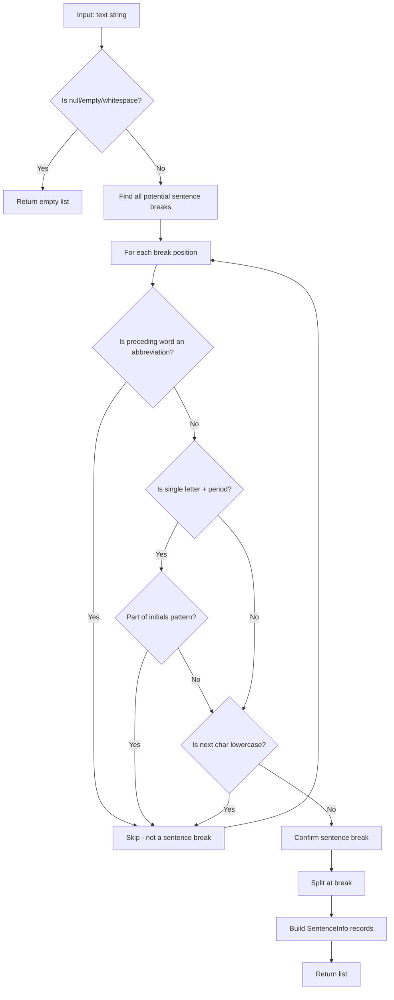

# LCS-DES-033a: Design Specification — Sentence Tokenizer

## 1. Metadata & Categorization

| Field | Value | Description |
| :--- | :--- | :--- |
| **Feature ID** | `STY-033a` | Sub-part of STY-033 |
| **Feature Name** | `Abbreviation-Aware Sentence Tokenizer` | Robust text splitter |
| **Target Version** | `v0.3.3a` | First sub-part of v0.3.3 |
| **Module Scope** | `Lexichord.Modules.Style` | Style governance module |
| **Swimlane** | `Governance` | Part of Style vertical |
| **License Tier** | `Writer Pro` | Required for readability features |
| **Feature Gate Key** | `FeatureFlags.Style.Readability` | Shared with parent feature |
| **Author** | Lead Architect | |
| **Status** | `Draft` | |
| **Last Updated** | `2026-01-26` | |
| **Parent Document** | [LCS-DES-033-INDEX](./LCS-DES-033-INDEX.md) | |
| **Scope Breakdown** | [LCS-SBD-033 §3.1](./LCS-SBD-033.md#31-v033a-sentence-tokenizer) | |

---

## 2. Executive Summary

### 2.1 The Requirement

Readability metrics require accurate sentence counts. Standard text splitting on periods (`.`) produces incorrect results when text contains abbreviations like "Mr.", "Dr.", "Inc.", or "U.S.A.". False sentence breaks inflate sentence counts, skewing readability calculations.

> **Problem:** "Mr. Smith went to Acme Inc." MUST be counted as 1 sentence, not 3.

### 2.2 The Proposed Solution

Implement an `ISentenceTokenizer` that:

1. Maintains a dictionary of 50+ common English abbreviations
2. Detects abbreviation patterns before splitting on periods
3. Handles edge cases (ellipsis, initials, URLs)
4. Returns `SentenceInfo` records with position and word count metadata

---

## 3. Architecture & Modular Strategy

### 3.1 Dependencies

#### 3.1.1 Upstream Dependencies

| Interface | Source Version | Purpose |
| :--- | :--- | :--- |
| `IConfigurationService` | v0.0.3d | Custom abbreviation loading |

#### 3.1.2 NuGet Packages

None required. Uses only `System.Text.RegularExpressions` from BCL.

### 3.2 Licensing Behavior

Inherits from parent feature. The `SentenceTokenizer` service itself has no license check; gating occurs at the `ReadabilityHudViewModel` level.

---

## 4. Data Contract (The API)

### 4.1 ISentenceTokenizer Interface

```csharp
namespace Lexichord.Abstractions.Contracts;

/// <summary>
/// Tokenizes text into sentences while respecting abbreviations and edge cases.
/// </summary>
/// <remarks>
/// <para>The tokenizer SHALL NOT create false sentence breaks on periods within
/// abbreviations (Mr., Dr., Inc., U.S.A., etc.).</para>
/// <para>The tokenizer uses a standard dictionary of 50+ common English abbreviations.</para>
/// <para>Custom abbreviations MAY be configured via <see cref="IConfigurationService"/>.</para>
/// </remarks>
/// <example>
/// <code>
/// var tokenizer = new SentenceTokenizer();
/// var sentences = tokenizer.Tokenize("Mr. Smith went to Acme Inc. He is the CEO.");
/// // Returns 2 sentences, not 4
/// </code>
/// </example>
public interface ISentenceTokenizer
{
    /// <summary>
    /// Splits text into individual sentences.
    /// </summary>
    /// <param name="text">The input text to tokenize. MAY be null or empty.</param>
    /// <returns>
    /// An immutable list of <see cref="SentenceInfo"/> records ordered by position.
    /// Returns an empty list if <paramref name="text"/> is null, empty, or whitespace-only.
    /// </returns>
    IReadOnlyList<SentenceInfo> Tokenize(string text);
}
```

### 4.2 SentenceInfo Record

```csharp
namespace Lexichord.Abstractions.Contracts;

/// <summary>
/// Information about a single sentence extracted from source text.
/// </summary>
/// <param name="Text">The sentence text including terminal punctuation.</param>
/// <param name="StartIndex">Zero-based character index where sentence begins in source.</param>
/// <param name="EndIndex">Zero-based character index where sentence ends in source (exclusive).</param>
/// <param name="WordCount">Number of words in the sentence (computed at tokenization time).</param>
/// <example>
/// For text "Hello world. Goodbye.", the first sentence would be:
/// <code>
/// new SentenceInfo("Hello world.", StartIndex: 0, EndIndex: 12, WordCount: 2)
/// </code>
/// </example>
public record SentenceInfo(
    string Text,
    int StartIndex,
    int EndIndex,
    int WordCount)
{
    /// <summary>
    /// The length of the sentence in characters.
    /// </summary>
    public int Length => EndIndex - StartIndex;
}
```

---

## 5. Implementation Logic

### 5.1 Algorithm Flow Diagram



### 5.2 Abbreviation Detection Decision Tree

```text
INPUT: word before period, character after period
OUTPUT: is_abbreviation (boolean)

DECISION TREE:
┌─ Is word in StandardAbbreviationDictionary?
│  └─ YES → IS abbreviation
│
├─ Is word in CustomAbbreviationDictionary (from config)?
│  └─ YES → IS abbreviation
│
├─ Is word a single uppercase letter (A., B., C.)?
│  └─ YES → Check initials pattern
│      ├─ Followed by another "X." → IS abbreviation (e.g., "J.F.K.")
│      └─ Otherwise → Check next character
│
├─ Is word all uppercase and 2-4 letters (U.S., U.K.)?
│  └─ YES → IS abbreviation
│
├─ Does word end with common abbreviation suffix?
│  └─ YES → Likely abbreviation (e.g., "Corp.", "Ltd.")
│
├─ Is next character lowercase?
│  └─ YES → Sentence continues → IS abbreviation
│
├─ Is next character a quotation mark followed by lowercase?
│  └─ YES → IS abbreviation (e.g., 'He said, "hello')
│
└─ DEFAULT: NOT abbreviation (IS sentence break)
```

### 5.3 Standard Abbreviation Dictionary

The tokenizer SHALL include the following abbreviations (50+ entries):

```csharp
private static readonly HashSet<string> StandardAbbreviations = new(
    StringComparer.OrdinalIgnoreCase)
{
    // Titles (10)
    "Mr", "Mrs", "Ms", "Dr", "Prof", "Rev", "Hon", "Capt", "Lt", "Sgt",

    // Suffixes (7)
    "Jr", "Sr", "Ph.D", "M.D", "B.A", "M.A", "Esq",

    // Business (6)
    "Inc", "Corp", "Ltd", "Co", "LLC", "Bros",

    // Geographic (6)
    "St", "Ave", "Blvd", "Rd", "Mt", "Ft",

    // Time (4)
    "a.m", "p.m", "A.M", "P.M",

    // Latin (6)
    "etc", "e.g", "i.e", "vs", "viz", "cf",

    // Countries (4)
    "U.S", "U.K", "U.S.A", "U.S.S.R",

    // Miscellaneous (7)
    "No", "Vol", "Fig", "approx", "est", "dept", "govt"
};
```

### 5.4 Edge Case Handling

| Edge Case | Input | Expected Sentences | Handling |
| :--- | :--- | :--- | :--- |
| Ellipsis | `"Wait... I see."` | 1 | Detect `...` pattern, don't split |
| Multiple periods | `"Really?!."` | 1 | Treat as single terminal |
| URLs | `"See https://example.com for info."` | 1 | Detect URL pattern, skip periods |
| Decimal numbers | `"The value is 3.14 meters."` | 1 | Period between digits = not sentence end |
| File extensions | `"Open file.txt now."` | 1 | Common extensions dictionary |
| Quotations | `'He said "Hello." She replied.'` | 2 | Period inside quotes ends sentence |

---

## 6. Data Persistence

**None required.** The abbreviation dictionary is compiled into the assembly. Custom abbreviations are loaded from `IConfigurationService` at runtime.

---

## 7. UI/UX Specifications

**None.** This is a backend service with no direct UI. Results are consumed by `IReadabilityService` (v0.3.3c).

---

## 8. Observability & Logging

| Level | Message Template |
| :--- | :--- |
| Debug | `"Tokenizing text: {CharCount} characters"` |
| Debug | `"Found {SentenceCount} sentences"` |
| Trace | `"Abbreviation detected: '{Word}' at position {Position}"` |
| Trace | `"Sentence break confirmed at position {Position}"` |
| Debug | `"Tokenization completed in {ElapsedMs}ms"` |

---

## 9. Security & Safety

| Risk | Level | Mitigation |
| :--- | :--- | :--- |
| ReDoS (Regex DoS) | Low | Use simple patterns, no nested quantifiers |
| Large input | Low | Process sequentially, no full-text copies |

---

## 10. Acceptance Criteria

### 10.1 Functional Criteria

| # | Given | When | Then |
| :--- | :--- | :--- | :--- |
| 1 | Text `"Hello world."` | Tokenized | Returns 1 sentence |
| 2 | Text `"Hello. World."` | Tokenized | Returns 2 sentences |
| 3 | Text `"Mr. Smith went home."` | Tokenized | Returns 1 sentence |
| 4 | Text `"Dr. Jones and Mrs. Smith met."` | Tokenized | Returns 1 sentence |
| 5 | Text `"She works at Acme Inc. in NY."` | Tokenized | Returns 1 sentence |
| 6 | Text `"The U.S.A. is a country. It is large."` | Tokenized | Returns 2 sentences |
| 7 | Text `"Wait... I have an idea."` | Tokenized | Returns 1 sentence (ellipsis) |
| 8 | Text `""` (empty) | Tokenized | Returns empty list |
| 9 | Text `"   "` (whitespace) | Tokenized | Returns empty list |
| 10 | Text `"Hello! World? Yes."` | Tokenized | Returns 3 sentences |

### 10.2 Performance Criteria

| # | Given | When | Then |
| :--- | :--- | :--- | :--- |
| 11 | Text with 1,000 sentences | Tokenized | Completes in < 20ms |
| 12 | Text with 10,000 sentences | Tokenized | Completes in < 100ms |

---

## 11. Test Scenarios

### 11.1 Unit Tests

```csharp
[Trait("Category", "Unit")]
[Trait("Feature", "v0.3.3a")]
public class SentenceTokenizerTests
{
    private readonly SentenceTokenizer _sut = new();

    [Theory]
    [InlineData("Hello world.", 1)]
    [InlineData("Hello. World.", 2)]
    [InlineData("Hello! World? Yes.", 3)]
    public void Tokenize_SimpleSentences_ReturnsCorrectCount(string text, int expected)
    {
        var result = _sut.Tokenize(text);
        result.Should().HaveCount(expected);
    }

    [Theory]
    [InlineData("Mr. Smith went home.", 1)]
    [InlineData("Dr. Jones and Mrs. Smith met.", 1)]
    [InlineData("She works at Acme Inc. in New York.", 1)]
    [InlineData("I spoke with Prof. Brown, Ph.D. today.", 1)]
    public void Tokenize_WithAbbreviations_DoesNotSplitFalsely(string text, int expected)
    {
        var result = _sut.Tokenize(text);
        result.Should().HaveCount(expected);
    }

    [Theory]
    [InlineData("The U.S.A. is a country. It is large.", 2)]
    [InlineData("See Fig. 1. It shows the data.", 2)]
    [InlineData("Call at 3 p.m. tomorrow. Be ready.", 2)]
    public void Tokenize_AbbreviationsFollowedBySentence_SplitsCorrectly(string text, int expected)
    {
        var result = _sut.Tokenize(text);
        result.Should().HaveCount(expected);
    }

    [Fact]
    public void Tokenize_WithEllipsis_DoesNotSplitOnEachDot()
    {
        var result = _sut.Tokenize("Wait... I have an idea.");
        result.Should().HaveCount(1);
    }

    [Fact]
    public void Tokenize_EmptyString_ReturnsEmpty()
    {
        var result = _sut.Tokenize("");
        result.Should().BeEmpty();
    }

    [Fact]
    public void Tokenize_NullString_ReturnsEmpty()
    {
        var result = _sut.Tokenize(null!);
        result.Should().BeEmpty();
    }

    [Fact]
    public void Tokenize_WhitespaceOnly_ReturnsEmpty()
    {
        var result = _sut.Tokenize("   \n\t  ");
        result.Should().BeEmpty();
    }

    [Fact]
    public void Tokenize_ReturnsSentenceInfo_WithCorrectPositions()
    {
        var result = _sut.Tokenize("Hello. World.");

        result.Should().HaveCount(2);
        result[0].Text.Should().Be("Hello.");
        result[0].StartIndex.Should().Be(0);
        result[0].EndIndex.Should().Be(6);
        result[0].WordCount.Should().Be(1);

        result[1].Text.Should().Be("World.");
        result[1].StartIndex.Should().Be(7);
        result[1].WordCount.Should().Be(1);
    }

    [Fact]
    public void Tokenize_CountsWordsCorrectly()
    {
        var result = _sut.Tokenize("The quick brown fox jumps.");

        result.Should().HaveCount(1);
        result[0].WordCount.Should().Be(5);
    }
}
```

---

## 12. Code Example

### 12.1 SentenceTokenizer Implementation

```csharp
namespace Lexichord.Modules.Style.Services;

/// <summary>
/// Tokenizes text into sentences while respecting abbreviations.
/// Uses a standard dictionary of 50+ common English abbreviations.
/// </summary>
public sealed class SentenceTokenizer : ISentenceTokenizer
{
    private static readonly HashSet<string> StandardAbbreviations = new(
        StringComparer.OrdinalIgnoreCase)
    {
        // Titles
        "Mr", "Mrs", "Ms", "Dr", "Prof", "Rev", "Hon", "Capt", "Lt", "Sgt",
        // Suffixes
        "Jr", "Sr", "Esq",
        // Business
        "Inc", "Corp", "Ltd", "Co", "LLC", "Bros",
        // Geographic
        "St", "Ave", "Blvd", "Rd", "Mt", "Ft",
        // Latin
        "etc", "vs", "viz", "cf",
        // Misc
        "No", "Vol", "Fig", "approx", "est", "dept", "govt"
    };

    // Abbreviations with embedded periods
    private static readonly HashSet<string> PeriodAbbreviations = new(
        StringComparer.OrdinalIgnoreCase)
    {
        "Ph.D", "M.D", "B.A", "M.A", "a.m", "p.m", "A.M", "P.M",
        "e.g", "i.e", "U.S", "U.K", "U.S.A", "U.S.S.R"
    };

    private static readonly Regex SentenceEndPattern = new(
        @"[.!?]+(?=\s|$)",
        RegexOptions.Compiled);

    private static readonly Regex WordPattern = new(
        @"\b\w+\b",
        RegexOptions.Compiled);

    /// <inheritdoc />
    public IReadOnlyList<SentenceInfo> Tokenize(string text)
    {
        if (string.IsNullOrWhiteSpace(text))
        {
            return Array.Empty<SentenceInfo>();
        }

        var sentences = new List<SentenceInfo>();
        var currentStart = 0;

        var matches = SentenceEndPattern.Matches(text);

        foreach (Match match in matches)
        {
            var endPosition = match.Index + match.Length;

            // Check if this is a real sentence break
            if (IsRealSentenceBreak(text, match.Index))
            {
                var sentenceText = text[currentStart..endPosition].Trim();

                if (!string.IsNullOrWhiteSpace(sentenceText))
                {
                    var wordCount = CountWords(sentenceText);

                    sentences.Add(new SentenceInfo(
                        Text: sentenceText,
                        StartIndex: currentStart,
                        EndIndex: endPosition,
                        WordCount: wordCount));
                }

                currentStart = endPosition;

                // Skip whitespace after sentence
                while (currentStart < text.Length && char.IsWhiteSpace(text[currentStart]))
                {
                    currentStart++;
                }
            }
        }

        // Handle remaining text (sentence without terminal punctuation)
        if (currentStart < text.Length)
        {
            var remaining = text[currentStart..].Trim();
            if (!string.IsNullOrWhiteSpace(remaining))
            {
                sentences.Add(new SentenceInfo(
                    Text: remaining,
                    StartIndex: currentStart,
                    EndIndex: text.Length,
                    WordCount: CountWords(remaining)));
            }
        }

        return sentences.AsReadOnly();
    }

    private bool IsRealSentenceBreak(string text, int periodIndex)
    {
        // Check for ellipsis
        if (periodIndex >= 2 &&
            text[periodIndex - 1] == '.' &&
            text[periodIndex - 2] == '.')
        {
            return false;
        }

        // Get the word before the period
        var wordStart = periodIndex - 1;
        while (wordStart > 0 && (char.IsLetter(text[wordStart - 1]) || text[wordStart - 1] == '.'))
        {
            wordStart--;
        }

        var wordBeforePeriod = text[wordStart..periodIndex];

        // Check period-embedded abbreviations first (e.g., "U.S.A")
        if (PeriodAbbreviations.Contains(wordBeforePeriod) ||
            PeriodAbbreviations.Contains(wordBeforePeriod.TrimEnd('.')))
        {
            // Check if followed by uppercase (new sentence) or lowercase (continuation)
            var nextCharIndex = periodIndex + 1;
            while (nextCharIndex < text.Length && char.IsWhiteSpace(text[nextCharIndex]))
            {
                nextCharIndex++;
            }

            if (nextCharIndex < text.Length && char.IsLower(text[nextCharIndex]))
            {
                return false;
            }
        }

        // Check standard abbreviations
        if (StandardAbbreviations.Contains(wordBeforePeriod))
        {
            return false;
        }

        // Check for single letter (potential initial)
        if (wordBeforePeriod.Length == 1 && char.IsUpper(wordBeforePeriod[0]))
        {
            // Check if part of initials pattern (A.B.C.)
            var nextCharIndex = periodIndex + 1;
            if (nextCharIndex < text.Length - 1 &&
                char.IsUpper(text[nextCharIndex]) &&
                text[nextCharIndex + 1] == '.')
            {
                return false;
            }
        }

        // Check if next character is lowercase (sentence continues)
        var afterPeriod = periodIndex + 1;
        while (afterPeriod < text.Length && char.IsWhiteSpace(text[afterPeriod]))
        {
            afterPeriod++;
        }

        if (afterPeriod < text.Length && char.IsLower(text[afterPeriod]))
        {
            return false;
        }

        return true;
    }

    private static int CountWords(string text)
    {
        return WordPattern.Matches(text).Count;
    }
}
```

---

## 13. DI Registration

```csharp
// In StyleModule.cs
services.AddSingleton<ISentenceTokenizer, SentenceTokenizer>();
```

---

## Document History

| Version | Date | Author | Changes |
| :--- | :--- | :--- | :--- |
| 1.0 | 2026-01-26 | Lead Architect | Initial draft |
