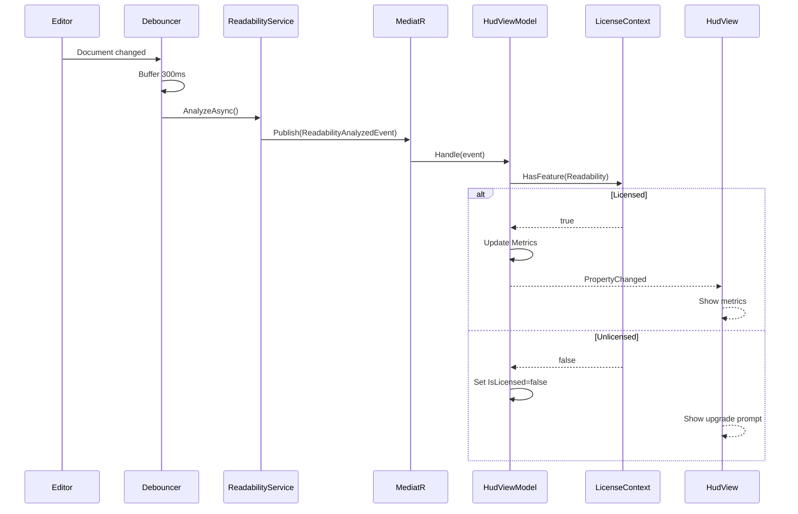

# LCS-DES-033d: Design Specification — Readability HUD Widget

## 1. Metadata & Categorization

| Field | Value | Description |
| :--- | :--- | :--- |
| **Feature ID** | `STY-033d` | Sub-part of STY-033 |
| **Feature Name** | `Readability HUD Widget` | Floating status bar widget |
| **Target Version** | `v0.3.3d` | Fourth sub-part of v0.3.3 |
| **Module Scope** | `Lexichord.Modules.Style` | Style governance module |
| **Swimlane** | `Governance` | Part of Style vertical |
| **License Tier** | `Writer Pro` | Required for readability features |
| **Feature Gate Key** | `FeatureFlags.Style.Readability` | Shared with parent feature |
| **Author** | Lead Architect | |
| **Status** | `Draft` | |
| **Last Updated** | `2026-01-26` | |
| **Parent Document** | [LCS-DES-033-INDEX](./LCS-DES-033-INDEX.md) | |
| **Scope Breakdown** | [LCS-SBD-033 §3.4](./LCS-SBD-033.md#34-v033d-the-hud-widget) | |

---

## 2. Executive Summary

### 2.1 The Requirement

Writers need a non-intrusive way to view readability metrics while writing. The metrics MUST be visible without interrupting the writing flow, update in real-time, and respect license gating.

> **Goal:** Display "Grade 8.4 | 15 w/s" in a floating widget with expandable detail view.

### 2.2 The Proposed Solution

Implement a `ReadabilityHudView` widget that:

1. Floats in the bottom-right corner of the Editor pane
2. Shows collapsed view by default ("Grade X.X | Y w/s")
3. Expands to show all metrics on click
4. Updates via `ReadabilityAnalyzedEvent` subscription
5. Uses 300ms debounce to prevent flicker during rapid typing
6. Shows license gate with upgrade prompt for Core users

---

## 3. Architecture & Modular Strategy

### 3.1 Dependencies

#### 3.1.1 Upstream Dependencies

| Interface | Source Version | Purpose |
| :--- | :--- | :--- |
| `IReadabilityService` | v0.3.3c | Metrics calculation |
| `ReadabilityAnalyzedEvent` | v0.3.3c | MediatR event for UI updates |
| `ILicenseContext` | v0.0.4c | License tier checking |
| `ViewModelBase` | v0.1.1 | MVVM base class |
| `LintingCompletedEvent` | v0.2.3b | Trigger timing |

#### 3.1.2 NuGet Packages

| Package | Version | Purpose |
| :--- | :--- | :--- |
| `System.Reactive` | 6.x | Observable debouncing |
| `MediatR` | 12.x | Event subscription |
| `CommunityToolkit.Mvvm` | 8.x | Source generators |
| `Avalonia.Controls` | 11.x | UI controls |

### 3.2 Licensing Behavior

This component implements the **Soft Gate** strategy:

| User Tier | HUD Display | Metrics Visible |
| :--- | :--- | :--- |
| Core | Lock icon + upgrade prompt | No |
| Writer Pro+ | Full metrics | Yes |

---

## 4. Data Contract (The API)

### 4.1 ReadabilityHudViewModel

```csharp
namespace Lexichord.Modules.Style.ViewModels;

/// <summary>
/// ViewModel for the Readability HUD widget.
/// Subscribes to <see cref="ReadabilityAnalyzedEvent"/> and manages display state.
/// </summary>
/// <remarks>
/// <para>The ViewModel implements <see cref="INotificationHandler{ReadabilityAnalyzedEvent}"/>
/// to receive metrics updates via MediatR.</para>
/// <para>License gating is enforced here - Core users see upgrade prompt instead of metrics.</para>
/// </remarks>
public partial class ReadabilityHudViewModel : ViewModelBase,
    INotificationHandler<ReadabilityAnalyzedEvent>
{
    /// <summary>
    /// Whether the HUD is in expanded state showing all metrics.
    /// </summary>
    [ObservableProperty]
    private bool _isExpanded;

    /// <summary>
    /// Whether analysis is currently in progress.
    /// </summary>
    [ObservableProperty]
    private bool _isAnalyzing;

    /// <summary>
    /// Whether the user has a license that permits viewing metrics.
    /// </summary>
    [ObservableProperty]
    private bool _isLicensed;

    /// <summary>
    /// The current readability metrics. Null when unlicensed or no analysis yet.
    /// </summary>
    [ObservableProperty]
    private ReadabilityMetrics? _metrics;

    /// <summary>
    /// Formatted display of Flesch-Kincaid grade level.
    /// </summary>
    public string GradeLevelDisplay { get; }

    /// <summary>
    /// Formatted display of average words per sentence.
    /// </summary>
    public string WordsPerSentenceDisplay { get; }

    /// <summary>
    /// Formatted display of Gunning Fog index.
    /// </summary>
    public string FogIndexDisplay { get; }

    /// <summary>
    /// Formatted display of Flesch Reading Ease.
    /// </summary>
    public string ReadingEaseDisplay { get; }

    /// <summary>
    /// Human-readable interpretation of grade level.
    /// </summary>
    public string InterpretationDisplay { get; }

    /// <summary>
    /// Command to toggle expanded/collapsed state.
    /// </summary>
    [RelayCommand]
    private void ToggleExpanded();

    /// <summary>
    /// Command to open the upgrade page in browser.
    /// </summary>
    [RelayCommand]
    private void OpenUpgradePage();

    /// <summary>
    /// Handles incoming readability analysis events.
    /// </summary>
    Task Handle(ReadabilityAnalyzedEvent notification, CancellationToken ct);
}
```

---

## 5. Implementation Logic

### 5.1 Event Flow Diagram



### 5.2 Debounce Strategy

```text
DEBOUNCE IMPLEMENTATION:

1. Subscribe to LintingCompletedEvent (or DocumentChangedEvent)
2. Use System.Reactive Throttle operator:

   _documentChanges
       .Throttle(TimeSpan.FromMilliseconds(300))
       .Subscribe(async _ => await TriggerAnalysis());

3. Benefits:
   - Rapid keystrokes are batched
   - Only analyze after 300ms of idle time
   - Prevents UI flicker
   - Reduces CPU usage during typing
```

### 5.3 License Gate Decision Tree

```text
ON ReadabilityAnalyzedEvent received:
│
├── Check ILicenseContext.HasFeature(FeatureFlags.Style.Readability)
│   │
│   ├── FALSE (Core user):
│   │   ├── Set IsLicensed = false
│   │   ├── Set Metrics = null
│   │   ├── Log: "Readability metrics blocked for Core user"
│   │   └── UI shows upgrade prompt
│   │
│   └── TRUE (Writer Pro+):
│       ├── Set IsLicensed = true
│       ├── Set Metrics = event.Metrics
│       ├── Notify all computed properties changed
│       └── UI shows metrics
```

---

## 6. Data Persistence

| Setting | Storage | Default |
| :--- | :--- | :--- |
| `IsExpanded` | `IConfigurationService` | `false` |
| HUD Position | Hardcoded | Bottom-right, 16px margin |

---

## 7. UI/UX Specifications

### 7.1 Collapsed State (Default)

```text
┌─────────────────────────────────────────┐
│  Grade 8.4  │  15 w/s  │  [▼]           │  Height: 32px
└─────────────────────────────────────────┘
     │             │          │
     │             │          └── IconButton: Expand (ChevronDown)
     │             └── Average words per sentence (integer)
     └── Flesch-Kincaid Grade Level (1 decimal)

Position: Bottom-right of editor
Margin: 16px from edges
Width: Auto (content-based)
Min-Width: 180px
```

### 7.2 Expanded State

```text
┌─────────────────────────────────────────┐
│  Readability Metrics               [▲]  │  Header row
├─────────────────────────────────────────┤
│  FK Grade Level:            8.4         │  Data rows
│  Gunning Fog Index:         10.2        │
│  Flesch Reading Ease:       62.3        │
│  ──────────────────────────────────────│  Separator
│  Words:                     1,245       │
│  Sentences:                 82          │
│  Words/Sentence:            15.2        │
│  Syllables/Word:            1.6         │
│  ──────────────────────────────────────│  Separator
│  "Standard (8th-9th grade)"             │  Interpretation
└─────────────────────────────────────────┘

Width: 280px (fixed)
Max-Height: 320px
Row-Height: 24px
Padding: 12px
```

### 7.3 License-Gated State

```text
┌─────────────────────────────────────────┐
│  🔒 Readability Metrics                 │  Header with lock icon
├─────────────────────────────────────────┤
│                                         │
│  Upgrade to Writer Pro to see           │  Body text
│  readability analysis for your          │
│  documents.                             │
│                                         │
│  ┌─────────────────────────────────┐    │
│  │        Upgrade Now              │    │  Primary button
│  └─────────────────────────────────┘    │
│                                         │
└─────────────────────────────────────────┘

Note: Collapsed state also shows lock icon:
┌────────────────────────────────────┐
│  🔒 Readability  │  Upgrade        │
└────────────────────────────────────┘
```

### 7.4 Loading State

```text
┌─────────────────────────────────────────┐
│  Grade --  │  -- w/s  │  [⟳]           │  Spinner instead of expand
└─────────────────────────────────────────┘

OR (expanded):
┌─────────────────────────────────────────┐
│  Readability Metrics               [▲]  │
├─────────────────────────────────────────┤
│         [⟳]  Analyzing...               │  Centered spinner
└─────────────────────────────────────────┘
```

### 7.5 Visual Design Tokens

| Element | Token | Value |
| :--- | :--- | :--- |
| Container Background | `Brush.Surface.Overlay` | 80% opacity |
| Container Border | `Brush.Border.Subtle` | 1px solid |
| Container Corner Radius | `CornerRadius.Medium` | 6px |
| Container Shadow | `Shadow.Medium` | 0 4px 12px rgba(0,0,0,0.15) |
| Label Text | `Brush.Text.Secondary` | Left-aligned |
| Value Text | `Brush.Text.Primary` | Right-aligned, monospace |
| Expand Button | `LexButtonGhost` | Icon only |
| Separator | `Brush.Border.Subtle` | 1px horizontal |
| Interpretation | `Brush.Text.Tertiary` | Italic, centered |
| Upgrade Button | `LexButtonPrimary` | Full width |
| Lock Icon | `Brush.Text.Warning` | 16x16 |

### 7.6 Grade Level Color Coding

| Grade Range | Color | Token | Meaning |
| :--- | :--- | :--- | :--- |
| 0-5 | Green | `Brush.Semantic.Success` | Very Easy |
| 6-8 | Blue | `Brush.Semantic.Info` | Standard |
| 9-12 | Yellow | `Brush.Semantic.Warning` | Challenging |
| 13+ | Orange | `Brush.Semantic.Caution` | Advanced |

### 7.7 Animation Specifications

| Animation | Trigger | Duration | Easing |
| :--- | :--- | :--- | :--- |
| Expand | Click expand button | 200ms | CubicEaseOut |
| Collapse | Click collapse button | 150ms | CubicEaseIn |
| Metrics Fade-In | Analysis complete | 100ms | Linear |
| Spinner Rotation | IsAnalyzing=true | 1000ms loop | Linear |
| Color Transition | Grade changes | 150ms | Linear |

### 7.8 Accessibility (A11y)

| Element | AutomationProperties.Name | Keyboard |
| :--- | :--- | :--- |
| HUD Container | "Readability metrics panel" | Tab-focusable |
| Expand Button | "Expand readability details" | Enter/Space |
| Collapse Button | "Collapse readability details" | Enter/Space |
| Upgrade Button | "Upgrade to Writer Pro" | Enter/Space |
| Grade Value | "Flesch-Kincaid grade level: {value}" | Read-only |
| Spinner | "Analyzing document readability" | - |

---

## 8. Observability & Logging

| Level | Message Template |
| :--- | :--- |
| Debug | `"License check for Readability: {IsLicensed}"` |
| Debug | `"Metrics updated: Grade {GradeLevel:F1}, {WordsPerSentence:F0} w/s"` |
| Debug | `"Debounce triggered, discarding rapid change"` |
| Debug | `"HUD expanded state changed to {IsExpanded}"` |
| Trace | `"PropertyChanged: {PropertyName}"` |

---

## 9. Security & Safety

| Risk | Level | Mitigation |
| :--- | :--- | :--- |
| License bypass | Low | Check occurs in ViewModel, not View |
| UI thread blocking | Low | All analysis on background thread |
| Memory leak | Low | Dispose subscriptions on unload |

---

## 10. Acceptance Criteria

### 10.1 Display Criteria

| # | Given | When | Then |
| :--- | :--- | :--- | :--- |
| 1 | HUD in collapsed state | Metrics available | Shows "Grade X.X \| Y w/s" |
| 2 | User clicks expand | Animation runs | HUD expands to full view |
| 3 | HUD in expanded state | View rendered | Shows all 5 metrics |
| 4 | HUD in expanded state | Shows interpretation | "Standard (8th-9th grade)" |
| 5 | Empty document | HUD rendered | Shows "-- \| --" placeholders |

### 10.2 License Criteria

| # | Given | When | Then |
| :--- | :--- | :--- | :--- |
| 6 | Core license | HUD rendered | Shows lock + upgrade prompt |
| 7 | Core license | Analysis runs | Metrics NOT visible |
| 8 | Core license | Click "Upgrade Now" | Browser opens subscription URL |
| 9 | Writer Pro license | HUD rendered | Shows full metrics |

### 10.3 Interaction Criteria

| # | Given | When | Then |
| :--- | :--- | :--- | :--- |
| 10 | User types rapidly | Debounce active | HUD updates after 300ms idle |
| 11 | Analysis in progress | HUD visible | Shows spinner |
| 12 | Expand button clicked | State toggles | IsExpanded changes |

### 10.4 Visual Criteria

| # | Given | When | Then |
| :--- | :--- | :--- | :--- |
| 13 | Grade 0-5 | Color applied | Green |
| 14 | Grade 6-8 | Color applied | Blue |
| 15 | Grade 9-12 | Color applied | Yellow |
| 16 | Grade 13+ | Color applied | Orange |

---

## 11. Test Scenarios

### 11.1 ViewModel Unit Tests

```csharp
[Trait("Category", "Unit")]
[Trait("Feature", "v0.3.3d")]
public class ReadabilityHudViewModelTests
{
    [Fact]
    public void Constructor_ChecksLicense()
    {
        // Arrange
        var mockLicense = new Mock<ILicenseContext>();
        mockLicense.Setup(l => l.HasFeature(FeatureFlags.Style.Readability))
            .Returns(true);

        // Act
        var sut = new ReadabilityHudViewModel(mockLicense.Object);

        // Assert
        sut.IsLicensed.Should().BeTrue();
        mockLicense.Verify(l => l.HasFeature(FeatureFlags.Style.Readability), Times.Once);
    }

    [Fact]
    public void ToggleExpanded_TogglesState()
    {
        // Arrange
        var sut = CreateViewModel(isLicensed: true);
        sut.IsExpanded.Should().BeFalse();

        // Act
        sut.ToggleExpandedCommand.Execute(null);

        // Assert
        sut.IsExpanded.Should().BeTrue();

        // Act again
        sut.ToggleExpandedCommand.Execute(null);

        // Assert
        sut.IsExpanded.Should().BeFalse();
    }

    [Fact]
    public void GradeLevelDisplay_WithMetrics_ShowsFormattedValue()
    {
        // Arrange
        var sut = CreateViewModel(isLicensed: true);
        sut.Metrics = new ReadabilityMetrics
        {
            FleschKincaidGradeLevel = 8.456
        };

        // Act & Assert
        sut.GradeLevelDisplay.Should().Be("8.5");
    }

    [Fact]
    public void GradeLevelDisplay_WithoutMetrics_ShowsDashes()
    {
        // Arrange
        var sut = CreateViewModel(isLicensed: true);
        sut.Metrics = null;

        // Act & Assert
        sut.GradeLevelDisplay.Should().Be("--");
    }

    [Fact]
    public async Task Handle_WhenUnlicensed_HidesMetrics()
    {
        // Arrange
        var sut = CreateViewModel(isLicensed: false);
        var evt = new ReadabilityAnalyzedEvent(
            Guid.NewGuid(),
            new ReadabilityMetrics { FleschKincaidGradeLevel = 8.4 },
            TimeSpan.FromMilliseconds(50));

        // Act
        await sut.Handle(evt, CancellationToken.None);

        // Assert
        sut.IsLicensed.Should().BeFalse();
        sut.Metrics.Should().BeNull();
    }

    [Fact]
    public async Task Handle_WhenLicensed_UpdatesMetrics()
    {
        // Arrange
        var sut = CreateViewModel(isLicensed: true);
        var evt = new ReadabilityAnalyzedEvent(
            Guid.NewGuid(),
            new ReadabilityMetrics
            {
                FleschKincaidGradeLevel = 8.4,
                GunningFogIndex = 10.2,
                FleschReadingEase = 62.3,
                WordCount = 100,
                SentenceCount = 10
            },
            TimeSpan.FromMilliseconds(50));

        // Act
        await sut.Handle(evt, CancellationToken.None);

        // Assert
        sut.IsLicensed.Should().BeTrue();
        sut.Metrics.Should().NotBeNull();
        sut.Metrics!.FleschKincaidGradeLevel.Should().Be(8.4);
        sut.GradeLevelDisplay.Should().Be("8.4");
        sut.WordsPerSentenceDisplay.Should().Be("10");
    }

    private static ReadabilityHudViewModel CreateViewModel(bool isLicensed)
    {
        var mockLicense = new Mock<ILicenseContext>();
        mockLicense.Setup(l => l.HasFeature(FeatureFlags.Style.Readability))
            .Returns(isLicensed);

        return new ReadabilityHudViewModel(
            mockLicense.Object,
            NullLogger<ReadabilityHudViewModel>.Instance);
    }
}
```

---

## 12. Code Examples

### 12.1 ReadabilityHudViewModel Implementation

```csharp
namespace Lexichord.Modules.Style.ViewModels;

/// <summary>
/// ViewModel for the Readability HUD widget.
/// </summary>
public sealed partial class ReadabilityHudViewModel : ViewModelBase,
    INotificationHandler<ReadabilityAnalyzedEvent>
{
    private readonly ILicenseContext _licenseContext;
    private readonly ILogger<ReadabilityHudViewModel> _logger;

    [ObservableProperty]
    private bool _isExpanded;

    [ObservableProperty]
    private bool _isAnalyzing;

    [ObservableProperty]
    [NotifyPropertyChangedFor(nameof(GradeLevelDisplay))]
    [NotifyPropertyChangedFor(nameof(WordsPerSentenceDisplay))]
    [NotifyPropertyChangedFor(nameof(FogIndexDisplay))]
    [NotifyPropertyChangedFor(nameof(ReadingEaseDisplay))]
    [NotifyPropertyChangedFor(nameof(InterpretationDisplay))]
    [NotifyPropertyChangedFor(nameof(GradeLevelColor))]
    private ReadabilityMetrics? _metrics;

    [ObservableProperty]
    private bool _isLicensed;

    public ReadabilityHudViewModel(
        ILicenseContext licenseContext,
        ILogger<ReadabilityHudViewModel> logger)
    {
        _licenseContext = licenseContext;
        _logger = logger;

        IsLicensed = _licenseContext.HasFeature(FeatureFlags.Style.Readability);
        _logger.LogDebug("License check for Readability: {IsLicensed}", IsLicensed);
    }

    // Computed display properties
    public string GradeLevelDisplay =>
        Metrics?.FleschKincaidGradeLevel.ToString("F1") ?? "--";

    public string WordsPerSentenceDisplay =>
        Metrics?.AverageWordsPerSentence.ToString("F0") ?? "--";

    public string FogIndexDisplay =>
        Metrics?.GunningFogIndex.ToString("F1") ?? "--";

    public string ReadingEaseDisplay =>
        Metrics?.FleschReadingEase.ToString("F0") ?? "--";

    public string InterpretationDisplay =>
        Metrics?.GradeLevelInterpretation ?? "";

    public string GradeLevelColor => Metrics?.FleschKincaidGradeLevel switch
    {
        null => "Gray",
        < 6 => "Green",
        < 9 => "Blue",
        < 13 => "Yellow",
        _ => "Orange"
    };

    [RelayCommand]
    private void ToggleExpanded()
    {
        IsExpanded = !IsExpanded;
        _logger.LogDebug("HUD expanded state changed to {IsExpanded}", IsExpanded);
    }

    [RelayCommand]
    private void OpenUpgradePage()
    {
        Process.Start(new ProcessStartInfo
        {
            FileName = "https://lexichord.app/upgrade",
            UseShellExecute = true
        });
    }

    public Task Handle(ReadabilityAnalyzedEvent notification, CancellationToken ct)
    {
        // Recheck license (may have changed)
        IsLicensed = _licenseContext.HasFeature(FeatureFlags.Style.Readability);

        if (!IsLicensed)
        {
            _logger.LogDebug("Readability metrics blocked for Core user");
            Metrics = null;
            return Task.CompletedTask;
        }

        Metrics = notification.Metrics;
        IsAnalyzing = false;

        _logger.LogDebug(
            "Metrics updated: Grade {GradeLevel:F1}, {WordsPerSentence:F0} w/s",
            Metrics.FleschKincaidGradeLevel,
            Metrics.AverageWordsPerSentence);

        return Task.CompletedTask;
    }
}
```

### 12.2 ReadabilityHudView.axaml

```xml
<UserControl xmlns="https://github.com/avaloniaui"
             xmlns:x="http://schemas.microsoft.com/winfx/2006/xaml"
             xmlns:vm="using:Lexichord.Modules.Style.ViewModels"
             x:Class="Lexichord.Modules.Style.Views.ReadabilityHudView"
             x:DataType="vm:ReadabilityHudViewModel">

    <Border Classes="HudContainer"
            HorizontalAlignment="Right"
            VerticalAlignment="Bottom"
            Margin="16"
            AutomationProperties.Name="Readability metrics panel">

        <!-- Collapsed State (Licensed) -->
        <StackPanel Orientation="Horizontal"
                    IsVisible="{Binding !IsExpanded}"
                    Spacing="8">

            <StackPanel IsVisible="{Binding IsLicensed}">
                <StackPanel Orientation="Horizontal" Spacing="8">
                    <TextBlock Text="Grade"
                               Classes="Label" />
                    <TextBlock Text="{Binding GradeLevelDisplay}"
                               Classes="Value"
                               Foreground="{Binding GradeLevelColor, Converter={StaticResource ColorToBrushConverter}}" />

                    <Border Classes="Separator" />

                    <TextBlock Text="{Binding WordsPerSentenceDisplay}"
                               Classes="Value" />
                    <TextBlock Text="w/s"
                               Classes="Label" />
                </StackPanel>
            </StackPanel>

            <!-- Collapsed State (Unlicensed) -->
            <StackPanel IsVisible="{Binding !IsLicensed}"
                        Orientation="Horizontal"
                        Spacing="8">
                <PathIcon Data="{StaticResource LockIcon}"
                          Width="16" Height="16" />
                <TextBlock Text="Readability"
                           Classes="Label" />
                <Button Content="Upgrade"
                        Command="{Binding OpenUpgradePageCommand}"
                        Classes="Ghost Small" />
            </StackPanel>

            <!-- Expand Button -->
            <Button Command="{Binding ToggleExpandedCommand}"
                    Classes="Ghost IconOnly"
                    AutomationProperties.Name="Expand readability details"
                    IsVisible="{Binding IsLicensed}">
                <PathIcon Data="{StaticResource ChevronDownIcon}" />
            </Button>
        </StackPanel>

        <!-- Expanded State -->
        <Grid IsVisible="{Binding IsExpanded}"
              RowDefinitions="Auto,*">

            <!-- Header -->
            <DockPanel Grid.Row="0" Classes="Header">
                <Button DockPanel.Dock="Right"
                        Command="{Binding ToggleExpandedCommand}"
                        Classes="Ghost IconOnly"
                        AutomationProperties.Name="Collapse readability details">
                    <PathIcon Data="{StaticResource ChevronUpIcon}" />
                </Button>
                <TextBlock Text="Readability Metrics"
                           Classes="HeaderText" />
            </DockPanel>

            <!-- Metrics Grid -->
            <StackPanel Grid.Row="1" Classes="MetricsPanel">
                <Grid Classes="MetricRow">
                    <TextBlock Text="FK Grade Level:" Classes="MetricLabel" />
                    <TextBlock Text="{Binding GradeLevelDisplay}"
                               Classes="MetricValue"
                               HorizontalAlignment="Right" />
                </Grid>

                <Grid Classes="MetricRow">
                    <TextBlock Text="Gunning Fog Index:" Classes="MetricLabel" />
                    <TextBlock Text="{Binding FogIndexDisplay}"
                               Classes="MetricValue"
                               HorizontalAlignment="Right" />
                </Grid>

                <Grid Classes="MetricRow">
                    <TextBlock Text="Flesch Reading Ease:" Classes="MetricLabel" />
                    <TextBlock Text="{Binding ReadingEaseDisplay}"
                               Classes="MetricValue"
                               HorizontalAlignment="Right" />
                </Grid>

                <Border Classes="Separator" />

                <Grid Classes="MetricRow">
                    <TextBlock Text="Words:" Classes="MetricLabel" />
                    <TextBlock Text="{Binding Metrics.WordCount, StringFormat={}{0:N0}}"
                               Classes="MetricValue"
                               HorizontalAlignment="Right" />
                </Grid>

                <Grid Classes="MetricRow">
                    <TextBlock Text="Sentences:" Classes="MetricLabel" />
                    <TextBlock Text="{Binding Metrics.SentenceCount, StringFormat={}{0:N0}}"
                               Classes="MetricValue"
                               HorizontalAlignment="Right" />
                </Grid>

                <Grid Classes="MetricRow">
                    <TextBlock Text="Words/Sentence:" Classes="MetricLabel" />
                    <TextBlock Text="{Binding WordsPerSentenceDisplay}"
                               Classes="MetricValue"
                               HorizontalAlignment="Right" />
                </Grid>

                <Border Classes="Separator" />

                <TextBlock Text="{Binding InterpretationDisplay}"
                           Classes="Interpretation"
                           HorizontalAlignment="Center"
                           FontStyle="Italic" />
            </StackPanel>
        </Grid>
    </Border>
</UserControl>
```

### 12.3 ReadabilityHudView.axaml.cs

```csharp
namespace Lexichord.Modules.Style.Views;

public partial class ReadabilityHudView : UserControl
{
    public ReadabilityHudView()
    {
        InitializeComponent();
    }
}
```

---

## 13. DI Registration

```csharp
// In StyleModule.cs
services.AddTransient<ReadabilityHudViewModel>();
services.AddTransient<ReadabilityHudView>();
```

---

## Document History

| Version | Date | Author | Changes |
| :--- | :--- | :--- | :--- |
| 1.0 | 2026-01-26 | Lead Architect | Initial draft |
