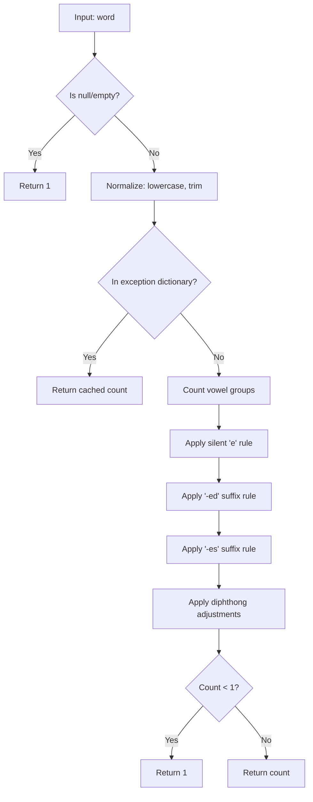

# LCS-DES-033b: Design Specification — Syllable Counter

## 1. Metadata & Categorization

| Field | Value | Description |
| :--- | :--- | :--- |
| **Feature ID** | `STY-033b` | Sub-part of STY-033 |
| **Feature Name** | `Heuristic Syllable Counter` | English syllable counting |
| **Target Version** | `v0.3.3b` | Second sub-part of v0.3.3 |
| **Module Scope** | `Lexichord.Modules.Style` | Style governance module |
| **Swimlane** | `Governance` | Part of Style vertical |
| **License Tier** | `Writer Pro` | Required for readability features |
| **Feature Gate Key** | `FeatureFlags.Style.Readability` | Shared with parent feature |
| **Author** | Lead Architect | |
| **Status** | `Draft` | |
| **Last Updated** | `2026-01-26` | |
| **Parent Document** | [LCS-DES-033-INDEX](./LCS-DES-033-INDEX.md) | |
| **Scope Breakdown** | [LCS-SBD-033 §3.2](./LCS-SBD-033.md#32-v033b-syllable-counter) | |

---

## 2. Executive Summary

### 2.1 The Requirement

Readability formulas (Flesch-Kincaid, Gunning Fog) require accurate syllable counts. English syllable counting is non-trivial due to:

- Silent letters ("queue" = 1 syllable, not 2)
- Suffix handling ("jumped" = 1 syllable, "loaded" = 2)
- Diphthongs and vowel combinations
- Irregular words that defy heuristic rules

> **Problem:** No simple algorithm correctly counts syllables in all English words. A heuristic approach with an exception dictionary provides the best balance of accuracy and performance.

### 2.2 The Proposed Solution

Implement an `ISyllableCounter` that:

1. Uses vowel-group counting as the base heuristic
2. Applies adjustments for silent 'e', suffixes, and diphthongs
3. Maintains an exception dictionary for irregular words
4. Provides `IsComplexWord()` for Gunning Fog Index calculation

---

## 3. Architecture & Modular Strategy

### 3.1 Dependencies

#### 3.1.1 Upstream Dependencies

None. This is a foundational component with no external dependencies.

#### 3.1.2 NuGet Packages

None required. Uses only BCL types.

### 3.2 Licensing Behavior

Inherits from parent feature. The `SyllableCounter` service itself has no license check; gating occurs at the `ReadabilityHudViewModel` level.

---

## 4. Data Contract (The API)

### 4.1 ISyllableCounter Interface

```csharp
namespace Lexichord.Abstractions.Contracts;

/// <summary>
/// Counts syllables in English words using heuristic rules and an exception dictionary.
/// </summary>
/// <remarks>
/// <para>The counter SHALL return a minimum of 1 syllable for any non-empty input.</para>
/// <para>Algorithm overview:</para>
/// <list type="number">
///   <item>Check exception dictionary for known irregular words</item>
///   <item>Count vowel groups (consecutive vowels = 1 syllable)</item>
///   <item>Apply heuristic adjustments for silent 'e', suffixes, diphthongs</item>
///   <item>Ensure minimum of 1 syllable</item>
/// </list>
/// </remarks>
/// <example>
/// <code>
/// var counter = new SyllableCounter();
/// counter.CountSyllables("queue");         // Returns 1
/// counter.CountSyllables("documentation"); // Returns 5
/// counter.IsComplexWord("understanding");  // Returns true (4 syllables)
/// </code>
/// </example>
public interface ISyllableCounter
{
    /// <summary>
    /// Counts the number of syllables in a word.
    /// </summary>
    /// <param name="word">The word to analyze. MAY be null or empty.</param>
    /// <returns>
    /// The syllable count. SHALL return minimum 1 for any non-empty input.
    /// Returns 1 for null or empty input.
    /// </returns>
    int CountSyllables(string word);

    /// <summary>
    /// Determines if a word is "complex" for Gunning Fog Index calculation.
    /// </summary>
    /// <remarks>
    /// A complex word has 3+ syllables, excluding words that only reach 3 syllables
    /// due to common suffixes (-ing, -ed, -es, -ly).
    /// </remarks>
    /// <param name="word">The word to analyze.</param>
    /// <returns>True if the word is complex (3+ meaningful syllables); false otherwise.</returns>
    bool IsComplexWord(string word);
}
```

---

## 5. Implementation Logic

### 5.1 Syllable Counting Algorithm



### 5.2 Vowel Group Counting

```text
ALGORITHM: Count Vowel Groups

VOWELS = ['a', 'e', 'i', 'o', 'u', 'y']

count = 0
prev_was_vowel = false

FOR EACH character IN word:
    is_vowel = character IN VOWELS

    IF is_vowel AND NOT prev_was_vowel:
        count = count + 1

    prev_was_vowel = is_vowel

RETURN count

EXAMPLE: "beautiful"
  b - consonant, count=0
  e - vowel (new group), count=1
  a - vowel (same group), count=1
  u - vowel (same group), count=1
  t - consonant, count=1
  i - vowel (new group), count=2
  f - consonant, count=2
  u - vowel (new group), count=3
  l - consonant, count=3

  Base count = 3 (correct for "beautiful")
```

### 5.3 Heuristic Adjustments

#### 5.3.1 Silent 'e' Rule

```text
RULE: Silent 'e' at end of word

IF word ends with 'e'
   AND word does NOT end with "le"
   AND current count > 1
THEN:
   count = count - 1

EXAMPLES:
  "make"  → base=2, ends with 'e', not 'le', count=1 ✓
  "table" → base=2, ends with 'le', no adjustment, count=2 ✓
  "give"  → base=2, ends with 'e', not 'le', count=1 ✓
```

#### 5.3.2 '-ed' Suffix Rule

```text
RULE: '-ed' suffix handling

IF word ends with "ed" AND word.Length > 2:
    char_before_ed = word[length - 3]

    IF char_before_ed is 'd' OR 't':
        // "-ed" adds a syllable (e.g., "loaded", "wanted")
        // No adjustment needed
    ELSE:
        // "-ed" is silent (e.g., "jumped", "played")
        count = count - 1

EXAMPLES:
  "jumped" → base=2, before_ed='p', count=1 ✓
  "loaded" → base=3, before_ed='d', no adjustment, count=2 ✓
  "wanted" → base=3, before_ed='t', no adjustment, count=2 ✓
  "played" → base=2, before_ed='y', count=1 ✓
```

#### 5.3.3 '-es' Suffix Rule

```text
RULE: '-es' suffix handling

IF word ends with "es" AND word.Length > 2:
    char_before_es = word[length - 3]

    IF char_before_es is a vowel:
        // "-es" adds a syllable (e.g., "boxes", "dishes")
        // No adjustment needed
    ELSE IF char_before_es is 's', 'x', 'z', 'ch', 'sh':
        // "-es" adds a syllable
        // No adjustment needed
    ELSE:
        // "-es" is silent (e.g., "makes", "takes")
        count = count - 1

EXAMPLES:
  "makes" → base=2, before_es='k', count=1 ✓
  "boxes" → base=2, before_es='x', no adjustment, count=2 ✓
```

### 5.4 Exception Dictionary

Words that violate heuristic rules require explicit entries:

```csharp
private static readonly Dictionary<string, int> ExceptionDictionary = new(
    StringComparer.OrdinalIgnoreCase)
{
    // 1 syllable (often miscounted as 2+)
    ["queue"] = 1,
    ["fire"] = 1,
    ["hour"] = 1,
    ["heir"] = 1,
    ["aisle"] = 1,
    ["isle"] = 1,
    ["tired"] = 1,
    ["wired"] = 1,
    ["mired"] = 1,

    // 2 syllables (often miscounted)
    ["area"] = 3,      // Actually 3, exception to handle "ea" as 2
    ["being"] = 2,
    ["lion"] = 2,
    ["quiet"] = 2,
    ["science"] = 2,
    ["diet"] = 2,
    ["fuel"] = 2,
    ["jewel"] = 2,
    ["poem"] = 2,
    ["poet"] = 2,
    ["chaos"] = 2,
    ["create"] = 2,
    ["naive"] = 2,

    // 3 syllables
    ["beautiful"] = 3,
    ["animal"] = 3,
    ["library"] = 3,
    ["several"] = 3,
    ["camera"] = 3,
    ["different"] = 3,
    ["chocolate"] = 3,
    ["average"] = 3,
    ["general"] = 3,
    ["interest"] = 3,

    // 4 syllables
    ["dictionary"] = 4,
    ["category"] = 4,
    ["territory"] = 4,
    ["necessary"] = 4,
    ["experience"] = 4,

    // 5 syllables
    ["vocabulary"] = 5,
    ["documentation"] = 5,
    ["abbreviation"] = 5,
    ["organization"] = 5,
    ["administration"] = 5
};
```

### 5.5 Complex Word Detection (Gunning Fog)

```text
ALGORITHM: Is Complex Word?

INPUT: word
OUTPUT: boolean

1. Get syllable count for word
2. IF count < 3 THEN RETURN false

3. Check for suffix inflation:
   - IF word ends with "-ing" AND root word has < 3 syllables:
       RETURN false (e.g., "running" = 2 syllables, not complex)
   - IF word ends with "-ed" AND root word has < 3 syllables:
       RETURN false
   - IF word ends with "-es" or "-s" AND root word has < 3 syllables:
       RETURN false
   - IF word ends with "-ly" AND root word has < 3 syllables:
       RETURN false

4. IF adjusted count >= 3 THEN RETURN true
5. ELSE RETURN false

EXAMPLES:
  "understanding" → 4 syllables, no suffix reduction → complex ✓
  "running"       → 2 syllables → not complex ✓
  "complicated"   → 4 syllables → complex ✓
  "carefully"     → 4 syllables, "careful"=2+ly → complex check needed
```

---

## 6. Data Persistence

**None required.** The exception dictionary is compiled into the assembly.

---

## 7. UI/UX Specifications

**None.** This is a backend service with no direct UI. Results are consumed by `IReadabilityService` (v0.3.3c).

---

## 8. Observability & Logging

| Level | Message Template |
| :--- | :--- |
| Debug | `"Counting syllables for {WordCount} unique words"` |
| Trace | `"Word '{Word}' has {SyllableCount} syllables (cached: {IsCached})"` |
| Trace | `"Complex word check: '{Word}' = {IsComplex}"` |

---

## 9. Security & Safety

| Risk | Level | Mitigation |
| :--- | :--- | :--- |
| Performance | Low | O(n) per word, dictionary lookup is O(1) |
| Memory | Low | Static dictionaries, no per-call allocations |

---

## 10. Acceptance Criteria

### 10.1 Syllable Count Accuracy

| # | Word | Expected Syllables | Notes |
| :--- | :--- | :--- | :--- |
| 1 | "the" | 1 | Simple |
| 2 | "cat" | 1 | Simple |
| 3 | "queue" | 1 | Exception dictionary |
| 4 | "fire" | 1 | Exception dictionary |
| 5 | "table" | 2 | Silent 'e' + "-le" |
| 6 | "water" | 2 | Standard |
| 7 | "jumped" | 1 | "-ed" suffix rule |
| 8 | "loaded" | 2 | "-ed" after 'd' |
| 9 | "wanted" | 2 | "-ed" after 't' |
| 10 | "makes" | 1 | "-es" suffix rule |
| 11 | "boxes" | 2 | "-es" after 'x' |
| 12 | "beautiful" | 3 | Exception dictionary |
| 13 | "animal" | 3 | Exception dictionary |
| 14 | "dictionary" | 4 | Exception dictionary |
| 15 | "documentation" | 5 | Exception dictionary |

### 10.2 Complex Word Detection

| # | Word | Is Complex | Notes |
| :--- | :--- | :--- | :--- |
| 16 | "cat" | false | 1 syllable |
| 17 | "table" | false | 2 syllables |
| 18 | "running" | false | 2 syllables |
| 19 | "beautiful" | true | 3 syllables |
| 20 | "understanding" | true | 4 syllables |
| 21 | "documentation" | true | 5 syllables |

### 10.3 Edge Cases

| # | Input | Expected | Notes |
| :--- | :--- | :--- | :--- |
| 22 | `""` (empty) | 1 | Minimum 1 |
| 23 | `null` | 1 | Minimum 1 |
| 24 | `"a"` | 1 | Single letter |
| 25 | `"I"` | 1 | Single letter |

---

## 11. Test Scenarios

### 11.1 Unit Tests

```csharp
[Trait("Category", "Unit")]
[Trait("Feature", "v0.3.3b")]
public class SyllableCounterTests
{
    private readonly SyllableCounter _sut = new();

    [Theory]
    [InlineData("the", 1)]
    [InlineData("cat", 1)]
    [InlineData("queue", 1)]
    [InlineData("fire", 1)]
    [InlineData("table", 2)]
    [InlineData("water", 2)]
    [InlineData("beautiful", 3)]
    [InlineData("animal", 3)]
    [InlineData("dictionary", 4)]
    [InlineData("documentation", 5)]
    public void CountSyllables_KnownWords_ReturnsExpectedCount(string word, int expected)
    {
        var result = _sut.CountSyllables(word);
        result.Should().Be(expected);
    }

    [Theory]
    [InlineData("jumped", 1)]    // -ed after consonant (not d/t)
    [InlineData("loaded", 2)]    // -ed after 'd'
    [InlineData("wanted", 2)]    // -ed after 't'
    [InlineData("played", 1)]    // -ed after vowel
    public void CountSyllables_EdSuffix_HandlesCorrectly(string word, int expected)
    {
        var result = _sut.CountSyllables(word);
        result.Should().Be(expected);
    }

    [Theory]
    [InlineData("makes", 1)]     // -es after consonant
    [InlineData("boxes", 2)]     // -es after 'x'
    [InlineData("dishes", 2)]    // -es after 'sh'
    public void CountSyllables_EsSuffix_HandlesCorrectly(string word, int expected)
    {
        var result = _sut.CountSyllables(word);
        result.Should().Be(expected);
    }

    [Theory]
    [InlineData("make", 1)]      // Silent 'e'
    [InlineData("table", 2)]     // "-le" exception
    [InlineData("give", 1)]      // Silent 'e'
    [InlineData("apple", 2)]     // "-le" exception
    public void CountSyllables_SilentE_HandlesCorrectly(string word, int expected)
    {
        var result = _sut.CountSyllables(word);
        result.Should().Be(expected);
    }

    [Theory]
    [InlineData("", 1)]
    [InlineData(null, 1)]
    [InlineData("a", 1)]
    [InlineData("I", 1)]
    public void CountSyllables_EdgeCases_ReturnsMinimumOne(string? word, int expected)
    {
        var result = _sut.CountSyllables(word!);
        result.Should().Be(expected);
    }

    [Theory]
    [InlineData("beautiful", true)]      // 3 syllables
    [InlineData("understanding", true)]  // 4 syllables
    [InlineData("documentation", true)]  // 5 syllables
    [InlineData("running", false)]       // 2 syllables
    [InlineData("simple", false)]        // 2 syllables
    [InlineData("cat", false)]           // 1 syllable
    public void IsComplexWord_ReturnsExpected(string word, bool expected)
    {
        var result = _sut.IsComplexWord(word);
        result.Should().Be(expected);
    }

    [Fact]
    public void CountSyllables_CaseInsensitive()
    {
        var lower = _sut.CountSyllables("beautiful");
        var upper = _sut.CountSyllables("BEAUTIFUL");
        var mixed = _sut.CountSyllables("BeAuTiFuL");

        lower.Should().Be(upper).And.Be(mixed).And.Be(3);
    }
}
```

---

## 12. Code Example

### 12.1 SyllableCounter Implementation

```csharp
namespace Lexichord.Modules.Style.Services;

/// <summary>
/// Counts syllables in English words using heuristic rules and an exception dictionary.
/// </summary>
public sealed class SyllableCounter : ISyllableCounter
{
    private static readonly HashSet<char> Vowels = ['a', 'e', 'i', 'o', 'u', 'y'];

    private static readonly Dictionary<string, int> ExceptionDictionary = new(
        StringComparer.OrdinalIgnoreCase)
    {
        // 1 syllable exceptions
        ["queue"] = 1, ["fire"] = 1, ["hour"] = 1, ["heir"] = 1,
        ["aisle"] = 1, ["isle"] = 1, ["tired"] = 1, ["wired"] = 1,

        // 2 syllable exceptions
        ["being"] = 2, ["lion"] = 2, ["quiet"] = 2, ["science"] = 2,
        ["diet"] = 2, ["fuel"] = 2, ["jewel"] = 2, ["poem"] = 2,
        ["poet"] = 2, ["chaos"] = 2, ["create"] = 2, ["naive"] = 2,

        // 3 syllable exceptions
        ["area"] = 3, ["beautiful"] = 3, ["animal"] = 3, ["library"] = 3,
        ["several"] = 3, ["camera"] = 3, ["different"] = 3, ["chocolate"] = 3,
        ["average"] = 3, ["general"] = 3, ["interest"] = 3,

        // 4 syllable exceptions
        ["dictionary"] = 4, ["category"] = 4, ["territory"] = 4,
        ["necessary"] = 4, ["experience"] = 4,

        // 5 syllable exceptions
        ["vocabulary"] = 5, ["documentation"] = 5, ["abbreviation"] = 5,
        ["organization"] = 5, ["administration"] = 5
    };

    /// <inheritdoc />
    public int CountSyllables(string word)
    {
        if (string.IsNullOrWhiteSpace(word))
        {
            return 1;
        }

        word = word.ToLowerInvariant().Trim();

        // Check exception dictionary first
        if (ExceptionDictionary.TryGetValue(word, out var cached))
        {
            return cached;
        }

        // Count vowel groups
        var syllables = CountVowelGroups(word);

        // Apply heuristic adjustments
        syllables = ApplySilentERule(word, syllables);
        syllables = ApplyEdSuffixRule(word, syllables);
        syllables = ApplyEsSuffixRule(word, syllables);

        // Ensure minimum of 1
        return Math.Max(1, syllables);
    }

    /// <inheritdoc />
    public bool IsComplexWord(string word)
    {
        if (string.IsNullOrWhiteSpace(word))
        {
            return false;
        }

        var syllables = CountSyllables(word);

        if (syllables < 3)
        {
            return false;
        }

        // Check for suffix inflation
        word = word.ToLowerInvariant();

        // Remove common suffixes and recount
        if (word.EndsWith("ing") && word.Length > 4)
        {
            var root = word[..^3];
            // Add back 'e' if it was likely removed (e.g., "making" -> "make")
            if (!root.EndsWith('e') && CountSyllables(root) < 2)
            {
                root += 'e';
            }
            if (CountSyllables(root) < 3)
            {
                return false;
            }
        }

        if (word.EndsWith("ed") && word.Length > 3)
        {
            var root = word[..^2];
            if (CountSyllables(root) < 3)
            {
                return false;
            }
        }

        if (word.EndsWith("ly") && word.Length > 3)
        {
            var root = word[..^2];
            if (CountSyllables(root) < 3)
            {
                return false;
            }
        }

        return syllables >= 3;
    }

    private static int CountVowelGroups(string word)
    {
        var count = 0;
        var prevWasVowel = false;

        foreach (var c in word)
        {
            var isVowel = Vowels.Contains(c);

            if (isVowel && !prevWasVowel)
            {
                count++;
            }

            prevWasVowel = isVowel;
        }

        return count;
    }

    private static int ApplySilentERule(string word, int syllables)
    {
        // Silent 'e' at end (unless "-le")
        if (word.EndsWith('e') && !word.EndsWith("le") && syllables > 1)
        {
            syllables--;
        }

        return syllables;
    }

    private static int ApplyEdSuffixRule(string word, int syllables)
    {
        if (word.EndsWith("ed") && word.Length > 2)
        {
            var beforeEd = word[^3];

            // "-ed" adds syllable only after 'd' or 't'
            if (beforeEd != 'd' && beforeEd != 't' && syllables > 1)
            {
                syllables--;
            }
        }

        return syllables;
    }

    private static int ApplyEsSuffixRule(string word, int syllables)
    {
        if (word.EndsWith("es") && word.Length > 2)
        {
            var beforeEs = word[^3];

            // "-es" adds syllable after s, x, z, ch, sh
            // Otherwise it's silent
            if (!Vowels.Contains(beforeEs) &&
                beforeEs != 's' && beforeEs != 'x' && beforeEs != 'z' &&
                !word.EndsWith("ches") && !word.EndsWith("shes") &&
                syllables > 1)
            {
                syllables--;
            }
        }

        return syllables;
    }
}
```

---

## 13. DI Registration

```csharp
// In StyleModule.cs
services.AddSingleton<ISyllableCounter, SyllableCounter>();
```

---

## Document History

| Version | Date | Author | Changes |
| :--- | :--- | :--- | :--- |
| 1.0 | 2026-01-26 | Lead Architect | Initial draft |
