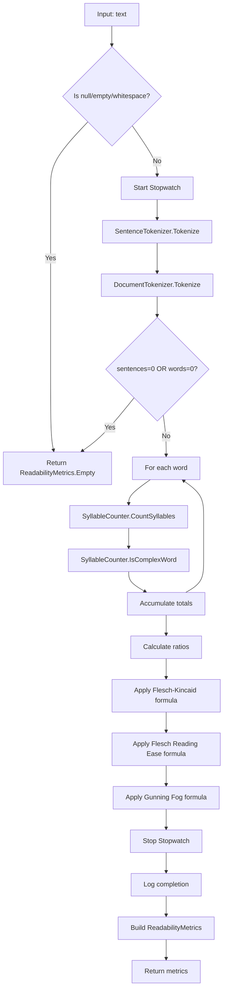

# LCS-DES-033c: Design Specification — Readability Calculator

## 1. Metadata & Categorization

| Field | Value | Description |
| :--- | :--- | :--- |
| **Feature ID** | `STY-033c` | Sub-part of STY-033 |
| **Feature Name** | `Readability Metrics Calculator` | Formula implementation |
| **Target Version** | `v0.3.3c` | Third sub-part of v0.3.3 |
| **Module Scope** | `Lexichord.Modules.Style` | Style governance module |
| **Swimlane** | `Governance` | Part of Style vertical |
| **License Tier** | `Writer Pro` | Required for readability features |
| **Feature Gate Key** | `FeatureFlags.Style.Readability` | Shared with parent feature |
| **Author** | Lead Architect | |
| **Status** | `Draft` | |
| **Last Updated** | `2026-01-26` | |
| **Parent Document** | [LCS-DES-033-INDEX](./LCS-DES-033-INDEX.md) | |
| **Scope Breakdown** | [LCS-SBD-033 §3.3](./LCS-SBD-033.md#33-v033c-the-calculator) | |

---

## 2. Executive Summary

### 2.1 The Requirement

Writers need objective, mathematical feedback on text complexity. The Readability Calculator orchestrates the sentence tokenizer (v0.3.3a) and syllable counter (v0.3.3b) to compute industry-standard readability metrics.

> **Goal:** Calculate Flesch-Kincaid Grade Level, Gunning Fog Index, and Flesch Reading Ease in real-time.

### 2.2 The Proposed Solution

Implement an `IReadabilityService` that:

1. Accepts text input and validates for empty/whitespace
2. Tokenizes text into sentences using `ISentenceTokenizer`
3. Tokenizes text into words using `IDocumentTokenizer`
4. Counts syllables and complex words using `ISyllableCounter`
5. Applies readability formulas to compute metrics
6. Publishes `ReadabilityAnalyzedEvent` via MediatR
7. Returns `ReadabilityMetrics` record with all calculated values

---

## 3. Architecture & Modular Strategy

### 3.1 Dependencies

#### 3.1.1 Upstream Dependencies

| Interface | Source Version | Purpose |
| :--- | :--- | :--- |
| `ISentenceTokenizer` | v0.3.3a | Sentence splitting |
| `ISyllableCounter` | v0.3.3b | Syllable and complexity counting |
| `IDocumentTokenizer` | v0.3.1c | Word tokenization |
| `IMediator` | v0.0.7a (MediatR) | Event publishing |
| `ILogger<T>` | v0.0.3b (Serilog) | Structured logging |

#### 3.1.2 NuGet Packages

| Package | Version | Purpose |
| :--- | :--- | :--- |
| `MediatR` | 12.x | Publishing `ReadabilityAnalyzedEvent` |
| `Serilog` | 4.x | Structured logging |

### 3.2 Licensing Behavior

The `ReadabilityService` itself has no license check. License gating occurs at the consumer level (`ReadabilityHudViewModel` in v0.3.3d).

---

## 4. Data Contract (The API)

### 4.1 IReadabilityService Interface

```csharp
namespace Lexichord.Abstractions.Contracts;

/// <summary>
/// Analyzes text and calculates readability metrics including Flesch-Kincaid Grade Level,
/// Gunning Fog Index, and Flesch Reading Ease.
/// </summary>
/// <remarks>
/// <para>The service orchestrates <see cref="ISentenceTokenizer"/> and <see cref="ISyllableCounter"/>
/// to gather the raw data needed for formula calculations.</para>
/// <para>Formulas implemented:</para>
/// <list type="bullet">
///   <item>Flesch-Kincaid: 0.39 × (words/sentences) + 11.8 × (syllables/words) - 15.59</item>
///   <item>Flesch Reading Ease: 206.835 - 1.015 × (words/sentences) - 84.6 × (syllables/words)</item>
///   <item>Gunning Fog: 0.4 × ((words/sentences) + 100 × (complex_words/words))</item>
/// </list>
/// <para>Performance targets: &lt;50ms for 1,000 words, &lt;200ms for 10,000 words.</para>
/// </remarks>
public interface IReadabilityService
{
    /// <summary>
    /// Analyzes text and returns readability metrics synchronously.
    /// </summary>
    /// <param name="text">The text to analyze. MAY be null or empty.</param>
    /// <returns>
    /// A <see cref="ReadabilityMetrics"/> record with all calculated values.
    /// Returns <see cref="ReadabilityMetrics.Empty"/> for null, empty, or whitespace-only input.
    /// </returns>
    ReadabilityMetrics Analyze(string text);

    /// <summary>
    /// Analyzes text asynchronously on a background thread.
    /// </summary>
    /// <param name="text">The text to analyze.</param>
    /// <param name="ct">Cancellation token to abort long-running analysis.</param>
    /// <returns>A task containing the readability metrics.</returns>
    /// <exception cref="OperationCanceledException">Thrown if cancellation is requested.</exception>
    Task<ReadabilityMetrics> AnalyzeAsync(string text, CancellationToken ct = default);
}
```

### 4.2 ReadabilityMetrics Record

```csharp
namespace Lexichord.Abstractions.Contracts;

/// <summary>
/// Immutable record containing all readability metrics calculated from text analysis.
/// </summary>
public record ReadabilityMetrics
{
    /// <summary>
    /// Flesch-Kincaid Grade Level (U.S. school grade equivalent).
    /// </summary>
    /// <remarks>
    /// Formula: 0.39 × (words/sentences) + 11.8 × (syllables/words) - 15.59
    /// Range: 0 to ~20+. Lower values indicate easier text.
    /// </remarks>
    /// <example>8.4 indicates 8th-9th grade reading level.</example>
    public double FleschKincaidGradeLevel { get; init; }

    /// <summary>
    /// Gunning Fog Index (years of formal education needed).
    /// </summary>
    /// <remarks>
    /// Formula: 0.4 × ((words/sentences) + 100 × (complex_words/words))
    /// Range: 6 to ~20. Lower values indicate easier text.
    /// </remarks>
    /// <example>10.2 indicates 10 years of education needed.</example>
    public double GunningFogIndex { get; init; }

    /// <summary>
    /// Flesch Reading Ease score (0-100 scale).
    /// </summary>
    /// <remarks>
    /// Formula: 206.835 - 1.015 × (words/sentences) - 84.6 × (syllables/words)
    /// Range: 0 to 100. Higher values indicate easier text.
    /// </remarks>
    /// <example>62.3 indicates "Standard" difficulty.</example>
    public double FleschReadingEase { get; init; }

    /// <summary>Total number of words in the analyzed text.</summary>
    public int WordCount { get; init; }

    /// <summary>Total number of sentences in the analyzed text.</summary>
    public int SentenceCount { get; init; }

    /// <summary>Total number of syllables across all words.</summary>
    public int SyllableCount { get; init; }

    /// <summary>
    /// Number of complex words (3+ syllables for Gunning Fog).
    /// </summary>
    public int ComplexWordCount { get; init; }

    /// <summary>Computed: Average number of words per sentence.</summary>
    public double AverageWordsPerSentence =>
        SentenceCount > 0 ? (double)WordCount / SentenceCount : 0;

    /// <summary>Computed: Average number of syllables per word.</summary>
    public double AverageSyllablesPerWord =>
        WordCount > 0 ? (double)SyllableCount / WordCount : 0;

    /// <summary>Computed: Percentage of complex words (0-100).</summary>
    public double ComplexWordPercentage =>
        WordCount > 0 ? 100.0 * ComplexWordCount / WordCount : 0;

    /// <summary>Human-readable interpretation of grade level.</summary>
    public string GradeLevelInterpretation => FleschKincaidGradeLevel switch
    {
        < 1 => "Kindergarten",
        < 6 => "Elementary School",
        < 9 => "Middle School",
        < 13 => "High School",
        < 17 => "College",
        _ => "Graduate Level"
    };

    /// <summary>Human-readable interpretation of reading ease.</summary>
    public string ReadingEaseInterpretation => FleschReadingEase switch
    {
        >= 90 => "Very Easy (5th grade)",
        >= 80 => "Easy (6th grade)",
        >= 70 => "Fairly Easy (7th grade)",
        >= 60 => "Standard (8th-9th grade)",
        >= 50 => "Fairly Difficult (10th-12th grade)",
        >= 30 => "Difficult (College)",
        _ => "Very Difficult (Graduate)"
    };

    /// <summary>Singleton empty metrics for invalid input.</summary>
    public static ReadabilityMetrics Empty => new()
    {
        FleschKincaidGradeLevel = 0,
        GunningFogIndex = 0,
        FleschReadingEase = 0,
        WordCount = 0,
        SentenceCount = 0,
        SyllableCount = 0,
        ComplexWordCount = 0
    };
}
```

### 4.3 ReadabilityAnalyzedEvent

```csharp
namespace Lexichord.Modules.Style.Events;

/// <summary>
/// Published via MediatR when readability analysis completes for a document.
/// </summary>
/// <remarks>
/// The <see cref="ReadabilityHudViewModel"/> subscribes to this event to update the display.
/// </remarks>
/// <param name="DocumentId">The unique identifier of the analyzed document.</param>
/// <param name="Metrics">The calculated readability metrics.</param>
/// <param name="AnalysisDuration">Time taken to complete the analysis.</param>
public record ReadabilityAnalyzedEvent(
    Guid DocumentId,
    ReadabilityMetrics Metrics,
    TimeSpan AnalysisDuration) : INotification;
```

---

## 5. Implementation Logic

### 5.1 Analysis Pipeline Flow



### 5.2 Readability Formulas

#### 5.2.1 Flesch-Kincaid Grade Level

```text
FK = 0.39 × ASL + 11.8 × ASW - 15.59

Where:
  ASL = Average Sentence Length (words / sentences)
  ASW = Average Syllables per Word (syllables / words)

Result interpretation:
  0-1   = Kindergarten
  1-5   = Elementary School
  6-8   = Middle School
  9-12  = High School
  13-16 = College
  17+   = Graduate Level

Example: "The cat sat on the mat."
  words = 6, sentences = 1, syllables = 6
  ASL = 6/1 = 6
  ASW = 6/6 = 1
  FK = 0.39 × 6 + 11.8 × 1 - 15.59
  FK = 2.34 + 11.8 - 15.59 = -1.45
  FK = 0 (clamped to minimum 0)
```

#### 5.2.2 Flesch Reading Ease

```text
FRE = 206.835 - 1.015 × ASL - 84.6 × ASW

Result interpretation (0-100, higher = easier):
  90-100 = Very Easy (5th grade)
  80-89  = Easy (6th grade)
  70-79  = Fairly Easy (7th grade)
  60-69  = Standard (8th-9th grade)
  50-59  = Fairly Difficult (10th-12th grade)
  30-49  = Difficult (College)
  0-29   = Very Difficult (Graduate)

Example: "The cat sat on the mat."
  ASL = 6, ASW = 1
  FRE = 206.835 - 1.015 × 6 - 84.6 × 1
  FRE = 206.835 - 6.09 - 84.6 = 116.145
  FRE = 100 (clamped to maximum 100)
```

#### 5.2.3 Gunning Fog Index

```text
GF = 0.4 × (ASL + 100 × CWR)

Where:
  ASL = Average Sentence Length (words / sentences)
  CWR = Complex Word Ratio (complex_words / words)
  Complex word = 3+ syllables (excluding common suffixes)

Result interpretation:
  Value = Years of formal education needed
  6  = 6th grade
  12 = High school senior
  17 = College graduate

Example: "The cat sat on the mat."
  ASL = 6, complex_words = 0, CWR = 0
  GF = 0.4 × (6 + 100 × 0)
  GF = 0.4 × 6 = 2.4
```

### 5.3 Performance Optimization

| Strategy | Implementation |
| :--- | :--- |
| Single pass word iteration | Count syllables and complex words in one loop |
| Lazy tokenization | Only tokenize when input is valid |
| Background execution | `AnalyzeAsync` uses `Task.Run()` |
| Cancellation support | Check `ct.ThrowIfCancellationRequested()` in loop |
| Logging threshold | Only log warnings if analysis exceeds 100ms |

---

## 6. Data Persistence

**None required.** The `ReadabilityService` is stateless. Results are transient and recalculated on each document change.

---

## 7. UI/UX Specifications

**None.** This is a backend service. UI is handled by `ReadabilityHudView` (v0.3.3d).

---

## 8. Observability & Logging

| Level | Message Template |
| :--- | :--- |
| Debug | `"Analysis starting: {WordCount} words, {SentenceCount} sentences"` |
| Info | `"Analysis completed: FK={Grade:F1}, Fog={Fog:F1} in {ElapsedMs}ms"` |
| Warning | `"Analysis exceeded threshold: {ElapsedMs}ms > {ThresholdMs}ms"` |
| Debug | `"Empty text provided, returning empty metrics"` |

### 8.1 Performance Thresholds

| Document Size | Target Time | Warning Threshold |
| :--- | :--- | :--- |
| 1,000 words | < 50ms | 100ms |
| 10,000 words | < 200ms | 500ms |
| 50,000+ words | < 1,000ms | 2,000ms |

---

## 9. Security & Safety

| Risk | Level | Mitigation |
| :--- | :--- | :--- |
| Large input DoS | Low | Cancellation token support |
| Memory pressure | Low | Stateless design, no caching |
| Thread safety | N/A | Service is stateless |

---

## 10. Acceptance Criteria

### 10.1 Formula Accuracy

| # | Input | Metric | Expected Range | Notes |
| :--- | :--- | :--- | :--- | :--- |
| 1 | "The cat sat on the mat." | FK Grade | < 2.0 | Kindergarten level |
| 2 | "The cat sat on the mat." | FRE | > 90 | Very Easy |
| 3 | "The cat sat on the mat." | GF | < 4.0 | Elementary |
| 4 | Complex academic text | FK Grade | > 12 | College level |
| 5 | Complex academic text | FRE | < 50 | Difficult |
| 6 | Gettysburg Address | FK Grade | 10-13 | Known reference |

### 10.2 Data Accuracy

| # | Input | Metric | Expected |
| :--- | :--- | :--- | :--- |
| 7 | "The cat sat on the mat." | WordCount | 6 |
| 8 | "The cat sat on the mat." | SentenceCount | 1 |
| 9 | "The cat sat on the mat." | SyllableCount | 6 |
| 10 | "The cat sat on the mat." | ComplexWordCount | 0 |

### 10.3 Edge Cases

| # | Input | Expected |
| :--- | :--- | :--- |
| 11 | `""` | `ReadabilityMetrics.Empty` |
| 12 | `null` | `ReadabilityMetrics.Empty` |
| 13 | `"   \n\t  "` | `ReadabilityMetrics.Empty` |
| 14 | Single word "Hello" | Valid metrics (1 sentence assumed) |

### 10.4 Performance

| # | Input Size | Expected Time |
| :--- | :--- | :--- |
| 15 | 1,000 words | < 50ms |
| 16 | 10,000 words | < 200ms |

### 10.5 Integration

| # | Scenario | Expected |
| :--- | :--- | :--- |
| 17 | Resolve from DI | Service is not null |
| 18 | Call AnalyzeAsync | Returns valid metrics |
| 19 | Cancel AnalyzeAsync | Throws OperationCanceledException |

---

## 11. Test Scenarios

### 11.1 Unit Tests

```csharp
[Trait("Category", "Unit")]
[Trait("Feature", "v0.3.3c")]
public class ReadabilityServiceTests
{
    private readonly IReadabilityService _sut;

    public ReadabilityServiceTests()
    {
        _sut = new ReadabilityService(
            new SentenceTokenizer(),
            new SyllableCounter(),
            new DocumentTokenizer(),
            NullLogger<ReadabilityService>.Instance);
    }

    [Fact]
    public void Analyze_SimpleText_ReturnsLowGradeLevel()
    {
        // Arrange
        var text = "The cat sat on the mat.";

        // Act
        var result = _sut.Analyze(text);

        // Assert
        result.WordCount.Should().Be(6);
        result.SentenceCount.Should().Be(1);
        result.SyllableCount.Should().Be(6);
        result.ComplexWordCount.Should().Be(0);
        result.FleschKincaidGradeLevel.Should().BeLessThan(2);
        result.FleschReadingEase.Should().BeGreaterThan(90);
        result.GunningFogIndex.Should().BeLessThan(4);
    }

    [Fact]
    public void Analyze_ComplexText_ReturnsHighGradeLevel()
    {
        // Arrange
        var text = "Constructing sophisticated architectural paradigms " +
                   "requires substantial theoretical knowledge and experience.";

        // Act
        var result = _sut.Analyze(text);

        // Assert
        result.FleschKincaidGradeLevel.Should().BeGreaterThan(12);
        result.GunningFogIndex.Should().BeGreaterThan(15);
        result.ComplexWordCount.Should().BeGreaterThan(3);
    }

    [Fact]
    public void Analyze_GettysburgAddress_MatchesKnownValues()
    {
        // Arrange - First sentence of Gettysburg Address
        var text = "Four score and seven years ago our fathers brought forth " +
                   "on this continent, a new nation, conceived in Liberty, " +
                   "and dedicated to the proposition that all men are created equal.";

        // Act
        var result = _sut.Analyze(text);

        // Assert - Known FK grade level is ~11-12
        result.FleschKincaidGradeLevel.Should().BeInRange(10, 14);
    }

    [Theory]
    [InlineData("")]
    [InlineData(null)]
    [InlineData("   ")]
    [InlineData("\n\t")]
    public void Analyze_EmptyOrWhitespace_ReturnsEmptyMetrics(string? text)
    {
        // Act
        var result = _sut.Analyze(text!);

        // Assert
        result.Should().Be(ReadabilityMetrics.Empty);
        result.WordCount.Should().Be(0);
        result.SentenceCount.Should().Be(0);
    }

    [Fact]
    public void Analyze_ComputedProperties_CalculateCorrectly()
    {
        // Arrange
        var text = "Hello world. Goodbye world.";

        // Act
        var result = _sut.Analyze(text);

        // Assert
        result.AverageWordsPerSentence.Should().Be(2.0); // 4 words / 2 sentences
        result.AverageSyllablesPerWord.Should().BeApproximately(1.25, 0.01); // 5 syllables / 4 words
    }

    [Fact]
    public void Analyze_GradeLevelInterpretation_ReturnsCorrectText()
    {
        // Simple text = low grade
        var simple = _sut.Analyze("The cat sat.");
        simple.GradeLevelInterpretation.Should().BeOneOf(
            "Kindergarten", "Elementary School");

        // Complex text = high grade
        var complex = _sut.Analyze(
            "Epistemological considerations regarding ontological frameworks " +
            "necessitate comprehensive philosophical deliberation.");
        complex.GradeLevelInterpretation.Should().BeOneOf(
            "College", "Graduate Level");
    }

    [Fact]
    public async Task AnalyzeAsync_ReturnsValidMetrics()
    {
        // Arrange
        var text = "The quick brown fox jumps over the lazy dog.";

        // Act
        var result = await _sut.AnalyzeAsync(text);

        // Assert
        result.WordCount.Should().Be(9);
        result.SentenceCount.Should().Be(1);
    }

    [Fact]
    public async Task AnalyzeAsync_WhenCancelled_ThrowsOperationCanceled()
    {
        // Arrange
        var text = string.Join(" ", Enumerable.Repeat("word", 10000));
        var cts = new CancellationTokenSource();
        cts.Cancel();

        // Act & Assert
        await Assert.ThrowsAsync<OperationCanceledException>(
            () => _sut.AnalyzeAsync(text, cts.Token));
    }
}
```

### 11.2 Performance Tests

```csharp
[Trait("Category", "Performance")]
[Trait("Feature", "v0.3.3c")]
public class ReadabilityServicePerformanceTests
{
    private readonly IReadabilityService _sut;

    public ReadabilityServicePerformanceTests()
    {
        _sut = new ReadabilityService(
            new SentenceTokenizer(),
            new SyllableCounter(),
            new DocumentTokenizer(),
            NullLogger<ReadabilityService>.Instance);
    }

    [Fact]
    public void Analyze_1000Words_CompletesWithin50ms()
    {
        // Arrange
        var text = GenerateText(wordCount: 1000);
        var stopwatch = Stopwatch.StartNew();

        // Act
        _sut.Analyze(text);
        stopwatch.Stop();

        // Assert
        stopwatch.ElapsedMilliseconds.Should().BeLessThan(50);
    }

    [Fact]
    public void Analyze_10000Words_CompletesWithin200ms()
    {
        // Arrange
        var text = GenerateText(wordCount: 10000);
        var stopwatch = Stopwatch.StartNew();

        // Act
        _sut.Analyze(text);
        stopwatch.Stop();

        // Assert
        stopwatch.ElapsedMilliseconds.Should().BeLessThan(200);
    }

    private static string GenerateText(int wordCount)
    {
        var words = new[] { "the", "quick", "brown", "fox", "jumps", "over", "lazy", "dog" };
        var random = new Random(42);
        var result = new StringBuilder();

        for (var i = 0; i < wordCount; i++)
        {
            result.Append(words[random.Next(words.Length)]);
            result.Append(i % 10 == 9 ? ". " : " ");
        }

        return result.ToString();
    }
}
```

---

## 12. Code Example

### 12.1 ReadabilityService Implementation

```csharp
namespace Lexichord.Modules.Style.Services;

/// <summary>
/// Calculates readability metrics using sentence tokenization and syllable counting.
/// </summary>
public sealed class ReadabilityService(
    ISentenceTokenizer sentenceTokenizer,
    ISyllableCounter syllableCounter,
    IDocumentTokenizer wordTokenizer,
    ILogger<ReadabilityService> logger) : IReadabilityService
{
    private const int PerformanceThresholdMs = 100;

    /// <inheritdoc />
    public ReadabilityMetrics Analyze(string text)
    {
        if (string.IsNullOrWhiteSpace(text))
        {
            logger.LogDebug("Empty text provided, returning empty metrics");
            return ReadabilityMetrics.Empty;
        }

        var stopwatch = Stopwatch.StartNew();

        // Tokenize text
        var sentences = sentenceTokenizer.Tokenize(text);
        var words = wordTokenizer.Tokenize(text);

        var wordCount = words.Count;
        var sentenceCount = sentences.Count;

        logger.LogDebug(
            "Analysis starting: {WordCount} words, {SentenceCount} sentences",
            wordCount, sentenceCount);

        if (sentenceCount == 0 || wordCount == 0)
        {
            return ReadabilityMetrics.Empty;
        }

        // Count syllables and identify complex words
        var totalSyllables = 0;
        var complexWordCount = 0;

        foreach (var word in words)
        {
            var syllables = syllableCounter.CountSyllables(word);
            totalSyllables += syllables;

            if (syllableCounter.IsComplexWord(word))
            {
                complexWordCount++;
            }
        }

        // Calculate ratios
        var avgWordsPerSentence = (double)wordCount / sentenceCount;
        var avgSyllablesPerWord = (double)totalSyllables / wordCount;
        var complexWordRatio = (double)complexWordCount / wordCount;

        // Apply formulas
        var fleschKincaid = CalculateFleschKincaid(avgWordsPerSentence, avgSyllablesPerWord);
        var fleschReadingEase = CalculateFleschReadingEase(avgWordsPerSentence, avgSyllablesPerWord);
        var gunningFog = CalculateGunningFog(avgWordsPerSentence, complexWordRatio);

        stopwatch.Stop();
        var elapsedMs = stopwatch.ElapsedMilliseconds;

        logger.LogInformation(
            "Analysis completed: FK={Grade:F1}, Fog={Fog:F1} in {ElapsedMs}ms",
            fleschKincaid, gunningFog, elapsedMs);

        if (elapsedMs > PerformanceThresholdMs)
        {
            logger.LogWarning(
                "Analysis exceeded threshold: {ElapsedMs}ms > {ThresholdMs}ms",
                elapsedMs, PerformanceThresholdMs);
        }

        return new ReadabilityMetrics
        {
            FleschKincaidGradeLevel = fleschKincaid,
            GunningFogIndex = gunningFog,
            FleschReadingEase = fleschReadingEase,
            WordCount = wordCount,
            SentenceCount = sentenceCount,
            SyllableCount = totalSyllables,
            ComplexWordCount = complexWordCount
        };
    }

    /// <inheritdoc />
    public Task<ReadabilityMetrics> AnalyzeAsync(string text, CancellationToken ct = default)
    {
        ct.ThrowIfCancellationRequested();
        return Task.Run(() => Analyze(text), ct);
    }

    /// <summary>
    /// Flesch-Kincaid Grade Level formula.
    /// </summary>
    private static double CalculateFleschKincaid(double avgWordsPerSentence, double avgSyllablesPerWord)
    {
        var result = 0.39 * avgWordsPerSentence + 11.8 * avgSyllablesPerWord - 15.59;
        return Math.Max(0, result); // Clamp to minimum 0
    }

    /// <summary>
    /// Flesch Reading Ease formula.
    /// </summary>
    private static double CalculateFleschReadingEase(double avgWordsPerSentence, double avgSyllablesPerWord)
    {
        var result = 206.835 - 1.015 * avgWordsPerSentence - 84.6 * avgSyllablesPerWord;
        return Math.Clamp(result, 0, 100); // Clamp to 0-100 range
    }

    /// <summary>
    /// Gunning Fog Index formula.
    /// </summary>
    private static double CalculateGunningFog(double avgWordsPerSentence, double complexWordRatio)
    {
        var result = 0.4 * (avgWordsPerSentence + 100 * complexWordRatio);
        return Math.Max(0, result); // Clamp to minimum 0
    }
}
```

---

## 13. DI Registration

```csharp
// In StyleModule.cs
services.AddScoped<IReadabilityService, ReadabilityService>();
```

---

## Document History

| Version | Date | Author | Changes |
| :--- | :--- | :--- | :--- |
| 1.0 | 2026-01-26 | Lead Architect | Initial draft |
