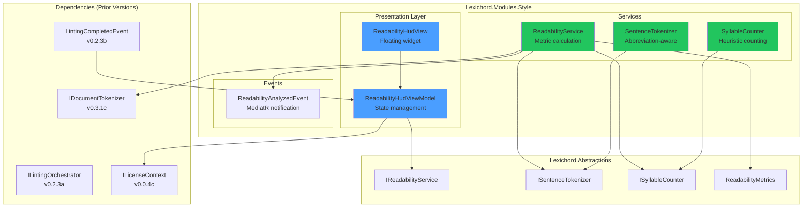
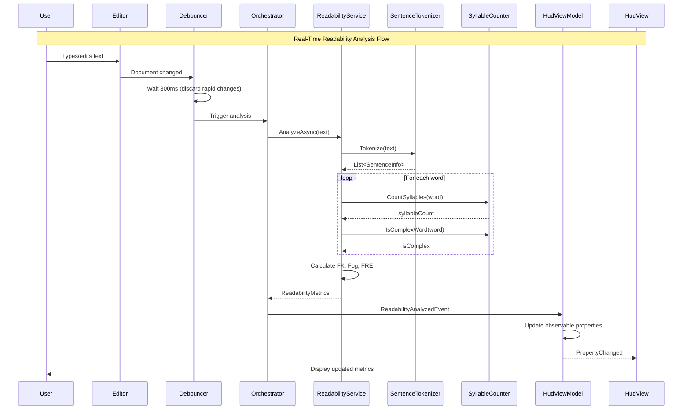

# LCS-SBD-033: Scope Breakdown — The Readability Engine

## Document Control

| Field            | Value                                    |
| :--------------- | :--------------------------------------- |
| **Document ID**  | LCS-SBD-033                              |
| **Version**      | v0.3.3                                   |
| **Codename**     | The Readability Engine (Metrics)         |
| **Status**       | Draft                                    |
| **Last Updated** | 2026-01-26                               |
| **Owner**        | Lead Architect                           |
| **Depends On**   | v0.3.2 (Dictionary Manager), v0.2.3 (Linting Orchestrator) |

---

## 1. Executive Summary

### 1.1 The Vision

**v0.3.3** delivers the **Readability Engine** — algorithmic calculation of text complexity metrics. This release transforms Lexichord from a rule-based linter into a comprehensive writing analysis platform, enabling writers to understand and optimize the reading level of their content.

While v0.2.x enforced terminology rules and v0.3.1-2 added fuzzy matching and dictionary management, the Readability Engine provides objective, mathematical analysis of text structure. Writers can now see at a glance whether their content is appropriate for their target audience—whether that's academic papers (Grade 12+), general audiences (Grade 8), or simplified content (Grade 6).

### 1.2 Business Value

- **Objective Feedback:** Writers receive mathematical metrics rather than subjective opinions about text complexity.
- **Audience Targeting:** Match content complexity to intended readers (technical documentation, marketing copy, children's literature).
- **Real-Time Guidance:** See readability scores update as you type, enabling iterative improvement.
- **Industry Standards:** Flesch-Kincaid and Gunning Fog are established metrics used in education, government, and publishing.
- **Enterprise Compliance:** Organizations requiring specific readability levels (e.g., healthcare, legal) can verify compliance.
- **Foundation:** Enables the Voice Profiler (v0.3.4) and Resonance Dashboard (v0.3.5) to build on algorithmic analysis.

### 1.3 Success Criteria

This release succeeds when:

1. Readability analysis calculates Flesch-Kincaid, Gunning Fog, and Flesch Reading Ease within ±0.1 of reference implementations.
2. Sentence tokenization correctly handles common abbreviations (Mr., Dr., Inc., etc.) without false sentence breaks.
3. Syllable counting produces accurate results for standard English words (verified against known corpus).
4. HUD widget updates in real-time (< 500ms after typing stops) without blocking the UI thread.
5. All analysis respects license gating (Writer Pro+ feature).

### 1.4 License Gating

The Readability Engine is a **Writer Pro** feature. Lower tiers will see:

- HUD widget placeholder with "Upgrade to Writer Pro" message
- Analysis runs but results are hidden (no feature bypass)
- "Readability" menu items disabled with upgrade tooltip
- Settings panel shows feature preview with upgrade CTA

---

## 2. Dependencies on Prior Versions

| Component                | Source Version | Usage in v0.3.3                                  |
| :----------------------- | :------------- | :----------------------------------------------- |
| `ILintingOrchestrator`   | v0.2.3a        | Integration point for triggering analysis        |
| `LintingCompletedEvent`  | v0.2.3b        | Subscribe to trigger readability analysis        |
| `IDocumentTokenizer`     | v0.3.1c        | Reuse word tokenization logic                    |
| `ILicenseContext`        | v0.0.4c        | Read-only license tier access                    |
| `LicenseTier`            | v0.0.4c        | Core/WriterPro/Teams/Enterprise enum             |
| `Feature`                | v0.3.1d        | Feature gate constants                           |
| `ViewModelBase`          | v0.1.1         | Base ViewModel class with INotifyPropertyChanged |
| `System.Reactive`        | v0.2.3a        | Observable debouncing for real-time updates      |
| `IConfigurationService`  | v0.0.3d        | User preference storage                          |
| `Serilog`                | v0.0.3b        | Structured logging                               |

---

## 3. Sub-Part Specifications

### 3.1 v0.3.3a: Sentence Tokenizer

| Field            | Value                                     |
| :--------------- | :---------------------------------------- |
| **Sub-Part ID**  | INF-033a                                  |
| **Title**        | Abbreviation-Aware Sentence Tokenizer     |
| **Module**       | `Lexichord.Modules.Style`                 |
| **License Tier** | Writer Pro                                |

**Goal:** Implement a robust text splitter that respects abbreviations and does not create false sentence breaks on periods within abbreviations.

**Key Deliverables:**

- `ISentenceTokenizer` interface in `Lexichord.Abstractions`
- `SentenceTokenizer` implementation in `Modules.Style/Services`
- `SentenceInfo` record capturing sentence text, position, and word count
- Abbreviation dictionary with 50+ common English abbreviations
- Custom abbreviation support via configuration
- Unit tests with edge cases (Mr., Dr., Inc., U.S.A., etc.)

**Key Interfaces:**

```csharp
namespace Lexichord.Abstractions.Contracts;

/// <summary>
/// Tokenizes text into sentences, respecting abbreviations and edge cases.
/// </summary>
public interface ISentenceTokenizer
{
    /// <summary>
    /// Splits text into individual sentences.
    /// </summary>
    /// <param name="text">The input text to tokenize.</param>
    /// <returns>List of sentence information records.</returns>
    IReadOnlyList<SentenceInfo> Tokenize(string text);
}

/// <summary>
/// Information about a single sentence within a text.
/// </summary>
/// <param name="Text">The sentence text.</param>
/// <param name="StartIndex">Character index where sentence begins.</param>
/// <param name="EndIndex">Character index where sentence ends.</param>
/// <param name="WordCount">Number of words in the sentence.</param>
public record SentenceInfo(
    string Text,
    int StartIndex,
    int EndIndex,
    int WordCount);
```

**Abbreviation Detection Logic:**

```text
TOKENIZE text:
│
├── Split on sentence-ending punctuation (.!?)
│
├── For each potential sentence break:
│   ├── Is preceding word in abbreviation dictionary?
│   │   ├── YES → NOT a sentence break (rejoin)
│   │   └── NO → Continue
│   │
│   ├── Is preceding word a single capital letter followed by period?
│   │   ├── YES → Check if part of initials (A.B.C.) → NOT a sentence break
│   │   └── NO → Continue
│   │
│   ├── Is next character lowercase (continuing sentence)?
│   │   ├── YES → NOT a sentence break
│   │   └── NO → CONFIRM sentence break
│   │
│   └── SPLIT into sentences
│
└── Return list of SentenceInfo records
```

**Standard Abbreviations Dictionary:**

```text
Titles:      Mr., Mrs., Ms., Dr., Prof., Rev., Hon., Capt., Lt., Sgt.
Suffixes:    Jr., Sr., Ph.D., M.D., B.A., M.A., Esq.
Business:    Inc., Corp., Ltd., Co., LLC., Bros.
Geographic:  St., Ave., Blvd., Rd., Mt., Ft.
Time:        a.m., p.m., A.M., P.M.
Latin:       etc., e.g., i.e., vs., viz., cf.
Countries:   U.S., U.K., U.S.A., U.S.S.R.
Misc:        No., Vol., Fig., approx., est.
```

**Dependencies:**

- v0.3.1c: `IDocumentTokenizer` (reuse word splitting logic)

---

### 3.2 v0.3.3b: Syllable Counter

| Field            | Value                                     |
| :--------------- | :---------------------------------------- |
| **Sub-Part ID**  | INF-033b                                  |
| **Title**        | Heuristic Syllable Counter                |
| **Module**       | `Lexichord.Modules.Style`                 |
| **License Tier** | Writer Pro                                |

**Goal:** Implement a heuristic syllable counter that counts vowel groups and handles English language exceptions (silent 'e', diphthongs).

**Key Deliverables:**

- `ISyllableCounter` interface in `Lexichord.Abstractions`
- `SyllableCounter` implementation using vowel group heuristics
- Exception dictionary for irregular words (queue, area, poem)
- Support for common suffixes (-le, -ed, -es)
- Unit tests with known syllable counts

**Key Interfaces:**

```csharp
namespace Lexichord.Abstractions.Contracts;

/// <summary>
/// Counts syllables in English words using heuristic rules.
/// </summary>
public interface ISyllableCounter
{
    /// <summary>
    /// Counts the number of syllables in a word.
    /// </summary>
    /// <param name="word">The word to analyze.</param>
    /// <returns>The syllable count (minimum 1).</returns>
    int CountSyllables(string word);

    /// <summary>
    /// Determines if a word is "complex" for Gunning Fog calculation.
    /// Complex words have 3+ syllables, excluding common suffixes.
    /// </summary>
    /// <param name="word">The word to analyze.</param>
    /// <returns>True if the word is complex.</returns>
    bool IsComplexWord(string word);
}
```

**Syllable Counting Algorithm:**

```text
COUNT syllables in word:
│
├── Normalize: lowercase, trim whitespace
│
├── Check exception dictionary first
│   └── If found → return cached count
│
├── Count vowel groups (a, e, i, o, u, y)
│   └── Consecutive vowels = 1 syllable (e.g., "ea", "ou", "ai")
│
├── Apply heuristic adjustments:
│   ├── Silent 'e' at end: subtract 1 (unless word ends in "-le")
│   │   └── Examples: "make" (1), "table" (2)
│   ├── "-ed" suffix: don't count if preceded by 'd' or 't'
│   │   └── Examples: "jumped" (1), "loaded" (2)
│   ├── "-es" suffix: don't count if preceded by consonant
│   │   └── Examples: "makes" (1), "boxes" (2)
│   └── Diphthongs: "ia", "io", "eo" = 2 syllables
│
├── Ensure minimum of 1 syllable
│
└── Return count
```

**Exception Dictionary (Irregular Words):**

```text
1 syllable:  queue, fire, hour, heir, aisle, isle
2 syllables: area, being, lion, quiet, science, diet, fuel, jewel
3 syllables: beautiful, animal, library, several, camera
4 syllables: dictionary, vocabulary, category
5 syllables: documentation, abbreviation
```

**Complex Word Detection (for Gunning Fog):**

```text
IS word complex?
│
├── Count syllables
│
├── If syllables < 3 → NOT complex
│
├── Check for common suffixes that don't make word complex:
│   ├── "-ing" (e.g., "understanding" still complex, but "running" not)
│   ├── "-ed" (e.g., "complicated" still complex)
│   ├── "-es" / "-s" (plurals)
│   └── Apply judgment based on root word syllables
│
└── If adjusted syllables >= 3 → IS complex
```

**Dependencies:**

- None (foundational component)

---

### 3.3 v0.3.3c: The Calculator

| Field            | Value                                     |
| :--------------- | :---------------------------------------- |
| **Sub-Part ID**  | INF-033c                                  |
| **Title**        | Readability Metrics Calculator            |
| **Module**       | `Lexichord.Modules.Style`                 |
| **License Tier** | Writer Pro                                |

**Goal:** Implement `IReadabilityService` that calculates Flesch-Kincaid Grade Level, Gunning Fog Index, and Flesch Reading Ease using the sentence tokenizer and syllable counter.

**Key Deliverables:**

- `IReadabilityService` interface in `Lexichord.Abstractions`
- `ReadabilityService` implementation orchestrating tokenizer and counter
- `ReadabilityMetrics` record with all calculated values
- `ReadabilityAnalyzedEvent` MediatR notification
- Unit tests with known reference texts (Gettysburg Address, etc.)

**Key Interfaces:**

```csharp
namespace Lexichord.Abstractions.Contracts;

/// <summary>
/// Analyzes text and calculates readability metrics.
/// </summary>
public interface IReadabilityService
{
    /// <summary>
    /// Analyzes text and returns readability metrics.
    /// </summary>
    /// <param name="text">The text to analyze.</param>
    /// <returns>Readability metrics for the text.</returns>
    ReadabilityMetrics Analyze(string text);

    /// <summary>
    /// Analyzes text asynchronously.
    /// </summary>
    Task<ReadabilityMetrics> AnalyzeAsync(string text, CancellationToken ct = default);
}

/// <summary>
/// Readability metrics calculated from text analysis.
/// </summary>
public record ReadabilityMetrics
{
    /// <summary>Flesch-Kincaid Grade Level (U.S. school grade).</summary>
    public double FleschKincaidGradeLevel { get; init; }

    /// <summary>Gunning Fog Index (years of education needed).</summary>
    public double GunningFogIndex { get; init; }

    /// <summary>Flesch Reading Ease (0-100, higher = easier).</summary>
    public double FleschReadingEase { get; init; }

    /// <summary>Total word count.</summary>
    public int WordCount { get; init; }

    /// <summary>Total sentence count.</summary>
    public int SentenceCount { get; init; }

    /// <summary>Total syllable count.</summary>
    public int SyllableCount { get; init; }

    /// <summary>Number of complex words (3+ syllables for Gunning Fog).</summary>
    public int ComplexWordCount { get; init; }

    /// <summary>Average words per sentence.</summary>
    public double AverageWordsPerSentence =>
        SentenceCount > 0 ? (double)WordCount / SentenceCount : 0;

    /// <summary>Average syllables per word.</summary>
    public double AverageSyllablesPerWord =>
        WordCount > 0 ? (double)SyllableCount / WordCount : 0;

    /// <summary>Percentage of complex words.</summary>
    public double ComplexWordPercentage =>
        WordCount > 0 ? 100.0 * ComplexWordCount / WordCount : 0;

    /// <summary>Interpretation of the Flesch-Kincaid grade level.</summary>
    public string GradeLevelInterpretation => FleschKincaidGradeLevel switch
    {
        < 1 => "Kindergarten",
        < 6 => "Elementary School",
        < 9 => "Middle School",
        < 13 => "High School",
        < 17 => "College",
        _ => "Graduate Level"
    };

    /// <summary>Interpretation of Flesch Reading Ease.</summary>
    public string ReadingEaseInterpretation => FleschReadingEase switch
    {
        >= 90 => "Very Easy (5th grade)",
        >= 80 => "Easy (6th grade)",
        >= 70 => "Fairly Easy (7th grade)",
        >= 60 => "Standard (8th-9th grade)",
        >= 50 => "Fairly Difficult (10th-12th grade)",
        >= 30 => "Difficult (College)",
        _ => "Very Difficult (Graduate)"
    };

    /// <summary>Empty metrics for empty or invalid input.</summary>
    public static ReadabilityMetrics Empty => new()
    {
        FleschKincaidGradeLevel = 0,
        GunningFogIndex = 0,
        FleschReadingEase = 0,
        WordCount = 0,
        SentenceCount = 0,
        SyllableCount = 0,
        ComplexWordCount = 0
    };
}
```

**Readability Formulas:**

```text
FLESCH-KINCAID GRADE LEVEL:
  FK = 0.39 × (words/sentences) + 11.8 × (syllables/words) - 15.59

FLESCH READING EASE:
  FRE = 206.835 - 1.015 × (words/sentences) - 84.6 × (syllables/words)

GUNNING FOG INDEX:
  GF = 0.4 × ((words/sentences) + 100 × (complex_words/words))

Where:
  - words = total word count
  - sentences = total sentence count
  - syllables = total syllable count
  - complex_words = words with 3+ syllables (excluding common suffixes)
```

**MediatR Event:**

```csharp
namespace Lexichord.Modules.Style.Events;

/// <summary>
/// Published when readability analysis completes for a document.
/// </summary>
public record ReadabilityAnalyzedEvent(
    Guid DocumentId,
    ReadabilityMetrics Metrics,
    TimeSpan AnalysisDuration) : INotification;
```

**Dependencies:**

- v0.3.3a: `ISentenceTokenizer` (sentence splitting)
- v0.3.3b: `ISyllableCounter` (syllable counting)
- v0.3.1c: `IDocumentTokenizer` (word tokenization)

---

### 3.4 v0.3.3d: The HUD Widget

| Field            | Value                                     |
| :--------------- | :---------------------------------------- |
| **Sub-Part ID**  | INF-033d                                  |
| **Title**        | Readability HUD Widget                    |
| **Module**       | `Lexichord.Modules.Style`                 |
| **License Tier** | Writer Pro                                |

**Goal:** Create a floating status bar widget in the bottom-right corner of the Editor that displays real-time readability metrics with expandable detail view.

**Key Deliverables:**

- `ReadabilityHudView.axaml` with collapsed/expanded states
- `ReadabilityHudViewModel` with reactive binding to analysis events
- Integration with `LintingCompletedEvent` for trigger timing
- 300ms debounce on document changes
- Smooth animation between collapsed/expanded states
- License gate with upgrade prompt for Core users
- Unit tests for ViewModel state management

**Key Interfaces:**

```csharp
namespace Lexichord.Modules.Style.ViewModels;

/// <summary>
/// ViewModel for the Readability HUD widget.
/// </summary>
public partial class ReadabilityHudViewModel : ViewModelBase
{
    [ObservableProperty]
    private bool _isExpanded;

    [ObservableProperty]
    private bool _isAnalyzing;

    [ObservableProperty]
    private bool _isLicensed;

    [ObservableProperty]
    private ReadabilityMetrics? _metrics;

    // Formatted display properties
    public string GradeLevelDisplay => Metrics?.FleschKincaidGradeLevel.ToString("F1") ?? "--";
    public string WordsPerSentenceDisplay => Metrics?.AverageWordsPerSentence.ToString("F0") ?? "--";
    public string FogIndexDisplay => Metrics?.GunningFogIndex.ToString("F1") ?? "--";
    public string ReadingEaseDisplay => Metrics?.FleschReadingEase.ToString("F0") ?? "--";

    [RelayCommand]
    private void ToggleExpanded() => IsExpanded = !IsExpanded;
}
```

**Key UI Components (Collapsed State):**

```text
┌─────────────────────────────────────┐
│  Grade 8.4  │  15 w/s  │  [▼]      │ ← 32px height, floating bottom-right
└─────────────────────────────────────┘

Components:
- Grade Level: Flesch-Kincaid rounded to 1 decimal
- w/s: Average words per sentence, integer
- [▼]: Expand button to show full metrics
```

**Key UI Components (Expanded State):**

```text
┌─────────────────────────────────────┐
│  Readability Metrics           [▲]  │ ← Title bar with collapse button
├─────────────────────────────────────┤
│  FK Grade Level:          8.4       │
│  Gunning Fog Index:       10.2      │
│  Flesch Reading Ease:     62.3      │
│  ─────────────────────────────────  │
│  Words:                   1,245     │
│  Sentences:               82        │
│  Words/Sentence:          15.2      │
│  Syllables/Word:          1.6       │
│  ─────────────────────────────────  │
│  Interpretation:                    │
│  "Standard (8th-9th grade)"         │
└─────────────────────────────────────┘
```

**Key UI Components (Core User - License Gated):**

```text
┌─────────────────────────────────────┐
│  🔒 Readability Metrics             │
├─────────────────────────────────────┤
│  Upgrade to Writer Pro to see       │
│  readability analysis.              │
│                                     │
│  [Upgrade Now]                      │
└─────────────────────────────────────┘
```

**Real-Time Update Logic:**

```text
ON document change:
│
├── Debounce 300ms (discard rapid changes)
│
├── Check license
│   ├── NOT Writer Pro → Show gated UI, skip analysis
│   └── IS Writer Pro → Continue
│
├── Set IsAnalyzing = true (show spinner)
│
├── Run analysis on background thread:
│   └── IReadabilityService.AnalyzeAsync(documentText)
│
├── Publish ReadabilityAnalyzedEvent
│
├── Update ViewModel properties
│
└── Set IsAnalyzing = false
```

**Animation Specifications:**

| Animation | Duration | Easing |
| :-------- | :------- | :----- |
| Expand | 200ms | EaseOutCubic |
| Collapse | 150ms | EaseInCubic |
| Metrics fade-in | 100ms | Linear |
| Spinner rotation | 1000ms | Linear (loop) |

**Dependencies:**

- v0.3.3c: `IReadabilityService` (metrics calculation)
- v0.2.3b: `LintingCompletedEvent` (trigger timing)
- v0.0.4c: `ILicenseContext` (license check)
- v0.1.1: `ViewModelBase` (MVVM base class)

---

## 4. Implementation Checklist

| #  | Sub-Part | Task                                                      | Est. Hours |
| :- | :------- | :-------------------------------------------------------- | :--------- |
| 1  | v0.3.3a  | Create `ISentenceTokenizer` interface in Abstractions     | 0.5        |
| 2  | v0.3.3a  | Create `SentenceInfo` record                              | 0.5        |
| 3  | v0.3.3a  | Implement abbreviation dictionary (50+ entries)           | 1          |
| 4  | v0.3.3a  | Implement `SentenceTokenizer` with abbreviation handling  | 3          |
| 5  | v0.3.3a  | Unit tests for sentence tokenizer (edge cases)            | 2          |
| 6  | v0.3.3b  | Create `ISyllableCounter` interface in Abstractions       | 0.5        |
| 7  | v0.3.3b  | Implement exception dictionary for irregular words        | 1          |
| 8  | v0.3.3b  | Implement `SyllableCounter` with heuristics               | 2          |
| 9  | v0.3.3b  | Implement `IsComplexWord` for Gunning Fog                 | 1          |
| 10 | v0.3.3b  | Unit tests for syllable counter (known values)            | 2          |
| 11 | v0.3.3c  | Create `IReadabilityService` interface                    | 0.5        |
| 12 | v0.3.3c  | Create `ReadabilityMetrics` record with computed props    | 1          |
| 13 | v0.3.3c  | Implement `ReadabilityService` with all formulas          | 2          |
| 14 | v0.3.3c  | Create `ReadabilityAnalyzedEvent` MediatR notification    | 0.5        |
| 15 | v0.3.3c  | Unit tests with reference texts (Gettysburg Address)      | 2          |
| 16 | v0.3.3d  | Create `ReadabilityHudView.axaml` (collapsed state)       | 2          |
| 17 | v0.3.3d  | Implement expanded state with full metrics                | 2          |
| 18 | v0.3.3d  | Create `ReadabilityHudViewModel` with observables         | 2          |
| 19 | v0.3.3d  | Implement 300ms debounce with System.Reactive             | 1          |
| 20 | v0.3.3d  | Add expand/collapse animations                            | 1          |
| 21 | v0.3.3d  | Implement license gating with upgrade prompt              | 1          |
| 22 | v0.3.3d  | Unit tests for ViewModel state transitions                | 1.5        |
| 23 | All      | Integration with `LintingCompletedEvent`                  | 1          |
| 24 | All      | DI registration in `StyleModule.cs`                       | 0.5        |
| 25 | All      | Integration tests for full analysis pipeline              | 2          |
| **Total** |   |                                                           | **32 hours** |

---

## 5. Dependency Matrix

### 5.1 Required Interfaces (from earlier versions)

| Interface                | Source Version | Purpose                              |
| :----------------------- | :------------- | :----------------------------------- |
| `IDocumentTokenizer`     | v0.3.1c        | Word tokenization for syllable count |
| `ILintingOrchestrator`   | v0.2.3a        | Analysis pipeline integration        |
| `LintingCompletedEvent`  | v0.2.3b        | Trigger for readability analysis     |
| `ILicenseContext`        | v0.0.4c        | License tier checking                |
| `LicenseTier`            | v0.0.4c        | Tier enumeration                     |
| `Feature`                | v0.3.1d        | Feature gate constants               |
| `ViewModelBase`          | v0.1.1         | Observable ViewModel base            |
| `IConfigurationService`  | v0.0.3d        | Preference storage                   |

### 5.2 New Interfaces (defined in v0.3.3)

| Interface                | Defined In | Module        | Purpose                          |
| :----------------------- | :--------- | :------------ | :------------------------------- |
| `ISentenceTokenizer`     | v0.3.3a    | Abstractions  | Abbreviation-aware tokenization  |
| `ISyllableCounter`       | v0.3.3b    | Abstractions  | Heuristic syllable counting      |
| `IReadabilityService`    | v0.3.3c    | Abstractions  | Readability metrics calculation  |

### 5.3 New Records/DTOs (defined in v0.3.3)

| Record                     | Defined In | Purpose                                |
| :------------------------- | :--------- | :------------------------------------- |
| `SentenceInfo`             | v0.3.3a    | Sentence metadata (text, position)     |
| `ReadabilityMetrics`       | v0.3.3c    | All calculated readability values      |
| `ReadabilityAnalyzedEvent` | v0.3.3c    | MediatR notification for UI updates    |

### 5.4 NuGet Packages

| Package          | Version | Purpose                    | New/Existing |
| :--------------- | :------ | :------------------------- | :----------- |
| `System.Reactive`| 6.x     | Observable debouncing      | Existing     |
| `MediatR`        | 12.x    | Event publishing           | Existing     |

---

## 6. Architecture Diagram



---

## 7. Data Flow Diagram



---

## 8. Risks & Mitigations

| Risk | Impact | Probability | Mitigation |
| :--- | :----- | :---------- | :--------- |
| Syllable counting inaccuracy for unusual words | Medium | Medium | Exception dictionary + user override capability |
| Abbreviation dictionary incomplete | Low | Medium | Allow user-defined abbreviations in config |
| Performance degradation on large documents (50k+ words) | High | Low | Chunk processing, background thread, cancellation token |
| UI thread blocking during analysis | High | Low | All analysis on Task.Run(), UI only subscribes to events |
| False sentence breaks on edge cases (ellipsis, URLs) | Medium | Medium | Add pattern detection for URLs, ellipsis before tokenizing |
| Gunning Fog complex word detection inconsistent | Low | Medium | Document algorithm clearly, use established suffix rules |
| Memory pressure from repeated analysis | Medium | Low | Cache results per document version, dispose subscriptions |

---

## 9. Success Metrics

| Metric | Target | Measurement |
| :----- | :----- | :---------- |
| FK Grade Level accuracy | ±0.1 of reference | Compare against NIST readability corpus |
| Gunning Fog accuracy | ±0.2 of reference | Compare against published test texts |
| Syllable count accuracy | 95%+ | Test against CMU Pronouncing Dictionary |
| Sentence tokenizer accuracy | 98%+ | Test against Penn Treebank samples |
| Analysis time (1,000 words) | < 50ms | Stopwatch timing |
| Analysis time (10,000 words) | < 200ms | Stopwatch timing |
| HUD update latency | < 500ms from typing stop | End-to-end timing |
| Memory usage (analysis) | < 5MB overhead | Memory profiler |

---

## 10. What This Enables

After v0.3.3, Lexichord will support:

- **v0.3.4 (Voice Profiler):** Build on readability metrics to detect passive voice, adverbs, and weasel words. Create writing "profiles" (Technical, Marketing, Academic) with target readability ranges.

- **v0.3.5 (Resonance Dashboard):** Visualize readability using radar charts and spider diagrams. Show how current text compares to target profile using the metrics from v0.3.3.

- **v0.3.6 (Global Dictionary):** Add readability targets to project configuration. Override default thresholds per project.

- **Future:** AI-powered suggestions for simplifying complex sentences, based on readability analysis.

---

## 11. Decision Trees

### 11.1 Should Readability Analysis Run?

```text
START: "Should readability analysis run on this document?"
│
├── Has document changed since last analysis?
│   ├── NO → Return cached results
│   └── YES → Continue
│
├── Is debounce period (300ms) elapsed?
│   ├── NO → Wait, discard this request
│   └── YES → Continue
│
├── Is user license >= WriterPro?
│   ├── NO → Show license gate UI, skip analysis
│   └── YES → Continue
│
├── Is analysis already in progress?
│   ├── YES → Cancel previous, start new
│   └── NO → Continue
│
├── Is document empty or whitespace-only?
│   ├── YES → Return ReadabilityMetrics.Empty
│   └── NO → Proceed with analysis
│
└── Run full analysis pipeline
```

### 11.2 Is This an Abbreviation?

```text
START: "Is this word followed by period an abbreviation?"
│
├── Is word in standard abbreviation dictionary?
│   └── YES → IS abbreviation (not sentence end)
│
├── Is word a single uppercase letter?
│   └── YES → Check context for initials pattern
│       ├── Followed by another "X." pattern → IS initials
│       └── Otherwise → MIGHT be sentence end
│
├── Is word all uppercase and 2-4 letters?
│   └── YES → Likely acronym (U.S., U.K.) → IS abbreviation
│
├── Is next character lowercase?
│   └── YES → Sentence continues → IS abbreviation
│
├── Is next character a quotation mark followed by lowercase?
│   └── YES → Sentence continues → IS abbreviation
│
└── IS sentence end (not abbreviation)
```

---

## 12. User Stories

| ID    | Role            | Story                                                                               | Acceptance Criteria                                   |
| :---- | :-------------- | :---------------------------------------------------------------------------------- | :---------------------------------------------------- |
| US-01 | Writer Pro User | As a writer, I want to see the reading grade level of my document in real-time.     | HUD shows FK Grade updating within 500ms of stopping. |
| US-02 | Writer Pro User | As a writer, I want to see detailed metrics when I expand the HUD widget.           | Expanded view shows all 5 metrics + interpretation.   |
| US-03 | Writer Pro User | As a writer, I want abbreviations handled correctly so "Mr. Smith" is one sentence. | "Mr. Smith went." tokenized as 1 sentence.            |
| US-04 | Writer Pro User | As a writer, I want accurate syllable counts for common words.                      | "queue"=1, "documentation"=5 syllables.               |
| US-05 | Core User       | As a free user, I understand readability is a premium feature.                      | HUD shows upgrade prompt, not metrics.                |
| US-06 | Developer       | As a developer, I want analysis to not block the UI thread.                         | Typing remains smooth during analysis.                |
| US-07 | Writer Pro User | As a writer, I want to understand what my grade level means.                        | Interpretation text explains grade level.             |

---

## 13. Use Cases

### UC-01: Real-Time Readability Display

**Preconditions:**

- User has Writer Pro license
- Document is open in editor
- HUD widget is visible

**Flow:**

1. User types or edits text in the editor.
2. System debounces for 300ms after last keystroke.
3. System triggers readability analysis on background thread.
4. `SentenceTokenizer` splits text into sentences.
5. `SyllableCounter` counts syllables for each word.
6. `ReadabilityService` calculates FK, Fog, and FRE.
7. System publishes `ReadabilityAnalyzedEvent`.
8. `ReadabilityHudViewModel` receives event and updates properties.
9. HUD widget displays "Grade X.X | Y w/s" in collapsed view.
10. User can click expand button to see full metrics.

**Postconditions:**

- HUD displays current readability metrics.
- Metrics are accurate within success metric tolerances.

---

### UC-02: License Gate Enforcement

**Preconditions:**

- User has Core (free) license
- Document is open in editor

**Flow:**

1. HUD widget checks license on initialization.
2. `ILicenseContext.HasFeature(Feature.Readability)` returns false.
3. HUD displays lock icon and "Upgrade to Writer Pro" message.
4. "Upgrade Now" button is visible and enabled.
5. User clicks "Upgrade Now".
6. System opens subscription page in browser.
7. If user upgrades and refreshes, HUD shows metrics.

**Postconditions:**

- Core users never see actual readability metrics.
- Clear upgrade path is provided.

---

### UC-03: Abbreviation Handling

**Preconditions:**

- Text contains abbreviations (Mr., Dr., Inc., etc.)

**Flow:**

1. User enters: "Dr. Smith works at Acme Inc. He is the CEO."
2. System tokenizes text.
3. "Dr." is recognized as abbreviation (not sentence end).
4. "Inc." is recognized as abbreviation (not sentence end).
5. System identifies 2 sentences:
   - "Dr. Smith works at Acme Inc."
   - "He is the CEO."
6. Sentence count = 2, word count = 11.
7. Metrics calculated with correct sentence count.

**Postconditions:**

- Abbreviations do not create false sentence breaks.
- Metrics are accurate.

---

## 14. Unit Testing Requirements

### 14.1 SentenceTokenizer Tests

```csharp
[Trait("Category", "Unit")]
public class SentenceTokenizerTests
{
    private readonly SentenceTokenizer _sut = new();

    [Theory]
    [InlineData("Hello world.", 1)]
    [InlineData("Hello. World.", 2)]
    [InlineData("Hello! World?", 2)]
    public void Tokenize_SimpleSentences_ReturnsCorrectCount(
        string text, int expectedCount)
    {
        var result = _sut.Tokenize(text);
        result.Should().HaveCount(expectedCount);
    }

    [Theory]
    [InlineData("Mr. Smith went home.", 1)]
    [InlineData("Dr. Jones and Mrs. Smith met.", 1)]
    [InlineData("She works at Acme Inc. in New York.", 1)]
    public void Tokenize_WithAbbreviations_DoesNotSplitFalsely(
        string text, int expectedCount)
    {
        var result = _sut.Tokenize(text);
        result.Should().HaveCount(expectedCount);
    }

    [Theory]
    [InlineData("The U.S.A. is a country. It is large.", 2)]
    [InlineData("See Fig. 1. It shows the data.", 2)]
    public void Tokenize_AbbreviationsFollowedBySentence_SplitsCorrectly(
        string text, int expectedCount)
    {
        var result = _sut.Tokenize(text);
        result.Should().HaveCount(expectedCount);
    }

    [Fact]
    public void Tokenize_WithEllipsis_DoesNotSplitOnEachDot()
    {
        var result = _sut.Tokenize("Wait... I have an idea.");
        result.Should().HaveCount(1);
    }

    [Fact]
    public void Tokenize_EmptyString_ReturnsEmpty()
    {
        var result = _sut.Tokenize("");
        result.Should().BeEmpty();
    }
}
```

### 14.2 SyllableCounter Tests

```csharp
[Trait("Category", "Unit")]
public class SyllableCounterTests
{
    private readonly SyllableCounter _sut = new();

    [Theory]
    [InlineData("the", 1)]
    [InlineData("cat", 1)]
    [InlineData("queue", 1)]
    [InlineData("fire", 1)]
    [InlineData("table", 2)]
    [InlineData("water", 2)]
    [InlineData("beautiful", 3)]
    [InlineData("animal", 3)]
    [InlineData("dictionary", 4)]
    [InlineData("documentation", 5)]
    public void CountSyllables_KnownWords_ReturnsExpectedCount(
        string word, int expected)
    {
        var result = _sut.CountSyllables(word);
        result.Should().Be(expected);
    }

    [Theory]
    [InlineData("jumped", 1)]    // -ed after consonant
    [InlineData("loaded", 2)]    // -ed after 'd'
    [InlineData("wanted", 2)]    // -ed after 't'
    [InlineData("makes", 1)]     // -es after consonant
    [InlineData("boxes", 2)]     // -es after 'x'
    public void CountSyllables_WithSuffixes_HandlesCorrectly(
        string word, int expected)
    {
        var result = _sut.CountSyllables(word);
        result.Should().Be(expected);
    }

    [Theory]
    [InlineData("a", 1)]
    [InlineData("I", 1)]
    [InlineData("", 1)]  // Minimum 1
    public void CountSyllables_MinimumOne(string word, int expected)
    {
        var result = _sut.CountSyllables(word);
        result.Should().BeGreaterThanOrEqualTo(1);
    }

    [Theory]
    [InlineData("beautiful", true)]      // 3 syllables
    [InlineData("understanding", true)]  // 4 syllables
    [InlineData("running", false)]       // 2 syllables
    [InlineData("simple", false)]        // 2 syllables
    public void IsComplexWord_ReturnsExpected(string word, bool expected)
    {
        var result = _sut.IsComplexWord(word);
        result.Should().Be(expected);
    }
}
```

### 14.3 ReadabilityService Tests

```csharp
[Trait("Category", "Unit")]
public class ReadabilityServiceTests
{
    private readonly IReadabilityService _sut;

    public ReadabilityServiceTests()
    {
        _sut = new ReadabilityService(
            new SentenceTokenizer(),
            new SyllableCounter(),
            new DocumentTokenizer());
    }

    [Fact]
    public void Analyze_SimpleText_ReturnsLowGradeLevel()
    {
        // "The cat sat on the mat." - very simple
        var result = _sut.Analyze("The cat sat on the mat.");

        result.WordCount.Should().Be(6);
        result.SentenceCount.Should().Be(1);
        result.SyllableCount.Should().Be(6);
        result.FleschKincaidGradeLevel.Should().BeLessThan(2);
        result.FleschReadingEase.Should().BeGreaterThan(90);
    }

    [Fact]
    public void Analyze_ComplexText_ReturnsHighGradeLevel()
    {
        var text = "Constructing sophisticated architectural paradigms " +
                   "requires substantial theoretical knowledge.";

        var result = _sut.Analyze(text);

        result.FleschKincaidGradeLevel.Should().BeGreaterThan(12);
        result.GunningFogIndex.Should().BeGreaterThan(15);
    }

    [Fact]
    public void Analyze_GettysburgAddress_MatchesKnownValues()
    {
        // The Gettysburg Address has known readability scores
        var gettysburg = "Four score and seven years ago our fathers brought " +
                         "forth on this continent, a new nation, conceived in " +
                         "Liberty, and dedicated to the proposition that all " +
                         "men are created equal.";

        var result = _sut.Analyze(gettysburg);

        // Known FK grade level for Gettysburg Address is ~11-12
        result.FleschKincaidGradeLevel.Should().BeInRange(10, 13);
    }

    [Fact]
    public void Analyze_EmptyText_ReturnsEmptyMetrics()
    {
        var result = _sut.Analyze("");

        result.WordCount.Should().Be(0);
        result.SentenceCount.Should().Be(0);
        result.FleschKincaidGradeLevel.Should().Be(0);
    }

    [Fact]
    public void Analyze_WhitespaceOnly_ReturnsEmptyMetrics()
    {
        var result = _sut.Analyze("   \n\t  ");

        result.Should().Be(ReadabilityMetrics.Empty);
    }
}
```

### 14.4 ReadabilityHudViewModel Tests

```csharp
[Trait("Category", "Unit")]
public class ReadabilityHudViewModelTests
{
    [Fact]
    public void ToggleExpanded_TogglesState()
    {
        var sut = CreateViewModel(isLicensed: true);
        sut.IsExpanded.Should().BeFalse();

        sut.ToggleExpandedCommand.Execute(null);

        sut.IsExpanded.Should().BeTrue();
    }

    [Fact]
    public void GradeLevelDisplay_WithMetrics_ShowsFormattedValue()
    {
        var sut = CreateViewModel(isLicensed: true);
        sut.Metrics = new ReadabilityMetrics
        {
            FleschKincaidGradeLevel = 8.45
        };

        sut.GradeLevelDisplay.Should().Be("8.5");
    }

    [Fact]
    public void GradeLevelDisplay_WithoutMetrics_ShowsDashes()
    {
        var sut = CreateViewModel(isLicensed: true);
        sut.Metrics = null;

        sut.GradeLevelDisplay.Should().Be("--");
    }

    [Fact]
    public void IsLicensed_WhenCore_ReturnsFalse()
    {
        var mockLicense = new Mock<ILicenseContext>();
        mockLicense.Setup(l => l.HasFeature(Feature.Readability))
            .Returns(false);

        var sut = new ReadabilityHudViewModel(mockLicense.Object);

        sut.IsLicensed.Should().BeFalse();
    }
}
```

---

## 15. Observability & Logging

| Level   | Source              | Message Template                                                       |
| :------ | :------------------ | :--------------------------------------------------------------------- |
| Debug   | SentenceTokenizer   | `Tokenizing text: {CharCount} characters`                              |
| Debug   | SentenceTokenizer   | `Found {SentenceCount} sentences`                                      |
| Trace   | SentenceTokenizer   | `Abbreviation detected: '{Word}' at position {Position}`               |
| Debug   | SyllableCounter     | `Counting syllables for {WordCount} words`                             |
| Trace   | SyllableCounter     | `Word '{Word}' has {SyllableCount} syllables (cached: {IsCached})`     |
| Debug   | ReadabilityService  | `Analysis starting: {WordCount} words, {SentenceCount} sentences`      |
| Info    | ReadabilityService  | `Analysis completed: FK={Grade:F1}, Fog={Fog:F1} in {ElapsedMs}ms`     |
| Warning | ReadabilityService  | `Analysis exceeded threshold: {ElapsedMs}ms > {ThresholdMs}ms`         |
| Debug   | ReadabilityHudVM    | `License check for Readability: {IsLicensed}`                          |
| Debug   | ReadabilityHudVM    | `Metrics updated: Grade {GradeLevel}, {WordsPerSentence} w/s`          |
| Debug   | ReadabilityHudVM    | `Debounce triggered, waiting 300ms`                                    |

---

## 16. UI/UX Specifications

### 16.1 ReadabilityHudView Layout

**Collapsed State (Default):**

```text
┌─────────────────────────────────────────┐
│  Grade 8.4  │  15 w/s  │  [▼]           │  Height: 32px
└─────────────────────────────────────────┘
     │             │          └── Expand button (16x16)
     │             └── Words per sentence (integer)
     └── Flesch-Kincaid Grade Level (1 decimal)

Position: Bottom-right of editor, 16px margin
Background: Surface.Overlay with 80% opacity
Border: 1px Border.Subtle
Corner radius: 6px
```

**Expanded State:**

```text
┌─────────────────────────────────────────┐
│  Readability Metrics               [▲]  │  Header: 32px
├─────────────────────────────────────────┤
│  FK Grade Level:            8.4         │
│  Gunning Fog Index:         10.2        │
│  Flesch Reading Ease:       62.3        │
│  ─────────────────────────────────────  │  Separator
│  Words:                     1,245       │
│  Sentences:                 82          │
│  Words/Sentence:            15.2        │
│  Syllables/Word:            1.6         │
│  ─────────────────────────────────────  │  Separator
│  "Standard (8th-9th grade)"             │  Interpretation
└─────────────────────────────────────────┘

Width: 280px
Row height: 24px
Padding: 12px
Total height: ~300px
```

### 16.2 Component Styling Requirements

| Component           | Theme Resource             | Notes                            |
| :------------------ | :------------------------- | :------------------------------- |
| HUD Container       | `Brush.Surface.Overlay`    | 80% opacity backdrop             |
| HUD Border          | `Brush.Border.Subtle`      | 1px solid                        |
| Metric Labels       | `Brush.Text.Secondary`     | Left-aligned                     |
| Metric Values       | `Brush.Text.Primary`       | Right-aligned, monospace         |
| Expand Button       | `LexButtonGhost` theme     | Icon only, no background         |
| Separator           | `Brush.Border.Subtle`      | 1px horizontal                   |
| Interpretation      | `Brush.Text.Tertiary`      | Italic, centered                 |
| Upgrade Button      | `LexButtonPrimary` theme   | Full width in gated state        |

### 16.3 Color Coding for Grade Levels

| Grade Level | Color | Hex | Meaning |
| :---------- | :---- | :-- | :------ |
| 0-5 | Green | #22c55e | Very Easy |
| 6-8 | Blue | #4a9eff | Standard |
| 9-12 | Yellow | #eab308 | Challenging |
| 13+ | Orange | #f97316 | Advanced |

---

## 17. Acceptance Criteria (QA)

| #   | Category            | Criterion                                                                    |
| :-- | :------------------ | :--------------------------------------------------------------------------- |
| 1   | **[Algorithm]**     | FK Grade Level for "The cat sat on the mat." is < 2.0.                       |
| 2   | **[Algorithm]**     | Syllable count for "queue" is 1, "documentation" is 5.                       |
| 3   | **[Algorithm]**     | "Mr. Smith went home." tokenizes as 1 sentence.                              |
| 4   | **[Algorithm]**     | Gunning Fog counts "understanding" as complex (4 syllables).                 |
| 5   | **[Performance]**   | Analysis of 1,000 words completes in < 50ms.                                 |
| 6   | **[Performance]**   | HUD updates within 500ms of typing stop.                                     |
| 7   | **[UI]**            | Collapsed HUD shows "Grade X.X \| Y w/s" format.                             |
| 8   | **[UI]**            | Expanded HUD shows all 5 metrics + interpretation.                           |
| 9   | **[UI]**            | Expand/collapse animates smoothly (200ms/150ms).                             |
| 10  | **[License Gate]**  | Core users see lock icon and upgrade prompt.                                 |
| 11  | **[License Gate]**  | Core users cannot see actual readability values.                             |
| 12  | **[License Gate]**  | Writer Pro users see full metrics.                                           |
| 13  | **[Integration]**   | Analysis triggers on document change, not on every keystroke.                |
| 14  | **[Integration]**   | HUD receives updates via `ReadabilityAnalyzedEvent`.                         |
| 15  | **[Edge Cases]**    | Empty document shows "-- \| --" in HUD.                                      |
| 16  | **[Edge Cases]**    | Document with only whitespace shows empty metrics.                           |
| 17  | **[Accessibility]** | All HUD elements have `AutomationProperties.Name`.                           |

---

## 18. Verification Commands

```bash
# ═══════════════════════════════════════════════════════════════════════════
# v0.3.3 Verification
# ═══════════════════════════════════════════════════════════════════════════

# 1. Build solution
dotnet build

# 2. Run unit tests for v0.3.3 components
dotnet test --filter "Category=Unit&FullyQualifiedName~SentenceTokenizer"
dotnet test --filter "Category=Unit&FullyQualifiedName~SyllableCounter"
dotnet test --filter "Category=Unit&FullyQualifiedName~ReadabilityService"
dotnet test --filter "Category=Unit&FullyQualifiedName~ReadabilityHud"

# 3. Run all v0.3.3 tests
dotnet test --filter "Category=Unit&FullyQualifiedName~v0.3.3"

# 4. Run performance tests
dotnet test --filter "Category=Performance&FullyQualifiedName~Readability"

# 5. Manual verification:
# a) Open app as Core user → Verify HUD shows upgrade prompt
# b) Open app as Writer Pro → Verify HUD shows metrics
# c) Type simple text → Verify low grade level
# d) Type complex text → Verify high grade level
# e) Type "Mr. Smith went." → Verify sentence count is 1
# f) Click expand button → Verify full metrics display
# g) Type rapidly → Verify debounce prevents flicker
```

---

## 19. Deliverable Checklist

| #  | Deliverable                                                    | Status |
| :- | :------------------------------------------------------------- | :----- |
| 1  | `ISentenceTokenizer` interface in Abstractions                 | [ ]    |
| 2  | `SentenceTokenizer` implementation with abbreviation handling  | [ ]    |
| 3  | `SentenceInfo` record                                          | [ ]    |
| 4  | Abbreviation dictionary (50+ entries)                          | [ ]    |
| 5  | `ISyllableCounter` interface in Abstractions                   | [ ]    |
| 6  | `SyllableCounter` implementation with heuristics               | [ ]    |
| 7  | Exception dictionary for irregular words                       | [ ]    |
| 8  | `IReadabilityService` interface in Abstractions                | [ ]    |
| 9  | `ReadabilityService` implementation with all formulas          | [ ]    |
| 10 | `ReadabilityMetrics` record with computed properties           | [ ]    |
| 11 | `ReadabilityAnalyzedEvent` MediatR notification                | [ ]    |
| 12 | `ReadabilityHudView.axaml` (collapsed and expanded states)     | [ ]    |
| 13 | `ReadabilityHudViewModel` with reactive bindings               | [ ]    |
| 14 | License gating with upgrade prompt                             | [ ]    |
| 15 | 300ms debounce on document changes                             | [ ]    |
| 16 | Expand/collapse animations                                     | [ ]    |
| 17 | Unit tests for SentenceTokenizer                               | [ ]    |
| 18 | Unit tests for SyllableCounter                                 | [ ]    |
| 19 | Unit tests for ReadabilityService                              | [ ]    |
| 20 | Unit tests for ReadabilityHudViewModel                         | [ ]    |
| 21 | Integration tests for analysis pipeline                        | [ ]    |
| 22 | DI registration in StyleModule.cs                              | [ ]    |

---

## 20. Code Examples

### 20.1 ReadabilityMetrics Record

```csharp
namespace Lexichord.Modules.Style.Models;

/// <summary>
/// Readability metrics calculated from text analysis.
/// Includes Flesch-Kincaid, Gunning Fog, and Flesch Reading Ease.
/// </summary>
public record ReadabilityMetrics
{
    /// <summary>
    /// Flesch-Kincaid Grade Level (U.S. school grade).
    /// Formula: 0.39 × (words/sentences) + 11.8 × (syllables/words) - 15.59
    /// </summary>
    public double FleschKincaidGradeLevel { get; init; }

    /// <summary>
    /// Gunning Fog Index (years of formal education needed).
    /// Formula: 0.4 × ((words/sentences) + 100 × (complex_words/words))
    /// </summary>
    public double GunningFogIndex { get; init; }

    /// <summary>
    /// Flesch Reading Ease (0-100, higher = easier to read).
    /// Formula: 206.835 - 1.015 × (words/sentences) - 84.6 × (syllables/words)
    /// </summary>
    public double FleschReadingEase { get; init; }

    /// <summary>Total word count in the analyzed text.</summary>
    public int WordCount { get; init; }

    /// <summary>Total sentence count in the analyzed text.</summary>
    public int SentenceCount { get; init; }

    /// <summary>Total syllable count across all words.</summary>
    public int SyllableCount { get; init; }

    /// <summary>
    /// Number of complex words (3+ syllables, excluding common suffixes).
    /// Used in Gunning Fog calculation.
    /// </summary>
    public int ComplexWordCount { get; init; }

    /// <summary>Average number of words per sentence.</summary>
    public double AverageWordsPerSentence =>
        SentenceCount > 0 ? (double)WordCount / SentenceCount : 0;

    /// <summary>Average number of syllables per word.</summary>
    public double AverageSyllablesPerWord =>
        WordCount > 0 ? (double)SyllableCount / WordCount : 0;

    /// <summary>Percentage of complex words in the text.</summary>
    public double ComplexWordPercentage =>
        WordCount > 0 ? 100.0 * ComplexWordCount / WordCount : 0;

    /// <summary>Human-readable interpretation of the grade level.</summary>
    public string GradeLevelInterpretation => FleschKincaidGradeLevel switch
    {
        < 1 => "Kindergarten",
        < 6 => "Elementary School",
        < 9 => "Middle School",
        < 13 => "High School",
        < 17 => "College",
        _ => "Graduate Level"
    };

    /// <summary>Human-readable interpretation of reading ease.</summary>
    public string ReadingEaseInterpretation => FleschReadingEase switch
    {
        >= 90 => "Very Easy (5th grade)",
        >= 80 => "Easy (6th grade)",
        >= 70 => "Fairly Easy (7th grade)",
        >= 60 => "Standard (8th-9th grade)",
        >= 50 => "Fairly Difficult (10th-12th grade)",
        >= 30 => "Difficult (College)",
        _ => "Very Difficult (Graduate)"
    };

    /// <summary>Empty metrics for invalid or empty input.</summary>
    public static ReadabilityMetrics Empty => new()
    {
        FleschKincaidGradeLevel = 0,
        GunningFogIndex = 0,
        FleschReadingEase = 0,
        WordCount = 0,
        SentenceCount = 0,
        SyllableCount = 0,
        ComplexWordCount = 0
    };
}
```

### 20.2 ReadabilityService Implementation

```csharp
namespace Lexichord.Modules.Style.Services;

/// <summary>
/// Calculates readability metrics for text using sentence tokenization
/// and syllable counting algorithms.
/// </summary>
public class ReadabilityService(
    ISentenceTokenizer sentenceTokenizer,
    ISyllableCounter syllableCounter,
    IDocumentTokenizer wordTokenizer,
    ILogger<ReadabilityService> logger) : IReadabilityService
{
    public ReadabilityMetrics Analyze(string text)
    {
        if (string.IsNullOrWhiteSpace(text))
        {
            logger.LogDebug("Empty text provided, returning empty metrics");
            return ReadabilityMetrics.Empty;
        }

        var stopwatch = Stopwatch.StartNew();

        // Tokenize into sentences and words
        var sentences = sentenceTokenizer.Tokenize(text);
        var words = wordTokenizer.Tokenize(text);

        if (sentences.Count == 0 || words.Count == 0)
        {
            return ReadabilityMetrics.Empty;
        }

        // Count syllables and complex words
        var totalSyllables = 0;
        var complexWordCount = 0;

        foreach (var word in words)
        {
            var syllables = syllableCounter.CountSyllables(word);
            totalSyllables += syllables;

            if (syllableCounter.IsComplexWord(word))
            {
                complexWordCount++;
            }
        }

        var wordCount = words.Count;
        var sentenceCount = sentences.Count;

        // Calculate metrics
        var avgWordsPerSentence = (double)wordCount / sentenceCount;
        var avgSyllablesPerWord = (double)totalSyllables / wordCount;
        var complexWordRatio = (double)complexWordCount / wordCount;

        var fleschKincaid = 0.39 * avgWordsPerSentence
                          + 11.8 * avgSyllablesPerWord
                          - 15.59;

        var fleschReadingEase = 206.835
                              - 1.015 * avgWordsPerSentence
                              - 84.6 * avgSyllablesPerWord;

        var gunningFog = 0.4 * (avgWordsPerSentence + 100 * complexWordRatio);

        stopwatch.Stop();

        logger.LogInformation(
            "Analysis completed: FK={Grade:F1}, Fog={Fog:F1} in {ElapsedMs}ms",
            fleschKincaid, gunningFog, stopwatch.ElapsedMilliseconds);

        if (stopwatch.ElapsedMilliseconds > 100)
        {
            logger.LogWarning(
                "Analysis exceeded threshold: {ElapsedMs}ms > 100ms",
                stopwatch.ElapsedMilliseconds);
        }

        return new ReadabilityMetrics
        {
            FleschKincaidGradeLevel = Math.Max(0, fleschKincaid),
            GunningFogIndex = Math.Max(0, gunningFog),
            FleschReadingEase = Math.Clamp(fleschReadingEase, 0, 100),
            WordCount = wordCount,
            SentenceCount = sentenceCount,
            SyllableCount = totalSyllables,
            ComplexWordCount = complexWordCount
        };
    }

    public Task<ReadabilityMetrics> AnalyzeAsync(
        string text,
        CancellationToken ct = default)
    {
        return Task.Run(() => Analyze(text), ct);
    }
}
```

### 20.3 SyllableCounter Implementation

```csharp
namespace Lexichord.Modules.Style.Services;

/// <summary>
/// Counts syllables in English words using heuristic rules
/// and an exception dictionary for irregular words.
/// </summary>
public class SyllableCounter : ISyllableCounter
{
    private static readonly HashSet<char> Vowels = ['a', 'e', 'i', 'o', 'u', 'y'];

    private static readonly Dictionary<string, int> ExceptionDictionary = new(
        StringComparer.OrdinalIgnoreCase)
    {
        // 1 syllable exceptions
        ["queue"] = 1, ["fire"] = 1, ["hour"] = 1, ["heir"] = 1,
        ["aisle"] = 1, ["isle"] = 1, ["tired"] = 1,

        // 2 syllable exceptions
        ["area"] = 3, ["being"] = 2, ["lion"] = 2, ["quiet"] = 2,
        ["science"] = 2, ["diet"] = 2, ["fuel"] = 2, ["jewel"] = 2,
        ["poem"] = 2, ["poet"] = 2, ["chaos"] = 2,

        // 3+ syllable exceptions
        ["beautiful"] = 3, ["animal"] = 3, ["library"] = 3,
        ["several"] = 3, ["camera"] = 3, ["different"] = 3,
        ["dictionary"] = 4, ["vocabulary"] = 5, ["category"] = 4,
        ["documentation"] = 5, ["abbreviation"] = 5
    };

    public int CountSyllables(string word)
    {
        if (string.IsNullOrWhiteSpace(word))
            return 1;

        word = word.ToLowerInvariant().Trim();

        // Check exception dictionary first
        if (ExceptionDictionary.TryGetValue(word, out var cached))
            return cached;

        // Count vowel groups
        var syllables = 0;
        var prevWasVowel = false;

        foreach (var c in word)
        {
            var isVowel = Vowels.Contains(c);

            if (isVowel && !prevWasVowel)
                syllables++;

            prevWasVowel = isVowel;
        }

        // Apply heuristic adjustments

        // Silent 'e' at end (unless "-le")
        if (word.EndsWith('e') && !word.EndsWith("le") && syllables > 1)
            syllables--;

        // "-ed" suffix handling
        if (word.EndsWith("ed") && word.Length > 2)
        {
            var beforeEd = word[^3];
            if (beforeEd != 'd' && beforeEd != 't')
                syllables--;
        }

        // Ensure minimum of 1
        return Math.Max(1, syllables);
    }

    public bool IsComplexWord(string word)
    {
        if (string.IsNullOrWhiteSpace(word))
            return false;

        var syllables = CountSyllables(word);

        // Exclude common suffixes for Gunning Fog
        word = word.ToLowerInvariant();

        if (word.EndsWith("ing") && syllables >= 3)
        {
            // Remove -ing and recount
            var root = word[..^3];
            if (CountSyllables(root) < 3)
                return false;
        }

        return syllables >= 3;
    }
}
```

---

## 21. Deferred Features

| Feature                         | Deferred To | Reason                                          |
| :------------------------------ | :---------- | :---------------------------------------------- |
| SMOG readability formula        | v0.3.4      | Additional formula adds complexity              |
| Automated Readability Index     | v0.3.4      | Additional formula adds complexity              |
| Custom abbreviation dictionary  | v0.3.6      | Requires configuration UI                       |
| Paragraph-level analysis        | v0.3.5      | Resonance Dashboard will add granular analysis  |
| Sentence-specific highlighting  | v0.3.5      | Requires editor integration                     |
| AI-powered simplification       | v0.4.x      | Depends on Agent module                         |
| Non-English language support    | v0.5.x      | Requires language detection and separate rules  |

---

## 22. Changelog Entry

Upon completion of v0.3.3, the following entry will be added to `CHANGELOG.md`:

```markdown
## [0.3.3] - YYYY-MM-DD

### Added

- **Readability Engine**: Real-time calculation of text complexity metrics
- **Flesch-Kincaid Grade Level**: U.S. school grade level calculation
- **Gunning Fog Index**: Years of formal education needed to understand text
- **Flesch Reading Ease**: 0-100 scale for reading difficulty
- **Sentence Tokenizer**: Abbreviation-aware sentence splitting (50+ abbreviations)
- **Syllable Counter**: Heuristic counting with exception dictionary
- **Readability HUD**: Floating widget showing grade level and words/sentence
- **Expandable Details**: Full metrics view with interpretation text
- **License Gating**: Readability is a Writer Pro feature

### Technical

- `ISentenceTokenizer` interface for text tokenization
- `ISyllableCounter` interface for syllable analysis
- `IReadabilityService` interface for metric calculation
- `ReadabilityMetrics` record with computed properties
- `ReadabilityAnalyzedEvent` MediatR notification
- `ReadabilityHudView` and `ReadabilityHudViewModel` for UI
- 300ms debounce for real-time analysis
- Background thread analysis to maintain UI responsiveness
```
