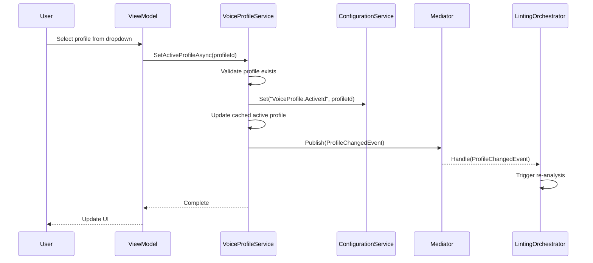

# LCS-DES-034a: Design Specification — Voice Profile Definition

## 1. Metadata & Categorization

| Field | Value |
| :--- | :--- |
| **Document ID** | LCS-DES-034a |
| **Feature ID** | STY-034a |
| **Feature Name** | Voice Profile Definition & Repository |
| **Target Version** | v0.3.4a |
| **Module Scope** | Lexichord.Modules.Style |
| **Swimlane** | Governance |
| **License Tier** | Writer Pro |
| **Feature Gate Key** | `FeatureFlags.Style.VoiceProfiler` |
| **Status** | Draft |
| **Last Updated** | 2026-01-26 |
| **Parent Document** | [LCS-DES-034-INDEX](./LCS-DES-034-INDEX.md) |
| **Scope Breakdown** | [LCS-SBD-034 §3.1](./LCS-SBD-034.md#31-v034a-profile-definition) |

---

## 2. Executive Summary

### 2.1 The Requirement

The Voice Profiler needs a data model and service layer to define, store, and manage Voice Profiles. Each profile specifies style constraints (grade level targets, passive voice tolerance, adverb/weasel word flagging) that control how the analysis engine evaluates text.

> **Core Need:** Writers must be able to select from predefined profiles and have their analysis adapt accordingly.

### 2.2 The Proposed Solution

Implement:

1. **`VoiceProfile` record** — Immutable data structure defining all style constraints
2. **`IVoiceProfileService`** — Service for profile CRUD operations and active profile management
3. **`VoiceProfileRepository`** — SQLite persistence for custom profiles
4. **5 Built-in Profiles** — Technical, Marketing, Academic, Narrative, Casual
5. **`ProfileChangedEvent`** — MediatR notification when the active profile changes

---

## 3. Architecture & Modular Strategy

### 3.1 Dependencies

#### 3.1.1 Upstream Dependencies

| Interface | Source Version | Purpose |
| :--- | :--- | :--- |
| `IConfigurationService` | v0.0.3d | Persist active profile selection |
| `IDbConnectionFactory` | v0.0.5b | Database connection for repository |
| `IMediator` | v0.0.7a | Publish profile change events |
| `ReadabilityMetrics` | v0.3.3c | Profile targets reference grade level |

#### 3.1.2 NuGet Packages

| Package | Version | Purpose |
| :--- | :--- | :--- |
| `Dapper` | 2.1.x | Micro-ORM for repository |
| `MediatR` | 12.x | Event publishing |

### 3.2 Licensing Behavior

- **Soft Gate:** The service loads for all users, but custom profile creation requires Teams+ license.
- **Built-in profiles** are available to all Writer Pro users.
- **Core users** cannot access profiles; the selector shows upgrade prompt.

---

## 4. Data Contract (The API)

### 4.1 VoiceProfile Record

```csharp
namespace Lexichord.Abstractions.Contracts;

/// <summary>
/// A Voice Profile defines target style constraints for writing analysis.
/// Writers select a profile to receive feedback tailored to their content type.
/// </summary>
/// <remarks>
/// <para>Built-in profiles CANNOT be modified or deleted.</para>
/// <para>Custom profiles require Teams or Enterprise license.</para>
/// </remarks>
public record VoiceProfile
{
    /// <summary>
    /// Unique identifier for the profile.
    /// </summary>
    public Guid Id { get; init; }

    /// <summary>
    /// Display name shown in the profile selector (e.g., "Technical", "Marketing").
    /// </summary>
    /// <remarks>Must be unique across all profiles.</remarks>
    public required string Name { get; init; }

    /// <summary>
    /// Description of when to use this profile.
    /// Shown in tooltips and settings.
    /// </summary>
    public string? Description { get; init; }

    /// <summary>
    /// Target Flesch-Kincaid grade level for this profile.
    /// Null means no specific grade level target.
    /// </summary>
    /// <example>
    /// Technical = 11.0, Marketing = 9.0, Academic = 13.0
    /// </example>
    public double? TargetGradeLevel { get; init; }

    /// <summary>
    /// Maximum acceptable deviation from target grade level.
    /// Text outside (target ± tolerance) will be flagged.
    /// </summary>
    public double GradeLevelTolerance { get; init; } = 2.0;

    /// <summary>
    /// Maximum recommended words per sentence.
    /// Sentences exceeding this are flagged as Info.
    /// </summary>
    public int MaxSentenceLength { get; init; } = 25;

    /// <summary>
    /// Whether passive voice is allowed in this profile.
    /// When false, ANY passive voice triggers a Warning.
    /// </summary>
    public bool AllowPassiveVoice { get; init; }

    /// <summary>
    /// Maximum percentage of passive voice sentences allowed.
    /// Only applies when <see cref="AllowPassiveVoice"/> is true.
    /// Exceeding this threshold triggers Info-level flags.
    /// </summary>
    public double MaxPassiveVoicePercentage { get; init; } = 10.0;

    /// <summary>
    /// Whether adverbs and intensifiers should be flagged.
    /// When true, words like "very", "really" show Info squigglies.
    /// </summary>
    public bool FlagAdverbs { get; init; } = true;

    /// <summary>
    /// Whether weasel words and hedges should be flagged.
    /// When true, words like "perhaps", "maybe" show Info squigglies.
    /// </summary>
    public bool FlagWeaselWords { get; init; } = true;

    /// <summary>
    /// Categories of terminology to forbid (from Lexicon).
    /// Terms in these categories will be flagged as violations.
    /// </summary>
    public IReadOnlyList<string> ForbiddenCategories { get; init; } = [];

    /// <summary>
    /// Whether this is a built-in profile that cannot be deleted or modified.
    /// </summary>
    public bool IsBuiltIn { get; init; }

    /// <summary>
    /// Sort order for display in the profile selector dropdown.
    /// Lower values appear first.
    /// </summary>
    public int SortOrder { get; init; }

    /// <summary>
    /// Validates that the profile has sensible constraint values.
    /// </summary>
    /// <returns>True if valid; false with validation errors otherwise.</returns>
    public bool Validate(out IReadOnlyList<string> errors)
    {
        var errorList = new List<string>();

        if (string.IsNullOrWhiteSpace(Name))
            errorList.Add("Profile name is required.");

        if (Name?.Length > 50)
            errorList.Add("Profile name must be 50 characters or less.");

        if (TargetGradeLevel.HasValue && (TargetGradeLevel < 0 || TargetGradeLevel > 20))
            errorList.Add("Target grade level must be between 0 and 20.");

        if (GradeLevelTolerance < 0 || GradeLevelTolerance > 10)
            errorList.Add("Grade level tolerance must be between 0 and 10.");

        if (MaxSentenceLength < 5 || MaxSentenceLength > 100)
            errorList.Add("Max sentence length must be between 5 and 100.");

        if (MaxPassiveVoicePercentage < 0 || MaxPassiveVoicePercentage > 100)
            errorList.Add("Max passive voice percentage must be between 0 and 100.");

        errors = errorList.AsReadOnly();
        return errorList.Count == 0;
    }
}
```

### 4.2 IVoiceProfileService Interface

```csharp
namespace Lexichord.Abstractions.Contracts;

/// <summary>
/// Service for managing Voice Profiles and tracking the currently active profile.
/// </summary>
/// <remarks>
/// <para>The active profile determines which style constraints are applied during analysis.</para>
/// <para>Profile changes publish <see cref="ProfileChangedEvent"/> via MediatR.</para>
/// </remarks>
public interface IVoiceProfileService
{
    /// <summary>
    /// Gets all available voice profiles, ordered by <see cref="VoiceProfile.SortOrder"/>.
    /// </summary>
    /// <param name="ct">Cancellation token.</param>
    /// <returns>Immutable list of all profiles (built-in + custom).</returns>
    Task<IReadOnlyList<VoiceProfile>> GetAllProfilesAsync(CancellationToken ct = default);

    /// <summary>
    /// Gets a specific profile by its unique identifier.
    /// </summary>
    /// <param name="id">The profile ID.</param>
    /// <param name="ct">Cancellation token.</param>
    /// <returns>The profile if found; null otherwise.</returns>
    Task<VoiceProfile?> GetProfileAsync(Guid id, CancellationToken ct = default);

    /// <summary>
    /// Gets a profile by its name (case-insensitive).
    /// </summary>
    /// <param name="name">The profile name.</param>
    /// <param name="ct">Cancellation token.</param>
    /// <returns>The profile if found; null otherwise.</returns>
    Task<VoiceProfile?> GetProfileByNameAsync(string name, CancellationToken ct = default);

    /// <summary>
    /// Gets the currently active profile for the user.
    /// Returns the default profile (Technical) if none is set.
    /// </summary>
    /// <param name="ct">Cancellation token.</param>
    /// <returns>The active profile (never null).</returns>
    Task<VoiceProfile> GetActiveProfileAsync(CancellationToken ct = default);

    /// <summary>
    /// Sets the active profile and publishes <see cref="ProfileChangedEvent"/>.
    /// </summary>
    /// <param name="profileId">The ID of the profile to activate.</param>
    /// <param name="ct">Cancellation token.</param>
    /// <exception cref="ArgumentException">If profile ID is not found.</exception>
    Task SetActiveProfileAsync(Guid profileId, CancellationToken ct = default);

    /// <summary>
    /// Creates a new custom profile. Requires Teams+ license.
    /// </summary>
    /// <param name="profile">The profile to create.</param>
    /// <param name="ct">Cancellation token.</param>
    /// <returns>The created profile with generated ID.</returns>
    /// <exception cref="InvalidOperationException">If license doesn't allow custom profiles.</exception>
    /// <exception cref="ValidationException">If profile validation fails.</exception>
    Task<VoiceProfile> CreateProfileAsync(VoiceProfile profile, CancellationToken ct = default);

    /// <summary>
    /// Updates an existing custom profile.
    /// </summary>
    /// <param name="profile">The profile with updated values.</param>
    /// <param name="ct">Cancellation token.</param>
    /// <exception cref="InvalidOperationException">If attempting to modify a built-in profile.</exception>
    Task UpdateProfileAsync(VoiceProfile profile, CancellationToken ct = default);

    /// <summary>
    /// Deletes a custom profile.
    /// </summary>
    /// <param name="id">The ID of the profile to delete.</param>
    /// <param name="ct">Cancellation token.</param>
    /// <exception cref="InvalidOperationException">If attempting to delete a built-in profile.</exception>
    Task DeleteProfileAsync(Guid id, CancellationToken ct = default);

    /// <summary>
    /// Resets the active profile to the default (Technical).
    /// </summary>
    /// <param name="ct">Cancellation token.</param>
    Task ResetToDefaultAsync(CancellationToken ct = default);
}
```

### 4.3 ProfileChangedEvent

```csharp
namespace Lexichord.Modules.Style.Events;

/// <summary>
/// Published when the active Voice Profile changes.
/// </summary>
/// <remarks>
/// Consumers should re-analyze the current document with the new profile constraints.
/// </remarks>
/// <param name="PreviousProfileId">The ID of the previously active profile.</param>
/// <param name="NewProfileId">The ID of the newly active profile.</param>
/// <param name="NewProfileName">The name of the newly active profile.</param>
public record ProfileChangedEvent(
    Guid PreviousProfileId,
    Guid NewProfileId,
    string NewProfileName) : INotification;
```

---

## 5. Implementation Logic

### 5.1 Built-In Profile Definitions

```csharp
namespace Lexichord.Modules.Style.Services;

/// <summary>
/// Static definitions for built-in Voice Profiles.
/// </summary>
internal static class BuiltInProfiles
{
    public static readonly VoiceProfile Technical = new()
    {
        Id = new Guid("00000000-0000-0000-0000-000000000001"),
        Name = "Technical",
        Description = "Direct, precise writing for documentation and technical content. " +
                      "Passive voice is forbidden. Adverbs and hedging are flagged.",
        TargetGradeLevel = 11.0,
        GradeLevelTolerance = 2.0,
        MaxSentenceLength = 20,
        AllowPassiveVoice = false,
        MaxPassiveVoicePercentage = 0,
        FlagAdverbs = true,
        FlagWeaselWords = true,
        ForbiddenCategories = [],
        IsBuiltIn = true,
        SortOrder = 1
    };

    public static readonly VoiceProfile Marketing = new()
    {
        Id = new Guid("00000000-0000-0000-0000-000000000002"),
        Name = "Marketing",
        Description = "Engaging, persuasive copy for marketing and sales content. " +
                      "Moderate passive voice allowed. Adverbs are acceptable.",
        TargetGradeLevel = 9.0,
        GradeLevelTolerance = 2.0,
        MaxSentenceLength = 25,
        AllowPassiveVoice = true,
        MaxPassiveVoicePercentage = 20.0,
        FlagAdverbs = false,
        FlagWeaselWords = true,
        ForbiddenCategories = [],
        IsBuiltIn = true,
        SortOrder = 2
    };

    public static readonly VoiceProfile Academic = new()
    {
        Id = new Guid("00000000-0000-0000-0000-000000000003"),
        Name = "Academic",
        Description = "Formal, scholarly writing for research papers and academic content. " +
                      "Passive voice is common in academic writing. No style flags.",
        TargetGradeLevel = 13.0,
        GradeLevelTolerance = 2.0,
        MaxSentenceLength = 30,
        AllowPassiveVoice = true,
        MaxPassiveVoicePercentage = 30.0,
        FlagAdverbs = false,
        FlagWeaselWords = false,
        ForbiddenCategories = [],
        IsBuiltIn = true,
        SortOrder = 3
    };

    public static readonly VoiceProfile Narrative = new()
    {
        Id = new Guid("00000000-0000-0000-0000-000000000004"),
        Name = "Narrative",
        Description = "Creative, flowing prose for fiction and storytelling. " +
                      "Longer sentences and passive voice are stylistic choices.",
        TargetGradeLevel = 9.0,
        GradeLevelTolerance = 3.0,
        MaxSentenceLength = 35,
        AllowPassiveVoice = true,
        MaxPassiveVoicePercentage = 15.0,
        FlagAdverbs = false,
        FlagWeaselWords = false,
        ForbiddenCategories = [],
        IsBuiltIn = true,
        SortOrder = 4
    };

    public static readonly VoiceProfile Casual = new()
    {
        Id = new Guid("00000000-0000-0000-0000-000000000005"),
        Name = "Casual",
        Description = "Conversational, friendly writing for blogs and informal content. " +
                      "Easy reading level with relaxed style rules.",
        TargetGradeLevel = 7.0,
        GradeLevelTolerance = 2.0,
        MaxSentenceLength = 20,
        AllowPassiveVoice = true,
        MaxPassiveVoicePercentage = 25.0,
        FlagAdverbs = false,
        FlagWeaselWords = false,
        ForbiddenCategories = [],
        IsBuiltIn = true,
        SortOrder = 5
    };

    public static readonly IReadOnlyList<VoiceProfile> All =
    [
        Technical, Marketing, Academic, Narrative, Casual
    ];

    public static readonly VoiceProfile Default = Technical;
}
```

### 5.2 Profile Selection Flow



---

## 6. Data Persistence

### 6.1 Database Schema

Custom profiles are stored in SQLite. Built-in profiles are defined in code and not persisted.

```sql
-- Migration: 20260126_1200_CreateVoiceProfilesTable
CREATE TABLE IF NOT EXISTS voice_profiles (
    id TEXT PRIMARY KEY,
    name TEXT NOT NULL UNIQUE,
    description TEXT,
    target_grade_level REAL,
    grade_level_tolerance REAL NOT NULL DEFAULT 2.0,
    max_sentence_length INTEGER NOT NULL DEFAULT 25,
    allow_passive_voice INTEGER NOT NULL DEFAULT 0,
    max_passive_voice_percentage REAL NOT NULL DEFAULT 10.0,
    flag_adverbs INTEGER NOT NULL DEFAULT 1,
    flag_weasel_words INTEGER NOT NULL DEFAULT 1,
    forbidden_categories TEXT, -- JSON array
    is_built_in INTEGER NOT NULL DEFAULT 0,
    sort_order INTEGER NOT NULL DEFAULT 100,
    created_at TEXT NOT NULL DEFAULT CURRENT_TIMESTAMP,
    updated_at TEXT NOT NULL DEFAULT CURRENT_TIMESTAMP
);

CREATE INDEX idx_voice_profiles_name ON voice_profiles(name);
CREATE INDEX idx_voice_profiles_sort ON voice_profiles(sort_order);
```

### 6.2 Configuration Storage

The active profile ID is stored in user configuration:

```csharp
// Configuration key
const string ActiveProfileKey = "VoiceProfile.ActiveId";

// Read active profile
var activeId = await _configService.GetAsync<Guid?>(ActiveProfileKey);

// Write active profile
await _configService.SetAsync(ActiveProfileKey, profile.Id);
```

---

## 7. UI/UX Specifications

**None for this sub-part.** This is a backend service. UI is handled in [LCS-DES-034d](./LCS-DES-034d.md).

---

## 8. Decision Trees

### 8.1 Profile Selection Validation

```text
START: "Can user select this profile?"
│
├── Is profile null or invalid?
│   └── YES → Throw ArgumentException
│
├── Does profile exist in available profiles?
│   └── NO → Throw ArgumentException("Profile not found")
│
├── Is profile already active?
│   └── YES → Skip event, return early
│
├── Save previous profile ID
│
├── Update configuration with new profile ID
│
├── Update cached active profile
│
└── Publish ProfileChangedEvent
```

### 8.2 Custom Profile Creation

```text
START: "Can user create a custom profile?"
│
├── Is user's license >= Teams?
│   └── NO → Throw InvalidOperationException("Requires Teams license")
│
├── Validate profile data
│   └── INVALID → Throw ValidationException with errors
│
├── Is profile name unique?
│   └── NO → Throw InvalidOperationException("Name already exists")
│
├── Generate new GUID for profile
│
├── Set IsBuiltIn = false
│
├── Insert into database
│
├── Invalidate profile cache
│
└── Return created profile
```

---

## 9. Observability & Logging

| Level | Message Template |
| :--- | :--- |
| Debug | `"Loading voice profiles from repository"` |
| Debug | `"Loaded {Count} voice profiles ({BuiltInCount} built-in, {CustomCount} custom)"` |
| Info | `"Active profile changed: {PreviousProfile} -> {NewProfile}"` |
| Debug | `"Profile {ProfileName} activated with constraints: Grade={Grade}, MaxSentence={MaxSentence}"` |
| Warning | `"Attempted to delete built-in profile: {ProfileName}"` |
| Warning | `"Attempted to create custom profile without Teams license"` |
| Error | `"Failed to load profiles: {Error}"` |

---

## 10. Acceptance Criteria

| # | Given | When | Then |
| :--- | :--- | :--- | :--- |
| 1 | Fresh install | GetAllProfilesAsync called | Returns 5 built-in profiles |
| 2 | No active profile set | GetActiveProfileAsync called | Returns Technical (default) |
| 3 | User with Writer Pro | SetActiveProfileAsync called | Profile changes, event published |
| 4 | User with Teams license | CreateProfileAsync called | Custom profile created |
| 5 | User with Writer Pro (not Teams) | CreateProfileAsync called | Throws InvalidOperationException |
| 6 | Any user | DeleteProfileAsync for built-in | Throws InvalidOperationException |
| 7 | Profile already active | SetActiveProfileAsync same ID | No event published (no-op) |
| 8 | Invalid profile data | CreateProfileAsync called | Throws ValidationException |

---

## 11. Unit Tests

```csharp
[Trait("Category", "Unit")]
[Trait("Feature", "v0.3.4a")]
public class VoiceProfileServiceTests
{
    [Fact]
    public async Task GetAllProfilesAsync_ReturnsBuiltInProfiles()
    {
        var sut = CreateService();

        var profiles = await sut.GetAllProfilesAsync();

        profiles.Should().HaveCount(5);
        profiles.Should().AllSatisfy(p => p.IsBuiltIn.Should().BeTrue());
        profiles.Select(p => p.Name).Should().BeEquivalentTo(
            ["Technical", "Marketing", "Academic", "Narrative", "Casual"]);
    }

    [Fact]
    public async Task GetAllProfilesAsync_ReturnsOrderedBySortOrder()
    {
        var sut = CreateService();

        var profiles = await sut.GetAllProfilesAsync();

        profiles.Should().BeInAscendingOrder(p => p.SortOrder);
    }

    [Fact]
    public async Task GetActiveProfileAsync_WhenNotSet_ReturnsTechnical()
    {
        var configService = CreateMockConfigService(activeId: null);
        var sut = CreateService(configService);

        var profile = await sut.GetActiveProfileAsync();

        profile.Name.Should().Be("Technical");
    }

    [Fact]
    public async Task SetActiveProfileAsync_PublishesEvent()
    {
        var mediator = new Mock<IMediator>();
        var sut = CreateService(mediator: mediator.Object);
        var marketingId = BuiltInProfiles.Marketing.Id;

        await sut.SetActiveProfileAsync(marketingId);

        mediator.Verify(m => m.Publish(
            It.Is<ProfileChangedEvent>(e =>
                e.NewProfileId == marketingId &&
                e.NewProfileName == "Marketing"),
            It.IsAny<CancellationToken>()));
    }

    [Fact]
    public async Task SetActiveProfileAsync_SameProfile_DoesNotPublishEvent()
    {
        var mediator = new Mock<IMediator>();
        var configService = CreateMockConfigService(activeId: BuiltInProfiles.Technical.Id);
        var sut = CreateService(configService, mediator.Object);

        await sut.SetActiveProfileAsync(BuiltInProfiles.Technical.Id);

        mediator.Verify(m => m.Publish(
            It.IsAny<ProfileChangedEvent>(),
            It.IsAny<CancellationToken>()), Times.Never);
    }

    [Fact]
    public async Task DeleteProfileAsync_BuiltIn_ThrowsInvalidOperation()
    {
        var sut = CreateService();

        var act = () => sut.DeleteProfileAsync(BuiltInProfiles.Technical.Id);

        await act.Should().ThrowAsync<InvalidOperationException>()
            .WithMessage("*built-in*");
    }

    [Fact]
    public async Task CreateProfileAsync_WithoutTeamsLicense_ThrowsInvalidOperation()
    {
        var license = CreateMockLicense(tier: LicenseTier.WriterPro);
        var sut = CreateService(licenseContext: license);

        var act = () => sut.CreateProfileAsync(new VoiceProfile
        {
            Name = "Custom",
            MaxSentenceLength = 20
        });

        await act.Should().ThrowAsync<InvalidOperationException>()
            .WithMessage("*Teams*");
    }

    [Fact]
    public void VoiceProfile_Validate_InvalidGradeLevel_ReturnsFalse()
    {
        var profile = new VoiceProfile
        {
            Id = Guid.NewGuid(),
            Name = "Test",
            TargetGradeLevel = 25.0 // Invalid: > 20
        };

        var isValid = profile.Validate(out var errors);

        isValid.Should().BeFalse();
        errors.Should().Contain(e => e.Contains("grade level"));
    }

    [Fact]
    public void VoiceProfile_Validate_EmptyName_ReturnsFalse()
    {
        var profile = new VoiceProfile
        {
            Id = Guid.NewGuid(),
            Name = ""
        };

        var isValid = profile.Validate(out var errors);

        isValid.Should().BeFalse();
        errors.Should().Contain(e => e.Contains("name"));
    }
}
```

---

## 12. Code Example

### 12.1 VoiceProfileService Implementation

```csharp
namespace Lexichord.Modules.Style.Services;

/// <summary>
/// Service for managing Voice Profiles and tracking the active profile.
/// </summary>
public class VoiceProfileService : IVoiceProfileService
{
    private const string ActiveProfileKey = "VoiceProfile.ActiveId";

    private readonly IVoiceProfileRepository _repository;
    private readonly IConfigurationService _configService;
    private readonly ILicenseContext _licenseContext;
    private readonly IMediator _mediator;
    private readonly ILogger<VoiceProfileService> _logger;

    private VoiceProfile? _cachedActiveProfile;
    private IReadOnlyList<VoiceProfile>? _cachedProfiles;

    public VoiceProfileService(
        IVoiceProfileRepository repository,
        IConfigurationService configService,
        ILicenseContext licenseContext,
        IMediator mediator,
        ILogger<VoiceProfileService> logger)
    {
        _repository = repository;
        _configService = configService;
        _licenseContext = licenseContext;
        _mediator = mediator;
        _logger = logger;
    }

    public async Task<IReadOnlyList<VoiceProfile>> GetAllProfilesAsync(
        CancellationToken ct = default)
    {
        if (_cachedProfiles is not null)
        {
            return _cachedProfiles;
        }

        _logger.LogDebug("Loading voice profiles from repository");

        var customProfiles = await _repository.GetAllAsync(ct);
        var allProfiles = BuiltInProfiles.All
            .Concat(customProfiles)
            .OrderBy(p => p.SortOrder)
            .ThenBy(p => p.Name)
            .ToList()
            .AsReadOnly();

        _cachedProfiles = allProfiles;

        _logger.LogDebug(
            "Loaded {Count} voice profiles ({BuiltInCount} built-in, {CustomCount} custom)",
            allProfiles.Count, BuiltInProfiles.All.Count, customProfiles.Count);

        return allProfiles;
    }

    public async Task<VoiceProfile?> GetProfileAsync(
        Guid id,
        CancellationToken ct = default)
    {
        var profiles = await GetAllProfilesAsync(ct);
        return profiles.FirstOrDefault(p => p.Id == id);
    }

    public async Task<VoiceProfile?> GetProfileByNameAsync(
        string name,
        CancellationToken ct = default)
    {
        var profiles = await GetAllProfilesAsync(ct);
        return profiles.FirstOrDefault(
            p => p.Name.Equals(name, StringComparison.OrdinalIgnoreCase));
    }

    public async Task<VoiceProfile> GetActiveProfileAsync(
        CancellationToken ct = default)
    {
        if (_cachedActiveProfile is not null)
        {
            return _cachedActiveProfile;
        }

        var activeId = await _configService.GetAsync<Guid?>(ActiveProfileKey);

        if (activeId.HasValue)
        {
            var profile = await GetProfileAsync(activeId.Value, ct);
            if (profile is not null)
            {
                _cachedActiveProfile = profile;
                return profile;
            }
        }

        // Default to Technical
        _cachedActiveProfile = BuiltInProfiles.Default;
        return BuiltInProfiles.Default;
    }

    public async Task SetActiveProfileAsync(
        Guid profileId,
        CancellationToken ct = default)
    {
        var profile = await GetProfileAsync(profileId, ct)
            ?? throw new ArgumentException(
                $"Profile with ID {profileId} not found.",
                nameof(profileId));

        var currentProfile = await GetActiveProfileAsync(ct);

        // No-op if already active
        if (currentProfile.Id == profileId)
        {
            return;
        }

        var previousId = currentProfile.Id;

        // Persist selection
        await _configService.SetAsync(ActiveProfileKey, profileId);

        // Update cache
        _cachedActiveProfile = profile;

        _logger.LogInformation(
            "Active profile changed: {PreviousProfile} -> {NewProfile}",
            currentProfile.Name, profile.Name);

        // Publish event
        await _mediator.Publish(
            new ProfileChangedEvent(previousId, profileId, profile.Name),
            ct);
    }

    public async Task<VoiceProfile> CreateProfileAsync(
        VoiceProfile profile,
        CancellationToken ct = default)
    {
        // License check
        if (!_licenseContext.HasFeature(FeatureFlags.Style.CustomProfiles))
        {
            _logger.LogWarning(
                "Attempted to create custom profile without Teams license");
            throw new InvalidOperationException(
                "Custom voice profiles require a Teams or Enterprise license.");
        }

        // Validation
        if (!profile.Validate(out var errors))
        {
            throw new ValidationException(
                $"Profile validation failed: {string.Join(", ", errors)}");
        }

        // Uniqueness check
        var existing = await GetProfileByNameAsync(profile.Name, ct);
        if (existing is not null)
        {
            throw new InvalidOperationException(
                $"A profile named '{profile.Name}' already exists.");
        }

        // Create with new ID
        var newProfile = profile with
        {
            Id = Guid.NewGuid(),
            IsBuiltIn = false,
            SortOrder = 100 // Custom profiles sort after built-in
        };

        await _repository.CreateAsync(newProfile, ct);

        // Invalidate cache
        _cachedProfiles = null;

        return newProfile;
    }

    public async Task UpdateProfileAsync(
        VoiceProfile profile,
        CancellationToken ct = default)
    {
        if (profile.IsBuiltIn)
        {
            throw new InvalidOperationException(
                "Cannot modify built-in profiles.");
        }

        if (!profile.Validate(out var errors))
        {
            throw new ValidationException(
                $"Profile validation failed: {string.Join(", ", errors)}");
        }

        await _repository.UpdateAsync(profile, ct);

        // Invalidate cache
        _cachedProfiles = null;

        // If this was the active profile, update the cache
        if (_cachedActiveProfile?.Id == profile.Id)
        {
            _cachedActiveProfile = profile;
        }
    }

    public async Task DeleteProfileAsync(
        Guid id,
        CancellationToken ct = default)
    {
        var profile = await GetProfileAsync(id, ct)
            ?? throw new ArgumentException(
                $"Profile with ID {id} not found.",
                nameof(id));

        if (profile.IsBuiltIn)
        {
            _logger.LogWarning(
                "Attempted to delete built-in profile: {ProfileName}",
                profile.Name);
            throw new InvalidOperationException(
                "Cannot delete built-in profiles.");
        }

        await _repository.DeleteAsync(id, ct);

        // Invalidate cache
        _cachedProfiles = null;

        // If this was the active profile, reset to default
        if (_cachedActiveProfile?.Id == id)
        {
            await ResetToDefaultAsync(ct);
        }
    }

    public async Task ResetToDefaultAsync(CancellationToken ct = default)
    {
        await SetActiveProfileAsync(BuiltInProfiles.Default.Id, ct);
    }
}
```

---

## 13. DI Registration

```csharp
// In StyleModule.cs
services.AddSingleton<IVoiceProfileService, VoiceProfileService>();
services.AddSingleton<IVoiceProfileRepository, VoiceProfileRepository>();
```

---

## Document History

| Version | Date | Author | Changes |
| :--- | :--- | :--- | :--- |
| 1.0 | 2026-01-26 | Lead Architect | Initial draft |
