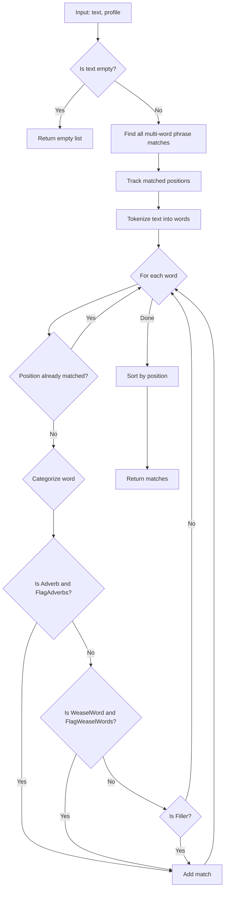

# LCS-DES-034c: Design Specification — Adverb/Weasel Scanner

## 1. Metadata & Categorization

| Field | Value |
| :--- | :--- |
| **Document ID** | LCS-DES-034c |
| **Feature ID** | STY-034c |
| **Feature Name** | Weak Word Scanner (Adverbs & Weasel Words) |
| **Target Version** | v0.3.4c |
| **Module Scope** | Lexichord.Modules.Style |
| **Swimlane** | Governance |
| **License Tier** | Writer Pro |
| **Feature Gate Key** | `FeatureFlags.Style.VoiceProfiler` |
| **Status** | Draft |
| **Last Updated** | 2026-01-26 |
| **Parent Document** | [LCS-DES-034-INDEX](./LCS-DES-034-INDEX.md) |
| **Scope Breakdown** | [LCS-SBD-034 §3.3](./LCS-SBD-034.md#33-v034c-adverbweasel-scanner) |

---

## 2. Executive Summary

### 2.1 The Requirement

Strong prose avoids unnecessary weak words:
- **Adverbs/Intensifiers** like "very", "really", "quite" dilute impact
- **Weasel words** like "perhaps", "maybe", "somewhat" undermine confidence
- **Filler words** like "basically", "actually" add no meaning

Writers need these flagged as style suggestions, not errors.

> **Core Need:** Identify weak words based on profile settings and flag as `Severity.Info`.

### 2.2 The Proposed Solution

Implement an `IWeakWordScanner` that:

1. Maintains categorized word lists (adverbs, weasels, fillers)
2. Scans text for matches with position tracking
3. Respects profile settings for selective flagging
4. Handles multi-word phrases ("sort of", "kind of")
5. Provides suggestions for improvements

---

## 3. Architecture & Modular Strategy

### 3.1 Dependencies

#### 3.1.1 Upstream Dependencies

| Interface | Source Version | Purpose |
| :--- | :--- | :--- |
| `VoiceProfile` | v0.3.4a | Check FlagAdverbs, FlagWeaselWords settings |

#### 3.1.2 NuGet Packages

None required. Uses `System.Text.RegularExpressions` from BCL.

### 3.2 Licensing Behavior

Inherits from parent feature. The scanner itself has no license check; gating occurs at `VoiceAnalysisService` level.

---

## 4. Data Contract (The API)

### 4.1 IWeakWordScanner Interface

```csharp
namespace Lexichord.Abstractions.Contracts;

/// <summary>
/// Scans text for weak words: adverbs, intensifiers, weasel words, and fillers.
/// </summary>
/// <remarks>
/// <para>Weak words are flagged as <see cref="ViolationSeverity.Info"/> suggestions.</para>
/// <para>Profile settings control which categories are flagged:</para>
/// <list type="bullet">
/// <item>FlagAdverbs: Intensifiers and manner adverbs</item>
/// <item>FlagWeaselWords: Hedges and qualifiers</item>
/// <item>Fillers: Always flagged regardless of profile</item>
/// </list>
/// </remarks>
public interface IWeakWordScanner
{
    /// <summary>
    /// Scans text for weak words based on profile settings.
    /// </summary>
    /// <param name="text">The text to scan.</param>
    /// <param name="profile">The active voice profile with settings.</param>
    /// <returns>List of weak word matches with positions and suggestions.</returns>
    IReadOnlyList<WeakWordMatch> Scan(string text, VoiceProfile profile);

    /// <summary>
    /// Gets statistics about weak word usage in text.
    /// </summary>
    /// <param name="text">The text to analyze.</param>
    /// <param name="profile">The active voice profile with settings.</param>
    /// <returns>Statistics by category.</returns>
    WeakWordStats GetStatistics(string text, VoiceProfile profile);
}
```

### 4.2 WeakWordMatch Record

```csharp
namespace Lexichord.Abstractions.Contracts;

/// <summary>
/// Information about a detected weak word.
/// </summary>
public record WeakWordMatch
{
    /// <summary>
    /// The weak word or phrase detected.
    /// </summary>
    public required string Word { get; init; }

    /// <summary>
    /// Category of the weak word.
    /// </summary>
    public WeakWordCategory Category { get; init; }

    /// <summary>
    /// Start index in the source text.
    /// </summary>
    public int StartIndex { get; init; }

    /// <summary>
    /// End index in the source text (exclusive).
    /// </summary>
    public int EndIndex { get; init; }

    /// <summary>
    /// Length of the match in characters.
    /// </summary>
    public int Length => EndIndex - StartIndex;

    /// <summary>
    /// Suggested alternative or action.
    /// </summary>
    public string? Suggestion { get; init; }

    /// <summary>
    /// The surrounding context (sentence or fragment) for display.
    /// </summary>
    public string? Context { get; init; }
}
```

### 4.3 WeakWordCategory Enum

```csharp
namespace Lexichord.Abstractions.Contracts;

/// <summary>
/// Categories of weak words for filtering and display.
/// </summary>
public enum WeakWordCategory
{
    /// <summary>
    /// Adverbs and intensifiers that weaken prose.
    /// Examples: very, really, quite, extremely, absolutely
    /// </summary>
    Adverb,

    /// <summary>
    /// Intensifiers that paradoxically weaken rather than strengthen.
    /// Examples: incredibly, remarkably, tremendously
    /// </summary>
    Intensifier,

    /// <summary>
    /// Hedge words that undermine confidence.
    /// Examples: perhaps, maybe, possibly, probably, somewhat
    /// </summary>
    WeaselWord,

    /// <summary>
    /// Filler words that add no meaning.
    /// Examples: basically, actually, literally, honestly
    /// </summary>
    Filler
}
```

### 4.4 WeakWordStats Record

```csharp
namespace Lexichord.Abstractions.Contracts;

/// <summary>
/// Statistics about weak word usage in text.
/// </summary>
public record WeakWordStats
{
    /// <summary>Total words in the text.</summary>
    public int TotalWords { get; init; }

    /// <summary>Total weak words found.</summary>
    public int TotalWeakWords { get; init; }

    /// <summary>Percentage of weak words.</summary>
    public double WeakWordPercentage =>
        TotalWords > 0 ? 100.0 * TotalWeakWords / TotalWords : 0;

    /// <summary>Count by category.</summary>
    public IReadOnlyDictionary<WeakWordCategory, int> CountByCategory { get; init; }
        = new Dictionary<WeakWordCategory, int>();

    /// <summary>All matches.</summary>
    public IReadOnlyList<WeakWordMatch> Matches { get; init; } = [];
}
```

---

## 5. Implementation Logic

### 5.1 Word Lists

```csharp
namespace Lexichord.Modules.Style.Services;

/// <summary>
/// Static word lists for weak word detection.
/// </summary>
public static class WeakWordLists
{
    /// <summary>
    /// Adverbs and intensifiers that often weaken prose.
    /// </summary>
    public static readonly HashSet<string> Adverbs = new(
        StringComparer.OrdinalIgnoreCase)
    {
        // Intensifiers (paradoxically weaken)
        "very", "really", "quite", "extremely", "absolutely", "completely",
        "totally", "utterly", "highly", "particularly", "especially",
        "incredibly", "remarkably", "exceedingly", "tremendously",
        "awfully", "terribly", "seriously", "definitely", "certainly",

        // Manner adverbs (often redundant)
        "quickly", "slowly", "carefully", "easily", "simply", "merely",
        "clearly", "obviously", "surely", "undoubtedly", "naturally",

        // Frequency adverbs (overgeneralize)
        "always", "never"
    };

    /// <summary>
    /// Weasel words that hedge and undermine confidence.
    /// </summary>
    public static readonly HashSet<string> WeaselWords = new(
        StringComparer.OrdinalIgnoreCase)
    {
        // Probability hedges
        "perhaps", "maybe", "possibly", "probably", "might", "could",
        "seemingly", "apparently", "presumably",

        // Degree hedges
        "somewhat", "fairly", "rather", "slightly", "partially",
        "relatively", "comparatively", "moderately",

        // Attribution hedges
        "arguably", "supposedly", "allegedly", "reportedly", "purportedly"
    };

    /// <summary>
    /// Filler words that add no meaning (always flagged).
    /// </summary>
    public static readonly HashSet<string> Fillers = new(
        StringComparer.OrdinalIgnoreCase)
    {
        // Discourse markers
        "basically", "actually", "literally", "honestly", "frankly",
        "essentially", "technically", "practically", "virtually",

        // Qualifiers
        "just", "simply", "merely", "only", "even",

        // Emphatics (overused)
        "indeed", "truly", "genuinely",

        // Hesitation markers
        "anyway", "anyhow", "anyways", "well"
    };

    /// <summary>
    /// Multi-word phrases to detect (checked before single words).
    /// Key = phrase, Value = category
    /// </summary>
    public static readonly Dictionary<string, WeakWordCategory> MultiWordPhrases = new(
        StringComparer.OrdinalIgnoreCase)
    {
        // Weasel phrases
        ["sort of"] = WeakWordCategory.WeaselWord,
        ["kind of"] = WeakWordCategory.WeaselWord,
        ["a bit"] = WeakWordCategory.WeaselWord,
        ["a little"] = WeakWordCategory.WeaselWord,
        ["more or less"] = WeakWordCategory.WeaselWord,
        ["to some extent"] = WeakWordCategory.WeaselWord,
        ["in a way"] = WeakWordCategory.WeaselWord,
        ["as it were"] = WeakWordCategory.WeaselWord,
        ["for the most part"] = WeakWordCategory.WeaselWord,

        // Attribution without source
        ["some say"] = WeakWordCategory.WeaselWord,
        ["many believe"] = WeakWordCategory.WeaselWord,
        ["it is thought"] = WeakWordCategory.WeaselWord,
        ["experts claim"] = WeakWordCategory.WeaselWord,
        ["studies show"] = WeakWordCategory.WeaselWord,
        ["research suggests"] = WeakWordCategory.WeaselWord,
        ["critics argue"] = WeakWordCategory.WeaselWord,

        // Filler phrases
        ["you know"] = WeakWordCategory.Filler,
        ["I mean"] = WeakWordCategory.Filler,
        ["in fact"] = WeakWordCategory.Filler,
        ["as a matter of fact"] = WeakWordCategory.Filler,
        ["at the end of the day"] = WeakWordCategory.Filler,
        ["to be honest"] = WeakWordCategory.Filler,
        ["in my opinion"] = WeakWordCategory.WeaselWord,
        ["I think"] = WeakWordCategory.WeaselWord,
        ["I believe"] = WeakWordCategory.WeaselWord,
        ["I feel"] = WeakWordCategory.WeaselWord
    };

    /// <summary>
    /// Suggestions for common weak words.
    /// </summary>
    public static readonly Dictionary<string, string> Suggestions = new(
        StringComparer.OrdinalIgnoreCase)
    {
        // Adverbs
        ["very"] = "Remove 'very' or use a stronger adjective. " +
                   "Instead of 'very good', try 'excellent'.",
        ["really"] = "Remove 'really' or use a stronger word. " +
                     "Instead of 'really important', try 'critical'.",
        ["quite"] = "Remove 'quite' or be more specific.",
        ["extremely"] = "Remove 'extremely' or use a stronger word.",
        ["absolutely"] = "Remove 'absolutely' unless emphasizing certainty.",
        ["definitely"] = "Remove 'definitely' - state facts confidently.",
        ["obviously"] = "Remove 'obviously' - let the reader decide.",
        ["clearly"] = "Remove 'clearly' - show, don't tell.",

        // Weasel words
        ["perhaps"] = "Be more definitive or explain the uncertainty.",
        ["maybe"] = "Be more definitive or explain the uncertainty.",
        ["somewhat"] = "Quantify the degree or be more specific.",
        ["possibly"] = "State the condition that makes it possible.",
        ["probably"] = "State the evidence or likelihood.",
        ["might"] = "Be specific about what determines the outcome.",
        ["could"] = "Clarify the conditions.",

        // Phrases
        ["sort of"] = "Be more precise about what you mean.",
        ["kind of"] = "Be more precise about what you mean.",
        ["I think"] = "State confidently or provide reasoning.",
        ["in my opinion"] = "State confidently or provide evidence.",
        ["studies show"] = "Cite the specific study.",
        ["experts claim"] = "Name the experts or cite sources.",

        // Fillers
        ["basically"] = "Remove 'basically' - it adds no meaning.",
        ["actually"] = "Remove 'actually' unless contrasting expectations.",
        ["literally"] = "Remove unless you mean 'word for word'.",
        ["honestly"] = "Remove 'honestly' - be direct.",
        ["just"] = "Remove 'just' unless indicating recency.",
        ["simply"] = "Remove 'simply' - show simplicity through clarity."
    };
}
```

### 5.2 Scanning Algorithm



### 5.3 Position Tracking

To avoid double-matching when a phrase contains a single weak word:

```csharp
// Example: "sort of" contains no individually weak words, but is a phrase
// Example: "very quickly" contains two weak words that should both be flagged

// Track matched ranges to avoid duplicate flagging
private readonly record struct MatchedRange(int Start, int End);

private bool IsPositionMatched(int position, List<MatchedRange> ranges)
{
    return ranges.Any(r => position >= r.Start && position < r.End);
}
```

---

## 6. Decision Trees

### 6.1 Should This Word Be Flagged?

```text
START: "Should this word/phrase be flagged?"
│
├── Is it a multi-word phrase?
│   ├── YES → Check phrase list
│   │   ├── Found in WeaselPhrases AND profile.FlagWeaselWords → FLAG
│   │   ├── Found in FillerPhrases → FLAG (always)
│   │   └── Not found → Check as single words
│   └── NO → Continue
│
├── Is position already covered by a phrase match?
│   └── YES → SKIP (already flagged)
│
├── Is word in Adverbs list?
│   └── YES AND profile.FlagAdverbs → FLAG as Adverb
│
├── Is word in WeaselWords list?
│   └── YES AND profile.FlagWeaselWords → FLAG as WeaselWord
│
├── Is word in Fillers list?
│   └── YES → FLAG as Filler (always)
│
└── Not in any list → DO NOT FLAG
```

---

## 7. UI/UX Specifications

**None for this sub-part.** Results are displayed via the existing violation/squiggly system.

All weak word violations use `Severity.Info` (blue squiggly) because they are suggestions, not errors.

---

## 8. Observability & Logging

| Level | Message Template |
| :--- | :--- |
| Debug | `"Scanning for weak words with profile {ProfileName}"` |
| Debug | `"Profile settings: FlagAdverbs={FlagAdverbs}, FlagWeaselWords={FlagWeaselWords}"` |
| Trace | `"Multi-word phrase found: '{Phrase}' at position {Position}"` |
| Trace | `"Weak word found: '{Word}' category {Category} at position {Position}"` |
| Debug | `"Scan completed: {MatchCount} weak words found in {ElapsedMs}ms"` |
| Debug | `"Breakdown: {AdverbCount} adverbs, {WeaselCount} weasels, {FillerCount} fillers"` |

---

## 9. Acceptance Criteria

### 9.1 Single Word Detection

| # | Word | Category | FlagAdverbs | FlagWeasels | Expected |
| :--- | :--- | :--- | :--- | :--- | :--- |
| 1 | "very" | Adverb | true | - | FLAG |
| 2 | "very" | Adverb | false | - | NOT flag |
| 3 | "perhaps" | Weasel | - | true | FLAG |
| 4 | "perhaps" | Weasel | - | false | NOT flag |
| 5 | "basically" | Filler | false | false | FLAG (always) |
| 6 | "actually" | Filler | false | false | FLAG (always) |

### 9.2 Multi-Word Phrase Detection

| # | Phrase | Category | Expected |
| :--- | :--- | :--- | :--- |
| 1 | "sort of" | Weasel | Detected as single match |
| 2 | "kind of" | Weasel | Detected as single match |
| 3 | "in my opinion" | Weasel | Detected as single match |
| 4 | "studies show" | Weasel | Detected as single match |
| 5 | "at the end of the day" | Filler | Detected as single match |

### 9.3 Position Accuracy

| # | Text | Word | Expected Position |
| :--- | :--- | :--- | :--- |
| 1 | "The very fast car." | "very" | Start: 4, End: 8 |
| 2 | "It is sort of broken." | "sort of" | Start: 6, End: 13 |
| 3 | "Very good, very nice." | "very" (first) | Start: 0, End: 4 |
| 4 | "Very good, very nice." | "very" (second) | Start: 11, End: 15 |

---

## 10. Unit Tests

```csharp
[Trait("Category", "Unit")]
[Trait("Feature", "v0.3.4c")]
public class WeakWordScannerTests
{
    private readonly WeakWordScanner _sut;

    public WeakWordScannerTests()
    {
        _sut = new WeakWordScanner(
            NullLogger<WeakWordScanner>.Instance);
    }

    private static VoiceProfile CreateProfile(
        bool flagAdverbs = true,
        bool flagWeaselWords = true)
    {
        return new VoiceProfile
        {
            Id = Guid.NewGuid(),
            Name = "Test",
            FlagAdverbs = flagAdverbs,
            FlagWeaselWords = flagWeaselWords
        };
    }

    [Theory]
    [InlineData("very")]
    [InlineData("really")]
    [InlineData("quite")]
    [InlineData("extremely")]
    [InlineData("absolutely")]
    public void Scan_Adverbs_WhenFlagAdverbsTrue_Flags(string adverb)
    {
        var text = $"The system is {adverb} fast.";
        var profile = CreateProfile(flagAdverbs: true);

        var matches = _sut.Scan(text, profile);

        matches.Should().ContainSingle(m => m.Word == adverb);
        matches[0].Category.Should().Be(WeakWordCategory.Adverb);
    }

    [Theory]
    [InlineData("very")]
    [InlineData("really")]
    [InlineData("quite")]
    public void Scan_Adverbs_WhenFlagAdverbsFalse_DoesNotFlag(string adverb)
    {
        var text = $"The system is {adverb} fast.";
        var profile = CreateProfile(flagAdverbs: false);

        var matches = _sut.Scan(text, profile);

        matches.Should().NotContain(m => m.Word == adverb);
    }

    [Theory]
    [InlineData("perhaps")]
    [InlineData("maybe")]
    [InlineData("possibly")]
    [InlineData("somewhat")]
    public void Scan_WeaselWords_WhenFlagWeaselsTrue_Flags(string weasel)
    {
        var text = $"{weasel} this will work.";
        var profile = CreateProfile(flagWeaselWords: true);

        var matches = _sut.Scan(text, profile);

        matches.Should().ContainSingle(m =>
            m.Word.Equals(weasel, StringComparison.OrdinalIgnoreCase));
        matches[0].Category.Should().Be(WeakWordCategory.WeaselWord);
    }

    [Theory]
    [InlineData("basically")]
    [InlineData("actually")]
    [InlineData("literally")]
    [InlineData("honestly")]
    public void Scan_Fillers_AlwaysFlags(string filler)
    {
        var text = $"{filler}, this is the issue.";
        var profile = CreateProfile(flagAdverbs: false, flagWeaselWords: false);

        var matches = _sut.Scan(text, profile);

        matches.Should().ContainSingle(m =>
            m.Word.Equals(filler, StringComparison.OrdinalIgnoreCase));
        matches[0].Category.Should().Be(WeakWordCategory.Filler);
    }

    [Fact]
    public void Scan_MultiWordPhrase_DetectsAsSingleMatch()
    {
        var text = "This is sort of what I meant.";
        var profile = CreateProfile(flagWeaselWords: true);

        var matches = _sut.Scan(text, profile);

        matches.Should().ContainSingle(m => m.Word == "sort of");
        matches[0].Category.Should().Be(WeakWordCategory.WeaselWord);
    }

    [Theory]
    [InlineData("kind of")]
    [InlineData("in my opinion")]
    [InlineData("studies show")]
    [InlineData("I think")]
    public void Scan_MultiWordPhrases_AllDetected(string phrase)
    {
        var text = $"{phrase} this is correct.";
        var profile = CreateProfile(flagWeaselWords: true);

        var matches = _sut.Scan(text, profile);

        matches.Should().ContainSingle(m =>
            m.Word.Equals(phrase, StringComparison.OrdinalIgnoreCase));
    }

    [Fact]
    public void Scan_ReturnsCorrectPositions()
    {
        var text = "The very fast car.";
        var profile = CreateProfile(flagAdverbs: true);

        var matches = _sut.Scan(text, profile);

        matches[0].StartIndex.Should().Be(4);  // "very" starts at index 4
        matches[0].EndIndex.Should().Be(8);    // "very" ends at index 8
        matches[0].Length.Should().Be(4);
    }

    [Fact]
    public void Scan_MultipleWeakWords_ReturnsAll()
    {
        var text = "It is very really quite fast.";
        var profile = CreateProfile(flagAdverbs: true);

        var matches = _sut.Scan(text, profile);

        matches.Should().HaveCount(3);
        matches.Select(m => m.Word).Should().BeEquivalentTo(
            ["very", "really", "quite"]);
    }

    [Fact]
    public void Scan_SameWordTwice_ReturnsBothMatches()
    {
        var text = "Very good, very nice.";
        var profile = CreateProfile(flagAdverbs: true);

        var matches = _sut.Scan(text, profile);

        matches.Where(m => m.Word.Equals("very", StringComparison.OrdinalIgnoreCase))
            .Should().HaveCount(2);
    }

    [Fact]
    public void Scan_EmptyText_ReturnsEmptyList()
    {
        var matches = _sut.Scan("", CreateProfile());
        matches.Should().BeEmpty();
    }

    [Fact]
    public void Scan_NoWeakWords_ReturnsEmptyList()
    {
        var text = "The system processes data efficiently.";
        var profile = CreateProfile();

        var matches = _sut.Scan(text, profile);

        matches.Should().BeEmpty();
    }

    [Fact]
    public void Scan_ReturnsSuggestionWhenAvailable()
    {
        var text = "This is very important.";
        var profile = CreateProfile(flagAdverbs: true);

        var matches = _sut.Scan(text, profile);

        matches[0].Suggestion.Should().NotBeNullOrEmpty();
        matches[0].Suggestion.Should().Contain("stronger");
    }

    [Fact]
    public void Scan_OrderedByPosition()
    {
        var text = "Perhaps basically maybe actually.";
        var profile = CreateProfile(flagWeaselWords: true);

        var matches = _sut.Scan(text, profile);

        matches.Should().BeInAscendingOrder(m => m.StartIndex);
    }

    [Fact]
    public void GetStatistics_ReturnsCorrectCounts()
    {
        var text = "It is very basically sort of perhaps done.";
        var profile = CreateProfile(flagAdverbs: true, flagWeaselWords: true);

        var stats = _sut.GetStatistics(text, profile);

        stats.TotalWeakWords.Should().BeGreaterThan(0);
        stats.CountByCategory.Should().ContainKey(WeakWordCategory.Adverb);
        stats.CountByCategory.Should().ContainKey(WeakWordCategory.Filler);
        stats.CountByCategory.Should().ContainKey(WeakWordCategory.WeaselWord);
    }
}
```

---

## 11. Code Example

### 11.1 WeakWordScanner Implementation

```csharp
namespace Lexichord.Modules.Style.Services;

/// <summary>
/// Scans text for weak words with categorization and position tracking.
/// </summary>
public class WeakWordScanner : IWeakWordScanner
{
    private readonly ILogger<WeakWordScanner> _logger;

    private static readonly Regex WordBoundaryPattern = new(
        @"\b[\w']+\b",
        RegexOptions.Compiled);

    public WeakWordScanner(ILogger<WeakWordScanner> logger)
    {
        _logger = logger;
    }

    public IReadOnlyList<WeakWordMatch> Scan(string text, VoiceProfile profile)
    {
        if (string.IsNullOrWhiteSpace(text))
        {
            return Array.Empty<WeakWordMatch>();
        }

        var stopwatch = Stopwatch.StartNew();
        var matches = new List<WeakWordMatch>();
        var matchedRanges = new List<(int Start, int End)>();

        _logger.LogDebug("Scanning for weak words with profile {ProfileName}",
            profile.Name);
        _logger.LogDebug(
            "Profile settings: FlagAdverbs={FlagAdverbs}, FlagWeaselWords={FlagWeaselWords}",
            profile.FlagAdverbs, profile.FlagWeaselWords);

        // First pass: Find multi-word phrases
        foreach (var (phrase, category) in WeakWordLists.MultiWordPhrases)
        {
            var shouldFlag = ShouldFlagCategory(category, profile);
            if (!shouldFlag) continue;

            var index = 0;
            while ((index = text.IndexOf(phrase, index, StringComparison.OrdinalIgnoreCase)) != -1)
            {
                // Verify word boundaries (not part of larger word)
                var isStartBoundary = index == 0 || !char.IsLetterOrDigit(text[index - 1]);
                var endPos = index + phrase.Length;
                var isEndBoundary = endPos >= text.Length || !char.IsLetterOrDigit(text[endPos]);

                if (isStartBoundary && isEndBoundary)
                {
                    matches.Add(CreateMatch(phrase, category, index, endPos));
                    matchedRanges.Add((index, endPos));

                    _logger.LogTrace(
                        "Multi-word phrase found: '{Phrase}' at position {Position}",
                        phrase, index);
                }

                index = endPos;
            }
        }

        // Second pass: Find single words
        var wordMatches = WordBoundaryPattern.Matches(text);
        foreach (Match wordMatch in wordMatches)
        {
            var word = wordMatch.Value;
            var position = wordMatch.Index;

            // Skip if position is already covered by a phrase
            if (IsPositionCovered(position, matchedRanges))
            {
                continue;
            }

            var category = CategorizeWord(word, profile);
            if (category.HasValue)
            {
                var endPos = position + word.Length;
                matches.Add(CreateMatch(word, category.Value, position, endPos));

                _logger.LogTrace(
                    "Weak word found: '{Word}' category {Category} at position {Position}",
                    word, category.Value, position);
            }
        }

        // Sort by position
        matches.Sort((a, b) => a.StartIndex.CompareTo(b.StartIndex));

        stopwatch.Stop();

        var adverbCount = matches.Count(m => m.Category == WeakWordCategory.Adverb);
        var weaselCount = matches.Count(m => m.Category == WeakWordCategory.WeaselWord);
        var fillerCount = matches.Count(m => m.Category == WeakWordCategory.Filler);

        _logger.LogDebug(
            "Scan completed: {MatchCount} weak words found in {ElapsedMs}ms",
            matches.Count, stopwatch.ElapsedMilliseconds);
        _logger.LogDebug(
            "Breakdown: {AdverbCount} adverbs, {WeaselCount} weasels, {FillerCount} fillers",
            adverbCount, weaselCount, fillerCount);

        return matches.AsReadOnly();
    }

    public WeakWordStats GetStatistics(string text, VoiceProfile profile)
    {
        if (string.IsNullOrWhiteSpace(text))
        {
            return new WeakWordStats
            {
                TotalWords = 0,
                TotalWeakWords = 0,
                CountByCategory = new Dictionary<WeakWordCategory, int>(),
                Matches = []
            };
        }

        var totalWords = WordBoundaryPattern.Matches(text).Count;
        var matches = Scan(text, profile);

        var countByCategory = matches
            .GroupBy(m => m.Category)
            .ToDictionary(g => g.Key, g => g.Count());

        return new WeakWordStats
        {
            TotalWords = totalWords,
            TotalWeakWords = matches.Count,
            CountByCategory = countByCategory,
            Matches = matches
        };
    }

    private static bool ShouldFlagCategory(WeakWordCategory category, VoiceProfile profile)
    {
        return category switch
        {
            WeakWordCategory.Adverb => profile.FlagAdverbs,
            WeakWordCategory.Intensifier => profile.FlagAdverbs,
            WeakWordCategory.WeaselWord => profile.FlagWeaselWords,
            WeakWordCategory.Filler => true, // Always flag fillers
            _ => false
        };
    }

    private WeakWordCategory? CategorizeWord(string word, VoiceProfile profile)
    {
        // Check adverbs
        if (profile.FlagAdverbs && WeakWordLists.Adverbs.Contains(word))
        {
            return WeakWordCategory.Adverb;
        }

        // Check weasel words
        if (profile.FlagWeaselWords && WeakWordLists.WeaselWords.Contains(word))
        {
            return WeakWordCategory.WeaselWord;
        }

        // Fillers are always flagged
        if (WeakWordLists.Fillers.Contains(word))
        {
            return WeakWordCategory.Filler;
        }

        return null;
    }

    private static bool IsPositionCovered(int position, List<(int Start, int End)> ranges)
    {
        return ranges.Any(r => position >= r.Start && position < r.End);
    }

    private static WeakWordMatch CreateMatch(
        string word,
        WeakWordCategory category,
        int startIndex,
        int endIndex)
    {
        return new WeakWordMatch
        {
            Word = word,
            Category = category,
            StartIndex = startIndex,
            EndIndex = endIndex,
            Suggestion = GetSuggestion(word)
        };
    }

    private static string? GetSuggestion(string word)
    {
        // Try exact match first
        if (WeakWordLists.Suggestions.TryGetValue(word, out var suggestion))
        {
            return suggestion;
        }

        // Generic suggestion by category
        if (WeakWordLists.Adverbs.Contains(word))
        {
            return $"Consider removing '{word}' or using a stronger word.";
        }

        if (WeakWordLists.WeaselWords.Contains(word))
        {
            return $"Consider being more specific instead of using '{word}'.";
        }

        if (WeakWordLists.Fillers.Contains(word))
        {
            return $"Remove '{word}' - it adds no meaning.";
        }

        return null;
    }
}
```

---

## 12. DI Registration

```csharp
// In StyleModule.cs
services.AddSingleton<IWeakWordScanner, WeakWordScanner>();
```

---

## Document History

| Version | Date | Author | Changes |
| :--- | :--- | :--- | :--- |
| 1.0 | 2026-01-26 | Lead Architect | Initial draft |
