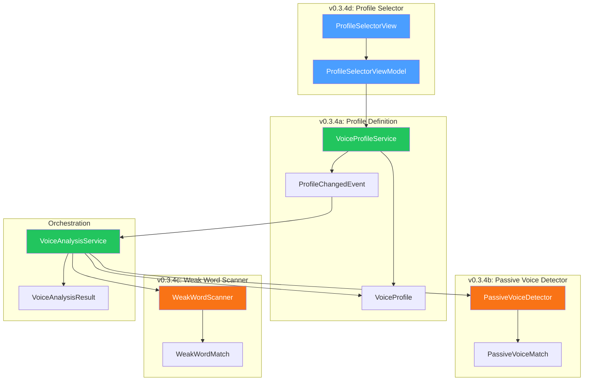
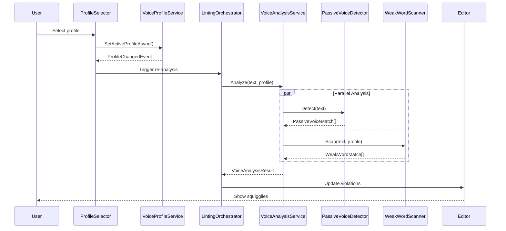

# LCS-DES-034: Design Specification Index — The Voice Profiler

## Document Control

| Field                | Value                              |
| :------------------- | :--------------------------------- |
| **Document ID**      | LCS-DES-034-INDEX                  |
| **Feature ID**       | STY-034                            |
| **Feature Name**     | The Voice Profiler (Tone Analysis) |
| **Target Version**   | v0.3.4                             |
| **Module Scope**     | Lexichord.Modules.Style            |
| **Swimlane**         | Governance                         |
| **License Tier**     | Writer Pro                         |
| **Feature Gate Key** | `FeatureFlags.Style.VoiceProfiler` |
| **Status**           | Draft                              |
| **Last Updated**     | 2026-01-26                         |

---

## 1. Executive Summary

**v0.3.4** delivers the **Voice Profiler** — moving beyond error detection to style analysis. This release transforms Lexichord from a "Rule Enforcer" into a "Writing Coach," enabling writers to analyze and refine the _tone_ of their content.

### 1.1 The Problem

Writers need more than grammar and terminology checking—they need guidance on _how_ they write, not just _what_ they write. Passive voice weakens technical documentation, excessive adverbs dilute marketing copy, and weasel words undermine academic credibility. Writers currently lack real-time feedback on these stylistic elements.

### 1.2 The Solution

Implement a Voice Profiler system that:

- **Defines Voice Profiles** with target constraints (grade level, sentence length, passive voice tolerance)
- **Detects Passive Voice** using pattern matching with adjective disambiguation
- **Scans for Weak Words** (adverbs, intensifiers, weasel words, fillers)
- **Provides Profile Selection UI** in the Status Bar for instant style switching

### 1.3 Business Value

| Value                       | Description                                                     |
| :-------------------------- | :-------------------------------------------------------------- |
| **Style Coaching**          | Writers receive guidance on tone and voice, not just errors     |
| **Profile-Based Analysis**  | Different contexts require different styles                     |
| **Passive Voice Detection** | Identify sentences that could be strengthened                   |
| **Weak Word Awareness**     | Flag overuse of intensifiers and hedges                         |
| **Enterprise Ready**        | Organizations can define brand-specific Voice Profiles          |
| **Foundation**              | Enables Resonance Dashboard (v0.3.5) to visualize style metrics |

---

## 2. Related Documents

### 2.1 Scope Breakdown Document

The detailed scope breakdown for v0.3.4, including all sub-parts, implementation checklists, user stories, and acceptance criteria:

| Document                            | Description                          |
| :---------------------------------- | :----------------------------------- |
| **[LCS-SBD-034](./LCS-SBD-034.md)** | Scope Breakdown — The Voice Profiler |

### 2.2 Sub-Part Design Specifications

Each sub-part has its own detailed design specification following the LDS-01 template:

| Sub-Part | Document                              | Title                  | Description                                  |
| :------- | :------------------------------------ | :--------------------- | :------------------------------------------- |
| v0.3.4a  | **[LCS-DES-034a](./LCS-DES-034a.md)** | Profile Definition     | VoiceProfile record and IVoiceProfileService |
| v0.3.4b  | **[LCS-DES-034b](./LCS-DES-034b.md)** | Passive Voice Detector | Pattern-based passive voice detection        |
| v0.3.4c  | **[LCS-DES-034c](./LCS-DES-034c.md)** | Adverb/Weasel Scanner  | Weak word scanning with categorized lists    |
| v0.3.4d  | **[LCS-DES-034d](./LCS-DES-034d.md)** | Profile Selector UI    | Status Bar dropdown for profile switching    |

---

## 3. Architecture Overview

### 3.1 Component Diagram



### 3.2 Data Flow



---

## 4. Dependencies

### 4.1 Upstream Dependencies (Required)

| Interface              | Source Version        | Purpose                                     |
| :--------------------- | :-------------------- | :------------------------------------------ |
| `IReadabilityService`  | v0.3.3c               | Get current readability for profile scoring |
| `ReadabilityMetrics`   | v0.3.3c               | Profile targets reference grade level       |
| `ISentenceTokenizer`   | v0.3.3a               | Sentence-level passive voice analysis       |
| `ILintingOrchestrator` | v0.2.3a               | Analysis pipeline integration               |
| `StyleViolation`       | v0.2.1b               | Report issues as violations                 |
| `ViolationSeverity`    | v0.2.1b               | Use Info/Warning severity                   |
| `ILicenseContext`      | v0.0.4c               | License tier checking                       |
| `IConfiguration`       | v0.0.3d               | Persist active profile                      |
| `ViewModelBase`        | CommunityToolkit.Mvvm | Observable ViewModel base (external NuGet)  |

### 4.2 NuGet Packages

| Package                 | Version | Purpose                    |
| :---------------------- | :------ | :------------------------- |
| `System.Reactive`       | 6.x     | Observable profile changes |
| `MediatR`               | 12.x    | Event publishing           |
| `CommunityToolkit.Mvvm` | 8.x     | MVVM source generators     |

### 4.3 Downstream Consumers (Future)

| Version | Feature             | Consumes                                                     |
| :------ | :------------------ | :----------------------------------------------------------- |
| v0.3.5  | Resonance Dashboard | `VoiceProfile`, `VoiceAnalysisResult`, `ProfileChangedEvent` |
| v0.3.6  | Global Dictionary   | `IVoiceProfileService` for project-level profile defaults    |

---

## 5. License Gating Strategy

The Voice Profiler is a **Writer Pro** feature using a **Soft Gate** strategy.

### 5.1 Behavior by License Tier

| Tier       | Profile Selector             | Analysis | Results Visible |
| :--------- | :--------------------------- | :------- | :-------------- |
| Core       | Disabled + lock icon         | Skipped  | No              |
| Writer Pro | Enabled, 5 built-in profiles | Full     | Yes             |
| Teams      | Enabled + custom profiles    | Full     | Yes             |
| Enterprise | Full + organization profiles | Full     | Yes             |

### 5.2 Implementation Pattern

```csharp
// In ProfileSelectorViewModel
if (!_licenseContext.HasFeature(FeatureFlags.Style.VoiceProfiler))
{
    IsLicensed = false;
    // Show upgrade prompt instead of profile list
    return;
}

// In VoiceAnalysisService
if (!_licenseContext.HasFeature(FeatureFlags.Style.VoiceProfiler))
{
    _logger.LogDebug("Skipping voice analysis: license not available");
    return VoiceAnalysisResult.Empty;
}
```

---

## 6. Voice Profile Constraints

### 6.1 Built-In Profiles

| Profile       | Grade Level | Max Sentence | Passive Voice | Flag Adverbs | Flag Weasels |
| :------------ | :---------- | :----------- | :------------ | :----------- | :----------- |
| **Technical** | 10-12       | 20 words     | Forbidden     | Yes          | Yes          |
| **Marketing** | 8-10        | 25 words     | ≤20%          | No           | Yes          |
| **Academic**  | 12-14       | 30 words     | ≤30%          | No           | No           |
| **Narrative** | 8-10        | 35 words     | ≤15%          | No           | No           |
| **Casual**    | 6-8         | 20 words     | ≤25%          | No           | No           |

### 6.2 Constraint Behaviors

| Constraint                | When Violated              | Severity |
| :------------------------ | :------------------------- | :------- |
| Passive Voice (forbidden) | Any passive detected       | Warning  |
| Passive Voice (threshold) | Exceeds percentage         | Info     |
| Adverbs (flagged)         | Match in adverb list       | Info     |
| Weasel Words (flagged)    | Match in weasel list       | Info     |
| Filler Words              | Always                     | Info     |
| Sentence Length           | Exceeds max                | Info     |
| Grade Level               | Outside target ± tolerance | Info     |

---

## 7. Key Interfaces Summary

| Interface               | Defined In | Purpose                          |
| :---------------------- | :--------- | :------------------------------- |
| `IVoiceProfileService`  | v0.3.4a    | Profile CRUD and selection       |
| `IPassiveVoiceDetector` | v0.3.4b    | Passive voice detection          |
| `IWeakWordScanner`      | v0.3.4c    | Adverb/weasel word scanning      |
| `IVoiceAnalysisService` | v0.3.4     | Orchestrates all voice analyzers |

| Record/DTO            | Defined In | Purpose                                 |
| :-------------------- | :--------- | :-------------------------------------- |
| `VoiceProfile`        | v0.3.4a    | Voice profile constraints               |
| `PassiveVoiceMatch`   | v0.3.4b    | Passive voice detection result          |
| `WeakWordMatch`       | v0.3.4c    | Weak word detection result              |
| `WeakWordCategory`    | v0.3.4c    | Enum for word categories                |
| `ProfileChangedEvent` | v0.3.4a    | MediatR notification for profile switch |
| `VoiceAnalysisResult` | v0.3.4     | Aggregate analysis results              |

---

## 8. Implementation Checklist Summary

| Sub-Part    | Tasks                        | Est. Hours   |
| :---------- | :--------------------------- | :----------- |
| v0.3.4a     | Profile Definition & Service | 9.5          |
| v0.3.4b     | Passive Voice Detector       | 9            |
| v0.3.4c     | Adverb/Weasel Scanner        | 7            |
| v0.3.4d     | Profile Selector UI          | 8            |
| Integration | Orchestration, DI, Tests     | 6.5          |
| **Total**   |                              | **40 hours** |

See [LCS-SBD-034](./LCS-SBD-034.md) Section 4 for the detailed task breakdown.

---

## 9. Success Criteria Summary

| Category        | Criterion                    | Target  |
| :-------------- | :--------------------------- | :------ |
| **Accuracy**    | Passive voice detection      | 90%+    |
| **Accuracy**    | False positives (adjectives) | < 10%   |
| **Performance** | Voice analysis (1,000 words) | < 100ms |
| **Performance** | Profile switch + re-analysis | < 500ms |
| **UX**          | Weak word scanning           | < 20ms  |

See [LCS-SBD-034](./LCS-SBD-034.md) Section 9 for full success metrics.

---

## 10. Test Coverage Summary

| Sub-Part | Unit Tests                                  | Integration Tests         |
| :------- | :------------------------------------------ | :------------------------ |
| v0.3.4a  | Profile CRUD, event publishing              | Profile persistence       |
| v0.3.4b  | Passive detection, adjective disambiguation | Pipeline integration      |
| v0.3.4c  | Word detection, multi-word phrases          | Pipeline integration      |
| v0.3.4d  | ViewModel state, license gating             | End-to-end profile switch |

See individual design specs for detailed test scenarios.

---

## 11. What This Enables

| Version | Feature             | Uses From v0.3.4                         |
| :------ | :------------------ | :--------------------------------------- |
| v0.3.5  | Resonance Dashboard | Maps voice metrics to radar chart axes   |
| v0.3.6  | Global Dictionary   | Adds profile selection to project config |
| v0.3.7  | Performance Tuning  | Runs voice analysis in parallel pipeline |

---

## Document History

| Version | Date       | Author         | Changes       |
| :------ | :--------- | :------------- | :------------ |
| 1.0     | 2026-01-26 | Lead Architect | Initial draft |
