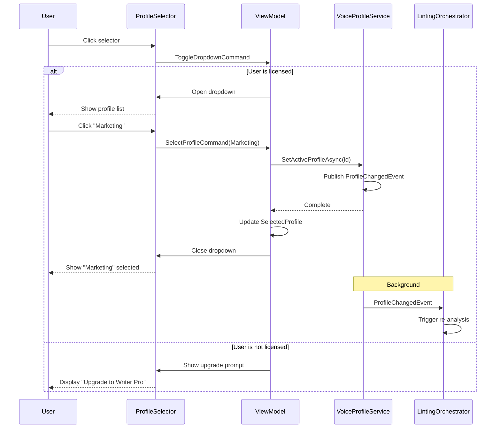

# LCS-DES-034d: Design Specification — Profile Selector UI

## 1. Metadata & Categorization

| Field                | Value                                                             |
| :------------------- | :---------------------------------------------------------------- |
| **Document ID**      | LCS-DES-034d                                                      |
| **Feature ID**       | STY-034d                                                          |
| **Feature Name**     | Voice Profile Selector (Status Bar)                               |
| **Target Version**   | v0.3.4d                                                           |
| **Module Scope**     | Lexichord.Modules.Style                                           |
| **Swimlane**         | Governance                                                        |
| **License Tier**     | Writer Pro                                                        |
| **Feature Gate Key** | `FeatureFlags.Style.VoiceProfiler`                                |
| **Status**           | Draft                                                             |
| **Last Updated**     | 2026-01-26                                                        |
| **Parent Document**  | [LCS-DES-034-INDEX](./LCS-DES-034-INDEX.md)                       |
| **Scope Breakdown**  | [LCS-SBD-034 §3.4](./LCS-SBD-034.md#34-v034d-profile-selector-ui) |

---

## 2. Executive Summary

### 2.1 The Requirement

Writers need a quick way to switch Voice Profiles without navigating to settings. The profile selection should be visible and accessible from the main editor interface.

> **Core Need:** One-click profile switching from the Status Bar with instant rule set changes.

### 2.2 The Proposed Solution

Implement a Profile Selector dropdown in the Status Bar that:

1. Shows the current profile name
2. Expands to show all available profiles
3. Shows constraint summary in tooltips
4. Triggers re-analysis on profile switch
5. Respects license gating for Core users

---

## 3. Architecture & Modular Strategy

### 3.1 Dependencies

#### 3.1.1 Upstream Dependencies

| Interface              | Source Version        | Purpose                                    |
| :--------------------- | :-------------------- | :----------------------------------------- |
| `IVoiceProfileService` | v0.3.4a               | Profile retrieval and selection            |
| `VoiceProfile`         | v0.3.4a               | Profile data model                         |
| `ProfileChangedEvent`  | v0.3.4a               | Event for profile changes                  |
| `ILicenseContext`      | v0.0.4c               | License tier checking                      |
| `ViewModelBase`        | CommunityToolkit.Mvvm | Observable ViewModel base (external NuGet) |
| `IShellRegionView`     | v0.0.8a               | Status Bar region contribution             |

#### 3.1.2 NuGet Packages

| Package                 | Version | Purpose                    |
| :---------------------- | :------ | :------------------------- |
| `CommunityToolkit.Mvvm` | 8.x     | MVVM source generators     |
| `System.Reactive`       | 6.x     | Observable profile changes |

### 3.2 Licensing Behavior

- **UI Gate:** The Profile Selector component is always visible, but behavior changes based on license.
- **Core users:** See disabled dropdown with lock icon and "Upgrade" prompt.
- **Writer Pro+:** Full functionality with profile switching.

---

## 4. Data Contract (The API)

### 4.1 ProfileSelectorViewModel

```csharp
namespace Lexichord.Modules.Style.ViewModels;

/// <summary>
/// ViewModel for the Voice Profile selector dropdown in the Status Bar.
/// </summary>
public partial class ProfileSelectorViewModel : ViewModelBase, IShellRegionView
{
    /// <summary>
    /// Region where this view should be placed.
    /// </summary>
    public ShellRegion Region => ShellRegion.StatusBarRight;

    /// <summary>
    /// Sort order within the region (lower = further right for status bar).
    /// </summary>
    public int SortOrder => 200;

    /// <summary>
    /// All available voice profiles.
    /// </summary>
    [ObservableProperty]
    private ObservableCollection<VoiceProfile> _profiles = [];

    /// <summary>
    /// The currently selected/active profile.
    /// </summary>
    [ObservableProperty]
    private VoiceProfile? _selectedProfile;

    /// <summary>
    /// Whether the user has a valid license for Voice Profiles.
    /// </summary>
    [ObservableProperty]
    private bool _isLicensed;

    /// <summary>
    /// Whether profiles are currently being loaded.
    /// </summary>
    [ObservableProperty]
    private bool _isLoading;

    /// <summary>
    /// Whether the dropdown is currently open.
    /// </summary>
    [ObservableProperty]
    private bool _isDropdownOpen;

    /// <summary>
    /// Display text for the selector button.
    /// Shows profile name or "Voice Profile" placeholder.
    /// </summary>
    public string DisplayText => IsLicensed
        ? SelectedProfile?.Name ?? "Select Profile"
        : "Voice Profile";

    /// <summary>
    /// Icon to display (lock for unlicensed, checkmark for selected).
    /// </summary>
    public string Icon => IsLicensed ? "ChevronDown" : "Lock";

    /// <summary>
    /// Tooltip showing profile constraints summary.
    /// </summary>
    public string TooltipText => GetTooltipText();

    /// <summary>
    /// Selects a profile and triggers re-analysis.
    /// </summary>
    [RelayCommand]
    private async Task SelectProfileAsync(VoiceProfile profile);

    /// <summary>
    /// Opens the upgrade modal for unlicensed users.
    /// </summary>
    [RelayCommand]
    private void ShowUpgradePrompt();

    /// <summary>
    /// Toggles the dropdown open/closed state.
    /// </summary>
    [RelayCommand]
    private void ToggleDropdown();
}
```

---

## 5. Implementation Logic

### 5.1 Profile Selection Flow



### 5.2 ViewModel Initialization

```csharp
public ProfileSelectorViewModel(
    IVoiceProfileService voiceProfileService,
    ILicenseContext licenseContext,
    IMediator mediator,
    ILogger<ProfileSelectorViewModel> logger)
{
    _voiceProfileService = voiceProfileService;
    _licenseContext = licenseContext;
    _mediator = mediator;
    _logger = logger;

    // Check license on init
    IsLicensed = _licenseContext.HasFeature(FeatureFlags.Style.VoiceProfiler);

    // Load profiles
    _ = InitializeAsync();

    // Subscribe to profile changes (from other sources)
    _mediator.Subscribe<ProfileChangedEvent>(OnProfileChanged);
}

private async Task InitializeAsync()
{
    try
    {
        IsLoading = true;

        var profiles = await _voiceProfileService.GetAllProfilesAsync();
        Profiles = new ObservableCollection<VoiceProfile>(profiles);

        if (IsLicensed)
        {
            SelectedProfile = await _voiceProfileService.GetActiveProfileAsync();
        }
    }
    finally
    {
        IsLoading = false;
    }
}
```

---

## 6. UI/UX Specifications

### 6.1 Component Layout

**Status Bar Integration:**

```text
┌─────────────────────────────────────────────────────────────────────────────┐
│  Editor Content Area                                                         │
│                                                                              │
└─────────────────────────────────────────────────────────────────────────────┘
┌─────────────────────────────────────────────────────────────────────────────┐
│  Ln 42, Col 15  │  UTF-8  │  LF  │  Profile: Technical ▼  │  Grade 8.4     │
└─────────────────────────────────────────────────────────────────────────────┘
                                    └── Profile Selector        └── Readability HUD
```

### 6.2 Selector Button (Licensed User)

```text
┌──────────────────────────┐
│  📝 Technical      ▼     │  ← 140px width, 24px height
└──────────────────────────┘

Components:
├── Icon: Profile icon (📝 or custom)
├── Text: Current profile name
├── Chevron: Dropdown indicator
└── Hover: Subtle highlight
```

### 6.3 Dropdown Menu (Expanded)

```text
┌──────────────────────────────┐
│  ✓ Technical                 │ ← Selected (checkmark)
│    Marketing                 │
│    Academic                  │
│    Narrative                 │
│    Casual                    │
├──────────────────────────────┤
│  ⚙ Manage Profiles...       │ ← Opens settings (Teams+ only)
└──────────────────────────────┘

Dimensions:
├── Min width: 160px
├── Max width: 220px
├── Item height: 32px
├── Padding: 8px vertical, 12px horizontal
├── Separator: 1px Border.Subtle
└── Max visible: 7 items (scrollable)
```

### 6.4 Selector Button (Unlicensed User)

```text
┌──────────────────────────┐
│  🔒 Voice Profile        │  ← Lock icon, disabled state
└──────────────────────────┘
```

### 6.5 Upgrade Prompt (Dropdown for Unlicensed)

```text
┌──────────────────────────────┐
│  🔒 Voice Profiles           │
│  ─────────────────────────── │
│  Analyze your writing style  │
│  with Voice Profiles.        │
│                              │
│  • Detect passive voice      │
│  • Flag weak words           │
│  • Match style guides        │
│                              │
│  ┌────────────────────────┐  │
│  │   Upgrade to Pro ↗    │  │
│  └────────────────────────┘  │
└──────────────────────────────┘

Dimensions:
├── Width: 240px
├── Padding: 16px
├── Button: Full width, primary style
└── Link: Opens subscription page
```

### 6.6 Tooltip (on Hover)

```text
┌─────────────────────────────────┐
│  Technical Profile              │
│  ───────────────────────────── │
│  Grade Level:      10-12        │
│  Max Sentence:     20 words     │
│  Passive Voice:    Forbidden    │
│  Flag Adverbs:     Yes          │
│  Flag Weasels:     Yes          │
│  ───────────────────────────── │
│  Click to change profile        │
└─────────────────────────────────┘

Dimensions:
├── Max width: 260px
├── Padding: 12px
├── Show delay: 500ms
├── Font: Monospace for values
└── Alignment: Labels left, values right
```

### 6.7 Component Styling

| Component           | Theme Resource           | Notes                 |
| :------------------ | :----------------------- | :-------------------- |
| Selector Container  | `Brush.Surface.Tertiary` | Status bar background |
| Selector Border     | `Brush.Border.Subtle`    | 1px on hover only     |
| Selector Hover      | `Brush.Surface.Hover`    | Subtle highlight      |
| Dropdown Background | `Brush.Surface.Floating` | Elevated surface      |
| Dropdown Shadow     | `Shadow.Medium`          | 4px blur, 2px offset  |
| Selected Item BG    | `Brush.Accent.Soft`      | Highlight row         |
| Checkmark Icon      | `Brush.Accent.Primary`   | 16x16                 |
| Hover Item BG       | `Brush.Surface.Hover`    | Subtle                |
| Separator           | `Brush.Border.Subtle`    | 1px horizontal        |
| Lock Icon           | `Brush.Text.Tertiary`    | Disabled state        |
| Upgrade Button      | `LexButtonPrimary`       | Full width            |

### 6.8 Animations

| Animation        | Duration | Easing         |
| :--------------- | :------- | :------------- |
| Dropdown open    | 150ms    | EaseOutCubic   |
| Dropdown close   | 100ms    | EaseInCubic    |
| Item hover       | 100ms    | Linear         |
| Selection change | 200ms    | EaseInOutCubic |
| Loading spinner  | 1000ms   | Linear (loop)  |

---

## 7. Decision Trees

### 7.1 User Interaction Flow

```text
START: "User clicks Profile Selector"
│
├── Is user licensed for Writer Pro?
│   ├── NO → Show upgrade dropdown
│   │   ├── User clicks "Upgrade" → Open subscription URL
│   │   └── User clicks outside → Close dropdown
│   │
│   └── YES → Continue
│
├── Is dropdown already open?
│   └── YES → Close dropdown, STOP
│
├── Are profiles loaded?
│   ├── NO → Show loading state
│   │   └── Wait for load → Continue
│   └── YES → Continue
│
├── Open dropdown with profile list
│
├── User hovers over profile
│   └── Show tooltip with constraints
│
├── User clicks profile
│   ├── Is same as current? → No-op, close dropdown
│   └── Is different? → Continue
│
├── Call SetActiveProfileAsync
│
├── Wait for ProfileChangedEvent
│
├── Update SelectedProfile
│
└── Close dropdown
```

---

## 8. Observability & Logging

| Level   | Message Template                                               |
| :------ | :------------------------------------------------------------- |
| Debug   | `"Profile selector initialized, license status: {IsLicensed}"` |
| Debug   | `"Loaded {ProfileCount} profiles"`                             |
| Debug   | `"Profile dropdown opened"`                                    |
| Info    | `"User selected profile: {ProfileName}"`                       |
| Debug   | `"Profile dropdown closed"`                                    |
| Warning | `"Profile selection blocked: license required"`                |
| Debug   | `"Upgrade prompt shown"`                                       |
| Error   | `"Failed to load profiles: {Error}"`                           |
| Error   | `"Failed to set profile: {Error}"`                             |

---

## 9. Acceptance Criteria

### 9.1 Visual Criteria

| #   | Criterion                                              |
| :-- | :----------------------------------------------------- |
| 1   | Profile Selector appears in Status Bar (right section) |
| 2   | Current profile name displayed when licensed           |
| 3   | Lock icon displayed when unlicensed                    |
| 4   | Dropdown shows all 5 built-in profiles                 |
| 5   | Selected profile has checkmark indicator               |
| 6   | Tooltip shows profile constraints on hover             |
| 7   | Dropdown animates open/close smoothly                  |

### 9.2 Functional Criteria

| #   | Given              | When                     | Then                             |
| :-- | :----------------- | :----------------------- | :------------------------------- |
| 1   | Writer Pro user    | Clicks selector          | Dropdown opens with profiles     |
| 2   | Writer Pro user    | Clicks different profile | Profile changes, dropdown closes |
| 3   | Writer Pro user    | Clicks same profile      | Dropdown closes, no event        |
| 4   | Core user          | Clicks selector          | Upgrade prompt displayed         |
| 5   | Core user          | Clicks "Upgrade"         | Subscription page opens          |
| 6   | Profile changes    | Dropdown closed          | Re-analysis triggers             |
| 7   | Application starts | -                        | Last selected profile restored   |

### 9.3 Performance Criteria

| #   | Criterion                    | Target  |
| :-- | :--------------------------- | :------ |
| 1   | Dropdown open time           | < 100ms |
| 2   | Profile switch + re-analysis | < 500ms |
| 3   | Initial load (profiles)      | < 200ms |

---

## 10. Unit Tests

```csharp
[Trait("Category", "Unit")]
[Trait("Feature", "v0.3.4d")]
public class ProfileSelectorViewModelTests
{
    [Fact]
    public async Task SelectProfileAsync_WhenLicensed_ChangesProfile()
    {
        var mockService = CreateMockProfileService();
        var mockLicense = CreateMockLicense(isLicensed: true);
        var sut = CreateViewModel(mockService, mockLicense);

        var newProfile = new VoiceProfile
        {
            Id = Guid.NewGuid(),
            Name = "Marketing"
        };

        await sut.SelectProfileCommand.ExecuteAsync(newProfile);

        mockService.Verify(s => s.SetActiveProfileAsync(
            newProfile.Id,
            It.IsAny<CancellationToken>()));
        sut.SelectedProfile.Should().Be(newProfile);
    }

    [Fact]
    public async Task SelectProfileAsync_WhenNotLicensed_DoesNotChangeProfile()
    {
        var mockService = CreateMockProfileService();
        var mockLicense = CreateMockLicense(isLicensed: false);
        var sut = CreateViewModel(mockService, mockLicense);
        var originalProfile = sut.SelectedProfile;

        await sut.SelectProfileCommand.ExecuteAsync(new VoiceProfile
        {
            Id = Guid.NewGuid(),
            Name = "Marketing"
        });

        mockService.Verify(s => s.SetActiveProfileAsync(
            It.IsAny<Guid>(),
            It.IsAny<CancellationToken>()), Times.Never);
    }

    [Fact]
    public void DisplayText_WhenLicensed_ShowsProfileName()
    {
        var sut = CreateViewModel(isLicensed: true);
        sut.SelectedProfile = new VoiceProfile
        {
            Id = Guid.NewGuid(),
            Name = "Technical"
        };

        sut.DisplayText.Should().Be("Technical");
    }

    [Fact]
    public void DisplayText_WhenNotLicensed_ShowsGenericText()
    {
        var sut = CreateViewModel(isLicensed: false);

        sut.DisplayText.Should().Be("Voice Profile");
    }

    [Fact]
    public void Icon_WhenLicensed_ShowsChevron()
    {
        var sut = CreateViewModel(isLicensed: true);

        sut.Icon.Should().Be("ChevronDown");
    }

    [Fact]
    public void Icon_WhenNotLicensed_ShowsLock()
    {
        var sut = CreateViewModel(isLicensed: false);

        sut.Icon.Should().Be("Lock");
    }

    [Fact]
    public void TooltipText_ShowsConstraintsSummary()
    {
        var sut = CreateViewModel(isLicensed: true);
        sut.SelectedProfile = new VoiceProfile
        {
            Id = Guid.NewGuid(),
            Name = "Technical",
            TargetGradeLevel = 11,
            MaxSentenceLength = 20,
            AllowPassiveVoice = false,
            FlagAdverbs = true,
            FlagWeaselWords = true
        };

        var tooltip = sut.TooltipText;

        tooltip.Should().Contain("Technical");
        tooltip.Should().Contain("11");
        tooltip.Should().Contain("20");
        tooltip.Should().Contain("Forbidden");
        tooltip.Should().Contain("Yes");
    }

    [Fact]
    public void ToggleDropdown_TogglesState()
    {
        var sut = CreateViewModel(isLicensed: true);
        sut.IsDropdownOpen.Should().BeFalse();

        sut.ToggleDropdownCommand.Execute(null);
        sut.IsDropdownOpen.Should().BeTrue();

        sut.ToggleDropdownCommand.Execute(null);
        sut.IsDropdownOpen.Should().BeFalse();
    }

    [Fact]
    public async Task Initialize_LoadsProfiles()
    {
        var expectedProfiles = new List<VoiceProfile>
        {
            new() { Id = Guid.NewGuid(), Name = "Technical" },
            new() { Id = Guid.NewGuid(), Name = "Marketing" }
        };
        var mockService = CreateMockProfileService(expectedProfiles);
        var sut = CreateViewModel(mockService, isLicensed: true);

        // Wait for initialization
        await Task.Delay(100);

        sut.Profiles.Should().HaveCount(2);
    }

    [Fact]
    public async Task SelectProfile_SameAsActive_NoOp()
    {
        var profile = new VoiceProfile
        {
            Id = Guid.NewGuid(),
            Name = "Technical"
        };
        var mockService = CreateMockProfileService();
        var sut = CreateViewModel(mockService, isLicensed: true);
        sut.SelectedProfile = profile;

        await sut.SelectProfileCommand.ExecuteAsync(profile);

        mockService.Verify(s => s.SetActiveProfileAsync(
            It.IsAny<Guid>(),
            It.IsAny<CancellationToken>()), Times.Never);
    }
}
```

---

## 11. Code Example

### 11.1 ProfileSelectorViewModel Implementation

```csharp
namespace Lexichord.Modules.Style.ViewModels;

/// <summary>
/// ViewModel for the Voice Profile selector in the Status Bar.
/// </summary>
public partial class ProfileSelectorViewModel : ViewModelBase, IShellRegionView
{
    private readonly IVoiceProfileService _voiceProfileService;
    private readonly ILicenseContext _licenseContext;
    private readonly IMediator _mediator;
    private readonly ILogger<ProfileSelectorViewModel> _logger;

    public ShellRegion Region => ShellRegion.StatusBarRight;
    public int SortOrder => 200;

    [ObservableProperty]
    private ObservableCollection<VoiceProfile> _profiles = [];

    [ObservableProperty]
    [NotifyPropertyChangedFor(nameof(DisplayText))]
    [NotifyPropertyChangedFor(nameof(TooltipText))]
    private VoiceProfile? _selectedProfile;

    [ObservableProperty]
    [NotifyPropertyChangedFor(nameof(DisplayText))]
    [NotifyPropertyChangedFor(nameof(Icon))]
    private bool _isLicensed;

    [ObservableProperty]
    private bool _isLoading;

    [ObservableProperty]
    private bool _isDropdownOpen;

    public string DisplayText => IsLicensed
        ? SelectedProfile?.Name ?? "Select Profile"
        : "Voice Profile";

    public string Icon => IsLicensed ? "ChevronDown" : "Lock";

    public string TooltipText => GetTooltipText();

    public ProfileSelectorViewModel(
        IVoiceProfileService voiceProfileService,
        ILicenseContext licenseContext,
        IMediator mediator,
        ILogger<ProfileSelectorViewModel> logger)
    {
        _voiceProfileService = voiceProfileService;
        _licenseContext = licenseContext;
        _mediator = mediator;
        _logger = logger;

        IsLicensed = _licenseContext.HasFeature(FeatureFlags.Style.VoiceProfiler);
        _logger.LogDebug(
            "Profile selector initialized, license status: {IsLicensed}",
            IsLicensed);

        _ = InitializeAsync();
    }

    private async Task InitializeAsync()
    {
        try
        {
            IsLoading = true;

            var profiles = await _voiceProfileService.GetAllProfilesAsync();
            Profiles = new ObservableCollection<VoiceProfile>(profiles);

            _logger.LogDebug("Loaded {ProfileCount} profiles", profiles.Count);

            if (IsLicensed)
            {
                SelectedProfile = await _voiceProfileService.GetActiveProfileAsync();
            }
        }
        catch (Exception ex)
        {
            _logger.LogError(ex, "Failed to load profiles: {Error}", ex.Message);
        }
        finally
        {
            IsLoading = false;
        }
    }

    [RelayCommand]
    private async Task SelectProfileAsync(VoiceProfile profile)
    {
        if (!IsLicensed)
        {
            _logger.LogWarning("Profile selection blocked: license required");
            ShowUpgradePrompt();
            return;
        }

        // No-op if same profile
        if (SelectedProfile?.Id == profile.Id)
        {
            IsDropdownOpen = false;
            return;
        }

        try
        {
            _logger.LogInformation("User selected profile: {ProfileName}", profile.Name);

            await _voiceProfileService.SetActiveProfileAsync(profile.Id);
            SelectedProfile = profile;
            IsDropdownOpen = false;
        }
        catch (Exception ex)
        {
            _logger.LogError(ex, "Failed to set profile: {Error}", ex.Message);
        }
    }

    [RelayCommand]
    private void ShowUpgradePrompt()
    {
        _logger.LogDebug("Upgrade prompt shown");
        // Implementation would open subscription URL
        // Process.Start(new ProcessStartInfo("https://lexichord.app/upgrade") { UseShellExecute = true });
    }

    [RelayCommand]
    private void ToggleDropdown()
    {
        IsDropdownOpen = !IsDropdownOpen;
        _logger.LogDebug("Profile dropdown {State}",
            IsDropdownOpen ? "opened" : "closed");
    }

    private string GetTooltipText()
    {
        if (!IsLicensed)
        {
            return "Upgrade to Writer Pro for Voice Profile analysis.\n" +
                   "Detect passive voice, flag weak words, and more.";
        }

        if (SelectedProfile is null)
        {
            return "Select a Voice Profile";
        }

        var profile = SelectedProfile;
        var passiveText = profile.AllowPassiveVoice
            ? $"≤{profile.MaxPassiveVoicePercentage}%"
            : "Forbidden";

        return $"{profile.Name} Profile\n" +
               $"───────────────────────────\n" +
               $"Grade Level:      {FormatGradeLevel(profile)}\n" +
               $"Max Sentence:     {profile.MaxSentenceLength} words\n" +
               $"Passive Voice:    {passiveText}\n" +
               $"Flag Adverbs:     {(profile.FlagAdverbs ? "Yes" : "No")}\n" +
               $"Flag Weasels:     {(profile.FlagWeaselWords ? "Yes" : "No")}\n" +
               $"───────────────────────────\n" +
               $"Click to change profile";
    }

    private static string FormatGradeLevel(VoiceProfile profile)
    {
        if (!profile.TargetGradeLevel.HasValue)
        {
            return "Any";
        }

        var min = profile.TargetGradeLevel.Value - profile.GradeLevelTolerance;
        var max = profile.TargetGradeLevel.Value + profile.GradeLevelTolerance;
        return $"{min:F0}-{max:F0}";
    }
}
```

### 11.2 ProfileSelectorView.axaml

```xml
<UserControl xmlns="https://github.com/avaloniaui"
             xmlns:x="http://schemas.microsoft.com/winfx/2006/xaml"
             xmlns:vm="using:Lexichord.Modules.Style.ViewModels"
             xmlns:icons="using:Material.Icons.Avalonia"
             x:Class="Lexichord.Modules.Style.Views.ProfileSelectorView"
             x:DataType="vm:ProfileSelectorViewModel">

    <UserControl.Styles>
        <!-- Selector Button -->
        <Style Selector="Button.profile-selector">
            <Setter Property="Background" Value="Transparent" />
            <Setter Property="Padding" Value="8,4" />
            <Setter Property="CornerRadius" Value="4" />
            <Setter Property="MinWidth" Value="120" />
            <Setter Property="Height" Value="24" />
        </Style>
        <Style Selector="Button.profile-selector:pointerover">
            <Setter Property="Background" Value="{DynamicResource Brush.Surface.Hover}" />
        </Style>
        <Style Selector="Button.profile-selector:disabled">
            <Setter Property="Opacity" Value="0.6" />
        </Style>

        <!-- Dropdown Item -->
        <Style Selector="ListBoxItem.profile-item">
            <Setter Property="Padding" Value="12,8" />
            <Setter Property="MinHeight" Value="32" />
        </Style>
        <Style Selector="ListBoxItem.profile-item:selected">
            <Setter Property="Background" Value="{DynamicResource Brush.Accent.Soft}" />
        </Style>
    </UserControl.Styles>

    <Grid>
        <!-- Selector Button -->
        <Button Classes="profile-selector"
                Command="{Binding ToggleDropdownCommand}"
                ToolTip.Tip="{Binding TooltipText}"
                ToolTip.ShowDelay="500">
            <StackPanel Orientation="Horizontal" Spacing="6">
                <!-- Icon (lock or chevron) -->
                <icons:MaterialIcon Kind="{Binding Icon}"
                                    Width="14" Height="14"
                                    Foreground="{DynamicResource Brush.Text.Secondary}" />

                <!-- Profile Name -->
                <TextBlock Text="{Binding DisplayText}"
                           Foreground="{DynamicResource Brush.Text.Primary}"
                           FontSize="12"
                           VerticalAlignment="Center" />

                <!-- Loading Indicator -->
                <icons:MaterialIcon Kind="Loading"
                                    Width="12" Height="12"
                                    IsVisible="{Binding IsLoading}"
                                    Classes="spinning" />
            </StackPanel>
        </Button>

        <!-- Dropdown Popup -->
        <Popup IsOpen="{Binding IsDropdownOpen, Mode=TwoWay}"
               PlacementTarget="{Binding $parent[Button]}"
               Placement="Top"
               HorizontalOffset="0"
               VerticalOffset="-4">
            <Border Background="{DynamicResource Brush.Surface.Floating}"
                    BorderBrush="{DynamicResource Brush.Border.Subtle}"
                    BorderThickness="1"
                    CornerRadius="6"
                    BoxShadow="0 4 12 0 #40000000"
                    MinWidth="160"
                    MaxWidth="220">

                <!-- Licensed: Show profile list -->
                <Panel IsVisible="{Binding IsLicensed}">
                    <ListBox ItemsSource="{Binding Profiles}"
                             SelectedItem="{Binding SelectedProfile}"
                             Background="Transparent">
                        <ListBox.ItemTemplate>
                            <DataTemplate x:DataType="vm:VoiceProfile">
                                <Grid ColumnDefinitions="Auto,*">
                                    <!-- Checkmark for selected -->
                                    <icons:MaterialIcon Kind="Check"
                                                        Width="16" Height="16"
                                                        Foreground="{DynamicResource Brush.Accent.Primary}"
                                                        IsVisible="{Binding IsSelected,
                                                            RelativeSource={RelativeSource AncestorType=ListBoxItem}}"
                                                        Margin="0,0,8,0" />

                                    <!-- Profile Name -->
                                    <TextBlock Grid.Column="1"
                                               Text="{Binding Name}"
                                               VerticalAlignment="Center" />
                                </Grid>
                            </DataTemplate>
                        </ListBox.ItemTemplate>
                    </ListBox>
                </Panel>

                <!-- Unlicensed: Show upgrade prompt -->
                <StackPanel IsVisible="{Binding !IsLicensed}"
                            Spacing="12"
                            Margin="16">
                    <StackPanel Orientation="Horizontal" Spacing="8">
                        <icons:MaterialIcon Kind="Lock"
                                            Width="20" Height="20"
                                            Foreground="{DynamicResource Brush.Text.Tertiary}" />
                        <TextBlock Text="Voice Profiles"
                                   FontWeight="SemiBold" />
                    </StackPanel>

                    <TextBlock Text="Analyze your writing style with Voice Profiles."
                               TextWrapping="Wrap"
                               Foreground="{DynamicResource Brush.Text.Secondary}"
                               FontSize="12" />

                    <StackPanel Spacing="4">
                        <TextBlock Text="• Detect passive voice"
                                   FontSize="12"
                                   Foreground="{DynamicResource Brush.Text.Secondary}" />
                        <TextBlock Text="• Flag weak words"
                                   FontSize="12"
                                   Foreground="{DynamicResource Brush.Text.Secondary}" />
                        <TextBlock Text="• Match style guides"
                                   FontSize="12"
                                   Foreground="{DynamicResource Brush.Text.Secondary}" />
                    </StackPanel>

                    <Button Content="Upgrade to Pro ↗"
                            Command="{Binding ShowUpgradePromptCommand}"
                            Classes="primary"
                            HorizontalAlignment="Stretch" />
                </StackPanel>
            </Border>
        </Popup>
    </Grid>
</UserControl>
```

---

## 12. DI Registration

```csharp
// In StyleModule.cs
services.AddTransient<ProfileSelectorViewModel>();
services.AddTransient<ProfileSelectorView>();

// Register as shell region view
services.AddSingleton<IShellRegionView>(sp =>
    sp.GetRequiredService<ProfileSelectorViewModel>());
```

---

## Document History

| Version | Date       | Author         | Changes       |
| :------ | :--------- | :------------- | :------------ |
| 1.0     | 2026-01-26 | Lead Architect | Initial draft |
