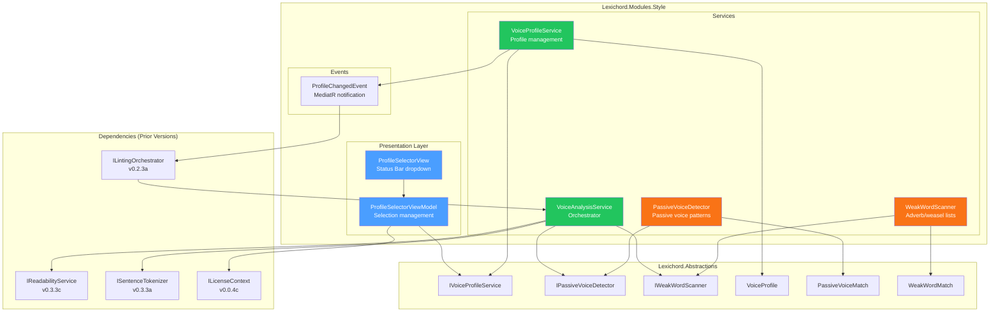
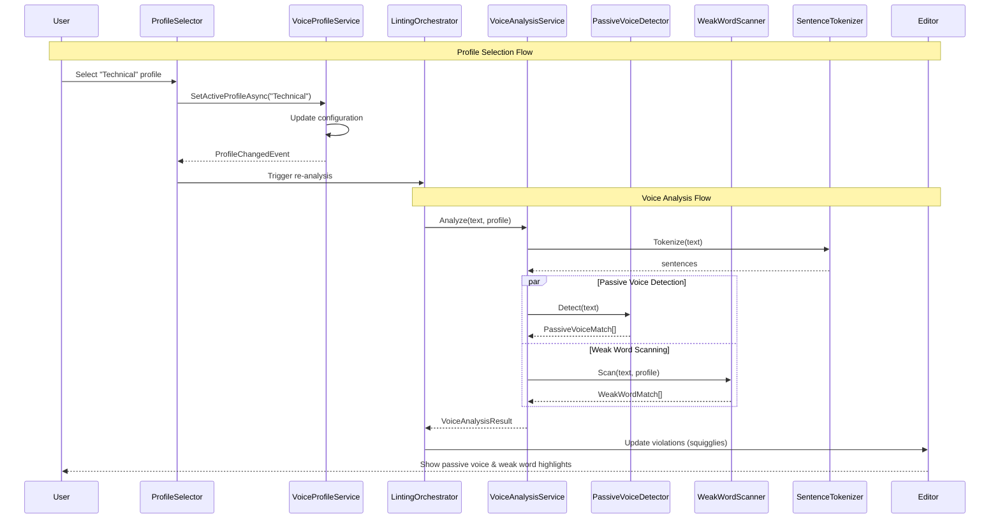

# LCS-SBD-034: Scope Breakdown — The Voice Profiler

## Document Control

| Field            | Value                                                      |
| :--------------- | :--------------------------------------------------------- |
| **Document ID**  | LCS-SBD-034                                                |
| **Version**      | v0.3.4                                                     |
| **Codename**     | The Voice Profiler (Tone Analysis)                         |
| **Status**       | Draft                                                      |
| **Last Updated** | 2026-01-26                                                 |
| **Owner**        | Lead Architect                                             |
| **Depends On**   | v0.3.3 (Readability Engine), v0.2.3 (Linting Orchestrator) |

---

## 1. Executive Summary

### 1.1 The Vision

**v0.3.4** delivers the **Voice Profiler** — moving beyond error detection to style analysis. This release transforms Lexichord from a "Rule Enforcer" into a "Writing Coach," enabling writers to analyze and refine the _tone_ of their content through detection of passive voice constructions, excessive adverbs, and weasel words.

While v0.3.3 introduced mathematical readability metrics, the Voice Profiler adds qualitative style analysis. Writers can now define target "Voice Profiles" (Technical, Marketing, Academic) with specific style constraints, then receive real-time feedback on how their writing matches the selected profile. The system detects constructions that weaken prose—passive voice, hedge words, and intensifiers—and provides actionable guidance.

### 1.2 Business Value

- **Style Coaching:** Writers receive guidance on tone and voice, not just grammar and terminology errors.
- **Profile-Based Analysis:** Different writing contexts require different styles—technical docs need directness, marketing allows more flair.
- **Passive Voice Detection:** Identify sentences that could be strengthened with active voice constructions.
- **Adverb Awareness:** Flag overuse of intensifiers ("very", "really") that weaken prose.
- **Weasel Word Detection:** Catch hedge language ("somewhat", "arguably") that undermines confidence.
- **Enterprise Ready:** Organizations can define custom Voice Profiles matching their brand guidelines.
- **Foundation:** Enables the Resonance Dashboard (v0.3.5) to visualize style metrics on radar charts.

### 1.3 Success Criteria

This release succeeds when:

1. Voice Profiles define target style constraints with configurable thresholds.
2. Passive voice detection identifies common passive constructions with 90%+ accuracy.
3. Adverb/weasel word scanning flags weak language as `Severity.Info` squigglies.
4. Profile Selector dropdown in the Status Bar allows instant profile switching.
5. All analysis integrates with the existing `LintingOrchestrator` pipeline.
6. Voice Profiler is a **Writer Pro** feature with appropriate license gating.

### 1.4 License Gating

The Voice Profiler is a **Writer Pro** feature. Lower tiers will see:

- Profile Selector dropdown disabled with "Upgrade to Writer Pro" tooltip
- Passive voice and adverb detections hidden (analysis may run but results not shown)
- Settings panel shows feature preview with upgrade CTA
- Future: Teams/Enterprise can create custom organization profiles

---

## 2. Dependencies on Prior Versions

| Component               | Source Version        | Usage in v0.3.4                                |
| :---------------------- | :-------------------- | :--------------------------------------------- |
| `IReadabilityService`   | v0.3.3c               | Include readability metrics in profile scoring |
| `ReadabilityMetrics`    | v0.3.3c               | Profile targets reference grade level          |
| `ISentenceTokenizer`    | v0.3.3a               | Sentence-level passive voice analysis          |
| `ILintingOrchestrator`  | v0.2.3a               | Integration point for triggering analysis      |
| `LintingCompletedEvent` | v0.2.3b               | Subscribe to trigger voice analysis            |
| `StyleViolation`        | v0.2.1b               | Report passive/adverb issues as violations     |
| `ViolationSeverity`     | v0.2.1b               | Use `Info` severity for style suggestions      |
| `ILicenseContext`       | v0.0.4c               | Read-only license tier access                  |
| `LicenseTier`           | v0.0.4c               | Core/WriterPro/Teams/Enterprise enum           |
| `Feature`               | v0.3.1d               | Feature gate constants                         |
| `ViewModelBase`         | CommunityToolkit.Mvvm | Observable ViewModel base (external NuGet)     |
| `IConfiguration`        | v0.0.3d               | Persist selected profile preference            |
| `ILogger<T> / Serilog`  | v0.0.3b               | Structured logging                             |

---

## 3. Sub-Part Specifications

### 3.1 v0.3.4a: Profile Definition

| Field            | Value                                 |
| :--------------- | :------------------------------------ |
| **Sub-Part ID**  | STY-034a                              |
| **Title**        | Voice Profile Definition & Repository |
| **Module**       | `Lexichord.Modules.Style`             |
| **License Tier** | Writer Pro                            |

**Goal:** Create the `VoiceProfile` record and `IVoiceProfileService` to define, store, and retrieve voice profiles with style constraints.

**Key Deliverables:**

- `VoiceProfile` record with style constraints (grade level, sentence length, passive voice tolerance)
- `IVoiceProfileService` interface for profile CRUD and selection
- `VoiceProfileRepository` implementation with SQLite persistence
- Seed default profiles: "Technical", "Marketing", "Academic", "Narrative", "Casual"
- `ProfileChangedEvent` MediatR notification for profile switches
- Unit tests for profile validation and persistence

**Key Interfaces:**

```csharp
namespace Lexichord.Abstractions.Contracts;

/// <summary>
/// A Voice Profile defines target style constraints for writing analysis.
/// Writers select a profile to receive feedback tailored to their content type.
/// </summary>
public record VoiceProfile
{
    /// <summary>Unique identifier for the profile.</summary>
    public Guid Id { get; init; }

    /// <summary>Display name (e.g., "Technical", "Marketing").</summary>
    public required string Name { get; init; }

    /// <summary>Description of when to use this profile.</summary>
    public string? Description { get; init; }

    /// <summary>Target Flesch-Kincaid grade level (null = no constraint).</summary>
    public double? TargetGradeLevel { get; init; }

    /// <summary>Maximum acceptable grade level deviation from target.</summary>
    public double GradeLevelTolerance { get; init; } = 2.0;

    /// <summary>Maximum recommended words per sentence.</summary>
    public int MaxSentenceLength { get; init; } = 25;

    /// <summary>Whether passive voice is allowed in this profile.</summary>
    public bool AllowPassiveVoice { get; init; }

    /// <summary>Maximum percentage of passive voice sentences allowed.</summary>
    public double MaxPassiveVoicePercentage { get; init; } = 10.0;

    /// <summary>Whether adverbs/intensifiers should be flagged.</summary>
    public bool FlagAdverbs { get; init; } = true;

    /// <summary>Whether weasel words should be flagged.</summary>
    public bool FlagWeaselWords { get; init; } = true;

    /// <summary>Categories of terms to forbid (from Lexicon).</summary>
    public IReadOnlyList<string> ForbiddenCategories { get; init; } = [];

    /// <summary>Whether this is a built-in profile (cannot be deleted).</summary>
    public bool IsBuiltIn { get; init; }

    /// <summary>Sort order for display in dropdown.</summary>
    public int SortOrder { get; init; }
}

/// <summary>
/// Service for managing Voice Profiles and tracking the currently active profile.
/// </summary>
public interface IVoiceProfileService
{
    /// <summary>Gets all available voice profiles.</summary>
    Task<IReadOnlyList<VoiceProfile>> GetAllProfilesAsync(CancellationToken ct = default);

    /// <summary>Gets a profile by its ID.</summary>
    Task<VoiceProfile?> GetProfileAsync(Guid id, CancellationToken ct = default);

    /// <summary>Gets the currently active profile for the user.</summary>
    Task<VoiceProfile> GetActiveProfileAsync(CancellationToken ct = default);

    /// <summary>Sets the active profile and publishes ProfileChangedEvent.</summary>
    Task SetActiveProfileAsync(Guid profileId, CancellationToken ct = default);

    /// <summary>Creates a new custom profile (Teams+ license required).</summary>
    Task<VoiceProfile> CreateProfileAsync(VoiceProfile profile, CancellationToken ct = default);

    /// <summary>Updates an existing custom profile.</summary>
    Task UpdateProfileAsync(VoiceProfile profile, CancellationToken ct = default);

    /// <summary>Deletes a custom profile (cannot delete built-in profiles).</summary>
    Task DeleteProfileAsync(Guid id, CancellationToken ct = default);
}
```

**Default Profiles:**

| Profile   | Grade Level | Max Sentence | Passive Voice | Adverbs | Weasel Words |
| :-------- | :---------- | :----------- | :------------ | :------ | :----------- |
| Technical | 10-12       | 20           | Forbidden     | Flag    | Flag         |
| Marketing | 8-10        | 25           | Allowed (20%) | Ignore  | Flag         |
| Academic  | 12-14       | 30           | Allowed (30%) | Ignore  | Ignore       |
| Narrative | 8-10        | 35           | Allowed (15%) | Ignore  | Ignore       |
| Casual    | 6-8         | 20           | Allowed (25%) | Ignore  | Ignore       |

**MediatR Event:**

```csharp
namespace Lexichord.Modules.Style.Events;

/// <summary>
/// Published when the active Voice Profile changes.
/// </summary>
public record ProfileChangedEvent(
    Guid PreviousProfileId,
    Guid NewProfileId,
    string NewProfileName) : INotification;
```

**Dependencies:**

- v0.3.3c: `ReadabilityMetrics` (profile references grade level targets)
- v0.0.3d: `IConfiguration` (persist active profile selection)

---

### 3.2 v0.3.4b: Passive Voice Detector

| Field            | Value                            |
| :--------------- | :------------------------------- |
| **Sub-Part ID**  | STY-034b                         |
| **Title**        | Passive Voice Detection Analyzer |
| **Module**       | `Lexichord.Modules.Style`        |
| **License Tier** | Writer Pro                       |

**Goal:** Implement a dedicated analyzer using pattern matching to detect passive voice constructions in text.

**Key Deliverables:**

- `IPassiveVoiceDetector` interface in `Lexichord.Abstractions`
- `PassiveVoiceDetector` implementation using regex patterns
- `PassiveVoiceMatch` record with sentence location and suggestion
- Integration with `ILintingOrchestrator` pipeline
- Detection patterns for common passive constructions
- Unit tests with known passive/active sentence pairs

**Key Interfaces:**

```csharp
namespace Lexichord.Abstractions.Contracts;

/// <summary>
/// Detects passive voice constructions in text.
/// </summary>
public interface IPassiveVoiceDetector
{
    /// <summary>
    /// Analyzes text and returns all passive voice occurrences.
    /// </summary>
    /// <param name="text">The text to analyze.</param>
    /// <returns>List of passive voice matches with positions and suggestions.</returns>
    IReadOnlyList<PassiveVoiceMatch> Detect(string text);

    /// <summary>
    /// Checks if a single sentence contains passive voice.
    /// </summary>
    /// <param name="sentence">The sentence to check.</param>
    /// <returns>True if passive voice is detected.</returns>
    bool ContainsPassiveVoice(string sentence);
}

/// <summary>
/// Information about a detected passive voice construction.
/// </summary>
public record PassiveVoiceMatch
{
    /// <summary>The sentence containing passive voice.</summary>
    public required string Sentence { get; init; }

    /// <summary>Start index in the source text.</summary>
    public int StartIndex { get; init; }

    /// <summary>End index in the source text.</summary>
    public int EndIndex { get; init; }

    /// <summary>The specific passive construction detected (e.g., "was written").</summary>
    public required string PassiveConstruction { get; init; }

    /// <summary>Suggested active voice alternative (if determinable).</summary>
    public string? Suggestion { get; init; }

    /// <summary>Confidence score (0.0 to 1.0) for the detection.</summary>
    public double Confidence { get; init; }
}
```

**Passive Voice Detection Patterns:**

```text
PASSIVE VOICE PATTERNS (Regex):

1. "to be" + past participle:
   Pattern: \b(am|is|are|was|were|be|being|been)\s+(\w+ed)\b
   Example: "The code was written by the developer."

2. "to be" + irregular past participle:
   Pattern: \b(am|is|are|was|were|be|being|been)\s+(done|made|given|taken|seen|known|found|told|thought|become|begun|broken|chosen|come|drawn|driven|eaten|fallen|flown|forgotten|frozen|gotten|gone|grown|hidden|held|hurt|kept|known|laid|led|left|lent|let|lain|lit|lost|meant|met|paid|put|quit|read|ridden|risen|run|said|seen|sent|set|shaken|shone|shot|shown|shut|sung|sunk|sat|slept|slid|spoken|spent|spun|spread|stood|stolen|struck|sworn|swept|swum|swung|taught|torn|thought|thrown|understood|woken|worn|won|withdrawn|written)\b
   Example: "The book was written by a famous author."

3. "get" passive:
   Pattern: \b(get|gets|got|gotten|getting)\s+(\w+ed)\b
   Example: "The project got completed yesterday."

4. Modal + be + past participle:
   Pattern: \b(will|would|shall|should|can|could|may|might|must)\s+be\s+(\w+ed|\w+en)\b
   Example: "The report will be submitted tomorrow."

5. "by" agent (confirmation):
   Pattern: \b(by\s+the|by\s+a|by\s+an)\b following passive construction
   Example: "The cake was eaten by the children."
```

**Decision Tree for Passive Voice Detection:**

```text
START: "Is this sentence passive voice?"
│
├── Contains "to be" verb (am/is/are/was/were/been/being)?
│   ├── NO → Check for "get" passive
│   └── YES → Continue
│
├── Followed by past participle (-ed or irregular)?
│   ├── NO → NOT passive (e.g., "He is running")
│   └── YES → Continue
│
├── Is the participle acting as adjective, not verb?
│   ├── YES → NOT passive (e.g., "The door is closed" = state)
│   │   Check: Can "by [agent]" be added meaningfully?
│   └── NO → Likely passive
│
├── Contains "by [agent]" phrase?
│   └── YES → HIGH confidence passive
│
├── Subject is acted upon (semantic check)?
│   ├── YES → CONFIRMED passive
│   └── UNCLEAR → MEDIUM confidence passive
│
└── Return PassiveVoiceMatch with confidence score
```

**Adjective vs. Passive Disambiguation:**

```text
ADJECTIVE (not flagged):
- "The door is closed." (state)
- "She seemed tired." (appearance)
- "The window appears broken." (observation)

PASSIVE (flagged):
- "The door was closed by the janitor." (action)
- "The report was completed yesterday." (action)
- "The code is being reviewed." (ongoing action)

HEURISTIC:
- If "by [agent]" would make sense → passive
- If describing current state without action → adjective
- If progressive (being + participle) → passive
```

**Dependencies:**

- v0.3.3a: `ISentenceTokenizer` (split text into sentences for analysis)
- v0.2.1b: `StyleViolation` (report passive voice as violation)

---

### 3.3 v0.3.4c: Adverb/Weasel Scanner

| Field            | Value                                      |
| :--------------- | :----------------------------------------- |
| **Sub-Part ID**  | STY-034c                                   |
| **Title**        | Weak Word Scanner (Adverbs & Weasel Words) |
| **Module**       | `Lexichord.Modules.Style`                  |
| **License Tier** | Writer Pro                                 |

**Goal:** Create a static-list scanner that flags adverbs, intensifiers, and weasel words as `Severity.Info` suggestions.

**Key Deliverables:**

- `IWeakWordScanner` interface for adverb/weasel detection
- `WeakWordScanner` implementation with categorized word lists
- `WeakWordMatch` record with word, category, and position
- Static word lists for adverbs, intensifiers, and weasel words
- Integration as `Severity.Info` violations (blue squiggly)
- Configuration for enabling/disabling by category
- Unit tests for word detection

**Key Interfaces:**

```csharp
namespace Lexichord.Abstractions.Contracts;

/// <summary>
/// Scans text for weak words: adverbs, intensifiers, and weasel words.
/// </summary>
public interface IWeakWordScanner
{
    /// <summary>
    /// Scans text for weak words based on profile settings.
    /// </summary>
    /// <param name="text">The text to scan.</param>
    /// <param name="profile">The active voice profile with settings.</param>
    /// <returns>List of weak word matches.</returns>
    IReadOnlyList<WeakWordMatch> Scan(string text, VoiceProfile profile);
}

/// <summary>
/// Information about a detected weak word.
/// </summary>
public record WeakWordMatch
{
    /// <summary>The weak word detected.</summary>
    public required string Word { get; init; }

    /// <summary>Category of weak word.</summary>
    public WeakWordCategory Category { get; init; }

    /// <summary>Start index in source text.</summary>
    public int StartIndex { get; init; }

    /// <summary>End index in source text.</summary>
    public int EndIndex { get; init; }

    /// <summary>Suggested alternative or action.</summary>
    public string? Suggestion { get; init; }
}

/// <summary>
/// Categories of weak words for filtering.
/// </summary>
public enum WeakWordCategory
{
    /// <summary>Adverbs that can often be removed (very, really, quite).</summary>
    Adverb,

    /// <summary>Intensifiers that weaken rather than strengthen.</summary>
    Intensifier,

    /// <summary>Hedge words that undermine confidence (perhaps, maybe).</summary>
    WeaselWord,

    /// <summary>Filler words adding no meaning (basically, actually).</summary>
    Filler
}
```

**Weak Word Lists:**

```csharp
/// <summary>
/// Static word lists for weak word detection.
/// </summary>
public static class WeakWordLists
{
    /// <summary>
    /// Adverbs that often weaken prose and can be removed.
    /// </summary>
    public static readonly HashSet<string> Adverbs = new(StringComparer.OrdinalIgnoreCase)
    {
        // Intensifiers that weaken
        "very", "really", "quite", "extremely", "absolutely", "completely",
        "totally", "utterly", "highly", "particularly", "especially",
        "incredibly", "remarkably", "exceedingly", "tremendously",

        // Frequency adverbs (context-dependent)
        "always", "never", "often", "usually", "generally", "typically",

        // Manner adverbs (often redundant)
        "quickly", "slowly", "carefully", "easily", "simply", "merely",
        "clearly", "obviously", "certainly", "definitely", "surely"
    };

    /// <summary>
    /// Weasel words that hedge and undermine confidence.
    /// </summary>
    public static readonly HashSet<string> WeaselWords = new(StringComparer.OrdinalIgnoreCase)
    {
        // Hedges
        "perhaps", "maybe", "possibly", "probably", "might", "could",
        "somewhat", "fairly", "rather", "slightly", "partially",
        "arguably", "supposedly", "allegedly", "reportedly",

        // Qualifiers
        "sort of", "kind of", "a bit", "a little", "more or less",
        "to some extent", "in a way", "as it were",

        // Attribution without source
        "some say", "many believe", "it is thought", "experts claim",
        "studies show", "research suggests"
    };

    /// <summary>
    /// Filler words that add no meaning.
    /// </summary>
    public static readonly HashSet<string> Fillers = new(StringComparer.OrdinalIgnoreCase)
    {
        "basically", "actually", "literally", "honestly", "frankly",
        "essentially", "technically", "practically", "virtually",
        "just", "simply", "merely", "only", "even",
        "indeed", "in fact", "as a matter of fact",
        "you know", "I mean", "like", "so", "well",
        "anyway", "anyhow", "anyways"
    };

    /// <summary>
    /// Suggestions for common weak words.
    /// </summary>
    public static readonly Dictionary<string, string> Suggestions = new(StringComparer.OrdinalIgnoreCase)
    {
        ["very"] = "Remove 'very' or use a stronger adjective",
        ["really"] = "Remove 'really' or use a stronger word",
        ["quite"] = "Remove 'quite' or be more specific",
        ["basically"] = "Remove 'basically' - it adds no meaning",
        ["actually"] = "Remove 'actually' unless contrasting",
        ["literally"] = "Remove unless meaning 'word for word'",
        ["perhaps"] = "Be more definitive or explain uncertainty",
        ["maybe"] = "Be more definitive or explain uncertainty",
        ["somewhat"] = "Quantify or be more specific",
        ["sort of"] = "Be more precise",
        ["kind of"] = "Be more precise",
        ["I think"] = "State confidently or explain reasoning",
        ["in my opinion"] = "State confidently or provide evidence"
    };
}
```

**Scanning Logic:**

```text
SCAN text for weak words:
│
├── Tokenize text into words (preserving positions)
│
├── For each word:
│   ├── Check against Adverbs set
│   │   └── If match AND profile.FlagAdverbs → Add WeakWordMatch
│   │
│   ├── Check against WeaselWords set
│   │   └── If match AND profile.FlagWeaselWords → Add WeakWordMatch
│   │
│   └── Check against Fillers set (always flag)
│       └── If match → Add WeakWordMatch
│
├── Check for multi-word phrases:
│   └── "sort of", "kind of", "in my opinion", etc.
│
└── Return list of WeakWordMatch with:
    - Category (Adverb/Intensifier/WeaselWord/Filler)
    - Position in text
    - Suggestion (from Suggestions dictionary)
```

**Dependencies:**

- v0.3.4a: `VoiceProfile` (check profile settings for flagging)
- v0.2.1b: `StyleViolation`, `ViolationSeverity.Info`

---

### 3.4 v0.3.4d: Profile Selector UI

| Field            | Value                               |
| :--------------- | :---------------------------------- |
| **Sub-Part ID**  | STY-034d                            |
| **Title**        | Voice Profile Selector (Status Bar) |
| **Module**       | `Lexichord.Modules.Style`           |
| **License Tier** | Writer Pro                          |

**Goal:** Add a dropdown in the Status Bar to switch the active Voice Profile, with instant rule set changes.

**Key Deliverables:**

- `ProfileSelectorView.axaml` dropdown component for Status Bar
- `ProfileSelectorViewModel` with profile list and selection binding
- Integration with Status Bar region (right side)
- Profile tooltip showing constraints summary
- License gating with upgrade prompt for Core users
- Real-time analysis trigger on profile switch
- Unit tests for ViewModel selection logic

**Key Interfaces:**

```csharp
namespace Lexichord.Modules.Style.ViewModels;

/// <summary>
/// ViewModel for the Voice Profile selector dropdown in the Status Bar.
/// </summary>
public partial class ProfileSelectorViewModel : ViewModelBase
{
    [ObservableProperty]
    private ObservableCollection<VoiceProfile> _profiles = [];

    [ObservableProperty]
    private VoiceProfile? _selectedProfile;

    [ObservableProperty]
    private bool _isLicensed;

    [ObservableProperty]
    private bool _isLoading;

    /// <summary>
    /// Display text for the selected profile.
    /// </summary>
    public string SelectedProfileDisplay => SelectedProfile?.Name ?? "Select Profile";

    /// <summary>
    /// Tooltip showing profile constraints summary.
    /// </summary>
    public string ProfileTooltip => SelectedProfile is null
        ? "No profile selected"
        : $"{SelectedProfile.Name}\n" +
          $"Grade Level: {SelectedProfile.TargetGradeLevel?.ToString("F0") ?? "Any"}\n" +
          $"Max Sentence: {SelectedProfile.MaxSentenceLength} words\n" +
          $"Passive Voice: {(SelectedProfile.AllowPassiveVoice ? $"≤{SelectedProfile.MaxPassiveVoicePercentage}%" : "Forbidden")}\n" +
          $"Flag Adverbs: {(SelectedProfile.FlagAdverbs ? "Yes" : "No")}\n" +
          $"Flag Weasel Words: {(SelectedProfile.FlagWeaselWords ? "Yes" : "No")}";

    [RelayCommand]
    private async Task SelectProfileAsync(VoiceProfile profile)
    {
        if (!IsLicensed)
        {
            // Show upgrade prompt
            return;
        }

        await _voiceProfileService.SetActiveProfileAsync(profile.Id);
        SelectedProfile = profile;
    }

    [RelayCommand]
    private void ShowUpgradePrompt()
    {
        // Navigate to subscription page
    }
}
```

**Key UI Components:**

```text
┌─────────────────────────────────────────────────────────────┐
│  Editor Content Area                                         │
│                                                              │
│                                                              │
│                                                              │
└─────────────────────────────────────────────────────────────┘
┌─────────────────────────────────────────────────────────────┐
│  Ln 42, Col 15  │  UTF-8  │  [Profile: Technical ▼]  │ HUD  │ ← Status Bar
└─────────────────────────────────────────────────────────────┘
                              └── Profile Selector Dropdown

DROPDOWN EXPANDED:
┌────────────────────────────┐
│  ✓ Technical               │ ← Currently selected
│    Marketing               │
│    Academic                │
│    Narrative               │
│    Casual                  │
│  ─────────────────────────│
│  + Create Custom...        │ ← Teams+ only
└────────────────────────────┘

DROPDOWN (Core User - License Gated):
┌────────────────────────────┐
│  🔒 Voice Profiles          │
│                            │
│  Upgrade to Writer Pro to  │
│  access voice profile      │
│  analysis.                 │
│                            │
│  [Upgrade Now]             │
└────────────────────────────┘
```

**Profile Selector Tooltip (on hover):**

```text
┌─────────────────────────────────┐
│  Technical Profile              │
│  ───────────────────────────── │
│  Grade Level: 10-12             │
│  Max Sentence: 20 words         │
│  Passive Voice: Forbidden       │
│  Adverbs: Flagged               │
│  Weasel Words: Flagged          │
└─────────────────────────────────┘
```

**Profile Selection Flow:**

```text
USER selects profile from dropdown:
│
├── Is user licensed for Writer Pro?
│   ├── NO → Show upgrade modal, do not change profile
│   └── YES → Continue
│
├── Call IVoiceProfileService.SetActiveProfileAsync(profileId)
│   ├── Update configuration storage
│   └── Publish ProfileChangedEvent
│
├── ProfileChangedEvent triggers:
│   ├── Update ProfileSelectorViewModel.SelectedProfile
│   ├── Re-analyze current document with new profile
│   └── Update Readability HUD (if profile has grade targets)
│
└── UI updates:
    ├── Dropdown shows new selection with checkmark
    ├── Tooltip updates with new profile constraints
    └── New violations appear based on profile rules
```

**Dependencies:**

- v0.3.4a: `IVoiceProfileService`, `VoiceProfile`, `ProfileChangedEvent`
- v0.0.4c: `ILicenseContext` (license check)
- v0.0.3d: `IConfiguration` (persist selection)
- CommunityToolkit.Mvvm: `ViewModelBase`

---

## 4. Implementation Checklist

| #         | Sub-Part | Task                                                       | Est. Hours   |
| :-------- | :------- | :--------------------------------------------------------- | :----------- |
| 1         | v0.3.4a  | Create `VoiceProfile` record with all properties           | 1            |
| 2         | v0.3.4a  | Create `IVoiceProfileService` interface                    | 1            |
| 3         | v0.3.4a  | Implement `VoiceProfileService` with in-memory cache       | 2            |
| 4         | v0.3.4a  | Create `VoiceProfileRepository` with SQLite persistence    | 2            |
| 5         | v0.3.4a  | Seed 5 default profiles (Technical, Marketing, etc.)       | 1            |
| 6         | v0.3.4a  | Create `ProfileChangedEvent` MediatR notification          | 0.5          |
| 7         | v0.3.4a  | Unit tests for profile service                             | 2            |
| 8         | v0.3.4b  | Create `IPassiveVoiceDetector` interface                   | 0.5          |
| 9         | v0.3.4b  | Create `PassiveVoiceMatch` record                          | 0.5          |
| 10        | v0.3.4b  | Implement passive voice regex patterns                     | 3            |
| 11        | v0.3.4b  | Implement adjective vs. passive disambiguation             | 2            |
| 12        | v0.3.4b  | Integrate with sentence tokenizer                          | 1            |
| 13        | v0.3.4b  | Unit tests for passive voice detection                     | 2            |
| 14        | v0.3.4c  | Create `IWeakWordScanner` interface                        | 0.5          |
| 15        | v0.3.4c  | Create `WeakWordMatch` record and `WeakWordCategory` enum  | 0.5          |
| 16        | v0.3.4c  | Build static word lists (adverbs, weasels, fillers)        | 1.5          |
| 17        | v0.3.4c  | Implement `WeakWordScanner` with position tracking         | 2            |
| 18        | v0.3.4c  | Add multi-word phrase detection                            | 1            |
| 19        | v0.3.4c  | Unit tests for weak word scanning                          | 1.5          |
| 20        | v0.3.4d  | Create `ProfileSelectorView.axaml`                         | 2            |
| 21        | v0.3.4d  | Create `ProfileSelectorViewModel`                          | 2            |
| 22        | v0.3.4d  | Implement profile dropdown with tooltips                   | 1.5          |
| 23        | v0.3.4d  | Implement license gating UI                                | 1            |
| 24        | v0.3.4d  | Integrate with Status Bar region                           | 1            |
| 25        | v0.3.4d  | Unit tests for ViewModel                                   | 1.5          |
| 26        | All      | Create `IVoiceAnalysisService` orchestrating all analyzers | 2            |
| 27        | All      | Integrate with `LintingOrchestrator` pipeline              | 1.5          |
| 28        | All      | Create `VoiceAnalysisResult` aggregate record              | 0.5          |
| 29        | All      | Integration tests for full analysis pipeline               | 2            |
| 30        | All      | DI registration in `StyleModule.cs`                        | 0.5          |
| **Total** |          |                                                            | **40 hours** |

---

## 5. Dependency Matrix

### 5.1 Required Interfaces (from earlier versions)

| Interface               | Source Version        | Purpose                                    |
| :---------------------- | :-------------------- | :----------------------------------------- |
| `IReadabilityService`   | v0.3.3c               | Get current readability for profiles       |
| `ReadabilityMetrics`    | v0.3.3c               | Profile targets reference grade level      |
| `ISentenceTokenizer`    | v0.3.3a               | Sentence-level passive voice analysis      |
| `ILintingOrchestrator`  | v0.2.3a               | Analysis pipeline integration              |
| `LintingCompletedEvent` | v0.2.3b               | Trigger for voice analysis                 |
| `StyleViolation`        | v0.2.1b               | Report issues as violations                |
| `ViolationSeverity`     | v0.2.1b               | Use Info/Warning severity                  |
| `ILicenseContext`       | v0.0.4c               | License tier checking                      |
| `IConfiguration`        | v0.0.3d               | Persist active profile                     |
| `ViewModelBase`         | CommunityToolkit.Mvvm | Observable ViewModel base (external NuGet) |

### 5.2 New Interfaces (defined in v0.3.4)

| Interface               | Defined In | Module        | Purpose                          |
| :---------------------- | :--------- | :------------ | :------------------------------- |
| `IVoiceProfileService`  | v0.3.4a    | Abstractions  | Profile CRUD and selection       |
| `IPassiveVoiceDetector` | v0.3.4b    | Abstractions  | Passive voice detection          |
| `IWeakWordScanner`      | v0.3.4c    | Abstractions  | Adverb/weasel word scanning      |
| `IVoiceAnalysisService` | v0.3.4     | Modules.Style | Orchestrates all voice analyzers |

### 5.3 New Records/DTOs (defined in v0.3.4)

| Record                | Defined In | Purpose                                 |
| :-------------------- | :--------- | :-------------------------------------- |
| `VoiceProfile`        | v0.3.4a    | Voice profile constraints               |
| `PassiveVoiceMatch`   | v0.3.4b    | Passive voice detection result          |
| `WeakWordMatch`       | v0.3.4c    | Weak word detection result              |
| `WeakWordCategory`    | v0.3.4c    | Enum for word categories                |
| `ProfileChangedEvent` | v0.3.4a    | MediatR notification for profile switch |
| `VoiceAnalysisResult` | v0.3.4     | Aggregate analysis results              |

### 5.4 NuGet Packages

| Package           | Version | Purpose                    | New/Existing |
| :---------------- | :------ | :------------------------- | :----------- |
| `System.Reactive` | 6.x     | Observable profile changes | Existing     |
| `MediatR`         | 12.x    | Event publishing           | Existing     |

---

## 6. Architecture Diagram



---

## 7. Data Flow Diagram



---

## 8. Risks & Mitigations

| Risk                                                          | Impact | Probability | Mitigation                                                    |
| :------------------------------------------------------------ | :----- | :---------- | :------------------------------------------------------------ |
| Passive voice false positives (adjectives flagged as passive) | Medium | High        | Implement disambiguation heuristics, allow user dismissal     |
| Adverb flagging too aggressive for creative writing           | Medium | Medium      | Profiles control flagging; Narrative profile ignores adverbs  |
| Performance degradation with complex patterns                 | Medium | Low         | Cache regex, process sentences in parallel                    |
| Profile switching causes UI flicker                           | Low    | Medium      | Debounce analysis, fade transitions                           |
| Custom profile creation complexity                            | Low    | Low         | Defer custom profiles to Teams tier, start with built-in only |
| Word lists incomplete or culturally biased                    | Medium | Medium      | Make lists configurable, allow additions via settings         |
| Passive voice detection accuracy varies by sentence structure | Medium | High        | Target 90% accuracy, document known limitations               |

---

## 9. Success Metrics

| Metric                                      | Target          | Measurement                        |
| :------------------------------------------ | :-------------- | :--------------------------------- |
| Passive voice detection accuracy            | 90%+            | Test against labeled corpus        |
| False positive rate (adjectives as passive) | < 10%           | Manual review of flagged sentences |
| Weak word scanning (1,000 words)            | < 20ms          | Stopwatch timing                   |
| Profile switch + re-analysis                | < 500ms         | End-to-end timing                  |
| Voice analysis time (1,000 words)           | < 100ms         | Stopwatch timing                   |
| Memory usage (analysis)                     | < 10MB overhead | Memory profiler                    |

---

## 10. What This Enables

After v0.3.4, Lexichord will support:

- **v0.3.5 (Resonance Dashboard):** Visualize voice profile metrics on radar charts. Map passive voice percentage, adverb density, and grade level to chart axes. Show "target profile" ghost overlay.

- **v0.3.6 (Global Dictionary):** Add voice profile selection to project configuration. Projects can specify default profile, overriding user preference.

- **v0.3.7 (Performance Tuning):** Run voice analysis in parallel with regex and fuzzy scanners using `Task.WhenAll()`.

- **Future:** AI-powered sentence rewriting suggestions for passive → active conversion.

---

## 11. Decision Trees

### 11.1 Should This Sentence Be Flagged for Passive Voice?

```text
START: "Should this sentence be flagged for passive voice?"
│
├── Does the active profile allow passive voice?
│   ├── NO (AllowPassiveVoice = false) → Flag as Warning
│   └── YES → Check percentage threshold
│
├── Is current passive voice percentage > MaxPassiveVoicePercentage?
│   ├── NO → Do not flag (within tolerance)
│   └── YES → Flag as Info (over threshold)
│
├── Is the sentence clearly passive (high confidence)?
│   ├── YES (confidence > 0.8) → Flag with full message
│   └── NO → Flag with "possible passive" qualifier
│
└── Return StyleViolation with:
    - Severity based on profile
    - Message with original and suggestion
    - Position in text
```

### 11.2 Profile Selection Validation

```text
START: "Can user select this profile?"
│
├── Is user's license >= WriterPro?
│   ├── NO → Show upgrade prompt, block selection
│   └── YES → Continue
│
├── Is profile a built-in profile?
│   └── YES → Allow selection (always available)
│
├── Is profile a custom profile?
│   ├── Is user's license >= Teams? → Allow
│   └── NO → Show "Teams required for custom profiles"
│
└── Execute profile selection
```

---

## 12. User Stories

| ID    | Role             | Story                                                                                 | Acceptance Criteria                                 |
| :---- | :--------------- | :------------------------------------------------------------------------------------ | :-------------------------------------------------- |
| US-01 | Writer Pro User  | As a writer, I want to select a Voice Profile so my analysis matches my content type. | Profile dropdown shows 5 built-in profiles.         |
| US-02 | Writer Pro User  | As a writer, I want passive voice highlighted so I can strengthen my prose.           | Passive sentences show blue squiggly underline.     |
| US-03 | Writer Pro User  | As a writer, I want adverbs flagged so I can tighten my writing.                      | "Very", "really", etc. show Info-level highlight.   |
| US-04 | Writer Pro User  | As a writer, I want weasel words flagged so I write more confidently.                 | "Perhaps", "maybe", etc. show Info-level highlight. |
| US-05 | Writer Pro User  | As a writer, I want to see profile constraints so I understand the rules.             | Tooltip shows grade level, sentence length, flags.  |
| US-06 | Core User        | As a free user, I understand Voice Profiles are a premium feature.                    | Dropdown shows lock icon and upgrade prompt.        |
| US-07 | Technical Writer | As a tech writer, I want strict passive voice rules in Technical profile.             | Technical profile forbids passive voice entirely.   |
| US-08 | Marketing Writer | As a marketer, I want relaxed adverb rules in Marketing profile.                      | Marketing profile doesn't flag adverbs.             |
| US-09 | Developer        | As a developer, I want profile switch to trigger instant re-analysis.                 | Switching profiles updates squigglies within 500ms. |

---

## 13. Use Cases

### UC-01: Select Voice Profile

**Preconditions:**

- User has Writer Pro license
- Document is open in editor
- Status Bar is visible

**Flow:**

1. User clicks Profile Selector dropdown in Status Bar.
2. Dropdown expands showing 5 built-in profiles with checkmark on current.
3. User hovers over "Technical" profile.
4. Tooltip shows constraints: "Grade 10-12, Max 20 words, Passive Forbidden".
5. User clicks "Technical".
6. System calls `IVoiceProfileService.SetActiveProfileAsync()`.
7. System publishes `ProfileChangedEvent`.
8. `LintingOrchestrator` triggers re-analysis with new profile.
9. Editor updates squigglies based on new rules.
10. Dropdown closes, showing "Technical" as selected.

**Postconditions:**

- Technical profile is active for this session.
- Analysis uses Technical profile constraints.
- Configuration persists profile selection.

---

### UC-02: Passive Voice Detection

**Preconditions:**

- User has Writer Pro license
- Technical profile is active (passive forbidden)
- Document contains passive voice sentence

**Flow:**

1. User types: "The code was written by the developer."
2. System debounces 300ms after typing stops.
3. `VoiceAnalysisService` receives text.
4. `SentenceTokenizer` splits into sentences.
5. `PassiveVoiceDetector` analyzes each sentence.
6. Detector finds "was written" pattern.
7. Detector returns `PassiveVoiceMatch` with:
    - Sentence: "The code was written by the developer."
    - PassiveConstruction: "was written"
    - Confidence: 0.95
    - Suggestion: "Consider: 'The developer wrote the code.'"
8. System creates `StyleViolation` with `Severity.Warning` (profile forbids passive).
9. Editor shows warning squiggly under "was written".
10. User hovers, sees tooltip with suggestion.

**Postconditions:**

- Passive voice is highlighted as Warning.
- Tooltip provides actionable suggestion.

---

### UC-03: Weak Word Scanning

**Preconditions:**

- User has Writer Pro license
- Technical profile is active (adverbs flagged)

**Flow:**

1. User types: "The system is very fast and works really well."
2. `WeakWordScanner` processes text with Technical profile.
3. Scanner finds "very" (adverb) at position 14.
4. Scanner finds "really" (adverb) at position 33.
5. Scanner returns two `WeakWordMatch` records.
6. System creates `StyleViolation` with `Severity.Info` for each.
7. Editor shows info squigglies (blue) under "very" and "really".
8. User hovers over "very".
9. Tooltip: "Remove 'very' or use a stronger adjective".

**Postconditions:**

- Weak words highlighted as Info.
- Tooltips provide removal/replacement suggestions.

---

## 14. Unit Testing Requirements

### 14.1 VoiceProfileService Tests

```csharp
[Trait("Category", "Unit")]
[Trait("Version", "v0.3.4a")]
public class VoiceProfileServiceTests
{
    [Fact]
    public async Task GetAllProfilesAsync_ReturnsBuiltInProfiles()
    {
        var sut = CreateService();

        var profiles = await sut.GetAllProfilesAsync();

        profiles.Should().HaveCount(5);
        profiles.Select(p => p.Name).Should().Contain(
            "Technical", "Marketing", "Academic", "Narrative", "Casual");
    }

    [Fact]
    public async Task GetActiveProfileAsync_ReturnsDefaultWhenNotSet()
    {
        var sut = CreateService();

        var profile = await sut.GetActiveProfileAsync();

        profile.Should().NotBeNull();
        profile.Name.Should().Be("Technical"); // Default
    }

    [Fact]
    public async Task SetActiveProfileAsync_PublishesProfileChangedEvent()
    {
        var mediator = new Mock<IMediator>();
        var sut = CreateService(mediator: mediator.Object);
        var targetProfile = await sut.GetAllProfilesAsync();

        await sut.SetActiveProfileAsync(targetProfile[1].Id);

        mediator.Verify(m => m.Publish(
            It.Is<ProfileChangedEvent>(e => e.NewProfileName == targetProfile[1].Name),
            It.IsAny<CancellationToken>()));
    }

    [Fact]
    public async Task DeleteProfileAsync_ThrowsForBuiltInProfile()
    {
        var sut = CreateService();
        var profiles = await sut.GetAllProfilesAsync();
        var builtIn = profiles.First(p => p.IsBuiltIn);

        var act = () => sut.DeleteProfileAsync(builtIn.Id);

        await act.Should().ThrowAsync<InvalidOperationException>()
            .WithMessage("*built-in*");
    }
}
```

### 14.2 PassiveVoiceDetector Tests

```csharp
[Trait("Category", "Unit")]
[Trait("Version", "v0.3.4b")]
public class PassiveVoiceDetectorTests
{
    private readonly PassiveVoiceDetector _sut = new();

    [Theory]
    [InlineData("The code was written by the developer.", true)]
    [InlineData("The report was submitted yesterday.", true)]
    [InlineData("The book has been read by millions.", true)]
    [InlineData("The project is being reviewed.", true)]
    [InlineData("The cake was eaten.", true)]
    public void ContainsPassiveVoice_PassiveSentences_ReturnsTrue(
        string sentence, bool expected)
    {
        var result = _sut.ContainsPassiveVoice(sentence);
        result.Should().Be(expected);
    }

    [Theory]
    [InlineData("The developer wrote the code.", false)]
    [InlineData("She submitted the report.", false)]
    [InlineData("Millions have read the book.", false)]
    [InlineData("The team is reviewing the project.", false)]
    [InlineData("They ate the cake.", false)]
    public void ContainsPassiveVoice_ActiveSentences_ReturnsFalse(
        string sentence, bool expected)
    {
        var result = _sut.ContainsPassiveVoice(sentence);
        result.Should().Be(expected);
    }

    [Theory]
    [InlineData("The door is closed.", false)]  // Adjective, not passive
    [InlineData("She seemed tired.", false)]     // Adjective
    [InlineData("The window appears broken.", false)] // Adjective
    public void ContainsPassiveVoice_Adjectives_ReturnsFalse(
        string sentence, bool expected)
    {
        var result = _sut.ContainsPassiveVoice(sentence);
        result.Should().Be(expected);
    }

    [Fact]
    public void Detect_ReturnsMatchWithCorrectPosition()
    {
        var text = "The code was written by the developer.";

        var matches = _sut.Detect(text);

        matches.Should().HaveCount(1);
        matches[0].PassiveConstruction.Should().Be("was written");
        matches[0].Confidence.Should().BeGreaterThan(0.8);
    }

    [Fact]
    public void Detect_MultiplePassiveSentences_ReturnsAll()
    {
        var text = "The code was written. The test was run. The bug was fixed.";

        var matches = _sut.Detect(text);

        matches.Should().HaveCount(3);
    }
}
```

### 14.3 WeakWordScanner Tests

```csharp
[Trait("Category", "Unit")]
[Trait("Version", "v0.3.4c")]
public class WeakWordScannerTests
{
    private readonly WeakWordScanner _sut = new();

    [Theory]
    [InlineData("The system is very fast.", "very")]
    [InlineData("It works really well.", "really")]
    [InlineData("This is quite impressive.", "quite")]
    public void Scan_Adverbs_FlagsWhenProfileEnabled(
        string text, string expectedWord)
    {
        var profile = new VoiceProfile
        {
            Id = Guid.NewGuid(),
            Name = "Test",
            FlagAdverbs = true,
            FlagWeaselWords = false
        };

        var matches = _sut.Scan(text, profile);

        matches.Should().ContainSingle(m => m.Word == expectedWord);
        matches[0].Category.Should().Be(WeakWordCategory.Adverb);
    }

    [Theory]
    [InlineData("Perhaps we should try.", "Perhaps")]
    [InlineData("Maybe it will work.", "Maybe")]
    [InlineData("The result is somewhat unexpected.", "somewhat")]
    public void Scan_WeaselWords_FlagsWhenProfileEnabled(
        string text, string expectedWord)
    {
        var profile = new VoiceProfile
        {
            Id = Guid.NewGuid(),
            Name = "Test",
            FlagAdverbs = false,
            FlagWeaselWords = true
        };

        var matches = _sut.Scan(text, profile);

        matches.Should().ContainSingle(m => m.Word == expectedWord);
        matches[0].Category.Should().Be(WeakWordCategory.WeaselWord);
    }

    [Fact]
    public void Scan_FillerWords_AlwaysFlagged()
    {
        var profile = new VoiceProfile
        {
            Id = Guid.NewGuid(),
            Name = "Test",
            FlagAdverbs = false,
            FlagWeaselWords = false
        };

        var matches = _sut.Scan("Basically, this is the issue.", profile);

        matches.Should().ContainSingle(m => m.Word == "Basically");
        matches[0].Category.Should().Be(WeakWordCategory.Filler);
    }

    [Fact]
    public void Scan_MultiWordPhrases_Detected()
    {
        var profile = new VoiceProfile
        {
            Id = Guid.NewGuid(),
            Name = "Test",
            FlagWeaselWords = true
        };

        var matches = _sut.Scan("This is sort of what I meant.", profile);

        matches.Should().ContainSingle(m => m.Word == "sort of");
    }

    [Fact]
    public void Scan_ReturnsCorrectPositions()
    {
        var profile = new VoiceProfile
        {
            Id = Guid.NewGuid(),
            Name = "Test",
            FlagAdverbs = true
        };
        var text = "The very fast car.";

        var matches = _sut.Scan(text, profile);

        matches[0].StartIndex.Should().Be(4);  // "very" starts at index 4
        matches[0].EndIndex.Should().Be(8);    // "very" ends at index 8
    }

    [Fact]
    public void Scan_ReturnsSuggestionWhenAvailable()
    {
        var profile = new VoiceProfile
        {
            Id = Guid.NewGuid(),
            Name = "Test",
            FlagAdverbs = true
        };

        var matches = _sut.Scan("This is very important.", profile);

        matches[0].Suggestion.Should().NotBeNullOrEmpty();
        matches[0].Suggestion.Should().Contain("stronger");
    }
}
```

### 14.4 ProfileSelectorViewModel Tests

```csharp
[Trait("Category", "Unit")]
[Trait("Version", "v0.3.4d")]
public class ProfileSelectorViewModelTests
{
    [Fact]
    public async Task SelectProfileAsync_WhenLicensed_ChangesProfile()
    {
        var mockService = new Mock<IVoiceProfileService>();
        var mockLicense = new Mock<ILicenseContext>();
        mockLicense.Setup(l => l.HasFeature(It.IsAny<string>())).Returns(true);

        var sut = CreateViewModel(mockService.Object, mockLicense.Object);
        var targetProfile = new VoiceProfile
        {
            Id = Guid.NewGuid(),
            Name = "Marketing"
        };

        await sut.SelectProfileCommand.ExecuteAsync(targetProfile);

        mockService.Verify(s => s.SetActiveProfileAsync(
            targetProfile.Id,
            It.IsAny<CancellationToken>()));
        sut.SelectedProfile.Should().Be(targetProfile);
    }

    [Fact]
    public async Task SelectProfileAsync_WhenNotLicensed_DoesNotChangeProfile()
    {
        var mockService = new Mock<IVoiceProfileService>();
        var mockLicense = new Mock<ILicenseContext>();
        mockLicense.Setup(l => l.HasFeature(It.IsAny<string>())).Returns(false);

        var sut = CreateViewModel(mockService.Object, mockLicense.Object);
        var originalProfile = sut.SelectedProfile;

        await sut.SelectProfileCommand.ExecuteAsync(new VoiceProfile
        {
            Id = Guid.NewGuid(),
            Name = "Marketing"
        });

        mockService.Verify(s => s.SetActiveProfileAsync(
            It.IsAny<Guid>(),
            It.IsAny<CancellationToken>()), Times.Never);
        sut.SelectedProfile.Should().Be(originalProfile);
    }

    [Fact]
    public void ProfileTooltip_ShowsConstraintsSummary()
    {
        var sut = CreateViewModel();
        sut.SelectedProfile = new VoiceProfile
        {
            Id = Guid.NewGuid(),
            Name = "Technical",
            TargetGradeLevel = 11,
            MaxSentenceLength = 20,
            AllowPassiveVoice = false,
            FlagAdverbs = true,
            FlagWeaselWords = true
        };

        sut.ProfileTooltip.Should().Contain("Technical");
        sut.ProfileTooltip.Should().Contain("Grade Level: 11");
        sut.ProfileTooltip.Should().Contain("Max Sentence: 20");
        sut.ProfileTooltip.Should().Contain("Passive Voice: Forbidden");
    }
}
```

---

## 15. Observability & Logging

| Level   | Source               | Message Template                                                       |
| :------ | :------------------- | :--------------------------------------------------------------------- |
| Debug   | VoiceProfileService  | `Loading voice profiles from repository`                               |
| Info    | VoiceProfileService  | `Active profile changed: {PreviousProfile} -> {NewProfile}`            |
| Debug   | VoiceProfileService  | `Profile {ProfileName} loaded with {ConstraintCount} constraints`      |
| Debug   | PassiveVoiceDetector | `Analyzing {SentenceCount} sentences for passive voice`                |
| Trace   | PassiveVoiceDetector | `Passive voice detected: '{Construction}' confidence {Confidence:F2}`  |
| Debug   | PassiveVoiceDetector | `Detection completed: {PassiveCount} passive sentences found`          |
| Debug   | WeakWordScanner      | `Scanning for weak words with profile {ProfileName}`                   |
| Trace   | WeakWordScanner      | `Weak word found: '{Word}' category {Category} at position {Position}` |
| Debug   | WeakWordScanner      | `Scan completed: {MatchCount} weak words found in {ElapsedMs}ms`       |
| Warning | PassiveVoiceDetector | `Low confidence detection ({Confidence:F2}): '{Sentence}'`             |
| Debug   | ProfileSelectorVM    | `Profile dropdown opened, {ProfileCount} profiles available`           |
| Debug   | ProfileSelectorVM    | `User selected profile: {ProfileName}`                                 |
| Warning | ProfileSelectorVM    | `License check failed for Voice Profiles feature`                      |

---

## 16. UI/UX Specifications

### 16.1 Profile Selector Layout (Status Bar)

```text
┌─────────────────────────────────────────────────────────────────────────────┐
│  Ln 42, Col 15  │  UTF-8  │  LF  │  Profile: Technical ▼  │  Grade 8.4     │
└─────────────────────────────────────────────────────────────────────────────┘
                                    └── Profile Selector        └── HUD Widget

Profile Selector:
├── Width: 140px
├── Height: 24px (matches status bar items)
├── Font: System UI, 11px
├── Chevron: Right side, 12x12 icon
└── Padding: 8px horizontal
```

### 16.2 Dropdown Expanded

```text
┌────────────────────────────────┐
│  ✓ Technical                   │ ← Selected (checkmark)
│    Marketing                   │
│    Academic                    │
│    Narrative                   │
│    Casual                      │
├────────────────────────────────┤
│  ⚙ Manage Profiles...         │ ← Opens settings (Teams+)
└────────────────────────────────┘

Dimensions:
├── Width: 180px (min)
├── Item height: 28px
├── Padding: 12px vertical, 16px horizontal
├── Separator: 1px Border.Subtle
└── Max visible items: 7 (scrollable if more)
```

### 16.3 Component Styling Requirements

| Component           | Theme Resource           | Notes                 |
| :------------------ | :----------------------- | :-------------------- |
| Selector Container  | `Brush.Surface.Overlay`  | Status bar background |
| Selector Border     | `Brush.Border.Subtle`    | 1px on hover          |
| Dropdown Background | `Brush.Surface.Floating` | Elevated surface      |
| Selected Item       | `Brush.Accent.Soft`      | Background highlight  |
| Checkmark Icon      | `Brush.Accent.Primary`   | 16x16, left of text   |
| Hover Item          | `Brush.Surface.Hover`    | Subtle highlight      |
| Separator           | `Brush.Border.Subtle`    | 1px horizontal        |
| Disabled Text       | `Brush.Text.Disabled`    | For Core users        |

### 16.4 Violation Styling (Squigglies)

| Violation Type                 | Severity | Squiggly Color   | Notes                   |
| :----------------------------- | :------- | :--------------- | :---------------------- |
| Passive Voice (forbidden)      | Warning  | Yellow (#eab308) | Profile forbids passive |
| Passive Voice (over threshold) | Info     | Blue (#4a9eff)   | Exceeds percentage      |
| Adverb                         | Info     | Blue (#4a9eff)   | Style suggestion        |
| Weasel Word                    | Info     | Blue (#4a9eff)   | Style suggestion        |
| Filler Word                    | Info     | Blue (#4a9eff)   | Always flagged          |

---

## 17. Acceptance Criteria (QA)

| #   | Category           | Criterion                                                                        |
| :-- | :----------------- | :------------------------------------------------------------------------------- |
| 1   | **[Profile]**      | 5 built-in profiles available: Technical, Marketing, Academic, Narrative, Casual |
| 2   | **[Profile]**      | Profile selection persists across sessions via configuration                     |
| 3   | **[Profile]**      | Profile switch publishes `ProfileChangedEvent`                                   |
| 4   | **[Profile]**      | Profile tooltip shows all constraints summary                                    |
| 5   | **[Passive]**      | "The code was written by the developer." flagged as passive                      |
| 6   | **[Passive]**      | "The developer wrote the code." NOT flagged                                      |
| 7   | **[Passive]**      | "The door is closed." NOT flagged (adjective)                                    |
| 8   | **[Passive]**      | Passive voice shows Warning severity when profile forbids it                     |
| 9   | **[Passive]**      | Passive voice shows Info severity when over threshold                            |
| 10  | **[Weak Words]**   | "very", "really", "quite" flagged as adverbs                                     |
| 11  | **[Weak Words]**   | "perhaps", "maybe", "somewhat" flagged as weasel words                           |
| 12  | **[Weak Words]**   | "basically", "actually" flagged as filler (always)                               |
| 13  | **[Weak Words]**   | Multi-word phrases "sort of", "kind of" detected                                 |
| 14  | **[UI]**           | Profile Selector appears in Status Bar (right section)                           |
| 15  | **[UI]**           | Dropdown shows checkmark on selected profile                                     |
| 16  | **[UI]**           | Profile switch triggers re-analysis within 500ms                                 |
| 17  | **[Performance]**  | Voice analysis of 1,000 words completes in < 100ms                               |
| 18  | **[License Gate]** | Core users see disabled dropdown with upgrade tooltip                            |
| 19  | **[License Gate]** | Core users cannot change profile selection                                       |
| 20  | **[Integration]**  | Voice violations integrate with existing Problems Panel                          |

---

## 18. Verification Commands

```bash
# ═══════════════════════════════════════════════════════════════════════════
# v0.3.4 Verification
# ═══════════════════════════════════════════════════════════════════════════

# 1. Build solution
dotnet build

# 2. Run unit tests for v0.3.4 components
dotnet test --filter "Category=Unit&FullyQualifiedName~VoiceProfile"
dotnet test --filter "Category=Unit&FullyQualifiedName~PassiveVoice"
dotnet test --filter "Category=Unit&FullyQualifiedName~WeakWord"
dotnet test --filter "Category=Unit&FullyQualifiedName~ProfileSelector"

# 3. Run all v0.3.4 tests
dotnet test --filter "Version=v0.3.4"

# 4. Manual verification:
# a) Open app as Core user → Verify Profile Selector shows lock icon
# b) Open app as Writer Pro → Verify 5 profiles in dropdown
# c) Select "Technical" profile → Verify tooltip shows constraints
# d) Type passive voice sentence → Verify Warning squiggly appears
# e) Type "very important" → Verify "very" shows Info squiggly
# f) Switch to "Marketing" profile → Verify re-analysis occurs
# g) In Marketing profile → Verify adverbs NOT flagged
# h) Hover over passive squiggly → Verify tooltip shows suggestion
```

---

## 19. Deliverable Checklist

| #   | Deliverable                                          | Status |
| :-- | :--------------------------------------------------- | :----- |
| 1   | `VoiceProfile` record with all constraint properties | [ ]    |
| 2   | `IVoiceProfileService` interface                     | [ ]    |
| 3   | `VoiceProfileService` implementation                 | [ ]    |
| 4   | `VoiceProfileRepository` with SQLite persistence     | [ ]    |
| 5   | 5 built-in profile seeds                             | [ ]    |
| 6   | `ProfileChangedEvent` MediatR notification           | [ ]    |
| 7   | `IPassiveVoiceDetector` interface                    | [ ]    |
| 8   | `PassiveVoiceDetector` implementation with patterns  | [ ]    |
| 9   | `PassiveVoiceMatch` record                           | [ ]    |
| 10  | Adjective vs. passive disambiguation logic           | [ ]    |
| 11  | `IWeakWordScanner` interface                         | [ ]    |
| 12  | `WeakWordScanner` implementation                     | [ ]    |
| 13  | `WeakWordMatch` record and `WeakWordCategory` enum   | [ ]    |
| 14  | Static word lists (adverbs, weasels, fillers)        | [ ]    |
| 15  | Multi-word phrase detection                          | [ ]    |
| 16  | `ProfileSelectorView.axaml`                          | [ ]    |
| 17  | `ProfileSelectorViewModel`                           | [ ]    |
| 18  | Profile dropdown with tooltips                       | [ ]    |
| 19  | License gating UI for Core users                     | [ ]    |
| 20  | `IVoiceAnalysisService` orchestrator                 | [ ]    |
| 21  | Integration with `LintingOrchestrator`               | [ ]    |
| 22  | Unit tests for VoiceProfileService                   | [ ]    |
| 23  | Unit tests for PassiveVoiceDetector                  | [ ]    |
| 24  | Unit tests for WeakWordScanner                       | [ ]    |
| 25  | Unit tests for ProfileSelectorViewModel              | [ ]    |
| 26  | Integration tests for analysis pipeline              | [ ]    |
| 27  | DI registration in StyleModule.cs                    | [ ]    |

---

## 20. Code Examples

### 20.1 VoiceProfile Record

```csharp
namespace Lexichord.Modules.Style.Models;

/// <summary>
/// A Voice Profile defines target style constraints for writing analysis.
/// Writers select a profile to receive feedback tailored to their content type.
/// </summary>
public record VoiceProfile
{
    /// <summary>Unique identifier for the profile.</summary>
    public Guid Id { get; init; }

    /// <summary>Display name (e.g., "Technical", "Marketing").</summary>
    public required string Name { get; init; }

    /// <summary>Description of when to use this profile.</summary>
    public string? Description { get; init; }

    /// <summary>
    /// Target Flesch-Kincaid grade level.
    /// Null means no specific grade level target.
    /// </summary>
    public double? TargetGradeLevel { get; init; }

    /// <summary>
    /// Maximum acceptable deviation from target grade level.
    /// Default is 2.0 grade levels.
    /// </summary>
    public double GradeLevelTolerance { get; init; } = 2.0;

    /// <summary>
    /// Maximum recommended words per sentence.
    /// Sentences exceeding this will be flagged.
    /// </summary>
    public int MaxSentenceLength { get; init; } = 25;

    /// <summary>
    /// Whether passive voice is allowed in this profile.
    /// When false, any passive voice triggers a Warning.
    /// </summary>
    public bool AllowPassiveVoice { get; init; }

    /// <summary>
    /// Maximum percentage of passive voice sentences allowed.
    /// Only applies when AllowPassiveVoice is true.
    /// </summary>
    public double MaxPassiveVoicePercentage { get; init; } = 10.0;

    /// <summary>
    /// Whether adverbs and intensifiers should be flagged.
    /// When true, words like "very", "really" show Info squigglies.
    /// </summary>
    public bool FlagAdverbs { get; init; } = true;

    /// <summary>
    /// Whether weasel words and hedges should be flagged.
    /// When true, words like "perhaps", "maybe" show Info squigglies.
    /// </summary>
    public bool FlagWeaselWords { get; init; } = true;

    /// <summary>
    /// Categories of terminology to forbid (from Lexicon).
    /// Terms in these categories will be flagged as violations.
    /// </summary>
    public IReadOnlyList<string> ForbiddenCategories { get; init; } = [];

    /// <summary>
    /// Whether this is a built-in profile that cannot be deleted.
    /// </summary>
    public bool IsBuiltIn { get; init; }

    /// <summary>
    /// Sort order for display in the profile selector dropdown.
    /// </summary>
    public int SortOrder { get; init; }
}
```

### 20.2 PassiveVoiceDetector Implementation

```csharp
namespace Lexichord.Modules.Style.Services;

/// <summary>
/// Detects passive voice constructions using pattern matching.
/// </summary>
public class PassiveVoiceDetector : IPassiveVoiceDetector
{
    private readonly ISentenceTokenizer _sentenceTokenizer;
    private readonly ILogger<PassiveVoiceDetector> _logger;

    // "to be" verbs followed by past participle
    private static readonly Regex ToBePassivePattern = new(
        @"\b(am|is|are|was|were|be|being|been)\s+(\w+(?:ed|en))\b",
        RegexOptions.Compiled | RegexOptions.IgnoreCase);

    // Irregular past participles
    private static readonly HashSet<string> IrregularParticiples = new(
        StringComparer.OrdinalIgnoreCase)
    {
        "done", "made", "given", "taken", "seen", "known", "found", "told",
        "thought", "become", "begun", "broken", "chosen", "come", "drawn",
        "driven", "eaten", "fallen", "flown", "forgotten", "frozen", "gotten",
        "gone", "grown", "hidden", "held", "hurt", "kept", "laid", "led",
        "left", "lent", "let", "lain", "lit", "lost", "meant", "met", "paid",
        "put", "quit", "read", "ridden", "risen", "run", "said", "sent",
        "set", "shaken", "shone", "shot", "shown", "shut", "sung", "sunk",
        "sat", "slept", "slid", "spoken", "spent", "spun", "spread", "stood",
        "stolen", "struck", "sworn", "swept", "swum", "swung", "taught",
        "torn", "thrown", "understood", "woken", "worn", "won", "withdrawn",
        "written"
    };

    // Words that look like past participles but are commonly used as adjectives
    private static readonly HashSet<string> CommonAdjectives = new(
        StringComparer.OrdinalIgnoreCase)
    {
        "closed", "open", "tired", "worried", "interested", "bored",
        "excited", "surprised", "confused", "pleased", "satisfied",
        "disappointed", "concerned", "involved", "married", "divorced",
        "finished", "done", "gone", "broken", "lost", "stuck"
    };

    public PassiveVoiceDetector(
        ISentenceTokenizer sentenceTokenizer,
        ILogger<PassiveVoiceDetector> logger)
    {
        _sentenceTokenizer = sentenceTokenizer;
        _logger = logger;
    }

    public IReadOnlyList<PassiveVoiceMatch> Detect(string text)
    {
        if (string.IsNullOrWhiteSpace(text))
        {
            return Array.Empty<PassiveVoiceMatch>();
        }

        var sentences = _sentenceTokenizer.Tokenize(text);
        var matches = new List<PassiveVoiceMatch>();

        _logger.LogDebug("Analyzing {SentenceCount} sentences for passive voice",
            sentences.Count);

        foreach (var sentence in sentences)
        {
            if (TryDetectPassive(sentence, out var match))
            {
                matches.Add(match);
                _logger.LogTrace(
                    "Passive voice detected: '{Construction}' confidence {Confidence:F2}",
                    match.PassiveConstruction, match.Confidence);
            }
        }

        _logger.LogDebug("Detection completed: {PassiveCount} passive sentences found",
            matches.Count);

        return matches.AsReadOnly();
    }

    public bool ContainsPassiveVoice(string sentence)
    {
        return TryDetectPassive(
            new SentenceInfo(sentence, 0, sentence.Length, 0),
            out _);
    }

    private bool TryDetectPassive(SentenceInfo sentence, out PassiveVoiceMatch match)
    {
        match = default!;

        var regexMatch = ToBePassivePattern.Match(sentence.Text);
        if (!regexMatch.Success)
        {
            return false;
        }

        var toBeVerb = regexMatch.Groups[1].Value;
        var participle = regexMatch.Groups[2].Value;

        // Check if it's an irregular participle
        var isIrregular = IrregularParticiples.Contains(participle);

        // Check if it's likely an adjective rather than passive
        if (IsLikelyAdjective(sentence.Text, participle))
        {
            return false;
        }

        // Calculate confidence
        var confidence = CalculateConfidence(sentence.Text, participle);

        if (confidence < 0.5)
        {
            _logger.LogWarning(
                "Low confidence detection ({Confidence:F2}): '{Sentence}'",
                confidence, sentence.Text);
        }

        match = new PassiveVoiceMatch
        {
            Sentence = sentence.Text,
            StartIndex = sentence.StartIndex,
            EndIndex = sentence.EndIndex,
            PassiveConstruction = $"{toBeVerb} {participle}",
            Suggestion = GenerateSuggestion(sentence.Text),
            Confidence = confidence
        };

        return true;
    }

    private bool IsLikelyAdjective(string sentence, string participle)
    {
        // Check if participle is in common adjectives list
        if (CommonAdjectives.Contains(participle))
        {
            // Further check: can "by [agent]" be added meaningfully?
            // If sentence already ends and adding "by X" sounds odd, it's an adjective
            if (!sentence.Contains(" by ", StringComparison.OrdinalIgnoreCase))
            {
                // Heuristic: state-describing verbs suggest adjective use
                if (sentence.Contains("seems", StringComparison.OrdinalIgnoreCase) ||
                    sentence.Contains("appears", StringComparison.OrdinalIgnoreCase) ||
                    sentence.Contains("looks", StringComparison.OrdinalIgnoreCase))
                {
                    return true;
                }

                // If it's a short statement about state, likely adjective
                var words = sentence.Split(' ', StringSplitOptions.RemoveEmptyEntries);
                if (words.Length <= 5 && !sentence.Contains(" by "))
                {
                    return true;
                }
            }
        }

        return false;
    }

    private double CalculateConfidence(string sentence, string participle)
    {
        var confidence = 0.7; // Base confidence

        // "by [agent]" increases confidence significantly
        if (sentence.Contains(" by the ", StringComparison.OrdinalIgnoreCase) ||
            sentence.Contains(" by a ", StringComparison.OrdinalIgnoreCase) ||
            sentence.Contains(" by an ", StringComparison.OrdinalIgnoreCase))
        {
            confidence += 0.25;
        }

        // Progressive form ("is being") increases confidence
        if (sentence.Contains("being", StringComparison.OrdinalIgnoreCase))
        {
            confidence += 0.1;
        }

        // Common adjective reduces confidence
        if (CommonAdjectives.Contains(participle))
        {
            confidence -= 0.3;
        }

        return Math.Clamp(confidence, 0.0, 1.0);
    }

    private static string? GenerateSuggestion(string sentence)
    {
        // Simple suggestion - more sophisticated would require NLP
        if (sentence.Contains(" by ", StringComparison.OrdinalIgnoreCase))
        {
            return "Consider rewriting with the agent as the subject.";
        }

        return "Consider using active voice for stronger prose.";
    }
}
```

### 20.3 WeakWordScanner Implementation

```csharp
namespace Lexichord.Modules.Style.Services;

/// <summary>
/// Scans text for weak words: adverbs, intensifiers, weasel words, and fillers.
/// </summary>
public class WeakWordScanner : IWeakWordScanner
{
    private readonly ILogger<WeakWordScanner> _logger;

    private static readonly Regex WordBoundaryPattern = new(
        @"\b(\w+)\b",
        RegexOptions.Compiled);

    // Multi-word phrases (check these first)
    private static readonly Dictionary<string, WeakWordCategory> MultiWordPhrases = new(
        StringComparer.OrdinalIgnoreCase)
    {
        ["sort of"] = WeakWordCategory.WeaselWord,
        ["kind of"] = WeakWordCategory.WeaselWord,
        ["a bit"] = WeakWordCategory.WeaselWord,
        ["a little"] = WeakWordCategory.WeaselWord,
        ["more or less"] = WeakWordCategory.WeaselWord,
        ["to some extent"] = WeakWordCategory.WeaselWord,
        ["in a way"] = WeakWordCategory.WeaselWord,
        ["as it were"] = WeakWordCategory.WeaselWord,
        ["some say"] = WeakWordCategory.WeaselWord,
        ["many believe"] = WeakWordCategory.WeaselWord,
        ["it is thought"] = WeakWordCategory.WeaselWord,
        ["experts claim"] = WeakWordCategory.WeaselWord,
        ["studies show"] = WeakWordCategory.WeaselWord,
        ["research suggests"] = WeakWordCategory.WeaselWord,
        ["in my opinion"] = WeakWordCategory.WeaselWord,
        ["I think"] = WeakWordCategory.WeaselWord,
        ["you know"] = WeakWordCategory.Filler,
        ["I mean"] = WeakWordCategory.Filler,
        ["in fact"] = WeakWordCategory.Filler,
        ["as a matter of fact"] = WeakWordCategory.Filler
    };

    public WeakWordScanner(ILogger<WeakWordScanner> logger)
    {
        _logger = logger;
    }

    public IReadOnlyList<WeakWordMatch> Scan(string text, VoiceProfile profile)
    {
        if (string.IsNullOrWhiteSpace(text))
        {
            return Array.Empty<WeakWordMatch>();
        }

        var stopwatch = Stopwatch.StartNew();
        var matches = new List<WeakWordMatch>();

        _logger.LogDebug("Scanning for weak words with profile {ProfileName}",
            profile.Name);

        // Check multi-word phrases first
        foreach (var phrase in MultiWordPhrases)
        {
            var index = 0;
            while ((index = text.IndexOf(phrase.Key, index, StringComparison.OrdinalIgnoreCase)) != -1)
            {
                var shouldFlag = phrase.Value switch
                {
                    WeakWordCategory.Adverb or WeakWordCategory.Intensifier => profile.FlagAdverbs,
                    WeakWordCategory.WeaselWord => profile.FlagWeaselWords,
                    WeakWordCategory.Filler => true, // Always flag fillers
                    _ => false
                };

                if (shouldFlag)
                {
                    matches.Add(new WeakWordMatch
                    {
                        Word = phrase.Key,
                        Category = phrase.Value,
                        StartIndex = index,
                        EndIndex = index + phrase.Key.Length,
                        Suggestion = GetSuggestion(phrase.Key)
                    });

                    _logger.LogTrace(
                        "Weak word found: '{Word}' category {Category} at position {Position}",
                        phrase.Key, phrase.Value, index);
                }

                index += phrase.Key.Length;
            }
        }

        // Check single words
        var wordMatches = WordBoundaryPattern.Matches(text);
        foreach (Match wordMatch in wordMatches)
        {
            var word = wordMatch.Value;
            var category = CategorizeWord(word, profile);

            if (category.HasValue)
            {
                // Check if this position is already covered by a phrase
                var alreadyMatched = matches.Any(m =>
                    wordMatch.Index >= m.StartIndex && wordMatch.Index < m.EndIndex);

                if (!alreadyMatched)
                {
                    matches.Add(new WeakWordMatch
                    {
                        Word = word,
                        Category = category.Value,
                        StartIndex = wordMatch.Index,
                        EndIndex = wordMatch.Index + word.Length,
                        Suggestion = GetSuggestion(word)
                    });

                    _logger.LogTrace(
                        "Weak word found: '{Word}' category {Category} at position {Position}",
                        word, category.Value, wordMatch.Index);
                }
            }
        }

        stopwatch.Stop();
        _logger.LogDebug("Scan completed: {MatchCount} weak words found in {ElapsedMs}ms",
            matches.Count, stopwatch.ElapsedMilliseconds);

        return matches.OrderBy(m => m.StartIndex).ToList().AsReadOnly();
    }

    private WeakWordCategory? CategorizeWord(string word, VoiceProfile profile)
    {
        if (profile.FlagAdverbs && WeakWordLists.Adverbs.Contains(word))
        {
            return WeakWordCategory.Adverb;
        }

        if (profile.FlagWeaselWords && WeakWordLists.WeaselWords.Contains(word))
        {
            return WeakWordCategory.WeaselWord;
        }

        // Fillers are always flagged
        if (WeakWordLists.Fillers.Contains(word))
        {
            return WeakWordCategory.Filler;
        }

        return null;
    }

    private static string? GetSuggestion(string word)
    {
        return WeakWordLists.Suggestions.TryGetValue(word, out var suggestion)
            ? suggestion
            : $"Consider removing or replacing '{word}'";
    }
}
```

---

## 21. Deferred Features

| Feature                          | Deferred To | Reason                                      |
| :------------------------------- | :---------- | :------------------------------------------ |
| Custom profile creation UI       | v0.3.6      | Requires Teams license infrastructure       |
| AI-powered rewriting suggestions | v0.4.x      | Depends on Agent module                     |
| Sentence-level highlighting      | v0.3.5      | Resonance Dashboard will add granular views |
| Part-of-speech tagging (NLP)     | v0.4.x      | Requires NLP library integration            |
| Non-English language support     | v0.5.x      | Requires separate word lists per language   |
| Organization profile sharing     | Enterprise  | Requires team collaboration features        |
| Profile analytics/metrics        | v0.3.5      | Resonance Dashboard feature                 |

---

## 22. Changelog Entry

Upon completion of v0.3.4, the following entry will be added to `CHANGELOG.md`:

```markdown
## [0.3.4] - YYYY-MM-DD

### Added

- **Voice Profiler**: Style analysis moving beyond error detection to tone coaching
- **Voice Profiles**: 5 built-in profiles (Technical, Marketing, Academic, Narrative, Casual)
- **Profile Selector**: Status Bar dropdown for instant profile switching
- **Passive Voice Detection**: Pattern-based detection with adjective disambiguation
- **Adverb Scanner**: Flags intensifiers like "very", "really", "quite"
- **Weasel Word Scanner**: Detects hedges like "perhaps", "maybe", "somewhat"
- **Filler Word Scanner**: Always flags words like "basically", "actually"
- **Multi-Word Phrases**: Detects "sort of", "kind of", "in my opinion"
- **Profile Tooltips**: Constraint summaries on hover
- **License Gating**: Voice Profiler is a Writer Pro feature

### Technical

- `VoiceProfile` record defining style constraints
- `IVoiceProfileService` for profile management
- `IPassiveVoiceDetector` with regex patterns
- `IWeakWordScanner` with categorized word lists
- `ProfileChangedEvent` MediatR notification
- `ProfileSelectorView` and `ProfileSelectorViewModel`
- Integration with `LintingOrchestrator` pipeline
```

---
