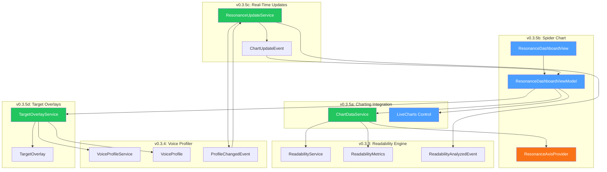
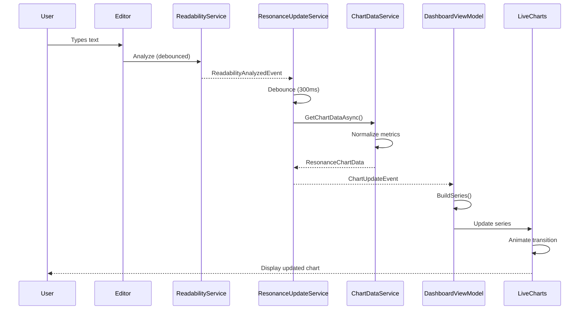
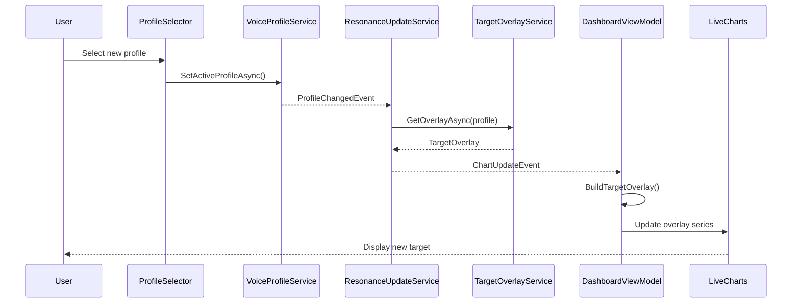

# LCS-DES-035: Design Specification Index — The Resonance Dashboard

## Document Control

| Field | Value |
| :--- | :--- |
| **Document ID** | LCS-DES-035-INDEX |
| **Feature ID** | STY-035 |
| **Feature Name** | The Resonance Dashboard (Visual Feedback) |
| **Target Version** | v0.3.5 |
| **Module Scope** | Lexichord.Modules.Style |
| **Swimlane** | Governance |
| **License Tier** | Writer Pro |
| **Feature Gate Key** | `FeatureFlags.Style.ResonanceDashboard` |
| **Status** | Draft |
| **Last Updated** | 2026-01-26 |

---

## 1. Executive Summary

**v0.3.5** delivers the **Resonance Dashboard** — a visual feedback system that transforms metrics into insight. This release introduces spider/radar charts that map writing characteristics across multiple dimensions, enabling writers to see at a glance how their content aligns with their target Voice Profile.

### 1.1 The Problem

Writers receive numerical feedback (grade level 8.2, passive voice 15%) but struggle to interpret these numbers holistically. Multiple metrics displayed as separate values create cognitive load and make it difficult to understand overall writing "health" or compare current writing against target goals.

### 1.2 The Solution

Implement a Resonance Dashboard that:

- **Integrates a Charting Library** (LiveCharts2) for Avalonia UI
- **Renders Spider Charts** with 6 configurable axes
- **Updates in Real-Time** via observable streams as analysis completes
- **Displays Target Overlays** showing Voice Profile constraints as visual goals

### 1.3 Business Value

| Value | Description |
| :--- | :--- |
| **Visual Insight** | Transform raw numbers into intuitive visual shapes |
| **At-a-Glance Assessment** | Understand writing quality without parsing numbers |
| **Goal Comparison** | See how current writing compares to profile targets |
| **Real-Time Feedback** | Watch the chart evolve as you write |
| **Professional Polish** | Premium visualization differentiates Writer Pro tier |
| **Foundation** | Enables future trend analysis and comparison features |

---

## 2. Related Documents

### 2.1 Scope Breakdown Document

The detailed scope breakdown for v0.3.5, including all sub-parts, implementation checklists, user stories, and acceptance criteria:

| Document | Description |
| :--- | :--- |
| **[LCS-SBD-035](./LCS-SBD-035.md)** | Scope Breakdown — The Resonance Dashboard |

### 2.2 Sub-Part Design Specifications

Each sub-part has its own detailed design specification following the LDS-01 template:

| Sub-Part | Document | Title | Description |
| :--- | :--- | :--- | :--- |
| v0.3.5a | **[LCS-DES-035a](./LCS-DES-035a.md)** | Charting Integration | LiveCharts2 setup and IChartDataService |
| v0.3.5b | **[LCS-DES-035b](./LCS-DES-035b.md)** | Spider Chart | Radar chart with 6 axes and normalization |
| v0.3.5c | **[LCS-DES-035c](./LCS-DES-035c.md)** | Real-Time Updates | Reactive update pipeline with debouncing |
| v0.3.5d | **[LCS-DES-035d](./LCS-DES-035d.md)** | Target Overlays | Profile constraint visualization |

---

## 3. Architecture Overview

### 3.1 Component Diagram



### 3.2 Data Flow



### 3.3 Profile Change Flow



---

## 4. Dependencies

### 4.1 Upstream Dependencies (Required)

| Interface | Source Version | Purpose |
| :--- | :--- | :--- |
| `IVoiceProfileService` | v0.3.4a | Get active profile for target overlay |
| `VoiceProfile` | v0.3.4a | Profile constraints for visualization |
| `ProfileChangedEvent` | v0.3.4a | Trigger overlay re-render |
| `VoiceAnalysisResult` | v0.3.4 | Passive voice %, weak word counts |
| `IReadabilityService` | v0.3.3c | Current readability metrics |
| `ReadabilityMetrics` | v0.3.3c | Grade level, reading ease scores |
| `ReadabilityAnalyzedEvent` | v0.3.3c | Trigger chart update |
| `ISentenceTokenizer` | v0.3.3a | Sentence metrics for flow axis |
| `ILicenseContext` | v0.0.4c | License tier checking |
| `ViewModelBase` | v0.1.1 | MVVM base class |

### 4.2 NuGet Packages

| Package | Version | Purpose |
| :--- | :--- | :--- |
| `LiveChartsCore.SkiaSharpView.Avalonia` | 2.x | Avalonia chart control |
| `LiveChartsCore` | 2.x | Core charting abstractions |
| `SkiaSharp` | 2.88.x | Cross-platform rendering |
| `System.Reactive` | 6.x | Observable update streams |
| `MediatR` | 12.x | Event publishing/handling |
| `CommunityToolkit.Mvvm` | 8.x | MVVM source generators |

### 4.3 Downstream Consumers (Future)

| Version | Feature | Consumes |
| :--- | :--- | :--- |
| v0.3.6 | Global Dictionary | `IChartDataService` for project-level dashboards |
| v0.4.x | Trend Analysis | `ResonanceChartData` history for trends |
| v0.4.x | Document Comparison | `IResonanceAxisProvider` for multi-doc charts |

---

## 5. License Gating Strategy

The Resonance Dashboard is a **Writer Pro** feature using a **Soft Gate** strategy.

### 5.1 Behavior by License Tier

| Tier | Dashboard Access | Chart Display | Target Overlay |
| :--- | :--- | :--- | :--- |
| Core | Blurred + upgrade prompt | Hidden | Hidden |
| Writer Pro | Full access | 6-axis spider chart | Built-in profiles |
| Teams | Full access | 6-axis spider chart | All profiles |
| Enterprise | Full access | 6-axis spider chart | All profiles |

### 5.2 Implementation Pattern

```csharp
// In ResonanceDashboardViewModel
public async Task InitializeAsync()
{
    IsLicensed = _licenseContext.HasFeature(
        FeatureFlags.Style.ResonanceDashboard);

    if (!IsLicensed)
    {
        _logger.LogDebug("Resonance Dashboard not available: license required");
        ShowUpgradePrompt = true;
        return;
    }

    await RefreshChartAsync();
}

// In ResonanceUpdateService
public void Receive(ReadabilityAnalyzedEvent message)
{
    if (!_licenseContext.HasFeature(FeatureFlags.Style.ResonanceDashboard))
    {
        return; // Skip updates for unlicensed users
    }

    _updateSubject.OnNext(message);
}
```

---

## 6. Spider Chart Axes

### 6.1 Standard Axis Configuration

| Axis | Source Metric | Normalization | Good Direction | Description |
| :--- | :--- | :--- | :--- | :--- |
| **Readability** | Flesch Reading Ease | Direct (0-100) | Higher | How easy the text is to read |
| **Clarity** | Passive voice % | Inverse (100 - x) | Higher | How direct and active the writing is |
| **Precision** | Weak word count | Inverse (capped) | Higher | How strong word choices are |
| **Flow** | Sentence variance | Target-centered | Middle | How varied sentence lengths are |
| **Accessibility** | Grade level | Inverse (scaled) | Higher | How accessible to general audience |
| **Density** | Words per sentence | Target-centered | Profile target | How concise sentences are |

### 6.2 Normalization Formulas

| Axis | Formula | Example |
| :--- | :--- | :--- |
| Readability | `value` (already 0-100) | 72.4 → 72.4 |
| Clarity | `100 - passivePercent` | 15% passive → 85 |
| Precision | `100 - min(weakWords × 2, 100)` | 10 weak words → 80 |
| Accessibility | `100 - (gradeLevel × 5)` capped | Grade 8 → 60 |
| Density | `100 - |target - actual| × 6.67` | Target 15, actual 18 → 80 |
| Flow | `100 - |targetVar - actualVar| × scale` | Computed from variance |

---

## 7. Key Interfaces Summary

| Interface | Defined In | Purpose |
| :--- | :--- | :--- |
| `IChartDataService` | v0.3.5a | Provides normalized data for chart |
| `IResonanceAxisProvider` | v0.3.5b | Configures spider chart axes |
| `IResonanceUpdateService` | v0.3.5c | Manages reactive update subscriptions |
| `ITargetOverlayService` | v0.3.5d | Maps profile constraints to overlay |

| Record/DTO | Defined In | Purpose |
| :--- | :--- | :--- |
| `ResonanceAxisDefinition` | v0.3.5b | Single axis configuration |
| `ResonanceDataPoint` | v0.3.5b | Normalized axis value |
| `ResonanceChartData` | v0.3.5b | Complete chart data |
| `TargetOverlay` | v0.3.5d | Profile target visualization |
| `ChartUpdateEvent` | v0.3.5c | MediatR notification |

---

## 8. Implementation Checklist Summary

| Sub-Part | Tasks | Est. Hours |
| :--- | :--- | :--- |
| v0.3.5a | Charting Integration | 12.5 |
| v0.3.5b | Spider Chart | 18.5 |
| v0.3.5c | Real-Time Updates | 16.5 |
| v0.3.5d | Target Overlays | 15.5 |
| Integration | DI, wiring, E2E tests | 5 |
| **Total** | | **68 hours** |

See [LCS-SBD-035](./LCS-SBD-035.md) Section 4 for the detailed task breakdown.

---

## 9. Success Criteria Summary

| Category | Criterion | Target |
| :--- | :--- | :--- |
| **Performance** | Chart render time | < 50ms |
| **Performance** | Update latency | < 200ms after analysis |
| **Performance** | Memory overhead | < 5MB for chart |
| **Performance** | Animation frame rate | 60fps |
| **UX** | User comprehension | 80%+ understand chart |
| **Accessibility** | WCAG compliance | 2.1 AA |

See [LCS-SBD-035](./LCS-SBD-035.md) Section 1.4 for full success metrics.

---

## 10. Test Coverage Summary

| Sub-Part | Unit Tests | Integration Tests |
| :--- | :--- | :--- |
| v0.3.5a | ChartDataService caching | Chart rendering |
| v0.3.5b | Axis normalization | Polygon rendering |
| v0.3.5c | Debouncing, event handling | End-to-end update flow |
| v0.3.5d | Profile-to-overlay mapping | Overlay rendering |

See individual design specs for detailed test scenarios.

---

## 11. What This Enables

| Version | Feature | Uses From v0.3.5 |
| :--- | :--- | :--- |
| v0.3.6 | Global Dictionary | Project-level dashboard configuration |
| v0.4.x | Trend Analysis | Historical chart data for trends |
| v0.4.x | Document Comparison | Side-by-side chart comparison |
| v0.4.x | Export Features | Chart-to-image export |

---

## Document History

| Version | Date | Author | Changes |
| :--- | :--- | :--- | :--- |
| 1.0 | 2026-01-26 | Lead Architect | Initial draft |
