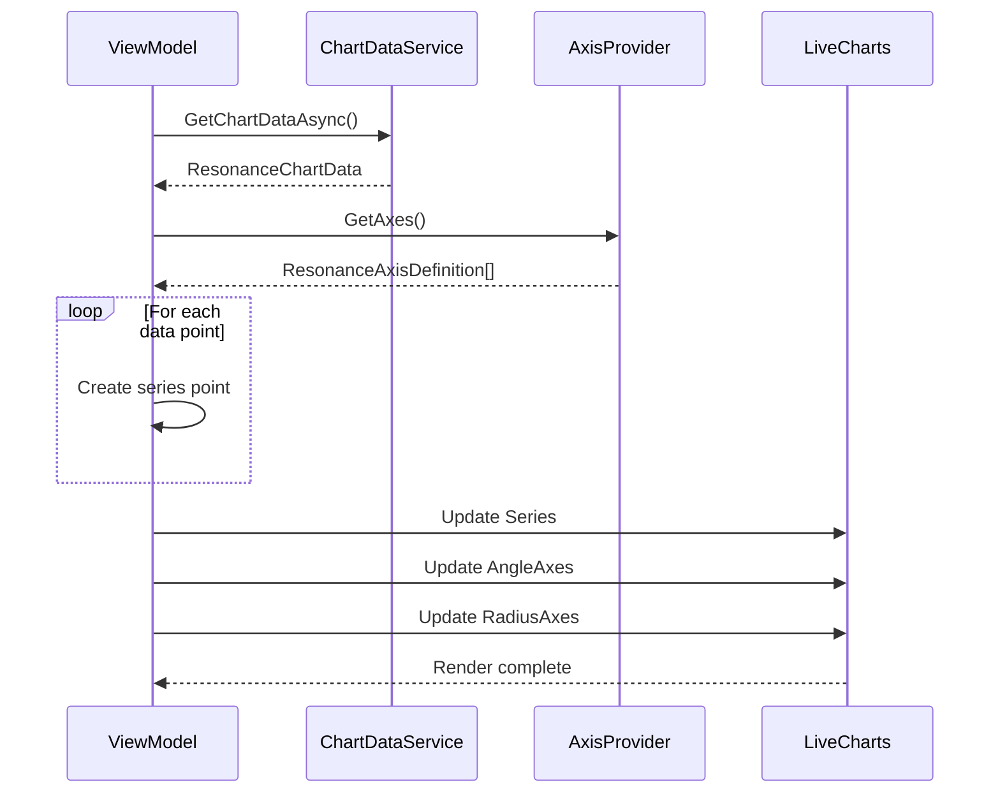

# LCS-DES-035b: Design Specification — Spider Chart

## 1. Metadata & Categorization

| Field                | Value                                                      |
| :------------------- | :--------------------------------------------------------- |
| **Document ID**      | LCS-DES-035b                                               |
| **Feature ID**       | STY-035b                                                   |
| **Feature Name**     | Spider Chart with Configurable Axes                        |
| **Target Version**   | v0.3.5b                                                    |
| **Module Scope**     | Lexichord.Modules.Style                                    |
| **Swimlane**         | Governance                                                 |
| **License Tier**     | Writer Pro                                                 |
| **Feature Gate Key** | `FeatureFlags.Style.ResonanceDashboard`                    |
| **Status**           | Draft                                                      |
| **Last Updated**     | 2026-01-26                                                 |
| **Parent Document**  | [LCS-DES-035-INDEX](./LCS-DES-035-INDEX.md)                |
| **Scope Breakdown**  | [LCS-SBD-035 §3.2](./LCS-SBD-035.md#32-v035b-spider-chart) |

---

## 2. Executive Summary

### 2.1 The Requirement

The Resonance Dashboard needs a spider/radar chart that visualizes writing metrics across multiple dimensions. Each axis represents a different aspect of writing quality, with values normalized to a 0-100 scale for consistent visualization.

> **Core Need:** Provide an intuitive visual representation of writing quality across 6 dimensions.

### 2.2 The Proposed Solution

Implement:

1. **`ResonanceAxisDefinition`** — Configurable axis with normalization logic
2. **`IResonanceAxisProvider`** — Service providing standard axis configurations
3. **`ResonanceDashboardView`** — AXAML view with LiveCharts PolarChart
4. **`ResonanceDashboardViewModel`** — MVVM ViewModel managing chart state
5. **Axis Normalization** — Algorithms to convert raw metrics to 0-100 scale
6. **Tooltips** — Hover display showing raw metric values

---

## 3. Architecture & Modular Strategy

### 3.1 Dependencies

#### 3.1.1 Upstream Dependencies

| Interface            | Source Version        | Purpose                                    |
| :------------------- | :-------------------- | :----------------------------------------- |
| `IChartDataService`  | v0.3.5a               | Normalized chart data                      |
| `ResonanceChartData` | v0.3.5a               | Data structure for chart                   |
| `ILicenseContext`    | v0.0.4c               | License verification                       |
| `ViewModelBase`      | CommunityToolkit.Mvvm | Observable ViewModel base (external NuGet) |

#### 3.1.2 NuGet Packages

| Package                                 | Version | Purpose                          |
| :-------------------------------------- | :------ | :------------------------------- |
| `LiveChartsCore.SkiaSharpView.Avalonia` | 2.x     | PolarChart control               |
| `CommunityToolkit.Mvvm`                 | 8.x     | ObservableProperty, RelayCommand |

### 3.2 Licensing Behavior

Chart only renders for Writer Pro+ users. Core users see an upgrade prompt overlay.

---

## 4. Data Contract (The API)

### 4.1 ResonanceAxisDefinition Record

```csharp
namespace Lexichord.Abstractions.Contracts;

/// <summary>
/// Defines a single axis on the Resonance spider chart.
/// </summary>
/// <remarks>
/// <para>Each axis represents one dimension of writing quality.</para>
/// <para>Normalization converts raw metric values to 0-100 scale.</para>
/// </remarks>
public record ResonanceAxisDefinition
{
    /// <summary>
    /// Display name shown on the chart axis.
    /// </summary>
    public required string Name { get; init; }

    /// <summary>
    /// Brief description shown in tooltips.
    /// </summary>
    public string? Description { get; init; }

    /// <summary>
    /// Unit of measurement for raw values (e.g., "%", "grade", "words").
    /// </summary>
    public string? Unit { get; init; }

    /// <summary>
    /// How the raw value should be normalized to 0-100.
    /// </summary>
    public NormalizationType NormalizationType { get; init; }

    /// <summary>
    /// For Direct/Inverse: the maximum raw value that maps to 100 (or 0 for inverse).
    /// </summary>
    public double MaxValue { get; init; } = 100;

    /// <summary>
    /// For TargetCentered: the optimal raw value (maps to 100).
    /// </summary>
    public double? TargetValue { get; init; }

    /// <summary>
    /// For TargetCentered: how much deviation from target equals 0.
    /// </summary>
    public double? MaxDeviation { get; init; }

    /// <summary>
    /// Sort order for axis positioning (clockwise from top).
    /// </summary>
    public int SortOrder { get; init; }

    /// <summary>
    /// Normalizes a raw metric value to 0-100 based on this axis configuration.
    /// </summary>
    /// <param name="rawValue">The raw metric value.</param>
    /// <returns>Normalized value clamped to 0-100.</returns>
    public double Normalize(double rawValue)
    {
        var normalized = NormalizationType switch
        {
            NormalizationType.Direct =>
                (rawValue / MaxValue) * 100,

            NormalizationType.Inverse =>
                100 - ((rawValue / MaxValue) * 100),

            NormalizationType.TargetCentered when TargetValue.HasValue && MaxDeviation.HasValue =>
                100 - (Math.Abs(TargetValue.Value - rawValue) / MaxDeviation.Value * 100),

            _ => rawValue
        };

        return Math.Clamp(normalized, 0, 100);
    }

    /// <summary>
    /// Reverses normalization to get the raw value from a normalized value.
    /// Useful for displaying target values.
    /// </summary>
    public double Denormalize(double normalizedValue)
    {
        return NormalizationType switch
        {
            NormalizationType.Direct =>
                (normalizedValue / 100) * MaxValue,

            NormalizationType.Inverse =>
                ((100 - normalizedValue) / 100) * MaxValue,

            NormalizationType.TargetCentered when TargetValue.HasValue =>
                TargetValue.Value, // Target-centered always returns target

            _ => normalizedValue
        };
    }
}

/// <summary>
/// How raw values are converted to normalized 0-100 scale.
/// </summary>
public enum NormalizationType
{
    /// <summary>
    /// Higher raw value = higher normalized value.
    /// Example: Flesch Reading Ease (0-100 maps directly).
    /// </summary>
    Direct,

    /// <summary>
    /// Lower raw value = higher normalized value.
    /// Example: Passive voice % (0% = 100 normalized, 100% = 0 normalized).
    /// </summary>
    Inverse,

    /// <summary>
    /// Values closer to target = higher normalized value.
    /// Example: Sentence length (target 15 words, deviation reduces score).
    /// </summary>
    TargetCentered
}
```

### 4.2 IResonanceAxisProvider Interface

```csharp
namespace Lexichord.Abstractions.Contracts;

/// <summary>
/// Provides axis configurations for the Resonance spider chart.
/// </summary>
public interface IResonanceAxisProvider
{
    /// <summary>
    /// Gets all axis definitions in display order (clockwise from top).
    /// </summary>
    /// <returns>Ordered list of axis definitions.</returns>
    IReadOnlyList<ResonanceAxisDefinition> GetAxes();

    /// <summary>
    /// Gets an axis by name.
    /// </summary>
    /// <param name="name">The axis name.</param>
    /// <returns>The axis definition, or null if not found.</returns>
    ResonanceAxisDefinition? GetAxis(string name);

    /// <summary>
    /// Creates axis configurations tuned to a specific Voice Profile.
    /// </summary>
    /// <param name="profile">The Voice Profile to tune for.</param>
    /// <returns>Axes with profile-specific targets.</returns>
    IReadOnlyList<ResonanceAxisDefinition> GetAxesForProfile(VoiceProfile profile);
}
```

---

## 5. Implementation Logic

### 5.1 Standard Axis Definitions

```csharp
namespace Lexichord.Modules.Style.Services;

/// <summary>
/// Provides the default 6 axes for the Resonance spider chart.
/// </summary>
public sealed class DefaultAxisProvider : IResonanceAxisProvider
{
    private static readonly IReadOnlyList<ResonanceAxisDefinition> StandardAxes =
    [
        new ResonanceAxisDefinition
        {
            Name = "Readability",
            Description = "Flesch Reading Ease (0-100, higher = easier to read)",
            Unit = "score",
            NormalizationType = NormalizationType.Direct,
            MaxValue = 100,
            SortOrder = 1
        },
        new ResonanceAxisDefinition
        {
            Name = "Clarity",
            Description = "Inverse of passive voice (less passive = more clear)",
            Unit = "%",
            NormalizationType = NormalizationType.Inverse,
            MaxValue = 100,
            SortOrder = 2
        },
        new ResonanceAxisDefinition
        {
            Name = "Precision",
            Description = "Inverse of weak word density (fewer weak words = more precise)",
            Unit = "count",
            NormalizationType = NormalizationType.Inverse,
            MaxValue = 50, // 50+ weak words = 0 precision
            SortOrder = 3
        },
        new ResonanceAxisDefinition
        {
            Name = "Flow",
            Description = "Sentence length variety (balanced variation is best)",
            Unit = "variance",
            NormalizationType = NormalizationType.TargetCentered,
            TargetValue = 15, // Optimal variance
            MaxDeviation = 30,
            SortOrder = 4
        },
        new ResonanceAxisDefinition
        {
            Name = "Accessibility",
            Description = "Inverse of grade level (lower grade = more accessible)",
            Unit = "grade",
            NormalizationType = NormalizationType.Inverse,
            MaxValue = 20, // Grade 20 = 0 accessibility
            SortOrder = 5
        },
        new ResonanceAxisDefinition
        {
            Name = "Density",
            Description = "Words per sentence (optimal varies by profile)",
            Unit = "words/sentence",
            NormalizationType = NormalizationType.TargetCentered,
            TargetValue = 15, // Default target
            MaxDeviation = 15,
            SortOrder = 6
        }
    ];

    public IReadOnlyList<ResonanceAxisDefinition> GetAxes() => StandardAxes;

    public ResonanceAxisDefinition? GetAxis(string name) =>
        StandardAxes.FirstOrDefault(a =>
            a.Name.Equals(name, StringComparison.OrdinalIgnoreCase));

    public IReadOnlyList<ResonanceAxisDefinition> GetAxesForProfile(VoiceProfile profile)
    {
        // Clone axes with profile-specific targets
        return StandardAxes.Select(axis => axis.Name switch
        {
            "Density" => axis with
            {
                TargetValue = profile.MaxSentenceLength * 0.6, // 60% of max
                Description = $"Words per sentence (target: {profile.MaxSentenceLength * 0.6:0})"
            },
            "Clarity" when !profile.AllowPassiveVoice => axis with
            {
                Description = "Passive voice is forbidden in this profile"
            },
            _ => axis
        }).ToList().AsReadOnly();
    }
}
```

### 5.2 Normalization Examples

| Axis          | Raw Value               | Normalization                 | Result |
| :------------ | :---------------------- | :---------------------------- | :----- | ---------- | ---- |
| Readability   | 72.4                    | Direct: 72.4/100 × 100        | 72.4   |
| Clarity       | 15% passive             | Inverse: 100 - 15             | 85.0   |
| Precision     | 8 weak words            | Inverse: 100 - (8/50 × 100)   | 84.0   |
| Accessibility | Grade 8.2               | Inverse: 100 - (8.2/20 × 100) | 59.0   |
| Density       | 18 words (target 15)    | Target: 100 - (               | 15-18  | /15 × 100) | 80.0 |
| Flow          | Variance 12 (target 15) | Target: 100 - (               | 15-12  | /30 × 100) | 90.0 |

### 5.3 Algorithm Flow

```mermaid
flowchart TD
    A[Raw Metric Value] --> B{Normalization Type}

    B -->|Direct| C[value / maxValue × 100]
    B -->|Inverse| D[100 - value / maxValue × 100]
    B -->|TargetCentered| E[100 - |target - value| / maxDev × 100]

    C --> F[Clamp 0-100]
    D --> F
    E --> F

    F --> G[Normalized Value]
```

---

## 6. UI/UX Specifications

### 6.1 ResonanceDashboardView

```xml
<!-- ResonanceDashboardView.axaml -->
<UserControl xmlns="https://github.com/avaloniaui"
             xmlns:x="http://schemas.microsoft.com/winfx/2006/xaml"
             xmlns:lvc="using:LiveChartsCore.SkiaSharpView.Avalonia"
             xmlns:vm="using:Lexichord.Modules.Style.ViewModels"
             x:Class="Lexichord.Modules.Style.Views.ResonanceDashboardView"
             x:DataType="vm:ResonanceDashboardViewModel">

    <Design.DataContext>
        <vm:ResonanceDashboardViewModel />
    </Design.DataContext>

    <Grid RowDefinitions="Auto,*,Auto">
        <!-- Header -->
        <Border Grid.Row="0"
                Padding="12,8"
                Background="{DynamicResource CardBackgroundFillColorDefaultBrush}"
                BorderBrush="{DynamicResource CardStrokeColorDefaultBrush}"
                BorderThickness="0,0,0,1">
            <Grid ColumnDefinitions="*,Auto">
                <StackPanel Orientation="Horizontal" Spacing="8">
                    <TextBlock Text="Resonance Dashboard"
                               FontWeight="SemiBold"
                               FontSize="14"
                               VerticalAlignment="Center" />
                    <TextBlock Text="{Binding ActiveProfileName, StringFormat='({0})'}"
                               Foreground="{DynamicResource TextFillColorSecondaryBrush}"
                               VerticalAlignment="Center" />
                </StackPanel>

                <ToggleButton Grid.Column="1"
                              IsChecked="{Binding ShowTargetOverlay}"
                              ToolTip.Tip="Toggle target overlay">
                    <PathIcon Data="{StaticResource TargetIcon}" Width="16" Height="16" />
                </ToggleButton>
            </Grid>
        </Border>

        <!-- Chart Area -->
        <Grid Grid.Row="1" Margin="12">
            <!-- Loading State -->
            <Border IsVisible="{Binding IsLoading}"
                    Background="{DynamicResource LayerFillColorDefaultBrush}"
                    CornerRadius="8">
                <StackPanel HorizontalAlignment="Center"
                            VerticalAlignment="Center">
                    <ProgressRing IsIndeterminate="True" Width="32" Height="32" />
                    <TextBlock Text="Analyzing..."
                               Margin="0,8,0,0"
                               Foreground="{DynamicResource TextFillColorSecondaryBrush}" />
                </StackPanel>
            </Border>

            <!-- Upgrade Prompt (Core users) -->
            <Border IsVisible="{Binding !IsLicensed}"
                    Background="{DynamicResource LayerFillColorDefaultBrush}"
                    CornerRadius="8">
                <StackPanel HorizontalAlignment="Center"
                            VerticalAlignment="Center"
                            Spacing="12">
                    <PathIcon Data="{StaticResource SparkleIcon}"
                              Width="48" Height="48"
                              Foreground="{DynamicResource AccentFillColorDefaultBrush}" />
                    <TextBlock Text="Visual Writing Insights"
                               FontWeight="SemiBold"
                               FontSize="16"
                               HorizontalAlignment="Center" />
                    <TextBlock Text="See your writing quality at a glance"
                               Foreground="{DynamicResource TextFillColorSecondaryBrush}"
                               HorizontalAlignment="Center" />
                    <Button Content="Upgrade to Writer Pro"
                            Classes="accent"
                            HorizontalAlignment="Center"
                            Command="{Binding UpgradeCommand}" />
                </StackPanel>
            </Border>

            <!-- Spider Chart -->
            <lvc:PolarChart IsVisible="{Binding CanShowChart}"
                            Series="{Binding Series}"
                            AngleAxes="{Binding AngleAxes}"
                            RadiusAxes="{Binding RadiusAxes}"
                            InitialRotation="-90"
                            AnimationsSpeed="00:00:00.300"
                            EasingFunction="{x:Static lvc:EasingFunctions.QuadraticOut}"
                            TooltipPosition="Center"
                            LegendPosition="Bottom" />
        </Grid>

        <!-- Footer with raw values -->
        <Border Grid.Row="2"
                Padding="12,8"
                Background="{DynamicResource CardBackgroundFillColorDefaultBrush}"
                BorderBrush="{DynamicResource CardStrokeColorDefaultBrush}"
                BorderThickness="0,1,0,0"
                IsVisible="{Binding CanShowChart}">
            <ItemsControl ItemsSource="{Binding SummaryMetrics}">
                <ItemsControl.ItemsPanel>
                    <ItemsPanelTemplate>
                        <WrapPanel Orientation="Horizontal" />
                    </ItemsPanelTemplate>
                </ItemsControl.ItemsPanel>
                <ItemsControl.ItemTemplate>
                    <DataTemplate>
                        <Border Margin="0,0,16,0">
                            <StackPanel Orientation="Horizontal" Spacing="4">
                                <TextBlock Text="{Binding Label}"
                                           Foreground="{DynamicResource TextFillColorSecondaryBrush}"
                                           FontSize="12" />
                                <TextBlock Text="{Binding Value}"
                                           FontWeight="SemiBold"
                                           FontSize="12" />
                            </StackPanel>
                        </Border>
                    </DataTemplate>
                </ItemsControl.ItemTemplate>
            </ItemsControl>
        </Border>
    </Grid>
</UserControl>
```

### 6.2 Visual Layout

```
┌─────────────────────────────────────────────────────────────┐
│ Resonance Dashboard (Technical)                      [◎]    │
├─────────────────────────────────────────────────────────────┤
│                                                             │
│                    ◆ Readability (72)                       │
│                   ╱ ╲                                       │
│                  ╱   ╲                                      │
│   Accessibility ◆─────◆ Clarity (85)                        │
│      (59)       │╲   ╱│                                     │
│                 │ ╲ ╱ │                                     │
│      Density ◆──┼──╳──┼──◆ Precision (84)                   │
│       (80)      │ ╱ ╲ │                                     │
│                 │╱   ╲│                                     │
│                 ◆─────◆                                     │
│                Flow (90)                                    │
│                                                             │
│  ─── Current   ┄┄┄ Target                                   │
│                                                             │
├─────────────────────────────────────────────────────────────┤
│ Grade: 8.2  |  Reading Ease: 72.4  |  Passive: 15%         │
└─────────────────────────────────────────────────────────────┘
```

### 6.3 Tooltip Design

When hovering over an axis point:

```
┌─────────────────────────┐
│ Clarity                 │
│ Current: 85             │
│ Target: 100             │
│ ─────────────────────   │
│ Passive Voice: 15%      │
│ (Profile forbids        │
│  passive voice)         │
└─────────────────────────┘
```

---

## 7. Decision Trees

### 7.1 Axis Value Lookup

```text
INPUT: Axis name, ReadabilityMetrics, VoiceAnalysisResult
OUTPUT: Raw metric value

DECISION TREE:
┌─ Axis name?
│
├─ "Readability" → metrics.FleschReadingEase
│
├─ "Clarity" → voiceResult.PassiveVoicePercentage
│
├─ "Precision" → voiceResult.WeakWordCount
│
├─ "Accessibility" → metrics.FleschKincaidGrade
│
├─ "Density" → metrics.AverageWordsPerSentence
│
├─ "Flow" → metrics.SentenceLengthVariance
│
└─ Unknown → 0 (with warning log)
```

---

## 8. User Stories

| ID         | As a... | I want to...                     | So that...                       | Priority |
| :--------- | :------ | :------------------------------- | :------------------------------- | :------- |
| US-035b-01 | Writer  | See a spider chart of my writing | I understand quality at a glance | P0       |
| US-035b-02 | Writer  | See 6 labeled axes               | I know what each dimension means | P0       |
| US-035b-03 | Writer  | Hover to see raw values          | I understand the actual metrics  | P1       |
| US-035b-04 | Writer  | See values normalized 0-100      | Easy to compare dimensions       | P0       |
| US-035b-05 | Writer  | See smooth polygon fill          | Chart looks professional         | P1       |

---

## 9. Use Cases

### 9.1 UC-035b-01: View Spider Chart

**Actor:** Writer with Writer Pro license

**Preconditions:**

- Document is open and analyzed
- Resonance Dashboard is visible

**Main Flow:**

1. System retrieves latest chart data from ChartDataService
2. System maps data points to LiveCharts series
3. System configures 6 angle axes with labels
4. LiveCharts renders spider chart polygon
5. User sees visual representation of writing quality

**Postconditions:**

- Spider chart displays with 6 axes
- Each axis shows normalized value (0-100)
- Polygon fills the area under the line

---

## 10. Unit Testing Requirements

### 10.1 Axis Normalization Tests

```csharp
[Trait("Category", "Unit")]
[Trait("Feature", "v0.3.5b")]
public class ResonanceAxisDefinitionTests
{
    [Theory]
    [InlineData(100, 100)]
    [InlineData(50, 50)]
    [InlineData(0, 0)]
    [InlineData(150, 100)] // Clamped
    [InlineData(-10, 0)]   // Clamped
    public void Normalize_Direct_MapsCorrectly(double rawValue, double expected)
    {
        var axis = new ResonanceAxisDefinition
        {
            Name = "Test",
            NormalizationType = NormalizationType.Direct,
            MaxValue = 100
        };

        var result = axis.Normalize(rawValue);

        result.Should().BeApproximately(expected, 0.01);
    }

    [Theory]
    [InlineData(0, 100)]   // No passive = perfect clarity
    [InlineData(50, 50)]   // 50% passive = 50 clarity
    [InlineData(100, 0)]   // All passive = 0 clarity
    public void Normalize_Inverse_MapsCorrectly(double rawValue, double expected)
    {
        var axis = new ResonanceAxisDefinition
        {
            Name = "Clarity",
            NormalizationType = NormalizationType.Inverse,
            MaxValue = 100
        };

        var result = axis.Normalize(rawValue);

        result.Should().BeApproximately(expected, 0.01);
    }

    [Theory]
    [InlineData(15, 100)]  // At target = perfect
    [InlineData(0, 50)]    // 15 away = 50%
    [InlineData(30, 50)]   // 15 away = 50%
    [InlineData(-15, 0)]   // 30 away = 0
    public void Normalize_TargetCentered_MapsCorrectly(
        double rawValue, double expected)
    {
        var axis = new ResonanceAxisDefinition
        {
            Name = "Density",
            NormalizationType = NormalizationType.TargetCentered,
            TargetValue = 15,
            MaxDeviation = 30
        };

        var result = axis.Normalize(rawValue);

        result.Should().BeApproximately(expected, 0.01);
    }
}
```

### 10.2 DefaultAxisProvider Tests

```csharp
[Trait("Category", "Unit")]
[Trait("Feature", "v0.3.5b")]
public class DefaultAxisProviderTests
{
    private readonly DefaultAxisProvider _sut = new();

    [Fact]
    public void GetAxes_ReturnsSixAxes()
    {
        var axes = _sut.GetAxes();

        axes.Should().HaveCount(6);
    }

    [Fact]
    public void GetAxes_ReturnsOrderedBySortOrder()
    {
        var axes = _sut.GetAxes();

        axes.Should().BeInAscendingOrder(a => a.SortOrder);
    }

    [Fact]
    public void GetAxes_ContainsExpectedNames()
    {
        var axes = _sut.GetAxes();
        var names = axes.Select(a => a.Name).ToList();

        names.Should().Contain("Readability");
        names.Should().Contain("Clarity");
        names.Should().Contain("Precision");
        names.Should().Contain("Flow");
        names.Should().Contain("Accessibility");
        names.Should().Contain("Density");
    }

    [Theory]
    [InlineData("Readability")]
    [InlineData("readability")]
    [InlineData("READABILITY")]
    public void GetAxis_IsCaseInsensitive(string name)
    {
        var axis = _sut.GetAxis(name);

        axis.Should().NotBeNull();
        axis!.Name.Should().Be("Readability");
    }

    [Fact]
    public void GetAxis_UnknownName_ReturnsNull()
    {
        var axis = _sut.GetAxis("Unknown");

        axis.Should().BeNull();
    }

    [Fact]
    public void GetAxesForProfile_AdjustsDensityTarget()
    {
        var profile = new VoiceProfile
        {
            Id = Guid.NewGuid(),
            Name = "Test",
            MaxSentenceLength = 20
        };

        var axes = _sut.GetAxesForProfile(profile);
        var density = axes.First(a => a.Name == "Density");

        density.TargetValue.Should().Be(12); // 20 * 0.6
    }
}
```

### 10.3 ViewModel Tests

```csharp
[Trait("Category", "Unit")]
[Trait("Feature", "v0.3.5b")]
public class ResonanceDashboardViewModelTests
{
    [Fact]
    public async Task InitializeAsync_LoadsChartData()
    {
        var mockChartService = CreateMockChartService();
        var sut = CreateViewModel(chartService: mockChartService.Object);

        await sut.InitializeAsync();

        sut.Series.Should().NotBeEmpty();
        mockChartService.Verify(s => s.GetChartDataAsync(It.IsAny<CancellationToken>()));
    }

    [Fact]
    public async Task InitializeAsync_WhenNotLicensed_ShowsUpgradePrompt()
    {
        var mockLicense = CreateMockLicense(hasFeature: false);
        var sut = CreateViewModel(licenseContext: mockLicense.Object);

        await sut.InitializeAsync();

        sut.IsLicensed.Should().BeFalse();
        sut.CanShowChart.Should().BeFalse();
    }

    [Fact]
    public async Task ToggleTargetOverlay_UpdatesSeries()
    {
        var sut = CreateViewModel();
        await sut.InitializeAsync();
        var initialSeriesCount = sut.Series.Length;

        sut.ShowTargetOverlay = !sut.ShowTargetOverlay;

        // Series count should change (target overlay added/removed)
        sut.Series.Length.Should().NotBe(initialSeriesCount);
    }
}
```

---

## 11. Observability & Logging

| Level   | Message Template                                                          |
| :------ | :------------------------------------------------------------------------ |
| Debug   | `"Building spider chart with {AxisCount} axes"`                           |
| Debug   | `"Axis {AxisName}: normalized={NormalizedValue:0.0}, raw={RawValue:0.0}"` |
| Debug   | `"Chart series updated: {SeriesCount} series"`                            |
| Info    | `"Resonance Dashboard initialized for profile: {ProfileName}"`            |
| Warning | `"Unknown axis requested: {AxisName}"`                                    |
| Error   | `"Failed to build chart series: {Error}"`                                 |

---

## 12. Workflows

### 12.1 Chart Build Flow



---

## 13. Code Examples

### 13.1 ResonanceDashboardViewModel

```csharp
namespace Lexichord.Modules.Style.ViewModels;

/// <summary>
/// ViewModel for the Resonance Dashboard spider chart.
/// </summary>
public partial class ResonanceDashboardViewModel : ViewModelBase
{
    private readonly IChartDataService _chartDataService;
    private readonly IResonanceAxisProvider _axisProvider;
    private readonly ITargetOverlayService _overlayService;
    private readonly IVoiceProfileService _profileService;
    private readonly ILicenseContext _licenseContext;
    private readonly ILogger<ResonanceDashboardViewModel> _logger;

    [ObservableProperty]
    private bool _isLicensed;

    [ObservableProperty]
    private bool _isLoading;

    [ObservableProperty]
    [NotifyPropertyChangedFor(nameof(CanShowChart))]
    private bool _showTargetOverlay = true;

    [ObservableProperty]
    private string _activeProfileName = string.Empty;

    [ObservableProperty]
    private ISeries[] _series = [];

    [ObservableProperty]
    private PolarAxis[] _angleAxes = [];

    [ObservableProperty]
    private PolarAxis[] _radiusAxes = [];

    [ObservableProperty]
    private ObservableCollection<SummaryMetric> _summaryMetrics = [];

    public bool CanShowChart => IsLicensed && !IsLoading;

    public ResonanceDashboardViewModel(
        IChartDataService chartDataService,
        IResonanceAxisProvider axisProvider,
        ITargetOverlayService overlayService,
        IVoiceProfileService profileService,
        ILicenseContext licenseContext,
        ILogger<ResonanceDashboardViewModel> logger)
    {
        _chartDataService = chartDataService;
        _axisProvider = axisProvider;
        _overlayService = overlayService;
        _profileService = profileService;
        _licenseContext = licenseContext;
        _logger = logger;
    }

    public async Task InitializeAsync()
    {
        IsLicensed = _licenseContext.HasFeature(
            FeatureFlags.Style.ResonanceDashboard);

        if (!IsLicensed)
        {
            _logger.LogDebug("Resonance Dashboard requires Writer Pro license");
            return;
        }

        await RefreshAsync();
    }

    public async Task RefreshAsync()
    {
        if (!IsLicensed) return;

        IsLoading = true;

        try
        {
            var profile = await _profileService.GetActiveProfileAsync();
            ActiveProfileName = profile.Name;

            var chartData = await _chartDataService.GetChartDataAsync();

            _logger.LogDebug(
                "Building spider chart with {AxisCount} axes",
                chartData.DataPoints.Count);

            BuildSeries(chartData, profile);
            BuildAxes(chartData);
            UpdateSummaryMetrics(chartData);

            _logger.LogInfo(
                "Resonance Dashboard initialized for profile: {ProfileName}",
                profile.Name);
        }
        catch (Exception ex)
        {
            _logger.LogError(ex, "Failed to build chart series: {Error}", ex.Message);
        }
        finally
        {
            IsLoading = false;
        }
    }

    private void BuildSeries(ResonanceChartData chartData, VoiceProfile profile)
    {
        var seriesList = new List<ISeries>();

        // Current values series
        var currentSeries = new PolarLineSeries<double>
        {
            Values = chartData.GetNormalizedValues(),
            Name = "Current",
            LineSmoothness = 0,
            GeometrySize = 10,
            GeometryFill = new SolidColorPaint(SKColors.CornflowerBlue),
            GeometryStroke = new SolidColorPaint(SKColors.White, 2),
            Fill = new SolidColorPaint(SKColors.CornflowerBlue.WithAlpha(100)),
            Stroke = new SolidColorPaint(SKColors.CornflowerBlue, 2),
            IsClosed = true,
            DataLabelsPosition = PolarLabelsPosition.End,
            DataLabelsPaint = new SolidColorPaint(SKColors.Gray),
            DataLabelsFormatter = point => $"{point.PrimaryValue:0}"
        };
        seriesList.Add(currentSeries);

        // Target overlay series (if enabled)
        if (ShowTargetOverlay)
        {
            var overlay = _overlayService.GetOverlaySync(profile);
            if (overlay is not null)
            {
                var targetSeries = new PolarLineSeries<double>
                {
                    Values = overlay.DataPoints
                        .Select(p => p.NormalizedValue)
                        .ToArray(),
                    Name = $"Target ({profile.Name})",
                    LineSmoothness = 0,
                    GeometrySize = 0,
                    Fill = new SolidColorPaint(SKColors.LimeGreen.WithAlpha(50)),
                    Stroke = new SolidColorPaint(SKColors.LimeGreen, 1)
                    {
                        PathEffect = new DashEffect([5, 5])
                    },
                    IsClosed = true
                };
                seriesList.Add(targetSeries);
            }
        }

        Series = seriesList.ToArray();
    }

    private void BuildAxes(ResonanceChartData chartData)
    {
        AngleAxes =
        [
            new PolarAxis
            {
                Labels = chartData.GetAxisNames(),
                LabelsPaint = new SolidColorPaint(SKColors.Gray),
                LabelsRotation = LiveCharts.TangentAngle,
                MinStep = 1,
                ForceStepToMin = true
            }
        ];

        RadiusAxes =
        [
            new PolarAxis
            {
                Labeler = value => $"{value:0}",
                LabelsPaint = new SolidColorPaint(SKColors.Gray.WithAlpha(150)),
                MinLimit = 0,
                MaxLimit = 100,
                MinStep = 25,
                ForceStepToMin = true,
                SeparatorsPaint = new SolidColorPaint(SKColors.Gray.WithAlpha(50))
            }
        ];
    }

    private void UpdateSummaryMetrics(ResonanceChartData chartData)
    {
        SummaryMetrics.Clear();

        foreach (var point in chartData.DataPoints)
        {
            SummaryMetrics.Add(new SummaryMetric
            {
                Label = $"{point.AxisName}:",
                Value = point.Unit is not null
                    ? $"{point.RawValue:0.#} {point.Unit}"
                    : $"{point.RawValue:0.#}"
            });
        }
    }

    [RelayCommand]
    private async Task UpgradeAsync()
    {
        // Navigate to subscription page
        await Shell.Current.GoToAsync("//subscription");
    }

    partial void OnShowTargetOverlayChanged(bool value)
    {
        _ = RefreshAsync();
    }
}

public record SummaryMetric
{
    public required string Label { get; init; }
    public required string Value { get; init; }
}
```

---

## 14. Acceptance Criteria (QA)

| #   | Given                      | When                 | Then                       |
| :-- | :------------------------- | :------------------- | :------------------------- |
| 1   | Document analyzed          | Dashboard opens      | Spider chart displays      |
| 2   | 6 axes configured          | Chart renders        | All 6 labels visible       |
| 3   | Raw value 72.4 readability | Normalized           | Shows 72 on chart          |
| 4   | 15% passive voice          | Normalized (inverse) | Shows 85 clarity           |
| 5   | Hover over point           | Tooltip shown        | Displays raw value         |
| 6   | Target overlay enabled     | Chart renders        | Shows dashed green polygon |
| 7   | Core license               | Dashboard opens      | Shows upgrade prompt       |

---

## 15. Deliverable Checklist

| #   | Task                                    | Status |
| :-- | :-------------------------------------- | :----- |
| 1   | Create ResonanceAxisDefinition record   | [ ]    |
| 2   | Implement NormalizationType enum        | [ ]    |
| 3   | Create IResonanceAxisProvider interface | [ ]    |
| 4   | Implement DefaultAxisProvider           | [ ]    |
| 5   | Create ResonanceDashboardView.axaml     | [ ]    |
| 6   | Create ResonanceDashboardViewModel      | [ ]    |
| 7   | Wire up LiveCharts PolarChart           | [ ]    |
| 8   | Implement tooltip display               | [ ]    |
| 9   | Write unit tests for normalization      | [ ]    |
| 10  | Write unit tests for ViewModel          | [ ]    |

---

## 16. Verification Commands

```bash
# Run specific tests
dotnet test --filter "Feature=v0.3.5b"

# Test normalization specifically
dotnet test --filter "FullyQualifiedName~ResonanceAxisDefinitionTests"

# Build module
dotnet build Lexichord.Modules.Style
```

---

## 17. Changelog Entry

```markdown
### v0.3.5b — Spider Chart

#### Added

- `ResonanceAxisDefinition` with normalization types
- `IResonanceAxisProvider` for axis configuration
- `DefaultAxisProvider` with 6 standard axes
- `ResonanceDashboardView` with LiveCharts PolarChart
- `ResonanceDashboardViewModel` with MVVM bindings
- Tooltip display with raw metric values
```

---

## 18. Deferred Features

| Feature                   | Reason       | Target Version |
| :------------------------ | :----------- | :------------- |
| Custom axis configuration | Complexity   | v0.4.x         |
| 3D chart option           | Low priority | v0.4.x         |
| Animation customization   | Scope        | v0.4.x         |

---

## Document History

| Version | Date       | Author         | Changes       |
| :------ | :--------- | :------------- | :------------ |
| 1.0     | 2026-01-26 | Lead Architect | Initial draft |
