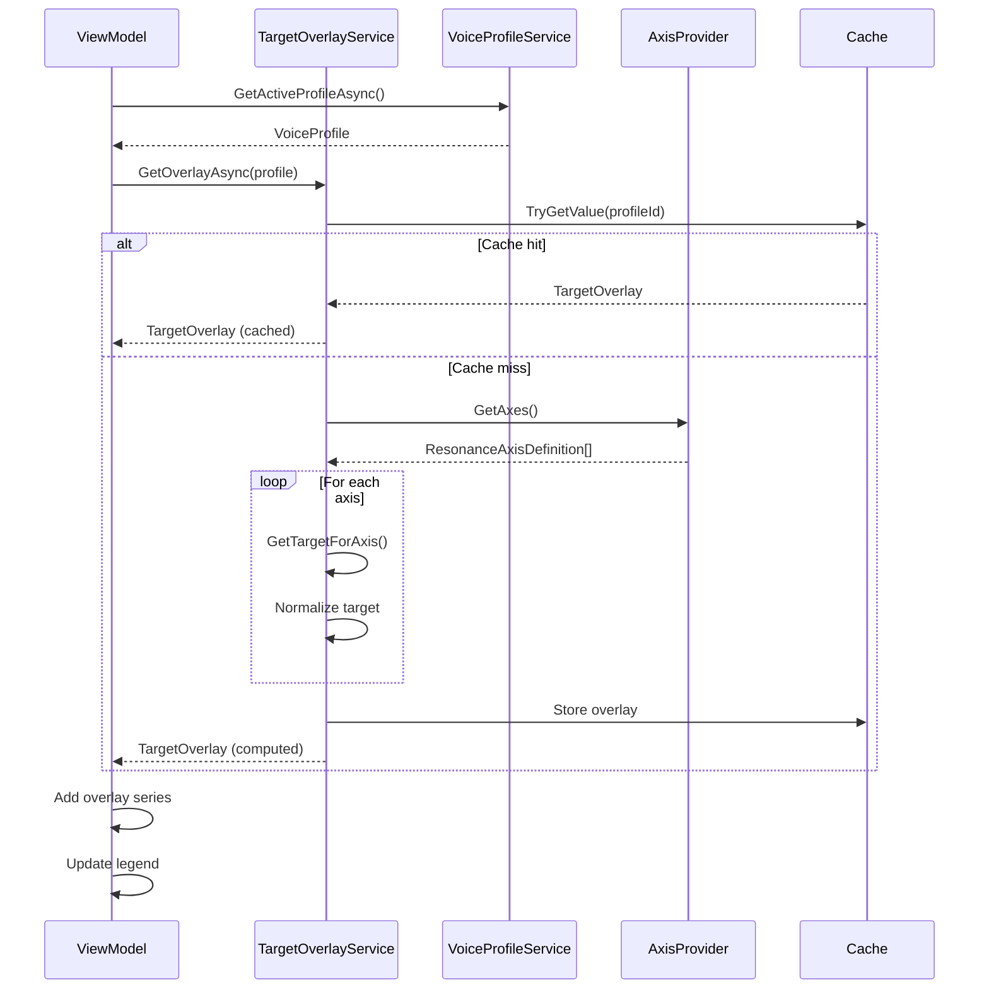

# LCS-DES-035d: Design Specification — Target Overlays

## 1. Metadata & Categorization

| Field | Value |
| :--- | :--- |
| **Document ID** | LCS-DES-035d |
| **Feature ID** | STY-035d |
| **Feature Name** | Voice Profile Target Overlays |
| **Target Version** | v0.3.5d |
| **Module Scope** | Lexichord.Modules.Style |
| **Swimlane** | Governance |
| **License Tier** | Writer Pro |
| **Feature Gate Key** | `FeatureFlags.Style.ResonanceDashboard` |
| **Status** | Draft |
| **Last Updated** | 2026-01-26 |
| **Parent Document** | [LCS-DES-035-INDEX](./LCS-DES-035-INDEX.md) |
| **Scope Breakdown** | [LCS-SBD-035 §3.4](./LCS-SBD-035.md#34-v035d-target-overlays) |

---

## 2. Executive Summary

### 2.1 The Requirement

Writers need to see how their current writing compares to their target Voice Profile constraints. The spider chart should display both current values and target values as overlapping polygons, making gaps immediately visible.

> **Core Need:** Visualize the difference between "where I am" and "where I want to be."

### 2.2 The Proposed Solution

Implement:

1. **`TargetOverlay`** — Data structure for profile target visualization
2. **`ITargetOverlayService`** — Maps VoiceProfile constraints to chart data
3. **Overlay Rendering** — Semi-transparent dashed polygon on spider chart
4. **Legend** — Distinguishes current values from target
5. **Toggle** — User can show/hide target overlay

---

## 3. Architecture & Modular Strategy

### 3.1 Dependencies

#### 3.1.1 Upstream Dependencies

| Interface | Source Version | Purpose |
| :--- | :--- | :--- |
| `IVoiceProfileService` | v0.3.4a | Get active profile |
| `VoiceProfile` | v0.3.4a | Profile constraint values |
| `ProfileChangedEvent` | v0.3.4a | Trigger overlay refresh |
| `IResonanceAxisProvider` | v0.3.5b | Axis definitions for normalization |
| `ResonanceAxisDefinition` | v0.3.5b | Normalization logic |

### 3.2 Licensing Behavior

Target overlays are only displayed for Writer Pro+ users. The overlay service returns null for unlicensed users.

---

## 4. Data Contract (The API)

### 4.1 TargetOverlay Record

```csharp
namespace Lexichord.Abstractions.Contracts;

/// <summary>
/// Visualization data for a Voice Profile's target constraints.
/// </summary>
/// <remarks>
/// <para>Maps profile constraints to spider chart axis values.</para>
/// <para>Rendered as a semi-transparent overlay polygon.</para>
/// </remarks>
public record TargetOverlay
{
    /// <summary>
    /// The Voice Profile this overlay represents.
    /// </summary>
    public required Guid ProfileId { get; init; }

    /// <summary>
    /// Display name of the profile (for legend).
    /// </summary>
    public required string ProfileName { get; init; }

    /// <summary>
    /// Target values for each axis, normalized to 0-100.
    /// </summary>
    public required IReadOnlyList<TargetDataPoint> DataPoints { get; init; }

    /// <summary>
    /// Timestamp when overlay was computed.
    /// </summary>
    public DateTimeOffset ComputedAt { get; init; }

    /// <summary>
    /// Gets normalized values array for chart binding.
    /// </summary>
    public double[] GetNormalizedValues() =>
        DataPoints.Select(p => p.NormalizedValue).ToArray();

    /// <summary>
    /// Empty overlay for use when profile has no targets.
    /// </summary>
    public static TargetOverlay Empty => new()
    {
        ProfileId = Guid.Empty,
        ProfileName = "None",
        DataPoints = [],
        ComputedAt = DateTimeOffset.MinValue
    };
}

/// <summary>
/// A single target point on the overlay.
/// </summary>
/// <param name="AxisName">Name of the axis this target applies to.</param>
/// <param name="NormalizedValue">Target value normalized to 0-100.</param>
/// <param name="RawValue">The raw constraint value from the profile.</param>
/// <param name="ToleranceMin">Minimum acceptable normalized value (optional).</param>
/// <param name="ToleranceMax">Maximum acceptable normalized value (optional).</param>
/// <param name="Description">Explanation of this target.</param>
public record TargetDataPoint(
    string AxisName,
    double NormalizedValue,
    double RawValue,
    double? ToleranceMin = null,
    double? ToleranceMax = null,
    string? Description = null)
{
    /// <summary>
    /// Whether this axis has a tolerance band defined.
    /// </summary>
    public bool HasToleranceBand => ToleranceMin.HasValue && ToleranceMax.HasValue;
}
```

### 4.2 ITargetOverlayService Interface

```csharp
namespace Lexichord.Abstractions.Contracts;

/// <summary>
/// Service for mapping Voice Profile constraints to chart overlay data.
/// </summary>
public interface ITargetOverlayService
{
    /// <summary>
    /// Computes the target overlay for a Voice Profile.
    /// </summary>
    /// <param name="profile">The profile to compute targets for.</param>
    /// <param name="ct">Cancellation token.</param>
    /// <returns>Target overlay data, or null if profile has no targets.</returns>
    Task<TargetOverlay?> GetOverlayAsync(
        VoiceProfile profile,
        CancellationToken ct = default);

    /// <summary>
    /// Synchronous version for UI binding scenarios.
    /// Uses cached data if available.
    /// </summary>
    /// <param name="profile">The profile to get overlay for.</param>
    /// <returns>Cached target overlay, or null.</returns>
    TargetOverlay? GetOverlaySync(VoiceProfile profile);

    /// <summary>
    /// Invalidates cached overlays for a specific profile.
    /// </summary>
    /// <param name="profileId">The profile ID to invalidate.</param>
    void InvalidateCache(Guid profileId);

    /// <summary>
    /// Invalidates all cached overlays.
    /// </summary>
    void InvalidateAllCaches();
}
```

---

## 5. Implementation Logic

### 5.1 Profile-to-Axis Mapping

| Profile Constraint | Maps To Axis | Mapping Logic |
| :--- | :--- | :--- |
| `TargetGradeLevel` | Accessibility | Inverse: 100 - (grade / 20 × 100) |
| `AllowPassiveVoice` = false | Clarity | Target = 100 (no passive) |
| `MaxPassiveVoicePercentage` | Clarity | Target = 100 - maxPercent |
| `MaxSentenceLength` | Density | Target centered on length × 0.6 |
| `FlagAdverbs` = true | Precision | Target = 100 (no weak words) |
| Implicit | Readability | Target = profile's target grade reading ease |
| Implicit | Flow | Target = balanced variance (50) |

### 5.2 TargetOverlayService Implementation

```csharp
namespace Lexichord.Modules.Style.Services;

/// <summary>
/// Maps Voice Profile constraints to spider chart overlay data.
/// </summary>
public sealed class TargetOverlayService : ITargetOverlayService
{
    private readonly IResonanceAxisProvider _axisProvider;
    private readonly ILogger<TargetOverlayService> _logger;
    private readonly ConcurrentDictionary<Guid, TargetOverlay> _cache = new();

    public TargetOverlayService(
        IResonanceAxisProvider axisProvider,
        ILogger<TargetOverlayService> logger)
    {
        _axisProvider = axisProvider;
        _logger = logger;
    }

    public Task<TargetOverlay?> GetOverlayAsync(
        VoiceProfile profile,
        CancellationToken ct = default)
    {
        if (_cache.TryGetValue(profile.Id, out var cached))
        {
            return Task.FromResult<TargetOverlay?>(cached);
        }

        var overlay = ComputeOverlay(profile);

        if (overlay is not null)
        {
            _cache.TryAdd(profile.Id, overlay);
        }

        return Task.FromResult(overlay);
    }

    public TargetOverlay? GetOverlaySync(VoiceProfile profile)
    {
        if (_cache.TryGetValue(profile.Id, out var cached))
        {
            return cached;
        }

        var overlay = ComputeOverlay(profile);

        if (overlay is not null)
        {
            _cache.TryAdd(profile.Id, overlay);
        }

        return overlay;
    }

    public void InvalidateCache(Guid profileId)
    {
        _cache.TryRemove(profileId, out _);
        _logger.LogDebug("Invalidated overlay cache for profile: {ProfileId}", profileId);
    }

    public void InvalidateAllCaches()
    {
        _cache.Clear();
        _logger.LogDebug("Invalidated all overlay caches");
    }

    private TargetOverlay? ComputeOverlay(VoiceProfile profile)
    {
        _logger.LogDebug("Computing overlay for profile: {ProfileName}", profile.Name);

        var axes = _axisProvider.GetAxes();
        var dataPoints = new List<TargetDataPoint>();

        foreach (var axis in axes)
        {
            var (rawTarget, toleranceMin, toleranceMax, description) =
                GetTargetForAxis(axis, profile);

            var normalizedTarget = axis.Normalize(rawTarget);

            dataPoints.Add(new TargetDataPoint(
                AxisName: axis.Name,
                NormalizedValue: normalizedTarget,
                RawValue: rawTarget,
                ToleranceMin: toleranceMin.HasValue
                    ? axis.Normalize(toleranceMin.Value)
                    : null,
                ToleranceMax: toleranceMax.HasValue
                    ? axis.Normalize(toleranceMax.Value)
                    : null,
                Description: description));

            _logger.LogDebug(
                "Axis {AxisName}: target={RawTarget}, normalized={NormalizedTarget}",
                axis.Name, rawTarget, normalizedTarget);
        }

        return new TargetOverlay
        {
            ProfileId = profile.Id,
            ProfileName = profile.Name,
            DataPoints = dataPoints.AsReadOnly(),
            ComputedAt = DateTimeOffset.UtcNow
        };
    }

    private static (double target, double? toleranceMin, double? toleranceMax, string? description)
        GetTargetForAxis(ResonanceAxisDefinition axis, VoiceProfile profile)
    {
        return axis.Name switch
        {
            "Readability" => GetReadabilityTarget(profile),
            "Clarity" => GetClarityTarget(profile),
            "Precision" => GetPrecisionTarget(profile),
            "Accessibility" => GetAccessibilityTarget(profile),
            "Density" => GetDensityTarget(profile),
            "Flow" => (15, 10, 20, "Balanced sentence variety"),
            _ => (50, null, null, null)
        };
    }

    private static (double, double?, double?, string?)
        GetReadabilityTarget(VoiceProfile profile)
    {
        // Flesch Reading Ease target based on grade level
        // Higher grade = lower reading ease
        if (profile.TargetGradeLevel.HasValue)
        {
            var ease = 100 - (profile.TargetGradeLevel.Value * 5);
            var tolerance = profile.GradeLevelTolerance * 5;
            return (
                Math.Clamp(ease, 0, 100),
                Math.Clamp(ease - tolerance, 0, 100),
                Math.Clamp(ease + tolerance, 0, 100),
                $"Target grade {profile.TargetGradeLevel.Value:0.0} reading ease"
            );
        }
        return (70, 50, 90, "General readability");
    }

    private static (double, double?, double?, string?)
        GetClarityTarget(VoiceProfile profile)
    {
        if (!profile.AllowPassiveVoice)
        {
            return (0, null, null, "Passive voice is forbidden");
        }

        // Target passive % = MaxPassiveVoicePercentage
        // Clarity = 100 - passive%
        return (
            profile.MaxPassiveVoicePercentage,
            null,
            profile.MaxPassiveVoicePercentage * 1.5, // Tolerance
            $"Maximum {profile.MaxPassiveVoicePercentage:0}% passive voice"
        );
    }

    private static (double, double?, double?, string?)
        GetPrecisionTarget(VoiceProfile profile)
    {
        if (profile.FlagAdverbs && profile.FlagWeaselWords)
        {
            return (0, null, 5, "Minimize weak words");
        }
        if (profile.FlagAdverbs || profile.FlagWeaselWords)
        {
            return (5, null, 15, "Limit flagged word types");
        }
        return (15, null, 30, "Weak words acceptable");
    }

    private static (double, double?, double?, string?)
        GetAccessibilityTarget(VoiceProfile profile)
    {
        if (profile.TargetGradeLevel.HasValue)
        {
            var tolerance = profile.GradeLevelTolerance;
            return (
                profile.TargetGradeLevel.Value,
                profile.TargetGradeLevel.Value - tolerance,
                profile.TargetGradeLevel.Value + tolerance,
                $"Target grade level {profile.TargetGradeLevel.Value:0.0}"
            );
        }
        return (10, 6, 14, "General accessibility");
    }

    private static (double, double?, double?, string?)
        GetDensityTarget(VoiceProfile profile)
    {
        var target = profile.MaxSentenceLength * 0.6;
        var tolerance = profile.MaxSentenceLength * 0.2;
        return (
            target,
            target - tolerance,
            target + tolerance,
            $"Average {target:0} words per sentence"
        );
    }
}
```

### 5.3 Overlay Rendering

```csharp
// In ResonanceDashboardViewModel.BuildSeries()
if (ShowTargetOverlay)
{
    var overlay = await _overlayService.GetOverlayAsync(profile);
    if (overlay is not null)
    {
        var targetSeries = new PolarLineSeries<double>
        {
            Values = overlay.GetNormalizedValues(),
            Name = $"Target ({overlay.ProfileName})",
            LineSmoothness = 0,
            GeometrySize = 0, // No points, just line
            Fill = new SolidColorPaint(
                ChartTheme.TargetFill.WithAlpha(50)),
            Stroke = new SolidColorPaint(ChartTheme.TargetStroke, 1)
            {
                PathEffect = new DashEffect([5, 5])
            },
            IsClosed = true,
            ZIndex = 0 // Behind current values
        };
        seriesList.Add(targetSeries);

        // Optional: Render tolerance bands
        if (ShowToleranceBands)
        {
            RenderToleranceBands(seriesList, overlay);
        }
    }
}
```

---

## 6. UI/UX Specifications

### 6.1 Visual Design

```
┌─────────────────────────────────────────────────────────────┐
│                   ◆ Readability                             │
│                  ╱ ╲                                        │
│                 ╱   ╲                                       │
│                ╱┄┄┄┄┄╲  ← Target (dashed, green)            │
│               ╱ ╲   ╱ ╲                                     │
│   Accessibility ◆───◆ Clarity                               │
│              ╱│╲   ╱│╲                                      │
│             ╱ │ ╲ ╱ │ ╲                                     │
│      Density ◆─┼──╳──┼─◆ Precision                          │
│             ╲ │ ╱ ╲ │ ╱                                     │
│              ╲│╱   ╲│╱                                      │
│               ◆─────◆  ← Current (solid, blue)              │
│                 Flow                                        │
│                                                             │
│  Legend:                                                    │
│  ─── Current (72.4 avg)                                     │
│  ┄┄┄ Target: Technical (100 goal)                           │
│                                                             │
└─────────────────────────────────────────────────────────────┘
```

### 6.2 Color Scheme

| Element | Color | Alpha | Description |
| :--- | :--- | :--- | :--- |
| Target fill | Green (#22C55E) | 20% | Semi-transparent area |
| Target stroke | Green (#22C55E) | 100% | Dashed outline |
| Tolerance band | Green (#22C55E) | 10% | Very light background |
| Current fill | Blue (#4A9EFF) | 40% | Semi-transparent area |
| Current stroke | Blue (#4A9EFF) | 100% | Solid outline |

### 6.3 Legend Design

```xml
<!-- Legend component -->
<StackPanel Orientation="Horizontal" Spacing="16">
    <!-- Current -->
    <StackPanel Orientation="Horizontal" Spacing="4">
        <Border Width="20" Height="2"
                Background="{DynamicResource ChartCurrentStroke}" />
        <TextBlock Text="Current" FontSize="12" />
    </StackPanel>

    <!-- Target -->
    <StackPanel Orientation="Horizontal" Spacing="4">
        <Border Width="20" Height="2"
                Background="{DynamicResource ChartTargetStroke}"
                Classes="dashed" />
        <TextBlock Text="{Binding ActiveProfileName, StringFormat='Target ({0})'}"
                   FontSize="12" />
    </StackPanel>
</StackPanel>
```

---

## 7. Decision Trees

### 7.1 Target Value Selection

```text
INPUT: Axis name, VoiceProfile
OUTPUT: (target, toleranceMin, toleranceMax)

DECISION TREE:
┌─ Axis = "Readability"?
│  └─ YES → Has TargetGradeLevel?
│      ├─ YES → target = 100 - (grade × 5), tolerance = gradeTolerance × 5
│      └─ NO → target = 70 (default)
│
├─ Axis = "Clarity"?
│  └─ YES → AllowPassiveVoice?
│      ├─ NO → target = 0 (passive forbidden)
│      └─ YES → target = MaxPassiveVoicePercentage
│
├─ Axis = "Precision"?
│  └─ YES → FlagAdverbs AND FlagWeaselWords?
│      ├─ BOTH → target = 0 (strict)
│      ├─ ONE → target = 5 (moderate)
│      └─ NEITHER → target = 15 (relaxed)
│
├─ Axis = "Accessibility"?
│  └─ YES → Has TargetGradeLevel?
│      ├─ YES → target = gradeLevel, tolerance = gradeTolerance
│      └─ NO → target = 10 (default)
│
├─ Axis = "Density"?
│  └─ YES → target = MaxSentenceLength × 0.6
│
└─ Axis = "Flow"?
    └─ YES → target = 15 (balanced variance)
```

---

## 8. User Stories

| ID | As a... | I want to... | So that... | Priority |
| :--- | :--- | :--- | :--- | :--- |
| US-035d-01 | Writer | See profile targets on chart | I know what to aim for | P0 |
| US-035d-02 | Writer | Compare current vs target | I see where I need to improve | P0 |
| US-035d-03 | Writer | See target as dashed line | I distinguish it from current | P1 |
| US-035d-04 | Writer | Toggle overlay on/off | I can focus on just current | P2 |
| US-035d-05 | Writer | See profile name in legend | I know which target is shown | P1 |

---

## 9. Use Cases

### 9.1 UC-035d-01: Display Target Overlay

**Actor:** Writer with Writer Pro license

**Preconditions:**
- Resonance Dashboard is visible
- Voice Profile is selected
- ShowTargetOverlay is enabled

**Main Flow:**

1. System retrieves active VoiceProfile
2. System maps profile constraints to axis targets
3. System normalizes targets to 0-100 scale
4. System creates TargetOverlay data
5. System renders dashed green polygon on chart
6. System updates legend with profile name

**Postconditions:**
- Target overlay is visible on chart
- Legend shows "Target (ProfileName)"
- Current and target polygons are distinguishable

### 9.2 UC-035d-02: Profile Change Updates Overlay

**Actor:** Writer switching profiles

**Preconditions:**
- Dashboard is visible
- Target overlay is enabled

**Main Flow:**

1. User selects different Voice Profile
2. ProfileChangedEvent is published
3. TargetOverlayService invalidates cache
4. Dashboard requests new overlay
5. Service computes new targets from profile
6. Chart re-renders with new target polygon

**Postconditions:**
- Target overlay reflects new profile constraints
- Legend updates to new profile name

---

## 10. Unit Testing Requirements

### 10.1 TargetOverlayService Tests

```csharp
[Trait("Category", "Unit")]
[Trait("Feature", "v0.3.5d")]
public class TargetOverlayServiceTests
{
    [Fact]
    public async Task GetOverlayAsync_ReturnsDataForAllAxes()
    {
        var profile = BuiltInProfiles.Technical;
        var sut = CreateService();

        var overlay = await sut.GetOverlayAsync(profile);

        overlay.Should().NotBeNull();
        overlay!.DataPoints.Should().HaveCount(6);
        overlay.ProfileName.Should().Be("Technical");
    }

    [Fact]
    public async Task GetOverlayAsync_TechnicalProfile_HasCorrectClarityTarget()
    {
        // Technical profile forbids passive voice
        var profile = BuiltInProfiles.Technical;
        var sut = CreateService();

        var overlay = await sut.GetOverlayAsync(profile);

        var clarity = overlay!.DataPoints.First(p => p.AxisName == "Clarity");
        clarity.RawValue.Should().Be(0); // No passive allowed
        clarity.NormalizedValue.Should().Be(100); // Inverse: 100 - 0 = 100
        clarity.Description.Should().Contain("forbidden");
    }

    [Fact]
    public async Task GetOverlayAsync_MarketingProfile_AllowsSomePassive()
    {
        // Marketing allows up to 20% passive
        var profile = BuiltInProfiles.Marketing;
        var sut = CreateService();

        var overlay = await sut.GetOverlayAsync(profile);

        var clarity = overlay!.DataPoints.First(p => p.AxisName == "Clarity");
        clarity.RawValue.Should().Be(20); // 20% passive allowed
        clarity.NormalizedValue.Should().Be(80); // Inverse: 100 - 20 = 80
    }

    [Fact]
    public async Task GetOverlayAsync_CachesResult()
    {
        var profile = BuiltInProfiles.Technical;
        var sut = CreateService();

        var overlay1 = await sut.GetOverlayAsync(profile);
        var overlay2 = await sut.GetOverlayAsync(profile);

        overlay1.Should().BeSameAs(overlay2);
    }

    [Fact]
    public async Task InvalidateCache_ForcesRecomputation()
    {
        var profile = BuiltInProfiles.Technical;
        var sut = CreateService();

        var overlay1 = await sut.GetOverlayAsync(profile);
        sut.InvalidateCache(profile.Id);
        var overlay2 = await sut.GetOverlayAsync(profile);

        overlay1.Should().NotBeSameAs(overlay2);
    }

    [Fact]
    public void GetOverlaySync_ReturnsCachedData()
    {
        var profile = BuiltInProfiles.Technical;
        var sut = CreateService();

        // Prime cache
        _ = sut.GetOverlayAsync(profile).Result;

        var overlay = sut.GetOverlaySync(profile);

        overlay.Should().NotBeNull();
        overlay!.ProfileName.Should().Be("Technical");
    }

    [Fact]
    public async Task GetOverlayAsync_WithGradeLevel_HasToleranceBands()
    {
        var profile = BuiltInProfiles.Technical; // Has grade level 11 ± 2
        var sut = CreateService();

        var overlay = await sut.GetOverlayAsync(profile);

        var accessibility = overlay!.DataPoints
            .First(p => p.AxisName == "Accessibility");
        accessibility.HasToleranceBand.Should().BeTrue();
        accessibility.ToleranceMin.Should().NotBeNull();
        accessibility.ToleranceMax.Should().NotBeNull();
    }

    [Theory]
    [InlineData("Technical", "Density", 12)]  // 20 × 0.6 = 12
    [InlineData("Marketing", "Density", 15)]  // 25 × 0.6 = 15
    [InlineData("Academic", "Density", 18)]   // 30 × 0.6 = 18
    public async Task GetOverlayAsync_DensityTarget_BasedOnMaxSentenceLength(
        string profileName, string axisName, double expectedTarget)
    {
        var profile = BuiltInProfiles.All.First(p => p.Name == profileName);
        var sut = CreateService();

        var overlay = await sut.GetOverlayAsync(profile);

        var density = overlay!.DataPoints.First(p => p.AxisName == axisName);
        density.RawValue.Should().BeApproximately(expectedTarget, 0.1);
    }
}
```

### 10.2 Overlay Rendering Tests

```csharp
[Trait("Category", "Integration")]
[Trait("Feature", "v0.3.5d")]
public class OverlayRenderingTests
{
    [Fact]
    public async Task Dashboard_WithOverlayEnabled_HasTwoSeries()
    {
        var vm = CreateDashboardViewModel(showOverlay: true);
        await vm.InitializeAsync();

        vm.Series.Should().HaveCount(2);
        vm.Series.Should().Contain(s => s.Name == "Current");
        vm.Series.Should().Contain(s => s.Name!.StartsWith("Target"));
    }

    [Fact]
    public async Task Dashboard_WithOverlayDisabled_HasOneSeries()
    {
        var vm = CreateDashboardViewModel(showOverlay: false);
        await vm.InitializeAsync();

        vm.Series.Should().HaveCount(1);
        vm.Series.Should().Contain(s => s.Name == "Current");
    }

    [Fact]
    public async Task ToggleOverlay_UpdatesSeriesCount()
    {
        var vm = CreateDashboardViewModel(showOverlay: true);
        await vm.InitializeAsync();
        var initialCount = vm.Series.Length;

        vm.ShowTargetOverlay = false;
        await Task.Delay(100); // Allow for refresh

        vm.Series.Length.Should().BeLessThan(initialCount);
    }
}
```

---

## 11. Observability & Logging

| Level | Message Template |
| :--- | :--- |
| Debug | `"Computing overlay for profile: {ProfileName}"` |
| Debug | `"Axis {AxisName}: target={RawTarget}, normalized={NormalizedTarget}"` |
| Debug | `"Returning cached overlay for profile: {ProfileId}"` |
| Debug | `"Invalidated overlay cache for profile: {ProfileId}"` |
| Debug | `"Invalidated all overlay caches"` |
| Warning | `"Unknown axis in overlay mapping: {AxisName}"` |

---

## 12. Workflows

### 12.1 Overlay Computation Flow



---

## 13. Code Examples

### 13.1 Toggle Command Implementation

```csharp
// In ResonanceDashboardViewModel
[ObservableProperty]
[NotifyPropertyChangedFor(nameof(CanShowChart))]
private bool _showTargetOverlay = true;

partial void OnShowTargetOverlayChanged(bool value)
{
    _logger.LogDebug("Target overlay toggled: {ShowOverlay}", value);
    _ = RefreshAsync();
}

[RelayCommand]
private void ToggleOverlay()
{
    ShowTargetOverlay = !ShowTargetOverlay;
}
```

### 13.2 DI Registration

```csharp
// In StyleModule.cs
services.AddSingleton<ITargetOverlayService, TargetOverlayService>();
```

### 13.3 Tolerance Band Rendering (Optional)

```csharp
private void RenderToleranceBands(
    List<ISeries> seriesList,
    TargetOverlay overlay)
{
    if (!overlay.DataPoints.Any(p => p.HasToleranceBand))
        return;

    // Min tolerance band
    var minValues = overlay.DataPoints
        .Select(p => p.ToleranceMin ?? p.NormalizedValue)
        .ToArray();

    // Max tolerance band
    var maxValues = overlay.DataPoints
        .Select(p => p.ToleranceMax ?? p.NormalizedValue)
        .ToArray();

    // Render as very light filled area between min and max
    seriesList.Add(new PolarLineSeries<double>
    {
        Values = maxValues,
        Name = "Tolerance (max)",
        GeometrySize = 0,
        Fill = new SolidColorPaint(ChartTheme.TargetFill.WithAlpha(25)),
        Stroke = null,
        IsClosed = true,
        ZIndex = -1
    });
}
```

---

## 14. Acceptance Criteria (QA)

| # | Given | When | Then |
| :--- | :--- | :--- | :--- |
| 1 | Technical profile active | Dashboard renders | Clarity target = 100 |
| 2 | Marketing profile active | Dashboard renders | Clarity target = 80 |
| 3 | Overlay enabled | Chart renders | Two polygons visible |
| 4 | Overlay disabled | Chart renders | One polygon visible |
| 5 | Profile changed | Dashboard refreshes | New target values shown |
| 6 | Overlay cached | Second request | Returns same object |
| 7 | Cache invalidated | Next request | Recomputes overlay |
| 8 | Profile has tolerance | Overlay computed | HasToleranceBand = true |

---

## 15. Deliverable Checklist

| # | Task | Status |
| :--- | :--- | :--- |
| 1 | Create TargetOverlay record | [ ] |
| 2 | Create TargetDataPoint record | [ ] |
| 3 | Create ITargetOverlayService interface | [ ] |
| 4 | Implement TargetOverlayService | [ ] |
| 5 | Implement profile-to-axis mapping | [ ] |
| 6 | Implement caching | [ ] |
| 7 | Integrate with ViewModel | [ ] |
| 8 | Add toggle button to UI | [ ] |
| 9 | Add legend showing current vs target | [ ] |
| 10 | Write unit tests | [ ] |
| 11 | Write integration tests | [ ] |

---

## 16. Verification Commands

```bash
# Run specific tests
dotnet test --filter "Feature=v0.3.5d"

# Test overlay mapping
dotnet test --filter "FullyQualifiedName~TargetOverlayServiceTests"

# Manual verification
dotnet run --project Lexichord
# 1. Open a document
# 2. Open Resonance Dashboard
# 3. Toggle overlay on/off
# 4. Switch profiles and verify overlay changes
```

---

## 17. Changelog Entry

```markdown
### v0.3.5d — Target Overlays

#### Added

- `TargetOverlay` record for profile visualization
- `ITargetOverlayService` for profile-to-chart mapping
- Semi-transparent dashed target polygon
- Legend distinguishing current vs target
- Toggle to show/hide target overlay
- Tolerance band support (optional)

#### Technical

- Profile constraint mapping to 6 axes
- Overlay caching with invalidation
- Synchronous accessor for UI binding
```

---

## 18. Deferred Features

| Feature | Reason | Target Version |
| :--- | :--- | :--- |
| Multiple profile comparison | Complexity | v0.4.x |
| Custom target colors | Low priority | v0.4.x |
| Animated tolerance bands | Performance concern | v0.4.x |
| Export target comparison | Scope | v0.4.x |

---

## Document History

| Version | Date | Author | Changes |
| :--- | :--- | :--- | :--- |
| 1.0 | 2026-01-26 | Lead Architect | Initial draft |
