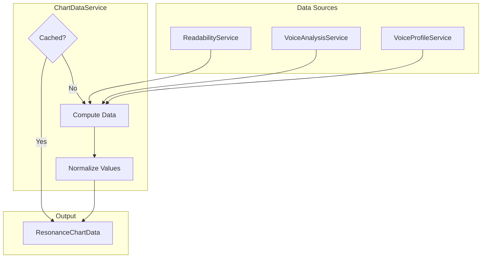
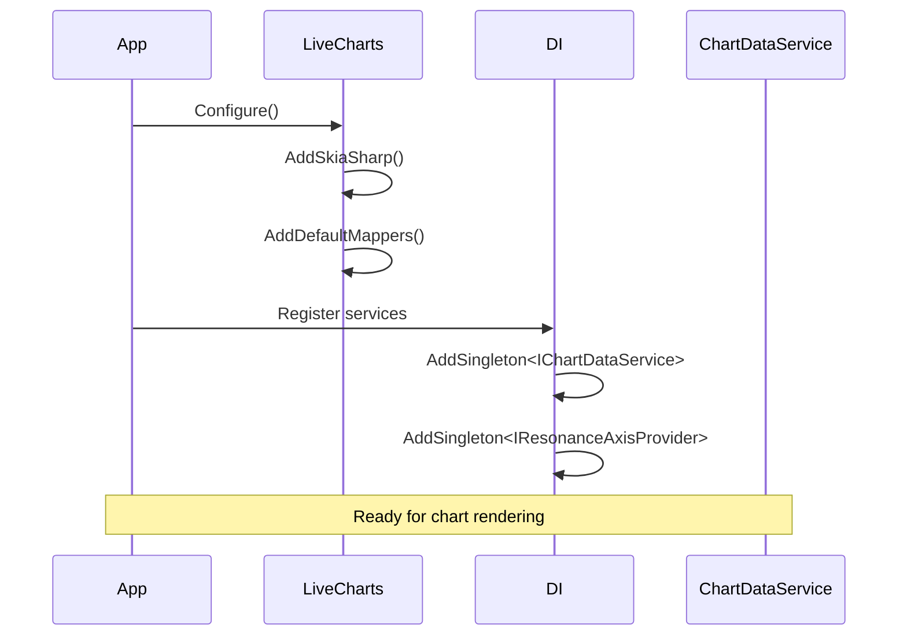

# LCS-DES-035a: Design Specification — Charting Integration

## 1. Metadata & Categorization

| Field | Value |
| :--- | :--- |
| **Document ID** | LCS-DES-035a |
| **Feature ID** | STY-035a |
| **Feature Name** | LiveCharts2 Charting Integration |
| **Target Version** | v0.3.5a |
| **Module Scope** | Lexichord.Modules.Style |
| **Swimlane** | Governance |
| **License Tier** | Writer Pro |
| **Feature Gate Key** | `FeatureFlags.Style.ResonanceDashboard` |
| **Status** | Draft |
| **Last Updated** | 2026-01-26 |
| **Parent Document** | [LCS-DES-035-INDEX](./LCS-DES-035-INDEX.md) |
| **Scope Breakdown** | [LCS-SBD-035 §3.1](./LCS-SBD-035.md#31-v035a-charting-integration) |

---

## 2. Executive Summary

### 2.1 The Requirement

The Resonance Dashboard needs a robust, cross-platform charting library that integrates with Avalonia UI. The library must support spider/radar charts, real-time updates, theming, and smooth animations.

> **Core Need:** Provide a foundation for visualizing writing metrics as an interactive spider chart.

### 2.2 The Proposed Solution

Implement:

1. **LiveCharts2 Integration** — Add LiveChartsCore.SkiaSharpView.Avalonia NuGet package
2. **Theme Configuration** — Match chart colors to Lexichord light/dark themes
3. **`IChartDataService`** — Service for aggregating and normalizing chart data
4. **Base Chart Control** — Reusable UserControl with responsive sizing
5. **Caching** — Minimize recomputation of normalized values

---

## 3. Architecture & Modular Strategy

### 3.1 Dependencies

#### 3.1.1 Upstream Dependencies

| Interface | Source Version | Purpose |
| :--- | :--- | :--- |
| `IReadabilityService` | v0.3.3c | Readability metrics for normalization |
| `ReadabilityMetrics` | v0.3.3c | Grade level, reading ease values |
| `VoiceAnalysisResult` | v0.3.4 | Passive voice %, weak word count |
| `IVoiceProfileService` | v0.3.4a | Active profile for density target |
| `ILicenseContext` | v0.0.4c | License verification |

#### 3.1.2 NuGet Packages

| Package | Version | Purpose |
| :--- | :--- | :--- |
| `LiveChartsCore.SkiaSharpView.Avalonia` | 2.x | Avalonia chart control |
| `LiveChartsCore` | 2.x | Core charting abstractions |
| `SkiaSharp` | 2.88.x | Rendering backend |

### 3.2 Licensing Behavior

The charting infrastructure loads for all users, but chart data is only computed for licensed users. Unlicensed users see a blurred placeholder with upgrade prompt.

---

## 4. Data Contract (The API)

### 4.1 IChartDataService Interface

```csharp
namespace Lexichord.Abstractions.Contracts;

/// <summary>
/// Service for aggregating and normalizing chart data from various analysis sources.
/// </summary>
/// <remarks>
/// <para>Data is cached until explicitly invalidated or source metrics change.</para>
/// <para>All values are normalized to 0-100 scale for consistent chart rendering.</para>
/// </remarks>
public interface IChartDataService
{
    /// <summary>
    /// Gets the current chart data with all axis values normalized.
    /// </summary>
    /// <param name="ct">Cancellation token.</param>
    /// <returns>Complete chart data ready for rendering.</returns>
    Task<ResonanceChartData> GetChartDataAsync(CancellationToken ct = default);

    /// <summary>
    /// Invalidates the cached chart data, forcing recomputation on next request.
    /// Call this when source metrics have changed.
    /// </summary>
    void InvalidateCache();

    /// <summary>
    /// Event raised when chart data has been updated.
    /// </summary>
    event EventHandler<ChartDataUpdatedEventArgs>? DataUpdated;
}

/// <summary>
/// Event arguments for chart data updates.
/// </summary>
public class ChartDataUpdatedEventArgs : EventArgs
{
    /// <summary>
    /// The updated chart data.
    /// </summary>
    public required ResonanceChartData ChartData { get; init; }

    /// <summary>
    /// Time taken to compute the data.
    /// </summary>
    public TimeSpan ComputationTime { get; init; }
}
```

### 4.2 ResonanceChartData Record

```csharp
namespace Lexichord.Abstractions.Contracts;

/// <summary>
/// Complete data for rendering a Resonance spider chart.
/// </summary>
/// <param name="DataPoints">Ordered list of axis values (clockwise from top).</param>
/// <param name="ComputedAt">Timestamp when data was computed.</param>
/// <param name="SourceDocumentId">ID of the document this data is for.</param>
public record ResonanceChartData(
    IReadOnlyList<ResonanceDataPoint> DataPoints,
    DateTimeOffset ComputedAt,
    Guid? SourceDocumentId = null)
{
    /// <summary>
    /// Empty chart data with zero values.
    /// </summary>
    public static ResonanceChartData Empty => new(
        DataPoints: Array.Empty<ResonanceDataPoint>(),
        ComputedAt: DateTimeOffset.MinValue);

    /// <summary>
    /// Gets all normalized values as an array (for chart series binding).
    /// </summary>
    public double[] GetNormalizedValues() =>
        DataPoints.Select(p => p.NormalizedValue).ToArray();

    /// <summary>
    /// Gets all axis names as an array (for chart labels).
    /// </summary>
    public string[] GetAxisNames() =>
        DataPoints.Select(p => p.AxisName).ToArray();
}

/// <summary>
/// A single data point on the spider chart.
/// </summary>
/// <param name="AxisName">Display name of the axis.</param>
/// <param name="NormalizedValue">Value normalized to 0-100 scale.</param>
/// <param name="RawValue">Original metric value before normalization.</param>
/// <param name="Unit">Unit of the raw value (e.g., "grade", "%").</param>
/// <param name="Description">Explanation shown in tooltip.</param>
public record ResonanceDataPoint(
    string AxisName,
    double NormalizedValue,
    double RawValue,
    string? Unit = null,
    string? Description = null)
{
    /// <summary>
    /// Formatted string for tooltip display.
    /// </summary>
    public string TooltipText => Unit is not null
        ? $"{AxisName}: {RawValue:0.#} {Unit}"
        : $"{AxisName}: {RawValue:0.#}";
}
```

---

## 5. Implementation Logic

### 5.1 LiveCharts2 Setup

```csharp
// In App.axaml.cs or module initialization
public override void OnFrameworkInitializationCompleted()
{
    // Configure LiveCharts
    LiveCharts.Configure(config => config
        .AddSkiaSharp()
        .AddDefaultMappers()
        .AddLightTheme() // or AddDarkTheme() based on app theme
    );

    base.OnFrameworkInitializationCompleted();
}
```

### 5.2 Theme Configuration

```csharp
namespace Lexichord.Modules.Style.Services;

/// <summary>
/// Configures LiveCharts themes to match Lexichord application themes.
/// </summary>
public static class ChartThemeConfiguration
{
    /// <summary>
    /// Light theme colors.
    /// </summary>
    public static class Light
    {
        public static readonly SKColor Background = SKColors.White;
        public static readonly SKColor GridLines = new(229, 231, 235); // gray-200
        public static readonly SKColor AxisLabels = new(55, 65, 81);   // gray-700
        public static readonly SKColor CurrentFill = new(74, 158, 255, 100); // blue 40%
        public static readonly SKColor CurrentStroke = new(74, 158, 255);    // blue
        public static readonly SKColor TargetFill = new(34, 197, 94, 50);    // green 20%
        public static readonly SKColor TargetStroke = new(34, 197, 94);      // green
    }

    /// <summary>
    /// Dark theme colors.
    /// </summary>
    public static class Dark
    {
        public static readonly SKColor Background = new(31, 41, 55);   // gray-800
        public static readonly SKColor GridLines = new(55, 65, 81);    // gray-700
        public static readonly SKColor AxisLabels = new(209, 213, 219); // gray-300
        public static readonly SKColor CurrentFill = new(74, 158, 255, 150); // blue 60%
        public static readonly SKColor CurrentStroke = new(74, 158, 255);    // blue
        public static readonly SKColor TargetFill = new(34, 197, 94, 75);    // green 30%
        public static readonly SKColor TargetStroke = new(34, 197, 94);      // green
    }

    /// <summary>
    /// Gets theme colors based on current application theme.
    /// </summary>
    public static ChartColors GetColors(bool isDarkTheme) =>
        isDarkTheme
            ? new ChartColors(Dark.Background, Dark.GridLines, Dark.AxisLabels,
                Dark.CurrentFill, Dark.CurrentStroke, Dark.TargetFill, Dark.TargetStroke)
            : new ChartColors(Light.Background, Light.GridLines, Light.AxisLabels,
                Light.CurrentFill, Light.CurrentStroke, Light.TargetFill, Light.TargetStroke);
}

public record ChartColors(
    SKColor Background,
    SKColor GridLines,
    SKColor AxisLabels,
    SKColor CurrentFill,
    SKColor CurrentStroke,
    SKColor TargetFill,
    SKColor TargetStroke);
```

### 5.3 ChartDataService Implementation

```csharp
namespace Lexichord.Modules.Style.Services;

/// <summary>
/// Aggregates metrics from various sources and normalizes for chart rendering.
/// </summary>
public sealed class ChartDataService : IChartDataService
{
    private readonly IReadabilityService _readabilityService;
    private readonly IVoiceAnalysisService _voiceAnalysisService;
    private readonly IVoiceProfileService _profileService;
    private readonly IResonanceAxisProvider _axisProvider;
    private readonly ILogger<ChartDataService> _logger;

    private ResonanceChartData? _cachedData;
    private readonly SemaphoreSlim _computeLock = new(1, 1);

    public event EventHandler<ChartDataUpdatedEventArgs>? DataUpdated;

    public ChartDataService(
        IReadabilityService readabilityService,
        IVoiceAnalysisService voiceAnalysisService,
        IVoiceProfileService profileService,
        IResonanceAxisProvider axisProvider,
        ILogger<ChartDataService> logger)
    {
        _readabilityService = readabilityService;
        _voiceAnalysisService = voiceAnalysisService;
        _profileService = profileService;
        _axisProvider = axisProvider;
        _logger = logger;
    }

    public async Task<ResonanceChartData> GetChartDataAsync(
        CancellationToken ct = default)
    {
        if (_cachedData is not null)
        {
            return _cachedData;
        }

        await _computeLock.WaitAsync(ct);
        try
        {
            // Double-check after acquiring lock
            if (_cachedData is not null)
            {
                return _cachedData;
            }

            var stopwatch = Stopwatch.StartNew();

            _logger.LogDebug("Computing chart data for {AxisCount} axes",
                _axisProvider.GetAxes().Count);

            // Gather metrics
            var readability = await _readabilityService.GetLatestMetricsAsync(ct);
            var voiceAnalysis = await _voiceAnalysisService.GetLatestResultAsync(ct);
            var profile = await _profileService.GetActiveProfileAsync(ct);

            // Build data points
            var dataPoints = new List<ResonanceDataPoint>();
            var axes = _axisProvider.GetAxes();

            foreach (var axis in axes)
            {
                var rawValue = GetRawValue(axis, readability, voiceAnalysis, profile);
                var normalizedValue = axis.Normalize(rawValue);

                _logger.LogDebug(
                    "Axis {AxisName}: raw={RawValue}, normalized={NormalizedValue}",
                    axis.Name, rawValue, normalizedValue);

                dataPoints.Add(new ResonanceDataPoint(
                    AxisName: axis.Name,
                    NormalizedValue: normalizedValue,
                    RawValue: rawValue,
                    Unit: axis.Unit,
                    Description: axis.Description));
            }

            _cachedData = new ResonanceChartData(
                DataPoints: dataPoints.AsReadOnly(),
                ComputedAt: DateTimeOffset.UtcNow);

            stopwatch.Stop();

            DataUpdated?.Invoke(this, new ChartDataUpdatedEventArgs
            {
                ChartData = _cachedData,
                ComputationTime = stopwatch.Elapsed
            });

            return _cachedData;
        }
        finally
        {
            _computeLock.Release();
        }
    }

    public void InvalidateCache()
    {
        _cachedData = null;
        _logger.LogDebug("Chart data cache invalidated");
    }

    private static double GetRawValue(
        ResonanceAxisDefinition axis,
        ReadabilityMetrics? readability,
        VoiceAnalysisResult? voiceAnalysis,
        VoiceProfile profile)
    {
        return axis.Name switch
        {
            "Readability" => readability?.FleschReadingEase ?? 0,
            "Clarity" => voiceAnalysis?.PassiveVoicePercentage ?? 0,
            "Precision" => voiceAnalysis?.WeakWordCount ?? 0,
            "Accessibility" => readability?.FleschKincaidGrade ?? 0,
            "Density" => readability?.AverageWordsPerSentence ?? 0,
            "Flow" => readability?.SentenceLengthVariance ?? 0,
            _ => 0
        };
    }
}
```

### 5.4 Data Flow Diagram



---

## 6. UI/UX Specifications

### 6.1 Base Chart Control

```xml
<!-- ResonanceChartControl.axaml -->
<UserControl xmlns="https://github.com/avaloniaui"
             xmlns:x="http://schemas.microsoft.com/winfx/2006/xaml"
             xmlns:lvc="using:LiveChartsCore.SkiaSharpView.Avalonia"
             x:Class="Lexichord.Modules.Style.Views.ResonanceChartControl">

    <Grid>
        <!-- Loading overlay -->
        <Border IsVisible="{Binding IsLoading}"
                Background="{DynamicResource SystemControlBackgroundAltMediumBrush}"
                CornerRadius="8"
                ZIndex="10">
            <StackPanel HorizontalAlignment="Center"
                        VerticalAlignment="Center">
                <ProgressRing IsIndeterminate="True" Width="40" Height="40" />
                <TextBlock Text="Analyzing..."
                           Margin="0,8,0,0"
                           Foreground="{DynamicResource TextFillColorSecondaryBrush}" />
            </StackPanel>
        </Border>

        <!-- License gate overlay -->
        <Border IsVisible="{Binding !IsLicensed}"
                Background="{DynamicResource SystemControlBackgroundAltMediumBrush}"
                CornerRadius="8"
                ZIndex="10">
            <StackPanel HorizontalAlignment="Center"
                        VerticalAlignment="Center"
                        Spacing="12">
                <PathIcon Data="{StaticResource LockIcon}"
                          Width="48" Height="48"
                          Foreground="{DynamicResource TextFillColorTertiaryBrush}" />
                <TextBlock Text="Resonance Dashboard"
                           FontWeight="SemiBold"
                           FontSize="18" />
                <TextBlock Text="Upgrade to Writer Pro to unlock"
                           Foreground="{DynamicResource TextFillColorSecondaryBrush}" />
                <Button Content="View Plans"
                        Classes="accent"
                        Command="{Binding ViewPlansCommand}" />
            </StackPanel>
        </Border>

        <!-- The actual chart -->
        <lvc:PolarChart Series="{Binding Series}"
                        AngleAxes="{Binding AngleAxes}"
                        RadiusAxes="{Binding RadiusAxes}"
                        IsVisible="{Binding IsLicensed}"
                        AnimationsSpeed="00:00:00.300"
                        EasingFunction="{x:Static lvc:EasingFunctions.BounceOut}" />
    </Grid>
</UserControl>
```

### 6.2 Responsive Sizing

| Container Width | Chart Behavior |
| :--- | :--- |
| < 250px | Hide chart, show "Expand panel" message |
| 250-400px | Compact mode, abbreviated labels |
| 400-600px | Standard mode |
| > 600px | Large mode with full labels |

---

## 7. Decision Trees

### 7.1 Cache Decision

```text
INPUT: GetChartDataAsync() called
OUTPUT: ResonanceChartData

DECISION TREE:
┌─ Is cache valid (not null)?
│  └─ YES → Return cached data immediately
│
├─ Acquire computation lock
│
├─ Double-check: Is cache valid now?
│  └─ YES → Release lock, return cached data
│
├─ Gather metrics from services
│  ├─ ReadabilityService.GetLatestMetricsAsync()
│  ├─ VoiceAnalysisService.GetLatestResultAsync()
│  └─ VoiceProfileService.GetActiveProfileAsync()
│
├─ For each axis definition:
│  ├─ Get raw value from metrics
│  ├─ Normalize to 0-100
│  └─ Create ResonanceDataPoint
│
├─ Create ResonanceChartData
│
├─ Store in cache
│
├─ Raise DataUpdated event
│
└─ Release lock, return data
```

---

## 8. User Stories

| ID | As a... | I want to... | So that... | Priority |
| :--- | :--- | :--- | :--- | :--- |
| US-035a-01 | Developer | Integrate LiveCharts2 | I have a charting foundation | P0 |
| US-035a-02 | Writer | See chart match app theme | Visual consistency | P1 |
| US-035a-03 | Developer | Cache chart data | Performance is optimal | P1 |
| US-035a-04 | Writer | See loading state | I know analysis is running | P1 |

---

## 9. Use Cases

### 9.1 UC-035a-01: Initialize Chart

**Actor:** Application startup

**Preconditions:**
- Application is launching
- LiveCharts2 packages are installed

**Main Flow:**

1. Application initializes LiveCharts configuration
2. Theme configuration is applied (light/dark)
3. ChartDataService is registered in DI container
4. ResonanceAxisProvider is registered
5. Services are ready for chart rendering

**Postconditions:**
- LiveCharts2 is configured and ready
- Theme colors match application theme

---

## 10. Unit Testing Requirements

### 10.1 ChartDataService Tests

```csharp
[Trait("Category", "Unit")]
[Trait("Feature", "v0.3.5a")]
public class ChartDataServiceTests
{
    [Fact]
    public async Task GetChartDataAsync_ReturnsNormalizedValues()
    {
        // Arrange
        var readability = new ReadabilityMetrics
        {
            FleschReadingEase = 72.4,
            FleschKincaidGrade = 8.2,
            AverageWordsPerSentence = 15.5
        };
        var mockReadability = new Mock<IReadabilityService>();
        mockReadability.Setup(s => s.GetLatestMetricsAsync(It.IsAny<CancellationToken>()))
            .ReturnsAsync(readability);

        var sut = CreateService(readabilityService: mockReadability.Object);

        // Act
        var result = await sut.GetChartDataAsync();

        // Assert
        result.DataPoints.Should().NotBeEmpty();
        result.DataPoints.Should().AllSatisfy(p =>
        {
            p.NormalizedValue.Should().BeInRange(0, 100);
        });
    }

    [Fact]
    public async Task GetChartDataAsync_CachesResult()
    {
        var mockReadability = CreateMockReadabilityService();
        var sut = CreateService(readabilityService: mockReadability.Object);

        var result1 = await sut.GetChartDataAsync();
        var result2 = await sut.GetChartDataAsync();

        result1.Should().BeSameAs(result2);
        mockReadability.Verify(
            s => s.GetLatestMetricsAsync(It.IsAny<CancellationToken>()),
            Times.Once);
    }

    [Fact]
    public async Task InvalidateCache_ForcesRecomputation()
    {
        var mockReadability = CreateMockReadabilityService();
        var sut = CreateService(readabilityService: mockReadability.Object);

        var result1 = await sut.GetChartDataAsync();
        sut.InvalidateCache();
        var result2 = await sut.GetChartDataAsync();

        result1.Should().NotBeSameAs(result2);
        mockReadability.Verify(
            s => s.GetLatestMetricsAsync(It.IsAny<CancellationToken>()),
            Times.Exactly(2));
    }

    [Fact]
    public async Task GetChartDataAsync_RaisesDataUpdatedEvent()
    {
        var sut = CreateService();
        ChartDataUpdatedEventArgs? eventArgs = null;
        sut.DataUpdated += (_, args) => eventArgs = args;

        await sut.GetChartDataAsync();

        eventArgs.Should().NotBeNull();
        eventArgs!.ChartData.Should().NotBeNull();
        eventArgs.ComputationTime.Should().BeGreaterThan(TimeSpan.Zero);
    }

    [Fact]
    public async Task GetChartDataAsync_HandlesNullMetrics()
    {
        var mockReadability = new Mock<IReadabilityService>();
        mockReadability.Setup(s => s.GetLatestMetricsAsync(It.IsAny<CancellationToken>()))
            .ReturnsAsync((ReadabilityMetrics?)null);

        var sut = CreateService(readabilityService: mockReadability.Object);

        var result = await sut.GetChartDataAsync();

        result.DataPoints.Should().NotBeEmpty();
        result.DataPoints.Should().AllSatisfy(p =>
        {
            p.NormalizedValue.Should().Be(0);
        });
    }

    private static ChartDataService CreateService(
        IReadabilityService? readabilityService = null,
        IVoiceAnalysisService? voiceService = null,
        IVoiceProfileService? profileService = null)
    {
        return new ChartDataService(
            readabilityService ?? CreateMockReadabilityService().Object,
            voiceService ?? CreateMockVoiceService().Object,
            profileService ?? CreateMockProfileService().Object,
            new DefaultAxisProvider(),
            NullLogger<ChartDataService>.Instance);
    }
}
```

---

## 11. Observability & Logging

| Level | Message Template |
| :--- | :--- |
| Debug | `"Computing chart data for {AxisCount} axes"` |
| Debug | `"Axis {AxisName}: raw={RawValue}, normalized={NormalizedValue}"` |
| Debug | `"Chart data computed in {ElapsedMs}ms"` |
| Debug | `"Chart data cache invalidated"` |
| Debug | `"Returning cached chart data"` |
| Warning | `"Missing metric data for axis: {AxisName}, using default"` |
| Error | `"Failed to compute chart data: {Error}"` |

---

## 12. Workflows

### 12.1 Initialization Sequence



---

## 13. Code Examples

### 13.1 DI Registration

```csharp
// In StyleModule.cs
public static IServiceCollection AddStyleModule(
    this IServiceCollection services)
{
    // Charting services (v0.3.5a)
    services.AddSingleton<IChartDataService, ChartDataService>();
    services.AddSingleton<IResonanceAxisProvider, DefaultAxisProvider>();

    return services;
}
```

### 13.2 LiveCharts Initialization

```csharp
// In App.axaml.cs
public partial class App : Application
{
    public override void OnFrameworkInitializationCompleted()
    {
        // Configure LiveCharts with Lexichord theme
        LiveCharts.Configure(config => config
            .AddSkiaSharp()
            .AddDefaultMappers()
        );

        // ... rest of initialization
    }
}
```

---

## 14. Acceptance Criteria (QA)

| # | Given | When | Then |
| :--- | :--- | :--- | :--- |
| 1 | Fresh application | App starts | LiveCharts is configured |
| 2 | Light theme active | Chart renders | Uses light theme colors |
| 3 | Dark theme active | Chart renders | Uses dark theme colors |
| 4 | First data request | GetChartDataAsync called | Computes and caches |
| 5 | Second data request | GetChartDataAsync called | Returns cached data |
| 6 | Cache invalidated | GetChartDataAsync called | Recomputes data |
| 7 | No metrics available | GetChartDataAsync called | Returns zero values |

---

## 15. Deliverable Checklist

| # | Task | Status |
| :--- | :--- | :--- |
| 1 | Add LiveChartsCore.SkiaSharpView.Avalonia package | [ ] |
| 2 | Configure LiveCharts in App.axaml.cs | [ ] |
| 3 | Create ChartThemeConfiguration class | [ ] |
| 4 | Create IChartDataService interface | [ ] |
| 5 | Implement ChartDataService | [ ] |
| 6 | Create ResonanceChartControl.axaml | [ ] |
| 7 | Register services in DI | [ ] |
| 8 | Write unit tests | [ ] |
| 9 | Write integration tests | [ ] |
| 10 | Document in XML comments | [ ] |

---

## 16. Verification Commands

```bash
# Install packages
dotnet add package LiveChartsCore.SkiaSharpView.Avalonia --version 2.*
dotnet add package SkiaSharp --version 2.88.*

# Build and test
dotnet build Lexichord.Modules.Style
dotnet test --filter "Feature=v0.3.5a"

# Check package references
dotnet list package | grep -i livecharts
```

---

## 17. Changelog Entry

```markdown
### v0.3.5a — Charting Integration

#### Added

- LiveCharts2 integration for Avalonia
- `IChartDataService` for normalized chart data
- Chart theme configuration (light/dark)
- Base chart control with loading states

#### Technical

- LiveChartsCore.SkiaSharpView.Avalonia 2.x
- SkiaSharp 2.88.x rendering backend
- Data caching with invalidation support
```

---

## 18. Deferred Features

| Feature | Reason | Target Version |
| :--- | :--- | :--- |
| Custom chart themes | Complexity | v0.4.x |
| Chart export to PNG/SVG | Low priority | v0.4.x |
| Print support | Platform-specific | v0.4.x |

---

## Document History

| Version | Date | Author | Changes |
| :--- | :--- | :--- | :--- |
| 1.0 | 2026-01-26 | Lead Architect | Initial draft |
