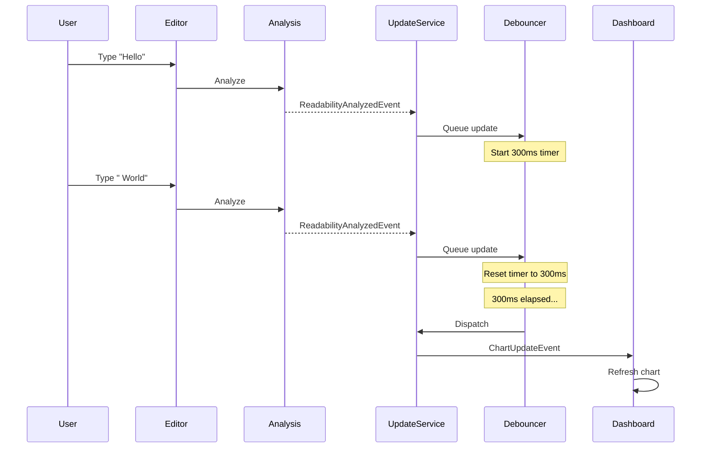
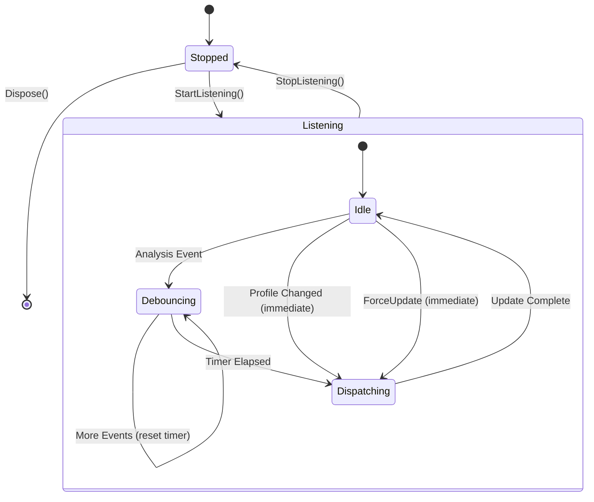
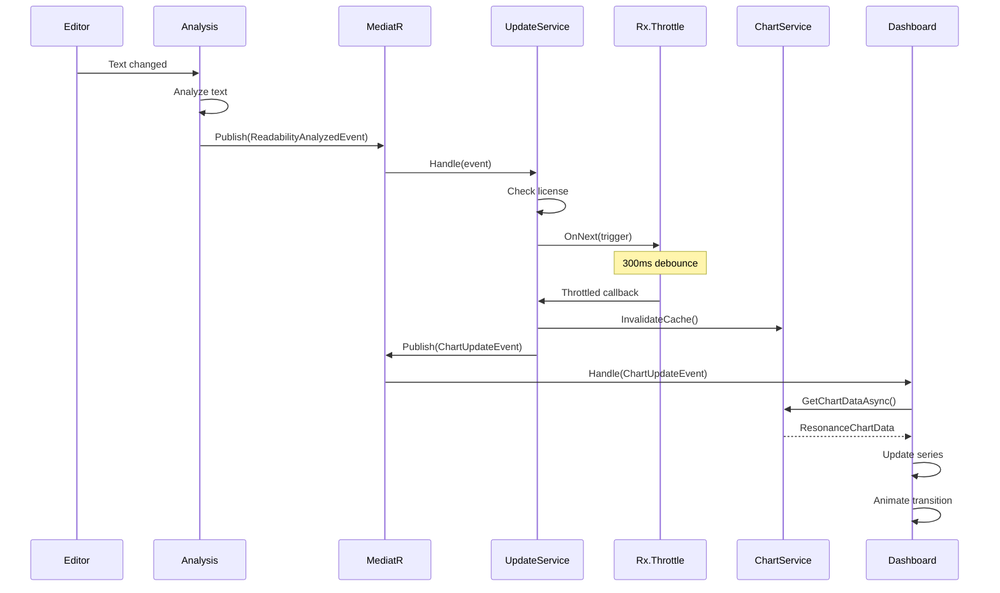

# LCS-DES-035c: Design Specification — Real-Time Updates

## 1. Metadata & Categorization

| Field | Value |
| :--- | :--- |
| **Document ID** | LCS-DES-035c |
| **Feature ID** | STY-035c |
| **Feature Name** | Real-Time Chart Updates |
| **Target Version** | v0.3.5c |
| **Module Scope** | Lexichord.Modules.Style |
| **Swimlane** | Governance |
| **License Tier** | Writer Pro |
| **Feature Gate Key** | `FeatureFlags.Style.ResonanceDashboard` |
| **Status** | Draft |
| **Last Updated** | 2026-01-26 |
| **Parent Document** | [LCS-DES-035-INDEX](./LCS-DES-035-INDEX.md) |
| **Scope Breakdown** | [LCS-SBD-035 §3.3](./LCS-SBD-035.md#33-v035c-real-time-updates) |

---

## 2. Executive Summary

### 2.1 The Requirement

The Resonance Dashboard must update in real-time as the user types and analysis completes. Updates need to be debounced to prevent excessive re-renders, and animations should be smooth without jarring transitions.

> **Core Need:** Keep the spider chart synchronized with the current document state without impacting performance.

### 2.2 The Proposed Solution

Implement:

1. **`IResonanceUpdateService`** — Coordinates update events from multiple sources
2. **Event Subscriptions** — Listen to ReadabilityAnalyzedEvent, ProfileChangedEvent
3. **Debouncing** — 300ms debounce window for rapid typing
4. **`ChartUpdateEvent`** — MediatR notification for chart refresh
5. **Smooth Animations** — LiveCharts easing for value transitions

---

## 3. Architecture & Modular Strategy

### 3.1 Dependencies

#### 3.1.1 Upstream Dependencies

| Interface | Source Version | Purpose |
| :--- | :--- | :--- |
| `ReadabilityAnalyzedEvent` | v0.3.3c | Trigger on readability completion |
| `VoiceAnalysisCompletedEvent` | v0.3.4 | Trigger on voice analysis completion |
| `ProfileChangedEvent` | v0.3.4a | Trigger immediate update on profile switch |
| `IChartDataService` | v0.3.5a | Invalidate cache and refresh data |
| `ILicenseContext` | v0.0.4c | Skip updates for unlicensed users |

#### 3.1.2 NuGet Packages

| Package | Version | Purpose |
| :--- | :--- | :--- |
| `System.Reactive` | 6.x | Observable debouncing |
| `MediatR` | 12.x | Event handling |

### 3.2 Licensing Behavior

Update subscriptions are active for all users, but the service returns early without processing for unlicensed users to minimize resource usage.

---

## 4. Data Contract (The API)

### 4.1 IResonanceUpdateService Interface

```csharp
namespace Lexichord.Abstractions.Contracts;

/// <summary>
/// Coordinates real-time updates to the Resonance Dashboard.
/// </summary>
/// <remarks>
/// <para>Subscribes to analysis events and debounces rapid updates.</para>
/// <para>Profile changes bypass debouncing for immediate feedback.</para>
/// </remarks>
public interface IResonanceUpdateService : IDisposable
{
    /// <summary>
    /// Starts listening for analysis events.
    /// Call once when the dashboard becomes visible.
    /// </summary>
    void StartListening();

    /// <summary>
    /// Stops listening for analysis events.
    /// Call when the dashboard is hidden to conserve resources.
    /// </summary>
    void StopListening();

    /// <summary>
    /// Whether the service is currently listening for events.
    /// </summary>
    bool IsListening { get; }

    /// <summary>
    /// Forces an immediate chart update, bypassing debounce.
    /// </summary>
    /// <param name="ct">Cancellation token.</param>
    Task ForceUpdateAsync(CancellationToken ct = default);

    /// <summary>
    /// Observable stream of update requests (for UI binding).
    /// </summary>
    IObservable<ChartUpdateEventArgs> UpdateRequested { get; }
}

/// <summary>
/// Event arguments for chart update requests.
/// </summary>
public class ChartUpdateEventArgs : EventArgs
{
    /// <summary>
    /// What triggered this update.
    /// </summary>
    public required UpdateTrigger Trigger { get; init; }

    /// <summary>
    /// Whether this update bypassed debouncing.
    /// </summary>
    public bool WasImmediate { get; init; }

    /// <summary>
    /// Time the triggering event was received.
    /// </summary>
    public DateTimeOffset EventReceivedAt { get; init; }

    /// <summary>
    /// Time the update was dispatched (after debounce).
    /// </summary>
    public DateTimeOffset DispatchedAt { get; init; }
}

/// <summary>
/// What triggered a chart update.
/// </summary>
public enum UpdateTrigger
{
    /// <summary>Readability analysis completed.</summary>
    ReadabilityAnalyzed,

    /// <summary>Voice analysis completed.</summary>
    VoiceAnalysisCompleted,

    /// <summary>Active profile changed.</summary>
    ProfileChanged,

    /// <summary>Manual refresh requested.</summary>
    ManualRefresh,

    /// <summary>Dashboard became visible.</summary>
    DashboardOpened
}
```

### 4.2 ChartUpdateEvent (MediatR)

```csharp
namespace Lexichord.Modules.Style.Events;

/// <summary>
/// MediatR notification requesting the Resonance Dashboard to refresh.
/// </summary>
/// <param name="Trigger">What caused this update request.</param>
/// <param name="SkipAnimation">Whether to skip transition animation.</param>
public record ChartUpdateEvent(
    UpdateTrigger Trigger,
    bool SkipAnimation = false) : INotification;
```

---

## 5. Implementation Logic

### 5.1 ResonanceUpdateService Implementation

```csharp
namespace Lexichord.Modules.Style.Services;

/// <summary>
/// Coordinates real-time updates to the Resonance Dashboard.
/// </summary>
public sealed class ResonanceUpdateService : IResonanceUpdateService,
    INotificationHandler<ReadabilityAnalyzedEvent>,
    INotificationHandler<VoiceAnalysisCompletedEvent>,
    INotificationHandler<ProfileChangedEvent>
{
    private const int DebounceMilliseconds = 300;

    private readonly IChartDataService _chartDataService;
    private readonly IMediator _mediator;
    private readonly ILicenseContext _licenseContext;
    private readonly ILogger<ResonanceUpdateService> _logger;

    private readonly Subject<UpdateTrigger> _updateSubject = new();
    private readonly Subject<ChartUpdateEventArgs> _updateRequestedSubject = new();
    private IDisposable? _debounceSubscription;
    private bool _isListening;

    public bool IsListening => _isListening;

    public IObservable<ChartUpdateEventArgs> UpdateRequested =>
        _updateRequestedSubject.AsObservable();

    public ResonanceUpdateService(
        IChartDataService chartDataService,
        IMediator mediator,
        ILicenseContext licenseContext,
        ILogger<ResonanceUpdateService> logger)
    {
        _chartDataService = chartDataService;
        _mediator = mediator;
        _licenseContext = licenseContext;
        _logger = logger;
    }

    public void StartListening()
    {
        if (_isListening) return;

        _debounceSubscription = _updateSubject
            .Throttle(TimeSpan.FromMilliseconds(DebounceMilliseconds))
            .Subscribe(trigger => DispatchUpdate(trigger, wasImmediate: false));

        _isListening = true;
        _logger.LogDebug("ResonanceUpdateService started listening");
    }

    public void StopListening()
    {
        if (!_isListening) return;

        _debounceSubscription?.Dispose();
        _debounceSubscription = null;
        _isListening = false;

        _logger.LogDebug("ResonanceUpdateService stopped listening");
    }

    public async Task ForceUpdateAsync(CancellationToken ct = default)
    {
        if (!CheckLicense()) return;

        _chartDataService.InvalidateCache();
        await DispatchUpdateAsync(UpdateTrigger.ManualRefresh, wasImmediate: true, ct);
    }

    public Task Handle(
        ReadabilityAnalyzedEvent notification,
        CancellationToken cancellationToken)
    {
        if (!CheckLicense() || !_isListening) return Task.CompletedTask;

        _logger.LogDebug("Chart update triggered by {EventType}", "ReadabilityAnalyzed");
        _updateSubject.OnNext(UpdateTrigger.ReadabilityAnalyzed);

        return Task.CompletedTask;
    }

    public Task Handle(
        VoiceAnalysisCompletedEvent notification,
        CancellationToken cancellationToken)
    {
        if (!CheckLicense() || !_isListening) return Task.CompletedTask;

        _logger.LogDebug("Chart update triggered by {EventType}", "VoiceAnalysisCompleted");
        _updateSubject.OnNext(UpdateTrigger.VoiceAnalysisCompleted);

        return Task.CompletedTask;
    }

    public async Task Handle(
        ProfileChangedEvent notification,
        CancellationToken cancellationToken)
    {
        if (!CheckLicense() || !_isListening) return;

        // Profile changes bypass debounce for immediate feedback
        _logger.LogDebug("Chart update triggered by {EventType}", "ProfileChanged");
        _chartDataService.InvalidateCache();
        await DispatchUpdateAsync(
            UpdateTrigger.ProfileChanged,
            wasImmediate: true,
            cancellationToken);
    }

    private bool CheckLicense()
    {
        if (!_licenseContext.HasFeature(FeatureFlags.Style.ResonanceDashboard))
        {
            _logger.LogDebug("Skipping chart update: license not available");
            return false;
        }
        return true;
    }

    private void DispatchUpdate(UpdateTrigger trigger, bool wasImmediate)
    {
        _ = DispatchUpdateAsync(trigger, wasImmediate, CancellationToken.None);
    }

    private async Task DispatchUpdateAsync(
        UpdateTrigger trigger,
        bool wasImmediate,
        CancellationToken ct)
    {
        var eventArgs = new ChartUpdateEventArgs
        {
            Trigger = trigger,
            WasImmediate = wasImmediate,
            EventReceivedAt = DateTimeOffset.UtcNow,
            DispatchedAt = DateTimeOffset.UtcNow
        };

        _logger.LogDebug(
            "Dispatching chart update: {Trigger}, immediate={WasImmediate}",
            trigger, wasImmediate);

        // Invalidate cache for debounced updates
        if (!wasImmediate)
        {
            _chartDataService.InvalidateCache();
        }

        // Notify via MediatR
        await _mediator.Publish(new ChartUpdateEvent(trigger), ct);

        // Notify via observable
        _updateRequestedSubject.OnNext(eventArgs);

        _logger.LogInfo("Chart updated: {UpdateDurationMs}ms",
            (DateTimeOffset.UtcNow - eventArgs.EventReceivedAt).TotalMilliseconds);
    }

    public void Dispose()
    {
        StopListening();
        _updateSubject.Dispose();
        _updateRequestedSubject.Dispose();
    }
}
```

### 5.2 Debounce Flow



### 5.3 State Diagram



---

## 6. UI/UX Specifications

### 6.1 Animation Configuration

```csharp
// LiveCharts animation settings
AnimationsSpeed = TimeSpan.FromMilliseconds(300);
EasingFunction = EasingFunctions.QuadraticOut;
```

### 6.2 Visual Feedback During Update

| State | Visual |
| :--- | :--- |
| Idle | Chart displays current values |
| Debouncing | No visual change (invisible to user) |
| Updating | Chart animates to new values |
| Error | Chart shows last known values + error toast |

---

## 7. Decision Trees

### 7.1 Update Dispatch Decision

```text
INPUT: Event received
OUTPUT: Dispatch or skip

DECISION TREE:
┌─ Is user licensed for Resonance Dashboard?
│  └─ NO → Skip (return early)
│
├─ Is service listening?
│  └─ NO → Skip (return early)
│
├─ What type of event?
│
├─ ProfileChangedEvent?
│  └─ YES → Immediate dispatch (bypass debounce)
│
├─ ForceUpdateAsync called?
│  └─ YES → Immediate dispatch (bypass debounce)
│
├─ ReadabilityAnalyzedEvent or VoiceAnalysisCompletedEvent?
│  └─ YES → Add to debounce queue
│      ├─ Timer not running → Start 300ms timer
│      └─ Timer running → Reset to 300ms
│
└─ Timer elapsed?
    └─ YES → Dispatch debounced update
```

---

## 8. User Stories

| ID | As a... | I want to... | So that... | Priority |
| :--- | :--- | :--- | :--- | :--- |
| US-035c-01 | Writer | See chart update as I type | I get real-time feedback | P0 |
| US-035c-02 | Writer | Not see flickering | Updates are smooth | P1 |
| US-035c-03 | Writer | See immediate update on profile change | I see new targets instantly | P0 |
| US-035c-04 | Writer | Have updates debounced | Performance stays good | P1 |
| US-035c-05 | Developer | Force manual refresh | Testing and debugging | P2 |

---

## 9. Use Cases

### 9.1 UC-035c-01: Debounced Update

**Actor:** Writer typing in editor

**Preconditions:**
- Document is open
- Resonance Dashboard is visible
- UpdateService is listening

**Main Flow:**

1. User types text rapidly
2. Each keystroke triggers analysis
3. Analysis completes and publishes ReadabilityAnalyzedEvent
4. UpdateService receives event
5. UpdateService queues update in debouncer
6. Debouncer resets 300ms timer on each event
7. User pauses typing
8. 300ms passes with no new events
9. Debouncer dispatches single update
10. Dashboard refreshes once with latest values

**Postconditions:**
- Chart shows current analysis results
- Only one chart update occurred despite multiple events

### 9.2 UC-035c-02: Profile Change (Immediate)

**Actor:** Writer switching Voice Profile

**Preconditions:**
- Resonance Dashboard is visible
- UpdateService is listening

**Main Flow:**

1. User selects new profile from dropdown
2. ProfileChangedEvent is published
3. UpdateService receives event
4. UpdateService bypasses debounce
5. Chart data cache is invalidated
6. ChartUpdateEvent is published immediately
7. Dashboard refreshes with new profile targets

**Postconditions:**
- Chart shows new profile targets instantly
- No 300ms delay

---

## 10. Unit Testing Requirements

### 10.1 Debouncing Tests

```csharp
[Trait("Category", "Unit")]
[Trait("Feature", "v0.3.5c")]
public class ResonanceUpdateServiceTests
{
    [Fact]
    public async Task Handle_ReadabilityAnalyzed_TriggersDebounce()
    {
        // Arrange
        var chartService = new Mock<IChartDataService>();
        var mediator = new Mock<IMediator>();
        var sut = CreateService(chartService.Object, mediator.Object);
        sut.StartListening();

        // Act
        await sut.Handle(new ReadabilityAnalyzedEvent(), CancellationToken.None);

        // Wait for debounce
        await Task.Delay(400);

        // Assert
        mediator.Verify(m => m.Publish(
            It.IsAny<ChartUpdateEvent>(),
            It.IsAny<CancellationToken>()), Times.Once);
    }

    [Fact]
    public async Task Handle_MultipleRapidEvents_AreDebouncedToOne()
    {
        var mediator = new Mock<IMediator>();
        var sut = CreateService(mediator: mediator.Object);
        sut.StartListening();

        // Fire 5 events rapidly
        for (int i = 0; i < 5; i++)
        {
            await sut.Handle(new ReadabilityAnalyzedEvent(), CancellationToken.None);
            await Task.Delay(50); // Less than debounce window
        }

        // Wait for debounce to complete
        await Task.Delay(400);

        // Should only trigger once
        mediator.Verify(m => m.Publish(
            It.IsAny<ChartUpdateEvent>(),
            It.IsAny<CancellationToken>()), Times.Once);
    }

    [Fact]
    public async Task Handle_ProfileChanged_BypassesDebounce()
    {
        var mediator = new Mock<IMediator>();
        var sut = CreateService(mediator: mediator.Object);
        sut.StartListening();

        await sut.Handle(
            new ProfileChangedEvent(Guid.Empty, Guid.NewGuid(), "Test"),
            CancellationToken.None);

        // No wait - should be immediate
        mediator.Verify(m => m.Publish(
            It.Is<ChartUpdateEvent>(e => e.Trigger == UpdateTrigger.ProfileChanged),
            It.IsAny<CancellationToken>()), Times.Once);
    }

    [Fact]
    public async Task ForceUpdateAsync_BypassesDebounce()
    {
        var chartService = new Mock<IChartDataService>();
        var mediator = new Mock<IMediator>();
        var sut = CreateService(chartService.Object, mediator.Object);
        sut.StartListening();

        await sut.ForceUpdateAsync();

        chartService.Verify(s => s.InvalidateCache(), Times.Once);
        mediator.Verify(m => m.Publish(
            It.Is<ChartUpdateEvent>(e => e.Trigger == UpdateTrigger.ManualRefresh),
            It.IsAny<CancellationToken>()), Times.Once);
    }

    [Fact]
    public async Task Handle_WhenNotListening_DoesNotDispatch()
    {
        var mediator = new Mock<IMediator>();
        var sut = CreateService(mediator: mediator.Object);
        // Note: NOT calling StartListening()

        await sut.Handle(new ReadabilityAnalyzedEvent(), CancellationToken.None);
        await Task.Delay(400);

        mediator.Verify(m => m.Publish(
            It.IsAny<ChartUpdateEvent>(),
            It.IsAny<CancellationToken>()), Times.Never);
    }

    [Fact]
    public async Task Handle_WhenUnlicensed_DoesNotDispatch()
    {
        var license = CreateMockLicense(hasFeature: false);
        var mediator = new Mock<IMediator>();
        var sut = CreateService(license.Object, mediator.Object);
        sut.StartListening();

        await sut.Handle(new ReadabilityAnalyzedEvent(), CancellationToken.None);
        await Task.Delay(400);

        mediator.Verify(m => m.Publish(
            It.IsAny<ChartUpdateEvent>(),
            It.IsAny<CancellationToken>()), Times.Never);
    }

    [Fact]
    public void StartListening_SetsIsListeningTrue()
    {
        var sut = CreateService();

        sut.StartListening();

        sut.IsListening.Should().BeTrue();
    }

    [Fact]
    public void StopListening_SetsIsListeningFalse()
    {
        var sut = CreateService();
        sut.StartListening();

        sut.StopListening();

        sut.IsListening.Should().BeFalse();
    }

    [Fact]
    public void UpdateRequested_EmitsOnDispatch()
    {
        var sut = CreateService();
        sut.StartListening();
        ChartUpdateEventArgs? received = null;
        sut.UpdateRequested.Subscribe(e => received = e);

        _ = sut.ForceUpdateAsync();

        received.Should().NotBeNull();
        received!.Trigger.Should().Be(UpdateTrigger.ManualRefresh);
        received.WasImmediate.Should().BeTrue();
    }
}
```

---

## 11. Observability & Logging

| Level | Message Template |
| :--- | :--- |
| Debug | `"ResonanceUpdateService started listening"` |
| Debug | `"ResonanceUpdateService stopped listening"` |
| Debug | `"Chart update triggered by {EventType}"` |
| Debug | `"Update debounced, waiting {DebounceMs}ms"` |
| Debug | `"Dispatching chart update: {Trigger}, immediate={WasImmediate}"` |
| Debug | `"Skipping chart update: license not available"` |
| Info | `"Chart updated: {UpdateDurationMs}ms"` |
| Warning | `"Chart update failed: {Error}"` |

---

## 12. Workflows

### 12.1 Complete Update Flow



---

## 13. Code Examples

### 13.1 ViewModel Integration

```csharp
// In ResonanceDashboardViewModel
public ResonanceDashboardViewModel(
    IResonanceUpdateService updateService,
    // ... other dependencies
)
{
    _updateService = updateService;

    // Subscribe to update requests
    _updateSubscription = _updateService.UpdateRequested
        .ObserveOn(RxApp.MainThreadScheduler)
        .Subscribe(async _ => await RefreshAsync());
}

protected override void OnActivated()
{
    base.OnActivated();
    _updateService.StartListening();
}

protected override void OnDeactivated()
{
    _updateService.StopListening();
    base.OnDeactivated();
}
```

### 13.2 DI Registration

```csharp
// In StyleModule.cs
services.AddSingleton<IResonanceUpdateService, ResonanceUpdateService>();

// Also register as INotificationHandler for MediatR
services.AddTransient<INotificationHandler<ReadabilityAnalyzedEvent>>(
    sp => sp.GetRequiredService<IResonanceUpdateService>() as ResonanceUpdateService);
services.AddTransient<INotificationHandler<VoiceAnalysisCompletedEvent>>(
    sp => sp.GetRequiredService<IResonanceUpdateService>() as ResonanceUpdateService);
services.AddTransient<INotificationHandler<ProfileChangedEvent>>(
    sp => sp.GetRequiredService<IResonanceUpdateService>() as ResonanceUpdateService);
```

---

## 14. Acceptance Criteria (QA)

| # | Given | When | Then |
| :--- | :--- | :--- | :--- |
| 1 | Dashboard visible | User types | Chart updates after debounce |
| 2 | Rapid typing | 5 keystrokes in 200ms | Only 1 chart update |
| 3 | Profile changed | User selects new profile | Immediate update (no debounce) |
| 4 | ForceUpdate called | Manual refresh | Immediate update |
| 5 | Dashboard hidden | User types | No updates dispatched |
| 6 | Core license | Analysis completes | No updates dispatched |
| 7 | Service started | StartListening called | IsListening = true |
| 8 | Service stopped | StopListening called | IsListening = false |

---

## 15. Deliverable Checklist

| # | Task | Status |
| :--- | :--- | :--- |
| 1 | Create IResonanceUpdateService interface | [ ] |
| 2 | Create ChartUpdateEvent MediatR notification | [ ] |
| 3 | Create UpdateTrigger enum | [ ] |
| 4 | Implement ResonanceUpdateService | [ ] |
| 5 | Add Rx debouncing | [ ] |
| 6 | Subscribe to ReadabilityAnalyzedEvent | [ ] |
| 7 | Subscribe to VoiceAnalysisCompletedEvent | [ ] |
| 8 | Subscribe to ProfileChangedEvent | [ ] |
| 9 | Integrate with ViewModel | [ ] |
| 10 | Write unit tests | [ ] |
| 11 | Write integration tests | [ ] |

---

## 16. Verification Commands

```bash
# Run specific tests
dotnet test --filter "Feature=v0.3.5c"

# Run debouncing tests
dotnet test --filter "FullyQualifiedName~ResonanceUpdateServiceTests"

# Check reactive subscriptions (manual)
dotnet run --project Lexichord -- --debug-events
```

---

## 17. Changelog Entry

```markdown
### v0.3.5c — Real-Time Updates

#### Added

- `IResonanceUpdateService` for coordinated chart updates
- `ChartUpdateEvent` MediatR notification
- 300ms debouncing for rapid typing
- Immediate updates for profile changes
- Observable `UpdateRequested` stream

#### Technical

- System.Reactive Throttle for debouncing
- MediatR INotificationHandler integration
- License-aware update filtering
```

---

## 18. Deferred Features

| Feature | Reason | Target Version |
| :--- | :--- | :--- |
| Configurable debounce time | Low priority | v0.4.x |
| Update priority queue | Complexity | v0.4.x |
| Offline update batching | Scope | v0.4.x |

---

## Document History

| Version | Date | Author | Changes |
| :--- | :--- | :--- | :--- |
| 1.0 | 2026-01-26 | Lead Architect | Initial draft |
