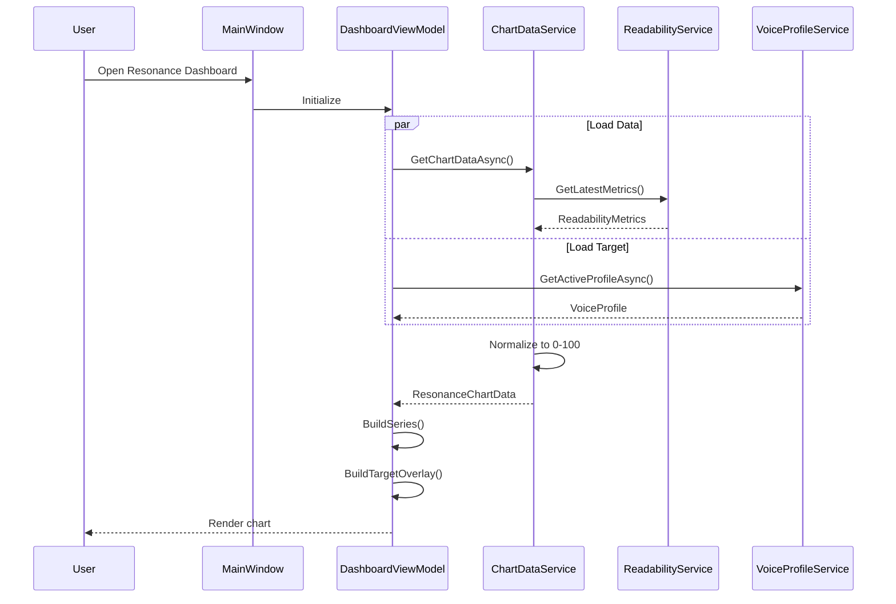
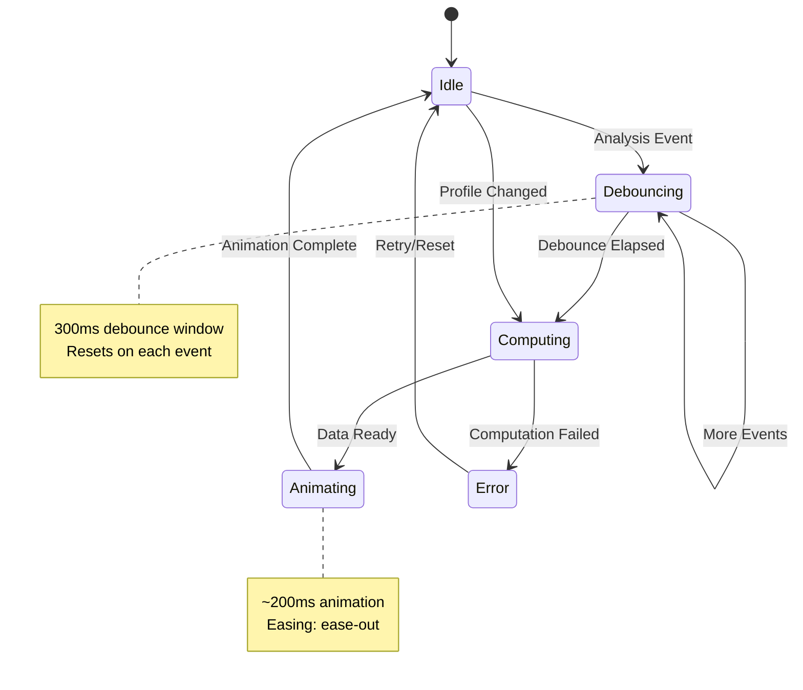

# LCS-SBD-035: Scope Breakdown — The Resonance Dashboard

## Document Control

| Field                | Value                                     |
| :------------------- | :---------------------------------------- |
| **Document ID**      | LCS-SBD-035                               |
| **Feature ID**       | STY-035                                   |
| **Feature Name**     | The Resonance Dashboard (Visual Feedback) |
| **Target Version**   | v0.3.5                                    |
| **Module Scope**     | Lexichord.Modules.Style                   |
| **Swimlane**         | Governance                                |
| **License Tier**     | Writer Pro                                |
| **Feature Gate Key** | `FeatureFlags.Style.ResonanceDashboard`   |
| **Status**           | Draft                                     |
| **Last Updated**     | 2026-01-26                                |

---

## 1. Executive Summary

### 1.1 Feature Overview

**v0.3.5** delivers the **Resonance Dashboard** — a visual feedback system that transforms raw metrics into actionable insight. This release introduces spider/radar charts that map writing characteristics across multiple dimensions, enabling writers to see at a glance how their content aligns with their target Voice Profile.

### 1.2 The Problem

Writers receive numerical feedback (grade level 8.2, passive voice 15%) but struggle to interpret these numbers holistically. Multiple metrics displayed as separate values create cognitive load and make it difficult to understand overall writing "health" or compare current writing against target goals.

### 1.3 The Solution

Implement a Resonance Dashboard that:

- **Integrates a Charting Library** (LiveCharts2) for Avalonia
- **Renders Spider Charts** with 5-8 configurable axes
- **Updates in Real-Time** via observable streams as analysis completes
- **Displays Target Overlays** showing Voice Profile constraints as visual goals

### 1.4 Success Metrics

| Metric             | Target                 | Measurement       |
| :----------------- | :--------------------- | :---------------- |
| Chart render time  | < 50ms                 | Benchmark         |
| Update latency     | < 200ms after analysis | End-to-end timing |
| Memory overhead    | < 5MB for chart        | Profiler          |
| Accessibility      | WCAG 2.1 AA            | Audit             |
| User comprehension | 80%+ understand chart  | User testing      |

---

## 2. Dependencies

### 2.1 Required Interfaces (Upstream)

| Interface                  | Source Version        | Purpose                                      |
| :------------------------- | :-------------------- | :------------------------------------------- |
| `IVoiceProfileService`     | v0.3.4a               | Get active profile constraints for overlay   |
| `VoiceProfile`             | v0.3.4a               | Profile constraints for target visualization |
| `ProfileChangedEvent`      | v0.3.4a               | Trigger chart re-render on profile switch    |
| `VoiceAnalysisResult`      | v0.3.4                | Passive voice %, weak word counts            |
| `IReadabilityService`      | v0.3.3c               | Grade level, reading ease scores             |
| `ReadabilityMetrics`       | v0.3.3c               | Metrics for chart axes                       |
| `ReadabilityAnalyzedEvent` | v0.3.3c               | Trigger chart update                         |
| `ISentenceTokenizer`       | v0.3.3a               | Sentence count for metrics                   |
| `ILicenseContext`          | v0.0.4c               | License tier checking                        |
| `ViewModelBase`            | CommunityToolkit.Mvvm | Observable ViewModel base (external NuGet)   |

### 2.2 New Interfaces (This Version)

| Interface                 | Sub-Part | Purpose                                      |
| :------------------------ | :------- | :------------------------------------------- |
| `IChartDataService`       | v0.3.5a  | Provides normalized data for chart rendering |
| `IResonanceAxisProvider`  | v0.3.5b  | Configures spider chart axes                 |
| `IResonanceUpdateService` | v0.3.5c  | Manages real-time update subscriptions       |

### 2.3 New Records/DTOs (This Version)

| Record                    | Sub-Part | Purpose                                |
| :------------------------ | :------- | :------------------------------------- |
| `ResonanceAxisDefinition` | v0.3.5b  | Definition of a single chart axis      |
| `ResonanceDataPoint`      | v0.3.5b  | Single axis value (0-100 normalized)   |
| `ResonanceChartData`      | v0.3.5b  | Complete chart data with all axes      |
| `TargetOverlay`           | v0.3.5d  | Profile target visualization data      |
| `ChartUpdateEvent`        | v0.3.5c  | MediatR notification for chart refresh |

### 2.4 NuGet Packages

| Package                                 | Version | Purpose                    |
| :-------------------------------------- | :------ | :------------------------- |
| `LiveChartsCore.SkiaSharpView.Avalonia` | 2.x     | Avalonia chart control     |
| `LiveChartsCore`                        | 2.x     | Core charting abstractions |
| `SkiaSharp`                             | 2.88.x  | Rendering backend          |
| `System.Reactive`                       | 6.x     | Observable updates         |
| `MediatR`                               | 12.x    | Event handling             |
| `CommunityToolkit.Mvvm`                 | 8.x     | MVVM source generators     |

---

## 3. Sub-Part Specifications

### 3.1 v0.3.5a: Charting Integration

**Goal:** Integrate LiveCharts2 into the Avalonia application with proper theming and responsive layout.

#### Tasks

| #   | Task                                                             | Est. Hours |
| :-- | :--------------------------------------------------------------- | :--------- |
| 1   | Add LiveChartsCore.SkiaSharpView.Avalonia NuGet package          | 0.5        |
| 2   | Configure LiveCharts theming to match Lexichord dark/light modes | 2          |
| 3   | Create `IChartDataService` interface                             | 1          |
| 4   | Implement `ChartDataService` with caching                        | 2          |
| 5   | Create base chart UserControl with responsive sizing             | 2          |
| 6   | Wire up chart control in main window layout                      | 1.5        |
| 7   | Write unit tests for ChartDataService                            | 2          |
| 8   | Write integration tests for chart rendering                      | 1.5        |

**Total:** 12.5 hours

#### Definition of Done

- [ ] LiveCharts2 renders in the Lexichord main window
- [ ] Chart respects application theme (dark/light)
- [ ] Chart resizes properly with window
- [ ] All unit tests pass
- [ ] No memory leaks on chart updates

### 3.2 v0.3.5b: Spider Chart

**Goal:** Implement a spider/radar chart with configurable axes representing writing metrics.

#### Tasks

| #   | Task                                                    | Est. Hours |
| :-- | :------------------------------------------------------ | :--------- |
| 1   | Define `ResonanceAxisDefinition` record                 | 1          |
| 2   | Define `ResonanceDataPoint` record                      | 0.5        |
| 3   | Define `ResonanceChartData` record                      | 0.5        |
| 4   | Create `IResonanceAxisProvider` interface               | 1          |
| 5   | Implement `DefaultAxisProvider` with 6 standard axes    | 2          |
| 6   | Create `ResonanceDashboardView` (AXAML)                 | 3          |
| 7   | Create `ResonanceDashboardViewModel`                    | 3          |
| 8   | Implement axis normalization (raw values → 0-100 scale) | 2          |
| 9   | Add tooltip hover showing raw values                    | 1.5        |
| 10  | Write unit tests for axis normalization                 | 2          |
| 11  | Write unit tests for ViewModel                          | 2          |

**Total:** 18.5 hours

#### Definition of Done

- [ ] Spider chart displays 6 axes
- [ ] Each axis shows normalized value (0-100)
- [ ] Tooltip displays raw metric value on hover
- [ ] Chart polygon fills correctly
- [ ] All unit tests pass

#### Axis Definitions

| Axis              | Source Metric            | Normalization            | Good Direction          |
| :---------------- | :----------------------- | :----------------------- | :---------------------- |
| **Readability**   | Flesch Reading Ease      | 0-100 direct             | Higher                  |
| **Clarity**       | Inverse passive voice %  | 100 - passive%           | Higher                  |
| **Precision**     | Inverse weak word count  | 100 - (words/10) capped  | Higher                  |
| **Flow**          | Sentence length variance | Normalized variance      | Middle (balanced)       |
| **Accessibility** | Inverse grade level      | 100 - (grade × 5) capped | Higher (easier)         |
| **Density**       | Words per sentence avg   | Normalized to profile    | Middle (profile target) |

### 3.3 v0.3.5c: Real-Time Updates

**Goal:** Update the spider chart in real-time as the user types and analysis completes.

#### Tasks

| #   | Task                                                     | Est. Hours |
| :-- | :------------------------------------------------------- | :--------- |
| 1   | Create `IResonanceUpdateService` interface               | 1          |
| 2   | Implement `ResonanceUpdateService` with Rx subscriptions | 3          |
| 3   | Subscribe to `ReadabilityAnalyzedEvent`                  | 1          |
| 4   | Subscribe to `VoiceAnalysisCompletedEvent`               | 1          |
| 5   | Subscribe to `ProfileChangedEvent`                       | 1          |
| 6   | Implement debouncing (300ms) for rapid updates           | 1.5        |
| 7   | Create `ChartUpdateEvent` MediatR notification           | 0.5        |
| 8   | Implement smooth animation on value changes              | 2          |
| 9   | Handle concurrent update requests                        | 1.5        |
| 10  | Write unit tests for update service                      | 2          |
| 11  | Write integration tests for event flow                   | 2          |

**Total:** 16.5 hours

#### Definition of Done

- [ ] Chart updates within 200ms of analysis completion
- [ ] Debouncing prevents excessive re-renders
- [ ] Profile changes trigger immediate re-render with new targets
- [ ] Animations are smooth (60fps)
- [ ] All unit tests pass

### 3.4 v0.3.5d: Target Overlays

**Goal:** Display Voice Profile target constraints as a visual overlay on the spider chart.

#### Tasks

| #   | Task                                            | Est. Hours |
| :-- | :---------------------------------------------- | :--------- |
| 1   | Define `TargetOverlay` record                   | 1          |
| 2   | Create `ITargetOverlayService` interface        | 1          |
| 3   | Implement `TargetOverlayService`                | 2          |
| 4   | Map VoiceProfile constraints to overlay data    | 2          |
| 5   | Render semi-transparent target polygon on chart | 2          |
| 6   | Add legend showing current vs target            | 1          |
| 7   | Implement tolerance bands visualization         | 2          |
| 8   | Add toggle to show/hide target overlay          | 1          |
| 9   | Write unit tests for overlay mapping            | 2          |
| 10  | Write integration tests for overlay rendering   | 1.5        |

**Total:** 15.5 hours

#### Definition of Done

- [ ] Target overlay renders as semi-transparent polygon
- [ ] Overlay updates when profile changes
- [ ] Legend clearly distinguishes current from target
- [ ] User can toggle overlay visibility
- [ ] All unit tests pass

---

## 4. Implementation Checklist

### 4.1 Complete Task Matrix

| Sub-Part | Task                           | Priority | Status |
| :------- | :----------------------------- | :------- | :----- |
| v0.3.5a  | Add LiveCharts2 NuGet package  | P0       | [ ]    |
| v0.3.5a  | Configure theming              | P1       | [ ]    |
| v0.3.5a  | Create IChartDataService       | P0       | [ ]    |
| v0.3.5a  | Implement ChartDataService     | P0       | [ ]    |
| v0.3.5a  | Create base chart UserControl  | P0       | [ ]    |
| v0.3.5a  | Wire up in main window         | P0       | [ ]    |
| v0.3.5a  | Unit tests                     | P1       | [ ]    |
| v0.3.5a  | Integration tests              | P2       | [ ]    |
| v0.3.5b  | Define axis records            | P0       | [ ]    |
| v0.3.5b  | Create IResonanceAxisProvider  | P0       | [ ]    |
| v0.3.5b  | Implement DefaultAxisProvider  | P0       | [ ]    |
| v0.3.5b  | Create View (AXAML)            | P0       | [ ]    |
| v0.3.5b  | Create ViewModel               | P0       | [ ]    |
| v0.3.5b  | Implement normalization        | P0       | [ ]    |
| v0.3.5b  | Add tooltips                   | P1       | [ ]    |
| v0.3.5b  | Unit tests                     | P1       | [ ]    |
| v0.3.5c  | Create IResonanceUpdateService | P0       | [x]    |
| v0.3.5c  | Implement update service       | P0       | [x]    |
| v0.3.5c  | Subscribe to events            | P0       | [x]    |
| v0.3.5c  | Implement debouncing           | P1       | [x]    |
| v0.3.5c  | Implement animations           | P2       | [ ]    |
| v0.3.5c  | Unit tests                     | P1       | [x]    |
| v0.3.5d  | Define TargetOverlay record    | P0       | [ ]    |
| v0.3.5d  | Create overlay service         | P0       | [ ]    |
| v0.3.5d  | Map profile to overlay         | P0       | [ ]    |
| v0.3.5d  | Render overlay polygon         | P0       | [ ]    |
| v0.3.5d  | Add legend                     | P1       | [ ]    |
| v0.3.5d  | Add toggle                     | P2       | [ ]    |
| v0.3.5d  | Unit tests                     | P1       | [ ]    |

### 4.2 Estimated Hours Summary

| Sub-Part    | Description                 | Est. Hours   |
| :---------- | :-------------------------- | :----------- |
| v0.3.5a     | Charting Integration        | 12.5         |
| v0.3.5b     | Spider Chart                | 18.5         |
| v0.3.5c     | Real-Time Updates           | 16.5         |
| v0.3.5d     | Target Overlays             | 15.5         |
| Integration | DI, final wiring, E2E tests | 5            |
| **Total**   |                             | **68 hours** |

---

## 5. Risks & Mitigations

| Risk                                          | Probability | Impact | Mitigation                                             |
| :-------------------------------------------- | :---------- | :----- | :----------------------------------------------------- |
| LiveCharts2 performance with frequent updates | Medium      | High   | Implement aggressive debouncing, batch updates         |
| Memory leaks from chart redraws               | Medium      | High   | Dispose series properly, use object pooling            |
| Theme compatibility issues                    | Low         | Medium | Test thoroughly in both light/dark modes               |
| Accessibility of chart visualization          | Medium      | Medium | Provide numeric fallback display, screen reader labels |
| SkiaSharp cross-platform inconsistencies      | Low         | Medium | Test on Windows, macOS, Linux                          |
| User confusion about normalized values        | Medium      | Medium | Always show raw values in tooltips, add documentation  |

---

## 6. Decision Trees

### 6.1 Chart Update Flow

```text
INPUT: Analysis event received
OUTPUT: Chart update (or skip)

DECISION TREE:
┌─ Is dashboard visible?
│  └─ NO → Skip update, mark as stale
│
├─ Is license valid for Resonance Dashboard?
│  └─ NO → Skip update, show upgrade prompt
│
├─ Is update debounce timer active?
│  └─ YES → Queue update, restart timer
│
├─ Has data actually changed since last render?
│  └─ NO → Skip update
│
├─ Is animation in progress?
│  └─ YES → Queue update for after animation
│
└─ Render chart with new data
    ├─ Compute axis values from metrics
    ├─ Normalize to 0-100 scale
    ├─ Update LiveCharts series
    └─ Trigger animation
```

### 6.2 Axis Normalization

```text
INPUT: Raw metric value, axis definition
OUTPUT: Normalized value (0-100)

DECISION TREE:
┌─ Get axis type from definition
│
├─ Is axis "direct" (higher = better)?
│  └─ YES → Normalize: (value / max) × 100, cap at 100
│
├─ Is axis "inverse" (lower = better)?
│  └─ YES → Normalize: 100 - ((value / max) × 100), floor at 0
│
├─ Is axis "target-centered"?
│  └─ YES → Normalize: 100 - |target - value| × scale
│
└─ Apply smoothing if enabled
```

---

## 7. User Stories

| ID        | As a...            | I want to...                              | So that...                               | Priority |
| :-------- | :----------------- | :---------------------------------------- | :--------------------------------------- | :------- |
| US-035-01 | Writer             | See my writing metrics as a visual chart  | I can quickly assess overall quality     | P0       |
| US-035-02 | Writer             | See the chart update as I type            | I get real-time feedback on my edits     | P0       |
| US-035-03 | Writer             | See my profile targets as an overlay      | I know what to aim for                   | P1       |
| US-035-04 | Writer             | Hover over chart points to see raw values | I understand the actual numbers          | P1       |
| US-035-05 | Writer             | Toggle the target overlay on/off          | I can focus on current state when needed | P2       |
| US-035-06 | Core user          | See an upgrade prompt on the dashboard    | I discover this premium feature          | P1       |
| US-035-07 | Accessibility user | Access chart data via screen reader       | I can use the dashboard without vision   | P1       |

---

## 8. Use Cases

### 8.1 UC-035-01: View Resonance Dashboard

**Actor:** Writer with Writer Pro license

**Preconditions:**

- User has a document open
- Analysis has completed at least once
- User has Resonance Dashboard feature enabled

**Main Flow:**

1. User opens the Resonance Dashboard panel
2. System retrieves latest analysis results (readability, voice)
3. System normalizes metrics to 0-100 scale for each axis
4. System retrieves active Voice Profile for target overlay
5. System renders spider chart with current values
6. System renders target overlay polygon
7. User sees visual representation of writing quality

**Postconditions:**

- Spider chart is visible with all 6 axes
- Target overlay shows profile constraints
- Legend indicates current vs target

**Alternative Flows:**

- **A1: No analysis data available**
    - System shows empty chart with "Analyzing..." message
    - Chart populates when analysis completes

- **A2: User doesn't have license**
    - System shows blurred chart with upgrade prompt
    - User can click to view subscription options

### 8.2 UC-035-02: Real-Time Update

**Actor:** Writer with Writer Pro license

**Preconditions:**

- Resonance Dashboard is visible
- User is actively editing document

**Main Flow:**

1. User types in the editor
2. Analysis pipeline runs (debounced)
3. `ReadabilityAnalyzedEvent` is published
4. `ResonanceUpdateService` receives event
5. Service waits for debounce period (300ms)
6. Service computes new chart data
7. Service publishes `ChartUpdateEvent`
8. ViewModel receives event and updates series
9. LiveCharts animates to new values

**Postconditions:**

- Chart reflects latest document analysis
- Animation completed smoothly
- No flickering or jarring transitions

### 8.3 UC-035-03: Profile Change

**Actor:** Writer with Writer Pro license

**Preconditions:**

- Resonance Dashboard is visible
- User has multiple Voice Profiles available

**Main Flow:**

1. User selects different Voice Profile from selector
2. `ProfileChangedEvent` is published
3. `ResonanceUpdateService` receives event
4. Service retrieves new profile constraints
5. Service recomputes target overlay
6. Service publishes `ChartUpdateEvent`
7. Chart updates target overlay polygon
8. Potentially re-normalizes axes if profile affects scales

**Postconditions:**

- Target overlay reflects new profile constraints
- Current values may shift relative to new targets
- Legend updates to show new profile name

---

## 9. UI/UX Specifications

### 9.1 Dashboard Layout

```
┌─────────────────────────────────────────────────────────────┐
│ Resonance Dashboard                              [−] [□] [×]│
├─────────────────────────────────────────────────────────────┤
│                                                             │
│                    ◆ Readability                            │
│                   ╱ ╲                                       │
│                  ╱   ╲                                      │
│   Accessibility ◆─────◆ Clarity                             │
│                 │╲   ╱│                                     │
│                 │ ╲ ╱ │                                     │
│      Density ◆──┼──◆──┼──◆ Precision                        │
│                 │ ╱ ╲ │                                     │
│                 │╱   ╲│                                     │
│                 ◆─────◆                                     │
│                   Flow                                      │
│                                                             │
│  ─── Current   ┄┄┄ Target (Technical)                       │
│                                                             │
│  [ ] Show Target Overlay                                    │
│                                                             │
├─────────────────────────────────────────────────────────────┤
│  Readability: 72.4 (Good)  │  Grade Level: 8.2             │
│  Passive: 12%               │  Weak Words: 3                │
└─────────────────────────────────────────────────────────────┘
```

### 9.2 Color Scheme

| Element                | Light Mode              | Dark Mode               | Purpose         |
| :--------------------- | :---------------------- | :---------------------- | :-------------- |
| Current polygon fill   | `#4A9EFF40` (blue 25%)  | `#4A9EFF60` (blue 38%)  | Current state   |
| Current polygon stroke | `#4A9EFF` (blue)        | `#4A9EFF` (blue)        | Current outline |
| Target polygon fill    | `#22C55E20` (green 12%) | `#22C55E30` (green 19%) | Target area     |
| Target polygon stroke  | `#22C55E` (green)       | `#22C55E` (green)       | Target outline  |
| Axis labels            | `#374151` (gray-700)    | `#D1D5DB` (gray-300)    | Axis names      |
| Grid lines             | `#E5E7EB` (gray-200)    | `#374151` (gray-700)    | Reference grid  |
| Tooltip background     | `#FFFFFF`               | `#1F2937`               | Hover info      |

### 9.3 Responsive Behavior

| Window Width | Chart Behavior                           |
| :----------- | :--------------------------------------- |
| < 400px      | Hide labels, show on hover only          |
| 400-600px    | Abbreviated labels (Read, Clar, Prec...) |
| 600-900px    | Full labels, standard size               |
| > 900px      | Full labels, larger font                 |

### 9.4 Accessibility

| Requirement           | Implementation                                     |
| :-------------------- | :------------------------------------------------- |
| Screen reader support | ARIA labels on chart, numeric table fallback       |
| Keyboard navigation   | Tab to chart, arrow keys to navigate axes          |
| High contrast mode    | Increased stroke width, patterns instead of colors |
| Color blindness       | Shape patterns + labels, not color-only            |
| Focus indicators      | Visible focus ring on interactive elements         |

---

## 10. Unit Testing Requirements

### 10.1 ChartDataService Tests

```csharp
[Trait("Category", "Unit")]
[Trait("Feature", "v0.3.5a")]
public class ChartDataServiceTests
{
    [Fact]
    public async Task GetChartDataAsync_ReturnsNormalizedValues()
    {
        // Arrange
        var readability = new ReadabilityMetrics(FleschReadingEase: 72.4, ...);
        var mockReadabilityService = CreateMock(readability);
        var sut = new ChartDataService(mockReadabilityService, ...);

        // Act
        var result = await sut.GetChartDataAsync();

        // Assert
        result.DataPoints.Should().HaveCount(6);
        result.DataPoints.Should().AllSatisfy(p =>
        {
            p.NormalizedValue.Should().BeInRange(0, 100);
        });
    }

    [Fact]
    public async Task GetChartDataAsync_CachesResult_UntilInvalidated()
    {
        var sut = CreateService();

        var result1 = await sut.GetChartDataAsync();
        var result2 = await sut.GetChartDataAsync();

        result1.Should().BeSameAs(result2);
    }

    [Fact]
    public async Task InvalidateCache_ForcesRecomputation()
    {
        var sut = CreateService();

        var result1 = await sut.GetChartDataAsync();
        sut.InvalidateCache();
        var result2 = await sut.GetChartDataAsync();

        result1.Should().NotBeSameAs(result2);
    }
}
```

### 10.2 Axis Normalization Tests

```csharp
[Trait("Category", "Unit")]
[Trait("Feature", "v0.3.5b")]
public class AxisNormalizationTests
{
    [Theory]
    [InlineData(100, 100)]  // Max reading ease
    [InlineData(50, 50)]    // Mid reading ease
    [InlineData(0, 0)]      // Min reading ease
    public void NormalizeReadability_DirectMapping(double input, double expected)
    {
        var axis = ResonanceAxisDefinition.Readability;

        var result = axis.Normalize(input);

        result.Should().BeApproximately(expected, 0.1);
    }

    [Theory]
    [InlineData(0, 100)]    // No passive = perfect
    [InlineData(50, 50)]    // 50% passive = 50 clarity
    [InlineData(100, 0)]    // All passive = 0 clarity
    public void NormalizeClarity_InverseMapping(double passivePercent, double expected)
    {
        var axis = ResonanceAxisDefinition.Clarity;

        var result = axis.Normalize(passivePercent);

        result.Should().BeApproximately(expected, 0.1);
    }

    [Theory]
    [InlineData(15, 100)]   // Target = 15 words/sentence
    [InlineData(10, 67)]    // 5 below target
    [InlineData(20, 67)]    // 5 above target
    [InlineData(25, 33)]    // 10 above target
    public void NormalizeDensity_TargetCentered(double wordsPerSentence, double expected)
    {
        var axis = ResonanceAxisDefinition.CreateDensity(targetWords: 15);

        var result = axis.Normalize(wordsPerSentence);

        result.Should().BeApproximately(expected, 5); // Allow some tolerance
    }
}
```

### 10.3 ResonanceUpdateService Tests

```csharp
[Trait("Category", "Unit")]
[Trait("Feature", "v0.3.5c")]
public class ResonanceUpdateServiceTests
{
    [Fact]
    public async Task OnReadabilityAnalyzed_TriggersChartUpdate()
    {
        // Arrange
        var mediator = new Mock<IMediator>();
        var sut = CreateService(mediator.Object);

        // Act
        await sut.HandleAsync(new ReadabilityAnalyzedEvent(...));

        // Wait for debounce
        await Task.Delay(400);

        // Assert
        mediator.Verify(m => m.Publish(
            It.IsAny<ChartUpdateEvent>(),
            It.IsAny<CancellationToken>()));
    }

    [Fact]
    public async Task MultipleRapidEvents_AreDebounced()
    {
        var mediator = new Mock<IMediator>();
        var sut = CreateService(mediator.Object);

        // Fire 5 events rapidly
        for (int i = 0; i < 5; i++)
        {
            await sut.HandleAsync(new ReadabilityAnalyzedEvent(...));
            await Task.Delay(50);
        }

        await Task.Delay(400);

        // Should only trigger once
        mediator.Verify(m => m.Publish(
            It.IsAny<ChartUpdateEvent>(),
            It.IsAny<CancellationToken>()), Times.Once);
    }

    [Fact]
    public async Task ProfileChanged_TriggersImmediateUpdate()
    {
        var mediator = new Mock<IMediator>();
        var sut = CreateService(mediator.Object);

        await sut.HandleAsync(new ProfileChangedEvent(...));

        // No debounce for profile changes
        mediator.Verify(m => m.Publish(
            It.IsAny<ChartUpdateEvent>(),
            It.IsAny<CancellationToken>()), Times.Once);
    }
}
```

### 10.4 TargetOverlayService Tests

```csharp
[Trait("Category", "Unit")]
[Trait("Feature", "v0.3.5d")]
public class TargetOverlayServiceTests
{
    [Fact]
    public async Task GetOverlayAsync_MapsProfileToAxes()
    {
        var profile = BuiltInProfiles.Technical;
        var sut = CreateService();

        var overlay = await sut.GetOverlayAsync(profile);

        overlay.ProfileName.Should().Be("Technical");
        overlay.DataPoints.Should().HaveCount(6);
    }

    [Fact]
    public async Task GetOverlayAsync_TechnicalProfile_HasCorrectTargets()
    {
        var profile = BuiltInProfiles.Technical;
        var sut = CreateService();

        var overlay = await sut.GetOverlayAsync(profile);

        // Technical: Grade 11, no passive voice
        var clarityTarget = overlay.DataPoints
            .First(p => p.AxisName == "Clarity");
        clarityTarget.NormalizedValue.Should().Be(100); // No passive = 100%

        var accessibilityTarget = overlay.DataPoints
            .First(p => p.AxisName == "Accessibility");
        accessibilityTarget.NormalizedValue.Should().BeApproximately(45, 5);
        // Grade 11 → 100 - (11 × 5) = 45
    }

    [Fact]
    public async Task GetOverlayAsync_WithToleranceBands_ReturnsMinMax()
    {
        var profile = BuiltInProfiles.Technical with
        {
            GradeLevelTolerance = 2.0
        };
        var sut = CreateService(includeToleranceBands: true);

        var overlay = await sut.GetOverlayAsync(profile);

        var accessibility = overlay.DataPoints
            .First(p => p.AxisName == "Accessibility");

        accessibility.ToleranceMin.Should().NotBeNull();
        accessibility.ToleranceMax.Should().NotBeNull();
    }
}
```

---

## 11. Observability & Logging

| Level   | Source                      | Message Template                                                  |
| :------ | :-------------------------- | :---------------------------------------------------------------- |
| Debug   | ChartDataService            | `"Computing chart data for {AxisCount} axes"`                     |
| Debug   | ChartDataService            | `"Axis {AxisName}: raw={RawValue}, normalized={NormalizedValue}"` |
| Debug   | ResonanceUpdateService      | `"Chart update triggered by {EventType}"`                         |
| Debug   | ResonanceUpdateService      | `"Update debounced, waiting {DebounceMs}ms"`                      |
| Info    | ResonanceUpdateService      | `"Chart updated: {UpdateDurationMs}ms"`                           |
| Debug   | TargetOverlayService        | `"Computing overlay for profile: {ProfileName}"`                  |
| Warning | ChartDataService            | `"Missing metric data for axis: {AxisName}"`                      |
| Warning | ResonanceDashboardViewModel | `"Chart update skipped: license not valid"`                       |
| Error   | ChartDataService            | `"Failed to compute chart data: {Error}"`                         |

---

## 12. Workflows

### 12.1 Chart Initialization



### 12.2 Real-Time Update Flow



---

## 13. Code Examples

### 13.1 ResonanceAxisDefinition

```csharp
namespace Lexichord.Abstractions.Contracts;

/// <summary>
/// Defines a single axis on the Resonance spider chart.
/// </summary>
public record ResonanceAxisDefinition
{
    /// <summary>
    /// Display name shown on the chart.
    /// </summary>
    public required string Name { get; init; }

    /// <summary>
    /// Description shown in tooltips.
    /// </summary>
    public string? Description { get; init; }

    /// <summary>
    /// How the raw value should be normalized to 0-100.
    /// </summary>
    public NormalizationType NormalizationType { get; init; }

    /// <summary>
    /// For NormalizationType.Direct: the maximum raw value.
    /// </summary>
    public double MaxValue { get; init; } = 100;

    /// <summary>
    /// For NormalizationType.TargetCentered: the optimal raw value.
    /// </summary>
    public double? TargetValue { get; init; }

    /// <summary>
    /// For NormalizationType.TargetCentered: how far from target = 0.
    /// </summary>
    public double? DeviationScale { get; init; }

    /// <summary>
    /// Normalizes a raw value to 0-100 based on this axis definition.
    /// </summary>
    public double Normalize(double rawValue)
    {
        return NormalizationType switch
        {
            NormalizationType.Direct =>
                Math.Clamp(rawValue / MaxValue * 100, 0, 100),

            NormalizationType.Inverse =>
                Math.Clamp(100 - (rawValue / MaxValue * 100), 0, 100),

            NormalizationType.TargetCentered when TargetValue.HasValue =>
                Math.Clamp(
                    100 - Math.Abs(TargetValue.Value - rawValue) *
                        (DeviationScale ?? 10),
                    0, 100),

            _ => rawValue
        };
    }

    // Standard axis definitions
    public static readonly ResonanceAxisDefinition Readability = new()
    {
        Name = "Readability",
        Description = "Flesch Reading Ease score (0-100, higher = easier)",
        NormalizationType = NormalizationType.Direct,
        MaxValue = 100
    };

    public static readonly ResonanceAxisDefinition Clarity = new()
    {
        Name = "Clarity",
        Description = "Inverse of passive voice percentage",
        NormalizationType = NormalizationType.Inverse,
        MaxValue = 100
    };

    public static readonly ResonanceAxisDefinition Precision = new()
    {
        Name = "Precision",
        Description = "Inverse of weak word density",
        NormalizationType = NormalizationType.Inverse,
        MaxValue = 50 // 50+ weak words = 0
    };

    public static readonly ResonanceAxisDefinition Accessibility = new()
    {
        Name = "Accessibility",
        Description = "Inverse of grade level (lower grade = more accessible)",
        NormalizationType = NormalizationType.Inverse,
        MaxValue = 20 // Grade 20 = 0
    };

    public static ResonanceAxisDefinition CreateDensity(double targetWords) => new()
    {
        Name = "Density",
        Description = $"Words per sentence (target: {targetWords})",
        NormalizationType = NormalizationType.TargetCentered,
        TargetValue = targetWords,
        DeviationScale = 6.67 // 15 word deviation = 0
    };

    public static ResonanceAxisDefinition CreateFlow(double targetVariance) => new()
    {
        Name = "Flow",
        Description = "Sentence length variety (balanced is best)",
        NormalizationType = NormalizationType.TargetCentered,
        TargetValue = targetVariance,
        DeviationScale = 5
    };
}

public enum NormalizationType
{
    /// <summary>Higher raw value = higher normalized value.</summary>
    Direct,

    /// <summary>Higher raw value = lower normalized value.</summary>
    Inverse,

    /// <summary>Closer to target = higher normalized value.</summary>
    TargetCentered
}
```

### 13.2 ResonanceDashboardViewModel

```csharp
namespace Lexichord.Modules.Style.ViewModels;

/// <summary>
/// ViewModel for the Resonance Dashboard spider chart.
/// </summary>
public partial class ResonanceDashboardViewModel : ViewModelBase,
    IRecipient<ChartUpdateEvent>,
    IRecipient<ProfileChangedEvent>
{
    private readonly IChartDataService _chartDataService;
    private readonly ITargetOverlayService _overlayService;
    private readonly IVoiceProfileService _profileService;
    private readonly ILicenseContext _licenseContext;
    private readonly ILogger<ResonanceDashboardViewModel> _logger;

    [ObservableProperty]
    private bool _isLicensed;

    [ObservableProperty]
    private bool _isLoading;

    [ObservableProperty]
    private bool _showTargetOverlay = true;

    [ObservableProperty]
    private string _activeProfileName = string.Empty;

    [ObservableProperty]
    private ISeries[] _series = [];

    [ObservableProperty]
    private PolarAxis[] _radiusAxes = [];

    [ObservableProperty]
    private PolarAxis[] _angleAxes = [];

    public ResonanceDashboardViewModel(
        IChartDataService chartDataService,
        ITargetOverlayService overlayService,
        IVoiceProfileService profileService,
        ILicenseContext licenseContext,
        ILogger<ResonanceDashboardViewModel> logger)
    {
        _chartDataService = chartDataService;
        _overlayService = overlayService;
        _profileService = profileService;
        _licenseContext = licenseContext;
        _logger = logger;

        WeakReferenceMessenger.Default.RegisterAll(this);
    }

    public async Task InitializeAsync()
    {
        IsLicensed = _licenseContext.HasFeature(
            FeatureFlags.Style.ResonanceDashboard);

        if (!IsLicensed)
        {
            _logger.LogWarning("Chart update skipped: license not valid");
            return;
        }

        await RefreshChartAsync();
    }

    public void Receive(ChartUpdateEvent message)
    {
        Dispatcher.UIThread.Post(async () =>
        {
            await RefreshChartAsync();
        });
    }

    public void Receive(ProfileChangedEvent message)
    {
        Dispatcher.UIThread.Post(async () =>
        {
            ActiveProfileName = message.NewProfileName;
            await RefreshChartAsync();
        });
    }

    private async Task RefreshChartAsync()
    {
        if (!IsLicensed) return;

        IsLoading = true;

        try
        {
            var profile = await _profileService.GetActiveProfileAsync();
            ActiveProfileName = profile.Name;

            var chartData = await _chartDataService.GetChartDataAsync();
            var overlay = await _overlayService.GetOverlayAsync(profile);

            BuildSeries(chartData, overlay);
            BuildAxes(chartData);

            _logger.LogDebug(
                "Chart refreshed for profile: {ProfileName}",
                profile.Name);
        }
        catch (Exception ex)
        {
            _logger.LogError(ex, "Failed to refresh chart");
        }
        finally
        {
            IsLoading = false;
        }
    }

    private void BuildSeries(
        ResonanceChartData current,
        TargetOverlay? target)
    {
        var seriesList = new List<ISeries>();

        // Current values series
        var currentValues = current.DataPoints
            .Select(p => p.NormalizedValue)
            .ToArray();

        seriesList.Add(new PolarLineSeries<double>
        {
            Values = currentValues,
            Name = "Current",
            LineSmoothness = 0,
            GeometrySize = 8,
            Fill = new SolidColorPaint(SKColors.CornflowerBlue.WithAlpha(100)),
            Stroke = new SolidColorPaint(SKColors.CornflowerBlue, 2),
            GeometryFill = new SolidColorPaint(SKColors.CornflowerBlue),
            GeometryStroke = new SolidColorPaint(SKColors.White, 1),
            IsClosed = true
        });

        // Target overlay series
        if (ShowTargetOverlay && target is not null)
        {
            var targetValues = target.DataPoints
                .Select(p => p.NormalizedValue)
                .ToArray();

            seriesList.Add(new PolarLineSeries<double>
            {
                Values = targetValues,
                Name = $"Target ({target.ProfileName})",
                LineSmoothness = 0,
                GeometrySize = 0,
                Fill = new SolidColorPaint(
                    SKColors.LimeGreen.WithAlpha(50)),
                Stroke = new SolidColorPaint(SKColors.LimeGreen, 1)
                {
                    PathEffect = new DashEffect([5, 5])
                },
                IsClosed = true
            });
        }

        Series = seriesList.ToArray();
    }

    private void BuildAxes(ResonanceChartData chartData)
    {
        var labels = chartData.DataPoints
            .Select(p => p.AxisName)
            .ToArray();

        AngleAxes =
        [
            new PolarAxis
            {
                Labels = labels,
                LabelsPaint = new SolidColorPaint(SKColors.Gray),
                MinStep = 1,
                ForceStepToMin = true
            }
        ];

        RadiusAxes =
        [
            new PolarAxis
            {
                Labeler = value => $"{value:0}",
                MinLimit = 0,
                MaxLimit = 100
            }
        ];
    }

    [RelayCommand]
    private void ToggleTargetOverlay()
    {
        ShowTargetOverlay = !ShowTargetOverlay;
        _ = RefreshChartAsync();
    }
}
```

---

## 14. Acceptance Criteria (QA Checklist)

### 14.1 Functional

| #   | Criterion                                         | Status |
| :-- | :------------------------------------------------ | :----- |
| 1   | Spider chart renders with 6 axes                  | [ ]    |
| 2   | Each axis displays normalized 0-100 value         | [ ]    |
| 3   | Chart updates within 200ms of analysis completion | [ ]    |
| 4   | Target overlay displays profile constraints       | [ ]    |
| 5   | Target overlay updates on profile change          | [ ]    |
| 6   | Tooltips show raw metric values on hover          | [ ]    |
| 7   | Toggle hides/shows target overlay                 | [ ]    |
| 8   | Core users see upgrade prompt                     | [ ]    |
| 9   | Chart respects light/dark theme                   | [ ]    |

### 14.2 Performance

| #   | Criterion                           | Status |
| :-- | :---------------------------------- | :----- |
| 10  | Chart renders in < 50ms             | [ ]    |
| 11  | Update latency < 200ms              | [ ]    |
| 12  | Memory usage < 5MB for chart        | [ ]    |
| 13  | No memory leaks on repeated updates | [ ]    |
| 14  | Animations run at 60fps             | [ ]    |

### 14.3 Accessibility

| #   | Criterion                              | Status |
| :-- | :------------------------------------- | :----- |
| 15  | Screen reader can announce axis values | [ ]    |
| 16  | Keyboard navigation works              | [ ]    |
| 17  | High contrast mode is readable         | [ ]    |
| 18  | Focus indicators are visible           | [ ]    |

---

## 15. Verification Commands

```bash
# Build and run tests
dotnet build Lexichord.sln
dotnet test --filter "Feature=v0.3.5"

# Run specific test categories
dotnet test --filter "Category=Unit&Feature=v0.3.5a"
dotnet test --filter "Category=Unit&Feature=v0.3.5b"
dotnet test --filter "Category=Unit&Feature=v0.3.5c"
dotnet test --filter "Category=Unit&Feature=v0.3.5d"

# Run integration tests
dotnet test --filter "Category=Integration&Feature=v0.3.5"

# Check for memory leaks (requires dotMemory CLI)
dotnet-trace collect --process-id <pid> --duration 00:00:30

# Performance benchmark
dotnet run --project Lexichord.Benchmarks -- --filter "*Resonance*"
```

---

## 16. Deferred Features

| Feature                      | Reason                | Target Version |
| :--------------------------- | :-------------------- | :------------- |
| Custom axis configuration    | Complexity            | v0.4.x         |
| Export chart as image        | Low priority          | v0.4.x         |
| Historical trend charts      | Requires data storage | v0.4.x         |
| Multiple document comparison | Scope creep           | v0.4.x         |
| Touch/gesture interactions   | Platform-specific     | v0.4.x         |

---

## 17. Changelog Entry

```markdown
### v0.3.5 — The Resonance Dashboard (Visual Feedback)

#### Added

- **Resonance Dashboard** — Spider chart visualization of writing metrics
- **LiveCharts2 Integration** — Modern charting library for Avalonia
- **Real-Time Updates** — Chart updates automatically as you type
- **Target Overlays** — Visual comparison of current writing vs profile goals
- **6 Standard Axes** — Readability, Clarity, Precision, Flow, Accessibility, Density

#### Technical

- `IChartDataService` for normalized chart data
- `IResonanceAxisProvider` for axis configuration
- `IResonanceUpdateService` for reactive updates
- `ChartUpdateEvent` MediatR notification
- LiveCharts2 theming integration

#### License

- Requires Writer Pro or higher
- Core users see upgrade prompt
```

---

## Document History

| Version | Date       | Author         | Changes       |
| :------ | :--------- | :------------- | :------------ |
| 1.0     | 2026-01-26 | Lead Architect | Initial draft |
