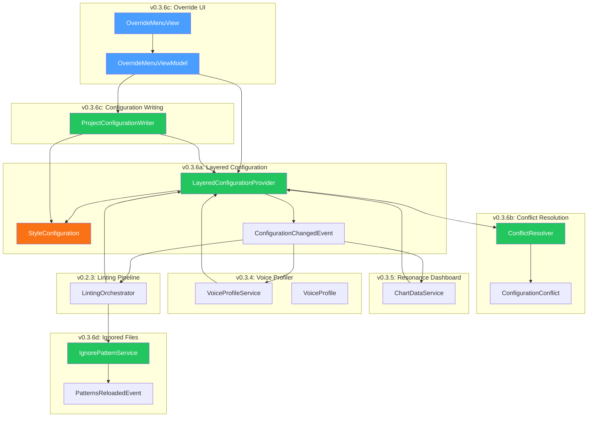
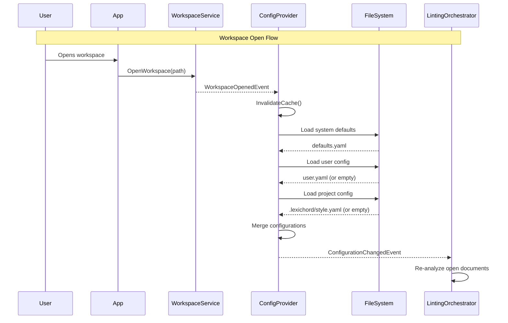
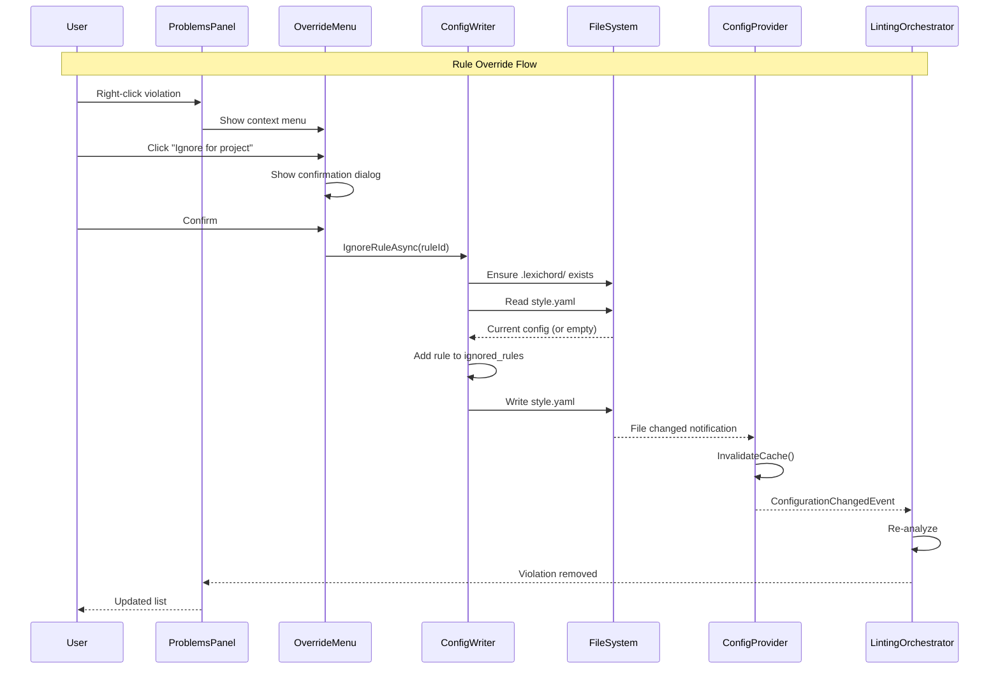
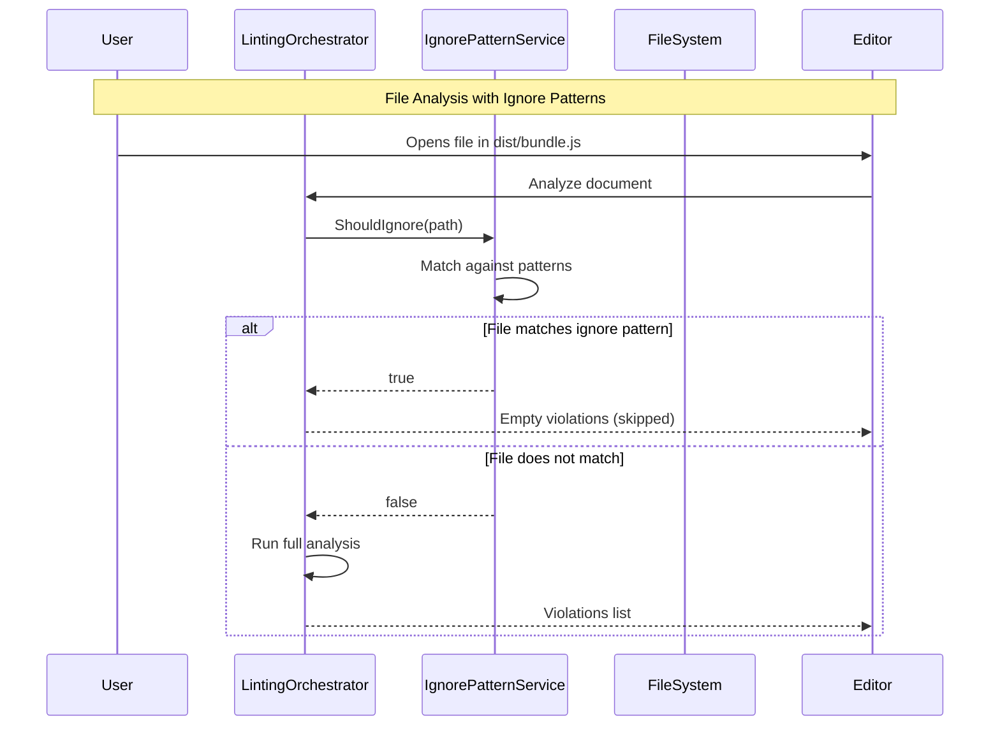

# LCS-DES-036: Design Specification Index — The Global Dictionary

## Document Control

| Field                | Value                                    |
| :------------------- | :--------------------------------------- |
| **Document ID**      | LCS-DES-036-INDEX                        |
| **Feature ID**       | INF-036                                  |
| **Feature Name**     | The Global Dictionary (Project Settings) |
| **Target Version**   | v0.3.6                                   |
| **Module Scope**     | Lexichord.Modules.Style                  |
| **Swimlane**         | Infrastructure                           |
| **License Tier**     | Writer Pro                               |
| **Feature Gate Key** | `FeatureFlags.Style.GlobalDictionary`    |
| **Status**           | Draft                                    |
| **Last Updated**     | 2026-01-26                               |

---

## 1. Executive Summary

**v0.3.6** delivers the **Global Dictionary** — a hierarchical configuration system that enables project-specific style overrides. This release transforms Lexichord from a single-context linter into a project-aware tool that respects contextual overrides, enabling writers to maintain different style configurations across projects while preserving global defaults.

### 1.1 The Problem

Writers working on multiple projects (technical docs, marketing copy, legal documents) must manually switch settings or tolerate false positives when global rules don't match project context. Teams cannot share project-specific style configurations, and generated files trigger unnecessary violations.

### 1.2 The Solution

Implement a Global Dictionary system that:

- **Provides Layered Configuration** with clear priority (Project > User > System)
- **Resolves Conflicts** automatically with project rules always winning
- **Offers Override UI** via context menu to ignore rules per-project
- **Supports Ignore Files** (`.lexichordignore`) with glob patterns to skip analysis

### 1.3 Business Value

| Value                  | Description                                                                 |
| :--------------------- | :-------------------------------------------------------------------------- |
| **Project Context**    | Writers maintain different style rules per project without manual switching |
| **Team Consistency**   | Teams share project-level configurations via version control                |
| **Override Hierarchy** | Project rules always win over global defaults                               |
| **Ignore Files**       | Skip analysis on generated files, minimized assets, and third-party content |
| **Enterprise Ready**   | Organizations distribute approved configurations across projects            |
| **Foundation**         | Enables future workspace presets and configuration templates                |

---

## 2. Related Documents

### 2.1 Scope Breakdown Document

The detailed scope breakdown for v0.3.6, including all sub-parts, implementation checklists, user stories, and acceptance criteria:

| Document                            | Description                             |
| :---------------------------------- | :-------------------------------------- |
| **[LCS-SBD-036](./LCS-SBD-036.md)** | Scope Breakdown — The Global Dictionary |

### 2.2 Sub-Part Design Specifications

Each sub-part has its own detailed design specification following the LDS-01 template:

| Sub-Part | Document                              | Title                 | Description                                     |
| :------- | :------------------------------------ | :-------------------- | :---------------------------------------------- |
| v0.3.6a  | **[LCS-DES-036a](./LCS-DES-036a.md)** | Layered Configuration | ConfigurationProvider merging dictionaries      |
| v0.3.6b  | **[LCS-DES-036b](./LCS-DES-036b.md)** | Conflict Resolution   | Project-wins semantics for conflicts            |
| v0.3.6c  | **[LCS-DES-036c](./LCS-DES-036c.md)** | Override UI           | Context menu for "Ignore rule for this project" |
| v0.3.6d  | **[LCS-DES-036d](./LCS-DES-036d.md)** | Ignored Files         | `.lexichordignore` with glob patterns           |

---

## 3. Architecture Overview

### 3.1 Component Diagram



### 3.2 Configuration Loading Flow



### 3.3 Override Flow



### 3.4 Ignore File Flow



---

## 4. Dependencies

### 4.1 Upstream Dependencies (Required)

| Interface                  | Source Version        | Purpose                                                            |
| :------------------------- | :-------------------- | :----------------------------------------------------------------- |
| `IVoiceProfileService`     | v0.3.4a               | Project-level profile defaults                                     |
| `VoiceProfile`             | v0.3.4a               | Profile constraints from configuration                             |
| `ProfileChangedEvent`      | v0.3.4a               | Trigger on profile default change                                  |
| `IChartDataService`        | v0.3.5a               | Project-level dashboard configuration                              |
| `IReadabilityService`      | v0.3.3c               | Readability thresholds per project                                 |
| `ITerminologyRepository`   | v0.2.2b               | Project-specific term additions/exclusions                         |
| `StyleTerm`                | v0.2.2a               | Term override model                                                |
| `ILintingOrchestrator`     | v0.2.3a               | Integration point for triggering re-analysis                       |
| `StyleViolation`           | v0.2.1b               | Override violations at project level                               |
| `IQuickFixService`         | v0.2.4d               | Context menu integration                                           |
| `IProblemsPanelViewModel`  | v0.2.6a               | Problems panel integration                                         |
| `IWorkspaceService`        | v0.1.2a               | Detect current workspace root                                      |
| `WorkspaceOpenedEvent`     | v0.1.2a               | Trigger project config loading                                     |
| `WorkspaceClosedEvent`     | v0.1.2a               | Clear project config cache                                         |
| `IRobustFileSystemWatcher` | v0.1.2b               | Config file change detection                                       |
| `ILicenseContext`          | v0.0.4c               | License tier checking                                              |
| `IConfiguration`           | v0.0.3d               | User-level preference storage (Microsoft.Extensions.Configuration) |
| `ViewModelBase`            | CommunityToolkit.Mvvm | Observable ViewModel base (external NuGet)                         |

### 4.2 NuGet Packages

| Package                                   | Version | Purpose                    |
| :---------------------------------------- | :------ | :------------------------- |
| `YamlDotNet`                              | 16.x    | YAML parsing/serialization |
| `Microsoft.Extensions.FileSystemGlobbing` | 9.x     | Glob pattern matching      |
| `System.Reactive`                         | 6.x     | File watcher debouncing    |
| `MediatR`                                 | 12.x    | Event publishing/handling  |
| `CommunityToolkit.Mvvm`                   | 8.x     | MVVM source generators     |

### 4.3 Downstream Consumers (Future)

| Version | Feature                 | Consumes                                             |
| :------ | :---------------------- | :--------------------------------------------------- |
| v0.3.7  | Performance Tuning      | `IIgnorePatternService` for skip-before-analysis     |
| v0.4.x  | Configuration Templates | `ILayeredConfigurationProvider` for template loading |
| v0.4.x  | Configuration Inspector | `IConflictResolver` for source visualization         |

---

## 5. License Gating Strategy

The Global Dictionary is a **Writer Pro** feature using a **Soft Gate** strategy.

### 5.1 Behavior by License Tier

| Tier       | Project Config | Override UI          | Ignore Patterns | Configuration Sources   |
| :--------- | :------------- | :------------------- | :-------------- | :---------------------- |
| Core       | Ignored        | Disabled + lock icon | Limited to 5    | System + User only      |
| Writer Pro | Full access    | Full access          | Unlimited       | System + User + Project |
| Teams      | Full access    | Full access          | Unlimited       | All sources             |
| Enterprise | Full access    | Full access          | Unlimited       | All sources             |

### 5.2 Implementation Pattern

```csharp
// In LayeredConfigurationProvider
public StyleConfiguration GetEffectiveConfiguration()
{
    var merged = MergeConfigurations(system, user);

    if (!_licenseContext.HasFeature(FeatureFlags.Style.GlobalDictionary))
    {
        _logger.LogDebug("Project configuration skipped: license not available");
        return merged; // Skip project config for non-licensed users
    }

    if (_workspaceService.IsWorkspaceOpen)
    {
        var project = LoadProjectConfiguration();
        if (project != null)
        {
            merged = MergeConfigurations(merged, project);
        }
    }

    return merged;
}

// In OverrideMenuViewModel
public bool CanIgnoreRule =>
    _licenseContext.HasFeature(FeatureFlags.Style.GlobalDictionary) &&
    _workspaceService.IsWorkspaceOpen;

// In IgnorePatternService
public void ReloadPatterns()
{
    var limit = _licenseContext.HasFeature(FeatureFlags.Style.GlobalDictionary)
        ? int.MaxValue
        : 5; // Core limited to 5 patterns

    patterns = patterns.Take(limit).ToList();
}
```

---

## 6. Configuration Hierarchy

### 6.1 Priority Order

```text
PRIORITY (highest to lowest):
│
├── Project Configuration (.lexichord/style.yaml)
│   └── Overrides everything for this project
│
├── User Configuration (%APPDATA%/Lexichord/style/user.yaml)
│   └── Personal preferences across all projects
│
└── System Defaults (embedded in assembly)
    └── Built-in defaults for all users
```

### 6.2 Storage Locations

| Source  | Path                                                | Scope             |
| :------ | :-------------------------------------------------- | :---------------- |
| System  | `Lexichord.Modules.Style/Resources/defaults.yaml`   | All users         |
| User    | `%APPDATA%/Lexichord/style/user.yaml` (Windows)     | Current user      |
| User    | `~/.config/lexichord/style/user.yaml` (Linux/macOS) | Current user      |
| Project | `{workspace}/.lexichord/style.yaml`                 | Current workspace |

### 6.3 Configuration File Structure

```yaml
# .lexichord/style.yaml
version: 1

# Profile settings
profile:
    default: Technical
    allow_switching: true

# Readability constraints
readability:
    target_grade_level: 10
    max_sentence_length: 25
    tolerance: 2

# Voice analysis settings
voice:
    passive_voice_threshold: 15
    flag_adverbs: true
    flag_weasels: true

# Term overrides
terminology:
    additions:
        - pattern: "proprietary-term"
          recommendation: "Use 'standard-term' instead"
          severity: warning
    exclusions:
        - "whitelist" # Allow this term in this project
        - "blacklist" # Allow this term in this project

# Ignored rules
ignored_rules:
    - "TERM-001" # Specific rule ID
    - "PASSIVE-*" # Wildcard pattern
```

---

## 7. Key Interfaces Summary

| Interface                       | Defined In | Purpose                           |
| :------------------------------ | :--------- | :-------------------------------- |
| `ILayeredConfigurationProvider` | v0.3.6a    | Hierarchical configuration access |
| `IConflictResolver`             | v0.3.6b    | Configuration conflict resolution |
| `IProjectConfigurationWriter`   | v0.3.6c    | Project config file updates       |
| `IIgnorePatternService`         | v0.3.6d    | Ignore file pattern matching      |

| Record/DTO                      | Defined In | Purpose                           |
| :------------------------------ | :--------- | :-------------------------------- |
| `StyleConfiguration`            | v0.3.6a    | Complete configuration settings   |
| `ConfigurationSource`           | v0.3.6a    | Priority level enum               |
| `ConfigurationChangedEventArgs` | v0.3.6a    | Configuration change notification |
| `ConfigurationConflict`         | v0.3.6b    | Conflict description record       |
| `TermAddition`                  | v0.3.6a    | Project-specific term to flag     |
| `PatternsReloadedEventArgs`     | v0.3.6d    | Pattern reload notification       |

---

## 8. Implementation Checklist Summary

| Sub-Part    | Tasks                          | Est. Hours   |
| :---------- | :----------------------------- | :----------- |
| v0.3.6a     | Layered Configuration Provider | 13.5         |
| v0.3.6b     | Conflict Resolution            | 8            |
| v0.3.6c     | Override UI                    | 11           |
| v0.3.6d     | Ignored Files                  | 8.5          |
| Integration | DI, wiring, E2E tests          | 3            |
| **Total**   |                                | **44 hours** |

See [LCS-SBD-036](./LCS-SBD-036.md) Section 4 for the detailed task breakdown.

---

## 9. Success Criteria Summary

| Category        | Criterion                          | Target     |
| :-------------- | :--------------------------------- | :--------- |
| **Performance** | Configuration load time            | < 50ms     |
| **Performance** | Configuration merge time           | < 10ms     |
| **Performance** | File change detection latency      | < 500ms    |
| **Performance** | Glob pattern matching (1000 files) | < 100ms    |
| **Performance** | Override action latency            | < 200ms    |
| **Reliability** | YAML file size limit               | < 100KB    |
| **License**     | Pattern count limit (Core)         | 5 patterns |

See [LCS-SBD-036](./LCS-SBD-036.md) Section 9 for full success metrics.

---

## 10. Test Coverage Summary

| Sub-Part | Unit Tests                          | Integration Tests                |
| :------- | :---------------------------------- | :------------------------------- |
| v0.3.6a  | Configuration merging, caching      | Workspace-triggered loading      |
| v0.3.6b  | Conflict detection, term resolution | End-to-end conflict logging      |
| v0.3.6c  | Override commands, license gating   | Full override flow               |
| v0.3.6d  | Glob matching, negation patterns    | Linting orchestrator integration |

See individual design specs for detailed test scenarios.

---

## 11. What This Enables

| Version | Feature                 | Uses From v0.3.6                    |
| :------ | :---------------------- | :---------------------------------- |
| v0.3.7  | Performance Tuning      | Skip ignored files before analysis  |
| v0.3.8  | Hardening               | Test configuration edge cases       |
| v0.4.x  | Configuration Templates | Pre-built configs for project types |
| v0.4.x  | Configuration Inspector | Visual source debugging             |
| v0.5.x  | Cloud Sync              | Team configuration sharing          |

---

## Document History

| Version | Date       | Author         | Changes       |
| :------ | :--------- | :------------- | :------------ |
| 1.0     | 2026-01-26 | Lead Architect | Initial draft |
