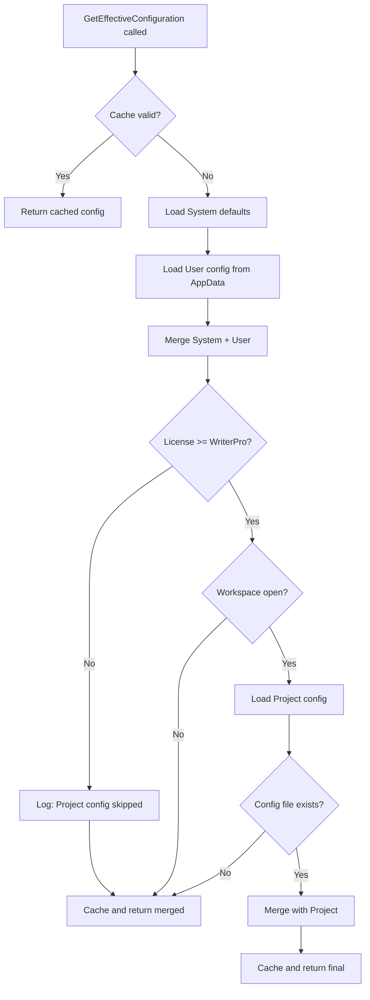
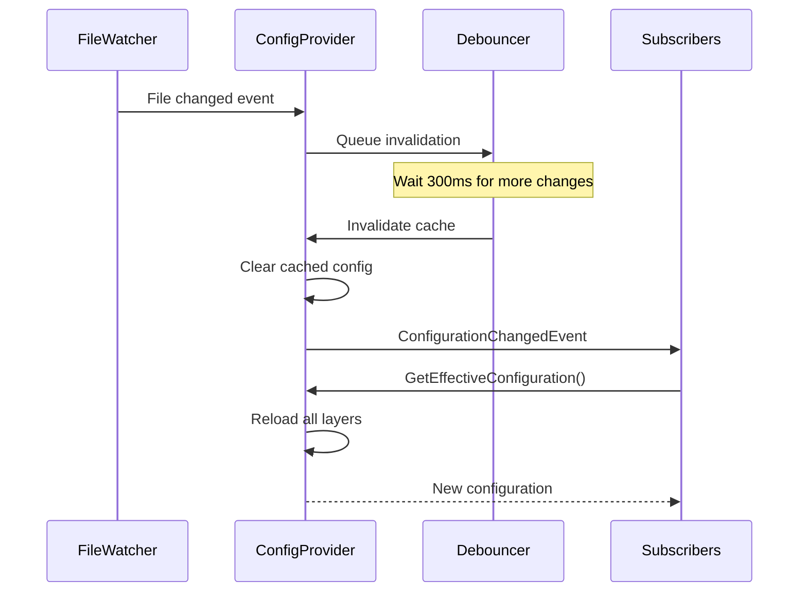

# LCS-DES-036a: Design Specification — Layered Configuration

## 1. Metadata & Categorization

| Field | Value | Description |
| :--- | :--- | :--- |
| **Feature ID** | `INF-036a` | Sub-part of INF-036 |
| **Feature Name** | `Layered Configuration Provider` | Hierarchical config merging |
| **Target Version** | `v0.3.6a` | First sub-part of v0.3.6 |
| **Module Scope** | `Lexichord.Modules.Style` | Style governance module |
| **Swimlane** | `Infrastructure` | Configuration infrastructure |
| **License Tier** | `Writer Pro` | Required for project-level config |
| **Feature Gate Key** | `FeatureFlags.Style.GlobalDictionary` | Shared with parent feature |
| **Author** | Lead Architect | |
| **Status** | `Draft` | |
| **Last Updated** | `2026-01-26` | |
| **Parent Document** | [LCS-DES-036-INDEX](./LCS-DES-036-INDEX.md) | |
| **Scope Breakdown** | [LCS-SBD-036 §3.1](./LCS-SBD-036.md#31-v036a-the-layered-configuration) | |

---

## 2. Executive Summary

### 2.1 The Requirement

Writers need project-specific style configurations without affecting global settings. Currently, all settings are global, forcing writers to manually toggle configurations when switching between projects with different style requirements (technical docs vs. marketing copy vs. legal documents).

> **Problem:** Writers on multiple projects must accept false positives or constantly reconfigure settings when switching contexts.

### 2.2 The Proposed Solution

Implement an `ILayeredConfigurationProvider` that:

1. Loads configuration from three hierarchical sources (System, User, Project)
2. Merges configurations with clear priority (Project > User > System)
3. Supports hot-reload when configuration files change
4. Exposes configuration change events for dependent services
5. Respects license tiers (Core users cannot access project config)

---

## 3. Architecture & Modular Strategy

### 3.1 Dependencies

#### 3.1.1 Upstream Dependencies

| Interface | Source Version | Purpose |
| :--- | :--- | :--- |
| `IWorkspaceService` | v0.1.2a | Workspace root detection |
| `WorkspaceOpenedEvent` | v0.1.2a | Trigger config loading |
| `WorkspaceClosedEvent` | v0.1.2a | Clear config cache |
| `IRobustFileSystemWatcher` | v0.1.2b | Config file change detection |
| `IConfigurationService` | v0.0.3d | User preferences access |
| `ILicenseContext` | v0.0.4c | License tier checking |

#### 3.1.2 NuGet Packages

| Package | Version | Purpose |
| :--- | :--- | :--- |
| `YamlDotNet` | 16.x | YAML parsing/serialization |
| `System.Reactive` | 6.x | Event debouncing |
| `MediatR` | 12.x | Event publishing |

### 3.2 Licensing Behavior

- **Load Behavior:** Soft Gate
  - [x] The Module loads, but project configuration is ignored for non-licensed users
- **Fallback Experience:**
  - Core users: System + User configuration only
  - Writer Pro+: Full three-layer configuration with project overrides

---

## 4. Data Contract (The API)

### 4.1 ILayeredConfigurationProvider Interface

```csharp
namespace Lexichord.Abstractions.Contracts;

/// <summary>
/// Provides merged configuration from multiple hierarchical sources.
/// Priority: Project > User > System defaults.
/// </summary>
/// <remarks>
/// <para>Configuration is loaded lazily and cached until explicitly invalidated
/// or a file change is detected.</para>
/// <para>Project configuration requires Writer Pro license. Core users receive
/// merged System + User configuration only.</para>
/// </remarks>
/// <example>
/// <code>
/// var config = _configProvider.GetEffectiveConfiguration();
/// var threshold = config.PassiveVoiceThreshold; // May come from any layer
/// </code>
/// </example>
public interface ILayeredConfigurationProvider
{
    /// <summary>
    /// Gets the effective configuration for the current context.
    /// </summary>
    /// <returns>Merged configuration with highest-priority values winning.</returns>
    StyleConfiguration GetEffectiveConfiguration();

    /// <summary>
    /// Gets the effective configuration asynchronously.
    /// </summary>
    /// <param name="ct">Cancellation token.</param>
    /// <returns>Merged configuration with highest-priority values winning.</returns>
    Task<StyleConfiguration> GetEffectiveConfigurationAsync(CancellationToken ct = default);

    /// <summary>
    /// Gets configuration from a specific source level.
    /// </summary>
    /// <param name="source">The configuration source level.</param>
    /// <returns>Configuration from that source, or null if not present.</returns>
    StyleConfiguration? GetConfiguration(ConfigurationSource source);

    /// <summary>
    /// Invalidates the configuration cache, forcing reload on next access.
    /// </summary>
    void InvalidateCache();

    /// <summary>
    /// Event raised when effective configuration changes.
    /// </summary>
    event EventHandler<ConfigurationChangedEventArgs>? ConfigurationChanged;
}
```

### 4.2 ConfigurationSource Enum

```csharp
namespace Lexichord.Abstractions.Contracts;

/// <summary>
/// Configuration source priority levels.
/// Higher values take precedence over lower values.
/// </summary>
public enum ConfigurationSource
{
    /// <summary>Built-in system defaults (lowest priority).</summary>
    System = 0,

    /// <summary>User-level preferences in app data.</summary>
    User = 1,

    /// <summary>Project-level overrides (highest priority).</summary>
    Project = 2
}
```

### 4.3 ConfigurationChangedEventArgs

```csharp
namespace Lexichord.Abstractions.Contracts;

/// <summary>
/// Event args for configuration change notifications.
/// </summary>
/// <param name="Source">The source that triggered the change (or null if multiple).</param>
/// <param name="PreviousConfiguration">The configuration before the change.</param>
/// <param name="NewConfiguration">The configuration after the change.</param>
public record ConfigurationChangedEventArgs(
    ConfigurationSource? Source,
    StyleConfiguration? PreviousConfiguration,
    StyleConfiguration NewConfiguration);
```

### 4.4 StyleConfiguration Record

```csharp
namespace Lexichord.Modules.Style.Models;

/// <summary>
/// Complete style configuration settings that can be loaded from
/// system defaults, user preferences, or project-level files.
/// </summary>
public record StyleConfiguration
{
    /// <summary>Configuration file version for compatibility checking.</summary>
    public int Version { get; init; } = 1;

    // Profile settings
    /// <summary>Default voice profile name.</summary>
    public string? DefaultProfile { get; init; }

    /// <summary>Whether users can switch profiles in this context.</summary>
    public bool AllowProfileSwitching { get; init; } = true;

    // Readability constraints
    /// <summary>Target Flesch-Kincaid grade level.</summary>
    public double? TargetGradeLevel { get; init; }

    /// <summary>Maximum words per sentence.</summary>
    public int? MaxSentenceLength { get; init; }

    /// <summary>Grade level tolerance (±).</summary>
    public double GradeLevelTolerance { get; init; } = 2;

    // Voice analysis settings
    /// <summary>Maximum passive voice percentage before warning.</summary>
    public double PassiveVoiceThreshold { get; init; } = 20;

    /// <summary>Whether to flag adverbs.</summary>
    public bool FlagAdverbs { get; init; } = true;

    /// <summary>Whether to flag weasel words.</summary>
    public bool FlagWeaselWords { get; init; } = true;

    // Term overrides
    /// <summary>Additional terms to flag in this context.</summary>
    public IReadOnlyList<TermAddition> TerminologyAdditions { get; init; } =
        Array.Empty<TermAddition>();

    /// <summary>Terms to exclude from flagging in this context.</summary>
    public IReadOnlyList<string> TerminologyExclusions { get; init; } =
        Array.Empty<string>();

    /// <summary>Rule IDs to ignore in this context.</summary>
    public IReadOnlyList<string> IgnoredRules { get; init; } =
        Array.Empty<string>();

    /// <summary>System defaults configuration.</summary>
    public static StyleConfiguration Defaults => new()
    {
        Version = 1,
        DefaultProfile = "Technical",
        AllowProfileSwitching = true,
        TargetGradeLevel = 10,
        MaxSentenceLength = 25,
        GradeLevelTolerance = 2,
        PassiveVoiceThreshold = 20,
        FlagAdverbs = true,
        FlagWeaselWords = true
    };
}

/// <summary>
/// A term addition for project/user configuration.
/// </summary>
/// <param name="Pattern">The term pattern to match.</param>
/// <param name="Recommendation">Suggested replacement.</param>
/// <param name="Severity">Violation severity.</param>
public record TermAddition(
    string Pattern,
    string? Recommendation,
    ViolationSeverity Severity = ViolationSeverity.Warning);
```

---

## 5. Implementation Logic

### 5.1 Configuration Loading Flow



### 5.2 Configuration Merge Algorithm

```text
MERGE configurations (lower, higher):
│
├── For each setting in StyleConfiguration:
│   ├── If higher.Setting is explicitly set (not null/default)
│   │   └── Use higher.Setting
│   └── Else
│       └── Use lower.Setting
│
├── Special handling for collections:
│   ├── TerminologyAdditions: Replace entirely (higher wins)
│   ├── TerminologyExclusions: Concatenate and dedupe
│   └── IgnoredRules: Concatenate and dedupe
│
└── Return merged configuration
```

### 5.3 File Locations

| Source | Windows Path | Linux/macOS Path |
| :--- | :--- | :--- |
| System | Embedded resource | Embedded resource |
| User | `%APPDATA%/Lexichord/style/user.yaml` | `~/.config/lexichord/style/user.yaml` |
| Project | `{workspace}/.lexichord/style.yaml` | `{workspace}/.lexichord/style.yaml` |

### 5.4 YAML Configuration Format

```yaml
# .lexichord/style.yaml
version: 1

# Profile settings
profile:
  default: Technical
  allow_switching: true

# Readability constraints
readability:
  target_grade_level: 10
  max_sentence_length: 25
  tolerance: 2

# Voice analysis settings
voice:
  passive_voice_threshold: 15
  flag_adverbs: true
  flag_weasels: true

# Term overrides
terminology:
  additions:
    - pattern: "proprietary-term"
      recommendation: "Use 'standard-term' instead"
      severity: warning
  exclusions:
    - "whitelist"
    - "blacklist"

# Ignored rules
ignored_rules:
  - "TERM-001"
  - "PASSIVE-*"
```

### 5.5 Hot-Reload Strategy



---

## 6. Data Persistence

**None required for this sub-part.** Configuration is read from files but not written. Writing is handled by `IProjectConfigurationWriter` (v0.3.6c).

---

## 7. UI/UX Specifications

**None.** This is a backend service. UI integration occurs through:
- `ILintingOrchestrator` subscribing to `ConfigurationChangedEvent`
- `ResonanceDashboardViewModel` refreshing on configuration change
- `VoiceProfileService` updating default profile on change

---

## 8. Observability & Logging

| Level | Message Template |
| :--- | :--- |
| Debug | `"Loading configuration from {Source}: {Path}"` |
| Debug | `"Configuration merged: {KeyCount} keys from {Source}"` |
| Info | `"Effective configuration loaded in {ElapsedMs}ms"` |
| Debug | `"Configuration cache invalidated"` |
| Warning | `"Failed to load configuration from {Path}: {Error}"` |
| Debug | `"Project configuration skipped: license not available"` |
| Debug | `"Project configuration skipped: no workspace open"` |
| Debug | `"File watcher detected change in {Path}"` |

---

## 9. Security & Safety

| Risk | Level | Mitigation |
| :--- | :--- | :--- |
| YAML parsing errors | Medium | Catch exceptions, return defaults, log warning |
| Large config files | Low | Limit file size to 100KB |
| Invalid YAML syntax | Medium | Validate schema, provide clear error messages |
| Path traversal | Low | Sanitize paths, stay within workspace bounds |

---

## 10. Acceptance Criteria

### 10.1 Functional Criteria

| # | Given | When | Then |
| :--- | :--- | :--- | :--- |
| 1 | No project/user config | Configuration loaded | System defaults returned |
| 2 | User config exists | Configuration loaded | User overrides system defaults |
| 3 | Project config exists | Writer Pro user loads config | Project overrides user |
| 4 | Project config exists | Core user loads config | Project config ignored |
| 5 | Config file changes | File watcher detects | Cache invalidated, event raised |
| 6 | Workspace opened | WorkspaceOpenedEvent received | Project config loaded |
| 7 | Workspace closed | WorkspaceClosedEvent received | Project config cleared |
| 8 | Invalid YAML in file | Configuration loaded | Warning logged, defaults used |

### 10.2 Performance Criteria

| # | Given | When | Then |
| :--- | :--- | :--- | :--- |
| 9 | Any configuration | Full load | Completes in < 50ms |
| 10 | Configuration cached | Subsequent access | Returns in < 1ms |
| 11 | File change detected | Hot-reload | Completes in < 500ms |

---

## 11. Test Scenarios

### 11.1 Unit Tests

```csharp
[Trait("Category", "Unit")]
[Trait("Feature", "v0.3.6a")]
public class LayeredConfigurationProviderTests
{
    [Fact]
    public void GetEffectiveConfiguration_NoProject_ReturnsMergedUserAndSystem()
    {
        // Arrange
        var mockWorkspace = new Mock<IWorkspaceService>();
        mockWorkspace.Setup(w => w.IsWorkspaceOpen).Returns(false);

        var mockLicense = new Mock<ILicenseContext>();
        mockLicense.Setup(l => l.HasFeature(It.IsAny<string>())).Returns(true);

        var provider = CreateProvider(
            system: new StyleConfiguration { PassiveVoiceThreshold = 20 },
            user: new StyleConfiguration { PassiveVoiceThreshold = 15 },
            workspaceService: mockWorkspace.Object,
            licenseContext: mockLicense.Object);

        // Act
        var result = provider.GetEffectiveConfiguration();

        // Assert
        result.PassiveVoiceThreshold.Should().Be(15); // User wins over System
    }

    [Fact]
    public void GetEffectiveConfiguration_WithProject_ProjectWins()
    {
        // Arrange
        var mockWorkspace = new Mock<IWorkspaceService>();
        mockWorkspace.Setup(w => w.IsWorkspaceOpen).Returns(true);
        mockWorkspace.Setup(w => w.RootPath).Returns("/project");

        var mockLicense = new Mock<ILicenseContext>();
        mockLicense.Setup(l => l.HasFeature(FeatureFlags.Style.GlobalDictionary)).Returns(true);

        var provider = CreateProvider(
            system: new StyleConfiguration { PassiveVoiceThreshold = 20 },
            user: new StyleConfiguration { PassiveVoiceThreshold = 15 },
            project: new StyleConfiguration { PassiveVoiceThreshold = 10 },
            workspaceService: mockWorkspace.Object,
            licenseContext: mockLicense.Object);

        // Act
        var result = provider.GetEffectiveConfiguration();

        // Assert
        result.PassiveVoiceThreshold.Should().Be(10); // Project wins
    }

    [Fact]
    public void GetEffectiveConfiguration_CoreLicense_IgnoresProjectConfig()
    {
        // Arrange
        var mockWorkspace = new Mock<IWorkspaceService>();
        mockWorkspace.Setup(w => w.IsWorkspaceOpen).Returns(true);
        mockWorkspace.Setup(w => w.RootPath).Returns("/project");

        var mockLicense = new Mock<ILicenseContext>();
        mockLicense.Setup(l => l.HasFeature(FeatureFlags.Style.GlobalDictionary)).Returns(false);

        var provider = CreateProvider(
            system: new StyleConfiguration { PassiveVoiceThreshold = 20 },
            user: new StyleConfiguration { PassiveVoiceThreshold = 15 },
            project: new StyleConfiguration { PassiveVoiceThreshold = 10 },
            workspaceService: mockWorkspace.Object,
            licenseContext: mockLicense.Object);

        // Act
        var result = provider.GetEffectiveConfiguration();

        // Assert
        result.PassiveVoiceThreshold.Should().Be(15); // User wins, project ignored
    }

    [Fact]
    public void GetEffectiveConfiguration_TermExclusions_AreConcatenated()
    {
        // Arrange
        var provider = CreateProvider(
            system: new StyleConfiguration { TerminologyExclusions = new[] { "term1" } },
            user: new StyleConfiguration { TerminologyExclusions = new[] { "term2" } },
            project: new StyleConfiguration { TerminologyExclusions = new[] { "term3" } });

        // Act
        var result = provider.GetEffectiveConfiguration();

        // Assert
        result.TerminologyExclusions.Should().BeEquivalentTo(new[] { "term1", "term2", "term3" });
    }

    [Fact]
    public void InvalidateCache_RaisesConfigurationChangedEvent()
    {
        // Arrange
        var provider = CreateProvider();
        var eventRaised = false;
        provider.ConfigurationChanged += (_, _) => eventRaised = true;

        // Warm cache
        provider.GetEffectiveConfiguration();

        // Act
        provider.InvalidateCache();

        // Assert
        eventRaised.Should().BeTrue();
    }

    [Fact]
    public void GetConfiguration_SpecificSource_ReturnsOnlyThatSource()
    {
        // Arrange
        var provider = CreateProvider(
            system: new StyleConfiguration { PassiveVoiceThreshold = 20 },
            user: new StyleConfiguration { PassiveVoiceThreshold = 15 });

        // Act
        var userConfig = provider.GetConfiguration(ConfigurationSource.User);

        // Assert
        userConfig.Should().NotBeNull();
        userConfig!.PassiveVoiceThreshold.Should().Be(15);
    }
}
```

### 11.2 Integration Tests

```csharp
[Trait("Category", "Integration")]
[Trait("Feature", "v0.3.6a")]
public class LayeredConfigurationIntegrationTests
{
    [Fact]
    public async Task WorkspaceOpenedEvent_TriggersConfigReload()
    {
        // Arrange
        var tempDir = CreateTempWorkspace();
        WriteProjectConfig(tempDir, new StyleConfiguration { PassiveVoiceThreshold = 5 });

        var provider = CreateRealProvider();
        var initialConfig = provider.GetEffectiveConfiguration();

        // Act - Simulate workspace open
        await _workspaceService.OpenWorkspaceAsync(tempDir);

        var newConfig = provider.GetEffectiveConfiguration();

        // Assert
        initialConfig.PassiveVoiceThreshold.Should().NotBe(5);
        newConfig.PassiveVoiceThreshold.Should().Be(5);
    }

    [Fact]
    public async Task FileChange_TriggersHotReload()
    {
        // Arrange
        var tempDir = CreateTempWorkspace();
        WriteProjectConfig(tempDir, new StyleConfiguration { PassiveVoiceThreshold = 10 });

        var provider = CreateRealProvider();
        await _workspaceService.OpenWorkspaceAsync(tempDir);

        var configChangedEvent = new TaskCompletionSource<ConfigurationChangedEventArgs>();
        provider.ConfigurationChanged += (_, args) => configChangedEvent.SetResult(args);

        // Act - Modify file
        WriteProjectConfig(tempDir, new StyleConfiguration { PassiveVoiceThreshold = 5 });

        // Assert
        var args = await configChangedEvent.Task.WaitAsync(TimeSpan.FromSeconds(2));
        args.NewConfiguration.PassiveVoiceThreshold.Should().Be(5);
    }
}
```

---

## 12. Code Example

### 12.1 LayeredConfigurationProvider Implementation

```csharp
namespace Lexichord.Modules.Style.Services;

/// <summary>
/// Provides merged configuration from system, user, and project sources.
/// </summary>
public sealed class LayeredConfigurationProvider : ILayeredConfigurationProvider, IDisposable
{
    private readonly IWorkspaceService _workspaceService;
    private readonly IConfigurationService _configService;
    private readonly ILicenseContext _licenseContext;
    private readonly ILogger<LayeredConfigurationProvider> _logger;
    private readonly IFileSystemWatcher? _fileWatcher;
    private readonly Subject<Unit> _invalidateSubject = new();
    private readonly IDisposable _invalidateSubscription;

    private StyleConfiguration? _cachedConfig;
    private DateTime _cacheTime;
    private static readonly TimeSpan CacheDuration = TimeSpan.FromSeconds(5);
    private static readonly TimeSpan DebounceTime = TimeSpan.FromMilliseconds(300);

    public event EventHandler<ConfigurationChangedEventArgs>? ConfigurationChanged;

    public LayeredConfigurationProvider(
        IWorkspaceService workspaceService,
        IConfigurationService configService,
        ILicenseContext licenseContext,
        ILogger<LayeredConfigurationProvider> logger,
        IFileSystemWatcher? fileWatcher = null)
    {
        _workspaceService = workspaceService;
        _configService = configService;
        _licenseContext = licenseContext;
        _logger = logger;
        _fileWatcher = fileWatcher;

        // Debounced invalidation
        _invalidateSubscription = _invalidateSubject
            .Throttle(DebounceTime)
            .Subscribe(_ => InvalidateCacheInternal());

        // Subscribe to workspace events
        _workspaceService.WorkspaceOpened += OnWorkspaceOpened;
        _workspaceService.WorkspaceClosed += OnWorkspaceClosed;

        // Setup file watcher if available
        SetupFileWatcher();
    }

    public StyleConfiguration GetEffectiveConfiguration()
    {
        if (_cachedConfig != null && DateTime.UtcNow - _cacheTime < CacheDuration)
        {
            return _cachedConfig;
        }

        var stopwatch = Stopwatch.StartNew();

        // 1. Load system defaults
        var system = StyleConfiguration.Defaults;
        _logger.LogDebug("Loaded system defaults");

        // 2. Load user configuration
        var user = LoadUserConfiguration();
        var merged = MergeConfigurations(system, user);

        if (user != null)
        {
            _logger.LogDebug("Merged user configuration");
        }

        // 3. Load project configuration (if licensed and workspace open)
        if (_licenseContext.HasFeature(FeatureFlags.Style.GlobalDictionary))
        {
            if (_workspaceService.IsWorkspaceOpen)
            {
                var project = LoadProjectConfiguration();
                if (project != null)
                {
                    merged = MergeConfigurations(merged, project);
                    _logger.LogDebug("Merged project configuration");
                }
            }
            else
            {
                _logger.LogDebug("Project configuration skipped: no workspace open");
            }
        }
        else
        {
            _logger.LogDebug("Project configuration skipped: license not available");
        }

        stopwatch.Stop();
        _logger.LogInformation("Effective configuration loaded in {ElapsedMs}ms",
            stopwatch.ElapsedMilliseconds);

        _cachedConfig = merged;
        _cacheTime = DateTime.UtcNow;

        return merged;
    }

    public Task<StyleConfiguration> GetEffectiveConfigurationAsync(CancellationToken ct = default)
    {
        return Task.FromResult(GetEffectiveConfiguration());
    }

    public StyleConfiguration? GetConfiguration(ConfigurationSource source)
    {
        return source switch
        {
            ConfigurationSource.System => StyleConfiguration.Defaults,
            ConfigurationSource.User => LoadUserConfiguration(),
            ConfigurationSource.Project => LoadProjectConfiguration(),
            _ => null
        };
    }

    public void InvalidateCache()
    {
        _invalidateSubject.OnNext(Unit.Default);
    }

    private void InvalidateCacheInternal()
    {
        var previous = _cachedConfig;
        _cachedConfig = null;
        _logger.LogDebug("Configuration cache invalidated");

        var newConfig = GetEffectiveConfiguration();
        ConfigurationChanged?.Invoke(this, new ConfigurationChangedEventArgs(
            Source: null,
            PreviousConfiguration: previous,
            NewConfiguration: newConfig));
    }

    private StyleConfiguration? LoadUserConfiguration()
    {
        var userPath = GetUserConfigPath();

        if (!File.Exists(userPath))
        {
            return null;
        }

        try
        {
            _logger.LogDebug("Loading configuration from {Source}: {Path}",
                ConfigurationSource.User, userPath);

            var yaml = File.ReadAllText(userPath);
            return ParseYamlConfiguration(yaml);
        }
        catch (Exception ex)
        {
            _logger.LogWarning("Failed to load configuration from {Path}: {Error}",
                userPath, ex.Message);
            return null;
        }
    }

    private StyleConfiguration? LoadProjectConfiguration()
    {
        if (!_workspaceService.IsWorkspaceOpen || _workspaceService.RootPath == null)
        {
            return null;
        }

        var projectPath = Path.Combine(
            _workspaceService.RootPath,
            ".lexichord",
            "style.yaml");

        if (!File.Exists(projectPath))
        {
            return null;
        }

        try
        {
            var fileInfo = new FileInfo(projectPath);
            if (fileInfo.Length > 100 * 1024) // 100KB limit
            {
                _logger.LogWarning("Configuration file too large: {Path} ({Size} bytes)",
                    projectPath, fileInfo.Length);
                return null;
            }

            _logger.LogDebug("Loading configuration from {Source}: {Path}",
                ConfigurationSource.Project, projectPath);

            var yaml = File.ReadAllText(projectPath);
            return ParseYamlConfiguration(yaml);
        }
        catch (Exception ex)
        {
            _logger.LogWarning("Failed to load configuration from {Path}: {Error}",
                projectPath, ex.Message);
            return null;
        }
    }

    private static StyleConfiguration? ParseYamlConfiguration(string yaml)
    {
        var deserializer = new DeserializerBuilder()
            .WithNamingConvention(UnderscoredNamingConvention.Instance)
            .IgnoreUnmatchedProperties()
            .Build();

        return deserializer.Deserialize<StyleConfiguration>(yaml);
    }

    private StyleConfiguration MergeConfigurations(
        StyleConfiguration lower,
        StyleConfiguration? higher)
    {
        if (higher == null) return lower;

        return lower with
        {
            Version = higher.Version > 0 ? higher.Version : lower.Version,
            DefaultProfile = higher.DefaultProfile ?? lower.DefaultProfile,
            AllowProfileSwitching = higher.AllowProfileSwitching,
            TargetGradeLevel = higher.TargetGradeLevel ?? lower.TargetGradeLevel,
            MaxSentenceLength = higher.MaxSentenceLength ?? lower.MaxSentenceLength,
            GradeLevelTolerance = higher.GradeLevelTolerance,
            PassiveVoiceThreshold = higher.PassiveVoiceThreshold,
            FlagAdverbs = higher.FlagAdverbs,
            FlagWeaselWords = higher.FlagWeaselWords,
            TerminologyAdditions = higher.TerminologyAdditions.Count > 0
                ? higher.TerminologyAdditions
                : lower.TerminologyAdditions,
            TerminologyExclusions = lower.TerminologyExclusions
                .Concat(higher.TerminologyExclusions)
                .Distinct()
                .ToList(),
            IgnoredRules = lower.IgnoredRules
                .Concat(higher.IgnoredRules)
                .Distinct()
                .ToList()
        };
    }

    private static string GetUserConfigPath()
    {
        var appData = Environment.GetFolderPath(Environment.SpecialFolder.ApplicationData);
        return Path.Combine(appData, "Lexichord", "style", "user.yaml");
    }

    private void SetupFileWatcher()
    {
        if (_fileWatcher == null || !_workspaceService.IsWorkspaceOpen)
        {
            return;
        }

        var configDir = Path.Combine(_workspaceService.RootPath!, ".lexichord");

        if (Directory.Exists(configDir))
        {
            _fileWatcher.Watch(configDir, "style.yaml", () =>
            {
                _logger.LogDebug("File watcher detected change in {Path}",
                    Path.Combine(configDir, "style.yaml"));
                InvalidateCache();
            });
        }
    }

    private void OnWorkspaceOpened(object? sender, WorkspaceOpenedEventArgs e)
    {
        SetupFileWatcher();
        InvalidateCache();
    }

    private void OnWorkspaceClosed(object? sender, EventArgs e)
    {
        InvalidateCache();
    }

    public void Dispose()
    {
        _invalidateSubscription.Dispose();
        _invalidateSubject.Dispose();
        _workspaceService.WorkspaceOpened -= OnWorkspaceOpened;
        _workspaceService.WorkspaceClosed -= OnWorkspaceClosed;
    }
}
```

---

## 13. DI Registration

```csharp
// In StyleModule.cs
services.AddSingleton<ILayeredConfigurationProvider, LayeredConfigurationProvider>();
```

---

## Document History

| Version | Date | Author | Changes |
| :--- | :--- | :--- | :--- |
| 1.0 | 2026-01-26 | Lead Architect | Initial draft |
