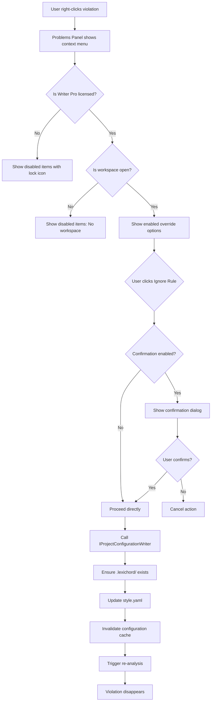
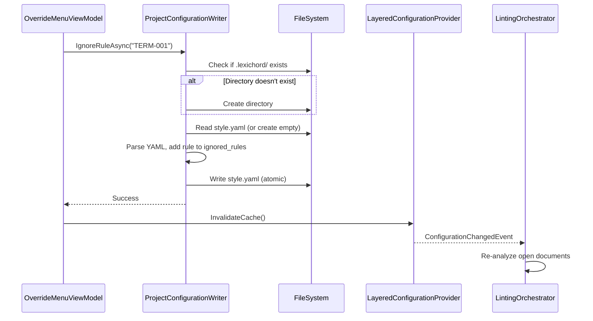

# LCS-DES-036c: Design Specification — Override UI

## 1. Metadata & Categorization

| Field | Value | Description |
| :--- | :--- | :--- |
| **Feature ID** | `INF-036c` | Sub-part of INF-036 |
| **Feature Name** | `Rule Override Context Menu` | Ignore rules via UI |
| **Target Version** | `v0.3.6c` | Third sub-part of v0.3.6 |
| **Module Scope** | `Lexichord.Modules.Style` | Style governance module |
| **Swimlane** | `Infrastructure` | Configuration infrastructure |
| **License Tier** | `Writer Pro` | Required for project-level config |
| **Feature Gate Key** | `FeatureFlags.Style.GlobalDictionary` | Shared with parent feature |
| **Author** | Lead Architect | |
| **Status** | `Draft` | |
| **Last Updated** | `2026-01-26` | |
| **Parent Document** | [LCS-DES-036-INDEX](./LCS-DES-036-INDEX.md) | |
| **Scope Breakdown** | [LCS-SBD-036 §3.3](./LCS-SBD-036.md#33-v036c-override-ui) | |

---

## 2. Executive Summary

### 2.1 The Requirement

Writers need a fast, discoverable way to ignore rules for specific projects without manually editing YAML files. When a rule produces false positives in a project context, writers should be able to suppress it with minimal friction while understanding the scope of their action.

> **Problem:** Manual YAML editing is error-prone and creates friction for non-technical writers.

### 2.2 The Proposed Solution

Implement a context menu in the Problems Panel that:

1. Offers "Ignore this rule for this project" option on violations
2. Shows confirmation dialog explaining scope (affects all team members)
3. Automatically creates/updates `.lexichord/style.yaml`
4. Triggers re-analysis to immediately reflect changes
5. Shows visual indicator for overridden rules

---

## 3. Architecture & Modular Strategy

### 3.1 Dependencies

#### 3.1.1 Upstream Dependencies

| Interface | Source Version | Purpose |
| :--- | :--- | :--- |
| `ILayeredConfigurationProvider` | v0.3.6a | Configuration access and invalidation |
| `IConflictResolver` | v0.3.6b | Term override logic |
| `IQuickFixService` | v0.2.4d | Context menu integration |
| `IProblemsPanelViewModel` | v0.2.6a | Problems panel integration |
| `IWorkspaceService` | v0.1.2a | Workspace detection |
| `ILicenseContext` | v0.0.4c | License tier checking |
| `ILintingOrchestrator` | v0.2.3a | Trigger re-analysis |
| `ViewModelBase` | v0.1.1 | MVVM base class |

#### 3.1.2 NuGet Packages

| Package | Version | Purpose |
| :--- | :--- | :--- |
| `YamlDotNet` | 16.x | YAML serialization |
| `CommunityToolkit.Mvvm` | 8.x | MVVM source generators |
| `MediatR` | 12.x | Event publishing |

### 3.2 Licensing Behavior

- **Load Behavior:** UI Gate
  - [x] UI elements are hidden/disabled for unlicensed users
- **Fallback Experience:**
  - Core users: Context menu items hidden or show lock icon
  - Clicking locked item shows upgrade prompt modal

---

## 4. Data Contract (The API)

### 4.1 IProjectConfigurationWriter Interface

```csharp
namespace Lexichord.Abstractions.Contracts;

/// <summary>
/// Writes configuration overrides to project-level configuration files.
/// </summary>
/// <remarks>
/// <para>All write operations are atomic - either the entire change succeeds
/// or the file is left unchanged.</para>
/// <para>The writer automatically creates the .lexichord directory and
/// style.yaml file if they don't exist.</para>
/// </remarks>
/// <example>
/// <code>
/// // Ignore a specific rule
/// await _writer.IgnoreRuleAsync("TERM-001");
///
/// // Exclude a term
/// await _writer.ExcludeTermAsync("whitelist");
/// </code>
/// </example>
public interface IProjectConfigurationWriter
{
    /// <summary>
    /// Adds a rule to the project's ignored rules list.
    /// </summary>
    /// <param name="ruleId">The rule ID to ignore (e.g., "TERM-001").</param>
    /// <param name="ct">Cancellation token.</param>
    /// <returns>True if successfully written, false if operation failed.</returns>
    Task<bool> IgnoreRuleAsync(string ruleId, CancellationToken ct = default);

    /// <summary>
    /// Removes a rule from the project's ignored rules list.
    /// </summary>
    /// <param name="ruleId">The rule ID to restore.</param>
    /// <param name="ct">Cancellation token.</param>
    /// <returns>True if successfully written, false if operation failed.</returns>
    Task<bool> RestoreRuleAsync(string ruleId, CancellationToken ct = default);

    /// <summary>
    /// Adds a term to the project's exclusions list.
    /// </summary>
    /// <param name="term">The term pattern to exclude.</param>
    /// <param name="ct">Cancellation token.</param>
    /// <returns>True if successfully written, false if operation failed.</returns>
    Task<bool> ExcludeTermAsync(string term, CancellationToken ct = default);

    /// <summary>
    /// Removes a term from the project's exclusions list.
    /// </summary>
    /// <param name="term">The term pattern to restore.</param>
    /// <param name="ct">Cancellation token.</param>
    /// <returns>True if successfully written, false if operation failed.</returns>
    Task<bool> RestoreTermAsync(string term, CancellationToken ct = default);

    /// <summary>
    /// Checks if a rule is currently ignored in the project configuration.
    /// </summary>
    /// <param name="ruleId">The rule ID to check.</param>
    /// <returns>True if the rule is ignored.</returns>
    bool IsRuleIgnored(string ruleId);

    /// <summary>
    /// Checks if a term is currently excluded in the project configuration.
    /// </summary>
    /// <param name="term">The term to check.</param>
    /// <returns>True if the term is excluded.</returns>
    bool IsTermExcluded(string term);

    /// <summary>
    /// Creates the project configuration file if it doesn't exist.
    /// </summary>
    /// <param name="ct">Cancellation token.</param>
    /// <returns>Path to the configuration file.</returns>
    Task<string> EnsureConfigurationFileAsync(CancellationToken ct = default);

    /// <summary>
    /// Gets the path to the project configuration file.
    /// </summary>
    /// <returns>Path to config file, or null if no workspace is open.</returns>
    string? GetConfigurationFilePath();
}
```

### 4.2 OverrideAction Enum

```csharp
namespace Lexichord.Modules.Style.Models;

/// <summary>
/// Types of override actions available in the context menu.
/// </summary>
public enum OverrideAction
{
    /// <summary>Ignore a specific rule for this project.</summary>
    IgnoreRule,

    /// <summary>Restore a previously ignored rule.</summary>
    RestoreRule,

    /// <summary>Exclude a term from flagging in this project.</summary>
    ExcludeTerm,

    /// <summary>Restore a previously excluded term.</summary>
    RestoreTerm
}
```

---

## 5. Implementation Logic

### 5.1 Context Menu Integration Flow



### 5.2 Configuration Writing Flow



### 5.3 YAML Update Logic

```text
UPDATE project configuration to ignore rule:
│
├── Read existing style.yaml (or create new)
│   └── Parse YAML to StyleConfiguration object
│
├── Check if rule already in ignored_rules
│   └── YES → Return success (no-op)
│
├── Add rule to ignored_rules list
│   └── Maintain alphabetical order
│
├── Serialize back to YAML
│   └── Preserve existing formatting where possible
│
├── Write to temporary file
│   └── {workspace}/.lexichord/style.yaml.tmp
│
├── Atomic rename to target
│   └── Move .tmp to style.yaml
│
└── Return success
```

---

## 6. Data Persistence

**File-based persistence.** Configuration is written to `{workspace}/.lexichord/style.yaml`.

### 6.1 File Structure

```yaml
# .lexichord/style.yaml
# Project-level style configuration
# This file is auto-generated but can be manually edited

version: 1

# Rules ignored for this project
ignored_rules:
  - TERM-001
  - PASSIVE-003

# Terms excluded for this project
terminology:
  exclusions:
    - whitelist
    - blacklist
```

### 6.2 Atomic Write Strategy

```csharp
// Atomic write to prevent corruption
var tempPath = targetPath + ".tmp";
await File.WriteAllTextAsync(tempPath, yaml, ct);
File.Move(tempPath, targetPath, overwrite: true);
```

---

## 7. UI/UX Specifications

### 7.1 Context Menu Layout

```text
┌─────────────────────────────────────────────────────────────────────┐
│  Problems                                                      [×]  │
├─────────────────────────────────────────────────────────────────────┤
│  ⚠ Line 42: Consider replacing "whitelist" with "allowlist"         │
│    └─ [Right-click]                                                 │
│       ┌───────────────────────────────────────────────────────────┐ │
│       │ 🔧 Apply Quick Fix                                   Ctrl+. │
│       │ ──────────────────────────────────────────────────────────│ │
│       │ 🚫 Ignore "whitelist" for this project                     │ │
│       │ 🚫 Ignore rule TERM-whitelist for this project             │ │
│       │ ──────────────────────────────────────────────────────────│ │
│       │ 📋 Copy Message                                            │ │
│       │ 📖 Learn More...                                           │ │
│       └───────────────────────────────────────────────────────────┘ │
└─────────────────────────────────────────────────────────────────────┘
```

### 7.2 Confirmation Dialog

```text
┌─────────────────────────────────────────────────────────────────────┐
│  Ignore Rule for Project                                            │
├─────────────────────────────────────────────────────────────────────┤
│                                                                     │
│  This will add the following rule to your project's ignore list:   │
│                                                                     │
│    Rule: TERM-whitelist                                             │
│    Pattern: "whitelist"                                             │
│                                                                     │
│  The rule will be added to:                                         │
│    .lexichord/style.yaml                                            │
│                                                                     │
│  ⚠ This affects all team members who use this project.              │
│                                                                     │
│  ☐ Don't ask again for this session                                 │
│                                                                     │
│                              [Cancel]  [Ignore Rule]                │
└─────────────────────────────────────────────────────────────────────┘
```

### 7.3 Unlicensed State

```text
┌───────────────────────────────────────────────────────────────────────┐
│ 🔒 Ignore "whitelist" for this project          Writer Pro Feature    │
│    └─ [Click shows upgrade modal]                                     │
└───────────────────────────────────────────────────────────────────────┘
```

### 7.4 Override Indicator Badge

When a violation is shown for a rule that has been partially overridden elsewhere:

```text
│  ⚠ Line 58: Passive voice detected         [Ignored in 2 files]  │
```

### 7.5 Component Styling Requirements

| Component | Theme Resource | Notes |
| :--- | :--- | :--- |
| Menu Item | `LexMenuItem` theme | Standard context menu styling |
| Menu Separator | `MenuSeparator` | 1px horizontal line |
| Menu Icon | Material Icons | 24x24, Text.Primary color |
| Disabled Menu Item | Opacity 50% | For unlicensed features |
| Lock Icon | `LockOutline` | 16x16, shown for unlicensed |
| Confirmation Dialog | `LexDialog` theme | Standard dialog styling |
| Warning Icon | `AlertTriangle` | Orange, 24x24 |
| Checkbox | `LexCheckBox` | For "Don't ask again" |

---

## 8. Observability & Logging

| Level | Message Template |
| :--- | :--- |
| Info | `"Rule {RuleId} added to project ignore list"` |
| Info | `"Rule {RuleId} removed from project ignore list"` |
| Info | `"Term '{Term}' added to project exclusions"` |
| Info | `"Term '{Term}' removed from project exclusions"` |
| Debug | `"Created project configuration file: {Path}"` |
| Debug | `"Updated project configuration file: {Path}"` |
| Warning | `"Failed to write project configuration: {Error}"` |
| Debug | `"Override context menu shown for violation: {RuleId}"` |
| Debug | `"User confirmed override action: {Action}"` |
| Debug | `"User cancelled override action"` |

---

## 9. Security & Safety

| Risk | Level | Mitigation |
| :--- | :--- | :--- |
| Arbitrary file write | Low | Only write to `.lexichord/` directory |
| Path traversal | Low | Validate workspace root, sanitize paths |
| YAML injection | Low | Use proper serialization, not string concat |
| Concurrent writes | Medium | Use atomic write with temp file rename |
| Config file corruption | Medium | Validate before write, backup on error |

---

## 10. Acceptance Criteria

### 10.1 Functional Criteria

| # | Given | When | Then |
| :--- | :--- | :--- | :--- |
| 1 | Writer Pro user, workspace open | Right-click violation | Override options visible and enabled |
| 2 | Core user | Right-click violation | Override options show lock icon |
| 3 | No workspace open | Right-click violation | Override options disabled with tooltip |
| 4 | User clicks "Ignore rule" | Confirmation shown | Dialog appears with rule details |
| 5 | User confirms ignore | Action completed | Rule added to style.yaml |
| 6 | .lexichord/ doesn't exist | User ignores rule | Directory created automatically |
| 7 | style.yaml doesn't exist | User ignores rule | File created with defaults |
| 8 | Rule already ignored | User tries to ignore | No-op, success returned |
| 9 | User clicks "Restore rule" | Action completed | Rule removed from style.yaml |
| 10 | Configuration written | Linting triggered | Violation disappears immediately |

### 10.2 Performance Criteria

| # | Given | When | Then |
| :--- | :--- | :--- | :--- |
| 11 | Any override action | User confirms | File written in < 100ms |
| 12 | Configuration change | Re-analysis triggered | Updates visible in < 500ms |

---

## 11. Test Scenarios

### 11.1 Unit Tests

```csharp
[Trait("Category", "Unit")]
[Trait("Feature", "v0.3.6c")]
public class OverrideMenuViewModelTests
{
    [Fact]
    public void CanIgnoreRule_WriterProLicense_ReturnsTrue()
    {
        // Arrange
        var mockLicense = new Mock<ILicenseContext>();
        mockLicense.Setup(l => l.HasFeature(FeatureFlags.Style.GlobalDictionary)).Returns(true);

        var mockWorkspace = new Mock<IWorkspaceService>();
        mockWorkspace.Setup(w => w.IsWorkspaceOpen).Returns(true);

        var vm = new OverrideMenuViewModel(mockLicense.Object, mockWorkspace.Object);

        // Act & Assert
        vm.CanIgnoreRule.Should().BeTrue();
    }

    [Fact]
    public void CanIgnoreRule_CoreLicense_ReturnsFalse()
    {
        // Arrange
        var mockLicense = new Mock<ILicenseContext>();
        mockLicense.Setup(l => l.HasFeature(FeatureFlags.Style.GlobalDictionary)).Returns(false);

        var vm = new OverrideMenuViewModel(mockLicense.Object, Mock.Of<IWorkspaceService>());

        // Act & Assert
        vm.CanIgnoreRule.Should().BeFalse();
    }

    [Fact]
    public void CanIgnoreRule_NoWorkspaceOpen_ReturnsFalse()
    {
        // Arrange
        var mockLicense = new Mock<ILicenseContext>();
        mockLicense.Setup(l => l.HasFeature(It.IsAny<string>())).Returns(true);

        var mockWorkspace = new Mock<IWorkspaceService>();
        mockWorkspace.Setup(w => w.IsWorkspaceOpen).Returns(false);

        var vm = new OverrideMenuViewModel(mockLicense.Object, mockWorkspace.Object);

        // Act & Assert
        vm.CanIgnoreRule.Should().BeFalse();
    }
}

[Trait("Category", "Unit")]
[Trait("Feature", "v0.3.6c")]
public class ProjectConfigurationWriterTests
{
    [Fact]
    public async Task IgnoreRuleAsync_CreatesConfigFile_WhenNotExists()
    {
        // Arrange
        var tempDir = Path.Combine(Path.GetTempPath(), Guid.NewGuid().ToString());
        Directory.CreateDirectory(tempDir);

        try
        {
            var mockWorkspace = new Mock<IWorkspaceService>();
            mockWorkspace.Setup(w => w.RootPath).Returns(tempDir);
            mockWorkspace.Setup(w => w.IsWorkspaceOpen).Returns(true);

            var writer = new ProjectConfigurationWriter(mockWorkspace.Object);

            // Act
            var result = await writer.IgnoreRuleAsync("TERM-001");

            // Assert
            result.Should().BeTrue();
            var configPath = Path.Combine(tempDir, ".lexichord", "style.yaml");
            File.Exists(configPath).Should().BeTrue();
            var content = await File.ReadAllTextAsync(configPath);
            content.Should().Contain("TERM-001");
        }
        finally
        {
            Directory.Delete(tempDir, recursive: true);
        }
    }

    [Fact]
    public async Task IgnoreRuleAsync_AppendsToExisting_WhenFileExists()
    {
        // Arrange
        var tempDir = Path.Combine(Path.GetTempPath(), Guid.NewGuid().ToString());
        var configDir = Path.Combine(tempDir, ".lexichord");
        Directory.CreateDirectory(configDir);

        var existingYaml = @"
version: 1
ignored_rules:
  - EXISTING-001
";
        await File.WriteAllTextAsync(Path.Combine(configDir, "style.yaml"), existingYaml);

        try
        {
            var mockWorkspace = new Mock<IWorkspaceService>();
            mockWorkspace.Setup(w => w.RootPath).Returns(tempDir);
            mockWorkspace.Setup(w => w.IsWorkspaceOpen).Returns(true);

            var writer = new ProjectConfigurationWriter(mockWorkspace.Object);

            // Act
            var result = await writer.IgnoreRuleAsync("TERM-002");

            // Assert
            result.Should().BeTrue();
            var content = await File.ReadAllTextAsync(Path.Combine(configDir, "style.yaml"));
            content.Should().Contain("EXISTING-001");
            content.Should().Contain("TERM-002");
        }
        finally
        {
            Directory.Delete(tempDir, recursive: true);
        }
    }

    [Fact]
    public async Task IgnoreRuleAsync_RuleAlreadyExists_ReturnsSuccess()
    {
        // Arrange
        var tempDir = Path.Combine(Path.GetTempPath(), Guid.NewGuid().ToString());
        var configDir = Path.Combine(tempDir, ".lexichord");
        Directory.CreateDirectory(configDir);

        var existingYaml = @"
version: 1
ignored_rules:
  - TERM-001
";
        await File.WriteAllTextAsync(Path.Combine(configDir, "style.yaml"), existingYaml);

        try
        {
            var mockWorkspace = new Mock<IWorkspaceService>();
            mockWorkspace.Setup(w => w.RootPath).Returns(tempDir);
            mockWorkspace.Setup(w => w.IsWorkspaceOpen).Returns(true);

            var writer = new ProjectConfigurationWriter(mockWorkspace.Object);

            // Act
            var result = await writer.IgnoreRuleAsync("TERM-001");

            // Assert - no duplicate added
            result.Should().BeTrue();
            var content = await File.ReadAllTextAsync(Path.Combine(configDir, "style.yaml"));
            content.Split("TERM-001").Length.Should().Be(2); // Appears once
        }
        finally
        {
            Directory.Delete(tempDir, recursive: true);
        }
    }

    [Fact]
    public async Task RestoreRuleAsync_RemovesRule_WhenExists()
    {
        // Arrange
        var tempDir = Path.Combine(Path.GetTempPath(), Guid.NewGuid().ToString());
        var configDir = Path.Combine(tempDir, ".lexichord");
        Directory.CreateDirectory(configDir);

        var existingYaml = @"
version: 1
ignored_rules:
  - TERM-001
  - TERM-002
";
        await File.WriteAllTextAsync(Path.Combine(configDir, "style.yaml"), existingYaml);

        try
        {
            var mockWorkspace = new Mock<IWorkspaceService>();
            mockWorkspace.Setup(w => w.RootPath).Returns(tempDir);
            mockWorkspace.Setup(w => w.IsWorkspaceOpen).Returns(true);

            var writer = new ProjectConfigurationWriter(mockWorkspace.Object);

            // Act
            var result = await writer.RestoreRuleAsync("TERM-001");

            // Assert
            result.Should().BeTrue();
            var content = await File.ReadAllTextAsync(Path.Combine(configDir, "style.yaml"));
            content.Should().NotContain("TERM-001");
            content.Should().Contain("TERM-002");
        }
        finally
        {
            Directory.Delete(tempDir, recursive: true);
        }
    }
}
```

---

## 12. Code Example

### 12.1 OverrideMenuViewModel

```csharp
namespace Lexichord.Modules.Style.ViewModels;

/// <summary>
/// ViewModel for the override context menu in the Problems Panel.
/// </summary>
public partial class OverrideMenuViewModel : ViewModelBase
{
    private readonly ILicenseContext _licenseContext;
    private readonly IWorkspaceService _workspaceService;
    private readonly IProjectConfigurationWriter _configWriter;
    private readonly ILayeredConfigurationProvider _configProvider;
    private readonly ILintingOrchestrator _lintingOrchestrator;
    private readonly IDialogService _dialogService;
    private readonly ILogger<OverrideMenuViewModel> _logger;

    [ObservableProperty]
    private StyleViolation? _selectedViolation;

    [ObservableProperty]
    private bool _showConfirmationDialogs = true;

    public OverrideMenuViewModel(
        ILicenseContext licenseContext,
        IWorkspaceService workspaceService,
        IProjectConfigurationWriter configWriter,
        ILayeredConfigurationProvider configProvider,
        ILintingOrchestrator lintingOrchestrator,
        IDialogService dialogService,
        ILogger<OverrideMenuViewModel> logger)
    {
        _licenseContext = licenseContext;
        _workspaceService = workspaceService;
        _configWriter = configWriter;
        _configProvider = configProvider;
        _lintingOrchestrator = lintingOrchestrator;
        _dialogService = dialogService;
        _logger = logger;
    }

    /// <summary>
    /// Whether the user can perform override actions.
    /// </summary>
    public bool CanIgnoreRule =>
        _licenseContext.HasFeature(FeatureFlags.Style.GlobalDictionary) &&
        _workspaceService.IsWorkspaceOpen;

    /// <summary>
    /// Whether to show lock icon for unlicensed users.
    /// </summary>
    public bool ShowLockIcon =>
        !_licenseContext.HasFeature(FeatureFlags.Style.GlobalDictionary);

    /// <summary>
    /// Tooltip for disabled state.
    /// </summary>
    public string DisabledTooltip
    {
        get
        {
            if (!_licenseContext.HasFeature(FeatureFlags.Style.GlobalDictionary))
            {
                return "Upgrade to Writer Pro to use project overrides";
            }
            if (!_workspaceService.IsWorkspaceOpen)
            {
                return "Open a workspace to use project overrides";
            }
            return string.Empty;
        }
    }

    [RelayCommand(CanExecute = nameof(CanIgnoreRule))]
    private async Task IgnoreRuleAsync()
    {
        if (SelectedViolation == null) return;

        var ruleId = SelectedViolation.RuleId;

        _logger.LogDebug("Override context menu shown for violation: {RuleId}", ruleId);

        // Show confirmation if enabled
        if (ShowConfirmationDialogs)
        {
            var confirmed = await ShowConfirmationDialogAsync(
                "Ignore Rule for Project",
                $"This will add rule '{ruleId}' to your project's ignore list.",
                _configWriter.GetConfigurationFilePath() ?? ".lexichord/style.yaml");

            if (!confirmed)
            {
                _logger.LogDebug("User cancelled override action");
                return;
            }
        }

        _logger.LogDebug("User confirmed override action: IgnoreRule");

        // Perform the override
        var success = await _configWriter.IgnoreRuleAsync(ruleId);

        if (success)
        {
            _logger.LogInformation("Rule {RuleId} added to project ignore list", ruleId);

            // Invalidate config and re-analyze
            _configProvider.InvalidateCache();
            await _lintingOrchestrator.ReanalyzeOpenDocumentsAsync();
        }
        else
        {
            _logger.LogWarning("Failed to write project configuration");
            await _dialogService.ShowErrorAsync(
                "Failed to Update Configuration",
                "Could not write to the project configuration file. Check file permissions.");
        }
    }

    [RelayCommand(CanExecute = nameof(CanIgnoreRule))]
    private async Task ExcludeTermAsync()
    {
        if (SelectedViolation == null) return;

        // Extract term from violation (assuming terminology violation)
        var term = ExtractTermFromViolation(SelectedViolation);
        if (string.IsNullOrEmpty(term)) return;

        if (ShowConfirmationDialogs)
        {
            var confirmed = await ShowConfirmationDialogAsync(
                "Exclude Term for Project",
                $"This will allow the term '{term}' in this project.",
                _configWriter.GetConfigurationFilePath() ?? ".lexichord/style.yaml");

            if (!confirmed) return;
        }

        var success = await _configWriter.ExcludeTermAsync(term);

        if (success)
        {
            _logger.LogInformation("Term '{Term}' added to project exclusions", term);
            _configProvider.InvalidateCache();
            await _lintingOrchestrator.ReanalyzeOpenDocumentsAsync();
        }
    }

    [RelayCommand]
    private async Task ShowUpgradePromptAsync()
    {
        await _dialogService.ShowUpgradeAsync(
            "Project Overrides",
            "Upgrade to Writer Pro to configure project-specific style rules.");
    }

    private async Task<bool> ShowConfirmationDialogAsync(
        string title,
        string message,
        string configPath)
    {
        var result = await _dialogService.ShowConfirmationAsync(
            title,
            $"{message}\n\nThe rule will be added to:\n  {configPath}\n\n" +
            "⚠ This affects all team members who use this project.",
            confirmText: "Ignore Rule",
            cancelText: "Cancel",
            showDontAskAgain: true);

        if (result.DontAskAgain)
        {
            ShowConfirmationDialogs = false;
        }

        return result.Confirmed;
    }

    private static string? ExtractTermFromViolation(StyleViolation violation)
    {
        // Implementation depends on violation structure
        // Assuming violations have a Term property for terminology rules
        return violation.Metadata?.GetValueOrDefault("Term") as string;
    }
}
```

### 12.2 ProjectConfigurationWriter Implementation

```csharp
namespace Lexichord.Modules.Style.Services;

/// <summary>
/// Writes configuration overrides to project-level files.
/// </summary>
public sealed class ProjectConfigurationWriter : IProjectConfigurationWriter
{
    private readonly IWorkspaceService _workspaceService;
    private readonly ILogger<ProjectConfigurationWriter>? _logger;
    private readonly object _writeLock = new();

    public ProjectConfigurationWriter(
        IWorkspaceService workspaceService,
        ILogger<ProjectConfigurationWriter>? logger = null)
    {
        _workspaceService = workspaceService;
        _logger = logger;
    }

    /// <inheritdoc />
    public async Task<bool> IgnoreRuleAsync(string ruleId, CancellationToken ct = default)
    {
        if (string.IsNullOrWhiteSpace(ruleId))
        {
            return false;
        }

        return await ModifyConfigurationAsync(config =>
        {
            var rules = config.IgnoredRules.ToList();
            if (!rules.Contains(ruleId, StringComparer.OrdinalIgnoreCase))
            {
                rules.Add(ruleId);
                rules.Sort(StringComparer.OrdinalIgnoreCase);
                return config with { IgnoredRules = rules };
            }
            return config;
        }, ct);
    }

    /// <inheritdoc />
    public async Task<bool> RestoreRuleAsync(string ruleId, CancellationToken ct = default)
    {
        return await ModifyConfigurationAsync(config =>
        {
            var rules = config.IgnoredRules
                .Where(r => !r.Equals(ruleId, StringComparison.OrdinalIgnoreCase))
                .ToList();
            return config with { IgnoredRules = rules };
        }, ct);
    }

    /// <inheritdoc />
    public async Task<bool> ExcludeTermAsync(string term, CancellationToken ct = default)
    {
        if (string.IsNullOrWhiteSpace(term))
        {
            return false;
        }

        return await ModifyConfigurationAsync(config =>
        {
            var exclusions = config.TerminologyExclusions.ToList();
            if (!exclusions.Contains(term, StringComparer.OrdinalIgnoreCase))
            {
                exclusions.Add(term);
                exclusions.Sort(StringComparer.OrdinalIgnoreCase);
                return config with { TerminologyExclusions = exclusions };
            }
            return config;
        }, ct);
    }

    /// <inheritdoc />
    public async Task<bool> RestoreTermAsync(string term, CancellationToken ct = default)
    {
        return await ModifyConfigurationAsync(config =>
        {
            var exclusions = config.TerminologyExclusions
                .Where(t => !t.Equals(term, StringComparison.OrdinalIgnoreCase))
                .ToList();
            return config with { TerminologyExclusions = exclusions };
        }, ct);
    }

    /// <inheritdoc />
    public bool IsRuleIgnored(string ruleId)
    {
        var config = LoadProjectConfiguration();
        return config?.IgnoredRules.Contains(ruleId, StringComparer.OrdinalIgnoreCase) ?? false;
    }

    /// <inheritdoc />
    public bool IsTermExcluded(string term)
    {
        var config = LoadProjectConfiguration();
        return config?.TerminologyExclusions.Contains(term, StringComparer.OrdinalIgnoreCase) ?? false;
    }

    /// <inheritdoc />
    public async Task<string> EnsureConfigurationFileAsync(CancellationToken ct = default)
    {
        var configPath = GetConfigurationFilePath();
        if (configPath == null)
        {
            throw new InvalidOperationException("No workspace is open");
        }

        var configDir = Path.GetDirectoryName(configPath)!;

        if (!Directory.Exists(configDir))
        {
            Directory.CreateDirectory(configDir);
            _logger?.LogDebug("Created project configuration directory: {Path}", configDir);
        }

        if (!File.Exists(configPath))
        {
            var defaultConfig = new StyleConfiguration { Version = 1 };
            await WriteConfigurationAsync(configPath, defaultConfig, ct);
            _logger?.LogDebug("Created project configuration file: {Path}", configPath);
        }

        return configPath;
    }

    /// <inheritdoc />
    public string? GetConfigurationFilePath()
    {
        if (!_workspaceService.IsWorkspaceOpen || _workspaceService.RootPath == null)
        {
            return null;
        }

        return Path.Combine(_workspaceService.RootPath, ".lexichord", "style.yaml");
    }

    private async Task<bool> ModifyConfigurationAsync(
        Func<StyleConfiguration, StyleConfiguration> modifier,
        CancellationToken ct)
    {
        var configPath = await EnsureConfigurationFileAsync(ct);

        lock (_writeLock)
        {
            try
            {
                var config = LoadProjectConfiguration() ?? new StyleConfiguration { Version = 1 };
                var modified = modifier(config);

                WriteConfigurationAsync(configPath, modified, ct).GetAwaiter().GetResult();
                _logger?.LogDebug("Updated project configuration file: {Path}", configPath);
                return true;
            }
            catch (Exception ex)
            {
                _logger?.LogWarning("Failed to write project configuration: {Error}", ex.Message);
                return false;
            }
        }
    }

    private StyleConfiguration? LoadProjectConfiguration()
    {
        var configPath = GetConfigurationFilePath();
        if (configPath == null || !File.Exists(configPath))
        {
            return null;
        }

        var yaml = File.ReadAllText(configPath);
        var deserializer = new DeserializerBuilder()
            .WithNamingConvention(UnderscoredNamingConvention.Instance)
            .IgnoreUnmatchedProperties()
            .Build();

        return deserializer.Deserialize<StyleConfiguration>(yaml);
    }

    private static async Task WriteConfigurationAsync(
        string path,
        StyleConfiguration config,
        CancellationToken ct)
    {
        var serializer = new SerializerBuilder()
            .WithNamingConvention(UnderscoredNamingConvention.Instance)
            .ConfigureDefaultValuesHandling(DefaultValuesHandling.OmitNull)
            .Build();

        var yaml = serializer.Serialize(config);

        // Add header comment
        yaml = "# .lexichord/style.yaml\n" +
               "# Project-level style configuration\n" +
               "# This file is auto-generated but can be manually edited\n\n" +
               yaml;

        // Atomic write
        var tempPath = path + ".tmp";
        await File.WriteAllTextAsync(tempPath, yaml, ct);
        File.Move(tempPath, path, overwrite: true);
    }
}
```

---

## 13. DI Registration

```csharp
// In StyleModule.cs
services.AddSingleton<IProjectConfigurationWriter, ProjectConfigurationWriter>();
services.AddTransient<OverrideMenuViewModel>();
```

---

## Document History

| Version | Date | Author | Changes |
| :--- | :--- | :--- | :--- |
| 1.0 | 2026-01-26 | Lead Architect | Initial draft |
