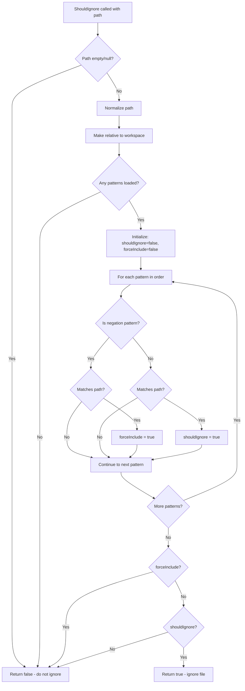
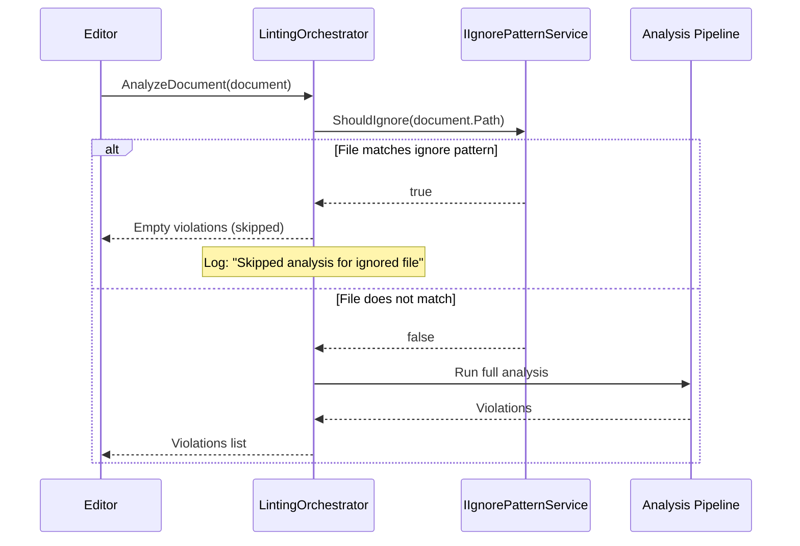

# LCS-DES-036d: Design Specification — Ignored Files

## 1. Metadata & Categorization

| Field | Value | Description |
| :--- | :--- | :--- |
| **Feature ID** | `INF-036d` | Sub-part of INF-036 |
| **Feature Name** | `Ignore File Pattern Matching` | .lexichordignore support |
| **Target Version** | `v0.3.6d` | Fourth sub-part of v0.3.6 |
| **Module Scope** | `Lexichord.Modules.Style` | Style governance module |
| **Swimlane** | `Infrastructure` | Configuration infrastructure |
| **License Tier** | `Core (limited), Writer Pro (full)` | Pattern limit for Core |
| **Feature Gate Key** | `FeatureFlags.Style.GlobalDictionary` | Shared with parent feature |
| **Author** | Lead Architect | |
| **Status** | `Draft` | |
| **Last Updated** | `2026-01-26` | |
| **Parent Document** | [LCS-DES-036-INDEX](./LCS-DES-036-INDEX.md) | |
| **Scope Breakdown** | [LCS-SBD-036 §3.4](./LCS-SBD-036.md#34-v036d-ignored-files) | |

---

## 2. Executive Summary

### 2.1 The Requirement

Projects contain files that should not be analyzed: generated code, minified assets, vendor dependencies, and third-party libraries. Currently, Lexichord analyzes all text files, producing irrelevant violations for machine-generated content and consuming unnecessary resources.

> **Problem:** Generated/vendor files produce noise in the Problems Panel and waste analysis cycles.

### 2.2 The Proposed Solution

Implement an `IIgnorePatternService` that:

1. Reads `.lexichordignore` files with gitignore-style glob patterns
2. Supports wildcards (`*`, `**`, `?`) and character classes (`[abc]`)
3. Supports negation patterns (`!important.js`) to force inclusion
4. Integrates with `ILintingOrchestrator` to skip matched files
5. Hot-reloads patterns when ignore file changes

---

## 3. Architecture & Modular Strategy

### 3.1 Dependencies

#### 3.1.1 Upstream Dependencies

| Interface | Source Version | Purpose |
| :--- | :--- | :--- |
| `IWorkspaceService` | v0.1.2a | Workspace root detection |
| `IRobustFileSystemWatcher` | v0.1.2b | Ignore file change detection |
| `ILintingOrchestrator` | v0.2.3a | Integration point for skip logic |
| `ILicenseContext` | v0.0.4c | Pattern limit for Core tier |

#### 3.1.2 NuGet Packages

| Package | Version | Purpose |
| :--- | :--- | :--- |
| `Microsoft.Extensions.FileSystemGlobbing` | 9.x | Glob pattern matching |
| `System.Reactive` | 6.x | File watcher debouncing |

### 3.2 Licensing Behavior

- **Load Behavior:** Soft Gate with limits
- **Core tier:** Limited to 5 ignore patterns
- **Writer Pro+:** Unlimited patterns
- **Fallback Experience:** Core users see warning in output when pattern limit exceeded

---

## 4. Data Contract (The API)

### 4.1 IIgnorePatternService Interface

```csharp
namespace Lexichord.Abstractions.Contracts;

/// <summary>
/// Service for checking if files should be ignored based on .lexichordignore patterns.
/// </summary>
/// <remarks>
/// <para>Patterns follow gitignore syntax: wildcards (*, **, ?), character classes ([abc]),
/// and negation (! prefix).</para>
/// <para>Core license users are limited to 5 patterns. Patterns beyond the limit are ignored.</para>
/// </remarks>
/// <example>
/// <code>
/// // Check if a file should be skipped
/// if (_ignoreService.ShouldIgnore("dist/bundle.min.js"))
/// {
///     return; // Skip analysis
/// }
/// </code>
/// </example>
public interface IIgnorePatternService
{
    /// <summary>
    /// Checks if a file should be ignored based on current patterns.
    /// </summary>
    /// <param name="filePath">Absolute or relative file path.</param>
    /// <returns>True if the file matches an ignore pattern (and not force-included).</returns>
    bool ShouldIgnore(string filePath);

    /// <summary>
    /// Checks if a file should be ignored asynchronously.
    /// </summary>
    /// <param name="filePath">Absolute or relative file path.</param>
    /// <param name="ct">Cancellation token.</param>
    /// <returns>True if the file matches an ignore pattern.</returns>
    Task<bool> ShouldIgnoreAsync(string filePath, CancellationToken ct = default);

    /// <summary>
    /// Reloads ignore patterns from disk.
    /// </summary>
    void ReloadPatterns();

    /// <summary>
    /// Gets the currently loaded patterns.
    /// </summary>
    /// <returns>List of active ignore patterns.</returns>
    IReadOnlyList<string> GetPatterns();

    /// <summary>
    /// Gets the count of patterns that were truncated due to license limits.
    /// </summary>
    int TruncatedPatternCount { get; }

    /// <summary>
    /// Event raised when patterns are reloaded.
    /// </summary>
    event EventHandler<PatternsReloadedEventArgs>? PatternsReloaded;
}

/// <summary>
/// Event args for pattern reload events.
/// </summary>
/// <param name="PatternCount">Number of patterns loaded (after license limit applied).</param>
/// <param name="TruncatedCount">Number of patterns ignored due to license limit.</param>
/// <param name="Source">Path to the ignore file.</param>
public record PatternsReloadedEventArgs(
    int PatternCount,
    int TruncatedCount,
    string Source);
```

---

## 5. Implementation Logic

### 5.1 Ignore File Format

```gitignore
# .lexichordignore
# Comments start with #

# Ignore all JavaScript in dist folder
dist/*.js

# Ignore minified files
**/*.min.js
**/*.min.css

# Ignore entire node_modules
node_modules/

# Ignore generated files
*.generated.cs
*.designer.cs

# Ignore specific directories
vendor/**
third-party/**

# Ignore by extension
*.log
*.tmp

# Negative pattern (include despite other rules)
!important.min.js
```

### 5.2 Glob Pattern Syntax

| Pattern | Description | Example Match |
| :--- | :--- | :--- |
| `*` | Any characters except `/` | `*.js` matches `file.js` |
| `**` | Any characters including `/` | `**/*.js` matches `src/app/file.js` |
| `?` | Single character | `file?.txt` matches `file1.txt` |
| `[abc]` | Character class | `file[0-9].txt` matches `file5.txt` |
| `[!abc]` | Negated character class | `file[!0-9].txt` matches `fileA.txt` |
| `!` | Negation (force include) | `!important.js` includes despite other patterns |
| `/` ending | Directory only | `node_modules/` matches directory |

### 5.3 Pattern Matching Flow



### 5.4 License Limit Handling

```text
LOAD patterns from .lexichordignore:
│
├── Read all lines from file
│
├── Filter out comments (#) and empty lines
│
├── Check license tier
│   ├── Core → limit = 5
│   └── Writer Pro+ → limit = ∞
│
├── If patterns.Count > limit:
│   ├── Log warning: "Core license: limited to {limit} ignore patterns"
│   ├── TruncatedPatternCount = patterns.Count - limit
│   └── patterns = patterns.Take(limit)
│
├── Compile each pattern to Matcher
│
└── Fire PatternsReloadedEvent
```

### 5.5 Integration with Linting Orchestrator



---

## 6. Data Persistence

**File-based configuration.** Patterns are read from:

| Location | Priority | Description |
| :--- | :--- | :--- |
| `{workspace}/.lexichordignore` | 1 (highest) | Project-specific patterns |
| `%APPDATA%/Lexichord/ignore` | 2 | User-global patterns |

Patterns from both files are merged, with all patterns evaluated in order.

---

## 7. UI/UX Specifications

### 7.1 Status Bar Indicator

When files are being ignored, show indicator in status bar:

```text
┌─────────────────────────────────────────────────────────────────────────┐
│ Lexichord │ 3 issues │ Grade 8.2 │ 📁 12 files ignored │ Writer Pro    │
└─────────────────────────────────────────────────────────────────────────┘
```

### 7.2 Ignored File Indicator in Editor

When viewing an ignored file, show subtle indicator:

```text
┌─────────────────────────────────────────────────────────────────────────┐
│ dist/bundle.min.js                         [Excluded from analysis]     │
├─────────────────────────────────────────────────────────────────────────┤
│ 1  │ // Minified content...                                             │
│ 2  │ var a=function(){...                                               │
└─────────────────────────────────────────────────────────────────────────┘
```

### 7.3 Core License Warning

When pattern limit is exceeded for Core users:

```text
┌─────────────────────────────────────────────────────────────────────────┐
│ ⚠ Some ignore patterns were not loaded                                  │
├─────────────────────────────────────────────────────────────────────────┤
│ Your .lexichordignore file contains 12 patterns, but Core license       │
│ is limited to 5 patterns. The first 5 patterns are active.              │
│                                                                         │
│ Upgrade to Writer Pro for unlimited ignore patterns.                    │
│                                                                         │
│                                    [Learn More]  [Dismiss]              │
└─────────────────────────────────────────────────────────────────────────┘
```

---

## 8. Observability & Logging

| Level | Message Template |
| :--- | :--- |
| Debug | `"Loading ignore patterns from {Path}"` |
| Debug | `"Loaded {PatternCount} ignore patterns"` |
| Warning | `"Core license: limited to {Limit} ignore patterns, {Truncated} truncated"` |
| Debug | `"File '{Path}' matches ignore pattern '{Pattern}'"` |
| Debug | `"File '{Path}' force-included by negation pattern '{Pattern}'"` |
| Debug | `"File '{Path}' does not match any ignore patterns"` |
| Debug | `"Ignore patterns reloaded: {Count} patterns from {Source}"` |
| Trace | `"Checking ignore patterns for: {Path}"` |
| Debug | `"Skipped analysis for ignored file: {Path}"` |

---

## 9. Security & Safety

| Risk | Level | Mitigation |
| :--- | :--- | :--- |
| ReDoS via patterns | Low | Use FileSystemGlobbing library, not raw regex |
| Large ignore file | Low | Limit file size to 10KB |
| Path traversal | Low | Normalize paths, constrain to workspace |
| Performance with many patterns | Medium | Cache compiled matchers, limit Core to 5 |

---

## 10. Acceptance Criteria

### 10.1 Functional Criteria

| # | Given | When | Then |
| :--- | :--- | :--- | :--- |
| 1 | Pattern `*.js` | Check `file.js` | Returns true (ignored) |
| 2 | Pattern `*.js` | Check `file.ts` | Returns false (not ignored) |
| 3 | Pattern `**/*.js` | Check `src/app/file.js` | Returns true |
| 4 | Pattern `dist/` | Check `dist/bundle.js` | Returns true |
| 5 | Pattern `!important.js` after `*.js` | Check `important.js` | Returns false (force included) |
| 6 | Patterns `*.js`, `!important.js` | Check `other.js` | Returns true (ignored) |
| 7 | Core license, 10 patterns in file | Patterns loaded | Only first 5 active |
| 8 | Writer Pro license, 10 patterns | Patterns loaded | All 10 active |
| 9 | Ignore file modified | File watcher detects | Patterns reloaded |
| 10 | Ignored file opened | Analysis requested | Skipped, no violations |

### 10.2 Performance Criteria

| # | Given | When | Then |
| :--- | :--- | :--- | :--- |
| 11 | 50 patterns | Check 1000 files | Completes in < 100ms |
| 12 | Pattern reload | File change detected | Completes in < 50ms |
| 13 | Single file check | ShouldIgnore called | Returns in < 1ms |

---

## 11. Test Scenarios

### 11.1 Unit Tests

```csharp
[Trait("Category", "Unit")]
[Trait("Feature", "v0.3.6d")]
public class IgnorePatternServiceTests
{
    [Theory]
    [InlineData("dist/bundle.js", "dist/*.js", true)]
    [InlineData("src/app.js", "dist/*.js", false)]
    [InlineData("src/utils/helper.js", "**/*.js", true)]
    [InlineData("file.min.js", "*.min.js", true)]
    [InlineData("file.js", "*.min.js", false)]
    [InlineData("node_modules/pkg/index.js", "node_modules/", true)]
    [InlineData("src/node_modules.txt", "node_modules/", false)]
    public void ShouldIgnore_GlobPatterns_MatchesCorrectly(
        string filePath, string pattern, bool expected)
    {
        // Arrange
        var service = CreateService(patterns: new[] { pattern });

        // Act
        var result = service.ShouldIgnore(filePath);

        // Assert
        result.Should().Be(expected);
    }

    [Fact]
    public void ShouldIgnore_NegationPattern_IncludesFile()
    {
        // Arrange
        var service = CreateService(patterns: new[] { "*.js", "!important.js" });

        // Act & Assert
        service.ShouldIgnore("bundle.js").Should().BeTrue();
        service.ShouldIgnore("important.js").Should().BeFalse();
    }

    [Fact]
    public void ShouldIgnore_MultipleNegations_LastWins()
    {
        // Arrange
        var service = CreateService(patterns: new[]
        {
            "*.js",           // Ignore all JS
            "!important.js",  // But not important.js
            "*.min.js"        // But ignore minified
        });

        // Act & Assert
        service.ShouldIgnore("bundle.js").Should().BeTrue();
        service.ShouldIgnore("important.js").Should().BeFalse();
        service.ShouldIgnore("important.min.js").Should().BeTrue(); // Re-ignored
    }

    [Fact]
    public void ShouldIgnore_CoreLicense_LimitsPatterns()
    {
        // Arrange
        var mockLicense = new Mock<ILicenseContext>();
        mockLicense.Setup(l => l.HasFeature(FeatureFlags.Style.GlobalDictionary)).Returns(false);

        var patterns = new[]
        {
            "*.js", "*.ts", "*.css", "*.html", "*.json", "*.xml", "*.yaml"
        };

        var service = CreateService(patterns: patterns, licenseContext: mockLicense.Object);

        // Act
        var loadedPatterns = service.GetPatterns();

        // Assert
        loadedPatterns.Should().HaveCount(5); // Limited to 5 for Core
        service.TruncatedPatternCount.Should().Be(2);
    }

    [Fact]
    public void ShouldIgnore_WriterProLicense_NoLimit()
    {
        // Arrange
        var mockLicense = new Mock<ILicenseContext>();
        mockLicense.Setup(l => l.HasFeature(FeatureFlags.Style.GlobalDictionary)).Returns(true);

        var patterns = Enumerable.Range(0, 50).Select(i => $"*.ext{i}").ToArray();

        var service = CreateService(patterns: patterns, licenseContext: mockLicense.Object);

        // Act
        var loadedPatterns = service.GetPatterns();

        // Assert
        loadedPatterns.Should().HaveCount(50);
        service.TruncatedPatternCount.Should().Be(0);
    }

    [Fact]
    public void ShouldIgnore_EmptyPath_ReturnsFalse()
    {
        // Arrange
        var service = CreateService(patterns: new[] { "*" });

        // Act & Assert
        service.ShouldIgnore("").Should().BeFalse();
        service.ShouldIgnore(null!).Should().BeFalse();
    }

    [Fact]
    public void ShouldIgnore_NoPatterns_ReturnsFalse()
    {
        // Arrange
        var service = CreateService(patterns: Array.Empty<string>());

        // Act
        var result = service.ShouldIgnore("any/file.js");

        // Assert
        result.Should().BeFalse();
    }

    [Fact]
    public void ReloadPatterns_RaisesPatternsReloadedEvent()
    {
        // Arrange
        var service = CreateService(patterns: new[] { "*.js" });
        var eventRaised = false;
        PatternsReloadedEventArgs? eventArgs = null;

        service.PatternsReloaded += (_, args) =>
        {
            eventRaised = true;
            eventArgs = args;
        };

        // Act
        service.ReloadPatterns();

        // Assert
        eventRaised.Should().BeTrue();
        eventArgs.Should().NotBeNull();
        eventArgs!.PatternCount.Should().Be(1);
    }

    [Theory]
    [InlineData("file[0-9].txt", "file5.txt", true)]
    [InlineData("file[0-9].txt", "fileA.txt", false)]
    [InlineData("file[!0-9].txt", "fileA.txt", true)]
    [InlineData("file?.txt", "file1.txt", true)]
    [InlineData("file?.txt", "file12.txt", false)]
    public void ShouldIgnore_CharacterClasses_MatchCorrectly(
        string pattern, string filePath, bool expected)
    {
        // Arrange
        var service = CreateService(patterns: new[] { pattern });

        // Act
        var result = service.ShouldIgnore(filePath);

        // Assert
        result.Should().Be(expected);
    }

    [Fact]
    public void ShouldIgnore_PathNormalization_HandlesBothSlashes()
    {
        // Arrange
        var service = CreateService(patterns: new[] { "dist/**/*.js" });

        // Act & Assert - Both slash types should work
        service.ShouldIgnore("dist/bundle.js").Should().BeTrue();
        service.ShouldIgnore("dist\\bundle.js").Should().BeTrue();
        service.ShouldIgnore("dist/sub/bundle.js").Should().BeTrue();
        service.ShouldIgnore("dist\\sub\\bundle.js").Should().BeTrue();
    }
}
```

### 11.2 Integration Tests

```csharp
[Trait("Category", "Integration")]
[Trait("Feature", "v0.3.6d")]
public class IgnorePatternIntegrationTests
{
    [Fact]
    public async Task LintingOrchestrator_SkipsIgnoredFiles()
    {
        // Arrange
        var tempDir = CreateTempWorkspace();
        WriteIgnoreFile(tempDir, new[] { "generated/**" });
        WriteFile(tempDir, "generated/auto.cs", "// Generated code with issues");
        WriteFile(tempDir, "src/real.cs", "// Real code with issues");

        var orchestrator = CreateOrchestrator(tempDir);

        // Act
        var generatedResult = await orchestrator.AnalyzeFileAsync(
            Path.Combine(tempDir, "generated/auto.cs"));
        var realResult = await orchestrator.AnalyzeFileAsync(
            Path.Combine(tempDir, "src/real.cs"));

        // Assert
        generatedResult.Violations.Should().BeEmpty(); // Skipped
        realResult.Violations.Should().NotBeEmpty(); // Analyzed
    }

    [Fact]
    public async Task FileWatcher_ReloadsOnIgnoreFileChange()
    {
        // Arrange
        var tempDir = CreateTempWorkspace();
        WriteIgnoreFile(tempDir, new[] { "*.js" });

        var service = CreateRealService(tempDir);
        service.ShouldIgnore("file.js").Should().BeTrue();
        service.ShouldIgnore("file.ts").Should().BeFalse();

        var reloadedEvent = new TaskCompletionSource<PatternsReloadedEventArgs>();
        service.PatternsReloaded += (_, args) => reloadedEvent.SetResult(args);

        // Act - Modify ignore file
        WriteIgnoreFile(tempDir, new[] { "*.ts" });

        // Assert
        var args = await reloadedEvent.Task.WaitAsync(TimeSpan.FromSeconds(2));
        service.ShouldIgnore("file.js").Should().BeFalse(); // No longer ignored
        service.ShouldIgnore("file.ts").Should().BeTrue();  // Now ignored
    }
}
```

---

## 12. Code Example

### 12.1 IgnorePatternService Implementation

```csharp
namespace Lexichord.Modules.Style.Services;

/// <summary>
/// Checks files against .lexichordignore patterns using glob matching.
/// </summary>
public sealed class IgnorePatternService : IIgnorePatternService, IDisposable
{
    private readonly IWorkspaceService _workspaceService;
    private readonly ILicenseContext _licenseContext;
    private readonly ILogger<IgnorePatternService> _logger;
    private readonly IRobustFileSystemWatcher? _fileWatcher;
    private readonly Subject<Unit> _reloadSubject = new();
    private readonly IDisposable _reloadSubscription;

    private List<CompiledPattern> _patterns = new();
    private const int CorePatternLimit = 5;
    private const int MaxIgnoreFileSize = 10 * 1024; // 10KB

    public int TruncatedPatternCount { get; private set; }

    public event EventHandler<PatternsReloadedEventArgs>? PatternsReloaded;

    public IgnorePatternService(
        IWorkspaceService workspaceService,
        ILicenseContext licenseContext,
        ILogger<IgnorePatternService> logger,
        IRobustFileSystemWatcher? fileWatcher = null)
    {
        _workspaceService = workspaceService;
        _licenseContext = licenseContext;
        _logger = logger;
        _fileWatcher = fileWatcher;

        // Debounced reload
        _reloadSubscription = _reloadSubject
            .Throttle(TimeSpan.FromMilliseconds(300))
            .Subscribe(_ => ReloadPatternsInternal());

        // Initial load
        ReloadPatternsInternal();

        // Setup file watcher
        SetupFileWatcher();
    }

    /// <inheritdoc />
    public bool ShouldIgnore(string filePath)
    {
        if (string.IsNullOrWhiteSpace(filePath) || _patterns.Count == 0)
        {
            return false;
        }

        _logger.LogTrace("Checking ignore patterns for: {Path}", filePath);

        // Normalize path
        var normalizedPath = NormalizePath(filePath);

        var shouldIgnore = false;
        var forceInclude = false;

        foreach (var pattern in _patterns)
        {
            var matches = pattern.Matcher.Match(normalizedPath).HasMatches;

            if (matches)
            {
                if (pattern.IsNegation)
                {
                    forceInclude = true;
                    _logger.LogDebug(
                        "File '{Path}' force-included by negation pattern '{Pattern}'",
                        filePath, pattern.Original);
                }
                else
                {
                    shouldIgnore = true;
                    _logger.LogDebug(
                        "File '{Path}' matches ignore pattern '{Pattern}'",
                        filePath, pattern.Original);
                }
            }
        }

        var result = shouldIgnore && !forceInclude;

        if (!result && shouldIgnore)
        {
            _logger.LogDebug("File '{Path}' was ignored but force-included", filePath);
        }
        else if (!result)
        {
            _logger.LogDebug("File '{Path}' does not match any ignore patterns", filePath);
        }

        return result;
    }

    /// <inheritdoc />
    public Task<bool> ShouldIgnoreAsync(string filePath, CancellationToken ct = default)
    {
        return Task.FromResult(ShouldIgnore(filePath));
    }

    /// <inheritdoc />
    public void ReloadPatterns()
    {
        _reloadSubject.OnNext(Unit.Default);
    }

    /// <inheritdoc />
    public IReadOnlyList<string> GetPatterns()
    {
        return _patterns.Select(p => p.Original).ToList().AsReadOnly();
    }

    private void ReloadPatternsInternal()
    {
        _patterns.Clear();
        TruncatedPatternCount = 0;

        var rawPatterns = new List<string>();
        var sourcePath = "none";

        // Load project-level patterns
        if (_workspaceService.IsWorkspaceOpen && _workspaceService.RootPath != null)
        {
            var projectIgnorePath = Path.Combine(_workspaceService.RootPath, ".lexichordignore");

            if (File.Exists(projectIgnorePath))
            {
                _logger.LogDebug("Loading ignore patterns from {Path}", projectIgnorePath);
                rawPatterns.AddRange(ParseIgnoreFile(projectIgnorePath));
                sourcePath = projectIgnorePath;
            }
        }

        // Load user-level patterns
        var userIgnorePath = GetUserIgnorePath();
        if (File.Exists(userIgnorePath))
        {
            _logger.LogDebug("Loading ignore patterns from {Path}", userIgnorePath);
            rawPatterns.AddRange(ParseIgnoreFile(userIgnorePath));
            if (sourcePath == "none")
            {
                sourcePath = userIgnorePath;
            }
        }

        // Apply license limit
        var limit = _licenseContext.HasFeature(FeatureFlags.Style.GlobalDictionary)
            ? int.MaxValue
            : CorePatternLimit;

        if (rawPatterns.Count > limit)
        {
            TruncatedPatternCount = rawPatterns.Count - limit;
            _logger.LogWarning(
                "Core license: limited to {Limit} ignore patterns, {Truncated} truncated",
                limit, TruncatedPatternCount);
            rawPatterns = rawPatterns.Take(limit).ToList();
        }

        // Compile patterns
        foreach (var pattern in rawPatterns)
        {
            var compiled = CompilePattern(pattern);
            if (compiled != null)
            {
                _patterns.Add(compiled);
            }
        }

        _logger.LogDebug("Loaded {PatternCount} ignore patterns", _patterns.Count);

        PatternsReloaded?.Invoke(this, new PatternsReloadedEventArgs(
            PatternCount: _patterns.Count,
            TruncatedCount: TruncatedPatternCount,
            Source: sourcePath));
    }

    private IEnumerable<string> ParseIgnoreFile(string path)
    {
        var fileInfo = new FileInfo(path);
        if (fileInfo.Length > MaxIgnoreFileSize)
        {
            _logger.LogWarning("Ignore file too large: {Path} ({Size} bytes)", path, fileInfo.Length);
            yield break;
        }

        var lines = File.ReadAllLines(path);

        foreach (var line in lines)
        {
            var trimmed = line.Trim();

            // Skip empty lines and comments
            if (string.IsNullOrEmpty(trimmed) || trimmed.StartsWith('#'))
            {
                continue;
            }

            yield return trimmed;
        }
    }

    private CompiledPattern? CompilePattern(string pattern)
    {
        try
        {
            var isNegation = pattern.StartsWith('!');
            var cleanPattern = isNegation ? pattern[1..] : pattern;

            // Normalize pattern (remove trailing slashes for directories)
            if (cleanPattern.EndsWith('/'))
            {
                cleanPattern = cleanPattern[..^1] + "/**";
            }

            var matcher = new Matcher();
            matcher.AddInclude(cleanPattern);

            return new CompiledPattern(pattern, cleanPattern, isNegation, matcher);
        }
        catch (Exception ex)
        {
            _logger.LogWarning("Invalid ignore pattern '{Pattern}': {Error}", pattern, ex.Message);
            return null;
        }
    }

    private string NormalizePath(string filePath)
    {
        // Convert backslashes to forward slashes
        var normalized = filePath.Replace('\\', '/');

        // Make relative to workspace if absolute
        if (_workspaceService.RootPath != null)
        {
            var rootNormalized = _workspaceService.RootPath.Replace('\\', '/');
            if (normalized.StartsWith(rootNormalized, StringComparison.OrdinalIgnoreCase))
            {
                normalized = normalized[(rootNormalized.Length)..].TrimStart('/');
            }
        }

        return normalized;
    }

    private static string GetUserIgnorePath()
    {
        var appData = Environment.GetFolderPath(Environment.SpecialFolder.ApplicationData);
        return Path.Combine(appData, "Lexichord", "ignore");
    }

    private void SetupFileWatcher()
    {
        if (_fileWatcher == null)
        {
            return;
        }

        // Watch project ignore file
        if (_workspaceService.IsWorkspaceOpen && _workspaceService.RootPath != null)
        {
            _fileWatcher.Watch(
                _workspaceService.RootPath,
                ".lexichordignore",
                () => ReloadPatterns());
        }

        // Watch user ignore file
        var userDir = Path.GetDirectoryName(GetUserIgnorePath());
        if (userDir != null && Directory.Exists(userDir))
        {
            _fileWatcher.Watch(userDir, "ignore", () => ReloadPatterns());
        }
    }

    public void Dispose()
    {
        _reloadSubscription.Dispose();
        _reloadSubject.Dispose();
    }

    private record CompiledPattern(
        string Original,
        string Normalized,
        bool IsNegation,
        Matcher Matcher);
}
```

### 12.2 LintingOrchestrator Integration

```csharp
// In LintingOrchestrator.AnalyzeDocumentAsync
public async Task<LintingResult> AnalyzeDocumentAsync(
    TextDocument document,
    CancellationToken ct = default)
{
    // Check if file should be ignored
    if (_ignorePatternService.ShouldIgnore(document.FilePath))
    {
        _logger.LogDebug("Skipped analysis for ignored file: {Path}", document.FilePath);
        return LintingResult.Empty;
    }

    // Continue with normal analysis...
    return await RunAnalysisPipelineAsync(document, ct);
}
```

---

## 13. DI Registration

```csharp
// In StyleModule.cs
services.AddSingleton<IIgnorePatternService, IgnorePatternService>();
```

---

## Document History

| Version | Date | Author | Changes |
| :--- | :--- | :--- | :--- |
| 1.0 | 2026-01-26 | Lead Architect | Initial draft |
