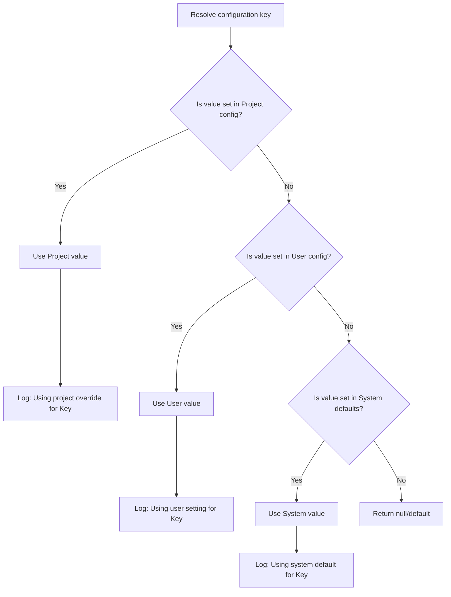

# LCS-DES-036b: Design Specification — Conflict Resolution

## 1. Metadata & Categorization

| Field | Value | Description |
| :--- | :--- | :--- |
| **Feature ID** | `INF-036b` | Sub-part of INF-036 |
| **Feature Name** | `Configuration Conflict Resolution` | Project-wins semantics |
| **Target Version** | `v0.3.6b` | Second sub-part of v0.3.6 |
| **Module Scope** | `Lexichord.Modules.Style` | Style governance module |
| **Swimlane** | `Infrastructure` | Configuration infrastructure |
| **License Tier** | `Writer Pro` | Required for project-level config |
| **Feature Gate Key** | `FeatureFlags.Style.GlobalDictionary` | Shared with parent feature |
| **Author** | Lead Architect | |
| **Status** | `Draft` | |
| **Last Updated** | `2026-01-26` | |
| **Parent Document** | [LCS-DES-036-INDEX](./LCS-DES-036-INDEX.md) | |
| **Scope Breakdown** | [LCS-SBD-036 §3.2](./LCS-SBD-036.md#32-v036b-conflict-resolution) | |

---

## 2. Executive Summary

### 2.1 The Requirement

When configuration values differ across layers (System, User, Project), the system needs deterministic conflict resolution. Writers and teams must understand which settings take effect and why, especially when project settings override personal preferences.

> **Problem:** Conflicting settings across layers lead to unpredictable behavior and debugging difficulty.

### 2.2 The Proposed Solution

Implement an `IConflictResolver` that:

1. Enforces "project always wins" semantics for all configuration keys
2. Detects and logs conflicts for debugging/auditing
3. Handles special cases for term exclusions and rule ignoring
4. Provides introspection APIs for future "Configuration Inspector" UI

---

## 3. Architecture & Modular Strategy

### 3.1 Dependencies

#### 3.1.1 Upstream Dependencies

| Interface | Source Version | Purpose |
| :--- | :--- | :--- |
| `ILayeredConfigurationProvider` | v0.3.6a | Configuration access |
| `ITerminologyRepository` | v0.2.2b | Global term database |
| `StyleTerm` | v0.2.2a | Term model for checking |

#### 3.1.2 NuGet Packages

None beyond parent feature requirements.

### 3.2 Licensing Behavior

Inherits from parent feature. Conflict resolution logic runs regardless of license tier, but project-level configurations are only loaded for Writer Pro+ users.

---

## 4. Data Contract (The API)

### 4.1 IConflictResolver Interface

```csharp
namespace Lexichord.Abstractions.Contracts;

/// <summary>
/// Resolves conflicts between configuration sources.
/// Default strategy: Project always wins over User, User always wins over System.
/// </summary>
/// <remarks>
/// <para>The resolver provides deterministic conflict resolution following a strict
/// priority hierarchy: Project > User > System.</para>
/// <para>Conflicts are logged for debugging purposes but do not prevent operation.</para>
/// </remarks>
/// <example>
/// <code>
/// var conflicts = _resolver.DetectConflicts(project, user, system);
/// foreach (var conflict in conflicts)
/// {
///     _logger.LogDebug(conflict.Description);
/// }
/// </code>
/// </example>
public interface IConflictResolver
{
    /// <summary>
    /// Resolves conflicts between two configuration values.
    /// </summary>
    /// <typeparam name="T">The value type.</typeparam>
    /// <param name="higher">Value from higher-priority source (may be null).</param>
    /// <param name="lower">Value from lower-priority source (may be null).</param>
    /// <returns>The resolved value (higher if set, otherwise lower).</returns>
    T? Resolve<T>(T? higher, T? lower);

    /// <summary>
    /// Resolves conflicts with a default value.
    /// </summary>
    /// <typeparam name="T">The value type.</typeparam>
    /// <param name="higher">Value from higher-priority source.</param>
    /// <param name="lower">Value from lower-priority source.</param>
    /// <param name="defaultValue">Default if both are null.</param>
    /// <returns>The resolved value.</returns>
    T ResolveWithDefault<T>(T? higher, T? lower, T defaultValue);

    /// <summary>
    /// Detects conflicts between configuration sources.
    /// </summary>
    /// <param name="project">Project-level configuration (may be null).</param>
    /// <param name="user">User-level configuration (may be null).</param>
    /// <param name="system">System-level configuration (required).</param>
    /// <returns>List of detected conflicts with resolution details.</returns>
    IReadOnlyList<ConfigurationConflict> DetectConflicts(
        StyleConfiguration? project,
        StyleConfiguration? user,
        StyleConfiguration system);

    /// <summary>
    /// Checks if a specific term should be flagged in the current context.
    /// </summary>
    /// <param name="term">The term to check.</param>
    /// <param name="effectiveConfig">The merged configuration.</param>
    /// <returns>True if the term should be flagged, false if excluded.</returns>
    bool ShouldFlagTerm(string term, StyleConfiguration effectiveConfig);

    /// <summary>
    /// Checks if a rule is ignored in the current context.
    /// </summary>
    /// <param name="ruleId">The rule ID to check.</param>
    /// <param name="effectiveConfig">The merged configuration.</param>
    /// <returns>True if the rule should be ignored.</returns>
    bool IsRuleIgnored(string ruleId, StyleConfiguration effectiveConfig);
}
```

### 4.2 ConfigurationConflict Record

```csharp
namespace Lexichord.Abstractions.Contracts;

/// <summary>
/// Describes a conflict between configuration sources.
/// </summary>
/// <param name="Key">The configuration key in conflict.</param>
/// <param name="HigherSource">The source that won.</param>
/// <param name="LowerSource">The source that was overridden.</param>
/// <param name="HigherValue">The winning value (may be null for explicit unset).</param>
/// <param name="LowerValue">The overridden value.</param>
public record ConfigurationConflict(
    string Key,
    ConfigurationSource HigherSource,
    ConfigurationSource LowerSource,
    object? HigherValue,
    object? LowerValue)
{
    /// <summary>
    /// Human-readable description of the conflict.
    /// </summary>
    public string Description =>
        $"{Key}: '{LowerValue}' ({LowerSource}) overridden by '{HigherValue}' ({HigherSource})";

    /// <summary>
    /// Indicates if this is a significant conflict (values differ substantially).
    /// </summary>
    public bool IsSignificant => !Equals(HigherValue, LowerValue);
}
```

---

## 5. Implementation Logic

### 5.1 Conflict Resolution Decision Tree



### 5.2 Term Override Logic

```text
SHOULD flag term "{term}"?
│
├── Is term in Project exclusions?
│   └── YES → DO NOT flag (project explicitly allows)
│       └── Log: "Term '{term}' excluded by Project configuration"
│
├── Is term in Project additions?
│   └── YES → FLAG (project explicitly forbids)
│       └── Log: "Term '{term}' added by Project configuration"
│
├── Is term in User exclusions?
│   └── YES → DO NOT flag (user allows, project doesn't override)
│       └── Log: "Term '{term}' excluded by User configuration"
│
├── Is term in User additions?
│   └── YES → FLAG (user forbids, project doesn't override)
│       └── Log: "Term '{term}' added by User configuration"
│
├── Is term in global terminology database?
│   └── YES → FLAG (standard rule)
│       └── Log: "Term '{term}' flagged by global terminology"
│
└── DEFAULT → DO NOT flag (not a known term)
```

### 5.3 Rule Ignore Logic

```text
IS rule "{ruleId}" ignored?
│
├── Does Project ignored_rules contain exact match?
│   └── YES → IGNORE
│
├── Does Project ignored_rules contain wildcard match?
│   └── YES → IGNORE (e.g., "PASSIVE-*" matches "PASSIVE-001")
│
├── Does User ignored_rules contain exact match?
│   └── YES → IGNORE
│
├── Does User ignored_rules contain wildcard match?
│   └── YES → IGNORE
│
└── DEFAULT → DO NOT ignore (run rule)
```

### 5.4 Wildcard Pattern Matching

```csharp
// Pattern matching for rule IDs
// Supports:
// - Exact match: "TERM-001" matches "TERM-001"
// - Prefix wildcard: "PASSIVE-*" matches "PASSIVE-001", "PASSIVE-002"
// - Suffix wildcard: "*-001" matches "TERM-001", "PASSIVE-001"
// - Full wildcard: "*" matches everything (not recommended)

private static bool MatchesPattern(string ruleId, string pattern)
{
    if (pattern == "*") return true;
    if (pattern.EndsWith("*"))
    {
        var prefix = pattern[..^1];
        return ruleId.StartsWith(prefix, StringComparison.OrdinalIgnoreCase);
    }
    if (pattern.StartsWith("*"))
    {
        var suffix = pattern[1..];
        return ruleId.EndsWith(suffix, StringComparison.OrdinalIgnoreCase);
    }
    return ruleId.Equals(pattern, StringComparison.OrdinalIgnoreCase);
}
```

---

## 6. Data Persistence

**None required.** Conflict resolution is stateless and computed from configuration.

---

## 7. UI/UX Specifications

**None for this sub-part.** Future "Configuration Inspector" (v0.4.x) will consume `DetectConflicts()` to show conflict visualization.

---

## 8. Observability & Logging

| Level | Message Template |
| :--- | :--- |
| Debug | `"Conflict detected: {Key} = {LowerValue} ({LowerSource}) → {HigherValue} ({HigherSource})"` |
| Debug | `"Term '{Term}' excluded by {Source} configuration"` |
| Debug | `"Term '{Term}' added by {Source} configuration"` |
| Debug | `"Rule '{RuleId}' ignored by {Source} configuration"` |
| Debug | `"Rule '{RuleId}' matches ignore pattern '{Pattern}' from {Source}"` |
| Trace | `"Resolving {Key}: higher={HigherValue}, lower={LowerValue}, result={Result}"` |

---

## 9. Security & Safety

| Risk | Level | Mitigation |
| :--- | :--- | :--- |
| Regex injection in patterns | Low | Only support simple wildcards, no full regex |
| Performance with many rules | Low | Patterns are simple prefix/suffix, O(n) |

---

## 10. Acceptance Criteria

### 10.1 Functional Criteria

| # | Given | When | Then |
| :--- | :--- | :--- | :--- |
| 1 | Project has value, User has different | Resolved | Project value wins |
| 2 | User has value, System has different | Resolved | User value wins |
| 3 | Only System has value | Resolved | System value used |
| 4 | Term in Project exclusions | ShouldFlagTerm called | Returns false |
| 5 | Term in Project additions | ShouldFlagTerm called | Returns true |
| 6 | Term in User exclusions, not in Project | ShouldFlagTerm called | Returns false |
| 7 | Rule ID matches Project ignore pattern | IsRuleIgnored called | Returns true |
| 8 | Rule ID matches `PASSIVE-*` pattern | IsRuleIgnored called | Returns true for PASSIVE-001 |
| 9 | Conflicts exist between layers | DetectConflicts called | All conflicts returned |
| 10 | No conflicts exist | DetectConflicts called | Empty list returned |

### 10.2 Performance Criteria

| # | Given | When | Then |
| :--- | :--- | :--- | :--- |
| 11 | 100 terms to check | ShouldFlagTerm for each | Completes in < 10ms total |
| 12 | 100 rules to check | IsRuleIgnored for each | Completes in < 10ms total |

---

## 11. Test Scenarios

### 11.1 Unit Tests

```csharp
[Trait("Category", "Unit")]
[Trait("Feature", "v0.3.6b")]
public class ConflictResolverTests
{
    private readonly ConflictResolver _sut = new();

    [Fact]
    public void Resolve_HigherHasValue_ReturnsHigher()
    {
        // Arrange & Act
        var result = _sut.Resolve<int?>(10, 20);

        // Assert
        result.Should().Be(10);
    }

    [Fact]
    public void Resolve_HigherIsNull_ReturnsLower()
    {
        // Arrange & Act
        var result = _sut.Resolve<int?>(null, 20);

        // Assert
        result.Should().Be(20);
    }

    [Fact]
    public void Resolve_BothNull_ReturnsNull()
    {
        // Arrange & Act
        var result = _sut.Resolve<int?>(null, null);

        // Assert
        result.Should().BeNull();
    }

    [Fact]
    public void ResolveWithDefault_BothNull_ReturnsDefault()
    {
        // Arrange & Act
        var result = _sut.ResolveWithDefault<int>(null, null, 42);

        // Assert
        result.Should().Be(42);
    }

    [Fact]
    public void ShouldFlagTerm_ProjectExclusion_ReturnsFalse()
    {
        // Arrange
        var config = new StyleConfiguration
        {
            TerminologyExclusions = new[] { "whitelist" }
        };

        // Act
        var result = _sut.ShouldFlagTerm("whitelist", config);

        // Assert
        result.Should().BeFalse();
    }

    [Fact]
    public void ShouldFlagTerm_ProjectAddition_ReturnsTrue()
    {
        // Arrange
        var config = new StyleConfiguration
        {
            TerminologyAdditions = new[]
            {
                new TermAddition("proprietary", "Use standard instead")
            }
        };

        // Act
        var result = _sut.ShouldFlagTerm("proprietary", config);

        // Assert
        result.Should().BeTrue();
    }

    [Fact]
    public void ShouldFlagTerm_NotInConfig_ChecksGlobalTerminology()
    {
        // Arrange
        var config = new StyleConfiguration();
        var mockTermRepo = new Mock<ITerminologyRepository>();
        mockTermRepo.Setup(t => t.ContainsTerm("whitelist")).Returns(true);

        var resolver = new ConflictResolver(mockTermRepo.Object);

        // Act
        var result = resolver.ShouldFlagTerm("whitelist", config);

        // Assert
        result.Should().BeTrue();
    }

    [Fact]
    public void IsRuleIgnored_ExactMatch_ReturnsTrue()
    {
        // Arrange
        var config = new StyleConfiguration
        {
            IgnoredRules = new[] { "TERM-001" }
        };

        // Act
        var result = _sut.IsRuleIgnored("TERM-001", config);

        // Assert
        result.Should().BeTrue();
    }

    [Theory]
    [InlineData("PASSIVE-001", "PASSIVE-*", true)]
    [InlineData("PASSIVE-002", "PASSIVE-*", true)]
    [InlineData("TERM-001", "PASSIVE-*", false)]
    [InlineData("TERM-001", "*-001", true)]
    [InlineData("TERM-002", "*-001", false)]
    public void IsRuleIgnored_WildcardPatterns_MatchesCorrectly(
        string ruleId, string pattern, bool expected)
    {
        // Arrange
        var config = new StyleConfiguration
        {
            IgnoredRules = new[] { pattern }
        };

        // Act
        var result = _sut.IsRuleIgnored(ruleId, config);

        // Assert
        result.Should().Be(expected);
    }

    [Fact]
    public void DetectConflicts_DifferentValues_ReturnsConflict()
    {
        // Arrange
        var project = new StyleConfiguration { PassiveVoiceThreshold = 10 };
        var user = new StyleConfiguration { PassiveVoiceThreshold = 15 };
        var system = new StyleConfiguration { PassiveVoiceThreshold = 20 };

        // Act
        var conflicts = _sut.DetectConflicts(project, user, system);

        // Assert
        conflicts.Should().ContainSingle(c =>
            c.Key == "PassiveVoiceThreshold" &&
            c.HigherSource == ConfigurationSource.Project &&
            (double)c.HigherValue! == 10);
    }

    [Fact]
    public void DetectConflicts_SameValues_NoConflict()
    {
        // Arrange
        var project = new StyleConfiguration { PassiveVoiceThreshold = 20 };
        var user = new StyleConfiguration { PassiveVoiceThreshold = 20 };
        var system = new StyleConfiguration { PassiveVoiceThreshold = 20 };

        // Act
        var conflicts = _sut.DetectConflicts(project, user, system);

        // Assert
        conflicts.Where(c => c.Key == "PassiveVoiceThreshold").Should().BeEmpty();
    }

    [Fact]
    public void DetectConflicts_NullProject_ComparesUserAndSystem()
    {
        // Arrange
        var user = new StyleConfiguration { PassiveVoiceThreshold = 15 };
        var system = new StyleConfiguration { PassiveVoiceThreshold = 20 };

        // Act
        var conflicts = _sut.DetectConflicts(null, user, system);

        // Assert
        conflicts.Should().ContainSingle(c =>
            c.Key == "PassiveVoiceThreshold" &&
            c.HigherSource == ConfigurationSource.User);
    }
}
```

---

## 12. Code Example

### 12.1 ConflictResolver Implementation

```csharp
namespace Lexichord.Modules.Style.Services;

/// <summary>
/// Resolves conflicts between configuration sources with project-wins semantics.
/// </summary>
public sealed class ConflictResolver : IConflictResolver
{
    private readonly ITerminologyRepository? _terminologyRepository;
    private readonly ILogger<ConflictResolver>? _logger;

    public ConflictResolver(
        ITerminologyRepository? terminologyRepository = null,
        ILogger<ConflictResolver>? logger = null)
    {
        _terminologyRepository = terminologyRepository;
        _logger = logger;
    }

    /// <inheritdoc />
    public T? Resolve<T>(T? higher, T? lower)
    {
        if (higher is not null && !IsDefault(higher))
        {
            return higher;
        }

        return lower;
    }

    /// <inheritdoc />
    public T ResolveWithDefault<T>(T? higher, T? lower, T defaultValue)
    {
        var resolved = Resolve(higher, lower);
        return resolved ?? defaultValue;
    }

    /// <inheritdoc />
    public IReadOnlyList<ConfigurationConflict> DetectConflicts(
        StyleConfiguration? project,
        StyleConfiguration? user,
        StyleConfiguration system)
    {
        var conflicts = new List<ConfigurationConflict>();

        // Compare Project vs User
        if (project != null && user != null)
        {
            DetectLayerConflicts(conflicts, project, user,
                ConfigurationSource.Project, ConfigurationSource.User);
        }

        // Compare effective higher vs System
        var effectiveHigher = project ?? user;
        if (effectiveHigher != null)
        {
            var higherSource = project != null
                ? ConfigurationSource.Project
                : ConfigurationSource.User;

            DetectLayerConflicts(conflicts, effectiveHigher, system,
                higherSource, ConfigurationSource.System);
        }

        return conflicts.AsReadOnly();
    }

    /// <inheritdoc />
    public bool ShouldFlagTerm(string term, StyleConfiguration effectiveConfig)
    {
        if (string.IsNullOrWhiteSpace(term))
        {
            return false;
        }

        var normalizedTerm = term.Trim().ToLowerInvariant();

        // Check exclusions first (term explicitly allowed)
        if (effectiveConfig.TerminologyExclusions.Any(e =>
            e.Equals(normalizedTerm, StringComparison.OrdinalIgnoreCase)))
        {
            _logger?.LogDebug("Term '{Term}' excluded by configuration", term);
            return false;
        }

        // Check additions (term explicitly forbidden)
        if (effectiveConfig.TerminologyAdditions.Any(a =>
            a.Pattern.Equals(normalizedTerm, StringComparison.OrdinalIgnoreCase)))
        {
            _logger?.LogDebug("Term '{Term}' added by configuration", term);
            return true;
        }

        // Fall back to global terminology repository
        if (_terminologyRepository != null)
        {
            var inGlobal = _terminologyRepository.ContainsTerm(term);
            if (inGlobal)
            {
                _logger?.LogDebug("Term '{Term}' flagged by global terminology", term);
            }
            return inGlobal;
        }

        return false;
    }

    /// <inheritdoc />
    public bool IsRuleIgnored(string ruleId, StyleConfiguration effectiveConfig)
    {
        if (string.IsNullOrWhiteSpace(ruleId))
        {
            return false;
        }

        foreach (var pattern in effectiveConfig.IgnoredRules)
        {
            if (MatchesPattern(ruleId, pattern))
            {
                _logger?.LogDebug("Rule '{RuleId}' matches ignore pattern '{Pattern}'",
                    ruleId, pattern);
                return true;
            }
        }

        return false;
    }

    private void DetectLayerConflicts(
        List<ConfigurationConflict> conflicts,
        StyleConfiguration higher,
        StyleConfiguration lower,
        ConfigurationSource higherSource,
        ConfigurationSource lowerSource)
    {
        // Check numeric/boolean settings
        AddConflictIfDifferent(conflicts, "PassiveVoiceThreshold",
            higher.PassiveVoiceThreshold, lower.PassiveVoiceThreshold,
            higherSource, lowerSource);

        AddConflictIfDifferent(conflicts, "FlagAdverbs",
            higher.FlagAdverbs, lower.FlagAdverbs,
            higherSource, lowerSource);

        AddConflictIfDifferent(conflicts, "FlagWeaselWords",
            higher.FlagWeaselWords, lower.FlagWeaselWords,
            higherSource, lowerSource);

        AddConflictIfDifferent(conflicts, "TargetGradeLevel",
            higher.TargetGradeLevel, lower.TargetGradeLevel,
            higherSource, lowerSource);

        AddConflictIfDifferent(conflicts, "MaxSentenceLength",
            higher.MaxSentenceLength, lower.MaxSentenceLength,
            higherSource, lowerSource);

        AddConflictIfDifferent(conflicts, "GradeLevelTolerance",
            higher.GradeLevelTolerance, lower.GradeLevelTolerance,
            higherSource, lowerSource);

        AddConflictIfDifferent(conflicts, "DefaultProfile",
            higher.DefaultProfile, lower.DefaultProfile,
            higherSource, lowerSource);

        AddConflictIfDifferent(conflicts, "AllowProfileSwitching",
            higher.AllowProfileSwitching, lower.AllowProfileSwitching,
            higherSource, lowerSource);
    }

    private void AddConflictIfDifferent<T>(
        List<ConfigurationConflict> conflicts,
        string key,
        T? higherValue,
        T? lowerValue,
        ConfigurationSource higherSource,
        ConfigurationSource lowerSource)
    {
        if (!Equals(higherValue, lowerValue) && higherValue != null)
        {
            var conflict = new ConfigurationConflict(
                Key: key,
                HigherSource: higherSource,
                LowerSource: lowerSource,
                HigherValue: higherValue,
                LowerValue: lowerValue);

            conflicts.Add(conflict);

            _logger?.LogDebug(
                "Conflict detected: {Key} = {LowerValue} ({LowerSource}) → {HigherValue} ({HigherSource})",
                key, lowerValue, lowerSource, higherValue, higherSource);
        }
    }

    private static bool MatchesPattern(string ruleId, string pattern)
    {
        if (string.IsNullOrEmpty(pattern))
        {
            return false;
        }

        // Full wildcard
        if (pattern == "*")
        {
            return true;
        }

        // Prefix wildcard: "PASSIVE-*"
        if (pattern.EndsWith("*"))
        {
            var prefix = pattern[..^1];
            return ruleId.StartsWith(prefix, StringComparison.OrdinalIgnoreCase);
        }

        // Suffix wildcard: "*-001"
        if (pattern.StartsWith("*"))
        {
            var suffix = pattern[1..];
            return ruleId.EndsWith(suffix, StringComparison.OrdinalIgnoreCase);
        }

        // Exact match
        return ruleId.Equals(pattern, StringComparison.OrdinalIgnoreCase);
    }

    private static bool IsDefault<T>(T value)
    {
        return EqualityComparer<T>.Default.Equals(value, default);
    }
}
```

---

## 13. DI Registration

```csharp
// In StyleModule.cs
services.AddSingleton<IConflictResolver, ConflictResolver>();
```

---

## Document History

| Version | Date | Author | Changes |
| :--- | :--- | :--- | :--- |
| 1.0 | 2026-01-26 | Lead Architect | Initial draft |
