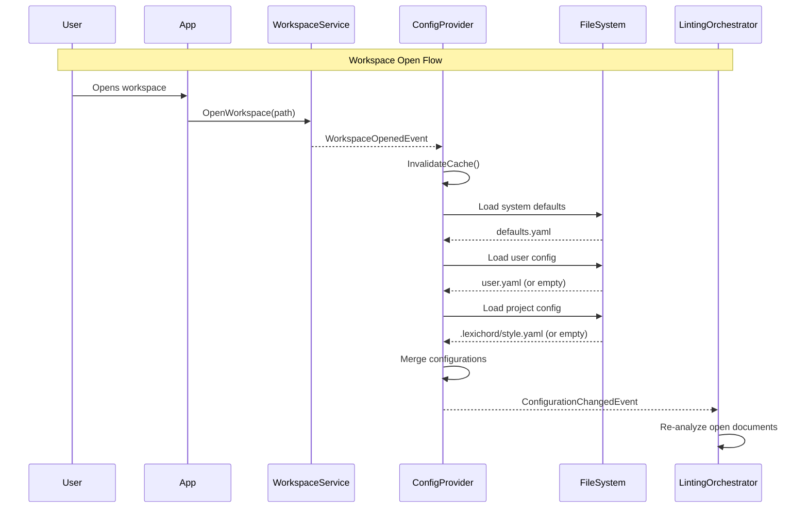
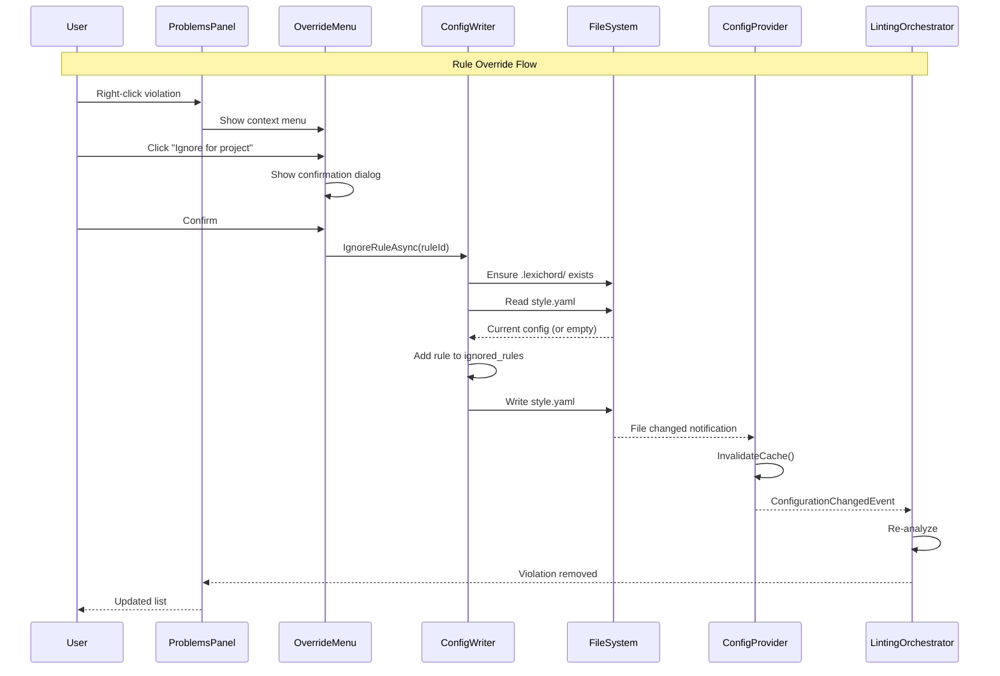

# LCS-SBD-036: Scope Breakdown — The Global Dictionary

## Document Control

| Field            | Value                                                        |
| :--------------- | :----------------------------------------------------------- |
| **Document ID**  | LCS-SBD-036                                                  |
| **Version**      | v0.3.6                                                       |
| **Codename**     | The Global Dictionary (Project Settings)                     |
| **Status**       | Draft                                                        |
| **Last Updated** | 2026-01-26                                                   |
| **Owner**        | Lead Architect                                               |
| **Depends On**   | v0.3.5 (Resonance Dashboard), v0.3.4 (Voice Profiler), v0.2.2 (Lexicon) |

---

## 1. Executive Summary

### 1.1 The Vision

**v0.3.6** delivers the **Global Dictionary** — a hierarchical configuration system for handling project-specific rule overrides. This release transforms Lexichord from a single-context linter into a project-aware tool that respects contextual overrides, enabling writers to maintain different style configurations across projects while preserving global defaults.

While previous versions established terminology rules (v0.2.x), readability metrics (v0.3.3), voice profiles (v0.3.4), and visual feedback (v0.3.5), the Global Dictionary enables these features to be customized per-project. Writers working on multiple projects (technical docs, marketing copy, legal documents) can now maintain separate configurations that automatically activate based on the open workspace.

### 1.2 Business Value

- **Project Context:** Writers can maintain different style rules per project without manual switching.
- **Team Consistency:** Teams can share project-level style configurations via version control.
- **Override Hierarchy:** Project rules always win over global defaults, preventing unwanted flags.
- **Ignore Files:** Skip analysis on generated files, minimized assets, and third-party content.
- **Enterprise Ready:** Organizations can distribute approved configurations across projects.
- **Foundation:** Enables future workspace presets and configuration templates.

### 1.3 Success Criteria

This release succeeds when:

1. Configuration merges correctly with priority: `Project/.lexichord/` > `User Profile` > `System Defaults`.
2. Project rules can override global rules (allow vs. forbid) with project always winning.
3. Override UI allows users to ignore rules for the current project via context menu.
4. `.lexichordignore` file patterns correctly exclude matched files from analysis.
5. Configuration changes take effect without requiring application restart.

### 1.4 License Gating

The Global Dictionary is a **Writer Pro** feature. Lower tiers will see:

- Project configuration files ignored (global settings only)
- "Project Settings" menu item disabled with upgrade tooltip
- Override context menu hidden
- `.lexichordignore` files processed but limited to 5 patterns

---

## 2. Dependencies on Prior Versions

| Component                  | Source Version | Usage in v0.3.6                                  |
| :------------------------- | :------------- | :----------------------------------------------- |
| `IVoiceProfileService`     | v0.3.4a        | Profile selection per project                    |
| `VoiceProfile`             | v0.3.4a        | Project-level profile defaults                   |
| `IChartDataService`        | v0.3.5a        | Project-level dashboard configuration            |
| `IReadabilityService`      | v0.3.3c        | Readability thresholds per project               |
| `ITerminologyRepository`   | v0.2.2b        | Project-specific term additions/exclusions       |
| `StyleTerm`                | v0.2.2a        | Term override model                              |
| `ILintingOrchestrator`     | v0.2.3a        | Integration point for triggering re-analysis     |
| `LintingCompletedEvent`    | v0.2.3b        | Subscribe for configuration change effects       |
| `StyleViolation`           | v0.2.1b        | Override violations at project level             |
| `IWorkspaceService`        | v0.1.2a        | Detect current workspace root                    |
| `WorkspaceOpenedEvent`     | v0.1.2a        | Trigger project config loading                   |
| `WorkspaceClosedEvent`     | v0.1.2a        | Clear project config cache                       |
| `ILicenseContext`          | v0.0.4c        | License tier checking                            |
| `IConfigurationService`    | v0.0.3d        | User-level preference storage                    |
| `ViewModelBase`            | v0.1.1         | MVVM base class                                  |

---

## 3. Sub-Part Specifications

### 3.1 v0.3.6a: The Layered Configuration

| Field            | Value                                     |
| :--------------- | :---------------------------------------- |
| **Sub-Part ID**  | INF-036a                                  |
| **Title**        | Layered Configuration Provider            |
| **Module**       | `Lexichord.Modules.Style`                 |
| **License Tier** | Writer Pro                                |

**Goal:** Implement a `ConfigurationProvider` that merges dictionaries from multiple sources with defined priority hierarchy.

**Key Deliverables:**

- `ILayeredConfigurationProvider` interface in `Lexichord.Abstractions`
- `LayeredConfigurationProvider` implementation merging configurations
- `StyleConfiguration` record containing all configurable settings
- `ConfigurationSource` enum (System, User, Project)
- Configuration file discovery in `.lexichord/style.yaml`
- Hot-reload on configuration file changes
- Unit tests for merge priority logic

**Key Interfaces:**

```csharp
namespace Lexichord.Abstractions.Contracts;

/// <summary>
/// Provides merged configuration from multiple hierarchical sources.
/// Priority: Project > User > System defaults.
/// </summary>
public interface ILayeredConfigurationProvider
{
    /// <summary>
    /// Gets the effective configuration for the current context.
    /// </summary>
    /// <returns>Merged configuration with highest-priority values winning.</returns>
    StyleConfiguration GetEffectiveConfiguration();

    /// <summary>
    /// Gets the effective configuration asynchronously.
    /// </summary>
    Task<StyleConfiguration> GetEffectiveConfigurationAsync(CancellationToken ct = default);

    /// <summary>
    /// Gets configuration from a specific source level.
    /// </summary>
    /// <param name="source">The configuration source level.</param>
    /// <returns>Configuration from that source, or null if not present.</returns>
    StyleConfiguration? GetConfiguration(ConfigurationSource source);

    /// <summary>
    /// Invalidates the configuration cache, forcing reload on next access.
    /// </summary>
    void InvalidateCache();

    /// <summary>
    /// Event raised when effective configuration changes.
    /// </summary>
    event EventHandler<ConfigurationChangedEventArgs>? ConfigurationChanged;
}

/// <summary>
/// Configuration source priority levels.
/// </summary>
public enum ConfigurationSource
{
    /// <summary>Built-in system defaults (lowest priority).</summary>
    System = 0,

    /// <summary>User-level preferences in app data.</summary>
    User = 1,

    /// <summary>Project-level overrides (highest priority).</summary>
    Project = 2
}
```

**Configuration File Structure:**

```yaml
# .lexichord/style.yaml
version: 1

# Profile settings
profile:
  default: Technical
  allow_switching: true

# Readability constraints
readability:
  target_grade_level: 10
  max_sentence_length: 25
  tolerance: 2

# Voice analysis settings
voice:
  passive_voice_threshold: 15
  flag_adverbs: true
  flag_weasels: true

# Term overrides
terminology:
  additions:
    - pattern: "proprietary-term"
      recommendation: "Use 'standard-term' instead"
      severity: warning
  exclusions:
    - "whitelist"   # Allow this term in this project
    - "blacklist"   # Allow this term in this project

# Ignored rules
ignored_rules:
  - "TERM-001"      # Specific rule ID
  - "PASSIVE-*"     # Wildcard pattern
```

**Storage Locations:**

- System: Embedded in assembly (`Lexichord.Modules.Style/Resources/defaults.yaml`)
- User: `%APPDATA%/Lexichord/style/user.yaml` (Windows)
- Project: `{workspace}/.lexichord/style.yaml`

**Configuration Merge Logic:**

```text
MERGE configurations:
│
├── Load System defaults (embedded)
│
├── Load User preferences (if exists)
│   └── Override matching keys from System
│
├── Check license tier
│   ├── NOT Writer Pro → Return merged (System + User only)
│   └── IS Writer Pro → Continue
│
├── Detect workspace root
│   └── If no workspace → Return merged (System + User)
│
├── Load Project config (if exists)
│   └── Override matching keys from merged
│
└── Return final merged configuration
```

**Dependencies:**

- v0.1.2a: `IWorkspaceService` (workspace root detection)
- v0.0.3d: `IConfigurationService` (user preferences)
- v0.2.1c: `IStyleSheetLoader` (YAML parsing reuse)

---

### 3.2 v0.3.6b: Conflict Resolution

| Field            | Value                                     |
| :--------------- | :---------------------------------------- |
| **Sub-Part ID**  | INF-036b                                  |
| **Title**        | Configuration Conflict Resolution         |
| **Module**       | `Lexichord.Modules.Style`                 |
| **License Tier** | Writer Pro                                |

**Goal:** Implement conflict resolution logic when Project rules contradict Global rules, ensuring project configuration always wins.

**Key Deliverables:**

- `IConflictResolver` interface in `Lexichord.Abstractions`
- `ConflictResolver` implementation with project-wins semantics
- `ConfigurationConflict` record describing detected conflicts
- `ConflictResolution` enum (ProjectWins, UserWins, SystemWins)
- Conflict logging for debugging configuration issues
- Unit tests for conflict scenarios

**Key Interfaces:**

```csharp
namespace Lexichord.Abstractions.Contracts;

/// <summary>
/// Resolves conflicts between configuration sources.
/// Default strategy: Project always wins over User, User always wins over System.
/// </summary>
public interface IConflictResolver
{
    /// <summary>
    /// Resolves conflicts between two configuration values.
    /// </summary>
    /// <typeparam name="T">The value type.</typeparam>
    /// <param name="higher">Value from higher-priority source.</param>
    /// <param name="lower">Value from lower-priority source.</param>
    /// <returns>The resolved value.</returns>
    T Resolve<T>(T? higher, T? lower);

    /// <summary>
    /// Detects conflicts between configuration sources.
    /// </summary>
    /// <param name="project">Project-level configuration.</param>
    /// <param name="user">User-level configuration.</param>
    /// <param name="system">System-level configuration.</param>
    /// <returns>List of detected conflicts.</returns>
    IReadOnlyList<ConfigurationConflict> DetectConflicts(
        StyleConfiguration? project,
        StyleConfiguration? user,
        StyleConfiguration system);

    /// <summary>
    /// Checks if a specific term is allowed in the current context.
    /// </summary>
    /// <param name="term">The term to check.</param>
    /// <param name="effectiveConfig">The merged configuration.</param>
    /// <returns>True if the term should be flagged, false if excluded.</returns>
    bool ShouldFlagTerm(string term, StyleConfiguration effectiveConfig);
}

/// <summary>
/// Describes a conflict between configuration sources.
/// </summary>
/// <param name="Key">The configuration key in conflict.</param>
/// <param name="HigherSource">The source that won.</param>
/// <param name="LowerSource">The source that was overridden.</param>
/// <param name="HigherValue">The winning value.</param>
/// <param name="LowerValue">The overridden value.</param>
public record ConfigurationConflict(
    string Key,
    ConfigurationSource HigherSource,
    ConfigurationSource LowerSource,
    object? HigherValue,
    object? LowerValue)
{
    /// <summary>
    /// Human-readable description of the conflict.
    /// </summary>
    public string Description =>
        $"{Key}: '{LowerValue}' ({LowerSource}) overridden by '{HigherValue}' ({HigherSource})";
}
```

**Conflict Resolution Decision Tree:**

```text
RESOLVE configuration key:
│
├── Is value set in Project config?
│   ├── YES → Use Project value (highest priority)
│   │         Log: "Using project override for {Key}"
│   └── NO → Continue
│
├── Is value set in User config?
│   ├── YES → Use User value
│   │         Log: "Using user setting for {Key}"
│   └── NO → Continue
│
├── Is value set in System defaults?
│   ├── YES → Use System value
│   │         Log: "Using system default for {Key}"
│   └── NO → Return null/default
│
└── For term exclusions specifically:
    ├── Term in Project exclusions → DO NOT flag
    ├── Term in User exclusions but NOT in Project additions → DO NOT flag
    └── Otherwise → Check against terminology rules
```

**Term Override Logic:**

```text
SHOULD flag term "{term}"?
│
├── Is term in Project exclusions?
│   └── YES → DO NOT flag (project explicitly allows)
│
├── Is term in Project additions?
│   └── YES → FLAG (project explicitly forbids)
│
├── Is term in User exclusions?
│   └── YES → DO NOT flag (user allows, project doesn't override)
│
├── Is term in User additions?
│   └── YES → FLAG (user forbids, project doesn't override)
│
├── Is term in global terminology database?
│   └── YES → FLAG (standard rule)
│
└── DEFAULT → DO NOT flag (not a known term)
```

**Dependencies:**

- v0.3.6a: `ILayeredConfigurationProvider` (configuration access)
- v0.2.2b: `ITerminologyRepository` (global term database)

---

### 3.3 v0.3.6c: Override UI

| Field            | Value                                     |
| :--------------- | :---------------------------------------- |
| **Sub-Part ID**  | INF-036c                                  |
| **Title**        | Rule Override Context Menu                |
| **Module**       | `Lexichord.Modules.Style`                 |
| **License Tier** | Writer Pro                                |

**Goal:** Add a context menu option in the Problems Panel to ignore specific rules for the current project, automatically updating the project configuration.

**Key Deliverables:**

- `OverrideMenuView.axaml` context menu items
- `OverrideMenuViewModel` with ignore/restore commands
- `IProjectConfigurationWriter` interface for updating project config
- `ProjectConfigurationWriter` implementation with YAML serialization
- Confirmation dialog for override actions
- Visual indicator for overridden rules
- Unit tests for override flow

**Key Interfaces:**

```csharp
namespace Lexichord.Abstractions.Contracts;

/// <summary>
/// Writes configuration overrides to project-level configuration files.
/// </summary>
public interface IProjectConfigurationWriter
{
    /// <summary>
    /// Adds a rule to the project's ignored rules list.
    /// </summary>
    /// <param name="ruleId">The rule ID to ignore (e.g., "TERM-001").</param>
    /// <param name="ct">Cancellation token.</param>
    /// <returns>True if successfully written.</returns>
    Task<bool> IgnoreRuleAsync(string ruleId, CancellationToken ct = default);

    /// <summary>
    /// Removes a rule from the project's ignored rules list.
    /// </summary>
    /// <param name="ruleId">The rule ID to restore.</param>
    /// <param name="ct">Cancellation token.</param>
    /// <returns>True if successfully written.</returns>
    Task<bool> RestoreRuleAsync(string ruleId, CancellationToken ct = default);

    /// <summary>
    /// Adds a term to the project's exclusions list.
    /// </summary>
    /// <param name="term">The term pattern to exclude.</param>
    /// <param name="ct">Cancellation token.</param>
    /// <returns>True if successfully written.</returns>
    Task<bool> ExcludeTermAsync(string term, CancellationToken ct = default);

    /// <summary>
    /// Checks if a rule is currently ignored in the project.
    /// </summary>
    /// <param name="ruleId">The rule ID to check.</param>
    /// <returns>True if the rule is ignored.</returns>
    bool IsRuleIgnored(string ruleId);

    /// <summary>
    /// Creates the project configuration file if it doesn't exist.
    /// </summary>
    /// <param name="ct">Cancellation token.</param>
    /// <returns>Path to the configuration file.</returns>
    Task<string> EnsureConfigurationFileAsync(CancellationToken ct = default);
}
```

**Context Menu Structure:**

```text
┌─────────────────────────────────────────────────────────────────────┐
│  Problems                                                      [×]  │
├─────────────────────────────────────────────────────────────────────┤
│  ⚠ Line 42: Passive voice detected in "was written"                │
│  ⚠ Line 58: Consider replacing "whitelist" with "allowlist"        │
│  ℹ Line 73: Adverb "very" weakens the statement                    │
├─────────────────────────────────────────────────────────────────────┤
│  Right-click on violation:                                          │
│  ┌───────────────────────────────────────┐                          │
│  │ 🔧 Apply Quick Fix                    │                          │
│  │ ───────────────────────────────────── │                          │
│  │ 🚫 Ignore this rule for this project  │  ← New in v0.3.6        │
│  │ 🚫 Ignore this term for this project  │  ← For terminology      │
│  │ ───────────────────────────────────── │                          │
│  │ 📋 Copy to Clipboard                  │                          │
│  │ 📖 Learn More...                      │                          │
│  └───────────────────────────────────────┘                          │
└─────────────────────────────────────────────────────────────────────┘
```

**Confirmation Dialog:**

```text
┌─────────────────────────────────────────────────────────────────────┐
│  Ignore Rule for Project                                            │
├─────────────────────────────────────────────────────────────────────┤
│                                                                     │
│  This will add the following rule to your project's ignore list:   │
│                                                                     │
│    Rule: TERM-whitelist                                             │
│    Pattern: "whitelist"                                             │
│                                                                     │
│  The rule will be added to:                                         │
│    .lexichord/style.yaml                                            │
│                                                                     │
│  This affects all team members who use this project.                │
│                                                                     │
│  ☐ Don't ask again for this session                                 │
│                                                                     │
│                              [Cancel]  [Ignore Rule]                │
└─────────────────────────────────────────────────────────────────────┘
```

**Override Flow:**

```text
USER right-clicks on violation:
│
├── Show context menu with override options
│
├── User selects "Ignore this rule for this project"
│
├── Check license
│   ├── NOT Writer Pro → Show upgrade prompt
│   └── IS Writer Pro → Continue
│
├── Check if workspace is open
│   ├── NO workspace → Show "Open a workspace first" message
│   └── YES workspace → Continue
│
├── Show confirmation dialog (if enabled)
│   ├── Cancel → Abort
│   └── Confirm → Continue
│
├── Call IProjectConfigurationWriter.IgnoreRuleAsync()
│
├── Writer ensures .lexichord/ directory exists
│
├── Writer updates/creates style.yaml
│   └── Adds rule ID to ignored_rules list
│
├── Trigger ILayeredConfigurationProvider.InvalidateCache()
│
├── Trigger ILintingOrchestrator re-analysis
│
└── Violation disappears from Problems Panel
```

**Dependencies:**

- v0.3.6a: `ILayeredConfigurationProvider` (configuration access)
- v0.3.6b: `IConflictResolver` (term override logic)
- v0.2.4d: `IQuickFixService` (context menu integration)
- v0.2.6a: `IProblemsPanelViewModel` (problems panel integration)
- v0.1.2a: `IWorkspaceService` (workspace detection)

---

### 3.4 v0.3.6d: Ignored Files

| Field            | Value                                     |
| :--------------- | :---------------------------------------- |
| **Sub-Part ID**  | INF-036d                                  |
| **Title**        | Ignore File Pattern Matching              |
| **Module**       | `Lexichord.Modules.Style`                 |
| **License Tier** | Core (limited), Writer Pro (full)         |

**Goal:** Implement `.lexichordignore` file support to skip analysis on matching files using glob patterns.

**Key Deliverables:**

- `IIgnorePatternService` interface in `Lexichord.Abstractions`
- `IgnorePatternService` implementation with glob matching
- `.lexichordignore` file watcher for hot-reload
- Pattern matching with wildcards (`*`, `**`, `?`)
- Integration with `ILintingOrchestrator` to skip ignored files
- Unit tests for glob pattern matching

**Key Interfaces:**

```csharp
namespace Lexichord.Abstractions.Contracts;

/// <summary>
/// Service for checking if files should be ignored based on .lexichordignore patterns.
/// </summary>
public interface IIgnorePatternService
{
    /// <summary>
    /// Checks if a file should be ignored based on current patterns.
    /// </summary>
    /// <param name="filePath">Absolute or relative file path.</param>
    /// <returns>True if the file matches an ignore pattern.</returns>
    bool ShouldIgnore(string filePath);

    /// <summary>
    /// Checks if a file should be ignored asynchronously.
    /// </summary>
    Task<bool> ShouldIgnoreAsync(string filePath, CancellationToken ct = default);

    /// <summary>
    /// Reloads ignore patterns from disk.
    /// </summary>
    void ReloadPatterns();

    /// <summary>
    /// Gets the currently loaded patterns.
    /// </summary>
    /// <returns>List of active ignore patterns.</returns>
    IReadOnlyList<string> GetPatterns();

    /// <summary>
    /// Event raised when patterns are reloaded.
    /// </summary>
    event EventHandler<PatternsReloadedEventArgs>? PatternsReloaded;
}

/// <summary>
/// Event args for pattern reload events.
/// </summary>
/// <param name="PatternCount">Number of patterns loaded.</param>
/// <param name="Source">Path to the ignore file.</param>
public record PatternsReloadedEventArgs(
    int PatternCount,
    string Source);
```

**Ignore File Format:**

```gitignore
# .lexichordignore
# Comments start with #

# Ignore all JavaScript in dist folder
dist/*.js

# Ignore minified files
**/*.min.js
**/*.min.css

# Ignore entire node_modules
node_modules/

# Ignore generated files
*.generated.cs
*.designer.cs

# Ignore specific directories
vendor/**
third-party/**

# Ignore by extension
*.log
*.tmp

# Negative pattern (include despite other rules)
!important.min.js
```

**Glob Pattern Syntax:**

| Pattern | Description | Example Match |
| :--- | :--- | :--- |
| `*` | Any characters except `/` | `*.js` matches `file.js` |
| `**` | Any characters including `/` | `**/*.js` matches `src/app/file.js` |
| `?` | Single character | `file?.txt` matches `file1.txt` |
| `[abc]` | Character class | `file[0-9].txt` matches `file5.txt` |
| `!` | Negation (include) | `!important.js` includes despite other rules |

**Pattern Matching Logic:**

```text
SHOULD ignore file "{path}"?
│
├── Normalize path (forward slashes, relative to workspace)
│
├── Check license tier
│   ├── Core → Load max 5 patterns
│   └── Writer Pro → Load all patterns
│
├── For each pattern in .lexichordignore:
│   ├── Is pattern a negation (!pattern)?
│   │   ├── YES → If matches, mark as "force include"
│   │   └── NO → Continue
│   │
│   ├── Convert pattern to regex
│   │   ├── `*` → `[^/]*`
│   │   ├── `**` → `.*`
│   │   ├── `?` → `.`
│   │   └── Escape other regex chars
│   │
│   └── Does path match pattern?
│       ├── YES → Mark as "should ignore"
│       └── NO → Continue
│
├── Is file marked "force include" (negation)?
│   └── YES → DO NOT ignore
│
├── Is file marked "should ignore"?
│   └── YES → IGNORE this file
│
└── DEFAULT → DO NOT ignore (analyze normally)
```

**Integration with Linting:**

```text
LINTING ORCHESTRATOR receives document:
│
├── Get document file path
│
├── Call IIgnorePatternService.ShouldIgnore(path)
│   ├── TRUE → Skip analysis, return empty violations
│   └── FALSE → Continue with analysis
│
└── Proceed with normal analysis pipeline
```

**File Locations:**

- Project: `{workspace}/.lexichordignore`
- User (global): `%APPDATA%/Lexichord/ignore` (Windows)

Both files are merged, with project patterns taking precedence.

**Dependencies:**

- v0.1.2a: `IWorkspaceService` (workspace root)
- v0.1.2b: `IRobustFileSystemWatcher` (file change detection)
- v0.2.3a: `ILintingOrchestrator` (integration point)

---

## 4. Implementation Checklist

| #  | Sub-Part | Task                                                        | Est. Hours |
| :- | :------- | :---------------------------------------------------------- | :--------- |
| 1  | v0.3.6a  | Create `ILayeredConfigurationProvider` interface            | 1          |
| 2  | v0.3.6a  | Create `StyleConfiguration` record with all settings        | 1.5        |
| 3  | v0.3.6a  | Implement configuration file discovery                      | 2          |
| 4  | v0.3.6a  | Implement YAML parsing for style.yaml                       | 2          |
| 5  | v0.3.6a  | Implement configuration merging logic                       | 3          |
| 6  | v0.3.6a  | Implement hot-reload on file changes                        | 2          |
| 7  | v0.3.6a  | Unit tests for configuration provider                       | 2          |
| 8  | v0.3.6b  | Create `IConflictResolver` interface                        | 0.5        |
| 9  | v0.3.6b  | Create `ConfigurationConflict` record                       | 0.5        |
| 10 | v0.3.6b  | Implement conflict detection logic                          | 2          |
| 11 | v0.3.6b  | Implement term override resolution                          | 2          |
| 12 | v0.3.6b  | Add conflict logging                                        | 1          |
| 13 | v0.3.6b  | Unit tests for conflict scenarios                           | 2          |
| 14 | v0.3.6c  | Create `IProjectConfigurationWriter` interface              | 0.5        |
| 15 | v0.3.6c  | Implement YAML serialization for project config             | 2          |
| 16 | v0.3.6c  | Create context menu items in Problems Panel                 | 2          |
| 17 | v0.3.6c  | Create `OverrideMenuViewModel` with commands                | 2          |
| 18 | v0.3.6c  | Implement confirmation dialog                               | 1.5        |
| 19 | v0.3.6c  | Add visual indicator for overridden rules                   | 1          |
| 20 | v0.3.6c  | Unit tests for override flow                                | 2          |
| 21 | v0.3.6d  | Create `IIgnorePatternService` interface                    | 0.5        |
| 22 | v0.3.6d  | Implement glob pattern matching                             | 3          |
| 23 | v0.3.6d  | Implement negative pattern support                          | 1          |
| 24 | v0.3.6d  | Implement file watcher for hot-reload                       | 1.5        |
| 25 | v0.3.6d  | Integrate with `ILintingOrchestrator`                       | 1          |
| 26 | v0.3.6d  | Unit tests for glob patterns                                | 2          |
| 27 | All      | Integration with workspace events                           | 1.5        |
| 28 | All      | DI registration in `StyleModule.cs`                         | 0.5        |
| 29 | All      | Integration tests for full configuration flow               | 3          |
| **Total** |   |                                                             | **44 hours** |

---

## 5. Dependency Matrix

### 5.1 Required Interfaces (from earlier versions)

| Interface                  | Source Version | Purpose                              |
| :------------------------- | :------------- | :----------------------------------- |
| `IWorkspaceService`        | v0.1.2a        | Workspace root detection             |
| `WorkspaceOpenedEvent`     | v0.1.2a        | Trigger config loading               |
| `WorkspaceClosedEvent`     | v0.1.2a        | Clear config cache                   |
| `IRobustFileSystemWatcher` | v0.1.2b        | Config file change detection         |
| `IConfigurationService`    | v0.0.3d        | User preferences access              |
| `ILintingOrchestrator`     | v0.2.3a        | Analysis pipeline integration        |
| `ITerminologyRepository`   | v0.2.2b        | Global term database                 |
| `StyleTerm`                | v0.2.2a        | Term model                           |
| `IQuickFixService`         | v0.2.4d        | Context menu integration             |
| `IProblemsPanelViewModel`  | v0.2.6a        | Problems panel integration           |
| `ILicenseContext`          | v0.0.4c        | License tier checking                |
| `IVoiceProfileService`     | v0.3.4a        | Project-level profile defaults       |
| `IChartDataService`        | v0.3.5a        | Project dashboard config             |
| `ViewModelBase`            | v0.1.1         | MVVM base class                      |

### 5.2 New Interfaces (defined in v0.3.6)

| Interface                       | Defined In | Module        | Purpose                            |
| :------------------------------ | :--------- | :------------ | :--------------------------------- |
| `ILayeredConfigurationProvider` | v0.3.6a    | Abstractions  | Hierarchical config access         |
| `IConflictResolver`             | v0.3.6b    | Abstractions  | Configuration conflict resolution  |
| `IProjectConfigurationWriter`   | v0.3.6c    | Modules.Style | Project config file updates        |
| `IIgnorePatternService`         | v0.3.6d    | Abstractions  | Ignore file pattern matching       |

### 5.3 New Records/DTOs (defined in v0.3.6)

| Record                         | Defined In | Purpose                                |
| :----------------------------- | :--------- | :------------------------------------- |
| `StyleConfiguration`           | v0.3.6a    | Complete configuration settings        |
| `ConfigurationSource`          | v0.3.6a    | Priority level enum                    |
| `ConfigurationChangedEventArgs`| v0.3.6a    | Configuration change notification      |
| `ConfigurationConflict`        | v0.3.6b    | Conflict description record            |
| `PatternsReloadedEventArgs`    | v0.3.6d    | Pattern reload notification            |

### 5.4 NuGet Packages

| Package          | Version | Purpose                    | New/Existing |
| :--------------- | :------ | :------------------------- | :----------- |
| `YamlDotNet`     | 16.x    | YAML parsing/serialization | Existing     |
| `System.Reactive`| 6.x     | File watcher debouncing    | Existing     |
| `MediatR`        | 12.x    | Event publishing           | Existing     |
| `Microsoft.Extensions.FileSystemGlobbing` | 9.x | Glob pattern matching | New |

---

## 6. Architecture Diagram

```mermaid
graph TB
    subgraph "Lexichord.Modules.Style"
        subgraph "v0.3.6c: Override UI"
            OMV[OverrideMenuView]
            OMVM[OverrideMenuViewModel]
        end

        subgraph "v0.3.6a: Configuration"
            LCP[LayeredConfigurationProvider]
            SC[StyleConfiguration]
        end

        subgraph "v0.3.6b: Conflict Resolution"
            CR[ConflictResolver]
            CC[ConfigurationConflict]
        end

        subgraph "v0.3.6d: Ignore Files"
            IPS[IgnorePatternService]
        end

        subgraph "Configuration Writing"
            PCW[ProjectConfigurationWriter]
        end
    end

    subgraph "Lexichord.Abstractions"
        ILCP[ILayeredConfigurationProvider]
        ICR[IConflictResolver]
        IPCW[IProjectConfigurationWriter]
        IIPS[IIgnorePatternService]
    end

    subgraph "Dependencies (Prior Versions)"
        WS[IWorkspaceService<br/>v0.1.2a]
        LO[ILintingOrchestrator<br/>v0.2.3a]
        TR[ITerminologyRepository<br/>v0.2.2b]
        QFS[IQuickFixService<br/>v0.2.4d]
        PP[IProblemsPanelViewModel<br/>v0.2.6a]
        VPS[IVoiceProfileService<br/>v0.3.4a]
    end

    OMV --> OMVM
    OMVM --> IPCW
    OMVM --> PP

    LCP --> ILCP
    LCP --> WS
    LCP --> SC

    CR --> ICR
    CR --> TR
    CR --> CC

    IPS --> IIPS
    IPS --> WS

    PCW --> IPCW
    PCW --> LCP

    LO --> IPS
    LO --> LCP

    QFS --> OMVM

    style OMV fill:#4a9eff,color:#fff
    style OMVM fill:#4a9eff,color:#fff
    style LCP fill:#22c55e,color:#fff
    style CR fill:#22c55e,color:#fff
    style IPS fill:#22c55e,color:#fff
    style PCW fill:#22c55e,color:#fff
```



---

## 7. Data Flow Diagram

### 7.1 Configuration Loading Flow



### 7.2 Override Flow



---

## 8. Risks & Mitigations

| Risk | Impact | Probability | Mitigation |
| :--- | :----- | :---------- | :--------- |
| Configuration file corruption | High | Low | Validate YAML before loading, backup on write |
| Merge conflicts in team environments | Medium | Medium | Document merge semantics, add conflict warnings |
| Hot-reload race conditions | Medium | Low | Debounce file changes, use atomic writes |
| Glob pattern performance on large repos | Medium | Medium | Cache compiled patterns, limit recursion depth |
| Users confused by override hierarchy | Medium | Medium | Add "Configuration Inspector" tool in future |
| Ignore patterns too aggressive | Low | Medium | Require explicit opt-in, show ignored file count |
| YAML parsing errors | Medium | Low | Provide clear error messages, fall back to defaults |

---

## 9. Success Metrics

| Metric | Target | Measurement |
| :----- | :----- | :---------- |
| Configuration load time | < 50ms | Stopwatch timing |
| Configuration merge time | < 10ms | Stopwatch timing |
| File change detection latency | < 500ms | End-to-end timing |
| Glob pattern matching (1000 files) | < 100ms | Benchmark |
| Override action latency | < 200ms | User action to file write |
| YAML file size limit | < 100KB | File size check |
| Pattern count limit (Core) | 5 patterns | License check |

---

## 10. What This Enables

After v0.3.6, Lexichord will support:

- **v0.3.7 (Performance Tuning):** Configuration-aware analysis parallelization. Skip ignored files before spawning analysis tasks.

- **v0.3.8 (Hardening):** Test configuration edge cases. Verify merge semantics across tiers.

- **v0.4.x (Configuration Templates):** Pre-built configuration templates for common project types (React, .NET, Python).

- **Future:** Team configuration sharing via cloud sync. Organization-wide policy enforcement.

---

## 11. Decision Trees

### 11.1 Should Load Project Configuration?

```text
START: "Should load project-level configuration?"
│
├── Is user license >= WriterPro?
│   ├── NO → DO NOT load project config
│   │         Use merged (System + User) only
│   └── YES → Continue
│
├── Is a workspace open?
│   ├── NO → DO NOT load project config
│   │         Use merged (System + User) only
│   └── YES → Continue
│
├── Does {workspace}/.lexichord/ directory exist?
│   ├── NO → DO NOT load project config
│   │         Use merged (System + User) only
│   └── YES → Continue
│
├── Does {workspace}/.lexichord/style.yaml exist?
│   ├── NO → DO NOT load project config
│   │         Use merged (System + User) only
│   └── YES → Load and merge project config
│
└── Return fully merged configuration
```

### 11.2 Should Ignore File?

```text
START: "Should ignore file for linting?"
│
├── Load patterns from .lexichordignore
│   ├── Project-level (if exists)
│   └── User-level (if exists)
│
├── Check license for pattern limit
│   ├── Core → Use first 5 patterns only
│   └── Writer Pro → Use all patterns
│
├── For each ignore pattern (in order):
│   ├── Is pattern a negation (!)?
│   │   └── YES → If matches, mark "force include"
│   │
│   └── Does file path match pattern?
│       └── YES → Mark "should ignore"
│
├── Is file marked "force include"?
│   └── YES → DO NOT ignore (analyze)
│
├── Is file marked "should ignore"?
│   └── YES → IGNORE (skip analysis)
│
└── DEFAULT → DO NOT ignore (analyze)
```

---

## 12. User Stories

| ID    | Role            | Story                                                                               | Acceptance Criteria                                   |
| :---- | :-------------- | :---------------------------------------------------------------------------------- | :---------------------------------------------------- |
| US-01 | Writer Pro User | As a writer, I want project-specific style rules so different projects can have different standards. | Project config overrides global config. |
| US-02 | Writer Pro User | As a writer, I want to ignore a rule for my project via right-click menu. | Rule added to project config, violation disappears. |
| US-03 | Writer Pro User | As a writer, I want to exclude generated files from analysis. | `.lexichordignore` patterns skip matching files. |
| US-04 | Team Lead       | As a team lead, I want to share style configuration via version control. | `.lexichord/style.yaml` can be committed to Git. |
| US-05 | Writer Pro User | As a writer, I want configuration changes to take effect immediately. | Hot-reload on file change, no restart needed. |
| US-06 | Core User       | As a free user, I understand project settings are a premium feature. | Global settings work, project ignored. |
| US-07 | Developer       | As a developer, I want to see which configuration source a setting came from. | Conflict logging shows source priority. |
| US-08 | Writer Pro User | As a writer, I want to allow a term in one project that's forbidden globally. | Project exclusions override global rules. |

---

## 13. Use Cases

### UC-01: Project Configuration Override

**Preconditions:**

- User has Writer Pro license
- Workspace is open
- Global config forbids "whitelist"

**Flow:**

1. User opens project that uses "whitelist" terminology.
2. Linter flags "whitelist" as violation.
3. User right-clicks violation in Problems Panel.
4. User selects "Ignore this term for this project".
5. Confirmation dialog appears.
6. User confirms.
7. System creates/updates `.lexichord/style.yaml`.
8. System adds "whitelist" to `terminology.exclusions`.
9. System triggers re-analysis.
10. Violation disappears.
11. Future uses of "whitelist" in this project are not flagged.

**Postconditions:**

- `.lexichord/style.yaml` contains "whitelist" in exclusions.
- Term is allowed in this project only.
- Global setting unchanged.

---

### UC-02: Ignore Generated Files

**Preconditions:**

- User has Writer Pro license
- Workspace contains `dist/` folder with compiled JS

**Flow:**

1. User creates `.lexichordignore` in workspace root.
2. User adds pattern: `dist/**/*.js`.
3. System detects file change.
4. System reloads patterns.
5. User opens file in `dist/bundle.js`.
6. Linting orchestrator checks ignore patterns.
7. File matches `dist/**/*.js` pattern.
8. Analysis is skipped.
9. No violations shown for file.

**Postconditions:**

- Files in `dist/` are not analyzed.
- Files outside `dist/` are analyzed normally.

---

### UC-03: Configuration Merge Priority

**Preconditions:**

- System default: `passive_voice_threshold: 20`
- User config: `passive_voice_threshold: 15`
- Project config: `passive_voice_threshold: 10`

**Flow:**

1. User opens workspace with project config.
2. ConfigProvider loads system defaults.
3. ConfigProvider merges user config (15 overrides 20).
4. ConfigProvider merges project config (10 overrides 15).
5. Effective configuration has `passive_voice_threshold: 10`.
6. Voice analysis uses 10% threshold.
7. Document with 12% passive voice triggers warning.

**Postconditions:**

- Project config value (10) is used.
- Conflict logged: "passive_voice_threshold: 15 (User) overridden by 10 (Project)".

---

## 14. Unit Testing Requirements

### 14.1 LayeredConfigurationProvider Tests

```csharp
[Trait("Category", "Unit")]
[Trait("Version", "v0.3.6a")]
public class LayeredConfigurationProviderTests
{
    [Fact]
    public void GetEffectiveConfiguration_NoProject_ReturnsMergedUserAndSystem()
    {
        // Arrange
        var provider = CreateProviderWithConfigs(
            system: new StyleConfiguration { PassiveVoiceThreshold = 20 },
            user: new StyleConfiguration { PassiveVoiceThreshold = 15 },
            project: null);

        // Act
        var result = provider.GetEffectiveConfiguration();

        // Assert
        result.PassiveVoiceThreshold.Should().Be(15); // User wins over System
    }

    [Fact]
    public void GetEffectiveConfiguration_WithProject_ProjectWins()
    {
        // Arrange
        var provider = CreateProviderWithConfigs(
            system: new StyleConfiguration { PassiveVoiceThreshold = 20 },
            user: new StyleConfiguration { PassiveVoiceThreshold = 15 },
            project: new StyleConfiguration { PassiveVoiceThreshold = 10 });

        // Act
        var result = provider.GetEffectiveConfiguration();

        // Assert
        result.PassiveVoiceThreshold.Should().Be(10); // Project wins
    }

    [Fact]
    public void GetEffectiveConfiguration_CoreLicense_IgnoresProjectConfig()
    {
        // Arrange
        var mockLicense = new Mock<ILicenseContext>();
        mockLicense.Setup(l => l.Tier).Returns(LicenseTier.Core);

        var provider = CreateProviderWithConfigs(
            system: new StyleConfiguration { PassiveVoiceThreshold = 20 },
            user: new StyleConfiguration { PassiveVoiceThreshold = 15 },
            project: new StyleConfiguration { PassiveVoiceThreshold = 10 },
            licenseContext: mockLicense.Object);

        // Act
        var result = provider.GetEffectiveConfiguration();

        // Assert
        result.PassiveVoiceThreshold.Should().Be(15); // User wins, project ignored
    }
}
```

### 14.2 ConflictResolver Tests

```csharp
[Trait("Category", "Unit")]
[Trait("Version", "v0.3.6b")]
public class ConflictResolverTests
{
    [Fact]
    public void ShouldFlagTerm_ProjectExclusion_ReturnsFalse()
    {
        // Arrange
        var resolver = new ConflictResolver();
        var config = new StyleConfiguration
        {
            TerminologyExclusions = new[] { "whitelist" }
        };

        // Act
        var result = resolver.ShouldFlagTerm("whitelist", config);

        // Assert
        result.Should().BeFalse();
    }

    [Fact]
    public void ShouldFlagTerm_NotExcluded_ReturnsTrue()
    {
        // Arrange
        var resolver = new ConflictResolver();
        var config = new StyleConfiguration
        {
            TerminologyExclusions = Array.Empty<string>()
        };

        // Act
        var result = resolver.ShouldFlagTerm("whitelist", config);

        // Assert (assuming whitelist is in global terminology)
        result.Should().BeTrue();
    }

    [Fact]
    public void DetectConflicts_DifferentValues_ReturnsConflict()
    {
        // Arrange
        var resolver = new ConflictResolver();
        var project = new StyleConfiguration { PassiveVoiceThreshold = 10 };
        var user = new StyleConfiguration { PassiveVoiceThreshold = 15 };
        var system = new StyleConfiguration { PassiveVoiceThreshold = 20 };

        // Act
        var conflicts = resolver.DetectConflicts(project, user, system);

        // Assert
        conflicts.Should().ContainSingle(c =>
            c.Key == "PassiveVoiceThreshold" &&
            c.HigherSource == ConfigurationSource.Project);
    }
}
```

### 14.3 IgnorePatternService Tests

```csharp
[Trait("Category", "Unit")]
[Trait("Version", "v0.3.6d")]
public class IgnorePatternServiceTests
{
    [Theory]
    [InlineData("dist/bundle.js", "dist/*.js", true)]
    [InlineData("src/app.js", "dist/*.js", false)]
    [InlineData("src/utils/helper.js", "**/*.js", true)]
    [InlineData("file.min.js", "*.min.js", true)]
    [InlineData("file.js", "*.min.js", false)]
    public void ShouldIgnore_GlobPatterns_MatchesCorrectly(
        string filePath, string pattern, bool expected)
    {
        // Arrange
        var service = new IgnorePatternService();
        service.LoadPatterns(new[] { pattern });

        // Act
        var result = service.ShouldIgnore(filePath);

        // Assert
        result.Should().Be(expected);
    }

    [Fact]
    public void ShouldIgnore_NegationPattern_IncludesFile()
    {
        // Arrange
        var service = new IgnorePatternService();
        service.LoadPatterns(new[] { "*.js", "!important.js" });

        // Act & Assert
        service.ShouldIgnore("bundle.js").Should().BeTrue();
        service.ShouldIgnore("important.js").Should().BeFalse();
    }

    [Fact]
    public void ShouldIgnore_CoreLicense_LimitsPatterns()
    {
        // Arrange
        var mockLicense = new Mock<ILicenseContext>();
        mockLicense.Setup(l => l.Tier).Returns(LicenseTier.Core);

        var service = new IgnorePatternService(mockLicense.Object);
        service.LoadPatterns(new[] { "*.js", "*.ts", "*.css", "*.html", "*.json", "*.xml" });

        // Act
        var patterns = service.GetPatterns();

        // Assert
        patterns.Should().HaveCount(5); // Limited to 5 for Core
    }
}
```

### 14.4 ProjectConfigurationWriter Tests

```csharp
[Trait("Category", "Unit")]
[Trait("Version", "v0.3.6c")]
public class ProjectConfigurationWriterTests
{
    [Fact]
    public async Task IgnoreRuleAsync_CreatesConfigFile_WhenNotExists()
    {
        // Arrange
        var mockFileSystem = new Mock<IFileSystem>();
        var mockWorkspace = new Mock<IWorkspaceService>();
        mockWorkspace.Setup(w => w.RootPath).Returns("/project");
        mockFileSystem.Setup(f => f.Exists("/project/.lexichord/style.yaml")).Returns(false);

        var writer = new ProjectConfigurationWriter(mockFileSystem.Object, mockWorkspace.Object);

        // Act
        var result = await writer.IgnoreRuleAsync("TERM-001");

        // Assert
        result.Should().BeTrue();
        mockFileSystem.Verify(f => f.CreateDirectory("/project/.lexichord"), Times.Once);
        mockFileSystem.Verify(f => f.WriteAllText(
            "/project/.lexichord/style.yaml",
            It.Is<string>(s => s.Contains("TERM-001"))), Times.Once);
    }

    [Fact]
    public async Task IgnoreRuleAsync_AppendsToExisting_WhenFileExists()
    {
        // Arrange
        var existingYaml = @"
version: 1
ignored_rules:
  - EXISTING-001
";
        var mockFileSystem = new Mock<IFileSystem>();
        var mockWorkspace = new Mock<IWorkspaceService>();
        mockWorkspace.Setup(w => w.RootPath).Returns("/project");
        mockFileSystem.Setup(f => f.Exists("/project/.lexichord/style.yaml")).Returns(true);
        mockFileSystem.Setup(f => f.ReadAllText("/project/.lexichord/style.yaml")).Returns(existingYaml);

        var writer = new ProjectConfigurationWriter(mockFileSystem.Object, mockWorkspace.Object);

        // Act
        var result = await writer.IgnoreRuleAsync("TERM-002");

        // Assert
        result.Should().BeTrue();
        mockFileSystem.Verify(f => f.WriteAllText(
            "/project/.lexichord/style.yaml",
            It.Is<string>(s => s.Contains("EXISTING-001") && s.Contains("TERM-002"))), Times.Once);
    }
}
```

---

## 15. Observability & Logging

| Level   | Source                    | Message Template                                                       |
| :------ | :------------------------ | :--------------------------------------------------------------------- |
| Debug   | ConfigurationProvider     | `Loading configuration from {Source}: {Path}`                          |
| Debug   | ConfigurationProvider     | `Configuration merged: {KeyCount} keys from {Source}`                  |
| Info    | ConfigurationProvider     | `Effective configuration loaded in {ElapsedMs}ms`                      |
| Debug   | ConfigurationProvider     | `Configuration cache invalidated`                                      |
| Warning | ConfigurationProvider     | `Failed to load configuration from {Path}: {Error}`                    |
| Debug   | ConflictResolver          | `Conflict detected: {Key} = {LowerValue} ({LowerSource}) → {HigherValue} ({HigherSource})` |
| Debug   | ConflictResolver          | `Term '{Term}' excluded by {Source} configuration`                     |
| Info    | ConfigurationWriter       | `Rule {RuleId} added to project ignore list`                           |
| Info    | ConfigurationWriter       | `Term '{Term}' added to project exclusions`                            |
| Debug   | ConfigurationWriter       | `Created project configuration file: {Path}`                           |
| Debug   | IgnorePatternService      | `Loaded {PatternCount} ignore patterns from {Path}`                    |
| Debug   | IgnorePatternService      | `File '{Path}' matches ignore pattern '{Pattern}'`                     |
| Debug   | IgnorePatternService      | `File '{Path}' force-included by negation pattern '{Pattern}'`         |
| Warning | IgnorePatternService      | `Core license: limited to {Limit} ignore patterns`                     |

---

## 16. UI/UX Specifications

### 16.1 Override Context Menu

```text
┌─────────────────────────────────────────────────────────────────────┐
│  Problems                                                      [×]  │
├─────────────────────────────────────────────────────────────────────┤
│  ⚠ Line 42: Consider replacing "whitelist" with "allowlist"         │
│    └─ [Right-click]                                                 │
│       ┌───────────────────────────────────────────────────────────┐ │
│       │ 🔧 Apply Quick Fix                                   Ctrl+. │ │
│       │ ──────────────────────────────────────────────────────────│ │
│       │ 🚫 Ignore "whitelist" for this project                     │ │
│       │ 🚫 Ignore rule TERM-whitelist for this project             │ │
│       │ ──────────────────────────────────────────────────────────│ │
│       │ 📋 Copy Message                                            │ │
│       │ 📖 Learn More...                                           │ │
│       └───────────────────────────────────────────────────────────┘ │
└─────────────────────────────────────────────────────────────────────┘
```

### 16.2 Component Styling Requirements

| Component           | Theme Resource             | Notes                            |
| :------------------ | :------------------------- | :------------------------------- |
| Menu Item           | `LexMenuItem` theme        | Standard context menu styling    |
| Menu Separator      | `MenuSeparator`            | 1px horizontal line              |
| Menu Icon           | Material Icons             | 24x24, Text.Primary color        |
| Disabled Menu Item  | Opacity 50%                | For unlicensed features          |
| Confirmation Dialog | `LexDialog` theme          | Standard dialog styling          |
| Override Badge      | `Badge.Info` style         | Small indicator on overridden items |

---

## 17. Acceptance Criteria (QA)

| #   | Category            | Criterion                                                                    |
| :-- | :------------------ | :--------------------------------------------------------------------------- |
| 1   | **[Config]**        | System defaults load without project/user config present.                    |
| 2   | **[Config]**        | User config overrides system defaults.                                       |
| 3   | **[Config]**        | Project config overrides user config.                                        |
| 4   | **[Config]**        | Core license ignores project config.                                         |
| 5   | **[Config]**        | Configuration hot-reloads on file change.                                    |
| 6   | **[Override]**      | "Ignore rule" creates `.lexichord/style.yaml` if not exists.                 |
| 7   | **[Override]**      | "Ignore rule" appends to existing config without data loss.                  |
| 8   | **[Override]**      | Ignored rules do not produce violations.                                     |
| 9   | **[Override]**      | Term exclusions allow otherwise-forbidden terms.                             |
| 10  | **[Ignore File]**   | `.lexichordignore` patterns skip matching files.                             |
| 11  | **[Ignore File]**   | Negative patterns (!) include files despite other patterns.                  |
| 12  | **[Ignore File]**   | Core license limits to 5 patterns.                                           |
| 13  | **[Performance]**   | Configuration load < 50ms.                                                   |
| 14  | **[Performance]**   | Glob matching (1000 files) < 100ms.                                          |
| 15  | **[License Gate]**  | Core users cannot access project settings menu.                              |
| 16  | **[License Gate]**  | Core users cannot use override context menu.                                 |
| 17  | **[Integration]**   | Workspace open triggers config reload.                                       |
| 18  | **[Integration]**   | Workspace close clears project config cache.                                 |

---

## 18. Verification Commands

```bash
# ═══════════════════════════════════════════════════════════════════════════
# v0.3.6 Verification
# ═══════════════════════════════════════════════════════════════════════════

# 1. Verify NuGet packages installed
dotnet list src/Lexichord.Modules.Style package | grep FileSystemGlobbing

# 2. Build solution
dotnet build

# 3. Run unit tests for v0.3.6 components
dotnet test --filter "Category=Unit&FullyQualifiedName~LayeredConfiguration"
dotnet test --filter "Category=Unit&FullyQualifiedName~ConflictResolver"
dotnet test --filter "Category=Unit&FullyQualifiedName~IgnorePattern"
dotnet test --filter "Category=Unit&FullyQualifiedName~ProjectConfiguration"

# 4. Run all v0.3.6 tests
dotnet test --filter "Version=v0.3.6"

# 5. Manual verification:
# a) Open app without workspace → Verify global settings apply
# b) Open workspace with .lexichord/style.yaml → Verify project overrides
# c) Right-click violation → Verify "Ignore for project" option
# d) Click "Ignore for project" → Verify style.yaml updated
# e) Create .lexichordignore with "dist/*.js" → Verify dist files not analyzed
# f) Modify style.yaml externally → Verify hot-reload
```

---

## 19. Deliverable Checklist

| #  | Deliverable                                                    | Status |
| :- | :------------------------------------------------------------- | :----- |
| 1  | `ILayeredConfigurationProvider` interface in Abstractions      | [ ]    |
| 2  | `LayeredConfigurationProvider` implementation                  | [ ]    |
| 3  | `StyleConfiguration` record with all settings                  | [ ]    |
| 4  | `ConfigurationSource` enum                                     | [ ]    |
| 5  | `IConflictResolver` interface in Abstractions                  | [ ]    |
| 6  | `ConflictResolver` implementation                              | [ ]    |
| 7  | `ConfigurationConflict` record                                 | [ ]    |
| 8  | `IProjectConfigurationWriter` interface                        | [ ]    |
| 9  | `ProjectConfigurationWriter` implementation                    | [ ]    |
| 10 | Override context menu items                                    | [ ]    |
| 11 | `OverrideMenuViewModel` with commands                          | [ ]    |
| 12 | Confirmation dialog for overrides                              | [ ]    |
| 13 | `IIgnorePatternService` interface in Abstractions              | [ ]    |
| 14 | `IgnorePatternService` with glob matching                      | [ ]    |
| 15 | Integration with `ILintingOrchestrator`                        | [ ]    |
| 16 | Unit tests for configuration provider                          | [ ]    |
| 17 | Unit tests for conflict resolver                               | [ ]    |
| 18 | Unit tests for ignore patterns                                 | [ ]    |
| 19 | Unit tests for configuration writer                            | [ ]    |
| 20 | Integration tests for full configuration flow                  | [ ]    |
| 21 | DI registration in StyleModule.cs                              | [ ]    |

---

## 20. Code Examples

### 20.1 StyleConfiguration Record

```csharp
namespace Lexichord.Modules.Style.Models;

/// <summary>
/// Complete style configuration settings that can be loaded from
/// system defaults, user preferences, or project-level files.
/// </summary>
public record StyleConfiguration
{
    /// <summary>Configuration file version for compatibility checking.</summary>
    public int Version { get; init; } = 1;

    // Profile settings
    /// <summary>Default voice profile name.</summary>
    public string? DefaultProfile { get; init; }

    /// <summary>Whether users can switch profiles in this context.</summary>
    public bool AllowProfileSwitching { get; init; } = true;

    // Readability constraints
    /// <summary>Target Flesch-Kincaid grade level.</summary>
    public double? TargetGradeLevel { get; init; }

    /// <summary>Maximum words per sentence.</summary>
    public int? MaxSentenceLength { get; init; }

    /// <summary>Grade level tolerance (±).</summary>
    public double GradeLevelTolerance { get; init; } = 2;

    // Voice analysis settings
    /// <summary>Maximum passive voice percentage before warning.</summary>
    public double PassiveVoiceThreshold { get; init; } = 20;

    /// <summary>Whether to flag adverbs.</summary>
    public bool FlagAdverbs { get; init; } = true;

    /// <summary>Whether to flag weasel words.</summary>
    public bool FlagWeaselWords { get; init; } = true;

    // Term overrides
    /// <summary>Additional terms to flag in this context.</summary>
    public IReadOnlyList<TermAddition> TerminologyAdditions { get; init; } =
        Array.Empty<TermAddition>();

    /// <summary>Terms to exclude from flagging in this context.</summary>
    public IReadOnlyList<string> TerminologyExclusions { get; init; } =
        Array.Empty<string>();

    /// <summary>Rule IDs to ignore in this context.</summary>
    public IReadOnlyList<string> IgnoredRules { get; init; } =
        Array.Empty<string>();

    /// <summary>System defaults configuration.</summary>
    public static StyleConfiguration Defaults => new()
    {
        Version = 1,
        DefaultProfile = "Technical",
        AllowProfileSwitching = true,
        TargetGradeLevel = 10,
        MaxSentenceLength = 25,
        GradeLevelTolerance = 2,
        PassiveVoiceThreshold = 20,
        FlagAdverbs = true,
        FlagWeaselWords = true
    };
}

/// <summary>
/// A term addition for project/user configuration.
/// </summary>
/// <param name="Pattern">The term pattern to match.</param>
/// <param name="Recommendation">Suggested replacement.</param>
/// <param name="Severity">Violation severity.</param>
public record TermAddition(
    string Pattern,
    string? Recommendation,
    ViolationSeverity Severity = ViolationSeverity.Warning);
```

### 20.2 LayeredConfigurationProvider Implementation

```csharp
namespace Lexichord.Modules.Style.Services;

/// <summary>
/// Provides merged configuration from system, user, and project sources.
/// </summary>
public class LayeredConfigurationProvider : ILayeredConfigurationProvider
{
    private readonly IWorkspaceService _workspaceService;
    private readonly IConfigurationService _configService;
    private readonly ILicenseContext _licenseContext;
    private readonly ILogger<LayeredConfigurationProvider> _logger;

    private StyleConfiguration? _cachedConfig;
    private DateTime _cacheTime;

    public event EventHandler<ConfigurationChangedEventArgs>? ConfigurationChanged;

    public LayeredConfigurationProvider(
        IWorkspaceService workspaceService,
        IConfigurationService configService,
        ILicenseContext licenseContext,
        ILogger<LayeredConfigurationProvider> logger)
    {
        _workspaceService = workspaceService;
        _configService = configService;
        _licenseContext = licenseContext;
        _logger = logger;
    }

    public StyleConfiguration GetEffectiveConfiguration()
    {
        if (_cachedConfig != null && DateTime.UtcNow - _cacheTime < TimeSpan.FromSeconds(5))
        {
            return _cachedConfig;
        }

        var stopwatch = Stopwatch.StartNew();

        // 1. Load system defaults
        var system = StyleConfiguration.Defaults;
        _logger.LogDebug("Loaded system defaults");

        // 2. Load user configuration
        var user = LoadUserConfiguration();
        var merged = MergeConfigurations(system, user);
        _logger.LogDebug("Merged user configuration: {KeyCount} overrides", CountOverrides(user));

        // 3. Load project configuration (if licensed and workspace open)
        if (_licenseContext.HasFeature(FeatureFlags.Style.GlobalDictionary) &&
            _workspaceService.IsWorkspaceOpen)
        {
            var project = LoadProjectConfiguration();
            if (project != null)
            {
                merged = MergeConfigurations(merged, project);
                _logger.LogDebug("Merged project configuration: {KeyCount} overrides", CountOverrides(project));
            }
        }
        else if (!_licenseContext.HasFeature(FeatureFlags.Style.GlobalDictionary))
        {
            _logger.LogDebug("Project configuration skipped: license not available");
        }

        stopwatch.Stop();
        _logger.LogInformation("Effective configuration loaded in {ElapsedMs}ms", stopwatch.ElapsedMilliseconds);

        _cachedConfig = merged;
        _cacheTime = DateTime.UtcNow;

        return merged;
    }

    public void InvalidateCache()
    {
        _cachedConfig = null;
        _logger.LogDebug("Configuration cache invalidated");
        ConfigurationChanged?.Invoke(this, new ConfigurationChangedEventArgs());
    }

    private StyleConfiguration? LoadProjectConfiguration()
    {
        var projectPath = Path.Combine(
            _workspaceService.RootPath!,
            ".lexichord",
            "style.yaml");

        if (!File.Exists(projectPath))
        {
            return null;
        }

        try
        {
            var yaml = File.ReadAllText(projectPath);
            var deserializer = new DeserializerBuilder()
                .WithNamingConvention(UnderscoredNamingConvention.Instance)
                .Build();

            return deserializer.Deserialize<StyleConfiguration>(yaml);
        }
        catch (Exception ex)
        {
            _logger.LogWarning("Failed to load project configuration from {Path}: {Error}",
                projectPath, ex.Message);
            return null;
        }
    }

    private StyleConfiguration MergeConfigurations(
        StyleConfiguration lower,
        StyleConfiguration? higher)
    {
        if (higher == null) return lower;

        return lower with
        {
            DefaultProfile = higher.DefaultProfile ?? lower.DefaultProfile,
            AllowProfileSwitching = higher.AllowProfileSwitching,
            TargetGradeLevel = higher.TargetGradeLevel ?? lower.TargetGradeLevel,
            MaxSentenceLength = higher.MaxSentenceLength ?? lower.MaxSentenceLength,
            GradeLevelTolerance = higher.GradeLevelTolerance,
            PassiveVoiceThreshold = higher.PassiveVoiceThreshold,
            FlagAdverbs = higher.FlagAdverbs,
            FlagWeaselWords = higher.FlagWeaselWords,
            TerminologyAdditions = higher.TerminologyAdditions.Count > 0
                ? higher.TerminologyAdditions
                : lower.TerminologyAdditions,
            TerminologyExclusions = higher.TerminologyExclusions
                .Concat(lower.TerminologyExclusions)
                .Distinct()
                .ToList(),
            IgnoredRules = higher.IgnoredRules
                .Concat(lower.IgnoredRules)
                .Distinct()
                .ToList()
        };
    }
}
```

### 20.3 IgnorePatternService Implementation

```csharp
namespace Lexichord.Modules.Style.Services;

/// <summary>
/// Checks files against .lexichordignore patterns using glob matching.
/// </summary>
public class IgnorePatternService : IIgnorePatternService
{
    private readonly IWorkspaceService _workspaceService;
    private readonly ILicenseContext _licenseContext;
    private readonly ILogger<IgnorePatternService> _logger;

    private List<(string Pattern, bool IsNegation, Matcher Matcher)> _patterns = new();
    private const int CorePatternLimit = 5;

    public event EventHandler<PatternsReloadedEventArgs>? PatternsReloaded;

    public IgnorePatternService(
        IWorkspaceService workspaceService,
        ILicenseContext licenseContext,
        ILogger<IgnorePatternService> logger)
    {
        _workspaceService = workspaceService;
        _licenseContext = licenseContext;
        _logger = logger;
    }

    public bool ShouldIgnore(string filePath)
    {
        if (_patterns.Count == 0 || string.IsNullOrEmpty(filePath))
        {
            return false;
        }

        // Normalize path
        var normalizedPath = filePath
            .Replace('\\', '/')
            .TrimStart('/');

        if (_workspaceService.RootPath != null)
        {
            var rootNormalized = _workspaceService.RootPath.Replace('\\', '/');
            if (normalizedPath.StartsWith(rootNormalized, StringComparison.OrdinalIgnoreCase))
            {
                normalizedPath = normalizedPath[rootNormalized.Length..].TrimStart('/');
            }
        }

        var shouldIgnore = false;
        var forceInclude = false;

        foreach (var (pattern, isNegation, matcher) in _patterns)
        {
            var result = matcher.Match(normalizedPath);

            if (result.HasMatches)
            {
                if (isNegation)
                {
                    forceInclude = true;
                    _logger.LogDebug("File '{Path}' force-included by negation pattern '{Pattern}'",
                        filePath, pattern);
                }
                else
                {
                    shouldIgnore = true;
                    _logger.LogDebug("File '{Path}' matches ignore pattern '{Pattern}'",
                        filePath, pattern);
                }
            }
        }

        // Negation patterns take precedence
        return shouldIgnore && !forceInclude;
    }

    public void ReloadPatterns()
    {
        _patterns.Clear();

        var patterns = new List<string>();

        // Load project-level patterns
        if (_workspaceService.IsWorkspaceOpen)
        {
            var projectIgnorePath = Path.Combine(
                _workspaceService.RootPath!,
                ".lexichordignore");

            if (File.Exists(projectIgnorePath))
            {
                patterns.AddRange(ParseIgnoreFile(projectIgnorePath));
            }
        }

        // Apply license limit
        var limit = _licenseContext.HasFeature(FeatureFlags.Style.GlobalDictionary)
            ? int.MaxValue
            : CorePatternLimit;

        if (patterns.Count > limit)
        {
            _logger.LogWarning("Core license: limited to {Limit} ignore patterns", limit);
            patterns = patterns.Take(limit).ToList();
        }

        // Compile patterns
        foreach (var pattern in patterns)
        {
            var isNegation = pattern.StartsWith('!');
            var cleanPattern = isNegation ? pattern[1..] : pattern;

            var matcher = new Matcher();
            matcher.AddInclude(cleanPattern);

            _patterns.Add((pattern, isNegation, matcher));
        }

        _logger.LogDebug("Loaded {PatternCount} ignore patterns", _patterns.Count);
        PatternsReloaded?.Invoke(this, new PatternsReloadedEventArgs(
            _patterns.Count,
            _workspaceService.RootPath ?? "global"));
    }

    public IReadOnlyList<string> GetPatterns() =>
        _patterns.Select(p => p.Pattern).ToList().AsReadOnly();

    private static IEnumerable<string> ParseIgnoreFile(string path)
    {
        var lines = File.ReadAllLines(path);

        foreach (var line in lines)
        {
            var trimmed = line.Trim();

            // Skip empty lines and comments
            if (string.IsNullOrEmpty(trimmed) || trimmed.StartsWith('#'))
            {
                continue;
            }

            yield return trimmed;
        }
    }
}
```

---

## 21. Deferred Features

| Feature                         | Deferred To | Reason                                          |
| :------------------------------ | :---------- | :---------------------------------------------- |
| Configuration Inspector UI      | v0.4.x      | Visual tool to see configuration sources        |
| Configuration Templates         | v0.4.x      | Pre-built configs for project types             |
| Cloud Configuration Sync        | v0.5.x      | Requires Teams infrastructure                   |
| Organization Policy Enforcement | v0.5.x      | Requires Enterprise admin features              |
| Configuration Diff View         | v0.4.x      | Compare project vs global settings              |
| Auto-generate .lexichordignore  | v0.4.x      | Detect generated files automatically            |

---

## 22. Changelog Entry

Upon completion of v0.3.6, the following entry will be added to `CHANGELOG.md`:

```markdown
## [0.3.6] - YYYY-MM-DD

### Added

- **Layered Configuration**: Hierarchical configuration with Project > User > System priority
- **Project Configuration**: `.lexichord/style.yaml` for project-specific style rules
- **Term Exclusions**: Allow specific terms in projects that are globally forbidden
- **Rule Overrides**: Ignore specific rules per-project via configuration
- **Override UI**: Right-click context menu to ignore rules for current project
- **Ignore Files**: `.lexichordignore` support with glob patterns
- **Negative Patterns**: Use `!` prefix to include files despite other patterns
- **Hot-Reload**: Configuration changes take effect without restart

### Technical

- `ILayeredConfigurationProvider` interface for hierarchical configuration access
- `IConflictResolver` interface for configuration conflict resolution
- `IProjectConfigurationWriter` interface for project config updates
- `IIgnorePatternService` interface for ignore file pattern matching
- `StyleConfiguration` record with complete configuration model
- Integration with `ILintingOrchestrator` for ignored file handling
- `Microsoft.Extensions.FileSystemGlobbing` for glob pattern support

### Dependencies

- Added: `Microsoft.Extensions.FileSystemGlobbing` 9.x for glob patterns
```

---
