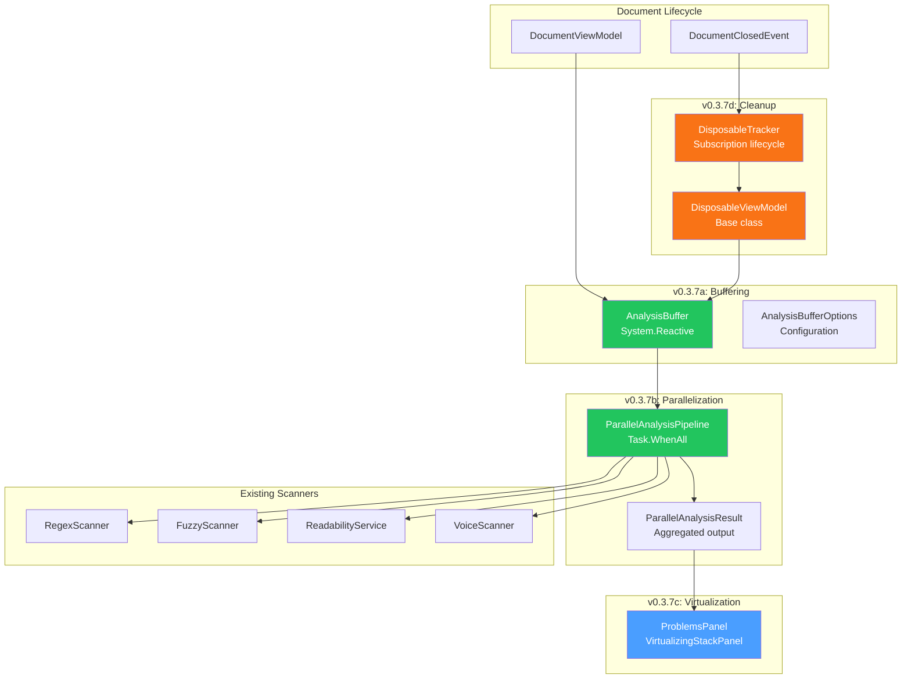
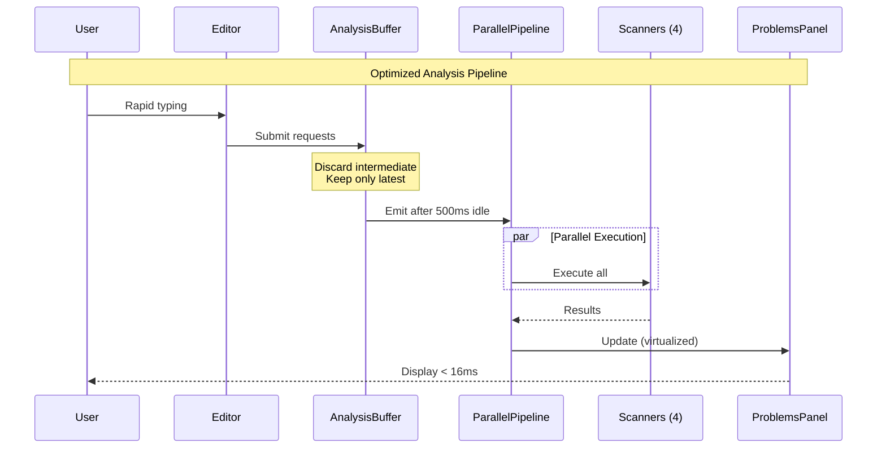

# LCS-DES-037: Design Specification Index — The Performance Tuning

## Document Control

| Field | Value |
| :--- | :--- |
| **Document ID** | LCS-DES-037-INDEX |
| **Feature ID** | STY-037 |
| **Feature Name** | The Performance Tuning (Async Pipelines) |
| **Target Version** | v0.3.7 |
| **Module Scope** | Lexichord.Modules.Style |
| **Swimlane** | Governance |
| **License Tier** | Core |
| **Feature Gate Key** | N/A (Core infrastructure) |
| **Status** | Draft |
| **Last Updated** | 2026-01-26 |

---

## 1. Executive Summary

**v0.3.7** delivers the **Performance Tuning** — ensuring 60FPS typing speed despite heavy multi-layered analysis. This release transforms Lexichord from a feature-complete writing analysis platform into a production-ready application that maintains responsive user experience under all workloads.

### 1.1 The Problem

As Lexichord's analysis capabilities have grown (v0.3.1-6: fuzzy matching, dictionary management, readability scoring, voice profiling, resonance visualization, global configuration), the cumulative overhead threatens typing responsiveness. Without optimization:

- Analysis runs on every keystroke, wasting CPU cycles
- Scanners execute sequentially, extending total analysis time
- Problems Panel renders all items, causing UI freeze with 5,000+ violations
- Subscriptions accumulate, causing memory leaks over long editing sessions

### 1.2 The Solution

Implement a four-part performance optimization strategy:

1. **Background Buffering (v0.3.7a)**: Debounce analysis requests, processing only the latest snapshot after 500ms idle
2. **Parallelization (v0.3.7b)**: Execute all scanners concurrently via `Task.WhenAll()`
3. **Virtualization (v0.3.7c)**: Render only visible Problems Panel items using `VirtualizingStackPanel`
4. **Memory Leak Prevention (v0.3.7d)**: Proper subscription cleanup on document close

### 1.3 Business Value

| Value | Description |
| :--- | :--- |
| **User Experience** | Fluid 60FPS typing with no perceptible lag |
| **Scalability** | Support for documents up to 100,000 words |
| **Resource Efficiency** | Intelligent scheduling prevents wasted CPU cycles |
| **Stability** | No memory leaks during long editing sessions |
| **Professional Quality** | Performance matching commercial writing applications |

---

## 2. Related Documents

### 2.1 Scope Breakdown Document

The detailed scope breakdown for v0.3.7, including all sub-parts, implementation checklists, user stories, and acceptance criteria:

| Document | Description |
| :--- | :--- |
| **[LCS-SBD-037](./LCS-SBD-037.md)** | Scope Breakdown — The Performance Tuning |

### 2.2 Sub-Part Design Specifications

Each sub-part has its own detailed design specification following the LDS-01 template:

| Sub-Part | Document | Title | Description |
| :--- | :--- | :--- | :--- |
| v0.3.7a | **[LCS-DES-037a](./LCS-DES-037a.md)** | Background Buffering | Debouncing and request management |
| v0.3.7b | **[LCS-DES-037b](./LCS-DES-037b.md)** | Parallelization | Task.WhenAll scanner execution |
| v0.3.7c | **[LCS-DES-037c](./LCS-DES-037c.md)** | Virtualization | VirtualizingStackPanel for Problems Panel |
| v0.3.7d | **[LCS-DES-037d](./LCS-DES-037d.md)** | Memory Leak Prevention | Subscription cleanup and disposal patterns |

---

## 3. Architecture Overview

### 3.1 Component Diagram



### 3.2 Data Flow



---

## 4. Dependencies

### 4.1 Upstream Dependencies (Required)

| Interface | Source Version | Purpose |
| :--- | :--- | :--- |
| `ILintingOrchestrator` | v0.2.3a | Analysis pipeline integration |
| `LintingCompletedEvent` | v0.2.3b | Event to debounce |
| `IStyleScanner` | v0.2.3c | Regex scanner |
| `IFuzzyScanner` | v0.3.1c | Fuzzy matching |
| `IReadabilityService` | v0.3.3c | Readability calculation |
| `IVoiceScanner` | v0.3.4b | Voice analysis |
| `IProblemsPanelViewModel` | v0.2.6a | Problems panel data |
| `DocumentViewModel` | v0.1.1d | Document lifecycle |
| `DocumentClosedEvent` | v0.1.4c | Cleanup trigger |

### 4.2 NuGet Packages

| Package | Version | Purpose |
| :--- | :--- | :--- |
| `System.Reactive` | 6.x | Observable debouncing |
| `MediatR` | 12.x | Event publishing |
| `CommunityToolkit.Mvvm` | 8.x | MVVM source generators |

### 4.3 Downstream Consumers (Future)

| Version | Feature | Consumes |
| :--- | :--- | :--- |
| v0.3.8 | Hardening | Performance baseline for benchmarks |
| v0.4.x | Agent Integration | Established patterns for new analyzers |

---

## 5. License Gating Strategy

The Performance Tuning is a **Core** infrastructure feature. No license gating is required.

### 5.1 Behavior by License Tier

| Tier | Buffering | Parallelization | Virtualization | Disposal |
| :--- | :--- | :--- | :--- | :--- |
| Core | Full | Full | Full | Full |
| Writer Pro | Full | Full | Full | Full |
| Teams | Full | Full | Full | Full |
| Enterprise | Full | Full | Full | Full |

---

## 6. Performance Targets

### 6.1 Typing Latency

| Document Size | Target | Measurement |
| :--- | :--- | :--- |
| 10,000 words | < 16ms | Frame timing |
| 50,000 words | < 16ms | Frame timing |
| 100,000 words | < 20ms | Frame timing |

### 6.2 Analysis Time

| Metric | Sequential | Parallel | Improvement |
| :--- | :--- | :--- | :--- |
| 10,000 word analysis | ~400ms | ~150ms | 62% faster |
| Scanner overhead | 100% | ~35% | 65% reduction |

### 6.3 Memory

| Metric | Target | Measurement |
| :--- | :--- | :--- |
| Growth per open/close cycle | < 50KB | GC.GetTotalMemory |
| Growth after 100 cycles | < 5MB | Memory profiler |
| Subscriptions after doc close | 0 | DisposableTracker.Count |

---

## 7. Key Interfaces Summary

| Interface | Defined In | Purpose |
| :--- | :--- | :--- |
| `IAnalysisBuffer` | v0.3.7a | Request debouncing and buffering |
| `IParallelAnalysisPipeline` | v0.3.7b | Parallel scanner execution |
| `IDisposableTracker` | v0.3.7d | Subscription lifecycle management |

| Record/DTO | Defined In | Purpose |
| :--- | :--- | :--- |
| `AnalysisRequest` | v0.3.7a | Document snapshot for analysis |
| `AnalysisBufferOptions` | v0.3.7a | Buffer configuration |
| `ParallelAnalysisResult` | v0.3.7b | Aggregated scanner results |

| Base Class | Defined In | Purpose |
| :--- | :--- | :--- |
| `DisposableViewModel` | v0.3.7d | ViewModel with automatic disposal |

---

## 8. Implementation Checklist Summary

| Sub-Part | Tasks | Est. Hours |
| :--- | :--- | :--- |
| v0.3.7a | Background Buffering | 9 |
| v0.3.7b | Parallelization | 8.5 |
| v0.3.7c | Virtualization | 7.5 |
| v0.3.7d | Memory Leak Prevention | 10 |
| Integration | DI, Events, Tests | 4 |
| **Total** | | **39 hours** |

See [LCS-SBD-037](./LCS-SBD-037.md) Section 4 for the detailed task breakdown.

---

## 9. Success Criteria Summary

| Category | Criterion | Target |
| :--- | :--- | :--- |
| **Buffering** | Discard rate during typing | > 90% |
| **Parallelization** | Speedup vs sequential | > 2x |
| **Virtualization** | Render time (5,000 items) | < 16ms |
| **Virtualization** | Container count | ~25 (fixed) |
| **Memory** | Subscriptions after close | 0 |
| **Memory** | VM garbage collection | 100% |
| **Typing** | Latency during analysis | < 16ms |

See [LCS-SBD-037](./LCS-SBD-037.md) Section 9 for full success metrics.

---

## 10. Test Coverage Summary

| Sub-Part | Unit Tests | Performance Tests | Memory Tests |
| :--- | :--- | :--- | :--- |
| v0.3.7a | Debounce, cancellation, max pending | - | - |
| v0.3.7b | Parallel execution, partial results | Scanner timing | - |
| v0.3.7c | Virtualization behavior | Render timing, scroll FPS | - |
| v0.3.7d | Disposal, tracking | - | Leak detection, GC verification |

See individual design specs for detailed test scenarios.

---

## 11. What This Enables

| Version | Feature | Uses From v0.3.7 |
| :--- | :--- | :--- |
| v0.3.8 | Hardening | Performance baseline for benchmark tests |
| v0.4.x | Agent Integration | Patterns for new analyzers without regression |
| Production | Release | Professional quality standards |

---

## 12. Buffering Algorithm

### 12.1 Request Flow

```text
Input: Keystroke events
Output: Debounced analysis requests

ON keystroke:
├── Create AnalysisRequest(content, version++)
├── Submit to buffer
│   ├── Cancel previous request if pending
│   └── Start 500ms timer
│
├── Another keystroke within 500ms?
│   ├── YES → Discard, restart timer
│   └── NO → Emit request
│
└── MaxPending (2000ms) exceeded?
    └── YES → Force emit (prevent starvation)
```

### 12.2 System.Reactive Pattern

```csharp
_requests = _inputSubject
    .Throttle(TimeSpan.FromMilliseconds(500))
    .Timeout(TimeSpan.FromMilliseconds(2000))
    .DistinctUntilChanged(r => r.Version)
    .Publish()
    .RefCount();
```

---

## 13. Parallelization Pattern

### 13.1 Scanner Execution

```csharp
// All scanners start simultaneously
var regexTask = _regexScanner.ScanAsync(text, ct);
var fuzzyTask = _fuzzyScanner.ScanAsync(text, ct);
var readTask = _readabilityService.AnalyzeAsync(text, ct);
var voiceTask = _voiceScanner.AnalyzeAsync(text, ct);

// Wait for all to complete
await Task.WhenAll(regexTask, fuzzyTask, readTask, voiceTask);

// Aggregate results
return new ParallelAnalysisResult
{
    StyleViolations = Concat(regex, fuzzy),
    Readability = read,
    VoiceAnalysis = voice
};
```

### 13.2 Error Handling

Scanner failures don't crash the pipeline. Failed scanners contribute empty results and are logged.

---

## 14. Virtualization Strategy

### 14.1 Container Recycling

```text
Total Items: 5,000
Viewport Capacity: 20 items
Buffer: 5 items above/below

Containers Created: 30 (constant)
Memory: O(viewport) not O(items)
```

### 14.2 XAML Configuration

```xml
<ListBox VirtualizationMode="Simple">
    <ListBox.ItemsPanel>
        <ItemsPanelTemplate>
            <VirtualizingStackPanel VirtualizationMode="Simple" />
        </ItemsPanelTemplate>
    </ListBox.ItemsPanel>
</ListBox>
```

---

## 15. Disposal Pattern

### 15.1 DisposableViewModel

```csharp
public abstract class DisposableViewModel : ViewModelBase, IDisposable
{
    private readonly DisposableTracker _tracker = new();

    protected void Track(IDisposable subscription)
        => _tracker.Track(subscription);

    public void Dispose()
    {
        _tracker.DisposeAll();
        OnDisposed();
    }
}
```

### 15.2 Subscription Cleanup

```csharp
public class DocumentAnalysisViewModel : DisposableViewModel
{
    public DocumentAnalysisViewModel(IMediator mediator)
    {
        Track(mediator
            .CreateStream<DocumentClosedEvent>()
            .Where(e => e.DocumentId == DocumentId)
            .Subscribe(_ => Dispose()));
    }
}
```

---

## Document History

| Version | Date | Author | Changes |
| :--- | :--- | :--- | :--- |
| 1.0 | 2026-01-26 | Lead Architect | Initial draft |
