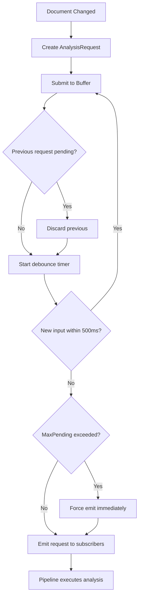

# LCS-DES-037a: Design Specification — Background Buffering

## 1. Metadata & Categorization

| Field | Value | Description |
| :--- | :--- | :--- |
| **Feature ID** | `STY-037a` | Sub-part of STY-037 |
| **Feature Name** | `Analysis Pipeline Debouncing and Buffering` | Request management |
| **Target Version** | `v0.3.7a` | First sub-part of v0.3.7 |
| **Module Scope** | `Lexichord.Modules.Style` | Style governance module |
| **Swimlane** | `Governance` | Part of Style vertical |
| **License Tier** | `Core` | Available to all users |
| **Feature Gate Key** | N/A | Core infrastructure |
| **Author** | Lead Architect | |
| **Status** | `Draft` | |
| **Last Updated** | `2026-01-26` | |
| **Parent Document** | [LCS-DES-037-INDEX](./LCS-DES-037-INDEX.md) | |
| **Scope Breakdown** | [LCS-SBD-037 §3.1](./LCS-SBD-037.md#31-v037a-background-buffering) | |

---

## 2. Executive Summary

### 2.1 The Requirement

During rapid typing, the analysis pipeline receives a change event for every keystroke. Processing each event wastes CPU cycles because:

- Analysis results become obsolete before rendering
- Intermediate states don't provide value to the user
- Heavy analysis blocks the UI thread

> **Problem:** Typing 60 WPM generates ~5 keystrokes/second. Running full analysis 5 times per second is wasteful.

### 2.2 The Proposed Solution

Implement an `IAnalysisBuffer` that:

1. Accepts analysis requests on every document change
2. Discards intermediate requests during rapid typing
3. Emits only the latest request after 500ms of idle time
4. Forces emission after 2000ms to prevent analysis starvation
5. Supports cancellation for document close scenarios

---

## 3. Architecture & Modular Strategy

### 3.1 Dependencies

#### 3.1.1 Upstream Dependencies

| Interface | Source Version | Purpose |
| :--- | :--- | :--- |
| `ILintingOrchestrator` | v0.2.3a | Integration point |
| `IConfigurationService` | v0.0.3d | Debounce settings |

#### 3.1.2 NuGet Packages

| Package | Version | Purpose |
| :--- | :--- | :--- |
| `System.Reactive` | 6.x | Observable throttling |

### 3.2 Licensing Behavior

No license gating. This is core infrastructure benefiting all users.

---

## 4. Data Contract (The API)

### 4.1 IAnalysisBuffer Interface

```csharp
namespace Lexichord.Abstractions.Contracts;

/// <summary>
/// Buffers analysis requests to prevent redundant processing during rapid typing.
/// Uses System.Reactive to throttle requests and emit only the latest document
/// snapshot after a configurable idle period.
/// </summary>
/// <remarks>
/// <para>The buffer SHALL discard intermediate requests during rapid typing.</para>
/// <para>The buffer SHALL emit the latest request after <see cref="AnalysisBufferOptions.DebounceMs"/>
/// milliseconds of idle time.</para>
/// <para>The buffer SHALL force emit after <see cref="AnalysisBufferOptions.MaxPendingMs"/>
/// to prevent starvation during continuous typing.</para>
/// </remarks>
/// <example>
/// <code>
/// var buffer = new AnalysisBuffer(new AnalysisBufferOptions(DebounceMs: 500));
/// buffer.Requests.Subscribe(async request =>
/// {
///     await _pipeline.ExecuteAsync(request);
/// });
///
/// // Submit on every keystroke
/// buffer.Submit(new AnalysisRequest(docId, content, version, timestamp));
/// </code>
/// </example>
public interface IAnalysisBuffer : IDisposable
{
    /// <summary>
    /// Submits a document snapshot for analysis.
    /// </summary>
    /// <param name="request">The analysis request containing the document snapshot.</param>
    /// <remarks>
    /// If a previous request is pending, it will be discarded and replaced with
    /// this new request. The debounce timer restarts on each submission.
    /// </remarks>
    void Submit(AnalysisRequest request);

    /// <summary>
    /// Observable stream of analysis requests that have passed the debounce period.
    /// </summary>
    /// <remarks>
    /// Subscribers receive only the latest request after the idle period elapses.
    /// Multiple rapid submissions result in only one emission.
    /// </remarks>
    IObservable<AnalysisRequest> Requests { get; }

    /// <summary>
    /// Cancels any pending analysis request without emitting.
    /// </summary>
    /// <remarks>
    /// Call this when the document is closed or analysis is no longer needed.
    /// </remarks>
    void Cancel();

    /// <summary>
    /// Gets the current pending request, if any.
    /// </summary>
    AnalysisRequest? CurrentPending { get; }

    /// <summary>
    /// Gets whether there is a pending request waiting for debounce.
    /// </summary>
    bool HasPending { get; }
}
```

### 4.2 AnalysisRequest Record

```csharp
namespace Lexichord.Abstractions.Contracts;

/// <summary>
/// Encapsulates a document snapshot for analysis.
/// Immutable record capturing document state at a point in time.
/// </summary>
/// <param name="DocumentId">Unique identifier for the document.</param>
/// <param name="Content">The document text content at snapshot time.</param>
/// <param name="Version">
/// Incremental version number for change tracking.
/// Used to discard stale requests.
/// </param>
/// <param name="Timestamp">When the snapshot was created.</param>
/// <example>
/// <code>
/// var request = new AnalysisRequest(
///     DocumentId: Guid.NewGuid(),
///     Content: "The quick brown fox...",
///     Version: 42,
///     Timestamp: DateTimeOffset.Now);
/// </code>
/// </example>
public record AnalysisRequest(
    Guid DocumentId,
    string Content,
    int Version,
    DateTimeOffset Timestamp)
{
    /// <summary>
    /// Gets the length of the document content in characters.
    /// </summary>
    public int ContentLength => Content?.Length ?? 0;

    /// <summary>
    /// Creates an empty request for testing or initialization.
    /// </summary>
    public static AnalysisRequest Empty => new(
        Guid.Empty, string.Empty, 0, DateTimeOffset.MinValue);
}
```

### 4.3 AnalysisBufferOptions Record

```csharp
namespace Lexichord.Abstractions.Contracts;

/// <summary>
/// Configuration options for the analysis buffer.
/// </summary>
/// <param name="DebounceMs">
/// Idle time in milliseconds before processing a request.
/// Default: 500ms. Range: 100-2000ms.
/// </param>
/// <param name="MaxPendingMs">
/// Maximum time in milliseconds a request can be pending.
/// Forces emission to prevent analysis starvation.
/// Default: 2000ms. Range: 500-5000ms.
/// </param>
/// <example>
/// <code>
/// // Fast response for experienced users
/// var fastOptions = new AnalysisBufferOptions(DebounceMs: 300, MaxPendingMs: 1000);
///
/// // Relaxed for slower typists
/// var slowOptions = new AnalysisBufferOptions(DebounceMs: 800, MaxPendingMs: 3000);
/// </code>
/// </example>
public record AnalysisBufferOptions(
    int DebounceMs = 500,
    int MaxPendingMs = 2000)
{
    /// <summary>
    /// Validates that options are within acceptable ranges.
    /// </summary>
    public bool IsValid =>
        DebounceMs >= 100 && DebounceMs <= 2000 &&
        MaxPendingMs >= 500 && MaxPendingMs <= 5000 &&
        MaxPendingMs > DebounceMs;

    /// <summary>
    /// Default options suitable for most users.
    /// </summary>
    public static AnalysisBufferOptions Default => new();
}
```

---

## 5. Implementation Logic

### 5.1 Buffer Flow Diagram



### 5.2 Debounce Decision Tree

```text
START: "Should this request be processed?"
│
├── Is buffer disposed?
│   └── YES → Ignore request
│
├── Is buffer cancelled?
│   └── YES → Ignore request
│
├── Is this the first request after idle?
│   └── YES → Start debounce timer (500ms)
│
├── Has a newer request arrived?
│   └── YES → Replace current, restart timer
│
├── Has debounce period elapsed?
│   ├── YES → EMIT request
│   └── NO → Continue waiting
│
├── Has MaxPending period elapsed?
│   └── YES → EMIT request (prevent starvation)
│
└── WAIT for timer or new request
```

### 5.3 System.Reactive Implementation

```csharp
// Core reactive pipeline
_requests = _inputSubject
    // Discard rapid inputs, keep only latest after 500ms idle
    .Throttle(TimeSpan.FromMilliseconds(_options.DebounceMs))
    // But force emit after 2000ms to prevent starvation
    .Timeout(
        TimeSpan.FromMilliseconds(_options.MaxPendingMs),
        Observable.Empty<AnalysisRequest>())
    // Don't emit the same version twice
    .DistinctUntilChanged(r => r.Version)
    // Hot observable - multiple subscribers share the stream
    .Publish()
    .RefCount();
```

### 5.4 Cancellation Handling

```text
ON Cancel():
│
├── Clear current pending request
│
├── Complete any waiting timers
│
├── Do NOT emit pending request
│
└── Ready for new requests if not disposed
```

---

## 6. UI/UX Specifications

### 6.1 Settings Panel

```text
┌──────────────────────────────────────────────────────────────────────────┐
│  Analysis Settings                                                       │
├──────────────────────────────────────────────────────────────────────────┤
│                                                                          │
│  Analysis Delay                                                          │
│  How long to wait after you stop typing before analyzing.                │
│                                                                          │
│  ┌────────────────────────────────────────────────────────────────────┐  │
│  │ ○──────────────────────●──────────────────────────────────────────○ │  │
│  │ 100ms              500ms                                    2000ms  │  │
│  └────────────────────────────────────────────────────────────────────┘  │
│                                                                          │
│  Current: 500ms (Recommended)                                            │
│                                                                          │
│  ℹ Lower values = faster feedback but higher CPU usage                   │
│  ℹ Higher values = better for slower computers                           │
│                                                                          │
└──────────────────────────────────────────────────────────────────────────┘
```

### 6.2 Status Indicator

The status bar may show a subtle indicator during buffering:

```text
┌──────────────────────────────────────────────────────────────────────────┐
│  ... [Analyzing ●]                                                       │ ← During analysis
└──────────────────────────────────────────────────────────────────────────┘
│  ... [Ready ○]                                                           │ ← Idle
└──────────────────────────────────────────────────────────────────────────┘
```

---

## 7. Observability & Logging

| Level | Message Template |
| :--- | :--- |
| Debug | `"Request v{Version} submitted, debounce timer started"` |
| Debug | `"Request v{Version} discarded (superseded by v{NewVersion})"` |
| Info | `"Request v{Version} emitted after {IdleMs}ms idle"` |
| Info | `"Request v{Version} force-emitted after {MaxPendingMs}ms"` |
| Debug | `"Buffer cancelled, pending request discarded"` |
| Debug | `"Buffer disposed"` |

---

## 8. Security & Safety

| Risk | Level | Mitigation |
| :--- | :--- | :--- |
| Memory pressure from large documents | Low | Content is not copied, only referenced |
| Timer resource leak | Low | CancellationToken and Dispose cleanup |
| Race conditions | Low | Thread-safe Subject usage |

---

## 9. Acceptance Criteria

### 9.1 Functional Criteria

| # | Given | When | Then |
| :--- | :--- | :--- | :--- |
| 1 | Buffer with 500ms debounce | 10 requests submitted rapidly (10ms apart) | Only 1 request emitted |
| 2 | Buffer with 500ms debounce | Request submitted, then 600ms idle | Request emitted |
| 3 | Buffer with 500ms debounce | Request submitted, Cancel() called | No request emitted |
| 4 | Buffer with 2000ms max pending | Continuous rapid requests for 2500ms | At least 1 request emitted |
| 5 | Disposed buffer | Request submitted | No exception, no emission |
| 6 | Request with same version | Submitted twice | Only first one processed |

### 9.2 Performance Criteria

| # | Given | When | Then |
| :--- | :--- | :--- | :--- |
| 7 | Buffer active | 1000 requests/second submitted | CPU usage < 5% for buffer |
| 8 | Buffer active | Large document (100KB) submitted | Memory increase < 1MB |

---

## 10. Test Scenarios

### 10.1 Unit Tests

```csharp
[Trait("Category", "Unit")]
[Trait("Version", "v0.3.7a")]
public class AnalysisBufferTests
{
    [Fact]
    public async Task Submit_RapidRequests_EmitsOnlyLatest()
    {
        // Arrange
        var options = new AnalysisBufferOptions(DebounceMs: 100);
        var buffer = new AnalysisBuffer(options, NullLogger<AnalysisBuffer>.Instance);
        var received = new List<AnalysisRequest>();
        buffer.Requests.Subscribe(r => received.Add(r));

        // Act
        for (int i = 1; i <= 10; i++)
        {
            buffer.Submit(new AnalysisRequest(
                Guid.NewGuid(), $"Content {i}", i, DateTimeOffset.Now));
            await Task.Delay(10);
        }
        await Task.Delay(150);

        // Assert
        received.Should().HaveCount(1);
        received[0].Version.Should().Be(10);
    }

    [Fact]
    public async Task Submit_WithGaps_EmitsMultiple()
    {
        // Arrange
        var options = new AnalysisBufferOptions(DebounceMs: 50);
        var buffer = new AnalysisBuffer(options, NullLogger<AnalysisBuffer>.Instance);
        var received = new List<AnalysisRequest>();
        buffer.Requests.Subscribe(r => received.Add(r));

        // Act
        buffer.Submit(new AnalysisRequest(Guid.NewGuid(), "A", 1, DateTimeOffset.Now));
        await Task.Delay(100);
        buffer.Submit(new AnalysisRequest(Guid.NewGuid(), "B", 2, DateTimeOffset.Now));
        await Task.Delay(100);

        // Assert
        received.Should().HaveCount(2);
    }

    [Fact]
    public async Task Submit_ExceedsMaxPending_ForcesEmit()
    {
        // Arrange
        var options = new AnalysisBufferOptions(DebounceMs: 500, MaxPendingMs: 100);
        var buffer = new AnalysisBuffer(options, NullLogger<AnalysisBuffer>.Instance);
        var received = new List<AnalysisRequest>();
        buffer.Requests.Subscribe(r => received.Add(r));

        // Act
        buffer.Submit(new AnalysisRequest(Guid.NewGuid(), "A", 1, DateTimeOffset.Now));
        await Task.Delay(150);

        // Assert
        received.Should().HaveCount(1);
    }

    [Fact]
    public void Cancel_WithPending_DoesNotEmit()
    {
        // Arrange
        var buffer = new AnalysisBuffer(
            new AnalysisBufferOptions(DebounceMs: 1000),
            NullLogger<AnalysisBuffer>.Instance);
        var received = new List<AnalysisRequest>();
        buffer.Requests.Subscribe(r => received.Add(r));

        // Act
        buffer.Submit(new AnalysisRequest(Guid.NewGuid(), "A", 1, DateTimeOffset.Now));
        buffer.Cancel();

        // Assert
        buffer.HasPending.Should().BeFalse();
        received.Should().BeEmpty();
    }

    [Fact]
    public void Dispose_CleansUpResources()
    {
        // Arrange
        var buffer = new AnalysisBuffer(
            AnalysisBufferOptions.Default,
            NullLogger<AnalysisBuffer>.Instance);

        // Act
        buffer.Dispose();
        buffer.Submit(new AnalysisRequest(Guid.NewGuid(), "A", 1, DateTimeOffset.Now));

        // Assert - No exception thrown, request ignored
        buffer.HasPending.Should().BeFalse();
    }

    [Fact]
    public void CurrentPending_AfterSubmit_ReturnsRequest()
    {
        // Arrange
        var buffer = new AnalysisBuffer(
            new AnalysisBufferOptions(DebounceMs: 10000),
            NullLogger<AnalysisBuffer>.Instance);
        var request = new AnalysisRequest(Guid.NewGuid(), "Test", 1, DateTimeOffset.Now);

        // Act
        buffer.Submit(request);

        // Assert
        buffer.HasPending.Should().BeTrue();
        buffer.CurrentPending.Should().Be(request);
    }
}
```

---

## 11. Code Example

### 11.1 AnalysisBuffer Implementation

```csharp
namespace Lexichord.Modules.Style.Services;

using System.Reactive.Linq;
using System.Reactive.Subjects;

/// <summary>
/// Buffers analysis requests using System.Reactive to prevent redundant
/// processing during rapid typing.
/// </summary>
public sealed class AnalysisBuffer : IAnalysisBuffer
{
    private readonly Subject<AnalysisRequest> _inputSubject = new();
    private readonly IObservable<AnalysisRequest> _requests;
    private readonly AnalysisBufferOptions _options;
    private readonly ILogger<AnalysisBuffer> _logger;

    private AnalysisRequest? _currentPending;
    private CancellationTokenSource? _currentCts;
    private bool _disposed;
    private bool _cancelled;

    public AnalysisBuffer(
        AnalysisBufferOptions options,
        ILogger<AnalysisBuffer> logger)
    {
        _options = options ?? throw new ArgumentNullException(nameof(options));
        _logger = logger ?? throw new ArgumentNullException(nameof(logger));

        if (!options.IsValid)
        {
            throw new ArgumentException("Invalid buffer options", nameof(options));
        }

        _requests = _inputSubject
            .Do(r =>
            {
                _currentPending = r;
                _logger.LogDebug(
                    "Request v{Version} submitted, debounce timer started",
                    r.Version);
            })
            .Throttle(TimeSpan.FromMilliseconds(_options.DebounceMs))
            .Do(r => _logger.LogInformation(
                "Request v{Version} emitted after {IdleMs}ms idle",
                r.Version, _options.DebounceMs))
            .Do(_ => _currentPending = null)
            .DistinctUntilChanged(r => r.Version)
            .TakeWhile(_ => !_cancelled && !_disposed)
            .Publish()
            .RefCount();
    }

    public IObservable<AnalysisRequest> Requests => _requests;

    public AnalysisRequest? CurrentPending => _currentPending;

    public bool HasPending => _currentPending != null;

    public void Submit(AnalysisRequest request)
    {
        if (_disposed || _cancelled)
        {
            return;
        }

        // Cancel any previous in-flight analysis
        var previousVersion = _currentPending?.Version;
        if (previousVersion.HasValue && previousVersion != request.Version)
        {
            _logger.LogDebug(
                "Request v{Version} discarded (superseded by v{NewVersion})",
                previousVersion, request.Version);
        }

        _currentCts?.Cancel();
        _currentCts = new CancellationTokenSource();

        _inputSubject.OnNext(request);
    }

    public void Cancel()
    {
        _cancelled = true;
        _currentCts?.Cancel();
        _currentPending = null;
        _logger.LogDebug("Buffer cancelled, pending request discarded");
    }

    public void Dispose()
    {
        if (_disposed) return;
        _disposed = true;

        _currentCts?.Cancel();
        _currentCts?.Dispose();
        _currentCts = null;
        _currentPending = null;

        _inputSubject.OnCompleted();
        _inputSubject.Dispose();

        _logger.LogDebug("Buffer disposed");
    }
}
```

### 11.2 Integration with LintingOrchestrator

```csharp
public class LintingOrchestrator : ILintingOrchestrator
{
    private readonly IAnalysisBuffer _buffer;
    private readonly IParallelAnalysisPipeline _pipeline;
    private readonly IDisposable _subscription;

    public LintingOrchestrator(
        IAnalysisBuffer buffer,
        IParallelAnalysisPipeline pipeline)
    {
        _buffer = buffer;
        _pipeline = pipeline;

        // Subscribe to buffered requests
        _subscription = _buffer.Requests
            .SelectMany(async request =>
            {
                var result = await _pipeline.ExecuteAsync(request);
                return (request, result);
            })
            .Subscribe(
                tuple => OnAnalysisCompleted(tuple.request, tuple.result),
                ex => _logger.LogError(ex, "Analysis pipeline error"));
    }

    public void OnDocumentChanged(Guid documentId, string content, int version)
    {
        var request = new AnalysisRequest(
            documentId,
            content,
            version,
            DateTimeOffset.Now);

        _buffer.Submit(request);
    }
}
```

---

## 12. DI Registration

```csharp
// In StyleModule.cs
services.AddSingleton<AnalysisBufferOptions>(sp =>
{
    var config = sp.GetRequiredService<IConfigurationService>();
    return new AnalysisBufferOptions(
        DebounceMs: config.GetValue("Analysis:DebounceMs", 500),
        MaxPendingMs: config.GetValue("Analysis:MaxPendingMs", 2000));
});

services.AddScoped<IAnalysisBuffer, AnalysisBuffer>();
```

---

## 13. Configuration Schema

```yaml
# appsettings.yaml
Analysis:
  DebounceMs: 500      # 100-2000, default 500
  MaxPendingMs: 2000   # 500-5000, default 2000
```

---

## Document History

| Version | Date | Author | Changes |
| :--- | :--- | :--- | :--- |
| 1.0 | 2026-01-26 | Lead Architect | Initial draft |
