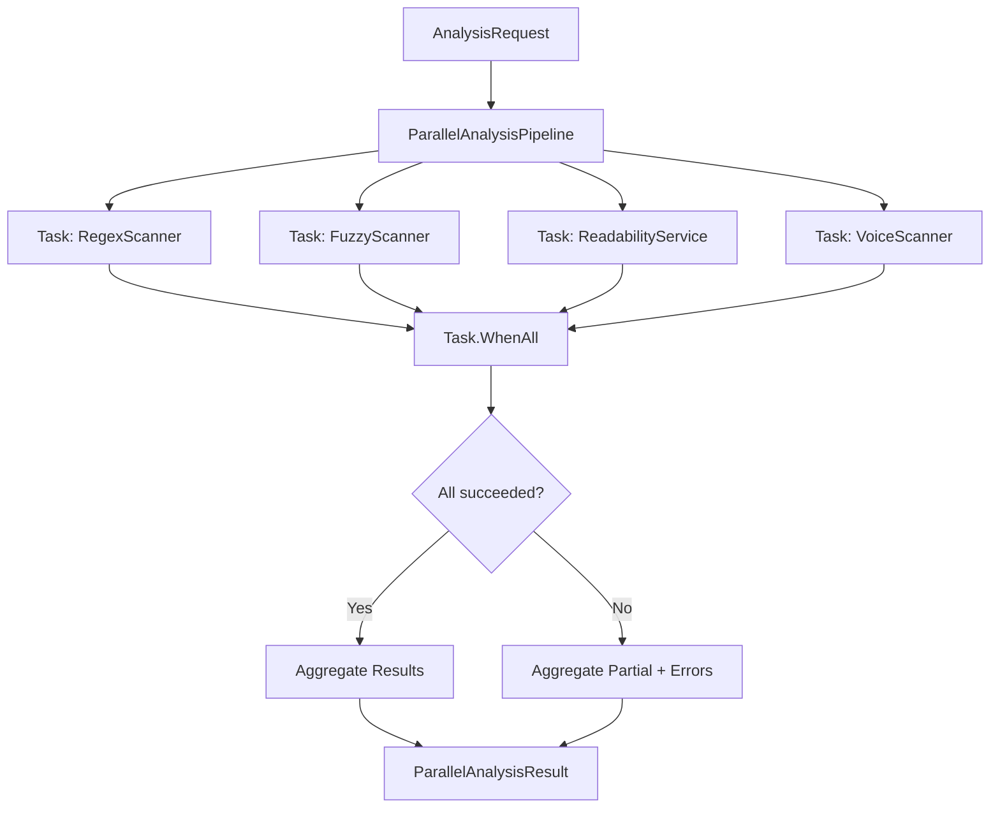

# LCS-DES-037b: Design Specification — Parallelization

## 1. Metadata & Categorization

| Field | Value | Description |
| :--- | :--- | :--- |
| **Feature ID** | `STY-037b` | Sub-part of STY-037 |
| **Feature Name** | `Parallel Scanner Execution` | Concurrent analysis |
| **Target Version** | `v0.3.7b` | Second sub-part of v0.3.7 |
| **Module Scope** | `Lexichord.Modules.Style` | Style governance module |
| **Swimlane** | `Governance` | Part of Style vertical |
| **License Tier** | `Core` | Available to all users |
| **Feature Gate Key** | N/A | Core infrastructure |
| **Author** | Lead Architect | |
| **Status** | `Draft` | |
| **Last Updated** | `2026-01-26` | |
| **Parent Document** | [LCS-DES-037-INDEX](./LCS-DES-037-INDEX.md) | |
| **Scope Breakdown** | [LCS-SBD-037 §3.2](./LCS-SBD-037.md#32-v037b-parallelization) | |

---

## 2. Executive Summary

### 2.1 The Requirement

Lexichord runs multiple analysis scanners on each document:
- RegexScanner (style violations)
- FuzzyScanner (fuzzy matching)
- ReadabilityService (readability metrics)
- VoiceScanner (passive voice, adverbs)

When executed sequentially, total analysis time is the **sum** of all scanner times. For a 10,000-word document:

| Scanner | Time |
| :--- | :--- |
| RegexScanner | 100ms |
| FuzzyScanner | 150ms |
| ReadabilityService | 80ms |
| VoiceScanner | 70ms |
| **Sequential Total** | **400ms** |

> **Problem:** 400ms analysis time creates perceptible delay between typing and feedback.

### 2.2 The Proposed Solution

Execute all scanners in parallel using `Task.WhenAll()`:

| Scanner | Time |
| :--- | :--- |
| All (parallel) | ~150ms |
| **Improvement** | **62% faster** |

The `IParallelAnalysisPipeline` interface:
1. Accepts a single `AnalysisRequest`
2. Spawns all scanner tasks simultaneously
3. Aggregates results into `ParallelAnalysisResult`
4. Handles partial failures gracefully
5. Provides timing metrics for profiling

---

## 3. Architecture & Modular Strategy

### 3.1 Dependencies

#### 3.1.1 Upstream Dependencies

| Interface | Source Version | Purpose |
| :--- | :--- | :--- |
| `IStyleScanner` | v0.2.3c | Regex pattern matching |
| `IFuzzyScanner` | v0.3.1c | Fuzzy term matching |
| `IReadabilityService` | v0.3.3c | Readability metrics |
| `IVoiceScanner` | v0.3.4b | Voice analysis |
| `AnalysisRequest` | v0.3.7a | Document snapshot |

#### 3.1.2 NuGet Packages

None required beyond BCL `System.Threading.Tasks`.

### 3.2 Licensing Behavior

No license gating. All scanners execute based on their own license requirements; the pipeline itself is unlicensed.

---

## 4. Data Contract (The API)

### 4.1 IParallelAnalysisPipeline Interface

```csharp
namespace Lexichord.Abstractions.Contracts;

/// <summary>
/// Orchestrates parallel execution of multiple analysis scanners.
/// All registered scanners run concurrently using Task.WhenAll(),
/// reducing total analysis time to approximately the longest scanner.
/// </summary>
/// <remarks>
/// <para>The pipeline SHALL execute all scanners in parallel.</para>
/// <para>The pipeline SHALL aggregate results from all scanners.</para>
/// <para>The pipeline SHALL handle individual scanner failures gracefully,
/// returning partial results with error information.</para>
/// <para>The pipeline SHALL propagate cancellation to all scanners.</para>
/// </remarks>
/// <example>
/// <code>
/// var result = await _pipeline.ExecuteAsync(request, cancellationToken);
///
/// Console.WriteLine($"Total time: {result.TotalDuration.TotalMilliseconds}ms");
/// Console.WriteLine($"Regex: {result.ScannerDurations["Regex"].TotalMilliseconds}ms");
/// Console.WriteLine($"Violations: {result.StyleViolations.Count}");
/// </code>
/// </example>
public interface IParallelAnalysisPipeline
{
    /// <summary>
    /// Executes all registered scanners in parallel on the provided document.
    /// </summary>
    /// <param name="request">The analysis request containing document content.</param>
    /// <param name="ct">Cancellation token for aborting analysis.</param>
    /// <returns>Aggregated results from all scanners.</returns>
    /// <exception cref="OperationCanceledException">
    /// Thrown when cancellation is requested before completion.
    /// </exception>
    Task<ParallelAnalysisResult> ExecuteAsync(
        AnalysisRequest request,
        CancellationToken ct = default);

    /// <summary>
    /// Gets the names of all registered scanners.
    /// </summary>
    IReadOnlyList<string> ScannerNames { get; }
}
```

### 4.2 ParallelAnalysisResult Record

```csharp
namespace Lexichord.Abstractions.Contracts;

/// <summary>
/// Aggregated results from parallel scanner execution.
/// Contains results from all scanners plus timing and error information.
/// </summary>
public record ParallelAnalysisResult
{
    /// <summary>
    /// Style violations from regex and fuzzy scanning combined.
    /// </summary>
    public IReadOnlyList<StyleViolation> StyleViolations { get; init; } =
        Array.Empty<StyleViolation>();

    /// <summary>
    /// Readability metrics from ReadabilityService.
    /// Null if the scanner failed or was skipped.
    /// </summary>
    public ReadabilityMetrics? Readability { get; init; }

    /// <summary>
    /// Voice analysis results from VoiceScanner.
    /// Null if the scanner failed or was skipped.
    /// </summary>
    public VoiceAnalysisResult? VoiceAnalysis { get; init; }

    /// <summary>
    /// Total wall-clock time for the parallel pipeline execution.
    /// Should be approximately equal to the longest individual scanner.
    /// </summary>
    public TimeSpan TotalDuration { get; init; }

    /// <summary>
    /// Individual scanner execution times for profiling.
    /// Keys: "Regex", "Fuzzy", "Readability", "Voice"
    /// </summary>
    public IReadOnlyDictionary<string, TimeSpan> ScannerDurations { get; init; } =
        new Dictionary<string, TimeSpan>();

    /// <summary>
    /// Indicates if any scanner was cancelled or failed.
    /// When true, some results may be missing.
    /// </summary>
    public bool IsPartialResult { get; init; }

    /// <summary>
    /// Exceptions from failed scanners (if any).
    /// Empty if all scanners completed successfully.
    /// </summary>
    public IReadOnlyList<Exception> Errors { get; init; } =
        Array.Empty<Exception>();

    /// <summary>
    /// Total number of violations across all scanners.
    /// </summary>
    public int TotalViolationCount => StyleViolations.Count;

    /// <summary>
    /// Calculated speedup ratio compared to sequential execution.
    /// </summary>
    public double SpeedupRatio
    {
        get
        {
            if (ScannerDurations.Count == 0) return 1.0;
            var sequentialSum = ScannerDurations.Values.Sum(d => d.TotalMilliseconds);
            return sequentialSum / TotalDuration.TotalMilliseconds;
        }
    }

    /// <summary>
    /// Empty result for initialization or error cases.
    /// </summary>
    public static ParallelAnalysisResult Empty => new()
    {
        TotalDuration = TimeSpan.Zero,
        IsPartialResult = true
    };
}
```

---

## 5. Implementation Logic

### 5.1 Parallel Execution Flow



### 5.2 Timing Wrapper Pattern

```csharp
private async Task<T?> TimedExecuteAsync<T>(
    string scannerName,
    Func<Task<T>> operation,
    ConcurrentDictionary<string, TimeSpan> durations,
    ConcurrentBag<Exception> errors)
{
    var stopwatch = Stopwatch.StartNew();
    try
    {
        var result = await operation();
        stopwatch.Stop();
        durations[scannerName] = stopwatch.Elapsed;
        return result;
    }
    catch (OperationCanceledException)
    {
        throw; // Rethrow cancellation
    }
    catch (Exception ex)
    {
        stopwatch.Stop();
        durations[scannerName] = stopwatch.Elapsed;
        errors.Add(ex);
        _logger.LogWarning(ex, "Scanner {Scanner} failed", scannerName);
        return default;
    }
}
```

### 5.3 Error Isolation Pattern

```text
Scanner Failure Handling:
│
├── Scanner throws exception (not OperationCanceledException)
│   ├── Log warning with exception details
│   ├── Record duration up to failure point
│   ├── Add exception to errors collection
│   └── Continue with other scanners
│
├── Scanner is cancelled
│   └── Propagate OperationCanceledException to caller
│
└── All scanners complete or fail
    ├── Set IsPartialResult = true if any errors
    └── Return aggregated results with error list
```

### 5.4 Cancellation Propagation

```csharp
// All tasks receive the same CancellationToken
var regexTask = TimedExecuteAsync(
    "Regex",
    () => _regexScanner.ScanAsync(content, ct), // ct passed to scanner
    durations, errors);

// If cancelled, WhenAll throws OperationCanceledException
await Task.WhenAll(regexTask, fuzzyTask, readTask, voiceTask);
```

---

## 6. UI/UX Specifications

### 6.1 Performance Profiling Display (Developer Mode)

```text
┌──────────────────────────────────────────────────────────────────────────┐
│  Analysis Performance                                        [Close]     │
├──────────────────────────────────────────────────────────────────────────┤
│                                                                          │
│  Last Analysis                                                           │
│  ─────────────────────────────────────────────────────────────────────   │
│                                                                          │
│  Scanner          Duration        Status                                 │
│  ────────────────────────────────────────                                │
│  Regex            45ms            ✓ Complete                             │
│  Fuzzy            120ms           ✓ Complete                             │
│  Readability      35ms            ✓ Complete                             │
│  Voice            80ms            ✓ Complete                             │
│  ─────────────────────────────────────────────────────────────────────   │
│  Total (Parallel) 125ms                                                  │
│  Sequential would be: 280ms                                              │
│  Speedup: 2.24x                                                          │
│                                                                          │
│  [██████████████████████████████████████████████████] 100%               │
│  Regex    ████                                                           │
│  Fuzzy    ████████████████████████                                       │
│  Read     ███                                                            │
│  Voice    ████████████                                                   │
│                                                                          │
└──────────────────────────────────────────────────────────────────────────┘
```

---

## 7. Observability & Logging

| Level | Message Template |
| :--- | :--- |
| Debug | `"Starting parallel analysis: {ScannerCount} scanners"` |
| Debug | `"Scanner {ScannerName} starting"` |
| Debug | `"Scanner {ScannerName} completed in {DurationMs}ms"` |
| Warning | `"Scanner {ScannerName} failed: {ErrorMessage}"` |
| Info | `"Parallel analysis completed in {TotalMs}ms (Speedup: {SpeedupRatio:F2}x)"` |
| Info | `"Scanner times - Regex: {RegexMs}ms, Fuzzy: {FuzzyMs}ms, Read: {ReadMs}ms, Voice: {VoiceMs}ms"` |

---

## 8. Security & Safety

| Risk | Level | Mitigation |
| :--- | :--- | :--- |
| Resource exhaustion | Low | Limited to 4 concurrent tasks |
| Deadlock | Low | No shared mutable state between scanners |
| Memory pressure | Low | Scanners work on same immutable input |

---

## 9. Acceptance Criteria

### 9.1 Functional Criteria

| # | Given | When | Then |
| :--- | :--- | :--- | :--- |
| 1 | Pipeline with 4 scanners | ExecuteAsync called | All 4 scanners execute |
| 2 | Pipeline with 4 scanners | All complete successfully | IsPartialResult = false |
| 3 | One scanner throws | ExecuteAsync completes | IsPartialResult = true, 3 results returned |
| 4 | CancellationToken cancelled | During execution | OperationCanceledException thrown |
| 5 | All scanners return violations | ExecuteAsync completes | Violations aggregated |

### 9.2 Performance Criteria

| # | Given | When | Then |
| :--- | :--- | :--- | :--- |
| 6 | 4 scanners each taking 100ms | Executed in parallel | TotalDuration < 150ms |
| 7 | 10,000 word document | Analysis complete | TotalDuration < 200ms |
| 8 | Sequential vs parallel | Same document | SpeedupRatio > 2.0 |

---

## 10. Test Scenarios

### 10.1 Unit Tests

```csharp
[Trait("Category", "Unit")]
[Trait("Version", "v0.3.7b")]
public class ParallelAnalysisPipelineTests
{
    [Fact]
    public async Task ExecuteAsync_AllSucceed_ReturnsCompleteResult()
    {
        // Arrange
        var pipeline = CreatePipelineWithMocks(
            regexResult: new[] { CreateViolation("regex") },
            fuzzyResult: new[] { CreateViolation("fuzzy") },
            readabilityResult: new ReadabilityMetrics { FleschKincaidGradeLevel = 8 },
            voiceResult: new VoiceAnalysisResult());

        var request = CreateRequest("Test content");

        // Act
        var result = await pipeline.ExecuteAsync(request);

        // Assert
        result.IsPartialResult.Should().BeFalse();
        result.StyleViolations.Should().HaveCount(2);
        result.Readability.Should().NotBeNull();
        result.VoiceAnalysis.Should().NotBeNull();
        result.Errors.Should().BeEmpty();
    }

    [Fact]
    public async Task ExecuteAsync_OneFails_ReturnsPartialResult()
    {
        // Arrange
        var regexScanner = new Mock<IStyleScanner>();
        regexScanner
            .Setup(s => s.ScanAsync(It.IsAny<string>(), It.IsAny<CancellationToken>()))
            .ThrowsAsync(new InvalidOperationException("Test failure"));

        var pipeline = CreatePipelineWithMocks(
            regexScanner: regexScanner.Object,
            fuzzyResult: new[] { CreateViolation("fuzzy") },
            readabilityResult: new ReadabilityMetrics(),
            voiceResult: new VoiceAnalysisResult());

        // Act
        var result = await pipeline.ExecuteAsync(CreateRequest("Test"));

        // Assert
        result.IsPartialResult.Should().BeTrue();
        result.Errors.Should().HaveCount(1);
        result.StyleViolations.Should().HaveCount(1); // Fuzzy succeeded
    }

    [Fact]
    public async Task ExecuteAsync_Cancelled_ThrowsOperationCancelled()
    {
        // Arrange
        var pipeline = CreatePipelineWithDelays(100); // Each scanner takes 100ms
        var cts = new CancellationTokenSource();

        // Act
        var task = pipeline.ExecuteAsync(CreateRequest("Test"), cts.Token);
        await Task.Delay(20);
        cts.Cancel();

        // Assert
        await Assert.ThrowsAnyAsync<OperationCanceledException>(() => task);
    }

    [Fact]
    public async Task ExecuteAsync_RecordsDurations()
    {
        // Arrange
        var pipeline = CreatePipelineWithDelays(50);

        // Act
        var result = await pipeline.ExecuteAsync(CreateRequest("Test"));

        // Assert
        result.ScannerDurations.Should().ContainKey("Regex");
        result.ScannerDurations.Should().ContainKey("Fuzzy");
        result.ScannerDurations.Should().ContainKey("Readability");
        result.ScannerDurations.Should().ContainKey("Voice");

        foreach (var duration in result.ScannerDurations.Values)
        {
            duration.TotalMilliseconds.Should().BeGreaterThan(40);
        }
    }

    [Fact]
    public async Task ExecuteAsync_ParallelIsFaster_ThanSequential()
    {
        // Arrange
        var pipeline = CreatePipelineWithDelays(50); // Each takes 50ms

        // Act
        var result = await pipeline.ExecuteAsync(CreateRequest("Test"));

        // Assert
        var sequentialWouldBe = result.ScannerDurations.Values
            .Sum(d => d.TotalMilliseconds);
        var actualTotal = result.TotalDuration.TotalMilliseconds;

        actualTotal.Should().BeLessThan(sequentialWouldBe * 0.6);
        result.SpeedupRatio.Should().BeGreaterThan(1.5);
    }

    [Fact]
    public async Task ExecuteAsync_AggregatesViolationsFromMultipleScanners()
    {
        // Arrange
        var pipeline = CreatePipelineWithMocks(
            regexResult: new[]
            {
                CreateViolation("regex1"),
                CreateViolation("regex2")
            },
            fuzzyResult: new[]
            {
                CreateViolation("fuzzy1"),
                CreateViolation("fuzzy2"),
                CreateViolation("fuzzy3")
            },
            readabilityResult: new ReadabilityMetrics(),
            voiceResult: new VoiceAnalysisResult());

        // Act
        var result = await pipeline.ExecuteAsync(CreateRequest("Test"));

        // Assert
        result.StyleViolations.Should().HaveCount(5);
        result.TotalViolationCount.Should().Be(5);
    }
}
```

---

## 11. Code Example

### 11.1 ParallelAnalysisPipeline Implementation

```csharp
namespace Lexichord.Modules.Style.Services;

/// <summary>
/// Executes multiple analysis scanners in parallel using Task.WhenAll.
/// Aggregates results and handles partial failures gracefully.
/// </summary>
public sealed class ParallelAnalysisPipeline : IParallelAnalysisPipeline
{
    private readonly IStyleScanner _regexScanner;
    private readonly IFuzzyScanner _fuzzyScanner;
    private readonly IReadabilityService _readabilityService;
    private readonly IVoiceScanner _voiceScanner;
    private readonly ILogger<ParallelAnalysisPipeline> _logger;

    private static readonly string[] _scannerNames =
        { "Regex", "Fuzzy", "Readability", "Voice" };

    public IReadOnlyList<string> ScannerNames => _scannerNames;

    public ParallelAnalysisPipeline(
        IStyleScanner regexScanner,
        IFuzzyScanner fuzzyScanner,
        IReadabilityService readabilityService,
        IVoiceScanner voiceScanner,
        ILogger<ParallelAnalysisPipeline> logger)
    {
        _regexScanner = regexScanner ?? throw new ArgumentNullException(nameof(regexScanner));
        _fuzzyScanner = fuzzyScanner ?? throw new ArgumentNullException(nameof(fuzzyScanner));
        _readabilityService = readabilityService ?? throw new ArgumentNullException(nameof(readabilityService));
        _voiceScanner = voiceScanner ?? throw new ArgumentNullException(nameof(voiceScanner));
        _logger = logger ?? throw new ArgumentNullException(nameof(logger));
    }

    public async Task<ParallelAnalysisResult> ExecuteAsync(
        AnalysisRequest request,
        CancellationToken ct = default)
    {
        var stopwatch = Stopwatch.StartNew();
        var durations = new ConcurrentDictionary<string, TimeSpan>();
        var errors = new ConcurrentBag<Exception>();

        _logger.LogDebug("Starting parallel analysis: {ScannerCount} scanners",
            _scannerNames.Length);

        var content = request.Content;

        // Create timed tasks for each scanner
        var regexTask = TimedExecuteAsync(
            "Regex",
            async () => await _regexScanner.ScanAsync(content, ct),
            durations, errors);

        var fuzzyTask = TimedExecuteAsync(
            "Fuzzy",
            async () => await _fuzzyScanner.ScanAsync(content, ct),
            durations, errors);

        var readabilityTask = TimedExecuteAsync(
            "Readability",
            async () => await _readabilityService.AnalyzeAsync(content, ct),
            durations, errors);

        var voiceTask = TimedExecuteAsync(
            "Voice",
            async () => await _voiceScanner.AnalyzeAsync(content, ct),
            durations, errors);

        // Execute all in parallel
        await Task.WhenAll(regexTask, fuzzyTask, readabilityTask, voiceTask);

        stopwatch.Stop();

        // Aggregate style violations
        var violations = new List<StyleViolation>();
        if (regexTask.Result != null)
            violations.AddRange(regexTask.Result);
        if (fuzzyTask.Result != null)
            violations.AddRange(fuzzyTask.Result);

        var result = new ParallelAnalysisResult
        {
            StyleViolations = violations.AsReadOnly(),
            Readability = readabilityTask.Result,
            VoiceAnalysis = voiceTask.Result,
            TotalDuration = stopwatch.Elapsed,
            ScannerDurations = durations.ToDictionary(
                kvp => kvp.Key,
                kvp => kvp.Value),
            IsPartialResult = !errors.IsEmpty,
            Errors = errors.ToList().AsReadOnly()
        };

        LogCompletion(result);

        return result;
    }

    private async Task<T?> TimedExecuteAsync<T>(
        string scannerName,
        Func<Task<T>> operation,
        ConcurrentDictionary<string, TimeSpan> durations,
        ConcurrentBag<Exception> errors)
    {
        _logger.LogDebug("Scanner {ScannerName} starting", scannerName);
        var stopwatch = Stopwatch.StartNew();

        try
        {
            var result = await operation();
            stopwatch.Stop();
            durations[scannerName] = stopwatch.Elapsed;

            _logger.LogDebug("Scanner {ScannerName} completed in {DurationMs}ms",
                scannerName, stopwatch.ElapsedMilliseconds);

            return result;
        }
        catch (OperationCanceledException)
        {
            stopwatch.Stop();
            durations[scannerName] = stopwatch.Elapsed;
            throw; // Propagate cancellation
        }
        catch (Exception ex)
        {
            stopwatch.Stop();
            durations[scannerName] = stopwatch.Elapsed;
            errors.Add(ex);

            _logger.LogWarning(ex, "Scanner {ScannerName} failed: {ErrorMessage}",
                scannerName, ex.Message);

            return default;
        }
    }

    private void LogCompletion(ParallelAnalysisResult result)
    {
        _logger.LogInformation(
            "Parallel analysis completed in {TotalMs}ms (Speedup: {SpeedupRatio:F2}x)",
            result.TotalDuration.TotalMilliseconds,
            result.SpeedupRatio);

        if (result.ScannerDurations.Count == 4)
        {
            _logger.LogInformation(
                "Scanner times - Regex: {RegexMs}ms, Fuzzy: {FuzzyMs}ms, " +
                "Read: {ReadMs}ms, Voice: {VoiceMs}ms",
                result.ScannerDurations["Regex"].TotalMilliseconds,
                result.ScannerDurations["Fuzzy"].TotalMilliseconds,
                result.ScannerDurations["Readability"].TotalMilliseconds,
                result.ScannerDurations["Voice"].TotalMilliseconds);
        }
    }
}
```

---

## 12. DI Registration

```csharp
// In StyleModule.cs
services.AddScoped<IParallelAnalysisPipeline, ParallelAnalysisPipeline>();
```

---

## Document History

| Version | Date | Author | Changes |
| :--- | :--- | :--- | :--- |
| 1.0 | 2026-01-26 | Lead Architect | Initial draft |
