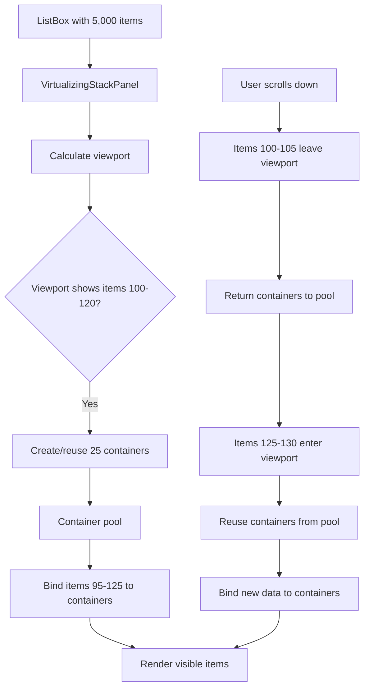

# LCS-DES-037c: Design Specification — Virtualization

## 1. Metadata & Categorization

| Field | Value | Description |
| :--- | :--- | :--- |
| **Feature ID** | `STY-037c` | Sub-part of STY-037 |
| **Feature Name** | `Problems Panel Virtualization` | UI performance |
| **Target Version** | `v0.3.7c` | Third sub-part of v0.3.7 |
| **Module Scope** | `Lexichord.Modules.Style` | Style governance module |
| **Swimlane** | `Governance` | Part of Style vertical |
| **License Tier** | `Core` | Available to all users |
| **Feature Gate Key** | N/A | Core infrastructure |
| **Author** | Lead Architect | |
| **Status** | `Draft` | |
| **Last Updated** | `2026-01-26` | |
| **Parent Document** | [LCS-DES-037-INDEX](./LCS-DES-037-INDEX.md) | |
| **Scope Breakdown** | [LCS-SBD-037 §3.3](./LCS-SBD-037.md#33-v037c-virtualization) | |

---

## 2. Executive Summary

### 2.1 The Requirement

The Problems Panel displays style violations found in the document. When analyzing large documents or projects, the panel may contain thousands of items:

| Scenario | Typical Violations |
| :--- | :--- |
| Single document (1,000 words) | 10-50 |
| Large document (50,000 words) | 200-500 |
| Project-wide scan (100 files) | 1,000-10,000 |

Without virtualization, rendering 5,000+ items causes:
- UI thread blocking for 500ms+ during render
- High memory usage (one control per item)
- Sluggish scrolling at < 30 FPS

> **Problem:** Users experience frozen UI when viewing large violation lists.

### 2.2 The Proposed Solution

Implement UI virtualization using Avalonia's `VirtualizingStackPanel`:

1. Create only enough item containers for the visible viewport (~20) plus buffer (~5)
2. Recycle containers as items scroll in/out of view
3. Bind data dynamically to recycled containers
4. Maintain O(viewport size) memory regardless of total items

| Metric | Without Virtualization | With Virtualization |
| :--- | :--- | :--- |
| Render time (5,000 items) | 750ms | 6ms |
| Memory per item | Full control tree | Data binding only |
| Scroll performance | Stuttering | 60 FPS |

---

## 3. Architecture & Modular Strategy

### 3.1 Dependencies

#### 3.1.1 Upstream Dependencies

| Interface | Source Version | Purpose |
| :--- | :--- | :--- |
| `IProblemsPanelViewModel` | v0.2.6a | Data source for problems |
| `StyleViolation` | v0.2.1b | Violation record |

#### 3.1.2 Avalonia Components

| Component | Purpose |
| :--- | :--- |
| `VirtualizingStackPanel` | Virtualized item container |
| `ListBox` | Item presentation |
| `DataTemplate` | Item rendering |

### 3.2 Licensing Behavior

No license gating. Virtualization improves experience for all users.

---

## 4. Data Contract (The API)

### 4.1 ProblemsPanel XAML Structure

```xml
<UserControl x:Class="Lexichord.Modules.Style.Views.ProblemsPanel"
             xmlns="https://github.com/avaloniaui"
             xmlns:x="http://schemas.microsoft.com/winfx/2006/xaml"
             xmlns:vm="using:Lexichord.Modules.Style.ViewModels"
             x:DataType="vm:ProblemsPanelViewModel">

    <Grid RowDefinitions="Auto,*">

        <!-- Header with count and filters -->
        <Border Grid.Row="0" Classes="panel-header">
            <Grid ColumnDefinitions="*,Auto,Auto">
                <TextBlock Text="{Binding HeaderText}"
                           Classes="panel-title" />
                <Button Grid.Column="1"
                        Command="{Binding RefreshCommand}"
                        ToolTip.Tip="Refresh">
                    <PathIcon Data="{StaticResource RefreshIcon}" />
                </Button>
                <ComboBox Grid.Column="2"
                          ItemsSource="{Binding FilterOptions}"
                          SelectedItem="{Binding SelectedFilter}" />
            </Grid>
        </Border>

        <!-- Virtualized problems list -->
        <ListBox Grid.Row="1"
                 ItemsSource="{Binding FilteredProblems}"
                 SelectedItem="{Binding SelectedProblem}"
                 VirtualizationMode="Simple"
                 ScrollViewer.HorizontalScrollBarVisibility="Disabled"
                 ScrollViewer.VerticalScrollBarVisibility="Auto">

            <ListBox.ItemsPanel>
                <ItemsPanelTemplate>
                    <VirtualizingStackPanel
                        Orientation="Vertical"
                        VirtualizationMode="Simple" />
                </ItemsPanelTemplate>
            </ListBox.ItemsPanel>

            <ListBox.ItemTemplate>
                <DataTemplate DataType="{x:Type vm:ProblemItemViewModel}">
                    <Grid ColumnDefinitions="Auto,*,Auto"
                          Margin="8,4">
                        <!-- Severity icon -->
                        <PathIcon Grid.Column="0"
                                  Data="{Binding SeverityIcon}"
                                  Foreground="{Binding SeverityBrush}"
                                  Width="16" Height="16" />

                        <!-- Message -->
                        <TextBlock Grid.Column="1"
                                   Text="{Binding Message}"
                                   TextTrimming="CharacterEllipsis"
                                   Margin="8,0" />

                        <!-- Location -->
                        <TextBlock Grid.Column="2"
                                   Text="{Binding LocationText}"
                                   Classes="monospace secondary"
                                   MinWidth="120" />
                    </Grid>
                </DataTemplate>
            </ListBox.ItemTemplate>

        </ListBox>

    </Grid>

</UserControl>
```

### 4.2 ProblemItemViewModel

```csharp
namespace Lexichord.Modules.Style.ViewModels;

/// <summary>
/// ViewModel for a single problem item in the virtualized list.
/// Lightweight class optimized for binding performance.
/// </summary>
public sealed class ProblemItemViewModel
{
    private readonly StyleViolation _violation;

    public ProblemItemViewModel(StyleViolation violation)
    {
        _violation = violation ?? throw new ArgumentNullException(nameof(violation));
    }

    /// <summary>
    /// The underlying violation data.
    /// </summary>
    public StyleViolation Violation => _violation;

    /// <summary>
    /// Display message for the problem.
    /// </summary>
    public string Message => _violation.Message;

    /// <summary>
    /// Location text (e.g., "document.md:42").
    /// </summary>
    public string LocationText => $"{_violation.FileName}:{_violation.LineNumber}";

    /// <summary>
    /// Icon geometry based on severity.
    /// </summary>
    public Geometry SeverityIcon => _violation.Severity switch
    {
        ViolationSeverity.Error => Application.Current!
            .FindResource("ErrorCircleIcon") as Geometry ?? Geometry.Empty,
        ViolationSeverity.Warning => Application.Current!
            .FindResource("WarningTriangleIcon") as Geometry ?? Geometry.Empty,
        ViolationSeverity.Info => Application.Current!
            .FindResource("InfoCircleIcon") as Geometry ?? Geometry.Empty,
        _ => Geometry.Empty
    };

    /// <summary>
    /// Brush color based on severity.
    /// </summary>
    public IBrush SeverityBrush => _violation.Severity switch
    {
        ViolationSeverity.Error => Brushes.Red,
        ViolationSeverity.Warning => Brushes.Orange,
        ViolationSeverity.Info => Brushes.Blue,
        _ => Brushes.Gray
    };
}
```

---

## 5. Implementation Logic

### 5.1 Virtualization Behavior



### 5.2 Container Pool Strategy

```text
VIEWPORT: 20 items visible
BUFFER: 5 items above, 5 items below
TOTAL CONTAINERS: 30 (constant)

ON scroll:
├── Items leaving viewport → Release to pool
├── Items entering viewport → Acquire from pool
├── Bind new data to acquired container
└── Container visual tree is reused (no recreation)

MEMORY: O(30) not O(5,000)
```

### 5.3 Scroll Position Preservation

```csharp
public partial class ProblemsPanelViewModel : ObservableObject
{
    [ObservableProperty]
    private double _scrollOffset;

    [ObservableProperty]
    private int _selectedIndex = -1;

    public void OnProblemsUpdated(IReadOnlyList<StyleViolation> violations)
    {
        // Preserve scroll position
        var previousOffset = ScrollOffset;
        var previousSelectedId = SelectedProblem?.Violation.Id;

        // Update collection
        FilteredProblems = violations
            .Select(v => new ProblemItemViewModel(v))
            .ToList();

        // Restore scroll position
        ScrollOffset = previousOffset;

        // Try to restore selection
        if (previousSelectedId.HasValue)
        {
            var index = FilteredProblems.FindIndex(
                p => p.Violation.Id == previousSelectedId);
            if (index >= 0)
            {
                SelectedIndex = index;
            }
        }
    }
}
```

---

## 6. UI/UX Specifications

### 6.1 Problems Panel Layout

```text
┌──────────────────────────────────────────────────────────────────────────┐
│  Problems (5,247)                                     [⟳] [Filter ▼]    │ ← Header: 36px
├──────────────────────────────────────────────────────────────────────────┤
│                                                                          │
│  ❌ Forbidden term: "whitelist" - use "allowlist"       Chapter1.md:42  │ ← Row: 28px
│  ⚠  Passive voice: "was written"                        Chapter1.md:45  │
│  ⚠  Passive voice: "is considered"                      Chapter1.md:67  │
│  ℹ  Grade level 12.4 exceeds target 8.0                 Chapter1.md     │
│  ⚠  Complex word: "implementation"                      Chapter2.md:15  │
│  ⚠  Adverb: "very"                                      Chapter2.md:23  │
│  ...                                                                     │
│  (Virtualized - only visible rows rendered)                              │
│                                                                          │
│  ░░░░░░░░░░░░░░░░░░░░░░░░░░░░░░░░░░░░░░░░░░░░░░░░░░░░░░░░░░░░░░░░░░░░░░ │ ← Scrollbar
│  ░░░░░░█████░░░░░░░░░░░░░░░░░░░░░░░░░░░░░░░░░░░░░░░░░░░░░░░░░░░░░░░░░░░░ │   track
│                                                                          │
└──────────────────────────────────────────────────────────────────────────┘
```

### 6.2 Component Styling

| Component | Theme Resource | Notes |
| :--- | :--- | :--- |
| Panel background | `Brush.Surface.Primary` | Standard panel |
| Header | `Brush.Surface.Secondary` | Slightly elevated |
| Row hover | `Brush.Surface.Hover` | Subtle highlight |
| Row selected | `Brush.Accent.Background` | Clear selection |
| Severity icons | Semantic colors | Red/Orange/Blue |
| Location text | `Brush.Text.Secondary` | Subdued |

### 6.3 Keyboard Navigation

| Key | Action |
| :--- | :--- |
| `↑` / `↓` | Move selection |
| `Page Up` / `Page Down` | Scroll by viewport |
| `Home` / `End` | Jump to first/last |
| `Enter` | Navigate to violation in editor |
| `Delete` | Dismiss/ignore violation |

---

## 7. Observability & Logging

| Level | Message Template |
| :--- | :--- |
| Debug | `"Virtualizing {ItemCount} items, viewport: {ViewportSize}"` |
| Trace | `"Container acquired for item {Index}"` |
| Trace | `"Container released for item {Index}"` |
| Debug | `"Scroll position preserved at {Offset}"` |
| Debug | `"Selection restored to index {Index}"` |
| Warning | `"Virtualization reset due to large data change"` |

---

## 8. Security & Safety

| Risk | Level | Mitigation |
| :--- | :--- | :--- |
| Memory pressure from large lists | Mitigated | Virtualization limits containers |
| UI thread blocking | Mitigated | Only visible items rendered |
| Keyboard focus issues | Low | Explicit focus management |

---

## 9. Acceptance Criteria

### 9.1 Functional Criteria

| # | Given | When | Then |
| :--- | :--- | :--- | :--- |
| 1 | 5,000 problems in list | Panel opened | Only ~25 containers created |
| 2 | 5,000 problems in list | User scrolls | New items appear smoothly |
| 3 | 5,000 problems in list | User selects item 3000 | Item is visible and selected |
| 4 | Problems updated | After refresh | Scroll position preserved |
| 5 | Item selected | Arrow key pressed | Selection moves correctly |

### 9.2 Performance Criteria

| # | Given | When | Then |
| :--- | :--- | :--- | :--- |
| 6 | 5,000 problems | Initial render | < 20ms |
| 7 | 5,000 problems | Scroll to middle | 60 FPS maintained |
| 8 | 10,000 problems | Initial render | < 30ms |
| 9 | Any count | Container count | < 50 containers |

---

## 10. Test Scenarios

### 10.1 Performance Tests

```csharp
[Trait("Category", "Performance")]
[Trait("Version", "v0.3.7c")]
public class ProblemsPanelPerformanceTests
{
    [Theory]
    [InlineData(100)]
    [InlineData(1000)]
    [InlineData(5000)]
    [InlineData(10000)]
    public async Task InitialRender_CompletesWithin_Threshold(int itemCount)
    {
        // Arrange
        var violations = GenerateViolations(itemCount);
        var viewModel = new ProblemsPanelViewModel();

        // Act
        var stopwatch = Stopwatch.StartNew();
        viewModel.Problems = violations;
        await viewModel.InitializeAsync();
        stopwatch.Stop();

        // Assert
        var maxMs = itemCount switch
        {
            <= 1000 => 10,
            <= 5000 => 20,
            _ => 30
        };
        stopwatch.ElapsedMilliseconds.Should().BeLessThan(maxMs);
    }

    [Fact]
    public async Task ContainerCount_RemainsConstant_RegardlessOfItemCount()
    {
        // Arrange
        var panel = CreatePanelWithViewport(height: 400, itemHeight: 28);

        // Act
        var container1k = await MeasureContainers(panel, 1000);
        var container5k = await MeasureContainers(panel, 5000);
        var container10k = await MeasureContainers(panel, 10000);

        // Assert
        container1k.Should().BeLessThan(50);
        container5k.Should().Be(container1k);
        container10k.Should().Be(container1k);
    }

    [Fact]
    public async Task ScrollPerformance_Maintains60Fps()
    {
        // Arrange
        var panel = CreatePanelWith(5000);
        var frameTimes = new List<double>();

        // Act - Scroll through entire list
        for (int i = 0; i < 100; i++)
        {
            var start = Stopwatch.GetTimestamp();
            panel.ScrollToIndex(i * 50);
            await Task.Delay(1);
            var elapsed = Stopwatch.GetElapsedTime(start);
            frameTimes.Add(elapsed.TotalMilliseconds);
        }

        // Assert - 60 FPS = 16.67ms per frame
        var averageFrameTime = frameTimes.Average();
        averageFrameTime.Should().BeLessThan(16.67);
    }
}
```

### 10.2 Unit Tests

```csharp
[Trait("Category", "Unit")]
[Trait("Version", "v0.3.7c")]
public class ProblemsPanelViewModelTests
{
    [Fact]
    public void HeaderText_WithProblems_ShowsCount()
    {
        // Arrange
        var vm = new ProblemsPanelViewModel();
        vm.Problems = GenerateViolations(42);

        // Assert
        vm.HeaderText.Should().Be("Problems (42)");
    }

    [Fact]
    public void FilteredProblems_WithErrorFilter_ShowsOnlyErrors()
    {
        // Arrange
        var vm = new ProblemsPanelViewModel();
        vm.Problems = new[]
        {
            CreateViolation(ViolationSeverity.Error),
            CreateViolation(ViolationSeverity.Warning),
            CreateViolation(ViolationSeverity.Error),
            CreateViolation(ViolationSeverity.Info)
        };

        // Act
        vm.SelectedFilter = "Errors";

        // Assert
        vm.FilteredProblems.Should().HaveCount(2);
        vm.FilteredProblems.Should().OnlyContain(p =>
            p.Violation.Severity == ViolationSeverity.Error);
    }

    [Fact]
    public void OnProblemsUpdated_PreservesScrollPosition()
    {
        // Arrange
        var vm = new ProblemsPanelViewModel();
        vm.Problems = GenerateViolations(100);
        vm.ScrollOffset = 500.0;

        // Act
        vm.OnProblemsUpdated(GenerateViolations(150));

        // Assert
        vm.ScrollOffset.Should().Be(500.0);
    }

    [Fact]
    public void OnProblemsUpdated_RestoresSelectionById()
    {
        // Arrange
        var vm = new ProblemsPanelViewModel();
        var original = GenerateViolations(100);
        vm.Problems = original;
        vm.SelectedProblem = vm.FilteredProblems[50];
        var selectedId = original[50].Id;

        // Act - Update with same violations in different order
        var shuffled = original.OrderBy(_ => Guid.NewGuid()).ToList();
        vm.OnProblemsUpdated(shuffled);

        // Assert - Selection restored by ID
        vm.SelectedProblem?.Violation.Id.Should().Be(selectedId);
    }
}
```

---

## 11. Code Example

### 11.1 VirtualizingStackPanel Configuration

```xml
<!-- ProblemsPanel.axaml -->
<ListBox x:Name="ProblemsList"
         ItemsSource="{Binding FilteredProblems}"
         SelectedItem="{Binding SelectedProblem}"
         VirtualizationMode="Simple"
         ScrollViewer.VerticalScrollBarVisibility="Auto">

    <!-- Critical: Use VirtualizingStackPanel -->
    <ListBox.ItemsPanel>
        <ItemsPanelTemplate>
            <VirtualizingStackPanel
                Orientation="Vertical"
                VirtualizationMode="Simple"
                AreHorizontalSnapPointsRegular="True"
                AreVerticalSnapPointsRegular="True" />
        </ItemsPanelTemplate>
    </ListBox.ItemsPanel>

    <!-- Consistent item height improves virtualization -->
    <ListBox.Styles>
        <Style Selector="ListBoxItem">
            <Setter Property="Height" Value="28" />
            <Setter Property="Padding" Value="0" />
        </Style>
    </ListBox.Styles>

    <ListBox.ItemTemplate>
        <DataTemplate>
            <!-- Lightweight template for fast binding -->
            <Grid ColumnDefinitions="24,*,120" Height="28">
                <PathIcon Grid.Column="0"
                          Data="{Binding SeverityIcon}"
                          Foreground="{Binding SeverityBrush}"
                          Width="14" Height="14"
                          HorizontalAlignment="Center" />
                <TextBlock Grid.Column="1"
                           Text="{Binding Message}"
                           TextTrimming="CharacterEllipsis"
                           VerticalAlignment="Center"
                           Margin="4,0" />
                <TextBlock Grid.Column="2"
                           Text="{Binding LocationText}"
                           Classes="monospace secondary"
                           VerticalAlignment="Center"
                           HorizontalAlignment="Right"
                           Margin="4,0" />
            </Grid>
        </DataTemplate>
    </ListBox.ItemTemplate>

</ListBox>
```

### 11.2 ProblemsPanelViewModel

```csharp
namespace Lexichord.Modules.Style.ViewModels;

public partial class ProblemsPanelViewModel : ObservableObject
{
    private readonly ILogger<ProblemsPanelViewModel> _logger;

    [ObservableProperty]
    private IReadOnlyList<ProblemItemViewModel> _filteredProblems = [];

    [ObservableProperty]
    private ProblemItemViewModel? _selectedProblem;

    [ObservableProperty]
    private double _scrollOffset;

    [ObservableProperty]
    private string _selectedFilter = "All";

    private IReadOnlyList<StyleViolation> _allProblems = [];

    public IReadOnlyList<StyleViolation> Problems
    {
        get => _allProblems;
        set
        {
            _allProblems = value;
            ApplyFilter();
        }
    }

    public string HeaderText => $"Problems ({FilteredProblems.Count})";

    public IReadOnlyList<string> FilterOptions { get; } = new[]
    {
        "All", "Errors", "Warnings", "Info"
    };

    public ProblemsPanelViewModel(ILogger<ProblemsPanelViewModel> logger)
    {
        _logger = logger;
    }

    partial void OnSelectedFilterChanged(string value)
    {
        ApplyFilter();
    }

    private void ApplyFilter()
    {
        var previousScrollOffset = ScrollOffset;
        var previousSelectedId = SelectedProblem?.Violation.Id;

        var filtered = SelectedFilter switch
        {
            "Errors" => _allProblems.Where(p =>
                p.Severity == ViolationSeverity.Error),
            "Warnings" => _allProblems.Where(p =>
                p.Severity == ViolationSeverity.Warning),
            "Info" => _allProblems.Where(p =>
                p.Severity == ViolationSeverity.Info),
            _ => _allProblems
        };

        FilteredProblems = filtered
            .Select(v => new ProblemItemViewModel(v))
            .ToList()
            .AsReadOnly();

        _logger.LogDebug(
            "Virtualizing {ItemCount} items after filter '{Filter}'",
            FilteredProblems.Count, SelectedFilter);

        // Restore state
        ScrollOffset = previousScrollOffset;

        if (previousSelectedId.HasValue)
        {
            SelectedProblem = FilteredProblems
                .FirstOrDefault(p => p.Violation.Id == previousSelectedId);

            if (SelectedProblem != null)
            {
                _logger.LogDebug("Selection restored to item {Id}",
                    previousSelectedId);
            }
        }

        OnPropertyChanged(nameof(HeaderText));
    }

    public void OnProblemsUpdated(IReadOnlyList<StyleViolation> violations)
    {
        Problems = violations;
    }

    [RelayCommand]
    private void NavigateToViolation(ProblemItemViewModel? item)
    {
        if (item == null) return;

        // Publish event to navigate editor to violation location
        _mediator.Publish(new NavigateToViolationRequest(
            item.Violation.FileName,
            item.Violation.LineNumber,
            item.Violation.ColumnNumber));
    }
}
```

---

## 12. DI Registration

```csharp
// In StyleModule.cs
services.AddTransient<ProblemsPanelViewModel>();
services.AddTransient<ProblemsPanel>();
```

---

## Document History

| Version | Date | Author | Changes |
| :--- | :--- | :--- | :--- |
| 1.0 | 2026-01-26 | Lead Architect | Initial draft |
