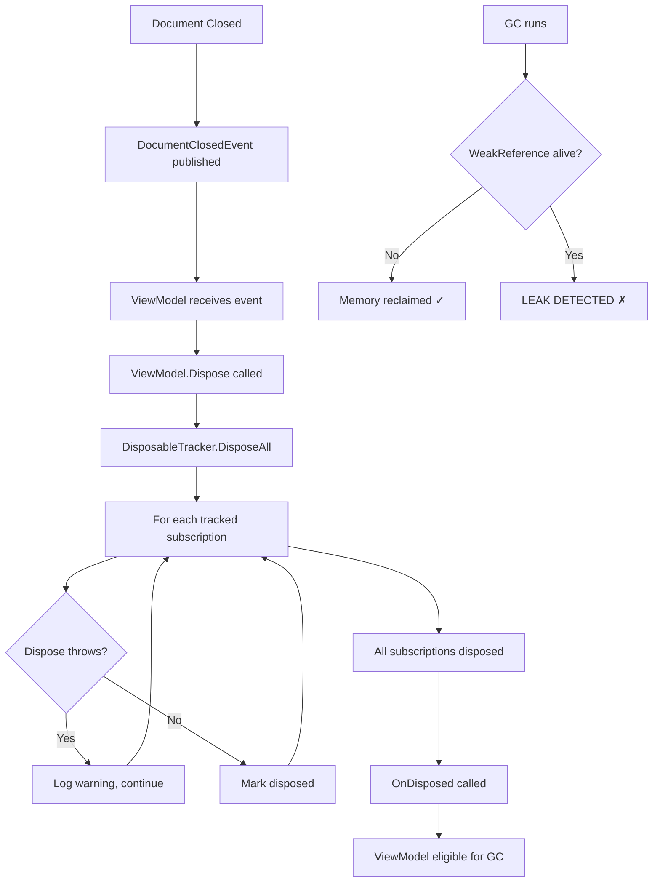

# LCS-DES-037d: Design Specification — Memory Leak Prevention

## 1. Metadata & Categorization

| Field                | Value                                                           | Description               |
| :------------------- | :-------------------------------------------------------------- | :------------------------ |
| **Feature ID**       | `STY-037d`                                                      | Sub-part of STY-037       |
| **Feature Name**     | `Subscription Cleanup and Leak Prevention`                      | Memory management         |
| **Target Version**   | `v0.3.7d`                                                       | Fourth sub-part of v0.3.7 |
| **Module Scope**     | `Lexichord.Modules.Style`                                       | Style governance module   |
| **Swimlane**         | `Governance`                                                    | Part of Style vertical    |
| **License Tier**     | `Core`                                                          | Available to all users    |
| **Feature Gate Key** | N/A                                                             | Core infrastructure       |
| **Author**           | Lead Architect                                                  |                           |
| **Status**           | `Draft`                                                         |                           |
| **Last Updated**     | `2026-01-26`                                                    |                           |
| **Parent Document**  | [LCS-DES-037-INDEX](./LCS-DES-037-INDEX.md)                     |                           |
| **Scope Breakdown**  | [LCS-SBD-037 §3.4](./LCS-SBD-037.md#34-v037d-memory-leak-check) |                           |

---

## 2. Executive Summary

### 2.1 The Requirement

ViewModels and services subscribe to various event streams:

- MediatR notifications
- System.Reactive observables
- Timer callbacks
- Document change events

When a document is closed, these subscriptions must be properly disposed. Otherwise:

- Analyzers continue running on closed documents (wasted CPU)
- Event handlers retain references to disposed ViewModels
- Memory grows over time as subscriptions accumulate
- Application becomes sluggish after extended use

> **Problem:** Long editing sessions lead to degraded performance due to accumulated memory leaks.

### 2.2 The Proposed Solution

Implement a disposal infrastructure:

1. **`IDisposableTracker`**: Tracks subscriptions for batch disposal
2. **`DisposableViewModel`**: Base class with built-in tracking
3. **Automatic cleanup**: Subscribe to `DocumentClosedEvent` for cleanup
4. **Verification tools**: Memory tests with `WeakReference`

---

## 3. Architecture & Modular Strategy

### 3.1 Dependencies

#### 3.1.1 Upstream Dependencies

| Interface             | Source Version        | Purpose                                    |
| :-------------------- | :-------------------- | :----------------------------------------- |
| `DocumentClosedEvent` | v0.1.4c               | Cleanup trigger                            |
| `IMediator`           | v0.0.7a               | Event subscriptions                        |
| `ViewModelBase`       | CommunityToolkit.Mvvm | Observable ViewModel base (external NuGet) |

#### 3.1.2 NuGet Packages

None required beyond BCL.

### 3.2 Licensing Behavior

No license gating. Memory management benefits all users.

---

## 4. Data Contract (The API)

### 4.1 IDisposableTracker Interface

```csharp
namespace Lexichord.Abstractions.Contracts;

/// <summary>
/// Tracks disposable subscriptions and ensures proper cleanup.
/// Implements the CompositeDisposable pattern for ViewModel lifecycle management.
/// </summary>
/// <remarks>
/// <para>The tracker SHALL store all tracked disposables until <see cref="DisposeAll"/> is called.</para>
/// <para>The tracker SHALL handle exceptions in individual disposables without failing others.</para>
/// <para>The tracker SHALL be thread-safe for concurrent Track operations.</para>
/// </remarks>
/// <example>
/// <code>
/// var tracker = new DisposableTracker();
///
/// tracker.Track(observable.Subscribe(x => Handle(x)));
/// tracker.Track(timer.Elapsed.Subscribe(t => OnTick(t)));
///
/// // Later, during cleanup:
/// tracker.DisposeAll();
/// </code>
/// </example>
public interface IDisposableTracker : IDisposable
{
    /// <summary>
    /// Adds a disposable subscription to be tracked.
    /// </summary>
    /// <param name="disposable">The subscription to track. Must not be null.</param>
    /// <exception cref="ObjectDisposedException">
    /// Thrown if the tracker has already been disposed.
    /// </exception>
    void Track(IDisposable disposable);

    /// <summary>
    /// Adds multiple disposable subscriptions to be tracked.
    /// </summary>
    /// <param name="disposables">The subscriptions to track.</param>
    void TrackAll(params IDisposable[] disposables);

    /// <summary>
    /// Disposes all tracked subscriptions and clears the tracker.
    /// </summary>
    /// <remarks>
    /// Exceptions from individual disposables are caught and logged,
    /// ensuring all disposables are attempted.
    /// </remarks>
    void DisposeAll();

    /// <summary>
    /// Gets the count of currently tracked subscriptions.
    /// </summary>
    int Count { get; }

    /// <summary>
    /// Gets whether the tracker has been disposed.
    /// </summary>
    bool IsDisposed { get; }
}
```

### 4.2 DisposableViewModel Base Class

```csharp
namespace Lexichord.Abstractions.ViewModels;

/// <summary>
/// Base ViewModel class with built-in subscription tracking and automatic disposal.
/// All analysis-related ViewModels SHOULD inherit from this class.
/// </summary>
/// <remarks>
/// <para>Subscriptions added via <see cref="Track"/> are automatically disposed
/// when <see cref="Dispose"/> is called.</para>
/// <para>Override <see cref="OnDisposed"/> to perform additional cleanup.</para>
/// </remarks>
/// <example>
/// <code>
/// public class DocumentAnalysisViewModel : DisposableViewModel
/// {
///     public DocumentAnalysisViewModel(IMediator mediator)
///     {
///         // Automatically disposed when ViewModel is disposed
///         Track(mediator
///             .CreateStream&lt;DocumentChangedEvent&gt;()
///             .Subscribe(OnDocumentChanged));
///
///         Track(mediator
///             .CreateStream&lt;DocumentClosedEvent&gt;()
///             .Where(e => e.DocumentId == DocumentId)
///             .Subscribe(_ => Dispose()));
///     }
/// }
/// </code>
/// </example>
public abstract class DisposableViewModel : ViewModelBase, IDisposable
{
    private readonly IDisposableTracker _tracker = new DisposableTracker();
    private bool _disposed;

    /// <summary>
    /// Tracks a subscription for automatic disposal when this ViewModel is disposed.
    /// </summary>
    /// <param name="subscription">The subscription to track.</param>
    /// <exception cref="ObjectDisposedException">
    /// Thrown if the ViewModel has already been disposed.
    /// </exception>
    protected void Track(IDisposable subscription)
    {
        ThrowIfDisposed();
        _tracker.Track(subscription);
    }

    /// <summary>
    /// Tracks multiple subscriptions for automatic disposal.
    /// </summary>
    /// <param name="subscriptions">The subscriptions to track.</param>
    protected void TrackAll(params IDisposable[] subscriptions)
    {
        ThrowIfDisposed();
        _tracker.TrackAll(subscriptions);
    }

    /// <summary>
    /// Gets the number of tracked subscriptions.
    /// </summary>
    protected int SubscriptionCount => _tracker.Count;

    /// <summary>
    /// Gets whether this ViewModel has been disposed.
    /// </summary>
    public bool IsDisposed => _disposed;

    /// <summary>
    /// Disposes all tracked subscriptions and performs cleanup.
    /// </summary>
    public void Dispose()
    {
        if (_disposed) return;
        _disposed = true;

        _tracker.DisposeAll();
        OnDisposed();
        GC.SuppressFinalize(this);
    }

    /// <summary>
    /// Override to perform additional cleanup after subscriptions are disposed.
    /// </summary>
    /// <remarks>
    /// Called after all tracked subscriptions have been disposed.
    /// Base implementation does nothing.
    /// </remarks>
    protected virtual void OnDisposed() { }

    /// <summary>
    /// Throws <see cref="ObjectDisposedException"/> if this ViewModel has been disposed.
    /// </summary>
    protected void ThrowIfDisposed()
    {
        if (_disposed)
        {
            throw new ObjectDisposedException(GetType().Name);
        }
    }
}
```

---

## 5. Implementation Logic

### 5.1 Disposal Flow Diagram



### 5.2 Cleanup Decision Tree

```text
START: "Document closed, should ViewModel be disposed?"
│
├── Is ViewModel still referenced by parent?
│   └── YES → Parent should dispose child
│
├── Is ViewModel subscribed to document events?
│   └── YES → DocumentClosedEvent triggers Dispose
│
├── Is ViewModel using CancellationToken?
│   └── YES → Cancel before dispose
│
├── Does ViewModel hold external resources?
│   └── YES → Release in OnDisposed override
│
├── Dispose called
│   ├── DisposableTracker.DisposeAll()
│   ├── OnDisposed() virtual method
│   └── GC.SuppressFinalize(this)
│
└── ViewModel ready for garbage collection
```

### 5.3 Self-Disposing Pattern

```csharp
public class DocumentAnalysisViewModel : DisposableViewModel
{
    private readonly Guid _documentId;
    private CancellationTokenSource? _analysisCts;

    public DocumentAnalysisViewModel(
        Guid documentId,
        IMediator mediator,
        ILintingOrchestrator orchestrator)
    {
        _documentId = documentId;

        // Track analysis subscription
        Track(orchestrator.AnalysisCompleted
            .Subscribe(OnAnalysisCompleted));

        // Track document change subscription
        Track(mediator.CreateStream<DocumentChangedEvent>()
            .Where(e => e.DocumentId == _documentId)
            .Subscribe(OnDocumentChanged));

        // CRITICAL: Self-dispose when document closes
        Track(mediator.CreateStream<DocumentClosedEvent>()
            .Where(e => e.DocumentId == _documentId)
            .Take(1)  // Only need first close event
            .Subscribe(_ => Dispose()));
    }

    protected override void OnDisposed()
    {
        // Cancel any in-flight analysis
        _analysisCts?.Cancel();
        _analysisCts?.Dispose();
        _analysisCts = null;

        _logger.LogDebug(
            "DocumentAnalysisViewModel disposed for document {DocumentId}",
            _documentId);
    }
}
```

---

## 6. UI/UX Specifications

No direct UI. This is backend infrastructure.

---

## 7. Observability & Logging

| Level   | Message Template                                                      |
| :------ | :-------------------------------------------------------------------- |
| Debug   | `"Tracking subscription, count: {Count}"`                             |
| Debug   | `"DisposeAll called, disposing {Count} subscriptions"`                |
| Warning | `"Error disposing subscription: {Error}"`                             |
| Info    | `"Disposed {Count} subscriptions successfully"`                       |
| Debug   | `"ViewModel {TypeName} disposing, {SubscriptionCount} subscriptions"` |
| Debug   | `"ViewModel {TypeName} disposed for document {DocumentId}"`           |

---

## 8. Security & Safety

| Risk                      | Level  | Mitigation                    |
| :------------------------ | :----- | :---------------------------- |
| Double disposal           | Low    | `_disposed` flag check        |
| Disposal during operation | Medium | CancellationToken propagation |
| Exception in dispose      | Low    | Try-catch per subscription    |
| Race condition            | Low    | Lock in DisposableTracker     |

---

## 9. Acceptance Criteria

### 9.1 Functional Criteria

| #   | Given                          | When               | Then                               |
| :-- | :----------------------------- | :----------------- | :--------------------------------- |
| 1   | ViewModel with 5 subscriptions | Disposed           | All 5 subscriptions disposed       |
| 2   | Subscription throws on dispose | DisposeAll called  | Other subscriptions still disposed |
| 3   | ViewModel disposed             | Track called       | ObjectDisposedException thrown     |
| 4   | Document closed                | Event published    | ViewModel disposes itself          |
| 5   | CancellationTokenSource active | ViewModel disposed | Token cancelled                    |

### 9.2 Memory Criteria

| #   | Given                        | When     | Then                        |
| :-- | :--------------------------- | :------- | :-------------------------- |
| 6   | ViewModel disposed           | GC runs  | WeakReference returns false |
| 7   | 100 open/close cycles        | After GC | Memory growth < 5MB         |
| 8   | ViewModel with timer         | Disposed | Timer stops firing          |
| 9   | ViewModel with event handler | Disposed | Handler not invoked         |

---

## 10. Test Scenarios

### 10.1 Unit Tests

```csharp
[Trait("Category", "Unit")]
[Trait("Version", "v0.3.7d")]
public class DisposableTrackerTests
{
    [Fact]
    public void Track_AddsToCount()
    {
        // Arrange
        var tracker = new DisposableTracker();
        var disposable = new Mock<IDisposable>();

        // Act
        tracker.Track(disposable.Object);

        // Assert
        tracker.Count.Should().Be(1);
    }

    [Fact]
    public void TrackAll_AddsMultiple()
    {
        // Arrange
        var tracker = new DisposableTracker();
        var d1 = new Mock<IDisposable>();
        var d2 = new Mock<IDisposable>();
        var d3 = new Mock<IDisposable>();

        // Act
        tracker.TrackAll(d1.Object, d2.Object, d3.Object);

        // Assert
        tracker.Count.Should().Be(3);
    }

    [Fact]
    public void DisposeAll_DisposesAllTracked()
    {
        // Arrange
        var tracker = new DisposableTracker();
        var d1 = new Mock<IDisposable>();
        var d2 = new Mock<IDisposable>();
        tracker.TrackAll(d1.Object, d2.Object);

        // Act
        tracker.DisposeAll();

        // Assert
        d1.Verify(d => d.Dispose(), Times.Once);
        d2.Verify(d => d.Dispose(), Times.Once);
        tracker.Count.Should().Be(0);
    }

    [Fact]
    public void DisposeAll_ContinuesOnException()
    {
        // Arrange
        var tracker = new DisposableTracker();
        var d1 = new Mock<IDisposable>();
        var d2 = new Mock<IDisposable>();

        d1.Setup(d => d.Dispose()).Throws<InvalidOperationException>();

        tracker.TrackAll(d1.Object, d2.Object);

        // Act
        tracker.DisposeAll();

        // Assert - d2 still disposed despite d1 throwing
        d2.Verify(d => d.Dispose(), Times.Once);
    }

    [Fact]
    public void Track_AfterDispose_Throws()
    {
        // Arrange
        var tracker = new DisposableTracker();
        tracker.Dispose();

        // Act & Assert
        var action = () => tracker.Track(Mock.Of<IDisposable>());
        action.Should().Throw<ObjectDisposedException>();
    }

    [Fact]
    public void Dispose_CallsDisposeAll()
    {
        // Arrange
        var tracker = new DisposableTracker();
        var d1 = new Mock<IDisposable>();
        tracker.Track(d1.Object);

        // Act
        tracker.Dispose();

        // Assert
        d1.Verify(d => d.Dispose(), Times.Once);
        tracker.IsDisposed.Should().BeTrue();
    }
}
```

### 10.2 DisposableViewModel Tests

```csharp
[Trait("Category", "Unit")]
[Trait("Version", "v0.3.7d")]
public class DisposableViewModelTests
{
    [Fact]
    public void Track_AddsToSubscriptionCount()
    {
        // Arrange
        var vm = new TestDisposableViewModel();

        // Act
        vm.TrackTestSubscription(Mock.Of<IDisposable>());

        // Assert
        vm.GetSubscriptionCount().Should().Be(1);
    }

    [Fact]
    public void Dispose_CallsOnDisposed()
    {
        // Arrange
        var vm = new TestDisposableViewModel();

        // Act
        vm.Dispose();

        // Assert
        vm.OnDisposedCalled.Should().BeTrue();
    }

    [Fact]
    public void Dispose_DisposesAllSubscriptions()
    {
        // Arrange
        var vm = new TestDisposableViewModel();
        var d1 = new Mock<IDisposable>();
        var d2 = new Mock<IDisposable>();
        vm.TrackTestSubscription(d1.Object);
        vm.TrackTestSubscription(d2.Object);

        // Act
        vm.Dispose();

        // Assert
        d1.Verify(d => d.Dispose(), Times.Once);
        d2.Verify(d => d.Dispose(), Times.Once);
    }

    [Fact]
    public void Dispose_IsIdempotent()
    {
        // Arrange
        var vm = new TestDisposableViewModel();
        var d1 = new Mock<IDisposable>();
        vm.TrackTestSubscription(d1.Object);

        // Act
        vm.Dispose();
        vm.Dispose();
        vm.Dispose();

        // Assert - Only disposed once
        d1.Verify(d => d.Dispose(), Times.Once);
    }

    [Fact]
    public void Track_AfterDispose_Throws()
    {
        // Arrange
        var vm = new TestDisposableViewModel();
        vm.Dispose();

        // Act & Assert
        var action = () => vm.TrackTestSubscription(Mock.Of<IDisposable>());
        action.Should().Throw<ObjectDisposedException>();
    }
}

public class TestDisposableViewModel : DisposableViewModel
{
    public bool OnDisposedCalled { get; private set; }

    public void TrackTestSubscription(IDisposable d) => Track(d);
    public int GetSubscriptionCount() => SubscriptionCount;

    protected override void OnDisposed()
    {
        OnDisposedCalled = true;
    }
}
```

### 10.3 Memory Leak Tests

```csharp
[Trait("Category", "Memory")]
[Trait("Version", "v0.3.7d")]
public class MemoryLeakTests
{
    [Fact]
    public void DisposedViewModel_IsGarbageCollected()
    {
        // Arrange
        WeakReference<TestDisposableViewModel>? weakRef = null;

        void CreateAndDispose()
        {
            var vm = new TestDisposableViewModel();
            vm.TrackTestSubscription(Observable.Interval(TimeSpan.FromSeconds(1))
                .Subscribe(_ => { }));
            weakRef = new WeakReference<TestDisposableViewModel>(vm);
            vm.Dispose();
        }

        // Act
        CreateAndDispose();
        GC.Collect();
        GC.WaitForPendingFinalizers();
        GC.Collect();

        // Assert
        weakRef!.TryGetTarget(out _).Should().BeFalse(
            "Disposed ViewModel should be garbage collected");
    }

    [Fact]
    public void SubscriptionDisposal_StopsEventDelivery()
    {
        // Arrange
        var subject = new Subject<int>();
        var received = new List<int>();
        var vm = new TestDisposableViewModel();

        vm.TrackTestSubscription(subject.Subscribe(x => received.Add(x)));

        // Act
        subject.OnNext(1);
        vm.Dispose();
        subject.OnNext(2);
        subject.OnNext(3);

        // Assert - Only received before dispose
        received.Should().Equal(1);
    }

    [Fact]
    public async Task RepeatedOpenClose_NoMemoryGrowth()
    {
        // Arrange
        GC.Collect();
        GC.WaitForPendingFinalizers();
        var baseline = GC.GetTotalMemory(true);

        // Act
        for (int i = 0; i < 100; i++)
        {
            var vm = new TestDisposableViewModel();
            vm.TrackTestSubscription(Observable.Timer(TimeSpan.FromSeconds(1))
                .Subscribe(_ => { }));
            vm.Dispose();
        }

        GC.Collect();
        GC.WaitForPendingFinalizers();
        GC.Collect();
        var final = GC.GetTotalMemory(true);

        // Assert
        var growth = final - baseline;
        growth.Should().BeLessThan(500_000,
            "Memory should not grow significantly after 100 cycles");
    }

    [Fact]
    public void DocumentClosedEvent_TriggersDisposal()
    {
        // Arrange
        var mediator = new Mock<IMediator>();
        var subject = new Subject<DocumentClosedEvent>();
        mediator.Setup(m => m.CreateStream<DocumentClosedEvent>())
            .Returns(subject);

        var docId = Guid.NewGuid();
        var vm = new DocumentAnalysisViewModel(docId, mediator.Object);

        // Act
        subject.OnNext(new DocumentClosedEvent(docId));

        // Assert
        vm.IsDisposed.Should().BeTrue();
    }

    [Fact]
    public void CancellationToken_CancelledOnDispose()
    {
        // Arrange
        var vm = new TestCancellableViewModel();
        var wasCancelled = false;
        vm.CancellationToken.Register(() => wasCancelled = true);

        // Act
        vm.Dispose();

        // Assert
        wasCancelled.Should().BeTrue();
    }
}

public class TestCancellableViewModel : DisposableViewModel
{
    private readonly CancellationTokenSource _cts = new();

    public CancellationToken CancellationToken => _cts.Token;

    protected override void OnDisposed()
    {
        _cts.Cancel();
        _cts.Dispose();
    }
}
```

---

## 11. Code Example

### 11.1 DisposableTracker Implementation

```csharp
namespace Lexichord.Modules.Style.Services;

/// <summary>
/// Thread-safe tracker for disposable subscriptions.
/// Implements the CompositeDisposable pattern.
/// </summary>
public sealed class DisposableTracker : IDisposableTracker
{
    private readonly List<IDisposable> _disposables = new();
    private readonly object _lock = new();
    private readonly ILogger<DisposableTracker>? _logger;
    private bool _disposed;

    public DisposableTracker(ILogger<DisposableTracker>? logger = null)
    {
        _logger = logger;
    }

    public int Count
    {
        get
        {
            lock (_lock)
            {
                return _disposables.Count;
            }
        }
    }

    public bool IsDisposed => _disposed;

    public void Track(IDisposable disposable)
    {
        if (disposable == null)
            throw new ArgumentNullException(nameof(disposable));

        lock (_lock)
        {
            if (_disposed)
                throw new ObjectDisposedException(nameof(DisposableTracker));

            _disposables.Add(disposable);
            _logger?.LogDebug("Tracking subscription, count: {Count}",
                _disposables.Count);
        }
    }

    public void TrackAll(params IDisposable[] disposables)
    {
        if (disposables == null)
            throw new ArgumentNullException(nameof(disposables));

        lock (_lock)
        {
            if (_disposed)
                throw new ObjectDisposedException(nameof(DisposableTracker));

            _disposables.AddRange(disposables.Where(d => d != null));
            _logger?.LogDebug("Tracking subscription, count: {Count}",
                _disposables.Count);
        }
    }

    public void DisposeAll()
    {
        List<IDisposable> toDispose;

        lock (_lock)
        {
            toDispose = new List<IDisposable>(_disposables);
            _disposables.Clear();
        }

        _logger?.LogDebug("DisposeAll called, disposing {Count} subscriptions",
            toDispose.Count);

        var errorCount = 0;

        foreach (var disposable in toDispose)
        {
            try
            {
                disposable.Dispose();
            }
            catch (Exception ex)
            {
                errorCount++;
                _logger?.LogWarning(ex, "Error disposing subscription: {Error}",
                    ex.Message);
            }
        }

        if (errorCount == 0)
        {
            _logger?.LogInformation("Disposed {Count} subscriptions successfully",
                toDispose.Count);
        }
    }

    public void Dispose()
    {
        if (_disposed) return;
        _disposed = true;
        DisposeAll();
    }
}
```

### 11.2 DocumentAnalysisViewModel Example

```csharp
namespace Lexichord.Modules.Style.ViewModels;

/// <summary>
/// Example ViewModel demonstrating proper disposal pattern.
/// </summary>
public class DocumentAnalysisViewModel : DisposableViewModel
{
    private readonly Guid _documentId;
    private readonly ILogger<DocumentAnalysisViewModel> _logger;
    private CancellationTokenSource? _analysisCts;

    public DocumentAnalysisViewModel(
        Guid documentId,
        IMediator mediator,
        ILintingOrchestrator orchestrator,
        ILogger<DocumentAnalysisViewModel> logger)
    {
        _documentId = documentId;
        _logger = logger;

        _logger.LogDebug("Creating DocumentAnalysisViewModel for {DocumentId}",
            documentId);

        // Track reactive subscriptions
        Track(orchestrator.AnalysisCompleted
            .Where(r => r.DocumentId == documentId)
            .ObserveOn(RxApp.MainThreadScheduler)
            .Subscribe(OnAnalysisCompleted));

        Track(mediator.CreateStream<DocumentChangedEvent>()
            .Where(e => e.DocumentId == documentId)
            .Throttle(TimeSpan.FromMilliseconds(100))
            .Subscribe(OnDocumentChanged));

        // Self-dispose when document closes
        Track(mediator.CreateStream<DocumentClosedEvent>()
            .Where(e => e.DocumentId == documentId)
            .Take(1)
            .Subscribe(_ =>
            {
                _logger.LogDebug("DocumentClosedEvent received, disposing");
                Dispose();
            }));
    }

    private void OnDocumentChanged(DocumentChangedEvent e)
    {
        ThrowIfDisposed();

        // Cancel previous analysis
        _analysisCts?.Cancel();
        _analysisCts = new CancellationTokenSource();

        // Start new analysis...
    }

    private void OnAnalysisCompleted(AnalysisResult result)
    {
        if (IsDisposed) return;

        // Update UI with results...
    }

    protected override void OnDisposed()
    {
        // Cancel any in-flight analysis
        _analysisCts?.Cancel();
        _analysisCts?.Dispose();
        _analysisCts = null;

        _logger.LogDebug(
            "ViewModel {TypeName} disposed for document {DocumentId}",
            nameof(DocumentAnalysisViewModel), _documentId);
    }
}
```

---

## 12. DI Registration

```csharp
// In StyleModule.cs
services.AddTransient<IDisposableTracker, DisposableTracker>();

// ViewModels are typically transient and disposed by their views
services.AddTransient<DocumentAnalysisViewModel>();
```

---

## 13. Migration Guide

### 13.1 Refactoring Existing ViewModels

```csharp
// BEFORE: Manual subscription management
public class OldViewModel : ViewModelBase
{
    private IDisposable? _subscription1;
    private IDisposable? _subscription2;

    public OldViewModel(IObservable<int> source)
    {
        _subscription1 = source.Subscribe(x => { });
        _subscription2 = source.Skip(1).Subscribe(x => { });
    }

    // Easy to forget to dispose!
    public void Cleanup()
    {
        _subscription1?.Dispose();
        _subscription2?.Dispose();
    }
}

// AFTER: Using DisposableViewModel
public class NewViewModel : DisposableViewModel
{
    public NewViewModel(IObservable<int> source)
    {
        Track(source.Subscribe(x => { }));
        Track(source.Skip(1).Subscribe(x => { }));
        // No manual cleanup needed - handled by Dispose()
    }
}
```

---

## Document History

| Version | Date       | Author         | Changes       |
| :------ | :--------- | :------------- | :------------ |
| 1.0     | 2026-01-26 | Lead Architect | Initial draft |
