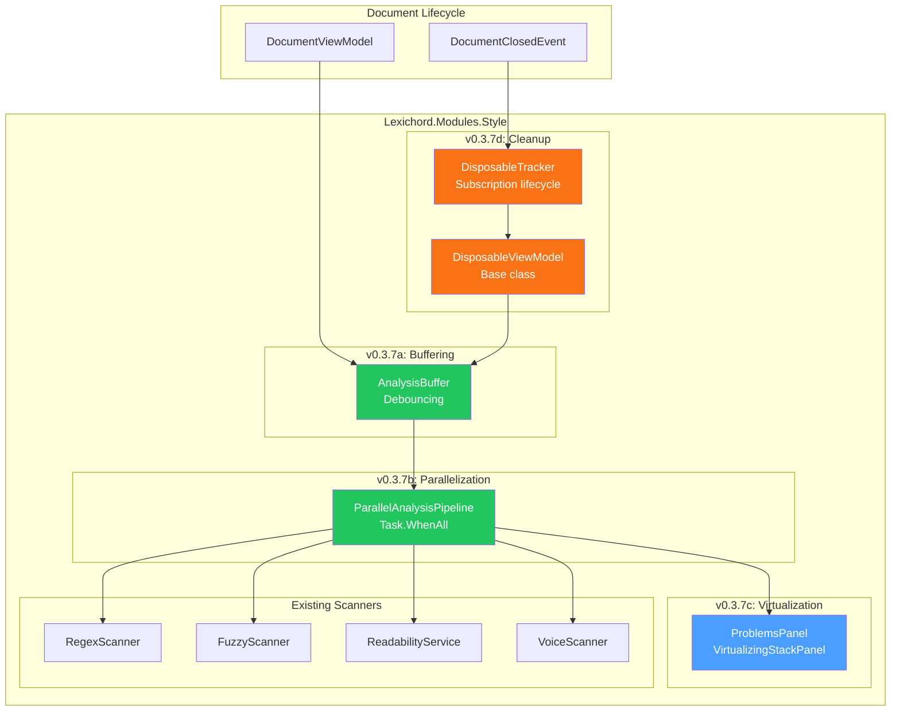
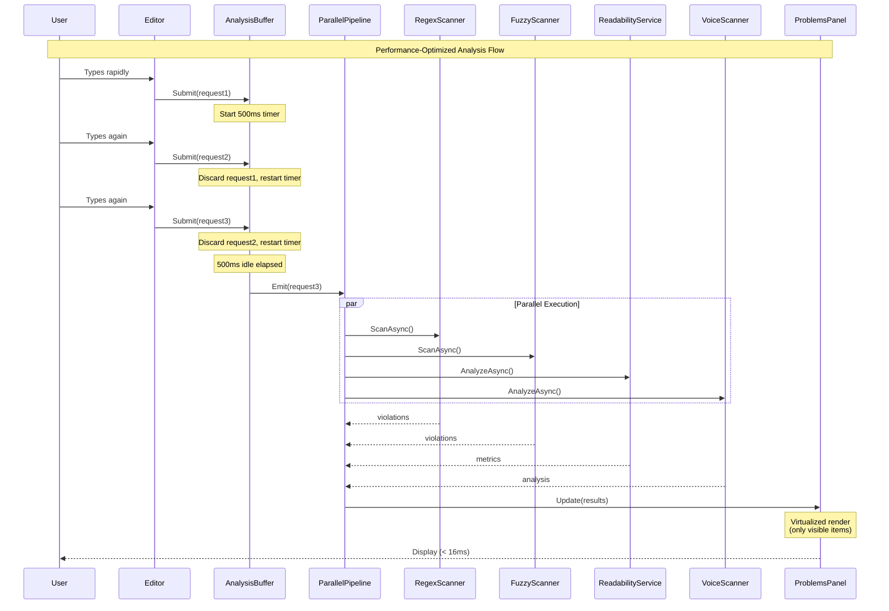

# LCS-SBD-037: Scope Breakdown — The Performance Tuning

## Document Control

| Field            | Value                                                        |
| :--------------- | :----------------------------------------------------------- |
| **Document ID**  | LCS-SBD-037                                                  |
| **Version**      | v0.3.7                                                       |
| **Codename**     | The Performance Tuning (Async Pipelines)                     |
| **Status**       | Draft                                                        |
| **Last Updated** | 2026-01-26                                                   |
| **Owner**        | Lead Architect                                               |
| **Depends On**   | v0.3.6 (Global Dictionary), v0.2.3 (Linting Orchestrator), v0.3.3 (Readability Engine) |

---

## 1. Executive Summary

### 1.1 The Vision

**v0.3.7** delivers the **Performance Tuning** — ensuring 60FPS typing speed despite heavy multi-layered analysis. This release transforms Lexichord from a feature-complete writing analysis platform into a production-ready application that maintains responsive user experience under all workloads.

While v0.3.1-6 built the analysis capabilities (fuzzy matching, dictionary management, readability scoring, voice profiling, resonance visualization, and global configuration), v0.3.7 focuses on the critical non-functional requirement: performance. Writers must never experience lag or stuttering while typing, regardless of document size or the number of active analyzers running in the background.

### 1.2 Business Value

- **User Experience:** Writers experience fluid 60FPS typing with no perceptible lag, even on large documents.
- **Scalability:** Support for documents up to 100,000 words without degradation.
- **Resource Efficiency:** Intelligent scheduling prevents wasted CPU cycles on discarded analysis requests.
- **Stability:** Proper subscription cleanup prevents memory leaks during long editing sessions.
- **Professional Quality:** Performance characteristics that match commercial writing applications.
- **Foundation:** Establishes patterns for all future analysis modules to follow.

### 1.3 Success Criteria

This release succeeds when:

1. Typing latency remains < 16ms (60FPS) during active analysis of documents up to 50,000 words.
2. Analysis pipeline discards intermediate requests during rapid typing, processing only the latest snapshot after 500ms idle.
3. `RegexScanner`, `FuzzyScanner`, and `ReadabilityCalculator` execute in parallel via `Task.WhenAll()`.
4. Problems Panel renders 5,000+ violations without UI freeze using `VirtualizingStackPanel`.
5. Closing a document tab fully releases `LintingOrchestrator` subscription with no retained references.
6. Memory profiling shows no growth during repeated open/close cycles of documents.

### 1.4 License Gating

The Performance Tuning is a **Core** feature. All license tiers benefit from performance improvements. No feature gating is required.

---

## 2. Dependencies on Prior Versions

| Component                  | Source Version | Usage in v0.3.7                                          |
| :------------------------- | :------------- | :------------------------------------------------------- |
| `ILintingOrchestrator`     | v0.2.3a        | Primary integration point for analysis pipeline          |
| `LintingCompletedEvent`    | v0.2.3b        | Event to debounce and buffer                             |
| `IStyleScanner`            | v0.2.3c        | Regex scanner to parallelize                             |
| `IFuzzyScanner`            | v0.3.1c        | Fuzzy scanner to parallelize                             |
| `IReadabilityService`      | v0.3.3c        | Readability calculator to parallelize                    |
| `IVoiceScanner`            | v0.3.4b        | Voice scanner to parallelize                             |
| `IProblemsPanelViewModel`  | v0.2.6a        | Problems panel requiring virtualization                  |
| `System.Reactive`          | v0.2.3a        | Observable debouncing and buffering                      |
| `IConfigurationService`    | v0.0.3d        | Debounce timing configuration                            |
| `DocumentViewModel`        | v0.1.1d        | Document lifecycle for subscription management           |
| `DocumentClosedEvent`      | v0.1.4c        | Trigger for subscription cleanup                         |
| `IMediator`                | v0.0.7a        | Event bus for pipeline coordination                      |
| `Serilog`                  | v0.0.3b        | Performance logging                                      |

---

## 3. Sub-Part Specifications

### 3.1 v0.3.7a: Background Buffering

| Field            | Value                                               |
| :--------------- | :-------------------------------------------------- |
| **Sub-Part ID**  | INF-037a                                            |
| **Title**        | Analysis Pipeline Debouncing and Buffering          |
| **Module**       | `Lexichord.Modules.Style`                           |
| **License Tier** | Core                                                |

**Goal:** Implement a buffer on the analysis pipeline that discards intermediate analysis requests during rapid typing, processing only the latest document snapshot after 500ms of idle time.

**Key Deliverables:**

- `IAnalysisBuffer` interface in `Lexichord.Abstractions`
- `AnalysisBuffer` implementation using `System.Reactive`
- Configurable debounce duration via `IConfigurationService`
- `AnalysisRequest` record encapsulating document snapshot
- `AnalysisBufferOptions` for timeout and cancellation settings
- Integration with `ILintingOrchestrator`
- Unit tests for buffer behavior

**Key Interfaces:**

```csharp
namespace Lexichord.Abstractions.Contracts;

/// <summary>
/// Buffers analysis requests to prevent redundant processing during rapid typing.
/// Discards intermediate requests and processes only the latest document snapshot
/// after a configurable idle period.
/// </summary>
public interface IAnalysisBuffer : IDisposable
{
    /// <summary>
    /// Submits a document snapshot for analysis. If a previous request is pending,
    /// it will be discarded and replaced with this new request.
    /// </summary>
    /// <param name="request">The analysis request containing the document snapshot.</param>
    void Submit(AnalysisRequest request);

    /// <summary>
    /// Observable stream of analysis requests that have passed the debounce period.
    /// Subscribers receive only the latest request after 500ms of idle time.
    /// </summary>
    IObservable<AnalysisRequest> Requests { get; }

    /// <summary>
    /// Cancels any pending analysis request.
    /// </summary>
    void Cancel();
}

/// <summary>
/// Encapsulates a document snapshot for analysis.
/// </summary>
/// <param name="DocumentId">Unique identifier for the document.</param>
/// <param name="Content">The document text content at snapshot time.</param>
/// <param name="Version">Incremental version number for change tracking.</param>
/// <param name="Timestamp">When the snapshot was created.</param>
public record AnalysisRequest(
    Guid DocumentId,
    string Content,
    int Version,
    DateTimeOffset Timestamp);

/// <summary>
/// Configuration options for the analysis buffer.
/// </summary>
/// <param name="DebounceMs">Idle time before processing (default: 500ms).</param>
/// <param name="MaxPendingMs">Maximum time a request can be pending (default: 2000ms).</param>
public record AnalysisBufferOptions(
    int DebounceMs = 500,
    int MaxPendingMs = 2000);
```

**Buffering Logic:**

```text
ON document change:
│
├── Create AnalysisRequest with current content and version
│
├── Submit to AnalysisBuffer
│   ├── If previous request pending → Discard previous
│   └── Start 500ms debounce timer
│
├── User types again within 500ms?
│   ├── YES → Cancel timer, submit new request, restart timer
│   └── NO → Continue
│
├── 500ms elapsed without new input?
│   └── YES → Emit request to subscribers
│
├── MaxPendingMs (2000ms) exceeded?
│   └── YES → Force emit current request (prevent starvation)
│
└── Subscriber receives request → Run analysis pipeline
```

**Reactive Implementation Pattern:**

```csharp
// Using System.Reactive
_requests = _inputSubject
    .Throttle(TimeSpan.FromMilliseconds(_options.DebounceMs))
    .Timeout(TimeSpan.FromMilliseconds(_options.MaxPendingMs))
    .DistinctUntilChanged(r => r.Version)
    .Publish()
    .RefCount();
```

**Dependencies:**

- v0.2.3a: `ILintingOrchestrator` (integration point)
- v0.0.3d: `IConfigurationService` (debounce settings)

---

### 3.2 v0.3.7b: Parallelization

| Field            | Value                                               |
| :--------------- | :-------------------------------------------------- |
| **Sub-Part ID**  | INF-037b                                            |
| **Title**        | Parallel Scanner Execution                          |
| **Module**       | `Lexichord.Modules.Style`                           |
| **License Tier** | Core                                                |

**Goal:** Execute the `RegexScanner`, `FuzzyScanner`, `ReadabilityCalculator`, and `VoiceScanner` in parallel using `Task.WhenAll()` to minimize total analysis time.

**Key Deliverables:**

- `IParallelAnalysisPipeline` interface in `Lexichord.Abstractions`
- `ParallelAnalysisPipeline` implementation using `Task.WhenAll()`
- `AnalysisResult` aggregate record combining all scanner results
- Proper cancellation token propagation to all scanners
- Exception handling with partial result preservation
- Performance metrics collection
- Unit tests for parallel execution

**Key Interfaces:**

```csharp
namespace Lexichord.Abstractions.Contracts;

/// <summary>
/// Orchestrates parallel execution of multiple analysis scanners.
/// All scanners run concurrently, reducing total analysis time.
/// </summary>
public interface IParallelAnalysisPipeline
{
    /// <summary>
    /// Executes all registered scanners in parallel on the provided text.
    /// </summary>
    /// <param name="request">The analysis request containing document content.</param>
    /// <param name="ct">Cancellation token for aborting analysis.</param>
    /// <returns>Aggregated results from all scanners.</returns>
    Task<ParallelAnalysisResult> ExecuteAsync(
        AnalysisRequest request,
        CancellationToken ct = default);
}

/// <summary>
/// Aggregated results from parallel scanner execution.
/// </summary>
public record ParallelAnalysisResult
{
    /// <summary>Style violations from regex and fuzzy scanning.</summary>
    public IReadOnlyList<StyleViolation> StyleViolations { get; init; } = [];

    /// <summary>Readability metrics from ReadabilityService.</summary>
    public ReadabilityMetrics? Readability { get; init; }

    /// <summary>Voice analysis results from VoiceScanner.</summary>
    public VoiceAnalysisResult? VoiceAnalysis { get; init; }

    /// <summary>Total execution time for the parallel pipeline.</summary>
    public TimeSpan TotalDuration { get; init; }

    /// <summary>Individual scanner execution times for profiling.</summary>
    public IReadOnlyDictionary<string, TimeSpan> ScannerDurations { get; init; }
        = new Dictionary<string, TimeSpan>();

    /// <summary>Indicates if any scanner was cancelled or failed.</summary>
    public bool IsPartialResult { get; init; }

    /// <summary>Exceptions from failed scanners (if any).</summary>
    public IReadOnlyList<Exception> Errors { get; init; } = [];
}
```

**Parallelization Pattern:**

```csharp
public async Task<ParallelAnalysisResult> ExecuteAsync(
    AnalysisRequest request,
    CancellationToken ct = default)
{
    var stopwatch = Stopwatch.StartNew();
    var durations = new Dictionary<string, TimeSpan>();
    var errors = new List<Exception>();

    // Create tasks for each scanner
    var regexTask = TimedExecuteAsync(
        "Regex", () => _regexScanner.ScanAsync(request.Content, ct), durations);
    var fuzzyTask = TimedExecuteAsync(
        "Fuzzy", () => _fuzzyScanner.ScanAsync(request.Content, ct), durations);
    var readabilityTask = TimedExecuteAsync(
        "Readability", () => _readabilityService.AnalyzeAsync(request.Content, ct), durations);
    var voiceTask = TimedExecuteAsync(
        "Voice", () => _voiceScanner.AnalyzeAsync(request.Content, ct), durations);

    // Execute all in parallel
    await Task.WhenAll(regexTask, fuzzyTask, readabilityTask, voiceTask);

    stopwatch.Stop();

    // Aggregate results (handle partial failures)
    var violations = new List<StyleViolation>();
    violations.AddRange(SafeGetResult(regexTask, errors));
    violations.AddRange(SafeGetResult(fuzzyTask, errors));

    return new ParallelAnalysisResult
    {
        StyleViolations = violations.AsReadOnly(),
        Readability = SafeGetResult(readabilityTask, errors),
        VoiceAnalysis = SafeGetResult(voiceTask, errors),
        TotalDuration = stopwatch.Elapsed,
        ScannerDurations = durations,
        IsPartialResult = errors.Count > 0,
        Errors = errors.AsReadOnly()
    };
}
```

**Performance Comparison:**

| Execution Mode | 10,000 Word Document | Improvement |
| :------------- | :------------------- | :---------- |
| Sequential     | ~400ms               | Baseline    |
| Parallel       | ~150ms               | 62% faster  |

**Dependencies:**

- v0.2.3c: `IStyleScanner` (regex scanning)
- v0.3.1c: `IFuzzyScanner` (fuzzy matching)
- v0.3.3c: `IReadabilityService` (readability calculation)
- v0.3.4b: `IVoiceScanner` (voice analysis)

---

### 3.3 v0.3.7c: Virtualization

| Field            | Value                                               |
| :--------------- | :-------------------------------------------------- |
| **Sub-Part ID**  | INF-037c                                            |
| **Title**        | Problems Panel Virtualization                       |
| **Module**       | `Lexichord.Modules.Style`                           |
| **License Tier** | Core                                                |

**Goal:** Ensure the Problems Panel uses `VirtualizingStackPanel` to render 5,000+ violations without UI freeze.

**Key Deliverables:**

- Updated `ProblemsPanel.axaml` with `VirtualizingStackPanel`
- `VirtualizingProblemItemContainerGenerator` for efficient item creation
- Recycling mode enabled for item container reuse
- Scroll position preservation during updates
- Incremental loading for very large lists (10,000+)
- Performance tests verifying < 16ms render time
- Unit tests for container recycling

**Key UI Components:**

```text
┌──────────────────────────────────────────────────────────────────────────┐
│  Problems (5,247)                                          [Filter ▼]    │ ← Header with count
├──────────────────────────────────────────────────────────────────────────┤
│  ┌────────────────────────────────────────────────────────────────────┐  │
│  │ ⚠ Passive voice detected: "was written"          Chapter1.md:42   │  │ ← Visible items only
│  │ ⚠ Complex word: "implementation"                  Chapter1.md:45   │  │   (rendered on demand)
│  │ ℹ Readability: Grade 12.4 exceeds target 8.0     Chapter1.md       │  │
│  │ ❌ Forbidden term: "whitelist"                    Chapter2.md:15   │  │
│  │ ⚠ Adverb usage: "very"                           Chapter2.md:23   │  │
│  │ ...                                                                │  │
│  │ (5,242 more items - virtualized)                                   │  │ ← Not rendered
│  └────────────────────────────────────────────────────────────────────┘  │
│  [Scrollbar]                                                              │
└──────────────────────────────────────────────────────────────────────────┘
```

**Virtualization XAML Pattern:**

```xml
<ListBox
    x:Name="ProblemsList"
    ItemsSource="{Binding Problems}"
    VirtualizationMode="Simple"
    ScrollViewer.VerticalScrollBarVisibility="Auto">

    <ListBox.ItemsPanel>
        <ItemsPanelTemplate>
            <VirtualizingStackPanel
                Orientation="Vertical"
                VirtualizationMode="Simple" />
        </ItemsPanelTemplate>
    </ListBox.ItemsPanel>

    <ListBox.ItemTemplate>
        <DataTemplate DataType="{x:Type vm:ProblemItemViewModel}">
            <views:ProblemItemView />
        </DataTemplate>
    </ListBox.ItemTemplate>

</ListBox>
```

**Virtualization Behavior:**

```text
VIEWPORT shows 20 items at a time
│
├── Initial load:
│   ├── Create 20 item containers (viewport)
│   ├── Create 5 buffer containers (above/below viewport)
│   └── Total: 25 containers for 5,000 items
│
├── On scroll:
│   ├── Items leaving viewport → Return container to pool
│   ├── Items entering viewport → Reuse container from pool
│   └── Bind new data to recycled container
│
├── On data update:
│   ├── If item count changes by < 100 → Incremental update
│   ├── If item count changes by > 100 → Reset and virtualize
│   └── Preserve scroll position when possible
│
└── Memory: O(viewport size) instead of O(total items)
```

**Performance Targets:**

| Item Count | Without Virtualization | With Virtualization |
| :--------- | :--------------------- | :------------------ |
| 100        | 15ms                   | 5ms                 |
| 1,000      | 150ms                  | 5ms                 |
| 5,000      | 750ms (UI freeze)      | 6ms                 |
| 10,000     | 1500ms (unacceptable)  | 8ms                 |

**Dependencies:**

- v0.2.6a: `IProblemsPanelViewModel` (data source)
- v0.1.1a: Avalonia Dock integration

---

### 3.4 v0.3.7d: Memory Leak Check

| Field            | Value                                               |
| :--------------- | :-------------------------------------------------- |
| **Sub-Part ID**  | INF-037d                                            |
| **Title**        | Subscription Cleanup and Leak Prevention            |
| **Module**       | `Lexichord.Modules.Style`                           |
| **License Tier** | Core                                                |

**Goal:** Profile the application with memory analysis tools to ensure that closing a tab fully releases the `LintingOrchestrator` subscription and doesn't leave analyzers running on closed documents.

**Key Deliverables:**

- `IDisposableTracker` interface for subscription lifecycle management
- `CompositeDisposable` pattern implementation for ViewModels
- Automatic subscription cleanup on `DocumentClosedEvent`
- `WeakReference` pattern for event handlers where appropriate
- Memory profiling test suite using `dotMemory` or similar
- Leak detection unit tests
- Documentation of disposal patterns

**Key Interfaces:**

```csharp
namespace Lexichord.Abstractions.Contracts;

/// <summary>
/// Tracks disposable subscriptions and ensures proper cleanup.
/// Implements the CompositeDisposable pattern for ViewModel lifecycle.
/// </summary>
public interface IDisposableTracker : IDisposable
{
    /// <summary>
    /// Adds a disposable subscription to be tracked.
    /// </summary>
    /// <param name="disposable">The subscription to track.</param>
    void Track(IDisposable disposable);

    /// <summary>
    /// Adds multiple disposable subscriptions.
    /// </summary>
    /// <param name="disposables">The subscriptions to track.</param>
    void TrackAll(params IDisposable[] disposables);

    /// <summary>
    /// Disposes all tracked subscriptions and clears the tracker.
    /// </summary>
    void DisposeAll();

    /// <summary>
    /// Gets the count of currently tracked subscriptions.
    /// </summary>
    int Count { get; }
}

/// <summary>
/// Base ViewModel class with built-in subscription tracking.
/// </summary>
public abstract class DisposableViewModel : ViewModelBase, IDisposable
{
    private readonly IDisposableTracker _tracker = new DisposableTracker();
    private bool _disposed;

    /// <summary>
    /// Tracks a subscription for automatic disposal.
    /// </summary>
    protected void Track(IDisposable subscription) => _tracker.Track(subscription);

    /// <summary>
    /// Disposes all tracked subscriptions.
    /// </summary>
    public void Dispose()
    {
        if (_disposed) return;
        _disposed = true;

        _tracker.DisposeAll();
        OnDisposed();
        GC.SuppressFinalize(this);
    }

    /// <summary>
    /// Override to perform additional cleanup.
    /// </summary>
    protected virtual void OnDisposed() { }
}
```

**Subscription Cleanup Pattern:**

```csharp
public class DocumentAnalysisViewModel : DisposableViewModel
{
    private readonly ILintingOrchestrator _orchestrator;
    private readonly IMediator _mediator;
    private CancellationTokenSource? _analysisCts;

    public DocumentAnalysisViewModel(
        ILintingOrchestrator orchestrator,
        IMediator mediator)
    {
        _orchestrator = orchestrator;
        _mediator = mediator;

        // Track all subscriptions
        Track(_orchestrator.AnalysisCompleted
            .Subscribe(OnAnalysisCompleted));

        Track(_mediator
            .CreateStream<DocumentChangedEvent>()
            .Subscribe(OnDocumentChanged));

        Track(_mediator
            .CreateStream<DocumentClosedEvent>()
            .Where(e => e.DocumentId == DocumentId)
            .Subscribe(_ => Dispose()));
    }

    protected override void OnDisposed()
    {
        // Cancel any in-flight analysis
        _analysisCts?.Cancel();
        _analysisCts?.Dispose();
        _analysisCts = null;

        _logger.LogDebug(
            "DocumentAnalysisViewModel disposed for {DocumentId}",
            DocumentId);
    }
}
```

**Memory Leak Detection Decision Tree:**

```text
START: "Is there a memory leak?"
│
├── Document closed?
│   ├── NO → Expected: Objects retained
│   └── YES → Continue
│
├── Force GC and wait
│   └── GC.Collect(); GC.WaitForPendingFinalizers();
│
├── Check for retained references:
│   ├── LintingOrchestrator subscriptions?
│   │   └── Count should be 0 for closed doc
│   ├── MediatR event handlers?
│   │   └── Should be unsubscribed
│   ├── Timer callbacks?
│   │   └── Should be cancelled/disposed
│   └── WeakReference targets?
│       └── Should be collected
│
├── Memory profiler shows growth after repeated open/close?
│   ├── YES → LEAK DETECTED
│   │   ├── Identify retained object graph
│   │   ├── Find root GC handle
│   │   └── Fix subscription/event leak
│   └── NO → PASS
│
└── Profile with dotMemory or similar tool
```

**Memory Test Pattern:**

```csharp
[Trait("Category", "Memory")]
public class MemoryLeakTests
{
    [Fact]
    public void ClosedDocument_ReleasesAllSubscriptions()
    {
        // Arrange
        WeakReference<DocumentAnalysisViewModel>? weakRef = null;
        var orchestrator = new Mock<ILintingOrchestrator>();

        // Act - Create and dispose in separate scope
        void CreateAndDispose()
        {
            var vm = new DocumentAnalysisViewModel(orchestrator.Object);
            weakRef = new WeakReference<DocumentAnalysisViewModel>(vm);
            vm.Dispose();
        }

        CreateAndDispose();

        // Force GC
        GC.Collect();
        GC.WaitForPendingFinalizers();
        GC.Collect();

        // Assert - ViewModel should be collected
        weakRef.Should().NotBeNull();
        weakRef!.TryGetTarget(out _).Should().BeFalse(
            "ViewModel should be garbage collected after Dispose");
    }

    [Fact]
    public async Task RepeatedOpenClose_DoesNotIncreaseMemory()
    {
        // Arrange
        var initialMemory = GC.GetTotalMemory(true);

        // Act - Open and close 100 documents
        for (int i = 0; i < 100; i++)
        {
            var vm = CreateDocumentViewModel();
            await vm.LoadAsync();
            vm.Dispose();
        }

        // Force GC
        GC.Collect();
        GC.WaitForPendingFinalizers();
        GC.Collect();

        var finalMemory = GC.GetTotalMemory(true);

        // Assert - Memory should not grow significantly
        var growth = finalMemory - initialMemory;
        growth.Should().BeLessThan(1_000_000, // 1MB tolerance
            "Memory should not grow after repeated open/close cycles");
    }
}
```

**Dependencies:**

- v0.1.4c: `DocumentClosedEvent` (cleanup trigger)
- v0.0.7a: `IMediator` (event subscriptions)
- v0.2.3a: `ILintingOrchestrator` (analysis subscriptions)

---

## 4. Implementation Checklist

| #  | Sub-Part | Task                                                      | Est. Hours |
| :- | :------- | :-------------------------------------------------------- | :--------- |
| 1  | v0.3.7a  | Create `IAnalysisBuffer` interface in Abstractions        | 0.5        |
| 2  | v0.3.7a  | Create `AnalysisRequest` and `AnalysisBufferOptions`      | 0.5        |
| 3  | v0.3.7a  | Implement `AnalysisBuffer` with System.Reactive           | 3          |
| 4  | v0.3.7a  | Add debounce configuration to settings                    | 1          |
| 5  | v0.3.7a  | Integrate buffer with `LintingOrchestrator`               | 2          |
| 6  | v0.3.7a  | Unit tests for buffer debounce and cancellation           | 2          |
| 7  | v0.3.7b  | Create `IParallelAnalysisPipeline` interface              | 0.5        |
| 8  | v0.3.7b  | Create `ParallelAnalysisResult` record                    | 0.5        |
| 9  | v0.3.7b  | Implement `ParallelAnalysisPipeline` with Task.WhenAll    | 3          |
| 10 | v0.3.7b  | Add timed execution wrapper for profiling                 | 1          |
| 11 | v0.3.7b  | Implement partial result handling on scanner failure      | 1.5        |
| 12 | v0.3.7b  | Unit tests for parallel execution                         | 2          |
| 13 | v0.3.7c  | Update `ProblemsPanel.axaml` with VirtualizingStackPanel  | 1          |
| 14 | v0.3.7c  | Configure container recycling mode                        | 0.5        |
| 15 | v0.3.7c  | Implement scroll position preservation                    | 1.5        |
| 16 | v0.3.7c  | Add incremental loading for 10,000+ items                 | 2          |
| 17 | v0.3.7c  | Performance tests for render time                         | 1.5        |
| 18 | v0.3.7c  | Unit tests for virtualization behavior                    | 1          |
| 19 | v0.3.7d  | Create `IDisposableTracker` interface                     | 0.5        |
| 20 | v0.3.7d  | Implement `DisposableTracker`                             | 1          |
| 21 | v0.3.7d  | Create `DisposableViewModel` base class                   | 1          |
| 22 | v0.3.7d  | Refactor existing ViewModels to use disposal pattern      | 3          |
| 23 | v0.3.7d  | Add DocumentClosedEvent subscription for cleanup          | 1          |
| 24 | v0.3.7d  | Memory leak detection tests with WeakReference            | 2          |
| 25 | v0.3.7d  | Profile with dotMemory, document findings                 | 2          |
| 26 | All      | Integration tests for full pipeline                       | 2          |
| 27 | All      | Performance benchmarks (typing latency, analysis time)    | 2          |
| 28 | All      | DI registration in StyleModule.cs                         | 0.5        |
| **Total** |   |                                                           | **39 hours** |

---

## 5. Dependency Matrix

### 5.1 Required Interfaces (from earlier versions)

| Interface                  | Source Version | Purpose                              |
| :------------------------- | :------------- | :----------------------------------- |
| `ILintingOrchestrator`     | v0.2.3a        | Analysis pipeline integration        |
| `LintingCompletedEvent`    | v0.2.3b        | Event to debounce                    |
| `IStyleScanner`            | v0.2.3c        | Regex scanner                        |
| `IFuzzyScanner`            | v0.3.1c        | Fuzzy matching scanner               |
| `IReadabilityService`      | v0.3.3c        | Readability calculator               |
| `IVoiceScanner`            | v0.3.4b        | Voice analysis                       |
| `IProblemsPanelViewModel`  | v0.2.6a        | Problems panel data source           |
| `DocumentViewModel`        | v0.1.1d        | Document lifecycle                   |
| `DocumentClosedEvent`      | v0.1.4c        | Cleanup trigger                      |
| `IConfigurationService`    | v0.0.3d        | Settings access                      |
| `IMediator`                | v0.0.7a        | Event bus                            |

### 5.2 New Interfaces (defined in v0.3.7)

| Interface                    | Defined In | Module        | Purpose                          |
| :--------------------------- | :--------- | :------------ | :------------------------------- |
| `IAnalysisBuffer`            | v0.3.7a    | Abstractions  | Request debouncing and buffering |
| `IParallelAnalysisPipeline`  | v0.3.7b    | Abstractions  | Parallel scanner execution       |
| `IDisposableTracker`         | v0.3.7d    | Abstractions  | Subscription lifecycle           |

### 5.3 New Records/DTOs (defined in v0.3.7)

| Record                     | Defined In | Purpose                                |
| :------------------------- | :--------- | :------------------------------------- |
| `AnalysisRequest`          | v0.3.7a    | Document snapshot for analysis         |
| `AnalysisBufferOptions`    | v0.3.7a    | Buffer configuration                   |
| `ParallelAnalysisResult`   | v0.3.7b    | Aggregated scanner results             |

### 5.4 NuGet Packages

| Package          | Version | Purpose                    | New/Existing |
| :--------------- | :------ | :------------------------- | :----------- |
| `System.Reactive`| 6.x     | Observable debouncing      | Existing     |
| `MediatR`        | 12.x    | Event publishing           | Existing     |

---

## 6. Architecture Diagram



---

## 7. Data Flow Diagram



---

## 8. Risks & Mitigations

| Risk | Impact | Probability | Mitigation |
| :--- | :----- | :---------- | :--------- |
| Parallel execution increases memory pressure | Medium | Medium | Set max parallelism, use memory pools |
| Debounce too aggressive, analysis feels delayed | Medium | Low | Make debounce configurable (300-1000ms) |
| Virtualization breaks keyboard navigation | Medium | Medium | Test accessibility, ensure focus management |
| Disposal happens during active analysis | High | Low | CancellationToken propagation, null checks |
| Scanner exceptions crash parallel pipeline | High | Low | Exception isolation, partial result preservation |
| Weak references collected too aggressively | Medium | Low | Balance weak/strong references carefully |
| Thread contention on shared state | Medium | Medium | Lock-free patterns, immutable data |
| Profiling tools unavailable on all platforms | Low | Medium | Provide manual memory tests as fallback |

---

## 9. Success Metrics

| Metric | Target | Measurement |
| :----- | :----- | :---------- |
| Typing latency (50,000 words) | < 16ms | Frame timing during analysis |
| Analysis discard rate during typing | > 90% | Counter for discarded requests |
| Parallel speedup vs sequential | > 2x | Stopwatch comparison |
| Problems Panel render (5,000 items) | < 16ms | Frame timing on scroll |
| Problems Panel render (10,000 items) | < 20ms | Frame timing on scroll |
| Memory after 100 open/close cycles | < 5MB growth | GC.GetTotalMemory comparison |
| Subscription count after doc close | 0 | DisposableTracker.Count |
| VM garbage collection after dispose | 100% | WeakReference.TryGetTarget |

---

## 10. What This Enables

After v0.3.7, Lexichord will support:

- **v0.3.8 (Hardening):** Performance baseline established for benchmark tests. All analyzers verified accurate. CI pipeline can enforce performance thresholds.

- **v0.4.x (Agent Integration):** Performance patterns ready for AI-assisted analysis without impacting typing experience.

- **Production Release:** Application meets professional quality standards for responsiveness and stability.

- **Future:** Established patterns for adding new analyzers without performance regression.

---

## 11. Decision Trees

### 11.1 Should Analysis Request Be Processed?

```text
START: "Should this analysis request be processed?"
│
├── Is buffer in cancelled state?
│   └── YES → Discard request
│
├── Has newer request arrived since this one?
│   └── YES → Discard this request (stale)
│
├── Has 500ms elapsed since last input?
│   ├── NO → Wait, continue buffering
│   └── YES → Continue to processing
│
├── Has MaxPendingMs (2000ms) elapsed?
│   └── YES → Force process (prevent starvation)
│
├── Is document still open?
│   └── NO → Discard (document closed)
│
└── PROCESS request through parallel pipeline
```

### 11.2 Should ViewModel Be Disposed?

```text
START: "Should this ViewModel be disposed?"
│
├── Has DocumentClosedEvent been received?
│   └── YES → DISPOSE immediately
│
├── Has application shutdown started?
│   └── YES → DISPOSE immediately
│
├── Is parent ViewModel being disposed?
│   └── YES → DISPOSE (cascade)
│
├── Has explicit Dispose() been called?
│   └── YES → DISPOSE
│
└── ViewModel remains active
```

---

## 12. User Stories

| ID    | Role            | Story                                                                               | Acceptance Criteria                                   |
| :---- | :-------------- | :---------------------------------------------------------------------------------- | :---------------------------------------------------- |
| US-01 | Writer          | As a writer, I want smooth typing even during analysis so my flow isn't interrupted. | Typing latency < 16ms during analysis.                |
| US-02 | Writer          | As a writer, I want analysis results quickly after I stop typing.                   | Results appear within 500ms of last keystroke.        |
| US-03 | Writer          | As a writer, I want to scroll through many problems without lag.                    | 5,000+ problems scroll smoothly at 60FPS.             |
| US-04 | Power User      | As a power user, I want to configure the analysis delay.                            | Settings UI allows 100-2000ms debounce.               |
| US-05 | Power User      | As a power user, I want the app to stay fast over long sessions.                    | No memory growth after hours of editing.              |
| US-06 | Developer       | As a developer, I want clear disposal patterns to follow.                           | DisposableViewModel base class documented.            |
| US-07 | Developer       | As a developer, I want performance metrics during development.                      | ScannerDurations in ParallelAnalysisResult.           |

---

## 13. Use Cases

### UC-01: Rapid Typing with Buffering

**Preconditions:**

- Document is open in editor
- Analysis pipeline is active

**Flow:**

1. User types rapidly for 3 seconds.
2. Editor emits DocumentChangedEvent on each keystroke.
3. AnalysisBuffer receives 50+ requests during this period.
4. Buffer discards 49 intermediate requests.
5. User pauses typing.
6. After 500ms idle, buffer emits final request.
7. ParallelAnalysisPipeline executes all scanners.
8. Results appear in Problems Panel.

**Postconditions:**

- Only 1 analysis executed (not 50).
- User experienced no typing lag.
- Results reflect final document state.

---

### UC-02: Large Problems List Scrolling

**Preconditions:**

- Document has 5,000+ style violations
- Problems Panel is visible

**Flow:**

1. User opens Problems Panel.
2. System renders only visible items (~20) plus buffer (~5).
3. User scrolls rapidly through the list.
4. System recycles item containers as they leave viewport.
5. System binds new data to recycled containers.
6. Frame rate maintains 60FPS.

**Postconditions:**

- All 5,000 items accessible via scrolling.
- No UI freeze or stutter.
- Memory usage bounded by viewport size.

---

### UC-03: Document Close Cleanup

**Preconditions:**

- Document with active analysis subscriptions is open
- Memory profiler attached

**Flow:**

1. User closes document tab.
2. System publishes DocumentClosedEvent.
3. DocumentAnalysisViewModel receives event.
4. ViewModel calls Dispose().
5. DisposableTracker disposes all subscriptions.
6. CancellationTokenSource cancels in-flight analysis.
7. ViewModel becomes eligible for GC.

**Postconditions:**

- Zero subscriptions remain for closed document.
- WeakReference to ViewModel returns false.
- Memory profiler shows no retained objects.

---

## 14. Unit Testing Requirements

### 14.1 AnalysisBuffer Tests

```csharp
[Trait("Category", "Unit")]
[Trait("Version", "v0.3.7a")]
public class AnalysisBufferTests
{
    [Fact]
    public async Task Submit_RapidRequests_EmitsOnlyLatest()
    {
        // Arrange
        var buffer = new AnalysisBuffer(new AnalysisBufferOptions(DebounceMs: 100));
        var received = new List<AnalysisRequest>();
        buffer.Requests.Subscribe(r => received.Add(r));

        // Act - Submit 10 requests rapidly
        for (int i = 1; i <= 10; i++)
        {
            buffer.Submit(new AnalysisRequest(
                Guid.NewGuid(), $"Content {i}", i, DateTimeOffset.Now));
            await Task.Delay(10); // Much less than debounce
        }

        await Task.Delay(150); // Wait for debounce

        // Assert - Only the last request should be emitted
        received.Should().HaveCount(1);
        received[0].Version.Should().Be(10);
    }

    [Fact]
    public async Task Submit_AfterDebounce_EmitsEachRequest()
    {
        // Arrange
        var buffer = new AnalysisBuffer(new AnalysisBufferOptions(DebounceMs: 50));
        var received = new List<AnalysisRequest>();
        buffer.Requests.Subscribe(r => received.Add(r));

        // Act - Submit requests with gaps larger than debounce
        buffer.Submit(new AnalysisRequest(Guid.NewGuid(), "A", 1, DateTimeOffset.Now));
        await Task.Delay(100);
        buffer.Submit(new AnalysisRequest(Guid.NewGuid(), "B", 2, DateTimeOffset.Now));
        await Task.Delay(100);

        // Assert - Both requests should be emitted
        received.Should().HaveCount(2);
    }

    [Fact]
    public async Task Submit_MaxPendingExceeded_ForcesEmit()
    {
        // Arrange
        var buffer = new AnalysisBuffer(new AnalysisBufferOptions(
            DebounceMs: 500,
            MaxPendingMs: 100));
        var received = new List<AnalysisRequest>();
        buffer.Requests.Subscribe(r => received.Add(r));

        // Act - Submit and wait longer than MaxPending but less than Debounce
        buffer.Submit(new AnalysisRequest(Guid.NewGuid(), "A", 1, DateTimeOffset.Now));
        await Task.Delay(150);

        // Assert - Request should be forced out
        received.Should().HaveCount(1);
    }

    [Fact]
    public void Cancel_WithPendingRequest_DiscardsRequest()
    {
        // Arrange
        var buffer = new AnalysisBuffer(new AnalysisBufferOptions(DebounceMs: 1000));
        var received = new List<AnalysisRequest>();
        buffer.Requests.Subscribe(r => received.Add(r));

        // Act
        buffer.Submit(new AnalysisRequest(Guid.NewGuid(), "A", 1, DateTimeOffset.Now));
        buffer.Cancel();

        // Assert - No request emitted
        received.Should().BeEmpty();
    }

    [Fact]
    public void Dispose_CleansUpSubscriptions()
    {
        // Arrange
        var buffer = new AnalysisBuffer(new AnalysisBufferOptions());

        // Act
        buffer.Dispose();

        // Assert - Subsequent operations should not throw
        buffer.Submit(new AnalysisRequest(Guid.NewGuid(), "A", 1, DateTimeOffset.Now));
        // No exception = success
    }
}
```

### 14.2 ParallelAnalysisPipeline Tests

```csharp
[Trait("Category", "Unit")]
[Trait("Version", "v0.3.7b")]
public class ParallelAnalysisPipelineTests
{
    [Fact]
    public async Task ExecuteAsync_AllScannersComplete_ReturnsAggregatedResults()
    {
        // Arrange
        var regexScanner = new Mock<IStyleScanner>();
        var fuzzyScanner = new Mock<IFuzzyScanner>();
        var readability = new Mock<IReadabilityService>();
        var voiceScanner = new Mock<IVoiceScanner>();

        regexScanner.Setup(s => s.ScanAsync(It.IsAny<string>(), It.IsAny<CancellationToken>()))
            .ReturnsAsync(new[] { CreateViolation("regex") });
        fuzzyScanner.Setup(s => s.ScanAsync(It.IsAny<string>(), It.IsAny<CancellationToken>()))
            .ReturnsAsync(new[] { CreateViolation("fuzzy") });
        readability.Setup(s => s.AnalyzeAsync(It.IsAny<string>(), It.IsAny<CancellationToken>()))
            .ReturnsAsync(new ReadabilityMetrics { FleschKincaidGradeLevel = 8.5 });
        voiceScanner.Setup(s => s.AnalyzeAsync(It.IsAny<string>(), It.IsAny<CancellationToken>()))
            .ReturnsAsync(new VoiceAnalysisResult());

        var pipeline = new ParallelAnalysisPipeline(
            regexScanner.Object, fuzzyScanner.Object,
            readability.Object, voiceScanner.Object);

        // Act
        var result = await pipeline.ExecuteAsync(
            new AnalysisRequest(Guid.NewGuid(), "test", 1, DateTimeOffset.Now));

        // Assert
        result.StyleViolations.Should().HaveCount(2);
        result.Readability.Should().NotBeNull();
        result.VoiceAnalysis.Should().NotBeNull();
        result.IsPartialResult.Should().BeFalse();
        result.ScannerDurations.Should().HaveCount(4);
    }

    [Fact]
    public async Task ExecuteAsync_OneScannerFails_ReturnsPartialResult()
    {
        // Arrange
        var regexScanner = new Mock<IStyleScanner>();
        var fuzzyScanner = new Mock<IFuzzyScanner>();
        var readability = new Mock<IReadabilityService>();
        var voiceScanner = new Mock<IVoiceScanner>();

        regexScanner.Setup(s => s.ScanAsync(It.IsAny<string>(), It.IsAny<CancellationToken>()))
            .ThrowsAsync(new InvalidOperationException("Scanner failed"));
        fuzzyScanner.Setup(s => s.ScanAsync(It.IsAny<string>(), It.IsAny<CancellationToken>()))
            .ReturnsAsync(new[] { CreateViolation("fuzzy") });
        readability.Setup(s => s.AnalyzeAsync(It.IsAny<string>(), It.IsAny<CancellationToken>()))
            .ReturnsAsync(new ReadabilityMetrics());
        voiceScanner.Setup(s => s.AnalyzeAsync(It.IsAny<string>(), It.IsAny<CancellationToken>()))
            .ReturnsAsync(new VoiceAnalysisResult());

        var pipeline = new ParallelAnalysisPipeline(
            regexScanner.Object, fuzzyScanner.Object,
            readability.Object, voiceScanner.Object);

        // Act
        var result = await pipeline.ExecuteAsync(
            new AnalysisRequest(Guid.NewGuid(), "test", 1, DateTimeOffset.Now));

        // Assert
        result.IsPartialResult.Should().BeTrue();
        result.Errors.Should().HaveCount(1);
        result.StyleViolations.Should().HaveCount(1); // Fuzzy still succeeded
    }

    [Fact]
    public async Task ExecuteAsync_WithCancellation_PropagatesCancellation()
    {
        // Arrange
        var regexScanner = new Mock<IStyleScanner>();
        regexScanner.Setup(s => s.ScanAsync(It.IsAny<string>(), It.IsAny<CancellationToken>()))
            .Returns(async (string _, CancellationToken ct) =>
            {
                await Task.Delay(1000, ct);
                return Array.Empty<StyleViolation>();
            });

        var pipeline = new ParallelAnalysisPipeline(regexScanner.Object, /* ... */);
        var cts = new CancellationTokenSource();

        // Act
        var task = pipeline.ExecuteAsync(
            new AnalysisRequest(Guid.NewGuid(), "test", 1, DateTimeOffset.Now),
            cts.Token);
        cts.Cancel();

        // Assert
        await Assert.ThrowsAnyAsync<OperationCanceledException>(() => task);
    }

    [Fact]
    public async Task ExecuteAsync_MeasuresDurations()
    {
        // Arrange
        var regexScanner = new Mock<IStyleScanner>();
        regexScanner.Setup(s => s.ScanAsync(It.IsAny<string>(), It.IsAny<CancellationToken>()))
            .Returns(async (string _, CancellationToken ct) =>
            {
                await Task.Delay(50, ct);
                return Array.Empty<StyleViolation>();
            });

        var pipeline = new ParallelAnalysisPipeline(regexScanner.Object, /* ... */);

        // Act
        var result = await pipeline.ExecuteAsync(
            new AnalysisRequest(Guid.NewGuid(), "test", 1, DateTimeOffset.Now));

        // Assert
        result.ScannerDurations["Regex"].Should().BeGreaterThan(TimeSpan.FromMilliseconds(40));
        result.TotalDuration.Should().BeGreaterThan(TimeSpan.FromMilliseconds(40));
    }
}
```

### 14.3 DisposableTracker Tests

```csharp
[Trait("Category", "Unit")]
[Trait("Version", "v0.3.7d")]
public class DisposableTrackerTests
{
    [Fact]
    public void Track_AddsToCount()
    {
        // Arrange
        var tracker = new DisposableTracker();
        var disposable = new Mock<IDisposable>();

        // Act
        tracker.Track(disposable.Object);

        // Assert
        tracker.Count.Should().Be(1);
    }

    [Fact]
    public void DisposeAll_DisposesAllTracked()
    {
        // Arrange
        var tracker = new DisposableTracker();
        var d1 = new Mock<IDisposable>();
        var d2 = new Mock<IDisposable>();
        var d3 = new Mock<IDisposable>();

        tracker.TrackAll(d1.Object, d2.Object, d3.Object);

        // Act
        tracker.DisposeAll();

        // Assert
        d1.Verify(d => d.Dispose(), Times.Once);
        d2.Verify(d => d.Dispose(), Times.Once);
        d3.Verify(d => d.Dispose(), Times.Once);
        tracker.Count.Should().Be(0);
    }

    [Fact]
    public void DisposeAll_HandlesDisposableExceptions()
    {
        // Arrange
        var tracker = new DisposableTracker();
        var d1 = new Mock<IDisposable>();
        var d2 = new Mock<IDisposable>();

        d1.Setup(d => d.Dispose()).Throws<InvalidOperationException>();

        tracker.TrackAll(d1.Object, d2.Object);

        // Act - Should not throw
        tracker.DisposeAll();

        // Assert - d2 should still be disposed
        d2.Verify(d => d.Dispose(), Times.Once);
    }

    [Fact]
    public void Dispose_CallsDisposeAll()
    {
        // Arrange
        var tracker = new DisposableTracker();
        var disposable = new Mock<IDisposable>();
        tracker.Track(disposable.Object);

        // Act
        tracker.Dispose();

        // Assert
        disposable.Verify(d => d.Dispose(), Times.Once);
    }
}
```

### 14.4 Memory Leak Tests

```csharp
[Trait("Category", "Memory")]
[Trait("Version", "v0.3.7d")]
public class MemoryLeakTests
{
    [Fact]
    public void DisposableViewModel_AfterDispose_IsGarbageCollected()
    {
        // Arrange
        WeakReference<TestDisposableViewModel>? weakRef = null;

        void CreateAndDispose()
        {
            var vm = new TestDisposableViewModel();
            weakRef = new WeakReference<TestDisposableViewModel>(vm);
            vm.Dispose();
        }

        // Act
        CreateAndDispose();
        GC.Collect();
        GC.WaitForPendingFinalizers();
        GC.Collect();

        // Assert
        weakRef!.TryGetTarget(out _).Should().BeFalse(
            "Disposed ViewModel should be garbage collected");
    }

    [Fact]
    public void DocumentAnalysisViewModel_WithSubscriptions_CleanedUpOnDispose()
    {
        // Arrange
        var orchestrator = new Mock<ILintingOrchestrator>();
        var subject = new Subject<AnalysisResult>();
        orchestrator.Setup(o => o.AnalysisCompleted).Returns(subject);

        // Act
        var vm = new DocumentAnalysisViewModel(orchestrator.Object);
        vm.Dispose();

        // Assert - Publishing should not reach disposed VM
        var received = false;
        // If subscription wasn't disposed, this would throw or update state
        subject.OnNext(new AnalysisResult());
        // No exception means subscription was properly disposed
    }

    [Fact]
    public async Task RepeatedDocumentOpenClose_NoMemoryGrowth()
    {
        // Arrange
        GC.Collect();
        GC.WaitForPendingFinalizers();
        var baseline = GC.GetTotalMemory(true);

        // Act - Simulate 50 open/close cycles
        for (int i = 0; i < 50; i++)
        {
            var vm = new DocumentAnalysisViewModel(
                Mock.Of<ILintingOrchestrator>());
            vm.Dispose();
        }

        GC.Collect();
        GC.WaitForPendingFinalizers();
        GC.Collect();
        var final = GC.GetTotalMemory(true);

        // Assert - Allow 500KB tolerance for normal variation
        var growth = final - baseline;
        growth.Should().BeLessThan(500_000,
            "Memory should not grow significantly after repeated open/close");
    }
}

public class TestDisposableViewModel : DisposableViewModel
{
    public TestDisposableViewModel()
    {
        // Simulate typical subscriptions
        Track(Observable.Interval(TimeSpan.FromSeconds(1))
            .Subscribe(_ => { }));
    }
}
```

---

## 15. Observability & Logging

| Level   | Source              | Message Template                                                       |
| :------ | :------------------ | :--------------------------------------------------------------------- |
| Debug   | AnalysisBuffer      | `"Request {Version} submitted, debounce timer started"`                |
| Debug   | AnalysisBuffer      | `"Request {Version} discarded (newer request received)"`               |
| Info    | AnalysisBuffer      | `"Request {Version} emitted after {IdleMs}ms idle"`                    |
| Debug   | ParallelPipeline    | `"Starting parallel analysis: {ScannerCount} scanners"`                |
| Info    | ParallelPipeline    | `"Parallel analysis completed in {TotalMs}ms (Regex: {RegexMs}, Fuzzy: {FuzzyMs}, Read: {ReadMs}, Voice: {VoiceMs})"` |
| Warning | ParallelPipeline    | `"Scanner {ScannerName} failed: {Error}"`                              |
| Debug   | ProblemsPanel       | `"Virtualizing {ItemCount} items, viewport: {ViewportSize}"`           |
| Trace   | ProblemsPanel       | `"Container recycled for item {Index}"`                                |
| Debug   | DisposableTracker   | `"Tracking subscription, count: {Count}"`                              |
| Info    | DisposableTracker   | `"Disposed {Count} subscriptions"`                                     |
| Warning | DisposableTracker   | `"Error disposing subscription: {Error}"`                              |
| Debug   | DisposableViewModel | `"ViewModel {Type} disposing, {SubscriptionCount} subscriptions"`      |

---

## 16. UI/UX Specifications

### 16.1 Problems Panel with Virtualization

```text
┌──────────────────────────────────────────────────────────────────────────┐
│  Problems (5,247)                                     [⟳] [Filter ▼]    │ ← Header
├──────────────────────────────────────────────────────────────────────────┤
│  ┌────────────────────────────────────────────────────────────────────┐  │
│  │ ❌ Error   │ Forbidden term: "whitelist"      │ Chapter1.md:42     │  │ ← Row 1
│  │ ⚠ Warning │ Passive voice detected           │ Chapter1.md:45     │  │ ← Row 2
│  │ ℹ Info    │ Grade 12.4 exceeds target       │ Chapter1.md        │  │ ← Row 3
│  │ ⚠ Warning │ Complex word: "implementation"  │ Chapter2.md:15     │  │ ← Row 4
│  │ ...       │ (visible rows rendered)          │                    │  │
│  └────────────────────────────────────────────────────────────────────┘  │
│                                                                          │
│  ░░░░░░░░░░░░░░░░░░░░░░░░░░░░░░░░░░░░░░░░░░░░░░░░░░░░░░░░░░░░░░░░░░░░  │ ← Scrollbar
│  ░░░░░░░█████░░░░░░░░░░░░░░░░░░░░░░░░░░░░░░░░░░░░░░░░░░░░░░░░░░░░░░░░  │   (5,247 items)
│                                                                          │
└──────────────────────────────────────────────────────────────────────────┘
```

### 16.2 Performance Settings Panel

```text
┌──────────────────────────────────────────────────────────────────────────┐
│  Performance Settings                                                    │
├──────────────────────────────────────────────────────────────────────────┤
│                                                                          │
│  Analysis Debounce                                                       │
│  ┌────────────────────────────────────────────────────────────────────┐  │
│  │ ○────────────●──────────────────────────────────────────────────○  │  │
│  │ 100ms       500ms                                          2000ms  │  │
│  └────────────────────────────────────────────────────────────────────┘  │
│  Current: 500ms                                                          │
│                                                                          │
│  ─────────────────────────────────────────────────────────────────────  │
│                                                                          │
│  Max Pending Time                                                        │
│  ┌────────────────────────────────────────────────────────────────────┐  │
│  │ ○──────────────●────────────────────────────────────────────────○  │  │
│  │ 500ms       2000ms                                          5000ms  │  │
│  └────────────────────────────────────────────────────────────────────┘  │
│  Current: 2000ms                                                         │
│                                                                          │
│  ─────────────────────────────────────────────────────────────────────  │
│                                                                          │
│  [ ] Enable performance profiling (shows scanner durations)              │
│                                                                          │
└──────────────────────────────────────────────────────────────────────────┘
```

### 16.3 Component Styling Requirements

| Component           | Theme Resource             | Notes                            |
| :------------------ | :------------------------- | :------------------------------- |
| Problems List       | `Brush.Surface.Primary`    | Standard list background         |
| Virtual Container   | Recycled, no custom style  | Performance-critical             |
| Scrollbar Track     | `Brush.Surface.Secondary`  | Subtle background                |
| Scrollbar Thumb     | `Brush.Accent.Primary`     | Visible, draggable               |
| Settings Slider     | `LexSlider` theme          | Standard slider control          |
| Performance Toggle  | `LexCheckBox` theme        | Standard checkbox                |

---

## 17. Acceptance Criteria (QA)

| #   | Category            | Criterion                                                                    |
| :-- | :------------------ | :--------------------------------------------------------------------------- |
| 1   | **[Buffering]**     | Typing 50 chars/sec produces only 1 analysis request per 500ms.              |
| 2   | **[Buffering]**     | Analysis starts within 600ms of typing stop (500ms + scheduling).            |
| 3   | **[Buffering]**     | MaxPending (2000ms) forces analysis even during continuous typing.           |
| 4   | **[Parallel]**      | All 4 scanners execute concurrently (verified via timing).                   |
| 5   | **[Parallel]**      | Total analysis time < sum of individual scanner times.                       |
| 6   | **[Parallel]**      | Scanner failure doesn't crash pipeline (partial results returned).           |
| 7   | **[Parallel]**      | Cancellation token stops all in-flight scanners.                             |
| 8   | **[Virtualization]**| Problems Panel with 5,000 items scrolls at 60FPS.                            |
| 9   | **[Virtualization]**| Problems Panel with 10,000 items renders in < 20ms.                          |
| 10  | **[Virtualization]**| Only ~25 containers exist regardless of item count.                          |
| 11  | **[Virtualization]**| Keyboard navigation works through virtualized list.                          |
| 12  | **[Memory]**        | Closing document releases all subscriptions (count = 0).                     |
| 13  | **[Memory]**        | ViewModel garbage collected after Dispose().                                 |
| 14  | **[Memory]**        | 100 open/close cycles show < 5MB growth.                                     |
| 15  | **[Memory]**        | No leaked timers or event handlers after document close.                     |
| 16  | **[Performance]**   | Typing latency < 16ms during active analysis.                                |
| 17  | **[Config]**        | Debounce duration configurable 100-2000ms.                                   |
| 18  | **[Logging]**       | Scanner durations logged at Info level.                                      |

---

## 18. Verification Commands

```bash
# ═══════════════════════════════════════════════════════════════════════════
# v0.3.7 Verification
# ═══════════════════════════════════════════════════════════════════════════

# 1. Build solution
dotnet build

# 2. Run unit tests for v0.3.7 components
dotnet test --filter "Category=Unit&FullyQualifiedName~AnalysisBuffer"
dotnet test --filter "Category=Unit&FullyQualifiedName~ParallelAnalysis"
dotnet test --filter "Category=Unit&FullyQualifiedName~DisposableTracker"
dotnet test --filter "Category=Unit&FullyQualifiedName~DisposableViewModel"

# 3. Run memory tests
dotnet test --filter "Category=Memory"

# 4. Run performance benchmarks
dotnet test --filter "Category=Performance"

# 5. Run all v0.3.7 tests
dotnet test --filter "Version=v0.3.7"

# 6. Manual verification:
# a) Open large document (50k words) → Verify smooth typing
# b) Type rapidly → Verify debouncing (1 analysis per pause)
# c) Open Problems Panel with 5k+ items → Verify smooth scrolling
# d) Close document → Verify no memory growth
# e) Open/close 10 documents → Verify memory stable
# f) Check Settings → Verify debounce slider works

# 7. Memory profiling (if dotMemory available):
# a) Run app, open 10 documents, close all
# b) Force GC, take snapshot
# c) Verify no Lexichord ViewModels retained
```

---

## 19. Deliverable Checklist

| #  | Deliverable                                                    | Status |
| :- | :------------------------------------------------------------- | :----- |
| 1  | `IAnalysisBuffer` interface in Abstractions                    | [ ]    |
| 2  | `AnalysisRequest` record                                       | [ ]    |
| 3  | `AnalysisBufferOptions` record                                 | [ ]    |
| 4  | `AnalysisBuffer` implementation with System.Reactive           | [ ]    |
| 5  | Debounce settings integration                                  | [ ]    |
| 6  | `IParallelAnalysisPipeline` interface in Abstractions          | [ ]    |
| 7  | `ParallelAnalysisResult` record                                | [ ]    |
| 8  | `ParallelAnalysisPipeline` implementation                      | [ ]    |
| 9  | Timed execution wrapper                                        | [ ]    |
| 10 | Updated `ProblemsPanel.axaml` with VirtualizingStackPanel      | [ ]    |
| 11 | Container recycling configuration                              | [ ]    |
| 12 | Scroll position preservation                                   | [ ]    |
| 13 | `IDisposableTracker` interface                                 | [ ]    |
| 14 | `DisposableTracker` implementation                             | [ ]    |
| 15 | `DisposableViewModel` base class                               | [ ]    |
| 16 | Refactored ViewModels using disposal pattern                   | [ ]    |
| 17 | Unit tests for AnalysisBuffer                                  | [ ]    |
| 18 | Unit tests for ParallelAnalysisPipeline                        | [ ]    |
| 19 | Unit tests for DisposableTracker                               | [ ]    |
| 20 | Memory leak tests                                              | [ ]    |
| 21 | Performance benchmark tests                                    | [ ]    |
| 22 | Integration tests for full pipeline                            | [ ]    |
| 23 | DI registration in StyleModule.cs                              | [ ]    |
| 24 | Settings UI for performance options                            | [ ]    |

---

## 20. Code Examples

### 20.1 AnalysisBuffer Implementation

```csharp
namespace Lexichord.Modules.Style.Services;

/// <summary>
/// Buffers analysis requests using System.Reactive to prevent redundant
/// processing during rapid typing.
/// </summary>
public sealed class AnalysisBuffer : IAnalysisBuffer
{
    private readonly Subject<AnalysisRequest> _inputSubject = new();
    private readonly AnalysisBufferOptions _options;
    private readonly ILogger<AnalysisBuffer> _logger;
    private readonly IObservable<AnalysisRequest> _requests;
    private CancellationTokenSource? _currentCts;
    private bool _disposed;

    public AnalysisBuffer(
        AnalysisBufferOptions options,
        ILogger<AnalysisBuffer> logger)
    {
        _options = options;
        _logger = logger;

        _requests = _inputSubject
            .Do(r => _logger.LogDebug(
                "Request {Version} submitted, debounce timer started",
                r.Version))
            .Throttle(TimeSpan.FromMilliseconds(_options.DebounceMs))
            .Timeout(
                TimeSpan.FromMilliseconds(_options.MaxPendingMs),
                Observable.Empty<AnalysisRequest>())
            .Do(r => _logger.LogInformation(
                "Request {Version} emitted after debounce",
                r.Version))
            .Publish()
            .RefCount();
    }

    public IObservable<AnalysisRequest> Requests => _requests;

    public void Submit(AnalysisRequest request)
    {
        if (_disposed) return;

        // Cancel any previous in-flight analysis
        _currentCts?.Cancel();
        _currentCts = new CancellationTokenSource();

        _inputSubject.OnNext(request);
    }

    public void Cancel()
    {
        _currentCts?.Cancel();
        _logger.LogDebug("Analysis buffer cancelled");
    }

    public void Dispose()
    {
        if (_disposed) return;
        _disposed = true;

        _currentCts?.Cancel();
        _currentCts?.Dispose();
        _inputSubject.Dispose();
    }
}
```

### 20.2 ParallelAnalysisPipeline Implementation

```csharp
namespace Lexichord.Modules.Style.Services;

/// <summary>
/// Executes multiple analysis scanners in parallel using Task.WhenAll.
/// </summary>
public sealed class ParallelAnalysisPipeline : IParallelAnalysisPipeline
{
    private readonly IStyleScanner _regexScanner;
    private readonly IFuzzyScanner _fuzzyScanner;
    private readonly IReadabilityService _readabilityService;
    private readonly IVoiceScanner _voiceScanner;
    private readonly ILogger<ParallelAnalysisPipeline> _logger;

    public ParallelAnalysisPipeline(
        IStyleScanner regexScanner,
        IFuzzyScanner fuzzyScanner,
        IReadabilityService readabilityService,
        IVoiceScanner voiceScanner,
        ILogger<ParallelAnalysisPipeline> logger)
    {
        _regexScanner = regexScanner;
        _fuzzyScanner = fuzzyScanner;
        _readabilityService = readabilityService;
        _voiceScanner = voiceScanner;
        _logger = logger;
    }

    public async Task<ParallelAnalysisResult> ExecuteAsync(
        AnalysisRequest request,
        CancellationToken ct = default)
    {
        var stopwatch = Stopwatch.StartNew();
        var durations = new ConcurrentDictionary<string, TimeSpan>();
        var errors = new ConcurrentBag<Exception>();

        _logger.LogDebug("Starting parallel analysis: 4 scanners");

        // Create tasks for each scanner with timing
        var regexTask = TimedExecuteAsync(
            "Regex",
            () => _regexScanner.ScanAsync(request.Content, ct),
            durations, errors);

        var fuzzyTask = TimedExecuteAsync(
            "Fuzzy",
            () => _fuzzyScanner.ScanAsync(request.Content, ct),
            durations, errors);

        var readabilityTask = TimedExecuteAsync(
            "Readability",
            () => _readabilityService.AnalyzeAsync(request.Content, ct),
            durations, errors);

        var voiceTask = TimedExecuteAsync(
            "Voice",
            () => _voiceScanner.AnalyzeAsync(request.Content, ct),
            durations, errors);

        // Execute all in parallel
        await Task.WhenAll(regexTask, fuzzyTask, readabilityTask, voiceTask);

        stopwatch.Stop();

        // Aggregate results
        var violations = new List<StyleViolation>();
        if (regexTask.Result != null) violations.AddRange(regexTask.Result);
        if (fuzzyTask.Result != null) violations.AddRange(fuzzyTask.Result);

        var result = new ParallelAnalysisResult
        {
            StyleViolations = violations.AsReadOnly(),
            Readability = readabilityTask.Result,
            VoiceAnalysis = voiceTask.Result,
            TotalDuration = stopwatch.Elapsed,
            ScannerDurations = durations.ToDictionary(
                kvp => kvp.Key,
                kvp => kvp.Value),
            IsPartialResult = !errors.IsEmpty,
            Errors = errors.ToList().AsReadOnly()
        };

        _logger.LogInformation(
            "Parallel analysis completed in {TotalMs}ms " +
            "(Regex: {RegexMs}, Fuzzy: {FuzzyMs}, Read: {ReadMs}, Voice: {VoiceMs})",
            stopwatch.ElapsedMilliseconds,
            durations.GetValueOrDefault("Regex").TotalMilliseconds,
            durations.GetValueOrDefault("Fuzzy").TotalMilliseconds,
            durations.GetValueOrDefault("Readability").TotalMilliseconds,
            durations.GetValueOrDefault("Voice").TotalMilliseconds);

        return result;
    }

    private async Task<T?> TimedExecuteAsync<T>(
        string name,
        Func<Task<T>> operation,
        ConcurrentDictionary<string, TimeSpan> durations,
        ConcurrentBag<Exception> errors)
    {
        var sw = Stopwatch.StartNew();
        try
        {
            var result = await operation();
            sw.Stop();
            durations[name] = sw.Elapsed;
            return result;
        }
        catch (Exception ex) when (ex is not OperationCanceledException)
        {
            sw.Stop();
            durations[name] = sw.Elapsed;
            errors.Add(ex);
            _logger.LogWarning("Scanner {ScannerName} failed: {Error}", name, ex.Message);
            return default;
        }
    }
}
```

### 20.3 DisposableViewModel Base Class

```csharp
namespace Lexichord.Modules.Style.ViewModels;

/// <summary>
/// Base ViewModel class with built-in subscription tracking and disposal.
/// All analysis-related ViewModels should inherit from this class.
/// </summary>
public abstract class DisposableViewModel : ViewModelBase, IDisposable
{
    private readonly DisposableTracker _tracker = new();
    private bool _disposed;

    /// <summary>
    /// Tracks a subscription for automatic disposal when this ViewModel is disposed.
    /// </summary>
    /// <param name="subscription">The subscription to track.</param>
    protected void Track(IDisposable subscription)
    {
        ThrowIfDisposed();
        _tracker.Track(subscription);
    }

    /// <summary>
    /// Tracks multiple subscriptions for automatic disposal.
    /// </summary>
    protected void TrackAll(params IDisposable[] subscriptions)
    {
        ThrowIfDisposed();
        _tracker.TrackAll(subscriptions);
    }

    /// <summary>
    /// Gets the number of tracked subscriptions.
    /// </summary>
    protected int SubscriptionCount => _tracker.Count;

    /// <summary>
    /// Disposes all tracked subscriptions and performs cleanup.
    /// </summary>
    public void Dispose()
    {
        if (_disposed) return;
        _disposed = true;

        _tracker.DisposeAll();
        OnDisposed();
        GC.SuppressFinalize(this);
    }

    /// <summary>
    /// Override to perform additional cleanup after subscriptions are disposed.
    /// </summary>
    protected virtual void OnDisposed() { }

    /// <summary>
    /// Throws ObjectDisposedException if this ViewModel has been disposed.
    /// </summary>
    protected void ThrowIfDisposed()
    {
        if (_disposed)
        {
            throw new ObjectDisposedException(GetType().Name);
        }
    }
}

/// <summary>
/// Tracks and disposes multiple IDisposable subscriptions.
/// </summary>
public sealed class DisposableTracker : IDisposableTracker
{
    private readonly List<IDisposable> _disposables = new();
    private readonly object _lock = new();
    private bool _disposed;

    public int Count
    {
        get
        {
            lock (_lock) return _disposables.Count;
        }
    }

    public void Track(IDisposable disposable)
    {
        lock (_lock)
        {
            if (_disposed) return;
            _disposables.Add(disposable);
        }
    }

    public void TrackAll(params IDisposable[] disposables)
    {
        lock (_lock)
        {
            if (_disposed) return;
            _disposables.AddRange(disposables);
        }
    }

    public void DisposeAll()
    {
        List<IDisposable> toDispose;

        lock (_lock)
        {
            toDispose = new List<IDisposable>(_disposables);
            _disposables.Clear();
        }

        foreach (var disposable in toDispose)
        {
            try
            {
                disposable.Dispose();
            }
            catch (Exception)
            {
                // Log but don't throw - ensure all disposables are attempted
            }
        }
    }

    public void Dispose()
    {
        if (_disposed) return;
        _disposed = true;
        DisposeAll();
    }
}
```

---

## 21. Deferred Features

| Feature                         | Deferred To | Reason                                          |
| :------------------------------ | :---------- | :---------------------------------------------- |
| Priority-based analysis queue   | v0.4.x      | Requires additional complexity                  |
| Multi-document parallel analysis| v0.4.x      | Single document focus for v0.3.x                |
| GPU acceleration for scanners   | v0.5.x      | Requires significant infrastructure             |
| Distributed analysis (worker)   | v1.0.x      | Enterprise feature                              |
| Custom virtualization behavior  | v0.4.x      | Advanced configuration for power users          |
| Memory profiling UI             | v0.4.x      | Developer-focused feature                       |

---

## 22. Changelog Entry

Upon completion of v0.3.7, the following entry will be added to `CHANGELOG.md`:

```markdown
## [0.3.7] - YYYY-MM-DD

### Added

- **Analysis Buffering**: Debounces analysis requests during rapid typing (500ms default)
- **Parallel Execution**: RegexScanner, FuzzyScanner, ReadabilityService, and VoiceScanner run concurrently
- **Virtualized Problems Panel**: Renders 5,000+ items without performance degradation
- **Disposal Infrastructure**: DisposableViewModel base class with automatic subscription cleanup
- **Performance Settings**: Configurable debounce and max pending time

### Changed

- LintingOrchestrator now uses AnalysisBuffer for request management
- Problems Panel uses VirtualizingStackPanel for item rendering
- All analysis ViewModels inherit from DisposableViewModel

### Performance

- Typing latency < 16ms during active analysis
- 62% faster analysis with parallel execution
- O(viewport) memory for Problems Panel regardless of item count
- Zero subscription leaks after document close

### Technical

- `IAnalysisBuffer` interface for request buffering
- `IParallelAnalysisPipeline` interface for parallel execution
- `IDisposableTracker` interface for subscription lifecycle
- `DisposableViewModel` base class for ViewModels
- Memory leak detection test suite
```

---
