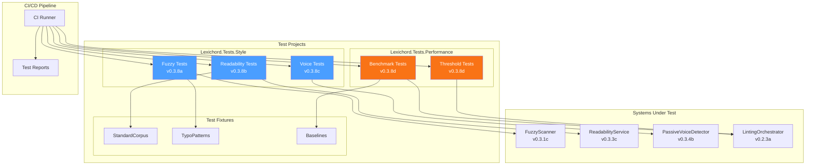
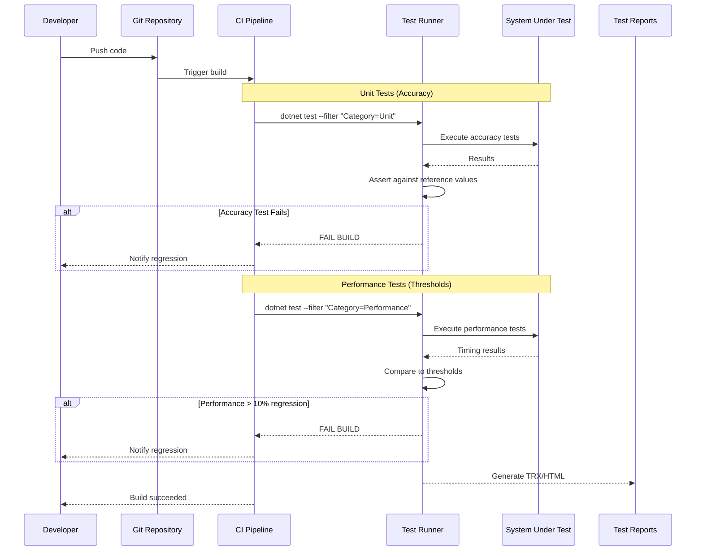

# LCS-DES-038: Design Specification Index — The Hardening

## Document Control

| Field | Value |
| :--- | :--- |
| **Document ID** | LCS-DES-038-INDEX |
| **Feature ID** | STY-038 |
| **Feature Name** | The Hardening (Unit Testing) |
| **Target Version** | v0.3.8 |
| **Module Scope** | Lexichord.Tests.Style, Lexichord.Tests.Performance |
| **Swimlane** | Governance |
| **License Tier** | Core |
| **Feature Gate Key** | N/A (testing infrastructure) |
| **Status** | Draft |
| **Last Updated** | 2026-01-26 |

---

## 1. Executive Summary

**v0.3.8** delivers the **Hardening** — comprehensive test suites that verify algorithm accuracy and establish performance baselines for all v0.3.x analysis features.

### 1.1 The Problem

Lexichord's v0.3.x release series introduced complex algorithmic analysis:

- Fuzzy matching with Levenshtein distance calculations
- Readability metrics (Flesch-Kincaid, Gunning Fog, Flesch Reading Ease)
- Passive voice and weasel word detection
- Optimized analysis pipelines

Without comprehensive testing, there is no guarantee these algorithms produce accurate results or maintain acceptable performance. Regressions could silently degrade the user experience.

### 1.2 The Solution

Implement four test suites that:

1. **Verify Accuracy** — Compare algorithm outputs against known reference values
2. **Prevent Regressions** — Fail CI builds when accuracy degrades
3. **Establish Baselines** — Document expected performance characteristics
4. **Guard Performance** — Fail CI builds when performance regresses > 10%

### 1.3 Business Value

| Value | Description |
| :--- | :--- |
| **Algorithm Confidence** | Mathematical verification of all analysis algorithms |
| **Regression Prevention** | CI failures catch accuracy degradation before release |
| **Performance Guarantees** | Documented baselines (< 200ms for 10,000 words) |
| **Enterprise Compliance** | Verified algorithms for audit requirements |
| **Foundation** | Testing patterns for all future algorithmic features |

---

## 2. Related Documents

### 2.1 Scope Breakdown Document

The detailed scope breakdown for v0.3.8, including all sub-parts, implementation checklists, user stories, and acceptance criteria:

| Document | Description |
| :--- | :--- |
| **[LCS-SBD-038](./LCS-SBD-038.md)** | Scope Breakdown — The Hardening |

### 2.2 Sub-Part Design Specifications

Each sub-part has its own detailed design specification following the LDS-01 template:

| Sub-Part | Document | Title | Description |
| :--- | :--- | :--- | :--- |
| v0.3.8a | **[LCS-DES-038a](./LCS-DES-038a.md)** | Fuzzy Test Suite | Levenshtein distance and fuzzy matching accuracy |
| v0.3.8b | **[LCS-DES-038b](./LCS-DES-038b.md)** | Readability Test Suite | FK, Fog, FRE accuracy with standard corpora |
| v0.3.8c | **[LCS-DES-038c](./LCS-DES-038c.md)** | Passive Voice Test Suite | Passive/active voice detection accuracy |
| v0.3.8d | **[LCS-DES-038d](./LCS-DES-038d.md)** | Benchmark Baseline | Performance thresholds and CI integration |

---

## 3. Architecture Overview

### 3.1 Component Diagram



### 3.2 Test Execution Flow



---

## 4. Dependencies

### 4.1 Upstream Dependencies (Systems Under Test)

| Interface | Source Version | Purpose |
| :--- | :--- | :--- |
| `LevenshteinDistanceService` | v0.3.1a | Fuzzy distance algorithm |
| `IFuzzyScanner` | v0.3.1c | Fuzzy matching scanner |
| `ISentenceTokenizer` | v0.3.3a | Sentence tokenization |
| `ISyllableCounter` | v0.3.3b | Syllable counting |
| `IReadabilityService` | v0.3.3c | Readability metrics |
| `IPassiveVoiceDetector` | v0.3.4b | Passive voice detection |
| `IVoiceScanner` | v0.3.4c | Weasel word scanning |
| `ILintingOrchestrator` | v0.2.3a | Full analysis pipeline |

### 4.2 NuGet Packages

| Package | Version | Purpose |
| :--- | :--- | :--- |
| `xunit` | 2.9.x | Test framework |
| `FluentAssertions` | 6.x | Fluent test assertions |
| `Moq` | 4.x | Mocking framework |
| `BenchmarkDotNet` | 0.14.x | Performance benchmarking (NEW) |
| `coverlet.collector` | 6.x | Code coverage |

### 4.3 Downstream Consumers (Future)

| Version | Feature | Uses From v0.3.8 |
| :--- | :--- | :--- |
| v0.4.x | AI Integration | Test patterns for AI accuracy verification |
| v0.5.x | Enterprise | Audit reports from test results |

---

## 5. License Gating Strategy

Testing infrastructure is **Core** tier — no license gating required.

All tests run regardless of user license tier. Test code is development-only and not included in production builds.

---

## 6. Test Categories

### 6.1 Test Trait Organization

| Category | Trait Filter | Purpose |
| :--- | :--- | :--- |
| Unit | `Category=Unit` | Accuracy verification |
| Performance | `Category=Performance` | Threshold enforcement |
| Benchmark | `Category=Benchmark` | BenchmarkDotNet profiling |

| Version | Trait Filter | Sub-Part |
| :--- | :--- | :--- |
| v0.3.8a | `Version=v0.3.8a` | Fuzzy tests |
| v0.3.8b | `Version=v0.3.8b` | Readability tests |
| v0.3.8c | `Version=v0.3.8c` | Voice tests |
| v0.3.8d | `Version=v0.3.8d` | Benchmark tests |

### 6.2 CI Pipeline Commands

```bash
# Run all accuracy tests
dotnet test --filter "Category=Unit"

# Run all performance tests
dotnet test --filter "Category=Performance"

# Run specific version tests
dotnet test --filter "Version=v0.3.8a"

# Run all v0.3.8 tests
dotnet test --filter "Version~v0.3.8"
```

---

## 7. Key Test Scenarios Summary

### 7.1 Fuzzy Matching (v0.3.8a)

| Scenario | Input | Expected |
| :--- | :--- | :--- |
| Exact match | "whitelist" vs "whitelist" | Distance = 0 |
| Hyphen variation | "whitelist" vs "white-list" | Distance = 1, Match at 0.8 |
| Different word | "whitelist" vs "wait-list" | Distance = 3, No match at 0.8 |
| Transposition | "the" vs "teh" | Distance = 1 |

### 7.2 Readability (v0.3.8b)

| Text | FK Grade | Fog Index | Reading Ease |
| :--- | :--- | :--- | :--- |
| Gettysburg Address | 11.2 ±0.1 | 14.1 ±0.2 | 63.9 ±1.0 |
| "The cat sat on the mat." | < 2.0 | < 3.0 | > 100 |
| Hemingway excerpt | 4.0 ±0.5 | 5.8 ±0.5 | 92.0 ±2.0 |

### 7.3 Passive Voice (v0.3.8c)

| Sentence | Passive? |
| :--- | :--- |
| "The code was written by the user." | Yes |
| "The user wrote the code." | No |
| "The meeting was at 3pm." | No (false positive check) |

### 7.4 Performance (v0.3.8d)

| Operation | 10,000 words | Threshold |
| :--- | :--- | :--- |
| Readability analysis | < 200ms | CI fails if exceeded |
| Fuzzy scanning | < 300ms | CI fails if exceeded |
| Full pipeline | < 500ms | CI fails if exceeded |

---

## 8. Implementation Checklist Summary

| Sub-Part | Tasks | Est. Hours |
| :--- | :--- | :--- |
| v0.3.8a | Fuzzy Test Suite | 6 |
| v0.3.8b | Readability Test Suite | 6.5 |
| v0.3.8c | Passive Voice Test Suite | 5 |
| v0.3.8d | Benchmark Baseline | 5 |
| Integration | Project structure, CI config | 1.5 |
| **Total** | | **24 hours** |

See [LCS-SBD-038](./LCS-SBD-038.md) Section 4 for the detailed task breakdown.

---

## 9. Success Criteria Summary

| Category | Criterion | Target |
| :--- | :--- | :--- |
| **Fuzzy Accuracy** | Levenshtein distance | 100% match expected |
| **Readability Accuracy** | FK Grade Level | ±0.1 of reference |
| **Readability Accuracy** | Gunning Fog | ±0.2 of reference |
| **Passive Voice Accuracy** | Detection rate | 95%+ |
| **False Positive Rate** | All detectors | < 5% |
| **Performance** | 10,000 words | < 200ms readability |
| **Coverage** | Algorithm code | 90%+ |

See [LCS-SBD-038](./LCS-SBD-038.md) Section 9 for full success metrics.

---

## 10. Test Coverage Summary

| Sub-Part | Test File | Coverage Area |
| :--- | :--- | :--- |
| v0.3.8a | `LevenshteinDistanceTests.cs` | Distance calculation |
| v0.3.8a | `FuzzyMatchingAccuracyTests.cs` | Scanner accuracy |
| v0.3.8b | `SyllableCounterAccuracyTests.cs` | Syllable counting |
| v0.3.8b | `SentenceTokenizerAccuracyTests.cs` | Abbreviation handling |
| v0.3.8b | `ReadabilityAccuracyTests.cs` | Formula accuracy |
| v0.3.8c | `PassiveVoiceDetectorTests.cs` | Passive detection |
| v0.3.8c | `WeaselWordScannerTests.cs` | Weasel word detection |
| v0.3.8d | `AnalysisBenchmarks.cs` | BenchmarkDotNet profiling |
| v0.3.8d | `PerformanceThresholdTests.cs` | CI threshold enforcement |

See individual design specs for detailed test scenarios.

---

## 11. What This Enables

| Version | Feature | Uses From v0.3.8 |
| :--- | :--- | :--- |
| v0.4.x | AI Integration | Test patterns for AI output accuracy |
| v0.5.x | Enterprise | Compliance audit from test reports |
| v0.6.x | Multi-language | Test corpora expansion patterns |

---

## Document History

| Version | Date | Author | Changes |
| :--- | :--- | :--- | :--- |
| 1.0 | 2026-01-26 | Lead Architect | Initial draft |
