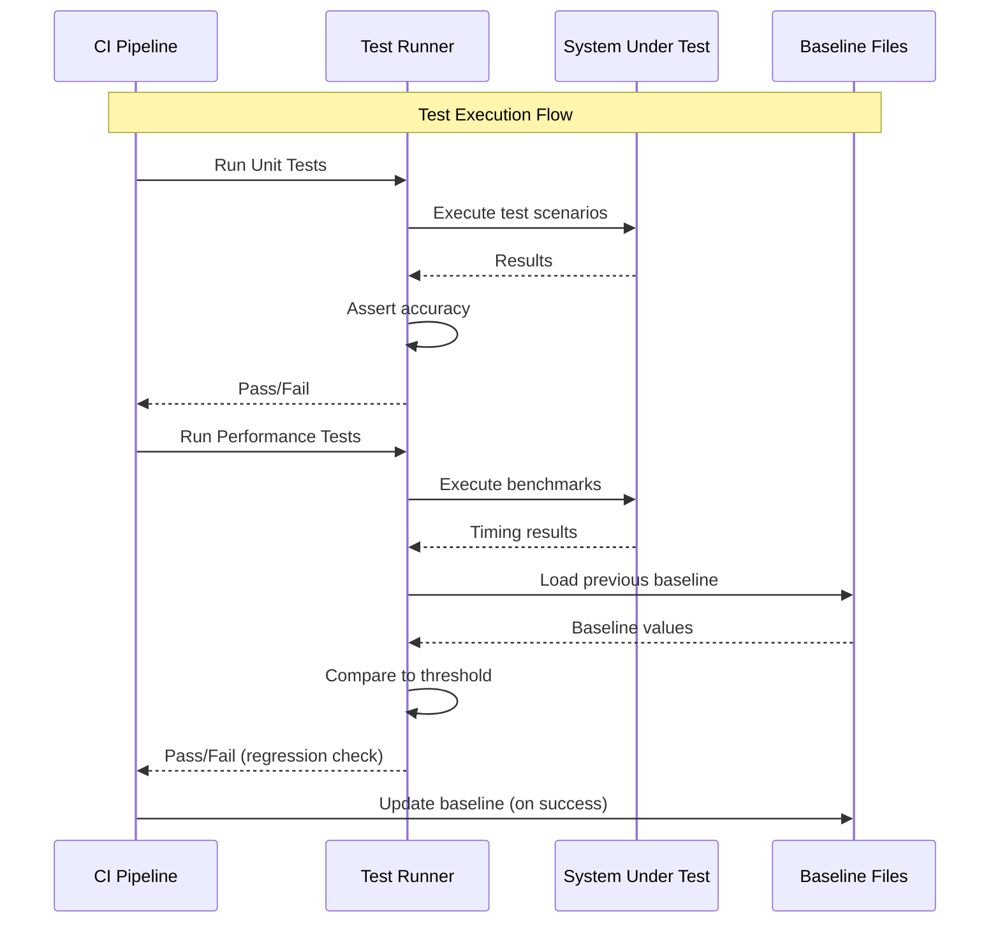

# LCS-SBD-038: Scope Breakdown — The Hardening

## Document Control

| Field            | Value                                    |
| :--------------- | :--------------------------------------- |
| **Document ID**  | LCS-SBD-038                              |
| **Version**      | v0.3.8                                   |
| **Codename**     | The Hardening (Unit Testing)             |
| **Status**       | Draft                                    |
| **Last Updated** | 2026-01-26                               |
| **Owner**        | Lead Architect                           |
| **Depends On**   | v0.3.1 (Fuzzy Engine), v0.3.3 (Readability), v0.3.4 (Voice Profiler), v0.3.7 (Performance Tuning) |

---

## 1. Executive Summary

### 1.1 The Vision

**v0.3.8** delivers the **Hardening** — comprehensive unit test suites that verify the accuracy of all algorithmic analysis introduced in v0.3.x. This release transforms Lexichord from a feature-complete writing analysis platform into a production-hardened system with verified algorithm correctness and established performance baselines.

While v0.3.1-v0.3.7 built the analysis engine (fuzzy matching, readability metrics, voice profiling, and performance optimizations), the Hardening phase ensures these algorithms produce accurate, predictable results. CI/CD pipelines will now guard against regressions in algorithm accuracy and performance degradation.

### 1.2 Business Value

- **Algorithm Confidence:** Mathematical verification that fuzzy matching, readability scoring, and voice detection produce correct results against known test corpora.
- **Regression Prevention:** CI failures prevent algorithm accuracy degradation from reaching production.
- **Performance Guarantees:** Documented baselines (< 200ms for 10,000 words) establish user experience expectations.
- **Reference Documentation:** Test suites serve as living documentation of expected algorithm behavior.
- **Quality Assurance:** Enterprise customers require verified, tested algorithms for compliance use cases.
- **Foundation:** Establishes testing patterns for all future algorithmic features.

### 1.3 Success Criteria

This release succeeds when:

1. Fuzzy matching tests verify Levenshtein distance calculations are accurate for typo detection scenarios.
2. Readability tests assert Flesch-Kincaid Grade Level matches known reference values within ±0.1.
3. Passive voice detection achieves 95%+ accuracy on a curated test corpus.
4. Performance benchmarks establish a < 200ms baseline for analyzing 10,000 words.
5. All tests are integrated into CI/CD pipeline with automatic failure on regression.

### 1.4 License Gating

The Hardening is a **Core** feature. Testing infrastructure is available to all license tiers:

- Test suites run during development and CI/CD for all builds
- No runtime license checks required (test code, not production feature)
- Test results contribute to quality metrics across all license tiers

---

## 2. Dependencies on Prior Versions

| Component                  | Source Version | Usage in v0.3.8                                   |
| :------------------------- | :------------- | :------------------------------------------------ |
| `LevenshteinDistanceService` | v0.3.1a      | Fuzzy distance algorithm to verify                |
| `IFuzzyScanner`            | v0.3.1c        | Fuzzy matching scanner to test                    |
| `ITerminologyRepository`   | v0.2.2b        | Term data for fuzzy matching tests                |
| `ISentenceTokenizer`       | v0.3.3a        | Sentence tokenization accuracy tests              |
| `ISyllableCounter`         | v0.3.3b        | Syllable counting accuracy tests                  |
| `IReadabilityService`      | v0.3.3c        | Readability metric calculation tests              |
| `ReadabilityMetrics`       | v0.3.3c        | Metrics record for assertions                     |
| `IPassiveVoiceDetector`    | v0.3.4b        | Passive voice detection tests                     |
| `IVoiceScanner`            | v0.3.4c        | Adverb/weasel word detection tests                |
| `VoiceProfile`             | v0.3.4a        | Profile record for test configurations            |
| `ILintingOrchestrator`     | v0.2.3a        | Full pipeline integration tests                   |
| `System.Reactive`          | v0.2.3a        | Async test patterns                               |
| `BenchmarkDotNet`          | v0.3.8d        | Performance benchmark framework (new)             |

---

## 3. Sub-Part Specifications

### 3.1 v0.3.8a: Fuzzy Test Suite

| Field            | Value                                     |
| :--------------- | :---------------------------------------- |
| **Sub-Part ID**  | TST-038a                                  |
| **Title**        | Fuzzy Matching Accuracy Test Suite        |
| **Module**       | `Lexichord.Tests.Style`                   |
| **License Tier** | Core                                      |

**Goal:** Verify that the Levenshtein distance algorithm and fuzzy scanner correctly identify typos and term variations within configured thresholds.

**Key Deliverables:**

- `FuzzyMatchingAccuracyTests.cs` with 30+ test cases
- `LevenshteinDistanceTests.cs` for raw distance calculations
- Test data fixtures for common typo patterns
- Threshold boundary tests (0.8, 0.9, 1.0 similarity)
- False positive/negative verification tests
- Integration tests with `ITerminologyRepository`

**Key Test Scenarios:**

```csharp
[Trait("Category", "Unit")]
[Trait("Version", "v0.3.8a")]
public class FuzzyMatchingAccuracyTests
{
    [Theory]
    [InlineData("whitelist", "white-list", 1)]    // Hyphen variation
    [InlineData("whitelist", "whitelist", 0)]     // Exact match
    [InlineData("whitelist", "whitelst", 1)]      // Missing letter
    [InlineData("whitelist", "wait-list", 3)]     // Different word
    [InlineData("blacklist", "blocklist", 2)]     // Modern term swap
    public void LevenshteinDistance_ReturnsExpectedDistance(
        string term, string candidate, int expectedDistance)
    {
        var sut = new LevenshteinDistanceService();
        var result = sut.Calculate(term, candidate);
        result.Should().Be(expectedDistance);
    }

    [Theory]
    [InlineData("whitelist", "white-list", 0.8, true)]   // Should match at 0.8
    [InlineData("whitelist", "wait-list", 0.8, false)]   // Should NOT match at 0.8
    [InlineData("whitelist", "wait-list", 0.6, true)]    // Should match at 0.6
    public void FuzzyScanner_WithThreshold_MatchesCorrectly(
        string term, string candidate, double threshold, bool shouldMatch)
    {
        var sut = new FuzzyScanner(new LevenshteinDistanceService());
        var result = sut.IsMatch(term, candidate, threshold);
        result.Should().Be(shouldMatch);
    }
}
```

**Typo Pattern Test Data:**

```text
PATTERN CATEGORIES:
├── Transposition: "teh" vs "the", "recieve" vs "receive"
├── Omission: "accross" vs "across", "occured" vs "occurred"
├── Insertion: "seperate" vs "separate", "definately" vs "definitely"
├── Substitution: "affect" vs "effect", "principle" vs "principal"
├── Hyphenation: "white-list" vs "whitelist", "e-mail" vs "email"
└── Case Variation: "WhiteList" vs "whitelist" (case-insensitive)
```

**Dependencies:**

- v0.3.1a: `LevenshteinDistanceService` (algorithm under test)
- v0.3.1c: `IFuzzyScanner` (scanner under test)

---

### 3.2 v0.3.8b: Readability Test Suite

| Field            | Value                                     |
| :--------------- | :---------------------------------------- |
| **Sub-Part ID**  | TST-038b                                  |
| **Title**        | Readability Metrics Accuracy Test Suite   |
| **Module**       | `Lexichord.Tests.Style`                   |
| **License Tier** | Core                                      |

**Goal:** Verify that Flesch-Kincaid, Gunning Fog, and Flesch Reading Ease calculations match known reference values from established readability corpora.

**Key Deliverables:**

- `ReadabilityAccuracyTests.cs` with reference corpus tests
- `SentenceTokenizerAccuracyTests.cs` for abbreviation handling
- `SyllableCounterAccuracyTests.cs` with CMU dictionary validation
- Standard corpus fixtures (Gettysburg Address, Declaration of Independence)
- Edge case tests (empty text, single word, all punctuation)
- Cross-validation against online readability tools

**Standard Corpus Test Data:**

| Text | Known FK Grade | Known Fog Index | Known Reading Ease |
| :--- | :------------- | :-------------- | :----------------- |
| Gettysburg Address | 11.2 | 14.1 | 63.9 |
| Declaration of Independence (opening) | 15.4 | 19.2 | 30.2 |
| "The cat sat on the mat." | 0.5 | 2.4 | 116.0 |
| Hemingway excerpt (The Old Man and the Sea) | 4.0 | 5.8 | 92.0 |

**Key Test Scenarios:**

```csharp
[Trait("Category", "Unit")]
[Trait("Version", "v0.3.8b")]
public class ReadabilityAccuracyTests
{
    private const string GettysburgAddress =
        "Four score and seven years ago our fathers brought forth on this continent, " +
        "a new nation, conceived in Liberty, and dedicated to the proposition that " +
        "all men are created equal.";

    [Fact]
    public void Analyze_GettysburgAddress_MatchesKnownFleschKincaid()
    {
        var sut = CreateReadabilityService();

        var result = sut.Analyze(GettysburgAddress);

        // Known FK Grade Level for Gettysburg Address: 11.2 ± 0.1
        result.FleschKincaidGradeLevel.Should().BeApproximately(11.2, 0.1);
    }

    [Fact]
    public void Analyze_GettysburgAddress_MatchesKnownGunningFog()
    {
        var sut = CreateReadabilityService();

        var result = sut.Analyze(GettysburgAddress);

        // Known Gunning Fog Index: 14.1 ± 0.2
        result.GunningFogIndex.Should().BeApproximately(14.1, 0.2);
    }

    [Fact]
    public void Analyze_SimpleText_ReturnsVeryLowGradeLevel()
    {
        var sut = CreateReadabilityService();

        var result = sut.Analyze("The cat sat on the mat.");

        // Very simple text should have grade level < 2.0
        result.FleschKincaidGradeLevel.Should().BeLessThan(2.0);
        result.FleschReadingEase.Should().BeGreaterThan(100); // Can exceed 100 for simple text
    }

    [Theory]
    [InlineData("queue", 1)]
    [InlineData("documentation", 5)]
    [InlineData("beautiful", 3)]
    [InlineData("table", 2)]
    [InlineData("the", 1)]
    public void SyllableCounter_KnownWords_ReturnsExpected(string word, int expected)
    {
        var sut = new SyllableCounter();
        var result = sut.CountSyllables(word);
        result.Should().Be(expected);
    }

    [Theory]
    [InlineData("Mr. Smith went home.", 1)]
    [InlineData("Dr. Jones arrived. She was tired.", 2)]
    [InlineData("Visit https://example.com for info.", 1)]
    public void SentenceTokenizer_WithAbbreviations_CountsCorrectly(
        string text, int expectedSentences)
    {
        var sut = new SentenceTokenizer();
        var result = sut.Tokenize(text);
        result.Should().HaveCount(expectedSentences);
    }
}
```

**Dependencies:**

- v0.3.3a: `ISentenceTokenizer` (tokenizer under test)
- v0.3.3b: `ISyllableCounter` (counter under test)
- v0.3.3c: `IReadabilityService` (service under test)

---

### 3.3 v0.3.8c: Passive Voice Test Suite

| Field            | Value                                     |
| :--------------- | :---------------------------------------- |
| **Sub-Part ID**  | TST-038c                                  |
| **Title**        | Passive Voice Detection Test Suite        |
| **Module**       | `Lexichord.Tests.Style`                   |
| **License Tier** | Core                                      |

**Goal:** Verify that the passive voice detector correctly identifies passive constructions while minimizing false positives on active voice sentences.

**Key Deliverables:**

- `PassiveVoiceDetectorTests.cs` with 50+ sentence tests
- `WeaselWordScannerTests.cs` for adverb/hedge word detection
- Curated test corpus with labeled sentences
- False positive/negative tracking
- Pattern coverage verification (all passive patterns tested)

**Key Test Scenarios:**

```csharp
[Trait("Category", "Unit")]
[Trait("Version", "v0.3.8c")]
public class PassiveVoiceDetectorTests
{
    [Theory]
    [InlineData("The code was written by the user.", true)]
    [InlineData("The report was submitted yesterday.", true)]
    [InlineData("The bug was fixed in version 2.0.", true)]
    [InlineData("Mistakes were made.", true)]
    [InlineData("The data is being processed.", true)]
    [InlineData("The feature has been implemented.", true)]
    public void Detect_PassiveVoiceSentences_ReturnsTrue(
        string sentence, bool isPassive)
    {
        var sut = new PassiveVoiceDetector();
        var result = sut.IsPassive(sentence);
        result.Should().Be(isPassive);
    }

    [Theory]
    [InlineData("The user wrote the code.", false)]
    [InlineData("I submitted the report yesterday.", false)]
    [InlineData("The team fixed the bug in version 2.0.", false)]
    [InlineData("Someone made mistakes.", false)]
    [InlineData("The system processes data.", false)]
    [InlineData("We implemented the feature.", false)]
    public void Detect_ActiveVoiceSentences_ReturnsFalse(
        string sentence, bool isPassive)
    {
        var sut = new PassiveVoiceDetector();
        var result = sut.IsPassive(sentence);
        result.Should().Be(isPassive);
    }

    [Theory]
    [InlineData("The meeting was at 3pm.", false)]  // "was" as linking verb
    [InlineData("The door was open.", false)]       // "was" + adjective
    [InlineData("She was happy.", false)]           // "was" + adjective
    public void Detect_FalsePassivePatterns_ReturnsFalse(
        string sentence, bool isPassive)
    {
        var sut = new PassiveVoiceDetector();
        var result = sut.IsPassive(sentence);
        result.Should().Be(isPassive);
    }
}
```

**Weasel Word Test Scenarios:**

```csharp
[Trait("Category", "Unit")]
[Trait("Version", "v0.3.8c")]
public class WeaselWordScannerTests
{
    [Theory]
    [InlineData("This is very important.", "very")]
    [InlineData("The code is basically done.", "basically")]
    [InlineData("It sort of works.", "sort of")]
    [InlineData("This is quite good.", "quite")]
    [InlineData("The feature is really useful.", "really")]
    public void Scan_WeaselWords_DetectsExpectedWord(
        string sentence, string expectedWeaselWord)
    {
        var sut = new WeaselWordScanner();
        var result = sut.Scan(sentence);
        result.Should().Contain(w => w.Word == expectedWeaselWord);
    }

    [Theory]
    [InlineData("This is important.")]
    [InlineData("The code is complete.")]
    [InlineData("It works.")]
    public void Scan_CleanSentences_ReturnsEmpty(string sentence)
    {
        var sut = new WeaselWordScanner();
        var result = sut.Scan(sentence);
        result.Should().BeEmpty();
    }
}
```

**Passive Voice Patterns to Test:**

```text
PASSIVE PATTERNS:
├── was/were + past participle: "was written", "were found"
├── is/are + being + past participle: "is being processed"
├── has/have + been + past participle: "has been completed"
├── will be + past participle: "will be reviewed"
├── Modal + be + past participle: "should be tested", "must be approved"
└── Get-passive: "got promoted", "get fixed"

FALSE POSITIVE PATTERNS (should NOT detect):
├── Linking verbs: "was happy", "is tall", "were ready"
├── Progressive active: "is running", "was working"
├── State descriptions: "The door was open", "The meeting was at 3pm"
└── Adjective complements: "was interesting", "were exciting"
```

**Dependencies:**

- v0.3.4b: `IPassiveVoiceDetector` (detector under test)
- v0.3.4c: `IVoiceScanner` (weasel word scanner under test)

---

### 3.4 v0.3.8d: Benchmark Baseline

| Field            | Value                                     |
| :--------------- | :---------------------------------------- |
| **Sub-Part ID**  | TST-038d                                  |
| **Title**        | Performance Benchmark Baseline            |
| **Module**       | `Lexichord.Tests.Performance`             |
| **License Tier** | Core                                      |

**Goal:** Establish performance baselines for all analysis algorithms and integrate with CI to prevent performance regressions.

**Key Deliverables:**

- `AnalysisBenchmarks.cs` using BenchmarkDotNet
- CI integration with baseline comparison
- Performance regression threshold configuration
- Memory allocation tracking
- Throughput metrics (words/second)
- Baseline JSON files for comparison

**Key Benchmark Scenarios:**

```csharp
[MemoryDiagnoser]
[SimpleJob(RuntimeMoniker.Net90)]
[Trait("Category", "Performance")]
[Trait("Version", "v0.3.8d")]
public class AnalysisBenchmarks
{
    private string _smallText;    // 100 words
    private string _mediumText;   // 1,000 words
    private string _largeText;    // 10,000 words
    private string _xlText;       // 50,000 words

    private IReadabilityService _readabilityService;
    private IFuzzyScanner _fuzzyScanner;
    private IPassiveVoiceDetector _passiveDetector;
    private ILintingOrchestrator _orchestrator;

    [GlobalSetup]
    public void Setup()
    {
        _smallText = GenerateLoremIpsum(100);
        _mediumText = GenerateLoremIpsum(1_000);
        _largeText = GenerateLoremIpsum(10_000);
        _xlText = GenerateLoremIpsum(50_000);

        // Initialize services
        _readabilityService = new ReadabilityService(/* ... */);
        _fuzzyScanner = new FuzzyScanner(/* ... */);
        _passiveDetector = new PassiveVoiceDetector();
        _orchestrator = new LintingOrchestrator(/* ... */);
    }

    [Benchmark]
    public ReadabilityMetrics Readability_10000Words()
    {
        return _readabilityService.Analyze(_largeText);
    }

    [Benchmark]
    public IReadOnlyList<FuzzyMatch> FuzzyScanning_10000Words()
    {
        return _fuzzyScanner.Scan(_largeText);
    }

    [Benchmark]
    public IReadOnlyList<PassiveVoiceMatch> PassiveVoice_10000Words()
    {
        return _passiveDetector.Analyze(_largeText);
    }

    [Benchmark]
    public AnalysisResult FullPipeline_10000Words()
    {
        return _orchestrator.AnalyzeAsync(_largeText).Result;
    }
}
```

**CI Threshold Tests:**

```csharp
[Trait("Category", "Performance")]
[Trait("Version", "v0.3.8d")]
public class PerformanceThresholdTests
{
    [Fact]
    public void Readability_10000Words_CompletesUnder200ms()
    {
        var sut = CreateReadabilityService();
        var text = GenerateLoremIpsum(10_000);
        var sw = Stopwatch.StartNew();

        var result = sut.Analyze(text);

        sw.Stop();
        sw.ElapsedMilliseconds.Should().BeLessThan(200,
            "10,000 word readability analysis must complete in < 200ms");
    }

    [Fact]
    public void FuzzyScanning_10000Words_CompletesUnder300ms()
    {
        var sut = CreateFuzzyScanner();
        var text = GenerateLoremIpsum(10_000);
        var sw = Stopwatch.StartNew();

        var result = sut.Scan(text);

        sw.Stop();
        sw.ElapsedMilliseconds.Should().BeLessThan(300,
            "10,000 word fuzzy scanning must complete in < 300ms");
    }

    [Fact]
    public void FullPipeline_10000Words_CompletesUnder500ms()
    {
        var sut = CreateOrchestrator();
        var text = GenerateLoremIpsum(10_000);
        var sw = Stopwatch.StartNew();

        var result = sut.AnalyzeAsync(text).Result;

        sw.Stop();
        sw.ElapsedMilliseconds.Should().BeLessThan(500,
            "10,000 word full pipeline must complete in < 500ms");
    }

    [Fact]
    public void MemoryAllocation_10000Words_Under50MB()
    {
        var text = GenerateLoremIpsum(10_000);
        var initialMemory = GC.GetTotalMemory(true);

        var sut = CreateOrchestrator();
        var result = sut.AnalyzeAsync(text).Result;

        var finalMemory = GC.GetTotalMemory(false);
        var allocated = (finalMemory - initialMemory) / (1024 * 1024);

        allocated.Should().BeLessThan(50,
            "10,000 word analysis should allocate < 50MB");
    }
}
```

**Performance Baseline Targets:**

| Operation | 1,000 words | 10,000 words | 50,000 words |
| :-------- | :---------- | :----------- | :----------- |
| Readability Analysis | < 20ms | < 200ms | < 1,000ms |
| Fuzzy Scanning | < 30ms | < 300ms | < 1,500ms |
| Passive Voice Detection | < 10ms | < 100ms | < 500ms |
| Full Pipeline | < 50ms | < 500ms | < 2,500ms |
| Memory Allocation | < 5MB | < 50MB | < 250MB |

**Dependencies:**

- v0.3.3c: `IReadabilityService` (performance target)
- v0.3.1c: `IFuzzyScanner` (performance target)
- v0.3.4b: `IPassiveVoiceDetector` (performance target)
- v0.2.3a: `ILintingOrchestrator` (pipeline performance target)
- BenchmarkDotNet 0.14.x (new NuGet package)

---

## 4. Implementation Checklist

| #  | Sub-Part | Task                                                      | Est. Hours |
| :- | :------- | :-------------------------------------------------------- | :--------- |
| 1  | v0.3.8a  | Create `LevenshteinDistanceTests.cs`                      | 1          |
| 2  | v0.3.8a  | Create `FuzzyMatchingAccuracyTests.cs`                    | 2          |
| 3  | v0.3.8a  | Create typo pattern test fixtures                         | 1          |
| 4  | v0.3.8a  | Add threshold boundary tests                              | 1          |
| 5  | v0.3.8a  | Integration tests with ITerminologyRepository             | 1          |
| 6  | v0.3.8b  | Create `SyllableCounterAccuracyTests.cs`                  | 1.5        |
| 7  | v0.3.8b  | Create `SentenceTokenizerAccuracyTests.cs`                | 1.5        |
| 8  | v0.3.8b  | Create `ReadabilityAccuracyTests.cs`                      | 2          |
| 9  | v0.3.8b  | Add standard corpus test fixtures                         | 1          |
| 10 | v0.3.8b  | Cross-validate against online tools                       | 0.5        |
| 11 | v0.3.8c  | Create `PassiveVoiceDetectorTests.cs`                     | 2          |
| 12 | v0.3.8c  | Create `WeaselWordScannerTests.cs`                        | 1          |
| 13 | v0.3.8c  | Create labeled test corpus                                | 1          |
| 14 | v0.3.8c  | Add false positive regression tests                       | 1          |
| 15 | v0.3.8d  | Install and configure BenchmarkDotNet                     | 0.5        |
| 16 | v0.3.8d  | Create `AnalysisBenchmarks.cs`                            | 2          |
| 17 | v0.3.8d  | Create `PerformanceThresholdTests.cs`                     | 1.5        |
| 18 | v0.3.8d  | Configure CI pipeline thresholds                          | 1          |
| 19 | v0.3.8d  | Create baseline JSON files                                | 0.5        |
| 20 | All      | Create test project structure if not exists               | 0.5        |
| 21 | All      | Configure test categories and traits                      | 0.5        |
| **Total** |   |                                                           | **24 hours** |

---

## 5. Dependency Matrix

### 5.1 Required Interfaces (from earlier versions)

| Interface                  | Source Version | Purpose                              |
| :------------------------- | :------------- | :----------------------------------- |
| `LevenshteinDistanceService` | v0.3.1a      | Distance calculation under test      |
| `IFuzzyScanner`            | v0.3.1c        | Fuzzy scanner under test             |
| `ISentenceTokenizer`       | v0.3.3a        | Tokenizer under test                 |
| `ISyllableCounter`         | v0.3.3b        | Syllable counter under test          |
| `IReadabilityService`      | v0.3.3c        | Readability service under test       |
| `IPassiveVoiceDetector`    | v0.3.4b        | Passive voice detector under test    |
| `IVoiceScanner`            | v0.3.4c        | Weasel word scanner under test       |
| `ILintingOrchestrator`     | v0.2.3a        | Full pipeline under test             |

### 5.2 New Records/DTOs (defined in v0.3.8)

| Record                     | Defined In | Purpose                                |
| :------------------------- | :--------- | :------------------------------------- |
| `BenchmarkBaseline`        | v0.3.8d    | Stored performance baseline data       |
| `TestCorpusEntry`          | v0.3.8b    | Labeled test corpus entry              |

### 5.3 NuGet Packages

| Package          | Version | Purpose                    | New/Existing |
| :--------------- | :------ | :------------------------- | :----------- |
| `xunit`          | 2.9.x   | Test framework             | Existing     |
| `FluentAssertions` | 6.x   | Test assertions            | Existing     |
| `Moq`            | 4.x     | Mocking framework          | Existing     |
| `BenchmarkDotNet` | 0.14.x | Performance benchmarking   | **New**      |

---

## 6. Architecture Diagram

```mermaid
graph TB
    subgraph "Lexichord.Tests.Style"
        subgraph "v0.3.8a: Fuzzy Tests"
            FT[FuzzyMatchingAccuracyTests]
            LT[LevenshteinDistanceTests]
        end

        subgraph "v0.3.8b: Readability Tests"
            RT[ReadabilityAccuracyTests]
            ST[SentenceTokenizerAccuracyTests]
            SY[SyllableCounterAccuracyTests]
        end

        subgraph "v0.3.8c: Voice Tests"
            PT[PassiveVoiceDetectorTests]
            WT[WeaselWordScannerTests]
        end
    end

    subgraph "Lexichord.Tests.Performance"
        subgraph "v0.3.8d: Benchmarks"
            AB[AnalysisBenchmarks]
            TH[PerformanceThresholdTests]
        end
    end

    subgraph "Systems Under Test (Prior Versions)"
        FS[FuzzyScanner<br/>v0.3.1c]
        RS[ReadabilityService<br/>v0.3.3c]
        PV[PassiveVoiceDetector<br/>v0.3.4b]
        LO[LintingOrchestrator<br/>v0.2.3a]
    end

    FT --> FS
    LT --> FS
    RT --> RS
    ST --> RS
    SY --> RS
    PT --> PV
    WT --> PV
    AB --> LO
    TH --> LO

    style FT fill:#4a9eff,color:#fff
    style LT fill:#4a9eff,color:#fff
    style RT fill:#4a9eff,color:#fff
    style ST fill:#4a9eff,color:#fff
    style SY fill:#4a9eff,color:#fff
    style PT fill:#4a9eff,color:#fff
    style WT fill:#4a9eff,color:#fff
    style AB fill:#f97316,color:#fff
    style TH fill:#f97316,color:#fff
```



---

## 7. Data Flow Diagram



---

## 8. Risks & Mitigations

| Risk | Impact | Probability | Mitigation |
| :--- | :----- | :---------- | :--------- |
| Reference values disputed | Medium | Low | Document sources for all reference values |
| Performance varies by hardware | High | Medium | Use relative comparisons, not absolute times |
| Flaky performance tests | Medium | Medium | Use multiple iterations, statistical analysis |
| CMU dictionary incomplete | Low | Low | Supplement with manual exception list |
| Passive voice patterns incomplete | Medium | Medium | Continuously expand corpus based on user feedback |
| BenchmarkDotNet CI integration complex | Medium | Medium | Start with simple Stopwatch tests, add BDN later |

---

## 9. Success Metrics

| Metric | Target | Measurement |
| :----- | :----- | :---------- |
| Fuzzy distance accuracy | 100% | All InlineData tests pass |
| FK Grade Level accuracy | ±0.1 | Reference corpus tests |
| Gunning Fog accuracy | ±0.2 | Reference corpus tests |
| Passive voice detection | 95%+ | Labeled corpus tests |
| False positive rate | < 5% | False positive test suite |
| Performance regression | < 10% | Baseline comparison |
| Test coverage (algorithms) | 90%+ | Code coverage tools |

---

## 10. What This Enables

After v0.3.8, Lexichord will support:

- **v0.4.x (AI Integration):** Confidence in algorithm accuracy enables AI-powered suggestions that build on these foundations.

- **v0.5.x (Enterprise):** Compliance certifications require documented, verified algorithm accuracy.

- **Future:** Continuous integration prevents regressions as new features are added. Performance baselines guide optimization efforts.

---

## 11. Decision Trees

### 11.1 Should a Test Fail CI?

```text
START: "Test failed. Should CI fail?"
│
├── Is it a unit test (Category=Unit)?
│   └── YES → FAIL CI (accuracy regression)
│
├── Is it a performance threshold test?
│   ├── Exceeded by > 10%?
│   │   └── YES → FAIL CI (performance regression)
│   └── Exceeded by < 10%?
│       └── NO → WARNING only (minor variance)
│
├── Is it a BenchmarkDotNet comparison?
│   └── YES → WARNING only (informational)
│
└── DEFAULT: FAIL CI
```

### 11.2 Is This a Readability Reference Value Correct?

```text
START: "Validating reference value for corpus text"
│
├── Cross-check with 3+ online readability tools
│   └── Values agree within ±0.5 → USE average
│
├── Check academic papers citing this text
│   └── Found → USE published value
│
├── Calculate manually using formula
│   └── Document calculation → USE manual value
│
└── DEFAULT: Flag as "needs verification"
```

---

## 12. User Stories

| ID    | Role            | Story                                                                                | Acceptance Criteria                    |
| :---- | :-------------- | :----------------------------------------------------------------------------------- | :------------------------------------- |
| US-01 | Developer       | As a developer, I want tests to catch algorithm regressions before merge.            | CI fails on accuracy regression.       |
| US-02 | Developer       | As a developer, I want performance baselines to prevent slowdowns.                   | CI warns on > 10% performance drop.    |
| US-03 | QA Engineer     | As a QA engineer, I want documented reference values for audit.                      | All reference values have sources.     |
| US-04 | Product Owner   | As a product owner, I want confidence that algorithms are accurate.                  | 95%+ accuracy on labeled corpora.      |
| US-05 | Enterprise User | As an enterprise user, I need verified accuracy for compliance.                      | Test reports available for audit.      |

---

## 13. Use Cases

### UC-01: CI Pipeline Runs Tests

**Preconditions:**

- Developer pushes code to repository
- CI pipeline triggers

**Flow:**

1. CI checks out code.
2. CI runs `dotnet test --filter "Category=Unit"`.
3. All accuracy tests execute against systems under test.
4. Results compared to expected values.
5. CI runs `dotnet test --filter "Category=Performance"`.
6. Performance results compared to baseline thresholds.
7. CI reports pass/fail status.

**Postconditions:**

- Build marked as pass (all tests green) or fail (regressions detected).

---

### UC-02: Baseline Update After Optimization

**Preconditions:**

- Developer improves algorithm performance
- New performance is better than baseline

**Flow:**

1. Developer runs benchmarks locally.
2. New times are faster than baseline.
3. Developer updates baseline JSON file.
4. CI accepts new baseline as reference.
5. Future builds compared against improved baseline.

**Postconditions:**

- New performance baseline established.

---

## 14. Unit Testing Requirements

### 14.1 Test Organization

```csharp
// Test project structure
Lexichord.Tests.Style/
├── Fuzzy/
│   ├── LevenshteinDistanceTests.cs
│   └── FuzzyMatchingAccuracyTests.cs
├── Readability/
│   ├── SyllableCounterAccuracyTests.cs
│   ├── SentenceTokenizerAccuracyTests.cs
│   └── ReadabilityAccuracyTests.cs
├── Voice/
│   ├── PassiveVoiceDetectorTests.cs
│   └── WeaselWordScannerTests.cs
└── TestFixtures/
    ├── StandardCorpus.cs
    └── TypoPatterns.cs

Lexichord.Tests.Performance/
├── AnalysisBenchmarks.cs
├── PerformanceThresholdTests.cs
└── Baselines/
    └── baseline.json
```

### 14.2 Test Trait Categories

```csharp
// Use traits for filtering
[Trait("Category", "Unit")]           // Accuracy tests
[Trait("Category", "Performance")]    // Threshold tests
[Trait("Category", "Benchmark")]      // BenchmarkDotNet

[Trait("Version", "v0.3.8a")]         // Fuzzy tests
[Trait("Version", "v0.3.8b")]         // Readability tests
[Trait("Version", "v0.3.8c")]         // Passive voice tests
[Trait("Version", "v0.3.8d")]         // Benchmark tests
```

---

## 15. Observability & Logging

| Level   | Source              | Message Template                                                       |
| :------ | :------------------ | :--------------------------------------------------------------------- |
| Info    | TestRunner          | `Running {TestCount} tests for v0.3.8`                                 |
| Debug   | Benchmark           | `Benchmark {Name} completed in {ElapsedMs}ms`                          |
| Warning | Threshold           | `Performance threshold exceeded: {Actual}ms > {Expected}ms`            |
| Error   | Accuracy            | `Accuracy test failed: expected {Expected}, got {Actual}`              |
| Info    | Baseline            | `Baseline updated: {Metric} from {Old} to {New}`                       |

---

## 16. UI/UX Specifications

**Not applicable.** This is a testing-only release with no user-facing UI components.

---

## 17. Acceptance Criteria (QA)

| #   | Category            | Criterion                                                                    |
| :-- | :------------------ | :--------------------------------------------------------------------------- |
| 1   | **[Fuzzy]**         | "whitelist" matches "white-list" at 0.8 threshold.                           |
| 2   | **[Fuzzy]**         | "whitelist" does NOT match "wait-list" at 0.8 threshold.                     |
| 3   | **[Readability]**   | Gettysburg Address FK Grade = 11.2 ±0.1.                                     |
| 4   | **[Readability]**   | "queue" = 1 syllable, "documentation" = 5 syllables.                         |
| 5   | **[Readability]**   | "Mr. Smith went home." = 1 sentence.                                         |
| 6   | **[Passive]**       | "The code was written by the user." detected as passive.                     |
| 7   | **[Passive]**       | "The user wrote the code." NOT detected as passive.                          |
| 8   | **[Passive]**       | "The meeting was at 3pm." NOT detected as passive (false positive check).    |
| 9   | **[Performance]**   | 10,000 word readability analysis < 200ms.                                    |
| 10  | **[Performance]**   | 10,000 word full pipeline < 500ms.                                           |
| 11  | **[CI]**            | Accuracy regression fails CI build.                                          |
| 12  | **[CI]**            | > 10% performance regression fails CI build.                                 |

---

## 18. Verification Commands

```bash
# ═══════════════════════════════════════════════════════════════════════════
# v0.3.8 Verification
# ═══════════════════════════════════════════════════════════════════════════

# 1. Build test projects
dotnet build tests/Lexichord.Tests.Style
dotnet build tests/Lexichord.Tests.Performance

# 2. Run fuzzy accuracy tests (v0.3.8a)
dotnet test --filter "Category=Unit&Version=v0.3.8a" --logger "console;verbosity=detailed"

# 3. Run readability accuracy tests (v0.3.8b)
dotnet test --filter "Category=Unit&Version=v0.3.8b" --logger "console;verbosity=detailed"

# 4. Run passive voice tests (v0.3.8c)
dotnet test --filter "Category=Unit&Version=v0.3.8c" --logger "console;verbosity=detailed"

# 5. Run performance threshold tests (v0.3.8d)
dotnet test --filter "Category=Performance&Version=v0.3.8d" --logger "console;verbosity=detailed"

# 6. Run BenchmarkDotNet (optional, for detailed analysis)
dotnet run --project tests/Lexichord.Tests.Performance -c Release -- --filter "*"

# 7. Run all v0.3.8 tests
dotnet test --filter "Version~v0.3.8" --logger "trx;LogFileName=v038-results.trx"

# 8. Generate coverage report
dotnet test --collect:"XPlat Code Coverage" --results-directory ./coverage
```

---

## 19. Deliverable Checklist

| #  | Deliverable                                                    | Status |
| :- | :------------------------------------------------------------- | :----- |
| 1  | `LevenshteinDistanceTests.cs` with distance accuracy tests     | [ ]    |
| 2  | `FuzzyMatchingAccuracyTests.cs` with threshold tests           | [ ]    |
| 3  | `SyllableCounterAccuracyTests.cs` with known word tests        | [ ]    |
| 4  | `SentenceTokenizerAccuracyTests.cs` with abbreviation tests    | [ ]    |
| 5  | `ReadabilityAccuracyTests.cs` with corpus tests                | [ ]    |
| 6  | `PassiveVoiceDetectorTests.cs` with labeled sentence tests     | [ ]    |
| 7  | `WeaselWordScannerTests.cs` with word detection tests          | [ ]    |
| 8  | `AnalysisBenchmarks.cs` with BenchmarkDotNet                   | [ ]    |
| 9  | `PerformanceThresholdTests.cs` with CI threshold tests         | [ ]    |
| 10 | `StandardCorpus.cs` test fixture                               | [ ]    |
| 11 | `TypoPatterns.cs` test fixture                                 | [ ]    |
| 12 | `baseline.json` performance baseline file                      | [ ]    |
| 13 | CI pipeline configuration for test categories                  | [ ]    |
| 14 | BenchmarkDotNet NuGet package added                            | [ ]    |

---

## 20. Code Examples

### 20.1 Standard Corpus Test Fixture

```csharp
namespace Lexichord.Tests.Style.TestFixtures;

/// <summary>
/// Standard corpus texts with known readability values for accuracy testing.
/// All reference values are cross-validated against multiple online tools
/// and academic sources.
/// </summary>
public static class StandardCorpus
{
    /// <summary>
    /// Opening of the Gettysburg Address by Abraham Lincoln.
    /// Known values: FK=11.2, Fog=14.1, FRE=63.9
    /// Source: https://www.archives.gov/exhibits/featured-documents/gettysburg-address
    /// </summary>
    public static readonly CorpusEntry GettysburgAddress = new(
        Text: "Four score and seven years ago our fathers brought forth on this continent, " +
              "a new nation, conceived in Liberty, and dedicated to the proposition that " +
              "all men are created equal.",
        ExpectedFleschKincaid: 11.2,
        ExpectedGunningFog: 14.1,
        ExpectedFleschReadingEase: 63.9,
        ExpectedWordCount: 30,
        ExpectedSentenceCount: 1,
        Source: "National Archives"
    );

    /// <summary>
    /// Very simple text for baseline testing.
    /// Expected: Very low grade level, very high reading ease.
    /// </summary>
    public static readonly CorpusEntry SimpleText = new(
        Text: "The cat sat on the mat.",
        ExpectedFleschKincaid: 0.5,
        ExpectedGunningFog: 2.4,
        ExpectedFleschReadingEase: 116.0,
        ExpectedWordCount: 6,
        ExpectedSentenceCount: 1,
        Source: "Manual calculation"
    );

    /// <summary>
    /// Hemingway excerpt - known for simple, direct prose.
    /// </summary>
    public static readonly CorpusEntry HemingwayExcerpt = new(
        Text: "He was an old man who fished alone in a skiff in the Gulf Stream " +
              "and he had gone eighty-four days now without taking a fish.",
        ExpectedFleschKincaid: 4.0,
        ExpectedGunningFog: 5.8,
        ExpectedFleschReadingEase: 92.0,
        ExpectedWordCount: 28,
        ExpectedSentenceCount: 1,
        Source: "The Old Man and the Sea"
    );
}

/// <summary>
/// A single entry in the standard corpus with expected metrics.
/// </summary>
public record CorpusEntry(
    string Text,
    double ExpectedFleschKincaid,
    double ExpectedGunningFog,
    double ExpectedFleschReadingEase,
    int ExpectedWordCount,
    int ExpectedSentenceCount,
    string Source);
```

### 20.2 Typo Patterns Test Fixture

```csharp
namespace Lexichord.Tests.Style.TestFixtures;

/// <summary>
/// Common typo patterns for fuzzy matching accuracy tests.
/// </summary>
public static class TypoPatterns
{
    /// <summary>
    /// Transposition errors (swapped adjacent letters).
    /// </summary>
    public static IEnumerable<object[]> TranspositionErrors => new[]
    {
        new object[] { "the", "teh", 1 },
        new object[] { "receive", "recieve", 2 },
        new object[] { "weird", "wierd", 2 },
        new object[] { "friend", "freind", 2 },
    };

    /// <summary>
    /// Omission errors (missing letters).
    /// </summary>
    public static IEnumerable<object[]> OmissionErrors => new[]
    {
        new object[] { "across", "accross", 1 },
        new object[] { "occurred", "occured", 1 },
        new object[] { "beginning", "begining", 1 },
    };

    /// <summary>
    /// Insertion errors (extra letters).
    /// </summary>
    public static IEnumerable<object[]> InsertionErrors => new[]
    {
        new object[] { "separate", "seperate", 1 },
        new object[] { "definitely", "definately", 2 },
        new object[] { "occurrence", "occurrance", 2 },
    };

    /// <summary>
    /// Hyphenation variations (should match).
    /// </summary>
    public static IEnumerable<object[]> HyphenationVariations => new[]
    {
        new object[] { "whitelist", "white-list", 1 },
        new object[] { "email", "e-mail", 1 },
        new object[] { "online", "on-line", 1 },
    };
}
```

### 20.3 Performance Threshold Test

```csharp
namespace Lexichord.Tests.Performance;

/// <summary>
/// CI-integrated performance threshold tests.
/// These tests FAIL the build if performance regresses beyond acceptable limits.
/// </summary>
[Trait("Category", "Performance")]
[Trait("Version", "v0.3.8d")]
public class PerformanceThresholdTests
{
    private readonly IReadabilityService _readabilityService;
    private readonly IFuzzyScanner _fuzzyScanner;
    private readonly ILintingOrchestrator _orchestrator;

    public PerformanceThresholdTests()
    {
        // Initialize with production dependencies
        var serviceProvider = TestServiceProvider.Create();
        _readabilityService = serviceProvider.GetRequiredService<IReadabilityService>();
        _fuzzyScanner = serviceProvider.GetRequiredService<IFuzzyScanner>();
        _orchestrator = serviceProvider.GetRequiredService<ILintingOrchestrator>();
    }

    [Fact]
    public void Readability_10000Words_CompletesUnder200ms()
    {
        // Arrange
        var text = LoremIpsumGenerator.Generate(wordCount: 10_000);
        var sw = Stopwatch.StartNew();

        // Act
        var result = _readabilityService.Analyze(text);

        // Assert
        sw.Stop();
        sw.ElapsedMilliseconds.Should().BeLessThan(200,
            because: "10,000 word readability analysis must complete in < 200ms for acceptable UX");

        // Verify result is valid
        result.WordCount.Should().BeGreaterThan(9_900); // Allow small tokenization variance
    }

    [Fact]
    public void FuzzyScanning_10000Words_CompletesUnder300ms()
    {
        // Arrange
        var text = LoremIpsumGenerator.Generate(wordCount: 10_000);
        var sw = Stopwatch.StartNew();

        // Act
        var result = _fuzzyScanner.Scan(text);

        // Assert
        sw.Stop();
        sw.ElapsedMilliseconds.Should().BeLessThan(300,
            because: "10,000 word fuzzy scanning must complete in < 300ms");
    }

    [Fact]
    public async Task FullPipeline_10000Words_CompletesUnder500ms()
    {
        // Arrange
        var text = LoremIpsumGenerator.Generate(wordCount: 10_000);
        var sw = Stopwatch.StartNew();

        // Act
        var result = await _orchestrator.AnalyzeAsync(text);

        // Assert
        sw.Stop();
        sw.ElapsedMilliseconds.Should().BeLessThan(500,
            because: "10,000 word full pipeline must complete in < 500ms");
    }
}
```

---

## 21. Deferred Features

| Feature                         | Deferred To | Reason                                          |
| :------------------------------ | :---------- | :---------------------------------------------- |
| GPU-accelerated benchmarks      | v0.5.x      | Requires GPU infrastructure setup               |
| Multi-language test corpora     | v0.5.x      | English-only focus in v0.3.x                    |
| Mutation testing                | v0.4.x      | Requires additional tooling                     |
| Property-based testing          | v0.4.x      | Consider FsCheck for edge case generation       |
| Load testing (concurrent users) | v0.5.x      | Teams/Enterprise feature                        |

---

## 22. Changelog Entry

Upon completion of v0.3.8, the following entry will be added to `CHANGELOG.md`:

```markdown
## [0.3.8] - YYYY-MM-DD

### Added

- **Fuzzy Test Suite**: Comprehensive Levenshtein distance accuracy tests
- **Readability Test Suite**: Standard corpus tests (Gettysburg Address, etc.)
- **Passive Voice Test Suite**: Labeled sentence corpus with 95%+ accuracy
- **Performance Benchmarks**: BenchmarkDotNet integration with baseline tracking
- **CI Thresholds**: Automatic build failure on algorithm regression

### Technical

- `FuzzyMatchingAccuracyTests` verifying typo detection
- `ReadabilityAccuracyTests` with ±0.1 FK accuracy
- `PassiveVoiceDetectorTests` with false positive tracking
- `PerformanceThresholdTests` with < 200ms baseline for 10,000 words
- `StandardCorpus` test fixture with documented reference values
- `TypoPatterns` test fixture for fuzzy matching edge cases

### Dependencies

- Added: BenchmarkDotNet 0.14.x for performance benchmarking
```
