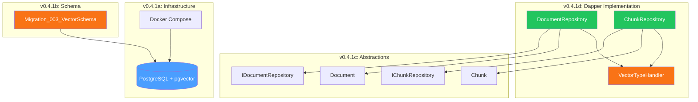
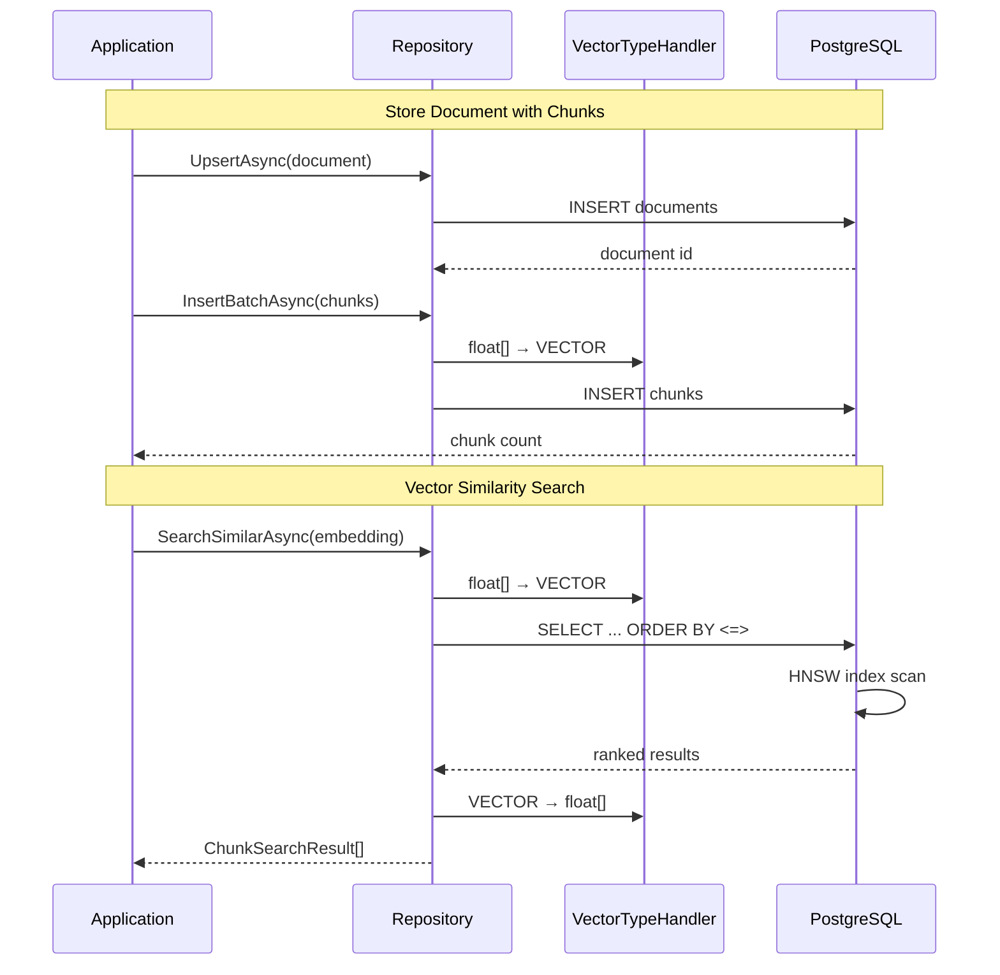

# LCS-DES-041: Design Specification Index — The Vector Foundation

## Document Control

| Field | Value |
| :--- | :--- |
| **Document ID** | LCS-DES-041-INDEX |
| **Feature ID** | RAG-041 |
| **Feature Name** | The Vector Foundation (pgvector Setup) |
| **Target Version** | v0.4.1 |
| **Module Scope** | Lexichord.Modules.RAG |
| **Swimlane** | Memory |
| **License Tier** | Core |
| **Feature Gate Key** | `FeatureFlags.RAG.VectorStorage` |
| **Status** | Draft |
| **Last Updated** | 2026-01-27 |

---

## 1. Executive Summary

**v0.4.1** delivers the **Vector Foundation** — the database infrastructure required for semantic search and retrieval-augmented generation (RAG). This release extends PostgreSQL with pgvector support, establishing the groundwork for AI-powered document retrieval.

### 1.1 The Problem

Lexichord needs to store and search document content semantically, not just through keyword matching. Traditional full-text search cannot understand that "vehicle" and "automobile" are related concepts, nor can it find passages that discuss a topic without using specific keywords.

### 1.2 The Solution

Implement PostgreSQL vector storage using pgvector:

- **pgvector Extension** — Enable high-dimensional vector storage in PostgreSQL
- **Schema Migration** — Create `documents` and `chunks` tables with HNSW index
- **Repository Abstractions** — Define `IDocumentRepository` and `IChunkRepository` interfaces
- **Dapper Implementation** — Implement repositories with vector type mapping

### 1.3 Business Value

| Value | Description |
| :--- | :--- |
| **Semantic Search Foundation** | Enable "find similar passages" features |
| **RAG Infrastructure** | Provide storage for AI-augmented writing |
| **Scalable Architecture** | HNSW indexing supports thousands of documents |
| **Industry Standard** | PostgreSQL + pgvector is proven and cost-effective |
| **Foundation** | Enables v0.4.2-v0.4.6 RAG features |

---

## 2. Related Documents

### 2.1 Scope Breakdown Document

The detailed scope breakdown for v0.4.1, including all sub-parts, implementation checklists, user stories, and acceptance criteria:

| Document | Description |
| :--- | :--- |
| **[LCS-SBD-041](./LCS-SBD-041.md)** | Scope Breakdown — The Vector Foundation |

### 2.2 Sub-Part Design Specifications

Each sub-part has its own detailed design specification following the LDS-01 template:

| Sub-Part | Document | Title | Description |
| :--- | :--- | :--- | :--- |
| v0.4.1a | **[LCS-DES-041a](./LCS-DES-041a.md)** | pgvector Extension | Docker configuration with pgvector |
| v0.4.1b | **[LCS-DES-041b](./LCS-DES-041b.md)** | Schema Migration | FluentMigrator tables and indexes |
| v0.4.1c | **[LCS-DES-041c](./LCS-DES-041c.md)** | Repository Abstractions | IDocumentRepository, IChunkRepository |
| v0.4.1d | **[LCS-DES-041d](./LCS-DES-041d.md)** | Dapper Implementation | Repository implementations with pgvector |

---

## 3. Architecture Overview

### 3.1 Component Diagram



### 3.2 Data Flow



---

## 4. Dependencies

### 4.1 Upstream Dependencies (Required)

| Interface | Source Version | Purpose |
| :--- | :--- | :--- |
| `IDbConnectionFactory` | v0.0.5b | PostgreSQL connection creation |
| `FluentMigrator` | v0.0.5c | Schema migration execution |
| `Polly` | v0.0.5d | Retry policies for database operations |
| `IConfigurationService` | v0.0.3d | Connection string configuration |

### 4.2 NuGet Packages

| Package | Version | Purpose |
| :--- | :--- | :--- |
| `Npgsql` | 9.0.x | PostgreSQL driver |
| `Npgsql.Pgvector` | 0.2.x | pgvector type mapping |
| `Dapper` | 2.1.x | Micro-ORM |
| `FluentMigrator` | 6.2.x | Schema migrations |

### 4.3 Downstream Consumers (Future)

| Version | Feature | Consumes |
| :--- | :--- | :--- |
| v0.4.2 | File Ingestion Pipeline | `IDocumentRepository` for file tracking |
| v0.4.3 | Chunking Strategies | `IChunkRepository` for chunk storage |
| v0.4.4 | Vector Generation | `IChunkRepository.UpdateEmbeddingAsync` |
| v0.4.5 | Semantic Search | `IChunkRepository.SearchSimilarAsync` |

---

## 5. License Gating Strategy

The Vector Foundation is **Core** infrastructure using a **No Gate** strategy.

### 5.1 Behavior by License Tier

| Tier | Database Access | Repository Methods | Notes |
| :--- | :--- | :--- | :--- |
| Core | Full | All CRUD operations | Schema is available |
| Writer Pro | Full | All + Search | Search gated at v0.4.5 |
| Teams | Full | All + Search | Same as Writer Pro |
| Enterprise | Full | All + Search | Same as Writer Pro |

### 5.2 Gating Location

License gating for semantic search occurs at the service layer (v0.4.5), not at the repository layer. Repositories are infrastructure and always accessible.

---

## 6. Database Schema

### 6.1 Documents Table

```sql
CREATE TABLE documents (
    id UUID PRIMARY KEY DEFAULT gen_random_uuid(),
    file_path TEXT NOT NULL UNIQUE,
    file_hash TEXT NOT NULL,
    title TEXT,
    file_size BIGINT NOT NULL DEFAULT 0,
    last_modified TIMESTAMP WITH TIME ZONE,
    indexed_at TIMESTAMP WITH TIME ZONE DEFAULT CURRENT_TIMESTAMP,
    chunk_count INTEGER NOT NULL DEFAULT 0,
    status TEXT NOT NULL DEFAULT 'pending',
    error_message TEXT,
    metadata JSONB
);
```

### 6.2 Chunks Table

```sql
CREATE TABLE chunks (
    id UUID PRIMARY KEY DEFAULT gen_random_uuid(),
    document_id UUID NOT NULL REFERENCES documents(id) ON DELETE CASCADE,
    content TEXT NOT NULL,
    chunk_index INTEGER NOT NULL,
    start_offset INTEGER NOT NULL,
    end_offset INTEGER NOT NULL,
    embedding VECTOR(1536),
    heading TEXT,
    heading_level INTEGER,
    metadata JSONB,
    created_at TIMESTAMP WITH TIME ZONE DEFAULT CURRENT_TIMESTAMP,
    UNIQUE(document_id, chunk_index)
);
```

### 6.3 HNSW Index

```sql
CREATE INDEX idx_chunks_embedding_hnsw ON chunks
USING hnsw (embedding vector_cosine_ops)
WITH (m = 16, ef_construction = 64);
```

---

## 7. Key Interfaces Summary

| Interface | Defined In | Purpose |
| :--- | :--- | :--- |
| `IDocumentRepository` | v0.4.1c | Document CRUD operations |
| `IChunkRepository` | v0.4.1c | Chunk storage and vector search |

| Record/DTO | Defined In | Purpose |
| :--- | :--- | :--- |
| `Document` | v0.4.1c | Indexed document entity |
| `Chunk` | v0.4.1c | Text chunk with embedding |
| `ChunkSearchResult` | v0.4.1c | Search result with score |
| `DocumentStatus` | v0.4.1c | Indexing status enum |

---

## 8. Implementation Checklist Summary

| Sub-Part | Tasks | Est. Hours |
| :--- | :--- | :--- |
| v0.4.1a | Docker pgvector setup | 3.5 |
| v0.4.1b | Schema migration | 5 |
| v0.4.1c | Repository abstractions | 4 |
| v0.4.1d | Dapper implementation | 13 |
| Integration | Testing and registration | 1.5 |
| **Total** | | **27 hours** |

See [LCS-SBD-041](./LCS-SBD-041.md) Section 4 for the detailed task breakdown.

---

## 9. Success Criteria Summary

| Category | Criterion | Target |
| :--- | :--- | :--- |
| **Infrastructure** | pgvector extension enabled | Container passes health check |
| **Migration** | Schema created | Tables and indexes exist |
| **Performance** | Document insert | < 10ms |
| **Performance** | Chunk batch insert (100) | < 500ms |
| **Performance** | Vector search (10K chunks) | < 200ms |
| **Accuracy** | Vector type mapping | float[] ↔ VECTOR works |

See [LCS-SBD-041](./LCS-SBD-041.md) Section 9 for full success metrics.

---

## 10. Test Coverage Summary

| Sub-Part | Unit Tests | Integration Tests |
| :--- | :--- | :--- |
| v0.4.1a | Extension verification | Container health check |
| v0.4.1b | Migration up/down | Schema existence |
| v0.4.1c | Interface contracts | - |
| v0.4.1d | Type handler, CRUD | Full PostgreSQL tests |

See individual design specs for detailed test scenarios.

---

## 11. What This Enables

| Version | Feature | Uses From v0.4.1 |
| :--- | :--- | :--- |
| v0.4.2 | File Ingestion Pipeline | `IDocumentRepository` for tracking files |
| v0.4.3 | Chunking Strategies | `IChunkRepository` for storing chunks |
| v0.4.4 | Vector Generation | `Chunk.Embedding` column for vectors |
| v0.4.5 | Semantic Search | `SearchSimilarAsync` with HNSW index |
| v0.4.6 | Reference Panel | Search results display |
| v0.4.7 | Index Manager | Document status management |

---

## Document History

| Version | Date | Author | Changes |
| :--- | :--- | :--- | :--- |
| 1.0 | 2026-01-27 | Lead Architect | Initial draft |
